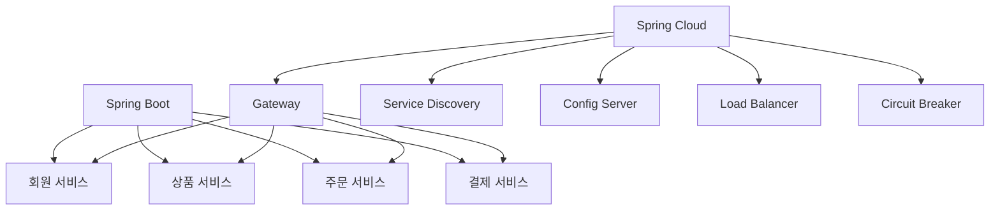
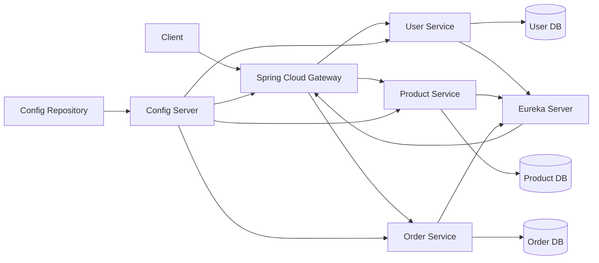
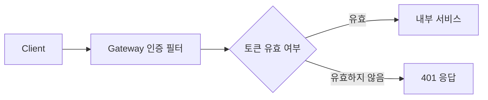
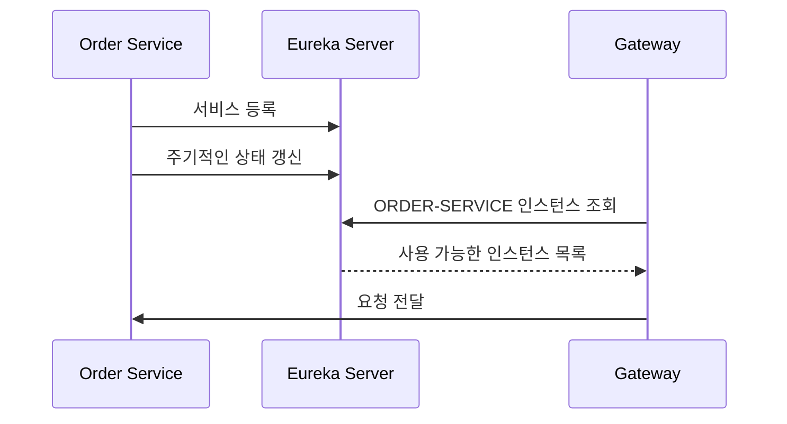
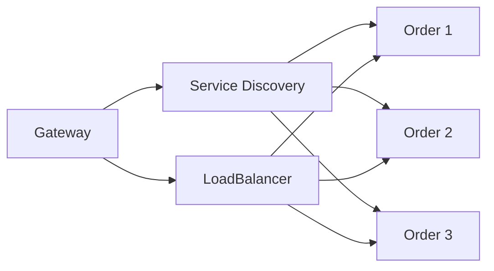
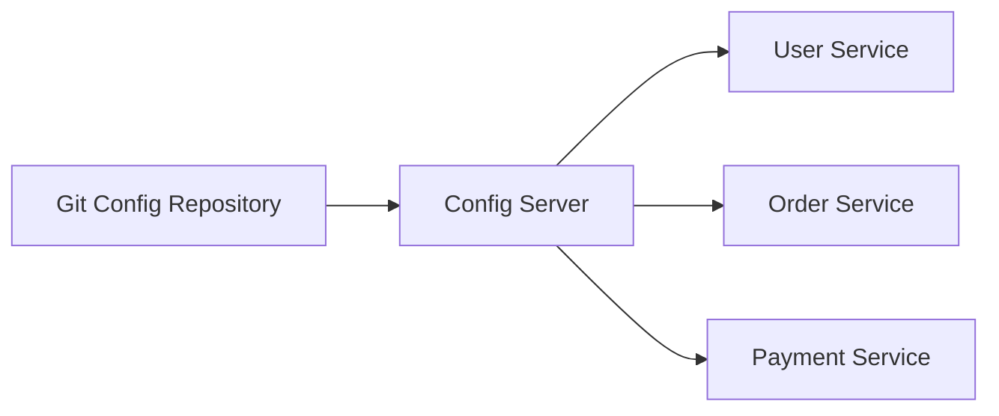
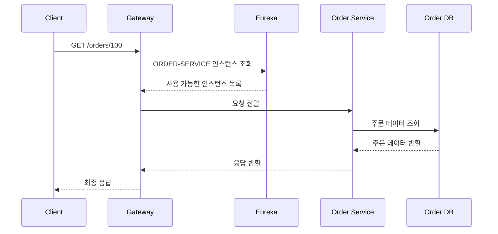
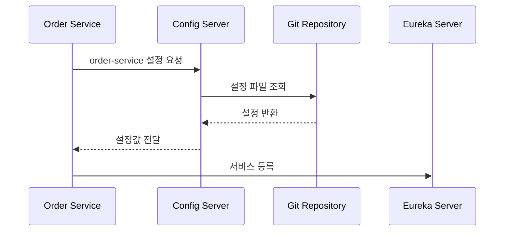

# 스프링 클라우드 MSA 2 - 스프링에서 MSA
[https://youtu.be/VoonWkCJxcQ?si=Zvx4MjWFmti5WIF8](https://youtu.be/VoonWkCJxcQ?si=Zvx4MjWFmti5WIF8)
# 스프링 클라우드 MSA 2 - 스프링에서 MSA
* toc
{:toc}

---

## Spring Cloud로 MSA를 구축하는 핵심 구조와 구성 요소

Spring Cloud는 Spring Boot 기반 애플리케이션으로 분산 시스템과 마이크로서비스 아키텍처를 구축할 때 필요한 여러 기능을 제공하는 프로젝트 모음이다.

MSA를 구성하면 하나의 애플리케이션이 여러 개의 독립적인 서비스로 나뉜다.

서비스가 분리되면 다음과 같은 문제가 새롭게 발생한다.

```text
사용자의 요청을 어느 서비스로 전달할 것인가?
실행 중인 서비스의 주소를 어떻게 찾을 것인가?
서비스가 여러 대로 증가하면 요청을 어떻게 분산할 것인가?
수십 개 서비스의 설정값을 어떻게 관리할 것인가?
일부 서비스가 중단되면 어떻게 대응할 것인가?
```

Spring Cloud는 이러한 분산 시스템의 공통 문제를 해결하기 위한 기능을 제공한다.

핵심은 다음과 같다.

> Spring Cloud는 MSA 자체를 만들어주는 기술이 아니라, MSA를 운영하면서 발생하는 라우팅, 서비스 탐색, 설정 관리, 로드 밸런싱, 장애 대응 문제를 해결하도록 도와주는 도구 모음이다.

---

## Spring Cloud와 Spring Boot의 관계

Spring Boot와 Spring Cloud는 역할이 다르다.

Spring Boot는 개별 애플리케이션을 빠르게 개발하고 실행하기 위한 기반을 제공한다.

```text
회원 서비스
주문 서비스
결제 서비스
상품 서비스
```

각각의 서비스는 Spring Boot 애플리케이션으로 구현할 수 있다.

Spring Cloud는 이렇게 분리된 여러 Spring Boot 애플리케이션을 하나의 분산 시스템으로 연결하고 관리하도록 도와준다.

```text
Spring Boot
→ 개별 마이크로서비스 개발

Spring Cloud
→ 여러 마이크로서비스 연결과 운영
```

둘의 관계를 구조로 표현하면 다음과 같다.



---

## 기본적인 Spring Cloud MSA 구조

Spring Cloud 기반의 MSA는 일반적으로 다음과 같은 구조를 가진다.



구성 요소를 크게 나누면 다음과 같다.

```text
Spring Cloud Gateway
Eureka Server
Eureka Client
Spring Cloud Config Server
Config Repository
Config Client
각각의 비즈니스 서비스
```

---

## 각각의 비즈니스 서비스

MSA에서 실제 비즈니스 로직은 여러 개의 독립적인 Spring Boot 애플리케이션으로 분리된다.

예를 들어 다음과 같이 구성할 수 있다.

```text
User Service
- 회원가입
- 로그인
- 회원 정보 조회

Product Service
- 상품 등록
- 상품 조회
- 재고 조회

Order Service
- 주문 생성
- 주문 취소
- 주문 이력 조회
```

모놀리식에서는 하나의 애플리케이션이 모든 URL을 처리한다.

```text
/users
/products
/orders
/payments
```

MSA에서는 각 서비스가 자신의 기능과 관련된 URL만 처리한다.

```text
User Service
→ /users/**

Product Service
→ /products/**

Order Service
→ /orders/**
```

서비스를 분리하면 각 서비스는 독립적으로 배포하고 확장할 수 있다.

---

## Spring Cloud Gateway

Spring Cloud Gateway는 외부 요청을 받아 적절한 내부 서비스로 전달하는 API Gateway다.

사용자는 내부에 어떤 서비스가 존재하는지 알 필요가 없다.

다음 주소로 요청한다고 가정해보자.

```text
https://api.example.com/users/1
```

Gateway는 `/users/**` 경로를 확인한 뒤 User Service로 요청을 전달한다.

```text
Client
→ API Gateway
→ User Service
```

주문 요청은 Order Service로 전달한다.

```text
https://api.example.com/orders/100
```

```text
Client
→ API Gateway
→ Order Service
```

---

## Gateway의 주요 역할

Spring Cloud Gateway는 단순한 URL 전달기 이상의 역할을 수행할 수 있다.

```text
요청 라우팅
인증 및 인가
CORS 처리
요청과 응답 로깅
Rate Limiting
Header 추가와 변경
URI 재작성
Circuit Breaker 연동
공통 필터 처리
```

예를 들어 인증 토큰 검증을 각 서비스에서 반복하지 않고 Gateway에서 공통으로 처리할 수 있다.



다만 모든 비즈니스 권한 검사를 Gateway에서 처리하면 안 된다.

Gateway는 공통 인증과 1차 검증을 수행하고, 실제 도메인 권한은 각 서비스에서 다시 검사하는 것이 안전하다.

---

## Gateway 라우팅 설정 예시

다음은 `application.yml`에 정적으로 라우팅을 설정한 예시다.

```yaml
server:
  port: 8000

spring:
  application:
    name: api-gateway

  cloud:
    gateway:
      routes:
        - id: user-service
          uri: http://localhost:8081
          predicates:
            - Path=/users/**

        - id: product-service
          uri: http://localhost:8082
          predicates:
            - Path=/products/**

        - id: order-service
          uri: http://localhost:8083
          predicates:
            - Path=/orders/**
```

각 설정의 의미는 다음과 같다.

| 설정           | 역할             |
| ------------ | -------------- |
| `id`         | 라우트 식별자        |
| `uri`        | 요청을 전달할 서비스 주소 |
| `predicates` | 라우팅 조건         |
| `Path`       | 요청 URL 경로 조건   |

이 방식은 서비스 주소가 고정되어 있을 때 사용할 수 있다.

하지만 MSA에서는 서비스 인스턴스의 주소가 동적으로 바뀔 수 있다.

이 문제를 해결하기 위해 Service Discovery가 필요하다.

---

## Service Discovery란 무엇인가?

MSA 환경에서는 하나의 서비스가 여러 인스턴스로 실행될 수 있다.

```text
order-service-1 → 10.0.1.10:8080
order-service-2 → 10.0.1.11:8080
order-service-3 → 10.0.1.12:8080
```

트래픽이 증가하면 인스턴스가 추가될 수 있다.

```text
order-service-4 → 10.0.1.13:8080
```

반대로 부하가 감소하거나 장애가 발생하면 일부 인스턴스가 사라질 수 있다.

이처럼 서비스 주소가 계속 바뀌는 환경에서 Gateway가 모든 IP와 포트를 직접 관리하는 것은 어렵다.

Service Discovery는 실행 중인 서비스의 위치를 등록하고 조회하도록 도와준다.

---

## Eureka Server

Eureka Server는 서비스 레지스트리 역할을 한다.

각 마이크로서비스는 자신의 정보를 Eureka Server에 등록한다.

```text
서비스 이름
IP 주소
Port
상태
인스턴스 식별자
```

예를 들어 Order Service 인스턴스가 세 개 실행 중이라면 Eureka에는 다음과 같은 정보가 등록될 수 있다.

```text
ORDER-SERVICE
- 10.0.1.10:8080
- 10.0.1.11:8080
- 10.0.1.12:8080
```

Gateway나 다른 서비스는 Eureka를 통해 현재 사용 가능한 Order Service의 목록을 조회할 수 있다.

---

## Eureka는 모니터링 서버인가?

Eureka 화면에서는 등록된 서비스 목록과 상태를 확인할 수 있다.

이 때문에 Eureka를 모니터링 서버라고 이해하기 쉽다.

하지만 Eureka의 핵심 역할은 모니터링이 아니라 Service Registry다.

```text
핵심 역할
→ 서비스 등록과 탐색

부가적으로 확인 가능한 정보
→ 등록된 인스턴스 목록과 상태
```

CPU, Memory, 응답 시간, 오류율 같은 운영 지표를 수집하는 전문 모니터링 도구는 아니다.

실제 모니터링에는 다음과 같은 도구를 사용한다.

```text
Spring Boot Actuator
Prometheus
Grafana
Datadog
CloudWatch
```

---

## Eureka Client

Eureka Server에 자신을 등록하는 애플리케이션을 Eureka Client라고 한다.

다음 서비스가 모두 Eureka Client가 될 수 있다.

```text
API Gateway
User Service
Product Service
Order Service
Payment Service
```

각 서비스는 실행되면서 Eureka Server에 자신을 등록한다.



---

## Eureka Server 구성 예시

의존성을 추가한다.

```gradle
dependencies {
    implementation 'org.springframework.cloud:spring-cloud-starter-netflix-eureka-server'
}
```

메인 클래스에 Eureka Server를 활성화한다.

```java
package com.example.eureka;

import org.springframework.boot.SpringApplication;
import org.springframework.boot.autoconfigure.SpringBootApplication;
import org.springframework.cloud.netflix.eureka.server.EnableEurekaServer;

@EnableEurekaServer
@SpringBootApplication
public class EurekaServerApplication {

    public static void main(String[] args) {
        SpringApplication.run(
                EurekaServerApplication.class,
                args
        );
    }
}
```

설정 파일은 다음과 같이 작성할 수 있다.

```yaml
server:
  port: 8761

spring:
  application:
    name: discovery-service

eureka:
  client:
    register-with-eureka: false
    fetch-registry: false
```

`register-with-eureka`는 Eureka Server 자신을 다른 Eureka Server에 등록할지 여부다.

`fetch-registry`는 다른 Eureka Server의 Registry 정보를 가져올지 여부다.

단일 Eureka Server 실습에서는 두 값을 `false`로 설정할 수 있다.

---

## Eureka Client 구성 예시

서비스 쪽에는 Eureka Client 의존성을 추가한다.

```gradle
dependencies {
    implementation 'org.springframework.cloud:spring-cloud-starter-netflix-eureka-client'
}
```

설정 파일에는 서비스 이름과 Eureka Server 주소를 작성한다.

```yaml
server:
  port: 0

spring:
  application:
    name: order-service

eureka:
  client:
    service-url:
      defaultZone: http://localhost:8761/eureka
```

`server.port: 0`을 사용하면 실행할 때 사용 가능한 임의의 포트를 할당받을 수 있다.

서비스는 `order-service`라는 이름으로 Eureka에 등록된다.

---

## Gateway와 Eureka 연동

Gateway가 Eureka에서 서비스 위치를 조회하려면 실제 IP 대신 서비스 이름을 사용한다.

```yaml
spring:
  application:
    name: api-gateway

  cloud:
    gateway:
      routes:
        - id: order-service
          uri: lb://ORDER-SERVICE
          predicates:
            - Path=/orders/**
```

`lb://`는 Load Balancer를 통해 서비스 인스턴스를 선택하겠다는 의미다.

```text
lb://ORDER-SERVICE
```

Gateway는 다음 과정을 수행한다.

```text
1. Eureka에서 ORDER-SERVICE 인스턴스 조회
2. 사용 가능한 인스턴스 목록 확인
3. Load Balancer로 하나의 인스턴스 선택
4. 요청 전달
```

---

## 로드 밸런싱

하나의 서비스가 여러 인스턴스로 실행 중이라면 요청을 분산해야 한다.

```text
Order Service 1
Order Service 2
Order Service 3
```

Spring Cloud LoadBalancer는 사용 가능한 인스턴스 중 하나를 선택한다.

기본적인 흐름은 다음과 같다.



과거에는 Netflix Ribbon이 많이 사용되었지만, 현재 Spring Cloud에서는 Spring Cloud LoadBalancer가 일반적으로 사용된다.

---

## Spring Cloud Config

서비스가 많아지면 각 애플리케이션의 설정을 개별적으로 관리하기 어려워진다.

예를 들어 서비스가 50개 있고 DB 비밀번호가 변경되었다고 가정해보자.

설정이 각 프로젝트 안에 있다면 여러 저장소와 서버의 설정을 일일이 수정해야 한다.

Spring Cloud Config는 설정값을 중앙에서 관리하도록 도와준다.

주요 구성 요소는 다음과 같다.

```text
Config Repository
Config Server
Config Client
```

---

## Config Repository

Config Repository는 실제 설정 파일이 저장되는 공간이다.

일반적으로 Git Repository를 사용한다.

```text
config-repository
├── application.yml
├── user-service.yml
├── order-service.yml
├── payment-service.yml
└── api-gateway.yml
```

공통 설정은 `application.yml`에 작성할 수 있다.

```yaml
logging:
  level:
    root: INFO
```

서비스별 설정은 서비스 이름에 맞는 파일에 작성한다.

```yaml
spring:
  datasource:
    url: jdbc:mysql://localhost:3306/order
    username: order_user
    password: order_password
```

---

## Config Server

Config Server는 Config Repository에서 설정을 읽어 각 서비스에 전달하는 역할을 한다.

Config Server가 반드시 모든 값을 직접 가지고 있는 것은 아니다.

실제 설정은 Git이나 별도의 저장소에 있고, Config Server는 이를 읽어 제공하는 중간 서버 역할을 한다.



---

## Config Server 생성 예시

의존성을 추가한다.

```gradle
dependencies {
    implementation 'org.springframework.cloud:spring-cloud-config-server'
}
```

메인 클래스에 Config Server를 활성화한다.

```java
package com.example.config;

import org.springframework.boot.SpringApplication;
import org.springframework.boot.autoconfigure.SpringBootApplication;
import org.springframework.cloud.config.server.EnableConfigServer;

@EnableConfigServer
@SpringBootApplication
public class ConfigServerApplication {

    public static void main(String[] args) {
        SpringApplication.run(
                ConfigServerApplication.class,
                args
        );
    }
}
```

설정 파일에서 Git Repository 주소를 지정한다.

```yaml
server:
  port: 8888

spring:
  application:
    name: config-server

  cloud:
    config:
      server:
        git:
          uri: https://github.com/example/config-repository
          default-label: main
```

---

## Config Client

Config Server로부터 설정값을 가져오는 Spring Boot 애플리케이션을 Config Client라고 한다.

다음 애플리케이션들이 Config Client가 될 수 있다.

```text
API Gateway
User Service
Order Service
Payment Service
```

Config Client 의존성을 추가한다.

```gradle
dependencies {
    implementation 'org.springframework.cloud:spring-cloud-starter-config'
}
```

Config Server 주소를 설정한다.

```yaml
spring:
  application:
    name: order-service

  config:
    import: optional:configserver:http://localhost:8888
```

`spring.application.name`은 Config Repository에서 어떤 설정 파일을 가져올지 결정하는 중요한 값이다.

```text
spring.application.name=order-service
```

라면 다음 설정 파일을 조회할 수 있다.

```text
order-service.yml
order-service-dev.yml
order-service-prod.yml
```

---

## Config Server 요청 규칙

Config Server는 일반적으로 다음 형식으로 설정을 제공한다.

```text
/{application}/{profile}
/{application}/{profile}/{label}
```

예를 들면 다음과 같다.

```text
/order-service/default
/order-service/dev
/order-service/prod/main
```

각 값의 의미는 다음과 같다.

| 값             | 의미                  |
| ------------- | ------------------- |
| `application` | 서비스 이름              |
| `profile`     | 실행 환경               |
| `label`       | Git Branch 또는 Label |

이를 통해 개발, 테스트, 운영 설정을 분리할 수 있다.

---

## Git 설정을 바꾸면 모든 서비스에 즉시 반영될까?

Config Repository의 파일을 변경했다고 해서 실행 중인 모든 서비스의 설정이 자동으로 즉시 바뀌는 것은 아니다.

기본적으로 서비스는 시작할 때 Config Server에서 설정을 가져온다.

실행 중 설정을 갱신하려면 별도의 갱신 방식이 필요하다.

대표적인 방법은 다음과 같다.

```text
애플리케이션 재시작
Actuator refresh
Spring Cloud Bus
외부 배포 자동화
Kubernetes ConfigMap 갱신
```

단일 인스턴스에서 수동으로 갱신하려면 Actuator의 refresh 기능을 사용할 수 있다.

```gradle
implementation 'org.springframework.boot:spring-boot-starter-actuator'
```

```yaml
management:
  endpoints:
    web:
      exposure:
        include: refresh
```

변경 가능한 Bean에는 `@RefreshScope`를 적용할 수 있다.

```java
package com.example.order.config;

import org.springframework.beans.factory.annotation.Value;
import org.springframework.cloud.context.config.annotation.RefreshScope;
import org.springframework.stereotype.Component;

@RefreshScope
@Component
public class OrderMessageProperties {

    private final String message;

    public OrderMessageProperties(
            @Value("${order.message}")
            String message
    ) {
        this.message = message;
    }

    public String getMessage() {
        return message;
    }
}
```

다만 운영 환경에서 refresh 엔드포인트를 외부에 그대로 노출하면 보안 문제가 발생할 수 있으므로 접근 제어가 필요하다.

---

## Config Server와 비밀값 관리

Config Repository에 DB 비밀번호, API Key, Token을 평문으로 저장하는 것은 위험하다.

다음 값은 일반 설정과 분리하는 것이 좋다.

```text
DB Password
JWT Secret
외부 API Key
인증서
OAuth Client Secret
```

민감 정보는 다음 도구를 사용할 수 있다.

```text
HashiCorp Vault
AWS Secrets Manager
AWS Systems Manager Parameter Store
Kubernetes Secret
Azure Key Vault
Google Secret Manager
```

Config Server는 일반 설정 중앙화에 유용하지만, 모든 비밀값 관리 문제를 대신 해결하는 것은 아니다.

---

## 전체 요청 처리 흐름

사용자가 주문 정보를 요청한다고 가정해보자.

```text
GET /orders/100
```

전체 흐름은 다음과 같다.



서비스 실행 시 설정을 가져오는 흐름은 다음과 같다.



---

## Spring Cloud 구성 요소 정리

| 구성 요소                     | 역할                    |
| ------------------------- | --------------------- |
| Spring Boot Service       | 실제 비즈니스 로직 처리         |
| Spring Cloud Gateway      | 외부 요청 진입점과 라우팅        |
| Eureka Server             | 서비스 등록소               |
| Eureka Client             | 자신의 위치를 Eureka에 등록    |
| Spring Cloud LoadBalancer | 서비스 인스턴스 선택           |
| Config Server             | 중앙 설정 제공              |
| Config Repository         | 실제 설정 파일 저장           |
| Config Client             | Config Server에서 설정 조회 |

---

## 실무에서 추가로 필요한 구성 요소

Gateway, Eureka, Config Server만으로 기본적인 구조는 만들 수 있다.

하지만 실제 운영 환경에서는 다음 기능도 필요하다.

```text
인증과 인가
중앙 로그
메트릭 수집
분산 추적
Circuit Breaker
Timeout
Retry
Message Broker
배포 자동화
Container Orchestration
```

---

## Circuit Breaker

서비스 간 호출에서 상대 서비스가 계속 실패하면 요청을 무한히 전달해서는 안 된다.

Circuit Breaker는 실패가 일정 기준을 넘으면 호출을 일시적으로 차단한다.

```text
정상 상태
→ 요청 전달

실패 누적
→ Circuit Open

일정 시간 경과
→ 일부 요청으로 복구 확인
```

Spring 환경에서는 Resilience4j를 사용할 수 있다.

---

## Timeout과 Retry

서비스 호출에는 반드시 Timeout이 필요하다.

Timeout이 없으면 응답하지 않는 서비스 때문에 호출 스레드가 장시간 점유될 수 있다.

```text
연결 Timeout
읽기 Timeout
전체 요청 Timeout
```

Retry는 일시적인 네트워크 오류를 해결할 수 있지만 모든 요청에 적용해서는 안 된다.

특히 결제나 주문 생성과 같은 요청을 재시도할 때는 멱등성이 보장되어야 한다.

---

## 중앙 로그와 분산 추적

MSA에서는 하나의 요청이 여러 서비스를 통과한다.

```text
Gateway
→ Order Service
→ Payment Service
→ Notification Service
```

각 서비스의 로그를 따로 확인하면 전체 흐름을 찾기 어렵다.

로그에는 다음 식별자를 포함하는 것이 좋다.

```text
traceId
spanId
requestId
orderId
userId
```

분산 추적에는 다음 도구를 활용할 수 있다.

```text
OpenTelemetry
Zipkin
Jaeger
Tempo
```

---

## Kubernetes 환경에서는 Eureka가 반드시 필요할까?

Kubernetes는 Service와 DNS를 통해 자체적인 서비스 탐색 기능을 제공한다.

```text
order-service.default.svc.cluster.local
```

따라서 Kubernetes 환경에서는 Eureka를 사용하지 않고 Kubernetes Service Discovery를 사용하는 경우가 많다.

```text
전통적인 Spring Cloud 환경
→ Eureka 사용 가능

Kubernetes 환경
→ Kubernetes Service와 DNS 활용 가능
```

Eureka는 Spring Cloud 기반 MSA에서 사용할 수 있는 선택지이지 모든 환경의 필수 요소는 아니다.

---

## Config Server가 반드시 필요할까?

설정 중앙화가 필요하더라도 Config Server가 유일한 방법은 아니다.

환경에 따라 다음 방식을 사용할 수 있다.

```text
Spring Cloud Config
Kubernetes ConfigMap
AWS Parameter Store
AWS AppConfig
Consul
Vault
환경 변수
```

운영 환경과 배포 플랫폼에 적합한 방식을 선택해야 한다.

---

## Spring Cloud를 도입할 때 주의할 점

Spring Cloud 구성 요소를 많이 추가한다고 해서 좋은 MSA가 되는 것은 아니다.

다음과 같은 문제가 생길 수 있다.

```text
인프라 애플리케이션 증가
운영 복잡도 증가
장애 지점 증가
버전 호환성 관리
배포 파이프라인 증가
모니터링 대상 증가
```

Spring Boot와 Spring Cloud 버전의 호환성도 중요하다.

Spring Cloud 의존성은 BOM으로 관리하는 것이 좋다.

```gradle
ext {
    set('springCloudVersion', "사용 중인 Spring Boot와 호환되는 버전")
}

dependencyManagement {
    imports {
        mavenBom "org.springframework.cloud:spring-cloud-dependencies:${springCloudVersion}"
    }
}
```

Spring Boot 버전을 올릴 때는 Spring Cloud Release Train의 호환 여부도 함께 확인해야 한다.

---

## 최소 구성부터 시작하기

처음부터 모든 Spring Cloud 구성 요소를 도입할 필요는 없다.

서비스 규모와 운영 환경에 따라 단계적으로 적용하는 것이 좋다.

```text
1단계
Spring Boot 서비스 분리

2단계
API Gateway 구성

3단계
서비스 탐색 또는 플랫폼 DNS 적용

4단계
중앙 설정 관리

5단계
Circuit Breaker와 Timeout 적용

6단계
중앙 로그와 분산 추적

7단계
메시지 기반 비동기 통신
```

필요한 문제를 먼저 확인하고 그 문제를 해결하는 기술을 선택해야 한다.

---

## 정리

Spring Cloud는 여러 Spring Boot 애플리케이션을 연결하여 MSA를 구축할 때 발생하는 공통적인 분산 시스템 문제를 해결하도록 도와준다.

기본적인 구조는 다음과 같다.

```text
Client
→ Spring Cloud Gateway
→ Service Discovery
→ 개별 Spring Boot Service
```

설정 관리 구조는 다음과 같다.

```text
Config Repository
→ Config Server
→ Config Client
```

각 구성 요소의 핵심 역할은 다음과 같다.

```text
Gateway
→ 요청 라우팅과 공통 필터

Eureka Server
→ 서비스 등록과 탐색

Eureka Client
→ 자신의 실행 위치 등록

Load Balancer
→ 여러 인스턴스 중 하나 선택

Config Server
→ 중앙 설정 제공

Config Repository
→ 설정 파일 저장
```

다만 Eureka는 전문 모니터링 서버가 아니며, Config Repository의 수정 사항도 별도 갱신 과정 없이 실행 중인 모든 서비스에 즉시 반영되지는 않는다.

실제 운영 환경에서는 Gateway, Discovery, Config Server뿐 아니라 Timeout, Circuit Breaker, 로그 수집, 분산 추적, 보안, 배포 자동화까지 함께 설계해야 한다.

### 한 줄 요약

Spring Cloud MSA의 핵심은 Gateway로 요청을 분배하고, Service Discovery로 실행 중인 서비스를 찾으며, Config Server로 설정을 중앙 관리하여 여러 Spring Boot 서비스를 하나의 분산 시스템으로 운영하는 것이다.

