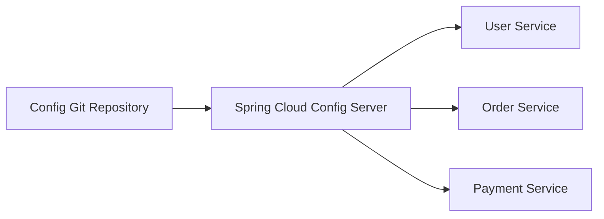
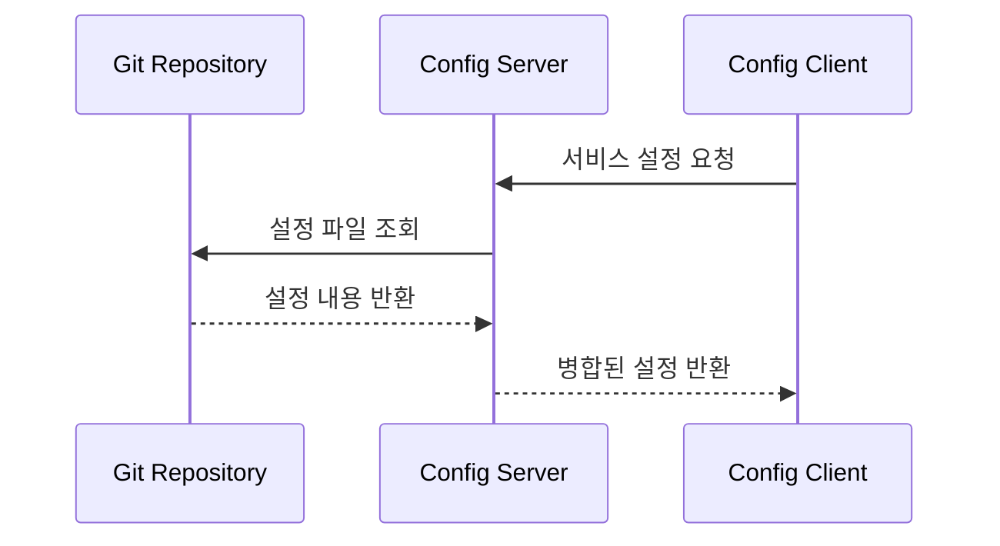
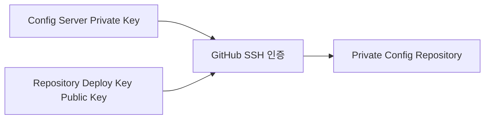
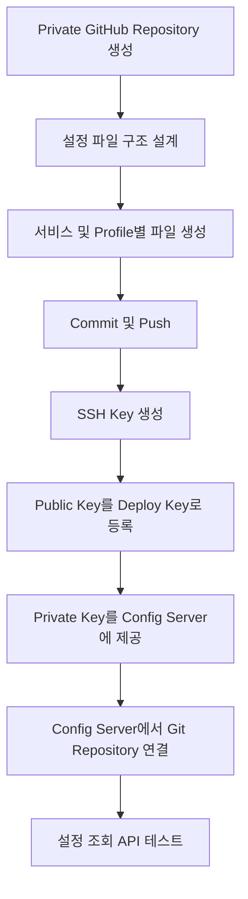

# 스프링 클라우드 MSA 3 - Config 깃허브 리포지토리 생성
[https://youtu.be/2EVLFqleV7w?si=z1VOdDivrEioJuPG](https://youtu.be/2EVLFqleV7w?si=z1VOdDivrEioJuPG)

# 스프링 클라우드 MSA 3 - Config 깃허브 리포지토리 생성
* toc
{:toc}

---

## Spring Cloud Config Repository를 GitHub에 구성하는 방법

Spring Cloud Config는 여러 마이크로서비스의 설정 정보를 중앙에서 관리하기 위한 기능을 제공한다.

MSA 환경에서는 회원 서비스, 주문 서비스, 결제 서비스, 알림 서비스처럼 여러 개의 Spring Boot 애플리케이션이 독립적으로 실행된다.

각 서비스가 자신의 프로젝트 내부에 설정을 따로 가지고 있으면 다음과 같은 문제가 발생한다.

```text
DB 주소 변경 시 여러 프로젝트를 수정해야 함
환경별 설정이 각 저장소에 분산됨
설정 변경 이력을 한눈에 확인하기 어려움
잘못된 설정이 서비스마다 다르게 반영될 수 있음
운영 설정 롤백이 복잡함
```

이 문제를 해결하기 위해 설정 파일을 별도의 저장소에 모으고, Config Server가 해당 저장소에서 설정을 읽어 각 서비스에 전달하도록 구성한다.

전체 구조는 다음과 같다.



핵심은 다음과 같다.

> Config Repository는 실제 설정 파일을 저장하고 버전 관리하는 저장소이며, Config Server는 해당 저장소에서 설정을 읽어 각 Config Client에게 전달하는 중간 서버다.

---

## Spring Cloud Config의 전체 구조

Spring Cloud Config는 크게 세 가지 요소로 구성된다.

```text
Config Repository
Config Server
Config Client
```

각 구성 요소의 역할은 다음과 같다.

| 구성 요소             | 역할                                 |
| ----------------- | ---------------------------------- |
| Config Repository | 실제 설정 파일 저장                        |
| Config Server     | 설정 파일을 읽어 API 형태로 제공               |
| Config Client     | Config Server에서 설정을 받아 사용하는 애플리케이션 |

전체 흐름은 다음과 같다.



예를 들어 `order-service`가 `dev` 환경으로 실행된다면 다음과 같은 흐름이 발생한다.

```text
order-service
→ Config Server에 order-service/dev 요청
→ Config Server가 Git Repository 조회
→ application.yml 조회
→ application-dev.yml 조회
→ order-service.yml 조회
→ order-service-dev.yml 조회
→ 설정 우선순위에 따라 병합
→ order-service에 반환
```

---

## Config Repository가 필요한 이유

## 중앙 집중식 설정 관리

MSA에서는 애플리케이션 수가 빠르게 증가할 수 있다.

```text
user-service
product-service
order-service
payment-service
delivery-service
notification-service
settlement-service
```

각 서비스마다 다음 설정이 존재할 수 있다.

```text
Database URL
Database Username
외부 API 주소
Timeout
Retry 횟수
로그 레벨
메시지 브로커 주소
Feature Flag
```

이 설정을 각 프로젝트에 분산해두면 수정과 검증이 어려워진다.

Config Repository를 사용하면 설정 파일을 하나의 저장소에서 관리할 수 있다.

```text
config-repository
├── application.yml
├── user-service.yml
├── order-service.yml
└── payment-service.yml
```

---

## 설정 변경 이력 관리

Git을 사용하면 설정 변경 내역이 Commit으로 남는다.

```text
DB Host 변경
Timeout 3초 → 5초
로그 레벨 INFO → DEBUG
외부 API 주소 변경
```

다음 정보를 확인할 수 있다.

```text
누가 변경했는가?
언제 변경했는가?
무엇을 변경했는가?
왜 변경했는가?
```

문제가 발생하면 이전 Commit으로 되돌릴 수도 있다.

```bash
git log
```

실행 결과 예시는 다음과 같다.

```text
commit f4510d2
Author: developer
Date: 2026-07-24

    Increase order API timeout
```

특정 변경을 되돌리려면 다음과 같이 사용할 수 있다.

```bash
git revert f4510d2
```

이 명령은 기존 이력을 삭제하지 않고 해당 Commit의 변경을 반대로 적용하는 새 Commit을 만든다.

운영 설정에서는 강제 Reset보다 `git revert` 방식이 변경 이력 추적에 더 안전하다.

---

## 환경별 설정 분리

일반적으로 애플리케이션은 여러 환경에서 실행된다.

```text
local
dev
test
stage
prod
```

각 환경은 서로 다른 설정을 가진다.

```text
개발 DB
운영 DB
테스트용 외부 API
운영 외부 API
환경별 로그 레벨
환경별 캐시 설정
```

Config Repository에서는 Profile별로 파일을 분리할 수 있다.

```text
application-local.yml
application-dev.yml
application-prod.yml
```

서비스별로도 나눌 수 있다.

```text
order-service-dev.yml
order-service-prod.yml
payment-service-dev.yml
payment-service-prod.yml
```

---

## Config 저장소로 사용할 수 있는 방식

Spring Cloud Config는 Git만 사용할 수 있는 것은 아니다.

환경과 요구사항에 따라 여러 저장 방식을 사용할 수 있다.

```text
Git
로컬 파일 시스템
JDBC
Vault
AWS Parameter Store 연계
복합 저장소
```

대표적인 특징은 다음과 같다.

| 저장 방식     | 특징                          |
| --------- | --------------------------- |
| Git       | 변경 이력, Branch, Rollback에 유리 |
| 파일 시스템    | 로컬 실습에 간단함                  |
| JDBC      | DB 기반 설정 관리                 |
| Vault     | 비밀값 관리에 유리                  |
| Composite | 여러 Backend를 조합              |

일반적인 설정 파일 관리에서는 Git이 가장 많이 사용된다.

Git은 다음 장점을 가진다.

```text
변경 이력 관리
Branch 전략 활용
Pull Request 기반 검토
Rollback 용이
팀 협업 편리
```

---

## GitHub Config Repository 생성하기

GitHub에서 새로운 Repository를 생성한다.

이름은 목적을 명확하게 알 수 있도록 정한다.

예시는 다음과 같다.

```text
spring-cloud-config-repo
msa-config-repository
service-config
platform-config
```

운영 설정을 저장한다면 Private Repository로 생성하는 것이 좋다.

```text
Repository visibility
→ Private
```

README 파일도 함께 생성할 수 있다.

```text
Add a README file
```

README에는 다음 내용을 작성하면 좋다.

```text
저장소 목적
파일명 규칙
Profile 규칙
변경 절차
검토 담당자
민감 정보 저장 금지 정책
Rollback 방법
```

---

## Config Repository 디렉터리 구조

설정 파일을 Repository 루트에 둘 수도 있고, 별도의 디렉터리로 분리할 수도 있다.

### 루트에 저장하는 구조

```text
spring-cloud-config-repo
├── application.yml
├── application-dev.yml
├── application-prod.yml
├── user-service-dev.yml
├── order-service-dev.yml
└── order-service-prod.yml
```

이 구조에서는 Config Server의 `search-paths` 설정을 생략할 수 있다.

### 디렉터리별로 분리하는 구조

```text
spring-cloud-config-repo
├── common
│   ├── application.yml
│   ├── application-dev.yml
│   └── application-prod.yml
│
├── services
│   ├── user-service-dev.yml
│   ├── order-service-dev.yml
│   └── payment-service-dev.yml
│
└── README.md
```

Config Server에서는 다음과 같이 경로를 지정할 수 있다.

```yaml
spring:
  cloud:
    config:
      server:
        git:
          uri: git@github.com:example/spring-cloud-config-repo.git
          search-paths:
            - common
            - services
```

---

## 설정 파일 이름 규칙

Spring Cloud Config는 파일 이름을 기반으로 어떤 서비스와 환경에 적용할 설정인지 판단한다.

기본 규칙은 다음과 같다.

```text
{application}.yml
{application}-{profile}.yml
application.yml
application-{profile}.yml
```

예시는 다음과 같다.

```text
application.yml
application-dev.yml
order-service.yml
order-service-dev.yml
order-service-prod.yml
```

각 파일의 의미는 다음과 같다.

| 파일                       | 적용 범위                  |
| ------------------------ | ---------------------- |
| `application.yml`        | 모든 서비스의 공통 설정          |
| `application-dev.yml`    | dev Profile의 모든 서비스    |
| `order-service.yml`      | order-service의 공통 설정   |
| `order-service-dev.yml`  | order-service의 dev 설정  |
| `order-service-prod.yml` | order-service의 prod 설정 |

---

## 설정 병합 우선순위

여러 설정 파일이 동시에 적용될 수 있다.

예를 들어 다음 파일이 있다고 가정한다.

```text
application.yml
application-dev.yml
order-service.yml
order-service-dev.yml
```

`order-service`가 `dev` Profile로 실행되면 Config Server는 관련 설정을 조합한다.

일반적으로 더 구체적인 설정이 공통 설정을 덮어쓴다.

```text
공통 애플리케이션 설정
→ 공통 Profile 설정
→ 서비스 설정
→ 서비스별 Profile 설정
```

예를 들어 공통 설정은 다음과 같다.

```yaml
logging:
  level:
    root: INFO

server:
  shutdown: graceful
```

`order-service-dev.yml`에는 다음과 같이 작성할 수 있다.

```yaml
logging:
  level:
    root: DEBUG

order:
  timeout: 3000
```

최종적으로 `order-service`의 로그 레벨은 `DEBUG`가 된다.

---

## 공통 설정 파일 작성

`application.yml`에는 모든 서비스가 공유할 설정을 작성한다.

```yaml
spring:
  jackson:
    time-zone: Asia/Seoul

server:
  shutdown: graceful

management:
  endpoints:
    web:
      exposure:
        include:
          - health
          - info

logging:
  level:
    root: INFO
```

공통 설정에는 다음과 같은 항목이 적합하다.

```text
기본 Timezone
공통 로그 포맷
Graceful Shutdown
공통 Actuator 설정
공통 직렬화 정책
```

서비스마다 달라야 하는 값을 공통 파일에 과도하게 넣으면 변경 영향 범위가 커질 수 있다.

---

## 서비스별 설정 파일 작성

`order-service-dev.yml` 예시는 다음과 같다.

```yaml
server:
  port: 8081

spring:
  datasource:
    url: jdbc:mysql://localhost:3306/order_dev
    username: order_user
    password: order_password

  jpa:
    hibernate:
      ddl-auto: validate

order:
  api:
    timeout: 3000
    retry-count: 2
```

`payment-service-dev.yml`은 다음과 같이 작성할 수 있다.

```yaml
server:
  port: 8082

spring:
  datasource:
    url: jdbc:mysql://localhost:3306/payment_dev
    username: payment_user
    password: payment_password

payment:
  provider:
    base-url: https://sandbox-payment.example.com
    timeout: 5000
```

---

## Git 명령어로 설정 파일 업로드하기

로컬에서 Repository를 복제한다.

```bash
git clone git@github.com:example/spring-cloud-config-repo.git
```

이 명령은 원격 GitHub Repository를 로컬로 가져온다.

Repository 디렉터리로 이동한다.

```bash
cd spring-cloud-config-repo
```

설정 파일을 생성한 후 변경 상태를 확인한다.

```bash
git status
```

실행 결과 예시는 다음과 같다.

```text
Untracked files:
  application.yml
  order-service-dev.yml
```

파일을 Stage에 추가한다.

```bash
git add .
```

Commit을 생성한다.

```bash
git commit -m "Add initial service configuration"
```

원격 Repository에 Push한다.

```bash
git push origin main
```

실행 결과 예시는 다음과 같다.

```text
Enumerating objects: 5, done.
Writing objects: 100%
To github.com:example/spring-cloud-config-repo.git
   a281bc1..d915f21  main -> main
```

---

## Private Repository 인증 방식

Private Repository는 인증 없이 접근할 수 없다.

Config Server가 GitHub Private Repository를 읽으려면 인증 수단이 필요하다.

대표적인 방법은 다음과 같다.

```text
SSH Deploy Key
GitHub App
Personal Access Token
애플리케이션용 Machine User
```

실습에서는 SSH Deploy Key를 사용할 수 있다.

전체 구조는 다음과 같다.



---

## SSH 비대칭키의 기본 원리

SSH 인증에는 한 쌍의 키를 사용한다.

```text
Private Key
Public Key
```

Public Key는 GitHub Repository에 등록한다.

Private Key는 Config Server가 보관한다.

```text
GitHub Repository
→ Public Key 보관

Config Server
→ Private Key 보관
```

Config Server가 Private Key로 인증을 시도하면 GitHub는 등록된 Public Key와 대응되는 키인지 확인한다.

Private Key는 외부에 공개하면 안 된다.

---

## SSH 키 생성하기

터미널에서 다음 명령어를 실행한다.

```bash
ssh-keygen -t ed25519 -C "spring-cloud-config-server"
```

옵션의 의미는 다음과 같다.

| 옵션           | 의미              |
| ------------ | --------------- |
| `-t ed25519` | ED25519 알고리즘 사용 |
| `-C`         | 키를 구분하기 위한 주석   |

키 저장 경로를 지정한다.

```text
Enter file in which to save the key:
```

예를 들어 다음과 같이 지정할 수 있다.

```text
~/.ssh/spring_cloud_config
```

생성 결과는 다음과 같다.

```text
~/.ssh/spring_cloud_config
~/.ssh/spring_cloud_config.pub
```

각 파일의 의미는 다음과 같다.

```text
spring_cloud_config
→ Private Key

spring_cloud_config.pub
→ Public Key
```

---

## RSA 키가 필요한 환경

일부 라이브러리나 구버전 환경에서는 RSA 키를 요구할 수 있다.

이 경우 다음 명령어를 사용할 수 있다.

```bash
ssh-keygen -t rsa -b 4096 -m PEM -C "spring-cloud-config-server"
```

옵션의 의미는 다음과 같다.

| 옵션        | 의미          |
| --------- | ----------- |
| `-t rsa`  | RSA 키 생성    |
| `-b 4096` | 4096비트 키 길이 |
| `-m PEM`  | PEM 형식으로 저장 |
| `-C`      | 키 설명        |

현재 환경이 ED25519를 지원한다면 ED25519를 우선 고려할 수 있다.

Spring Cloud Config와 사용하는 JGit 버전, 배포 환경의 SSH 지원 여부를 함께 확인해야 한다.

---

## Public Key 확인하기

macOS와 Linux에서는 다음 명령어를 사용한다.

```bash
cat ~/.ssh/spring_cloud_config.pub
```

실행 결과는 다음과 비슷하다.

```text
ssh-ed25519 AAAAC3NzaC1lZDI1NTE5AAAAI... spring-cloud-config-server
```

Windows Git Bash에서도 동일한 명령어를 사용할 수 있다.

Public Key 한 줄 전체를 복사한다.

---

## GitHub Deploy Key 등록하기

GitHub Repository에서 다음 메뉴로 이동한다.

```text
Repository
→ Settings
→ Deploy keys
→ Add deploy key
```

다음 정보를 입력한다.

```text
Title
→ spring-cloud-config-server

Key
→ 생성한 Public Key
```

Config Server가 설정을 읽기만 한다면 다음 옵션은 활성화하지 않는 것이 좋다.

```text
Allow write access
```

Config Server는 보통 Repository에서 설정을 읽기만 하므로 읽기 전용 Deploy Key면 충분하다.

읽기 전용 권한은 키가 유출되었을 때 피해 범위를 줄여준다.

---

## Deploy Key의 특징

Deploy Key는 특정 Repository에만 접근할 수 있다.

```text
장점
- 접근 범위가 특정 Repository로 제한됨
- 읽기 전용 구성 가능
- Personal Account와 분리 가능

주의점
- Repository별 키 관리 필요
- Repository 수가 많으면 운영이 복잡해질 수 있음
```

여러 Repository를 관리해야 한다면 GitHub App이나 별도 Machine User를 고려할 수 있다.

---

## Private Key 보관 시 주의점

Private Key를 다음 위치에 저장하면 안 된다.

```text
Git Repository
application.yml
Docker Image 내부
공개된 CI 로그
공유 문서
```

Private Key는 다음과 같은 방식으로 제공하는 것이 좋다.

```text
환경 변수
Kubernetes Secret
Docker Secret
AWS Secrets Manager
HashiCorp Vault
Azure Key Vault
CI/CD Secret
```

파일로 마운트한다면 권한을 제한한다.

```bash
chmod 600 ~/.ssh/spring_cloud_config
```

이 명령은 소유자만 읽고 쓸 수 있도록 파일 권한을 제한한다.

---

## SSH 연결 테스트

Config Server를 구성하기 전에 GitHub SSH 접근이 가능한지 확인할 수 있다.

```bash
ssh -T git@github.com
```

처음 연결하면 Host Key 확인 메시지가 나타날 수 있다.

```text
Are you sure you want to continue connecting?
```

GitHub의 공식 Host Fingerprint와 일치하는지 확인한 후 등록해야 한다.

특정 키를 지정해 테스트하려면 다음과 같이 실행할 수 있다.

```bash
ssh -i ~/.ssh/spring_cloud_config -T git@github.com
```

성공 시 인증되었다는 메시지가 표시된다.

GitHub는 SSH Shell을 제공하지 않지만 인증 성공 여부는 확인할 수 있다.

---

## SSH Config 파일 활용

여러 SSH Key를 사용하는 경우 `~/.ssh/config` 파일에 Host 별칭을 등록할 수 있다.

```text
Host github-config
    HostName github.com
    User git
    IdentityFile ~/.ssh/spring_cloud_config
    IdentitiesOnly yes
```

이후 Repository 주소를 다음처럼 사용할 수 있다.

```text
git@github-config:example/spring-cloud-config-repo.git
```

다만 Spring Cloud Config가 내부적으로 JGit을 사용하는 경우 시스템 SSH Config와 완전히 동일하게 동작하지 않을 수 있다.

Spring Cloud Config 설정에서 Private Key를 직접 지정하는 방식도 함께 검토해야 한다.

---

## Config Server와 Repository 연동 준비

Config Repository가 준비되었다면 Config Server에서 다음 정보를 사용하게 된다.

```text
Git Repository URI
기본 Branch
검색 경로
SSH Private Key
Host Key 검증 정보
```

Config Server 설정 예시는 다음과 같다.

```yaml
server:
  port: 8888

spring:
  application:
    name: config-server

  cloud:
    config:
      server:
        git:
          uri: git@github.com:example/spring-cloud-config-repo.git
          default-label: main
          search-paths:
            - common
            - services
```

Private Repository의 인증 설정은 사용하는 Spring Cloud 버전과 SSH 방식에 따라 추가 구성이 필요하다.

---

## Config Repository의 URI는 어디에 작성해야 할까?

다음 설정은 Config Repository 내부에 작성하는 값이 아니다.

```yaml
spring:
  cloud:
    config:
      server:
        git:
          uri: ...
```

이 설정은 Config Server 애플리케이션의 `application.yml`에 작성해야 한다.

두 설정의 위치를 구분해야 한다.

```text
Config Repository
→ 각 서비스가 사용할 실제 설정 저장

Config Server application.yml
→ Config Repository에 접근하기 위한 연결 설정
```

잘못된 예시는 다음과 같다.

```text
Config Repository의 application-dev.yml 안에
spring.cloud.config.server.git.uri 작성
```

이 설정은 Config Server 자체가 시작할 때 필요하므로 Config Server 프로젝트 또는 별도 초기 설정에 있어야 한다.

---

## Config Server 설정 파일 예시

```yaml
server:
  port: 8888

spring:
  application:
    name: config-server

  cloud:
    config:
      server:
        git:
          uri: git@github.com:example/spring-cloud-config-repo.git
          default-label: main
          clone-on-start: true
          search-paths:
            - common
            - services
```

각 설정의 의미는 다음과 같다.

| 설정               | 의미                       |
| ---------------- | ------------------------ |
| `uri`            | Config Repository 주소     |
| `default-label`  | 기본 Branch                |
| `clone-on-start` | 서버 시작 시 Repository Clone |
| `search-paths`   | 설정 파일 검색 디렉터리            |

`clone-on-start`를 활성화하면 Config Server 시작 시점에 Git 접근 문제를 빠르게 발견할 수 있다.

---

## Config Server 활성화

Config Server 프로젝트에는 다음 의존성이 필요하다.

```gradle
dependencies {
    implementation 'org.springframework.cloud:spring-cloud-config-server'
}
```

메인 클래스에 `@EnableConfigServer`를 선언한다.

```java
package com.example.configserver;

import org.springframework.boot.SpringApplication;
import org.springframework.boot.autoconfigure.SpringBootApplication;
import org.springframework.cloud.config.server.EnableConfigServer;

@EnableConfigServer
@SpringBootApplication
public class ConfigServerApplication {

    public static void main(String[] args) {
        SpringApplication.run(
                ConfigServerApplication.class,
                args
        );
    }
}
```

---

## 설정 조회 URL 규칙

Config Server가 실행되면 다음 규칙으로 설정을 조회할 수 있다.

```text
/{application}/{profile}
/{application}/{profile}/{label}
```

예를 들면 다음과 같다.

```text
/order-service/dev
/order-service/prod
/order-service/prod/main
```

각 값의 의미는 다음과 같다.

| 경로 값          | 의미                        |
| ------------- | ------------------------- |
| `application` | `spring.application.name` |
| `profile`     | 실행 Profile                |
| `label`       | Git Branch 또는 Tag         |

---

## curl로 설정 조회하기

Config Server가 `8888` 포트에서 실행 중이라고 가정한다.

```bash
curl http://localhost:8888/order-service/dev
```

Config Server는 Git Repository에서 관련 파일을 검색하고 JSON 형태로 반환한다.

응답 예시는 다음과 같다.

```json
{
  "name": "order-service",
  "profiles": [
    "dev"
  ],
  "label": null,
  "propertySources": [
    {
      "name": "order-service-dev.yml",
      "source": {
        "server.port": 8081,
        "order.api.timeout": 3000
      }
    }
  ]
}
```

설정 파일 원본 형태를 확인하는 URL도 사용할 수 있다.

```bash
curl http://localhost:8888/order-service-dev.yml
```

실행 결과 예시는 다음과 같다.

```yaml
server:
  port: 8081

order:
  api:
    timeout: 3000
```

---

## Branch를 환경으로 사용할 때

Profile과 Branch는 서로 다른 개념이다.

```text
Profile
→ dev, stage, prod 같은 애플리케이션 실행 환경

Label
→ Git Branch 또는 Tag
```

예를 들어 다음과 같이 구성할 수 있다.

```text
main Branch
→ 운영 기준 설정

develop Branch
→ 개발 중 설정
```

다음 URL로 특정 Branch를 조회할 수 있다.

```text
/order-service/dev/develop
```

하지만 Profile과 Branch를 모두 환경 구분에 사용하면 관리가 복잡해질 수 있다.

한 가지 명확한 전략을 정하는 것이 좋다.

일반적으로는 다음과 같이 구성할 수 있다.

```text
Branch
→ 설정 변경 흐름과 배포 승인 관리

Profile
→ 실행 환경 구분
```

---

## Repository 분리 전략

모든 서비스의 설정을 하나의 Repository에서 관리할 수도 있고, 도메인이나 환경별로 분리할 수도 있다.

### 단일 Repository 방식

```text
msa-config
├── user-service.yml
├── order-service.yml
├── payment-service.yml
└── notification-service.yml
```

장점은 관리가 단순하다는 것이다.

단점은 서비스 수가 많아지면 변경 권한과 영향 범위가 커진다는 것이다.

### 도메인별 Repository 방식

```text
commerce-config
payment-config
platform-config
```

도메인별로 권한과 변경 흐름을 분리할 수 있다.

하지만 Config Server 설정과 Repository 관리가 복잡해진다.

### 환경별 Repository 방식

```text
config-nonprod
config-prod
```

운영 설정에 더 강한 접근 제어를 적용할 수 있다.

다만 환경 간 설정 차이를 비교하기 어려워질 수 있다.

---

## 민감 정보 저장 시 주의사항

Private Repository라고 하더라도 비밀번호를 평문으로 저장하는 것은 안전하지 않다.

다음 값은 특히 주의해야 한다.

```text
DB Password
JWT Secret
OAuth Client Secret
API Key
인증서 Private Key
Cloud Access Key
```

Private Repository도 다음 경로로 노출될 수 있다.

```text
잘못된 권한 설정
개발자 PC 탈취
Access Token 유출
Repository 복제본
백업 파일
CI 로그
```

민감 정보는 별도의 Secret Store로 분리하는 것이 좋다.

```text
HashiCorp Vault
AWS Secrets Manager
AWS Parameter Store
Azure Key Vault
Kubernetes Secret
Google Secret Manager
```

Config Repository에는 Secret의 실제 값보다 참조 키를 둘 수 있다.

```yaml
spring:
  datasource:
    password: ${ORDER_DB_PASSWORD}
```

---

## Config Repository 변경 절차

운영 환경에서는 설정 파일을 직접 수정해 바로 Push하는 방식보다 Pull Request를 사용하는 것이 좋다.

권장 흐름은 다음과 같다.

```text
Branch 생성
→ 설정 변경
→ 자동 검증
→ Pull Request
→ 리뷰
→ 승인
→ Merge
→ 배포 또는 Refresh
```

Branch를 생성한다.

```bash
git switch -c change/order-timeout
```

설정을 수정한 후 Commit한다.

```bash
git add order-service-prod.yml
git commit -m "Increase order service timeout"
```

원격 Branch로 Push한다.

```bash
git push origin change/order-timeout
```

GitHub에서 Pull Request를 생성하고 검토 후 Merge한다.

---

## 설정 파일 자동 검증

잘못된 YAML 문법이나 필수값 누락이 운영 장애로 이어질 수 있다.

CI에서 다음 검증을 수행하는 것이 좋다.

```text
YAML 문법 검사
중복 키 검사
필수 설정 존재 여부
허용되지 않은 Secret 탐지
URL 형식 검사
Profile별 설정 비교
```

예를 들어 YAML Lint를 사용할 수 있다.

```bash
yamllint .
```

실행 결과 예시는 다음과 같다.

```text
order-service-prod.yml
  10:3 warning  wrong indentation
```

민감 정보 노출 탐지에는 Secret Scanning이나 별도 보안 도구를 사용할 수 있다.

---

## 설정 변경은 즉시 반영되는가?

GitHub Config Repository의 파일을 변경했다고 해서 실행 중인 모든 서비스에 즉시 반영되는 것은 아니다.

기본적으로 Config Client는 시작할 때 설정을 읽는다.

```text
서비스 시작
→ Config Server 호출
→ 설정 수신
→ 애플리케이션 실행
```

실행 중인 서비스에 변경을 반영하려면 다음 방식 중 하나가 필요하다.

```text
서비스 재시작
Actuator refresh
Spring Cloud Bus
배포 파이프라인
Kubernetes Rolling Update
```

`@RefreshScope`가 적용된 Bean만 동적 갱신 대상이 될 수 있다.

설정 변경과 실제 애플리케이션 반영은 별개의 과정이라는 점을 기억해야 한다.

---

## Git Repository 장애 대응

Config Server가 시작될 때 GitHub에 연결할 수 없으면 서비스 설정 조회에 실패할 수 있다.

고려해야 할 장애는 다음과 같다.

```text
GitHub 장애
네트워크 단절
SSH Key 만료 또는 변경
Repository 권한 변경
잘못된 Branch 설정
설정 파일 삭제
```

운영 환경에서는 다음 전략을 고려할 수 있다.

```text
Config Server의 Local Clone 활용
다중 Config Server 인스턴스
Git Repository 접근 모니터링
설정 변경 전 자동 검증
마지막 정상 설정 캐시
```

Config Server 자체도 여러 인스턴스로 운영할 수 있다.

---

## Config Repository와 애플리케이션 코드 저장소를 분리하는 이유

서비스 코드와 설정을 같은 Repository에 둘 수도 있지만, 중앙 설정 관리 목적에서는 별도 Repository가 일반적으로 유리하다.

```text
애플리케이션 코드 Repository
→ 기능 코드와 빌드 관리

Config Repository
→ 실행 환경과 운영 설정 관리
```

분리하면 다음 장점이 있다.

```text
설정만 독립적으로 변경 가능
배포 권한과 설정 권한 분리
설정 변경 이력 집중 관리
여러 서비스의 공통 설정 관리
```

반면 설정과 코드의 버전 호환성을 함께 관리해야 한다.

새 코드가 새로운 설정을 요구한다면 설정을 먼저 배포하거나 기본값을 제공하는 방식이 필요하다.

---

## 설정과 코드 배포 순서

새로운 설정 키를 코드에서 사용한다고 가정한다.

```yaml
payment:
  retry:
    max-count: 3
```

코드에서는 다음 값을 읽는다.

```java
@Value("${payment.retry.max-count}")
private int maxRetryCount;
```

설정이 배포되기 전에 코드가 먼저 배포되면 애플리케이션이 시작하지 못할 수 있다.

안전한 순서는 다음과 같다.

```text
1. Config Repository에 새 설정 추가
2. Config Server에서 조회 확인
3. 애플리케이션 코드 배포
4. 기존 설정 제거가 필요하면 마지막에 제거
```

기본값을 제공할 수도 있다.

```java
@Value("${payment.retry.max-count:3}")
private int maxRetryCount;
```

다만 필수 설정에 무조건 기본값을 넣으면 설정 누락을 숨길 수 있으므로 중요도에 따라 판단해야 한다.

---

## 실무에서 권장하는 Repository 규칙

다음과 같은 규칙을 정하면 관리가 수월하다.

```text
파일 이름은 spring.application.name과 일치
환경 이름은 dev, stage, prod로 통일
운영 설정은 Pull Request 필수
Main Branch 직접 Push 금지
Secret 평문 저장 금지
YAML Lint 자동 수행
변경 사유 Commit에 기록
운영 설정 변경 시 담당자 승인
```

README 예시는 다음과 같다.

```markdown
# MSA Config Repository

## 파일명 규칙

- application.yml
- application-{profile}.yml
- {service-name}.yml
- {service-name}-{profile}.yml

## Profile

- dev
- stage
- prod

## 변경 정책

- prod 설정은 Pull Request 필수
- 비밀번호와 API Key 저장 금지
- YAML 검증 통과 후 Merge
```

---

## 전체 구성 흐름

Config Repository를 생성하는 전체 과정은 다음과 같다.



---

## 자주 발생하는 오류

### Repository를 찾을 수 없는 경우

```text
Repository not found
```

확인할 항목은 다음과 같다.

```text
Repository URI
Organization 이름
Repository 이름
Private Repository 인증
Deploy Key 등록 여부
```

---

### Permission denied 오류

```text
Permission denied publickey
```

확인할 항목은 다음과 같다.

```text
Private Key 경로
Public Key와 Private Key 쌍 일치
GitHub Deploy Key 등록
SSH URI 사용 여부
Key 파일 권한
```

---

### 설정 파일이 조회되지 않는 경우

Config Server는 실행되지만 원하는 값이 나타나지 않을 수 있다.

확인할 항목은 다음과 같다.

```text
spring.application.name
활성 Profile
파일 이름
Git Branch
search-paths
파일 확장자
```

예를 들어 클라이언트 이름이 다음과 같다면:

```yaml
spring:
  application:
    name: order-service
```

설정 파일은 다음 규칙을 따라야 한다.

```text
order-service.yml
order-service-dev.yml
```

---

### 잘못된 Branch 설정

GitHub 기본 Branch가 `main`인데 Config Server가 `master`를 조회하면 설정을 찾지 못할 수 있다.

```yaml
spring:
  cloud:
    config:
      server:
        git:
          default-label: main
```

Repository의 실제 기본 Branch 이름과 일치시켜야 한다.

---

### YAML 중복 키 문제

다음과 같이 동일한 키를 두 번 선언하면 일부 값이 덮어써질 수 있다.

```yaml
spring:
  datasource:
    url: jdbc:mysql://db1

spring:
  datasource:
    username: user
```

올바른 구조는 다음과 같다.

```yaml
spring:
  datasource:
    url: jdbc:mysql://db1
    username: user
```

YAML은 구조가 중요하므로 들여쓰기와 중복 키를 반드시 검증해야 한다.

---

## 정리

Spring Cloud Config Repository는 여러 마이크로서비스의 설정 파일을 중앙에서 관리하기 위한 저장소다.

GitHub를 Config Repository로 사용하면 다음 이점을 얻을 수 있다.

```text
설정 중앙화
변경 이력 관리
Pull Request 기반 검토
환경별 설정 분리
Rollback
서비스 간 공통 설정 관리
```

전체 구성 순서는 다음과 같다.

```text
Private GitHub Repository 생성
→ 설정 파일 작성
→ 서비스와 Profile에 맞는 파일명 사용
→ Git Commit 및 Push
→ SSH Key 생성
→ Public Key를 Deploy Key로 등록
→ Private Key를 Config Server에서 사용
→ Config Server API로 설정 조회
```

가장 중요한 파일명 규칙은 다음과 같다.

```text
application.yml
application-{profile}.yml
{application-name}.yml
{application-name}-{profile}.yml
```

또한 다음 설정은 Config Repository가 아니라 Config Server 프로젝트에 작성해야 한다.

```yaml
spring:
  cloud:
    config:
      server:
        git:
          uri: Git Repository 주소
```

Private Repository를 사용하더라도 DB 비밀번호와 API Key를 평문으로 저장하는 것은 피해야 한다. 민감 정보는 Secret Manager나 Vault 같은 별도의 보안 저장소를 사용하는 것이 안전하다.

### 한 줄 요약

Spring Cloud Config Repository는 서비스와 환경별 설정을 GitHub에서 버전 관리하고, Config Server가 이를 읽어 각 마이크로서비스에 중앙 제공하도록 구성하는 저장소다.

