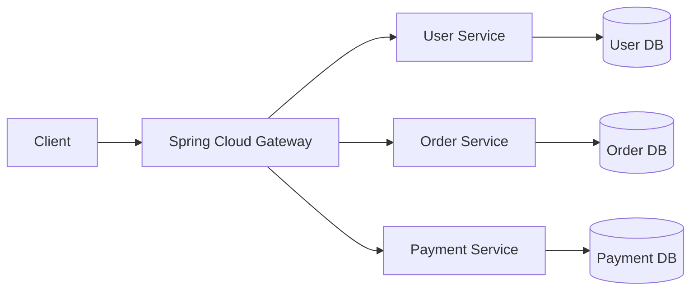
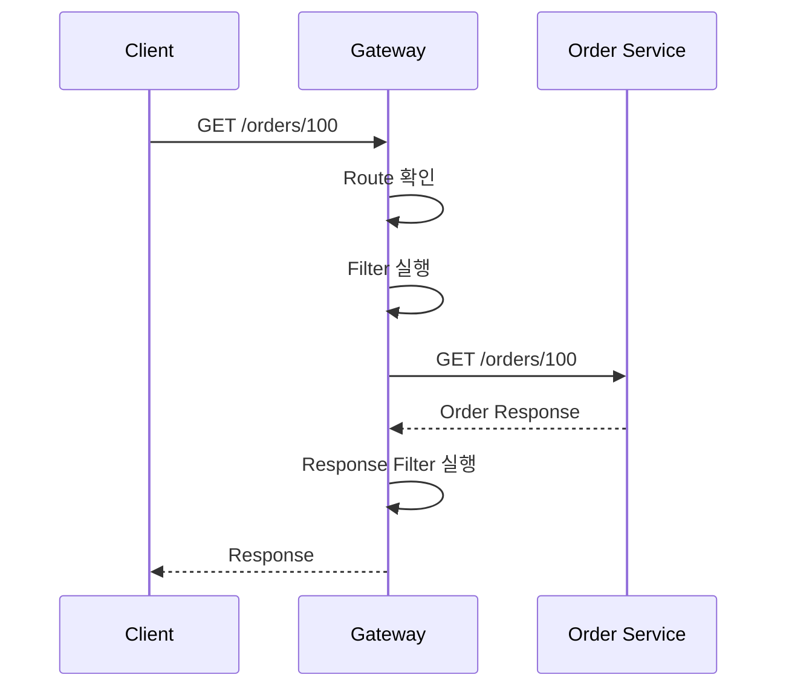
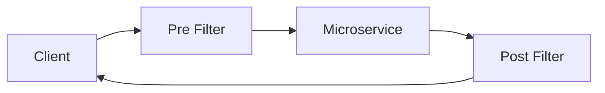
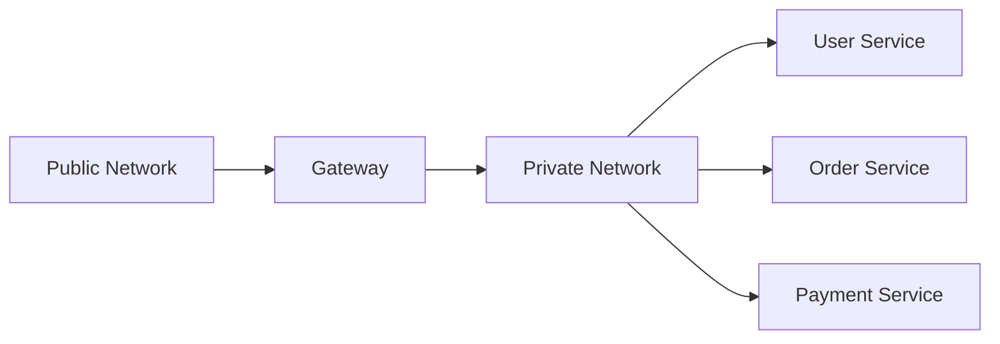
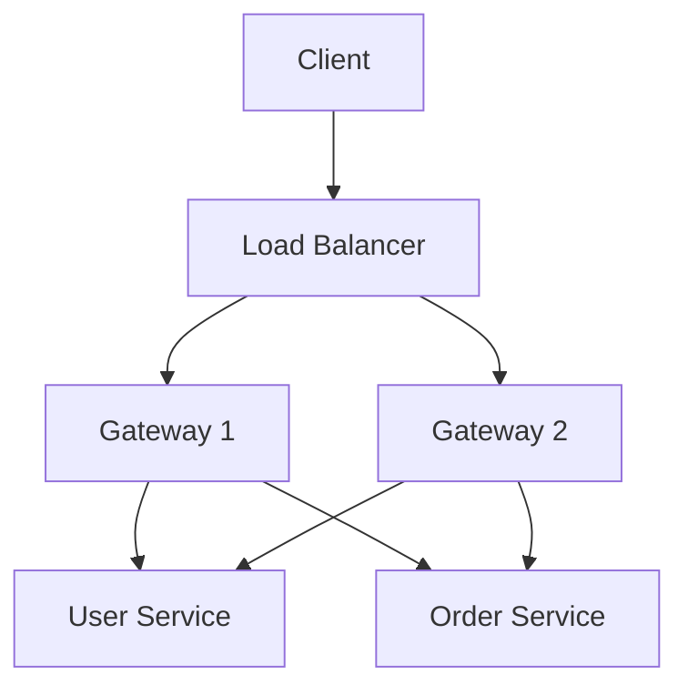
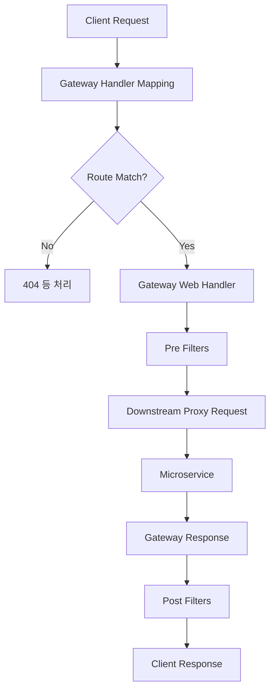
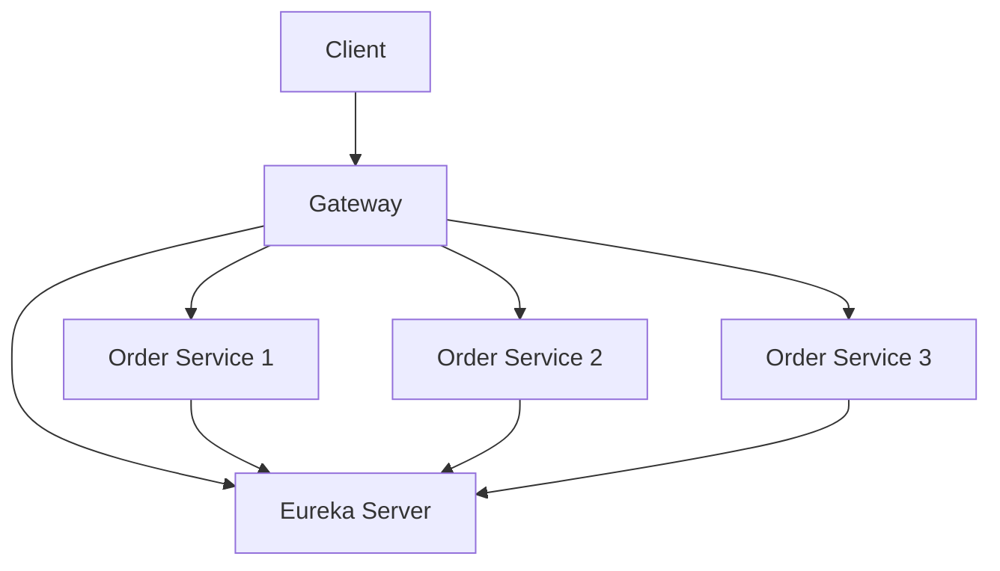
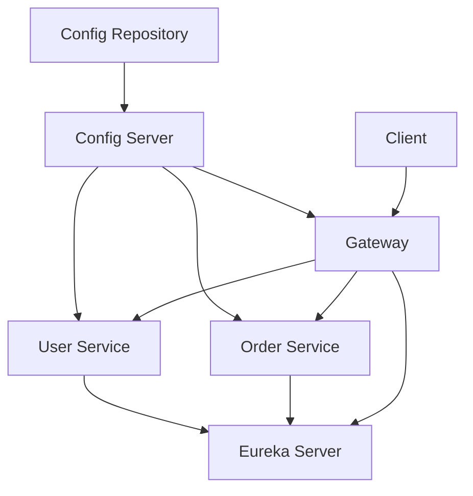
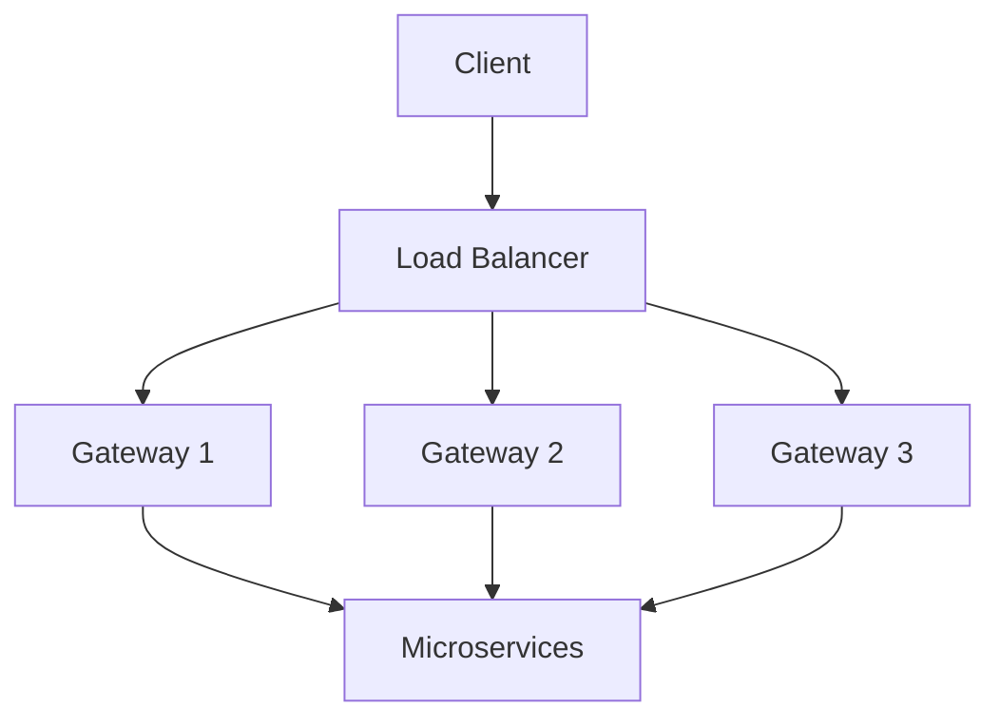
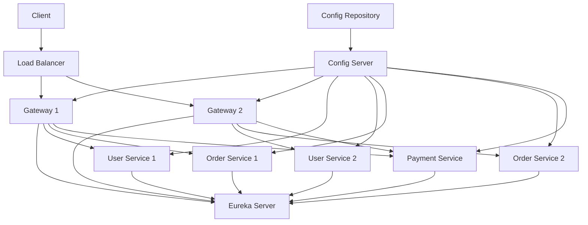

# 스프링 클라우드 MSA 8 - 스프링 클라우드 게이트웨이
[https://youtu.be/AoPuwW2uz5s?si=mufQlLGI0AxDWrhj](https://youtu.be/AoPuwW2uz5s?si=mufQlLGI0AxDWrhj)

# 스프링 클라우드 MSA 8 - 스프링 클라우드 게이트웨이
* toc
{:toc}

---

## Spring Cloud Gateway란? MSA의 단일 진입점과 라우팅 구조 이해하기

마이크로서비스 아키텍처에서는 하나의 애플리케이션이 여러 개의 독립적인 서비스로 나뉜다.

예를 들어 쇼핑몰을 MSA로 구성하면 다음과 같은 서비스가 존재할 수 있다.

```text
User Service
Product Service
Order Service
Payment Service
Notification Service
```

각 서비스는 별도의 Spring Boot 애플리케이션으로 실행되고 서로 다른 IP와 Port를 가질 수 있다.

```text
User Service
→ 10.0.1.10:8080

Order Service
→ 10.0.1.11:8080

Payment Service
→ 10.0.1.12:8080
```

그렇다면 외부 사용자는 어떤 주소로 요청해야 할까?

다음처럼 각 마이크로서비스의 주소를 직접 알고 요청하도록 만들 수는 있다.

```text
https://user.example.com
https://order.example.com
https://payment.example.com
```

하지만 이렇게 구성하면 클라이언트가 내부 서비스 구조를 알아야 한다.

서비스가 추가되거나 IP 주소가 변경될 때마다 클라이언트에 영향을 줄 수도 있다.

MSA에서는 이러한 문제를 해결하기 위해 일반적으로 **API Gateway**라는 단일 진입점을 둔다.

Spring 생태계에서 API Gateway를 구현하기 위해 사용할 수 있는 대표적인 프로젝트가 **Spring Cloud Gateway**다.

전체적인 구조는 다음과 같다.



외부 사용자는 내부 서비스들의 실제 주소를 알 필요가 없다.

대신 Gateway의 하나의 주소만 알면 된다.

```text
https://api.example.com
```

Gateway는 요청 경로를 분석하고 적절한 마이크로서비스로 전달한다.

```text
/users/**
→ User Service

/orders/**
→ Order Service

/payments/**
→ Payment Service
```

즉 Spring Cloud Gateway의 가장 기본적인 역할은 다음과 같다.

> 외부에서 들어오는 요청을 하나의 진입점에서 받아 요청 조건에 따라 적절한 내부 마이크로서비스로 전달하는 것이다.

---

## API Gateway가 필요한 이유

모놀리식 애플리케이션에서는 일반적으로 하나의 서버가 대부분의 요청을 처리한다.

```text
Client
   ↓
Application
   ├── User
   ├── Order
   ├── Payment
   └── Notification
```

따라서 클라이언트는 하나의 서버 주소만 알고 있으면 된다.

하지만 MSA에서는 상황이 달라진다.

```text
Client
   ↓
???

User Service
Order Service
Payment Service
Notification Service
```

클라이언트가 각 서비스의 주소를 직접 관리하면 여러 문제가 발생한다.

### 내부 서비스 구조가 외부에 노출된다

클라이언트가 다음 주소를 모두 알고 있어야 할 수 있다.

```text
10.0.1.10:8080
10.0.1.11:8080
10.0.1.12:8080
```

이는 내부 네트워크 구조가 외부 인터페이스와 강하게 결합되는 구조다.

---

### 서비스 변경이 클라이언트에 영향을 준다

Order Service의 주소가 다음처럼 변경됐다고 가정해보자.

```text
기존

10.0.1.11:8080
```

```text
변경

10.0.2.31:8090
```

클라이언트가 주소를 직접 관리한다면 클라이언트 설정도 변경해야 한다.

반면 Gateway를 사용하면 클라이언트는 계속 같은 주소를 사용한다.

```text
https://api.example.com/orders
```

내부 Routing만 변경하면 된다.

---

### 공통 기능이 중복된다

Gateway가 없다면 각 마이크로서비스에서 다음 기능을 각각 구현하게 될 수 있다.

```text
Authentication
Logging
CORS
Rate Limiting
Request Header 처리
Trace ID 생성
```

서비스가 20개라면 동일한 코드와 정책이 20곳에 분산될 수 있다.

Gateway에서는 이러한 횡단 관심사를 일정 부분 중앙화할 수 있다.

---

## Spring Cloud Gateway란?

Spring Cloud Gateway는 Spring 생태계에서 API Gateway를 구현하기 위한 프로젝트다.

주요 역할은 다음과 같다.

```text
Routing
Request Filtering
Response Filtering
Authentication 연계
CORS
Rate Limiting
Load Balancing 연계
Circuit Breaker 연계
Observability
```

즉 단순히 요청을 다른 서버에 전달하는 Reverse Proxy 역할만 수행하는 것이 아니라 API Gateway에서 필요한 여러 공통 기능을 제공한다.

Spring 공식 문서에서도 Spring Cloud Gateway의 주요 목표를 API Routing과 Security, Monitoring, Resiliency와 같은 횡단 관심사 제공으로 설명하고 있다.

---

## Spring Cloud Gateway의 기본 동작

외부에서 다음 요청이 들어왔다고 가정한다.

```http
GET /orders/100
```

Gateway에는 다음과 같은 Routing 규칙이 존재한다.

```text
/orders/**
→ Order Service
```

그러면 요청은 다음과 같이 처리된다.



Spring Cloud Gateway WebFlux의 공식적인 내부 흐름 역시 요청에 맞는 Route를 찾은 뒤 Gateway Web Handler와 Filter Chain을 거쳐 실제 Proxy Request를 수행하는 구조다.

---

## Route란 무엇인가?

Gateway의 가장 핵심적인 개념은 **Route**다.

Route는 쉽게 말하면 다음 규칙이다.

> 어떤 요청이 들어왔을 때 어느 서비스로 보낼 것인가?

예를 들어 다음과 같다.

```text
/users/**
→ User Service
```

```text
/orders/**
→ Order Service
```

```text
/payments/**
→ Payment Service
```

조금 더 구체적으로 Route는 크게 다음 요소로 구성된다.

```text
ID
URI
Predicate
Filter
```

개념적으로 다음과 같다.

```text
Route

id
→ order-service

predicate
→ Path=/orders/**

uri
→ http://order-service:8080

filter
→ 필요하면 요청/응답 변경
```

---

## Predicate란 무엇인가?

Predicate는 **이 요청이 해당 Route에 해당하는가?**를 판단하는 조건이다.

가장 대표적인 조건이 Path다.

```text
Path=/orders/**
```

다음 요청은 조건과 일치한다.

```text
/orders
/orders/1
/orders/100/items
```

반면 다음 요청은 일치하지 않는다.

```text
/users/1
/payments/100
```

Spring Cloud Gateway WebFlux는 Path뿐 아니라 Host, Method, Header 등 HTTP 요청의 여러 속성을 기준으로 Route를 선택할 수 있는 Predicate들을 제공한다.

예를 들어 다음과 같은 조건도 가능하다.

```text
Method=GET
```

```text
Host=api.example.com
```

따라서 Gateway Routing은 단순한 URL 문자열 비교보다 훨씬 유연하게 구성할 수 있다.

---

## Filter란 무엇인가?

Filter는 Gateway를 통과하는 요청이나 응답을 중간에서 처리하는 기능이다.



요청이 서비스에 전달되기 전에 실행되는 작업을 Pre Filter로 생각할 수 있다.

```text
JWT 확인
Header 추가
Trace ID 생성
Logging
Request 변환
```

응답이 클라이언트에 전달되기 전에 실행되는 작업에는 다음과 같은 것들이 있다.

```text
Response Header 추가
Logging
응답 데이터 일부 처리
Metrics 기록
```

Spring Cloud Gateway는 요청을 Proxy하기 전과 후에 Filter Chain을 실행할 수 있도록 설계되어 있다.

---

## Spring Cloud Gateway와 Reverse Proxy

Spring Cloud Gateway는 Reverse Proxy의 성격을 가진다.

일반적인 Proxy는 클라이언트를 대신하여 외부 서버에 요청한다.

```text
Client
→ Proxy
→ Internet
```

Reverse Proxy는 반대로 서버 측 앞단에 위치한다.

```text
Internet
→ Reverse Proxy
→ Internal Server
```

Spring Cloud Gateway 역시 일반적으로 외부와 내부 마이크로서비스 사이에 위치한다.



외부에서는 Gateway만 접근 가능하게 하고 내부 서비스는 Private Network에 두는 구조를 구성할 수 있다.

이를 통해 외부 클라이언트가 내부 서비스에 직접 접근하는 것을 제한할 수 있다.

---

## Gateway는 단순한 URL 분배기가 아니다

Gateway를 처음 배우면 다음처럼 이해하기 쉽다.

```text
/users → User Service
/orders → Order Service
```

하지만 실제 운영에서는 Gateway가 훨씬 많은 역할을 수행할 수 있다.

대표적으로 다음과 같다.

### Routing

```text
/orders/**
→ ORDER-SERVICE
```

### Authentication

```text
Authorization: Bearer JWT
        ↓
Gateway 검증
        ↓
내부 서비스
```

### CORS

브라우저 기반 클라이언트의 Cross-Origin 정책을 Gateway에서 공통 관리할 수 있다.

### Rate Limiting

특정 사용자가 초당 지나치게 많은 요청을 보내는 것을 제한할 수 있다.

```text
User A

1초당 10회까지 허용
11번째 요청
→ 429 Too Many Requests
```

### Header 조작

Gateway에서 내부 서비스에 공통 Header를 추가할 수 있다.

```text
X-Request-Id
X-User-Id
X-Forwarded-For
```

### 장애 대응

Circuit Breaker와 연계하여 Downstream Service 장애가 전체 요청 처리에 영향을 주는 것을 완화할 수도 있다.

---

## Gateway는 어디에 위치하는가?

일반적인 MSA에서는 Gateway가 외부 요청의 진입점에 위치한다.



중요한 점은 Gateway 자체도 한 대만 두는 것이 일반적인 운영 구조는 아니라는 것이다.

Gateway가 모든 외부 요청을 받는데 Gateway가 한 대뿐이라면 Gateway 장애가 전체 서비스 장애로 이어질 수 있다.

```text
Gateway Down
     ↓
모든 외부 API 접근 실패
```

따라서 운영 환경에서는 일반적으로 다음과 같은 구조를 고려한다.

```text
Load Balancer
      ↓
Gateway Instance 여러 개
      ↓
Microservices
```

Gateway 역시 Stateless하게 설계하고 여러 Instance로 Scale-Out할 수 있어야 한다.

---

## Gateway는 중요한 장애 지점이다

Gateway는 MSA의 중앙 진입점이기 때문에 높은 가용성이 중요하다.

다음 항목을 고려해야 한다.

```text
Gateway 다중화
Load Balancer
Health Check
Auto Scaling
Timeout
Circuit Breaker
Rate Limiting
Metrics
Distributed Tracing
```

Gateway에 장애가 발생하면 내부 서비스가 모두 정상이어도 사용자가 서비스를 사용할 수 없을 수 있다.

```text
User Service      UP
Order Service     UP
Payment Service   UP

Gateway           DOWN

결과
→ 외부 사용자는 서비스 접근 불가
```

따라서 Gateway는 비즈니스 로직 서버 못지않게 중요한 운영 대상이다.

---

## Spring Cloud Gateway와 Reactive Programming

제공된 내용에서 중요한 특징 중 하나는 Spring Cloud Gateway가 **WebFlux와 Netty 기반의 Non-Blocking 구조를 사용한다는 점**이다.

이 설명은 Spring Cloud Gateway의 **WebFlux 버전**을 기준으로 보면 맞다.

Spring Cloud Gateway Server WebFlux는 Spring Boot, Spring WebFlux, Project Reactor 위에서 동작하며 Netty Runtime을 사용한다. 공식 문서에서도 전통적인 Servlet Container 기반 애플리케이션과 다른 Reactive Runtime이라는 점을 명확하게 설명하고 있다.

기본적인 구조는 다음과 같다.

```text
Spring Cloud Gateway Server WebFlux

Spring Boot
    ↓
Spring WebFlux
    ↓
Project Reactor
    ↓
Reactor Netty
```

---

## Blocking과 Non-Blocking

전통적인 Spring MVC 애플리케이션의 요청 처리 모델을 단순화하면 다음과 같이 볼 수 있다.

```text
Request
   ↓
Thread
   ↓
DB 작업 대기
   ↓
Thread 대기
   ↓
Response
```

DB나 외부 API가 응답할 때까지 해당 Thread가 기다리는 구조가 발생할 수 있다.

반면 Non-Blocking 방식에서는 I/O 대기 중 Thread가 계속 묶여 있지 않도록 설계한다.

```text
Request
   ↓
Event Loop
   ↓
I/O 요청
   ↓
대기 동안 다른 요청 처리
   ↓
I/O 완료 Event
   ↓
Response 처리
```

Gateway는 복잡한 CPU 연산보다는 다음 작업을 매우 많이 처리한다.

```text
HTTP 요청 수신
Route 확인
Header 처리
HTTP 요청 전달
Response 전달
```

즉 네트워크 I/O 비중이 매우 높다.

이 때문에 Reactive/Non-Blocking 모델과 잘 맞는다.

---

## 왜 Gateway에 Blocking 코드를 넣으면 문제가 될까?

WebFlux 기반 Gateway는 적은 수의 Event Loop Thread로 많은 요청을 처리할 수 있도록 설계된다.

그런데 Gateway Filter에서 다음과 같은 Blocking 작업을 수행한다고 생각해보자.

```java
Thread.sleep(5000);
```

또는 오래 걸리는 Blocking Database Query를 실행한다고 가정한다.

```text
Gateway Event Loop
      ↓
Blocking DB Query
      ↓
5초간 Thread 점유
```

Event Loop Thread가 막히면서 다른 요청 처리에도 영향을 줄 수 있다.

따라서 WebFlux 기반 Gateway 내부에서는 Blocking 작업을 피해야 한다.

---

## Gateway에서 JPA를 사용하면 안 되는가?

제공된 내용에서는 WebFlux Gateway에서 JPA처럼 Blocking 방식의 기술을 사용하면 안 되고 R2DBC 같은 Non-Blocking 기술을 사용해야 한다는 흐름으로 설명한다.

WebFlux 기반 Gateway에서 Blocking JPA 호출을 Request Processing Path에 직접 넣는 것은 실제로 주의해야 한다.

하지만 더 중요한 설계 관점이 있다.

> 일반적으로 Gateway가 직접 데이터베이스를 조회하는 구조 자체를 최소화하는 것이 좋다.

예를 들어 Gateway에서 다음 작업까지 처리한다고 생각해보자.

```text
사용자 조회
주문 데이터 조회
결제 상태 조회
상품 DB 접근
```

이렇게 되면 Gateway가 또 하나의 거대한 비즈니스 애플리케이션이 되어버린다.

권장되는 책임은 다음과 같다.

```text
Gateway

Routing
Authentication의 공통 처리
Rate Limiting
Header 변환
Logging
Tracing
```

실제 비즈니스 데이터 처리는 내부 서비스가 담당한다.

```text
Order Service
→ Order DB

Payment Service
→ Payment DB
```

Gateway를 가능한 한 가볍게 유지하는 것이 운영과 확장 측면에서 유리하다.

---

## 현재 기준으로 꼭 알아야 할 WebFlux와 Web MVC Gateway

제공된 내용은 WebFlux 기반 Spring Cloud Gateway를 기준으로 설명하고 있다.

하지만 현재 Spring Cloud Gateway는 WebFlux 방식만 존재하는 것은 아니다.

현재 공식 문서에서는 Spring Cloud Gateway Server를 **WebFlux와 Web MVC 두 방식으로 제공**하고 있다.

크게 다음 두 가지를 구분할 수 있다.

| 구분           | Server WebFlux             | Server Web MVC  |
| ------------ | -------------------------- | --------------- |
| 기반           | Spring WebFlux             | Spring Web MVC  |
| 처리 모델        | Reactive / Non-Blocking 중심 | Servlet 기반      |
| 대표 Runtime   | Netty                      | Tomcat, Jetty 등 |
| Reactive 학습  | 필요                         | 상대적으로 적음        |
| 기존 MVC 기술 활용 | 제한적                        | 상대적으로 용이        |

Web MVC 버전은 `WebMvc.fn`을 기반으로 동작하며 Tomcat이나 Jetty와 같은 전통적인 Servlet Runtime에서 사용할 수 있다.

따라서 현재는 다음처럼 이해하는 것이 가장 정확하다.

```text
과거의 대표적인 Spring Cloud Gateway
→ WebFlux + Reactor + Netty

현재 Spring Cloud Gateway
→ Server WebFlux
→ Server Web MVC
```

즉 **Spring Cloud Gateway는 무조건 WebFlux만 사용해야 한다**고 일반화해서는 안 된다.

---

## 어떤 Gateway 방식을 선택해야 할까?

기존 시스템이 Reactive 기반이고 높은 동시성을 효율적으로 처리해야 한다면 WebFlux Gateway가 자연스러운 선택이 될 수 있다.

```text
WebFlux Gateway

Reactive Stack 사용
WebClient
Reactor
Non-Blocking I/O
```

반면 조직 전체가 Spring MVC 기반이고 Reactive Programming을 도입할 필요가 크지 않다면 Web MVC Gateway도 선택지가 될 수 있다.

```text
Web MVC Gateway

기존 Servlet 기반 기술
Spring MVC 친숙함
Tomcat / Jetty
```

중요한 것은 단순히 "Reactive가 더 빠르다"라는 이유로 선택하지 않는 것이다.

팀의 기술 스택과 트래픽 특성, 기존 인프라 구조를 함께 고려해야 한다.

---

## WebFlux Gateway 프로젝트 생성

제공된 내용의 흐름에서는 WebFlux 기반 Gateway를 사용한다.

현재 공식 문서 기준으로 WebFlux Server Starter는 다음 의존성을 사용할 수 있다.

```gradle
implementation 'org.springframework.cloud:spring-cloud-starter-gateway-server-webflux'
```

Spring Cloud Gateway 4.x 계열의 기존 프로젝트에서는 다음 Starter를 사용하는 예제도 많이 볼 수 있다.

```gradle
implementation 'org.springframework.cloud:spring-cloud-starter-gateway'
```

따라서 사용하는 Spring Cloud 버전의 공식 문서에 맞는 Starter를 선택해야 한다.

---

## build.gradle 기본 구성

예시 구조는 다음과 같다.

```gradle
plugins {
    id 'java'
    id 'org.springframework.boot' version '사용 중인 Spring Boot 버전'
    id 'io.spring.dependency-management' version '사용 중인 버전'
}

group = 'com.example'
version = '0.0.1-SNAPSHOT'

java {
    toolchain {
        languageVersion = JavaLanguageVersion.of(17)
    }
}

ext {
    set('springCloudVersion', "Spring Boot와 호환되는 Spring Cloud 버전")
}

repositories {
    mavenCentral()
}

dependencies {
    implementation 'org.springframework.cloud:spring-cloud-starter-gateway-server-webflux'

    testImplementation 'org.springframework.boot:spring-boot-starter-test'
}

dependencyManagement {
    imports {
        mavenBom "org.springframework.cloud:spring-cloud-dependencies:${springCloudVersion}"
    }
}

tasks.named('test') {
    useJUnitPlatform()
}
```

Spring Cloud를 사용할 때는 Spring Boot 버전과 Spring Cloud Release Train의 호환성을 반드시 확인해야 한다.

---

## Web MVC Gateway를 사용한다면

현재 Spring Cloud Gateway Server Web MVC Starter는 공식적으로 다음 의존성을 제공한다.

```gradle
implementation 'org.springframework.cloud:spring-cloud-starter-gateway-server-webmvc'
```

따라서 두 구조를 혼동하지 않는 것이 중요하다.

```text
WebFlux Gateway
→ spring-cloud-starter-gateway-server-webflux

Web MVC Gateway
→ spring-cloud-starter-gateway-server-webmvc
```

---

## Gateway 프로젝트에는 Spring Web을 추가해야 할까?

WebFlux Gateway를 사용하는 경우 전통적인 Spring MVC용 `spring-boot-starter-web`을 별도로 섞는 것은 신중해야 한다.

WebFlux Gateway의 실행 모델 자체가 Reactive Stack을 전제로 하기 때문이다.

기본적으로 Gateway Starter가 필요한 Reactive Web 구성을 제공하도록 두고, 불필요하게 MVC와 WebFlux를 동시에 섞지 않는 것이 좋다.

반대로 Web MVC Gateway를 선택했다면 Servlet 기반 구조에 맞게 구성한다.

---

## Gateway의 기본 요청 처리 구조

WebFlux Gateway의 요청 처리 과정을 조금 더 자세히 보면 다음과 같다.



Spring Cloud Gateway 공식 문서에서도 Route가 매칭되면 Gateway Web Handler가 해당 요청의 Filter Chain을 실행하고, Pre Filter 이후 Proxy Request를 수행한 뒤 Post Filter를 실행하는 흐름으로 설명한다.

---

## Netty는 어떤 역할을 할까?

WebFlux 기반 Spring Cloud Gateway는 Reactor Netty를 Runtime으로 사용한다.

Gateway에서 외부 마이크로서비스로 HTTP 요청을 전달할 때도 Netty 기반 HTTP Client가 사용된다. 공식 문서에서도 HTTP/HTTPS Route 요청을 Downstream으로 전달하는 Netty Routing Filter가 Netty `HttpClient`를 사용한다고 설명한다.

구조를 단순화하면 다음과 같다.

```text
Client
  ↓
Reactor Netty Server
  ↓
Spring Cloud Gateway
  ↓
Netty HttpClient
  ↓
Microservice
```

따라서 WebFlux Gateway를 운영한다면 다음 개념을 이해해 두는 것이 좋다.

```text
Event Loop
Reactor
Mono
Flux
WebFlux
Netty
Backpressure
Non-Blocking I/O
```

다만 Gateway 설정만 사용하는 경우 모든 Reactive API를 깊게 작성할 필요는 없다.

Custom Filter나 복잡한 Gateway 로직을 구현할수록 Reactor에 대한 이해가 중요해진다.

---

## 첫 번째 Routing 예제

자세한 Routing 설정은 별도의 주제로 다룰 수 있지만 Gateway의 역할을 이해하기 위한 최소한의 예제를 살펴보자.

Order Service가 다음 주소에서 실행된다고 가정한다.

```text
http://localhost:8081
```

Gateway는 `8000` Port에서 실행한다.

```yaml
server:
  port: 8000
```

`/orders/**` 요청을 Order Service로 전달하는 Route를 설정한다.

현재 버전에 따라 Spring Cloud Gateway 설정 Prefix가 달라질 수 있으므로 실제 프로젝트에서는 사용 중인 버전의 공식 문서를 확인해야 한다.

개념적으로는 다음과 같은 Route를 구성한다.

```yaml
spring:
  cloud:
    gateway:
      routes:
        - id: order-service
          uri: http://localhost:8081
          predicates:
            - Path=/orders/**
```

요청은 다음과 같이 이동한다.

```text
GET http://localhost:8000/orders/100

                ↓

Spring Cloud Gateway

                ↓

http://localhost:8081/orders/100
```

---

## Java Configuration으로 Routing하기

Routing은 YAML뿐 아니라 Java Configuration으로 구성할 수도 있다.

WebFlux Gateway에서는 `RouteLocator`를 이용하는 방식이 널리 사용된다.

```java
@Configuration
public class GatewayRouteConfig {

    @Bean
    public RouteLocator routes(RouteLocatorBuilder builder) {
        return builder.routes()
                .route(
                        "order-service",
                        route -> route
                                .path("/orders/**")
                                .uri("http://localhost:8081")
                )
                .build();
    }
}
```

개념적인 결과는 YAML 방식과 같다.

```text
/orders/**
→ http://localhost:8081
```

어떤 방식을 사용할지는 Route 규모와 운영 방법에 따라 결정할 수 있다.

---

## 설정 파일 방식과 Java 방식 비교

| 구분       | YAML/Properties | Java Configuration |
| -------- | --------------- | ------------------ |
| 단순 Route | 편리              | 상대적으로 코드가 많음       |
| 변경 확인    | 쉬움              | 코드 리뷰 가능           |
| 복잡한 조건   | 제한적일 수 있음       | 유연함                |
| 동적 로직    | 어려움             | 구현 가능              |
| 운영 설정 분리 | 유리              | 배포 필요 가능           |

단순 Path 기반 Routing이라면 YAML이 읽기 쉽다.

반면 복잡한 Custom Predicate나 Filter가 필요하다면 Java Configuration이 유리할 수 있다.

---

## Eureka와 Gateway를 함께 사용하는 이유

앞서 Eureka Server와 Eureka Client를 구성했다면 Gateway와 연결할 수 있다.

Eureka를 사용하지 않는 경우 다음처럼 실제 주소를 작성한다.

```text
/orders/**
→ http://10.0.1.20:8080
```

하지만 Order Service가 Scale-Out되면 주소가 여러 개가 된다.

```text
10.0.1.20:8080
10.0.1.21:8080
10.0.1.22:8080
```

이때 Eureka를 활용하면 논리적인 서비스 이름을 사용할 수 있다.

```text
ORDER-SERVICE
```

구조는 다음과 같다.



Gateway는 Service Discovery와 Load Balancer를 통해 현재 사용 가능한 Instance를 찾을 수 있다.

이를 통해 Route 설정에서 특정 서버 IP에 대한 의존성을 줄일 수 있다.

---

## Gateway, Eureka, Config Server의 역할 비교

지금까지 살펴본 Spring Cloud 구성 요소들을 비교하면 전체 MSA 구조가 훨씬 명확해진다.

| 구성 요소         | 핵심 역할                  |
| ------------- | ---------------------- |
| Config Server | 설정 중앙 관리               |
| Eureka Server | Service Registry       |
| Eureka Client | 서비스 등록 및 Discovery     |
| Gateway       | 외부 요청의 단일 진입점과 Routing |
| Load Balancer | 여러 Instance 중 요청 대상 선택 |

관계를 보면 다음과 같다.



각 기술이 해결하는 문제가 다르다.

```text
Config Server

서비스를 어떤 설정으로 실행할 것인가?


Eureka

현재 서비스가 어디에서 실행되고 있는가?


Gateway

외부 요청을 어느 서비스로 전달할 것인가?
```

이 세 가지를 구분하면 Spring Cloud 기반 MSA의 큰 구조를 이해하기 쉬워진다.

---

## Gateway에 비즈니스 로직을 넣지 않는 것이 좋은 이유

Gateway가 모든 요청을 통과한다는 이유로 여러 기능을 Gateway에 넣기 쉽다.

다음과 같이 시작했다고 가정해보자.

```text
JWT 검증
```

여기에 하나씩 기능이 증가한다.

```text
JWT 검증
사용자 조회
회원 권한 조회
상품 조회
주문 상태 확인
결제 여부 확인
```

결국 Gateway가 거대한 비즈니스 서버가 된다.

```text
Gateway
→ User DB
→ Order DB
→ Payment DB
```

이렇게 되면 다음 문제가 발생한다.

```text
Gateway 장애 영향 증가
서비스 간 결합도 증가
Gateway 배포 빈도 증가
Database 의존성 증가
Latency 증가
Scale-Out 비용 증가
```

Gateway에는 가능한 한 **공통 인프라성 책임**을 집중시키는 것이 좋다.

```text
Routing
Authentication 공통 처리
Rate Limiting
CORS
Tracing
Header 변환
Logging
```

도메인 권한이나 비즈니스 판단은 최종 마이크로서비스에서도 반드시 검증해야 한다.

---

## Gateway 인증과 서비스 인증

Gateway에서 JWT 인증을 완료했다고 해서 내부 서비스의 모든 Authorization을 제거해도 된다는 의미는 아니다.

예를 들어 Gateway가 다음 정보를 전달한다고 가정한다.

```text
X-User-Id: 100
```

Order Service에서는 여전히 다음과 같은 도메인 권한 검사가 필요할 수 있다.

```text
요청한 User가 실제 주문 소유자인가?
취소 가능한 주문 상태인가?
관리자 권한이 필요한 작업인가?
```

역할을 분리하면 다음과 같다.

```text
Gateway

Token 유효성
기본 인증
공통 접근 정책


Order Service

주문 소유권
주문 상태
도메인 Authorization
```

---

## Gateway에서 모든 요청을 기록하면 될까?

Gateway는 모든 외부 요청이 통과하기 때문에 Access Log를 기록하기 좋은 지점이다.

다음 정보를 기록할 수 있다.

```text
Request ID
Trace ID
HTTP Method
Path
Status Code
Latency
Client IP
Service ID
```

하지만 Request Body 전체나 Authorization Header를 그대로 기록해서는 안 된다.

특히 다음 정보는 로그에서 제외하거나 Masking해야 한다.

```text
Authorization Token
Password
주민등록번호
카드 정보
개인정보
Secret
Cookie
```

---

## Gateway와 Distributed Tracing

한 요청이 다음 흐름으로 이동한다고 가정한다.

```text
Client
→ Gateway
→ Order Service
→ Payment Service
→ Notification Service
```

장애가 발생했을 때 어느 서비스에서 느려졌는지 확인하려면 모든 서비스의 로그를 개별적으로 뒤지는 것은 어렵다.

따라서 Trace ID를 전달한다.

```text
traceId=abc-123
```

각 서비스 로그가 같은 Trace ID를 기록한다.

```text
Gateway
traceId=abc-123

Order Service
traceId=abc-123

Payment Service
traceId=abc-123
```

OpenTelemetry와 같은 기술을 이용하면 요청 전체 흐름을 추적할 수 있다.

Gateway는 분산 추적의 시작점이 되는 경우가 많다.

---

## Gateway와 Timeout

Gateway가 Downstream Service에 요청을 전달했는데 응답이 오지 않는다고 가정하자.

```text
Gateway
   ↓
Order Service
   ↓
응답 없음
```

Timeout이 없다면 요청이 장시간 유지될 수 있다.

따라서 Gateway에서는 적절한 Timeout 정책이 필요하다.

```text
Connection Timeout
Response Timeout
```

단순히 Timeout 값을 길게 잡는 것이 좋은 것도 아니다.

너무 길면 장애 서비스 때문에 Gateway 리소스가 오래 점유되고, 너무 짧으면 정상적인 요청까지 실패할 수 있다.

서비스의 SLO와 실제 처리 시간을 기준으로 설정해야 한다.

---

## Gateway와 Circuit Breaker

Payment Service에 장애가 발생했다고 가정해보자.

Gateway가 계속 Payment Service에 요청을 전달하면 매 요청이 Timeout까지 기다릴 수 있다.

```text
Request
→ Payment Service
→ Timeout

Request
→ Payment Service
→ Timeout

Request
→ Payment Service
→ Timeout
```

Circuit Breaker를 사용하면 반복적인 실패가 일정 기준을 넘었을 때 호출을 일시적으로 차단할 수 있다.

```text
정상 상태

CLOSED
   ↓
요청 전달


실패 증가

OPEN
   ↓
요청 빠르게 실패


일정 시간 후

HALF_OPEN
   ↓
복구 여부 확인
```

Gateway가 분산 시스템의 장애를 완전히 해결해주는 것은 아니지만 이러한 Resiliency 기능과 연계할 수 있다.

---

## Gateway와 Rate Limiting

Gateway는 외부 요청이 들어오는 첫 번째 지점이므로 Rate Limiting을 적용하기 좋은 위치다.

예를 들어 사용자별로 다음 정책을 적용할 수 있다.

```text
User 100

1초당 최대 10 Request
```

요청이 초과되면 다음 응답을 반환할 수 있다.

```http
HTTP/1.1 429 Too Many Requests
```

이를 통해 일부 Client의 폭주가 내부 서비스 전체에 영향을 주는 것을 완화할 수 있다.

---

## Gateway의 Scale-Out

Gateway 자체도 트래픽 증가에 따라 Scale-Out해야 한다.

```text
기존

Gateway 1대
```

```text
트래픽 증가

Gateway 1
Gateway 2
Gateway 3
Gateway 4
```

앞단에는 Load Balancer를 둘 수 있다.



이 때문에 Gateway에서는 사용자 Session 같은 상태를 로컬 메모리에 강하게 저장하지 않는 것이 좋다.

Gateway가 Stateless해야 다른 Instance로 요청이 전달되어도 문제가 적다.

---

## Gateway 프로젝트의 권장 책임

Gateway가 담당하기 좋은 기능을 정리하면 다음과 같다.

```text
Routing
Authentication의 공통 부분
CORS
Rate Limiting
Request/Response Header 변환
Tracing
Access Logging
일부 Resilience 정책
```

반대로 Gateway에 넣지 않는 것이 좋은 기능은 다음과 같다.

```text
주문 생성
재고 차감
결제 처리
정산 처리
복잡한 DB Query
상품 검색
비즈니스 트랜잭션
```

Gateway는 가능한 한 **빠르고 가벼운 요청 전달 계층**으로 유지하는 것이 좋다.

---

## 현재 기준으로 다시 정리하는 Spring Cloud Gateway 특징

제공된 내용의 핵심 흐름을 현재 Spring Cloud 기준으로 정리하면 다음과 같다.

### 단일 진입점

```text
Client
→ Gateway
→ Microservices
```

### Reverse Proxy

외부와 내부 서비스 사이에서 요청을 Proxy한다.

### Routing

```text
URL / Method / Header 등의 조건
→ 적절한 서비스 선택
```

### Filter

요청과 응답에 공통 처리를 적용할 수 있다.

### Service Discovery 연계

Eureka와 같은 Service Registry와 연결하여 동적인 서비스 위치를 활용할 수 있다.

### WebFlux 기반 구성

Reactive/Netty 기반으로 높은 I/O 동시성을 처리할 수 있다.

### Web MVC 기반 구성

현재는 Servlet 기반 Spring Cloud Gateway Server Web MVC도 공식적으로 제공된다.

---

## Spring Cloud Gateway를 도입할 때 생각해야 할 점

Gateway를 도입하는 것 자체가 목적이 되어서는 안 된다.

다음 질문을 먼저 고민하는 것이 좋다.

```text
외부 API의 단일 진입점이 필요한가?

서비스 Routing 규칙을 중앙 관리해야 하는가?

공통 인증 처리가 필요한가?

Rate Limiting이 필요한가?

내부 서비스 주소를 외부에 감추고 싶은가?

Service Discovery를 사용하고 있는가?

Gateway 장애 시 고가용성 전략이 준비되어 있는가?
```

그리고 다음 문제도 함께 고려해야 한다.

```text
Gateway 자체의 장애
Gateway Latency
Routing 설정 복잡도
인증 병목
로그 데이터 증가
Reactive Stack 학습 비용
서비스 간 Timeout 정책
```

Gateway를 추가하면 하나의 네트워크 Hop이 추가되기 때문에 모든 요청이 Gateway를 반드시 지나야 하는지에 대해서도 시스템 특성에 따라 판단할 필요가 있다.

---

## 전체 Spring Cloud MSA 구조

지금까지 구성한 Config Server, Eureka Server, Eureka Client와 Gateway를 연결하면 전체 구조는 다음과 같다.



요청 흐름은 다음과 같다.

```text
Client

↓ 외부 요청

Load Balancer

↓ Gateway Instance 선택

Spring Cloud Gateway

↓ Route 판단

Eureka / Service Discovery

↓ Service Instance 탐색

Load Balancer

↓ 실제 Instance 선택

Microservice

↓ Business Logic

Database
```

설정 관리는 별도로 다음 흐름을 가진다.

```text
Config Repository
       ↓
Config Server
       ↓
Gateway / Microservices
```

---

## 정리

Spring Cloud Gateway는 MSA에서 외부 요청을 받아 적절한 마이크로서비스로 전달하는 API Gateway다.

가장 기본적인 역할은 다음과 같다.

```text
Client
   ↓
Gateway
   ↓
Routing
   ↓
Microservice
```

하지만 실제로는 Routing 외에도 다음과 같은 기능을 수행할 수 있다.

```text
Predicate
Filter
Authentication 연계
CORS
Rate Limiting
Load Balancing 연계
Circuit Breaker 연계
Logging
Tracing
```

Gateway는 외부와 내부 서비스 사이에 위치하기 때문에 Reverse Proxy 역할도 수행하며, 내부 서비스의 주소와 구조를 클라이언트로부터 숨길 수 있다.

제공된 내용에서 설명하는 Spring Cloud Gateway는 WebFlux와 Reactor Netty 기반 Gateway다. 이 구조에서는 요청 처리가 Non-Blocking 방식으로 이루어지기 때문에 Gateway 내부에 Blocking DB 접근이나 오래 걸리는 비즈니스 로직을 넣지 않는 것이 중요하다.

다만 현재 Spring Cloud Gateway는 WebFlux 방식뿐만 아니라 Servlet Runtime을 사용하는 **Spring Cloud Gateway Server Web MVC**도 공식적으로 제공한다. 따라서 신규 프로젝트에서는 기존 기술 스택과 트래픽 특성을 고려하여 WebFlux와 Web MVC 중 적절한 방식을 선택해야 한다.

그리고 Gateway를 설계할 때 가장 중요한 원칙 중 하나는 Gateway를 또 하나의 거대한 비즈니스 서버로 만들지 않는 것이다.

```text
Gateway
→ Routing과 공통 인프라 처리

Microservice
→ 실제 비즈니스 로직
```

이 책임을 분리하면 Gateway를 여러 Instance로 Scale-Out하기 쉽고, Gateway 장애가 전체 시스템에 미치는 영향과 복잡도를 줄일 수 있다.

### 한 줄 요약

Spring Cloud Gateway는 MSA의 외부 단일 진입점에서 요청을 받아 Predicate로 Route를 선택하고 Filter를 거쳐 적절한 마이크로서비스로 전달하는 API Gateway이며, Eureka와 연계하면 실제 IP 대신 서비스 이름을 기반으로 동적인 Routing 구조를 구축할 수 있다.


