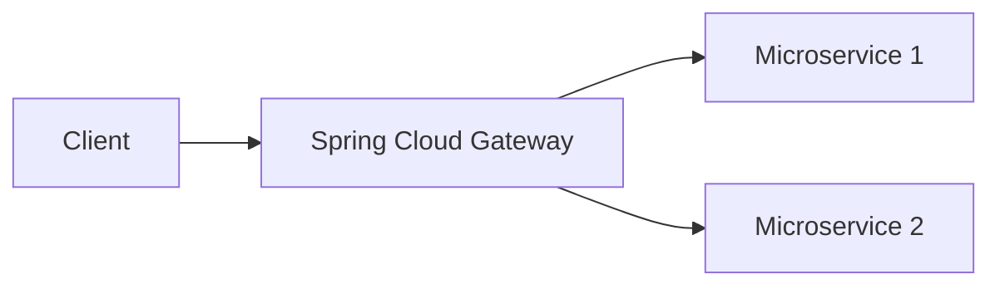
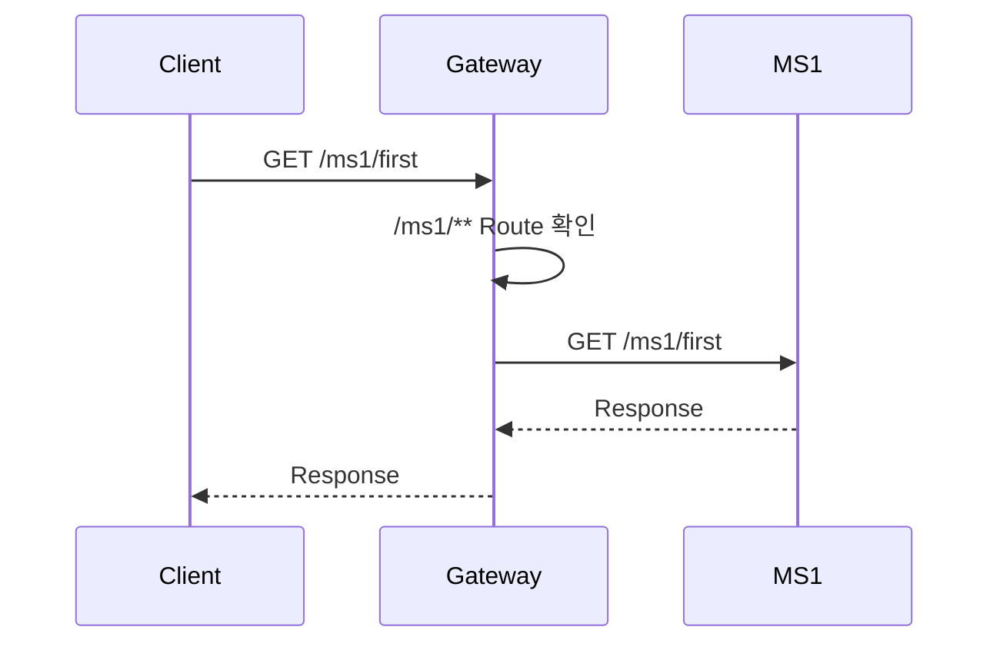
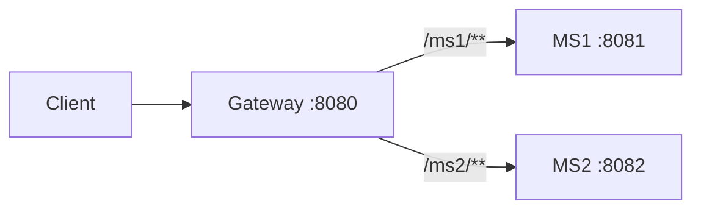
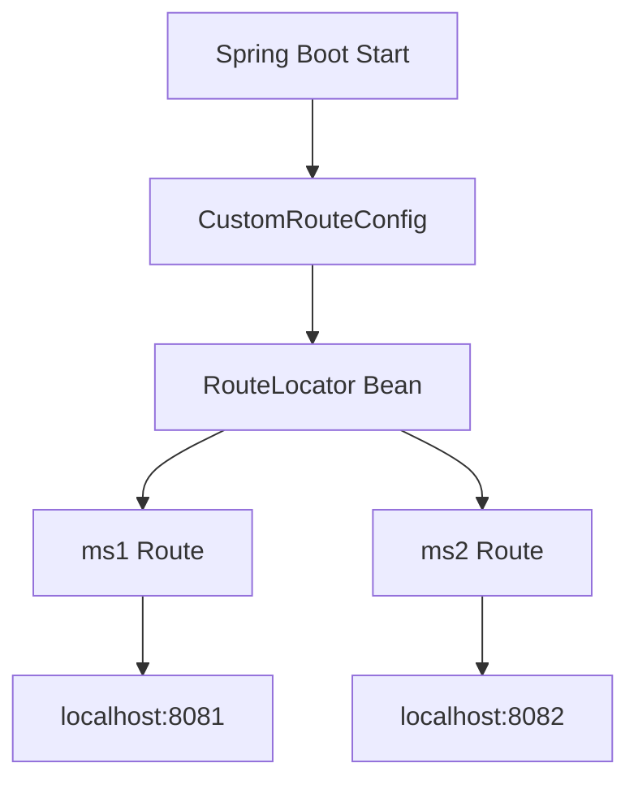
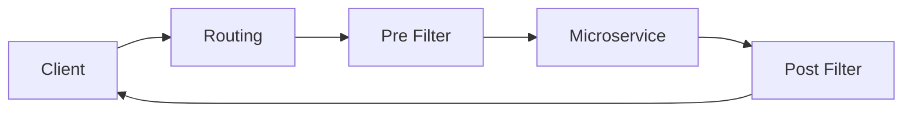
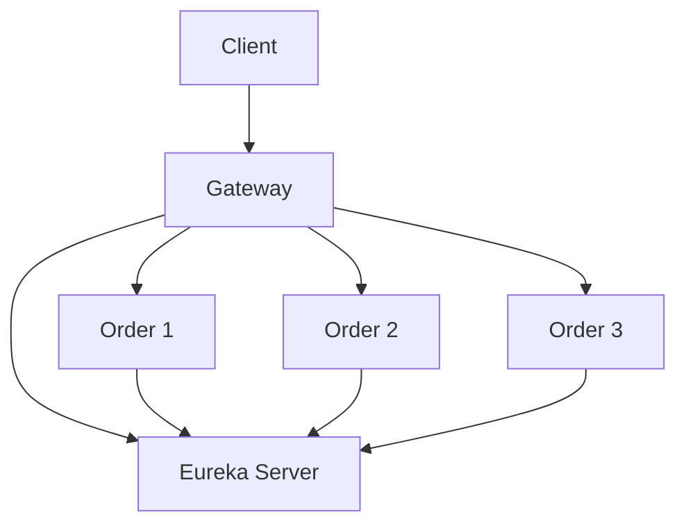
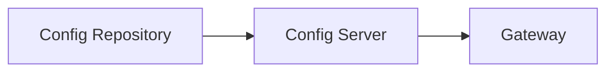
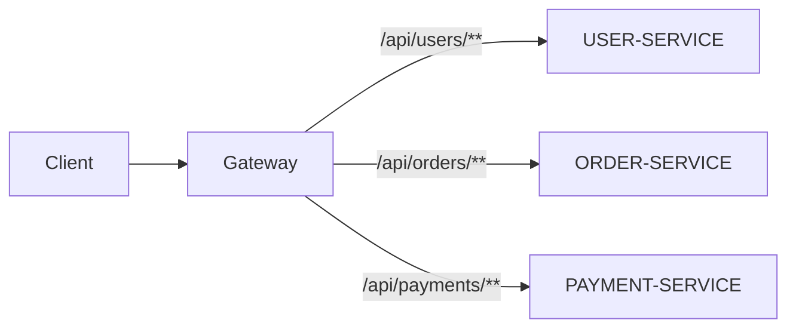
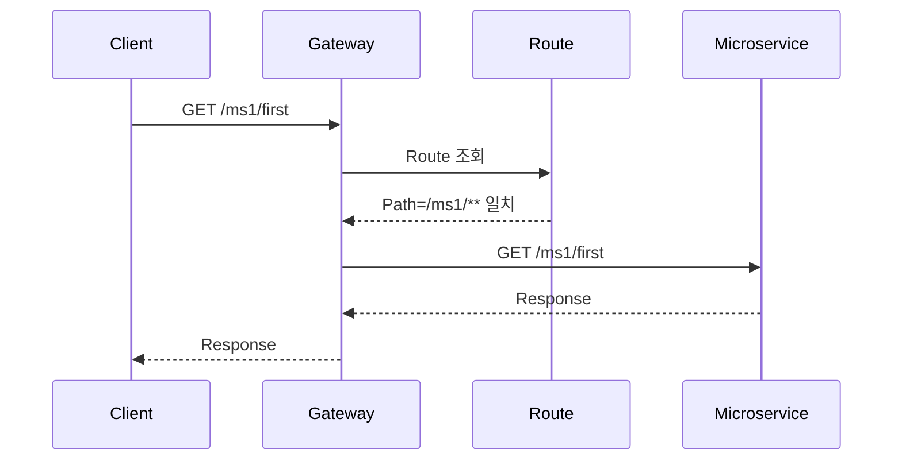
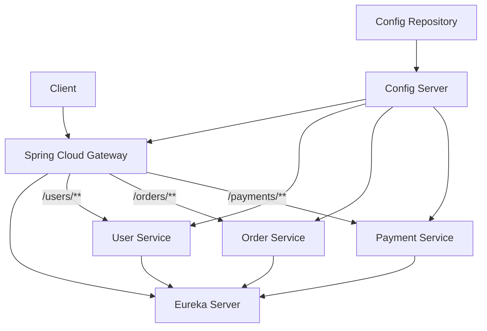

# 스프링 클라우드 MSA 9 - 게이트웨이 라우팅 설정
[https://youtu.be/MAy3QTUS5VM?si=CNQJP2GAZSrBSmzF](https://youtu.be/MAy3QTUS5VM?si=CNQJP2GAZSrBSmzF)

# 스프링 클라우드 MSA 9 - 게이트웨이 라우팅 설정
* toc
{:toc}

---

## Spring Cloud Gateway Routing 설정 방법

Spring Cloud Gateway의 가장 핵심적인 역할은 외부에서 들어온 요청을 적절한 마이크로서비스로 전달하는 것이다.

MSA 환경에서는 하나의 애플리케이션이 여러 서비스로 분리된다.

예를 들어 다음과 같은 서비스가 존재한다고 가정해보자.

```text
User Service
Order Service
Payment Service
Document Service
```

각 서비스는 서로 다른 서버와 Port에서 실행될 수 있다.

```text
User Service
→ http://localhost:8081

Document Service
→ http://localhost:8082
```

그런데 클라이언트가 각각의 서비스 주소를 직접 알고 요청하게 만들면 서비스가 추가되거나 주소가 변경될 때마다 클라이언트까지 영향을 받게 된다.

Spring Cloud Gateway를 앞단에 두면 외부 클라이언트는 Gateway 하나만 바라보도록 만들 수 있다.



예를 들어 Gateway가 `8080` Port에서 실행된다면 클라이언트는 다음과 같이 요청한다.

```text
http://localhost:8080/ms1/first
```

Gateway는 `/ms1/**`이라는 경로를 확인하고 해당 요청을 첫 번째 마이크로서비스로 전달한다.

```text
http://localhost:8081/ms1/first
```

두 번째 서비스 역시 동일하다.

```text
http://localhost:8080/ms2/second
```

Gateway가 이를 다음 서버로 전달한다.

```text
http://localhost:8082/ms2/second
```

이처럼 **요청 조건을 확인하여 어떤 서버로 전달할지 결정하는 작업을 Routing이라고 한다.**

---

## Routing이란?

Routing은 들어온 요청을 어떤 대상 서비스로 전달할지 결정하는 과정이다.

예를 들어 Gateway에 다음 요청이 들어왔다고 가정해보자.

```text
GET /ms1/first
```

Gateway는 설정된 Routing 규칙을 확인한다.

```text
/ms1/**
→ http://localhost:8081
```

조건이 일치하면 Gateway가 요청을 해당 서버로 전달한다.



두 번째 서비스는 다음과 같이 구성할 수 있다.

```text
/ms2/**
→ http://localhost:8082
```

결국 Gateway는 다음과 같은 Routing Table을 가진다고 볼 수 있다.

| 요청 경로     | 전달 대상                   |
| --------- | ----------------------- |
| `/ms1/**` | `http://localhost:8081` |
| `/ms2/**` | `http://localhost:8082` |

---

## Spring Cloud Gateway Route의 구성 요소

하나의 Route는 크게 다음 세 가지 요소를 중심으로 이해할 수 있다.

```text
id
uri
predicate
```

예를 들어 다음 Routing 규칙이 있다고 하자.

```text
id
→ ms1

predicate
→ Path=/ms1/**

uri
→ http://localhost:8081
```

각 항목의 역할은 다음과 같다.

### id

Route를 구분하기 위한 이름이다.

```text
ms1-route
ms2-route
order-service
payment-service
```

Gateway 내부에서 각각의 Routing 규칙을 식별하기 위해 사용한다.

### uri

실제로 요청을 전달할 목적지 서버다.

```text
http://localhost:8081
```

### predicate

해당 Route를 적용할 조건이다.

```text
Path=/ms1/**
```

즉 다음 요청이 들어오면:

```text
/ms1/first
```

`Path=/ms1/**` 조건과 일치하기 때문에 해당 Route가 선택된다.

---

## Predicate란?

Predicate는 요청이 특정 Route에 해당하는지 판단하기 위한 조건이다.

가장 대표적인 방식이 Path 기반 Routing이다.

```text
Path=/ms1/**
```

다음 요청들은 모두 조건에 일치한다.

```text
/ms1
/ms1/
/ms1/first
/ms1/users
/ms1/users/100
```

`**`는 하위 경로 전체를 의미하는 패턴으로 사용할 수 있다.

따라서 다음과 같은 구조가 가능하다.

```text
/ms1/**
→ MS1

/ms2/**
→ MS2
```

---

## Path 외에도 다양한 Routing 조건을 사용할 수 있다

Routing 조건은 Path만 존재하는 것이 아니다.

요청의 다양한 정보를 기준으로 Routing할 수 있다.

```text
Path
Method
Host
Header
Query Parameter
시간 조건
```

예를 들어 HTTP Method를 기준으로 Routing할 수도 있다.

```text
GET 요청
→ 조회 서비스

POST 요청
→ 처리 서비스
```

Host를 기준으로 나누는 것도 가능하다.

```text
api.example.com
→ API 서버

admin.example.com
→ Admin 서버
```

하지만 일반적인 MSA API Gateway에서는 URL Path를 기준으로 서비스를 분리하는 방식이 이해하기 쉽고 자주 사용된다.

---

## 실습 구조

두 개의 Spring Boot 마이크로서비스를 준비한다고 가정한다.

제공된 내용의 앞부분에서는 두 서버가 모두 `8082`로 언급되는 부분이 있지만 이후 Routing 예제에서는 `8081`, `8082` 두 서버로 구분하여 설명하고 있다.

따라서 전체 흐름은 다음과 같이 이해하면 된다.

```text
Microservice 1
Port → 8081

Microservice 2
Port → 8082
```

첫 번째 서버에서는 다음 경로를 제공한다.

```text
http://localhost:8081/ms1/first
```

두 번째 서버에서는 다음 경로를 제공한다.

```text
http://localhost:8082/ms2/second
```

Gateway는 `8080`에서 실행한다.

```text
Gateway
→ http://localhost:8080
```

목표는 다음과 같다.

```text
http://localhost:8080/ms1/first
              ↓
http://localhost:8081/ms1/first
```

```text
http://localhost:8080/ms2/second
              ↓
http://localhost:8082/ms2/second
```

구조는 다음과 같다.



---

## Routing을 설정하는 세 가지 방법

제공된 내용에서는 Routing을 크게 세 가지 방식으로 설정한다.

```text
application.properties
application.yml
Java Configuration
```

모두 결과적으로 같은 Routing 규칙을 생성한다.

차이는 Routing 정보를 어떤 형태로 작성하는지다.

```text
Properties
→ Key-Value 방식

YAML
→ 계층 구조

Java
→ RouteLocator 코드
```

---

## application.properties를 이용한 Routing

첫 번째 방법은 `application.properties`를 이용하는 방식이다.

Gateway Port를 먼저 설정한다.

```properties
server.port=8080
```

그리고 두 개의 Routing 규칙을 추가한다.

```properties
spring.cloud.gateway.routes[0].id=ms1
spring.cloud.gateway.routes[0].uri=http://localhost:8081
spring.cloud.gateway.routes[0].predicates[0]=Path=/ms1/**

spring.cloud.gateway.routes[1].id=ms2
spring.cloud.gateway.routes[1].uri=http://localhost:8082
spring.cloud.gateway.routes[1].predicates[0]=Path=/ms2/**
```

각 Route를 자세히 살펴보자.

---

## 첫 번째 Route

```properties
spring.cloud.gateway.routes[0].id=ms1
```

첫 번째 Route의 이름을 `ms1`으로 지정한다.

```properties
spring.cloud.gateway.routes[0].uri=http://localhost:8081
```

첫 번째 Route의 요청을 `8081` 서버로 전달한다.

```properties
spring.cloud.gateway.routes[0].predicates[0]=Path=/ms1/**
```

`/ms1/**` 요청에 이 Route를 적용한다.

전체적으로 다음 의미다.

```text
IF
    Request Path = /ms1/**

THEN
    http://localhost:8081 로 전달
```

---

## 두 번째 Route

```properties
spring.cloud.gateway.routes[1].id=ms2
spring.cloud.gateway.routes[1].uri=http://localhost:8082
spring.cloud.gateway.routes[1].predicates[0]=Path=/ms2/**
```

의미는 다음과 같다.

```text
IF
    Request Path = /ms2/**

THEN
    http://localhost:8082 로 전달
```

---

## 배열 인덱스를 사용하는 이유

Properties 파일은 YAML과 달리 계층 구조를 표현하기 어렵기 때문에 배열 형태로 Route를 구분한다.

```text
routes[0]
routes[1]
routes[2]
```

첫 번째 Route:

```text
routes[0]
```

두 번째 Route:

```text
routes[1]
```

세 번째 Route가 추가되면 다음처럼 구성한다.

```properties
spring.cloud.gateway.routes[2].id=ms3
spring.cloud.gateway.routes[2].uri=http://localhost:8083
spring.cloud.gateway.routes[2].predicates[0]=Path=/ms3/**
```

서비스가 증가하면 Route도 순차적으로 추가할 수 있다.

---

## application.properties 전체 예제

```properties
server.port=8080

spring.cloud.gateway.routes[0].id=ms1
spring.cloud.gateway.routes[0].uri=http://localhost:8081
spring.cloud.gateway.routes[0].predicates[0]=Path=/ms1/**

spring.cloud.gateway.routes[1].id=ms2
spring.cloud.gateway.routes[1].uri=http://localhost:8082
spring.cloud.gateway.routes[1].predicates[0]=Path=/ms2/**
```

Routing Table로 표현하면 다음과 같다.

| Index | ID    | Predicate | URI              |
| ----: | ----- | --------- | ---------------- |
|     0 | `ms1` | `/ms1/**` | `localhost:8081` |
|     1 | `ms2` | `/ms2/**` | `localhost:8082` |

---

## Properties 방식 실행 확인

Gateway를 실행한다.

```bash
./gradlew bootRun
```

이 명령은 Spring Boot Gateway 애플리케이션을 실행한다.

Gateway가 `8080` Port에서 정상적으로 시작되었다고 가정한다.

첫 번째 서비스를 호출한다.

```bash
curl http://localhost:8080/ms1/first
```

Gateway 내부에서는 다음 흐름이 발생한다.

```text
/ms1/first
→ Path=/ms1/** 일치
→ ms1 Route 선택
→ localhost:8081로 전달
```

두 번째 서비스도 확인한다.

```bash
curl http://localhost:8080/ms2/second
```

내부 흐름은 다음과 같다.

```text
/ms2/second
→ Path=/ms2/** 일치
→ ms2 Route 선택
→ localhost:8082로 전달
```

---

## application.yml을 이용한 Routing

두 번째 방법은 YAML을 사용하는 방식이다.

Properties보다 계층적인 구조를 직관적으로 표현할 수 있다.

```yaml
server:
  port: 8080

spring:
  cloud:
    gateway:
      routes:
        - id: ms1
          uri: http://localhost:8081
          predicates:
            - Path=/ms1/**

        - id: ms2
          uri: http://localhost:8082
          predicates:
            - Path=/ms2/**
```

Properties 방식과 결과는 동일하다.

---

## YAML 구조 이해하기

먼저 Gateway Port를 지정한다.

```yaml
server:
  port: 8080
```

Routing 설정은 다음 구조에 위치한다.

```yaml
spring:
  cloud:
    gateway:
      routes:
```

각 Route는 배열 형태로 추가한다.

```yaml
routes:
  - id: ms1

  - id: ms2
```

첫 번째 Route는 다음과 같다.

```yaml
- id: ms1
  uri: http://localhost:8081
  predicates:
    - Path=/ms1/**
```

두 번째 Route는 다음과 같다.

```yaml
- id: ms2
  uri: http://localhost:8082
  predicates:
    - Path=/ms2/**
```

---

## Properties와 YAML 비교

두 설정은 본질적으로 같다.

Properties에서는 다음처럼 표현한다.

```properties
spring.cloud.gateway.routes[0].id=ms1
spring.cloud.gateway.routes[0].uri=http://localhost:8081
spring.cloud.gateway.routes[0].predicates[0]=Path=/ms1/**
```

YAML에서는 다음처럼 표현한다.

```yaml
spring:
  cloud:
    gateway:
      routes:
        - id: ms1
          uri: http://localhost:8081
          predicates:
            - Path=/ms1/**
```

비교하면 다음과 같다.

| 구분          | Properties   | YAML        |
| ----------- | ------------ | ----------- |
| 구조          | Key-Value    | 계층 구조       |
| Route가 많을 때 | 길어짐          | 상대적으로 읽기 쉬움 |
| 배열 표현       | `[0]`, `[1]` | `-`         |
| 중첩 구조       | 상대적으로 복잡     | 직관적         |

Route가 많아질수록 YAML 방식이 구조를 확인하기 편할 수 있다.

---

## Java Configuration을 이용한 Routing

세 번째 방법은 설정 파일을 사용하지 않고 Java 코드에서 직접 Route를 정의하는 방식이다.

패키지 구조를 다음처럼 만들 수 있다.

```text
com.example.gateway
├── GatewayApplication.java
└── config
    └── CustomRouteConfig.java
```

`CustomRouteConfig`에 `@Configuration`을 선언한다.

```java
package com.example.gateway.config;

import org.springframework.context.annotation.Configuration;

@Configuration
public class CustomRouteConfig {

}
```

이 클래스가 Spring Configuration으로 관리된다.

---

## RouteLocator

Java에서 Gateway Routing을 정의할 때 `RouteLocator`를 사용할 수 있다.

```java
@Bean
public RouteLocator customRouteLocator(
        RouteLocatorBuilder builder
) {
    return builder.routes()
            .build();
}
```

`RouteLocatorBuilder`를 통해 여러 Route를 생성한다.

---

## Java Routing 전체 코드

```java
package com.example.gateway.config;

import org.springframework.cloud.gateway.route.RouteLocator;
import org.springframework.cloud.gateway.route.builder.RouteLocatorBuilder;
import org.springframework.context.annotation.Bean;
import org.springframework.context.annotation.Configuration;

@Configuration
public class CustomRouteConfig {

    @Bean
    public RouteLocator customRouteLocator(
            RouteLocatorBuilder builder
    ) {
        return builder.routes()

                .route(
                        "ms1",
                        route -> route
                                .path("/ms1/**")
                                .uri("http://localhost:8081")
                )

                .route(
                        "ms2",
                        route -> route
                                .path("/ms2/**")
                                .uri("http://localhost:8082")
                )

                .build();
    }
}
```

첫 번째 Route를 보면 다음과 같다.

```java
.route(
        "ms1",
        route -> route
                .path("/ms1/**")
                .uri("http://localhost:8081")
)
```

각 값을 Properties 방식과 비교하면 다음과 같다.

```text
id
→ "ms1"

predicate
→ path("/ms1/**")

uri
→ "http://localhost:8081"
```

---

## Java Routing의 동작 구조

Java 코드도 결국 다음 Routing Table을 만든다.

```text
Route 1

ID
ms1

Path
/ms1/**

URI
http://localhost:8081
```

```text
Route 2

ID
ms2

Path
/ms2/**

URI
http://localhost:8082
```

Gateway 실행 시 `RouteLocator` Bean이 생성되고 해당 Route들이 등록된다.



---

## 세 가지 Routing 설정 방법 비교

결국 세 방식 모두 동일한 Route를 만든다.

### application.properties

```properties
spring.cloud.gateway.routes[0].id=ms1
spring.cloud.gateway.routes[0].uri=http://localhost:8081
spring.cloud.gateway.routes[0].predicates[0]=Path=/ms1/**
```

### application.yml

```yaml
- id: ms1
  uri: http://localhost:8081
  predicates:
    - Path=/ms1/**
```

### Java Configuration

```java
.route(
        "ms1",
        route -> route
                .path("/ms1/**")
                .uri("http://localhost:8081")
)
```

특징을 비교하면 다음과 같다.

| 방식         | 장점            | 특징              |
| ---------- | ------------- | --------------- |
| Properties | 단순한 Key-Value | Route가 많으면 길어짐  |
| YAML       | 구조가 직관적       | 정적 Route 관리에 편리 |
| Java       | 프로그래밍 방식      | 복잡한 조건 표현 가능    |

---

## 어떤 방식을 사용하는 것이 좋을까?

단순한 Route라면 설정 파일이 관리하기 쉽다.

예를 들어 다음 정도라면 YAML만으로 충분하다.

```text
/users/**
→ User Service

/orders/**
→ Order Service

/payments/**
→ Payment Service
```

반대로 조건이 코드와 밀접하게 연결되거나 복잡한 Routing 로직이 필요하다면 Java Configuration을 고려할 수 있다.

```text
특정 조건에 따라 Route 생성
Custom Predicate
Custom Filter
프로그램 실행 시 Route 생성
```

다만 Routing 규칙 자체가 운영 설정 성격이 강하다면 Java 코드에 과도하게 넣으면 Route 변경에도 애플리케이션 재배포가 필요해질 수 있다.

따라서 단순 Route는 설정 파일에 두고, 코드가 필요한 부분만 Java Configuration으로 구현하는 방식도 고려할 수 있다.

---

## Path Routing에서 URL은 어떻게 전달될까?

중요한 부분이다.

Gateway에 다음 요청이 들어왔다고 가정한다.

```text
http://localhost:8080/ms1/first
```

Route가 다음과 같다.

```yaml
- id: ms1
  uri: http://localhost:8081
  predicates:
    - Path=/ms1/**
```

Gateway는 기본적으로 요청 Path를 유지하여 대상 서비스로 전달한다.

```text
http://localhost:8081/ms1/first
```

즉 다음과 같이 동작하는 것이 아니다.

```text
http://localhost:8081/first
```

Path를 제거하거나 변경하고 싶다면 별도의 Filter가 필요하다.

예를 들어 다음과 같은 형태가 필요할 수 있다.

```text
Gateway 요청

/api/orders/100

        ↓

Gateway에서 /api 제거

        ↓

Order Service

/orders/100
```

이러한 Path 변환은 이후 Gateway Filter를 이용해 처리할 수 있다.

---

## Wildcard를 사용하는 이유

다음과 같이 정확한 하나의 경로만 지정할 수도 있다.

```text
Path=/ms1/first
```

하지만 실제 서비스에는 여러 API가 존재한다.

```text
/ms1/users
/ms1/users/100
/ms1/orders
/ms1/products
```

모든 경로를 각각 Route로 설정하는 것은 비효율적이다.

따라서 다음과 같이 하위 경로를 포함하는 패턴을 사용할 수 있다.

```text
Path=/ms1/**
```

이를 통해 `/ms1` 아래의 여러 요청을 하나의 서비스로 Routing할 수 있다.

---

## Routing은 URL만 보고 결정하는가?

제공된 실습에서는 Path 기반 Routing을 사용하지만 Routing은 다양한 조건을 조합할 수 있다.

개념적으로 다음과 같은 형태도 가능하다.

```text
Path=/orders/**
AND
Method=GET
```

즉 `/orders/**`라도 GET 요청만 해당 Route에 적용할 수 있다.

또는 다음과 같은 조건도 생각해볼 수 있다.

```text
Host=api.example.com
AND
Path=/orders/**
```

Route는 단순한 URL Mapping보다 확장된 개념이다.

```text
Request
   ↓
Predicate 평가
   ↓
Route 선택
   ↓
Filter
   ↓
Target URI
```

---

## Routing과 Filter의 차이

Routing을 이해했다면 Filter와 구분해야 한다.

Routing은 다음 질문에 답한다.

> 요청을 어디로 보낼 것인가?

```text
/orders/**
→ Order Service
```

Filter는 다음 질문에 답한다.

> 보내기 전이나 받은 후 어떤 처리를 할 것인가?

예를 들어 다음과 같다.

```text
Authorization Header 확인
Request Header 추가
Path 변경
Logging
Response Header 추가
```

흐름으로 보면 다음과 같다.



즉 Routing과 Filter는 서로 다른 역할을 가진다.

---

## 하드코딩된 URI의 한계

현재 실습에서는 다음과 같이 직접 서버 주소를 작성한다.

```yaml
uri: http://localhost:8081
```

학습 목적으로는 매우 이해하기 쉬운 방식이다.

하지만 실제 MSA에서는 서비스가 Scale-Out될 수 있다.

```text
Order Service

10.0.1.10:8080
10.0.1.11:8080
10.0.1.12:8080
```

Gateway 설정에 하나의 IP만 작성하면 새로 생성된 Instance를 활용할 수 없다.

```text
http://10.0.1.10:8080
```

이 문제를 해결하기 위해 앞에서 구성한 Eureka와 연결할 수 있다.

---

## Eureka를 이용한 Routing

Eureka에는 다음과 같은 서비스가 등록되어 있다고 가정한다.

```text
ORDER-SERVICE

Instance 1
10.0.1.10:8080

Instance 2
10.0.1.11:8080

Instance 3
10.0.1.12:8080
```

Gateway는 실제 IP 대신 Service ID를 사용할 수 있는 구조로 확장할 수 있다.

개념적으로 다음과 같다.

```text
/orders/**
→ ORDER-SERVICE
```

구조는 다음과 같다.



이렇게 하면 Gateway가 각각의 IP를 직접 관리할 필요가 줄어든다.

---

## 하드코딩 Routing과 Service Discovery Routing 비교

### 고정 URI 방식

```text
Gateway
   ↓
localhost:8081
```

장점:

```text
구성이 단순
학습하기 쉬움
소규모 환경에서 간단
```

단점:

```text
IP 변경 대응 필요
Scale-Out 대응 어려움
서비스 위치와 Gateway 강결합
```

### Service Discovery 방식

```text
Gateway
   ↓
ORDER-SERVICE
   ↓
Eureka
   ↓
여러 Instance
```

장점:

```text
동적 Instance 관리
Scale-Out 대응
서비스 이름 기반 Routing
```

실제 MSA에서는 후자의 구조가 더 중요한 의미를 가진다.

---

## Docker 환경에서 localhost 사용 주의

실습에서는 다음 URI를 사용한다.

```text
http://localhost:8081
```

모든 애플리케이션을 로컬 머신에서 직접 실행한다면 문제가 없다.

하지만 Gateway와 각 마이크로서비스를 Docker Container로 실행하면 `localhost`의 의미가 달라진다.

다음 구조를 생각해보자.

```text
gateway container
ms1 container
ms2 container
```

Gateway Container 내부에서:

```text
localhost
```

는 호스트 컴퓨터가 아니라 Gateway Container 자신을 의미한다.

따라서 다음 설정은 동작하지 않을 수 있다.

```yaml
uri: http://localhost:8081
```

Docker Compose에서는 서비스 이름을 사용할 수 있다.

```yaml
services:

  gateway:
    ...

  ms1:
    ...

  ms2:
    ...
```

Gateway에서는 다음처럼 접근할 수 있다.

```yaml
uri: http://ms1:8080
```

```yaml
uri: http://ms2:8080
```

컨테이너 환경에서는 **어떤 네트워크 관점에서 주소를 바라보는가**를 반드시 생각해야 한다.

---

## Gateway Route를 테스트하는 방법

먼저 각 Microservice를 직접 호출한다.

```bash
curl http://localhost:8081/ms1/first
```

첫 번째 서비스가 정상 응답하는지 확인한다.

```bash
curl http://localhost:8082/ms2/second
```

두 번째 서비스도 확인한다.

그다음 Gateway를 실행한다.

```bash
./gradlew bootRun
```

Gateway를 통해 첫 번째 서비스를 호출한다.

```bash
curl http://localhost:8080/ms1/first
```

두 번째 Route를 테스트한다.

```bash
curl http://localhost:8080/ms2/second
```

테스트 순서를 다음처럼 하면 문제를 찾기 쉽다.

```text
1. Downstream Service 직접 호출
2. Gateway 실행
3. Gateway Route 호출
4. Gateway 로그 확인
5. Downstream 로그 확인
```

---

## Gateway에서 404가 발생하는 경우

다음 응답이 발생할 수 있다.

```text
404 Not Found
```

이 경우 먼저 Predicate를 확인한다.

예를 들어 Route가 다음과 같다.

```yaml
predicates:
  - Path=/ms1/**
```

그런데 다음 요청을 보냈다면:

```text
/MS1/first
```

Path가 일치하지 않을 수 있다.

다음 항목을 확인한다.

```text
Path Pattern
대소문자
Gateway Port
Route 설정 로딩 여부
요청 URL
```

---

## 502 또는 503 오류가 발생하는 경우

Gateway에서 Route는 찾았지만 대상 서버에 연결하지 못할 수도 있다.

```text
Gateway
   ↓
Route Match 성공
   ↓
Target Server 연결 실패
```

다음 항목을 확인한다.

```text
Target Server 실행 여부
URI
Port
Docker Network
Firewall
DNS
```

예를 들어 설정이 다음과 같다.

```yaml
uri: http://localhost:8081
```

그런데 MS1이 실제로 `8082`에서 실행 중이라면 요청은 실패한다.

---

## Route가 많아질 때 발생하는 문제

서비스가 두 개일 때는 직접 작성해도 간단하다.

```text
ms1
ms2
```

하지만 서비스가 수십 개가 되면 다음과 같이 커질 수 있다.

```text
user-service
order-service
payment-service
notification-service
delivery-service
settlement-service
coupon-service
product-service
```

Gateway Routing 설정 역시 함께 증가한다.

이 때문에 다음과 같은 운영 전략이 중요해진다.

```text
Route Naming 규칙
Service Naming 규칙
설정 중앙 관리
환경별 Routing 분리
Service Discovery
Routing 테스트
```

Route ID도 일관성 있게 관리하는 것이 좋다.

예를 들어 다음처럼 구성한다.

```text
user-service-route
order-service-route
payment-service-route
```

---

## Config Server와 Gateway Routing

앞에서 Spring Cloud Config Server를 구성했다면 Gateway Routing 설정 역시 외부 Config Repository에서 관리하는 구조를 생각할 수 있다.

개념적으로 다음과 같다.

```text
Config Repository

gateway-dev.yml
gateway-prod.yml
```

Config Server가 Gateway에 설정을 제공한다.



환경별로 Route 대상이 다르다면 중앙 설정 관리가 유용할 수 있다.

예를 들어 개발 환경에서는:

```text
http://dev-order-service
```

운영 환경에서는:

```text
http://prod-order-service
```

처럼 서로 다른 설정을 사용할 수 있다.

---

## Java Configuration을 사용할 때 고려할 점

Java Configuration은 유연하지만 모든 Route를 Java 코드로 작성한다고 항상 좋은 것은 아니다.

예를 들어 다음처럼 수십 개 Route가 늘어나면 코드가 매우 길어진다.

```java
.route(...)
.route(...)
.route(...)
.route(...)
.route(...)
.route(...)
```

또한 URI 변경만 필요해도 코드 변경과 재배포가 필요할 수 있다.

따라서 성격에 따라 구분할 수 있다.

```text
단순 Routing
→ YAML

복잡한 프로그램 로직
→ Java Configuration
```

설정과 코드를 적절히 나누는 것이 관리에 유리하다.

---

## Routing에서 서비스 경로를 어떻게 설계할까?

MSA에서는 Route Path 자체가 서비스의 외부 API 구조가 된다.

예를 들어 다음처럼 구성할 수 있다.

```text
/api/users/**
/api/orders/**
/api/payments/**
```

내부 서비스 구조는 다음과 같을 수 있다.

```text
USER-SERVICE
ORDER-SERVICE
PAYMENT-SERVICE
```

Gateway가 외부 API와 내부 Service Discovery 사이를 연결한다.



외부 API 경로와 내부 서비스 이름을 반드시 동일하게 만들 필요는 없다.

Gateway가 둘 사이의 경계를 만들어준다.

---

## Routing 설정을 너무 세밀하게 나누지 않기

다음처럼 모든 API를 각각 Route로 만드는 것은 관리가 어려워질 수 있다.

```text
/orders/create
/orders/cancel
/orders/detail
/orders/history
```

모두 Order Service가 처리한다면 하나의 Route로 묶는 것이 자연스럽다.

```text
/orders/**
→ ORDER-SERVICE
```

Routing의 기준은 일반적으로 개별 Controller Method보다 **서비스 경계**에 가깝게 잡는 것이 관리하기 쉽다.

---

## Route 우선순위와 중복 조건 주의

다음과 같은 Route가 있다고 생각해보자.

```text
/api/**
```

그리고 더 구체적인 Route도 있다.

```text
/api/orders/**
```

하나의 요청이 여러 조건과 일치할 가능성이 생긴다.

```text
/api/orders/100
```

이러한 경우 Routing 조건의 겹침과 우선순위를 고려해야 한다.

가능하면 Route가 서로 명확하게 구분되도록 설계하는 것이 좋다.

```text
/users/**
/orders/**
/payments/**
```

운영 환경에서 Route가 복잡해질수록 Routing Table 자체에 대한 테스트가 중요해진다.

---

## Routing 테스트를 자동화해야 하는 이유

Gateway Route가 잘못되면 실제 내부 서비스는 정상인데도 사용자는 장애를 경험한다.

예를 들어 다음과 같은 실수가 있다고 가정해보자.

```text
/orders/**
→ PAYMENT-SERVICE
```

서비스 자체는 모두 정상이다.

```text
Order Service    UP
Payment Service  UP
Gateway          UP
```

하지만 Routing 설정이 잘못되어 요청이 엉뚱한 서비스로 전달된다.

따라서 다음 시나리오를 자동화해두는 것이 좋다.

```text
/orders/**
→ Order Service인지 확인

/payments/**
→ Payment Service인지 확인

존재하지 않는 경로
→ 정상적인 404인지 확인
```

Gateway는 MSA 전체의 진입점이기 때문에 Routing 설정 변경도 코드 변경과 비슷한 수준으로 검증하는 것이 중요하다.

---

## 전체 요청 처리 구조

지금까지의 Routing 과정을 전체 구조로 보면 다음과 같다.



Gateway 내부의 판단 과정은 다음과 같이 정리할 수 있다.

```text
Request 수신
     ↓
Predicate 확인
     ↓
Route 결정
     ↓
Target URI 확인
     ↓
Microservice 요청 전달
     ↓
Response 수신
     ↓
Client 응답
```

---

## 실무에서의 활용

처음에는 다음처럼 고정 URI를 이용해 Gateway를 구성할 수 있다.

```yaml
routes:

  - id: order-service
    uri: http://localhost:8081
    predicates:
      - Path=/orders/**

  - id: payment-service
    uri: http://localhost:8082
    predicates:
      - Path=/payments/**
```

이 구조는 Routing 자체를 이해하기에는 좋다.

하지만 실제 MSA에서는 다음 단계로 확장될 수 있다.

```text
고정 URI Routing
        ↓
Eureka Service Discovery
        ↓
Load Balancing
        ↓
Gateway Filter
        ↓
Authentication
        ↓
Rate Limiting
        ↓
Circuit Breaker
```

따라서 단순 Path Routing은 Spring Cloud Gateway 전체 구조의 시작점이라고 볼 수 있다.

---

## Spring Cloud MSA 전체 구조에서 Routing의 위치

앞에서 구성한 요소와 연결하면 다음과 같다.



각 구성 요소의 역할을 다시 나누면 다음과 같다.

```text
Config Server
→ 설정은 무엇인가?

Eureka Server
→ 서비스는 어디에 있는가?

Gateway Route
→ 이 요청을 어느 서비스로 보낼 것인가?

Microservice
→ 실제 비즈니스 로직은 무엇인가?
```

Spring Cloud MSA 구조를 이해할 때 이 책임을 분리해서 보는 것이 중요하다.

---

## 정리

Spring Cloud Gateway Routing은 외부 요청을 어떤 마이크로서비스에 전달할지 결정하는 핵심 기능이다.

가장 기본적인 구성은 다음 세 요소다.

```text
Route ID
Predicate
URI
```

예를 들어 다음 규칙이 있다면:

```text
ID
→ ms1

Predicate
→ Path=/ms1/**

URI
→ http://localhost:8081
```

다음 요청은:

```text
http://localhost:8080/ms1/first
```

Gateway를 거쳐 다음 서버로 전달된다.

```text
http://localhost:8081/ms1/first
```

Routing은 다음 세 방식으로 구성할 수 있다.

```text
application.properties
application.yml
Java Configuration
```

Properties에서는 배열 Index를 사용한다.

```properties
spring.cloud.gateway.routes[0].id=ms1
spring.cloud.gateway.routes[0].uri=http://localhost:8081
spring.cloud.gateway.routes[0].predicates[0]=Path=/ms1/**
```

YAML에서는 계층적으로 표현한다.

```yaml
- id: ms1
  uri: http://localhost:8081
  predicates:
    - Path=/ms1/**
```

Java에서는 `RouteLocator`와 `RouteLocatorBuilder`를 사용한다.

```java
.route(
        "ms1",
        route -> route
                .path("/ms1/**")
                .uri("http://localhost:8081")
)
```

세 방식은 표현 방법만 다를 뿐 최종적으로 같은 Routing 규칙을 생성한다.

초기 학습에서는 `localhost:8081`, `localhost:8082`처럼 실제 주소를 직접 지정할 수 있지만, 서비스 인스턴스가 동적으로 증가하고 감소하는 실제 MSA 환경에서는 고정 IP 방식에 한계가 있다.

따라서 이후에는 Eureka와 Service Discovery를 연결하여 다음과 같은 구조로 발전시킬 수 있다.

```text
Request
   ↓
Gateway
   ↓
Path Routing
   ↓
Service ID
   ↓
Eureka
   ↓
Instance 목록
   ↓
Load Balancer
   ↓
실제 Microservice
```

즉 Spring Cloud Gateway Routing의 핵심은 단순한 URL Forwarding이 아니라, **외부 API 경로와 내부 마이크로서비스의 위치를 분리하여 MSA의 서비스 경계를 연결하는 것**이라고 볼 수 있다.

### 한 줄 요약

Spring Cloud Gateway Routing은 `Predicate`로 요청 조건을 판단하고 일치하는 `Route`의 `URI`로 요청을 전달하는 구조이며, Properties·YAML·Java Configuration 방식으로 구성할 수 있고 이후 Eureka와 연계하면 고정 IP가 아닌 서비스 이름 기반의 동적 Routing으로 확장할 수 있다.


