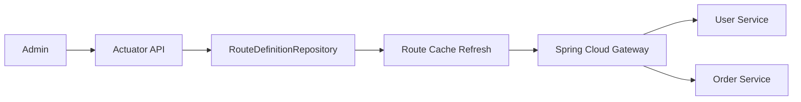
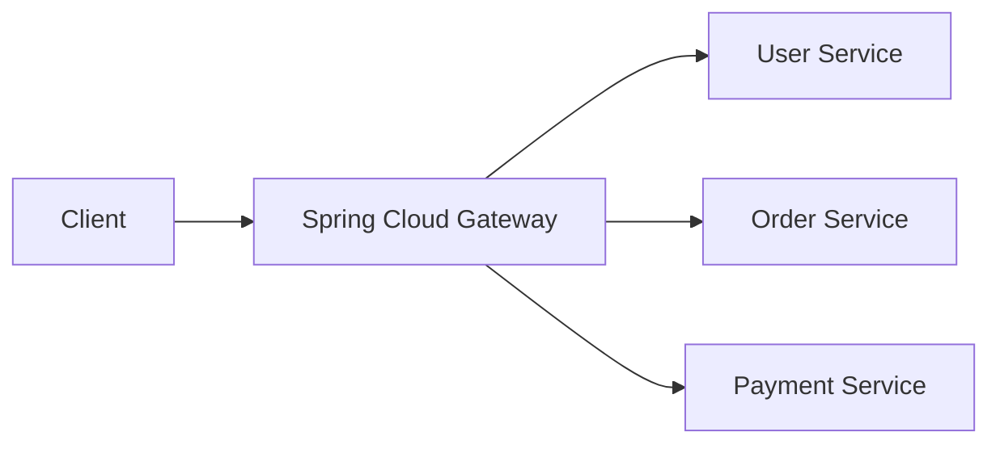
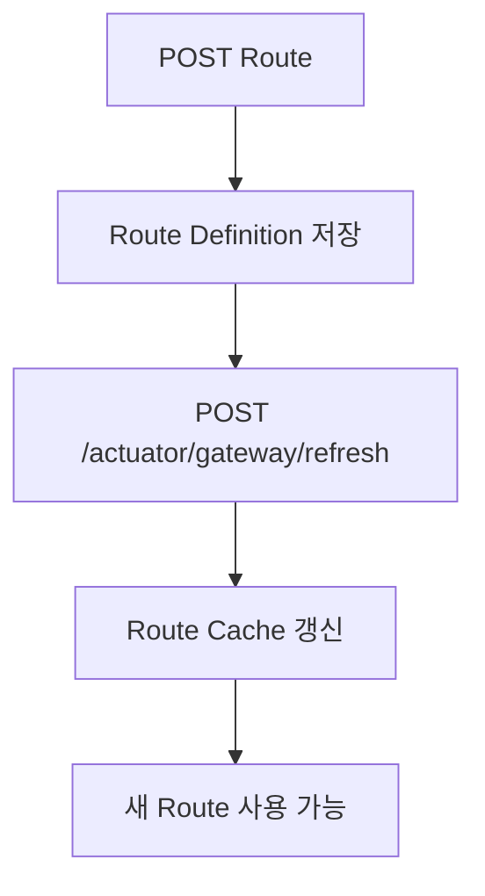
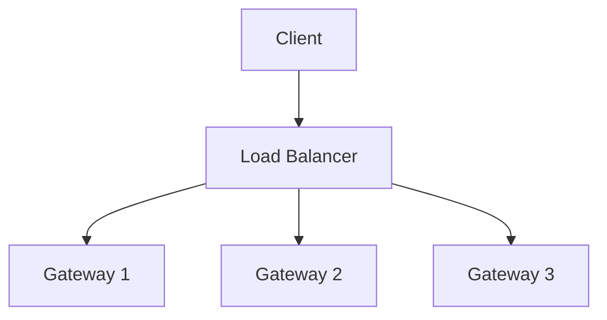
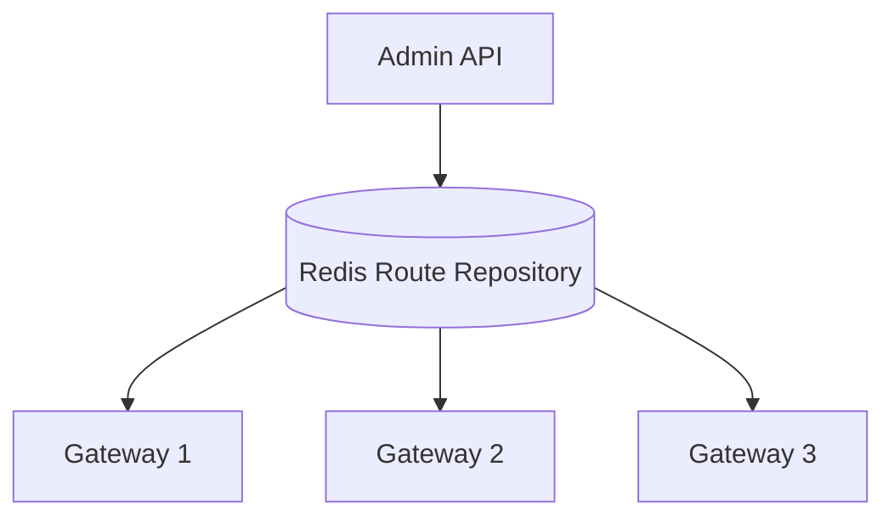
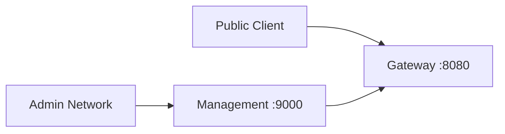
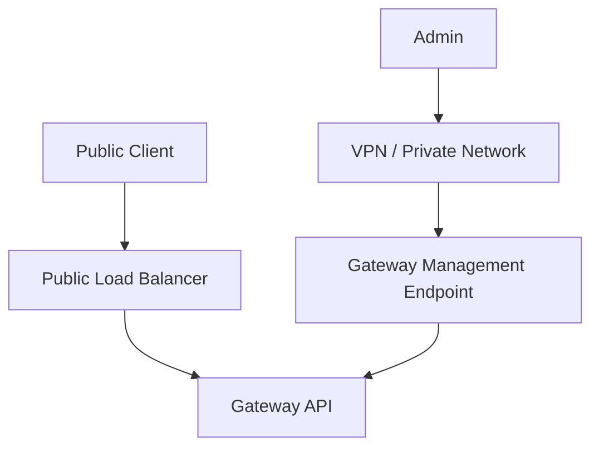
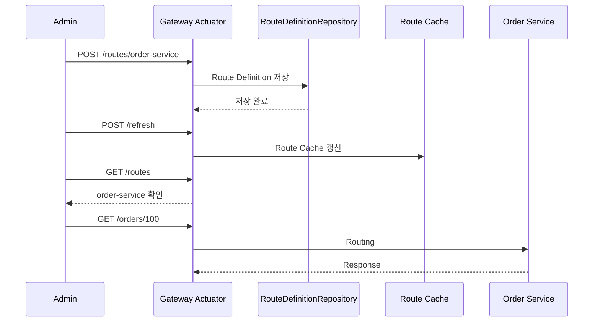
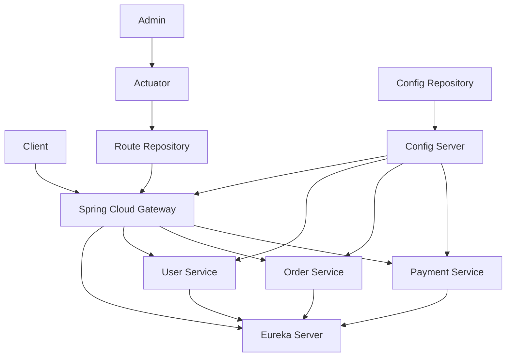

# 스프링 클라우드 MSA 11 - 게이트웨이 라우팅 추가 (actuator)
[https://youtu.be/G2D3m8qhNiI?si=F91JaIcErPJXo_Qr](https://youtu.be/G2D3m8qhNiI?si=F91JaIcErPJXo_Qr)

# 스프링 클라우드 MSA 11 - 게이트웨이 라우팅 추가 (actuator)
* toc
{:toc}

---

## Spring Cloud Gateway에서 Actuator로 동적 Routing 추가하기

Spring Cloud Gateway의 Routing은 일반적으로 `application.yml`, `application.properties`, 또는 Java Configuration을 통해 정의한다.

예를 들어 다음과 같이 Route를 설정할 수 있다.

```yaml
spring:
  cloud:
    gateway:
      routes:
        - id: user-service
          uri: http://localhost:8081
          predicates:
            - Path=/users/**
```

이 설정은 애플리케이션이 시작될 때 읽혀 Gateway의 Routing 정보로 사용된다.

그런데 서비스가 운영된 이후 새로운 마이크로서비스가 추가된다면 어떻게 해야 할까?

예를 들어 기존 시스템에는 다음 Route만 존재한다고 가정해보자.

```text
/users/**
→ User Service

/docs/**
→ Document Service
```

서비스 운영 중 새로운 Order Service가 추가되었다.

```text
/orders/**
→ Order Service
```

Routing 정보를 정적 설정 파일에만 관리한다면 일반적으로 설정을 수정하고 Gateway 애플리케이션을 다시 반영해야 한다.

하지만 Gateway는 모든 외부 요청이 들어오는 핵심 진입점이기 때문에 단순한 Route 추가를 위해 Gateway 전체를 중단하는 방식은 운영 측면에서 부담이 크다.

Spring Cloud Gateway에서는 **Actuator의 Gateway 관리 API를 이용해 애플리케이션 실행 중에도 Route Definition을 추가·조회·삭제하고 Route Cache를 Refresh하는 방식**을 사용할 수 있다.

전체적인 흐름은 다음과 같다.



즉 핵심은 다음과 같다.

```text
Gateway 실행 유지
→ Actuator API 호출
→ 새로운 Route 등록
→ Route Refresh
→ 새로운 Routing 적용
```

---

## 왜 실행 중에 Route를 변경해야 할까?

API Gateway는 대부분 시스템의 가장 앞단에 위치한다.



Gateway가 중단되면 내부의 User Service, Order Service, Payment Service가 모두 정상이어도 외부 사용자가 서비스에 접근하지 못할 수 있다.

```text
User Service     UP
Order Service    UP
Payment Service  UP

Gateway          DOWN

결과
→ 외부 API 접근 불가능
```

따라서 운영 환경에서는 Gateway 자체를 여러 Instance로 구성하거나 Rolling Deployment를 적용하는 것이 일반적이다.

그러나 단순히 Route 하나를 추가하기 위해 전체 Gateway를 다시 배포하는 것보다, 상황에 따라 실행 중인 Gateway에 Routing 정보를 동적으로 추가하는 방식이 필요할 수도 있다.

예를 들어 다음과 같은 상황이다.

```text
기존

/users/**
/docs/**
```

서비스 확장 후:

```text
/users/**
/docs/**
/orders/**
/payments/**
```

동적 Routing을 사용하면 Gateway 프로세스를 종료하지 않고 새로운 Route를 등록할 수 있다.

---

## 동적 Routing과 무중단 배포는 같은 개념이 아니다

여기서 하나 구분해야 할 것이 있다.

Actuator를 이용해 Route를 추가한다고 해서 이것 자체가 Gateway의 고가용성이나 무중단 배포 전체를 해결하는 것은 아니다.

두 개념의 역할이 다르다.

```text
동적 Routing

Gateway 실행 중
Route 추가/삭제/변경
```

반면:

```text
무중단 운영

Gateway 다중화
Load Balancer
Rolling Update
Health Check
Auto Scaling
```

즉 Actuator Routing은 **Gateway 재시작 없이 Route Definition을 변경하는 기능**이지, Gateway 장애까지 해결해주는 기능은 아니다.

---

## Spring Boot Actuator란?

Spring Boot Actuator는 실행 중인 Spring Boot 애플리케이션의 상태를 확인하거나 관리할 수 있는 Endpoint들을 제공한다.

대표적인 Endpoint는 다음과 같다.

```text
/actuator/health
/actuator/info
/actuator/metrics
```

Spring Cloud Gateway를 사용하면 Gateway 전용 Actuator Endpoint도 사용할 수 있다.

```text
/actuator/gateway
```

이를 이용하면 다음과 같은 작업을 수행할 수 있다.

```text
현재 Route 조회
특정 Route 조회
Route 추가
Route 삭제
Route Cache Refresh
Global Filter 확인
Route Filter 확인
```

현재 Spring Cloud Gateway 공식 문서에서도 `/actuator/gateway`를 Gateway를 모니터링하고 관리하기 위한 Endpoint로 제공하고 있다.

---

## 필요한 의존성

Gateway 프로젝트에는 Gateway와 Actuator 의존성이 필요하다.

### build.gradle

```gradle
dependencies {
    implementation 'org.springframework.cloud:spring-cloud-starter-gateway'

    implementation 'org.springframework.boot:spring-boot-starter-actuator'

    testImplementation 'org.springframework.boot:spring-boot-starter-test'
}
```

최근 Spring Cloud Gateway 버전에서는 사용하는 Gateway 구현에 따라 Starter 이름이 달라질 수 있으므로 프로젝트의 Spring Cloud 버전에 맞는 Starter를 사용하는 것이 중요하다.

핵심적인 Actuator 의존성은 다음과 같다.

```gradle
implementation 'org.springframework.boot:spring-boot-starter-actuator'
```

---

## Actuator Gateway Endpoint 활성화

Actuator 의존성만 추가했다고 모든 관리 API가 외부에 노출되는 것은 아니다.

Spring Boot에서는 기본적으로 HTTP를 통해 노출하는 Endpoint를 제한한다. 현재 Spring Boot 공식 문서에서도 기본 HTTP 노출 Endpoint는 `health`이며, 추가 Endpoint를 사용하려면 `management.endpoints.web.exposure.include`를 설정해야 한다.

Gateway Endpoint를 노출하려면 다음과 같이 설정할 수 있다.

### application.yml

```yaml
management:
  endpoints:
    web:
      exposure:
        include:
          - gateway
```

Properties 방식은 다음과 같다.

```properties
management.endpoints.web.exposure.include=gateway
```

---

## 현재 Spring Cloud Gateway의 Endpoint 접근 설정

현재 Spring Cloud Gateway에서는 Gateway Actuator Endpoint의 접근이 기본적으로 비활성화되어 있다.

조회만 허용하려면 다음과 같이 구성할 수 있다.

```yaml
management:
  endpoint:
    gateway:
      access: read-only

  endpoints:
    web:
      exposure:
        include:
          - gateway
```

이 경우 Route 조회 등의 읽기 작업은 가능하지만 Route 생성·삭제·Refresh 같은 변경 작업은 제한된다.

현재 공식 문서에서는 Route 생성, 삭제, Refresh가 필요하면 Gateway Endpoint에 `unrestricted` 접근 권한이 필요하다고 안내한다.

따라서 이번처럼 실행 중 Route를 변경하려면 다음과 같이 구성할 수 있다.

```yaml
management:
  endpoint:
    gateway:
      access: unrestricted

  endpoints:
    web:
      exposure:
        include:
          - gateway
```

Properties 방식은 다음과 같다.

```properties
management.endpoint.gateway.access=unrestricted
management.endpoints.web.exposure.include=gateway
```

Spring Cloud Gateway는 기존 호환 방식으로 다음 설정도 안내하고 있다.

```properties
management.endpoint.gateway.enabled=true
```

하지만 현재 접근 제어 모델을 사용할 수 있는 환경이라면 `access` 설정을 명확히 사용하는 편이 의도를 이해하기 쉽다.

---

## 모든 Actuator Endpoint를 노출하면 안 되는 이유

다음처럼 모든 Endpoint를 열 수도 있다.

```yaml
management:
  endpoints:
    web:
      exposure:
        include: "*"
```

하지만 운영 환경에서는 권장하기 어렵다.

Actuator에는 애플리케이션 내부 상태와 운영 정보를 확인하거나 일부 동작을 제어할 수 있는 Endpoint가 포함될 수 있기 때문이다.

Spring Boot 공식 문서 역시 공개되는 Actuator Endpoint에는 민감한 정보가 있을 수 있으므로 노출 범위를 신중하게 결정하고 보안해야 한다고 안내한다.

따라서 필요한 것만 명시하는 것이 좋다.

```yaml
management:
  endpoints:
    web:
      exposure:
        include:
          - health
          - gateway
```

---

## 기본 Gateway 설정

간단한 테스트를 위해 Gateway를 `8080` Port에서 실행한다고 가정한다.

```yaml
server:
  port: 8080

management:
  endpoint:
    gateway:
      access: unrestricted

  endpoints:
    web:
      exposure:
        include:
          - gateway
          - health
```

아직 Route를 정의하지 않았다면 Gateway에는 전달할 목적지가 없다.

---

## 현재 등록된 Route 조회

현재 Gateway에 존재하는 모든 Route를 확인하려면 다음 Endpoint를 사용한다.

```text
GET /actuator/gateway/routes
```

curl을 사용하면 다음과 같다.

```bash
curl http://localhost:8080/actuator/gateway/routes
```

Route가 없다면 빈 배열 형태의 결과를 확인할 수 있다.

```json
[]
```

Route가 존재한다면 다음과 유사한 정보가 반환된다.

```json
[
  {
    "predicate": "Paths: [/users/**]",
    "route_id": "user-service",
    "filters": [],
    "uri": "http://localhost:8081",
    "order": 0
  }
]
```

현재 공식 API에서도 `GET /actuator/gateway/routes`를 Gateway에 정의된 전체 Route 조회 Endpoint로 제공한다.

---

## 특정 Route 조회

모든 Route가 아니라 특정 Route 하나만 확인할 수도 있다.

```text
GET /actuator/gateway/routes/{routeId}
```

예를 들어:

```bash
curl \
  http://localhost:8080/actuator/gateway/routes/user-service
```

응답 예시는 다음과 같다.

```json
{
  "route_id": "user-service",
  "predicate": "Paths: [/users/**]",
  "filters": [],
  "uri": "http://localhost:8081",
  "order": 0
}
```

---

## 정적 Route를 하나 만들어보기

먼저 기존 설정 파일에 Route 하나가 있다고 가정해보자.

```yaml
spring:
  cloud:
    gateway:
      routes:
        - id: user-service
          uri: http://localhost:8081
          predicates:
            - Path=/users/**
```

Gateway를 실행한 후 다음 요청을 호출한다.

```bash
curl http://localhost:8080/actuator/gateway/routes
```

그러면 `user-service` Route를 확인할 수 있다.

---

## 실행 중 새로운 Route 추가하기

이제 Gateway를 종료하지 않고 새로운 Route를 추가해보자.

추가할 Route는 다음과 같다.

```text
Route ID
→ order-service

Path
→ /orders/**

Target
→ http://localhost:8082
```

현재 공식 Gateway Actuator API에서는 다음 Endpoint에 POST 요청을 전송한다.

```text
POST /actuator/gateway/routes/{routeId}
```

따라서 요청 주소는 다음과 같다.

```text
POST /actuator/gateway/routes/order-service
```

현재 Spring Cloud Gateway에서는 Predicate와 Filter를 생성 요청에 사용할 때 Shortcut DSL 문자열 형태를 사용할 수 있다.

예시는 다음과 같다.

```json
{
  "predicates": [
    "Path=/orders/**"
  ],
  "filters": [],
  "uri": "http://localhost:8082",
  "order": 0
}
```

---

## curl로 Route 추가하기

```bash
curl \
  -X POST \
  http://localhost:8080/actuator/gateway/routes/order-service \
  -H "Content-Type: application/json" \
  -d '{
    "predicates": [
      "Path=/orders/**"
    ],
    "filters": [],
    "uri": "http://localhost:8082",
    "order": 0
  }'
```

각 값의 의미는 다음과 같다.

| 항목                | 의미                |
| ----------------- | ----------------- |
| `order-service`   | Route ID          |
| `Path=/orders/**` | Route 선택 조건       |
| `filters`         | Route에 적용할 Filter |
| `uri`             | 요청을 전달할 서버        |
| `order`           | Route 순서          |

현재 공식 API에서는 Route 생성 성공 시 `201 Created`를 반환한다.

---

## Route 추가와 실제 적용은 별개의 과정

Route Definition을 등록했다고 해서 Routing Cache에 곧바로 반영된다고 단순하게 생각해서는 안 된다.

새로운 Route를 반영하려면 Route Refresh를 수행한다.

```text
POST /actuator/gateway/refresh
```

curl은 다음과 같다.

```bash
curl \
  -X POST \
  http://localhost:8080/actuator/gateway/refresh
```

현재 공식 문서에서도 Route 생성 후 `/actuator/gateway/refresh`를 호출하여 애플리케이션을 재시작하지 않고 변경 내용을 적용하도록 안내한다.

흐름은 다음과 같다.



---

## Route 목록 다시 확인하기

Refresh 이후 Route 목록을 다시 확인한다.

```bash
curl \
  http://localhost:8080/actuator/gateway/routes
```

결과에는 기존 `user-service`와 새로 추가한 `order-service`가 함께 나타날 수 있다.

```json
[
  {
    "route_id": "user-service",
    "uri": "http://localhost:8081"
  },
  {
    "route_id": "order-service",
    "uri": "http://localhost:8082"
  }
]
```

---

## 실제 Routing 테스트

Order Service가 다음 Port에서 실행 중이라고 가정한다.

```text
localhost:8082
```

Order Service에서는 다음 API를 제공한다.

```java
@RestController
public class OrderController {

    @GetMapping("/orders/{id}")
    public String getOrder(
            @PathVariable Long id
    ) {
        return "orderId=" + id;
    }
}
```

Gateway로 요청한다.

```bash
curl \
  http://localhost:8080/orders/100
```

동작 과정은 다음과 같다.

```text
Client

GET /orders/100
      ↓
Gateway
      ↓
Path=/orders/**
      ↓
order-service Route
      ↓
http://localhost:8082
      ↓
Order Service
```

Gateway를 재시작하지 않았음에도 새롭게 추가된 Route가 사용된다.

---

## Postman으로 Route 추가하기

curl 대신 Postman 같은 API Client를 사용할 수도 있다.

Method:

```text
POST
```

URL:

```text
http://localhost:8080/actuator/gateway/routes/order-service
```

Header:

```text
Content-Type: application/json
```

Body:

```json
{
  "predicates": [
    "Path=/orders/**"
  ],
  "filters": [],
  "uri": "http://localhost:8082",
  "order": 0
}
```

Route를 추가한 뒤 별도로 다음 요청을 호출한다.

```text
POST
http://localhost:8080/actuator/gateway/refresh
```

---

## Filter가 포함된 동적 Route

Actuator를 통해 Filter가 포함된 Route도 생성할 수 있다.

예를 들어 외부에서는 다음 경로를 사용한다고 가정한다.

```text
/api/orders/100
```

하지만 내부 Order Service는 다음 경로를 사용한다.

```text
/orders/100
```

`/api`를 제거하고 싶다면 `StripPrefix` Filter를 사용할 수 있다.

Route Body는 다음처럼 구성할 수 있다.

```json
{
  "predicates": [
    "Path=/api/orders/**"
  ],
  "filters": [
    "StripPrefix=1"
  ],
  "uri": "http://localhost:8082",
  "order": 0
}
```

동작은 다음과 같다.

```text
외부 요청

/api/orders/100

      ↓

Gateway

StripPrefix=1

      ↓

내부 요청

/orders/100
```

현재 공식 Actuator API에서도 Route 생성 시 `"Path=/foo/**"`, `"StripPrefix=1"`과 같은 Shortcut DSL 형태를 사용하도록 안내한다.

---

## 동적으로 추가한 Route 삭제

Route를 제거하려면 다음 Endpoint를 사용한다.

```text
DELETE /actuator/gateway/routes/{routeId}
```

`order-service`를 삭제한다면:

```bash
curl \
  -X DELETE \
  http://localhost:8080/actuator/gateway/routes/order-service
```

현재 공식 API에서는 정상 삭제 시 `200 OK`를 반환한다.

삭제 후에도 Refresh가 필요하다.

```bash
curl \
  -X POST \
  http://localhost:8080/actuator/gateway/refresh
```

전체 흐름은 다음과 같다.

```text
DELETE Route
→ Route Definition 제거

POST Refresh
→ Route Cache 재구성

결과
→ 해당 Routing 제거
```

---

## Route 수정은 어떻게 할까?

기존 Route의 URI를 변경한다고 생각해보자.

기존:

```text
order-service
→ localhost:8082
```

변경:

```text
order-service
→ localhost:8083
```

현재 공식 문서에서는 기존 Route ID에 그대로 POST하여 덮어쓰는 방식을 권장하지 않는다.

동일한 ID로 중복 POST할 경우 내부적으로 Route Definition이 중복되어 이후 조회에서 문제가 발생할 수 있기 때문이다.

현재 권장 절차는 다음과 같다.

```text
1. DELETE 기존 Route

2. POST 변경된 Route

3. POST Refresh
```

즉 다음과 같다.

```bash
curl \
  -X DELETE \
  http://localhost:8080/actuator/gateway/routes/order-service
```

새 Route를 생성한다.

```bash
curl \
  -X POST \
  http://localhost:8080/actuator/gateway/routes/order-service \
  -H "Content-Type: application/json" \
  -d '{
    "predicates": [
      "Path=/orders/**"
    ],
    "filters": [],
    "uri": "http://localhost:8083",
    "order": 0
  }'
```

그리고 Refresh한다.

```bash
curl \
  -X POST \
  http://localhost:8080/actuator/gateway/refresh
```

---

## application.yml로 등록한 Route도 삭제할 수 있을까?

여기서 매우 중요한 차이가 있다.

다음 Route가 `application.yml`에 정의되어 있다고 가정한다.

```yaml
spring:
  cloud:
    gateway:
      routes:
        - id: user-service
          uri: http://localhost:8081
          predicates:
            - Path=/users/**
```

이 Route를 다음 Endpoint로 삭제하려고 한다.

```text
DELETE /actuator/gateway/routes/user-service
```

현재 Spring Cloud Gateway에서는 **Actuator API를 통해 만들어진 Route만 해당 API로 수정하거나 삭제할 수 있다.**

`application.yml`이나 `@Bean` 등 애플리케이션 설정으로 정의된 Route는 Actuator 관점에서는 Read-Only이며 삭제 요청 시 `404 Not Found`가 반환될 수 있다.

즉 Route의 출처를 구분해야 한다.

| Route 정의 방법       | Actuator 조회 | Actuator 삭제 |
| ----------------- | ----------: | ----------: |
| `application.yml` |          가능 |          불가 |
| Java `@Bean`      |          가능 |          불가 |
| Actuator POST     |          가능 |          가능 |

---

## Actuator로 만든 Route는 어디에 저장될까?

기본적인 동적 Route 처리에서는 `RouteDefinitionRepository`가 사용된다.

Spring Cloud Gateway는 기본적으로 `InMemoryRouteDefinitionRepository`를 제공한다.

이 Repository는 이름 그대로 **하나의 Gateway Instance 메모리 내부에서만 존재한다.**

따라서 중요한 문제가 생긴다.

```text
Gateway 실행

Actuator로 Route 추가

     ↓

메모리에 저장

     ↓

Gateway 재시작

     ↓

동적으로 추가한 Route 유지 문제 발생
```

즉 Actuator를 이용한 Route 변경을 영구적인 운영 설정 저장 방식으로 그대로 사용하는 것은 신중해야 한다.

---

## Gateway가 여러 대라면 더 큰 문제가 생긴다

운영 환경에서는 Gateway를 한 대만 실행하지 않는 경우가 많다.

예를 들어 다음과 같이 구성할 수 있다.



Gateway 1에만 다음 요청을 보냈다고 가정한다.

```text
POST Gateway 1
/actuator/gateway/routes/order-service
```

In-Memory Repository를 사용한다면 Route 정보는 Gateway 1 내부에만 존재한다.

```text
Gateway 1
→ order-service 있음

Gateway 2
→ 없음

Gateway 3
→ 없음
```

그 결과 Load Balancer가 어느 Gateway로 요청을 전달했느냐에 따라 Routing 결과가 달라질 수 있다.

Spring Cloud Gateway 공식 문서 역시 `InMemoryRouteDefinitionRepository`는 하나의 Gateway Instance 메모리에만 존재하기 때문에 여러 Gateway 사이에서 Route를 공유하는 용도로 적합하지 않다고 설명한다.

---

## 여러 Gateway에서 Route를 공유하려면

현재 Spring Cloud Gateway에서는 여러 Gateway Instance가 Route Definition을 공유하기 위한 방식으로 Redis 기반 Repository를 제공한다.

공식 문서에서는 다음 설정으로 `RedisRouteDefinitionRepository`를 활성화할 수 있다고 설명한다.

```yaml
spring:
  cloud:
    gateway:
      redis-route-definition-repository:
        enabled: true
```

Reactive Redis 의존성도 필요하다.

```gradle
implementation 'org.springframework.boot:spring-boot-starter-data-redis-reactive'
```

구조는 다음과 같다.



이렇게 하면 Gateway마다 별도의 메모리 Route를 관리하는 것보다 중앙 Route Repository를 구성하기 쉽다.

---

## 다음 단계인 DB 기반 Dynamic Routing과의 차이

Actuator 방식은 Dynamic Routing의 개념을 이해하기에는 좋다.

```text
REST API
→ RouteDefinition 저장
→ Refresh
```

하지만 운영 환경에서는 다음 요구가 생길 수 있다.

```text
Route 영구 저장
Route 이력 관리
여러 Gateway 간 Route 공유
관리자 UI
승인 절차
변경 감사 로그
Rollback
```

따라서 별도의 Route Repository를 설계할 수 있다.

예를 들어:

```text
Admin API
    ↓
Route Database
    ↓
RouteDefinitionRepository
    ↓
Gateway Refresh
```

이 구조에서는 Gateway Route 자체가 하나의 운영 데이터가 된다.

---

## Actuator Gateway Endpoint 보안이 중요한 이유

이번 기능에서 가장 중요한 운영 고려사항이다.

다음 Endpoint가 외부에 아무런 인증 없이 노출되어 있다고 생각해보자.

```text
POST /actuator/gateway/routes/{id}
```

공격자가 다음 Route를 추가할 수도 있다.

```json
{
  "predicates": [
    "Path=/payments/**"
  ],
  "filters": [],
  "uri": "https://attacker.example.com",
  "order": -100
}
```

그리고 Refresh한다.

```text
POST /actuator/gateway/refresh
```

Routing 우선순위와 구성에 따라 내부 요청 흐름을 악의적으로 변경할 가능성이 생긴다.

즉 Route 변경 API는 단순한 모니터링 Endpoint가 아니다.

```text
Gateway Routing Control Plane
```

에 가까운 강력한 관리 기능이다.

현재 Spring Cloud Gateway 공식 문서도 Route 생성·삭제·Refresh를 허용한다면 Actuator Endpoint를 반드시 적절하게 보호해야 한다고 명시한다.

---

## Spring Security 추가

운영 환경에서는 Spring Security를 함께 적용할 수 있다.

```gradle
implementation 'org.springframework.boot:spring-boot-starter-security'
```

예를 들어 Health Check는 허용하고 Gateway 관리 Endpoint는 ADMIN만 접근하도록 구성할 수 있다.

```java
@Configuration
@EnableWebFluxSecurity
public class SecurityConfig {

    @Bean
    public SecurityWebFilterChain securityWebFilterChain(
            ServerHttpSecurity http
    ) {

        return http
                .csrf(ServerHttpSecurity.CsrfSpec::disable)
                .authorizeExchange(exchange -> exchange

                        .pathMatchers(
                                "/actuator/health"
                        )
                        .permitAll()

                        .pathMatchers(
                                "/actuator/gateway/**"
                        )
                        .hasRole("ADMIN")

                        .anyExchange()
                        .authenticated()
                )
                .httpBasic(
                        Customizer.withDefaults()
                )
                .build();
    }
}
```

WebFlux 기반 Gateway라면 Spring MVC의 `SecurityFilterChain`이 아니라 Reactive Security의 `SecurityWebFilterChain`을 사용하는 점도 주의해야 한다.

---

## CSRF와 POST/DELETE 요청

Actuator Gateway API는 다음과 같은 변경 요청을 사용한다.

```text
POST
DELETE
```

Spring Security의 CSRF가 활성화된 상태에서 브라우저가 아닌 API Client로 POST나 DELETE를 호출하면 `403 Forbidden`이 발생할 수 있다.

Spring Boot 공식 문서도 CSRF가 기본 활성화되어 있기 때문에 POST, PUT, DELETE 방식의 Actuator 작업에서 403이 발생할 수 있다고 설명한다.

서버 간 관리 API이고 Cookie 기반 브라우저 Session을 사용하지 않는 구조라면 보안 정책을 검토한 후 `/actuator/gateway/**`에 대해서만 CSRF 예외를 적용하는 방식도 고려할 수 있다.

핵심은 단순히 전체 CSRF를 무조건 끄는 것이 아니라 인증 방식과 호출 주체에 따라 결정하는 것이다.

---

## 관리 Endpoint를 별도 Port로 분리하기

Gateway API와 Actuator 관리 API를 같은 Public Port에 노출할 필요도 없다.

예를 들어 외부 요청은 `8080`에서 받고 관리 Endpoint는 `9000`으로 분리할 수 있다.

```yaml
server:
  port: 8080

management:
  server:
    port: 9000

  endpoint:
    gateway:
      access: unrestricted

  endpoints:
    web:
      exposure:
        include:
          - health
          - gateway
```

구조는 다음과 같다.



네트워크 레벨에서도 `9000` Port를 내부 Admin Network에서만 접근할 수 있도록 제한한다면 보안 수준을 높일 수 있다.

---

## Actuator Endpoint 보안 권장 구조

실무에서는 다음 구조를 고려할 수 있다.



즉:

```text
Public Traffic

Client
→ Gateway API
```

관리 요청은:

```text
Admin
→ VPN / Internal Network
→ Auth
→ Actuator Gateway API
```

로 분리한다.

---

## 조회 전용 Endpoint와 변경 Endpoint를 구분하기

운영 환경에서 반드시 동적 Route 수정이 필요한 것이 아니라 Route 상태만 모니터링하려는 경우에는 `unrestricted` 대신 `read-only`를 사용하는 것이 안전하다.

```yaml
management:
  endpoint:
    gateway:
      access: read-only
```

이 경우 다음 기능처럼 조회 중심으로 사용할 수 있다.

```text
GET /actuator/gateway/routes
GET /actuator/gateway/routes/{id}
```

반대로 Route 생성·삭제·Refresh가 필요할 때만:

```yaml
management:
  endpoint:
    gateway:
      access: unrestricted
```

를 사용한다.

최소 권한 원칙을 적용하는 것이다.

---

## Route 관리 API 정리

현재 Gateway Actuator의 주요 Endpoint를 정리하면 다음과 같다.

| Method | Endpoint                          | 역할                      |
| ------ | --------------------------------- | ----------------------- |
| GET    | `/actuator/gateway/routes`        | 전체 Route 조회             |
| GET    | `/actuator/gateway/routes/{id}`   | 특정 Route 조회             |
| POST   | `/actuator/gateway/routes/{id}`   | Route 추가                |
| DELETE | `/actuator/gateway/routes/{id}`   | Route 삭제                |
| POST   | `/actuator/gateway/refresh`       | Route Cache Refresh     |
| GET    | `/actuator/gateway/globalfilters` | Global Filter 조회        |
| GET    | `/actuator/gateway/routefilters`  | Route Filter Factory 조회 |

---

## Route 추가 전체 과정

동적 Route 추가 과정을 하나로 정리해보자.

### 1. Gateway 실행

```text
Gateway
→ localhost:8080
```

### 2. 기존 Route 확인

```bash
curl \
  http://localhost:8080/actuator/gateway/routes
```

### 3. 새로운 Route 추가

```bash
curl \
  -X POST \
  http://localhost:8080/actuator/gateway/routes/order-service \
  -H "Content-Type: application/json" \
  -d '{
    "predicates": [
      "Path=/orders/**"
    ],
    "filters": [],
    "uri": "http://localhost:8082",
    "order": 0
  }'
```

### 4. Route Refresh

```bash
curl \
  -X POST \
  http://localhost:8080/actuator/gateway/refresh
```

### 5. 추가 결과 확인

```bash
curl \
  http://localhost:8080/actuator/gateway/routes/order-service
```

### 6. 실제 Routing 확인

```bash
curl \
  http://localhost:8080/orders/100
```

이 모든 과정에서 Gateway 애플리케이션 자체는 계속 실행 중이다.

---

## Route 삭제 전체 과정

삭제도 비슷하다.

### 1. Route 삭제

```bash
curl \
  -X DELETE \
  http://localhost:8080/actuator/gateway/routes/order-service
```

### 2. Route Refresh

```bash
curl \
  -X POST \
  http://localhost:8080/actuator/gateway/refresh
```

### 3. Route 목록 확인

```bash
curl \
  http://localhost:8080/actuator/gateway/routes
```

---

## Dynamic Routing 전체 구조



---

## Config Server와 Dynamic Routing의 차이

앞에서 Config Server를 이용해 Gateway Route를 외부 설정으로 관리할 수도 있었다.

예를 들어 Config Repository에 다음 값을 저장한다.

```yaml
spring:
  cloud:
    gateway:
      routes:
        - id: order-service
          uri: lb://ORDER-SERVICE
          predicates:
            - Path=/orders/**
```

이것과 Actuator Dynamic Routing은 목적이 조금 다르다.

| 구분    | Config Server   | Gateway Actuator |
| ----- | --------------- | ---------------- |
| 관리 대상 | 애플리케이션 설정       | Route Definition |
| 변경 저장 | Git 등           | Route Repository |
| 변경 이력 | Git으로 관리 가능     | 별도 설계 필요         |
| 즉시 조작 | 추가 과정 필요        | REST API 가능      |
| 운영 통제 | PR/Commit 기반 가능 | 관리 API 기반        |

운영 환경에서는 두 방식을 무조건 경쟁 관계로 볼 필요는 없다.

정적이고 변경 빈도가 낮은 Route는 Git 기반 설정으로 관리하고, 동적 Route가 필요한 영역만 별도 Repository로 관리하는 방식도 가능하다.

---

## Actuator 방식의 장점

### Gateway 재시작이 필요 없다

```text
Route 추가
→ Refresh
→ 즉시 Routing 사용
```

### REST API로 관리할 수 있다

관리 UI나 운영 시스템과 연결하기 쉽다.

### Route 조회가 쉽다

현재 Gateway에서 실제 사용 중인 Route를 확인할 수 있다.

### Route 추가와 삭제가 가능하다

서비스 추가나 긴급 Route 변경 같은 운영 기능을 만들 수 있다.

---

## Actuator 방식의 한계

반대로 주의할 점도 많다.

### 기본 In-Memory Route는 Instance 단위다

Gateway 여러 대에 Route가 자동 공유되는 구조가 아니다.

### 영속성이 필요할 수 있다

Gateway 재시작 이후에도 Route를 유지하려면 중앙 저장소 전략을 고려해야 한다.

### 관리 API 자체가 강력한 공격 지점이다

외부에 공개해서는 안 된다.

### 변경 이력 관리가 별도로 필요하다

Git처럼 자동으로 누가 언제 어떤 Route를 변경했는지 이력이 남는 구조는 아니다.

따라서 운영 시스템에서는 다음 정보도 기록하는 것이 좋다.

```text
Route ID
변경 전 값
변경 후 값
변경 사용자
변경 시간
변경 사유
```

---

## 운영 환경에서 권장하는 Route 변경 흐름

단순히 관리자 한 명이 Postman으로 Production Gateway에 Route를 추가하는 방식은 위험하다.

운영 환경에서는 다음과 같은 흐름을 만들 수 있다.

```text
관리자 Route 변경 요청

        ↓

인증 / 권한 확인

        ↓

Route Validation

        ↓

승인

        ↓

Route Repository 저장

        ↓

Gateway Refresh

        ↓

Health Check

        ↓

Traffic 확인

        ↓

Audit Log 저장
```

잘못된 URI를 등록하면 Gateway가 사용자 요청을 전부 실패시키거나 엉뚱한 서버로 전달할 수 있기 때문이다.

---

## Route Validation에서 확인할 항목

동적 Route를 등록하기 전에 다음 항목을 검증하는 것이 좋다.

```text
Route ID 중복 여부

Path 중복 여부

URI 형식

허용된 Protocol

Service ID 존재 여부

Filter 허용 목록

Route Order 충돌

관리자가 접근 가능한 서비스인지
```

예를 들어 다음 URI를 아무 제약 없이 허용하면 위험할 수 있다.

```text
file://...
ftp://...
외부 공격자 서버
내부 관리 서버
```

따라서 Dynamic Routing API는 입력값 검증도 중요하다.

---

## Gateway Route 변경과 장애 대응

새 Route를 추가한 이후 반드시 관찰해야 하는 지표가 있다.

```text
HTTP 4xx
HTTP 5xx
Response Time
Gateway Timeout
Route별 Request Count
Downstream Connection Error
Circuit Breaker
```

Route를 적용했다고 작업이 끝나는 것이 아니다.

```text
Route 적용

    ↓

Traffic 확인

    ↓

Error Rate 확인

    ↓

문제 발생

    ↓

Route Rollback
```

까지 하나의 운영 절차로 보는 것이 좋다.

---

## 실무에서의 활용

Actuator 기반 Dynamic Routing은 다음과 같은 환경에서 활용할 수 있다.

```text
새로운 마이크로서비스 즉시 연결

일시적인 Routing 변경

A/B Test용 Route

서비스 Migration

Blue/Green Routing

장애 서비스 우회

관리자 기반 Route Management
```

다만 복잡한 Traffic Routing이 필요하다면 API Gateway 자체의 동적 Route뿐 아니라 Kubernetes Ingress, Service Mesh, Cloud Load Balancer 등의 기능과 역할이 중복되지 않는지도 검토해야 한다.

---

## 전체 Spring Cloud MSA에서 Dynamic Routing의 위치

지금까지 구성한 Spring Cloud 요소와 연결해보면 다음과 같다.



각 요소의 역할은 다음과 같이 구분할 수 있다.

```text
Config Server
→ 설정 관리

Eureka
→ 서비스 위치 관리

Gateway
→ 외부 요청 Routing

Actuator Gateway API
→ 실행 중 Route 관리

RouteDefinitionRepository
→ 동적 Route 저장

Load Balancer
→ Service Instance 선택
```

---

## 정리

Spring Cloud Gateway의 Route를 `application.yml`이나 Java Configuration으로만 관리하면 새로운 Route를 적용할 때 설정 변경과 애플리케이션 반영 과정이 필요하다.

Actuator Gateway API를 활성화하면 실행 중인 Gateway에 REST API를 이용해 Route를 추가하거나 삭제할 수 있다.

기본적인 흐름은 다음과 같다.

```text
GET /actuator/gateway/routes
→ 현재 Route 조회
```

```text
POST /actuator/gateway/routes/{id}
→ 새로운 Route 추가
```

```text
POST /actuator/gateway/refresh
→ Route Cache 갱신
```

```text
DELETE /actuator/gateway/routes/{id}
→ Route 삭제
```

현재 Spring Cloud Gateway에서 변경 API까지 사용하려면 Gateway Actuator Endpoint를 HTTP에 노출하고 `unrestricted` 접근이 가능하도록 설정해야 한다.

```yaml
management:
  endpoint:
    gateway:
      access: unrestricted

  endpoints:
    web:
      exposure:
        include:
          - gateway
```

하지만 `unrestricted`라는 이름 그대로 Route 추가·삭제·Refresh라는 강력한 작업이 가능하기 때문에 운영 환경에서는 반드시 인증, 인가, 네트워크 접근 제어를 적용해야 한다.

또한 기본 `InMemoryRouteDefinitionRepository`는 하나의 Gateway Instance 메모리에만 존재하기 때문에 여러 Gateway Instance에서 Dynamic Route를 공유하기에는 적합하지 않다. 여러 Gateway가 동일한 Route를 사용해야 한다면 Redis 기반 Route Repository 또는 별도의 중앙 Route Repository 전략이 필요하다.

결국 Actuator Dynamic Routing의 핵심은 단순히 Gateway를 재시작하지 않는다는 것에서 끝나지 않는다.

```text
동적 Route 변경
+
Route 저장소
+
다중 Gateway 동기화
+
관리 API 보안
+
변경 이력
+
검증
+
Rollback
```

까지 함께 설계해야 실제 운영 가능한 Dynamic Routing 시스템이 된다.

### 한 줄 요약

Spring Cloud Gateway의 Actuator API를 이용하면 Gateway를 중단하지 않고 Route를 추가·삭제한 뒤 `/actuator/gateway/refresh`로 반영할 수 있지만, 운영 환경에서는 관리 Endpoint 보안과 Route 영속화, 다중 Gateway 간 Route 공유 전략까지 함께 설계해야 한다.
