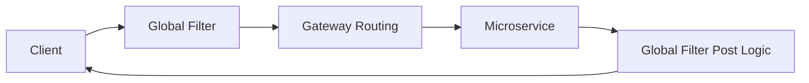
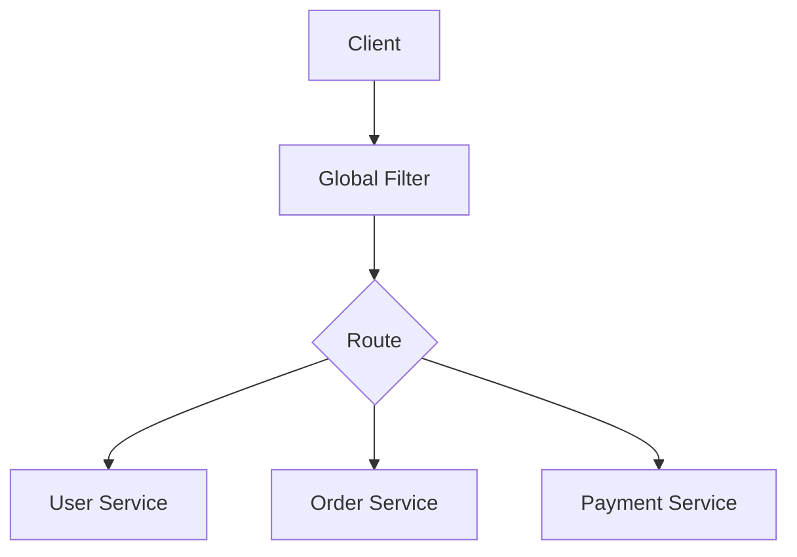
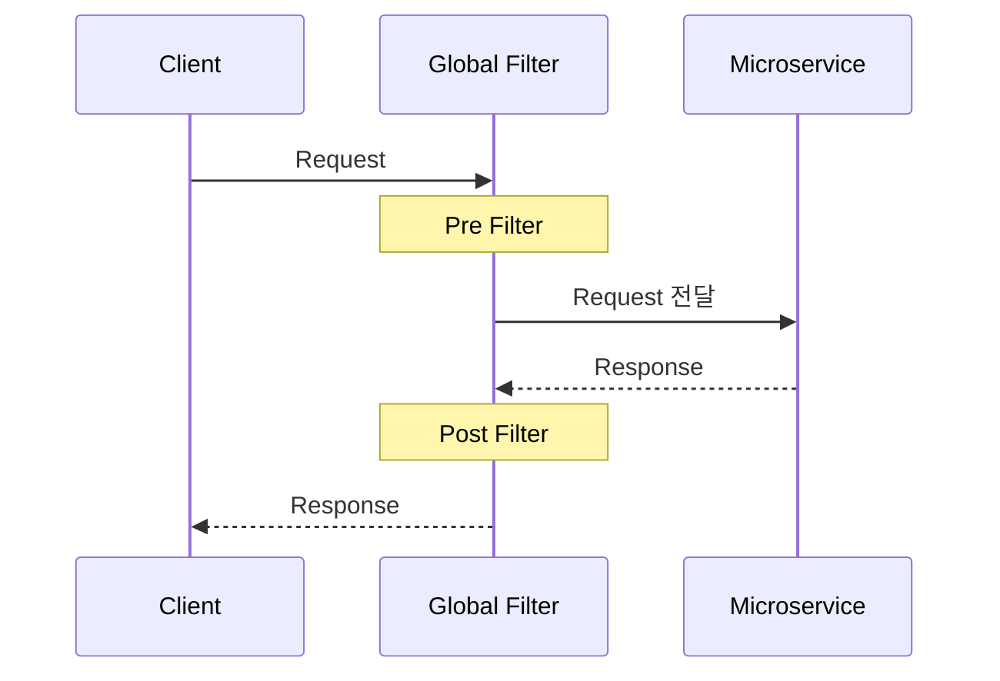
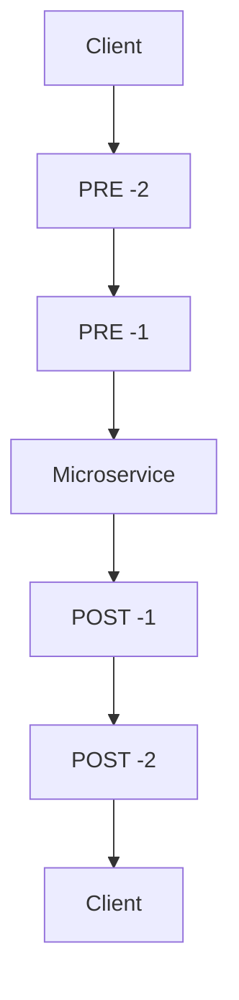
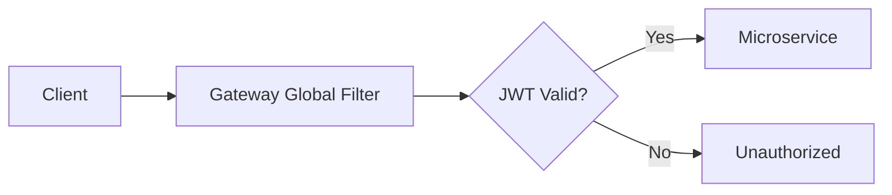
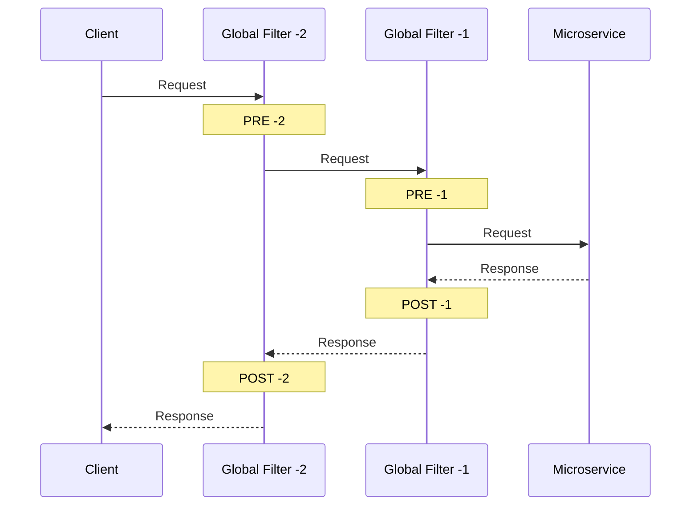
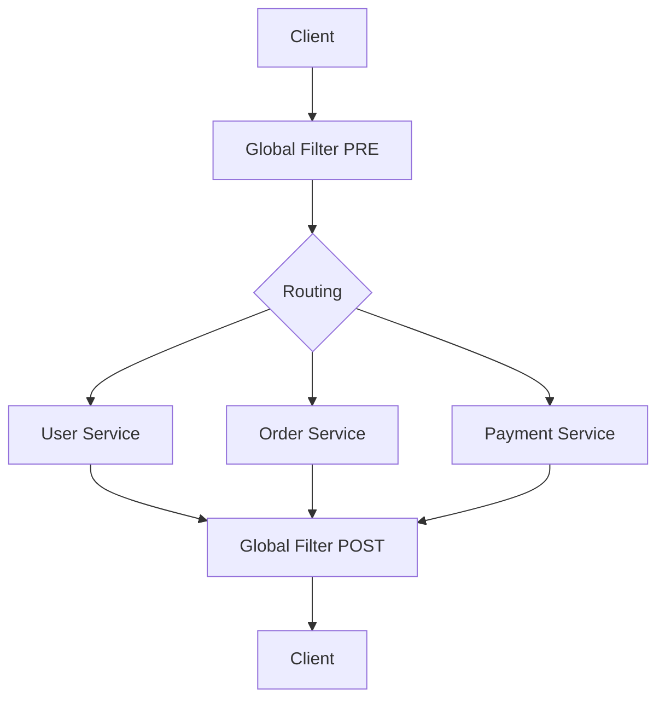
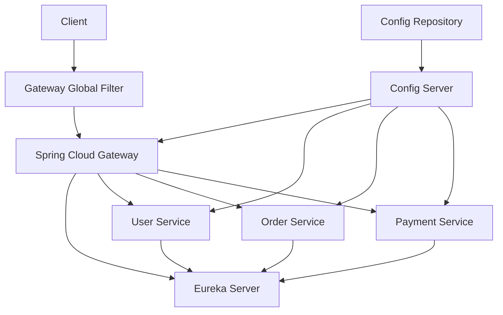

# 스프링 클라우드 MSA 12 - 게이트웨이 글로벌 필터
[https://youtu.be/TgbUGQ-jO2I?si=cGYINYMJo514JugE](https://youtu.be/TgbUGQ-jO2I?si=cGYINYMJo514JugE)

# 스프링 클라우드 MSA 12 - 게이트웨이 글로벌 필터
* toc
{:toc}

---

## Spring Cloud Gateway Global Filter 동작 원리와 구현 방법

Spring Cloud Gateway는 외부 클라이언트의 요청을 받아 적절한 마이크로서비스로 전달하는 MSA의 진입점 역할을 한다.

예를 들어 다음과 같은 구조가 있다고 가정해보자.

```text
Client
   ↓
Spring Cloud Gateway
   ↓
Route 판단
   ↓
User Service / Order Service / Payment Service
```

Gateway의 기본적인 역할은 Routing이지만 실제 운영 환경에서는 단순히 요청을 전달하는 것만으로는 부족하다.

Gateway를 통과하는 요청에 대해 다음과 같은 공통 처리가 필요할 수 있다.

```text
요청 Logging
JWT 검증
특정 IP 차단
Request Header 검사
공통 인증 처리
응답 Logging
```

이러한 로직을 Gateway의 요청 처리 과정에 삽입하기 위해 사용하는 것이 **Filter**다.

특히 모든 Route에 공통으로 적용해야 하는 로직이라면 **Global Filter**를 사용할 수 있다.

전체적인 구조는 다음과 같다.



즉 Global Filter는 특정 서비스 하나에만 적용되는 것이 아니라 Gateway를 통과하는 여러 요청에 공통적으로 적용할 수 있는 필터다.

---

## Gateway Filter란?

Gateway Filter는 요청이 마이크로서비스로 전달되기 전이나 마이크로서비스의 응답이 클라이언트에게 반환되기 전에 특정 로직을 실행하기 위한 기능이다.

예를 들어 클라이언트가 다음 요청을 보낸다고 가정해보자.

```text
GET /orders/100
```

일반적인 요청 흐름은 다음과 같다.

```text
Client
   ↓
Gateway
   ↓
Order Service
   ↓
Gateway
   ↓
Client
```

여기에 Filter가 추가되면 다음과 같이 변경된다.

```text
Client
   ↓
Pre Filter
   ↓
Order Service
   ↓
Post Filter
   ↓
Client
```

Filter에서는 다음과 같은 작업을 수행할 수 있다.

```text
요청 정보 기록
JWT 검증
IP 검사
특정 Header 확인
요청 데이터 가공
응답 상태 기록
```

---

## Global Filter와 특정 Route Filter

Gateway에서 Filter를 적용하는 범위는 크게 두 가지 관점으로 생각할 수 있다.

```text
모든 요청에 적용
→ Global Filter

특정 Route에 적용
→ Route 단위 Filter
```

Global Filter는 별도의 Route 지정 없이 Bean으로 등록하면 Gateway를 통과하는 전체 요청 흐름에 참여한다.

예를 들어 다음과 같은 Route가 있다고 하자.

```text
/users/**
/orders/**
/payments/**
```

Global Filter를 하나 등록했다면 다음 요청 모두가 해당 Filter를 통과할 수 있다.

```text
GET /users/100
GET /orders/200
POST /payments
```

구조는 다음과 같다.



따라서 공통 로직을 처리하기에 적합하다.

---

## Global Filter를 활용할 수 있는 사례

Global Filter가 필요한 대표적인 상황은 다음과 같다.

### 모든 요청 Logging

Gateway가 모든 외부 요청을 받기 때문에 요청 정보를 한곳에서 기록할 수 있다.

```text
Method
Path
Client IP
Request Time
```

---

### JWT 검증

모든 API 요청에 인증 토큰 검사가 필요하다면 Gateway의 공통 Filter에서 처리하는 구조를 생각할 수 있다.

```text
Client
   ↓
JWT 포함 요청
   ↓
Global Filter
   ↓
JWT 검증
   ↓
Microservice
```

---

### IP 검사

특정 IP의 요청을 Gateway 단계에서 확인할 수도 있다.

```text
Client IP 확인
      ↓
허용?
 ┌────┴────┐
Yes       No
 ↓         ↓
서비스   요청 차단
```

---

## Filter는 요청과 응답 과정에 모두 관여한다

Global Filter를 이해할 때 가장 중요한 부분 중 하나다.

하나의 Filter는 요청이 들어오는 과정과 응답이 나가는 과정 모두에 로직을 배치할 수 있다.

이를 일반적으로 다음처럼 구분할 수 있다.

```text
Pre Filter
Post Filter
```

### Pre Filter

마이크로서비스에 요청을 전달하기 전에 실행된다.

```text
Client
   ↓
Pre Filter
   ↓
Microservice
```

대표적인 용도는 다음과 같다.

```text
요청 Logging
JWT 검증
IP 검사
Header 검사
```

---

### Post Filter

마이크로서비스에서 응답을 받은 이후 실행된다.

```text
Microservice
   ↓
Post Filter
   ↓
Client
```

대표적으로 다음과 같은 처리를 생각할 수 있다.

```text
응답 Logging
응답 상태 확인
처리 시간 측정
```

---

## Filter Chain의 기본 구조

Gateway 요청 흐름을 조금 더 자세히 표현하면 다음과 같다.



즉 하나의 Filter가 다음 구조를 가진다고 이해할 수 있다.

```text
Pre Logic
   ↓
chain.filter(exchange)
   ↓
Post Logic
```

`chain.filter(exchange)`를 기준으로 이전에 실행되는 코드는 Pre 처리이고, 이후 Reactive Chain에서 실행되는 코드는 Post 처리에 해당한다.

---

## Global Filter 작성 방법

Global Filter를 만들기 위해 클래스를 하나 생성한다.

예를 들어 다음과 같이 구성할 수 있다.

```text
com.example.gateway
└── filter
    └── GlobalFilterOne.java
```

Global Filter로 등록하기 위해 `@Component`를 사용하고 `GlobalFilter` 인터페이스를 구현한다.

```java
package com.example.gateway.filter;

import org.springframework.cloud.gateway.filter.GatewayFilterChain;
import org.springframework.cloud.gateway.filter.GlobalFilter;
import org.springframework.stereotype.Component;
import org.springframework.web.server.ServerWebExchange;
import reactor.core.publisher.Mono;

@Component
public class GlobalFilterOne implements GlobalFilter {

    @Override
    public Mono<Void> filter(
            ServerWebExchange exchange,
            GatewayFilterChain chain
    ) {

        System.out.println("Global Filter PRE");

        return chain.filter(exchange)
                .then(
                        Mono.fromRunnable(() -> {
                            System.out.println(
                                    "Global Filter POST"
                            );
                        })
                );
    }
}
```

핵심은 다음 부분이다.

```java
System.out.println("Global Filter PRE");
```

마이크로서비스로 요청이 전달되기 전에 실행된다.

그리고:

```java
return chain.filter(exchange)
```

다음 Filter 또는 실제 Routing 흐름을 계속 진행한다.

마지막으로:

```java
.then(
        Mono.fromRunnable(() -> {
            System.out.println(
                    "Global Filter POST"
            );
        })
)
```

Downstream 처리가 완료된 후 실행되는 Post 영역이다.

---

## chain.filter(exchange)의 의미

다음 코드는 매우 중요하다.

```java
chain.filter(exchange)
```

현재 Filter에서 요청 처리를 끝내는 것이 아니라 **다음 Filter Chain으로 요청 처리를 전달하는 역할**을 한다.

개념적으로 보면 다음과 같다.

```text
Global Filter 1
       ↓
chain.filter()
       ↓
Global Filter 2
       ↓
Gateway Routing
       ↓
Microservice
```

따라서 Global Filter가 여러 개 등록될 수도 있다.

---

## Filter가 여러 개라면?

실제 Gateway에서는 하나의 Filter만 사용하는 것이 아니라 여러 Filter를 등록할 수 있다.

예를 들어 다음 두 개가 있다고 가정해보자.

```text
Global Filter 1
→ Logging

Global Filter 2
→ JWT 검증
```

요청은 여러 Filter를 순차적으로 통과한다.

```text
Client
   ↓
Logging Filter
   ↓
JWT Filter
   ↓
Microservice
```

응답은 반대 방향으로 돌아온다.

```text
Microservice
   ↓
JWT Filter
   ↓
Logging Filter
   ↓
Client
```

이 때문에 Filter의 실행 순서를 제어하는 것이 중요하다.

---

## Ordered를 이용한 Filter 순서 지정

Filter 순서를 지정하려면 `Ordered` 인터페이스를 함께 구현할 수 있다.

```java
@Component
public class GlobalFilterOne
        implements GlobalFilter, Ordered {

    @Override
    public Mono<Void> filter(
            ServerWebExchange exchange,
            GatewayFilterChain chain
    ) {

        System.out.println("PRE G1");

        return chain.filter(exchange)
                .then(
                        Mono.fromRunnable(() -> {
                            System.out.println(
                                    "POST G1"
                            );
                        })
                );
    }

    @Override
    public int getOrder() {
        return -2;
    }
}
```

`getOrder()`가 Filter의 실행 순서를 결정한다.

```java
@Override
public int getOrder() {
    return -2;
}
```

Order 값은 정수로 지정한다.

---

## Order 값은 작을수록 먼저 실행된다

Pre Filter에서는 Order 값이 작은 Filter가 먼저 실행된다.

예를 들어 Filter가 다음과 같이 등록되어 있다고 가정한다.

```text
Global Filter 1
order = -2

Global Filter 2
order = -1
```

요청이 들어오면 다음 순서로 실행된다.

```text
Client
   ↓
PRE -2
   ↓
PRE -1
   ↓
Microservice
```

즉:

```text
-2
→ -1
```

순서다.

---

## Post Filter는 반대 순서로 실행된다

여기서 가장 중요한 특징이 있다.

Pre Filter에서 먼저 실행된 Filter는 Post 과정에서는 나중에 실행된다.

예를 들어:

```text
Filter A
order = -2

Filter B
order = -1
```

라고 가정하면 전체 순서는 다음과 같다.

```text
PRE A (-2)
    ↓
PRE B (-1)
    ↓
Microservice
    ↓
POST B (-1)
    ↓
POST A (-2)
```

구조로 보면 다음과 같다.



즉 Filter Chain이 중첩된 구조로 동작한다고 생각하면 이해하기 쉽다.

---

## 두 개의 Global Filter 만들기

실제 실행 순서를 확인하기 위해 두 개의 Filter를 만들어보자.

첫 번째 Filter는 Order 값을 `-2`로 설정한다.

```java
package com.example.gateway.filter;

import org.springframework.cloud.core.Ordered;
import org.springframework.cloud.gateway.filter.GatewayFilterChain;
import org.springframework.cloud.gateway.filter.GlobalFilter;
import org.springframework.stereotype.Component;
import org.springframework.web.server.ServerWebExchange;
import reactor.core.publisher.Mono;

@Component
public class GlobalFilterOne
        implements GlobalFilter, Ordered {

    @Override
    public Mono<Void> filter(
            ServerWebExchange exchange,
            GatewayFilterChain chain
    ) {

        System.out.println("PRE G1 - ORDER -2");

        return chain.filter(exchange)
                .then(
                        Mono.fromRunnable(() -> {
                            System.out.println(
                                    "POST G1 - ORDER -2"
                            );
                        })
                );
    }

    @Override
    public int getOrder() {
        return -2;
    }
}
```

---

## 두 번째 Global Filter

두 번째 Filter는 `-1`을 사용한다.

```java
package com.example.gateway.filter;

import org.springframework.cloud.core.Ordered;
import org.springframework.cloud.gateway.filter.GatewayFilterChain;
import org.springframework.cloud.gateway.filter.GlobalFilter;
import org.springframework.stereotype.Component;
import org.springframework.web.server.ServerWebExchange;
import reactor.core.publisher.Mono;

@Component
public class GlobalFilterTwo
        implements GlobalFilter, Ordered {

    @Override
    public Mono<Void> filter(
            ServerWebExchange exchange,
            GatewayFilterChain chain
    ) {

        System.out.println("PRE G2 - ORDER -1");

        return chain.filter(exchange)
                .then(
                        Mono.fromRunnable(() -> {
                            System.out.println(
                                    "POST G2 - ORDER -1"
                            );
                        })
                );
    }

    @Override
    public int getOrder() {
        return -1;
    }
}
```

---

## 실제 실행 순서

두 Filter가 등록된 상태에서 Client가 Gateway로 요청을 전송한다.

```text
GET http://localhost:8080/ms1/first
```

실행 순서는 다음과 같이 예상할 수 있다.

```text
PRE G1 - ORDER -2

PRE G2 - ORDER -1

Microservice 처리

POST G2 - ORDER -1

POST G1 - ORDER -2
```

즉 요청과 응답의 Filter 순서는 서로 반대다.

---

## Stack 구조로 이해하기

이 구조는 Stack처럼 생각하면 이해하기 쉽다.

요청이 들어올 때 Filter가 쌓인다.

```text
Global Filter -2
        ↓
Global Filter -1
        ↓
Microservice
```

응답은 가장 마지막에 들어간 Filter부터 빠져나온다.

```text
Microservice
        ↓
Global Filter -1
        ↓
Global Filter -2
```

따라서 전체 구조는 다음과 같다.

```text
Request

-2
 ↓
-1
 ↓
Service
 ↓
-1
 ↓
-2

Response
```

---

## Filter 순서가 중요한 이유

실제 운영에서는 여러 공통 Filter가 존재할 수 있다.

예를 들어 다음과 같다.

```text
Request Logging
JWT Validation
IP Validation
Request Header Processing
Tracing
```

순서가 다음과 같다고 가정해보자.

```text
1. Logging
2. JWT Validation
3. Routing
```

요청 정보를 먼저 남기고 JWT 검증을 수행하도록 만들 수 있다.

반대로 인증이 실패한 요청은 Logging 대상에서 제외하고 싶다면 순서를 다르게 구성할 수도 있다.

즉 Filter 순서는 단순한 숫자가 아니라 Gateway의 처리 정책을 결정한다.

---

## Request Logging Global Filter

Global Filter를 활용하면 Gateway에 들어오는 모든 요청의 정보를 확인할 수 있다.

```java
@Component
public class RequestLoggingFilter
        implements GlobalFilter, Ordered {

    @Override
    public Mono<Void> filter(
            ServerWebExchange exchange,
            GatewayFilterChain chain
    ) {

        var request = exchange.getRequest();

        System.out.println(
                "method=" + request.getMethod()
        );

        System.out.println(
                "path=" + request.getURI().getPath()
        );

        return chain.filter(exchange);
    }

    @Override
    public int getOrder() {
        return -10;
    }
}
```

예를 들어 다음 요청이 들어온다.

```text
GET /orders/100
```

다음과 같은 정보를 확인할 수 있다.

```text
method=GET
path=/orders/100
```

---

## Pre와 Post를 이용한 처리 시간 측정

Pre와 Post 구조를 이용하면 요청 처리 시간을 측정하는 로직도 생각할 수 있다.

요청 전에 시간을 저장한다.

```text
startTime
```

응답이 돌아오면 현재 시간과 비교한다.

```text
currentTime - startTime
```

구조는 다음과 같다.

```text
PRE

시작 시간 기록

     ↓

Microservice

     ↓

POST

종료 시간 확인
처리 시간 계산
```

하나의 요청이 Gateway와 Downstream Service를 거쳐 돌아오는 전체 흐름을 확인하는 데 사용할 수 있다.

---

## JWT 검증에 Global Filter를 사용할 수 있는 이유

Gateway는 외부에서 내부 서비스로 들어가는 첫 번째 관문이기 때문에 인증 처리를 수행할 수 있다.



Pre Filter 영역에서 Header를 확인한다.

```text
Authorization
```

JWT가 올바르면 다음 Filter Chain을 실행한다.

```java
return chain.filter(exchange);
```

유효하지 않다면 요청을 내부 서비스까지 전달하지 않는 구조를 만들 수 있다.

다만 모든 Filter에 복잡한 로직을 넣기보다는 각 Filter의 역할을 명확히 나누는 것이 관리하기 좋다.

---

## 특정 IP 검사

Global Filter에서 Client IP를 확인하는 구조도 가능하다.

```text
Client Request
      ↓
Global Filter
      ↓
IP 확인
      ↓
허용 여부 판단
```

차단 대상이라면 요청을 Downstream으로 전달하지 않는다.

허용 대상이라면:

```java
chain.filter(exchange)
```

를 호출해 다음 단계로 넘긴다.

이처럼 Gateway Filter에서는 **다음 Filter Chain을 호출할 것인지 여부** 자체가 요청 흐름을 결정하는 중요한 요소가 된다.

---

## System.out.println 대신 Logging 사용하기

동작 원리를 확인하기 위해서는 다음 코드만으로도 충분하다.

```java
System.out.println("PRE");
```

하지만 운영 환경에서는 일반적으로 Logger를 이용하여 기록하는 구조가 더 적합하다.

개념적으로 다음과 같은 정보를 남길 수 있다.

```text
Request Method
Request Path
Response Status
Request Time
```

특히 모든 요청이 Gateway를 통과하기 때문에 Global Filter에서 과도하게 많은 로그를 남기면 로그 양도 매우 빠르게 증가할 수 있다는 점을 고려해야 한다.

---

## Global Filter에 너무 많은 로직을 넣으면 안 되는 이유

Global Filter는 모든 요청이 통과하는 코드다.

따라서 다음과 같은 무거운 작업을 Global Filter에 넣으면 모든 API 요청에 영향을 줄 수 있다.

```text
매 요청마다 오래 걸리는 DB Query
복잡한 계산
긴 Blocking I/O
외부 API 연속 호출
```

구조를 보면 이유가 명확하다.

```text
Request 1 ─┐
Request 2 ─┤
Request 3 ─┼→ Global Filter → Microservices
Request 4 ─┤
Request 5 ─┘
```

Filter가 느려지면 Gateway 전체 요청 처리 지연으로 이어질 수 있다.

따라서 공통 처리이면서도 Gateway 단계에서 수행할 가치가 있는 로직을 선별하는 것이 중요하다.

---

## WebFlux 기반 Gateway와 Filter

앞에서 구성한 Spring Cloud Gateway는 Reactive 방식의 요청 처리 구조를 사용한다.

Global Filter의 반환 타입 역시 다음과 같다.

```java
Mono<Void>
```

Filter 내부에서도 다음과 같이 Reactive Chain을 연결한다.

```java
return chain.filter(exchange)
        .then(...);
```

따라서 일반적인 순차 코드처럼 다음과 같이 이해하면 부족하다.

```text
Pre 코드
Service 호출
Post 코드
```

실제로는 Reactive Chain을 구성하고 비동기적으로 완료 시점을 연결하는 구조다.

---

## ServerWebExchange

Global Filter의 `filter()` 메서드에서는 다음 객체를 전달받는다.

```java
ServerWebExchange exchange
```

이 객체를 통해 현재 요청과 응답 정보를 확인할 수 있다.

개념적으로 다음과 같다.

```text
ServerWebExchange

├── Request
└── Response
```

Request 정보는 다음처럼 가져올 수 있다.

```java
exchange.getRequest()
```

Response는 다음처럼 접근한다.

```java
exchange.getResponse()
```

따라서 Filter에서는 현재 요청과 응답의 컨텍스트를 이용하여 필요한 처리를 수행할 수 있다.

---

## GatewayFilterChain

두 번째 인자는 다음과 같다.

```java
GatewayFilterChain chain
```

이 객체는 현재 Filter 이후의 Gateway Filter Chain을 표현한다.

```java
chain.filter(exchange)
```

를 호출하면 현재 요청이 다음 Filter 또는 Routing 단계로 이동한다.

반대로 이를 호출하지 않는다면 요청 흐름이 다음 단계로 이어지지 않는 형태를 만들 수도 있다.

전체 관계는 다음과 같다.

```text
ServerWebExchange
→ 현재 Request/Response

GatewayFilterChain
→ 다음 처리 단계
```

---

## Global Filter의 전체 구조

가장 기본적인 형태는 다음과 같다.

```java
@Component
public class SampleGlobalFilter
        implements GlobalFilter, Ordered {

    @Override
    public Mono<Void> filter(
            ServerWebExchange exchange,
            GatewayFilterChain chain
    ) {

        // PRE

        return chain.filter(exchange)
                .then(
                        Mono.fromRunnable(() -> {

                            // POST

                        })
                );
    }

    @Override
    public int getOrder() {
        return 0;
    }
}
```

이 형태를 기억하면 다양한 공통 Filter를 구현할 수 있다.

---

## 두 개의 Filter 동작 전체 구조

Order 값이 다음과 같다고 가정한다.

```text
G1
→ -2

G2
→ -1
```

Client가 요청을 보내면 다음 과정으로 동작한다.



따라서 로그는 다음 순서로 나타난다.

```text
PRE -2
PRE -1

Microservice 처리

POST -1
POST -2
```

---

## Global Filter와 Routing 관계

Global Filter는 특정 Route 자체를 결정하는 기능과는 다르다.

Routing은 다음을 결정한다.

```text
이 요청을 어디로 보낼 것인가?
```

예를 들어:

```text
/orders/**
→ ORDER-SERVICE
```

Global Filter는 다음을 결정한다.

```text
요청이 서비스로 가기 전후에
어떤 공통 로직을 실행할 것인가?
```

관계를 보면 다음과 같다.



---

## Eureka Load Balancing과 Global Filter

앞에서 Eureka와 Gateway를 연동했다면 Route가 다음과 같을 수 있다.

```text
/orders/**
→ lb://ORDER-SERVICE
```

요청은 다음 순서로 처리된다.

```text
Client
   ↓
Global Filter PRE
   ↓
Gateway Route
   ↓
Eureka Service Discovery
   ↓
Load Balancer
   ↓
Order Service Instance
   ↓
Global Filter POST
   ↓
Client
```

즉 Global Filter는 Eureka나 Load Balancing을 대체하는 기능이 아니라 Gateway 요청 처리 흐름에 추가되는 공통 처리 계층이다.

---

## Config Server, Eureka, Gateway, Global Filter 관계

Spring Cloud 기반 MSA 구조를 전체적으로 보면 다음과 같이 정리할 수 있다.



각 구성 요소의 책임은 다음과 같다.

| 구성 요소         | 역할                  |
| ------------- | ------------------- |
| Config Server | 애플리케이션 설정 제공        |
| Eureka Server | 서비스 위치 관리           |
| Gateway       | 요청 Routing          |
| Global Filter | Gateway 공통 요청/응답 처리 |
| Microservice  | 실제 비즈니스 로직          |

---

## 실무에서 Global Filter를 적용할 때 생각할 점

Global Filter는 모든 요청이 통과하기 때문에 편리하지만 영향 범위도 매우 크다.

예를 들어 Global Filter에 문제가 생기면:

```text
User API
Order API
Payment API
```

모두 영향을 받을 수 있다.

따라서 다음 사항을 고려하는 것이 좋다.

```text
Filter의 책임을 작게 유지

실행 순서 명확화

불필요하게 무거운 작업 배제

요청 차단 조건 검증

공통 로직만 Global Filter에 배치
```

특정 서비스에만 필요한 로직까지 무조건 Global Filter로 구성할 필요는 없다.

---

## Global Filter를 적용하기 좋은 기능

제공된 흐름을 기준으로 보면 다음과 같은 공통 기능이 Global Filter에 적합하다.

```text
공통 Request Logging

JWT 검증

IP 검사 또는 차단

공통 Request Header 검사

공통 Response Logging
```

모든 마이크로서비스가 동일하게 거쳐야 하는 처리라면 Global Filter를 고려할 수 있다.

---

## Filter 순서 설계 예시

다음 세 가지 Filter가 있다고 가정해보자.

```text
Request Logging
IP Validation
JWT Validation
```

Order를 다음과 같이 구성할 수 있다.

```text
Request Logging
order = -3

IP Validation
order = -2

JWT Validation
order = -1
```

Pre 처리 순서는 다음과 같다.

```text
Logging
   ↓
IP 검사
   ↓
JWT 검사
   ↓
Microservice
```

Post 처리는 반대다.

```text
Microservice
   ↓
JWT Filter Post
   ↓
IP Filter Post
   ↓
Logging Filter Post
```

이 특성을 고려하여 Filter Order를 설계해야 한다.

---

## Global Filter 구현 순서 정리

Global Filter를 만드는 기본 과정은 다음과 같다.

```text
1. Filter 클래스 생성

2. @Component 등록

3. GlobalFilter 구현

4. filter() 오버라이딩

5. chain.filter(exchange) 호출

6. Pre 로직 작성

7. 필요하면 Post 로직 작성

8. Ordered 구현

9. getOrder()로 실행 순서 지정

10. Gateway 요청으로 실행 순서 확인
```

기본 코드 형태는 다음과 같다.

```java
@Component
public class CustomGlobalFilter
        implements GlobalFilter, Ordered {

    @Override
    public Mono<Void> filter(
            ServerWebExchange exchange,
            GatewayFilterChain chain
    ) {

        // Pre

        return chain.filter(exchange)
                .then(
                        Mono.fromRunnable(() -> {

                            // Post

                        })
                );
    }

    @Override
    public int getOrder() {
        return -1;
    }
}
```

---

## 정리

Spring Cloud Gateway의 Global Filter는 Gateway를 통과하는 모든 Route에 공통 로직을 적용하기 위한 기능이다.

Gateway가 다음 Routing을 가지고 있다고 하더라도:

```text
/users/**
/orders/**
/payments/**
```

Global Filter는 별도의 Route 설정 없이 이러한 요청의 공통 처리 과정에 참여할 수 있다.

기본적인 요청 흐름은 다음과 같다.

```text
Client
   ↓
Global Filter PRE
   ↓
Gateway Routing
   ↓
Microservice
   ↓
Global Filter POST
   ↓
Client
```

Global Filter를 구현하려면 `GlobalFilter` 인터페이스를 구현하고 Spring Bean으로 등록한다.

```java
@Component
public class CustomGlobalFilter
        implements GlobalFilter {

    @Override
    public Mono<Void> filter(
            ServerWebExchange exchange,
            GatewayFilterChain chain
    ) {

        // PRE

        return chain.filter(exchange)
                .then(
                        Mono.fromRunnable(() -> {
                            // POST
                        })
                );
    }
}
```

여러 Filter의 실행 순서를 제어하려면 `Ordered`를 함께 구현할 수 있다.

```java
@Override
public int getOrder() {
    return -2;
}
```

Order 값이 작을수록 Pre 처리에서는 먼저 실행된다.

```text
PRE -2
PRE -1
```

하지만 응답이 돌아오는 Post 처리에서는 반대로 실행된다.

```text
POST -1
POST -2
```

따라서 여러 Global Filter를 설계할 때는 다음 구조를 기억하는 것이 중요하다.

```text
Request

-2
 ↓
-1
 ↓
Microservice
 ↓
-1
 ↓
-2

Response
```

Global Filter는 Logging, JWT 검증, IP 검사처럼 여러 Route에서 공통으로 수행해야 하는 로직에 활용할 수 있다.

### 한 줄 요약

Spring Cloud Gateway의 Global Filter는 모든 Gateway 요청에 공통으로 적용되는 처리 계층이며, `GlobalFilter`와 `Ordered`를 이용해 Pre/Post 로직과 실행 순서를 제어할 수 있고 Pre Filter는 낮은 Order부터, Post Filter는 그 반대 순서로 실행된다.

