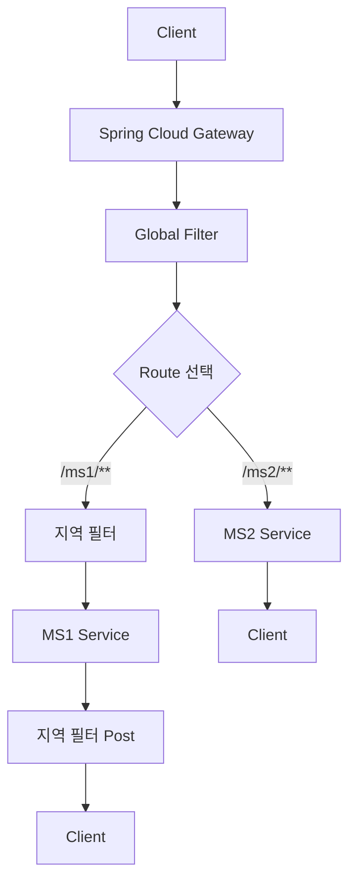
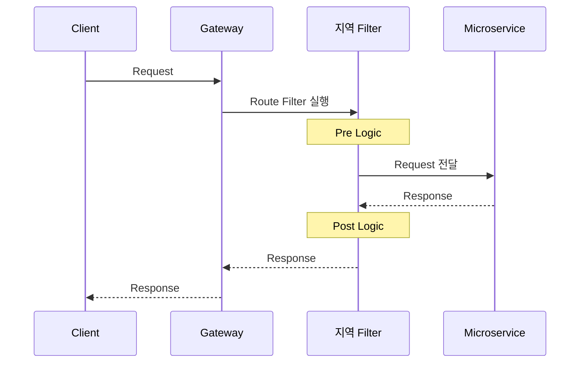
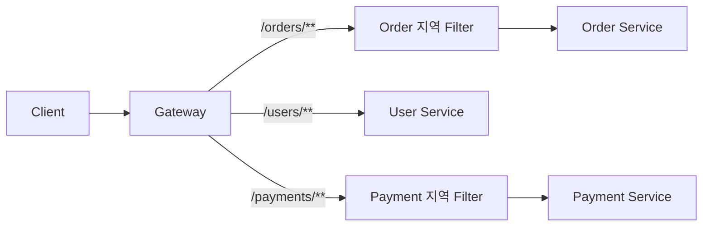
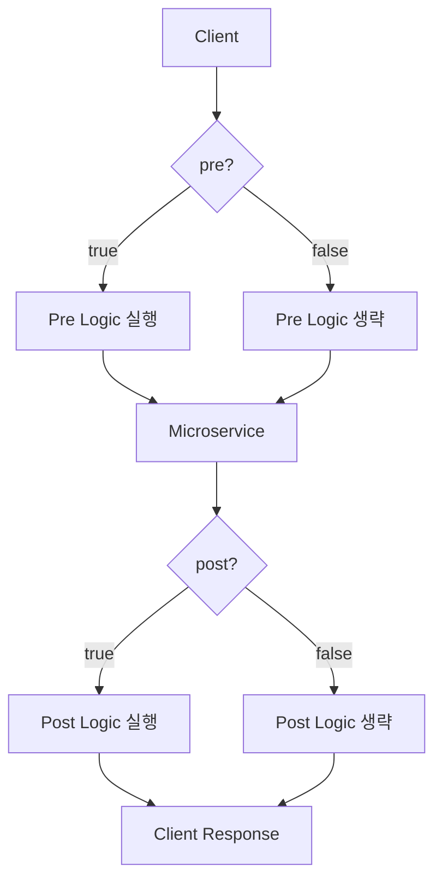
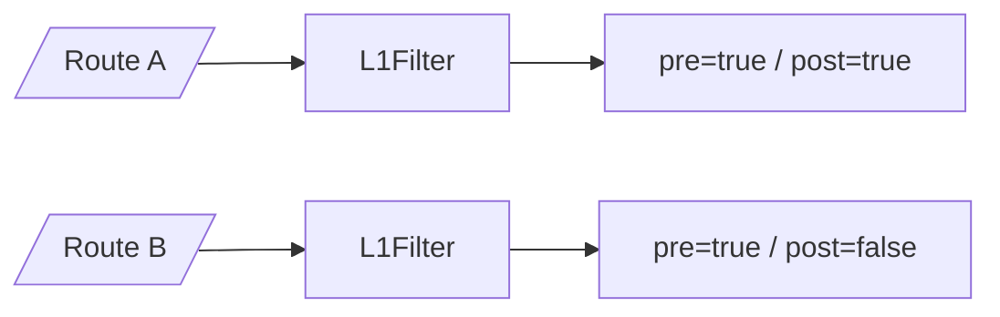
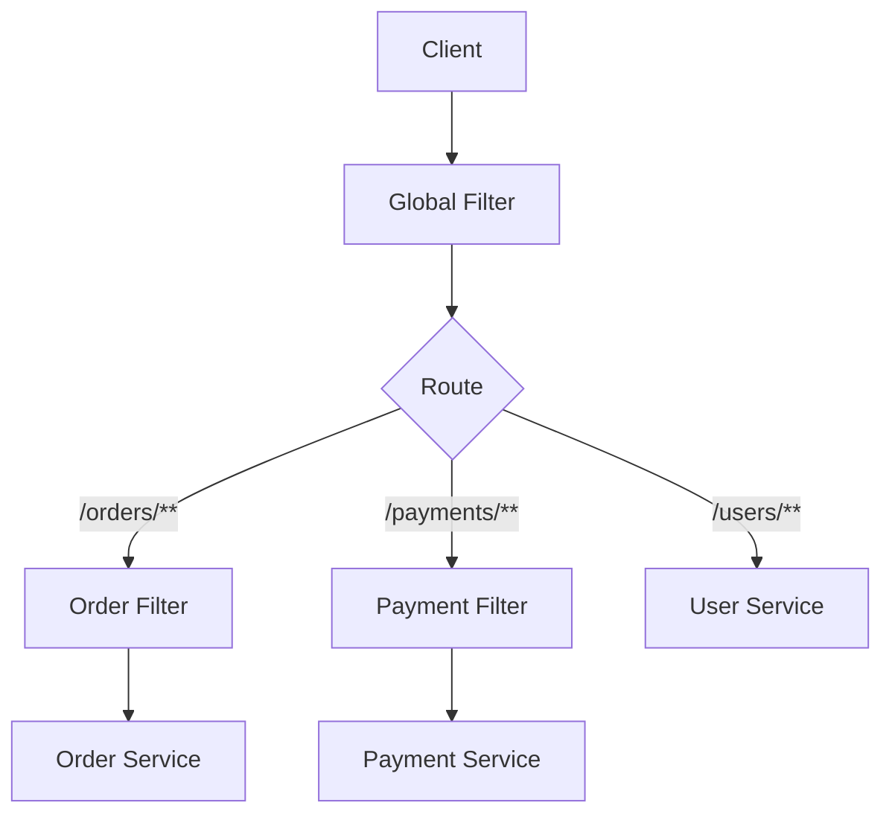
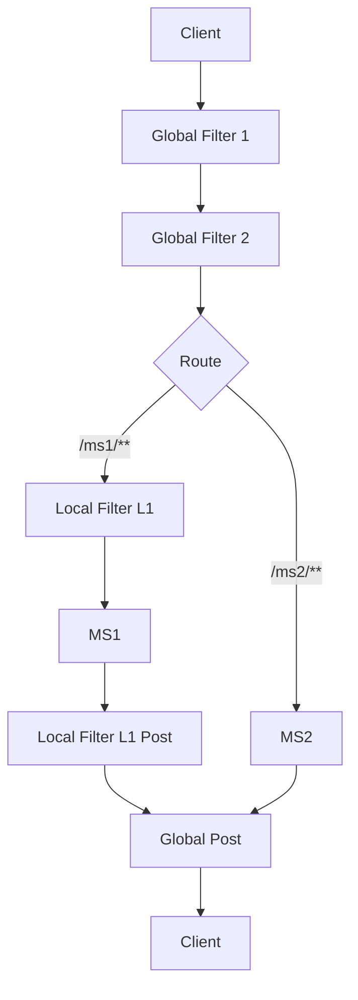
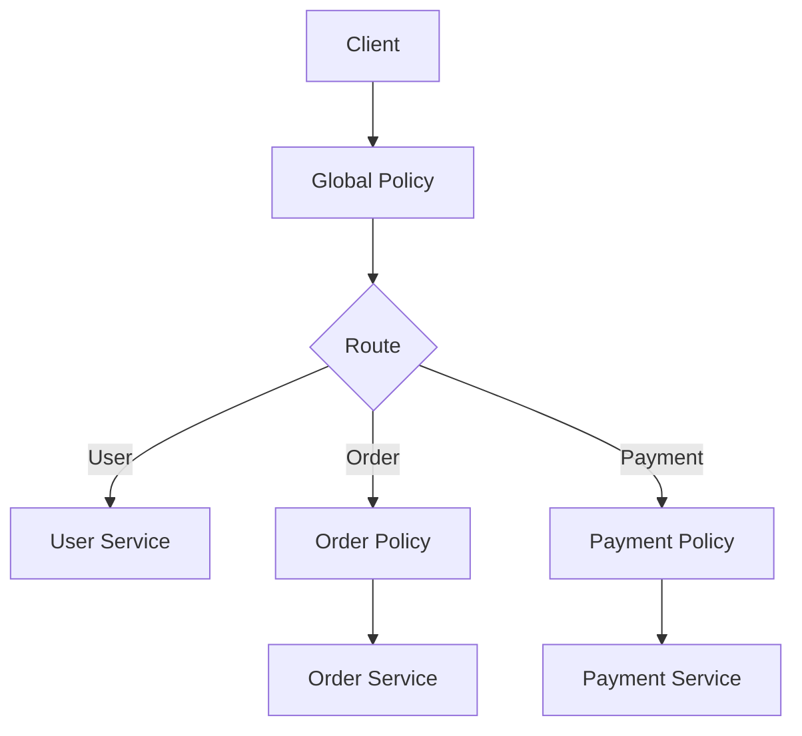
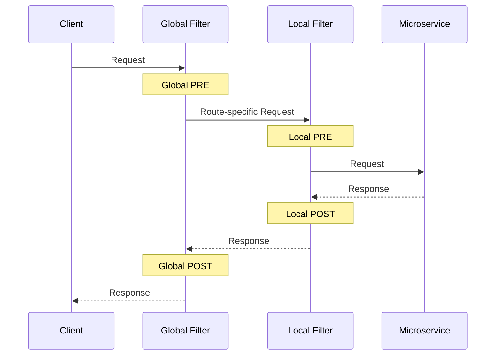

# 스프링 클라우드 MSA 13 - 게이트웨이 지역 필터
[https://youtu.be/Tg5_6XW61sQ?si=ajaT8P_RVx9P6sw3](https://youtu.be/Tg5_6XW61sQ?si=ajaT8P_RVx9P6sw3)

# 스프링 클라우드 MSA 13 - 게이트웨이 지역 필터
* toc
{:toc}

---

## Spring Cloud Gateway 지역 필터 적용과 Route별 Filter 구성 방법

Spring Cloud Gateway에서는 클라이언트 요청이 Gateway를 통과해 마이크로서비스로 전달되기 전과, 마이크로서비스의 응답이 다시 클라이언트로 반환되기 전에 특정 로직을 실행할 수 있다.

이러한 공통 처리 로직을 **Filter**라고 한다.

앞서 모든 Route에 공통으로 적용되는 Global Filter가 있었다면, 이번에는 **특정 Route에만 선택적으로 적용하는 지역 필터**를 구성할 수 있다.

전체적인 차이를 먼저 보면 다음과 같다.



Global Filter는 Gateway를 통과하는 모든 요청에 적용할 수 있지만, 지역 필터는 Route 설정에 직접 등록한 요청에만 적용된다.

예를 들어 다음 두 Route가 있다고 가정한다.

```text
/ms1/**
→ MS1 Service

/ms2/**
→ MS2 Service
```

여기에서 지역 필터를 `/ms1/**` Route에만 등록하면 다음 요청만 해당 Filter를 통과한다.

```text
GET /ms1/first
```

반면 다음 요청에는 지역 필터가 적용되지 않는다.

```text
GET /ms2/second
```

즉 지역 필터의 핵심은 다음과 같다.

> 특정 Route에만 별도의 요청·응답 처리 로직을 적용한다.

---

## Gateway Filter의 기본 동작

Spring Cloud Gateway의 Filter는 요청이 마이크로서비스로 전달되는 과정과 응답이 돌아오는 과정에 모두 관여할 수 있다.

이를 각각 다음과 같이 구분할 수 있다.

```text
Pre Filter
Post Filter
```

Pre Filter는 마이크로서비스에 요청을 보내기 전에 실행된다.

```text
Client
   ↓
Pre Filter
   ↓
Microservice
```

Post Filter는 마이크로서비스에서 응답이 돌아온 이후 실행된다.

```text
Microservice
   ↓
Post Filter
   ↓
Client
```

전체 흐름은 다음과 같다.



하나의 Filter 내부에서 Pre와 Post 처리를 모두 정의할 수 있다.

---

## Global Filter와 지역 Filter의 차이

두 Filter의 가장 큰 차이는 **적용 범위**다.

| 구분          | Global Filter     | 지역 Filter    |
| ----------- | ----------------- | ------------ |
| 적용 범위       | Gateway 전체        | 특정 Route     |
| Route 설정 필요 | 필요 없음             | 필요           |
| 대표 용도       | 전체 Logging, 공통 인증 | 특정 서비스 전용 처리 |
| Pre 처리      | 가능                | 가능           |
| Post 처리     | 가능                | 가능           |

Global Filter를 등록하면 기본적으로 여러 Route의 요청 흐름에 참여한다.

```text
/users/**
/orders/**
/payments/**
```

반면 지역 Filter는 다음처럼 특정 Route에 연결한다.

```text
/orders/**
→ OrderFilter 적용
```

따라서 서비스별로 서로 다른 처리가 필요할 때 지역 Filter를 활용할 수 있다.

---

## 지역 필터가 필요한 경우

모든 서비스가 동일한 처리를 해야 한다면 Global Filter가 적합하다.

예를 들어:

```text
공통 Request Logging
공통 Trace ID 처리
공통 IP 검사
```

반대로 특정 서비스만 별도의 처리가 필요하다면 지역 Filter가 더 자연스럽다.

예를 들어 다음과 같은 상황을 생각할 수 있다.

```text
Order Service만 특정 Header 확인

Payment Service만 별도의 요청 Logging

Admin Route만 추가적인 검증

특정 API Route만 Request 변환
```

구조는 다음과 같다.



Route마다 필요한 Filter를 선택해서 연결할 수 있다.

---

## 지역 Filter 프로젝트 구성

지역 Filter는 Spring Cloud Gateway 프로젝트 내부에서 작성한다.

구조는 다음과 같이 구성할 수 있다.

```text
com.example.gateway
├── GatewayApplication.java
└── filter
    └── L1Filter.java
```

지역 Filter를 작성할 때는 `AbstractGatewayFilterFactory`를 확장하여 사용할 수 있다.

```java
AbstractGatewayFilterFactory<Config>
```

그리고 Filter에서 사용할 설정값을 별도의 `Config` 클래스로 받을 수 있다.

---

## 기본 지역 Filter 작성

예를 들어 `L1Filter`라는 지역 Filter를 작성해보자.

```java
package com.example.gateway.filter;

import org.springframework.cloud.gateway.filter.GatewayFilter;
import org.springframework.cloud.gateway.filter.factory.AbstractGatewayFilterFactory;
import org.springframework.stereotype.Component;
import reactor.core.publisher.Mono;

@Component
public class L1Filter
        extends AbstractGatewayFilterFactory<L1Filter.Config> {

    public L1Filter() {
        super(Config.class);
    }

    @Override
    public GatewayFilter apply(Config config) {

        return (exchange, chain) -> {

            System.out.println(
                    "PRE LOCAL FILTER 1"
            );

            return chain.filter(exchange)
                    .then(
                            Mono.fromRunnable(() -> {
                                System.out.println(
                                        "POST LOCAL FILTER 1"
                                );
                            })
                    );
        };
    }

    public static class Config {

    }
}
```

핵심 구조는 다음과 같다.

```text
@Component
→ Spring Bean 등록

AbstractGatewayFilterFactory
→ Route Filter Factory 구현

apply()
→ 실제 Gateway Filter 생성

chain.filter(exchange)
→ 다음 Filter 또는 Routing으로 전달
```

---

## apply() 메서드의 역할

지역 Filter에서는 `apply()` 메서드에서 실제 Gateway Filter를 반환한다.

```java
@Override
public GatewayFilter apply(Config config) {

    return (exchange, chain) -> {

        // PRE

        return chain.filter(exchange)
                .then(
                        Mono.fromRunnable(() -> {

                            // POST

                        })
                );
    };
}
```

`chain.filter(exchange)` 이전에 작성한 코드는 요청이 다음 단계로 넘어가기 전에 실행된다.

```java
System.out.println(
        "PRE LOCAL FILTER"
);
```

이 부분이 Pre Filter다.

그리고 다음 부분은 Downstream 요청 처리가 완료된 이후 실행된다.

```java
.then(
        Mono.fromRunnable(() -> {
            System.out.println(
                    "POST LOCAL FILTER"
            );
        })
)
```

이 부분이 Post Filter다.

---

## 지역 Filter에 설정값 전달하기

지역 Filter의 중요한 특징 중 하나는 Route 설정에서 값을 전달할 수 있다는 것이다.

예를 들어 다음 두 가지 값을 받는다고 가정한다.

```text
pre
post
```

각 값은 Boolean 타입으로 사용한다.

```text
pre=true
→ Pre Filter 실행

post=true
→ Post Filter 실행
```

Config 클래스를 다음과 같이 만든다.

```java
public static class Config {

    private boolean pre;
    private boolean post;

    public boolean isPre() {
        return pre;
    }

    public void setPre(boolean pre) {
        this.pre = pre;
    }

    public boolean isPost() {
        return post;
    }

    public void setPost(boolean post) {
        this.post = post;
    }
}
```

전체 Filter 코드는 다음과 같이 변경할 수 있다.

```java
package com.example.gateway.filter;

import org.springframework.cloud.gateway.filter.GatewayFilter;
import org.springframework.cloud.gateway.filter.factory.AbstractGatewayFilterFactory;
import org.springframework.stereotype.Component;
import reactor.core.publisher.Mono;

@Component
public class L1Filter
        extends AbstractGatewayFilterFactory<L1Filter.Config> {

    public L1Filter() {
        super(Config.class);
    }

    @Override
    public GatewayFilter apply(Config config) {

        return (exchange, chain) -> {

            if (config.isPre()) {
                System.out.println(
                        "PRE LOCAL FILTER 1"
                );
            }

            return chain.filter(exchange)
                    .then(
                            Mono.fromRunnable(() -> {

                                if (config.isPost()) {
                                    System.out.println(
                                            "POST LOCAL FILTER 1"
                                    );
                                }

                            })
                    );
        };
    }

    public static class Config {

        private boolean pre;
        private boolean post;

        public boolean isPre() {
            return pre;
        }

        public void setPre(boolean pre) {
            this.pre = pre;
        }

        public boolean isPost() {
            return post;
        }

        public void setPost(boolean post) {
            this.post = post;
        }
    }
}
```

---

## Lombok을 이용한 Config 클래스

Getter와 Setter를 직접 작성하는 대신 Lombok을 이용할 수도 있다.

의존성을 추가한다.

```gradle
dependencies {
    compileOnly 'org.projectlombok:lombok'
    annotationProcessor 'org.projectlombok:lombok'
}
```

Config는 다음처럼 줄일 수 있다.

```java
import lombok.Getter;
import lombok.Setter;

@Getter
@Setter
public static class Config {

    private boolean pre;
    private boolean post;
}
```

Lombok은 지역 Filter 자체의 필수 기능이라기보다 Config 클래스의 반복 코드를 줄이는 데 사용할 수 있다.

---

## application.properties에 Route 등록하기

지역 Filter를 만들었다고 해서 모든 요청에 자동 적용되는 것은 아니다.

Global Filter와 가장 큰 차이가 바로 이 부분이다.

특정 Route에 Filter를 직접 등록해야 한다.

먼저 Route를 정의한다.

```properties
server.port=8080

spring.cloud.gateway.routes[0].id=ms1
spring.cloud.gateway.routes[0].uri=http://localhost:8081
spring.cloud.gateway.routes[0].predicates[0]=Path=/ms1/**
```

현재 Route는 다음 의미다.

```text
/ms1/**
→ localhost:8081
```

여기에 지역 Filter를 등록한다.

```properties
spring.cloud.gateway.routes[0].filters[0].name=L1Filter
```

그리고 Filter에 전달할 값을 설정한다.

```properties
spring.cloud.gateway.routes[0].filters[0].args.pre=true
spring.cloud.gateway.routes[0].filters[0].args.post=true
```

전체 설정은 다음과 같다.

```properties
server.port=8080

spring.cloud.gateway.routes[0].id=ms1
spring.cloud.gateway.routes[0].uri=http://localhost:8081
spring.cloud.gateway.routes[0].predicates[0]=Path=/ms1/**

spring.cloud.gateway.routes[0].filters[0].name=L1Filter
spring.cloud.gateway.routes[0].filters[0].args.pre=true
spring.cloud.gateway.routes[0].filters[0].args.post=true
```

---

## 지역 Filter 설정 구조 이해하기

Route와 Filter의 관계를 보면 다음과 같다.

```text
routes[0]
│
├── id
│   └── ms1
│
├── uri
│   └── http://localhost:8081
│
├── predicates[0]
│   └── Path=/ms1/**
│
└── filters[0]
    ├── name
    │   └── L1Filter
    │
    └── args
        ├── pre=true
        └── post=true
```

즉 다음 Route에:

```text
/ms1/**
```

`L1Filter`를 연결한 것이다.

---

## Filter도 여러 개 등록할 수 있다

하나의 Route에는 하나 이상의 Filter를 적용할 수 있다.

```properties
spring.cloud.gateway.routes[0].filters[0].name=L1Filter
spring.cloud.gateway.routes[0].filters[1].name=AnotherFilter
```

구조는 다음과 같다.

```text
Route 0

filters[0]
→ L1Filter

filters[1]
→ AnotherFilter
```

따라서 Route마다 필요한 Filter Chain을 구성할 수 있다.

---

## application.yml로 지역 Filter 등록하기

같은 설정을 YAML로 작성하면 구조를 더 직관적으로 볼 수 있다.

```yaml
server:
  port: 8080

spring:
  cloud:
    gateway:
      routes:
        - id: ms1
          uri: http://localhost:8081

          predicates:
            - Path=/ms1/**

          filters:
            - name: L1Filter
              args:
                pre: true
                post: true
```

구조는 다음과 같다.

```text
ms1 Route
  ↓
Path=/ms1/**
  ↓
L1Filter
  ↓
localhost:8081
```

---

## pre=true, post=true인 경우

Filter 설정이 다음과 같다고 하자.

```yaml
args:
  pre: true
  post: true
```

클라이언트가 다음 요청을 전송한다.

```text
GET /ms1/first
```

실행 흐름은 다음과 같다.

```text
PRE LOCAL FILTER 1

        ↓

MS1 Service 처리

        ↓

POST LOCAL FILTER 1
```

즉 두 영역 모두 실행된다.

---

## post=false로 변경하면 어떻게 될까?

다음처럼 설정을 변경한다.

```yaml
args:
  pre: true
  post: false
```

그러면 Pre 로직은 실행된다.

```text
PRE LOCAL FILTER 1
```

하지만 Post 로직은 실행되지 않는다.

```text
POST LOCAL FILTER 1
→ 실행되지 않음
```

동작 구조는 다음과 같다.



이처럼 같은 Filter라도 Route 설정을 통해 동작 방식을 변경할 수 있다.

---

## 설정값을 받는 이유

Config 값을 받는 구조를 사용하면 Filter 클래스를 여러 Route에서 재사용하기 쉬워진다.

예를 들어 다음과 같이 사용할 수 있다.

```text
Route A

pre=true
post=true
```

```text
Route B

pre=true
post=false
```

동일한 Filter 코드지만 Route별 동작이 달라질 수 있다.



Filter마다 클래스를 새로 만드는 것보다 설정값을 이용해 동작을 제어할 수 있다.

---

## Global Filter와 지역 Filter를 함께 사용하면 어떻게 될까?

Gateway에는 Global Filter와 Route별 지역 Filter가 동시에 존재할 수 있다.

예를 들어 Global Filter 두 개가 있고:

```text
G1
G2
```

`/ms1/**`에 지역 Filter `L1`이 등록되어 있다고 가정한다.

클라이언트 요청:

```text
GET /ms1/first
```

이 요청은 Global Filter와 지역 Filter가 함께 구성된 Filter Chain을 통과한다.

개념적인 흐름은 다음과 같다.

```text
Client

 ↓

Global Filter

 ↓

Global Filter

 ↓

Local Filter

 ↓

MS1 Service

 ↓

Local Filter

 ↓

Global Filter

 ↓

Global Filter

 ↓

Client
```

따라서 Global Filter와 지역 Filter는 서로 배타적인 기능이 아니다.

필요에 따라 함께 사용할 수 있다.

---

## Global Filter와 지역 Filter 역할 분리

실제 Gateway를 구성할 때 두 Filter의 책임을 명확하게 나누는 것이 좋다.

예를 들어 다음과 같이 설계할 수 있다.

### Global Filter

```text
공통 Request Logging
Trace ID 생성
공통 인증 처리
공통 IP 정책
```

### Order Route Filter

```text
Order 전용 Header 검사
Order API 전용 Logging
```

### Payment Route Filter

```text
Payment API 전용 요청 검증
Payment API 전용 Header 처리
```

구조는 다음과 같다.



---

## 지역 Filter에서 요청 정보 확인하기

Filter에서는 `ServerWebExchange`를 통해 요청 정보를 확인할 수 있다.

```java
var request = exchange.getRequest();
```

예를 들어 Method를 확인한다.

```java
request.getMethod();
```

Path를 확인한다.

```java
request.getURI().getPath();
```

Header도 확인할 수 있다.

```java
request.getHeaders();
```

예를 들어 다음처럼 특정 Route에 대한 Logging Filter를 구성할 수 있다.

```java
@Override
public GatewayFilter apply(Config config) {

    return (exchange, chain) -> {

        var request = exchange.getRequest();

        System.out.println(
                "method=" + request.getMethod()
        );

        System.out.println(
                "path=" + request.getURI().getPath()
        );

        return chain.filter(exchange);
    };
}
```

---

## 지역 Filter에서 응답 정보 확인하기

Post 처리에서는 Response에 접근할 수 있다.

```java
exchange.getResponse()
```

예를 들어 응답 Status를 확인할 수 있다.

```java
exchange.getResponse()
        .getStatusCode();
```

구조를 단순하게 표현하면 다음과 같다.

```text
PRE

Request 확인
     ↓
Microservice
     ↓
POST

Response 확인
```

---

## 지역 Filter에서 chain.filter(exchange)가 중요한 이유

다음 코드는 Filter Chain의 핵심이다.

```java
chain.filter(exchange)
```

이 코드를 통해 현재 요청을 다음 처리 단계로 넘긴다.

```text
현재 Local Filter
       ↓
다음 Filter
       ↓
Gateway Routing
       ↓
Microservice
```

지역 Filter가 요청을 검사한 뒤 정상 요청만 전달하는 구조를 만들 수도 있다.

```text
Request
   ↓
Local Filter
   ↓
조건 검사
 ┌─┴─┐
OK  Fail
↓     ↓
chain.filter()  요청 종료
```

즉 Gateway Filter는 단순히 Logging만 하는 기능에 한정되지 않고 요청 흐름 자체에 관여할 수 있다.

---

## 지역 Filter와 Reactive 처리

WebFlux 기반 Spring Cloud Gateway에서는 Filter 역시 Reactive 방식으로 동작한다.

Filter 메서드의 결과는 다음과 같은 형태다.

```text
Mono<Void>
```

그리고 다음과 같이 Reactive Chain을 연결한다.

```java
return chain.filter(exchange)
        .then(
                Mono.fromRunnable(() -> {

                })
        );
```

따라서 Post 처리를 단순히 다음처럼 작성하는 것과는 차이가 있다.

```java
chain.filter(exchange);

System.out.println("POST");
```

Gateway에서는 Downstream 비동기 처리가 끝난 시점을 Reactive Chain으로 연결해야 한다.

제공된 구조에서는 다음 패턴을 사용한다.

```java
return chain.filter(exchange)
        .then(
                Mono.fromRunnable(() -> {

                    // Post Logic

                })
        );
```

---

## Pre와 Post 동작 전체 코드

설정값까지 포함한 예제를 정리하면 다음과 같다.

```java
package com.example.gateway.filter;

import lombok.Getter;
import lombok.Setter;
import org.springframework.cloud.gateway.filter.GatewayFilter;
import org.springframework.cloud.gateway.filter.factory.AbstractGatewayFilterFactory;
import org.springframework.stereotype.Component;
import reactor.core.publisher.Mono;

@Component
public class L1Filter
        extends AbstractGatewayFilterFactory<L1Filter.Config> {

    public L1Filter() {
        super(Config.class);
    }

    @Override
    public GatewayFilter apply(Config config) {

        return (exchange, chain) -> {

            if (config.isPre()) {
                System.out.println(
                        "PRE LOCAL FILTER 1"
                );
            }

            return chain.filter(exchange)
                    .then(
                            Mono.fromRunnable(() -> {

                                if (config.isPost()) {
                                    System.out.println(
                                            "POST LOCAL FILTER 1"
                                    );
                                }

                            })
                    );
        };
    }

    @Getter
    @Setter
    public static class Config {

        private boolean pre;
        private boolean post;
    }
}
```

그리고 Route에는 다음처럼 등록한다.

```yaml
spring:
  cloud:
    gateway:
      routes:
        - id: ms1
          uri: http://localhost:8081

          predicates:
            - Path=/ms1/**

          filters:
            - name: L1Filter
              args:
                pre: true
                post: true
```

---

## 실행 흐름 확인

Gateway는 다음 Port에서 실행한다.

```text
8080
```

MS1은 다음 Port에서 실행한다.

```text
8081
```

클라이언트가 다음 요청을 보낸다.

```bash
curl http://localhost:8080/ms1/first
```

이 명령은 Gateway의 `/ms1/first` 경로로 GET 요청을 전송한다.

Route가 다음과 같으므로:

```text
Path=/ms1/**
```

`ms1` Route가 선택된다.

그리고 Route에 다음 Filter가 등록되어 있다.

```text
L1Filter
```

따라서 처리 순서는 다음과 같다.

```text
Client

 ↓

Gateway

 ↓

L1Filter PRE

 ↓

MS1 :8081

 ↓

L1Filter POST

 ↓

Client
```

---

## 다른 Route에서는 Filter가 실행되지 않는다

두 번째 Route가 다음과 같다고 하자.

```yaml
- id: ms2
  uri: http://localhost:8082

  predicates:
    - Path=/ms2/**
```

여기에는 `L1Filter`를 등록하지 않았다.

따라서:

```text
GET /ms2/second
```

요청의 흐름은 다음과 같다.

```text
Client
   ↓
Gateway
   ↓
MS2
```

`L1Filter`는 실행되지 않는다.

바로 이 부분이 Global Filter와의 가장 큰 차이다.

---

## 여러 Route에서 같은 지역 Filter 사용하기

하나의 지역 Filter를 여러 Route에 등록할 수도 있다.

```yaml
spring:
  cloud:
    gateway:
      routes:

        - id: ms1
          uri: http://localhost:8081
          predicates:
            - Path=/ms1/**
          filters:
            - name: L1Filter
              args:
                pre: true
                post: true

        - id: ms2
          uri: http://localhost:8082
          predicates:
            - Path=/ms2/**
          filters:
            - name: L1Filter
              args:
                pre: true
                post: false
```

같은 Filter이지만 각 Route에서 다른 설정을 사용할 수 있다.

```text
MS1 Route

PRE  = true
POST = true
```

```text
MS2 Route

PRE  = true
POST = false
```

이것이 Config 클래스를 이용하는 장점이다.

---

## 글로벌과 지역 필터의 전체 구조

예를 들어 시스템에 다음 Filter가 있다고 가정한다.

```text
Global

G1
G2


Local

L1
```

`L1`은 `ms1` Route에만 등록되어 있다.

전체 구조는 다음과 같다.



Global Filter는 두 요청 모두에 참여하지만 지역 Filter는 `ms1` 요청에만 참여한다.

---

## Filter를 어떻게 나눠야 할까?

Filter를 설계할 때 가장 먼저 판단할 것은 다음 질문이다.

> 이 로직은 모든 Route에서 필요한가, 특정 Route에서만 필요한가?

모든 요청에서 필요하다면:

```text
Global Filter
```

특정 요청에만 필요하다면:

```text
지역 Filter
```

예를 들면 다음과 같다.

| 요구사항            | Filter |
| --------------- | ------ |
| 전체 요청 Logging   | Global |
| 전체 JWT 기본 검증    | Global |
| 전체 Trace ID     | Global |
| Order 전용 Header | 지역     |
| Payment 전용 검증   | 지역     |
| Admin API 전용 처리 | 지역     |

---

## 실무 관점에서의 활용

지역 Filter는 Route별 정책을 분리해야 할 때 유용하다.

예를 들어 Payment API에는 추가적인 Header가 필요하지만 User API에는 필요하지 않을 수 있다.

```text
/payments/**
→ Payment Header Filter

/users/**
→ Filter 없음
```

또는 Admin 요청에만 별도의 검증을 적용할 수도 있다.

```text
/admin/**
→ Admin Validation Filter
```

이렇게 Route마다 다른 정책을 가지게 하면 모든 조건문을 하나의 거대한 Global Filter에 넣는 것보다 책임을 분리하기 쉽다.

예를 들어 다음과 같은 Global Filter가 커지기 시작하면:

```text
if user route ...
if order route ...
if payment route ...
if admin route ...
```

Route별 Filter로 분리하는 것이 코드의 책임을 이해하기 쉬울 수 있다.

---

## Filter 내부 로직은 가볍게 유지하기

WebFlux 기반 Gateway는 요청을 빠르게 전달하는 역할이 중요하다.

따라서 지역 Filter에서도 지나치게 무거운 작업은 주의해야 한다.

예를 들면 다음과 같다.

```text
오래 걸리는 DB 조회

긴 Blocking I/O

복잡한 비즈니스 계산

여러 외부 API 순차 호출
```

특정 Route에만 적용한다고 하더라도 해당 Route의 모든 요청이 Filter를 통과하기 때문이다.

Filter에는 Gateway 단계에서 처리해야 할 요청·응답 정책을 중심으로 배치하는 것이 좋다.

---

## System.out 대신 Logger 활용

실행 순서를 확인하는 용도라면 다음 코드도 충분하다.

```java
System.out.println(
        "PRE LOCAL FILTER"
);
```

하지만 실제 애플리케이션에서는 Logging Framework를 사용하는 것이 관리에 유리하다.

예를 들어 다음과 같은 정보를 기록할 수 있다.

```text
Request Method
Request Path
Route ID
Response Status
```

특히 민감한 값은 그대로 기록하지 않도록 주의해야 한다.

```text
Authorization Header
Cookie
Password
Token
개인정보
```

---

## Global Filter와 지역 Filter 선택 기준

두 Filter를 비교하면 다음과 같다.

### Global Filter

```text
Gateway 전체 공통 정책
```

예:

```text
Logging
Tracing
공통 인증
공통 IP 정책
```

### 지역 Filter

```text
특정 Route 정책
```

예:

```text
Order 전용 검증
Payment 전용 Header
Admin Route 전용 정책
```

구조적으로는 다음과 같이 책임을 나눌 수 있다.



---

## 전체 동작 흐름

지역 Filter를 포함한 Gateway의 요청 처리를 정리하면 다음과 같다.



즉 다음과 같은 중첩 구조가 만들어진다.

```text
Request

Global PRE
    ↓
Local PRE
    ↓
Microservice
    ↓
Local POST
    ↓
Global POST

Response
```

---

## 구현 순서 정리

지역 Filter를 구성하는 기본적인 순서는 다음과 같다.

```text
1. Filter 클래스 생성

2. @Component 등록

3. AbstractGatewayFilterFactory 상속

4. Config 클래스 정의

5. apply() 구현

6. Pre 로직 작성

7. chain.filter(exchange) 호출

8. Post 로직 작성

9. application.yml 또는 properties에서 Route 등록

10. 해당 Route에 Filter 이름 등록

11. args를 통해 Config 값 전달

12. Gateway 실행 후 Route 호출

13. Pre/Post 동작 확인
```

---

## 정리

Spring Cloud Gateway의 지역 필터는 특정 Route에만 선택적으로 공통 로직을 적용하기 위한 Filter다.

Global Filter는 Gateway 전체 요청에 참여하지만 지역 Filter는 다음처럼 Route에 직접 등록해야 한다.

```yaml
routes:
  - id: ms1
    uri: http://localhost:8081

    predicates:
      - Path=/ms1/**

    filters:
      - name: L1Filter
        args:
          pre: true
          post: true
```

지역 Filter는 `AbstractGatewayFilterFactory`를 확장하여 구성할 수 있다.

```java
@Component
public class L1Filter
        extends AbstractGatewayFilterFactory<L1Filter.Config> {
}
```

실제 요청 처리 로직은 `apply()` 안에서 GatewayFilter 형태로 정의한다.

```text
Pre Logic
     ↓
chain.filter(exchange)
     ↓
Post Logic
```

Config 클래스를 이용하면 Route 설정에서 Filter에 값을 전달할 수도 있다.

```text
pre=true
post=false
```

와 같은 설정을 이용해 동일한 Filter의 동작을 Route별로 다르게 구성할 수 있다.

Global Filter와 지역 Filter를 함께 사용하면 다음과 같은 책임 분리가 가능하다.

```text
Global Filter
→ 전체 Gateway 정책

지역 Filter
→ 특정 Route 정책

Microservice
→ 실제 비즈니스 로직
```

### 한 줄 요약

Spring Cloud Gateway의 지역 필터는 `AbstractGatewayFilterFactory`로 구현한 Filter를 특정 Route에 직접 등록하여 해당 Route의 요청과 응답에만 Pre/Post 로직을 적용하는 방식이며, Config 값을 전달해 Route별로 Filter 동작을 다르게 구성할 수 있다.
