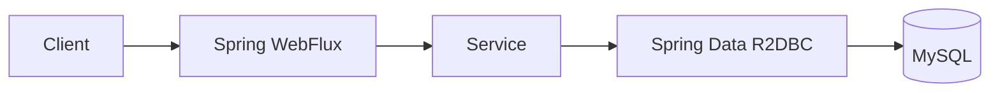
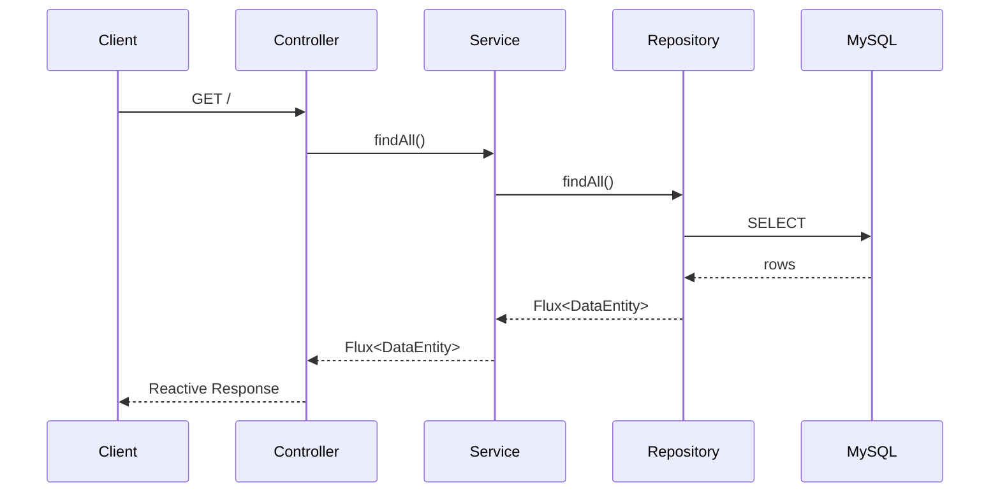
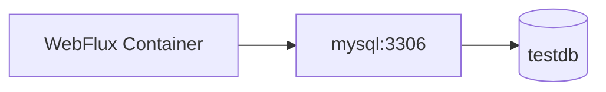
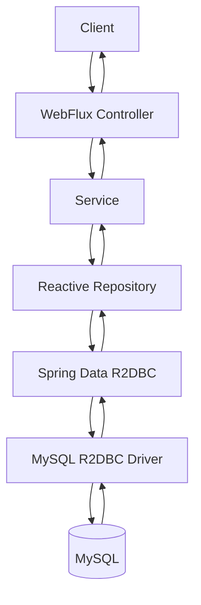

# 스프링 WebFlux 데이터베이스 1 - 스프링 WebFlux R2DBC MySQL 데이터베이스 단일 연결
[https://youtu.be/EpOZuN3-yrk?si=hgi-Vaku9Idcg9yR](https://youtu.be/EpOZuN3-yrk?si=hgi-Vaku9Idcg9yR)

# 스프링 WebFlux 데이터베이스 1 - 스프링 WebFlux R2DBC MySQL 데이터베이스 단일 연결
* toc
{:toc}

---

## Spring WebFlux에서 R2DBC로 MySQL 연결하기

Spring WebFlux는 요청을 비동기·논블로킹 방식으로 처리할 수 있는 Spring의 Reactive Web Stack이다.

일반적인 Spring MVC 애플리케이션에서는 JDBC나 JPA를 이용하여 관계형 데이터베이스에 접근하는 경우가 많다.

```text
Spring MVC
    ↓
Service
    ↓
JPA / JDBC
    ↓
MySQL
```

반면 WebFlux 애플리케이션에서 요청 처리 흐름을 끝까지 Reactive 방식으로 유지하려면 데이터베이스 접근 역시 논블로킹 방식으로 처리할 필요가 있다.

이를 위해 사용할 수 있는 기술이 **R2DBC(Reactive Relational Database Connectivity)**다.

전체 구조는 다음과 같다.



Spring Data R2DBC를 사용하면 데이터베이스 조회 결과를 일반적인 `List<T>`가 아닌 Reactor의 `Mono<T>`, `Flux<T>` 형태로 처리할 수 있다.

예를 들어 여러 데이터를 조회하면 다음과 같은 구조가 된다.

```text
MySQL
   ↓
R2DBC Repository
   ↓
Flux<DataEntity>
   ↓
Service
   ↓
Controller
   ↓
Client
```

---

## R2DBC란?

R2DBC는 관계형 데이터베이스를 Reactive 방식으로 접근하기 위한 API 규격이다.

이름을 풀어보면 다음과 같다.

```text
Reactive
Relational
Database
Connectivity
```

JDBC와 목적은 비슷하다.

```text
Java Application
    ↓
Database 연결
    ↓
SQL 실행
    ↓
결과 반환
```

하지만 처리 모델에서 차이가 있다.

전통적인 JDBC 호출을 단순화하면 다음과 같다.

```text
Thread
   ↓
SQL 실행
   ↓
DB 응답 대기
   ↓
Thread 대기
   ↓
결과 반환
```

R2DBC를 사용하는 Reactive 흐름은 다음과 같이 이해할 수 있다.

```text
Request
   ↓
Reactive Pipeline
   ↓
R2DBC Query
   ↓
DB I/O
   ↓
결과 Event
   ↓
Mono / Flux
```

따라서 WebFlux의 Reactive Pipeline과 데이터베이스 접근 흐름을 자연스럽게 연결할 수 있다.

---

## WebFlux와 데이터베이스 연결

WebFlux에서 중요한 것은 단순히 Controller 반환 타입을 `Mono`, `Flux`로 변경하는 것이 아니다.

요청 처리 과정 전체를 살펴봐야 한다.

예를 들어 다음 구조에서:

```text
WebFlux Controller
       ↓
Reactive Service
       ↓
Blocking JDBC
       ↓
MySQL
```

Controller는 Reactive 방식이더라도 데이터베이스 접근에서 Blocking 작업이 발생한다.

따라서 Reactive Stack을 데이터베이스까지 유지하려는 경우 다음과 같은 구성이 가능하다.

```text
WebFlux Controller
       ↓
Reactive Service
       ↓
Spring Data R2DBC
       ↓
R2DBC Driver
       ↓
MySQL
```

이 구조에서는 Repository 결과 역시 `Mono` 또는 `Flux`를 기반으로 처리한다.

---

## 필요한 프로젝트 의존성

MySQL과 R2DBC를 이용하는 기본 구성에는 다음과 같은 요소가 필요하다.

```text
Spring Reactive Web
Spring Data R2DBC
MySQL용 R2DBC Driver
Lombok
```

각각의 역할은 다음과 같다.

| 의존성                 | 역할                             |
| ------------------- | ------------------------------ |
| Spring Reactive Web | WebFlux 기반 Reactive Web 애플리케이션 |
| Spring Data R2DBC   | Reactive Repository와 DB 접근 추상화 |
| MySQL R2DBC Driver  | MySQL과 R2DBC 통신                |
| Lombok              | Getter/Setter 등의 반복 코드 감소      |

프로젝트 구조를 단순화하면 다음과 같다.

```text
Spring WebFlux
      ↓
Spring Data R2DBC
      ↓
MySQL R2DBC Driver
      ↓
MySQL
```

---

## Gradle 의존성 구성

`build.gradle`에는 WebFlux와 R2DBC 관련 의존성을 추가한다.

개념적인 구성은 다음과 같다.

```gradle
dependencies {
    implementation 'org.springframework.boot:spring-boot-starter-webflux'
    implementation 'org.springframework.boot:spring-boot-starter-data-r2dbc'

    implementation 'org.projectlombok:lombok'
    annotationProcessor 'org.projectlombok:lombok'

    // 사용하는 Spring Boot / R2DBC Driver 버전에 맞는
    // MySQL용 R2DBC Driver를 추가한다.

    testImplementation 'org.springframework.boot:spring-boot-starter-test'
    testImplementation 'io.projectreactor:reactor-test'
}
```

여기서 핵심은 다음 두 의존성이다.

```gradle
implementation 'org.springframework.boot:spring-boot-starter-webflux'
implementation 'org.springframework.boot:spring-boot-starter-data-r2dbc'
```

하나는 Web 계층을 Reactive 방식으로 구성하고, 다른 하나는 관계형 데이터베이스 접근을 Reactive 방식으로 구성한다.

---

## 데이터베이스 준비

예제로 간단한 테이블을 하나 준비한다고 가정하자.

테이블에는 다음 컬럼이 존재한다.

```text
id
name
```

구조는 다음과 같다.

```text
data_entity
├── id
└── name
```

예를 들어 데이터는 다음과 같이 저장되어 있을 수 있다.

| id | name   |
| -: | ------ |
|  1 | apple  |
|  2 | banana |
|  3 | orange |

SQL로 표현하면 다음과 같은 형태다.

```sql
CREATE TABLE data_entity (
    id BIGINT PRIMARY KEY AUTO_INCREMENT,
    name VARCHAR(100) NOT NULL
);
```

테스트 데이터도 추가할 수 있다.

```sql
INSERT INTO data_entity (name)
VALUES ('apple');

INSERT INTO data_entity (name)
VALUES ('banana');

INSERT INTO data_entity (name)
VALUES ('orange');
```

이번 목표는 Spring WebFlux 애플리케이션에서 이 데이터를 조회하여 Client에 반환하는 것이다.

---

## R2DBC 연결에 필요한 정보

MySQL에 연결하려면 기본적으로 다음 정보가 필요하다.

```text
Database Host
Database Port
Database Name
Username
Password
```

예를 들어 다음 환경이라고 가정하자.

```text
Host
localhost

Port
3306

Database
testdb

Username
root

Password
password
```

이 값을 Spring Boot 설정에 입력한다.

---

## application.properties에서 R2DBC 연결하기

단일 데이터베이스 연결이라면 Spring Boot의 R2DBC 설정을 이용할 수 있다.

```properties
spring.r2dbc.url=r2dbc:mysql://localhost:3306/testdb
spring.r2dbc.username=root
spring.r2dbc.password=password
```

각 설정의 의미는 다음과 같다.

```text
spring.r2dbc.url
→ 데이터베이스 연결 주소

spring.r2dbc.username
→ 데이터베이스 사용자

spring.r2dbc.password
→ 데이터베이스 비밀번호
```

URL에서 가장 중요한 부분은 JDBC URL과 프로토콜이 다르다는 것이다.

JDBC에서는 다음과 같은 형태를 사용한다.

```text
jdbc:mysql://localhost:3306/testdb
```

R2DBC에서는 다음과 같은 형태를 사용한다.

```text
r2dbc:mysql://localhost:3306/testdb
```

즉:

```text
jdbc:mysql://
```

이 아니라:

```text
r2dbc:mysql://
```

형태를 사용한다.

---

## application.yml로 작성하기

같은 내용을 YAML로 작성하면 다음과 같다.

```yaml
spring:
  r2dbc:
    url: r2dbc:mysql://localhost:3306/testdb
    username: root
    password: password
```

구조는 동일하다.

```text
spring.r2dbc
├── url
├── username
└── password
```

단일 R2DBC Connection 환경에서는 이 설정을 기반으로 Spring Boot가 필요한 연결 객체를 자동 구성한다.

---

## 비밀번호를 설정 파일에 직접 저장하지 않기

로컬 테스트에서는 다음처럼 사용할 수 있다.

```yaml
spring:
  r2dbc:
    username: root
    password: password
```

하지만 운영 환경에서는 데이터베이스 비밀번호를 Git Repository에 그대로 저장하지 않는 것이 좋다.

환경 변수로 분리할 수 있다.

```yaml
spring:
  r2dbc:
    url: ${DB_R2DBC_URL}
    username: ${DB_USERNAME}
    password: ${DB_PASSWORD}
```

실행 환경에서는 다음 값을 주입한다.

```text
DB_R2DBC_URL=r2dbc:mysql://mysql:3306/testdb
DB_USERNAME=app_user
DB_PASSWORD=strong-password
```

구조는 다음과 같다.

```text
Application
    ↓
Environment Variable / Secret
    ↓
R2DBC Configuration
    ↓
MySQL
```

---

## 테이블과 매핑할 객체 작성하기

데이터베이스 데이터를 Java 객체로 받기 위해 테이블 구조와 대응되는 클래스를 작성한다.

예를 들어 다음과 같이 만들 수 있다.

```java
package com.example.demo.entity;

import lombok.Data;
import org.springframework.data.annotation.Id;
import org.springframework.data.relational.core.mapping.Table;

@Data
@Table("data_entity")
public class DataEntity {

    @Id
    private Long id;

    private String name;
}
```

테이블 구조는 다음과 대응된다.

```text
MySQL

data_entity
├── id
└── name
```

Java에서는:

```text
DataEntity
├── id
└── name
```

형태가 된다.

---

## JPA Entity와의 차이

JPA를 사용해본 개발자라면 다음 어노테이션에 익숙할 것이다.

```java
@Entity
@Table(name = "data_entity")
public class DataEntity {
}
```

하지만 Spring Data R2DBC는 JPA가 아니다.

따라서 `jakarta.persistence.Entity`를 중심으로 동작하는 JPA Entity 모델을 그대로 사용하는 방식과는 차이가 있다.

R2DBC에서는 Spring Data의 Mapping Annotation을 사용할 수 있다.

```java
import org.springframework.data.annotation.Id;
import org.springframework.data.relational.core.mapping.Table;
```

예:

```java
@Table("data_entity")
public class DataEntity {

    @Id
    private Long id;

    private String name;
}
```

이 차이를 명확히 이해하는 것이 중요하다.

```text
JPA
→ jakarta.persistence.*

R2DBC
→ Spring Data Relational Mapping
```

---

## 반드시 @Table을 사용해야 할까?

단순한 경우 Naming Convention을 이용하여 Mapping이 가능할 수도 있다.

하지만 실제 프로젝트에서는 테이블 이름과 클래스 이름이 명확하게 대응되지 않는 경우가 많다.

예를 들어 Java 클래스가 다음과 같다고 하자.

```text
DataEntity
```

DB 테이블 이름은 다음과 같다.

```text
data_entity
```

명시적인 Mapping을 위해 다음처럼 작성할 수 있다.

```java
@Table("data_entity")
```

컬럼 이름 역시 다르다면 `@Column`을 사용할 수 있다.

예를 들어 데이터베이스가 다음과 같다고 하자.

```text
user_name
```

Java 필드는 다음과 같다.

```text
userName
```

필요하면 다음과 같은 Mapping을 사용할 수 있다.

```java
@Column("user_name")
private String userName;
```

---

## Repository 작성

Entity를 만들었다면 Repository를 정의한다.

Spring Data R2DBC에서는 Reactive Repository를 사용할 수 있다.

예를 들어 다음과 같이 작성할 수 있다.

```java
package com.example.demo.repository;

import com.example.demo.entity.DataEntity;
import org.springframework.data.repository.reactive.ReactiveCrudRepository;

public interface DataRepository
        extends ReactiveCrudRepository<DataEntity, Long> {
}
```

제네릭 타입은 다음 의미를 가진다.

```text
ReactiveCrudRepository
<
    DataEntity,
    Long
>
```

첫 번째 타입:

```text
DataEntity
```

는 Repository가 관리할 객체다.

두 번째 타입:

```text
Long
```

은 `@Id` 필드의 타입이다.

---

## R2dbcRepository 사용

Spring Data R2DBC에서는 `R2dbcRepository`를 사용할 수도 있다.

```java
import org.springframework.data.r2dbc.repository.R2dbcRepository;

public interface DataRepository
        extends R2dbcRepository<DataEntity, Long> {
}
```

개념적으로는 다음 구조다.

```text
Controller
   ↓
Service
   ↓
DataRepository
   ↓
Spring Data R2DBC
   ↓
MySQL
```

Repository 구현 클래스를 직접 작성하지 않아도 Spring Data가 기본 CRUD 기능을 제공한다.

---

## Reactive Repository 반환 타입

JPA에서 전체 데이터를 조회한다고 생각해보자.

보통 다음 형태를 많이 사용한다.

```java
List<DataEntity> findAll();
```

Reactive Repository에서는 결과가 다르다.

여러 개의 데이터를 반환하는 `findAll()`은 다음과 같이 사용할 수 있다.

```java
Flux<DataEntity>
```

개념적으로는:

```text
0개 ~ N개
→ Flux<T>
```

다음처럼 이해할 수 있다.

```text
findAll()
    ↓
Flux<DataEntity>
```

반면 하나의 데이터를 조회하면 일반적으로 `Mono<T>` 계열을 사용한다.

```text
findById()
    ↓
Mono<DataEntity>
```

---

## Mono와 Flux 다시 이해하기

Reactive Programming에서 가장 자주 사용하는 타입은 `Mono`와 `Flux`다.

### Mono

0개 또는 1개의 결과를 표현한다.

```text
Mono<T>

0
또는
1
```

예:

```java
Mono<DataEntity>
```

`id`로 하나의 데이터를 조회할 때 사용할 수 있다.

---

### Flux

0개 이상의 여러 결과를 표현한다.

```text
Flux<T>

0
1
2
3
...
N
```

예:

```java
Flux<DataEntity>
```

테이블의 전체 데이터를 조회할 때 자연스럽다.

이를 표로 정리하면 다음과 같다.

| 결과       | Reactive 타입                    |
| -------- | ------------------------------ |
| 단일 데이터   | `Mono<T>`                      |
| 여러 데이터   | `Flux<T>`                      |
| 결과 없음 포함 | `Mono.empty()`, `Flux.empty()` |

---

## Service 작성

Repository를 Service에서 주입받아 사용한다.

```java
package com.example.demo.service;

import com.example.demo.entity.DataEntity;
import com.example.demo.repository.DataRepository;
import lombok.RequiredArgsConstructor;
import org.springframework.stereotype.Service;
import reactor.core.publisher.Flux;

@Service
@RequiredArgsConstructor
public class DataService {

    private final DataRepository dataRepository;

    public Flux<DataEntity> findAll() {
        return dataRepository.findAll();
    }
}
```

중요한 부분은 다음이다.

```java
public Flux<DataEntity> findAll()
```

그리고 Repository 결과를 그대로 반환한다.

```java
return dataRepository.findAll();
```

Reactive 흐름을 유지하기 위해 중간에서 `List`로 강제로 변환하지 않는다.

---

## Controller 작성

Controller에서도 `Flux<DataEntity>`를 그대로 반환할 수 있다.

```java
package com.example.demo.controller;

import com.example.demo.entity.DataEntity;
import com.example.demo.service.DataService;
import lombok.RequiredArgsConstructor;
import org.springframework.web.bind.annotation.GetMapping;
import org.springframework.web.bind.annotation.RestController;
import reactor.core.publisher.Flux;

@RestController
@RequiredArgsConstructor
public class DataController {

    private final DataService dataService;

    @GetMapping("/")
    public Flux<DataEntity> findAll() {
        return dataService.findAll();
    }
}
```

전체 호출 흐름은 다음과 같다.

```text
GET /
   ↓
DataController
   ↓
DataService
   ↓
DataRepository
   ↓
R2DBC
   ↓
MySQL
```

응답도 Reactive Stream으로 이어진다.

---

## 전체 데이터 조회 흐름

동작을 조금 더 자세히 보면 다음과 같다.



중요한 것은 각 계층에서 Reactive 타입을 유지한다는 것이다.

```text
Repository
Flux<DataEntity>
      ↓
Service
Flux<DataEntity>
      ↓
Controller
Flux<DataEntity>
```

---

## 실행

애플리케이션을 실행한다.

```bash
./gradlew bootRun
```

이 명령은 Gradle을 이용하여 Spring Boot 애플리케이션을 실행한다.

정상적으로 실행되었다면 Controller에 설정한 주소로 요청한다.

```bash
curl http://localhost:8080/
```

예를 들어 데이터베이스에 다음 데이터가 있다면:

```text
1 apple
2 banana
3 orange
```

응답은 JSON 배열 형태로 확인할 수 있다.

```json
[
  {
    "id": 1,
    "name": "apple"
  },
  {
    "id": 2,
    "name": "banana"
  },
  {
    "id": 3,
    "name": "orange"
  }
]
```

즉 다음 연결이 정상적으로 동작한 것이다.

```text
Client
   ↓
WebFlux
   ↓
Spring Data R2DBC
   ↓
MySQL
```

---

## 단일 데이터 조회

전체 데이터뿐 아니라 하나의 데이터를 조회할 수도 있다.

Repository의 `findById()`는 `Mono`를 반환한다.

Service:

```java
public Mono<DataEntity> findById(Long id) {
    return dataRepository.findById(id);
}
```

Controller:

```java
@GetMapping("/{id}")
public Mono<DataEntity> findById(
        @PathVariable Long id
) {
    return dataService.findById(id);
}
```

호출:

```bash
curl http://localhost:8080/1
```

흐름은 다음과 같다.

```text
GET /1
  ↓
findById(1)
  ↓
Mono<DataEntity>
```

`findAll()`과 비교하면 다음과 같다.

```text
findAll()
→ Flux<DataEntity>

findById()
→ Mono<DataEntity>
```

---

## 데이터 저장

Reactive Repository를 이용해 저장도 가능하다.

Service 예시는 다음과 같다.

```java
public Mono<DataEntity> save(
        DataEntity dataEntity
) {
    return dataRepository.save(dataEntity);
}
```

Controller:

```java
@PostMapping
public Mono<DataEntity> save(
        @RequestBody DataEntity dataEntity
) {
    return dataService.save(dataEntity);
}
```

구조는 다음과 같다.

```text
POST Request
    ↓
Controller
    ↓
Service
    ↓
Repository.save()
    ↓
R2DBC
    ↓
MySQL
    ↓
Mono<DataEntity>
```

---

## Reactive 흐름에서 block()을 사용하지 않기

R2DBC와 WebFlux를 사용하면서 주의해야 할 코드가 있다.

다음과 같은 코드다.

```java
DataEntity entity =
        dataRepository.findById(1L)
                .block();
```

`block()`은 Reactive 결과를 기다리면서 현재 Thread를 Blocking하는 방식이다.

WebFlux와 R2DBC를 사용하면서 요청 처리 흐름에서 무분별하게 `block()`을 호출하면 Reactive 구조의 장점을 크게 잃을 수 있다.

따라서 다음처럼 Reactive Chain을 유지하는 것이 좋다.

```java
public Mono<DataEntity> findById(Long id) {
    return dataRepository.findById(id);
}
```

또는 데이터 가공이 필요하다면:

```java
public Mono<String> findName(Long id) {

    return dataRepository.findById(id)
            .map(DataEntity::getName);
}
```

Reactive 연산자를 이용한다.

---

## 데이터를 가공해야 한다면

예를 들어 모든 이름을 대문자로 변경한다고 하자.

```java
public Flux<DataEntity> findAll() {

    return dataRepository.findAll()
            .map(data -> {

                data.setName(
                        data.getName().toUpperCase()
                );

                return data;
            });
}
```

흐름은 다음과 같다.

```text
MySQL
   ↓
Flux<DataEntity>
   ↓
map()
   ↓
가공된 Flux<DataEntity>
   ↓
Controller
```

Reactive Stream을 중간에 끊지 않고 연산자를 이용해 데이터를 처리한다.

---

## DTO로 변환하기

실제 프로젝트에서는 DB Entity를 Controller에서 그대로 반환하지 않는 구조를 많이 사용한다.

예를 들어 DTO를 만든다.

```java
public record DataResponse(
        Long id,
        String name
) {
}
```

Service에서 변환한다.

```java
public Flux<DataResponse> findAll() {

    return dataRepository.findAll()
            .map(data ->
                    new DataResponse(
                            data.getId(),
                            data.getName()
                    )
            );
}
```

구조는 다음과 같다.

```text
DB
 ↓
DataEntity
 ↓
map()
 ↓
DataResponse
 ↓
Client
```

이렇게 하면 데이터베이스 Mapping 객체와 외부 API 응답 모델을 분리할 수 있다.

---

## R2DBC는 JPA의 Reactive 버전인가?

R2DBC를 처음 사용하면 다음과 같이 생각하기 쉽다.

```text
JPA
↓
Reactive JPA
↓
R2DBC
```

하지만 이렇게 동일한 개념으로 이해하면 부족하다.

JPA와 R2DBC는 데이터 접근 방식과 제공하는 추상화가 다르다.

JPA에서는 다음과 같은 개념을 많이 사용한다.

```text
Persistence Context
Dirty Checking
Lazy Loading
Entity Relationship
@OneToMany
@ManyToOne
JPQL
```

Spring Data R2DBC는 JPA/Hibernate의 Reactive 버전이 아니다.

R2DBC에서는 SQL과 관계형 데이터 모델을 Reactive 방식으로 처리하지만 JPA가 제공하는 모든 ORM 기능을 그대로 제공하는 것은 아니다.

따라서 기존 JPA Entity 구조를 그대로 옮긴다는 생각보다 R2DBC의 데이터 접근 모델에 맞게 설계하는 것이 중요하다.

---

## 실무 보완: WebFlux에서는 JDBC나 JPA를 사용할 수 없는가?

제공된 흐름에서는 WebFlux에서는 JPA나 JDBC를 사용할 수 없기 때문에 R2DBC를 사용한다고 설명한다.

보다 정확하게 구분하면 다음과 같다.

> WebFlux 애플리케이션에서도 기술적으로 JDBC나 JPA를 함께 사용할 수 있지만, JDBC와 일반적인 JPA 데이터 접근은 Blocking 방식이기 때문에 Reactive Event Loop에서 직접 실행하면 논블로킹 처리 모델을 훼손할 수 있다.

즉 문제는 단순히 "사용 가능/불가능"이 아니다.

```text
WebFlux
+
JDBC/JPA
```

조합 자체보다 **Blocking 작업을 어디에서 어떤 방식으로 실행하느냐**가 중요하다.

Reactive Pipeline을 데이터베이스까지 유지하려는 목적이라면:

```text
WebFlux
+
R2DBC
```

구조가 자연스럽다.

반면 기존 JPA 시스템을 WebFlux와 같이 사용해야 한다면 Blocking 작업을 Reactive Event Loop에 그대로 올리지 않도록 별도의 실행 전략을 고민해야 한다.

---

## 왜 Blocking DB 접근이 문제가 될까?

WebFlux는 Event Loop 기반의 적은 Thread로 많은 요청을 처리하는 구조를 사용한다.

다음 상황을 생각해보자.

```text
Event Loop Thread
       ↓
JDBC Query
       ↓
DB가 2초 동안 응답하지 않음
       ↓
Thread가 2초 동안 대기
```

Event Loop Thread가 Blocking되면 해당 Thread가 처리할 다른 요청에도 영향을 줄 수 있다.

R2DBC를 사용하는 목적 중 하나는 이 DB I/O 구간까지 Reactive 처리 모델을 유지하는 것이다.

```text
WebFlux
   ↓
R2DBC
   ↓
Non-Blocking DB I/O
```

---

## Connection Pool

운영 환경에서는 데이터베이스 연결을 요청마다 새롭게 생성하는 방식보다 Connection Pool을 함께 고려해야 한다.

개념적으로 다음과 같다.

```text
Application
     ↓
R2DBC Connection Pool
     ↓
┌──────────────┐
│ Connection 1 │
│ Connection 2 │
│ Connection 3 │
│ Connection 4 │
└──────────────┘
     ↓
MySQL
```

Pool 크기를 무조건 크게 설정한다고 성능이 좋아지는 것은 아니다.

다음 요소를 함께 고려해야 한다.

```text
Gateway/API 동시 요청량
DB 최대 Connection
Query 처리 시간
애플리케이션 Instance 수
MySQL 서버 성능
```

예를 들어 애플리케이션이 10개이고 각 Instance마다 Connection Pool을 100개로 설정하면 잠재적으로 매우 많은 DB Connection이 생성될 수 있다.

```text
Application 10개
×
Pool 100
=
최대 1,000 Connection
```

따라서 전체 시스템 관점에서 설정해야 한다.

---

## Transaction

R2DBC에서도 Transaction이 필요한 상황이 있다.

예를 들어 다음 두 작업을 하나의 논리적인 Transaction으로 처리해야 한다고 가정한다.

```text
Order 저장
+
Order History 저장
```

둘 중 하나가 실패하면 전체 작업을 Rollback해야 할 수 있다.

Reactive 환경에서는 일반적인 Blocking Transaction 처리 방식과 Reactive Transaction 흐름을 구분해야 한다.

즉 다음을 함께 고려해야 한다.

```text
ReactiveTransactionManager
TransactionalOperator
Reactive @Transactional
```

단순 조회에서는 크게 드러나지 않지만 실제 서비스에서 저장·수정 기능이 늘어나면 Transaction 설계가 중요해진다.

---

## Repository에 Custom Query 작성

Spring Data R2DBC에서는 메서드 이름 기반 Query나 직접 SQL을 정의하는 방식도 사용할 수 있다.

예를 들어 이름으로 조회한다.

```java
public interface DataRepository
        extends ReactiveCrudRepository<DataEntity, Long> {

    Flux<DataEntity> findByName(String name);
}
```

호출하면:

```java
dataRepository.findByName("apple")
```

여러 결과가 가능하므로 `Flux<DataEntity>`로 받을 수 있다.

직접 Query를 정의해야 한다면 Spring Data R2DBC가 제공하는 Query 기능을 활용할 수도 있다.

---

## 데이터가 없을 때 처리

`Mono`는 결과가 존재하지 않는 상태를 표현할 수 있다.

```java
Mono.empty()
```

예를 들어 ID로 데이터를 조회했는데 값이 없다고 가정한다.

```java
dataRepository.findById(id)
```

HTTP 404로 변환하고 싶다면 다음과 같은 Reactive 연산을 구성할 수 있다.

```java
return dataRepository.findById(id)
        .switchIfEmpty(
                Mono.error(
                        new IllegalArgumentException(
                                "data not found"
                        )
                )
        );
```

즉 Reactive Programming에서는 `null`에 의존하기보다 Stream의 Empty 상태와 Operator를 활용하는 경우가 많다.

---

## Error 처리

DB 연결 장애가 발생할 수도 있다.

```text
MySQL Down
```

또는 Query 실행에 실패할 수 있다.

```text
SQL Error
```

Reactive Stream에서는 Error 역시 하나의 Signal로 처리된다.

```text
onNext
onComplete
onError
```

예를 들어:

```java
return dataRepository.findAll()
        .doOnError(error -> {
            // 로그 처리
        });
```

또는 상황에 따라:

```java
.onErrorResume(...)
```

같은 연산을 이용할 수 있다.

다만 DB 장애를 무조건 빈 결과로 변경하는 식의 Error 숨김은 실제 장애를 발견하기 어렵게 만들 수 있으므로 Error 정책을 명확하게 설계해야 한다.

---

## R2DBC 연결 오류 확인

애플리케이션이 MySQL에 연결되지 않는다면 다음 항목을 확인한다.

```text
MySQL 실행 여부
Host
Port
Database 이름
Username
Password
R2DBC URL
R2DBC Driver
네트워크
```

특히 URL Prefix를 확인한다.

잘못된 예:

```text
jdbc:mysql://localhost:3306/testdb
```

R2DBC 설정에서는 다음 형태가 필요하다.

```text
r2dbc:mysql://localhost:3306/testdb
```

---

## Docker 환경에서 localhost 주의

MySQL과 Spring Boot 애플리케이션을 각각 다른 Docker Container로 실행하면 다음 주소를 주의해야 한다.

```text
localhost
```

애플리케이션 Container 내부에서 `localhost`는 자신의 Container를 의미한다.

구조가 다음과 같다고 가정하자.

```text
Docker Network

webflux-app
mysql
```

이때 애플리케이션에서는 MySQL의 Compose Service 이름 등을 사용해야 할 수 있다.

```yaml
spring:
  r2dbc:
    url: r2dbc:mysql://mysql:3306/testdb
```

구조는 다음과 같다.



---

## Health Check도 함께 고려하기

애플리케이션이 실행됐다는 것과 DB가 정상이라는 것은 별개의 문제다.

```text
Application Process
→ UP

MySQL
→ DOWN
```

이 경우 Web 서버는 실행 중이지만 DB 기반 API는 실패한다.

운영 환경에서는 Spring Boot Actuator 등을 이용해 애플리케이션 상태와 DB Connection 상태를 함께 관찰하는 것이 좋다.

```text
Application Health
Database Health
Connection Pool
Query Latency
Error Rate
```

---

## 데이터베이스 Credential 보안

다음 설정을 Git Repository에 그대로 저장하면 안 된다.

```properties
spring.r2dbc.username=root
spring.r2dbc.password=1234
```

특히 Production에서는 다음과 같은 방법을 고려할 수 있다.

```text
Environment Variable
Kubernetes Secret
Vault
AWS Secrets Manager
Azure Key Vault
CI/CD Secret
```

코드와 Credential을 분리하는 것이 중요하다.

---

## 패키지 구조

단순한 프로젝트라면 다음과 같이 구성할 수 있다.

```text
com.example.demo
├── DemoApplication.java
├── controller
│   └── DataController.java
├── service
│   └── DataService.java
├── repository
│   └── DataRepository.java
└── entity
    └── DataEntity.java
```

각 계층의 역할은 다음과 같다.

```text
Controller
→ HTTP 요청/응답

Service
→ 애플리케이션 로직

Repository
→ R2DBC 데이터 접근

Entity
→ DB 데이터 Mapping
```

---

## 전체 코드 구조

Entity:

```java
@Data
@Table("data_entity")
public class DataEntity {

    @Id
    private Long id;

    private String name;
}
```

Repository:

```java
public interface DataRepository
        extends ReactiveCrudRepository<DataEntity, Long> {
}
```

Service:

```java
@Service
@RequiredArgsConstructor
public class DataService {

    private final DataRepository dataRepository;

    public Flux<DataEntity> findAll() {
        return dataRepository.findAll();
    }
}
```

Controller:

```java
@RestController
@RequiredArgsConstructor
public class DataController {

    private final DataService dataService;

    @GetMapping("/")
    public Flux<DataEntity> findAll() {
        return dataService.findAll();
    }
}
```

설정:

```yaml
spring:
  r2dbc:
    url: r2dbc:mysql://localhost:3306/testdb
    username: ${DB_USERNAME}
    password: ${DB_PASSWORD}
```

---

## 전체 실행 구조

최종 흐름은 다음과 같다.



Reactive 타입의 흐름만 보면 다음과 같다.

```text
MySQL
   ↓
R2DBC
   ↓
Flux<DataEntity>
   ↓
Repository
   ↓
Service
   ↓
Controller
   ↓
HTTP Response
```

---

## 실무에서의 활용

WebFlux와 R2DBC 조합은 모든 Spring 애플리케이션에서 반드시 사용해야 하는 기술은 아니다.

다음과 같은 환경에서는 Reactive Stack을 검토할 수 있다.

```text
높은 동시 연결 수

I/O 중심 서비스

Reactive Gateway와 동일한 Stack 활용

Reactive Streaming

외부 API와 DB I/O가 많은 서비스

End-to-End Reactive 처리가 필요한 환경
```

반면 다음과 같은 경우에는 기존 Spring MVC + JPA가 더 단순하고 생산성이 높을 수도 있다.

```text
복잡한 JPA Entity Relationship 활용

ORM 기능 의존도가 높은 시스템

팀의 Reactive 경험 부족

트래픽 규모가 크지 않음

Blocking 기반 외부 시스템이 대부분
```

따라서 다음처럼 접근하는 것이 좋다.

```text
Reactive가 최신 기술이다
→ 무조건 R2DBC
```

가 아니라:

```text
서비스의 I/O 특성
+
트래픽
+
DB 사용 패턴
+
팀의 기술 역량
+
ORM 요구사항
```

을 기준으로 선택한다.

---

## Spring MVC + JPA와 WebFlux + R2DBC 비교

| 구분                | Spring MVC + JPA       | WebFlux + R2DBC   |
| ----------------- | ---------------------- | ----------------- |
| Web 처리            | Blocking 중심            | Reactive          |
| DB 접근             | JDBC                   | R2DBC             |
| Repository 반환     | Entity, Optional, List | Mono, Flux        |
| ORM               | Hibernate/JPA          | JPA와 다른 데이터 접근 모델 |
| Thread 모델         | Thread-per-request 중심  | Event Loop 중심     |
| Reactive Pipeline | 기본 아님                  | 기본                |
| 학습 난이도            | 상대적으로 낮음               | 높음                |
| 복잡한 ORM 기능        | 강력                     | 제한적               |

어느 방식이 무조건 우월하다기보다 시스템 특성에 따라 선택해야 한다.

---

## 정리

Spring WebFlux 애플리케이션에서 관계형 데이터베이스까지 Reactive 흐름으로 연결하려면 Spring Data R2DBC를 사용할 수 있다.

전체 구조는 다음과 같다.

```text
Client
   ↓
Spring WebFlux
   ↓
Controller
   ↓
Service
   ↓
Reactive Repository
   ↓
Spring Data R2DBC
   ↓
MySQL
```

단일 MySQL 연결은 다음 설정을 중심으로 구성한다.

```properties
spring.r2dbc.url=r2dbc:mysql://localhost:3306/testdb
spring.r2dbc.username=root
spring.r2dbc.password=password
```

데이터베이스 테이블과 대응되는 객체를 작성하고:

```java
@Table("data_entity")
public class DataEntity {

    @Id
    private Long id;

    private String name;
}
```

Reactive Repository를 생성한다.

```java
public interface DataRepository
        extends ReactiveCrudRepository<DataEntity, Long> {
}
```

전체 데이터 조회는 `Flux`로 처리할 수 있다.

```java
public Flux<DataEntity> findAll() {
    return dataRepository.findAll();
}
```

단일 데이터 조회는 `Mono`를 이용할 수 있다.

```java
public Mono<DataEntity> findById(Long id) {
    return dataRepository.findById(id);
}
```

그리고 Controller에서도 Reactive 타입을 유지한다.

```text
Repository
→ Flux / Mono

Service
→ Flux / Mono

Controller
→ Flux / Mono
```

이렇게 해야 WebFlux에서 시작한 Reactive Pipeline을 데이터베이스 접근과 HTTP 응답까지 자연스럽게 이어갈 수 있다.

다만 WebFlux라고 해서 JDBC나 JPA를 기술적으로 사용할 수 없는 것은 아니다. 핵심 문제는 JDBC와 일반적인 JPA 접근이 Blocking이라는 점이다. **End-to-End Reactive 처리가 필요하다면 R2DBC를 선택하고, ORM 기능과 개발 생산성이 더 중요한 시스템이라면 Spring MVC + JPA가 더 적합할 수도 있다.**

### 한 줄 요약

Spring WebFlux에서 MySQL까지 Reactive 흐름을 유지하려면 Spring Data R2DBC와 MySQL용 R2DBC Driver를 사용하고, Repository부터 Service와 Controller까지 `Mono`·`Flux` 기반으로 연결하여 Blocking 없는 데이터 접근 흐름을 구성할 수 있다.
