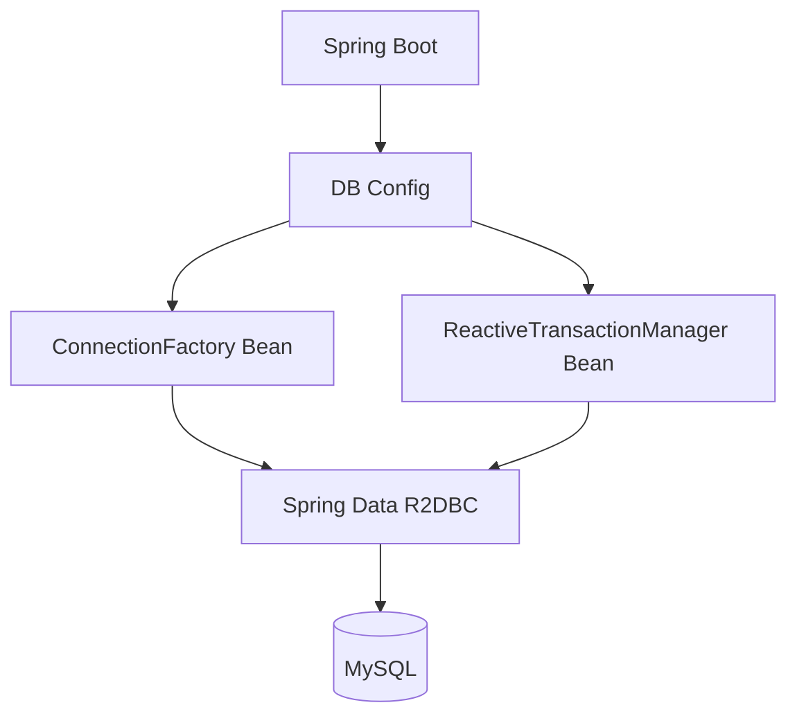
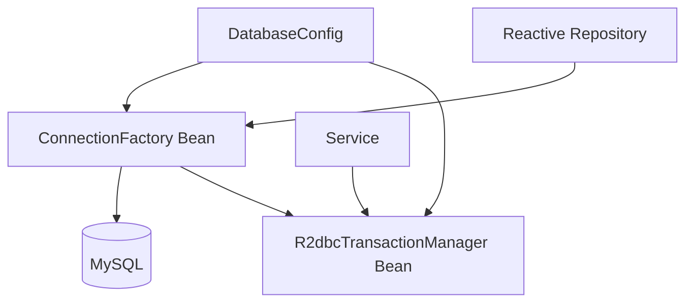
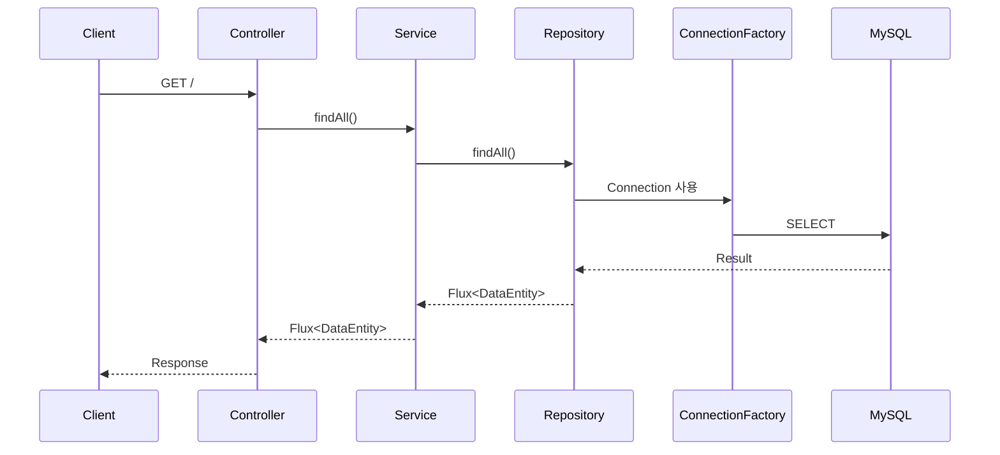
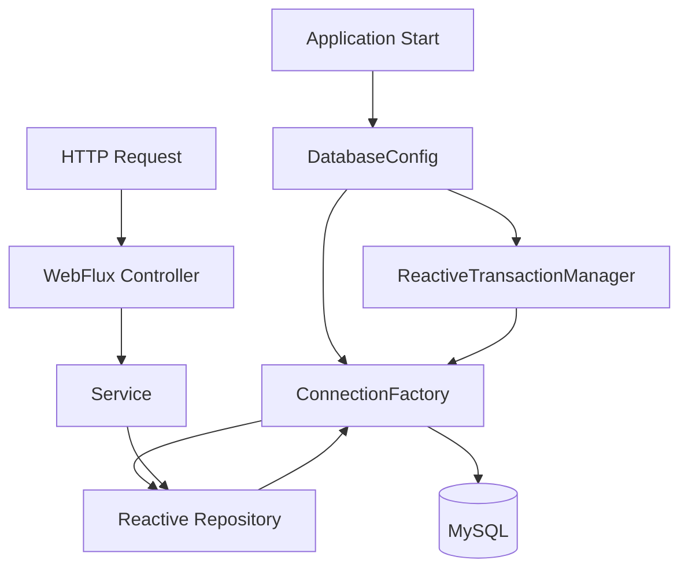

# 스프링 WebFlux 데이터베이스 2 - 스프링 WebFlux R2DBC Config 클래스 (단일 연결)
[https://youtu.be/slFndhOlSyA?si=JE8QGdI0llvTGC_7](https://youtu.be/slFndhOlSyA?si=JE8QGdI0llvTGC_7)

# 스프링 WebFlux 데이터베이스 2 - 스프링 WebFlux R2DBC Config 클래스 (단일 연결)
* toc
{:toc}

---

## Spring WebFlux에서 Config 클래스로 R2DBC MySQL 연결하기

Spring WebFlux 애플리케이션에서 MySQL을 R2DBC로 연결하는 가장 간단한 방법은 `application.properties` 또는 `application.yml`에 데이터베이스 정보를 작성하는 것이다.

예를 들어 다음과 같이 설정할 수 있다.

```properties
spring.r2dbc.url=r2dbc:mysql://localhost:3306/testdb
spring.r2dbc.username=root
spring.r2dbc.password=password
```

Spring Boot는 이 설정값을 읽어 필요한 `ConnectionFactory`를 자동으로 구성한다.

전체 구조를 단순하게 표현하면 다음과 같다.

```text
application.properties
        ↓
Spring Boot Auto Configuration
        ↓
ConnectionFactory
        ↓
Spring Data R2DBC
        ↓
MySQL
```

하지만 데이터베이스 연결 구성을 직접 제어해야 하는 경우에는 Java Config 클래스를 이용할 수도 있다.

이 방식에서는 Spring Boot가 설정 파일을 기반으로 자동 구성하도록 맡기는 대신 개발자가 직접 다음 객체를 Bean으로 등록한다.

```text
ConnectionFactory
ReactiveTransactionManager
```

구조는 다음과 같다.



이번에는 R2DBC를 이용해 MySQL 단일 Connection을 Java Config 클래스로 구성하는 방법을 살펴본다.

---

## 설정 파일 기반 R2DBC 연결

먼저 일반적인 설정 파일 방식을 살펴보자.

```properties
spring.r2dbc.url=r2dbc:mysql://localhost:3306/testdb
spring.r2dbc.username=root
spring.r2dbc.password=password
```

또는 YAML로 다음처럼 작성할 수 있다.

```yaml
spring:
  r2dbc:
    url: r2dbc:mysql://localhost:3306/testdb
    username: root
    password: password
```

이 방식에서는 개발자가 직접 `ConnectionFactory`를 만들지 않는다.

Spring Boot가 다음 작업을 수행한다.

```text
spring.r2dbc.* 설정 읽기

        ↓

ConnectionFactory 생성

        ↓

Spring Data R2DBC에 등록

        ↓

Repository에서 사용
```

따라서 단일 데이터베이스를 연결하는 정도라면 설정 파일 방식이 가장 단순하다.

---

## Config 클래스를 사용하는 이유

그렇다면 굳이 Java Config를 사용하는 이유는 무엇일까?

Config 클래스를 사용하면 Connection 생성 과정을 코드 수준에서 직접 제어할 수 있다.

예를 들어 이후 다음과 같은 요구사항이 생길 수 있다.

```text
여러 개의 R2DBC 데이터베이스 연결

ConnectionFactory 별도 관리

TransactionManager 직접 구성

환경별 Connection 구성 변경

Database Connection Pool 세부 설정
```

특히 하나의 애플리케이션에서 여러 데이터베이스를 사용해야 한다면 자동 구성만으로는 Bean을 명확하게 구분하기 어려워질 수 있다.

이런 경우 Java Config를 이용한 명시적인 구성 방식이 필요해질 수 있다.

---

## 프로젝트 구조

예제 프로젝트를 다음과 같이 구성할 수 있다.

```text
com.example.webflux
├── WebfluxApplication.java
│
├── config
│   └── DatabaseConfig.java
│
├── controller
│   └── DataController.java
│
├── service
│   └── DataService.java
│
├── repository
│   └── DataRepository.java
│
└── entity
    └── DataEntity.java
```

이번 핵심은 다음 클래스다.

```text
DatabaseConfig
```

이 클래스에서 R2DBC Connection을 직접 만든다.

---

## DatabaseConfig 클래스 작성

먼저 Config 패키지에 데이터베이스 설정 클래스를 만든다.

```java
package com.example.webflux.config;

import org.springframework.context.annotation.Configuration;

@Configuration
public class DatabaseConfig {

}
```

`@Configuration`을 선언하면 Spring이 해당 클래스를 설정 클래스로 관리한다.

이 내부에서 데이터베이스 연결과 관련된 Bean을 등록한다.

---

## ConnectionFactory란?

R2DBC에서는 데이터베이스 Connection을 생성하기 위한 핵심 인터페이스로 `ConnectionFactory`를 사용한다.

개념적으로 JDBC의 `DataSource`와 비슷한 위치에서 생각할 수 있다.

```text
JDBC

DataSource
   ↓
Connection
   ↓
Database
```

R2DBC에서는 다음과 같다.

```text
R2DBC

ConnectionFactory
       ↓
Connection
       ↓
Database
```

Spring Data R2DBC Repository는 이 `ConnectionFactory`를 이용하여 데이터베이스에 접근한다.

---

## ConnectionFactory Bean 등록

Java Config를 이용하려면 `ConnectionFactory`를 Bean으로 등록한다.

제공된 흐름을 일반적인 R2DBC API 형태로 재구성하면 다음과 같이 작성할 수 있다.

```java
package com.example.webflux.config;

import io.r2dbc.spi.ConnectionFactories;
import io.r2dbc.spi.ConnectionFactory;
import org.springframework.context.annotation.Bean;
import org.springframework.context.annotation.Configuration;

@Configuration
public class DatabaseConfig {

    @Bean
    public ConnectionFactory connectionFactory() {

        return ConnectionFactories.get(
                "r2dbc:mysql://localhost:3306/testdb"
        );
    }
}
```

이제 Spring Context에는 다음 Bean이 등록된다.

```text
ConnectionFactory
```

그리고 Spring Data R2DBC는 해당 ConnectionFactory를 이용해 MySQL Connection을 생성할 수 있다.

---

## ConnectionFactoryOptions를 이용한 구성

Database URL과 Username, Password를 조금 더 세분화해서 구성하려면 `ConnectionFactoryOptions`를 이용할 수 있다.

개념적인 구성은 다음과 같다.

```text
Driver
Host
Port
Database
Username
Password
```

Java 코드로 구성하면 다음과 같은 형태로 작성할 수 있다.

```java
package com.example.webflux.config;

import io.r2dbc.spi.ConnectionFactories;
import io.r2dbc.spi.ConnectionFactory;
import io.r2dbc.spi.ConnectionFactoryOptions;
import org.springframework.context.annotation.Bean;
import org.springframework.context.annotation.Configuration;

import static io.r2dbc.spi.ConnectionFactoryOptions.DATABASE;
import static io.r2dbc.spi.ConnectionFactoryOptions.DRIVER;
import static io.r2dbc.spi.ConnectionFactoryOptions.HOST;
import static io.r2dbc.spi.ConnectionFactoryOptions.PASSWORD;
import static io.r2dbc.spi.ConnectionFactoryOptions.PORT;
import static io.r2dbc.spi.ConnectionFactoryOptions.USER;

@Configuration
public class DatabaseConfig {

    @Bean
    public ConnectionFactory connectionFactory() {

        ConnectionFactoryOptions options =
                ConnectionFactoryOptions.builder()
                        .option(DRIVER, "mysql")
                        .option(HOST, "localhost")
                        .option(PORT, 3306)
                        .option(USER, "root")
                        .option(PASSWORD, "password")
                        .option(DATABASE, "testdb")
                        .build();

        return ConnectionFactories.get(options);
    }
}
```

구조를 보면 다음과 같다.

```text
ConnectionFactoryOptions
        ↓
Database 연결 정보
        ↓
ConnectionFactories.get()
        ↓
ConnectionFactory
```

---

## URL을 기반으로 Options 구성하기

URL을 기본값으로 사용하면서 Username과 Password 등을 추가하는 형태도 가능하다.

개념적으로는 다음과 같다.

```text
r2dbc:mysql://localhost:3306/testdb
                +
Username
                +
Password
```

예를 들어 다음과 같은 흐름으로 구성한다.

```java
ConnectionFactoryOptions options =
        ConnectionFactoryOptions
                .parse(
                        "r2dbc:mysql://localhost:3306/testdb"
                )
                .mutate()
                .option(
                        ConnectionFactoryOptions.USER,
                        "root"
                )
                .option(
                        ConnectionFactoryOptions.PASSWORD,
                        "password"
                )
                .build();
```

그리고 다음과 같이 `ConnectionFactory`를 생성한다.

```java
return ConnectionFactories.get(options);
```

전체 Bean은 다음과 같다.

```java
@Bean
public ConnectionFactory connectionFactory() {

    ConnectionFactoryOptions options =
            ConnectionFactoryOptions
                    .parse(
                            "r2dbc:mysql://localhost:3306/testdb"
                    )
                    .mutate()
                    .option(
                            ConnectionFactoryOptions.USER,
                            "root"
                    )
                    .option(
                            ConnectionFactoryOptions.PASSWORD,
                            "password"
                    )
                    .build();

    return ConnectionFactories.get(options);
}
```

이 방식은 Connection URL과 인증 정보를 코드에서 세분화하여 구성할 때 사용할 수 있다.

---

## 설정 파일 없이 연결되는 구조

기존에는 다음 설정을 사용했다.

```properties
spring.r2dbc.url=r2dbc:mysql://localhost:3306/testdb
spring.r2dbc.username=root
spring.r2dbc.password=password
```

하지만 Java Config에서 `ConnectionFactory`를 직접 Bean으로 등록하면 연결 정보를 Config 클래스가 담당하게 된다.

구조가 다음과 같이 변경된다.

```text
기존

application.properties
        ↓
Spring Boot
        ↓
ConnectionFactory
```

Java Config 방식에서는 다음과 같다.

```text
DatabaseConfig
        ↓
@Bean
        ↓
ConnectionFactory
```

Repository 입장에서는 ConnectionFactory가 어디에서 만들어졌는지가 크게 중요하지 않다.

최종적으로 Spring Context에 사용할 수 있는 ConnectionFactory가 존재하면 된다.

---

## ReactiveTransactionManager 등록

데이터베이스 Connection만큼 중요한 것이 Transaction이다.

R2DBC에서는 Reactive Transaction을 관리하기 위해 `ReactiveTransactionManager`를 사용할 수 있다.

구조는 다음과 같다.

```text
Service
   ↓
Reactive Transaction
   ↓
R2dbcTransactionManager
   ↓
ConnectionFactory
   ↓
MySQL
```

TransactionManager는 앞에서 만든 ConnectionFactory를 이용한다.

---

## R2dbcTransactionManager Bean 등록

다음과 같이 TransactionManager를 추가할 수 있다.

```java
package com.example.webflux.config;

import io.r2dbc.spi.ConnectionFactory;
import org.springframework.context.annotation.Bean;
import org.springframework.context.annotation.Configuration;
import org.springframework.r2dbc.connection.R2dbcTransactionManager;
import org.springframework.transaction.ReactiveTransactionManager;

@Configuration
public class DatabaseConfig {

    @Bean
    public ReactiveTransactionManager transactionManager(
            ConnectionFactory connectionFactory
    ) {

        return new R2dbcTransactionManager(
                connectionFactory
        );
    }
}
```

중요한 부분은 다음이다.

```java
ConnectionFactory connectionFactory
```

Spring이 앞에서 등록한 ConnectionFactory Bean을 주입한다.

그리고 다음 객체를 생성한다.

```java
new R2dbcTransactionManager(
        connectionFactory
)
```

즉 Connection과 Transaction이 동일한 ConnectionFactory를 기준으로 동작하게 된다.

---

## ConnectionFactory와 TransactionManager 전체 구성

두 Bean을 하나의 Config 클래스에 작성하면 다음과 같은 구조가 된다.

```java
package com.example.webflux.config;

import io.r2dbc.spi.ConnectionFactories;
import io.r2dbc.spi.ConnectionFactory;
import io.r2dbc.spi.ConnectionFactoryOptions;
import org.springframework.context.annotation.Bean;
import org.springframework.context.annotation.Configuration;
import org.springframework.r2dbc.connection.R2dbcTransactionManager;
import org.springframework.transaction.ReactiveTransactionManager;

@Configuration
public class DatabaseConfig {

    @Bean
    public ConnectionFactory connectionFactory() {

        ConnectionFactoryOptions options =
                ConnectionFactoryOptions
                        .parse(
                                "r2dbc:mysql://localhost:3306/testdb"
                        )
                        .mutate()
                        .option(
                                ConnectionFactoryOptions.USER,
                                "root"
                        )
                        .option(
                                ConnectionFactoryOptions.PASSWORD,
                                "password"
                        )
                        .build();

        return ConnectionFactories.get(options);
    }

    @Bean
    public ReactiveTransactionManager transactionManager(
            ConnectionFactory connectionFactory
    ) {

        return new R2dbcTransactionManager(
                connectionFactory
        );
    }
}
```

전체 의존 관계는 다음과 같다.



---

## 데이터베이스 Entity

Connection을 만들었다면 데이터베이스 데이터를 받을 객체가 필요하다.

예를 들어 다음 테이블이 있다고 하자.

```text
data_entity

id
name
```

Java Mapping 객체는 다음처럼 작성할 수 있다.

```java
package com.example.webflux.entity;

import lombok.Data;
import org.springframework.data.annotation.Id;
import org.springframework.data.relational.core.mapping.Table;

@Data
@Table("data_entity")
public class DataEntity {

    @Id
    private Long id;

    private String name;
}
```

R2DBC는 JPA가 아니기 때문에 JPA의 `@Entity`를 기반으로 동작하는 구조와는 다르다.

Spring Data Relational의 Mapping을 사용할 수 있다.

---

## Repository 작성

Repository는 Reactive Repository로 작성한다.

```java
package com.example.webflux.repository;

import com.example.webflux.entity.DataEntity;
import org.springframework.data.repository.reactive.ReactiveCrudRepository;

public interface DataRepository
        extends ReactiveCrudRepository<DataEntity, Long> {
}
```

전체 데이터를 조회하면 다음 타입을 반환한다.

```text
Flux<DataEntity>
```

하나의 데이터를 조회하면 다음과 같은 타입을 사용할 수 있다.

```text
Mono<DataEntity>
```

---

## Service에서 데이터 조회

Repository를 Service에 주입한다.

```java
package com.example.webflux.service;

import com.example.webflux.entity.DataEntity;
import com.example.webflux.repository.DataRepository;
import lombok.RequiredArgsConstructor;
import org.springframework.stereotype.Service;
import reactor.core.publisher.Flux;

@Service
@RequiredArgsConstructor
public class DataService {

    private final DataRepository dataRepository;

    public Flux<DataEntity> findAll() {
        return dataRepository.findAll();
    }
}
```

Reactive Pipeline은 그대로 유지한다.

```text
Repository
Flux<DataEntity>
      ↓
Service
Flux<DataEntity>
```

---

## Controller 작성

Controller에서도 Flux를 그대로 반환할 수 있다.

```java
package com.example.webflux.controller;

import com.example.webflux.entity.DataEntity;
import com.example.webflux.service.DataService;
import lombok.RequiredArgsConstructor;
import org.springframework.web.bind.annotation.GetMapping;
import org.springframework.web.bind.annotation.RestController;
import reactor.core.publisher.Flux;

@RestController
@RequiredArgsConstructor
public class DataController {

    private final DataService dataService;

    @GetMapping("/")
    public Flux<DataEntity> findAll() {
        return dataService.findAll();
    }
}
```

전체 요청 흐름은 다음과 같다.



---

## 실행

애플리케이션을 실행한다.

```bash
./gradlew bootRun
```

정상적으로 실행되었다면 다음 주소로 요청한다.

```bash
curl http://localhost:8080/
```

데이터베이스에 다음 데이터가 있다고 가정하자.

```text
1 apple
2 banana
3 orange
```

응답은 다음과 같은 형태가 될 수 있다.

```json
[
  {
    "id": 1,
    "name": "apple"
  },
  {
    "id": 2,
    "name": "banana"
  },
  {
    "id": 3,
    "name": "orange"
  }
]
```

즉 다음 연결 흐름이 정상적으로 구성된 것이다.

```text
WebFlux
   ↓
Reactive Repository
   ↓
ConnectionFactory
   ↓
R2DBC
   ↓
MySQL
```

---

## Config 방식과 설정 파일 방식 비교

두 방식 모두 최종적으로는 R2DBC `ConnectionFactory`를 사용한다.

차이는 ConnectionFactory를 누가 구성하느냐에 있다.

| 구분                | 설정 파일             | Java Config   |
| ----------------- | ----------------- | ------------- |
| 연결 정보             | `application.yml` | Java 코드       |
| ConnectionFactory | Spring Boot 자동 구성 | 직접 Bean 등록    |
| 코드량               | 적음                | 많음            |
| 단일 DB             | 매우 편리             | 가능            |
| 세밀한 제어            | 제한적               | 상대적으로 유연      |
| 다중 DB 확장          | 추가 구성 필요          | 명시적으로 구성하기 쉬움 |

단순한 단일 데이터베이스라면 설정 파일 방식이 훨씬 간단하다.

```yaml
spring:
  r2dbc:
    url: r2dbc:mysql://localhost:3306/testdb
```

Java Config는 특별한 제어가 필요한 경우에 의미가 커진다.

---

## Java Config를 사용할 때 Credential 하드코딩 주의

Java Config를 사용한다고 해서 다음처럼 Database Password를 코드에 직접 작성하는 것이 좋은 구조라는 의미는 아니다.

```java
.option(
        ConnectionFactoryOptions.PASSWORD,
        "password"
)
```

이 값이 Git에 Commit되면 Credential이 소스 코드와 함께 저장된다.

따라서 실제 환경에서는 Connection 생성 로직은 Java Config에 두더라도 값은 외부 설정에서 받아오는 구조를 사용하는 것이 좋다.

예를 들어:

```yaml
database:
  r2dbc:
    url: ${DB_R2DBC_URL}
    username: ${DB_USERNAME}
    password: ${DB_PASSWORD}
```

Config 클래스에서는 해당 값을 주입받는다.

```java
@Configuration
public class DatabaseConfig {

    private final DatabaseProperties properties;

    public DatabaseConfig(
            DatabaseProperties properties
    ) {
        this.properties = properties;
    }
}
```

즉 역할을 다음처럼 분리하는 것이다.

```text
Java Config
→ Connection 구성 방법

Environment / Secret
→ 실제 Credential
```

---

## @ConfigurationProperties를 이용한 분리

데이터베이스 설정이 늘어나면 `@Value`를 여러 개 사용하는 것보다 `@ConfigurationProperties`로 묶는 방식도 고려할 수 있다.

```java
import org.springframework.boot.context.properties.ConfigurationProperties;

@ConfigurationProperties(
        prefix = "database.r2dbc"
)
public record DatabaseProperties(
        String url,
        String username,
        String password
) {
}
```

설정은 다음과 같다.

```yaml
database:
  r2dbc:
    url: ${DB_R2DBC_URL}
    username: ${DB_USERNAME}
    password: ${DB_PASSWORD}
```

그리고 Config에서 사용한다.

```java
@Configuration
@EnableConfigurationProperties(
        DatabaseProperties.class
)
public class DatabaseConfig {

    @Bean
    public ConnectionFactory connectionFactory(
            DatabaseProperties properties
    ) {

        ConnectionFactoryOptions options =
                ConnectionFactoryOptions
                        .parse(properties.url())
                        .mutate()
                        .option(
                                ConnectionFactoryOptions.USER,
                                properties.username()
                        )
                        .option(
                                ConnectionFactoryOptions.PASSWORD,
                                properties.password()
                        )
                        .build();

        return ConnectionFactories.get(options);
    }
}
```

이렇게 하면 Connection 생성 코드는 Java Config에서 관리하면서 실제 환경값은 외부에서 관리할 수 있다.

---

## Java Config의 실제 의미

Java Config를 사용하는 목적을 다음처럼 이해하면 안 된다.

```text
application.yml을 없애기 위해
Java Config를 사용한다.
```

더 중요한 의미는 **인프라 객체 생성 과정을 개발자가 직접 제어한다는 것**이다.

```text
Auto Configuration

Spring Boot
→ ConnectionFactory 생성
```

Java Config에서는:

```text
Manual Configuration

Developer
→ ConnectionFactory 정의
→ TransactionManager 정의
```

이 차이가 중요하다.

---

## ConnectionFactory Bean이 중복되면 어떻게 될까?

단일 연결에서는 ConnectionFactory가 하나이기 때문에 구조가 단순하다.

```text
ConnectionFactory
→ MySQL
```

하지만 이후 여러 ConnectionFactory를 등록하게 되면 문제가 달라진다.

```text
ConnectionFactory A
→ MySQL A

ConnectionFactory B
→ MySQL B
```

Spring 입장에서는 어떤 Bean을 기본으로 사용해야 하는지 판단해야 한다.

이 경우 다음과 같은 기술을 고려해야 한다.

```text
@Primary
@Qualifier
별도 Repository 구성
별도 Entity Scan
별도 TransactionManager
```

따라서 Java Config 방식은 이후 Multi Database 구성으로 확장할 때 중요한 기반이 될 수 있다.

---

## Reactive Transaction이 필요한 이유

단순한 `findAll()` 조회에서는 Transaction을 직접 체감하기 어렵다.

하지만 두 개 이상의 변경 작업을 하나의 단위로 처리한다고 생각해보자.

```text
Order 저장

        +

OrderHistory 저장
```

첫 번째 저장은 성공했는데 두 번째 저장이 실패하면 데이터 정합성이 깨질 수 있다.

```text
Order
→ 저장 성공

OrderHistory
→ 저장 실패
```

원자적으로 처리해야 한다면 Transaction을 구성해야 한다.

```text
BEGIN

Order 저장
OrderHistory 저장

둘 다 성공
→ COMMIT

하나라도 실패
→ ROLLBACK
```

Reactive 환경에서는 `R2dbcTransactionManager`가 이러한 Reactive Transaction 처리 기반이 된다.

---

## Reactive @Transactional

TransactionManager가 정상적으로 등록되어 있다면 Service 계층에서 Transaction 경계를 정의하는 구조도 사용할 수 있다.

예를 들어 개념적으로 다음과 같다.

```java
@Transactional
public Mono<Order> createOrder(
        Order order
) {

    return orderRepository.save(order)
            .flatMap(saved ->
                    historyRepository.save(
                            createHistory(saved)
                    )
                    .thenReturn(saved)
            );
}
```

중요한 것은 중간에서 Reactive Pipeline을 끊지 않는 것이다.

```text
save()
   ↓
Mono
   ↓
flatMap
   ↓
save()
   ↓
Mono
```

---

## Transaction 안에서 block()을 사용하지 않기

Reactive 환경에서 다음과 같은 방식은 주의해야 한다.

```java
Order saved =
        orderRepository.save(order)
                .block();
```

이렇게 Reactive Stream 중간에서 `block()`을 호출하면 Blocking 작업으로 전환된다.

R2DBC와 WebFlux를 사용하는 목적을 살리려면 가능한 한 다음과 같이 Reactive Chain을 유지해야 한다.

```java
return orderRepository.save(order)
        .flatMap(saved ->
                historyRepository
                        .save(createHistory(saved))
                        .thenReturn(saved)
        );
```

---

## ConnectionFactoryOptions의 장점

Connection URL 하나만 사용하면 설정은 간단하다.

```java
ConnectionFactories.get(
        "r2dbc:mysql://localhost:3306/testdb"
);
```

하지만 `ConnectionFactoryOptions`를 이용하면 연결 정보를 명시적인 옵션으로 다룰 수 있다.

```text
DRIVER
HOST
PORT
DATABASE
USER
PASSWORD
```

이후 SSL이나 Driver별 추가 Option이 필요해질 경우 Config 클래스를 확장할 수 있는 기반이 된다.

---

## Connection Pool은 별도의 고려사항이다

직접 ConnectionFactory를 등록했다고 해서 반드시 Connection Pool까지 자동으로 원하는 방식대로 구성된다고 가정해서는 안 된다.

운영 환경에서는 다음 구조도 고려할 수 있다.

```text
Application
     ↓
Connection Pool
     ↓
ConnectionFactory
     ↓
MySQL
```

Connection Pool은 DB Connection을 재사용하여 Connection 생성 비용을 줄이는 역할을 한다.

하지만 Pool 크기를 무조건 크게 설정하는 것이 좋은 것은 아니다.

예를 들어:

```text
Application Instance 10개

각 Instance Pool
50

잠재 Connection
10 × 50 = 500
```

DB 서버의 최대 Connection 수와 Query 처리량을 함께 고려해야 한다.

---

## Config 클래스를 사용하는 것이 항상 더 좋은가?

그렇지는 않다.

단일 MySQL Connection만 사용하는 간단한 애플리케이션이라면 다음 설정만으로 충분할 수 있다.

```yaml
spring:
  r2dbc:
    url: r2dbc:mysql://localhost:3306/testdb
    username: ${DB_USERNAME}
    password: ${DB_PASSWORD}
```

Java Config를 추가하면 오히려 다음 부담이 생긴다.

```text
설정 코드 증가
직접 관리할 Bean 증가
Spring Boot Auto Configuration 활용 감소
테스트할 설정 증가
```

따라서 요구사항에 따라 선택하는 것이 좋다.

```text
단순 단일 DB

→ Spring Boot Auto Configuration
```

```text
세부적인 Connection 제어
여러 DB 연결
TransactionManager 직접 구성

→ Java Config 고려
```

---

## application.properties 설정을 제거했는데 실행되는 이유

기존 설정을 제거했는데도 애플리케이션이 정상 동작하는 이유는 Java Config에서 `ConnectionFactory` Bean을 직접 등록했기 때문이다.

기존에는:

```text
application.properties
        ↓
Auto Configuration
        ↓
ConnectionFactory
```

Java Config 적용 후에는:

```text
DatabaseConfig
        ↓
@Bean
        ↓
ConnectionFactory
```

라는 흐름이 만들어진다.

Repository가 필요로 하는 ConnectionFactory가 Spring Context에 존재하므로 데이터베이스 접근이 가능해진다.

---

## 전체 실행 흐름

최종적인 애플리케이션 구조를 살펴보면 다음과 같다.



조회 요청 흐름은 다음과 같다.

```text
Client
   ↓
WebFlux Controller
   ↓
Service
   ↓
Reactive Repository
   ↓
ConnectionFactory
   ↓
MySQL
```

Transaction이 필요한 경우 다음 구성도 참여한다.

```text
Service
   ↓
ReactiveTransactionManager
   ↓
ConnectionFactory
   ↓
MySQL
```

---

## 실무에서의 활용

Java Config 기반 R2DBC 구성은 단순히 설정 방법을 하나 더 배우는 것보다 **Spring Boot의 데이터베이스 자동 설정이 내부적으로 어떤 객체를 중심으로 구성되는지 이해하는 데 의미가 있다.**

핵심 객체는 다음 두 가지다.

```text
ConnectionFactory
ReactiveTransactionManager
```

`ConnectionFactory`는 실제 데이터베이스 Connection 생성의 출발점이고, `R2dbcTransactionManager`는 해당 ConnectionFactory를 이용하여 Reactive Transaction을 관리한다.

단일 데이터베이스 환경에서는 Spring Boot Auto Configuration을 사용하는 것이 대부분 더 간단하지만, 이후 다음과 같은 요구사항이 생기면 Java Config에 대한 이해가 중요해진다.

```text
Multiple Database

Connection 별 설정 분리

TransactionManager 분리

Connection Pool Customizing

환경별 ConnectionFactory 생성

Repository 별 Database 분리
```

특히 여러 R2DBC 데이터베이스를 연결하려면 단순히 `spring.r2dbc.*` 설정 하나만으로는 표현하기 어려워지므로 직접 Bean을 정의하는 방식이 필요할 수 있다.

---

## 정리

Spring WebFlux에서 MySQL을 R2DBC로 연결할 때 가장 단순한 방법은 다음처럼 Spring Boot 설정을 사용하는 것이다.

```yaml
spring:
  r2dbc:
    url: r2dbc:mysql://localhost:3306/testdb
    username: root
    password: password
```

이 경우 Spring Boot가 자동으로 `ConnectionFactory`를 구성한다.

하지만 Java Config를 사용하면 개발자가 직접 ConnectionFactory를 Bean으로 등록할 수 있다.

```java
@Bean
public ConnectionFactory connectionFactory() {

    ConnectionFactoryOptions options =
            ConnectionFactoryOptions
                    .parse(
                            "r2dbc:mysql://localhost:3306/testdb"
                    )
                    .mutate()
                    .option(
                            ConnectionFactoryOptions.USER,
                            "root"
                    )
                    .option(
                            ConnectionFactoryOptions.PASSWORD,
                            "password"
                    )
                    .build();

    return ConnectionFactories.get(options);
}
```

Reactive Transaction이 필요하다면 동일한 ConnectionFactory를 이용하여 TransactionManager도 구성할 수 있다.

```java
@Bean
public ReactiveTransactionManager transactionManager(
        ConnectionFactory connectionFactory
) {

    return new R2dbcTransactionManager(
            connectionFactory
    );
}
```

전체 구조는 다음과 같다.

```text
DatabaseConfig

├── ConnectionFactory
│       ↓
│     MySQL
│
└── R2dbcTransactionManager
        ↓
   ConnectionFactory
```

Repository에서는 이렇게 등록된 ConnectionFactory를 이용해 Reactive 데이터 접근을 수행한다.

```text
Controller
   ↓
Service
   ↓
Reactive Repository
   ↓
ConnectionFactory
   ↓
MySQL
```

단순한 단일 데이터베이스라면 Spring Boot Auto Configuration이 더 간결하지만, Connection 생성 방식을 직접 제어하거나 이후 여러 데이터베이스를 연결해야 하는 환경에서는 Config 클래스를 이용한 명시적인 Bean 구성이 중요한 기반이 된다.

### 한 줄 요약

Spring WebFlux에서 R2DBC 데이터베이스 연결을 Java Config로 구성하려면 `ConnectionFactory`를 직접 Bean으로 등록하고 필요한 경우 동일한 ConnectionFactory를 사용하는 `R2dbcTransactionManager`까지 구성하며, 이 방식은 단순 단일 연결보다는 Connection 제어와 다중 데이터베이스 확장이 필요한 환경에서 특히 유용하다.
