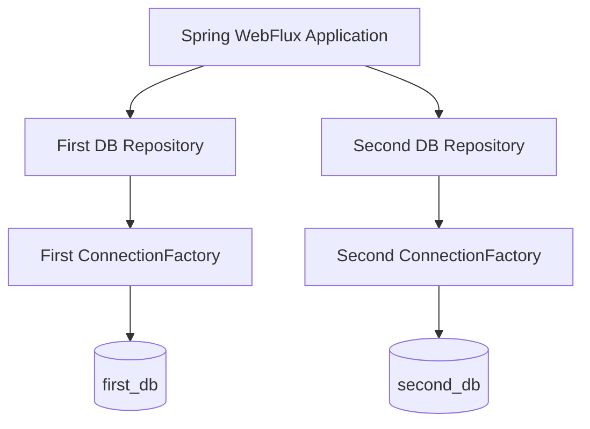
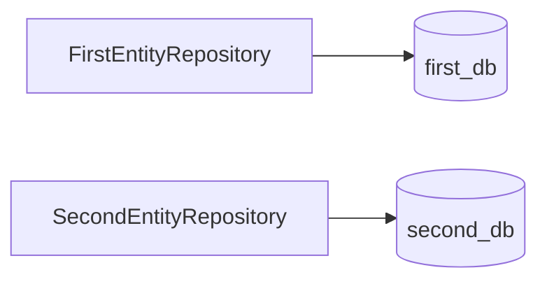
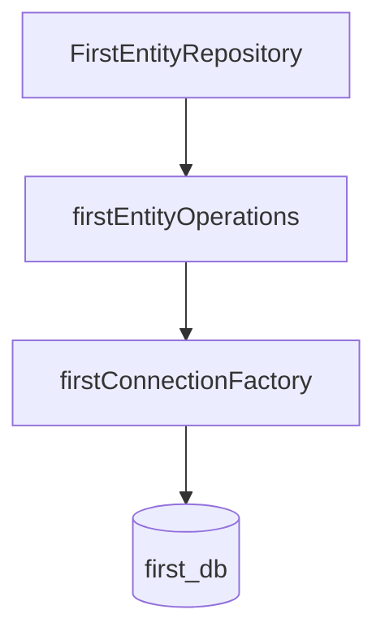
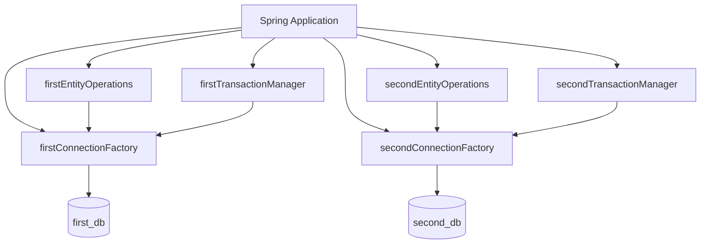
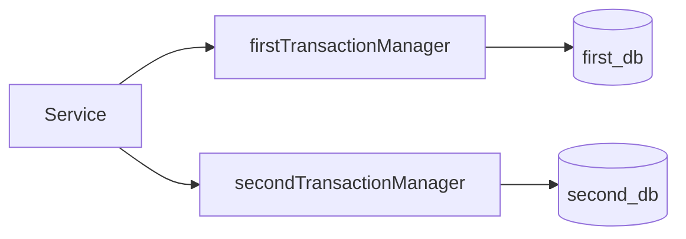
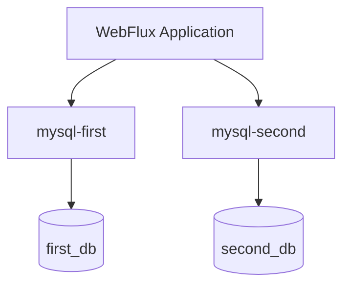
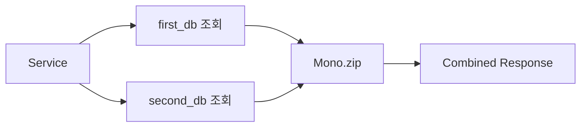
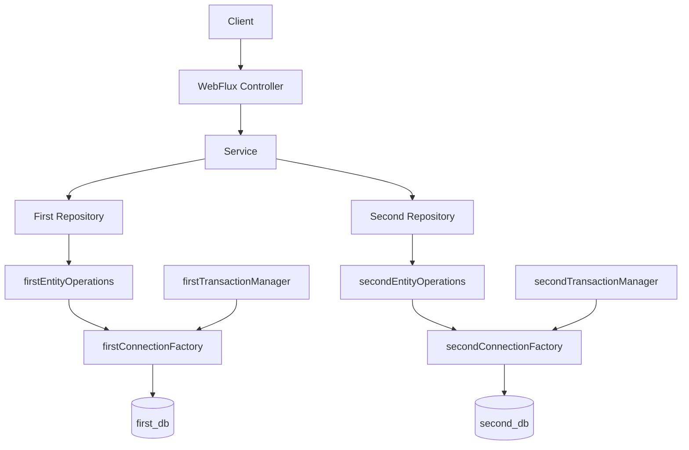

# 스프링 WebFlux 데이터베이스 3 - 스프링 WebFlux R2DBC 다중 연결 (multi DB)
[https://youtu.be/5KqfP5wtWmU?si=ZCDiUoiVDNQm88zH](https://youtu.be/5KqfP5wtWmU?si=ZCDiUoiVDNQm88zH)

# 스프링 WebFlux 데이터베이스 3 - 스프링 WebFlux R2DBC 다중 연결 (multi DB)
* toc
{:toc}

---

## Spring WebFlux에서 R2DBC로 여러 MySQL 데이터베이스 연결하기

하나의 Spring WebFlux 애플리케이션이 항상 하나의 데이터베이스만 사용하는 것은 아니다.

서비스가 커지거나 데이터의 역할이 분리되면 하나의 애플리케이션에서 두 개 이상의 데이터베이스에 접근해야 하는 상황이 발생할 수 있다.

예를 들어 다음과 같이 두 개의 MySQL Database가 존재한다고 가정해보자.

```text
MySQL Server

├── first_db
│   └── first_entity
│
└── second_db
    └── second_entity
```

Spring WebFlux 애플리케이션에서는 두 데이터베이스를 각각 R2DBC로 연결하여 서로 다른 Repository가 자신의 데이터베이스를 사용하도록 구성할 수 있다.

전체 구조는 다음과 같다.



단일 데이터베이스에서는 Spring Boot의 자동 설정을 이용해 비교적 간단하게 연결할 수 있었다.

```yaml
spring:
  r2dbc:
    url: r2dbc:mysql://localhost:3306/first_db
    username: root
    password: password
```

하지만 데이터베이스가 두 개 이상으로 늘어나면 어떤 Repository가 어떤 `ConnectionFactory`를 사용해야 하는지 명확하게 구분해야 한다.

따라서 다중 R2DBC 연결에서는 Java Config 클래스를 이용해 데이터베이스별 `ConnectionFactory`, Entity Operation, TransactionManager 등을 명시적으로 구성하는 방식이 중요해진다.

---

## R2DBC 다중 연결이란?

R2DBC 다중 연결은 하나의 Spring WebFlux 애플리케이션에서 두 개 이상의 관계형 데이터베이스에 Reactive 방식으로 접근하는 구조를 의미한다.

예를 들어 다음 두 Database를 사용한다고 가정한다.

```text
first_db
second_db
```

각각에는 서로 다른 테이블이 존재한다.

```text
first_db
└── first_entity


second_db
└── second_entity
```

애플리케이션에서는 각각에 대응되는 Repository를 만든다.

```text
FirstEntityRepository
SecondEntityRepository
```

그리고 Repository가 서로 다른 Database Connection을 사용하도록 연결해야 한다.

```text
FirstEntityRepository
        ↓
First ConnectionFactory
        ↓
first_db
```

```text
SecondEntityRepository
        ↓
Second ConnectionFactory
        ↓
second_db
```

이 구조가 다중 데이터베이스 연결의 핵심이다.

---

## 단일 데이터베이스와 다중 데이터베이스의 차이

단일 R2DBC 연결에서는 구조가 매우 단순하다.

```text
Application
    ↓
ConnectionFactory
    ↓
Database
```

Repository 역시 하나의 ConnectionFactory를 사용한다.

```text
Repository A ─┐
Repository B ─┼→ ConnectionFactory → MySQL
Repository C ─┘
```

하지만 두 개의 Database가 존재한다면 상황이 달라진다.

```text
Repository A
    ↓
ConnectionFactory A
    ↓
Database A


Repository B
    ↓
ConnectionFactory B
    ↓
Database B
```

Spring이 어떤 Repository가 어떤 ConnectionFactory를 사용해야 하는지 알아야 한다.

따라서 Repository Scan 범위와 Connection 설정을 데이터베이스별로 구분해야 한다.

---

## 왜 application.properties만으로 구성하기 어려울까?

단일 연결에서는 다음 설정만으로 Database Connection을 구성할 수 있다.

```properties
spring.r2dbc.url=r2dbc:mysql://localhost:3306/first_db
spring.r2dbc.username=root
spring.r2dbc.password=password
```

Spring Boot가 이 정보를 기반으로 기본 `ConnectionFactory`를 자동 생성한다.

```text
spring.r2dbc.*
      ↓
Spring Boot Auto Configuration
      ↓
ConnectionFactory
      ↓
first_db
```

하지만 데이터베이스가 두 개라면 다음과 같은 두 연결이 필요하다.

```text
ConnectionFactory A
→ first_db

ConnectionFactory B
→ second_db
```

단순한 하나의 기본 `spring.r2dbc.*` 연결만으로는 두 Repository 영역을 명확하게 구분하기 어렵다.

따라서 데이터베이스별 Config 클래스를 만들어 Connection을 직접 정의한다.

---

## 이번 구성에서 사용할 두 Database

하나의 MySQL Server에 두 개의 Database가 있다고 가정한다.

```text
localhost:3306

├── first_db
└── second_db
```

첫 번째 연결 정보는 다음과 같다.

```text
Host
localhost

Port
3306

Database
first_db

Username
root

Password
password
```

두 번째 Database도 같은 MySQL Server를 사용하지만 Database 이름이 다르다.

```text
Host
localhost

Port
3306

Database
second_db

Username
root

Password
password
```

따라서 R2DBC URL은 다음처럼 구분할 수 있다.

```text
r2dbc:mysql://localhost:3306/first_db
```

```text
r2dbc:mysql://localhost:3306/second_db
```

---

## 데이터베이스별 패키지를 분리하기

다중 데이터베이스 연결에서 중요한 부분 중 하나는 Repository 패키지를 Database별로 나누는 것이다.

예를 들어 프로젝트 구조를 다음과 같이 구성할 수 있다.

```text
com.example.multidb
├── MultiDbApplication.java
│
├── config
│   ├── FirstDatabaseConfig.java
│   └── SecondDatabaseConfig.java
│
├── firstdb
│   ├── entity
│   │   └── FirstEntity.java
│   └── repository
│       └── FirstEntityRepository.java
│
└── seconddb
    ├── entity
    │   └── SecondEntity.java
    └── repository
        └── SecondEntityRepository.java
```

이렇게 패키지를 분리하면 각 Config 클래스가 자신이 담당할 Repository 영역을 명확하게 지정할 수 있다.

```text
FirstDatabaseConfig
       ↓
firstdb.repository


SecondDatabaseConfig
       ↓
seconddb.repository
```

---

## 패키지를 분리하는 이유

예를 들어 `FirstEntityRepository`는 반드시 `first_db`에 연결되어야 한다.

```text
FirstEntityRepository
        ↓
first_db
```

반면 `SecondEntityRepository`는 다음 Database를 사용해야 한다.

```text
SecondEntityRepository
        ↓
second_db
```

Repository가 모두 같은 패키지에 섞여 있으면 어떤 Repository가 어느 Connection을 사용해야 하는지 구성하기 어려워질 수 있다.

따라서 다음과 같이 논리적인 경계를 둔다.

```text
firstdb
→ first_db 담당

seconddb
→ second_db 담당
```

Database Configuration과 Package Structure가 서로 대응되는 구조다.

---

## FirstEntity 작성

첫 번째 데이터베이스에는 `first_entity` 테이블이 있다고 가정한다.

```text
first_db

first_entity
├── id
└── name
```

Java 객체는 다음처럼 작성할 수 있다.

```java
package com.example.multidb.firstdb.entity;

import lombok.Data;
import org.springframework.data.annotation.Id;
import org.springframework.data.relational.core.mapping.Table;

@Data
@Table("first_entity")
public class FirstEntity {

    @Id
    private Long id;

    private String name;
}
```

---

## FirstEntityRepository 작성

첫 번째 데이터베이스에 접근할 Repository를 만든다.

```java
package com.example.multidb.firstdb.repository;

import com.example.multidb.firstdb.entity.FirstEntity;
import org.springframework.data.repository.reactive.ReactiveCrudRepository;

public interface FirstEntityRepository
        extends ReactiveCrudRepository<FirstEntity, Long> {
}
```

여러 데이터를 조회하면 `Flux<FirstEntity>` 형태의 Reactive Stream을 사용할 수 있다.

---

## SecondEntity 작성

두 번째 데이터베이스에는 별도의 테이블이 존재한다고 가정한다.

```text
second_db

second_entity
├── id
└── name
```

객체를 작성한다.

```java
package com.example.multidb.seconddb.entity;

import lombok.Data;
import org.springframework.data.annotation.Id;
import org.springframework.data.relational.core.mapping.Table;

@Data
@Table("second_entity")
public class SecondEntity {

    @Id
    private Long id;

    private String name;
}
```

---

## SecondEntityRepository 작성

두 번째 Repository도 Reactive Repository로 만든다.

```java
package com.example.multidb.seconddb.repository;

import com.example.multidb.seconddb.entity.SecondEntity;
import org.springframework.data.repository.reactive.ReactiveCrudRepository;

public interface SecondEntityRepository
        extends ReactiveCrudRepository<SecondEntity, Long> {
}
```

최종적으로 Repository와 Database의 관계는 다음과 같다.



하지만 이 상태만으로는 어떤 ConnectionFactory를 사용할지 아직 연결되지 않았다.

이를 Java Config에서 설정한다.

---

## 첫 번째 Database Config 작성

먼저 `FirstDatabaseConfig` 클래스를 만든다.

```java
package com.example.multidb.config;

import org.springframework.context.annotation.Configuration;

@Configuration
public class FirstDatabaseConfig {

}
```

이 클래스가 첫 번째 Database와 관련된 설정을 담당한다.

개념적으로 다음 객체들이 필요하다.

```text
First ConnectionFactory

First Entity Operations

First TransactionManager
```

---

## @EnableR2dbcRepositories

첫 번째 Database를 사용하는 Repository 패키지를 지정하기 위해 `@EnableR2dbcRepositories`를 사용할 수 있다.

구조는 다음과 같다.

```java
@Configuration
@EnableR2dbcRepositories(
        basePackages =
                "com.example.multidb.firstdb.repository",
        entityOperationsRef =
                "firstEntityOperations"
)
public class FirstDatabaseConfig {

}
```

`basePackages`는 이 Config 클래스가 관리할 Repository 위치를 지정한다.

```text
basePackages
     ↓
firstdb.repository
```

즉 다음 Repository들이 첫 번째 Database 구성과 연결된다.

```text
com.example.multidb.firstdb.repository.*
```

---

## entityOperationsRef의 역할

다중 Connection 환경에서는 Repository가 어떤 R2DBC Operations를 사용할지 지정해야 한다.

```java
entityOperationsRef =
        "firstEntityOperations"
```

이는 Config 클래스 내부에 생성할 Bean 이름을 참조한다.

구조는 다음과 같다.

```text
FirstEntityRepository
        ↓
firstEntityOperations
        ↓
First ConnectionFactory
        ↓
first_db
```

두 번째 Database에는 별도의 Entity Operations를 만든다.

```text
SecondEntityRepository
        ↓
secondEntityOperations
        ↓
Second ConnectionFactory
        ↓
second_db
```

이렇게 해서 Repository 영역과 Database Connection을 분리한다.

---

## 첫 번째 ConnectionFactory Bean 만들기

첫 번째 Database와 연결할 `ConnectionFactory`를 Bean으로 만든다.

```java
@Bean
public ConnectionFactory firstConnectionFactory() {

    ConnectionFactoryOptions options =
            ConnectionFactoryOptions
                    .parse(
                            "r2dbc:mysql://localhost:3306/first_db"
                    )
                    .mutate()
                    .option(
                            ConnectionFactoryOptions.USER,
                            "root"
                    )
                    .option(
                            ConnectionFactoryOptions.PASSWORD,
                            "password"
                    )
                    .build();

    return ConnectionFactories.get(options);
}
```

결과적으로 다음 Bean이 만들어진다.

```text
firstConnectionFactory
        ↓
first_db
```

---

## @Qualifier가 필요한 이유

두 개의 Database를 연결하면 같은 타입의 Bean이 여러 개 존재한다.

예를 들어 다음 두 Bean이 등록된다.

```text
ConnectionFactory

firstConnectionFactory
secondConnectionFactory
```

둘 다 타입은 동일하다.

```java
ConnectionFactory
```

어떤 메서드에서 단순히 다음처럼 주입받으면:

```java
ConnectionFactory connectionFactory
```

Spring은 어떤 ConnectionFactory를 선택해야 하는지 판단해야 한다.

따라서 `@Qualifier`를 이용해 Bean을 구분할 수 있다.

```java
@Qualifier("firstConnectionFactory")
ConnectionFactory connectionFactory
```

또는:

```java
@Qualifier("secondConnectionFactory")
ConnectionFactory connectionFactory
```

구조는 다음과 같다.

```text
ConnectionFactory Bean
        ↓

┌─────────────────────────┐
│ firstConnectionFactory  │
│ secondConnectionFactory │
└─────────────────────────┘
        ↓
@Qualifier
        ↓
원하는 Bean 선택
```

---

## 첫 번째 EntityOperations 등록

첫 번째 Repository가 사용할 Entity Operations를 등록한다.

개념적으로 다음 역할을 한다.

```text
FirstEntityRepository
       ↓
R2dbcEntityOperations
       ↓
firstConnectionFactory
```

구성 흐름은 다음과 같이 만들 수 있다.

```java
@Bean
public R2dbcEntityOperations firstEntityOperations(
        @Qualifier("firstConnectionFactory")
        ConnectionFactory connectionFactory
) {

    DatabaseClient databaseClient =
            DatabaseClient.create(connectionFactory);

    return new R2dbcEntityTemplate(
            databaseClient,
            MySqlDialect.INSTANCE
    );
}
```

이 Bean의 이름은 다음과 같다.

```text
firstEntityOperations
```

그리고 앞에서 지정한:

```java
entityOperationsRef =
        "firstEntityOperations"
```

와 연결된다.

결과적으로 첫 번째 Repository의 흐름은 다음과 같다.



---

## 첫 번째 TransactionManager 등록

필요하다면 첫 번째 Database 전용 TransactionManager를 만든다.

```java
@Bean
public ReactiveTransactionManager firstTransactionManager(
        @Qualifier("firstConnectionFactory")
        ConnectionFactory connectionFactory
) {

    return new R2dbcTransactionManager(
            connectionFactory
    );
}
```

이 TransactionManager는 첫 번째 ConnectionFactory를 사용한다.

```text
firstTransactionManager
        ↓
firstConnectionFactory
        ↓
first_db
```

---

## 첫 번째 Database Config 전체 구조

전체적인 형태는 다음과 같다.

```java
@Configuration
@EnableR2dbcRepositories(
        basePackages =
                "com.example.multidb.firstdb.repository",
        entityOperationsRef =
                "firstEntityOperations"
)
public class FirstDatabaseConfig {

    @Bean
    public ConnectionFactory firstConnectionFactory() {

        ConnectionFactoryOptions options =
                ConnectionFactoryOptions
                        .parse(
                                "r2dbc:mysql://localhost:3306/first_db"
                        )
                        .mutate()
                        .option(
                                ConnectionFactoryOptions.USER,
                                "root"
                        )
                        .option(
                                ConnectionFactoryOptions.PASSWORD,
                                "password"
                        )
                        .build();

        return ConnectionFactories.get(options);
    }

    @Bean
    public R2dbcEntityOperations firstEntityOperations(
            @Qualifier("firstConnectionFactory")
            ConnectionFactory connectionFactory
    ) {

        DatabaseClient databaseClient =
                DatabaseClient.create(connectionFactory);

        return new R2dbcEntityTemplate(
                databaseClient,
                MySqlDialect.INSTANCE
        );
    }

    @Bean
    public ReactiveTransactionManager firstTransactionManager(
            @Qualifier("firstConnectionFactory")
            ConnectionFactory connectionFactory
    ) {

        return new R2dbcTransactionManager(
                connectionFactory
        );
    }
}
```

핵심 구조는 세 가지다.

```text
ConnectionFactory

R2dbcEntityOperations

ReactiveTransactionManager
```

---

## 두 번째 Database Config 작성

두 번째 Database 역시 구조는 동일하다.

차이가 나는 것은 다음 부분이다.

```text
Repository Package

Bean Name

Database URL
```

예를 들어 다음과 같이 구성한다.

```java
@Configuration
@EnableR2dbcRepositories(
        basePackages =
                "com.example.multidb.seconddb.repository",
        entityOperationsRef =
                "secondEntityOperations"
)
public class SecondDatabaseConfig {

}
```

두 번째 Repository Package는 다음과 같다.

```text
com.example.multidb.seconddb.repository
```

---

## 두 번째 ConnectionFactory

두 번째 Database URL을 사용한다.

```java
@Bean
public ConnectionFactory secondConnectionFactory() {

    ConnectionFactoryOptions options =
            ConnectionFactoryOptions
                    .parse(
                            "r2dbc:mysql://localhost:3306/second_db"
                    )
                    .mutate()
                    .option(
                            ConnectionFactoryOptions.USER,
                            "root"
                    )
                    .option(
                            ConnectionFactoryOptions.PASSWORD,
                            "password"
                    )
                    .build();

    return ConnectionFactories.get(options);
}
```

구조는 다음과 같다.

```text
secondConnectionFactory
        ↓
second_db
```

---

## 두 번째 EntityOperations

```java
@Bean
public R2dbcEntityOperations secondEntityOperations(
        @Qualifier("secondConnectionFactory")
        ConnectionFactory connectionFactory
) {

    DatabaseClient databaseClient =
            DatabaseClient.create(connectionFactory);

    return new R2dbcEntityTemplate(
            databaseClient,
            MySqlDialect.INSTANCE
    );
}
```

관계는 다음과 같다.

```text
SecondEntityRepository
        ↓
secondEntityOperations
        ↓
secondConnectionFactory
        ↓
second_db
```

---

## 두 번째 TransactionManager

필요하면 두 번째 Database를 위한 TransactionManager도 별도로 등록한다.

```java
@Bean
public ReactiveTransactionManager secondTransactionManager(
        @Qualifier("secondConnectionFactory")
        ConnectionFactory connectionFactory
) {

    return new R2dbcTransactionManager(
            connectionFactory
    );
}
```

즉 TransactionManager 역시 Database 단위로 분리한다.

```text
First DB
→ firstTransactionManager

Second DB
→ secondTransactionManager
```

---

## @Primary가 필요한 이유

다중 Database 환경에서는 동일 타입의 Bean이 여러 개 존재한다.

예를 들면:

```text
ConnectionFactory

firstConnectionFactory
secondConnectionFactory
```

특정 Bean을 `@Qualifier`로 지정하지 않는 코드가 존재한다면 어떤 Bean을 기본값으로 선택할지 결정해야 할 수 있다.

이때 한쪽 Bean을 기본 Bean으로 지정하기 위해 `@Primary`를 사용할 수 있다.

예를 들어 첫 번째 ConnectionFactory를 기본으로 사용할 수 있다.

```java
@Primary
@Bean
public ConnectionFactory firstConnectionFactory() {
    ...
}
```

Entity Operations 역시 기본값으로 사용할 대상을 지정할 수 있다.

```java
@Primary
@Bean
public R2dbcEntityOperations firstEntityOperations(
        ...
) {
    ...
}
```

TransactionManager도 마찬가지다.

```java
@Primary
@Bean
public ReactiveTransactionManager firstTransactionManager(
        ...
) {
    ...
}
```

개념적으로 다음과 같다.

```text
동일 타입 Bean

firstConnectionFactory
secondConnectionFactory
        ↓
Spring이 기본값 필요
        ↓
@Primary
        ↓
firstConnectionFactory 선택
```

---

## @Primary와 @Qualifier 차이

두 어노테이션은 역할이 다르다.

### @Primary

같은 타입 Bean이 여러 개일 때 기본적으로 선택할 Bean을 지정한다.

```java
@Primary
@Bean
public ConnectionFactory firstConnectionFactory() {
}
```

의미는 다음과 같다.

```text
특별한 지정이 없다면
firstConnectionFactory를 사용한다.
```

---

### @Qualifier

어떤 Bean을 사용할지 명확하게 지정한다.

```java
@Qualifier("secondConnectionFactory")
ConnectionFactory connectionFactory
```

의미는 다음과 같다.

```text
반드시 secondConnectionFactory를 사용한다.
```

둘을 비교하면 다음과 같다.

| 구분   | `@Primary` | `@Qualifier` |
| ---- | ---------- | ------------ |
| 목적   | 기본 Bean 지정 | 특정 Bean 지정   |
| 위치   | Bean 선언    | 주입받는 위치      |
| 우선순위 | 기본 선택      | 명시적 선택       |

다중 데이터베이스에서는 두 개념 모두 중요하다.

---

## 전체 Bean 구성

데이터베이스가 두 개라면 다음 Bean들이 존재하게 된다.

```text
First DB

firstConnectionFactory
firstEntityOperations
firstTransactionManager


Second DB

secondConnectionFactory
secondEntityOperations
secondTransactionManager
```

구조를 그림으로 보면 다음과 같다.



---

## Repository와 Config의 연결 관계

다중 연결에서 가장 중요한 부분을 하나로 정리하면 다음과 같다.

첫 번째 Repository는:

```text
firstdb.repository
        ↓
@EnableR2dbcRepositories
        ↓
firstEntityOperations
        ↓
firstConnectionFactory
        ↓
first_db
```

두 번째 Repository는:

```text
seconddb.repository
        ↓
@EnableR2dbcRepositories
        ↓
secondEntityOperations
        ↓
secondConnectionFactory
        ↓
second_db
```

즉 Repository Package를 기준으로 서로 다른 Database 설정을 연결한다.

---

## 왜 Repository 패키지 구분이 중요한가?

다음 두 Repository가 있다고 가정하자.

```text
FirstEntityRepository
SecondEntityRepository
```

Spring 입장에서는 둘 다 Reactive Repository다.

하지만 애플리케이션 요구사항은 다음과 같다.

```text
FirstEntityRepository
→ first_db

SecondEntityRepository
→ second_db
```

이를 명시적으로 알려주는 역할이 `@EnableR2dbcRepositories`의 Package 설정과 `entityOperationsRef`다.

```java
@EnableR2dbcRepositories(
    basePackages = "...firstdb.repository",
    entityOperationsRef = "firstEntityOperations"
)
```

이 설정을 통해 Repository와 Connection이 연결된다.

---

## 두 데이터베이스의 데이터 조회하기

이제 각각의 Repository에서 데이터를 조회할 수 있다.

예를 들어 첫 번째 Database에는 다음 데이터가 있다고 가정한다.

```text
first_db.first_entity

1 FIRST-A
2 FIRST-B
```

두 번째 Database에는 다음 데이터가 있다.

```text
second_db.second_entity

1 SECOND-A
2 SECOND-B
```

Controller에서 두 Repository를 주입받는다.

```java
@RestController
@RequiredArgsConstructor
public class MainController {

    private final FirstEntityRepository firstRepository;
    private final SecondEntityRepository secondRepository;
}
```

각각 `findAll()`을 호출하면 서로 다른 Database의 데이터를 조회할 수 있다.

---

## Flux로 데이터 조회

첫 번째 Repository:

```java
Flux<FirstEntity> first =
        firstRepository.findAll();
```

두 번째 Repository:

```java
Flux<SecondEntity> second =
        secondRepository.findAll();
```

각각 다음 흐름으로 동작한다.

```text
firstRepository.findAll()
        ↓
firstConnectionFactory
        ↓
first_db
```

```text
secondRepository.findAll()
        ↓
secondConnectionFactory
        ↓
second_db
```

하나의 애플리케이션 내부에서 완전히 다른 Database에 Reactive Query를 실행할 수 있다.

---

## 조회 결과를 로그로 확인하는 구조

간단하게 실행 결과를 확인한다면 각각의 Flux에 처리 로직을 붙일 수 있다.

개념적인 형태는 다음과 같다.

```java
firstRepository.findAll()
        .doOnNext(System.out::println);
```

```java
secondRepository.findAll()
        .doOnNext(System.out::println);
```

Reactive Pipeline에서는 실제 Subscription이 발생해야 Stream이 실행된다는 점도 함께 이해해야 한다.

실제 HTTP Controller에서 `Flux`를 반환하면 WebFlux가 해당 Reactive Stream을 구독하여 응답을 처리한다.

---

## 두 데이터베이스 결과를 하나의 HTTP 응답으로 결합한다면

실제 API에서는 단순히 System Log에 출력하기보다 두 Database 결과를 조합해야 할 수도 있다.

개념적으로 다음과 같다.

```text
first_db
     ↓

First Data
     │
     ├── 조합
     │
Second Data
     ↑

second_db
```

두 Reactive Stream을 조합하는 데 Reactor Operator를 사용할 수 있다.

예를 들면:

```text
Flux.merge()

Flux.zip()

Mono.zip()
```

어떤 연산자를 사용할지는 데이터 간 관계와 응답 요구사항에 따라 달라진다.

---

## 하지만 두 Database를 조회한다고 하나의 Transaction이 되는 것은 아니다

다중 DB 구성에서 매우 중요하게 생각해야 할 부분이다.

첫 번째 Database에는 다음 TransactionManager가 있다.

```text
firstTransactionManager
```

두 번째에는:

```text
secondTransactionManager
```

가 존재한다.

각각 자신이 연결된 Database의 Transaction을 관리한다.

```text
firstTransactionManager
        ↓
first_db
```

```text
secondTransactionManager
        ↓
second_db
```

따라서 다음 작업을 한다고 생각해보자.

```text
first_db INSERT 성공

second_db INSERT 실패
```

두 개의 서로 다른 TransactionManager를 사용한다면 단순한 하나의 로컬 Transaction으로 두 Database 작업 전체의 원자성을 보장하는 문제는 별도로 고려해야 한다.

다중 Database Connection과 다중 Database Transaction은 서로 다른 문제다.

---

## Database별 Transaction 경계

구조를 단순화하면 다음과 같다.



즉:

```text
Transaction A
→ first_db

Transaction B
→ second_db
```

각각은 독립적인 Transaction 경계를 가진다.

따라서 "두 Database가 연결되었다"는 것과 "두 Database 작업이 하나의 원자적 Transaction으로 묶인다"는 것을 동일하게 보면 안 된다.

---

## 다중 DB에서 TransactionManager를 분리하는 이유

예를 들어 첫 번째 Database에서 다음 작업을 수행한다고 하자.

```text
first_entity INSERT
first_entity_history INSERT
```

이 두 작업은 첫 번째 TransactionManager가 관리할 수 있다.

```text
firstTransactionManager
        ↓
first_db Transaction
```

반면 Second DB 작업은:

```text
secondTransactionManager
        ↓
second_db Transaction
```

으로 처리된다.

Database마다 독립적인 Transaction Manager를 명시하면 어떤 Transaction이 어느 ConnectionFactory를 사용하는지 명확해진다.

---

## application.properties에 연결 정보를 어떻게 관리할까?

다중 Database라고 해서 Database URL과 Credential을 Java 코드에 하드코딩해야 한다는 의미는 아니다.

예를 들어 다음처럼 사용자 정의 설정을 만들 수 있다.

```yaml
database:
  first:
    url: ${FIRST_DB_URL}
    username: ${FIRST_DB_USERNAME}
    password: ${FIRST_DB_PASSWORD}

  second:
    url: ${SECOND_DB_URL}
    username: ${SECOND_DB_USERNAME}
    password: ${SECOND_DB_PASSWORD}
```

그리고 Java Config가 이 값을 이용해 ConnectionFactory를 생성하도록 만들 수 있다.

구조는 다음과 같다.

```text
Environment / Secret
        ↓
Database Properties
        ↓
Java Config
        ↓
ConnectionFactory
```

이렇게 하면 Connection 구성은 Java 코드로 직접 관리하면서 Credential은 소스 코드와 분리할 수 있다.

---

## 운영 환경에서 Credential을 분리해야 하는 이유

다음과 같이 Java 코드에 직접 Password를 작성하면:

```java
.option(
        ConnectionFactoryOptions.PASSWORD,
        "password"
)
```

Git Repository에 Credential이 노출될 수 있다.

운영 환경에서는 다음과 같은 외부 Secret 관리 방식을 고려할 수 있다.

```text
Environment Variable
Docker Secret
Kubernetes Secret
Vault
AWS Secrets Manager
Azure Key Vault
CI/CD Secret
```

특히 데이터베이스가 늘어나면 관리해야 하는 Credential도 증가하기 때문에 연결 설정과 Secret 관리의 책임을 분리하는 것이 더욱 중요하다.

---

## @ConfigurationProperties를 Database별로 사용하는 구조

다중 Database 설정이 복잡해질수록 `@ConfigurationProperties`를 이용한 설정 객체를 만들 수 있다.

예를 들어 다음 구조를 생각할 수 있다.

```text
DatabaseProperties

├── First
│   ├── url
│   ├── username
│   └── password
│
└── Second
    ├── url
    ├── username
    └── password
```

Config 클래스는 이 설정값을 이용해서 ConnectionFactory만 생성한다.

역할이 명확하게 분리된다.

```text
Properties
→ 연결 정보

Config
→ Bean 생성

Repository
→ 데이터 접근
```

---

## Connection Pool도 Database별로 고려해야 한다

Database가 두 개라면 Connection Pool 역시 각각 별도로 존재할 수 있다.

```text
Application

├── First DB Pool
│     ↓
│   first_db
│
└── Second DB Pool
      ↓
    second_db
```

예를 들어 각각 Pool 크기를 50으로 지정한다고 생각해보자.

```text
First DB Pool
50

Second DB Pool
50
```

하나의 Application Instance가 최대 100개의 DB Connection을 사용할 가능성이 생긴다.

애플리케이션이 10개 Scale-Out된다면:

```text
First DB
50 × 10 = 500

Second DB
50 × 10 = 500
```

처럼 Database별 Connection 수가 증가할 수 있다.

따라서 다중 Database에서는 Pool 크기도 전체 시스템 관점에서 설계해야 한다.

---

## 하나의 MySQL 서버에서 Database만 두 개인 경우

이번 구조에서는 하나의 MySQL Server 내부에 두 Database를 만드는 형태도 가능하다.

```text
MySQL Server :3306

├── first_db
└── second_db
```

이 경우 Host와 Port는 같고 Database 이름만 다르다.

```text
r2dbc:mysql://localhost:3306/first_db

r2dbc:mysql://localhost:3306/second_db
```

하지만 구조적으로는 서로 다른 ConnectionFactory를 사용할 수 있다.

```text
firstConnectionFactory
→ first_db

secondConnectionFactory
→ second_db
```

---

## 서로 다른 MySQL 서버도 연결할 수 있다

같은 구성 원리를 사용하면 Host 자체가 다른 두 Database도 연결할 수 있다.

예를 들어:

```text
First MySQL

10.0.1.10:3306
```

```text
Second MySQL

10.0.2.20:3306
```

각 ConnectionFactory가 서로 다른 URL을 사용한다.

```text
r2dbc:mysql://10.0.1.10:3306/first_db
```

```text
r2dbc:mysql://10.0.2.20:3306/second_db
```

Repository와 ConnectionFactory를 분리하는 핵심 구조는 동일하다.

---

## Docker 환경에서 구성한다면

Docker Compose 환경에서는 다음과 같은 구조도 가능하다.

```text
webflux-app

mysql-first
mysql-second
```

각 Container가 같은 Docker Network에 존재한다고 가정하면 Config의 Database Host를 Container Service 이름으로 구성할 수 있다.

개념적으로:

```text
r2dbc:mysql://mysql-first:3306/first_db
```

```text
r2dbc:mysql://mysql-second:3306/second_db
```

전체 구조는 다음과 같다.



컨테이너 환경에서는 `localhost`가 각 Container 자신을 의미할 수 있으므로 네트워크 주소를 정확하게 구분해야 한다.

---

## 다중 Database 구성에서 자주 발생하는 문제

다중 R2DBC 설정에서는 Bean과 Repository의 연결 관계가 복잡해지기 때문에 몇 가지 부분을 특히 확인해야 한다.

### 같은 타입 Bean이 여러 개 존재하는 경우

```text
ConnectionFactory 2개
TransactionManager 2개
EntityOperations 2개
```

Spring이 어떤 Bean을 사용해야 하는지 판단하지 못할 수 있다.

따라서 다음 설정을 활용한다.

```text
@Primary
@Qualifier
```

---

### Repository Package가 잘못 지정된 경우

첫 번째 Config가 다음 Package를 관리해야 하는데:

```text
firstdb.repository
```

실수로:

```text
seconddb.repository
```

를 Scan하면 엉뚱한 Database에 연결되는 문제가 발생할 수 있다.

다중 Database에서는 Package Configuration이 단순한 프로젝트 정리 이상의 의미를 가진다.

---

### entityOperationsRef 이름이 맞지 않는 경우

다음 설정이:

```java
entityOperationsRef =
        "firstEntityOperations"
```

이라면 실제 Bean 이름도 동일해야 한다.

```java
@Bean
public R2dbcEntityOperations firstEntityOperations(...) {
}
```

이름이 일치하지 않으면 Repository가 사용할 Entity Operations를 찾지 못할 수 있다.

---

## 패키지 이름을 명확하게 관리하기

다중 DB 프로젝트에서는 다음처럼 이름을 명확하게 정해두는 것이 좋다.

```text
firstConnectionFactory
firstEntityOperations
firstTransactionManager

secondConnectionFactory
secondEntityOperations
secondTransactionManager
```

Package 역시 동일한 Naming을 유지한다.

```text
firstdb
seconddb
```

실제 프로젝트에서는 Database 역할을 나타내는 이름이 더 좋다.

예를 들어:

```text
memberdb
paymentdb
```

Bean 역시 다음처럼 구성할 수 있다.

```text
memberConnectionFactory
paymentConnectionFactory
```

이렇게 하면 코드만 보고도 어떤 Database인지 쉽게 이해할 수 있다.

---

## 비즈니스 목적에 따른 이름 사용하기

`firstDb`, `secondDb`는 구조를 설명하기에는 편하지만 실제 프로젝트에서는 역할이 드러나는 이름이 더 적합하다.

예를 들어 다음과 같은 시스템이 있다고 하자.

```text
회원 Database
결제 Database
```

패키지를 다음처럼 구성한다.

```text
member
└── repository

payment
└── repository
```

ConnectionFactory 역시:

```text
memberConnectionFactory
paymentConnectionFactory
```

Entity Operations:

```text
memberEntityOperations
paymentEntityOperations
```

TransactionManager:

```text
memberTransactionManager
paymentTransactionManager
```

처럼 이름을 정할 수 있다.

이렇게 하면 설정 복잡도가 높아져도 코드의 의미가 명확해진다.

---

## Service 계층에서 두 Repository 사용하기

실제 애플리케이션에서는 하나의 Service가 두 Database의 Repository를 사용할 수도 있다.

예를 들어 다음 구조다.

```java
@Service
@RequiredArgsConstructor
public class DataService {

    private final FirstEntityRepository firstRepository;
    private final SecondEntityRepository secondRepository;
}
```

각 Repository는 자신에게 연결된 Database를 사용한다.

```text
DataService

├── FirstEntityRepository
│       ↓
│     first_db
│
└── SecondEntityRepository
        ↓
      second_db
```

Service에서는 Database Connection 세부 구현을 알 필요가 없다.

Repository를 통해 데이터에 접근한다.

---

## Reactive 흐름 유지하기

두 Database를 사용한다고 해서 WebFlux의 Reactive 원칙이 달라지는 것은 아니다.

Repository에서 다음 타입을 반환한다.

```text
Mono<T>
Flux<T>
```

Service에서도 Reactive Type을 유지한다.

```java
public Flux<FirstEntity> findFirstEntities() {
    return firstRepository.findAll();
}
```

```java
public Flux<SecondEntity> findSecondEntities() {
    return secondRepository.findAll();
}
```

중간에 다음과 같이 Blocking 처리하지 않는 것이 중요하다.

```java
firstRepository.findAll()
        .collectList()
        .block();
```

대신 Reactive Operator를 이용해서 필요한 작업을 연결한다.

---

## 두 Database 결과를 조합하는 예시

예를 들어 첫 번째 Database와 두 번째 Database의 데이터를 모두 조회해야 한다고 생각해보자.

각각 결과를 List로 변환하는 Reactive 작업을 만든다.

```java
Mono<List<FirstEntity>> first =
        firstRepository.findAll()
                .collectList();
```

```java
Mono<List<SecondEntity>> second =
        secondRepository.findAll()
                .collectList();
```

두 작업을 하나의 Reactive 흐름으로 결합하는 구조를 만들 수 있다.

```java
return Mono.zip(first, second)
        .map(tuple -> {
            List<FirstEntity> firstData =
                    tuple.getT1();

            List<SecondEntity> secondData =
                    tuple.getT2();

            // 응답 객체 생성
            return new CombinedResponse(
                    firstData,
                    secondData
            );
        });
```

전체 구조는 다음과 같다.



이렇게 하면 중간에서 `block()`을 호출하지 않고 두 Reactive Query 결과를 조합할 수 있다.

---

## 다중 Connection과 MSA를 혼동하지 않기

하나의 애플리케이션이 Database를 여러 개 연결한다고 해서 그것만으로 MSA가 되는 것은 아니다.

다음 구조는 하나의 서비스에서 여러 Database를 사용하는 형태다.

```text
Application
├── Database A
└── Database B
```

MSA의 Database per Service 구조는 보통 다음과 같은 관점이다.

```text
Service A
→ Database A

Service B
→ Database B
```

두 구조는 목적이 다르다.

하나의 서비스에서 다중 Database를 사용하면 두 Database 사이에 애플리케이션 수준의 결합이 존재하게 된다.

따라서 다중 DB 연결이 필요한 이유가 실제 서비스 책임과 맞는지도 함께 검토할 필요가 있다.

---

## 언제 다중 데이터베이스 연결이 필요할까?

다음과 같은 상황에서 하나의 애플리케이션이 여러 DB를 연결해야 할 수 있다.

```text
Legacy DB와 신규 DB 동시 사용

서비스 Migration

읽기 전용 별도 DB

서로 다른 업무 Database 접근

Database 단계적 분리

기존 시스템과 신규 시스템 통합
```

예를 들어 Migration 기간 동안 다음 구조가 존재할 수 있다.

```text
Application

├── Legacy Database
└── New Database
```

신규 기능은 New Database를 사용하지만 기존 데이터 조회는 Legacy Database를 이용하는 식이다.

이런 상황에서 Multi R2DBC Configuration이 필요할 수 있다.

---

## 다중 DB가 늘어날수록 복잡도가 증가한다

Database가 두 개일 때는 다음 정도로 끝난다.

```text
ConnectionFactory × 2

EntityOperations × 2

TransactionManager × 2
```

하지만 DB가 다섯 개가 되면 설정도 함께 늘어난다.

```text
ConnectionFactory × 5

EntityOperations × 5

TransactionManager × 5

Repository Package × 5
```

따라서 다중 연결이 기술적으로 가능하다는 이유만으로 하나의 서비스가 지나치게 많은 Database에 의존하도록 만들면 시스템 복잡도가 급격하게 증가할 수 있다.

---

## 다중 DB 구조의 핵심 설계 포인트

다중 R2DBC 연결에서는 크게 네 가지를 명확하게 구분해야 한다.

```text
Repository Package
ConnectionFactory
EntityOperations
TransactionManager
```

각각의 Database마다 이 관계가 하나의 세트로 묶인다.

첫 번째 Database:

```text
firstdb.repository

      ↓

firstEntityOperations

      ↓

firstConnectionFactory

      ↓

first_db
```

Transaction:

```text
firstTransactionManager
      ↓
firstConnectionFactory
```

두 번째 Database:

```text
seconddb.repository

      ↓

secondEntityOperations

      ↓

secondConnectionFactory

      ↓

second_db
```

Transaction:

```text
secondTransactionManager
      ↓
secondConnectionFactory
```

이 구조를 이해하는 것이 다중 R2DBC 설정의 핵심이다.

---

## 전체 구조

최종적으로 하나의 WebFlux 애플리케이션에서 두 MySQL Database를 연결하는 구조는 다음과 같다.



Repository Scan 구조까지 포함하면 다음과 같다.

```text
FirstDatabaseConfig

basePackages
→ firstdb.repository

entityOperationsRef
→ firstEntityOperations


SecondDatabaseConfig

basePackages
→ seconddb.repository

entityOperationsRef
→ secondEntityOperations
```

이처럼 Repository 단위로 사용할 R2DBC Connection을 명확하게 분리한다.

---

## 실행 확인

두 Database가 정상적으로 연결되었다면 각각의 Repository에서 데이터를 조회할 수 있다.

예를 들어 첫 번째 Database에는:

```text
FIRST ENTITY
```

두 번째 Database에는:

```text
SECOND ENTITY
```

데이터가 저장되어 있다고 가정한다.

애플리케이션을 실행한다.

```bash
./gradlew bootRun
```

이 명령은 Spring Boot WebFlux 애플리케이션을 실행한다.

이후 API를 호출한다.

```bash
curl http://localhost:8080/
```

Controller에서 각각의 Repository를 호출하도록 구현했다면 하나의 애플리케이션에서 서로 다른 Database 데이터를 조회하는 것을 확인할 수 있다.

동작 과정은 다음과 같다.

```text
HTTP Request

     ↓

Controller

     ↓

First Repository
     ↓
first_db


Controller

     ↓

Second Repository
     ↓
second_db
```

---

## 단일 R2DBC와 다중 R2DBC 비교

| 구분                 | 단일 DB       | 다중 DB          |
| ------------------ | ----------- | -------------- |
| ConnectionFactory  | 1개          | 여러 개           |
| Repository Scan    | 기본 구성 가능    | DB별 분리         |
| EntityOperations   | 기본 구성 활용 가능 | DB별 구성         |
| TransactionManager | 1개          | DB별 구성 가능      |
| `@Qualifier`       | 거의 불필요      | 중요             |
| `@Primary`         | 거의 불필요      | 기본 Bean 지정에 활용 |
| 설정 복잡도             | 낮음          | 높음             |

단일 DB에서는 Spring Boot 자동 설정의 장점을 최대한 활용할 수 있다.

다중 DB에서는 어느 Repository가 어느 Connection을 사용하는지 명시적으로 설정해야 하기 때문에 Java Config의 역할이 커진다.

---

## 실무에서의 활용

R2DBC 다중 연결의 핵심은 단순히 ConnectionFactory를 두 개 만드는 것이 아니다.

다음 관계를 정확하게 구성해야 한다.

```text
Database
↕
ConnectionFactory
↕
EntityOperations
↕
Repository Package
```

그리고 Transaction이 필요하다면:

```text
TransactionManager
↕
ConnectionFactory
```

의 관계도 함께 관리해야 한다.

실제 프로젝트에서는 `first`, `second`보다 Database의 업무 목적이 드러나는 이름을 사용하는 것이 좋다.

예를 들면:

```text
MemberDatabaseConfig
PaymentDatabaseConfig
```

```text
memberConnectionFactory
paymentConnectionFactory
```

```text
memberEntityOperations
paymentEntityOperations
```

```text
memberTransactionManager
paymentTransactionManager
```

처럼 구성할 수 있다.

이렇게 하면 다중 데이터베이스 설정이 늘어나더라도 어떤 Bean이 어떤 Database에 속하는지 명확하게 파악할 수 있다.

또한 다중 Database 연결 자체와 여러 Database에 걸친 Transaction 원자성은 별개의 문제라는 점도 중요하다.

```text
연결 가능
≠
하나의 Transaction으로 자동 처리
```

각 Database에 별도의 TransactionManager가 존재한다면 기본적으로 각각의 Transaction 경계를 가지므로 여러 DB의 변경을 하나의 원자적인 작업으로 다뤄야 하는 요구사항은 별도로 설계해야 한다.

---

## 정리

Spring WebFlux에서 R2DBC를 이용해 두 개 이상의 MySQL Database를 연결하려면 Database별 Java Config를 구성하고 Repository가 어떤 Connection을 사용할지 명확하게 지정해야 한다.

단일 Database에서는 다음 구조로 충분했다.

```text
Repository
    ↓
ConnectionFactory
    ↓
MySQL
```

하지만 다중 Database에서는 다음처럼 분리한다.

```text
First Repository
        ↓
firstEntityOperations
        ↓
firstConnectionFactory
        ↓
first_db
```

```text
Second Repository
        ↓
secondEntityOperations
        ↓
secondConnectionFactory
        ↓
second_db
```

이를 위해 Repository Package를 Database별로 분리한다.

```text
firstdb.repository
seconddb.repository
```

그리고 각각의 Config 클래스에서 `@EnableR2dbcRepositories`를 통해 자신이 담당할 Repository Package와 Entity Operations를 연결한다.

```java
@EnableR2dbcRepositories(
    basePackages =
        "com.example.multidb.firstdb.repository",
    entityOperationsRef =
        "firstEntityOperations"
)
```

동일한 타입의 Bean이 여러 개 만들어지기 때문에 `@Qualifier`를 이용해 원하는 Bean을 명확하게 주입할 수 있고, 필요한 경우 `@Primary`를 통해 기본 Bean을 지정할 수 있다.

```text
@Qualifier
→ 특정 Bean 선택

@Primary
→ 기본 Bean 지정
```

Database별 Transaction이 필요하다면 각각의 ConnectionFactory를 사용하는 `R2dbcTransactionManager`도 분리해서 구성할 수 있다.

최종적인 구조는 다음과 같다.

```text
Repository Package
        ↓
EntityOperations
        ↓
ConnectionFactory
        ↓
Database
```

그리고:

```text
TransactionManager
        ↓
ConnectionFactory
```

의 관계가 Database마다 독립적으로 존재한다.

### 한 줄 요약

Spring WebFlux에서 R2DBC 다중 데이터베이스 연결을 구성하려면 Database별 Repository Package, `ConnectionFactory`, `R2dbcEntityOperations`, `TransactionManager`를 분리하고 `@EnableR2dbcRepositories`, `@Qualifier`, 필요 시 `@Primary`를 이용해 각 Repository가 정확한 Database Connection을 사용하도록 명시적으로 연결해야 한다.
