# 스프링 시큐리티 6 - 1. 실습 목표 및 간단한 동작 원리
[https://youtu.be/y0PXQgrkb90?si=PaRvIYQoq5Jnlfrl](https://youtu.be/y0PXQgrkb90?si=PaRvIYQoq5Jnlfrl)

# 스프링 시큐리티 6 - 1. 실습 목표 및 간단한 동작 원리
* toc
{:toc}

---

## Spring Security란? 인증·인가와 Filter Chain 동작 원리 이해하기

Spring Security는 Spring 기반 애플리케이션에서 **인증(Authentication), 인가(Authorization), 세션 관리, 보안 공격 방어** 등을 담당하는 보안 프레임워크다.

회원 기능이 있는 웹 서비스를 생각해보면 보통 다음과 같은 요구사항이 존재한다.

```text
로그인하지 않은 사용자
→ 로그인 페이지 접근 가능
→ 회원가입 페이지 접근 가능

로그인한 사용자
→ 마이페이지 접근 가능

ADMIN 권한 사용자
→ 관리자 페이지 접근 가능

일반 USER 권한 사용자
→ 관리자 페이지 접근 불가능
```

이러한 요구사항을 Controller마다 직접 구현할 수도 있다.

```java
if (session.getAttribute("user") == null) {
    // 로그인하지 않은 사용자
}
```

하지만 애플리케이션의 API가 많아질수록 모든 Controller에서 동일한 인증·권한 검사를 반복해야 한다.

Spring Security는 이러한 보안 로직을 **Controller에 요청이 도착하기 전 Filter 계층에서 공통으로 처리할 수 있도록 제공한다.**

전체적인 구조는 다음과 같다.

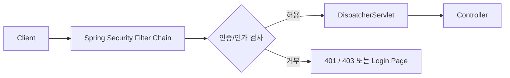

즉 Spring Security를 이해할 때 가장 먼저 기억해야 할 것은 다음이다.

> Spring Security의 Servlet 기반 보안 처리는 Controller 앞에 존재하는 Filter Chain을 중심으로 동작한다.

현재 Spring Security 공식 문서에서도 Servlet 기반 Spring Security가 Servlet Filter를 기반으로 동작하며, `FilterChainProxy`가 `SecurityFilterChain`을 통해 여러 Security Filter를 실행하는 구조라고 설명한다.

---

## Spring Security에서 구현하려는 세 가지 핵심 기능

회원 기반 애플리케이션을 구성한다면 크게 세 가지 기능을 생각할 수 있다.

```text
1. 회원 정보 저장
2. 인증
3. 인가
```

각각의 역할을 구분해서 이해하는 것이 중요하다.

---

## 회원 정보 저장

먼저 사용자의 정보를 데이터베이스에 저장해야 한다.

예를 들어 다음과 같은 회원 정보가 있다고 가정하자.

```text
username
password
role
```

테이블 형태로 생각하면 다음과 같다.

| id | username | password  | role       |
| -: | -------- | --------- | ---------- |
|  1 | user1    | 암호화된 비밀번호 | ROLE_USER  |
|  2 | admin    | 암호화된 비밀번호 | ROLE_ADMIN |

Spring Boot 애플리케이션에서는 MySQL과 Spring Data JPA 등을 이용하여 이러한 회원 데이터를 관리할 수 있다.

전체 관계는 다음과 같다.

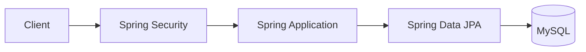

Spring Security 자체가 회원 데이터를 저장하는 데이터베이스는 아니다.

Spring Security는 인증 과정에서 애플리케이션이 제공하는 회원 정보를 이용하여 사용자의 신원을 확인한다.

---

## 인증(Authentication)이란?

인증은 간단히 말하면:

> 현재 요청한 사용자가 누구인지 확인하는 과정이다.

대표적인 인증 기능이 로그인이다.

사용자가 다음 정보를 입력한다고 가정하자.

```text
username = yunsik
password = 1234
```

서버에서는 데이터베이스에 저장된 회원 정보와 비교한다.

```text
입력된 사용자 정보
        ↓
회원 조회
        ↓
비밀번호 검증
        ↓
일치
        ↓
인증 성공
```

전체 흐름은 다음과 같다.

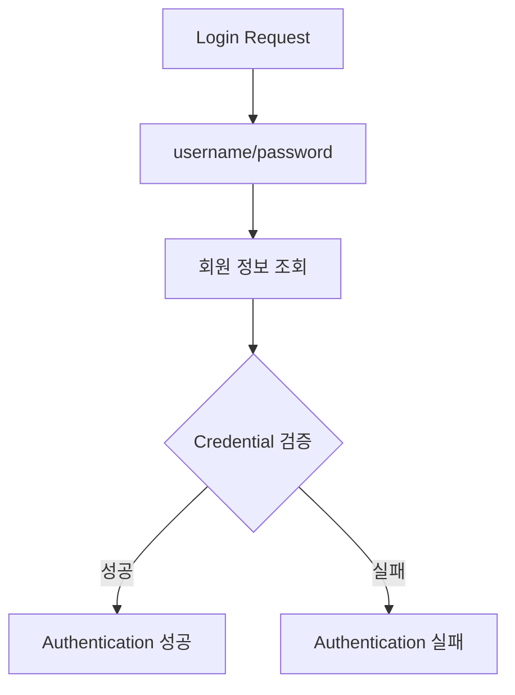

인증이 성공하면 Spring Security는 "현재 사용자는 누구인가?"에 대한 정보를 보안 Context에 관리할 수 있게 된다.

현재 Spring Security의 Servlet 인증 모델에서는 `SecurityContextHolder`가 인증된 사용자의 정보를 담고 있는 `SecurityContext`를 보관하는 중심 역할을 한다.

---

## 인가(Authorization)란?

인가는 인증과 다른 개념이다.

인가는:

> 인증된 사용자가 특정 기능이나 자원에 접근할 권한이 있는지 판단하는 과정이다.

예를 들어 사용자가 로그인에 성공했다고 해서 모든 페이지에 접근할 수 있어서는 안 된다.

다음과 같은 서비스가 있다고 가정하자.

```text
/
→ 누구나 접근 가능

/login
→ 누구나 접근 가능

/mypage
→ 로그인 사용자만 접근 가능

/admin
→ ADMIN 권한 사용자만 접근 가능
```

이를 역할로 표현하면 다음과 같다.

```text
Anonymous
→ /, /login

ROLE_USER
→ /mypage

ROLE_ADMIN
→ /mypage, /admin
```

따라서 인증과 인가는 다음처럼 구분할 수 있다.

| 구분 | 질문           | 예          |
| -- | ------------ | ---------- |
| 인증 | 누구인가?        | 로그인        |
| 인가 | 무엇을 할 수 있는가? | 관리자 페이지 접근 |

Spring Security는 인증 방식과 별개로 URI나 Method 등에 인가 규칙을 적용할 수 있도록 지원한다.

---

## 인증과 인가의 순서

일반적으로 인증이 먼저 이루어진 후 인가 판단이 가능하다.

```text
Request
   ↓
Authentication
   ↓
사용자 확인
   ↓
Authorization
   ↓
권한 확인
   ↓
Controller
```

예를 들어 `/admin`에 요청했다고 가정하자.

```text
GET /admin
```

먼저 현재 사용자가 로그인되어 있는지 확인한다.

```text
Authentication 존재?
```

로그인되어 있다면 다음으로 권한을 확인한다.

```text
ROLE_ADMIN 보유?
```

그 결과에 따라 요청을 허용하거나 거부한다.

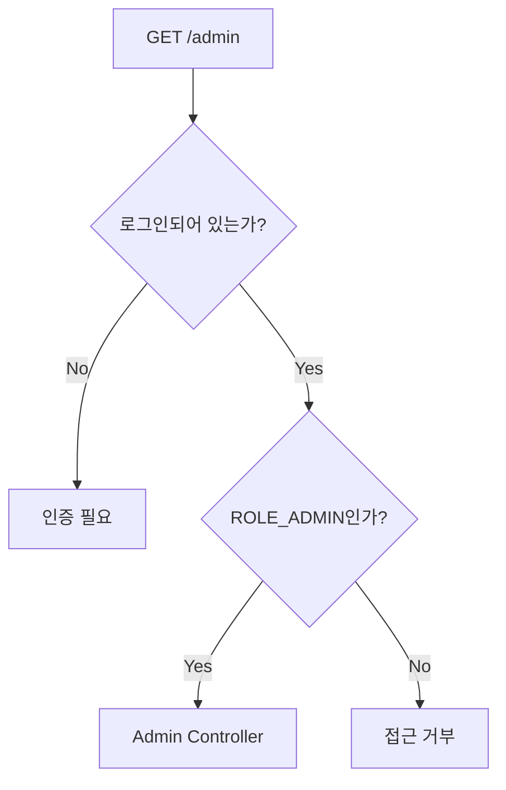

---

## Spring Boot 요청은 어떻게 Controller까지 전달될까?

Spring MVC 기반 Spring Boot 애플리케이션에서는 일반적으로 내장 Tomcat 같은 Servlet Container 위에서 애플리케이션이 실행된다.

클라이언트가 HTTP 요청을 보내면 요청이 곧바로 Controller Method에 들어가는 것이 아니다.

개념적으로 다음과 같은 단계를 거친다.

```text
Client
   ↓
Servlet Container
   ↓
Servlet Filter Chain
   ↓
DispatcherServlet
   ↓
Controller
```

예를 들어 클라이언트가 다음 요청을 보낸다.

```http
GET /mypage
```

Tomcat과 같은 Servlet Container가 요청을 받고 등록된 Filter들을 순서대로 통과시킨다.

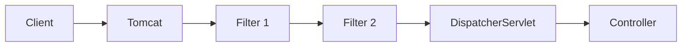

Filter에서는 Controller가 실행되기 전에 요청을 확인하거나 요청 자체를 중단할 수도 있다.

이 특징을 Spring Security가 적극적으로 사용한다.

---

## 왜 Spring Security는 Filter에서 동작할까?

보안 검사를 Controller 안에서 수행한다고 가정해보자.

```java
@GetMapping("/admin")
public String admin(HttpSession session) {

    if (session.getAttribute("user") == null) {
        return "redirect:/login";
    }

    // 권한 검사
    // ...

    return "admin";
}
```

Controller가 100개라면 인증·인가 로직도 여러 곳에 반복될 가능성이 높다.

하지만 Controller에 요청이 들어오기 전에 Security Filter가 검사한다면 공통으로 처리할 수 있다.

```text
Client
   ↓
Security Filter
   ↓
인증/인가 검사
   ↓
허용된 경우에만
   ↓
Controller
```

이 구조 덕분에 비즈니스 Controller는 인증 검사보다 자신의 핵심 비즈니스 로직에 더 집중할 수 있다.

---

## Spring Security의 실제 Filter 구조

Spring Security를 처음 접하면 다음처럼 단순하게 이해할 수 있다.

```text
Client
   ↓
Security Filter
   ↓
Controller
```

개념을 시작하기에는 충분하지만 실제 내부 구조는 조금 더 세분화되어 있다.

현재 Servlet 기반 Spring Security의 핵심 구조는 다음과 같이 이해하는 것이 정확하다.

```text
Servlet Container Filter Chain

        ↓

DelegatingFilterProxy

        ↓

FilterChainProxy

        ↓

SecurityFilterChain

        ↓

여러 Security Filter

        ↓

DispatcherServlet

        ↓

Controller
```

공식 문서에서도 `DelegatingFilterProxy`가 Servlet Container와 Spring ApplicationContext 사이를 연결하고, Spring Security의 Servlet 지원은 `FilterChainProxy` 내부에서 `SecurityFilterChain`을 통해 여러 Security Filter로 위임되는 구조라고 설명한다.

---

## DelegatingFilterProxy

Servlet Container와 Spring Bean은 관리 주체가 다르다.

Servlet Container는 Servlet Filter를 알고 있지만 Spring ApplicationContext에서 관리하는 Bean 구조를 직접 알지는 못한다.

이를 연결하는 역할을 하는 것이 `DelegatingFilterProxy`다.

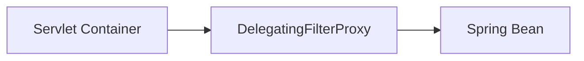

이름 그대로:

```text
Delegating
→ 위임한다.

FilterProxy
→ Filter의 Proxy 역할을 한다.
```

즉 실제 보안 처리 자체를 모두 구현하는 것이 아니라 Spring이 관리하는 Filter Bean으로 요청을 위임하는 연결점이라고 이해할 수 있다.

---

## FilterChainProxy

Spring Security 내부의 핵심 Filter는 `FilterChainProxy`다.

구조를 단순화하면 다음과 같다.

```text
DelegatingFilterProxy
        ↓
FilterChainProxy
        ↓
SecurityFilterChain
```

`FilterChainProxy`는 요청에 맞는 `SecurityFilterChain`을 찾고 그 안에 포함된 여러 보안 Filter를 실행한다.

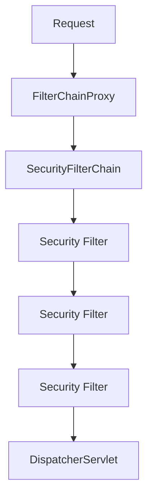

Spring Security의 Filter는 하나가 아니다.

인증, 인가, 보안 Context, Logout, CSRF 등 서로 다른 책임을 가진 여러 Filter가 Chain 형태로 동작한다.

---

## SecurityFilterChain

`SecurityFilterChain`은 특정 HTTP 요청에 어떤 Security Filter들을 적용할지 결정하는 Filter Chain이다.

Spring Security 설정에서는 보통 다음 Bean을 작성하게 된다.

```java
@Bean
SecurityFilterChain securityFilterChain(
        HttpSecurity http
) throws Exception {

    return http
            .authorizeHttpRequests(auth -> auth
                    .requestMatchers("/", "/login").permitAll()
                    .requestMatchers("/admin/**").hasRole("ADMIN")
                    .anyRequest().authenticated()
            )
            .formLogin(form -> form
                    .permitAll()
            )
            .build();
}
```

이 설정은 개념적으로 다음 규칙을 만든다.

```text
/
→ 모두 허용

/login
→ 모두 허용

/admin/**
→ ADMIN만 허용

나머지 요청
→ 인증된 사용자만 허용
```

즉 Security Config를 작성한다는 것은 단순히 "Filter 하나를 만든다"기보다 **HttpSecurity를 이용해 SecurityFilterChain에 포함될 보안 정책과 Filter 동작을 구성한다**고 이해하는 편이 정확하다.

---

## Filter 순서가 중요한 이유

Spring Security에서는 여러 Filter가 실행되므로 순서가 중요하다.

예를 들어 인가를 먼저 실행했는데 아직 인증 정보가 만들어지지 않았다면 정상적으로 권한을 판단하기 어렵다.

논리적으로는 다음 순서가 필요하다.

```text
Request
   ↓
Authentication 처리
   ↓
SecurityContext 구성
   ↓
Authorization 검사
   ↓
Controller
```

즉:

```text
인증
→ 인가
```

순서가 기본이다.

현재 Spring Security 역시 Authentication Filter가 Authorization Filter보다 앞에서 실행되어야 하는 것처럼 Filter들이 정해진 순서로 배치된다고 설명한다.

---

## 로그인 요청은 왜 허용해야 할까?

로그인 페이지 자체가 인증된 사용자에게만 허용되어 있다고 생각해보자.

```text
/login
→ 로그인 사용자만 접근 가능
```

그러면 로그인하지 않은 사용자는 로그인 페이지에 접근할 수 없다.

```text
로그인 안 됨
   ↓
/login 접근
   ↓
인증 필요
   ↓
로그인할 수 없음
```

모순이 발생한다.

따라서 로그인 경로는 일반적으로 인증되지 않은 사용자도 접근할 수 있어야 한다.

```java
.requestMatchers(
        "/",
        "/login",
        "/join"
)
.permitAll()
```

반면 보호해야 할 자원은 인증을 요구한다.

```java
.requestMatchers("/mypage/**")
.authenticated()
```

관리자 경로에는 역할을 요구할 수 있다.

```java
.requestMatchers("/admin/**")
.hasRole("ADMIN")
```

---

## 세션 기반 로그인 흐름

이번 구조에서는 세션 기반 로그인을 생각할 수 있다.

사용자가 로그인을 시도한다.

```text
POST /login
```

아이디와 비밀번호를 전달한다.

```text
username
password
```

Spring Security가 인증을 처리하고 성공하면 인증된 사용자 정보가 Security Context에 구성된다.

세션 기반 환경에서는 이후 요청에서도 인증 정보를 이어서 사용할 수 있다.

전체 흐름을 개념적으로 보면 다음과 같다.

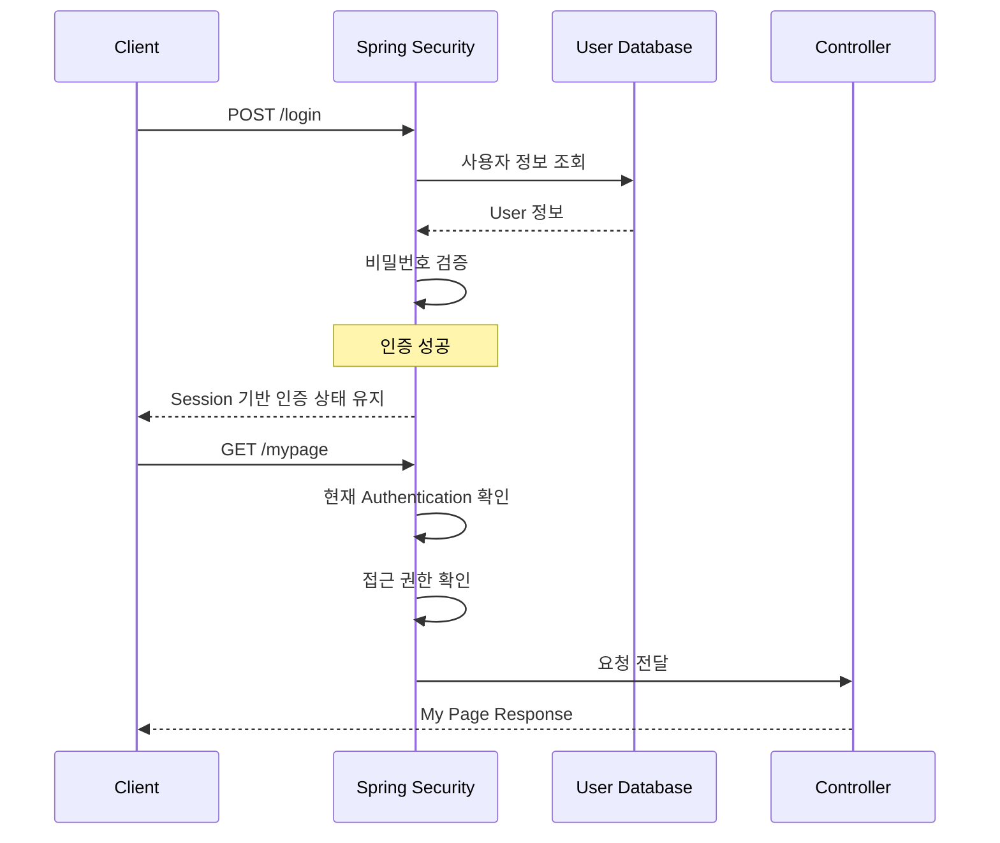

---

## 로그인 이후 매번 다시 비밀번호를 입력하지 않는 이유

로그인 성공 후 사용자가 `/mypage`로 이동할 때마다 다음 정보를 다시 보내야 한다면 매우 불편하다.

```text
username
password
```

세션 기반 인증에서는 로그인 성공 상태를 서버가 관리한다.

개념적으로는 다음과 같다.

```text
로그인 성공

     ↓

서버
Session 생성

     ↓

Client
Session ID 보관

     ↓

다음 요청
Session ID 전송

     ↓

Server
기존 인증 정보 확인
```

따라서 사용자는 로그인 이후 보호된 페이지를 계속 이용할 수 있다.

---

## SecurityContextHolder

Spring Security에서 현재 인증된 사용자 정보를 이해할 때 매우 중요한 개념이 `SecurityContextHolder`다.

구조는 다음과 같다.

```text
SecurityContextHolder
        ↓
SecurityContext
        ↓
Authentication
```

`Authentication`에는 인증과 관련된 정보가 들어간다.

개념적으로 다음과 같은 정보를 포함한다고 생각할 수 있다.

```text
사용자 Principal
Credentials
Authorities
인증 여부
```

현재 공식 문서에서도 `SecurityContextHolder`를 Spring Security 인증 모델의 중심으로 설명하며, 인증된 사용자 정보가 들어 있는 `SecurityContext`를 보관한다고 설명한다.

---

## Authentication 객체

Spring Security에서 인증된 사용자를 표현하는 핵심 인터페이스가 `Authentication`이다.

구조적으로 다음과 같이 이해할 수 있다.

```text
Authentication

├── principal
├── credentials
├── authorities
└── authenticated
```

### principal

현재 사용자가 누구인지 나타낸다.

```text
UserDetails
사용자 ID
사용자 객체
```

등이 될 수 있다.

### credentials

인증에 사용되는 정보다.

예를 들면:

```text
password
```

다만 인증 완료 후 민감한 Credential을 계속 보관하지 않도록 처리되는 경우가 있다.

### authorities

사용자가 가진 권한을 나타낸다.

```text
ROLE_USER
ROLE_ADMIN
```

또는 더 세밀하게:

```text
ORDER_READ
ORDER_WRITE
PAYMENT_ADMIN
```

같은 권한을 사용할 수도 있다.

---

## 인증 처리 내부 구조

조금 더 내부로 들어가면 Spring Security의 인증에는 다음과 같은 객체가 등장한다.

```text
AuthenticationManager
ProviderManager
AuthenticationProvider
```

현재 Spring Security 공식 문서에서는 `AuthenticationManager`가 Security Filter의 인증 처리 API이며, 일반적으로 `ProviderManager`가 대표 구현체로 사용되고 `AuthenticationProvider`가 특정 인증 방식의 실제 인증을 담당하는 구조를 설명한다.

개념적인 흐름은 다음과 같다.

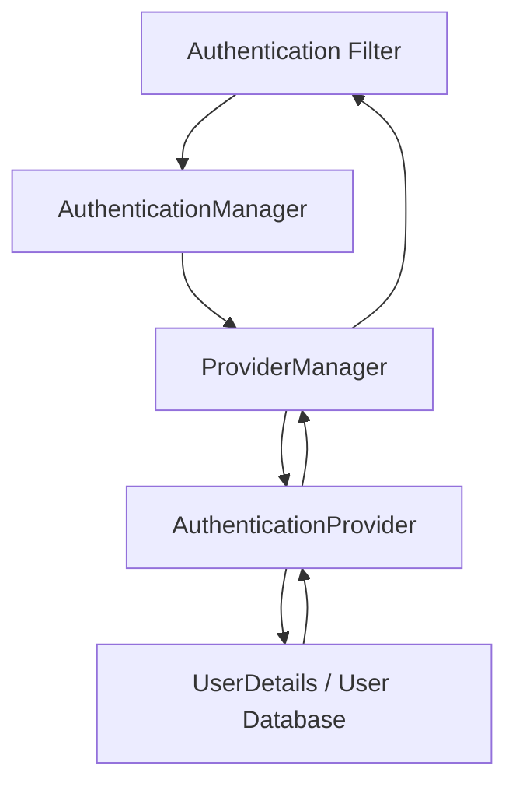

처음부터 모든 내부 클래스를 외울 필요는 없지만 다음 흐름은 기억해두는 것이 좋다.

```text
Filter
   ↓
AuthenticationManager
   ↓
AuthenticationProvider
   ↓
사용자 정보 확인
   ↓
Authentication 반환
```

---

## 관리자 페이지 접근 과정

ADMIN 사용자만 접근할 수 있는 다음 API가 있다고 가정하자.

```text
/admin
```

보안 정책은 다음과 같다.

```java
.requestMatchers("/admin/**")
.hasRole("ADMIN")
```

일반 USER가 요청한다.

```text
USER
↓
GET /admin
```

Spring Security는 Controller에 요청을 전달하기 전에 권한을 검사한다.

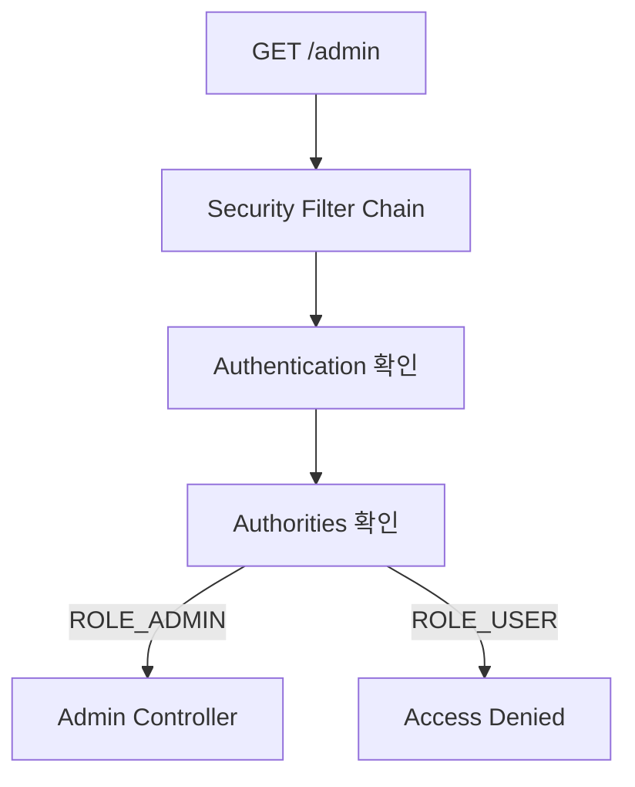

즉 Admin Controller 자체에서 반복적으로 다음 코드를 작성할 필요가 줄어든다.

```java
if (!user.isAdmin()) {
    // 차단
}
```

---

## 인증되지 않은 사용자와 권한이 부족한 사용자는 다르다

Spring Security를 이해할 때 자주 혼동하는 부분이다.

### 인증되지 않은 사용자

```text
Anonymous
```

보호된 Resource에 접근하려고 한다.

```text
GET /mypage
```

이 경우 문제는:

```text
누구인지 모름
```

이다.

즉 인증이 필요하다.

---

### 인증은 되었지만 권한이 부족한 사용자

```text
ROLE_USER
```

가 다음 경로에 접근한다.

```text
GET /admin
```

이 경우 사용자가 누구인지는 이미 안다.

문제는:

```text
ADMIN 권한 없음
```

이다.

따라서 두 상황은 보안적으로 서로 다른 문제다.

```text
인증 실패
≠
인가 실패
```

REST API에서는 일반적으로 다음 의미와 연결해서 이해한다.

```text
401 Unauthorized
→ 인증이 필요하거나 인증 실패

403 Forbidden
→ 인증은 되었지만 접근 권한 부족
```

---

## Security 설정 예제

간단한 Spring Security 설정을 구성해보자.

```java
package com.example.security.config;

import org.springframework.context.annotation.Bean;
import org.springframework.context.annotation.Configuration;
import org.springframework.security.config.annotation.web.builders.HttpSecurity;
import org.springframework.security.web.SecurityFilterChain;

@Configuration
public class SecurityConfig {

    @Bean
    public SecurityFilterChain securityFilterChain(
            HttpSecurity http
    ) throws Exception {

        http
                .authorizeHttpRequests(auth -> auth
                        .requestMatchers(
                                "/",
                                "/login",
                                "/join"
                        )
                        .permitAll()

                        .requestMatchers("/admin/**")
                        .hasRole("ADMIN")

                        .requestMatchers("/mypage/**")
                        .authenticated()

                        .anyRequest()
                        .authenticated()
                )

                .formLogin(form -> form
                        .loginPage("/login")
                        .permitAll()
                )

                .logout(logout -> logout
                        .permitAll()
                );

        return http.build();
    }
}
```

이 설정을 읽을 때 Java 문법보다 정책을 먼저 보는 것이 좋다.

```text
/, /login, /join
→ 누구나 접근

/admin/**
→ ADMIN

/mypage/**
→ 로그인 필요

나머지
→ 로그인 필요
```

---

## 인증·인가 로직을 비즈니스 코드와 분리하는 이유

보안 코드가 Controller와 Service에 흩어져 있으면 다음 문제가 생길 수 있다.

```text
Controller A
→ 로그인 체크

Controller B
→ 로그인 체크

Controller C
→ Admin 체크

Controller D
→ 로그인 체크
```

정책이 변경되면 여러 코드를 수정해야 한다.

Spring Security를 사용하면 요청 단계의 보안 규칙을 중앙에서 관리할 수 있다.

```text
SecurityFilterChain

├── Public API
├── Authenticated API
├── USER API
└── ADMIN API
```

비즈니스 로직과 보안 정책의 책임을 분리할 수 있다는 것이 큰 장점이다.

---

## Filter에서 요청을 차단한다는 의미

다음 요청이 있다고 가정한다.

```http
GET /admin/users
```

현재 사용자는 일반 USER다.

Security Filter에서 접근 권한이 없다고 판단하면 Controller까지 요청이 가지 않는다.

```text
Client
   ↓
Security Filter
   ↓
Authorization 실패
   X
Controller
```

반대로 ADMIN이라면:

```text
Client
   ↓
Security Filter
   ↓
Authorization 성공
   ↓
DispatcherServlet
   ↓
AdminController
```

가 된다.

따라서 Controller 실행 전에 보안 경계가 만들어진다.

---

## URL 보안과 Method 보안

초기에는 URI를 기준으로 인가 정책을 설정하는 것이 이해하기 쉽다.

```java
.requestMatchers("/admin/**")
.hasRole("ADMIN")
```

그러나 Spring Security에서는 Service Method 수준에서 권한을 검사하는 Method Security도 사용할 수 있다.

예를 들면 개념적으로 다음과 같다.

```java
@PreAuthorize("hasRole('ADMIN')")
public void deleteUser(Long userId) {

}
```

두 방식은 경쟁 관계라기보다 서로 다른 계층에서 방어선을 구성하는 방법으로 이해할 수 있다.

```text
HTTP 요청 경계
→ SecurityFilterChain

비즈니스 Method 경계
→ Method Security
```

특히 중요한 비즈니스 권한은 URL만 믿기보다 Service 계층에서도 검증해야 하는 경우가 있다.

---

## 인증과 비즈니스 권한을 구분하기

다음 사용자가 있다고 가정하자.

```text
userId = 100
ROLE_USER
```

이 사용자가 다음 요청을 보낸다.

```text
GET /orders/200
```

ROLE_USER라는 사실만으로 주문 200번을 조회할 수 있다고 판단할 수 있을까?

그렇지 않다.

주문 200번의 소유자가 다른 사람일 수도 있다.

```text
Authentication

userId = 100
ROLE_USER
```

하지만 비즈니스 데이터는:

```text
orderId = 200
ownerId = 300
```

일 수 있다.

따라서 다음을 구분해야 한다.

```text
Gateway/HTTP 수준 권한
→ ROLE_USER인가?

Domain 수준 권한
→ 이 주문의 실제 소유자인가?
```

Spring Security 설정만으로 모든 도메인 권한 문제가 자동으로 해결되는 것은 아니다.

---

## 세션 인증과 JWT 인증은 다른 방식이다

이번 기본 구조에서는 세션 기반 로그인 방식을 생각할 수 있다.

```text
Login
   ↓
Server Session
   ↓
Session ID
```

하지만 REST API나 MSA 환경에서는 JWT와 같은 Token 기반 인증을 사용하는 경우도 많다.

```text
Login
   ↓
Token 발급
   ↓
Client가 Token 보관
   ↓
Authorization Header
   ↓
Server 검증
```

두 방식을 비교하면 다음과 같다.

| 구분      | Session    | JWT                   |
| ------- | ---------- | --------------------- |
| 인증 상태   | 서버가 관리     | Token 자체에 정보 포함 가능    |
| Client  | Session ID | JWT                   |
| 서버 확장   | 세션 공유 고려   | 상대적으로 Stateless 구성 가능 |
| 강제 로그아웃 | 비교적 단순     | Token 전략 필요           |
| 브라우저 웹  | 자주 사용      | 사용 가능                 |
| API/MSA | 사용 가능      | 자주 사용                 |

Spring Security의 핵심 Filter 구조는 다양한 인증 방식의 기반이 된다.

---

## Spring Security를 사용한다고 비밀번호를 그대로 저장하면 안 된다

회원 테이블을 만든다고 해서 다음처럼 비밀번호를 저장해서는 안 된다.

```text
username = yunsik
password = 1234
```

데이터베이스가 유출되면 사용자의 실제 비밀번호가 그대로 노출된다.

일반적으로 Password Encoder를 이용한 단방향 해시 저장을 사용한다.

```text
1234
   ↓
PasswordEncoder
   ↓
$2a$10$....
```

로그인할 때는 평문 비밀번호를 복호화하는 것이 아니라 입력된 Password와 저장된 Hash를 비교한다.

```text
입력 Password
        ↓
PasswordEncoder.matches()
        ↓
저장된 Password Hash
        ↓
일치 여부 판단
```

회원 정보 저장과 인증을 구현할 때 반드시 함께 고려해야 할 부분이다.

---

## Spring Security가 막아주는 것은 인증·인가만이 아니다

Spring Security라는 이름 때문에 로그인과 권한만 제공한다고 생각하기 쉽다.

하지만 실제로는 Servlet Filter Chain을 이용해 다양한 웹 보안 기능을 제공한다.

예를 들면 다음과 같은 영역이 있다.

```text
Authentication
Authorization
CSRF Protection
Security Headers
Session Security
Logout
Request Matching
Exploit Protection
```

Spring Security의 `FilterChainProxy`는 Security Filter 실행뿐 아니라 `SecurityContext` 정리와 `HttpFirewall` 적용 같은 보안 관련 기반 처리도 담당한다.

따라서 Spring Security를 단순한 로그인 라이브러리라고 이해하는 것보다 **웹 애플리케이션의 보안 경계를 구성하는 프레임워크**라고 보는 것이 적절하다.

---

## Spring Security 전체 요청 흐름

로그인한 ADMIN 사용자가 `/admin`으로 요청한다고 가정하면 전체 흐름을 다음과 같이 이해할 수 있다.

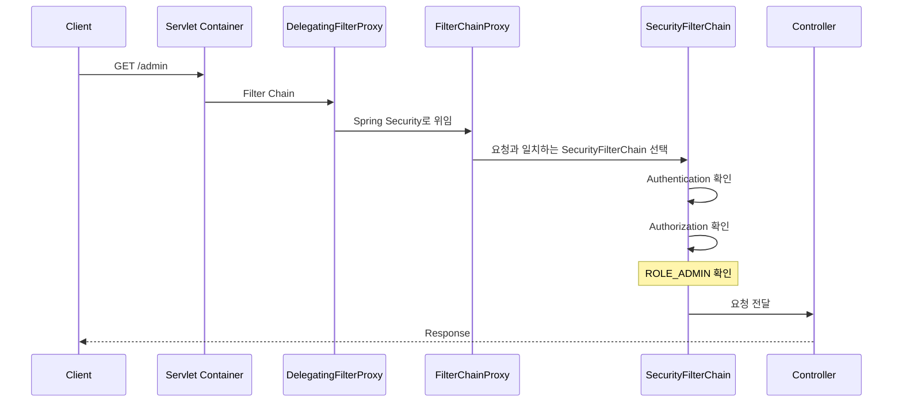

개념적으로 줄이면 다음과 같다.

```text
HTTP Request
     ↓
Servlet Container
     ↓
DelegatingFilterProxy
     ↓
FilterChainProxy
     ↓
SecurityFilterChain
     ↓
Authentication
     ↓
Authorization
     ↓
DispatcherServlet
     ↓
Controller
```

이 구조를 머릿속에 가지고 있으면 이후 로그인 구현, JWT Filter, OAuth2, Custom Filter를 학습할 때 훨씬 이해하기 쉬워진다.

---

## Spring Security에서 가장 먼저 이해해야 할 객체

초기에는 다음 객체를 중심으로 학습하는 것이 좋다.

| 객체                       | 역할                             |
| ------------------------ | ------------------------------ |
| `SecurityFilterChain`    | 요청에 적용할 Security 정책과 Filter 구성 |
| `SecurityContextHolder`  | 현재 인증 정보 접근의 중심                |
| `SecurityContext`        | 현재 요청의 Security Context        |
| `Authentication`         | 인증 사용자 표현                      |
| `AuthenticationManager`  | 인증 처리 진입점                      |
| `AuthenticationProvider` | 실제 인증 방법 수행                    |
| `UserDetails`            | 사용자 정보 표현                      |
| `PasswordEncoder`        | Password Hash 비교               |

처음부터 모든 내부 클래스를 외우는 것보다 전체 흐름 속에서 각 객체의 역할을 이해하는 것이 중요하다.

---

## 현재 기준으로 보완해서 이해할 점

당시 예제 환경은 다음 버전을 기준으로 구성되어 있었다.

```text
Spring Boot
3.1.5

Spring Security
6.1.5

Java
17 이상

Database
MySQL

Data Access
Spring Data JPA
```

이 환경 자체를 이해하는 데에는 문제가 없지만 현재 프로젝트를 새로 만든다면 버전을 그대로 복사하지 않는 것이 좋다.

2026년 9월 현재 Spring Boot 공식 문서의 최신 안정 버전은 `4.1.1`이며 최소 Java 17을 요구한다. Spring Security 공식 문서에는 `7.1.1`, `7.0.7`, `6.5.11` 등이 안정 버전으로 안내되고 있다. 따라서 새 프로젝트에서는 Spring Initializr와 Spring Boot의 Dependency Management가 선택해주는 호환 버전을 따르는 것이 안전하다.

즉 다음처럼 접근하는 것이 좋다.

```text
과거 예제

Spring Boot 3.1.5
Spring Security 6.1.5

        ↓

개념 학습에는 활용

        ↓

신규 프로젝트 생성

현재 Spring Boot 버전 선택
        ↓
Boot가 관리하는 Spring Security 버전 사용
```

Spring Security 버전을 임의로 따로 올리기보다 Spring Boot BOM과 Dependency Management를 활용하는 편이 호환성 관리에 유리하다.

---

## Spring Security 6 이후 설정 방식에서 알아둘 점

현대 Spring Security에서는 과거에 많이 사용했던 `WebSecurityConfigurerAdapter`를 상속하는 방식보다 `SecurityFilterChain` Bean을 구성하는 방식을 사용한다.

```java
@Configuration
public class SecurityConfig {

    @Bean
    SecurityFilterChain securityFilterChain(
            HttpSecurity http
    ) throws Exception {

        http
                .authorizeHttpRequests(auth -> auth
                        .requestMatchers("/", "/login")
                        .permitAll()

                        .requestMatchers("/admin/**")
                        .hasRole("ADMIN")

                        .anyRequest()
                        .authenticated()
                );

        return http.build();
    }
}
```

따라서 Spring Security를 새롭게 학습한다면 다음 구조를 중심으로 보는 것이 좋다.

```text
HttpSecurity

        ↓

SecurityFilterChain Bean

        ↓

FilterChainProxy

        ↓

Security Filters
```

현재 공식 아키텍처 역시 `SecurityFilterChain`이 `FilterChainProxy`에서 현재 요청에 적용할 Security Filter들을 결정하는 구조를 중심으로 설명한다.

---

## 실무에서의 활용

Spring Security를 실제 서비스에 적용할 때는 단순히 로그인 화면을 만드는 것보다 다음 정책을 먼저 설계하는 것이 좋다.

```text
어떤 API가 Public인가?

어떤 API가 로그인 사용자 전용인가?

USER와 ADMIN의 권한 차이는 무엇인가?

도메인 소유권 검사는 어디서 하는가?

세션인가 JWT인가?

비밀번호는 어떻게 저장하는가?

인증 실패 응답은 어떻게 통일하는가?

인가 실패 응답은 어떻게 처리하는가?
```

예를 들어 API를 다음과 같이 분류할 수 있다.

```text
Public

GET /
POST /login
POST /join
```

```text
Authenticated

GET /mypage
GET /orders
POST /orders
```

```text
Admin

GET /admin/users
DELETE /admin/users/{id}
```

그리고 이를 Security 정책으로 연결한다.

```text
Public
→ permitAll()

Authenticated
→ authenticated()

Admin
→ hasRole("ADMIN")
```

이렇게 보안 정책을 먼저 명확하게 만들고 구현으로 내려가는 방식이 유지보수에 유리하다.

---

## Spring Security를 이해하는 핵심 관점

Spring Security의 동작을 단순화하면 다음 네 단계로 정리할 수 있다.

```text
1. 요청을 가로챈다.

2. 사용자가 누구인지 확인한다.

3. 해당 Resource 접근 권한이 있는지 확인한다.

4. 허용된 요청만 Controller로 전달한다.
```

조금 더 실제 구조에 가깝게 표현하면 다음과 같다.

```text
Client
   ↓
Servlet Filter Chain
   ↓
FilterChainProxy
   ↓
SecurityFilterChain
   ↓
Authentication
   ↓
SecurityContext
   ↓
Authorization
   ↓
DispatcherServlet
   ↓
Controller
```

이 구조가 이후 Spring Security의 거의 모든 기능을 이해하는 기반이 된다.

---

## 정리

Spring Security를 처음 이해할 때 가장 중요한 것은 **인증과 인가의 차이**, 그리고 **Controller 앞에서 Security Filter Chain이 동작한다는 사실**이다.

인증은:

```text
Authentication

"당신은 누구인가?"
```

를 확인한다.

대표적인 예가 로그인이다.

인가는:

```text
Authorization

"당신은 이것을 할 수 있는가?"
```

를 확인한다.

대표적인 예가 관리자 페이지 접근 제어다.

Spring MVC 기반 애플리케이션의 요청은 개념적으로 다음 흐름을 가진다.

```text
Client
   ↓
Servlet Container
   ↓
Filter Chain
   ↓
DispatcherServlet
   ↓
Controller
```

Spring Security는 이 Filter Chain에 보안 계층을 구성한다.

보다 실제 구조에 가깝게 보면 다음과 같다.

```text
Servlet Container
        ↓
DelegatingFilterProxy
        ↓
FilterChainProxy
        ↓
SecurityFilterChain
        ↓
Security Filters
        ↓
DispatcherServlet
        ↓
Controller
```

로그인이 성공하면 Spring Security는 인증된 사용자 정보를 `Authentication`으로 표현하고 `SecurityContext`를 통해 관리한다.

```text
SecurityContextHolder
        ↓
SecurityContext
        ↓
Authentication
```

이후 사용자가 `/mypage`, `/admin` 같은 보호된 Resource에 접근하면 Security Filter Chain이 현재 인증 상태와 사용자의 권한을 확인하고 Controller 접근 여부를 결정한다.

따라서 Spring Security의 전체 흐름은 다음 한 문장으로 정리할 수 있다.

```text
Request
→ 인증
→ 인증 정보 관리
→ 인가
→ 허용된 경우 Controller 실행
```

이 기본 구조를 먼저 이해하면 이후 `UserDetails`, `UserDetailsService`, `PasswordEncoder`, `AuthenticationProvider`, Form Login, Session, JWT, OAuth2와 같은 세부 기능도 서로 어떤 위치에서 동작하는지 연결해서 이해할 수 있다.

### 한 줄 요약

Spring Security는 Servlet Filter Chain 앞단에서 사용자의 **인증(Authentication)** 과 **인가(Authorization)** 를 처리하고, 인증된 사용자 정보를 `SecurityContext`에 관리하여 권한이 확인된 요청만 Controller까지 전달하도록 만드는 Spring의 핵심 보안 프레임워크다.
