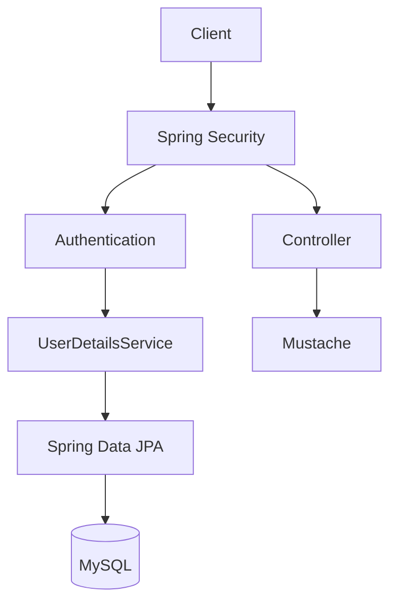
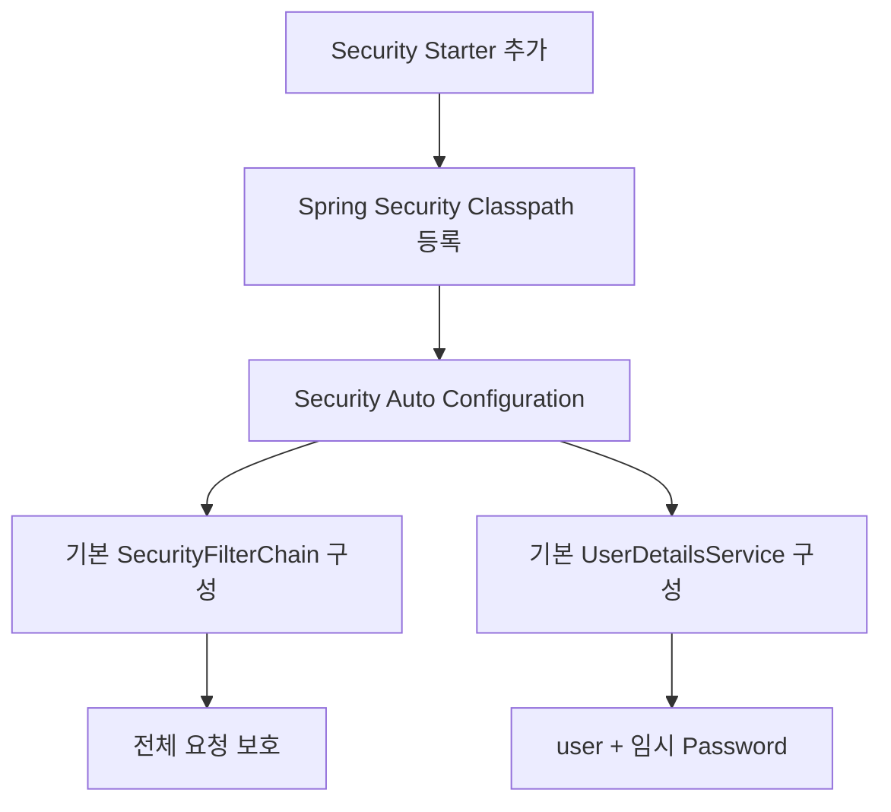
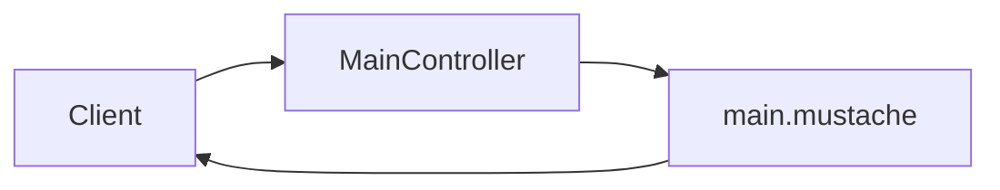
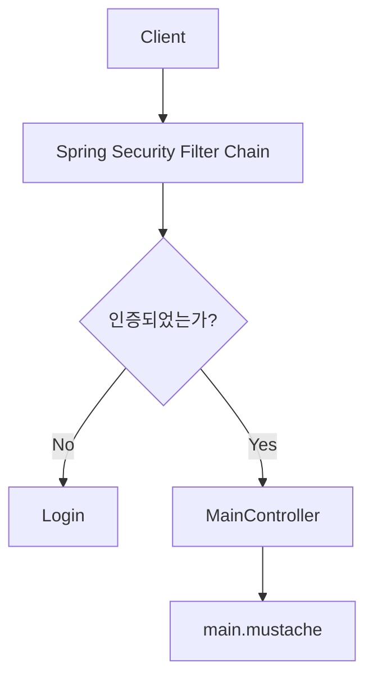
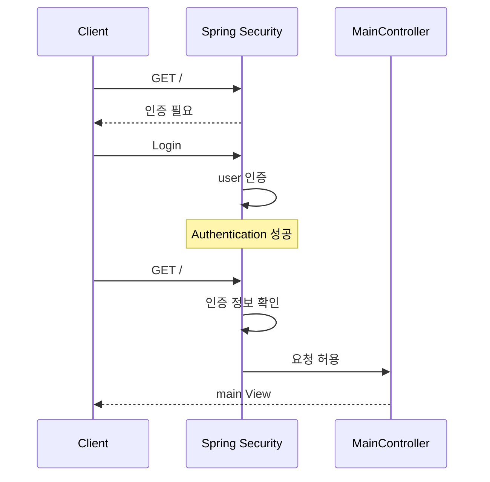
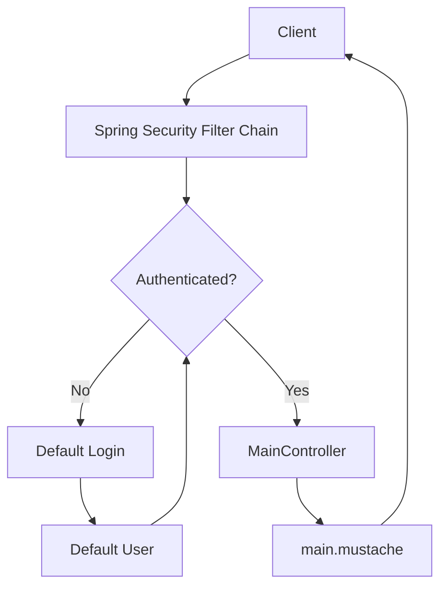
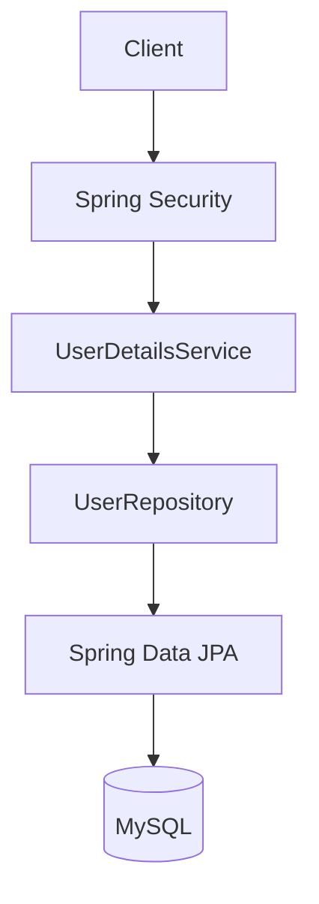
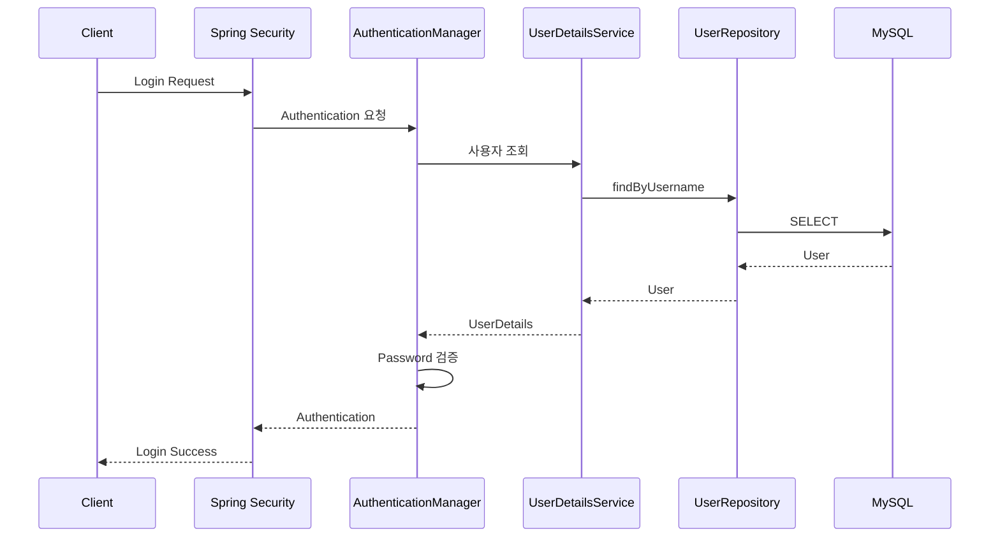
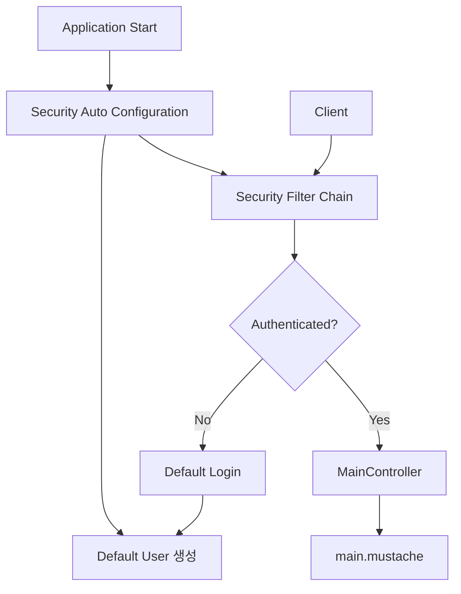

# 스프링 시큐리티 6 - 2. 프로젝트 생성
[https://youtu.be/qnDdx8XdKwY?si=M8pCbxzumVlgLBh4](https://youtu.be/qnDdx8XdKwY?si=M8pCbxzumVlgLBh4)

# 스프링 시큐리티 6 - 2. 프로젝트 생성
* toc
{:toc}

---

## Spring Security 프로젝트 생성과 기본 로그인 동작 이해하기

Spring Security를 처음 적용할 때 가장 먼저 확인해야 할 것은 복잡한 인증 코드를 작성하는 방법이 아니다.

먼저 **Spring Security 의존성 하나가 Spring Boot 애플리케이션에 추가되었을 때 어떤 변화가 발생하는지** 이해하는 것이 중요하다.

Spring MVC 기반 회원 시스템을 구성한다고 가정하면 기본적인 기술 조합은 다음과 같이 만들 수 있다.

```text
Spring Boot
    ↓
Spring MVC
    ↓
Spring Security
    ↓
Spring Data JPA
    ↓
MySQL
```

화면을 서버에서 렌더링한다면 Mustache와 같은 Template Engine도 사용할 수 있다.

```text
Client
   ↓
Spring MVC
   ↓
Spring Security
   ↓
Controller
   ↓
Mustache
```

이 구조에서 Spring Security Starter를 추가하는 순간 Spring Boot의 Security Auto Configuration이 동작한다.

아직 별도의 `SecurityConfig`를 작성하지 않았더라도 애플리케이션 전체에 기본적인 인증 정책이 적용된다.

현재 Spring Boot 역시 Spring Security가 Classpath에 존재하면 Web Application 전체를 기본적으로 보호하며, 기본 사용자 `user`와 실행 시 생성되는 임시 비밀번호를 제공한다.

---

## 전체 프로젝트의 목표

회원 기반 인증 시스템을 구성하기 위해 최종적으로 필요한 구조는 다음과 같다.



최종적으로 구현하게 되는 핵심 기능을 구분하면 다음과 같다.

```text
회원가입
→ 사용자 정보를 MySQL에 저장

로그인
→ 입력한 사용자 정보 검증

인증
→ 현재 사용자가 누구인지 확인

인가
→ 현재 사용자가 특정 자원에 접근 가능한지 확인
```

이번 단계에서는 아직 데이터베이스 회원 인증까지 구현하지 않고 Spring Security가 제공하는 **기본 보안 설정이 어떻게 동작하는지 확인할 수 있는 최소 프로젝트 구조**를 만든다.

---

## 필요한 의존성

기본적인 MVC + Security + JPA + MySQL 기반 프로젝트라면 다음 여섯 가지 요소를 사용할 수 있다.

| 의존성             | 역할                       |
| --------------- | ------------------------ |
| Spring Web      | Spring MVC 기반 HTTP 요청 처리 |
| Spring Security | 인증·인가 및 웹 보안             |
| Spring Data JPA | 회원 데이터 접근                |
| MySQL Driver    | MySQL 연결                 |
| Mustache        | 서버 사이드 HTML 렌더링          |
| Lombok          | 반복적인 Java 코드 감소          |

Gradle에서는 개념적으로 다음과 같이 구성할 수 있다.

```gradle
dependencies {
    implementation 'org.springframework.boot:spring-boot-starter-web'

    implementation 'org.springframework.boot:spring-boot-starter-security'

    implementation 'org.springframework.boot:spring-boot-starter-mustache'

    implementation 'org.springframework.boot:spring-boot-starter-data-jpa'

    runtimeOnly 'com.mysql:mysql-connector-j'

    compileOnly 'org.projectlombok:lombok'
    annotationProcessor 'org.projectlombok:lombok'

    testImplementation 'org.springframework.boot:spring-boot-starter-test'
    testImplementation 'org.springframework.security:spring-security-test'
}
```

각 의존성이 하나의 역할만 가지고 있다고 생각하면 전체 구조를 이해하기 쉽다.

```text
spring-boot-starter-web
→ HTTP 요청과 MVC

spring-boot-starter-security
→ 인증과 인가

spring-boot-starter-mustache
→ HTML 렌더링

spring-boot-starter-data-jpa
→ 데이터 접근

mysql-connector-j
→ MySQL 통신

lombok
→ 반복 코드 감소
```

---

## Spring Security Starter가 가장 중요한 이유

이번 단계에서 가장 중요한 의존성은 다음이다.

```gradle
implementation 'org.springframework.boot:spring-boot-starter-security'
```

Spring Security를 처음 접하면 다음과 같이 생각할 수 있다.

```text
의존성 추가

     ↓

Security 관련 클래스 사용 가능
```

물론 맞는 설명이지만 Spring Boot에서는 그보다 더 많은 일이 일어난다.

Spring Security가 Classpath에 존재하면 Spring Boot가 Security Auto Configuration을 실행한다.



즉 개발자가 아직 인증 코드를 작성하지 않았음에도 기본적인 보호 정책이 만들어진다.

Spring Boot 공식 문서에서도 Spring Security가 Classpath에 존재하면 Web Application이 기본적으로 보호되고, MVC 환경에서는 `SecurityAutoConfiguration`과 `UserDetailsServiceAutoConfiguration`이 기본 구성을 담당한다고 설명한다.

---

## 프로젝트를 실행하기 전에 JPA와 MySQL 연결을 어떻게 할까?

아직 MySQL 설정을 하지 않았는데 다음 의존성을 먼저 추가했다고 생각해보자.

```gradle
implementation 'org.springframework.boot:spring-boot-starter-data-jpa'
runtimeOnly 'com.mysql:mysql-connector-j'
```

Spring Boot는 JPA와 Database 관련 의존성이 존재하면 데이터베이스 환경을 자동 구성하려고 한다.

하지만 다음 정보가 아직 없다.

```text
DB Host
DB Port
Database Name
Username
Password
```

예를 들어 아직 다음 설정을 작성하지 않은 상태다.

```properties
spring.datasource.url=jdbc:mysql://localhost:3306/security
spring.datasource.username=root
spring.datasource.password=password
```

이 상태에서는 데이터베이스 자동 구성 과정에서 애플리케이션 실행에 문제가 생길 수 있다.

따라서 회원 저장 기능을 나중에 구성할 예정이라면 초기 Security 동작만 확인하기 위해 JPA와 MySQL 의존성을 잠시 제외한 상태로 실행할 수도 있다.

개념적으로는 다음과 같다.

```gradle
dependencies {
    implementation 'org.springframework.boot:spring-boot-starter-web'
    implementation 'org.springframework.boot:spring-boot-starter-security'
    implementation 'org.springframework.boot:spring-boot-starter-mustache'

    // 회원 DB 연결 시 활성화
    // implementation 'org.springframework.boot:spring-boot-starter-data-jpa'
    // runtimeOnly 'com.mysql:mysql-connector-j'
}
```

이것은 JPA가 Security에 필요 없다는 의미가 아니다.

현재 단계에서는 다음만 확인하면 되기 때문이다.

```text
Spring MVC
+
Spring Security
+
Mustache
```

이후 회원 기능을 구현할 때 다시 JPA와 MySQL을 연결하면 된다.

---

## 테스트용 Controller 작성

이제 Spring Security가 실제 요청을 어떻게 보호하는지 확인하기 위한 간단한 Controller를 만든다.

프로젝트 구조는 다음과 같이 구성할 수 있다.

```text
src/main/java
└── com.example.security
    ├── SecurityApplication.java
    │
    └── controller
        └── MainController.java
```

Controller는 다음과 같이 작성한다.

```java
package com.example.security.controller;

import org.springframework.stereotype.Controller;
import org.springframework.web.bind.annotation.GetMapping;

@Controller
public class MainController {

    @GetMapping("/")
    public String main() {

        return "main";
    }
}
```

클라이언트가 다음 요청을 보낸다.

```http
GET /
```

Spring MVC는 `main`이라는 View 이름을 반환한다.

```text
GET /
   ↓
MainController
   ↓
return "main"
   ↓
Mustache View Resolver
   ↓
main.mustache
```

---

## Mustache 화면 작성

Spring Boot의 기본 설정에서는 Mustache를 포함한 지원 Template Engine의 파일을 `src/main/resources/templates`에서 자동으로 찾을 수 있다.

따라서 다음 구조를 만들 수 있다.

```text
src/main/resources
└── templates
    └── main.mustache
```

`main.mustache`에는 간단한 HTML을 작성한다.

```html
<!DOCTYPE html>
<html lang="ko">
<head>
    <meta charset="UTF-8">
    <title>Main</title>
</head>
<body>

<h1>Main</h1>

</body>
</html>
```

현재까지 Security를 제외한 MVC 요청 처리만 생각하면 다음 구조다.



하지만 실제로 Spring Security Starter가 포함되어 있으므로 요청은 Controller로 바로 가지 않는다.

---

## Spring Security 의존성만 추가했는데 무슨 일이 발생할까?

애플리케이션을 실행하고 브라우저에서 다음 주소로 접근한다.

```text
http://localhost:8080/
```

개발자는 다음 화면이 바로 나타날 것이라고 예상할 수 있다.

```text
Main
```

하지만 Security 설정을 별도로 작성하지 않았다면 먼저 로그인 화면을 만나게 된다.

왜 이런 일이 발생할까?

Spring Security가 기본적으로 애플리케이션 전체를 보호하기 때문이다.

요청 흐름은 다음과 같이 바뀐다.



즉:

```text
GET /

   ↓

Spring Security

   ↓

인증 여부 확인

   ↓

미인증

   ↓

Login
```

가 된다.

---

## 왜 모든 경로가 보호되는가?

아직 다음과 같은 설정을 작성하지 않았다.

```java
@Configuration
public class SecurityConfig {

}
```

그렇다고 Security 설정이 존재하지 않는 것은 아니다.

Spring Boot가 기본 설정을 자동으로 제공한다.

현재 Spring Boot의 기본 보안 설정에서는 Spring Security가 Classpath에 존재할 경우 애플리케이션의 전체 Web Endpoint가 보호되며 요청 특성에 따라 Form Login 또는 HTTP Basic을 사용한다.

즉 개발자가 아직 다음 정책을 작성하지 않았다.

```text
/        → permitAll
/login   → permitAll
/admin   → ROLE_ADMIN
```

그러므로 기본 정책이 적용된다.

개념적으로 이해하면 다음과 같다.

```text
별도 SecurityFilterChain 없음

        ↓

Spring Boot 기본 Security 적용

        ↓

전체 요청 인증 요구
```

---

## 기본 로그인 화면은 누가 만든 것일까?

개발자가 직접 다음 HTML을 만들지 않았다.

```html
<form>
    <input name="username">
    <input name="password">
</form>
```

그런데도 로그인 화면이 제공된다.

Spring Security의 기본 Form Login 기능이 로그인 화면을 만들어주기 때문이다.

이 기능은 개발자가 인증 기능을 처음 확인할 때 매우 편리하다.

```text
Security Starter 추가
       ↓
기본 Form Login 설정
       ↓
Login 화면 제공
```

따라서 별도의 로그인 Controller와 HTML 없이도 기본 인증 흐름을 확인할 수 있다.

---

## 기본 사용자 이름

Spring Boot에서 기본적으로 생성되는 사용자 이름은 다음과 같다.

```text
user
```

Spring Boot 공식 설정에서도 기본 Security User Name은 `user`로 정의되어 있다.

따라서 기본 로그인에서는 다음 값을 사용한다.

```text
Username

user
```

그렇다면 Password는 무엇일까?

---

## 실행할 때 자동 생성되는 비밀번호

기본 사용자의 Password는 애플리케이션을 실행할 때 무작위로 생성된다.

애플리케이션 로그를 보면 다음과 유사한 메시지를 확인할 수 있다.

```text
Using generated security password: ...
```

이 비밀번호를 로그인 화면에 입력하면 된다.

```text
Username
user

Password
실행 로그에 출력된 임시 Password
```

Spring Boot는 기본적으로 단일 In-Memory 사용자를 생성하며 사용자 이름은 `user`, Password는 실행 시 무작위로 생성하여 WARN 로그에 출력한다. 공식 문서에서도 이 Password는 개발 목적으로만 사용해야 한다고 명시한다.

---

## 기본 사용자는 어디에 저장되어 있을까?

아직 MySQL도 연결하지 않았다.

회원 Entity도 존재하지 않는다.

```text
User Entity
→ 없음

UserRepository
→ 없음

users Table
→ 없음
```

그런데 `user`라는 사용자가 존재한다.

그 이유는 Spring Boot가 기본적인 In-Memory `UserDetailsService`를 자동 구성하기 때문이다.

구조를 단순화하면 다음과 같다.

```text
Spring Boot

     ↓

UserDetailsService

     ↓

In-Memory User

username = user
password = generated password
```

이 사용자는 우리가 앞으로 만들 실제 회원 시스템과는 관계가 없다.

즉 현재 상태는 다음과 같다.

```text
실제 운영 회원
→ 아직 없음

Spring Boot Test User
→ user
```

---

## 로그인하면 왜 Main Controller에 접근할 수 있을까?

처음 `/`에 접근하면 인증되지 않은 상태다.

```text
Client
   ↓
GET /
   ↓
Spring Security
   ↓
미인증
   ↓
Login
```

여기서 기본 사용자로 인증한다.

```text
username = user
password = generated password
```

인증에 성공하면 Spring Security가 사용자의 인증 상태를 관리한다.

이후 원래 접근하려던 `/` 요청을 처리할 수 있게 된다.



결과적으로 다음 HTML이 렌더링된다.

```html
<h1>Main</h1>
```

---

## 로그인 전과 로그인 후의 차이

### 로그인 전

```text
GET /
   ↓
Security Filter Chain
   ↓
Authentication 없음
   ↓
Login
```

### 로그인 후

```text
GET /
   ↓
Security Filter Chain
   ↓
Authentication 존재
   ↓
Controller
   ↓
main.mustache
```

핵심적인 차이는 현재 사용자의 `Authentication`이 존재하느냐다.

---

## 현재 단계의 전체 구조

전체 구조를 하나로 정리하면 다음과 같다.



여기에서는 아직 MySQL이 참여하지 않는다.

```text
현재

Client
→ Spring Security
→ In-Memory User
→ Controller
```

이후 실제 회원 인증으로 발전시키면 다음과 같이 변한다.

```text
최종

Client
→ Spring Security
→ UserDetailsService
→ UserRepository
→ JPA
→ MySQL
```

---

## 기본 사용자 이름과 비밀번호를 변경할 수도 있다

Spring Boot의 기본 사용자를 테스트 목적으로 변경할 수도 있다.

```properties
spring.security.user.name=admin
spring.security.user.password=1234
```

또는 YAML로 다음과 같이 작성할 수 있다.

```yaml
spring:
  security:
    user:
      name: admin
      password: 1234
```

현재 Spring Boot에서도 `spring.security.user.name`, `spring.security.user.password`, `spring.security.user.roles` 설정을 제공한다.

하지만 이것은 실제 회원 시스템을 구축하는 방법이라고 보기 어렵다.

```text
application.yml
        ↓
단일 고정 사용자

≠

회원가입
DB 저장
다수 사용자
권한 관리
```

실제 서비스에서는 `UserDetailsService`, Repository, PasswordEncoder 등을 이용해 사용자 정보를 DB에서 조회하도록 구성하게 된다.

---

## 왜 기본 Password를 운영에서 사용하면 안 될까?

Spring Boot가 만들어주는 임시 사용자는 **개발 초기 설정 확인용**이다.

공식 로그 메시지에도 생성된 Password는 개발 용도이며 운영 환경에서는 Security 설정을 변경해야 한다고 명시된다.

운영 환경에서는 다음과 같은 구조가 필요하다.

```text
회원가입

   ↓

PasswordEncoder

   ↓

Password Hash

   ↓

Database 저장
```

로그인에서는:

```text
사용자 입력 Password

        ↓

PasswordEncoder.matches()

        ↓

DB의 Password Hash

        ↓

인증 성공 / 실패
```

형태로 처리해야 한다.

---

## SecurityConfig를 작성하면 무엇이 달라질까?

현재는 별도의 Security 설정이 없으므로 기본 정책이 동작한다.

```text
모든 요청
→ 인증 필요
```

하지만 다음과 같은 요구사항이 있다고 생각해보자.

```text
/
→ 누구나 접근

/login
→ 누구나 접근

/join
→ 누구나 접근

/mypage
→ 로그인 사용자만

/admin
→ ADMIN 사용자만
```

이때 직접 `SecurityFilterChain` Bean을 등록한다.

예를 들어 다음과 같은 형태다.

```java
package com.example.security.config;

import org.springframework.context.annotation.Bean;
import org.springframework.context.annotation.Configuration;
import org.springframework.security.config.annotation.web.builders.HttpSecurity;
import org.springframework.security.web.SecurityFilterChain;

@Configuration
public class SecurityConfig {

    @Bean
    public SecurityFilterChain securityFilterChain(
            HttpSecurity http
    ) throws Exception {

        http
                .authorizeHttpRequests(auth -> auth

                        .requestMatchers(
                                "/",
                                "/login",
                                "/join"
                        )
                        .permitAll()

                        .requestMatchers("/admin/**")
                        .hasRole("ADMIN")

                        .anyRequest()
                        .authenticated()
                );

        return http.build();
    }
}
```

Spring Boot는 개발자가 `SecurityFilterChain` Bean을 등록하면 기본 Web Security 설정 대신 개발자가 정의한 접근 규칙을 사용할 수 있도록 한다.

---

## SecurityFilterChain이 없는 경우와 있는 경우

차이를 비교하면 다음과 같다.

### SecurityFilterChain을 직접 만들지 않은 경우

```text
Spring Boot

    ↓

Default Security Auto Configuration

    ↓

전체 요청 보호
```

### SecurityFilterChain을 직접 만든 경우

```text
Developer

    ↓

SecurityFilterChain

    ↓

직접 정의한 접근 정책
```

예:

```text
/
→ permitAll

/mypage
→ authenticated

/admin
→ ROLE_ADMIN
```

Spring Security를 배우면서 가장 중요한 전환점 중 하나가 바로 **기본 보안에서 직접 SecurityFilterChain을 정의하는 단계**다.

---

## Spring Security 자동 설정이 사라지는 것은 아니다

여기서 조금 더 정확하게 이해해야 한다.

`SecurityFilterChain`을 직접 등록한다고 해서 Spring Boot의 모든 Security 관련 자동 설정이 완전히 사라지는 것은 아니다.

예를 들어 직접 `SecurityFilterChain`을 등록하더라도 기본 `UserDetailsService` 자동 구성은 별개의 조건을 가진다.

Spring Boot 공식 문서에서도 `SecurityFilterChain` Bean을 추가하면 기본 Web Security 구성이 대체되지만 기본 `UserDetailsService` 구성을 중단하려면 `UserDetailsService`, `AuthenticationProvider`, `AuthenticationManager` 같은 인증 관련 Bean을 별도로 제공해야 한다고 설명한다.

즉 다음 두 가지는 구분해야 한다.

```text
SecurityFilterChain
→ 어떤 요청을 어떻게 보호할 것인가

UserDetailsService
→ 사용자를 어디에서 어떻게 가져올 것인가
```

이 구분은 이후 DB 기반 로그인 구현에서 매우 중요해진다.

---

## Security 설정과 사용자 인증 설정은 다른 책임이다

예를 들어 다음 정책을 만들었다.

```java
.requestMatchers("/admin/**")
.hasRole("ADMIN")
```

이 코드는 다음 질문에 답한다.

```text
/admin에 누가 접근 가능한가?
```

하지만 다음 질문에는 답하지 않는다.

```text
ADMIN 사용자를 어디에서 조회하는가?
```

사용자 조회는 별도의 인증 구성에서 담당한다.

```text
SecurityFilterChain
        ↓
인가 정책


UserDetailsService
        ↓
사용자 조회


PasswordEncoder
        ↓
Password 검증
```

이렇게 역할을 나누어 이해해야 Spring Security 구조를 혼동하지 않는다.

---

## Mustache는 Spring Security의 필수 의존성이 아니다

이번 프로젝트에서는 서버에서 HTML을 렌더링하기 위해 Mustache를 사용한다.

하지만 Spring Security 자체에 Mustache가 필요한 것은 아니다.

예를 들어 REST API 서버라면 다음과 같이 구성할 수도 있다.

```text
Spring Web
Spring Security
Spring Data JPA
MySQL
```

그리고 JSON만 반환한다.

```text
Client
→ REST API
→ JSON
```

Mustache는 다음 목적을 위해 사용한다.

```text
Controller
→ View Name
→ Mustache Template
→ HTML
```

따라서 의존성의 책임을 명확하게 구분하는 것이 좋다.

---

## Lombok 역시 Security 필수 요소는 아니다

Lombok도 마찬가지다.

다음과 같은 코드를 줄이는 개발 편의 도구다.

```java
public String getUsername() {
    return username;
}

public void setUsername(String username) {
    this.username = username;
}
```

Lombok을 사용하면:

```java
@Getter
@Setter
public class User {
}
```

처럼 작성할 수 있다.

Spring Security의 인증·인가 동작과 직접적인 관계는 없다.

---

## JPA와 MySQL은 언제 다시 필요할까?

현재는 Spring Boot 기본 `user`를 이용한다.

하지만 실제 회원 시스템을 만들면 사용자 정보를 데이터베이스에서 가져와야 한다.

구조가 다음과 같이 변경된다.



예를 들어 사용자가 로그인한다.

```text
username = yunsik
password = input-password
```

Spring Security 인증 과정에서 사용자 정보를 조회한다.

```text
username

   ↓

UserDetailsService

   ↓

UserRepository

   ↓

SELECT user

   ↓

MySQL
```

그러므로 회원 기능을 구현하는 단계에서 JPA와 MySQL 의존성을 다시 활성화하고 실제 Database 설정을 추가하게 된다.

---

## 이후 만들어질 전체 회원 인증 구조

최종적인 인증 구조를 미리 보면 다음과 같다.



현재 기본 `user` 로그인은 이 구조를 직접 구현하기 전에 Spring Security의 보안 흐름을 빠르게 확인하기 위한 단계라고 이해하면 된다.

---

## 현재 기준으로 보완해서 이해할 점

예제의 환경에서는 Spring Boot `3.1.5`, Java 17을 중심으로 프로젝트가 구성되어 있었다.

이 버전은 당시 환경을 이해하는 기준으로 보면 된다.

새 프로젝트를 현재 시점에 생성할 때는 과거 버전을 그대로 고정해서 따라가기보다는 Spring Initializr가 제공하는 현재 지원 버전을 사용하는 것이 적절하다.

2026년 9월 현재 Spring Boot 공식 문서에서 확인되는 안정 버전은 `4.1.1`이며 최소 Java 17을 요구하고 Java 26까지 지원한다.

따라서 새 프로젝트라면 다음 접근이 더 적절하다.

```text
과거 환경

Spring Boot 3.1.5
Java 17

        ↓

개념은 그대로 학습

        ↓

현재 프로젝트

지원되는 Spring Boot 버전 선택
Boot가 관리하는 Security/JPA 버전 사용
Java 호환성 확인
```

Spring Security 버전을 개별적으로 임의 지정하기보다 Spring Boot의 Dependency Management를 사용하는 것이 일반적으로 관리하기 쉽다.

---

## 프로젝트 전체 구조

초기 프로젝트를 정리하면 다음과 같다.

```text
src
└── main
    ├── java
    │   └── com.example.security
    │       ├── SecurityApplication.java
    │       │
    │       └── controller
    │           └── MainController.java
    │
    └── resources
        ├── application.properties
        │
        └── templates
            └── main.mustache
```

Spring Boot는 지원되는 Template Engine을 사용할 경우 기본 설정에서 `src/main/resources/templates`의 Template을 자동으로 탐색한다.

---

## 전체 실행 과정

애플리케이션이 실행되는 과정을 정리해보자.

### 1. 애플리케이션 시작

```bash
./gradlew bootRun
```

Gradle을 통해 Spring Boot 애플리케이션을 실행한다.

### 2. Spring Security 자동 설정

```text
Security Starter 발견

        ↓

Security Auto Configuration
```

### 3. 기본 사용자 생성

```text
Username
user

Password
실행 시 임의 생성
```

### 4. 브라우저 요청

```text
GET /
```

### 5. Security Filter Chain

```text
미인증 사용자
```

이므로 로그인 화면으로 이동한다.

### 6. 인증

```text
user
+
generated password
```

를 입력한다.

### 7. 인증 성공

```text
Authentication 생성
```

### 8. 기존 요청 접근

```text
GET /
   ↓
MainController
   ↓
main.mustache
```

전체 구조는 다음과 같다.



---

## 실무에서 기억해야 할 핵심

Spring Security Starter를 추가했는데 갑자기 로그인 화면이 나타나는 것은 오류가 아니다.

Spring Boot의 기본 Security Auto Configuration이 정상적으로 동작하고 있다는 의미다.

```text
Spring Security Starter

        ↓

기본 보안 활성화

        ↓

전체 Request 인증 요구

        ↓

Default Login
```

그리고 다음 사용자도 자동으로 만들어진다.

```text
username
→ user

password
→ 실행 로그에서 생성
```

하지만 이것은 개발 초기 확인을 위한 기능이다.

실제 서비스에서는 다음 구조로 변경해야 한다.

```text
Default User

        ↓ 제거

UserDetailsService

        ↓

UserRepository

        ↓

Spring Data JPA

        ↓

MySQL
```

그리고 Security 정책 역시 직접 구성한다.

```text
Public Resource
→ permitAll

로그인 사용자
→ authenticated

관리자
→ ROLE_ADMIN
```

---

## 정리

Spring Security 프로젝트의 첫 단계에서는 Spring Security가 제공하는 기본 자동 설정을 직접 확인하는 것이 중요하다.

기본 구성에는 다음과 같은 의존성을 사용할 수 있다.

```text
Spring Web
Spring Security
Mustache
Spring Data JPA
MySQL Driver
Lombok
```

다만 회원 Database를 아직 구성하지 않았다면 초기 실행 과정에서는 JPA와 MySQL 연결을 잠시 제외하고 Security 동작부터 확인할 수 있다.

테스트용 Controller는 다음처럼 구성할 수 있다.

```java
@Controller
public class MainController {

    @GetMapping("/")
    public String main() {
        return "main";
    }
}
```

그리고 `templates/main.mustache`를 만든다.

```html
<!DOCTYPE html>
<html lang="ko">
<body>

<h1>Main</h1>

</body>
</html>
```

Spring Security Starter가 없었다면:

```text
GET /
   ↓
MainController
   ↓
main.mustache
```

로 동작한다.

하지만 Spring Security Starter가 존재하면:

```text
GET /
   ↓
Security Filter Chain
   ↓
Authentication 확인
   ↓
미인증
   ↓
Login
```

으로 동작한다.

Spring Boot는 기본적으로 다음 사용자를 제공한다.

```text
Username
user

Password
실행 시 자동 생성
```

로그인에 성공하면 보호된 `/` 경로에 접근할 수 있다.

현재 단계의 핵심 구조는 다음과 같다.

```text
Client
   ↓
Spring Security
   ↓
Default Authentication
   ↓
Controller
   ↓
Mustache
```

이후 직접 `SecurityFilterChain`을 구성하면 다음과 같이 경로별 정책을 지정할 수 있다.

```text
/
→ permitAll

/login
→ permitAll

/mypage
→ authenticated

/admin
→ ROLE_ADMIN
```

그리고 실제 회원 인증을 구현하면서 기본 In-Memory 사용자를 MySQL 기반 사용자 조회 구조로 교체하게 된다.

```text
Spring Security
      ↓
UserDetailsService
      ↓
UserRepository
      ↓
Spring Data JPA
      ↓
MySQL
```

### 한 줄 요약

Spring Security Starter를 Spring MVC 애플리케이션에 추가하면 별도의 보안 설정을 작성하지 않아도 Spring Boot가 전체 요청을 기본적으로 보호하고 `user`와 임시 비밀번호를 제공하며, 이후 `SecurityFilterChain`과 DB 기반 사용자 인증을 직접 구성하면서 실제 서비스용 인증·인가 시스템으로 확장할 수 있다.
