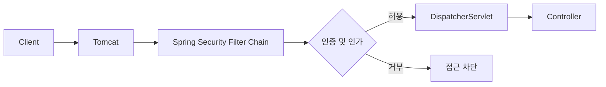
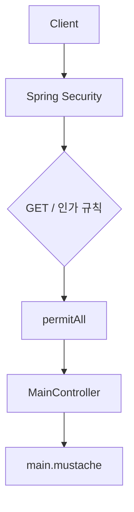
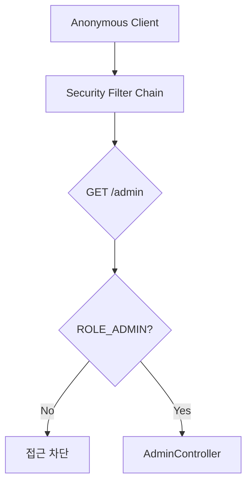
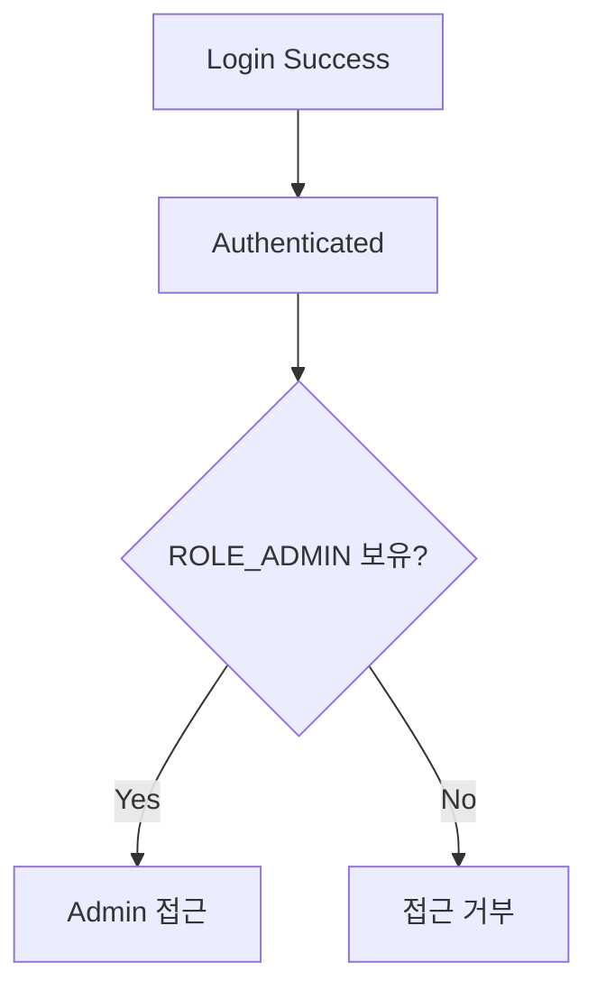
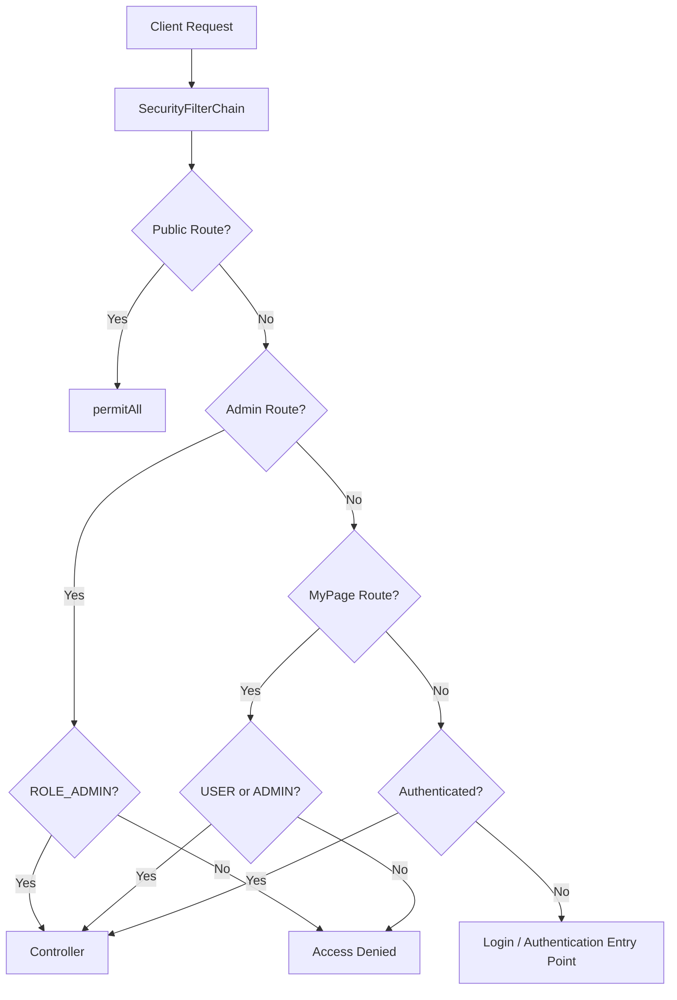
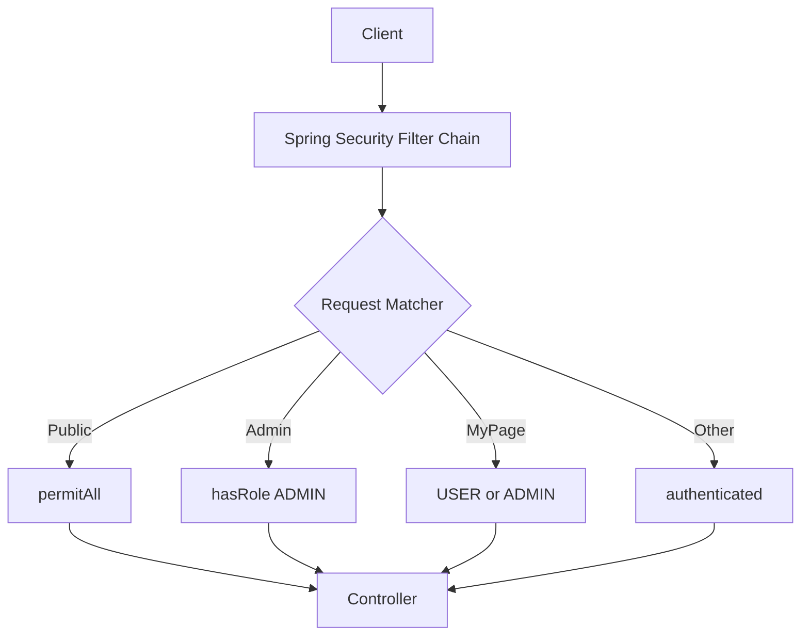

# 스프링 시큐리티 6 - 3. Security Config 인가 작업
[https://youtu.be/ov84EoU0KAE?si=O58cZ7_xQOABtZiq](https://youtu.be/ov84EoU0KAE?si=O58cZ7_xQOABtZiq)

# 스프링 시큐리티 6 - 3. Security Config 인가 작업
* toc
{:toc}

---

## Spring Security SecurityConfig와 경로별 인가 설정

Spring Security 의존성만 추가한 상태에서 애플리케이션을 실행하면 기본적으로 애플리케이션의 모든 요청이 보호된다.

예를 들어 다음 Controller가 있다고 가정해보자.

```java
@Controller
public class MainController {

    @GetMapping("/")
    public String main() {
        return "main";
    }
}
```

별도의 Spring Security 설정이 없다면 `/`에 접근했을 때 바로 `main` 화면으로 이동하는 것이 아니라 인증을 요구하는 기본 로그인 화면이 나타난다.

이것은 Spring Security에 문제가 생긴 것이 아니라 Spring Boot의 기본 Security Auto Configuration이 정상적으로 동작하기 때문이다. Spring Security가 Classpath에 있고 별도의 `SecurityFilterChain`이 없다면 Spring Boot는 기본적으로 전체 웹 애플리케이션을 보호한다.

하지만 실제 서비스에서는 모든 URL에 동일한 정책을 적용할 수 없다.

예를 들어 다음과 같은 요구사항이 있을 수 있다.

```text
/
→ 누구나 접근 가능

/login
→ 누구나 접근 가능

/admin/**
→ ADMIN 권한 필요

/mypage/**
→ USER 또는 ADMIN 권한 필요

그 외 경로
→ 로그인한 사용자만 접근
```

이러한 **경로별 접근 제어 규칙을 직접 정의하는 핵심 설정이 `SecurityFilterChain`**이다.

---

## Spring Security의 요청 처리 구조

먼저 Spring Security의 동작 위치를 다시 이해해보자.

Spring MVC 기반 애플리케이션에서 클라이언트 요청은 바로 Controller에 전달되지 않는다.

개념적으로 다음과 같은 흐름을 가진다.

```text
Client
   ↓
Servlet Container
   ↓
Servlet Filter Chain
   ↓
DispatcherServlet
   ↓
Controller
```

Spring Boot에서 일반적으로 사용하는 내장 Tomcat 역시 Servlet Container다.

Spring Security는 이 Filter 계층에서 HTTP 요청을 검사한다.



따라서 다음 요청이 들어왔다고 생각해보자.

```text
GET /admin
```

Spring Security는 `AdminController`가 실행되기 전에 현재 사용자를 검사할 수 있다.

```text
/admin 요청

     ↓

Spring Security

     ↓

로그인 여부 확인

     ↓

ADMIN 권한 확인

     ↓

허용 또는 차단
```

Controller 내부에서 매번 권한을 직접 검사하지 않아도 되는 이유가 바로 여기에 있다.

---

## 인가란 무엇인가?

이번 단계의 핵심은 **인가(Authorization)** 다.

인증(Authentication)은 다음 질문에 답한다.

```text
"현재 사용자는 누구인가?"
```

대표적인 예가 로그인이다.

반면 인가는 다음 질문에 답한다.

```text
"현재 사용자는 이 기능을 사용할 수 있는가?"
```

예를 들어 로그인에 성공한 일반 사용자라고 해서 관리자 기능까지 사용할 수 있어서는 안 된다.

```text
USER

GET /mypage
→ 허용

GET /admin
→ 거부
```

반대로 ADMIN이라면 다음과 같이 정책을 구성할 수 있다.

```text
ADMIN

GET /mypage
→ 허용

GET /admin
→ 허용
```

즉 인증과 인가는 다음처럼 구분된다.

| 구분             | 의미               | 대표 예       |
| -------------- | ---------------- | ---------- |
| Authentication | 사용자가 누구인지 확인     | 로그인        |
| Authorization  | 해당 사용자의 접근 권한 확인 | 관리자 페이지 접근 |

---

## SecurityConfig를 만드는 이유

Spring Security의 기본 설정은 빠르게 Security 기능을 확인하기에는 편리하다.

하지만 기본적으로 전체 요청을 보호하기 때문에 실제 서비스의 요구사항을 표현하기 어렵다.

그래서 직접 Security 설정을 작성한다.

프로젝트 구조를 다음과 같이 구성할 수 있다.

```text
com.example.security
├── SecurityApplication.java
├── config
│   └── SecurityConfig.java
└── controller
    ├── MainController.java
    └── AdminController.java
```

`SecurityConfig` 클래스를 작성한다.

```java
package com.example.security.config;

import org.springframework.context.annotation.Configuration;
import org.springframework.security.config.annotation.web.configuration.EnableWebSecurity;

@Configuration
@EnableWebSecurity
public class SecurityConfig {

}
```

`@Configuration`은 해당 클래스가 Spring 설정 클래스라는 것을 의미한다.

```java
@Configuration
```

`@EnableWebSecurity`는 Spring Security의 웹 보안 구성을 활성화할 때 사용할 수 있다.

```java
@EnableWebSecurity
```

다만 Spring Boot 기반 애플리케이션에서는 Security Auto Configuration이 이미 동작하기 때문에 단순히 `SecurityFilterChain` Bean을 등록하기 위해 `@EnableWebSecurity`가 반드시 필요한 것은 아니다. 공식 예제에서도 명시적으로 사용할 수 있지만, Boot에서는 `@Configuration`과 `SecurityFilterChain` Bean만으로 구성하는 방식도 흔하다.

---

## SecurityFilterChain 작성

Spring Security 6 이후의 일반적인 Java 설정에서는 `WebSecurityConfigurerAdapter`를 상속하는 방식이 아니라 `SecurityFilterChain` Bean을 등록한다.

기본 형태는 다음과 같다.

```java
@Configuration
public class SecurityConfig {

    @Bean
    public SecurityFilterChain securityFilterChain(
            HttpSecurity http
    ) throws Exception {

        return http.build();
    }
}
```

필요한 Import는 다음과 같다.

```java
import org.springframework.context.annotation.Bean;
import org.springframework.context.annotation.Configuration;
import org.springframework.security.config.annotation.web.builders.HttpSecurity;
import org.springframework.security.web.SecurityFilterChain;
```

구조적으로 보면:

```text
SecurityConfig

      ↓

SecurityFilterChain Bean

      ↓

HttpSecurity로 정책 작성

      ↓

Spring Security Filter Chain
```

라고 이해할 수 있다.

---

## HttpSecurity란?

`HttpSecurity`는 HTTP 요청에 대한 Spring Security 정책을 구성하기 위한 Builder다.

```java
public SecurityFilterChain securityFilterChain(
        HttpSecurity http
) throws Exception {
}
```

이 객체를 통해 다음과 같은 것들을 설정하게 된다.

```text
경로별 인가
Form Login
Logout
CSRF
Session
Exception Handling
HTTP Basic
Security Header
```

이번에는 이 중에서 경로별 **인가 정책**에 집중한다.

---

## authorizeHttpRequests

URL별 접근 권한을 설정하려면 다음과 같이 `authorizeHttpRequests()`를 사용한다.

```java
http.authorizeHttpRequests(auth -> auth

);
```

여기 안에서 `requestMatchers()`를 이용해 어떤 HTTP 요청에 어떤 접근 정책을 적용할 것인지 지정한다.

기본적인 구조는 다음과 같다.

```java
http
        .authorizeHttpRequests(auth -> auth
                .requestMatchers("/")
                .permitAll()

                .anyRequest()
                .authenticated()
        );
```

의미를 풀어보면 다음과 같다.

```text
/
→ 모든 사용자 접근 허용

나머지 요청
→ 로그인한 사용자만 허용
```

---

## permitAll()

`permitAll()`은 인증 여부나 권한과 관계없이 해당 요청을 허용한다.

```java
.requestMatchers("/")
.permitAll()
```

따라서 다음 사용자가 모두 접근할 수 있다.

```text
익명 사용자
USER
ADMIN
```

로그인 페이지나 회원가입 페이지처럼 인증되지 않은 사용자도 접근해야 하는 경로에 많이 사용한다.

예를 들어:

```java
.requestMatchers(
        "/",
        "/login",
        "/join"
)
.permitAll()
```

이라고 작성하면 세 URL은 누구나 접근할 수 있다.

```text
/
→ 누구나

/login
→ 누구나

/join
→ 누구나
```

---

## authenticated()

`authenticated()`는 사용자의 구체적인 Role과 관계없이 **인증이 완료된 사용자**에게 접근을 허용한다.

```java
.anyRequest()
.authenticated()
```

예를 들어:

```text
Anonymous
→ 거부

ROLE_USER
→ 허용

ROLE_ADMIN
→ 허용
```

이 된다.

마이페이지처럼 단순히 로그인 여부만 확인하면 되는 곳에 사용할 수 있다.

```java
.requestMatchers("/profile/**")
.authenticated()
```

---

## hasRole()

특정 Role을 가진 사용자만 접근하게 만들려면 `hasRole()`을 사용할 수 있다.

```java
.requestMatchers("/admin/**")
.hasRole("ADMIN")
```

이 설정의 의미는 다음과 같다.

```text
/admin/**
→ ADMIN Role 필요
```

주의할 점은 `hasRole("ADMIN")`을 사용할 때 직접 `ROLE_` Prefix까지 작성하지 않는다는 것이다.

즉 다음과 같이 사용한다.

```java
hasRole("ADMIN")
```

내부적으로는 일반적으로 다음 Authority와 대응한다.

```text
ROLE_ADMIN
```

Spring Security 공식 문서에서도 `hasRole("ADMIN")`을 사용할 경우 `ROLE_` Prefix를 별도로 작성하지 않는 형태를 보여준다.

---

## hasAnyRole()

여러 Role 중 하나라도 가지고 있으면 접근을 허용하고 싶은 경우 `hasAnyRole()`을 사용할 수 있다.

```java
.requestMatchers("/mypage/**")
.hasAnyRole("USER", "ADMIN")
```

의미는 다음과 같다.

```text
ROLE_USER
또는
ROLE_ADMIN

둘 중 하나면 접근 가능
```

예를 들어:

```text
Anonymous
→ 접근 불가

USER
→ 접근 가능

ADMIN
→ 접근 가능
```

가 된다.

---

## denyAll()

어떠한 사용자에게도 접근을 허용하지 않으려면 `denyAll()`을 사용할 수 있다.

```java
.requestMatchers("/internal/**")
.denyAll()
```

다음 사용자도 모두 차단된다.

```text
Anonymous
USER
ADMIN
```

특정 API를 임시로 완전히 막거나 외부에서 절대로 접근하면 안 되는 URL 정책을 구성할 때 사용할 수 있다.

---

## 주요 인가 메서드 정리

경로별 인가 설정에서 자주 사용하는 메서드를 정리하면 다음과 같다.

| 설정                            | 의미              |
| ----------------------------- | --------------- |
| `permitAll()`                 | 누구나 접근 가능       |
| `authenticated()`             | 인증 사용자만 접근      |
| `hasRole("ADMIN")`            | 특정 Role 필요      |
| `hasAnyRole("USER", "ADMIN")` | 여러 Role 중 하나 필요 |
| `denyAll()`                   | 모든 접근 거부        |

이를 실제 정책으로 표현하면 다음처럼 작성할 수 있다.

```java
http
        .authorizeHttpRequests(auth -> auth
                .requestMatchers("/", "/login")
                .permitAll()

                .requestMatchers("/admin/**")
                .hasRole("ADMIN")

                .requestMatchers("/mypage/**")
                .hasAnyRole("USER", "ADMIN")

                .anyRequest()
                .authenticated()
        );
```

---

## 전체 SecurityConfig 작성

지금까지의 내용을 하나의 Config로 정리하면 다음과 같다.

```java
package com.example.security.config;

import org.springframework.context.annotation.Bean;
import org.springframework.context.annotation.Configuration;
import org.springframework.security.config.annotation.web.builders.HttpSecurity;
import org.springframework.security.web.SecurityFilterChain;

@Configuration
public class SecurityConfig {

    @Bean
    public SecurityFilterChain securityFilterChain(
            HttpSecurity http
    ) throws Exception {

        http
                .authorizeHttpRequests(auth -> auth

                        .requestMatchers(
                                "/",
                                "/login"
                        )
                        .permitAll()

                        .requestMatchers("/admin/**")
                        .hasRole("ADMIN")

                        .requestMatchers("/mypage/**")
                        .hasAnyRole(
                                "USER",
                                "ADMIN"
                        )

                        .anyRequest()
                        .authenticated()
                );

        return http.build();
    }
}
```

이 설정을 정책으로 다시 표현하면 다음과 같다.

```text
/, /login
→ 모두 허용

/admin/**
→ ADMIN

/mypage/**
→ USER 또는 ADMIN

그 외
→ 로그인 사용자
```

---

## requestMatchers의 와일드카드

URL 전체를 하나하나 등록할 필요는 없다.

예를 들어 마이페이지 URL이 다음과 같이 구성된다고 해보자.

```text
/mypage/1
/mypage/2
/mypage/100
/mypage/profile
/mypage/settings
```

각 URL을 다음처럼 모두 작성하는 것은 현실적이지 않다.

```text
/mypage/1
/mypage/2
/mypage/3
...
```

따라서 Pattern을 사용할 수 있다.

```java
.requestMatchers("/mypage/**")
.authenticated()
```

`/mypage/**` 패턴을 사용하면 `/mypage` 아래에 위치하는 여러 요청을 하나의 정책으로 처리할 수 있다.

```text
/mypage/1
/mypage/100
/mypage/profile
/mypage/settings
```

---

## anyRequest()의 역할

모든 URL을 하나씩 정의할 수는 없다.

그래서 앞에서 매칭되지 않은 나머지 요청을 처리하기 위해 `anyRequest()`를 사용한다.

```java
.anyRequest()
.authenticated()
```

이는 다음과 같이 이해할 수 있다.

```text
앞에서 정의한 조건에 해당하지 않는
나머지 모든 요청

→ 로그인 필요
```

예를 들어:

```java
.requestMatchers("/")
.permitAll()

.requestMatchers("/admin/**")
.hasRole("ADMIN")

.anyRequest()
.authenticated()
```

라고 구성하면:

```text
/
→ 모두 허용

/admin/**
→ ADMIN

그 밖의 모든 URL
→ 인증 사용자
```

가 된다.

---

## 인가 규칙의 순서가 중요한 이유

Spring Security에서 여러 인가 규칙은 선언된 순서대로 평가되며, **먼저 매칭되는 규칙이 적용된다.** 공식 문서 역시 여러 Authorization Rule은 선언된 순서로 검사된다고 설명한다.

따라서 구체적인 조건을 위에 두고 포괄적인 조건을 아래에 두는 것이 중요하다.

좋은 예는 다음과 같다.

```java
http
        .authorizeHttpRequests(auth -> auth
                .requestMatchers("/")
                .permitAll()

                .requestMatchers("/admin/**")
                .hasRole("ADMIN")

                .anyRequest()
                .authenticated()
        );
```

구체적인 경로부터 검사한다.

```text
1. /
2. /admin/**
3. 나머지
```

---

## 너무 넓은 규칙을 먼저 작성하면 어떻게 될까?

개념적으로 모든 경로를 먼저 허용한다고 생각해보자.

```text
/**
→ permitAll
```

그 뒤에:

```text
/admin/**
→ hasRole("ADMIN")
```

을 배치한다면 앞의 더 포괄적인 규칙이 먼저 매칭되어 뒤의 관리자 정책이 의미를 잃을 수 있다.

개념적으로:

```text
/admin/users 요청

       ↓

/** 매칭

       ↓

permitAll

       ↓

뒤의 ADMIN 규칙까지 가지 않음
```

이 된다.

따라서 원칙은 단순하다.

```text
구체적인 규칙
       ↓
구체적인 규칙
       ↓
포괄적인 규칙
```

그리고 일반적으로 마지막에는:

```java
.anyRequest()
.authenticated()
```

또는 보수적인 정책을 원한다면:

```java
.anyRequest()
.denyAll()
```

을 두는 방식이 좋다.

Spring Security 공식 문서도 매칭되지 않은 요청을 `denyAll()`로 차단하는 방식을, 정책 추가를 빠뜨려 의도하지 않은 URL이 노출되는 것을 방지하는 전략으로 소개한다.

---

## permitAll과 ignoring은 다르다

공개 Resource를 설정할 때 다음처럼 Security Filter 자체를 무시하도록 구성하는 방법도 생각할 수 있다.

하지만 현재 Spring Security에서는 가능하면 Filter Chain에서 완전히 제외하는 것보다 `permitAll()`을 사용하는 방식을 권장한다.

예를 들어 CSS를 공개한다고 하면:

```java
.requestMatchers("/css/**")
.permitAll()
```

과 같이 구성한다.

`permitAll()`을 사용하면 인증은 요구하지 않으면서도 Spring Security가 설정하는 Security Header 등의 보호 기능은 계속 적용될 수 있다. 공식 문서에서도 정적 Resource에 `ignoring`보다 `permitAll`을 선호하도록 안내한다.

---

## 메인 페이지를 누구나 접근하도록 변경하기

이전에는 별도의 SecurityConfig가 없었기 때문에 `/` 요청에 인증이 필요했다.

```text
GET /

  ↓

Spring Security

  ↓

로그인 필요
```

이제 다음 설정을 추가한다.

```java
.requestMatchers("/")
.permitAll()
```

그러면 요청 흐름이 달라진다.



로그인하지 않은 사용자도 메인 페이지에 접근할 수 있다.

```text
Anonymous
   ↓
GET /
   ↓
permitAll
   ↓
MainController
```

---

## AdminController 작성

이번에는 실제로 보호되는 경로를 만들어보자.

```java
package com.example.security.controller;

import org.springframework.stereotype.Controller;
import org.springframework.web.bind.annotation.GetMapping;

@Controller
public class AdminController {

    @GetMapping("/admin")
    public String admin() {

        return "admin";
    }
}
```

Template도 만든다.

```text
src/main/resources/templates/admin.mustache
```

```html
<!DOCTYPE html>
<html lang="ko">
<head>
    <meta charset="UTF-8">
    <title>Admin</title>
</head>
<body>

<h1>Admin Page</h1>

</body>
</html>
```

그리고 Security 설정은 다음과 같이 작성한다.

```java
.requestMatchers("/admin/**")
.hasRole("ADMIN")
```

---

## 로그인하지 않은 사용자가 /admin에 접근하면?

현재 사용자는 인증되지 않았다.

```text
Anonymous
```

그런데 `/admin`에는 다음 조건이 있다.

```text
ROLE_ADMIN 필요
```

따라서 Controller까지 요청이 전달되지 않는다.



중요한 점은 다음이다.

```text
AdminController가 실행된 뒤
권한 오류가 발생한 것이 아니다.
```

Spring Security Filter Chain에서 이미 요청을 차단한다.

```text
Client

  ↓

Spring Security

  X

AdminController
```

이것이 Filter 기반 보안의 중요한 특징이다.

---

## 그런데 왜 로그인 페이지가 나타나지 않을 수 있을까?

여기에서 Spring Security 설정을 처음 작성할 때 자주 혼란스러운 부분이 있다.

Spring Boot의 기본 Security 설정을 사용할 때는 Form Login이나 HTTP Basic이 자동 구성된다.

하지만 개발자가 직접 다음 Bean을 등록하면:

```java
@Bean
SecurityFilterChain securityFilterChain(
        HttpSecurity http
)
```

Spring Boot의 기본 Web Security Configuration이 물러나고 개발자가 보안 구성을 직접 책임지게 된다.

따라서 단순히 다음과 같이 인가 규칙만 정의했다고 하자.

```java
http
        .authorizeHttpRequests(auth -> auth
                .requestMatchers("/")
                .permitAll()

                .requestMatchers("/admin/**")
                .hasRole("ADMIN")

                .anyRequest()
                .authenticated()
        );
```

보호된 경로에 접근했을 때 이전처럼 자동 로그인 화면으로 이어지는 동작을 기대한다면 Form Login을 명시적으로 구성해 주는 것이 명확하다.

---

## Form Login 활성화하기

Spring Security의 기본 로그인 기능을 사용하고 싶다면 다음을 추가할 수 있다.

```java
import static org.springframework.security.config.Customizer.withDefaults;
```

그리고:

```java
.formLogin(withDefaults())
```

를 작성한다.

전체 설정은 다음과 같다.

```java
@Configuration
public class SecurityConfig {

    @Bean
    public SecurityFilterChain securityFilterChain(
            HttpSecurity http
    ) throws Exception {

        http
                .authorizeHttpRequests(auth -> auth

                        .requestMatchers(
                                "/",
                                "/login"
                        )
                        .permitAll()

                        .requestMatchers("/admin/**")
                        .hasRole("ADMIN")

                        .requestMatchers("/mypage/**")
                        .hasAnyRole(
                                "USER",
                                "ADMIN"
                        )

                        .anyRequest()
                        .authenticated()
                )

                .formLogin(withDefaults());

        return http.build();
    }
}
```

이제 인증이 필요한 Browser 요청에서는 Form Login 흐름을 사용할 수 있다. Spring Security 공식 문서에서도 `authorizeHttpRequests`와 `formLogin`을 함께 구성하는 형태를 제공한다.

---

## Custom SecurityFilterChain을 만들면 무엇을 직접 책임져야 할까?

이 부분은 Spring Security를 이해할 때 중요하다.

기본 설정에서는 Spring Boot가 상당 부분을 구성해준다.

```text
Spring Boot Default

전체 요청 보호
+
Form Login / HTTP Basic
+
기본 사용자
```

하지만 직접 `SecurityFilterChain`을 생성하면 Web Security 정책은 개발자가 명시적으로 정의하게 된다.

```text
Custom SecurityFilterChain

어떤 URL을 보호하는가?
어떤 URL을 공개하는가?
Form Login을 사용하는가?
HTTP Basic을 사용하는가?
Logout은 어떻게 처리하는가?
```

다만 `SecurityFilterChain`을 직접 만들었다고 해서 기본 `UserDetailsService`까지 반드시 사라지는 것은 아니다. Spring Boot의 사용자 자동 구성은 별도의 조건으로 동작한다.

즉 다음 두 부분을 구분해야 한다.

```text
SecurityFilterChain
→ 요청을 어떻게 보호할 것인가?

UserDetailsService
→ 사용자를 어떻게 조회할 것인가?
```

---

## Form Login을 포함한 최종 예제

이번 단계에서 사용할 수 있는 형태를 하나로 정리하면 다음과 같다.

```java
package com.example.security.config;

import org.springframework.context.annotation.Bean;
import org.springframework.context.annotation.Configuration;
import org.springframework.security.config.annotation.web.builders.HttpSecurity;
import org.springframework.security.web.SecurityFilterChain;

import static org.springframework.security.config.Customizer.withDefaults;

@Configuration
public class SecurityConfig {

    @Bean
    public SecurityFilterChain securityFilterChain(
            HttpSecurity http
    ) throws Exception {

        http
                .authorizeHttpRequests(auth -> auth

                        .requestMatchers(
                                "/",
                                "/login"
                        )
                        .permitAll()

                        .requestMatchers("/admin/**")
                        .hasRole("ADMIN")

                        .requestMatchers("/mypage/**")
                        .hasAnyRole(
                                "USER",
                                "ADMIN"
                        )

                        .anyRequest()
                        .authenticated()
                )

                .formLogin(withDefaults());

        return http.build();
    }
}
```

접근 정책은 다음과 같다.

| 경로           | 접근 정책                     |
| ------------ | ------------------------- |
| `/`          | 누구나                       |
| `/login`     | 누구나                       |
| `/admin/**`  | `ROLE_ADMIN`              |
| `/mypage/**` | `ROLE_USER`, `ROLE_ADMIN` |
| 나머지          | 인증 사용자                    |

---

## 현재 기본 user로 /admin에 접근할 수 있을까?

이전 단계에서는 Spring Boot가 다음 기본 사용자를 만들어주었다.

```text
username
→ user

password
→ 실행 시 생성
```

그렇다고 이 사용자가 자동으로 `ADMIN` 권한을 가지는 것은 아니다.

따라서 다음 정책이 있다면:

```java
.requestMatchers("/admin/**")
.hasRole("ADMIN")
```

로그인했다고 무조건 `/admin` 접근이 가능하지 않다.

여기서 인증과 인가의 차이를 다시 확인할 수 있다.

```text
로그인 성공
= Authentication 성공

ADMIN 페이지 접근 가능
= Authorization 성공
```

둘은 별개의 문제다.



---

## authenticated()와 hasRole()의 차이

다음 두 설정은 의미가 다르다.

```java
.requestMatchers("/mypage/**")
.authenticated()
```

이는:

```text
로그인만 되어 있으면 접근 가능
```

이라는 뜻이다.

반면:

```java
.requestMatchers("/admin/**")
.hasRole("ADMIN")
```

은:

```text
로그인
+
ADMIN Role

둘 다 필요
```

라는 의미다.

비교하면 다음과 같다.

| 상태        | `authenticated()` | `hasRole("ADMIN")` |
| --------- | ----------------: | -----------------: |
| Anonymous |                불가 |                 불가 |
| USER      |                가능 |                 불가 |
| ADMIN     |                가능 |                 가능 |

---

## hasRole과 hasAuthority의 차이

Role을 이용하는 방법 외에도 Authority를 직접 검사할 수 있다.

예를 들어:

```java
.hasRole("ADMIN")
```

은 일반적으로 다음 Authority를 확인한다.

```text
ROLE_ADMIN
```

반면:

```java
.hasAuthority("ADMIN")
```

이라고 작성하면 문자열 `ADMIN` 자체를 Authority로 검사한다.

따라서 다음 두 코드는 동일하다고 보면 안 된다.

```java
.hasRole("ADMIN")
```

```java
.hasAuthority("ADMIN")
```

Role Prefix를 사용하는 정책이라면 다음처럼 생각하는 것이 좋다.

```text
hasRole("ADMIN")
→ ROLE_ADMIN 검사
```

Authority 기반으로 세밀한 권한을 구성하면:

```text
USER_READ
USER_WRITE
PAYMENT_READ
PAYMENT_WRITE
```

같은 형태로 만들 수도 있다.

---

## URL 인가와 실제 비즈니스 권한은 다르다

Spring Security에서 다음 정책을 만들었다고 생각해보자.

```java
.requestMatchers("/orders/**")
.authenticated()
```

그러면 로그인한 사용자는 `/orders/**`에 접근할 수 있다.

하지만 다음 요청까지 모두 허용해도 되는지는 별개의 문제다.

```text
GET /orders/100
```

현재 사용자:

```text
userId = 1
```

Order 정보:

```text
orderId = 100
ownerId = 2
```

이 사용자가 다른 사람의 주문을 볼 수 있어서는 안 된다.

따라서 다음 두 보안 계층을 구분하는 것이 좋다.

```text
HTTP 인가

로그인 사용자만 /orders/** 접근
```

그리고:

```text
Domain 인가

현재 사용자가
이 주문의 실제 소유자인가?
```

Spring Security의 URL 인가 규칙만으로 모든 도메인 권한 문제가 해결되는 것은 아니다.

---

## URL 인가 규칙 설계 방법

실무에서는 먼저 API를 분류해두면 SecurityConfig를 작성하기 쉬워진다.

예를 들어:

### Public

```text
/
GET /products/**
POST /login
POST /join
```

### Authentication Required

```text
GET /mypage/**
GET /orders/**
POST /orders/**
```

### Admin

```text
GET /admin/**
POST /admin/**
DELETE /admin/**
```

이를 Spring Security 설정으로 옮긴다.

```java
http
        .authorizeHttpRequests(auth -> auth

                .requestMatchers(
                        "/",
                        "/login",
                        "/join",
                        "/products/**"
                )
                .permitAll()

                .requestMatchers("/admin/**")
                .hasRole("ADMIN")

                .requestMatchers(
                        "/mypage/**",
                        "/orders/**"
                )
                .authenticated()

                .anyRequest()
                .denyAll()
        );
```

이렇게 하면 등록되지 않은 새로운 URL이 의도치 않게 공개되는 문제도 줄일 수 있다.

---

## permitAll과 authenticated 중 무엇을 기본으로 둘까?

서비스 정책에 따라 달라진다.

일반적인 회원 서비스에서는 다음처럼 사용할 수 있다.

```java
.anyRequest()
.authenticated()
```

즉 명시적으로 Public으로 지정하지 않은 URL은 모두 로그인 사용자만 허용한다.

더 보수적인 내부 시스템이라면:

```java
.anyRequest()
.denyAll()
```

로 구성한 뒤 허용해야 할 URL을 모두 명시하는 방식도 가능하다.

차이는 다음과 같다.

```text
authenticated()

새 URL 추가
→ 인증 사용자는 접근 가능
```

```text
denyAll()

새 URL 추가
→ 별도 Security 정책을 추가하기 전까지 접근 불가
```

보안 민감도가 높은 시스템에서는 후자의 방식이 유용할 수 있다.

---

## 인가 규칙을 읽는 방법

다음 Config가 있다고 하자.

```java
http
        .authorizeHttpRequests(auth -> auth

                .requestMatchers(
                        "/",
                        "/login"
                )
                .permitAll()

                .requestMatchers("/admin/**")
                .hasRole("ADMIN")

                .requestMatchers("/mypage/**")
                .hasAnyRole(
                        "USER",
                        "ADMIN"
                )

                .anyRequest()
                .authenticated()
        );
```

코드 자체를 외우는 것보다 위에서 아래로 정책을 읽는 것이 중요하다.

```text
1.

/ 또는 /login인가?

YES
→ 허용


2.

/admin/**인가?

YES
→ ADMIN 확인


3.

/mypage/**인가?

YES
→ USER 또는 ADMIN 확인


4.

어디에도 해당하지 않는가?

→ 로그인 여부 확인
```

이것이 Request Authorization Rule의 핵심이다.

---

## SecurityConfig의 전체 동작 구조

최종적인 구조를 그림으로 정리하면 다음과 같다.



핵심은 Controller가 실행되기 전에 인가 판단이 이루어진다는 것이다.

---

## SecurityFilterChain을 조금 더 정확하게 이해하기

`SecurityFilterChain`이 단순히 URL별 `if` 문을 저장하는 객체라고 생각하면 부족하다.

Spring Security 내부에서는 다음과 같은 구조로 동작한다.

```text
Servlet Container

       ↓

DelegatingFilterProxy

       ↓

FilterChainProxy

       ↓

SecurityFilterChain

       ↓

Security Filters

       ↓

DispatcherServlet

       ↓

Controller
```

그리고 `SecurityFilterChain` 안에는 인증, 익명 사용자 처리, Exception 처리, 인가 등 여러 Security Filter가 참여할 수 있다.

URL별 접근 정책은 이러한 Filter Chain의 인가 단계에서 사용된다.

즉:

```text
SecurityConfig 작성

      ↓

SecurityFilterChain 생성

      ↓

Spring Security Filter 동작 결정

      ↓

HTTP 요청에 보안 정책 적용
```

이라고 이해하는 것이 좋다.

---

## 여러 SecurityFilterChain을 만들 수도 있다

조금 더 복잡한 시스템에서는 `SecurityFilterChain` 자체를 여러 개 구성할 수도 있다.

예를 들어:

```text
/api/**
→ JWT Security

/admin/**
→ 관리자 Security

나머지 Web
→ Form Login
```

와 같이 분리할 수 있다.

이때는 `securityMatcher()`와 여러 `SecurityFilterChain`, `@Order`를 이용해 어느 요청에 어느 Chain을 적용할지 결정할 수 있다. 현재 Spring Security 공식 문서도 여러 `HttpSecurity`와 `SecurityFilterChain`을 구성할 수 있으며 우선순위와 `securityMatcher`를 통해 요청을 구분하는 방법을 제공한다.

하지만 단순한 회원 서비스에서는 먼저 하나의 `SecurityFilterChain` 안에서 경로별 인가를 정확히 이해하는 것이 우선이다.

---

## requestMatchers와 securityMatcher는 다르다

이 부분도 이후 복잡한 Security 설정에서 혼동하기 쉽다.

다음 설정은:

```java
.requestMatchers("/admin/**")
.hasRole("ADMIN")
```

현재 `SecurityFilterChain` **안에서 `/admin/**` 요청에 어떤 권한 규칙을 적용할지** 결정한다.

반면:

```java
http.securityMatcher("/api/**");
```

는 해당 `SecurityFilterChain` 자체가 **어떤 요청에 적용될지** 결정한다.

구분하면 다음과 같다.

```text
securityMatcher
→ 이 SecurityFilterChain 자체의 적용 범위
```

```text
requestMatchers
→ 이 Chain 내부에서 URL별 인가 규칙
```

공식 문서에서도 두 개념을 이와 같이 구분한다.

---

## 실무에서의 활용

경로별 인가를 작성할 때는 SecurityConfig에 URL을 무작정 나열하는 것보다 서비스 정책부터 정리하는 것이 좋다.

예를 들어:

```text
Public
Authenticated
User
Admin
Internal
```

정도로 접근 수준을 구분한다.

그리고 URL을 매핑한다.

```text
Public
→ /, /login, /join

Authenticated
→ /mypage/**

Admin
→ /admin/**

Internal
→ 외부 요청 차단
```

그 다음 코드로 표현한다.

```java
.authorizeHttpRequests(auth -> auth

        .requestMatchers(
                "/",
                "/login",
                "/join"
        )
        .permitAll()

        .requestMatchers("/admin/**")
        .hasRole("ADMIN")

        .requestMatchers("/mypage/**")
        .authenticated()

        .anyRequest()
        .denyAll()
)
```

이 방식이면 SecurityConfig 자체가 서비스의 HTTP 접근 정책 문서 역할도 할 수 있다.

---

## 인가 규칙에서 특히 주의해야 할 점

### 너무 넓은 패턴을 위에 두지 않는다

```text
구체적인 URL
→ 위

포괄적인 URL
→ 아래
```

인가 규칙은 선언 순서대로 평가되기 때문이다.

### 로그인 여부와 Role을 구분한다

```text
authenticated()
≠
hasRole()
```

### `hasRole("ADMIN")`에 `ROLE_`을 중복해서 넣지 않는다

일반적인 Role Prefix 설정에서는:

```java
.hasRole("ADMIN")
```

로 작성한다.

### 공개 URL도 가능하면 `permitAll()`을 사용한다

Security Filter Chain 자체에서 제외하기보다 `permitAll()`을 사용하면 Security Header 같은 보호 기능을 계속 적용할 수 있다.

### 마지막 기본 정책을 명시한다

```java
.anyRequest()
.authenticated()
```

또는:

```java
.anyRequest()
.denyAll()
```

을 명시해 예상하지 못한 경로의 정책을 분명하게 만든다.

---

## 전체 프로젝트 구조

현재 단계까지 프로젝트를 정리하면 다음과 같다.

```text
src/main
├── java
│   └── com.example.security
│       ├── SecurityApplication.java
│       │
│       ├── config
│       │   └── SecurityConfig.java
│       │
│       └── controller
│           ├── MainController.java
│           └── AdminController.java
│
└── resources
    └── templates
        ├── main.mustache
        └── admin.mustache
```

보안 정책은:

```text
SecurityConfig
```

HTTP 요청 처리는:

```text
Controller
```

화면은:

```text
Mustache
```

가 담당한다.

책임을 분리해서 이해하는 것이 중요하다.

---

## 실행 흐름

애플리케이션을 실행한다.

```bash
./gradlew bootRun
```

이 명령은 Gradle을 통해 Spring Boot 애플리케이션을 실행한다.

### 메인 페이지 접근

```bash
curl http://localhost:8080/
```

`/`가 `permitAll()`이라면 인증되지 않은 사용자도 접근할 수 있다.

```text
GET /

  ↓

permitAll

  ↓

MainController

  ↓

main.mustache
```

### 관리자 페이지 접근

브라우저에서 다음 경로로 접근한다.

```text
http://localhost:8080/admin
```

인가 규칙은 다음과 같다.

```java
.requestMatchers("/admin/**")
.hasRole("ADMIN")
```

따라서:

```text
Anonymous
→ 접근 불가

USER
→ 접근 불가

ADMIN
→ 접근 가능
```

가 된다.

Form Login을 사용하도록 설정했다면 인증되지 않은 브라우저 요청을 로그인 흐름으로 연결할 수 있다.

---

## 현재 기준으로 보완해서 이해할 점

제공된 구현 흐름에서 가장 중요한 개념은 여전히 유효하다.

```text
SecurityConfig
+
SecurityFilterChain
+
HttpSecurity
+
authorizeHttpRequests
+
requestMatchers
```

현재 Spring Security 공식 문서에서도 `SecurityFilterChain` Bean과 `authorizeHttpRequests`를 중심으로 HTTP 요청 인가를 구성하고 있으며, `requestMatchers`, `permitAll`, `hasRole`, `authenticated`, `denyAll`과 같은 방식이 사용된다.

다만 다음 두 부분은 정확하게 구분해서 이해하는 것이 좋다.

첫 번째는 `@EnableWebSecurity`다.

```text
Spring Boot 환경

@Configuration
+
SecurityFilterChain Bean
```

만으로도 일반적인 사용자 정의 Security 구성이 가능하므로 단순 설정에서 `@EnableWebSecurity`를 반드시 붙여야 한다고 이해할 필요는 없다.

두 번째는 Form Login이다.

직접 `SecurityFilterChain`을 제공하면 Spring Boot의 기본 Web Security 설정은 물러난다. 따라서 보호된 웹 페이지에 접근했을 때 로그인 화면을 사용하려면 다음처럼 명시적으로 구성해두는 것이 명확하다.

```java
.formLogin(withDefaults())
```

커스텀 로그인 페이지를 만든다면 이후에는 다음처럼 발전시킬 수 있다.

```java
.formLogin(form -> form
        .loginPage("/login")
        .permitAll()
)
```

이 부분이 다음 단계의 로그인 구현과 연결된다.

---

## 정리

Spring Security를 프로젝트에 추가하기만 하면 Spring Boot의 기본 Security 설정에 의해 웹 애플리케이션 전체가 보호된다.

하지만 실제 서비스에서는 다음처럼 경로마다 서로 다른 접근 정책이 필요하다.

```text
/
→ 누구나

/login
→ 누구나

/admin/**
→ ADMIN

/mypage/**
→ USER / ADMIN

나머지
→ 인증 사용자
```

이를 직접 구성하기 위해 `SecurityFilterChain` Bean을 등록한다.

```java
@Bean
public SecurityFilterChain securityFilterChain(
        HttpSecurity http
) throws Exception {

    http
            .authorizeHttpRequests(auth -> auth

                    .requestMatchers(
                            "/",
                            "/login"
                    )
                    .permitAll()

                    .requestMatchers("/admin/**")
                    .hasRole("ADMIN")

                    .requestMatchers("/mypage/**")
                    .hasAnyRole(
                            "USER",
                            "ADMIN"
                    )

                    .anyRequest()
                    .authenticated()
            )

            .formLogin(withDefaults());

    return http.build();
}
```

각 설정의 의미는 다음과 같다.

```text
permitAll()
→ 누구나 접근

authenticated()
→ 로그인 사용자

hasRole()
→ 특정 Role

hasAnyRole()
→ 여러 Role 중 하나

denyAll()
→ 모든 접근 거부
```

그리고 인가 규칙은 선언 순서대로 평가되므로:

```text
구체적인 규칙
       ↓
일반적인 규칙
       ↓
anyRequest
```

순으로 작성하는 것이 중요하다.

전체적인 요청 흐름을 다시 정리하면 다음과 같다.



즉 Spring Security의 URL 인가는 Controller가 실행된 다음 검사하는 것이 아니라 **HTTP 요청이 Controller에 도달하기 전에 Security Filter Chain에서 요청 경로와 현재 사용자의 인증·권한 정보를 비교해 접근 여부를 결정하는 구조**다.

다음 단계에서 Form Login을 구성하면 여기서 정의한:

```text
접근 가능한가?
```

라는 인가 정책에 이어:

```text
인증이 필요하면
어디에서 어떻게 로그인할 것인가?
```

라는 인증 흐름을 연결할 수 있다.

### 한 줄 요약

Spring Security의 `SecurityFilterChain`과 `authorizeHttpRequests`를 이용하면 `requestMatchers`로 URL별 인가 정책을 정의할 수 있으며, 구체적인 경로부터 순서대로 `permitAll`, `authenticated`, `hasRole`, `hasAnyRole`, `denyAll`을 적용해 Controller에 도달하기 전에 사용자의 접근 권한을 검증할 수 있다.
