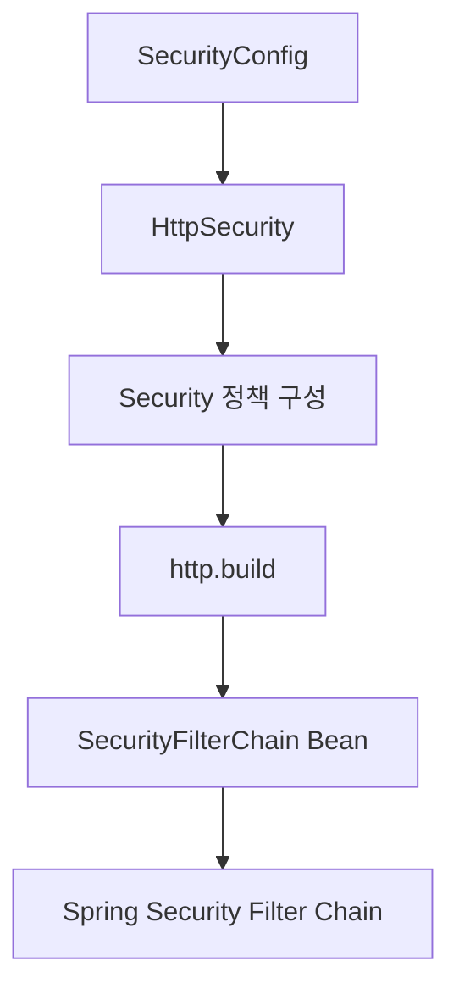
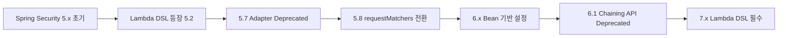
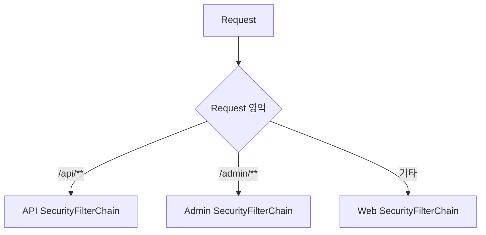

# 스프링 시큐리티 6 -  버전별 Security Config 구현 방법
[https://youtu.be/ov84EoU0KAE?si=O58cZ7_xQOABtZiq](https://youtu.be/ov84EoU0KAE?si=O58cZ7_xQOABtZiq)

# 스프링 시큐리티 6 -  버전별 Security Config 구현 방법
* toc
{:toc}

---

## Spring Security 버전별 설정 방식 변화: WebSecurityConfigurerAdapter에서 SecurityFilterChain과 Lambda DSL까지

Spring Security 코드를 검색하다 보면 같은 기능을 구현하는데도 전혀 다른 형태의 코드가 등장한다.

어떤 코드는 `WebSecurityConfigurerAdapter`를 상속하고 있고,

```java
public class SecurityConfig
        extends WebSecurityConfigurerAdapter {
}
```

다른 코드는 `SecurityFilterChain`을 Bean으로 등록한다.

```java
@Bean
SecurityFilterChain securityFilterChain(
        HttpSecurity http
) throws Exception {
    return http.build();
}
```

또 어떤 예제에서는 다음과 같이 메서드를 연속으로 연결한다.

```java
http
        .authorizeRequests()
        .antMatchers("/admin/**")
        .hasRole("ADMIN")
        .and()
        .formLogin();
```

반면 최근 Spring Security에서는 Lambda DSL 형태가 일반적이다.

```java
http
        .authorizeHttpRequests(auth -> auth
                .requestMatchers("/admin/**")
                .hasRole("ADMIN")
        )
        .formLogin(Customizer.withDefaults());
```

이 코드들은 단순히 작성자의 취향이 다른 것이 아니다.

**Spring Security가 발전하면서 권장 설정 API 자체가 여러 차례 변경되었기 때문이다.**

특히 다음 변화가 중요하다.

```text
WebSecurityConfigurerAdapter
        ↓
SecurityFilterChain Bean

antMatchers
        ↓
requestMatchers

메서드 체이닝 + and()
        ↓
Lambda DSL
```

따라서 Spring Security 코드를 사용할 때는 단순히 인터넷에서 코드를 복사하기보다 **그 코드가 어느 Spring Security 버전을 대상으로 작성되었는지** 확인해야 한다.

---

## Spring Boot와 Spring Security 버전의 관계

Spring Boot 프로젝트에서는 일반적으로 Spring Security 버전을 개발자가 직접 하나씩 결정하지 않는다.

보통 다음 Starter를 추가한다.

```gradle
implementation 'org.springframework.boot:spring-boot-starter-security'
```

그리고 Spring Boot의 Dependency Management가 호환되는 Spring Security 버전을 관리한다.

구조적으로 보면 다음과 같다.

```text
Spring Boot Version

        ↓

Dependency Management

        ↓

Spring Security Version
```

따라서 Spring Boot 버전이 크게 올라가면 함께 관리되는 Spring Framework와 Spring Security 버전도 올라가는 경우가 많다.

하지만 다음처럼 단순히 외워서는 안 된다.

```text
Spring Boot 2
=
항상 특정 Spring Security 버전
```

Boot의 Minor/Patch 버전에 따라 관리되는 세부 버전이 다를 수 있기 때문이다.

실제 프로젝트에서는 Dependency Tree나 Spring Boot Dependency Management를 확인하는 것이 가장 정확하다.

---

## 왜 버전별 설정 방식이 달라졌을까?

Spring Security의 설정 API 변화는 단순한 문법 변경만을 의미하지 않는다.

과거에는 상속을 중심으로 Security 설정을 구성했다.

```text
Framework가 제공하는 Adapter

        ↓

상속

        ↓

configure() Override
```

현재는 필요한 보안 구성 자체를 Bean으로 명시한다.

```text
SecurityFilterChain

        ↓

@Bean

        ↓

ApplicationContext
```

이 변화는 Spring 전반에서 선호하는 **Composition과 명시적인 Bean 구성 방식**과도 잘 맞는다.

또한 기존의 Method Chaining 방식은 설정이 길어질수록 현재 어떤 객체를 설정하고 있는지 파악하기 어려운 문제가 있었다.

```java
http
        .authorizeRequests()
            .antMatchers("/admin/**")
            .hasRole("ADMIN")
            .and()
        .formLogin()
            .and()
        .logout();
```

Lambda DSL에서는 설정의 범위가 더 명확하다.

```java
http
        .authorizeHttpRequests(auth -> auth
                .requestMatchers("/admin/**")
                .hasRole("ADMIN")
                .anyRequest()
                .authenticated()
        )
        .formLogin(Customizer.withDefaults())
        .logout(Customizer.withDefaults());
```

Spring Security 공식 문서 역시 Lambda DSL이 설정 대상을 더 명확하게 하고 일관된 DSL을 제공하기 위해 도입되었다고 설명한다. Lambda DSL 자체는 Spring Security 5.2부터 존재했다.

---

## 전체 버전 변화부터 살펴보기

큰 흐름만 정리하면 다음과 같다.

| 시기                     | 주요 설정 방식                                                      |
| ---------------------- | ------------------------------------------------------------- |
| Spring Security 5.6 전후 | `WebSecurityConfigurerAdapter` 상속 방식이 널리 사용                   |
| Spring Security 5.7    | `WebSecurityConfigurerAdapter` Deprecated                     |
| Spring Security 5.8    | `antMatchers`, `mvcMatchers` Deprecated, `requestMatchers` 권장 |
| Spring Security 6.x    | `SecurityFilterChain` + `requestMatchers`가 기본적인 현대 방식         |
| Spring Security 6.1    | 과거 Chaining API들이 7.0 제거 예정으로 Deprecated                      |
| Spring Security 7.x    | Lambda DSL 필수, `and()` 제거                                     |

특히 Spring Security 5.7에서 `WebSecurityConfigurerAdapter`가 Deprecated되었으며 공식 API에서도 `SecurityFilterChain` Bean을 사용하도록 안내했다.

이제 각각을 자세히 살펴보자.

---

## Spring Boot 2.6 전후의 전통적인 설정 방식

과거 Spring Security에서는 `WebSecurityConfigurerAdapter`를 상속하여 SecurityConfig를 구성하는 패턴이 매우 흔했다.

```java
@Configuration
@EnableWebSecurity
public class SecurityConfig
        extends WebSecurityConfigurerAdapter {

    @Override
    protected void configure(
            HttpSecurity http
    ) throws Exception {

        http
                .authorizeRequests()
                .antMatchers("/", "/login")
                .permitAll()
                .antMatchers("/admin/**")
                .hasRole("ADMIN")
                .anyRequest()
                .authenticated()
                .and()
                .formLogin();
    }
}
```

구조를 보면 다음과 같다.

```text
SecurityConfig

        ↓ 상속

WebSecurityConfigurerAdapter

        ↓ Override

configure(HttpSecurity)

        ↓

Security 정책 구성
```

핵심은 상속이다.

Spring Security가 제공하는 Adapter 클래스를 상속한 뒤 특정 Method를 Override했다.

---

## configure(HttpSecurity)를 Override했던 이유

`WebSecurityConfigurerAdapter` 내부에는 Security 설정을 Customize할 수 있는 여러 `configure()` Method가 존재했다.

HTTP Security를 설정하기 위해 다음 Method를 Override했다.

```java
@Override
protected void configure(
        HttpSecurity http
) throws Exception {

}
```

그리고 다음과 같은 정책을 작성했다.

```java
http
        .authorizeRequests()
        .antMatchers("/")
        .permitAll()
        .antMatchers("/admin/**")
        .hasRole("ADMIN")
        .anyRequest()
        .authenticated();
```

정책의 의미는 현재와 크게 다르지 않다.

```text
/
→ 누구나 접근

/admin/**
→ ADMIN

나머지
→ 인증 사용자
```

달라진 것은 이러한 정책을 **어떤 API를 이용해 구성하느냐**다.

---

## 과거의 antMatchers

과거 URL Pattern별 인가 규칙에서는 `antMatchers()`가 자주 사용되었다.

```java
.antMatchers("/admin/**")
.hasRole("ADMIN")
```

여러 Public URL도 지정할 수 있었다.

```java
.antMatchers(
        "/",
        "/login",
        "/join"
)
.permitAll()
```

그리고 HTTP Method까지 구분할 수도 있었다.

```java
.antMatchers(
        HttpMethod.GET,
        "/users/**"
)
.hasRole("USER")
```

이 방식은 오랫동안 Spring Security 코드에서 사용되었다.

---

## 과거의 and() 방식

설정 영역을 변경할 때 `.and()`도 자주 등장했다.

```java
http
        .authorizeRequests()
            .anyRequest()
            .authenticated()
            .and()
        .formLogin()
            .and()
        .logout();
```

이를 구조적으로 해석하면 다음과 같다.

```text
HTTP Security

├── Authorization 설정
│
├── Form Login 설정
│
└── Logout 설정
```

하지만 Java 코드만 보면:

```text
지금 HttpSecurity를 설정 중인가?

AuthorizeRequestsConfigurer인가?

FormLoginConfigurer인가?
```

를 파악하려면 DSL의 반환 타입을 알고 있어야 했다.

설정이 길어질수록 이런 문제가 더 커질 수 있었다.

---

## Spring Security 5.7: WebSecurityConfigurerAdapter의 Deprecated

Spring Security 5.7에서 중요한 변화가 발생한다.

`WebSecurityConfigurerAdapter`가 Deprecated되었다.

공식 API는 대신 다음 두 가지 Bean 기반 방식을 사용하도록 안내했다.

```text
HttpSecurity 설정
→ SecurityFilterChain Bean

WebSecurity 설정
→ WebSecurityCustomizer Bean
```

즉 다음 방식에서:

```java
public class SecurityConfig
        extends WebSecurityConfigurerAdapter {
}
```

다음 방식으로 이동하기 시작했다.

```java
@Configuration
public class SecurityConfig {

    @Bean
    SecurityFilterChain securityFilterChain(
            HttpSecurity http
    ) throws Exception {

        return http.build();
    }
}
```

이 변화가 현대 Spring Security 설정 방식의 중요한 전환점이다.

---

## 상속에서 Bean 방식으로의 변화

두 방식을 비교해보자.

과거 방식은:

```text
WebSecurityConfigurerAdapter

        ↓

extends

        ↓

configure() Override
```

현재 방식은:

```text
SecurityFilterChain

        ↓

@Bean

        ↓

Spring Container에 등록
```

즉 Framework 클래스를 상속해 Customize하는 패턴에서 필요한 Security 구성 요소를 명시적으로 Bean으로 등록하는 구조로 바뀌었다.

---

## SecurityFilterChain 방식

Bean 기반 설정의 기본 형태는 다음과 같다.

```java
@Configuration
public class SecurityConfig {

    @Bean
    public SecurityFilterChain securityFilterChain(
            HttpSecurity http
    ) throws Exception {

        http
                .authorizeHttpRequests(auth -> auth
                        .anyRequest()
                        .authenticated()
                );

        return http.build();
    }
}
```

전체 흐름은 다음과 같다.



이제 개발자는 Framework Adapter를 상속할 필요가 없다.

---

## Spring Security 5.8: antMatchers에서 requestMatchers로

다음 변화는 URL Matcher다.

과거에는:

```java
.antMatchers("/admin/**")
```

를 사용했다.

Spring Security 5.8에서는 `antMatchers()`가 Deprecated되었고 `requestMatchers()`를 사용하도록 변경되었다. 공식 5.8 API에서도 `antMatchers` 대신 `requestMatchers`를 사용하도록 명시하고 있으며 `requestMatchers(String...)`는 5.8부터 제공된다.

따라서 다음 코드는:

```java
.antMatchers("/admin/**")
.hasRole("ADMIN")
```

현대적인 형태에서는 다음과 같이 작성한다.

```java
.requestMatchers("/admin/**")
.hasRole("ADMIN")
```

---

## requestMatchers로 통합한 이유

과거에는 Matcher 종류에 따라 여러 API가 존재했다.

```text
antMatchers()
mvcMatchers()
regexMatchers()
```

Spring Security 5.8에서는 이 API들을 `requestMatchers()` 중심으로 정리하는 방향으로 전환했다. `antMatchers`, `mvcMatchers`, 일부 `regexMatchers`는 Deprecated 처리되었다.

개념적으로 다음 변화다.

```text
과거

antMatchers
mvcMatchers
regexMatchers

        ↓

requestMatchers 중심
```

API가 좀 더 일관된 형태로 정리된 것이다.

---

## Spring Boot 3과 Spring Security 6

Spring Boot 3 계열에서는 Spring Security 6 계열을 사용하게 되면서 과거 코드를 그대로 가져왔을 때 컴파일 자체가 되지 않는 경우가 많아졌다.

대표적으로 다음 패턴이다.

```java
extends WebSecurityConfigurerAdapter
```

그리고:

```java
.antMatchers(...)
```

Spring Security 6 기반에서는 현대적인 Bean 구성과 `requestMatchers()` 방식으로 전환하는 것이 필요하다.

기본 구조는 다음과 같다.

```java
@Configuration
public class SecurityConfig {

    @Bean
    public SecurityFilterChain securityFilterChain(
            HttpSecurity http
    ) throws Exception {

        http
                .authorizeHttpRequests(auth -> auth
                        .requestMatchers(
                                "/",
                                "/login"
                        )
                        .permitAll()

                        .requestMatchers("/admin/**")
                        .hasRole("ADMIN")

                        .anyRequest()
                        .authenticated()
                );

        return http.build();
    }
}
```

이 형태가 이후 Spring Security 학습에서 기준이 되는 형태라고 이해하면 된다.

---

## Spring Security 6.1과 Lambda DSL

Spring Security 6.1에서는 Lambda 기반 Configuration을 사용하는 방향이 더욱 명확해졌다.

다음과 같은 과거 스타일의 API:

```java
http
        .authorizeHttpRequests()
        .requestMatchers("/")
        .permitAll()
        .anyRequest()
        .authenticated()
        .and()
        .formLogin();
```

에서 다음 형태로 이동한다.

```java
http
        .authorizeHttpRequests(auth -> auth
                .requestMatchers("/")
                .permitAll()
                .anyRequest()
                .authenticated()
        )
        .formLogin(Customizer.withDefaults());
```

Spring Security 6.1 API에서는 인자 없는 `authorizeHttpRequests()`와 `.and()` 같은 API가 **7.0에서 제거하기 위한 Deprecated API**로 표시되었으며 Lambda 기반 API를 사용하도록 안내했다.

---

## 중요한 보완: Spring Security 6.1부터 Lambda가 즉시 필수였던 것은 아니다

제공된 흐름에서는 Spring Boot 3.1 계열부터 Lambda 방식으로 반드시 작성해야 한다고 설명하고 있다.

여기서는 현재 공식 API 기준으로 조금 더 정확하게 구분할 필요가 있다.

Spring Security 6.1에서는 기존 다음 API가:

```java
authorizeHttpRequests()
```

즉시 제거된 것이 아니라:

```text
Deprecated
forRemoval = true
Removal Version = 7.0
```

상태였다. `.and()` 역시 6.1에서 Deprecated되어 7.0 제거 예정이었다.

따라서 버전 흐름을 정확하게 표현하면 다음과 같다.

```text
Spring Security 5.2

Lambda DSL 등장

        ↓

Spring Security 6.1

기존 Chaining API Deprecated
Lambda 방식으로 Migration 권장

        ↓

Spring Security 7

기존 방식 제거
Lambda DSL 필수
```

즉 **6.1에서 Lambda DSL이 강하게 권장되는 방향으로 전환되었고, 실제로 Lambda DSL이 필수화된 것은 Spring Security 7이라고 보는 것이 정확하다.**

Spring Security 공식 Migration 문서 역시 Lambda DSL은 5.2부터 존재했으며, 이전 설정 방식은 Spring Security 7부터 유효하지 않다고 명시한다.

---

## 왜 Lambda DSL로 바뀌었을까?

기존 코드부터 다시 살펴보자.

```java
http
        .authorizeHttpRequests()
            .requestMatchers("/")
            .permitAll()
            .anyRequest()
            .authenticated()
            .and()
        .formLogin()
            .and()
        .logout();
```

코드가 길어지면 현재 어느 Configurer의 Method를 호출하는지 파악하기 어려워질 수 있다.

Lambda에서는 각 설정 범위가 명확하다.

```java
http
        .authorizeHttpRequests(auth -> auth
                .requestMatchers("/")
                .permitAll()
                .anyRequest()
                .authenticated()
        )
        .formLogin(form -> form
                .defaultSuccessUrl("/")
        )
        .logout(logout -> logout
                .logoutUrl("/logout")
        );
```

구조만 보면 다음과 같다.

```text
HttpSecurity

├── Authorization
│   └── auth -> ...
│
├── Form Login
│   └── form -> ...
│
└── Logout
    └── logout -> ...
```

설정 경계가 훨씬 명확하다.

공식 Migration 문서에서도 이전 방식은 반환 타입을 알아야 현재 어떤 객체를 설정하고 있는지 이해할 수 있었고, Lambda DSL은 가독성과 일관성을 높이는 것이 주요 변경 이유라고 설명한다.

---

## Spring Security 7에서 달라진 점

Spring Security 7에서는 Lambda DSL 전환이 완료되었다.

공식 변경 내역에서는 `HttpSecurity` DSL의 `.and()`가 제거되고 `authorizeRequests`도 `authorizeHttpRequests`를 사용하도록 제거되었다고 설명한다.

따라서 다음 스타일은 과거 코드로 이해해야 한다.

```java
http
        .authorizeRequests()
        .antMatchers("/admin/**")
        .hasRole("ADMIN")
        .and()
        .formLogin();
```

현대적인 형태는 다음과 같다.

```java
http
        .authorizeHttpRequests(auth -> auth
                .requestMatchers("/admin/**")
                .hasRole("ADMIN")
                .anyRequest()
                .authenticated()
        )
        .formLogin(Customizer.withDefaults());
```

---

## 버전별 코드를 한 번에 비교하기

### 과거 Adapter 방식

```java
@Configuration
@EnableWebSecurity
public class SecurityConfig
        extends WebSecurityConfigurerAdapter {

    @Override
    protected void configure(
            HttpSecurity http
    ) throws Exception {

        http
                .authorizeRequests()
                .antMatchers("/", "/login")
                .permitAll()
                .antMatchers("/admin/**")
                .hasRole("ADMIN")
                .anyRequest()
                .authenticated()
                .and()
                .formLogin();
    }
}
```

구조는:

```text
Adapter 상속
→ configure Override
→ antMatchers
→ and
```

이다.

---

## SecurityFilterChain으로 전환한 형태

```java
@Configuration
public class SecurityConfig {

    @Bean
    public SecurityFilterChain securityFilterChain(
            HttpSecurity http
    ) throws Exception {

        http
                .authorizeHttpRequests(auth -> auth
                        .requestMatchers(
                                "/",
                                "/login"
                        )
                        .permitAll()

                        .requestMatchers("/admin/**")
                        .hasRole("ADMIN")

                        .anyRequest()
                        .authenticated()
                )
                .formLogin(Customizer.withDefaults());

        return http.build();
    }
}
```

구조는:

```text
SecurityFilterChain Bean
→ authorizeHttpRequests
→ requestMatchers
→ Lambda DSL
```

이다.

---

## 세대별 핵심 변화 비교

| 구분          | 과거                             | 현재                      |
| ----------- | ------------------------------ | ----------------------- |
| Security 설정 | `WebSecurityConfigurerAdapter` | `SecurityFilterChain`   |
| 구성 방법       | 상속 + Override                  | Bean 등록                 |
| URL Matcher | `antMatchers`                  | `requestMatchers`       |
| 인가 DSL      | `authorizeRequests`            | `authorizeHttpRequests` |
| Config 연결   | `.and()`                       | Lambda 종료 후 자동 복귀       |
| DSL         | Method Chaining                | Lambda DSL              |
| 설정 구조       | 반환 타입을 따라 이동                   | 설정 범위가 명시적              |

이 표를 기억하면 과거 Spring Security 코드를 발견했을 때 현재 코드로 변환하기 쉬워진다.

---

## 오래된 코드를 현재 방식으로 변경하는 방법

다음 코드가 있다고 가정하자.

```java
@Override
protected void configure(
        HttpSecurity http
) throws Exception {

    http
            .authorizeRequests()
            .antMatchers(
                    "/",
                    "/login",
                    "/join"
            )
            .permitAll()
            .antMatchers("/admin/**")
            .hasRole("ADMIN")
            .anyRequest()
            .authenticated()
            .and()
            .formLogin();
}
```

먼저 Adapter 상속을 제거한다.

```text
WebSecurityConfigurerAdapter 제거
```

그리고 `SecurityFilterChain` Bean을 만든다.

```java
@Bean
SecurityFilterChain securityFilterChain(
        HttpSecurity http
) throws Exception {

}
```

다음으로:

```text
authorizeRequests
→ authorizeHttpRequests
```

로 변경한다.

그리고:

```text
antMatchers
→ requestMatchers
```

로 변경한다.

마지막으로 `.and()` 방식 대신 Lambda DSL을 사용한다.

완성된 형태는 다음과 같다.

```java
@Bean
public SecurityFilterChain securityFilterChain(
        HttpSecurity http
) throws Exception {

    http
            .authorizeHttpRequests(auth -> auth
                    .requestMatchers(
                            "/",
                            "/login",
                            "/join"
                    )
                    .permitAll()

                    .requestMatchers("/admin/**")
                    .hasRole("ADMIN")

                    .anyRequest()
                    .authenticated()
            )
            .formLogin(Customizer.withDefaults());

    return http.build();
}
```

---

## Lambda 내부에서는 무엇이 전달되는가?

다음 코드를 자세히 보자.

```java
.authorizeHttpRequests(auth -> auth
        .requestMatchers("/")
        .permitAll()
)
```

`auth`에는 Authorization Rule을 구성할 수 있는 객체가 전달된다.

개념적으로 다음과 같다.

```text
authorizeHttpRequests

        ↓

Authorization Configurer

        ↓

Lambda Parameter

        ↓

auth.requestMatchers(...)
```

개발자가 원하는 변수 이름을 사용할 수 있다.

```java
.authorizeHttpRequests(authorize -> authorize
        .requestMatchers("/")
        .permitAll()
)
```

다음처럼 작성해도 동일한 구조다.

```java
.authorizeHttpRequests(request -> request
        .requestMatchers("/")
        .permitAll()
)
```

중요한 것은 변수 이름이 아니라 Lambda가 설정 범위를 명확하게 만든다는 점이다.

---

## .and()가 필요 없어지는 이유

과거에는 다음처럼 작성했다.

```java
http
        .authorizeHttpRequests()
        .anyRequest()
        .authenticated()
        .and()
        .formLogin();
```

`authorizeHttpRequests()`를 통해 다른 Configurer로 들어갔다가 `.and()`를 호출해 다시 `HttpSecurity`로 돌아오는 구조였다.

Lambda DSL에서는:

```java
http
        .authorizeHttpRequests(auth -> auth
                .anyRequest()
                .authenticated()
        )
        .formLogin(Customizer.withDefaults());
```

Lambda가 종료되면 다시 `HttpSecurity` 설정 흐름으로 이어진다.

```text
HttpSecurity

        ↓

authorizeHttpRequests(
    Lambda
)

        ↓ Lambda 종료

HttpSecurity

        ↓

formLogin(...)
```

따라서 `.and()`가 필요하지 않다.

---

## 버전 변경에서 가장 위험한 것은 컴파일 오류만이 아니다

API가 완전히 제거되면 컴파일 오류가 발생하므로 오히려 문제를 발견하기 쉽다.

더 위험한 경우는 다음과 같다.

```text
코드는 컴파일됨

        ↓

Deprecated API 사용

        ↓

현재는 동작

        ↓

다음 Major Upgrade에서 제거
```

Spring Security 6.1의 여러 Chaining API가 대표적이었다.

6.1에서는 실행할 수 있었지만 7.0에서 제거될 예정이었다.

따라서 IDE에서 다음 표시가 나온다면:

```text
Deprecated
```

단순히 경고라고 무시할 것이 아니라:

```text
왜 Deprecated되었는가?

대체 API는 무엇인가?

어느 버전에서 제거되는가?
```

까지 확인하는 습관이 중요하다.

---

## Spring Boot를 업그레이드할 때 Security가 자주 깨지는 이유

Spring Boot Upgrade는 단순히 Boot Version 하나만 바꾸는 작업이 아니다.

```text
Spring Boot

├── Spring Framework
├── Spring Security
├── Spring Data
├── Hibernate
├── Jackson
└── 기타 Dependency
```

같이 관리되는 핵심 라이브러리 버전도 변경될 수 있다.

특히:

```text
Spring Boot 2
        ↓
Spring Boot 3
```

와 같은 Major Upgrade에서는 Security뿐 아니라 `javax`에서 `jakarta`로의 Package Migration 같은 큰 변화도 존재한다. Spring Security 6 Migration 공식 문서 역시 Spring Security 6 업그레이드 과정에서 `javax` Import를 `jakarta`로 변경해야 한다고 설명한다.

따라서 Boot Major Upgrade에서는 Security Config도 반드시 확인해야 한다.

---

## 버전 변화 흐름을 시간축으로 이해하기

전체 흐름을 시간 순으로 보면 다음과 같다.



이 흐름을 이해하면 "왜 지금 이 코드를 사용해야 하는가?"까지 이해할 수 있다.

---

## 현재 사용해야 할 기본 형태

신규 프로젝트에서는 다음 형태를 기본 골격으로 생각하면 이해하기 쉽다.

```java
package com.example.security.config;

import org.springframework.context.annotation.Bean;
import org.springframework.context.annotation.Configuration;
import org.springframework.security.config.Customizer;
import org.springframework.security.config.annotation.web.builders.HttpSecurity;
import org.springframework.security.web.SecurityFilterChain;

@Configuration
public class SecurityConfig {

    @Bean
    public SecurityFilterChain securityFilterChain(
            HttpSecurity http
    ) throws Exception {

        http
                .authorizeHttpRequests(auth -> auth
                        .requestMatchers(
                                "/",
                                "/login",
                                "/join"
                        )
                        .permitAll()

                        .requestMatchers("/admin/**")
                        .hasRole("ADMIN")

                        .requestMatchers("/mypage/**")
                        .authenticated()

                        .anyRequest()
                        .denyAll()
                )

                .formLogin(Customizer.withDefaults())

                .logout(Customizer.withDefaults());

        return http.build();
    }
}
```

이 구조에서 중요한 것은 세 가지다.

```text
SecurityFilterChain
requestMatchers
Lambda DSL
```

이 세 가지가 현대적인 Spring Security Servlet 설정을 읽는 기본 축이다.

---

## SecurityFilterChain 자체도 여러 개 만들 수 있다

Bean 기반 방식의 장점 중 하나는 여러 SecurityFilterChain을 명시적으로 구성하기 쉽다는 것이다.

예를 들어:

```text
/api/**
→ JWT

/admin/**
→ 별도 관리자 정책

일반 웹
→ Session + Form Login
```

와 같은 구조가 필요할 수 있다.

개념적으로:



같은 구성을 만들 수 있다.

즉 `SecurityFilterChain`을 Bean으로 분리하는 방식은 단순한 문법 변경뿐 아니라 보안 구성을 조합하기 쉬운 구조와도 잘 맞는다.

---

## 버전별 코드를 볼 때 확인해야 할 실무 체크포인트

Spring Security 코드를 다른 프로젝트에서 가져오거나 기존 프로젝트를 Upgrade할 때는 다음 기준을 함께 확인하는 것이 좋다.

| 확인 항목                                | 확인해야 하는 이유                                 |
| ------------------------------------ | ------------------------------------------ |
| Spring Boot 버전                       | 실제 Spring Security 관리 버전의 출발점              |
| Spring Security 버전                   | 사용 가능한 Security API 결정                     |
| `WebSecurityConfigurerAdapter` 사용 여부 | 5.7 이후 Deprecated된 오래된 설정인지 확인             |
| `SecurityFilterChain` 사용 여부          | Bean 기반 현대 설정인지 확인                         |
| `antMatchers` 사용 여부                  | 5.8 이후 Migration 대상인지 확인                   |
| `requestMatchers` 사용 여부              | 현대 Matcher API 사용 여부 확인                    |
| `.and()` 사용 여부                       | Spring Security 7 Migration 필요 여부 확인       |
| `authorizeRequests` 사용 여부            | `authorizeHttpRequests` 전환 필요 여부 확인        |
| Deprecated Warning                   | 다음 Major 버전에서 제거될 API 탐지                   |
| Boot Major Upgrade 여부                | Security 외 Jakarta 등의 Breaking Change까지 확인 |

이러한 확인 과정을 거치면 단순히 "컴파일되는 SecurityConfig"가 아니라 **향후 업그레이드까지 고려한 SecurityConfig**를 작성할 수 있다.

---

## 현재 공식 버전 기준으로 보면

2026년 9월 현재 Spring Boot 공식 문서가 안내하는 최신 Stable 버전은 `4.1.1`이며, Spring Boot 3.x 계열 역시 여러 Stable Line이 유지되고 있다.

Spring Security 공식 문서에서는 현재 Stable Line으로 `7.1.1`, `7.0.7`, `6.5.11` 등을 안내하고 있다.

따라서 신규 프로젝트에서는 과거의:

```text
Spring Boot 3.1.5
Spring Security 6.1.5
```

를 그대로 최신 환경이라고 생각해서 사용하기보다 현재 사용하는 Spring Boot Release Line이 관리하는 Security 버전을 확인하는 것이 좋다.

구조는 다음과 같다.

```text
Spring Initializr

        ↓

Spring Boot Version 선택

        ↓

Boot Dependency Management

        ↓

호환 Spring Security Version

        ↓

해당 버전 공식 문서 확인
```

---

## 현재 버전 기준으로 보완할 점

제공된 흐름에서 버전 변화의 큰 방향은 정확하다.

```text
Adapter 방식
→ Bean 방식

antMatchers
→ requestMatchers

기존 Chaining
→ Lambda DSL
```

다만 버전 경계는 조금 더 세밀하게 이해할 필요가 있다.

첫 번째로 `WebSecurityConfigurerAdapter`가 Bean 방식으로 바뀌기 시작한 핵심 시점은 **Spring Boot 버전 그 자체보다는 Spring Security 5.7에서 해당 클래스가 Deprecated된 것**이다.

두 번째로 `antMatchers()`가 `requestMatchers()`로 전환된 핵심 시점은 Spring Security 5.8이며, 5.8 API에서는 `antMatchers`가 Deprecated되고 `requestMatchers(String...)`가 제공되었다.

세 번째로 Lambda DSL은 Spring Security 6.1에서 처음 생긴 기능이 아니다. 공식 문서에 따르면 5.2부터 제공되었다. Spring Security 6.1에서는 기존 `.and()` 및 인자 없는 Configurer API가 7.0 제거 예정으로 Deprecated되었고, **Spring Security 7부터 이전 Configuration Style이 더 이상 유효하지 않게 되었다.**

따라서 가장 정확한 버전 흐름은 다음과 같이 이해할 수 있다.

```text
Spring Security 5.2
→ Lambda DSL 도입

Spring Security 5.7
→ WebSecurityConfigurerAdapter Deprecated

Spring Security 5.8
→ antMatchers Deprecated
→ requestMatchers 중심으로 전환

Spring Security 6.1
→ 기존 Chaining API Deprecated
→ 7.0 제거 예고

Spring Security 7
→ Lambda DSL 필수
→ and() 제거
→ authorizeRequests 제거
```

---

## 실무에서의 활용

Spring Security의 버전 변화를 학습하는 가장 큰 이유는 오래된 코드를 무조건 최신 문법으로 바꾸기 위해서만은 아니다.

실제 운영 프로젝트에서는 Spring Boot Upgrade를 자주 경험한다.

예를 들어 다음 상황이 발생할 수 있다.

```text
Legacy Application

Spring Boot 2.6
Spring Security 5.x

        ↓

서비스 Upgrade

        ↓

Spring Boot 3.x 또는 4.x
Spring Security 6.x 또는 7.x
```

이 과정에서 기존 SecurityConfig가 다음 형태라면:

```java
extends WebSecurityConfigurerAdapter
```

현재 방식으로 재구성해야 한다.

또:

```java
.antMatchers(...)
```

가 있다면:

```java
.requestMatchers(...)
```

로 전환해야 한다.

그리고:

```java
.and()
```

를 통해 Configurer를 이동하는 오래된 DSL이라면 Lambda 구조로 변경해야 한다.

즉 Security Migration을 단순한 API 이름 변경으로 보지 말고 다음 구조적 변화로 이해하면 좋다.

```text
상속 기반 Configuration

        ↓

Bean 기반 Configuration

        ↓

명시적인 Lambda DSL

        ↓

조합 가능한 SecurityFilterChain
```

---

## 정리

Spring Security는 오랫동안 같은 설정 문법을 유지해온 프레임워크가 아니다.

과거에는 `WebSecurityConfigurerAdapter`를 상속하여 `configure(HttpSecurity)`를 Override하는 방식이 일반적이었다.

```java
public class SecurityConfig
        extends WebSecurityConfigurerAdapter {

    @Override
    protected void configure(
            HttpSecurity http
    ) throws Exception {

    }
}
```

인가 설정에는 다음과 같은 API가 사용되었다.

```java
http
        .authorizeRequests()
        .antMatchers("/admin/**")
        .hasRole("ADMIN")
        .and()
        .formLogin();
```

Spring Security 5.7에서는 `WebSecurityConfigurerAdapter`가 Deprecated되면서 `SecurityFilterChain` Bean 방식으로의 이동이 공식적으로 권장되었다.

```java
@Bean
SecurityFilterChain securityFilterChain(
        HttpSecurity http
) throws Exception {

    return http.build();
}
```

Spring Security 5.8에서는 `antMatchers()` 등이 Deprecated되고 `requestMatchers()` 중심 API가 제공되었다.

```java
.requestMatchers("/admin/**")
.hasRole("ADMIN")
```

Spring Security 6.1에서는 과거의 `.and()` 및 인자 없는 일부 Configurer API가 Spring Security 7 제거 예정으로 Deprecated되면서 Lambda DSL로의 Migration 방향이 더욱 명확해졌다.

그리고 Spring Security 7에서는 Lambda DSL이 사실상 최종 표준이 되었다.

```java
http
        .authorizeHttpRequests(auth -> auth
                .requestMatchers("/")
                .permitAll()

                .requestMatchers("/admin/**")
                .hasRole("ADMIN")

                .anyRequest()
                .authenticated()
        )
        .formLogin(Customizer.withDefaults());

return http.build();
```

결국 Spring Security 설정 방식의 변화는 다음 흐름으로 기억할 수 있다.

```text
WebSecurityConfigurerAdapter
        ↓
SecurityFilterChain

antMatchers
        ↓
requestMatchers

authorizeRequests
        ↓
authorizeHttpRequests

and()
        ↓
Lambda DSL
```

가장 중요한 것은 예제 코드를 그대로 복사하는 것이 아니라 **현재 프로젝트의 Spring Boot와 Spring Security 버전을 먼저 확인하고, 해당 버전에서 지원하는 공식 API를 기준으로 SecurityConfig를 작성하는 것**이다.

### 한 줄 요약

Spring Security 설정은 `WebSecurityConfigurerAdapter + antMatchers + and()` 방식에서 `SecurityFilterChain + requestMatchers + Lambda DSL` 방식으로 발전했으며, 특히 5.7의 Adapter Deprecated, 5.8의 Matcher 전환, 6.1의 Chaining API Deprecated를 거쳐 Spring Security 7에서 Lambda DSL이 필수 설정 방식으로 자리 잡았다.
