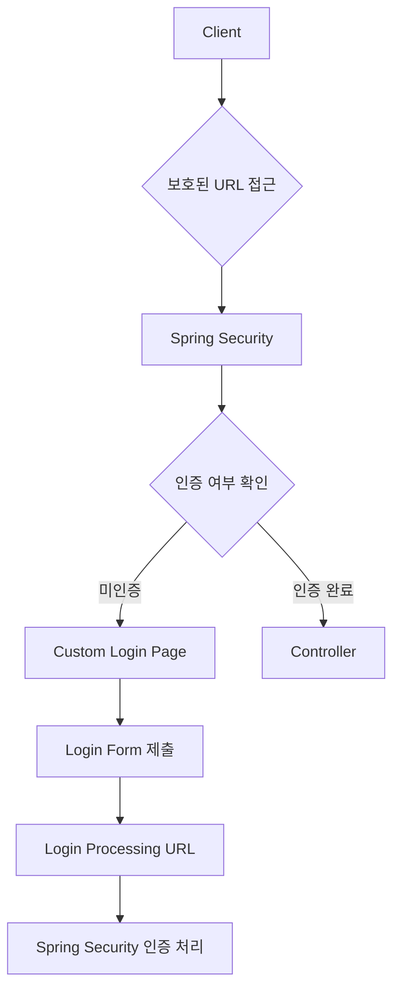
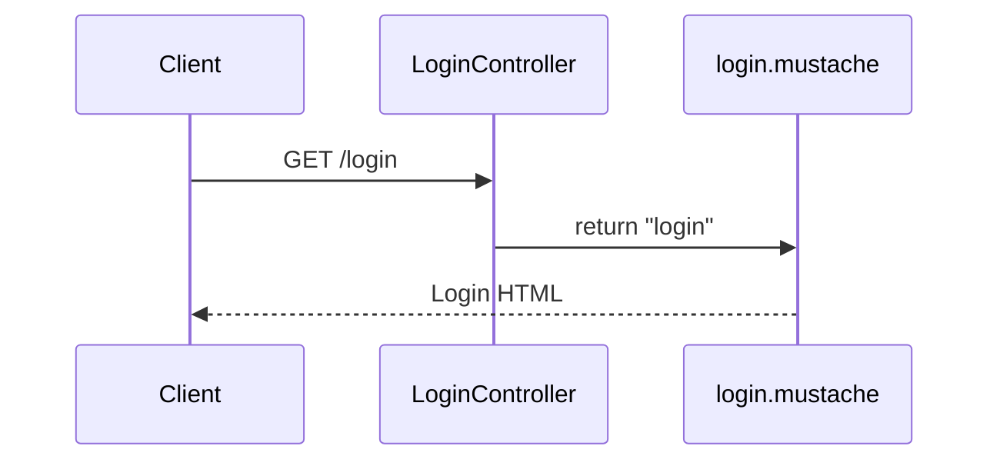
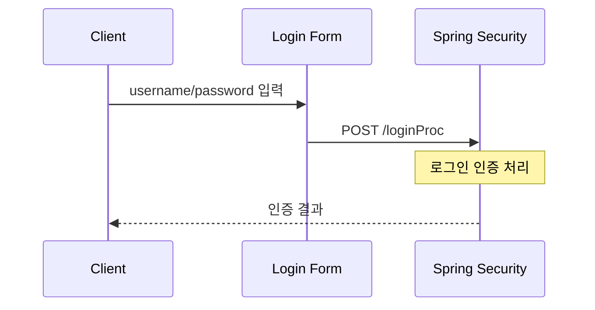
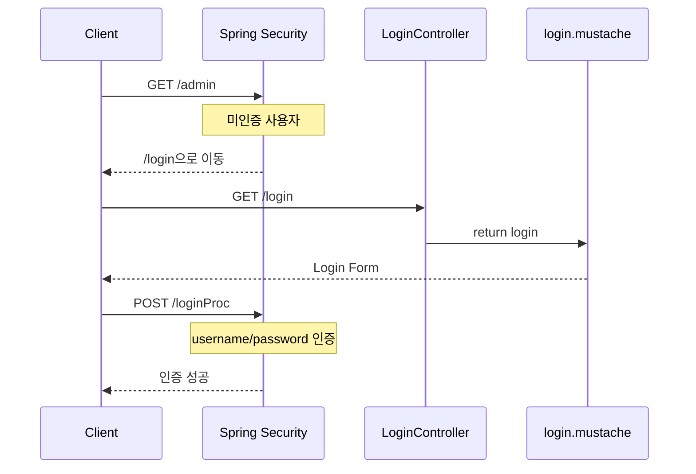
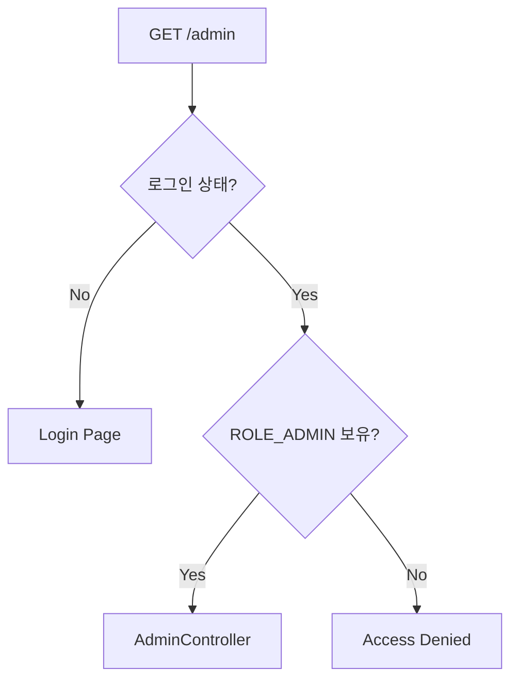
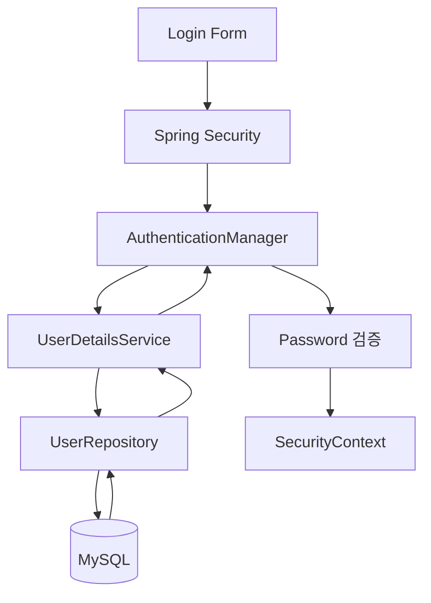

# 스프링 시큐리티 6 - 4 커스텀 로그인 설정
[https://youtu.be/eEkV0zir9mQ?si=ijkiRWi4YKX7y_O7](https://youtu.be/eEkV0zir9mQ?si=ijkiRWi4YKX7y_O7)

# 스프링 시큐리티 6 - 4 커스텀 로그인 설정
* toc
{:toc}

---

## Spring Security 커스텀 로그인 페이지와 formLogin 설정

Spring Security를 처음 프로젝트에 추가하면 별도의 로그인 화면을 직접 구현하지 않아도 기본 로그인 페이지가 제공된다.

하지만 `SecurityConfig`를 직접 만들고 경로별 인가 정책을 구성하기 시작하면 로그인 화면의 경로, 로그인 요청을 처리할 URL 등도 애플리케이션 요구사항에 맞게 직접 설정할 수 있다.

예를 들어 다음과 같은 인가 정책이 있다고 가정하자.

```java
http
        .authorizeHttpRequests(auth -> auth
                .requestMatchers("/")
                .permitAll()

                .requestMatchers("/admin/**")
                .hasRole("ADMIN")

                .anyRequest()
                .authenticated()
        );
```

메인 페이지 `/`는 누구나 접근할 수 있지만 `/admin/**`은 `ADMIN` 권한이 있는 사용자만 접근할 수 있다.

그런데 인증되지 않은 사용자가 보호된 경로에 접근했을 때 어떤 로그인 화면으로 이동시킬지 설정하지 않았다면 우리가 원하는 로그인 흐름을 만들 수 없다.

이때 사용하는 Spring Security 설정이 `formLogin()`이다.

전체적인 구조는 다음과 같다.



핵심은 로그인 화면을 보여주는 URL과 실제 로그인 인증 요청을 처리하는 URL을 구분해서 이해하는 것이다.

---

## 커스텀 로그인이 필요한 이유

Spring Security 기본 설정에서는 기본 로그인 페이지를 제공한다.

하지만 실제 서비스에서는 다음과 같은 요구사항이 생긴다.

```text
서비스 디자인에 맞는 로그인 화면

자체 로그인 URL

로그인 Form의 Action URL

로그인 성공 이후 이동 정책

로그인 실패 처리

회원가입 페이지와의 연결
```

따라서 기본 로그인 화면 대신 애플리케이션에서 직접 만든 로그인 화면을 사용하게 된다.

구조는 다음처럼 변경된다.

```text
Spring Security 기본 로그인

        ↓

Custom Login Page

        ↓

애플리케이션에서 만든 HTML

        ↓

Spring Security가 로그인 인증 처리
```

중요한 점은 **로그인 화면을 직접 만든다고 해서 인증 로직까지 Controller에서 직접 구현해야 하는 것은 아니라는 것**이다.

로그인 화면은 직접 만들되 로그인 요청 자체는 Spring Security가 처리하도록 만들 수 있다.

---

## 로그인 페이지 생성

먼저 로그인 화면을 만든다.

Mustache를 사용한다고 가정하면 다음 위치에 파일을 생성할 수 있다.

```text
src/main/resources/templates/login.mustache
```

프로젝트 구조는 다음과 같다.

```text
src
└── main
    ├── java
    │   └── com.example.security
    │       ├── config
    │       │   └── SecurityConfig.java
    │       │
    │       └── controller
    │           └── LoginController.java
    │
    └── resources
        └── templates
            └── login.mustache
```

간단한 로그인 Form을 작성해보자.

```html
<!DOCTYPE html>
<html lang="ko">
<head>
    <meta charset="UTF-8">
    <title>Login</title>
</head>
<body>

<h1>Login</h1>

<form action="/loginProc" method="post">

    <div>
        <label for="username">아이디</label>
        <input
                id="username"
                type="text"
                name="username"
        >
    </div>

    <div>
        <label for="password">비밀번호</label>
        <input
                id="password"
                type="password"
                name="password"
        >
    </div>

    <button type="submit">
        로그인
    </button>

</form>

</body>
</html>
```

이 Form의 핵심 부분은 다음이다.

```html
<form action="/loginProc" method="post">
```

사용자가 로그인 버튼을 누르면 다음 요청이 발생한다.

```text
POST /loginProc
```

그리고 다음 값들이 함께 전달된다.

```text
username
password
```

전체 흐름은 다음과 같다.

```text
login.mustache

username 입력
password 입력

       ↓

로그인 버튼

       ↓

POST /loginProc
```

---

## 로그인 화면과 로그인 처리 URL은 다르다

Spring Security Form Login을 이해할 때 가장 중요한 부분이다.

다음 두 URL은 역할이 다르다.

```text
/login
/loginProc
```

`/login`은 로그인 화면을 보여주는 URL이다.

```text
GET /login
        ↓
LoginController
        ↓
login.mustache
```

반면 `/loginProc`은 사용자가 입력한 로그인 정보를 Spring Security에 전달하는 URL이다.

```text
POST /loginProc
        ↓
Spring Security
        ↓
Authentication
```

즉 다음처럼 구분해야 한다.

| URL               | 역할        |
| ----------------- | --------- |
| `GET /login`      | 로그인 화면 출력 |
| `POST /loginProc` | 로그인 인증 처리 |

두 URL을 하나의 Controller가 모두 처리해야 하는 것은 아니다.

특히 `POST /loginProc`은 Spring Security가 처리하도록 만들 수 있다.

---

## LoginController 작성

먼저 `/login` 요청에서 로그인 페이지를 반환할 Controller를 작성한다.

```java
package com.example.security.controller;

import org.springframework.stereotype.Controller;
import org.springframework.web.bind.annotation.GetMapping;

@Controller
public class LoginController {

    @GetMapping("/login")
    public String login() {

        return "login";
    }
}
```

클라이언트가 다음 요청을 보내면:

```text
GET /login
```

Controller는 다음 View 이름을 반환한다.

```text
login
```

그리고 다음 파일이 렌더링된다.

```text
templates/login.mustache
```

전체 흐름은 다음과 같다.



---

## 로그인 페이지 확인

애플리케이션을 실행한 뒤 다음 주소로 접근한다.

```text
http://localhost:8080/login
```

설정이 정상적으로 되어 있다면 직접 작성한 `login.mustache`가 표시된다.

현재 단계에서는 아직 로그인 인증보다 **커스텀 로그인 페이지 자체가 정상적으로 노출되는지** 먼저 확인하면 된다.

```text
GET /login

    ↓

LoginController

    ↓

login.mustache
```

---

## 보호된 페이지 접근 시 로그인 화면으로 이동시키기

로그인 페이지를 만들었다고 해서 Spring Security가 자동으로 그 페이지를 사용한다고 가정하면 안 된다.

어떤 페이지를 로그인 화면으로 사용할 것인지 Security 설정에 알려줘야 한다.

이때 `formLogin()`을 사용한다.

기본 형태는 다음과 같다.

```java
http
        .formLogin(form -> form

        );
```

그리고 로그인 페이지를 지정한다.

```java
http
        .formLogin(form -> form
                .loginPage("/login")
        );
```

이제 인증이 필요한 페이지에 미인증 사용자가 접근할 경우 `/login`을 로그인 페이지로 사용할 수 있다.

전체 흐름은 다음과 같다.

```mermaid
flowchart TD
    C[Client] --> A[GET /admin]

    A --> S[Spring Security]

    S --> Q{로그인 상태인가?}

    Q -->|No| L[/login으로 이동]
    Q -->|Yes| R{권한 확인}

    R -->|허용| CT[AdminController]
    R -->|거부| X[Access Denied]
```

---

## loginPage()의 역할

다음 설정을 살펴보자.

```java
.formLogin(form -> form
        .loginPage("/login")
)
```

`loginPage()`는 Spring Security에 다음 사실을 알려주는 역할을 한다.

```text
"인증이 필요한 사용자에게
이 URL을 로그인 화면으로 사용해라."
```

즉:

```text
보호된 URL 접근

        ↓

미인증 상태

        ↓

Spring Security

        ↓

/login
```

흐름을 구성할 수 있다.

이 `/login` 요청은 앞에서 만든 `LoginController`가 처리한다.

```java
@GetMapping("/login")
public String login() {
    return "login";
}
```

---

## loginProcessingUrl()이 중요한 이유

로그인 페이지를 보여주는 것만으로는 인증이 완료되지 않는다.

사용자가 입력한:

```text
username
password
```

를 Spring Security에 전달해야 한다.

HTML Form에서는 다음 주소로 요청을 보낸다.

```html
<form
        action="/loginProc"
        method="post"
>
```

따라서 SecurityConfig에도 해당 URL을 알려준다.

```java
.formLogin(form -> form
        .loginPage("/login")
        .loginProcessingUrl("/loginProc")
)
```

이렇게 설정하면:

```text
POST /loginProc
```

요청을 Spring Security가 로그인 인증 요청으로 처리한다.

---

## loginProcessingUrl은 Controller를 만드는 것이 아니다

여기에서 많이 혼동하는 부분이 있다.

다음 설정을 했다고 하자.

```java
.loginProcessingUrl("/loginProc")
```

그렇다고 다음 Controller를 반드시 만들어야 하는 것은 아니다.

```java
@PostMapping("/loginProc")
public String loginProc(...) {

}
```

현재 구조에서는 `/loginProc` 요청을 Spring Security가 처리한다.

즉:

```text
POST /loginProc

      ↓

LoginController
```

가 아니라:

```text
POST /loginProc

      ↓

Spring Security Filter

      ↓

Authentication 처리
```

라고 이해해야 한다.

전체 구조는 다음과 같다.



---

## loginPage와 loginProcessingUrl 관계

두 설정을 함께 보면 이해하기 쉽다.

```java
.formLogin(form -> form
        .loginPage("/login")
        .loginProcessingUrl("/loginProc")
)
```

역할은 다음과 같다.

```text
/login

GET
→ 로그인 화면
```

```text
/loginProc

POST
→ 로그인 인증 처리
```

따라서 HTML Form은 반드시 Security 설정과 일치해야 한다.

SecurityConfig:

```java
.loginProcessingUrl("/loginProc")
```

HTML:

```html
<form action="/loginProc" method="post">
```

둘의 URL이 다르면 우리가 의도한 로그인 요청 처리가 이루어지지 않는다.

---

## permitAll() 설정

로그인 페이지는 로그인하지 않은 사용자도 접근할 수 있어야 한다.

만약 로그인 화면 자체에 인증이 필요하다면 문제가 발생한다.

```text
미인증 사용자

   ↓

보호된 페이지 요청

   ↓

로그인 필요

   ↓

/login 접근

   ↓

/login도 로그인 필요

   ↓

정상적인 로그인 불가능
```

따라서 로그인 관련 경로는 허용해줘야 한다.

Form Login 설정에서 다음과 같이 구성할 수 있다.

```java
.formLogin(form -> form
        .loginPage("/login")
        .loginProcessingUrl("/loginProc")
        .permitAll()
)
```

인가 설정에서도 공개 경로를 명확하게 지정할 수 있다.

```java
.authorizeHttpRequests(auth -> auth
        .requestMatchers(
                "/",
                "/login"
        )
        .permitAll()

        .requestMatchers("/admin/**")
        .hasRole("ADMIN")

        .anyRequest()
        .authenticated()
)
```

핵심은 로그인하기 위해 필요한 경로가 로그인 전에 접근 가능해야 한다는 것이다.

---

## SecurityConfig 전체 코드

현재까지의 설정을 합치면 다음과 같은 구조가 된다.

```java
package com.example.security.config;

import org.springframework.context.annotation.Bean;
import org.springframework.context.annotation.Configuration;
import org.springframework.security.config.annotation.web.builders.HttpSecurity;
import org.springframework.security.web.SecurityFilterChain;

@Configuration
public class SecurityConfig {

    @Bean
    public SecurityFilterChain securityFilterChain(
            HttpSecurity http
    ) throws Exception {

        http
                .authorizeHttpRequests(auth -> auth
                        .requestMatchers(
                                "/",
                                "/login"
                        )
                        .permitAll()

                        .requestMatchers("/admin/**")
                        .hasRole("ADMIN")

                        .anyRequest()
                        .authenticated()
                )

                .formLogin(form -> form
                        .loginPage("/login")
                        .loginProcessingUrl("/loginProc")
                        .permitAll()
                );

        return http.build();
    }
}
```

구조를 정책으로 표현하면 다음과 같다.

```text
/
→ 누구나 접근

/login
→ 누구나 접근

/admin/**
→ ADMIN

나머지 경로
→ 로그인 사용자
```

그리고 인증 요청은:

```text
POST /loginProc
→ Spring Security 처리
```

가 된다.

---

## login.mustache 전체 예제

SecurityConfig와 일치하는 로그인 Form은 다음과 같이 만들 수 있다.

```html
<!DOCTYPE html>
<html lang="ko">
<head>
    <meta charset="UTF-8">
    <title>Login</title>
</head>
<body>

<h1>로그인</h1>

<form action="/loginProc" method="post">

    <div>
        <label for="username">
            아이디
        </label>

        <input
                id="username"
                name="username"
                type="text"
        >
    </div>

    <div>
        <label for="password">
            비밀번호
        </label>

        <input
                id="password"
                name="password"
                type="password"
        >
    </div>

    <button type="submit">
        로그인
    </button>

</form>

</body>
</html>
```

현재 구조에서는 Spring Security가 기본적으로 사용하는 로그인 Parameter에 맞추어 다음 이름을 사용한다.

```text
username
password
```

Form에서 이 값들이:

```text
username=...
password=...
```

형태로 `/loginProc`에 전달된다.

---

## 커스텀 로그인 전체 동작 과정

로그인하지 않은 사용자가 `/admin`에 접근한다고 가정하자.

### 1. 보호된 URL 요청

```text
GET /admin
```

### 2. Spring Security에서 요청 검사

```text
/admin/**
→ ADMIN 필요
```

하지만 현재 사용자는 로그인하지 않았다.

```text
Authentication 없음
```

### 3. 로그인 페이지로 이동

SecurityConfig에는 다음 설정이 있다.

```java
.loginPage("/login")
```

따라서:

```text
GET /login
```

으로 이동한다.

### 4. LoginController 실행

```java
@GetMapping("/login")
public String login() {
    return "login";
}
```

### 5. login.mustache 반환

```text
templates/login.mustache
```

가 브라우저에 표시된다.

### 6. 사용자 정보 입력

```text
username
password
```

### 7. 로그인 Form 제출

```text
POST /loginProc
```

### 8. Spring Security에서 인증

```text
POST /loginProc

       ↓

Spring Security

       ↓

사용자 인증
```

### 9. 인증 성공

사용자의 로그인 상태가 만들어진다.

전체 흐름을 하나로 정리하면 다음과 같다.



---

## CSRF와 로그인 POST 요청

Spring Security에서는 CSRF 보호 기능이 기본적으로 적용되어 있다.

로그인 Form도 다음과 같은 상태 변경 요청을 사용한다.

```text
POST /loginProc
```

CSRF 보호가 활성화된 상태에서는 POST 요청에 필요한 CSRF Token 처리도 고려해야 한다.

현재 기본적인 동작 확인 과정에서는 다음처럼 CSRF 기능을 잠시 비활성화하는 구성을 사용할 수 있다.

```java
http
        .csrf(csrf -> csrf
                .disable()
        );
```

전체 설정은 다음과 같이 만들 수 있다.

```java
@Configuration
public class SecurityConfig {

    @Bean
    public SecurityFilterChain securityFilterChain(
            HttpSecurity http
    ) throws Exception {

        http
                .authorizeHttpRequests(auth -> auth
                        .requestMatchers(
                                "/",
                                "/login"
                        )
                        .permitAll()

                        .requestMatchers("/admin/**")
                        .hasRole("ADMIN")

                        .anyRequest()
                        .authenticated()
                )

                .formLogin(form -> form
                        .loginPage("/login")
                        .loginProcessingUrl("/loginProc")
                        .permitAll()
                )

                .csrf(csrf -> csrf
                        .disable()
                );

        return http.build();
    }
}
```

여기에서는 로그인 흐름 자체를 확인하는 데 집중하기 위해 CSRF 설정을 비활성화한 구조다.

다만 이 설정은 CSRF를 학습하기 전의 임시 구성으로 이해해야 한다.

```text
현재

CSRF Disable
→ 로그인 흐름 확인
```

이후에는:

```text
CSRF Enable
+
CSRF Token 전송
```

구조로 다시 연결할 수 있다.

---

## CSRF를 비활성화하면 무엇이 달라질까?

CSRF가 활성화된 상태에서는 보호 대상 POST 요청에 CSRF Token이 필요할 수 있다.

```text
POST Request

    ↓

CSRF Token 검사

    ↓

정상
→ 요청 처리

누락 또는 잘못됨
→ 요청 거부
```

CSRF를 비활성화하면 해당 검사를 하지 않는다.

```text
POST /loginProc

    ↓

CSRF 검사 비활성화

    ↓

로그인 인증 처리
```

따라서 로그인 Form 자체의 흐름을 간단히 확인하기에는 편리하다.

하지만 이것은:

```text
CSRF는 필요 없다
```

는 의미가 아니다.

이번 구성에서는 로그인 관련 설정의 동작을 먼저 확인하기 위한 임시 상태로 보는 것이 핵심이다.

---

## 기본 사용자로 로그인 테스트

아직 MySQL에 회원 정보를 저장하지 않은 상태라면 실제 회원 계정이 없다.

```text
User Table
→ 아직 없음

회원가입
→ 아직 없음

UserRepository
→ 아직 없음
```

하지만 Spring Boot Security 기본 사용자 기능이 남아 있다면 기본 계정을 이용해 로그인 흐름을 확인할 수 있다.

기본 Username은:

```text
user
```

이다.

Password는 애플리케이션 시작 과정에서 생성되는 값을 사용할 수 있다.

```text
Using generated security password: ...
```

따라서 로그인 Form에는 다음 값을 입력한다.

```text
username
→ user

password
→ 실행 시 생성된 Password
```

그리고:

```text
POST /loginProc
```

요청이 발생하면 Spring Security가 인증을 수행한다.

---

## 로그인 성공과 ADMIN 권한은 별개의 문제

여기에서 매우 중요한 점이 있다.

기본 `user` 계정으로 로그인을 성공했다고 가정하자.

```text
username = user

Authentication
→ 성공
```

그렇다고 다음 경로에 반드시 접근할 수 있는 것은 아니다.

```text
/admin
```

왜냐하면 설정에 다음 조건이 있기 때문이다.

```java
.requestMatchers("/admin/**")
.hasRole("ADMIN")
```

즉 `/admin` 접근에는 두 단계가 필요하다.

```text
1. 로그인

2. ADMIN Role
```

이를 흐름으로 보면 다음과 같다.



따라서:

```text
로그인 성공
≠
ADMIN 접근 성공
```

이다.

이것이 인증과 인가의 차이다.

---

## formLogin 설정의 핵심 메서드

이번 구성에서 중요한 Form Login 설정을 정리하면 다음과 같다.

### loginPage()

```java
.loginPage("/login")
```

의미:

```text
커스텀 로그인 화면 URL
```

---

### loginProcessingUrl()

```java
.loginProcessingUrl("/loginProc")
```

의미:

```text
username/password를 전달받아
Spring Security가 인증을 수행할 URL
```

---

### permitAll()

```java
.permitAll()
```

의미:

```text
로그인 과정에 필요한 경로를
미인증 사용자도 사용할 수 있도록 허용
```

전체적으로:

```java
.formLogin(form -> form
        .loginPage("/login")
        .loginProcessingUrl("/loginProc")
        .permitAll()
)
```

이라고 구성한다.

---

## loginPage와 loginProcessingUrl을 같은 것으로 이해하면 안 된다

두 URL은 매우 비슷해 보이지만 역할은 완전히 다르다.

```text
/login
```

은 페이지다.

```text
GET /login

→ HTML 반환
```

반면:

```text
/loginProc
```

은 인증 처리 Endpoint다.

```text
POST /loginProc

→ Spring Security 인증
```

구조를 한눈에 보면 다음과 같다.


---

## LoginController가 담당하는 것은 화면 반환이다

LoginController의 책임도 구분해야 한다.

```java
@Controller
public class LoginController {

    @GetMapping("/login")
    public String login() {
        return "login";
    }
}
```

이 Controller가 수행하는 것은:

```text
GET /login
→ 로그인 화면 반환
```

이다.

다음 인증 로직을 직접 구현하는 것이 아니다.

```text
비밀번호 비교
사용자 조회
Authentication 생성
Session 등록
```

이러한 인증 흐름은 Spring Security가 처리하도록 구성한다.

따라서 역할을 분리하면 다음과 같다.

```text
LoginController

→ 로그인 화면
```

```text
Spring Security

→ 로그인 인증
```

---

## 로그인 처리를 Controller에서 직접 구현하지 않는 이유

다음과 같이 직접 구현할 수도 있다고 생각할 수 있다.

```java
@PostMapping("/loginProc")
public String login(
        String username,
        String password
) {

    // 사용자 조회
    // 비밀번호 비교
    // Session 생성

    return "redirect:/";
}
```

하지만 Spring Security를 사용하는 목적은 이러한 인증 인프라를 직접 구현하지 않고 Security Framework의 인증 구조를 활용하는 것이다.

```text
username/password

       ↓

Spring Security

       ↓

Authentication 처리

       ↓

SecurityContext

       ↓

로그인 상태 관리
```

이후 실제 DB 회원 인증을 구현하더라도 Controller가 직접 비밀번호를 비교하는 구조보다 Spring Security의 인증 구조에 연결하는 방식으로 발전시키게 된다.

---

## 로그인 성공 이후 구조

로그인이 성공하면 이후 요청에서는 인증 정보를 기반으로 인가 정책을 적용할 수 있다.

예를 들어:

```text
GET /mypage
```

요청이 들어온다.

Security 설정이 다음과 같다면:

```java
.requestMatchers("/mypage/**")
.authenticated()
```

Spring Security는 현재 인증 정보를 확인한다.

```text
Authentication 존재

        ↓

접근 허용

        ↓

MyPageController
```

반면:

```text
GET /admin
```

에서는:

```java
.hasRole("ADMIN")
```

조건까지 검사한다.

---

## Custom Login 전체 구조

현재까지의 구성을 하나로 묶으면 다음과 같다.

```mermaid
flowchart TD
    C[Client] --> S[Spring Security]

    S --> R{요청 경로}

    R -->|Public| P[permitAll]
    P --> CT[Controller]

    R -->|Protected| A{Authenticated?}

    A -->|No| L[/login]
    L --> LC[LoginController]
    LC --> LV[login.mustache]

    LV --> LP[POST /loginProc]
    LP --> SS[Spring Security 인증]

    SS --> AU[Authentication 생성]

    A -->|Yes| Z{Authorization}
    Z -->|허용| CT2[Controller]
    Z -->|거부| X[Access Denied]
```

---

## 프로젝트 구조

현재 단계의 프로젝트 구조를 정리하면 다음과 같다.

```text
src/main
├── java
│   └── com.example.security
│       ├── SecurityApplication.java
│       │
│       ├── config
│       │   └── SecurityConfig.java
│       │
│       └── controller
│           ├── MainController.java
│           ├── AdminController.java
│           └── LoginController.java
│
└── resources
    └── templates
        ├── main.mustache
        ├── admin.mustache
        └── login.mustache
```

역할도 명확하게 구분할 수 있다.

```text
SecurityConfig
→ 인증/인가 정책

LoginController
→ 로그인 View 제공

login.mustache
→ 사용자 입력

Spring Security
→ 로그인 인증 처리
```

---

## 최종 코드 구조

### SecurityConfig

```java
package com.example.security.config;

import org.springframework.context.annotation.Bean;
import org.springframework.context.annotation.Configuration;
import org.springframework.security.config.annotation.web.builders.HttpSecurity;
import org.springframework.security.web.SecurityFilterChain;

@Configuration
public class SecurityConfig {

    @Bean
    public SecurityFilterChain securityFilterChain(
            HttpSecurity http
    ) throws Exception {

        http
                .authorizeHttpRequests(auth -> auth
                        .requestMatchers(
                                "/",
                                "/login"
                        )
                        .permitAll()

                        .requestMatchers("/admin/**")
                        .hasRole("ADMIN")

                        .anyRequest()
                        .authenticated()
                )

                .formLogin(form -> form
                        .loginPage("/login")
                        .loginProcessingUrl("/loginProc")
                        .permitAll()
                )

                .csrf(csrf -> csrf
                        .disable()
                );

        return http.build();
    }
}
```

### LoginController

```java
package com.example.security.controller;

import org.springframework.stereotype.Controller;
import org.springframework.web.bind.annotation.GetMapping;

@Controller
public class LoginController {

    @GetMapping("/login")
    public String login() {

        return "login";
    }
}
```

### login.mustache

```html
<!DOCTYPE html>
<html lang="ko">
<head>
    <meta charset="UTF-8">
    <title>Login</title>
</head>
<body>

<h1>Login</h1>

<form action="/loginProc" method="post">

    <div>
        <input
                name="username"
                type="text"
                placeholder="아이디"
        >
    </div>

    <div>
        <input
                name="password"
                type="password"
                placeholder="비밀번호"
        >
    </div>

    <button type="submit">
        로그인
    </button>

</form>

</body>
</html>
```

이 세 가지가 연결되면 커스텀 Form Login의 기본적인 구조가 완성된다.

---

## 실행 흐름 확인

애플리케이션을 실행한다.

```bash
./gradlew bootRun
```

이 명령은 Spring Boot 애플리케이션을 실행한다.

먼저 공개된 메인 페이지를 확인한다.

```text
http://localhost:8080/
```

설정이 다음과 같기 때문에:

```java
.requestMatchers("/")
.permitAll()
```

로그인하지 않아도 접근할 수 있다.

다음으로 보호된 경로에 접근한다.

```text
http://localhost:8080/admin
```

현재 인증되지 않은 사용자라면 Spring Security가 로그인 화면으로 연결한다.

```text
/admin

  ↓

인증 필요

  ↓

/login
```

그리고 직접 작성한:

```text
login.mustache
```

화면이 나타난다.

---

## 커스텀 로그인 설정에서 자주 혼동하는 부분

### `/login`과 `/loginProc`은 다르다

```text
/login
→ 로그인 화면

/loginProc
→ 로그인 인증 처리
```

### `/loginProc` Controller가 반드시 필요한 것은 아니다

```text
POST /loginProc
→ Spring Security가 처리
```

### 로그인 페이지는 미인증 상태에서 접근 가능해야 한다

```java
.permitAll()
```

설정이 필요하다.

### 로그인 성공과 Role 보유는 다르다

```text
Authentication
≠
Authorization
```

로그인에 성공했다고 ADMIN 경로까지 자동으로 접근 가능한 것은 아니다.

### CSRF를 비활성화한 것은 현재 흐름을 단순하게 확인하기 위한 설정이다

```java
.csrf(csrf -> csrf.disable())
```

이후 CSRF Token을 포함하는 형태로 다시 구성할 수 있다.

---

## 실무에서의 활용

커스텀 로그인에서 가장 중요한 것은 화면 자체보다 각 컴포넌트의 책임을 정확하게 나누는 것이다.

잘못 이해하면 모든 로직이 LoginController에 몰리기 쉽다.

```text
LoginController

회원 조회
비밀번호 비교
Session 생성
권한 생성
Redirect
```

하지만 Spring Security를 사용한다면 다음처럼 분리하는 구조로 발전시킬 수 있다.

```text
LoginController
→ 로그인 화면 제공

SecurityFilterChain
→ 로그인 URL 및 접근 정책

Spring Security
→ Authentication

사용자 조회 로직
→ 회원 정보 제공

PasswordEncoder
→ 비밀번호 검증

SecurityContext
→ 인증 정보 관리
```

즉 Controller는 단순해지고 인증이라는 공통 관심사를 Spring Security가 담당한다.

현재는 기본 사용자를 이용해 로그인 흐름만 확인하지만 이후 DB 기반 인증을 추가하면 다음 구조로 확장할 수 있다.



따라서 이번 커스텀 로그인 구성은 이후 실제 회원 인증을 구현하기 위한 기반이라고 볼 수 있다.

---

## 정리

Spring Security의 기본 로그인 페이지 대신 직접 만든 화면을 사용하려면 먼저 로그인 View를 만든다.

```text
templates/login.mustache
```

그리고 로그인 화면을 반환하는 Controller를 구성한다.

```java
@GetMapping("/login")
public String login() {
    return "login";
}
```

SecurityConfig에서는 `formLogin()`을 통해 로그인 관련 설정을 작성한다.

```java
.formLogin(form -> form
        .loginPage("/login")
        .loginProcessingUrl("/loginProc")
        .permitAll()
)
```

각 설정의 역할은 다음과 같다.

```text
loginPage("/login")
→ 로그인 페이지 경로

loginProcessingUrl("/loginProc")
→ 로그인 인증 요청 처리 경로

permitAll()
→ 미인증 사용자도 로그인 가능
```

HTML Form에서는 SecurityConfig와 동일한 Processing URL로 요청을 보낸다.

```html
<form
        action="/loginProc"
        method="post"
>
```

사용자가 입력한:

```text
username
password
```

는 다음 흐름으로 전달된다.

```text
Login Form

    ↓

POST /loginProc

    ↓

Spring Security

    ↓

Authentication
```

보호된 경로에 로그인하지 않은 사용자가 접근하면:

```text
GET /admin

    ↓

Spring Security

    ↓

미인증

    ↓

GET /login

    ↓

Custom Login Page
```

형태로 동작하게 된다.

현재 단계에서는 로그인 Form의 POST 요청을 간단하게 확인하기 위해 CSRF를 비활성화할 수 있다.

```java
.csrf(csrf -> csrf.disable())
```

다만 이는 로그인 흐름을 우선 확인하기 위한 임시 구성으로 보고 이후 CSRF를 다시 적용하는 구조로 발전시켜야 한다.

결국 커스텀 로그인에서 기억해야 할 핵심 흐름은 다음과 같다.

```text
보호된 URL 접근
        ↓
미인증 확인
        ↓
/login 이동
        ↓
Login Form 입력
        ↓
POST /loginProc
        ↓
Spring Security 인증
        ↓
Authentication 생성
        ↓
이후 요청에서 인증/인가 처리
```

### 한 줄 요약

Spring Security 커스텀 로그인은 `loginPage()`로 직접 만든 로그인 화면을 지정하고 `loginProcessingUrl()`로 Form의 인증 요청을 Spring Security에 연결하는 구조이며, 로그인 Controller는 화면을 제공하고 실제 username/password 인증은 Security Filter가 처리하도록 역할을 분리하는 것이 핵심이다.
