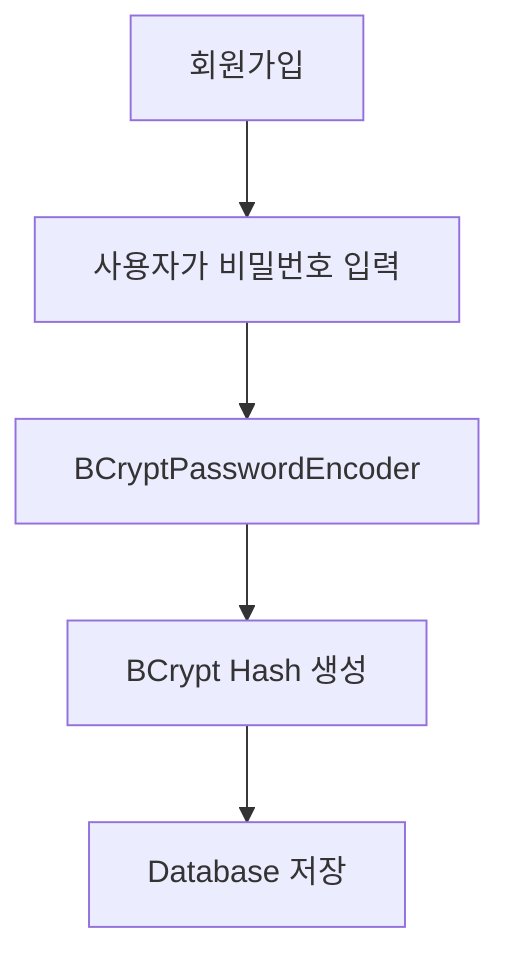
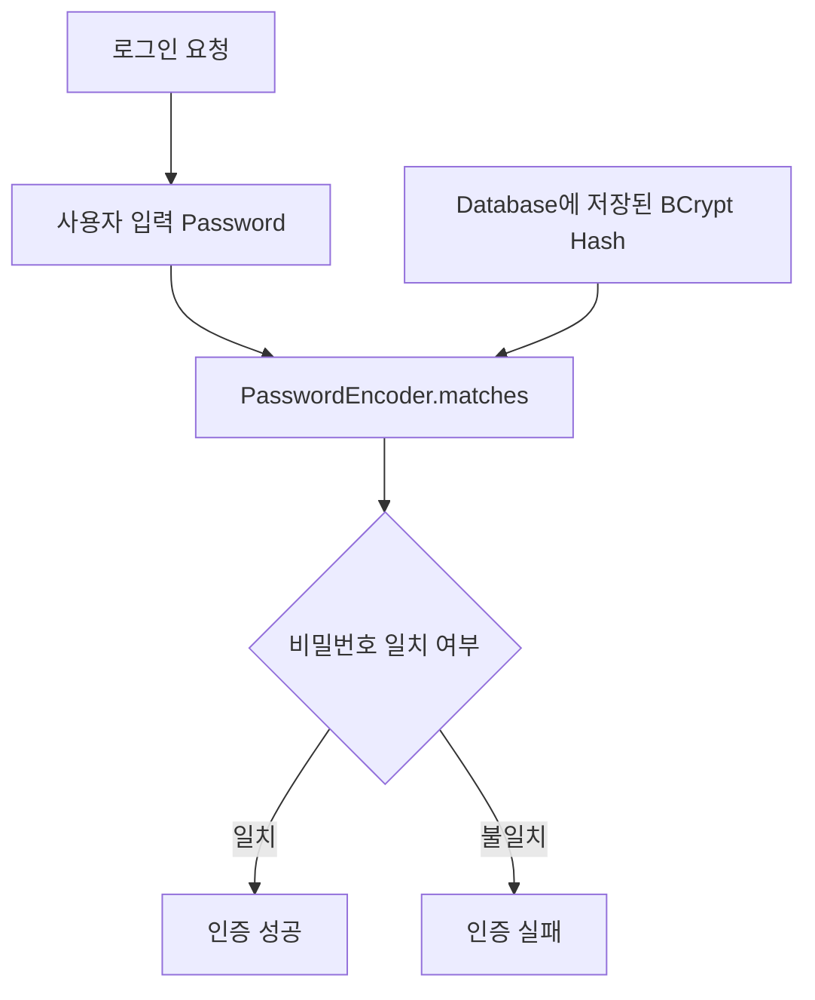
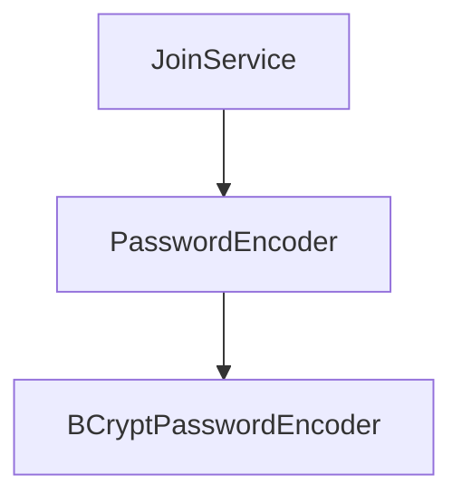
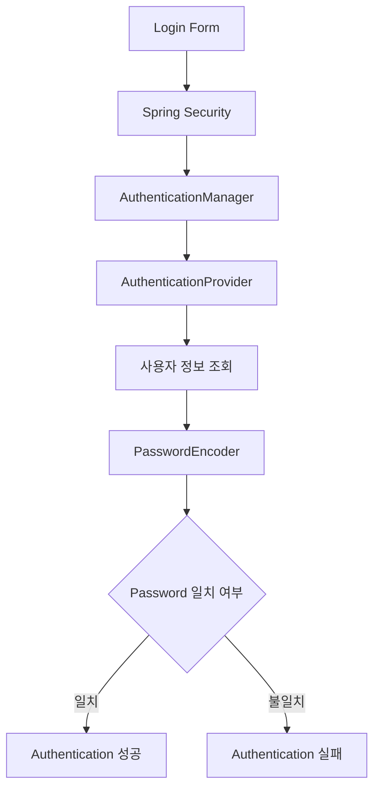
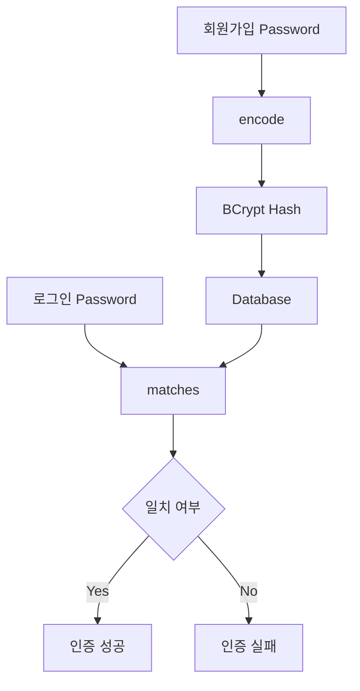
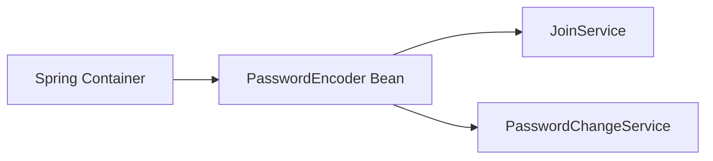
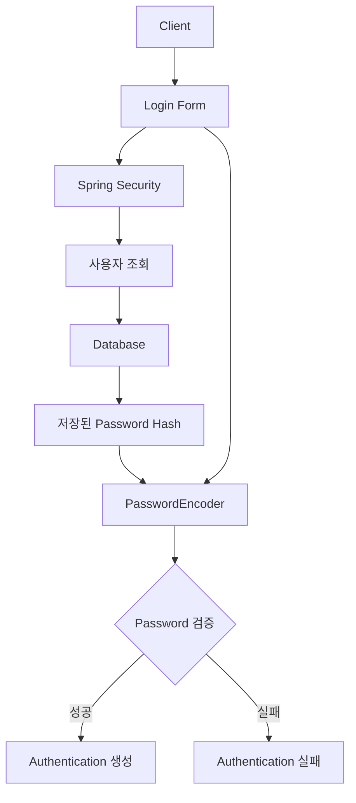

# 스프링 시큐리티 6 - 5 BCrypt 암호화 메소드
[https://youtu.be/B03OoUVgVIA?si=PhBT6LlBtmrKIop4](https://youtu.be/B03OoUVgVIA?si=PhBT6LlBtmrKIop4)

# 스프링 시큐리티 6 - 5 BCrypt 암호화 메소드
* toc
{:toc}

---

## Spring Security BCryptPasswordEncoder와 비밀번호 단방향 해시

회원가입과 로그인을 구현할 때 가장 중요하게 다뤄야 하는 데이터 중 하나가 비밀번호다.

사용자가 회원가입 과정에서 다음과 같은 비밀번호를 입력했다고 가정해보자.

```text
password1234
```

이 값을 그대로 데이터베이스에 저장하는 것은 매우 위험하다.

```text
users

username = yunsik
password = password1234
```

데이터베이스가 유출된다면 사용자의 실제 비밀번호가 그대로 노출되기 때문이다.

따라서 비밀번호는 원문을 그대로 저장하지 않고 **원래 값을 복원하기 어려운 단방향 해시 방식으로 변환하여 저장해야 한다.**

Spring Security에서는 이를 위해 `PasswordEncoder`라는 인터페이스를 제공하며, 대표적인 구현체 중 하나가 `BCryptPasswordEncoder`다.

전체적인 구조는 다음과 같다.



로그인할 때도 사용자가 입력한 비밀번호와 데이터베이스에 저장된 문자열을 단순 문자열 비교하지 않는다.

```text
사용자가 입력한 비밀번호
        ↓
PasswordEncoder
        ↓
저장된 BCrypt Hash와 검증
        ↓
일치 여부 판단
```

이번에는 Spring Security에서 BCrypt를 사용하는 이유와 `BCryptPasswordEncoder`를 Bean으로 등록하는 방법을 살펴본다.

---

## 비밀번호를 평문으로 저장하면 안 되는 이유

가장 단순한 회원 테이블을 생각해보자.

| id | username | password |
| -: | -------- | -------- |
|  1 | user1    | 1234     |
|  2 | user2    | hello123 |
|  3 | admin    | admin123 |

이처럼 비밀번호를 사용자가 입력한 문자열 그대로 저장하는 것을 **평문 저장**이라고 한다.

애플리케이션 입장에서는 구현하기 쉽다.

로그인 시:

```text
입력 Password
        ↓
Database Password 조회
        ↓
문자열 비교
```

하면 되기 때문이다.

예를 들면 다음과 같다.

```java
if (inputPassword.equals(user.getPassword())) {
    // 로그인 성공
}
```

하지만 보안 측면에서는 매우 위험한 구조다.

데이터베이스의 회원 정보가 노출되면:

```text
username
password
```

가 동시에 노출된다.

특히 사용자는 여러 서비스에서 동일하거나 비슷한 비밀번호를 사용하는 경우가 있기 때문에 하나의 서비스에서 비밀번호가 유출되면 다른 서비스 계정까지 영향을 받을 수 있다.

따라서 서비스는 사용자의 실제 비밀번호를 그대로 보관하지 않는 것이 중요하다.

---

## 암호화와 해시는 구분해서 이해해야 한다

비밀번호 처리에서 흔히 "비밀번호를 암호화한다"라고 표현하지만 조금 더 정확하게는 **비밀번호를 단방향 해시한다**고 표현하는 것이 좋다.

암호학적 처리를 크게 단순화하면 다음처럼 구분할 수 있다.

```text
양방향 암호화
→ 암호화
→ 복호화 가능
```

반면:

```text
단방향 해시
→ Hash 생성
→ 원문 복원이 목적이 아님
```

예를 들어 양방향 암호화는 다음과 같은 구조다.

```text
Plain Text

    ↓ Encryption

Cipher Text

    ↓ Decryption

Plain Text
```

반면 비밀번호 저장에서는 다음과 같은 방향이 필요하다.

```text
Password

    ↓ Hash

Hash Value
```

원래 Password를 다시 복구해서 로그인하는 방식이 아니다.

로그인 시에는 사용자가 다시 입력한 Password가 저장된 Hash에 대응하는지 검증한다.

---

## 비밀번호는 왜 복호화하지 않을까?

예를 들어 회원가입 당시 사용자가 다음 비밀번호를 입력했다고 하자.

```text
myPassword123!
```

애플리케이션에서는 이를 BCrypt로 처리한다.

```text
myPassword123!

        ↓

BCrypt

        ↓

$2a$10$...
```

데이터베이스에는 다음과 같이 Hash 결과만 저장한다.

```text
username = yunsik
password = $2a$10$...
```

로그인할 때 데이터베이스에서 이 값을 가져와 다시 원래 비밀번호로 복호화하는 것이 아니다.

```text
$2a$10$...
     ↓
복호화
     ↓
myPassword123!
```

와 같은 작업을 하지 않는다.

대신 다음과 같이 검증한다.

```text
사용자 입력 Password

        ↓

BCrypt 검증

        ↕ 비교

저장되어 있는 BCrypt Hash

        ↓

일치 여부
```

Spring Security에서는 이러한 비교를 `PasswordEncoder.matches()`를 통해 수행할 수 있다.

---

## 단순 SHA 계열 해시와 비밀번호 해시는 목적이 다르다

해시 함수라고 하면 SHA-256이나 SHA-512를 떠올릴 수 있다.

예를 들어:

```text
password
    ↓
SHA-256
    ↓
Hash
```

와 같은 구조다.

하지만 비밀번호 저장에서는 빠른 일반-purpose 해시 함수만 사용하는 것보다 **비밀번호 저장을 목적으로 설계된 알고리즘**을 사용하는 것이 중요하다.

BCrypt는 비밀번호 저장을 위해 널리 사용되는 Password Hashing 방식 중 하나다.

BCrypt가 비밀번호 저장에 적합한 이유 중 하나는 계산 비용을 조절할 수 있다는 점이다.

```text
Password
   ↓
BCrypt
   ↓
Cost가 적용된 Hash 연산
   ↓
Hash
```

공격자가 대량의 비밀번호 후보를 빠르게 대입하기 어렵도록 의도적으로 계산 비용을 부여한다.

---

## BCrypt란?

BCrypt는 Password를 안전하게 저장하기 위해 사용할 수 있는 단방향 Password Hashing 알고리즘이다.

Spring Security에서는 이를 편리하게 사용할 수 있도록 다음 클래스를 제공한다.

```java
BCryptPasswordEncoder
```

기본 사용법은 매우 단순하다.

```java
BCryptPasswordEncoder encoder =
        new BCryptPasswordEncoder();
```

Password를 Hash하려면:

```java
String encodedPassword =
        encoder.encode("password1234");
```

형태로 사용할 수 있다.

결과는 다음과 같은 형태다.

```text
$2a$10$...
```

실제 결과는 실행할 때마다 달라질 수 있다.

이 점이 BCrypt에서 매우 중요한 특징이다.

---

## 같은 비밀번호인데 결과가 달라질 수 있다

다음 코드를 실행한다고 해보자.

```java
BCryptPasswordEncoder encoder =
        new BCryptPasswordEncoder();

String password1 =
        encoder.encode("1234");

String password2 =
        encoder.encode("1234");
```

입력은 동일하다.

```text
1234
1234
```

하지만 생성되는 Hash는 서로 다를 수 있다.

```text
$2a$10$A...
$2a$10$B...
```

처음 BCrypt를 사용하면 다음과 같은 의문이 생긴다.

```text
Hash 결과가 다른데
로그인할 때 어떻게 비교하지?
```

그래서 BCrypt Hash를 단순 문자열 비교하면 안 된다.

```java
encodedPassword.equals(
        storedPassword
);
```

이런 방식으로 검증하지 않는다.

대신 `matches()`를 사용한다.

---

## matches()를 이용한 비밀번호 검증

Spring Security의 `PasswordEncoder`는 대표적으로 다음 두 가지 작업을 제공한다.

```text
encode()
matches()
```

### encode()

비밀번호를 Hash한다.

```java
String encoded =
        passwordEncoder.encode(
                rawPassword
        );
```

### matches()

사용자가 입력한 원문 Password와 저장된 Password Hash가 일치하는지 검증한다.

```java
boolean result =
        passwordEncoder.matches(
                rawPassword,
                encodedPassword
        );
```

예를 들어:

```java
String rawPassword =
        "password1234";

String encodedPassword =
        passwordEncoder.encode(
                rawPassword
        );

boolean result =
        passwordEncoder.matches(
                "password1234",
                encodedPassword
        );
```

올바른 비밀번호라면:

```text
true
```

가 된다.

---

## 회원가입과 로그인에서 BCrypt의 역할

BCrypt의 역할은 회원가입과 로그인에서 각각 다르게 보인다.

### 회원가입

사용자가 Password를 입력한다.

```text
password1234
```

이를 바로 저장하지 않고 `encode()` 한다.

```java
String encodedPassword =
        passwordEncoder.encode(
                request.getPassword()
        );
```

그리고 결과를 데이터베이스에 저장한다.

```text
password1234

      ↓

encode()

      ↓

$2a$10$...

      ↓

Database
```

---

## 로그인

사용자가 로그인 화면에서 다시 Password를 입력한다.

```text
password1234
```

Database에는 이미 BCrypt Hash가 저장되어 있다.

```text
$2a$10$...
```

두 값을 다음과 같이 검증한다.

```java
passwordEncoder.matches(
        inputPassword,
        storedPassword
);
```

전체 흐름은 다음과 같다.



---

## BCryptPasswordEncoder를 Bean으로 등록하기

Spring Security 애플리케이션에서는 `BCryptPasswordEncoder`를 매번 직접 생성하기보다 Spring Bean으로 등록하여 사용하는 방식이 편리하다.

Security 설정 클래스에 다음 Bean을 등록할 수 있다.

```java
@Configuration
public class SecurityConfig {

    @Bean
    public BCryptPasswordEncoder bCryptPasswordEncoder() {

        return new BCryptPasswordEncoder();
    }
}
```

필요한 Import는 다음과 같다.

```java
import org.springframework.context.annotation.Bean;
import org.springframework.context.annotation.Configuration;
import org.springframework.security.crypto.bcrypt.BCryptPasswordEncoder;
```

Spring Container에는 다음 Bean이 등록된다.

```text
BCryptPasswordEncoder
```

이제 회원가입 Service 등에서 이를 주입받아 사용할 수 있다.

---

## PasswordEncoder 타입으로 등록하기

조금 더 추상화하면 구현 클래스 자체보다 `PasswordEncoder` 인터페이스 타입으로 Bean을 등록할 수도 있다.

```java
@Bean
public PasswordEncoder passwordEncoder() {

    return new BCryptPasswordEncoder();
}
```

필요한 Import는 다음과 같다.

```java
import org.springframework.security.crypto.bcrypt.BCryptPasswordEncoder;
import org.springframework.security.crypto.password.PasswordEncoder;
```

이 방식의 구조는 다음과 같다.

```text
PasswordEncoder
        ↑
        │ 구현
        │
BCryptPasswordEncoder
```

Service는 구체적인 BCrypt 구현체보다 `PasswordEncoder` 인터페이스에 의존할 수 있다.

```java
@Service
@RequiredArgsConstructor
public class JoinService {

    private final PasswordEncoder passwordEncoder;
}
```

구조적으로 다음과 같다.



실제 애플리케이션에서는 이렇게 인터페이스 타입으로 의존하는 방식도 많이 사용된다.

---

## SecurityConfig에 PasswordEncoder 추가하기

앞에서 작성한 Security 설정이 다음과 같다고 가정하자.

```java
@Configuration
public class SecurityConfig {

    @Bean
    public SecurityFilterChain securityFilterChain(
            HttpSecurity http
    ) throws Exception {

        http
                .authorizeHttpRequests(auth -> auth
                        .requestMatchers(
                                "/",
                                "/login"
                        )
                        .permitAll()

                        .requestMatchers("/admin/**")
                        .hasRole("ADMIN")

                        .anyRequest()
                        .authenticated()
                )

                .formLogin(form -> form
                        .loginPage("/login")
                        .loginProcessingUrl("/loginProc")
                        .permitAll()
                );

        return http.build();
    }
}
```

여기에 PasswordEncoder Bean을 추가할 수 있다.

```java
@Configuration
public class SecurityConfig {

    @Bean
    public SecurityFilterChain securityFilterChain(
            HttpSecurity http
    ) throws Exception {

        http
                .authorizeHttpRequests(auth -> auth
                        .requestMatchers(
                                "/",
                                "/login"
                        )
                        .permitAll()

                        .requestMatchers("/admin/**")
                        .hasRole("ADMIN")

                        .anyRequest()
                        .authenticated()
                )

                .formLogin(form -> form
                        .loginPage("/login")
                        .loginProcessingUrl("/loginProc")
                        .permitAll()
                );

        return http.build();
    }

    @Bean
    public PasswordEncoder passwordEncoder() {

        return new BCryptPasswordEncoder();
    }
}
```

이제 Spring Container에는 크게 두 종류의 Security 관련 Bean이 존재한다.

```text
SecurityFilterChain
→ HTTP Security 정책

PasswordEncoder
→ 비밀번호 Hash 및 검증
```

역할이 완전히 다르다는 점이 중요하다.

---

## SecurityFilterChain과 PasswordEncoder의 역할 차이

`SecurityFilterChain`은 HTTP 요청의 보안 정책을 설정한다.

```text
GET /admin

   ↓

ADMIN 권한 확인
```

반면 `PasswordEncoder`는 사용자의 Password 처리에 사용된다.

```text
Password

   ↓

Hash / 검증
```

비교하면 다음과 같다.

| Bean                  | 역할            |
| --------------------- | ------------- |
| `SecurityFilterChain` | HTTP 인증·인가 정책 |
| `PasswordEncoder`     | 비밀번호 Hash와 검증 |

따라서 `PasswordEncoder`를 Bean으로 등록한다고 로그인 자체가 자동 완성되는 것은 아니다.

회원 정보를 어떻게 조회할 것인지 등의 인증 구조는 별도로 구성해야 한다.

---

## 회원가입에서 PasswordEncoder 사용하기

이후 회원가입 기능을 만든다고 가정하자.

사용자가 다음 요청을 보낸다.

```text
username = user1
password = 1234
```

DTO를 다음과 같이 만들 수 있다.

```java
public class JoinDto {

    private String username;

    private String password;
}
```

Service에서는 Password를 그대로 Entity에 넣지 않는다.

잘못된 예:

```java
user.setPassword(
        joinDto.getPassword()
);
```

이렇게 하면 평문 Password가 저장된다.

올바른 방향은 먼저 PasswordEncoder를 사용한다.

```java
String encodedPassword =
        passwordEncoder.encode(
                joinDto.getPassword()
        );

user.setPassword(
        encodedPassword
);
```

전체 흐름은 다음과 같다.

```text
JoinDto

password = 1234

      ↓

PasswordEncoder.encode()

      ↓

$2a$10$...

      ↓

User Entity

      ↓

Database
```

---

## 회원가입 Service 예제

예를 들어 다음과 같이 작성할 수 있다.

```java
@Service
@RequiredArgsConstructor
public class JoinService {

    private final UserRepository userRepository;
    private final PasswordEncoder passwordEncoder;

    public void join(JoinDto joinDto) {

        User user = new User();

        user.setUsername(
                joinDto.getUsername()
        );

        user.setPassword(
                passwordEncoder.encode(
                        joinDto.getPassword()
                )
        );

        userRepository.save(user);
    }
}
```

이 코드의 핵심은 다음이다.

```java
passwordEncoder.encode(
        joinDto.getPassword()
)
```

사용자가 입력한 Password가 데이터베이스에 도달하기 전에 BCrypt Hash로 변환된다.

---

## 로그인 시에는 encode()를 다시 호출해서 비교하지 않는다

이 부분은 BCrypt를 처음 사용할 때 특히 자주 혼동한다.

로그인 Password가 다음이라고 하자.

```text
1234
```

데이터베이스에는 다음 BCrypt Hash가 있다.

```text
$2a$10$...
```

다음처럼 로그인 Password를 다시 `encode()`한 뒤 문자열로 비교해서는 안 된다.

```java
String loginHash =
        passwordEncoder.encode(
                loginPassword
        );

boolean result =
        loginHash.equals(
                storedPassword
        );
```

BCrypt는 동일한 Password라 하더라도 서로 다른 Hash가 생성될 수 있기 때문이다.

대신 다음처럼 사용한다.

```java
boolean result =
        passwordEncoder.matches(
                loginPassword,
                storedPassword
        );
```

즉:

```text
encode()
→ 저장할 때

matches()
→ 검증할 때
```

라고 기억하면 쉽다.

---

## Salt란 무엇인가?

BCrypt를 이해하려면 Salt 개념도 알아두면 좋다.

단순하게 동일한 입력에 항상 동일한 Hash가 생성된다고 생각해보자.

```text
1234
→ ABC123

1234
→ ABC123

1234
→ ABC123
```

그러면 공격자는 동일한 Password를 사용하는 계정을 쉽게 추측하거나 미리 계산된 Hash 목록을 활용할 가능성이 커진다.

Salt는 Password Hash 과정에 추가되는 임의의 값으로 생각할 수 있다.

```text
Password
   +
Salt
   ↓
Hash
```

따라서 같은 Password라도 서로 다른 결과를 만들 수 있다.

```text
1234 + Salt A
→ Hash A

1234 + Salt B
→ Hash B
```

BCrypt는 이러한 Salt를 Hash 생성 과정에 포함한다.

그래서 동일한 원문 Password를 여러 번 `encode()`해도 결과가 달라질 수 있다.

---

## BCrypt 결과를 보면 무엇이 들어 있을까?

BCrypt 결과는 보통 다음과 유사한 형태로 보인다.

```text
$2a$10$xxxxxxxxxxxxxxxxxxxxxxxxxxxxxxxxxxxxxxxxxxxxxxxxxxxxx
```

개념적으로 다음과 같은 정보를 포함하는 구조로 볼 수 있다.

```text
알고리즘 버전
+
Cost
+
Salt
+
Hash 결과
```

그래서 `matches()`가 저장되어 있는 BCrypt 문자열을 기반으로 비밀번호를 검증할 수 있다.

DB에 별도의 Salt Column을 반드시 만들어서 따로 저장해야 하는 구조로 생각할 필요는 없다.

---

## BCrypt의 Cost Factor

BCrypt는 Password Hash 계산 비용을 조절할 수 있다.

다음처럼 기본 생성자를 사용할 수 있다.

```java
new BCryptPasswordEncoder();
```

또는 Strength 값을 지정할 수 있다.

```java
new BCryptPasswordEncoder(12);
```

이 숫자가 커질수록 Hash 계산 비용이 증가한다.

개념적으로:

```text
Cost 증가

     ↓

Hash 계산 시간 증가

     ↓

정상적인 로그인 비용 증가

하지만 동시에

대량 Password 대입 공격 비용도 증가
```

하게 된다.

따라서 Cost를 무조건 크게 설정하는 것이 정답은 아니다.

서버 성능과 인증 요청량을 고려해야 한다.

---

## 비밀번호 Hash가 느린 것이 왜 장점일까?

일반적인 시스템에서는 빠른 알고리즘이 좋은 것으로 생각하기 쉽다.

예를 들어 검색이나 데이터 처리에서는:

```text
1ms
<
100ms
```

이기 때문에 1ms가 더 좋다.

하지만 Password Hash는 관점이 조금 다르다.

공격자가 다음 후보를 전부 시도한다고 생각해보자.

```text
0000
0001
0002
...
9999
```

Hash 계산이 매우 빠르면 공격자는 짧은 시간에 많은 Password를 시도할 수 있다.

```text
빠른 Hash

1초에 엄청난 수의 후보 계산
```

반대로 Password Hash 계산에 일정한 비용이 들어가면 공격 비용도 증가한다.

```text
BCrypt

하나의 검증에도 계산 비용 발생

        ↓

대량 대입 공격 비용 증가
```

이것이 일반적인 빠른 Hash 함수와 Password Hashing Algorithm을 구분해서 생각해야 하는 이유다.

---

## Spring Security의 PasswordEncoder

BCrypt를 사용할 때 구현체만 기억하기보다 Spring Security의 추상화 구조도 알아두는 것이 좋다.

```text
PasswordEncoder
       ↑
       │
BCryptPasswordEncoder
```

`PasswordEncoder` 인터페이스에는 대표적으로 다음 작업이 존재한다.

```text
encode()
matches()
```

Service에서는 다음과 같이 인터페이스를 주입받는다.

```java
private final PasswordEncoder passwordEncoder;
```

회원가입:

```java
passwordEncoder.encode(
        rawPassword
);
```

로그인 검증:

```java
passwordEncoder.matches(
        rawPassword,
        encodedPassword
);
```

와 같은 구조다.

---

## Spring Security 로그인 과정에서는 어떻게 사용될까?

실제 Spring Security Form Login에서는 개발자가 LoginController 안에서 다음 코드를 반드시 직접 호출하는 구조가 아니다.

```java
passwordEncoder.matches(...);
```

이후 사용자 조회와 인증 구성을 Spring Security에 연결하면 인증 과정에서 PasswordEncoder가 사용되는 구조를 만들 수 있다.

개념적인 흐름은 다음과 같다.



현재는 `BCryptPasswordEncoder` Bean을 미리 만들어 두는 단계이며 이후 회원 조회 구조와 연결하면서 실제 로그인 검증에 활용하게 된다.

---

## 회원가입과 로그인 흐름을 하나로 연결하면

회원가입에서는:

```text
Raw Password

     ↓

PasswordEncoder.encode()

     ↓

BCrypt Hash

     ↓

Database
```

로그인에서는:

```text
Raw Password

      ↓

PasswordEncoder.matches()

      ← Database BCrypt Hash

      ↓

True / False
```

두 과정의 차이가 중요하다.



Mermaid 노드에 특수문자가 포함되는 경우를 고려해 문자열은 따옴표로 감싸는 형태로 작성하면 파싱 오류를 줄일 수 있다.

---

## 비밀번호를 다시 원문으로 보여줄 수 없는 이유

Password를 단방향으로 저장한다는 것은 서버도 원래 Password를 알아낼 필요가 없다는 의미다.

따라서 사용자가 다음 요청을 하더라도:

```text
"기존 비밀번호를 알려주세요."
```

서비스에서 원래 Password를 복원해서 보여주는 기능을 만들면 안 된다.

일반적인 비밀번호 찾기 기능은:

```text
기존 비밀번호 복구
```

가 아니라:

```text
본인 확인
     ↓
비밀번호 재설정
     ↓
새 Password를 Hash
     ↓
기존 Hash 교체
```

방식으로 설계한다.

---

## 비밀번호 변경에서도 BCrypt를 사용한다

사용자가 기존 Password를 새로운 Password로 바꾸는 경우에도 원칙은 동일하다.

```text
새 Password

     ↓

PasswordEncoder.encode()

     ↓

새로운 BCrypt Hash

     ↓

Database Update
```

예를 들어:

```java
String newEncodedPassword =
        passwordEncoder.encode(
                request.getNewPassword()
        );

user.changePassword(
        newEncodedPassword
);
```

형태로 처리할 수 있다.

평문 Password를 저장하는 순간이 존재하지 않도록 설계하는 것이 중요하다.

---

## 로그에 비밀번호를 출력하지 않기

Password Hash를 적용했다고 해서 모든 비밀번호 보안 문제가 해결되는 것은 아니다.

예를 들어 다음 코드는 피해야 한다.

```java
log.info(
        "login password = {}",
        request.getPassword()
);
```

데이터베이스에는 Hash 형태로 안전하게 저장했는데 Application Log에 평문 Password가 남으면 의미가 없다.

```text
DB
→ Hash

Application Log
→ Plain Password
```

이런 구조가 되어서는 안 된다.

따라서 비밀번호는 다음 영역에서 민감 정보로 취급해야 한다.

```text
Application Log
Exception Message
Tracing
Monitoring
Request Dump
Audit Log
```

---

## DTO의 toString도 주의해야 한다

Lombok의 `@Data` 등을 이용할 경우 DTO에 `toString()`이 자동으로 생성될 수 있다.

예를 들어:

```java
@Data
public class LoginRequest {

    private String username;

    private String password;
}
```

그리고 다음 코드를 작성하면:

```java
log.info(
        "request = {}",
        loginRequest
);
```

Password가 로그에 포함될 가능성이 있다.

따라서 인증 정보를 다루는 DTO를 로그에 그대로 출력하는 습관 역시 피하는 것이 좋다.

---

## BCryptPasswordEncoder Bean은 어디에 둘까?

예제에서는 `SecurityConfig`에 함께 등록할 수 있다.

```java
@Configuration
public class SecurityConfig {

    @Bean
    public SecurityFilterChain securityFilterChain(
            HttpSecurity http
    ) throws Exception {

        return http.build();
    }

    @Bean
    public PasswordEncoder passwordEncoder() {

        return new BCryptPasswordEncoder();
    }
}
```

프로젝트 규모가 커진다면 Security 관련 Bean을 논리적으로 분리하는 방법도 생각할 수 있다.

예를 들어:

```text
config
├── SecurityConfig
└── PasswordConfig
```

하지만 프로젝트가 작다면 반드시 별도 Config로 분리할 필요는 없다.

핵심은 필요한 곳마다:

```java
new BCryptPasswordEncoder()
```

를 반복 생성하기보다 Spring Bean으로 관리하여 공통으로 사용할 수 있게 하는 것이다.

---

## 왜 매번 new BCryptPasswordEncoder()를 호출하지 않을까?

다음과 같이 작성할 수도 있다.

```java
public void join(
        JoinDto joinDto
) {

    BCryptPasswordEncoder encoder =
            new BCryptPasswordEncoder();

    String password =
            encoder.encode(
                    joinDto.getPassword()
            );
}
```

동작 자체는 가능하다.

하지만 애플리케이션 전체에서 Password Encoder를 Spring Bean으로 관리하면 의존성이 명확해진다.

```text
Service
   ↓
PasswordEncoder Bean
```

또한 구현체 교체가 필요한 경우에도 Service 코드를 변경하는 범위를 줄일 수 있다.

```text
Service
→ PasswordEncoder

구현체
→ BCryptPasswordEncoder
```

라는 구조를 만들 수 있기 때문이다.

---

## BCryptPasswordEncoder와 Dependency Injection

Bean으로 등록하면 생성자 주입을 사용할 수 있다.

```java
@Service
@RequiredArgsConstructor
public class JoinService {

    private final PasswordEncoder passwordEncoder;
}
```

Spring은 다음 Bean을 찾아 주입한다.

```java
@Bean
public PasswordEncoder passwordEncoder() {

    return new BCryptPasswordEncoder();
}
```

구조는 다음과 같다.



여러 Service가 동일한 비밀번호 처리 정책을 사용할 수 있다.

---

## BCryptPasswordEncoder를 등록했다고 자동으로 회원 비밀번호가 Hash될까?

그렇지 않다.

다음 Bean을 등록했다고 하자.

```java
@Bean
public PasswordEncoder passwordEncoder() {

    return new BCryptPasswordEncoder();
}
```

이것만으로 JPA가 다음 값을 자동 변환하는 것은 아니다.

```java
user.setPassword(
        request.getPassword()
);
```

회원가입 로직에서는 반드시 명시적으로:

```java
passwordEncoder.encode(
        request.getPassword()
);
```

를 호출하여 저장할 값을 변환해야 한다.

즉:

```text
PasswordEncoder Bean 등록
≠
모든 Password 자동 Hash
```

다만 로그인 인증 구조가 Spring Security의 AuthenticationProvider 등과 정상적으로 연결되면 인증 과정에서는 등록된 PasswordEncoder를 이용하는 구성을 만들 수 있다.

---

## 단방향이라는 표현의 의미

BCrypt를 설명할 때 "복호화할 수 없다"라고 표현한다.

이를 조금 더 정확하게 이해하면:

```text
Hash 자체에서
원래 Password를 복원하는
복호화 기능을 제공하지 않는다.
```

라는 뜻이다.

로그인 검증은:

```text
Hash
→ 복호화
```

가 아니다.

반드시 다음 구조로 이해해야 한다.

```text
Raw Password
+
Stored BCrypt Hash

        ↓

matches()

        ↓

True / False
```

---

## 실무에서는 PasswordEncoder 추상화를 사용하는 이유

`BCryptPasswordEncoder`를 직접 Service의 타입으로 사용할 수도 있다.

```java
private final BCryptPasswordEncoder encoder;
```

하지만 일반적으로 다음과 같이 사용할 수 있다.

```java
private final PasswordEncoder passwordEncoder;
```

이 방식에서는 Service가 구체적인 알고리즘을 알 필요가 없다.

```text
JoinService

    ↓

PasswordEncoder
```

실제 구현은 Configuration에서 결정한다.

```text
PasswordEncoder

    ↓

BCryptPasswordEncoder
```

향후 정책이 변경되어도 Service의 비즈니스 로직을 알고리즘 구현 세부사항에서 어느 정도 분리할 수 있다.

이것은 객체지향적으로도 다음 원칙과 연결해서 생각할 수 있다.

```text
구현체가 아니라
추상화에 의존한다.
```

---

## Spring Security와 BCrypt의 역할 관계

Spring Security 전체 인증 구조에서 BCrypt의 위치를 보면 이해하기 쉽다.



BCrypt는 Spring Security 전체를 담당하는 것이 아니다.

정확히는 **인증 과정에서 비밀번호를 안전하게 저장하고 검증하기 위한 한 부분**을 담당한다.

---

## 비밀번호 저장에서 피해야 할 방식

### 평문 저장

```text
password = 1234
```

피해야 한다.

---

### Base64 Encoding

```text
1234
→ MTIzNA==
```

Base64는 암호화나 Password Hash가 아니다.

누구나 쉽게 원본으로 되돌릴 수 있다.

---

### 직접 만든 암호화 로직

```java
password + "mySecret"
```

와 같은 자체 알고리즘을 만들어 Password 저장에 사용하는 것도 피하는 것이 좋다.

검증된 Password Hashing 알고리즘과 프레임워크 지원 기능을 사용하는 것이 중요하다.

---

## 전체 프로젝트에서의 위치

현재까지 Spring Security 프로젝트 구조를 연결하면 다음과 같다.

```text
com.example.security
├── config
│   └── SecurityConfig.java
│
├── controller
│   ├── MainController.java
│   ├── LoginController.java
│   └── AdminController.java
│
└── service
    └── JoinService.java
```

`SecurityConfig`는 다음 두 역할을 포함할 수 있다.

```text
SecurityConfig

├── SecurityFilterChain
│   → HTTP 인증/인가 정책
│
└── PasswordEncoder
    → Password Hash 정책
```

즉 같은 Security 영역에 있지만 담당하는 책임은 다르다.

---

## 전체 코드 예제

현재까지 필요한 핵심 Configuration을 정리하면 다음과 같다.

```java
package com.example.security.config;

import org.springframework.context.annotation.Bean;
import org.springframework.context.annotation.Configuration;
import org.springframework.security.config.annotation.web.builders.HttpSecurity;
import org.springframework.security.crypto.bcrypt.BCryptPasswordEncoder;
import org.springframework.security.crypto.password.PasswordEncoder;
import org.springframework.security.web.SecurityFilterChain;

@Configuration
public class SecurityConfig {

    @Bean
    public SecurityFilterChain securityFilterChain(
            HttpSecurity http
    ) throws Exception {

        http
                .authorizeHttpRequests(auth -> auth
                        .requestMatchers(
                                "/",
                                "/login",
                                "/join"
                        )
                        .permitAll()

                        .requestMatchers("/admin/**")
                        .hasRole("ADMIN")

                        .anyRequest()
                        .authenticated()
                )

                .formLogin(form -> form
                        .loginPage("/login")
                        .loginProcessingUrl("/loginProc")
                        .permitAll()
                );

        return http.build();
    }

    @Bean
    public PasswordEncoder passwordEncoder() {

        return new BCryptPasswordEncoder();
    }
}
```

이제 이후 회원가입 구현에서는:

```java
passwordEncoder.encode(
        rawPassword
);
```

를 이용할 수 있다.

---

## 실무에서의 활용

실제 서비스에서 비밀번호를 처리할 때는 다음 원칙을 함께 적용하는 것이 중요하다.

```text
평문 Password 저장 금지

Password Hash 사용

검증된 Password Hashing Algorithm 사용

PasswordEncoder 공통 정책 관리

로그에 Password 출력 금지

비밀번호 찾기에서 원문 복구 금지

비밀번호 변경 시 새로운 Hash 저장
```

회원가입에서는:

```text
Raw Password
      ↓
BCrypt
      ↓
Hash
      ↓
Database
```

로그인에서는:

```text
Raw Password
      ↓
matches()
      ←
Stored Hash
      ↓
인증 판단
```

방식으로 역할을 구분한다.

그리고 비밀번호를 처리하는 비즈니스 코드에서 `BCryptPasswordEncoder` 구현체를 직접 계속 생성하기보다 `PasswordEncoder` Bean을 등록하고 필요한 Service에 주입하는 구조를 만들면 전체 애플리케이션에서 동일한 Password 정책을 유지하기 쉽다.

---

## 정리

Spring Security 기반 회원 인증 시스템에서 사용자의 비밀번호를 평문으로 데이터베이스에 저장해서는 안 된다.

```text
잘못된 구조

Password
    ↓
Database
```

대신 비밀번호를 단방향 Hash한 뒤 저장해야 한다.

```text
Password
    ↓
PasswordEncoder
    ↓
BCrypt
    ↓
Hash
    ↓
Database
```

Spring Security에서는 이를 위해 `PasswordEncoder`와 `BCryptPasswordEncoder`를 사용할 수 있다.

```java
@Bean
public PasswordEncoder passwordEncoder() {

    return new BCryptPasswordEncoder();
}
```

회원가입에서는 `encode()`를 사용한다.

```java
String encodedPassword =
        passwordEncoder.encode(
                rawPassword
        );
```

그리고 생성된 Hash를 데이터베이스에 저장한다.

```text
회원가입

Raw Password
     ↓
encode()
     ↓
BCrypt Hash
     ↓
Database
```

로그인 검증에서는 새로운 Hash를 만들어 문자열 비교하는 것이 아니라 `matches()`를 사용한다.

```java
boolean matches =
        passwordEncoder.matches(
                rawPassword,
                encodedPassword
        );
```

전체 로그인 검증은 다음과 같다.

```text
사용자 입력 Password
        ↓

PasswordEncoder.matches()

        ↑

Database BCrypt Hash

        ↓

true / false
```

BCrypt는 동일한 비밀번호를 여러 번 Hash하더라도 서로 다른 결과가 생성될 수 있기 때문에 다음과 같은 문자열 비교를 사용해서는 안 된다.

```java
passwordEncoder
        .encode(rawPassword)
        .equals(storedPassword);
```

비밀번호를 저장할 때는:

```text
encode()
```

비밀번호를 검증할 때는:

```text
matches()
```

를 사용한다는 차이를 기억하는 것이 중요하다.

또한 `BCryptPasswordEncoder`는 Spring Security 전체 로그인 기능을 담당하는 클래스가 아니라 **Password를 안전하게 Hash하고 검증하기 위한 컴포넌트**다.

이후 실제 DB 회원 인증 구조에서는 다음과 같은 흐름으로 연결된다.

```text
Login Request
      ↓
Spring Security
      ↓
사용자 정보 조회
      ↓
Database
      ↓
저장된 BCrypt Password
      ↓
PasswordEncoder
      ↓
비밀번호 검증
      ↓
Authentication
```

### 한 줄 요약

Spring Security에서 비밀번호는 원문을 저장하거나 복호화하는 방식이 아니라 `BCryptPasswordEncoder`를 이용해 단방향 Hash하여 저장하고, 회원가입에서는 `encode()`, 로그인에서는 `matches()`를 사용해 원문 비밀번호와 저장된 Hash의 일치 여부를 검증하는 것이 핵심이다.
