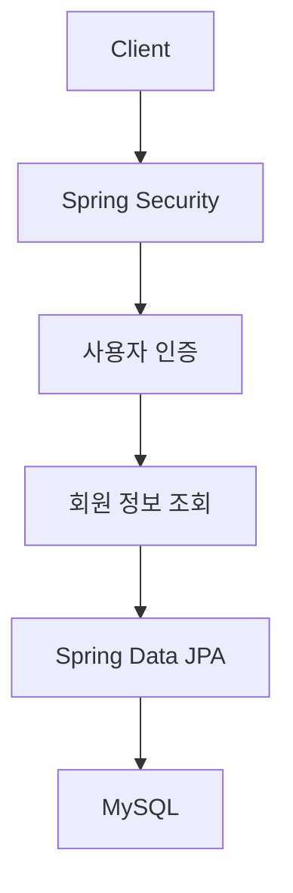
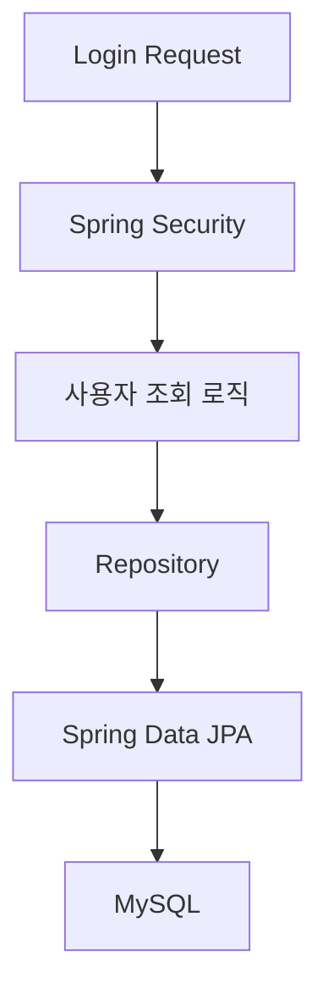
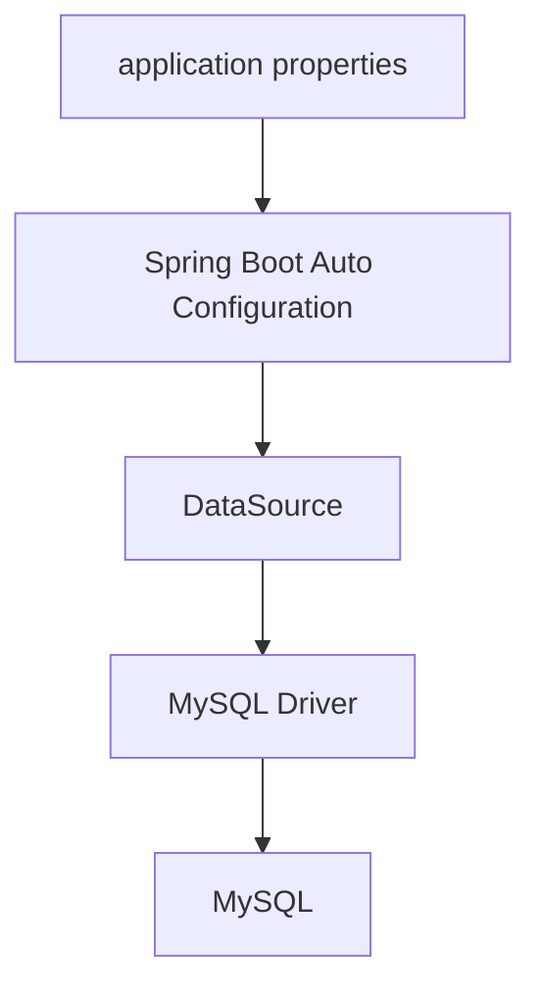
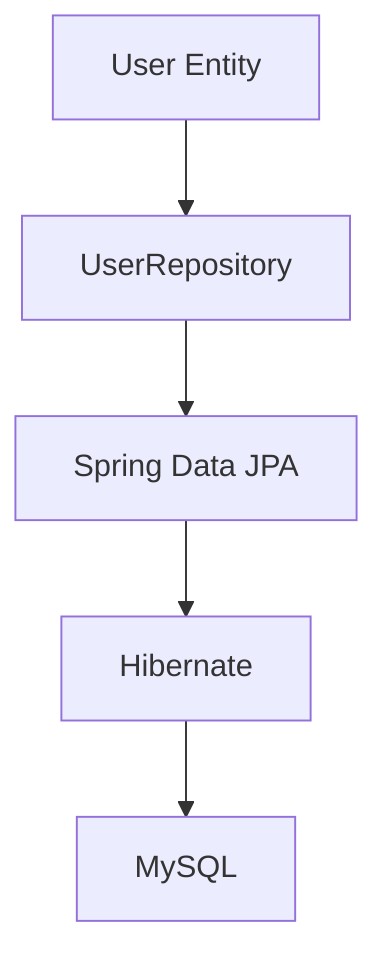
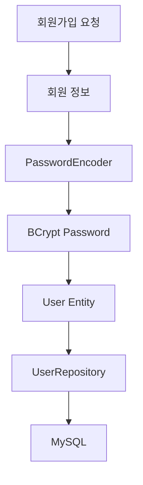
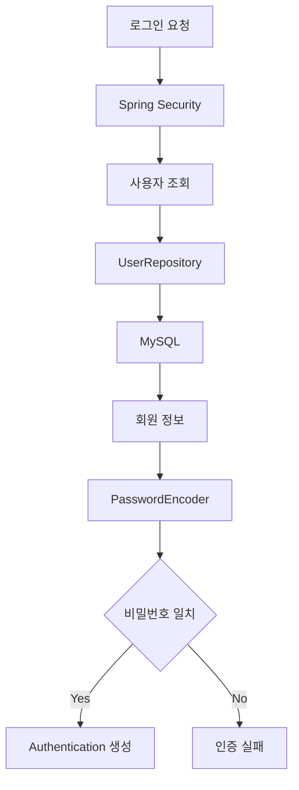
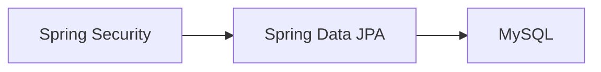
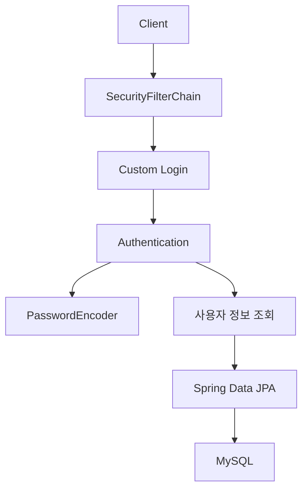

# 스프링 시큐리티 6 - 6  DB 연결
[https://youtu.be/dIFq8Fbmx0w?si=zUCvlKsorP8frEjS](https://youtu.be/dIFq8Fbmx0w?si=zUCvlKsorP8frEjS)

# 스프링 시큐리티 6 - 6  DB 연결
* toc
{:toc}

---

## Spring Security 회원 인증을 위한 MySQL과 Spring Data JPA 연결

Spring Security를 이용해 실제 회원 로그인을 구현하려면 인증에 사용할 사용자 정보를 어디엔가 저장해야 한다.

지금까지는 Spring Boot가 기본으로 제공하는 임시 사용자를 이용해 로그인 흐름을 확인할 수 있었다.

```text
username = user
password = 실행 시 생성된 임시 비밀번호
```

하지만 실제 서비스에서는 회원마다 서로 다른 정보가 존재한다.

```text
회원 ID
아이디
비밀번호
권한
이메일
가입일
```

그리고 사용자가 로그인할 때 Spring Security는 이러한 회원 정보를 기반으로 사용자를 확인해야 한다.

따라서 실제 회원 인증 구조에서는 데이터베이스가 필요하다.

전체 구조를 단순하게 표현하면 다음과 같다.



이번에는 Spring Boot 애플리케이션에 MySQL을 연결하고, 이후 회원가입과 인증 로직에서 사용할 수 있도록 Spring Data JPA 기반의 데이터 접근 환경을 구성한다.

---

## 회원 정보를 데이터베이스에 저장하는 이유

로그인 시스템을 생각해보자.

사용자가 다음 정보를 입력한다.

```text
username = yunsik
password = password1234
```

Spring Security는 단순히 사용자가 입력한 정보만 보고 인증 여부를 판단할 수 없다.

어딘가에 저장되어 있는 회원 정보를 찾아야 한다.

```text
입력된 username
        ↓
회원 정보 조회
        ↓
저장된 회원 발견
        ↓
비밀번호 검증
        ↓
인증 성공 또는 실패
```

따라서 데이터베이스에는 최소한 다음과 같은 회원 정보가 존재해야 한다.

| id | username | password    | role       |
| -: | -------- | ----------- | ---------- |
|  1 | user1    | BCrypt Hash | ROLE_USER  |
|  2 | admin    | BCrypt Hash | ROLE_ADMIN |

여기에서 Password는 평문이 아니라 앞에서 살펴본 `PasswordEncoder`를 이용해 Hash한 값을 저장하는 구조로 발전하게 된다.

```text
회원가입 Password
        ↓
PasswordEncoder
        ↓
BCrypt Hash
        ↓
MySQL
```

---

## Spring Security와 데이터베이스의 관계

Spring Security가 데이터베이스에 회원 정보를 자동으로 저장해주는 것은 아니다.

Spring Security의 핵심 역할은 다음과 같다.

```text
Authentication
→ 사용자가 누구인지 확인

Authorization
→ 사용자가 무엇을 할 수 있는지 확인
```

회원 데이터를 실제로 저장하고 조회하는 역할은 별도의 데이터 접근 계층이 담당한다.

이번 구성에서는 다음 조합을 사용한다.

```text
Spring Security
→ 인증과 인가

Spring Data JPA
→ 회원 데이터 접근

MySQL
→ 회원 정보 저장
```

전체 흐름은 다음과 같다.



---

## 사용할 데이터베이스와 ORM

데이터베이스는 MySQL을 사용한다.

MySQL은 관계형 데이터베이스이므로 데이터를 Table과 Row 구조로 관리한다.

```text
Database
   ↓
Table
   ↓
Row
   ↓
Column
```

예를 들어 회원 정보를 저장하기 위한 `users` Table을 생각할 수 있다.

```text
users

id
username
password
role
```

애플리케이션에서 MySQL에 접근하기 위해 이번에는 Spring Data JPA를 사용한다.

```text
Spring Boot
     ↓
Spring Data JPA
     ↓
JPA
     ↓
Hibernate
     ↓
JDBC
     ↓
MySQL
```

Spring Data JPA를 사용하면 기본적인 CRUD를 직접 SQL 문자열로 작성하지 않고 객체 중심으로 다룰 수 있다.

---

## JPA를 사용하면 SQL을 전혀 사용하지 않는 것일까?

JPA를 처음 접할 때 자주 생기는 오해가 있다.

```text
JPA 사용
=
SQL을 사용하지 않는다
```

라고 생각하기 쉽지만 실제로는 조금 다르다.

개발자가 다음과 같이 Repository를 호출한다고 하자.

```java
userRepository.findById(1L);
```

개발자가 SQL을 직접 작성하지 않았더라도 내부적으로 Hibernate가 필요한 SQL을 생성해 데이터베이스에 전달한다.

개념적으로 다음과 같다.

```text
Java 코드

userRepository.findById(...)

        ↓

Spring Data JPA

        ↓

Hibernate

        ↓

SELECT ...

        ↓

MySQL
```

따라서 더 정확하게 표현하면:

```text
JPA를 사용하면

일반적인 CRUD에서
개발자가 직접 SQL을 작성하는 부담을 줄이고

객체 중심으로
데이터를 다룰 수 있다.
```

라고 이해하는 것이 좋다.

필요하다면 JPQL이나 Native Query를 사용하는 경우도 존재한다.

---

## 필요한 의존성

MySQL과 Spring Data JPA를 사용하려면 핵심적으로 두 종류의 의존성이 필요하다.

```text
Spring Data JPA
MySQL Driver
```

Gradle에서는 다음과 같이 구성할 수 있다.

```gradle
dependencies {
    implementation 'org.springframework.boot:spring-boot-starter-data-jpa'

    runtimeOnly 'com.mysql:mysql-connector-j'
}
```

기존 Spring Security 프로젝트의 의존성과 함께 보면 다음과 같은 형태가 된다.

```gradle
dependencies {
    implementation 'org.springframework.boot:spring-boot-starter-web'

    implementation 'org.springframework.boot:spring-boot-starter-security'

    implementation 'org.springframework.boot:spring-boot-starter-mustache'

    implementation 'org.springframework.boot:spring-boot-starter-data-jpa'

    runtimeOnly 'com.mysql:mysql-connector-j'

    compileOnly 'org.projectlombok:lombok'
    annotationProcessor 'org.projectlombok:lombok'

    testImplementation 'org.springframework.boot:spring-boot-starter-test'
    testImplementation 'org.springframework.security:spring-security-test'
}
```

각 의존성의 역할을 정리하면 다음과 같다.

| 의존성               | 역할                           |
| ----------------- | ---------------------------- |
| Spring Web        | MVC 기반 HTTP 요청 처리            |
| Spring Security   | 인증·인가                        |
| Mustache          | HTML View 렌더링                |
| Spring Data JPA   | Entity와 Repository 기반 데이터 접근 |
| MySQL Connector/J | Java 애플리케이션과 MySQL 통신        |
| Lombok            | 반복 코드 감소                     |

---

## Spring Data JPA의 역할

Spring Data JPA는 Repository 추상화를 제공한다.

예를 들어 다음과 같은 회원 Repository를 만들 수 있다.

```java
public interface UserRepository
        extends JpaRepository<User, Long> {
}
```

이 인터페이스만으로도 기본적인 CRUD 기능을 사용할 수 있다.

```text
save()
findById()
findAll()
delete()
```

직접 다음과 같은 SQL을 모두 작성할 필요가 줄어든다.

```sql
SELECT *
FROM users
WHERE id = ?;
```

Spring Data JPA가 Repository 호출을 JPA 작업으로 연결한다.

```text
UserRepository

      ↓

Spring Data JPA

      ↓

Hibernate

      ↓

MySQL
```

---

## MySQL Driver의 역할

Spring Data JPA만 추가한다고 MySQL과 통신할 수 있는 것은 아니다.

실제 Java 애플리케이션과 MySQL 사이에서 JDBC Protocol을 이용해 통신할 Driver가 필요하다.

그 역할을 MySQL Connector/J가 담당한다.

```text
Spring Data JPA

        ↓

Hibernate

        ↓

JDBC

        ↓

MySQL Connector/J

        ↓

MySQL
```

Gradle에서는 다음 의존성으로 추가한다.

```gradle
runtimeOnly 'com.mysql:mysql-connector-j'
```

즉 두 의존성의 역할은 서로 다르다.

```text
Spring Data JPA
→ 데이터 접근 추상화

MySQL Driver
→ 실제 MySQL 통신
```

---

## JPA와 MySQL 의존성을 주석 처리했던 이유

프로젝트 초기에는 데이터베이스를 아직 연결하지 않은 상태에서 Spring Security의 기본 동작부터 확인할 수 있다.

이때 JPA와 MySQL 관련 의존성이 활성화되어 있으면 Spring Boot가 DataSource 자동 구성을 시도한다.

```text
Spring Data JPA 발견

        ↓

DataSource 설정 확인

        ↓

Database 연결 시도
```

그런데 아직 다음 설정이 없다면:

```text
Database URL
Username
Password
```

애플리케이션 실행 과정에서 DataSource 구성 오류가 발생할 수 있다.

따라서 초기에는 관련 의존성을 잠시 제외하고:

```text
Spring Security 동작 확인
        ↓
Custom Login 구성
        ↓
PasswordEncoder 구성
```

까지 진행한 뒤 실제 회원 시스템을 만들 시점에 JPA와 MySQL을 다시 활성화할 수 있다.

이제 실제 회원 정보를 저장할 것이므로 해당 의존성을 다시 사용한다.

---

## MySQL 데이터베이스 준비

예를 들어 MySQL에 다음 Database를 생성한다고 가정하자.

```sql
CREATE DATABASE security_db;
```

사용할 Database를 선택한다.

```sql
USE security_db;
```

현재 단계에서는 반드시 회원 Table을 직접 만들 필요는 없다.

이후 JPA Entity와 Table 생성 전략을 어떻게 설정하느냐에 따라 Table을 직접 생성하거나 Hibernate가 생성하도록 구성할 수 있다.

우선 중요한 것은 Spring Boot 애플리케이션이 다음 Database에 접속할 수 있는 상태를 만드는 것이다.

```text
MySQL

Host
localhost

Port
3306

Database
security_db
```

---

## Spring Boot에서 MySQL 단일 연결하기

단일 Database를 사용하는 경우 Spring Boot의 설정 파일을 이용해 DataSource를 구성할 수 있다.

`application.properties`를 사용하는 경우 다음과 같이 작성할 수 있다.

```properties
spring.datasource.driver-class-name=com.mysql.cj.jdbc.Driver
spring.datasource.url=jdbc:mysql://localhost:3306/security_db
spring.datasource.username=root
spring.datasource.password=password
```

핵심 설정은 다음 네 가지다.

```text
Driver
URL
Username
Password
```

각각 하나씩 살펴보자.

---

## spring.datasource.driver-class-name

첫 번째는 JDBC Driver다.

```properties
spring.datasource.driver-class-name=com.mysql.cj.jdbc.Driver
```

이 설정은 어떤 JDBC Driver를 이용할지 지정한다.

현재 연결하려는 Database가 MySQL이므로 MySQL JDBC Driver를 사용한다.

```text
Spring Boot
     ↓
MySQL JDBC Driver
     ↓
MySQL
```

Spring Boot와 JDBC Driver 환경에서는 URL을 기반으로 Driver를 자동 감지할 수 있기 때문에 명시적인 `driver-class-name`이 반드시 필요하지 않은 경우도 있다.

따라서 단순한 MySQL 연결에서는 다음 세 항목만으로도 구성되는 환경이 많다.

```properties
spring.datasource.url=jdbc:mysql://localhost:3306/security_db
spring.datasource.username=root
spring.datasource.password=password
```

다만 Driver를 명시적으로 표현하고 싶다면 `driver-class-name`을 함께 지정할 수 있다.

---

## spring.datasource.url

두 번째는 데이터베이스 주소다.

```properties
spring.datasource.url=jdbc:mysql://localhost:3306/security_db
```

구조를 분해하면 다음과 같다.

```text
jdbc:mysql://localhost:3306/security_db

jdbc:mysql
→ MySQL JDBC 연결

localhost
→ DB Server Host

3306
→ MySQL Port

security_db
→ Database 이름
```

즉 다음 Database를 의미한다.

```text
localhost
   ↓
3306
   ↓
security_db
```

---

## spring.datasource.username

MySQL에 접속할 계정을 설정한다.

```properties
spring.datasource.username=root
```

실제 운영 환경에서는 `root`처럼 모든 권한을 가진 계정을 애플리케이션이 직접 사용하는 것은 피하는 편이 좋다.

예를 들어 애플리케이션 전용 계정을 따로 만들 수 있다.

```text
security_app
```

그리고 필요한 Database 권한만 부여하는 방식이 좋다.

```text
security_db
→ 필요한 SELECT
→ 필요한 INSERT
→ 필요한 UPDATE
→ 필요한 DELETE
```

최소 권한 원칙을 적용하는 것이다.

---

## spring.datasource.password

마지막으로 Database 계정의 Password를 설정한다.

```properties
spring.datasource.password=password
```

로컬 테스트에서는 간단하게 작성할 수 있지만 운영 환경에서는 실제 비밀번호를 Git Repository에 직접 저장하지 않는 것이 좋다.

다음과 같은 환경 변수 형태로 분리할 수 있다.

```properties
spring.datasource.username=${DB_USERNAME}
spring.datasource.password=${DB_PASSWORD}
```

URL도 분리할 수 있다.

```properties
spring.datasource.url=${DB_URL}
```

전체적으로는 다음처럼 작성할 수 있다.

```properties
spring.datasource.driver-class-name=com.mysql.cj.jdbc.Driver
spring.datasource.url=${DB_URL}
spring.datasource.username=${DB_USERNAME}
spring.datasource.password=${DB_PASSWORD}
```

---

## application.yml을 사용하는 경우

YAML 형식을 사용한다면 동일한 설정을 다음과 같이 작성할 수 있다.

```yaml
spring:
  datasource:
    driver-class-name: com.mysql.cj.jdbc.Driver
    url: jdbc:mysql://localhost:3306/security_db
    username: root
    password: password
```

운영 환경을 고려한다면 다음처럼 외부 환경 변수를 사용할 수 있다.

```yaml
spring:
  datasource:
    driver-class-name: com.mysql.cj.jdbc.Driver
    url: ${DB_URL}
    username: ${DB_USERNAME}
    password: ${DB_PASSWORD}
```

설정 파일은 연결 방법을 정의하고 실제 Secret은 실행 환경에서 제공하도록 역할을 분리할 수 있다.

---

## DataSource란?

Spring Boot에서 JDBC 기반 Database 연결을 이해하려면 `DataSource`라는 개념을 알아두는 것이 좋다.

애플리케이션이 Database에 접근할 때 매 Query마다 연결 정보를 직접 읽어 Connection을 만드는 것이 아니다.

개념적으로 다음 구조를 사용한다.

```text
Application

    ↓

DataSource

    ↓

Database Connection

    ↓

MySQL
```

Spring Boot는 다음 설정을 읽는다.

```text
spring.datasource.*
```

그리고 이에 맞는 DataSource를 자동 구성한다.



Spring Data JPA와 Hibernate는 이 DataSource를 기반으로 Database에 접근한다.

---

## Spring Boot가 데이터베이스 설정을 읽는 과정

애플리케이션이 실행되면 다음과 같은 흐름이 만들어진다.

```text
application.properties

        ↓

spring.datasource.url
spring.datasource.username
spring.datasource.password

        ↓

Spring Boot

        ↓

DataSource 구성

        ↓

JPA EntityManagerFactory 구성

        ↓

Hibernate

        ↓

MySQL
```

따라서 개발자가 직접 다음과 같은 JDBC Connection 코드를 작성할 필요가 없다.

```java
DriverManager.getConnection(
        url,
        username,
        password
);
```

Spring Boot의 Auto Configuration을 이용하면 설정 정보를 기반으로 필요한 인프라 객체들을 구성할 수 있다.

---

## Connection Pool도 함께 이해하기

실제 애플리케이션에서는 HTTP 요청이 올 때마다 새로운 Database Connection을 처음부터 만들고 종료하는 방식은 비효율적이다.

일반적으로 Connection Pool을 이용한다.

구조는 다음과 같다.

```text
Application

       ↓

Connection Pool

├── Connection 1
├── Connection 2
├── Connection 3
└── Connection N

       ↓

MySQL
```

Spring Boot의 JDBC 기반 애플리케이션에서는 일반적으로 Connection Pool을 통해 Connection을 재사용한다.

따라서:

```text
JPA
→ SQL 실행
→ Connection Pool에서 Connection 사용
→ 작업 완료
→ Pool에 반환
```

구조로 동작한다.

이 점은 이후 트랜잭션이나 Database 성능 문제를 이해할 때 중요하다.

---

## Spring Data JPA가 연결된 이후 구조

Database 설정이 완료되면 이후 다음과 같은 Entity를 만들 수 있다.

```java
@Entity
public class User {

    @Id
    @GeneratedValue(strategy = GenerationType.IDENTITY)
    private Long id;

    private String username;

    private String password;

    private String role;
}
```

그리고 Repository를 정의한다.

```java
public interface UserRepository
        extends JpaRepository<User, Long> {

}
```

전체적인 관계는 다음과 같다.



이번 단계에서는 실제 회원 Entity와 Repository를 구현하기보다 **그 구조가 동작하기 위한 Database 연결 기반을 준비하는 것**이 핵심이다.

---

## 회원가입에서는 데이터베이스가 어떻게 사용될까?

다음 단계에서 회원가입을 구현한다고 생각해보자.

사용자가 다음 정보를 입력한다.

```text
username
password
```

회원가입 Service에서는 Password를 BCrypt로 변환한다.

```text
Raw Password

      ↓

PasswordEncoder.encode()

      ↓

BCrypt Hash
```

그리고 User Entity를 만든다.

```text
username
hashedPassword
role
```

Repository로 저장한다.

```text
UserRepository.save()
```

전체 흐름은 다음과 같다.



따라서 이전에 등록한 `PasswordEncoder`와 이번에 연결한 MySQL이 이후 회원가입 과정에서 만나게 된다.

---

## 로그인에서는 데이터베이스가 어떻게 사용될까?

로그인에서도 Database가 중요하다.

사용자가 다음 정보를 입력한다.

```text
username
password
```

Spring Security는 username을 기반으로 사용자를 찾아야 한다.

개념적인 흐름은 다음과 같다.

```text
Login Request

      ↓

Spring Security

      ↓

username으로 회원 조회

      ↓

UserRepository

      ↓

MySQL

      ↓

회원 정보 반환

      ↓

Password 검증
```

조금 더 확장하면 다음과 같다.



이번 Database 연결 작업이 필요한 이유가 바로 이 흐름 때문이다.

---

## 회원가입과 로그인의 데이터 흐름 차이

회원가입에서는 Database에 데이터를 저장한다.

```text
회원가입

Client
   ↓
Controller
   ↓
Service
   ↓
PasswordEncoder
   ↓
Repository
   ↓
MySQL INSERT
```

로그인에서는 기존 데이터를 조회한다.

```text
로그인

Client
   ↓
Spring Security
   ↓
사용자 조회
   ↓
Repository
   ↓
MySQL SELECT
   ↓
Password 검증
```

같은 Database를 사용하지만 목적은 다르다.

---

## 데이터베이스 연결 성공 여부 확인

애플리케이션을 실행한다.

```bash
./gradlew bootRun
```

정상적으로 MySQL과 연결되고 설정 오류가 없다면 Spring Boot 애플리케이션이 정상적으로 기동된다.

반대로 다음과 같은 경우에는 실행 과정에서 오류가 발생할 수 있다.

```text
MySQL 서버가 실행되지 않음

URL 오류

Database 이름 오류

Username 오류

Password 오류

MySQL Driver 누락

네트워크 접근 불가
```

Database 연결 문제를 만났다면 가장 먼저 다음 항목을 확인하는 것이 좋다.

| 확인 항목       | 예                 |
| ----------- | ----------------- |
| Host        | `localhost`       |
| Port        | `3306`            |
| Database    | `security_db`     |
| Username    | `root` 또는 앱 전용 계정 |
| Password    | 실제 DB Password    |
| Driver      | MySQL Connector/J |
| MySQL 실행 여부 | Server Process 확인 |

---

## localhost를 사용할 때 주의할 점

로컬 환경에서 Spring Boot와 MySQL을 모두 Host Machine에서 실행한다면 다음 주소가 자연스럽다.

```properties
spring.datasource.url=jdbc:mysql://localhost:3306/security_db
```

하지만 Spring Boot 애플리케이션을 Docker Container에서 실행한다면 의미가 달라진다.

Container 안의:

```text
localhost
```

는 Host Machine이 아니라 해당 Container 자신을 의미한다.

예를 들어 Docker Compose에 다음 Service가 있다고 하자.

```text
security-app
mysql
```

같은 Docker Network 안에서 Spring Boot가 MySQL에 접근한다면 Database Host를 다음과 같이 사용할 수 있다.

```text
mysql
```

따라서 URL은 환경에 따라 다음과 같이 달라질 수 있다.

```properties
spring.datasource.url=jdbc:mysql://mysql:3306/security_db
```

이 부분은 운영 환경으로 확장할 때 자주 발생하는 연결 문제 중 하나다.

---

## DB 계정과 비밀번호를 코드에 하드코딩하지 않기

다음 설정은 로컬 학습 환경에서는 간단하다.

```properties
spring.datasource.username=root
spring.datasource.password=1234
```

하지만 실제 Repository에 Commit하면 Database Credential이 소스 코드에 포함될 수 있다.

운영 환경에서는 다음과 같이 외부화하는 것이 좋다.

```properties
spring.datasource.url=${DB_URL}
spring.datasource.username=${DB_USERNAME}
spring.datasource.password=${DB_PASSWORD}
```

환경에서는 실제 값을 제공한다.

```text
DB_URL
DB_USERNAME
DB_PASSWORD
```

전체 구조는 다음과 같다.

```text
Source Code

application.properties
→ 환경 변수 이름만 저장

        ↓

Runtime Environment
→ 실제 Credential 제공

        ↓

Spring Boot
        ↓

MySQL
```

---

## JPA Entity와 데이터베이스 Table의 관계

Spring Data JPA에서는 Java 객체와 Database Table을 연결한다.

예를 들어 다음 Entity가 있다고 하자.

```java
@Entity
@Table(name = "users")
public class User {

    @Id
    @GeneratedValue(strategy = GenerationType.IDENTITY)
    private Long id;

    private String username;

    private String password;

    private String role;
}
```

이는 개념적으로 다음 Table과 연결된다.

```text
User Entity

id
username
password
role

       ↕

users Table

id
username
password
role
```

이러한 Mapping을 ORM이라고 한다.

```text
Object
↕
Relational Database
```

그래서 JPA를 Object Relational Mapping 기술의 표준 API로 이해할 수 있다.

---

## Spring Data JPA와 Hibernate의 관계

Spring Data JPA, JPA, Hibernate를 같은 기술이라고 생각하기 쉽지만 역할이 다르다.

구조를 단순하게 보면 다음과 같다.

```text
Spring Data JPA

        ↓

JPA API

        ↓

Hibernate

        ↓

JDBC

        ↓

MySQL
```

`Spring Data JPA`는 Repository 추상화를 제공한다.

```java
JpaRepository<User, Long>
```

JPA는 ORM을 위한 Java 표준 API다.

Hibernate는 JPA를 구현하는 대표적인 구현체다.

그리고 최종적으로 JDBC를 통해 MySQL과 통신한다.

---

## Repository가 Spring Security와 어떻게 연결될까?

이후 회원 로그인 구현에서는 단순히 `UserRepository`를 Spring Security가 직접 호출하는 형태보다 중간에 사용자 정보를 Security 형식으로 변환하는 계층이 등장하게 된다.

개념적으로 다음 구조다.

```text
Spring Security

      ↓

UserDetailsService

      ↓

UserRepository

      ↓

Spring Data JPA

      ↓

MySQL
```

사용자가 로그인하면:

```text
username 입력

      ↓

UserDetailsService

      ↓

username으로 회원 검색

      ↓

UserRepository

      ↓

MySQL
```

형태로 회원 정보를 가져오게 된다.

따라서 지금 구성하는 Database는 이후 Spring Security Authentication의 핵심 데이터 소스가 된다.

---

## Spring Security와 JPA의 책임을 구분하기

두 기술의 역할은 분명히 다르다.

### Spring Security

```text
인증
인가
Session 관리
SecurityContext
Password 검증 연계
```

### Spring Data JPA

```text
회원 저장
회원 조회
회원 수정
회원 삭제
```

### MySQL

```text
실제 데이터 영속 저장
```

이 역할을 섞지 않고 이해하는 것이 중요하다.



Spring Security가 직접 SQL을 수행하는 것이 아니라 애플리케이션의 사용자 조회 구조를 통해 회원 정보를 가져오는 형태로 발전한다.

---

## 비밀번호 저장 시 다시 확인해야 할 점

Database가 연결되면 이제 Password를 실제로 저장할 수 있게 된다.

이때 가장 주의해야 할 부분은 평문 저장이다.

다음과 같이 저장해서는 안 된다.

```java
user.setPassword(
        joinRequest.getPassword()
);
```

반드시 앞에서 만든 PasswordEncoder를 거친다.

```java
user.setPassword(
        passwordEncoder.encode(
                joinRequest.getPassword()
        )
);
```

결과적으로 Database에는:

```text
password1234
```

가 아니라:

```text
$2a$10$...
```

와 같은 BCrypt 결과가 저장되어야 한다.

---

## application.properties 전체 예제

현재 단계에서 사용할 수 있는 기본적인 설정을 정리하면 다음과 같다.

```properties
spring.application.name=security

spring.datasource.driver-class-name=com.mysql.cj.jdbc.Driver
spring.datasource.url=jdbc:mysql://localhost:3306/security_db
spring.datasource.username=root
spring.datasource.password=password
```

Credential을 외부로 분리한다면 다음처럼 작성할 수 있다.

```properties
spring.application.name=security

spring.datasource.driver-class-name=com.mysql.cj.jdbc.Driver
spring.datasource.url=${DB_URL}
spring.datasource.username=${DB_USERNAME}
spring.datasource.password=${DB_PASSWORD}
```

실제 운영 환경에서는 후자의 방식이 관리하기 좋다.

---

## application.yml 전체 예제

YAML을 사용한다면 다음과 같다.

```yaml
spring:
  application:
    name: security

  datasource:
    driver-class-name: com.mysql.cj.jdbc.Driver
    url: ${DB_URL}
    username: ${DB_USERNAME}
    password: ${DB_PASSWORD}
```

환경별로 값만 변경하면 같은 애플리케이션 코드를 사용할 수 있다.

```text
Local
→ Local MySQL

Development
→ Development MySQL

Production
→ Production MySQL
```

---

## 실무에서는 ddl-auto도 별도로 생각해야 한다

JPA를 사용하면 Entity 정보를 기반으로 Database Schema를 다루는 설정도 등장한다.

예를 들어 다음과 같은 설정을 볼 수 있다.

```properties
spring.jpa.hibernate.ddl-auto=update
```

하지만 이 설정은 단순한 Database 연결 설정과는 다른 문제다.

```text
spring.datasource.*
→ 어디에 연결할 것인가

spring.jpa.hibernate.ddl-auto
→ Schema를 어떻게 관리할 것인가
```

특히 운영 환경에서는 Hibernate가 임의로 Schema를 변경하도록 맡기는 것보다 Flyway나 Liquibase 같은 Migration 도구를 통해 Schema 변경을 명시적으로 관리하는 방식을 많이 고려한다.

따라서 Database 연결과 Schema 관리 정책을 구분해서 생각하는 것이 좋다.

---

## Connection 성공과 실제 서비스 준비 완료는 다르다

Spring Boot가 MySQL에 정상적으로 연결되었다고 해서 회원 시스템이 완성된 것은 아니다.

현재 완료된 것은 다음 단계다.

```text
Spring Boot

    ↓

MySQL 연결 완료
```

아직 다음 작업들이 남아 있다.

```text
User Entity 작성

UserRepository 작성

회원가입 로직

BCrypt Password 저장

UserDetails 구현

UserDetailsService 구현

Spring Security 인증 연계

Role 기반 인가
```

따라서 전체 과정에서 현재 위치는 다음과 같다.

```text
Security 기본 설정
        ↓
Custom Login
        ↓
PasswordEncoder
        ↓
Database 연결
        ↓
회원 Entity
        ↓
회원가입
        ↓
DB 기반 로그인 인증
```

---

## 현재까지의 Spring Security 구조 연결

지금까지 구성한 내용을 하나로 연결하면 다음과 같다.



조금 더 역할 중심으로 보면:

```text
SecurityFilterChain
→ 어떤 URL을 보호할 것인가

Custom Login
→ 사용자가 어디에서 로그인할 것인가

PasswordEncoder
→ 비밀번호를 어떻게 안전하게 처리할 것인가

Spring Data JPA
→ 회원 정보를 어떻게 조회하고 저장할 것인가

MySQL
→ 회원 정보를 어디에 저장할 것인가
```

가 된다.

---

## 실무에서의 활용

실제 회원 시스템에서는 데이터베이스 연결 자체보다 연결 이후의 설계가 더 중요하다.

최소한 다음 내용을 함께 고려해야 한다.

```text
회원 아이디 UNIQUE 제약

Password BCrypt Hash 저장

Role 관리 방식

탈퇴 회원 처리

계정 잠금

로그인 실패 횟수

Password 변경

회원 정보 Migration

DB Credential 관리

Connection Pool 설정
```

예를 들어 `username`이 로그인 식별자라면 Database에도 중복을 방지하는 제약이 필요하다.

단순히 Service 코드에서:

```java
if (userRepository.existsByUsername(username)) {
    // 중복
}
```

만 검사하는 것보다 Database에도 Unique Constraint를 두어 데이터 정합성을 보호하는 것을 고려해야 한다.

Security와 Database는 각각 다른 책임을 가지고 있지만 실제 인증 시스템의 안정성을 위해 함께 설계해야 한다.

---

## 정리

실제 Spring Security 회원 인증을 구현하려면 회원 정보를 저장하고 조회할 데이터베이스가 필요하다.

이번 구성에서는 다음 기술을 사용한다.

```text
Database
→ MySQL

Data Access
→ Spring Data JPA

Authentication
→ Spring Security
```

필요한 핵심 의존성은 다음과 같다.

```gradle
implementation 'org.springframework.boot:spring-boot-starter-data-jpa'
runtimeOnly 'com.mysql:mysql-connector-j'
```

단일 MySQL 연결은 `application.properties`에서 다음과 같이 구성할 수 있다.

```properties
spring.datasource.driver-class-name=com.mysql.cj.jdbc.Driver
spring.datasource.url=jdbc:mysql://localhost:3306/security_db
spring.datasource.username=root
spring.datasource.password=password
```

각 설정은 다음 역할을 한다.

```text
driver-class-name
→ 사용할 JDBC Driver

url
→ MySQL Server와 Database 주소

username
→ Database 계정

password
→ Database Password
```

Spring Boot는 이 정보를 이용해 DataSource를 자동으로 구성한다.

```text
application.properties

        ↓

Spring Boot Auto Configuration

        ↓

DataSource

        ↓

Spring Data JPA

        ↓

Hibernate

        ↓

JDBC

        ↓

MySQL
```

그리고 이후 회원 Entity와 Repository를 구성하면 다음 구조가 완성된다.

```text
Spring Security

      ↓

사용자 조회

      ↓

UserRepository

      ↓

Spring Data JPA

      ↓

MySQL
```

회원가입에서는:

```text
사용자 Password

       ↓

PasswordEncoder.encode()

       ↓

BCrypt Hash

       ↓

UserRepository.save()

       ↓

MySQL
```

로그인에서는:

```text
사용자 입력 정보

       ↓

Spring Security

       ↓

회원 조회

       ↓

MySQL

       ↓

저장된 BCrypt Password

       ↓

Password 검증

       ↓

Authentication
```

흐름으로 연결된다.

따라서 Database 연결은 단순히 MySQL을 Spring Boot에 붙이는 작업이 아니라 **앞으로 구현할 회원가입, 사용자 조회, Password 검증, Spring Security 인증을 하나의 실제 회원 시스템으로 연결하기 위한 기반 작업**이라고 볼 수 있다.

### 한 줄 요약

Spring Security에서 실제 회원 인증을 구현하려면 Spring Data JPA와 MySQL Driver를 추가하고 `spring.datasource` 설정으로 MySQL을 연결한 뒤, 이후 `UserRepository`를 통해 회원 정보를 조회하여 `PasswordEncoder`와 Spring Security 인증 과정에 연결할 수 있는 데이터 영속화 기반을 만들어야 한다.
