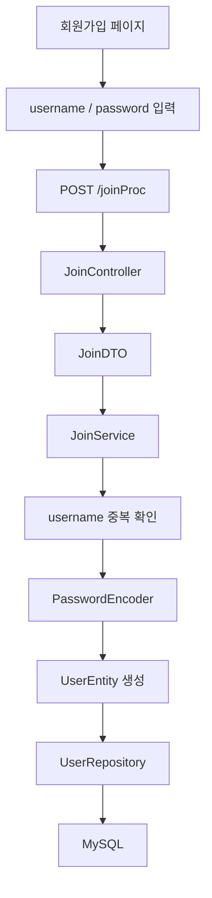
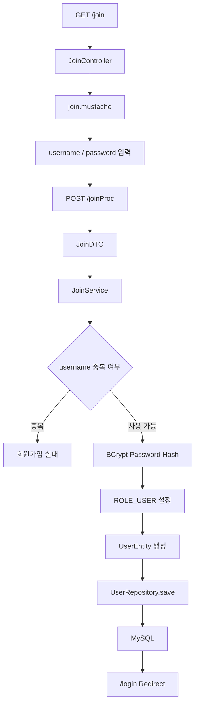
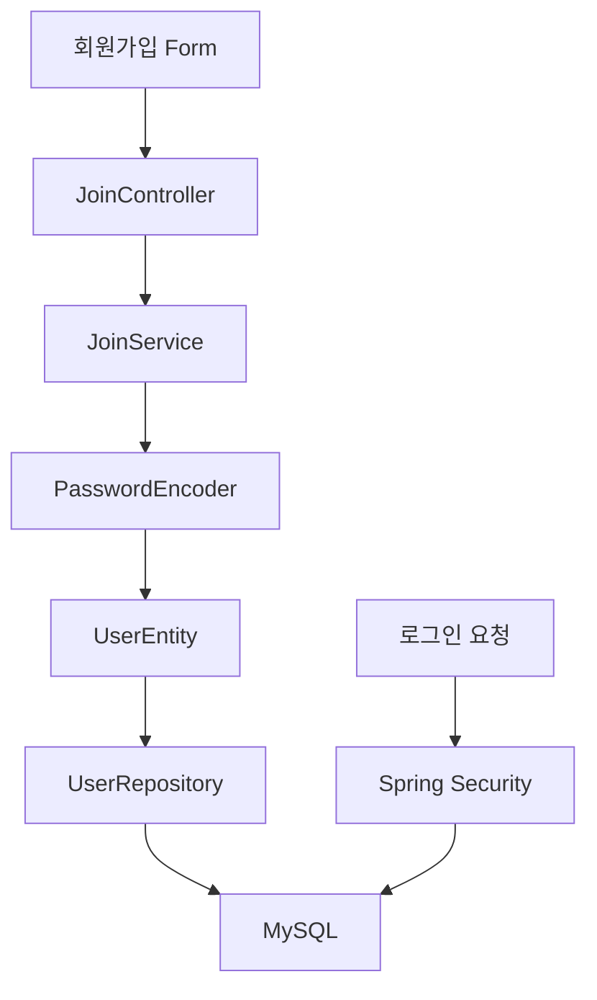
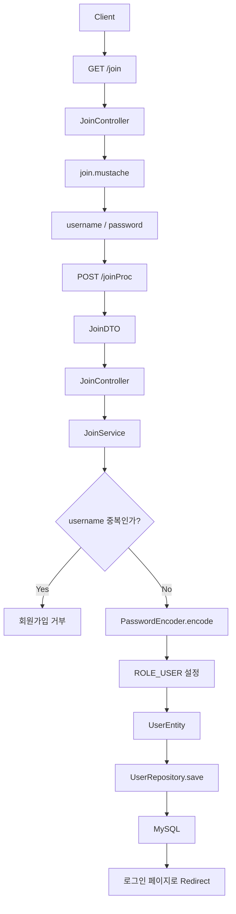

# 스프링 시큐리티 6 - 7. 회원 가입 로직
[https://youtu.be/m9lsS36QGCk?si=RX_MgA_CZe5RlBYY](https://youtu.be/m9lsS36QGCk?si=RX_MgA_CZe5RlBYY)

# 스프링 시큐리티 6 - 7. 회원 가입 로직
* toc
{:toc}

---

## Spring Security 회원가입 구현: DTO부터 JPA, BCrypt, Role 저장까지

Spring Security에서 실제 로그인 인증을 구현하려면 먼저 데이터베이스에 사용자의 회원 정보가 존재해야 한다.

사용자가 로그인 화면에서 다음 정보를 입력한다고 가정해보자.

```text
username = user1
password = password1234
```

Spring Security는 이 정보만으로 사용자를 인증할 수 없다.

서버가 가지고 있는 회원 정보와 비교해야 한다.

```text
로그인 요청
    ↓
username으로 회원 조회
    ↓
회원 정보 확인
    ↓
Password 검증
    ↓
Authentication 생성
```

따라서 로그인보다 먼저 필요한 작업이 **회원 정보를 데이터베이스에 저장하는 회원가입 기능**이다.

회원가입의 전체 흐름은 다음과 같이 구성할 수 있다.



핵심은 단순히 회원 Form 데이터를 Database에 넣는 것이 아니다.

회원가입 과정에서는 최소한 다음 작업이 필요하다.

```text
회원 입력값 전달
→ DTO 변환
→ 중복 사용자 검증
→ 비밀번호 BCrypt Hash
→ 사용자 Role 결정
→ Entity 생성
→ Repository 저장
```

---

## 회원가입 구조부터 이해하기

Spring MVC와 Spring Data JPA를 이용한 회원가입 구조는 다음과 같이 나눌 수 있다.

```text
View
→ join.mustache

Controller
→ JoinController

DTO
→ JoinDTO

Service
→ JoinService

Entity
→ UserEntity

Repository
→ UserRepository

Database
→ MySQL
```

각 계층은 서로 다른 책임을 가진다.

| 계층         | 역할             |
| ---------- | -------------- |
| View       | 사용자에게 입력 화면 제공 |
| Controller | HTTP 요청 수신     |
| DTO        | 요청 데이터 전달      |
| Service    | 회원가입 비즈니스 로직   |
| Entity     | DB Table과 매핑   |
| Repository | DB 저장·조회       |
| MySQL      | 회원 데이터 영속화     |

전체 구조를 조금 더 명확히 보면 다음과 같다.


---

## 회원가입 페이지 만들기

먼저 사용자가 회원 정보를 입력할 화면이 필요하다.

Mustache를 사용한다면 다음 파일을 만들 수 있다.

```text
src/main/resources/templates/join.mustache
```

간단한 회원가입 화면은 다음과 같다.

```html
<!DOCTYPE html>
<html lang="ko">
<head>
    <meta charset="UTF-8">
    <title>회원가입</title>
</head>
<body>

<h1>회원가입</h1>

<form action="/joinProc" method="post">

    <div>
        <label for="username">
            아이디
        </label>

        <input
                id="username"
                name="username"
                type="text"
        >
    </div>

    <div>
        <label for="password">
            비밀번호
        </label>

        <input
                id="password"
                name="password"
                type="password"
        >
    </div>

    <button type="submit">
        회원가입
    </button>

</form>

</body>
</html>
```

여기에서 중요한 부분은 `form`의 `action`과 `method`다.

```html
<form action="/joinProc" method="post">
```

사용자가 회원가입 버튼을 누르면 다음 요청이 발생한다.

```text
POST /joinProc
```

그리고 Form 내부의 `name` 속성을 기준으로 데이터가 전달된다.

```text
username=...
password=...
```

---

## input의 name 속성이 중요한 이유

HTML에는 다음 두 Input이 존재한다.

```html
<input name="username" type="text">
<input name="password" type="password">
```

Spring MVC에서 DTO에 값을 Binding하려면 이름이 DTO Field와 대응되어야 한다.

DTO가 다음과 같다면:

```java
public class JoinDTO {

    private String username;

    private String password;
}
```

Form에서는:

```text
name="username"
→ JoinDTO.username

name="password"
→ JoinDTO.password
```

형태로 연결된다.

따라서 Form과 DTO 사이의 구조는 다음과 같다.

```text
HTML Form

username
password

    ↓

JoinDTO

username
password
```

---

## 회원가입 페이지를 반환하는 Controller

사용자가 다음 경로로 접근한다고 가정하자.

```text
GET /join
```

이 요청을 처리할 Controller를 만든다.

```java
package com.example.security.controller;

import org.springframework.stereotype.Controller;
import org.springframework.web.bind.annotation.GetMapping;

@Controller
public class JoinController {

    @GetMapping("/join")
    public String join() {
        return "join";
    }
}
```

이 메서드는 다음 View를 반환한다.

```text
templates/join.mustache
```

전체 흐름은 다음과 같다.

```text
GET /join
    ↓
JoinController
    ↓
return "join"
    ↓
join.mustache
```

---

## 회원가입 POST 요청 처리하기

사용자가 회원가입 Form을 제출하면 다음 요청이 발생한다.

```text
POST /joinProc
```

따라서 `JoinController`에 POST 요청 처리 메서드를 추가한다.

```java
package com.example.security.controller;

import com.example.security.dto.JoinDTO;
import com.example.security.service.JoinService;
import lombok.RequiredArgsConstructor;
import org.springframework.stereotype.Controller;
import org.springframework.web.bind.annotation.GetMapping;
import org.springframework.web.bind.annotation.ModelAttribute;
import org.springframework.web.bind.annotation.PostMapping;

@Controller
@RequiredArgsConstructor
public class JoinController {

    private final JoinService joinService;

    @GetMapping("/join")
    public String join() {
        return "join";
    }

    @PostMapping("/joinProc")
    public String joinProcess(
            @ModelAttribute JoinDTO joinDTO
    ) {

        joinService.joinProcess(joinDTO);

        return "redirect:/login";
    }
}
```

회원가입에 성공하면 로그인 페이지로 Redirect하도록 구성했다.

```text
회원가입 성공
    ↓
redirect:/login
```

---

## redirect:의 의미

다음 코드를 살펴보자.

```java
return "redirect:/login";
```

이것은 단순히 `login.mustache`를 렌더링하라는 의미가 아니다.

브라우저에 새로운 요청을 보내도록 Redirect 응답을 전달한다.

```text
POST /joinProc

    ↓

회원가입 처리

    ↓

302 Redirect

    ↓

GET /login
```

따라서 로그인 페이지를 처리하는 Controller가 다시 실행된다.

이 방식은 POST 요청 처리 후 페이지 새로고침으로 동일한 회원가입 요청이 반복되는 문제를 줄이는 데에도 도움이 된다.

---

## JoinDTO 만들기

회원가입 Form에서 전달된 데이터를 Controller가 직접 각각 받는 방법도 있다.

```java
@PostMapping("/joinProc")
public String joinProcess(
        String username,
        String password
) {
}
```

하지만 전달할 데이터가 많아지면 Parameter가 계속 늘어난다.

```text
username
password
email
name
phone
...
```

따라서 요청 데이터를 하나의 DTO로 받는 것이 관리하기 좋다.

```java
package com.example.security.dto;

import lombok.Getter;
import lombok.Setter;

@Getter
@Setter
public class JoinDTO {

    private String username;

    private String password;
}
```

DTO는 다음 역할을 한다.

```text
HTTP Request

username
password

    ↓

JoinDTO

    ↓

Controller

    ↓

Service
```

DTO는 Database Entity와 동일한 객체가 아니다.

이 구분이 중요하다.

---

## DTO와 Entity를 분리하는 이유

다음과 같은 요청 데이터가 있다고 생각해보자.

```text
username
password
```

Database에는 다음 정보까지 저장해야 할 수 있다.

```text
id
username
password
role
createdAt
status
```

즉 외부에서 받는 데이터와 내부에서 저장하는 데이터의 구조가 다르다.

```text
JoinDTO

username
password
```

반면:

```text
UserEntity

id
username
password
role
```

가 된다.

따라서:

```text
Request DTO
≠
JPA Entity
```

로 구분하는 것이 좋다.

외부 요청 데이터를 JPA Entity에 바로 Binding하면 클라이언트가 수정하면 안 되는 Field까지 전달할 위험도 생긴다.

---

## JoinService 만들기

Controller의 역할은 HTTP 요청을 받고 적절한 Service를 호출하는 것이다.

실제 회원가입 비즈니스 로직은 Service 계층에 둔다.

```java
package com.example.security.service;

import com.example.security.dto.JoinDTO;
import org.springframework.stereotype.Service;

@Service
public class JoinService {

    public void joinProcess(
            JoinDTO joinDTO
    ) {

    }
}
```

최종적으로 이 메서드 안에서 다음 작업을 수행하게 된다.

```text
1. username 중복 확인

2. Password Hash

3. Role 설정

4. DTO → Entity 변환

5. Repository.save()

6. DB INSERT
```

---

## Controller에서 Service 의존성 주입하기

간단한 예제에서는 다음과 같이 필드 주입을 볼 수 있다.

```java
@Autowired
private JoinService joinService;
```

하지만 실제 애플리케이션에서는 생성자 주입을 사용하는 것이 좋다.

Lombok을 이용한다면 다음처럼 작성할 수 있다.

```java
@Controller
@RequiredArgsConstructor
public class JoinController {

    private final JoinService joinService;
}
```

Lombok 없이 작성한다면 다음과 같다.

```java
@Controller
public class JoinController {

    private final JoinService joinService;

    public JoinController(
            JoinService joinService
    ) {
        this.joinService = joinService;
    }
}
```

이 구조에서는 의존성이 명확하다.

```text
JoinController
      ↓
JoinService
```

그리고 Field를 `final`로 유지할 수 있다.

---

## UserEntity 만들기

이제 실제 회원 정보를 Database에 저장할 JPA Entity를 만든다.

프로젝트 구조는 다음과 같이 구성할 수 있다.

```text
entity
└── UserEntity.java
```

기본 Entity는 다음과 같다.

```java
package com.example.security.entity;

import jakarta.persistence.Entity;
import jakarta.persistence.GeneratedValue;
import jakarta.persistence.GenerationType;
import jakarta.persistence.Id;

@Entity
public class UserEntity {

    @Id
    @GeneratedValue(strategy = GenerationType.IDENTITY)
    private Long id;

    private String username;

    private String password;

    private String role;
}
```

회원 인증을 위한 기본 Field는 다음과 같다.

```text
id
username
password
role
```

---

## @Entity

다음 Annotation은 해당 클래스가 JPA Entity라는 것을 의미한다.

```java
@Entity
```

즉 Database Table과 연결될 객체다.

개념적으로:

```text
UserEntity
    ↕
Database Table
```

형태다.

---

## @Id

JPA Entity에는 식별자가 필요하다.

```java
@Id
private Long id;
```

이 Field가 Entity의 Primary Key 역할을 한다.

Database 기준으로 보면 다음과 같다.

```text
id
→ PRIMARY KEY
```

---

## @GeneratedValue

ID를 Application에서 직접 넣지 않고 Database에서 자동 생성하려면 다음과 같이 설정할 수 있다.

```java
@GeneratedValue(
        strategy = GenerationType.IDENTITY
)
```

MySQL의 Auto Increment와 연결해 사용하는 방식이다.

전체 구조는 다음과 같다.

```java
@Id
@GeneratedValue(strategy = GenerationType.IDENTITY)
private Long id;
```

---

## ID 타입은 가능하면 Long을 고려하기

단순한 예제에서는 `Integer`를 사용할 수도 있다.

```java
private Integer id;
```

Repository도 이에 맞춰:

```java
JpaRepository<UserEntity, Integer>
```

로 사용할 수 있다.

하지만 일반적인 서비스에서는 PK 범위를 고려해 `Long`을 많이 사용한다.

```java
private Long id;
```

Repository는:

```java
JpaRepository<UserEntity, Long>
```

이 된다.

핵심은 Entity의 ID Type과 Repository의 두 번째 Generic Type이 동일해야 한다는 것이다.

```text
UserEntity.id

Long

    ↕

JpaRepository<UserEntity, Long>
```

---

## username Field

사용자의 로그인 식별자를 저장한다.

```java
private String username;
```

실제 회원 시스템에서는 동일한 username이 중복되지 않아야 한다.

따라서 Database에서도 Unique Constraint를 고려하는 것이 좋다.

예를 들어:

```java
@Column(
        nullable = false,
        unique = true
)
private String username;
```

처럼 정의할 수 있다.

Service에서 중복 검사를 하더라도 Database Level의 Unique Constraint를 함께 두는 것이 중요하다.

---

## password Field

Password에는 사용자가 입력한 평문 비밀번호를 저장하지 않는다.

```java
private String password;
```

Field 자체는 문자열이지만 저장되는 값은 다음과 같아야 한다.

```text
평문

password1234
```

가 아니라:

```text
BCrypt Hash

$2a$10$...
```

형태다.

---

## role Field

Spring Security의 인가에서 사용할 사용자 권한도 저장할 수 있다.

```java
private String role;
```

예를 들어:

```text
ROLE_USER
ROLE_ADMIN
```

같은 값을 저장할 수 있다.

회원가입 화면에서 사용자가 다음 값을 임의로 선택하도록 만들어서는 안 된다.

```text
role = ROLE_ADMIN
```

사용자가 요청 데이터를 조작해 관리자 권한을 얻을 수 있기 때문이다.

일반 회원가입이라면 서버에서 다음처럼 결정해야 한다.

```text
신규 회원
→ ROLE_USER
```

즉 Role은 신뢰할 수 없는 외부 입력값이 아니라 서버 정책으로 결정하는 것이 중요하다.

---

## Entity를 조금 더 안전하게 작성하기

단순 구현에서는 Lombok `@Data`와 Setter를 이용할 수 있다.

하지만 Entity에 모든 Setter를 공개하면 아무 곳에서나 Entity 상태를 변경할 수 있다.

조금 더 명확하게 만들려면 생성 시점에 필요한 값을 받는 구조를 사용할 수 있다.

```java
package com.example.security.entity;

import jakarta.persistence.Column;
import jakarta.persistence.Entity;
import jakarta.persistence.GeneratedValue;
import jakarta.persistence.GenerationType;
import jakarta.persistence.Id;
import lombok.AccessLevel;
import lombok.Getter;
import lombok.NoArgsConstructor;

@Getter
@Entity
@NoArgsConstructor(access = AccessLevel.PROTECTED)
public class UserEntity {

    @Id
    @GeneratedValue(strategy = GenerationType.IDENTITY)
    private Long id;

    @Column(
            nullable = false,
            unique = true
    )
    private String username;

    @Column(nullable = false)
    private String password;

    @Column(nullable = false)
    private String role;

    public UserEntity(
            String username,
            String password,
            String role
    ) {
        this.username = username;
        this.password = password;
        this.role = role;
    }
}
```

이제 회원 생성은 다음처럼 할 수 있다.

```java
UserEntity user = new UserEntity(
        username,
        password,
        role
);
```

---

## UserRepository 만들기

Entity를 Database에 저장하려면 Repository가 필요하다.

```java
package com.example.security.repository;

import com.example.security.entity.UserEntity;
import org.springframework.data.jpa.repository.JpaRepository;

public interface UserRepository
        extends JpaRepository<UserEntity, Long> {

}
```

`JpaRepository`는 두 개의 Generic Type을 받는다.

```text
JpaRepository
<
    Entity Type,
    ID Type
>
```

현재는:

```text
Entity
→ UserEntity

ID
→ Long
```

이므로 다음과 같다.

```java
JpaRepository<UserEntity, Long>
```

---

## Repository는 왜 Interface로 만드는가?

다음 코드를 보면 구현 클래스가 없다.

```java
public interface UserRepository
        extends JpaRepository<UserEntity, Long> {
}
```

그런데도 다음과 같은 기능을 사용할 수 있다.

```java
userRepository.save(user);
```

```java
userRepository.findById(id);
```

```java
userRepository.findAll();
```

Spring Data JPA가 Repository Interface를 기반으로 Runtime에 필요한 구현 객체를 생성해주기 때문이다.

따라서 기본 CRUD를 위해 직접 다음 클래스를 만들 필요가 없다.

```java
public class UserRepositoryImpl {
}
```

---

## JpaRepository의 주요 기능

기본적으로 다음과 같은 메서드를 사용할 수 있다.

```text
save()
findById()
findAll()
existsById()
delete()
deleteById()
count()
```

회원가입에서는 가장 중요한 메서드가 다음이다.

```java
save()
```

예를 들어:

```java
userRepository.save(user);
```

를 호출하면 신규 Entity에 대해 Database INSERT가 수행될 수 있다.

개념적인 흐름은 다음과 같다.

```text
UserEntity

    ↓

UserRepository.save()

    ↓

Spring Data JPA

    ↓

Hibernate

    ↓

INSERT

    ↓

MySQL
```

---

## Entity 기반 Table 생성

Database에 아직 Table이 존재하지 않는다면 JPA와 Hibernate의 Schema 생성 기능을 활용할 수도 있다.

대표적인 설정이 다음이다.

```properties
spring.jpa.hibernate.ddl-auto=update
```

`update`는 Entity Mapping 정보를 기준으로 Database Schema와 차이를 반영하려고 시도한다.

예를 들어 다음 Entity가 있다면:

```java
@Entity
public class UserEntity {

    @Id
    private Long id;

    private String username;

    private String password;

    private String role;
}
```

Hibernate가 이에 대응하는 Table 구조를 생성하거나 조정할 수 있다.

---

## ddl-auto의 주요 값

`ddl-auto`에는 여러 설정이 있다.

| 값             | 의미                        |
| ------------- | ------------------------- |
| `none`        | Schema 자동 변경 안 함          |
| `validate`    | Entity와 Schema 일치 여부 검사   |
| `update`      | Entity를 기준으로 Schema 변경 시도 |
| `create`      | 시작 시 Schema 생성            |
| `create-drop` | 시작 시 생성하고 종료 시 제거         |

학습 환경에서는 다음 설정을 이용할 수 있다.

```properties
spring.jpa.hibernate.ddl-auto=update
```

그리고 Table이 생성되었는지 확인한다.

---

## ddl-auto=update에 대한 중요한 보완

여기서 한 가지 정확하게 구분해야 한다.

`update`를 설정했다고 해서 애플리케이션을 재실행할 때마다 기존 데이터가 무조건 삭제되는 것은 아니다.

다음 설정들이 특히 파괴적인 동작을 할 수 있다.

```text
create
create-drop
```

반면:

```text
update
```

는 기존 Schema와 Entity를 비교해 Schema 변경을 시도한다.

하지만 그렇다고 운영 환경에서 `update`가 안전하다는 뜻은 아니다.

Entity 변경에 따라 예상하지 못한 Schema 변경이 발생할 수 있고, 복잡한 Migration이나 데이터 변환을 안전하게 관리하기 어렵기 때문이다.

따라서 다음처럼 이해하는 것이 좋다.

```text
로컬 개발 / 학습

ddl-auto=update
→ 편리할 수 있음
```

반면 운영 환경에서는:

```text
ddl-auto=validate
또는
ddl-auto=none

+

Flyway / Liquibase
```

처럼 Schema Migration을 명시적으로 관리하는 방식을 많이 고려한다.

---

## Table 생성 이후 확인

애플리케이션을 실행한다.

```bash
./gradlew bootRun
```

MySQL에서 Table 목록을 확인할 수 있다.

```sql
SHOW TABLES;
```

Table 구조를 확인하려면:

```sql
DESC user_entity;
```

또는 실제 `@Table`로 이름을 지정했다면 해당 Table 이름을 조회한다.

Entity에 Table 이름을 명확하게 지정하는 방법도 있다.

```java
@Entity
@Table(name = "users")
public class UserEntity {
}
```

이 경우:

```sql
DESC users;
```

로 확인할 수 있다.

---

## 회원가입 Service에서 Repository 주입하기

이제 `JoinService`에서 `UserRepository`를 사용한다.

생성자 주입을 사용하는 형태로 작성하면 다음과 같다.

```java
package com.example.security.service;

import com.example.security.dto.JoinDTO;
import com.example.security.repository.UserRepository;
import lombok.RequiredArgsConstructor;
import org.springframework.stereotype.Service;

@Service
@RequiredArgsConstructor
public class JoinService {

    private final UserRepository userRepository;

    public void joinProcess(
            JoinDTO joinDTO
    ) {

    }
}
```

구조는 다음과 같다.

```text
JoinService
    ↓
UserRepository
    ↓
MySQL
```

---

## DTO를 Entity로 변환하기

Service가 받은 객체는 `JoinDTO`다.

```java
JoinDTO joinDTO
```

하지만 Repository가 저장하는 객체는 `UserEntity`다.

따라서 변환 과정이 필요하다.

```text
JoinDTO

username
password

    ↓

JoinService

    ↓

UserEntity

username
password
role

    ↓

UserRepository
```

예를 들어:

```java
UserEntity user = new UserEntity(
        joinDTO.getUsername(),
        joinDTO.getPassword(),
        "ROLE_USER"
);
```

처럼 변환할 수 있다.

하지만 아직 한 가지 중요한 문제가 있다.

Password다.

---

## Password를 그대로 Entity에 넣으면 안 된다

다음 코드는 사용하면 안 된다.

```java
UserEntity user = new UserEntity(
        joinDTO.getUsername(),
        joinDTO.getPassword(),
        "ROLE_USER"
);
```

`joinDTO.getPassword()`는 사용자가 입력한 평문 Password이기 때문이다.

예를 들어:

```text
joinDTO.password
=
password1234
```

이 상태로 저장하면 Database에도 평문 비밀번호가 들어간다.

따라서 앞에서 등록한 `PasswordEncoder`를 사용해야 한다.

---

## PasswordEncoder 주입하기

Security 설정에서 다음 Bean을 등록했다고 가정하자.

```java
@Bean
public PasswordEncoder passwordEncoder() {
    return new BCryptPasswordEncoder();
}
```

`JoinService`에서 이를 주입받는다.

```java
@Service
@RequiredArgsConstructor
public class JoinService {

    private final UserRepository userRepository;
    private final PasswordEncoder passwordEncoder;
}
```

회원가입 Password를 다음과 같이 Hash한다.

```java
String encodedPassword =
        passwordEncoder.encode(
                joinDTO.getPassword()
        );
```

전체 흐름은:

```text
password1234

    ↓

PasswordEncoder.encode()

    ↓

$2a$10$...

    ↓

Database
```

가 된다.

---

## Role은 서버에서 결정해야 한다

회원가입 Form에는 username과 password만 받는다.

```text
username
password
```

그런데 Entity에는 Role도 필요하다.

```text
username
password
role
```

이때 사용자가 Role까지 직접 전달하게 만들면 문제가 발생할 수 있다.

예를 들어 악의적인 사용자가 다음 값을 보낼 수 있다.

```text
role=ROLE_ADMIN
```

따라서 일반 회원가입에서는 서버가 Role을 결정하는 것이 안전하다.

```java
String role = "ROLE_USER";
```

Entity를 생성한다.

```java
UserEntity user = new UserEntity(
        joinDTO.getUsername(),
        encodedPassword,
        "ROLE_USER"
);
```

즉:

```text
클라이언트 입력

username
password
```

서버 결정:

```text
role
→ ROLE_USER
```

형태가 된다.

---

## ROLE_ 접두사 이해하기

Spring Security에서 Role 기반 인가를 사용할 때 다음 설정을 사용할 수 있다.

```java
.hasRole("ADMIN")
```

일반적인 기본 설정에서는 이는 다음 Authority를 확인하는 형태로 이해할 수 있다.

```text
ROLE_ADMIN
```

마찬가지로:

```java
.hasRole("USER")
```

는:

```text
ROLE_USER
```

와 연결된다.

따라서 Database에 다음과 같이 저장하는 패턴을 사용할 수 있다.

```text
ROLE_USER
ROLE_ADMIN
```

다만 Role과 Authority 설계를 어떻게 할지는 서비스 정책에 따라 달라질 수 있다.

---

## username 중복 검증

회원가입을 저장하기 전에 반드시 고려해야 하는 것이 중복 사용자다.

예를 들어 Database에 이미:

```text
username = user1
```

이 존재한다고 하자.

그런데 또 같은 값으로 회원가입하면:

```text
username = user1
```

로그인 식별자로서 문제가 생긴다.

따라서 저장하기 전에 확인한다.

```text
username 입력
    ↓
기존 사용자 존재?
    ↓
Yes → 회원가입 거부
No  → 저장
```

---

## existsByUsername 만들기

Spring Data JPA의 Query Method를 이용할 수 있다.

```java
public interface UserRepository
        extends JpaRepository<UserEntity, Long> {

    boolean existsByUsername(
            String username
    );
}
```

Spring Data JPA는 Method 이름을 분석해 필요한 Query를 생성한다.

```text
existsByUsername
        ↓
username이 존재하는지 조회
        ↓
boolean
```

Service에서는 다음처럼 사용할 수 있다.

```java
boolean exists =
        userRepository.existsByUsername(
                joinDTO.getUsername()
        );
```

이미 존재하면 회원가입을 중단한다.

```java
if (exists) {
    throw new IllegalArgumentException(
            "이미 존재하는 사용자입니다."
    );
}
```

---

## 중복 검사만으로 충분할까?

Service에서:

```java
existsByUsername()
```

으로 검증하는 것은 필요하다.

하지만 이것만으로 데이터 중복을 완벽하게 막는다고 생각해서는 안 된다.

동시에 두 개의 회원가입 요청이 들어오는 상황을 생각해보자.

```text
Request A
→ exists = false

Request B
→ exists = false

A 저장
B 저장
```

두 요청이 거의 동시에 실행된다면 Application Level의 중복 검사를 모두 통과할 수 있다.

따라서 Database에도 Unique Constraint를 두는 것이 좋다.

```java
@Column(
        nullable = false,
        unique = true
)
private String username;
```

즉 두 단계로 보호한다.

```text
Application

existsByUsername()
→ 사용자 친화적인 사전 검증
```

그리고:

```text
Database

UNIQUE(username)
→ 최종 데이터 정합성 보장
```

이 구분은 실무에서 매우 중요하다.

---

## JoinService 전체 구현

지금까지의 내용을 합치면 다음과 같은 Service를 만들 수 있다.

```java
package com.example.security.service;

import com.example.security.dto.JoinDTO;
import com.example.security.entity.UserEntity;
import com.example.security.repository.UserRepository;
import lombok.RequiredArgsConstructor;
import org.springframework.security.crypto.password.PasswordEncoder;
import org.springframework.stereotype.Service;
import org.springframework.transaction.annotation.Transactional;

@Service
@RequiredArgsConstructor
public class JoinService {

    private final UserRepository userRepository;
    private final PasswordEncoder passwordEncoder;

    @Transactional
    public void joinProcess(
            JoinDTO joinDTO
    ) {

        boolean exists =
                userRepository.existsByUsername(
                        joinDTO.getUsername()
                );

        if (exists) {
            throw new IllegalArgumentException(
                    "이미 존재하는 사용자입니다."
            );
        }

        String encodedPassword =
                passwordEncoder.encode(
                        joinDTO.getPassword()
                );

        UserEntity user =
                new UserEntity(
                        joinDTO.getUsername(),
                        encodedPassword,
                        "ROLE_USER"
                );

        userRepository.save(user);
    }
}
```

이 Service 하나에 회원가입의 핵심 흐름이 모인다.

```text
JoinDTO
    ↓
중복 검사
    ↓
Password Hash
    ↓
Role 설정
    ↓
UserEntity 생성
    ↓
Repository.save()
    ↓
MySQL
```

---

## @Transactional은 왜 사용할까?

회원가입은 하나의 비즈니스 작업이다.

```text
회원 중복 확인
Password 생성
회원 저장
```

현재 예제에서는 DB 변경 작업이 단순하지만 회원가입이 확장되면 다음 작업이 추가될 수 있다.

```text
User 저장
약관 동의 저장
회원 Profile 저장
가입 이력 저장
```

이런 여러 Database 작업을 하나의 논리적인 Transaction으로 묶어야 할 수 있다.

Service 계층에:

```java
@Transactional
```

을 사용하는 이유다.

```java
@Transactional
public void joinProcess(
        JoinDTO joinDTO
) {
}
```

---

## 회원가입 Controller 전체 코드

Controller는 최대한 HTTP 요청과 응답에 집중하도록 구성한다.

```java
package com.example.security.controller;

import com.example.security.dto.JoinDTO;
import com.example.security.service.JoinService;
import lombok.RequiredArgsConstructor;
import org.springframework.stereotype.Controller;
import org.springframework.web.bind.annotation.GetMapping;
import org.springframework.web.bind.annotation.ModelAttribute;
import org.springframework.web.bind.annotation.PostMapping;

@Controller
@RequiredArgsConstructor
public class JoinController {

    private final JoinService joinService;

    @GetMapping("/join")
    public String join() {
        return "join";
    }

    @PostMapping("/joinProc")
    public String joinProcess(
            @ModelAttribute JoinDTO joinDTO
    ) {

        joinService.joinProcess(joinDTO);

        return "redirect:/login";
    }
}
```

Controller에서는 다음과 같은 작업을 직접 하지 않는다.

```text
Password Hash
DB 중복 검사
Entity 생성
Repository 저장
```

이런 비즈니스 로직은 Service가 담당한다.

---

## SecurityConfig에서 회원가입 경로 허용하기

여기까지 구현해도 Spring Security에서 `/join` 요청을 차단한다면 회원가입을 할 수 없다.

회원가입은 로그인하지 않은 사용자에게 제공되어야 한다.

따라서 다음 경로들은 Public으로 열어야 한다.

```text
GET /join
POST /joinProc
```

SecurityConfig에서 다음과 같이 설정할 수 있다.

```java
http
        .authorizeHttpRequests(auth -> auth
                .requestMatchers(
                        "/",
                        "/login",
                        "/join",
                        "/joinProc"
                )
                .permitAll()

                .requestMatchers("/admin/**")
                .hasRole("ADMIN")

                .anyRequest()
                .authenticated()
        );
```

구조를 보면:

```text
/
→ 누구나

/login
→ 누구나

/join
→ 누구나

/joinProc
→ 누구나

/admin/**
→ ADMIN

나머지
→ 로그인 사용자
```

가 된다.

---

## 왜 /joinProc도 열어야 할까?

`/join`만 Public으로 설정했다고 가정하자.

```text
GET /join
→ 허용
```

사용자는 회원가입 화면까지 접근할 수 있다.

하지만 Form을 제출하면:

```text
POST /joinProc
```

이 발생한다.

`/joinProc`이 인증 필요 경로라면 로그인하지 않은 사용자는 회원가입 정보를 제출할 수 없다.

```text
GET /join
→ 성공

POST /joinProc
→ 인증 필요

회원가입 실패
```

따라서 두 경로 모두 Public으로 설정해야 한다.

---

## CSRF가 활성화되어 있다면 추가로 고려할 점

이전 구성에서 단순한 실습을 위해 CSRF를 비활성화했을 수 있다.

```java
.csrf(csrf -> csrf.disable())
```

CSRF가 활성화된 상태에서는 회원가입 Form 같은 POST 요청에도 CSRF Token 처리가 필요할 수 있다.

즉 실제 서비스로 발전시킬 때는:

```text
POST /joinProc

    ↓

CSRF Token 검증

    ↓

Controller
```

구조를 함께 고려해야 한다.

CSRF를 단순히 끄는 것을 운영 환경의 기본 해법으로 생각하지 않는 것이 중요하다.

---

## 회원가입 전체 동작 흐름

사용자가 `/join`에 접근하는 순간부터 Database에 회원이 저장될 때까지의 전체 흐름을 살펴보자.

### 1. 회원가입 페이지 요청

```text
GET /join
```

SecurityConfig에서:

```text
permitAll
```

이므로 요청이 허용된다.

### 2. JoinController 실행

```java
@GetMapping("/join")
public String join() {
    return "join";
}
```

### 3. join.mustache 반환

브라우저에 회원가입 Form이 표시된다.

```text
username
password
```

### 4. Form 제출

```text
POST /joinProc
```

### 5. JoinDTO Binding

```text
username
password
    ↓
JoinDTO
```

### 6. JoinController에서 Service 호출

```java
joinService.joinProcess(joinDTO);
```

### 7. username 중복 조회

```java
userRepository.existsByUsername(username);
```

### 8. Password Hash

```java
passwordEncoder.encode(password);
```

### 9. Role 설정

```text
ROLE_USER
```

### 10. Entity 생성

```java
new UserEntity(
        username,
        encodedPassword,
        "ROLE_USER"
);
```

### 11. Database 저장

```java
userRepository.save(user);
```

### 12. 로그인 페이지로 Redirect

```text
redirect:/login
```

전체 흐름은 다음과 같다.



---

## 데이터베이스에서 결과 확인하기

회원가입을 완료한 뒤 MySQL에서 데이터를 조회한다.

```sql
SELECT
    id,
    username,
    password,
    role
FROM users;
```

예를 들어 다음과 같은 결과를 확인할 수 있다.

| id | username | password     | role      |
| -: | -------- | ------------ | --------- |
|  1 | user1    | `$2a$10$...` | ROLE_USER |

여기서 중요한 것은 Password다.

다음처럼 평문이어서는 안 된다.

```text
password1234
```

다음과 같이 Hash된 문자열이 저장되어 있어야 한다.

```text
$2a$10$...
```

---

## 회원가입에서 PasswordEncoder와 Database가 연결되는 지점

이전까지 각각 따로 살펴본 기술들이 이제 하나로 연결된다.

PasswordEncoder는:

```text
비밀번호 보호
```

를 담당한다.

JPA는:

```text
회원 데이터 저장
```

을 담당한다.

Spring Security는 이후:

```text
저장된 회원으로 로그인 인증
```

을 담당하게 된다.

전체 구조는 다음과 같다.



이번 단계에서는 회원 데이터를 저장했고, 이후에는 Spring Security가 이 데이터를 읽어 로그인에 사용할 수 있도록 연결하게 된다.

---

## 프로젝트 구조

현재까지 프로젝트를 구성하면 다음과 같다.

```text
src/main
├── java
│   └── com.example.security
│       ├── config
│       │   └── SecurityConfig.java
│       │
│       ├── controller
│       │   ├── JoinController.java
│       │   └── LoginController.java
│       │
│       ├── dto
│       │   └── JoinDTO.java
│       │
│       ├── entity
│       │   └── UserEntity.java
│       │
│       ├── repository
│       │   └── UserRepository.java
│       │
│       └── service
│           └── JoinService.java
│
└── resources
    ├── application.properties
    │
    └── templates
        ├── join.mustache
        └── login.mustache
```

각 클래스의 역할을 다시 정리하면 다음과 같다.

```text
JoinController
→ 회원가입 HTTP 요청

JoinDTO
→ 입력 데이터 전달

JoinService
→ 회원가입 비즈니스 로직

UserEntity
→ DB 회원 데이터 구조

UserRepository
→ DB 접근

PasswordEncoder
→ Password Hash

SecurityConfig
→ 회원가입 URL 접근 정책
```

---

## 실무에서 보완할 점

기본적인 회원가입 기능은 위 구조만으로 구현할 수 있지만 실제 서비스에서는 몇 가지를 더 고려해야 한다.

### 입력값 검증

다음과 같은 요청이 들어올 수 있다.

```text
username = ""
password = ""
```

또는 지나치게 긴 문자열이 들어올 수도 있다.

따라서 DTO에서 Validation을 적용할 수 있다.

```java
public class JoinDTO {

    @NotBlank
    private String username;

    @NotBlank
    @Size(min = 8, max = 100)
    private String password;
}
```

Controller에서는:

```java
public String joinProcess(
        @Valid @ModelAttribute JoinDTO joinDTO,
        BindingResult bindingResult
)
```

처럼 검증할 수 있다.

---

## 회원가입 실패를 예외 하나로만 처리하지 않기

현재 예제에서는 단순하게:

```java
throw new IllegalArgumentException(
        "이미 존재하는 사용자입니다."
);
```

로 처리했다.

실제 서비스에서는 회원가입 실패 이유를 구분할 수 있다.

```text
USERNAME_DUPLICATED
INVALID_PASSWORD
INVALID_USERNAME
DB_ERROR
```

그리고 실패 시:

```text
회원가입 화면으로 복귀
+
사용자에게 오류 메시지 제공
```

와 같은 UX가 필요하다.

---

## 비밀번호 정책도 필요하다

BCrypt를 사용한다고 해서 아무 Password나 허용해도 된다는 의미는 아니다.

예를 들어 다음 정책을 고려할 수 있다.

```text
최소 길이
최대 길이
금지 Password
유출된 Password 여부
Password 재사용 정책
```

다만 지나치게 복잡한 조합 규칙만 강제하는 것보다 서비스 성격과 보안 요구사항에 맞는 정책을 만드는 것이 중요하다.

---

## Role은 문자열보다 Enum으로 관리할 수도 있다

현재 Entity에서는:

```java
private String role;
```

을 사용했다.

하지만 Role 종류가 정해져 있다면 Enum을 사용할 수도 있다.

```java
public enum Role {

    ROLE_USER,
    ROLE_ADMIN
}
```

Entity에서는:

```java
@Enumerated(EnumType.STRING)
private Role role;
```

로 관리할 수 있다.

회원가입에서는:

```java
Role.ROLE_USER
```

를 저장한다.

이렇게 하면 다음과 같은 오타를 줄일 수 있다.

```text
ROLE_USRE
ROLE_ADMN
```

---

## ddl-auto는 운영 Schema Migration 도구가 아니다

로컬에서는:

```properties
spring.jpa.hibernate.ddl-auto=update
```

가 편리하다.

하지만 운영에서 Entity 변경을 자동으로 Database Schema에 적용하는 방식은 변경 이력을 관리하기 어렵다.

운영에서는 다음과 같은 구조가 더 적합할 수 있다.

```text
Entity 변경

    ↓

Migration Script 작성

    ↓

Code Review

    ↓

Flyway / Liquibase

    ↓

DB Schema 변경
```

즉 애플리케이션 코드와 Database Schema 변경 이력을 함께 관리하는 것이다.

---

## 중복 체크는 Application과 Database 양쪽에서

다음 코드만 사용하는 것은 충분하지 않을 수 있다.

```java
userRepository.existsByUsername(username);
```

동시 요청이 존재하기 때문이다.

따라서 권장 구조는:

```text
1차

Service
existsByUsername()

        +

2차

Database
UNIQUE INDEX / UNIQUE CONSTRAINT
```

이다.

Service 검증은 사용자에게 좋은 오류를 제공하기 위한 것이고 Database 제약은 최종 정합성을 보장하는 역할을 한다.

---

## 최종 코드 정리

### JoinDTO

```java
package com.example.security.dto;

import lombok.Getter;
import lombok.Setter;

@Getter
@Setter
public class JoinDTO {

    private String username;

    private String password;
}
```

### UserEntity

```java
package com.example.security.entity;

import jakarta.persistence.Column;
import jakarta.persistence.Entity;
import jakarta.persistence.GeneratedValue;
import jakarta.persistence.GenerationType;
import jakarta.persistence.Id;
import jakarta.persistence.Table;
import lombok.AccessLevel;
import lombok.Getter;
import lombok.NoArgsConstructor;

@Getter
@Entity
@Table(name = "users")
@NoArgsConstructor(access = AccessLevel.PROTECTED)
public class UserEntity {

    @Id
    @GeneratedValue(strategy = GenerationType.IDENTITY)
    private Long id;

    @Column(
            nullable = false,
            unique = true
    )
    private String username;

    @Column(nullable = false)
    private String password;

    @Column(nullable = false)
    private String role;

    public UserEntity(
            String username,
            String password,
            String role
    ) {
        this.username = username;
        this.password = password;
        this.role = role;
    }
}
```

### UserRepository

```java
package com.example.security.repository;

import com.example.security.entity.UserEntity;
import org.springframework.data.jpa.repository.JpaRepository;

public interface UserRepository
        extends JpaRepository<UserEntity, Long> {

    boolean existsByUsername(
            String username
    );
}
```

### JoinService

```java
package com.example.security.service;

import com.example.security.dto.JoinDTO;
import com.example.security.entity.UserEntity;
import com.example.security.repository.UserRepository;
import lombok.RequiredArgsConstructor;
import org.springframework.security.crypto.password.PasswordEncoder;
import org.springframework.stereotype.Service;
import org.springframework.transaction.annotation.Transactional;

@Service
@RequiredArgsConstructor
public class JoinService {

    private final UserRepository userRepository;
    private final PasswordEncoder passwordEncoder;

    @Transactional
    public void joinProcess(
            JoinDTO joinDTO
    ) {

        if (
                userRepository.existsByUsername(
                        joinDTO.getUsername()
                )
        ) {
            throw new IllegalArgumentException(
                    "이미 존재하는 사용자입니다."
            );
        }

        String encodedPassword =
                passwordEncoder.encode(
                        joinDTO.getPassword()
                );

        UserEntity user =
                new UserEntity(
                        joinDTO.getUsername(),
                        encodedPassword,
                        "ROLE_USER"
                );

        userRepository.save(user);
    }
}
```

### JoinController

```java
package com.example.security.controller;

import com.example.security.dto.JoinDTO;
import com.example.security.service.JoinService;
import lombok.RequiredArgsConstructor;
import org.springframework.stereotype.Controller;
import org.springframework.web.bind.annotation.GetMapping;
import org.springframework.web.bind.annotation.ModelAttribute;
import org.springframework.web.bind.annotation.PostMapping;

@Controller
@RequiredArgsConstructor
public class JoinController {

    private final JoinService joinService;

    @GetMapping("/join")
    public String join() {
        return "join";
    }

    @PostMapping("/joinProc")
    public String joinProcess(
            @ModelAttribute JoinDTO joinDTO
    ) {

        joinService.joinProcess(joinDTO);

        return "redirect:/login";
    }
}
```

### SecurityConfig 일부

```java
http
        .authorizeHttpRequests(auth -> auth
                .requestMatchers(
                        "/",
                        "/login",
                        "/join",
                        "/joinProc"
                )
                .permitAll()

                .requestMatchers("/admin/**")
                .hasRole("ADMIN")

                .anyRequest()
                .authenticated()
        );
```

---

## 전체 구조

회원가입 전체 구조를 최종적으로 정리하면 다음과 같다.



이 구조가 완성되면 MySQL에는 Spring Security가 이후 인증에 사용할 회원 정보가 저장된다.

```text
users

id
username
password
role
```

여기에서:

```text
username
→ 로그인 사용자 조회

password
→ BCrypt 검증

role
→ 인가
```

에 사용된다.

---

## 정리

Spring Security 기반 회원 시스템에서 회원가입은 이후 로그인 인증을 위한 사용자 데이터를 미리 생성하는 과정이다.

전체 흐름은 다음과 같다.

```text
join.mustache

        ↓

POST /joinProc

        ↓

JoinController

        ↓

JoinDTO

        ↓

JoinService

        ↓

중복 username 확인

        ↓

PasswordEncoder.encode()

        ↓

ROLE_USER 결정

        ↓

UserEntity

        ↓

UserRepository.save()

        ↓

MySQL
```

회원가입 화면에서는 사용자에게 최소한 다음 정보를 받는다.

```text
username
password
```

Role은 사용자가 직접 결정하지 않고 서버에서 지정한다.

```text
ROLE_USER
```

비밀번호는 절대로 그대로 저장하지 않는다.

```text
Raw Password

    ↓

BCrypt

    ↓

Hash

    ↓

Database
```

Repository에서는 Spring Data JPA의 `JpaRepository`를 사용할 수 있다.

```java
public interface UserRepository
        extends JpaRepository<UserEntity, Long> {

    boolean existsByUsername(
            String username
    );
}
```

다만 `existsByUsername()`만 믿는 것이 아니라 Database의 Unique Constraint도 함께 사용해 동시성 상황에서도 username 중복을 방지하는 것이 중요하다.

그리고 `/join`, `/joinProc`은 인증되지 않은 사용자가 접근해야 하므로 SecurityConfig에서 공개해야 한다.

```java
.requestMatchers(
        "/join",
        "/joinProc"
)
.permitAll()
```

이번 회원가입 구현이 완료되면 Database에는 실제 회원이 저장된다.

이후 로그인 단계에서는 이 데이터를 다시 읽어:

```text
username 조회
    ↓
회원 정보 반환
    ↓
BCrypt Password 검증
    ↓
Role 조회
    ↓
Authentication 생성
```

과정을 구성하게 된다.

즉 회원가입은 단순한 데이터 저장 기능이 아니라 **Spring Security의 실제 DB 기반 인증과 인가를 가능하게 만드는 사용자 데이터 생성 과정**이라고 이해하면 된다.

### 한 줄 요약

Spring Security 회원가입은 Form에서 받은 `username`과 `password`를 DTO로 전달하고, Service에서 중복 사용자를 검증한 뒤 Password를 BCrypt로 Hash하고 서버가 `ROLE_USER`를 지정하여 `UserEntity`로 변환한 후 Spring Data JPA의 `UserRepository`를 통해 MySQL에 저장하는 구조로 구현할 수 있다.
