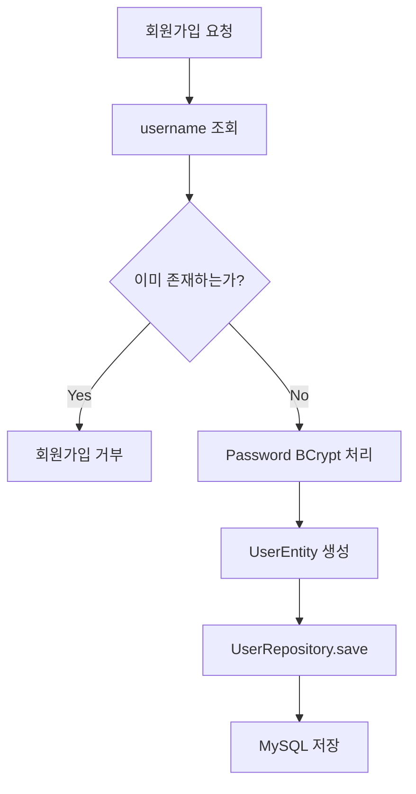
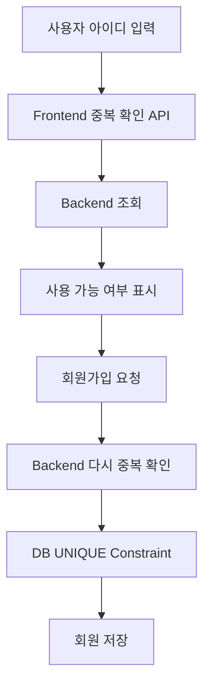
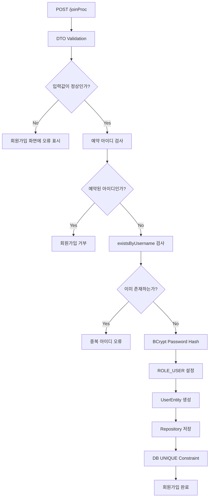

# 스프링 시큐리티 6 - 회원 중복 검증 방법
[https://youtu.be/MebrJCxjc6s?si=LGNlzAgFFlCRi0rg](https://youtu.be/MebrJCxjc6s?si=LGNlzAgFFlCRi0rg)

# 스프링 시큐리티 6 - 회원 중복 검증 방법
* toc
{:toc}

---

## Spring Security 회원가입 중복 검증과 아이디 유효성 검사

회원가입 기능은 단순히 사용자가 입력한 아이디와 비밀번호를 데이터베이스에 저장하는 것으로 끝나지 않는다.

실제로 회원가입을 구현하다 보면 생각해야 할 것이 꽤 많다.

가장 먼저 마주치는 문제가 아이디 중복이다.

예를 들어 이미 다음 사용자가 가입되어 있다고 해보자.

```text
username = user01
```

그런데 또 다른 사용자가 같은 아이디로 회원가입을 시도한다.

```text
username = user01
```

로그인 시 `username`을 사용자 식별자로 사용하고 있다면 두 사용자를 구분하기 어려워진다.

따라서 회원가입에서는 최소한 다음 세 단계의 방어가 필요하다.

```text
프론트 중복 확인
        ↓
백엔드 중복 검증
        ↓
DB UNIQUE 제약
```

여기서 중요한 점은 세 가지가 서로 같은 역할을 하는 것이 아니라는 것이다.

프론트 검증은 사용자 경험을 개선하기 위한 것이고, 백엔드 검증은 요청 자체의 유효성을 검사하기 위한 것이며, 데이터베이스의 `UNIQUE` 제약은 최종적으로 데이터 정합성을 지키는 역할을 한다.

---

## username을 UNIQUE로 설정하기

가장 먼저 데이터베이스에서 동일한 username이 중복 저장되지 않도록 설정하는 것이 좋다.

JPA Entity에서는 `@Column`의 `unique` 옵션을 사용할 수 있다.

```java
@Entity
@Table(name = "users")
@Getter
@NoArgsConstructor(access = AccessLevel.PROTECTED)
public class UserEntity {

    @Id
    @GeneratedValue(strategy = GenerationType.IDENTITY)
    private Long id;

    @Column(
            nullable = false,
            unique = true
    )
    private String username;

    @Column(nullable = false)
    private String password;

    @Column(nullable = false)
    private String role;
}
```

핵심은 다음 부분이다.

```java
@Column(unique = true)
private String username;
```

이렇게 설정하면 데이터베이스 Schema에도 username에 대한 Unique Constraint를 구성할 수 있다.

개념적으로 보면 다음과 같다.

```text
users

id       PK
username UNIQUE
password
role
```

따라서 다음과 같은 데이터는 허용되지 않는다.

```text
1 | user01 | ...
2 | user01 | ...
```

---

## UNIQUE는 중복 검사가 아니라 마지막 방어선이다

여기서 구분해야 할 것이 있다.

`UNIQUE` 제약은 사용자가 회원가입 버튼을 눌렀을 때 친절하게 중복 여부를 알려주는 비즈니스 검증 로직은 아니다.

중복 데이터가 실제 Database에 들어오는 것을 막는 **최종 방어선**에 가깝다.

회원가입 로직은 보통 다음처럼 동작하는 것이 자연스럽다.

```text
회원가입 요청
    ↓
username 존재 여부 조회
    ↓
이미 존재
    ↓
회원가입 거부
```

존재하지 않는 경우에만 다음 단계로 넘어간다.

```text
중복 없음
    ↓
Password Hash
    ↓
Entity 생성
    ↓
DB 저장
```

이를 위해 Repository에서 username 존재 여부를 확인할 수 있는 Query Method를 작성한다.

---

## existsByUsername 만들기

Spring Data JPA에서는 메서드 이름을 기반으로 Query를 생성할 수 있다.

`UserRepository`를 다음과 같이 작성한다.

```java
public interface UserRepository
        extends JpaRepository<UserEntity, Long> {

    boolean existsByUsername(String username);
}
```

메서드 이름을 그대로 읽으면 의미가 명확하다.

```text
exists
By
Username
```

즉:

```text
이 username을 가진 데이터가 존재하는가?
```

를 확인한다.

반환값은 `boolean`이다.

```text
존재함
→ true

존재하지 않음
→ false
```

회원가입 Service에서는 이 값을 이용하면 된다.

---

## Service에서 회원 중복 검증하기

회원가입 요청이 들어오면 가장 먼저 username 중복 여부를 확인한다.

```java
@Service
@RequiredArgsConstructor
public class JoinService {

    private final UserRepository userRepository;
    private final PasswordEncoder passwordEncoder;

    @Transactional
    public void joinProcess(JoinDTO joinDTO) {

        boolean exists =
                userRepository.existsByUsername(
                        joinDTO.getUsername()
                );

        if (exists) {
            throw new IllegalArgumentException(
                    "이미 사용 중인 아이디입니다."
            );
        }

        String encodedPassword =
                passwordEncoder.encode(
                        joinDTO.getPassword()
                );

        UserEntity user =
                new UserEntity(
                        joinDTO.getUsername(),
                        encodedPassword,
                        "ROLE_USER"
                );

        userRepository.save(user);
    }
}
```

전체 흐름을 보면 다음과 같다.



이렇게 하면 중복 사용자는 실제 저장 단계까지 가지 않는다.

---

## 왜 중복 검사를 저장 전에 해야 할까?

Database에 `UNIQUE`가 있으니 그냥 저장하고 예외가 발생하면 처리하면 되지 않을까 생각할 수도 있다.

기술적으로는 가능하다.

하지만 사용자가 일반적인 회원가입을 시도했을 뿐인데 Database Constraint Exception이 비즈니스 흐름의 중심이 되는 것은 좋지 않다.

다음과 같이 사전에 검증하면 의도가 더 명확하다.

```text
username 중복 확인

    ↓

중복이면
회원가입 종료
```

그리고 DB `UNIQUE`는 혹시라도 Application 검증을 통과한 중복 요청이 들어왔을 때 마지막으로 데이터를 보호한다.

---

## existsByUsername만으로는 부족한 이유

여기서 실무적으로 중요한 문제가 하나 있다.

거의 동시에 동일한 username으로 두 개의 요청이 들어왔다고 생각해보자.

```text
Request A
username = user01

Request B
username = user01
```

두 요청이 거의 같은 시점에 중복 검사를 실행할 수 있다.

```text
Request A
existsByUsername()
→ false

Request B
existsByUsername()
→ false
```

둘 다 아직 저장되기 전이라면 두 요청 모두 중복이 없다고 판단할 수 있다.

그 뒤에 동시에 저장을 시도한다.

```text
A → INSERT user01
B → INSERT user01
```

Application Level의 사전 조회만 사용하면 이런 경쟁 상황을 완전히 막을 수 없다.

따라서 구조를 다음처럼 만드는 것이 좋다.

```text
1차 검증

existsByUsername()
→ 빠른 사전 검증
→ 사용자에게 이해하기 쉬운 오류 제공


2차 검증

DB UNIQUE Constraint
→ 최종 데이터 정합성 보장
```

즉 둘 중 하나를 선택하는 것이 아니라 둘 다 사용한다.

---

## Database UNIQUE 오류도 처리해야 한다

`existsByUsername()` 검사를 통과했더라도 동시성 상황 때문에 Database 저장 시 Unique Constraint 오류가 발생할 수 있다.

따라서 실제 서비스에서는 Database Constraint Exception도 적절한 회원가입 실패 응답으로 변환하는 것이 좋다.

개념적으로는 다음과 같다.

```text
회원가입 요청
    ↓
existsByUsername
    ↓
중복 없음
    ↓
INSERT
    ↓
UNIQUE 충돌
    ↓
중복 아이디 오류로 변환
```

사용자에게 Database 내부 예외 메시지를 그대로 노출하는 것보다:

```text
이미 사용 중인 아이디입니다.
```

처럼 비즈니스 의미가 있는 메시지를 반환하는 편이 좋다.

---

## 프론트엔드에서 아이디 중복 확인하기

회원가입 화면에서는 보통 아이디 입력 옆에 다음과 같은 기능을 제공한다.

```text
아이디 입력

user01

[중복 확인]
```

버튼을 누르면 서버에 API를 호출한다.

예를 들어:

```http
GET /api/users/check-username?username=user01
```

서버는 결과를 반환한다.

```json
{
  "available": false
}
```

프론트에서는 다음과 같이 보여줄 수 있다.

```text
이미 사용 중인 아이디입니다.
```

또는:

```text
사용 가능한 아이디입니다.
```

이런 검사는 사용자가 회원가입 Form을 전부 작성한 뒤 마지막에 실패하는 일을 줄여준다.

즉 프론트 중복 검사는 보안보다는 **사용자 경험을 개선하는 역할**이 크다.

---

## 프론트 중복 확인만 믿으면 안 된다

프론트에서 중복 확인을 구현했다고 해서 Backend의 검증을 제거하면 안 된다.

브라우저 화면은 서버에 접근하는 유일한 방법이 아니기 때문이다.

예를 들어 사용자는 직접 HTTP 요청을 보낼 수도 있다.

```text
curl
Postman
REST Client
직접 작성한 Script
```

Form의 중복 확인 버튼을 거치지 않고 바로 다음 요청을 보낼 수도 있다.

```http
POST /joinProc
```

따라서 다음 구조는 위험하다.

```text
Frontend에서 확인했으니까
Backend에서는 검사하지 않는다.
```

서버는 클라이언트가 정상적인 화면 흐름대로 요청을 보냈다는 사실을 신뢰해서는 안 된다.

결국 최종 검증은 Backend에서 다시 해야 한다.

```text
Frontend 검증
→ UX

Backend 검증
→ 비즈니스 규칙

Database Constraint
→ 데이터 정합성
```

---

## 프론트와 백엔드 검증 역할 정리

| 위치       | 역할             |
| -------- | -------------- |
| Frontend | 빠른 피드백과 사용자 편의 |
| Backend  | 최종 회원가입 규칙 검증  |
| Database | 데이터 정합성 보장     |

이 세 계층이 함께 동작하는 구조가 안정적이다.



중복 확인 API를 통과했다고 해서 실제 회원가입 시점까지 동일한 상태가 유지된다는 보장은 없다.

따라서 회원가입 요청에서 다시 검사해야 한다.

---

## username 유효성 검사도 필요하다

중복 여부만 확인하면 충분하지 않다.

사용자가 다음과 같은 아이디를 입력할 수도 있다.

```text
a
```

또는:

```text
aaaaaaaaaaaaaaaaaaaaaaaaaaaaaaaaaaaaaaaaaaaa
```

또는 서비스에서 예약해둔 이름을 입력할 수도 있다.

```text
admin
administrator
system
root
support
```

서비스 정책에 따라 이런 아이디를 제한할 수 있다.

예를 들어 다음 규칙을 만든다고 가정하자.

```text
4자 이상
20자 이하

영문 소문자
숫자
언더스코어 허용
```

정규식은 다음과 같이 구성할 수 있다.

```regex
^[a-z0-9_]{4,20}$
```

예를 들면:

```text
user01
→ 가능

user_01
→ 가능

ab
→ 너무 짧음

user@01
→ 허용하지 않은 문자
```

---

## DTO에서 Validation 적용하기

Spring Validation을 사용하면 요청 DTO 단계에서 검증할 수 있다.

```java
@Getter
@Setter
public class JoinDTO {

    @NotBlank
    @Pattern(
            regexp = "^[a-z0-9_]{4,20}$",
            message = "아이디는 4~20자의 영문 소문자, 숫자, 언더스코어만 사용할 수 있습니다."
    )
    private String username;

    @NotBlank
    @Size(
            min = 8,
            max = 100
    )
    private String password;
}
```

Controller에서는 `@Valid`를 사용할 수 있다.

```java
@PostMapping("/joinProc")
public String joinProcess(
        @Valid @ModelAttribute JoinDTO joinDTO,
        BindingResult bindingResult
) {

    if (bindingResult.hasErrors()) {
        return "join";
    }

    joinService.joinProcess(joinDTO);

    return "redirect:/login";
}
```

이렇게 하면 Service까지 잘못된 요청이 내려가기 전에 기본적인 형식 검증을 수행할 수 있다.

---

## 예약 아이디도 검사하기

정규식에 맞는다고 해서 모든 아이디를 허용해야 하는 것은 아니다.

다음 값은 정규식에는 정상적으로 통과한다.

```text
admin
system
root
```

하지만 서비스 정책상 사용자가 가져서는 안 되는 이름일 수 있다.

따라서 별도의 예약 아이디 검사를 둘 수 있다.

```java
private static final Set<String> RESERVED_USERNAMES =
        Set.of(
                "admin",
                "administrator",
                "system",
                "root",
                "support"
        );
```

검증한다.

```java
if (
        RESERVED_USERNAMES.contains(
                joinDTO.getUsername()
        )
) {
    throw new IllegalArgumentException(
            "사용할 수 없는 아이디입니다."
    );
}
```

정규식과 예약어 검사는 서로 다른 문제다.

```text
정규식
→ 아이디 형식 검증

Reserved Username
→ 서비스 정책 검증
```

---

## 정규식과 SQL Injection은 구분해야 한다

아이디에서 특수문자를 제한하면 예상치 못한 입력을 줄이는 효과는 있다.

하지만 정규식으로 특수문자를 막는 것을 SQL Injection의 핵심 방어 방법이라고 이해하면 안 된다.

예를 들어 공격 문자열을:

```text
' OR '1'='1
```

정규식에서 막을 수도 있다.

하지만 SQL Injection 방어의 핵심은 사용자 입력값을 SQL 문자열에 직접 이어 붙이지 않는 것이다.

다음과 같은 코드는 위험하다.

```java
String sql =
        "SELECT * FROM users WHERE username = '"
        + username
        + "'";
```

반면 JPA Repository Query Method처럼 Parameter Binding을 사용하는 구조를 활용하는 것이 기본적인 방어 방식이다.

```java
boolean existsByUsername(
        String username
);
```

즉 다음을 구분해야 한다.

```text
Regex
→ 입력 형식 검증
```

```text
Parameter Binding
→ SQL Injection 방어
```

아이디에 특수문자를 허용할 것인지 여부는 서비스의 username 정책으로 판단하면 된다.

---

## 비밀번호는 username과 같은 정규식을 사용하지 않는다

아이디에는 허용 문자를 제한할 수 있지만 Password에는 무조건 동일한 정책을 적용할 필요는 없다.

예를 들어:

```text
Password에서 특수문자 사용 금지
```

같은 정책은 오히려 사용할 수 있는 Password 공간을 줄일 수 있다.

Password는 길이를 충분히 확보하고 BCrypt 같은 Password Hashing Algorithm을 적용하는 것이 중요하다.

회원가입에서는:

```java
String encodedPassword =
        passwordEncoder.encode(
                joinDTO.getPassword()
        );
```

를 이용한다.

Database에는 반드시 Hash 결과를 저장한다.

```text
사용자 입력

my-password-123!

      ↓

BCrypt

      ↓

$2a$10$...

      ↓

Database
```

---

## 회원가입 검증 순서

지금까지의 내용을 하나의 흐름으로 정리해보자.

회원가입 요청이 들어왔다.

```text
POST /joinProc
```

가장 먼저 DTO Validation을 수행한다.

```text
username 형식
password 형식
필수값
```

통과하면 Service로 넘어간다.

Service에서는 다음을 검사한다.

```text
예약 username인가?

이미 존재하는 username인가?
```

모든 조건을 통과했다면 Password를 Hash한다.

```text
Raw Password
    ↓
BCrypt
```

그 다음 사용자 Entity를 생성한다.

```text
username
hashedPassword
ROLE_USER
```

Repository를 통해 저장한다.

```text
UserRepository.save()
```

마지막으로 Database의 Unique Constraint가 데이터 정합성을 보호한다.

전체 구조는 다음과 같다.



---

## JoinService를 조금 더 현실적으로 작성하기

지금까지 내용을 반영하면 Service를 다음과 같이 구성할 수 있다.

```java
@Service
@RequiredArgsConstructor
public class JoinService {

    private static final Set<String> RESERVED_USERNAMES =
            Set.of(
                    "admin",
                    "administrator",
                    "system",
                    "root"
            );

    private final UserRepository userRepository;
    private final PasswordEncoder passwordEncoder;

    @Transactional
    public void joinProcess(
            JoinDTO joinDTO
    ) {

        String username =
                joinDTO.getUsername();

        if (
                RESERVED_USERNAMES.contains(
                        username
                )
        ) {
            throw new IllegalArgumentException(
                    "사용할 수 없는 아이디입니다."
            );
        }

        if (
                userRepository.existsByUsername(
                        username
                )
        ) {
            throw new IllegalArgumentException(
                    "이미 사용 중인 아이디입니다."
            );
        }

        String encodedPassword =
                passwordEncoder.encode(
                        joinDTO.getPassword()
                );

        UserEntity user =
                new UserEntity(
                        username,
                        encodedPassword,
                        "ROLE_USER"
                );

        userRepository.save(user);
    }
}
```

이렇게 하면 Service의 흐름도 자연스럽게 읽힌다.

```text
사용 가능한 아이디인가?
        ↓
중복되지 않았는가?
        ↓
비밀번호 Hash
        ↓
회원 저장
```

---

## Entity에도 UNIQUE 제약을 둔다

Service 검증과 함께 Entity에도 설정한다.

```java
@Entity
@Table(name = "users")
@Getter
@NoArgsConstructor(access = AccessLevel.PROTECTED)
public class UserEntity {

    @Id
    @GeneratedValue(strategy = GenerationType.IDENTITY)
    private Long id;

    @Column(
            nullable = false,
            unique = true
    )
    private String username;

    @Column(nullable = false)
    private String password;

    @Column(nullable = false)
    private String role;

    public UserEntity(
            String username,
            String password,
            String role
    ) {
        this.username = username;
        this.password = password;
        this.role = role;
    }
}
```

다시 한 번 정리하면 두 로직의 목적은 다르다.

```text
existsByUsername()
→ 회원가입 전에 중복 여부 확인
```

```text
UNIQUE
→ Database 자체에서 중복 저장 차단
```

둘 다 있어야 한다.

---

## 회원가입 중복 확인 API를 만든다면

프론트엔드에서 아이디 중복 여부를 실시간으로 확인하려면 별도 Endpoint를 만들 수도 있다.

예를 들어:

```java
@RestController
@RequiredArgsConstructor
@RequestMapping("/api/users")
public class UserCheckController {

    private final UserRepository userRepository;

    @GetMapping("/check-username")
    public Map<String, Boolean> checkUsername(
            @RequestParam String username
    ) {

        boolean exists =
                userRepository.existsByUsername(
                        username
                );

        return Map.of(
                "available",
                !exists
        );
    }
}
```

사용자가 다음 요청을 보낸다.

```http
GET /api/users/check-username?username=user01
```

사용 가능한 경우:

```json
{
  "available": true
}
```

이미 존재한다면:

```json
{
  "available": false
}
```

를 반환할 수 있다.

다만 이 API의 결과가 회원가입 성공을 보장하는 것은 아니다.

중복 확인 직후 다른 사용자가 먼저 같은 아이디로 가입할 수도 있기 때문이다.

실제 회원가입 요청에서는 다시 중복 검사를 수행해야 한다.

---

## 실무에서 특히 기억할 부분

회원가입 중복 처리를 구현할 때 가장 흔한 실수는 하나의 검증만으로 충분하다고 생각하는 것이다.

예를 들어:

```text
프론트 중복 확인 있으니까 끝
```

도 충분하지 않고,

```text
existsByUsername 있으니까 끝
```

도 충분하지 않다.

안정적인 구조는 다음과 같다.

```text
Frontend
→ 빠른 사용자 피드백

Backend
→ 회원가입 요청 최종 검증

Database
→ UNIQUE Constraint로 정합성 보호
```

그리고 username 자체에 대해서도 별도의 정책이 필요하다.

```text
허용 길이
허용 문자
예약 아이디
대소문자 정책
앞뒤 공백
중복 여부
```

비밀번호 역시:

```text
길이 검증
BCrypt Hash
평문 저장 금지
로그 출력 금지
```

같은 처리가 필요하다.

회원가입이라는 기능 하나 안에도 생각해야 할 보안과 데이터 정합성 문제가 상당히 많다.

---

## 정리

회원가입에서 username 중복 검증은 단순한 편의 기능이 아니라 로그인 식별자의 일관성을 유지하기 위한 중요한 비즈니스 규칙이다.

Spring Data JPA에서는 다음과 같은 Query Method를 이용해 중복 여부를 확인할 수 있다.

```java
boolean existsByUsername(
        String username
);
```

Service에서는 회원을 저장하기 전에 검사한다.

```java
if (
        userRepository.existsByUsername(
                joinDTO.getUsername()
        )
) {
    throw new IllegalArgumentException(
            "이미 사용 중인 아이디입니다."
    );
}
```

그리고 Database에도 반드시 Unique Constraint를 두는 것이 좋다.

```java
@Column(
        nullable = false,
        unique = true
)
private String username;
```

두 방식의 목적은 다르다.

```text
existsByUsername
→ 회원가입 비즈니스 검증

UNIQUE
→ 최종 데이터 정합성
```

프론트의 중복 확인 역시 사용할 수 있지만 어디까지나 사용자 편의를 위한 보조 기능이다.

```text
Frontend 중복 확인
        ↓
Backend 중복 재검증
        ↓
Database UNIQUE
```

또한 username에는 단순 중복 검사 외에도 형식 검증이 필요하다.

```text
길이
허용 문자
예약 아이디
공백
```

등을 확인해야 한다.

정규식은 이러한 **입력 형식 검증**에 사용할 수 있다.

반면 SQL Injection은 정규식으로 특수문자를 막는 것만으로 해결하는 문제가 아니다. 사용자 입력을 SQL 문자열에 직접 연결하지 않고 JPA Parameter Binding과 같은 안전한 데이터 접근 방식을 사용하는 것이 핵심이다.

최종적인 회원가입 검증 흐름은 다음과 같이 정리할 수 있다.

```text
회원가입 요청

    ↓

DTO Validation

    ↓

아이디 형식 검증

    ↓

예약 아이디 검증

    ↓

existsByUsername

    ↓

Password BCrypt Hash

    ↓

ROLE_USER 지정

    ↓

UserEntity 생성

    ↓

Repository.save()

    ↓

Database UNIQUE Constraint

    ↓

회원가입 완료
```

회원가입을 안정적으로 구현하려면 **프론트 검증, 백엔드 검증, 데이터베이스 제약 조건을 각각 다른 책임의 방어선으로 구성하는 것**이 핵심이다.

### 한 줄 요약

Spring Security 회원가입에서 아이디 중복은 `existsByUsername()`으로 백엔드에서 사전 검증하고 Database에는 `UNIQUE` 제약을 추가해 최종 정합성을 보장해야 하며, 프론트 중복 확인과 정규식 검증은 이를 보조하는 역할로 사용하는 것이 좋다.
