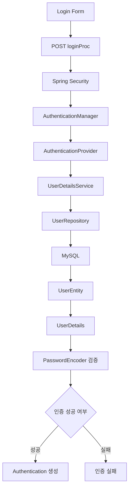
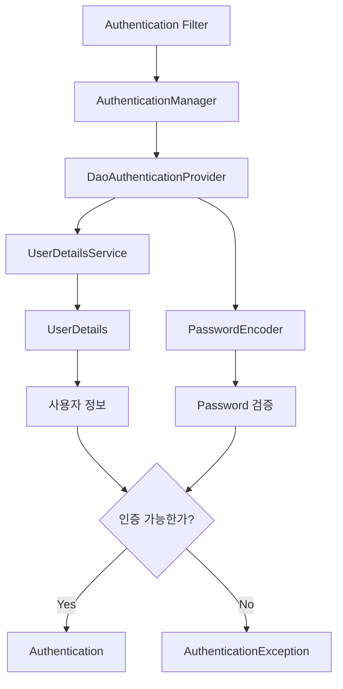
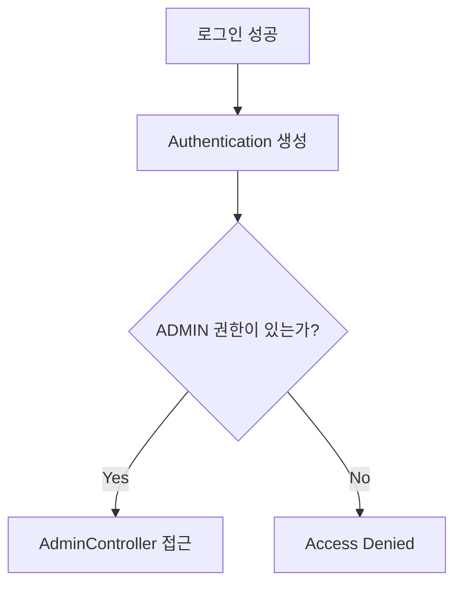
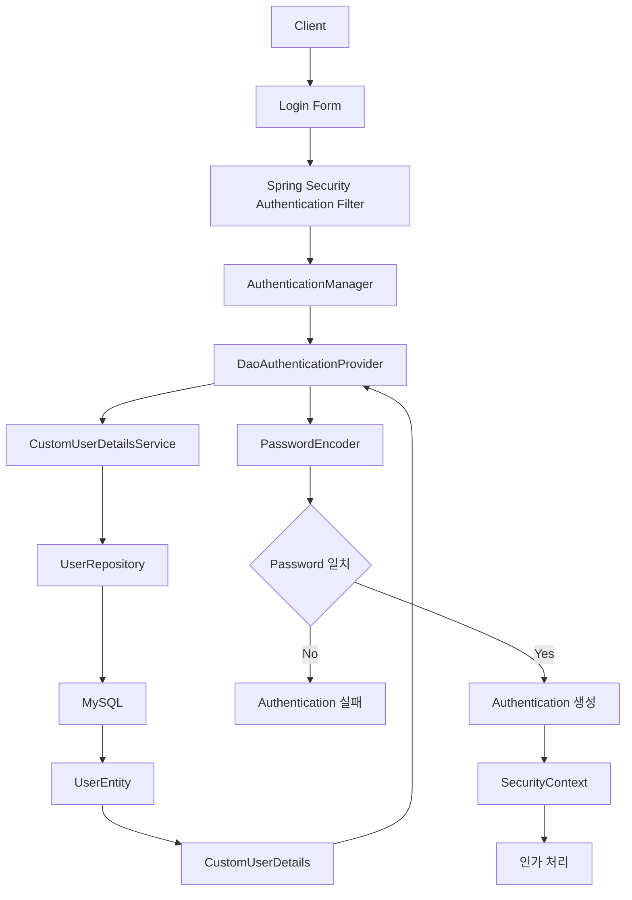

# 스프링 시큐리티 6 - 8. DB기반 로그인 검증 로직
[https://youtu.be/U3Jkuy5Hc00?si=F_W9GiQ9KPW37nQs](https://youtu.be/U3Jkuy5Hc00?si=F_W9GiQ9KPW37nQs)

# 스프링 시큐리티 6 - 8. DB기반 로그인 검증 로직
* toc
{:toc}

---

## Spring Security DB 기반 로그인 검증: UserDetailsService와 UserDetails

회원가입 기능까지 구현했다면 데이터베이스에는 실제 회원 정보가 저장되어 있다.

예를 들어 다음과 같은 데이터가 있다고 가정해보자.

| id | username | password     | role       |
| -: | -------- | ------------ | ---------- |
|  1 | user01   | `$2a$10$...` | ROLE_USER  |
|  2 | admin    | `$2a$10$...` | ROLE_ADMIN |

이제 사용자가 로그인 화면에서 아이디와 비밀번호를 입력했을 때 이 데이터를 이용해 실제 인증을 수행해야 한다.

앞에서 커스텀 로그인 Form을 다음과 같이 구성했다면:

```html
<form action="/loginProc" method="post">
    <input name="username" type="text">
    <input name="password" type="password">

    <button type="submit">
        로그인
    </button>
</form>
```

사용자가 로그인 버튼을 누르는 순간 다음 요청이 발생한다.

```text
POST /loginProc

username=admin
password=1234
```

여기서 중요한 점이 있다.

`/loginProc`을 처리하는 Controller를 직접 만든 것이 아니다.

```java
@PostMapping("/loginProc")
public String login(...) {
}
```

와 같은 코드를 작성하지 않아도 된다.

Spring Security 설정에서 다음과 같이 지정했기 때문이다.

```java
.formLogin(form -> form
        .loginPage("/login")
        .loginProcessingUrl("/loginProc")
        .permitAll()
)
```

따라서 `POST /loginProc` 요청이 들어오면 Spring Security의 인증 Filter가 요청을 받아 로그인 처리를 시작한다.

하지만 Spring Security는 아직 한 가지 사실을 모른다.

```text
"admin이라는 회원을 어디에서 가져와야 하지?"
```

회원 정보는 우리가 만든 MySQL의 `users` Table에 있기 때문이다.

이때 Spring Security와 우리 애플리케이션의 회원 데이터를 연결해주는 핵심 인터페이스가 `UserDetailsService`다.

---

## 전체 로그인 흐름부터 이해하기

DB 기반 로그인 인증은 크게 다음과 같은 흐름으로 진행된다.



직접 구현해야 하는 부분과 Spring Security가 담당하는 부분을 구분하면 이해하기 쉽다.

우리가 주로 구현하는 부분은 다음과 같다.

```text
UserRepository
        ↓
UserDetailsService
        ↓
UserDetails
```

Spring Security는 이 정보를 이용해 나머지 인증 절차를 진행한다.

```text
Password 검증
        ↓
Authentication 생성
        ↓
SecurityContext에 인증 정보 보관
        ↓
인가 처리
```

Spring Security의 공식 구조에서도 `DaoAuthenticationProvider`가 `UserDetailsService`를 통해 사용자를 조회한 뒤 `PasswordEncoder`를 이용해 비밀번호를 검증한다.

---

## UserDetailsService는 왜 필요한가?

우리 애플리케이션에는 다음 Entity가 있다.

```java
@Entity
@Table(name = "users")
public class UserEntity {

    @Id
    @GeneratedValue(strategy = GenerationType.IDENTITY)
    private Long id;

    private String username;

    private String password;

    private String role;
}
```

그리고 Repository도 있다.

```java
public interface UserRepository
        extends JpaRepository<UserEntity, Long> {
}
```

문제는 Spring Security가 이 구조를 모른다는 것이다.

Spring Security 입장에서 보면:

```text
UserEntity
UserRepository
users Table
```

은 우리 애플리케이션이 만든 클래스와 데이터일 뿐이다.

Spring Security는 로그인 과정에서 사용할 사용자 정보를 자신이 이해할 수 있는 형태로 전달받아야 한다.

이 역할을 하는 것이:

```text
UserDetailsService
```

와:

```text
UserDetails
```

이다.

관계를 단순하게 표현하면 다음과 같다.

```text
Database 회원 정보
        ↓
UserDetailsService
        ↓
UserDetails
        ↓
Spring Security
```

---

## UserDetailsService의 역할

`UserDetailsService`는 Spring Security가 로그인하려는 사용자의 정보를 조회할 때 사용하는 인터페이스다.

핵심 메서드는 단 하나다.

```java
UserDetails loadUserByUsername(
        String username
) throws UsernameNotFoundException;
```

Spring Security는 사용자가 로그인 Form에 입력한 username을 이 메서드에 전달한다.

예를 들어 사용자가:

```text
username = admin
```

을 입력했다면 개념적으로 다음과 같은 호출이 이루어진다.

```java
loadUserByUsername("admin");
```

그럼 우리가 해야 하는 일은 간단하다.

```text
admin

   ↓

UserRepository

   ↓

Database 조회

   ↓

UserEntity 반환

   ↓

UserDetails 형태로 변환

   ↓

Spring Security에게 반환
```

`UserDetailsService`는 username/password 인증에서 사용자를 조회하는 Spring Security의 핵심 전략 인터페이스다.

---

## CustomUserDetailsService 만들기

먼저 Service Package에 클래스를 만든다.

```text
service
└── CustomUserDetailsService.java
```

그리고 `UserDetailsService`를 구현한다.

```java
@Service
@RequiredArgsConstructor
public class CustomUserDetailsService
        implements UserDetailsService {

    private final UserRepository userRepository;

    @Override
    public UserDetails loadUserByUsername(
            String username
    ) throws UsernameNotFoundException {

        return null;
    }
}
```

`UserDetailsService`를 구현하면 반드시 다음 메서드를 구현해야 한다.

```java
loadUserByUsername(String username)
```

이 메서드의 역할은 이름 그대로다.

```text
username을 기준으로
UserDetails를 가져온다.
```

---

## Repository에서 username 조회 기능 만들기

현재 Repository에는 `JpaRepository`가 제공하는 기본 기능만 존재한다.

```java
public interface UserRepository
        extends JpaRepository<UserEntity, Long> {
}
```

하지만 로그인에서는 ID가 아니라 username을 기준으로 회원을 찾아야 한다.

따라서 Query Method를 추가한다.

간단한 형태는 다음과 같다.

```java
UserEntity findByUsername(
        String username
);
```

전체 Repository는 다음처럼 구성할 수 있다.

```java
public interface UserRepository
        extends JpaRepository<UserEntity, Long> {

    UserEntity findByUsername(
            String username
    );
}
```

Spring Data JPA는 Method 이름을 해석한다.

```text
find
By
Username
```

그리고 개념적으로 다음 조건의 Query를 수행한다.

```sql
SELECT *
FROM users
WHERE username = ?;
```

앞에서 회원가입 중복 검사를 위해 만든 메서드까지 포함한다면:

```java
public interface UserRepository
        extends JpaRepository<UserEntity, Long> {

    boolean existsByUsername(
            String username
    );

    UserEntity findByUsername(
            String username
    );
}
```

형태가 된다.

---

## 로그인 username으로 회원 조회하기

이제 `CustomUserDetailsService`에서 Repository를 사용한다.

```java
@Service
@RequiredArgsConstructor
public class CustomUserDetailsService
        implements UserDetailsService {

    private final UserRepository userRepository;

    @Override
    public UserDetails loadUserByUsername(
            String username
    ) throws UsernameNotFoundException {

        UserEntity user =
                userRepository.findByUsername(
                        username
                );

        return null;
    }
}
```

사용자가 다음 아이디를 입력했다면:

```text
admin
```

다음 흐름으로 데이터가 조회된다.

```text
Spring Security

loadUserByUsername("admin")

        ↓

UserRepository

findByUsername("admin")

        ↓

MySQL

        ↓

UserEntity
```

이제 가져온 `UserEntity`를 Spring Security가 이해할 수 있는 `UserDetails` 객체로 변환해야 한다.

---

## UserDetails란?

`UserDetailsService`가 Database 사용자 조회를 담당한다면 `UserDetails`는 조회된 사용자를 Spring Security가 이해할 수 있는 형태로 표현하는 인터페이스다.

Spring Security는 로그인 과정에서 다음 정보가 필요하다.

```text
username
password
authorities
계정 만료 여부
계정 잠금 여부
Credential 만료 여부
계정 활성화 여부
```

우리의 `UserEntity`에는 현재 다음 데이터가 있다.

```text
id
username
password
role
```

따라서 둘 사이를 연결하는 Adapter 역할의 클래스를 하나 만든다.

```text
UserEntity

    ↓

CustomUserDetails

    ↓

UserDetails

    ↓

Spring Security
```

---

## CustomUserDetails 만들기

예를 들어 다음 Package를 만들 수 있다.

```text
dto
entity
repository
service
security
```

그리고 `security` Package 안에 다음 클래스를 만든다.

```text
CustomUserDetails.java
```

기본 구조는 다음과 같다.

```java
public class CustomUserDetails
        implements UserDetails {

}
```

`UserDetails`를 구현하면 여러 메서드를 구현해야 한다.

```java
getAuthorities()

getPassword()

getUsername()

isAccountNonExpired()

isAccountNonLocked()

isCredentialsNonExpired()

isEnabled()
```

이 메서드들이 Spring Security가 사용자의 상태를 이해하기 위한 정보다.

---

## UserEntity를 CustomUserDetails에 전달하기

먼저 Entity를 보관할 Field를 만든다.

```java
public class CustomUserDetails
        implements UserDetails {

    private final UserEntity userEntity;

    public CustomUserDetails(
            UserEntity userEntity
    ) {
        this.userEntity = userEntity;
    }
}
```

이제 하나의 `CustomUserDetails`가 하나의 회원 정보를 가진다.

```text
CustomUserDetails

        ↓

UserEntity

username
password
role
```

그리고 `UserDetails`에서 요구하는 메서드들은 이 Entity의 값을 기반으로 구현한다.

---

## getUsername 구현

가장 간단한 것은 username이다.

```java
@Override
public String getUsername() {

    return userEntity.getUsername();
}
```

Database:

```text
username = admin
```

이라면 Spring Security에는:

```text
admin
```

이 반환된다.

---

## getPassword 구현

Password 역시 Entity에서 반환한다.

```java
@Override
public String getPassword() {

    return userEntity.getPassword();
}
```

여기서 반환하는 Password가 매우 중요하다.

Database에는 다음과 같은 평문이 저장된 것이 아니다.

```text
1234
```

회원가입에서 BCrypt로 Hash한 값이 저장되어 있다.

```text
$2a$10$...
```

따라서:

```java
getPassword()
```

가 반환하는 값도 BCrypt Hash다.

```text
CustomUserDetails.getPassword()

        ↓

Database에 저장된 BCrypt Hash
```

---

## 비밀번호 비교는 UserDetailsService가 하지 않는다

이 부분은 로그인 구조를 이해할 때 특히 중요하다.

다음과 같은 코드를 `loadUserByUsername()`에 작성할 필요는 없다.

```java
if (
        inputPassword.equals(
                userEntity.getPassword()
        )
) {
    // 로그인 성공
}
```

또한 우리가 직접:

```java
passwordEncoder.matches(...)
```

를 `UserDetailsService` 안에서 호출하는 구조도 일반적인 Form Login 인증에서는 필요하지 않다.

`UserDetailsService`가 해야 할 핵심 역할은:

```text
username으로 회원을 찾는다.

        ↓

UserDetails를 반환한다.
```

여기까지다.

그 다음 Password 비교는 Spring Security의 `DaoAuthenticationProvider`가 `PasswordEncoder`를 이용해서 처리한다.

따라서 역할을 정확히 나누면 다음과 같다.

```text
UserDetailsService
→ 사용자 조회
```

```text
UserDetails
→ 사용자 인증 정보 표현
```

```text
PasswordEncoder
→ 비밀번호 검증
```

```text
DaoAuthenticationProvider
→ 위 구성요소를 이용해 실제 인증 수행
```

---

## getAuthorities 구현

다음으로 중요한 것이 권한이다.

`UserDetails`의 `getAuthorities()`는 현재 사용자가 가지고 있는 권한 목록을 반환한다.

반환 타입은 다음과 같은 형태다.

```java
Collection<? extends GrantedAuthority>
```

간단한 Role 하나만 가지고 있다면 다음과 같이 작성할 수 있다.

```java
@Override
public Collection<? extends GrantedAuthority>
getAuthorities() {

    return List.of(
            new SimpleGrantedAuthority(
                    userEntity.getRole()
            )
    );
}
```

Database에:

```text
ROLE_ADMIN
```

이 저장되어 있다면:

```java
new SimpleGrantedAuthority(
        "ROLE_ADMIN"
)
```

가 생성된다.

Spring Security는 이 권한을 이후 인가 과정에서 사용한다.

---

## hasRole과 ROLE_ 값 연결하기

SecurityConfig가 다음과 같다고 하자.

```java
.requestMatchers("/admin/**")
.hasRole("ADMIN")
```

그리고 Database에:

```text
ROLE_ADMIN
```

이 저장되어 있다.

`CustomUserDetails`에서는:

```java
new SimpleGrantedAuthority(
        userEntity.getRole()
)
```

를 통해:

```text
ROLE_ADMIN
```

Authority를 제공한다.

결과적으로:

```text
DB

ROLE_ADMIN

        ↓

CustomUserDetails

        ↓

GrantedAuthority

ROLE_ADMIN

        ↓

hasRole("ADMIN")

        ↓

접근 허용
```

이라는 흐름이 만들어진다.

---

## 여러 권한이 있다면?

현재 구조에서는 회원 한 명이 하나의 Role 문자열을 가지고 있다.

```text
ROLE_USER
```

또는:

```text
ROLE_ADMIN
```

하지만 실제 서비스에서는 여러 권한을 가질 수도 있다.

예를 들어:

```text
ROLE_ADMIN
USER_READ
USER_WRITE
PAYMENT_READ
```

와 같은 구조다.

그 경우 `getAuthorities()`에서 여러 `GrantedAuthority`를 반환할 수 있다.

```text
Collection<GrantedAuthority>

├── ROLE_ADMIN
├── USER_READ
├── USER_WRITE
└── PAYMENT_READ
```

현재 예제에서는 Role 하나만 사용하므로 하나의 `SimpleGrantedAuthority`를 반환하면 충분하다.

---

## 계정 상태 관련 메서드

`UserDetails`에는 다음 메서드들도 존재한다.

```java
isAccountNonExpired()

isAccountNonLocked()

isCredentialsNonExpired()

isEnabled()
```

이름 때문에 처음 보면 조금 헷갈릴 수 있다.

특히 모두 `Non`이 포함되어 있다.

### isAccountNonExpired

```java
@Override
public boolean isAccountNonExpired() {
    return true;
}
```

의미는:

```text
계정이 만료되지 않았는가?
```

다.

`true`라면:

```text
만료되지 않음
→ 사용할 수 있음
```

이다.

---

## isAccountNonLocked

```java
@Override
public boolean isAccountNonLocked() {
    return true;
}
```

의미는:

```text
계정이 잠기지 않았는가?
```

다.

`true`:

```text
잠기지 않음
```

`false`:

```text
잠긴 계정
```

이다.

---

## isCredentialsNonExpired

```java
@Override
public boolean isCredentialsNonExpired() {
    return true;
}
```

Password 같은 Credential이 만료되지 않았는지 나타낸다.

현재 단순한 회원 시스템에는 Password 만료 기능이 없으므로 `true`를 반환할 수 있다.

---

## isEnabled

```java
@Override
public boolean isEnabled() {
    return true;
}
```

현재 사용 가능한 계정인지 나타낸다.

예를 들어 탈퇴나 정지 기능이 있다면:

```text
ACTIVE
SUSPENDED
WITHDRAWN
```

같은 상태와 연결할 수 있다.

현재는 모든 가입 회원을 활성 회원으로 취급하기 때문에 `true`를 반환한다.

---

## CustomUserDetails 전체 코드

현재 구조에서는 다음과 같이 작성할 수 있다.

```java
package com.example.security.security;

import com.example.security.entity.UserEntity;
import org.springframework.security.core.GrantedAuthority;
import org.springframework.security.core.authority.SimpleGrantedAuthority;
import org.springframework.security.core.userdetails.UserDetails;

import java.util.Collection;
import java.util.List;

public class CustomUserDetails
        implements UserDetails {

    private final UserEntity userEntity;

    public CustomUserDetails(
            UserEntity userEntity
    ) {
        this.userEntity = userEntity;
    }

    @Override
    public Collection<? extends GrantedAuthority>
    getAuthorities() {

        return List.of(
                new SimpleGrantedAuthority(
                        userEntity.getRole()
                )
        );
    }

    @Override
    public String getPassword() {

        return userEntity.getPassword();
    }

    @Override
    public String getUsername() {

        return userEntity.getUsername();
    }

    @Override
    public boolean isAccountNonExpired() {

        return true;
    }

    @Override
    public boolean isAccountNonLocked() {

        return true;
    }

    @Override
    public boolean isCredentialsNonExpired() {

        return true;
    }

    @Override
    public boolean isEnabled() {

        return true;
    }
}
```

이제 Database의 `UserEntity`가 Spring Security에서 사용할 수 있는 `UserDetails`로 변환된다.

---

## CustomUserDetailsService 완성하기

이제 다시 `CustomUserDetailsService`로 돌아간다.

기본 흐름은 다음과 같다.

```text
username 전달
    ↓
Repository 조회
    ↓
UserEntity
    ↓
CustomUserDetails
    ↓
Spring Security 반환
```

다음처럼 구현할 수 있다.

```java
@Service
@RequiredArgsConstructor
public class CustomUserDetailsService
        implements UserDetailsService {

    private final UserRepository userRepository;

    @Override
    public UserDetails loadUserByUsername(
            String username
    ) throws UsernameNotFoundException {

        UserEntity user =
                userRepository.findByUsername(
                        username
                );

        if (user == null) {
            throw new UsernameNotFoundException(
                    "사용자를 찾을 수 없습니다."
            );
        }

        return new CustomUserDetails(user);
    }
}
```

즉:

```java
return new CustomUserDetails(user);
```

를 통해 Database Entity를 Spring Security에 전달한다.

---

## 사용자를 찾지 못했을 때 null을 반환하면 안 된다

단순하게 구현하다 보면 다음처럼 작성하고 싶을 수 있다.

```java
if (user == null) {
    return null;
}
```

하지만 이 부분은 실무에서 반드시 수정해서 이해해야 한다.

`UserDetailsService.loadUserByUsername()`의 계약에서는 사용자를 찾지 못했을 때 완전한 `UserDetails`를 반환하거나 `UsernameNotFoundException`을 발생시켜야 하며, 반환값은 `null`이면 안 된다. 현재 Spring Security API 문서에도 반환값을 `never null`로 명시하고 있다.

따라서 다음처럼 작성하는 것이 맞다.

```java
if (user == null) {
    throw new UsernameNotFoundException(
            "사용자를 찾을 수 없습니다: "
                    + username
    );
}
```

---

## Repository도 Optional로 작성하면 더 자연스럽다

Repository를 다음처럼 작성할 수도 있다.

```java
UserEntity findByUsername(
        String username
);
```

하지만 사용자가 존재하지 않을 가능성을 타입으로 표현하려면 `Optional`을 사용할 수도 있다.

```java
public interface UserRepository
        extends JpaRepository<UserEntity, Long> {

    boolean existsByUsername(
            String username
    );

    Optional<UserEntity> findByUsername(
            String username
    );
}
```

그러면 Service에서는 다음과 같이 작성할 수 있다.

```java
@Override
public UserDetails loadUserByUsername(
        String username
) throws UsernameNotFoundException {

    UserEntity user =
            userRepository
                    .findByUsername(username)
                    .orElseThrow(
                            () -> new UsernameNotFoundException(
                                    "사용자를 찾을 수 없습니다: "
                                            + username
                            )
                    );

    return new CustomUserDetails(user);
}
```

코드의 의도가 더 분명하다.

```text
username으로 조회

        ↓

있으면 UserEntity

        ↓

없으면 UsernameNotFoundException
```

---

## 전체 UserDetailsService 코드

최종적으로 다음과 같이 구성할 수 있다.

```java
package com.example.security.service;

import com.example.security.entity.UserEntity;
import com.example.security.repository.UserRepository;
import com.example.security.security.CustomUserDetails;
import lombok.RequiredArgsConstructor;
import org.springframework.security.core.userdetails.UserDetails;
import org.springframework.security.core.userdetails.UserDetailsService;
import org.springframework.security.core.userdetails.UsernameNotFoundException;
import org.springframework.stereotype.Service;

@Service
@RequiredArgsConstructor
public class CustomUserDetailsService
        implements UserDetailsService {

    private final UserRepository userRepository;

    @Override
    public UserDetails loadUserByUsername(
            String username
    ) throws UsernameNotFoundException {

        UserEntity user =
                userRepository
                        .findByUsername(username)
                        .orElseThrow(
                                () -> new UsernameNotFoundException(
                                        "사용자를 찾을 수 없습니다: "
                                                + username
                                )
                        );

        return new CustomUserDetails(user);
    }
}
```

---

## UserRepository 전체 코드

Repository는 다음과 같이 만들 수 있다.

```java
package com.example.security.repository;

import com.example.security.entity.UserEntity;
import org.springframework.data.jpa.repository.JpaRepository;

import java.util.Optional;

public interface UserRepository
        extends JpaRepository<UserEntity, Long> {

    boolean existsByUsername(
            String username
    );

    Optional<UserEntity> findByUsername(
            String username
    );
}
```

회원가입에서는:

```java
existsByUsername()
```

를 사용하고,

로그인에서는:

```java
findByUsername()
```

를 사용하는 구조다.

각 메서드의 목적이 다르다.

```text
회원가입

existsByUsername()
→ 중복 검사
```

```text
로그인

findByUsername()
→ 사용자 정보 조회
```

---

## 로그인 요청이 들어오면 실제로 누가 무엇을 할까?

여기까지 구현하면 로그인 과정이 꽤 자동으로 동작하기 때문에 오히려 내부 흐름을 놓치기 쉽다.

사용자가:

```text
username = admin
password = 1234
```

를 입력했다고 생각해보자.

Spring Security 내부 흐름을 단순화하면 다음과 같다.

```text
Login Form

        ↓

인증 Filter

        ↓

AuthenticationManager

        ↓

AuthenticationProvider

        ↓

UserDetailsService

        ↓

UserRepository

        ↓

Database
```

회원이 발견되면:

```text
UserEntity

        ↓

CustomUserDetails

        ↓

AuthenticationProvider
```

로 돌아간다.

그리고 저장된 Password와 사용자가 입력한 Password를 비교한다.

```text
입력 Password
1234

        ↓

PasswordEncoder

        ↕

DB BCrypt Password
$2a$10$...

        ↓

검증
```

공식 Spring Security의 `DaoAuthenticationProvider` 역시 이 구조로 `UserDetailsService`에서 사용자를 조회하고 `PasswordEncoder`로 비밀번호를 검증한다.

---

## DaoAuthenticationProvider의 역할

우리가 직접 `DaoAuthenticationProvider` 코드를 작성하지 않아도 Form Login 기반 username/password 인증에서는 이 구조를 이해해둘 필요가 있다.

역할을 나누면 다음과 같다.

```text
UserDetailsService
→ 회원 조회
```

```text
PasswordEncoder
→ 비밀번호 비교
```

그리고 이 둘을 이용해 인증을 수행하는 대표적인 Provider가:

```text
DaoAuthenticationProvider
```

다.

공식 구조는 다음과 같은 방향으로 동작한다.



---

## AuthenticationManager는 무엇을 할까?

로그인 요청을 받았다고 해서 Filter가 모든 인증 로직을 직접 수행하는 것은 아니다.

Filter는 인증 정보를 만들어 `AuthenticationManager`에게 인증을 요청한다.

개념적으로:

```text
username
password

    ↓

UsernamePasswordAuthenticationToken

    ↓

AuthenticationManager
```

형태다.

`AuthenticationManager`는 실제 인증을 수행할 수 있는 `AuthenticationProvider`에게 작업을 위임한다.

```text
AuthenticationManager

        ↓

AuthenticationProvider

        ↓

DaoAuthenticationProvider
```

따라서 전체적으로는 역할이 잘 나뉘어 있다.

---

## 우리가 직접 구현하는 부분은 어디까지인가?

처음 Spring Security를 보면 모든 인증 로직을 직접 구현해야 할 것처럼 느껴질 수 있다.

하지만 실제로는 그렇지 않다.

우리가 구현하는 핵심은:

```text
"우리 서비스의 사용자를
Spring Security가 어떻게 조회할 것인가?"
```

이다.

즉:

```text
UserRepository
+
UserDetailsService
+
UserDetails
```

를 연결한다.

Spring Security는 그 다음:

```text
Password 검증
Authentication 생성
SecurityContext 처리
인가
```

를 담당한다.

이를 기준으로 책임을 나누면 다음과 같다.

| 구성요소                     | 역할                              |
| ------------------------ | ------------------------------- |
| `UserRepository`         | DB 회원 조회                        |
| `UserDetailsService`     | username으로 회원을 조회해 Security에 전달 |
| `UserDetails`            | Security가 사용할 사용자 정보 표현         |
| `PasswordEncoder`        | Password 검증                     |
| `AuthenticationProvider` | 실제 인증                           |
| `AuthenticationManager`  | 인증 Provider 호출                  |
| `SecurityContext`        | 인증 완료 사용자 정보 보관                 |

---

## 로그인 성공 후 Authentication 생성

사용자 정보가 정상이고 Password도 일치하면 인증에 성공한다.

이때 Spring Security는 인증된 사용자를 나타내는 `Authentication` 객체를 구성한다.

개념적으로 다음 정보가 포함된다.

```text
Authentication

principal
→ CustomUserDetails

authorities
→ ROLE_ADMIN

authenticated
→ true
```

공식 문서에서도 `DaoAuthenticationProvider` 인증 성공 후 반환되는 `UsernamePasswordAuthenticationToken`의 principal로 `UserDetails`가 사용되고, 이후 인증 Filter가 해당 Authentication을 `SecurityContextHolder`에 설정한다고 설명한다.

따라서 우리가 만든:

```text
CustomUserDetails
```

객체가 로그인 이후에도 현재 사용자 정보를 표현하는 데 사용될 수 있다.

---

## 인증 정보는 어디에 저장될까?

인증이 완료되면 Spring Security는 현재 요청과 이후 인증 처리를 위해 `SecurityContext`를 사용한다.

단순화하면:

```text
로그인 성공

    ↓

Authentication

    ↓

SecurityContext

    ↓

SecurityContextHolder
```

형태다.

세션 기반 Form Login 환경에서는 이 인증 상태가 이후 요청에서도 사용할 수 있도록 연결된다.

그래서 사용자는 매 요청마다 다시 username/password를 입력하지 않는다.

```text
최초 로그인

username/password
    ↓
인증 완료
```

이후 요청:

```text
GET /admin

    ↓

이미 인증된 사용자

    ↓

권한 검사
```

형태로 진행된다.

---

## 인증과 인가는 다시 구분해야 한다

로그인에 성공했다고 모든 페이지에 접근할 수 있는 것은 아니다.

다음 회원이 있다고 해보자.

```text
username = user01
role = ROLE_USER
```

로그인은 성공할 수 있다.

```text
username 일치
password 일치

→ Authentication 성공
```

하지만 SecurityConfig가:

```java
.requestMatchers("/admin/**")
.hasRole("ADMIN")
```

이라면 `/admin`에는 접근할 수 없다.

```text
ROLE_USER

    ↓

GET /admin

    ↓

ROLE_ADMIN 필요

    ↓

접근 거부
```

반면:

```text
ROLE_ADMIN
```

사용자는 접근할 수 있다.



이것이 인증과 인가의 차이다.

---

## ADMIN 사용자로 확인해보기

회원가입 단계에서는 일반적으로 모든 신규 회원에게:

```text
ROLE_USER
```

를 부여하는 것이 정상적이다.

테스트를 위해 임시로:

```text
ROLE_ADMIN
```

사용자를 만들어 확인할 수는 있다.

예를 들어 Database에 다음 데이터가 있다고 하자.

```text
username = admin

password = BCrypt로 변환된 1234

role = ROLE_ADMIN
```

로그인 Form에서:

```text
username = admin
password = 1234
```

를 입력한다.

Spring Security 내부에서는:

```text
admin

    ↓

loadUserByUsername("admin")

    ↓

UserRepository

    ↓

UserEntity
```

을 가져온다.

`CustomUserDetails`에서는:

```text
username
→ admin

password
→ BCrypt Hash

authorities
→ ROLE_ADMIN
```

을 반환한다.

Password 검증까지 성공하면 Authentication이 만들어진다.

이제:

```text
GET /admin
```

요청에서:

```text
hasRole("ADMIN")
```

조건을 통과할 수 있다.

---

## 일반 회원가입에서 ADMIN을 부여하면 안 된다

테스트를 위해 Role을 `ROLE_ADMIN`으로 변경하는 것과 실제 회원가입 정책은 구분해야 한다.

일반 회원가입에서 다음과 같이 하면 안 된다.

```java
String role =
        joinDTO.getRole();
```

클라이언트가 직접:

```text
ROLE_ADMIN
```

을 보내 관리자 권한을 획득할 수 있기 때문이다.

일반 사용자의 회원가입에서는 서버에서 다음처럼 결정해야 한다.

```java
String role = "ROLE_USER";
```

관리자 권한 부여는 별도의 내부 운영 정책을 통해 처리하는 것이 안전하다.

---

## 계정 상태를 실제 Database와 연결하기

현재 `CustomUserDetails`에서는 다음 값들을 모두 `true`로 반환했다.

```java
@Override
public boolean isAccountNonExpired() {
    return true;
}

@Override
public boolean isAccountNonLocked() {
    return true;
}

@Override
public boolean isCredentialsNonExpired() {
    return true;
}

@Override
public boolean isEnabled() {
    return true;
}
```

간단한 시스템에서는 충분하다.

하지만 서비스가 커지면 실제 회원 상태와 연결할 수 있다.

예를 들어 Entity에 다음 Field가 있을 수 있다.

```java
private boolean enabled;

private boolean accountNonLocked;
```

그러면:

```java
@Override
public boolean isEnabled() {
    return userEntity.isEnabled();
}
```

처럼 구현할 수 있다.

---

## 로그인 실패 횟수와 계정 잠금으로 확장하기

예를 들어 비밀번호를 여러 번 틀리면 계정을 잠그는 기능이 필요하다고 생각해보자.

회원 데이터에:

```text
loginFailCount
accountLocked
```

같은 상태를 저장할 수 있다.

그리고 `UserDetails`에서:

```java
@Override
public boolean isAccountNonLocked() {

    return !userEntity.isAccountLocked();
}
```

처럼 연결할 수 있다.

구조는 다음과 같다.

```text
로그인 실패

    ↓

실패 횟수 증가

    ↓

일정 횟수 초과

    ↓

accountLocked = true

    ↓

isAccountNonLocked() = false

    ↓

로그인 차단
```

`UserDetails`의 계정 상태 메서드들이 단순한 형식적인 메서드가 아니라 이런 정책을 연결하기 위한 확장 지점이라는 것을 알 수 있다.

---

## UserDetails를 직접 구현하지 않는 방법도 있다

현재 구조에서는 학습과 사용자 정보 확장을 위해:

```java
CustomUserDetails
        implements UserDetails
```

형태로 직접 구현했다.

Spring Security에서는 기본 `User` 구현체도 제공한다.

예를 들어:

```java
return User.builder()
        .username(user.getUsername())
        .password(user.getPassword())
        .authorities(user.getRole())
        .build();
```

처럼 반환하는 방법도 있다.

다만 이후 다음과 같은 회원 고유 정보가 필요하다면:

```text
userId
email
nickname
organizationId
```

`CustomUserDetails`를 만들어두는 것이 활용하기 편할 수 있다.

예를 들어:

```java
public Long getUserId() {

    return userEntity.getId();
}
```

같은 기능을 추가할 수 있다.

---

## Entity 자체를 UserDetails로 구현해도 될까?

다음처럼 작성하는 방법도 기술적으로는 가능하다.

```java
@Entity
public class UserEntity
        implements UserDetails {
}
```

하지만 이렇게 하면 JPA Entity가 Spring Security 인터페이스에 직접 의존하게 된다.

```text
Persistence Model
+
Security Model
```

이 강하게 결합된다.

현재처럼 별도의 Adapter를 만들면:

```text
UserEntity
→ Database 책임

CustomUserDetails
→ Security 책임
```

으로 분리할 수 있다.

규모가 커질수록 이런 책임 분리가 유지보수 측면에서 유리할 수 있다.

---

## 로그인 전체 흐름을 코드 기준으로 따라가 보기

사용자가 로그인 Form을 제출한다.

```text
POST /loginProc

username=admin
password=1234
```

Spring Security가 인증 요청을 받는다.

```text
Authentication Filter
```

인증 정보가 `AuthenticationManager`로 전달된다.

```text
AuthenticationManager
```

`DaoAuthenticationProvider`가 username/password 인증을 담당한다.

```text
DaoAuthenticationProvider
```

사용자를 조회한다.

```java
customUserDetailsService
        .loadUserByUsername("admin");
```

Repository가 Database를 조회한다.

```java
userRepository
        .findByUsername("admin");
```

결과:

```text
UserEntity

username = admin
password = $2a$10$...
role = ROLE_ADMIN
```

이를 `UserDetails`로 변환한다.

```java
return new CustomUserDetails(
        user
);
```

Spring Security가 PasswordEncoder로 Password를 검증한다.

```text
입력값

1234

        ↓

PasswordEncoder

        ↕

$2a$10$...
```

검증에 성공하면 인증 객체를 만든다.

```text
Authentication
```

그리고 이후 인가 단계에서:

```text
ROLE_ADMIN
```

을 사용할 수 있다.

---

## 전체 인증 구조

지금까지 구현한 전체 구조를 한 번에 정리하면 다음과 같다.



이 흐름을 이해하면 Spring Security Login이 "자동으로 알아서 처리된다"는 표현이 구체적으로 무엇을 의미하는지 보인다.

자동화되어 있지만 내부적으로는 여러 역할이 나뉘어 있다.

---

## 현재까지 만든 프로젝트 구조

현재 구조를 정리하면 다음과 같다.

```text
src/main/java
└── com.example.security
    ├── config
    │   └── SecurityConfig.java
    │
    ├── controller
    │   ├── MainController.java
    │   ├── LoginController.java
    │   └── JoinController.java
    │
    ├── dto
    │   └── JoinDTO.java
    │
    ├── entity
    │   └── UserEntity.java
    │
    ├── repository
    │   └── UserRepository.java
    │
    ├── security
    │   └── CustomUserDetails.java
    │
    └── service
        ├── JoinService.java
        └── CustomUserDetailsService.java
```

각 클래스의 역할도 이제 명확해진다.

```text
JoinController
→ 회원가입 HTTP 요청 처리

JoinService
→ 회원가입 비즈니스 로직

UserRepository
→ 회원 저장과 조회

CustomUserDetailsService
→ 로그인 username으로 회원 조회

CustomUserDetails
→ Spring Security가 이해할 사용자 정보 제공

SecurityConfig
→ 로그인과 인가 정책
```

---

## 실무에서 보완할 점

기본적인 구조는 여기까지로 충분하지만 실제 프로젝트에서는 몇 가지를 더 신경 쓰는 것이 좋다.

### loadUserByUsername에서 null을 반환하지 않는다

사용자가 없을 때:

```java
return null;
```

로 끝내지 않는다.

`UserDetailsService`의 공식 계약상 `UserDetails`는 `null`이 아니어야 하므로 `UsernameNotFoundException`을 발생시키는 형태가 적절하다.

```java
throw new UsernameNotFoundException(
        "사용자를 찾을 수 없습니다."
);
```

---

### 비밀번호 비교를 직접 작성하지 않는다

다음 로직을 Service에 직접 구현하지 않는다.

```java
if (
        inputPassword.equals(
                storedPassword
        )
) {
}
```

BCrypt Hash는 이런 방식으로 비교하는 구조도 아니며, Spring Security Form Login에서는 `DaoAuthenticationProvider`가 등록된 `PasswordEncoder`를 이용해 검증하도록 역할을 맡기는 것이 자연스럽다.

---

### Repository는 Optional을 고려한다

다음보다:

```java
UserEntity findByUsername(
        String username
);
```

다음 형태가 사용자 부재 가능성을 좀 더 명확하게 표현한다.

```java
Optional<UserEntity> findByUsername(
        String username
);
```

그리고:

```java
.orElseThrow(
        () -> new UsernameNotFoundException(...)
)
```

으로 연결할 수 있다.

---

### 권한 문자열을 클라이언트에게 맡기지 않는다

```text
ROLE_USER
ROLE_ADMIN
```

은 서버 정책이어야 한다.

일반 회원가입에서 사용자가 임의로 `ROLE_ADMIN`을 지정할 수 있는 구조를 만들지 않는다.

---

### 계정 상태는 서비스 요구사항에 맞춰 확장한다

현재는 모두:

```java
return true;
```

지만 이후 다음 기능과 연결할 수 있다.

```text
회원 정지
휴면 계정
비밀번호 만료
관리자 잠금
로그인 실패 누적
탈퇴 처리
```

---

## 정리

DB 기반 Spring Security 로그인에서 핵심은 **Database의 회원 정보를 Spring Security가 이해할 수 있는 형태로 연결하는 것**이다.

사용자가 로그인하면:

```text
username
password
```

가 Spring Security에 전달된다.

Spring Security는 `UserDetailsService`의:

```java
loadUserByUsername(username)
```

을 이용해 사용자를 찾는다.

우리의 구현에서는:

```text
CustomUserDetailsService

        ↓

UserRepository

        ↓

MySQL
```

을 통해 `UserEntity`를 가져온다.

가져온 Entity는:

```java
new CustomUserDetails(userEntity)
```

로 변환한다.

`CustomUserDetails`는 Spring Security에 다음 정보를 제공한다.

```text
username
password
authorities
계정 상태
```

가장 중요한 세 메서드는 다음과 같다.

```java
getUsername()
getPassword()
getAuthorities()
```

`getAuthorities()`에서는 Database에 저장된 Role을 `GrantedAuthority`로 변환한다.

```java
@Override
public Collection<? extends GrantedAuthority>
getAuthorities() {

    return List.of(
            new SimpleGrantedAuthority(
                    userEntity.getRole()
            )
    );
}
```

Database가:

```text
ROLE_ADMIN
```

이라면 Spring Security에서도 `ROLE_ADMIN` 권한으로 사용할 수 있다.

그리고 중요한 점은 `CustomUserDetailsService`가 Password까지 직접 검증하는 것이 아니라는 것이다.

```text
CustomUserDetailsService
→ 사용자 조회

PasswordEncoder
→ Password 검증

DaoAuthenticationProvider
→ 실제 인증 처리
```

Spring Security의 실제 username/password 인증 역시 `DaoAuthenticationProvider`가 `UserDetailsService`에서 사용자를 조회하고 `PasswordEncoder`로 비밀번호를 검증하는 구조로 동작한다.

인증에 성공하면:

```text
Authentication
```

이 생성되고 이후:

```text
SecurityContext
```

에서 인증된 사용자 정보를 사용할 수 있게 된다.

결국 전체 로그인 검증 흐름은 다음과 같다.

```text
Login Form

    ↓

Spring Security

    ↓

AuthenticationManager

    ↓

DaoAuthenticationProvider

    ↓

CustomUserDetailsService

    ↓

UserRepository

    ↓

MySQL

    ↓

UserEntity

    ↓

CustomUserDetails

    ↓

PasswordEncoder

    ↓

Authentication

    ↓

SecurityContext

    ↓

Role 기반 인가
```

이 구조까지 연결되면 Spring Boot가 기본으로 만들어주던 임시 `user` 계정이 아니라 **직접 회원가입하여 MySQL에 저장한 실제 회원 정보를 이용한 Spring Security 인증 구조**가 완성된다.

### 한 줄 요약

Spring Security의 DB 기반 로그인은 `UserDetailsService`가 username으로 회원을 조회하고 `UserDetails`가 username·BCrypt Password·권한 정보를 Spring Security에 제공하면, `DaoAuthenticationProvider`가 `PasswordEncoder`로 비밀번호를 검증하여 `Authentication`을 생성하고 이후 Role 기반 인가에 활용하는 구조다.
