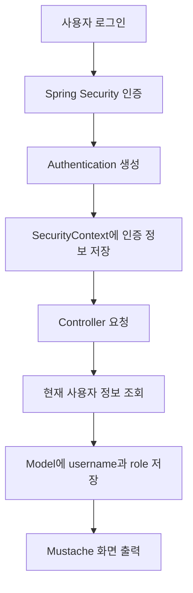
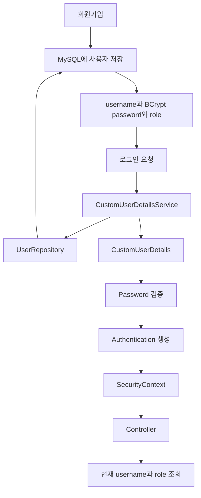
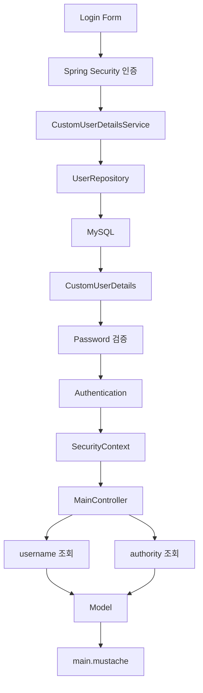

# 스프링 시큐리티 6 - 9. 세션 사용자 아이디 정보
[https://youtu.be/t-TsjyBmHcQ?si=GhFiBjUFnrtQCRid](https://youtu.be/t-TsjyBmHcQ?si=GhFiBjUFnrtQCRid)

# 스프링 시큐리티 6 - 9. 세션 사용자 아이디 정보
* toc
{:toc}

---

## Spring Security 로그인 사용자 정보 조회와 SecurityContext 활용

Spring Security를 이용해 로그인 기능까지 구현하고 나면 다음으로 필요한 것이 **현재 로그인한 사용자가 누구인지 확인하는 것**이다.

로그인 자체는 정상적으로 동작하더라도 화면에서는 현재 사용자가 로그인한 상태인지, 어떤 아이디로 로그인했는지 알 수 없다.

실제 서비스에서는 로그인 이후 사용자 정보를 화면에 자주 활용한다.

```text
로그인 전

로그인이 필요합니다.
```

로그인 후에는 다음처럼 보여줄 수 있다.

```text
admin님 환영합니다.

현재 권한: ROLE_ADMIN
```

또는 로그인한 사용자에 따라 화면 구성을 다르게 할 수도 있다.

```text
ROLE_USER
→ 일반 메뉴 표시

ROLE_ADMIN
→ 관리자 메뉴 추가 표시
```

Spring Security에서는 인증이 완료된 사용자의 정보를 `Authentication` 객체로 관리한다.

따라서 현재 로그인 사용자의 아이디와 권한을 확인하려면 **현재 Authentication 정보를 가져와 사용하면 된다.**

---

## 전체 흐름부터 이해하기

로그인이 완료되면 Spring Security 내부에는 인증된 사용자 정보가 존재하게 된다.

전체 흐름을 단순하게 표현하면 다음과 같다.



앞에서 구현했던 로그인 흐름과 이어서 보면 다음과 같다.

```text
Login Form

    ↓

Spring Security

    ↓

CustomUserDetailsService

    ↓

UserRepository

    ↓

Database

    ↓

Password 검증

    ↓

Authentication 생성

    ↓

로그인 상태 유지
```

이제 Controller에서는 이 Authentication에서 현재 로그인 사용자 정보를 꺼내 사용할 수 있다.

---

## Authentication이란?

Spring Security에서 현재 인증된 사용자를 표현하는 핵심 객체가 `Authentication`이다.

로그인에 성공한 사용자의 Authentication에는 대표적으로 다음 정보가 들어 있다.

```text
Authentication

├── Principal
│   → 현재 사용자 정보
│
├── Credentials
│   → 인증에 사용된 Credential
│
├── Authorities
│   → ROLE_USER, ROLE_ADMIN 등의 권한
│
└── Authenticated
    → 인증 완료 여부
```

따라서 현재 로그인한 사용자의 이름을 확인하거나 권한을 확인하려면 Authentication을 조회하면 된다.

---

## SecurityContextHolder에서 사용자 정보 가져오기

현재 로그인 사용자의 인증 정보는 다음과 같이 가져올 수 있다.

```java
Authentication authentication =
        SecurityContextHolder
                .getContext()
                .getAuthentication();
```

필요한 import는 다음과 같다.

```java
import org.springframework.security.core.Authentication;
import org.springframework.security.core.context.SecurityContextHolder;
```

구조를 그대로 읽으면 이해하기 쉽다.

```text
SecurityContextHolder

        ↓

SecurityContext

        ↓

Authentication
```

즉 Spring Security가 현재 요청에서 사용하고 있는 인증 정보를 가져오는 것이다.

---

## 현재 로그인한 username 확인하기

Authentication에서 현재 사용자의 이름을 가져오려면 `getName()`을 사용할 수 있다.

```java
Authentication authentication =
        SecurityContextHolder
                .getContext()
                .getAuthentication();

String username =
        authentication.getName();
```

예를 들어 현재 로그인한 사용자가:

```text
admin
```

이라면:

```java
authentication.getName();
```

결과는 다음과 같다.

```text
admin
```

전체 흐름은 다음과 같다.

```text
현재 요청

    ↓

SecurityContextHolder

    ↓

Authentication

    ↓

getName()

    ↓

admin
```

---

## 로그인하지 않은 사용자는 어떻게 나올까?

Spring Security에서 익명 사용자 기능이 활성화되어 있다면 로그인하지 않은 요청이라고 해서 Authentication이 항상 `null`인 것은 아니다.

익명 사용자는 일반적으로 다음과 같은 형태로 표현될 수 있다.

```text
username
→ anonymousUser

authority
→ ROLE_ANONYMOUS
```

따라서 다음 코드를 실행했을 때:

```java
String username =
        SecurityContextHolder
                .getContext()
                .getAuthentication()
                .getName();
```

로그인하지 않은 상태에서는 다음과 같은 값이 나올 수 있다.

```text
anonymousUser
```

로그인하면:

```text
admin
```

처럼 실제 사용자 이름으로 변경된다.

---

## 현재 사용자의 Role 확인하기

Authentication에는 사용자의 권한 정보도 들어 있다.

다음 메서드로 권한을 가져올 수 있다.

```java
authentication.getAuthorities();
```

반환되는 값은 하나의 String이 아니라 Collection이다.

```java
Collection<? extends GrantedAuthority>
```

이유는 한 명의 사용자가 여러 권한을 가질 수도 있기 때문이다.

예를 들어:

```text
ROLE_ADMIN
USER_READ
USER_WRITE
```

처럼 여러 Authority를 가질 수 있다.

현재 프로젝트에서는 한 명이 하나의 Role을 가진다고 가정하고 있으므로 첫 번째 Authority를 가져오는 방식으로 확인할 수 있다.

```java
String role =
        authentication
                .getAuthorities()
                .iterator()
                .next()
                .getAuthority();
```

현재 사용자가 관리자라면:

```text
ROLE_ADMIN
```

일반 사용자라면:

```text
ROLE_USER
```

와 같은 값을 얻을 수 있다.

---

## username과 role을 함께 가져오기

현재 사용자의 아이디와 Role을 함께 가져오면 다음과 같다.

```java
Authentication authentication =
        SecurityContextHolder
                .getContext()
                .getAuthentication();

String username =
        authentication.getName();

String role =
        authentication
                .getAuthorities()
                .iterator()
                .next()
                .getAuthority();
```

결과는 예를 들어 다음과 같다.

```text
username
→ admin

role
→ ROLE_ADMIN
```

이제 이 데이터를 Controller에서 View로 넘기면 된다.

---

## MainController에서 사용자 정보 전달하기

메인 페이지에 현재 로그인 사용자의 정보를 출력한다고 가정해보자.

기존 Controller가 다음과 같았다면:

```java
@Controller
public class MainController {

    @GetMapping("/")
    public String main() {
        return "main";
    }
}
```

`Model`을 추가한다.

```java
@Controller
public class MainController {

    @GetMapping("/")
    public String main(
            Model model
    ) {

        return "main";
    }
}
```

그리고 현재 인증 정보를 가져온다.

```java
Authentication authentication =
        SecurityContextHolder
                .getContext()
                .getAuthentication();
```

username과 Role을 추출한다.

```java
String username =
        authentication.getName();

String role =
        authentication
                .getAuthorities()
                .iterator()
                .next()
                .getAuthority();
```

마지막으로 Model에 넣는다.

```java
model.addAttribute(
        "username",
        username
);

model.addAttribute(
        "role",
        role
);
```

---

## MainController 전체 코드

전체 코드는 다음과 같이 작성할 수 있다.

```java
package com.example.security.controller;

import org.springframework.security.core.Authentication;
import org.springframework.security.core.context.SecurityContextHolder;
import org.springframework.stereotype.Controller;
import org.springframework.ui.Model;
import org.springframework.web.bind.annotation.GetMapping;

@Controller
public class MainController {

    @GetMapping("/")
    public String main(
            Model model
    ) {

        Authentication authentication =
                SecurityContextHolder
                        .getContext()
                        .getAuthentication();

        String username =
                authentication.getName();

        String role =
                authentication
                        .getAuthorities()
                        .iterator()
                        .next()
                        .getAuthority();

        model.addAttribute(
                "username",
                username
        );

        model.addAttribute(
                "role",
                role
        );

        return "main";
    }
}
```

Controller의 흐름은 단순하다.

```text
GET /

    ↓

현재 Authentication 조회

    ↓

username 조회

    ↓

role 조회

    ↓

Model에 저장

    ↓

main.mustache
```

---

## Model은 왜 사용할까?

Controller에서 가져온 Java 데이터를 HTML Template에서 사용하려면 View로 값을 전달해야 한다.

Spring MVC에서는 `Model`을 이용할 수 있다.

```java
model.addAttribute(
        "username",
        username
);
```

이 코드는 개념적으로 다음 데이터를 View에 전달한다.

```text
username = admin
```

Role 역시 동일하다.

```java
model.addAttribute(
        "role",
        role
);
```

결과:

```text
role = ROLE_ADMIN
```

Mustache에서는 이 값을 화면에 출력할 수 있다.

---

## Mustache에서 사용자 정보 출력하기

`main.mustache`에서 다음과 같이 작성할 수 있다.

```html
<!DOCTYPE html>
<html lang="ko">
<head>
    <meta charset="UTF-8">
    <title>Main</title>
</head>
<body>

<h1>Main Page</h1>

<p>
    사용자:
    {{username}}
</p>

<p>
    권한:
    {{role}}
</p>

</body>
</html>
```

로그인하지 않은 상태라면 환경에 따라 다음처럼 확인할 수 있다.

```text
사용자: anonymousUser
권한: ROLE_ANONYMOUS
```

관리자 계정으로 로그인했다면:

```text
사용자: admin
권한: ROLE_ADMIN
```

처럼 표시할 수 있다.

---

## 로그인 전과 로그인 후 비교

### 로그인 전

```text
GET /

    ↓

Authentication

    ↓

anonymousUser
ROLE_ANONYMOUS
```

화면:

```text
사용자: anonymousUser
권한: ROLE_ANONYMOUS
```

### 로그인 후

예를 들어 다음 사용자로 로그인했다고 가정한다.

```text
username = admin
role = ROLE_ADMIN
```

이제:

```java
authentication.getName();
```

결과는:

```text
admin
```

Authority는:

```text
ROLE_ADMIN
```

이 된다.

화면에서는:

```text
사용자: admin
권한: ROLE_ADMIN
```

으로 출력된다.

---

## 로그인 후 세션과 SecurityContext의 관계

여기서 흔히 "세션에서 로그인 사용자 정보를 가져온다"고 표현한다.

현재처럼 Form Login 기반으로 로그인 상태를 유지하는 환경에서는 큰 흐름상 맞는 표현이지만 조금 더 정확하게 이해하면 좋다.

Controller에서 직접:

```java
session.getAttribute(...)
```

를 호출하고 있는 것이 아니다.

우리가 접근하는 것은:

```text
SecurityContextHolder

        ↓

SecurityContext

        ↓

Authentication
```

이다.

즉 애플리케이션 코드에서는 Spring Security의 인증 추상화를 통해 현재 사용자를 조회한다.

세션 기반 로그인에서는 인증 상태가 요청 사이에서 유지되도록 Spring Security가 관련 처리를 담당한다.

따라서 다음과 같이 이해하면 좋다.

```text
HTTP Session

    ↓

Spring Security의 인증 상태 유지

    ↓

SecurityContext

    ↓

Authentication

    ↓

현재 사용자 정보
```

---

## Role은 어디에서 온 값일까?

앞에서 `CustomUserDetails`를 구현하면서 다음 코드를 작성했다.

```java
@Override
public Collection<? extends GrantedAuthority>
getAuthorities() {

    return List.of(
            new SimpleGrantedAuthority(
                    userEntity.getRole()
            )
    );
}
```

Database에 다음 값이 저장되어 있었다면:

```text
ROLE_ADMIN
```

로그인 과정에서:

```text
UserEntity

    ↓

CustomUserDetails

    ↓

GrantedAuthority

    ↓

Authentication
```

으로 전달된다.

따라서 현재 사용자 Role을 조회했을 때:

```java
authentication
        .getAuthorities()
```

에서 `ROLE_ADMIN`을 확인할 수 있는 것이다.

---

## 전체 흐름 연결하기

회원가입부터 현재 사용자 정보 조회까지 모두 연결하면 다음과 같다.



이제 앞에서 구현했던 기능들이 하나로 연결된다.

---

## Role을 이용해 화면을 다르게 보여주기

Role 정보는 화면에서도 활용할 수 있다.

예를 들어 관리자에게만 삭제 버튼을 보여준다고 생각해보자.

Controller에서 다음 값을 계산할 수 있다.

```java
boolean admin =
        authentication
                .getAuthorities()
                .stream()
                .anyMatch(
                        authority ->
                                authority
                                        .getAuthority()
                                        .equals("ROLE_ADMIN")
                );
```

Model에 넣는다.

```java
model.addAttribute(
        "admin",
        admin
);
```

Mustache에서는 조건부 렌더링을 할 수 있다.

```html
{{#admin}}
<button type="button">
    삭제
</button>
{{/admin}}
```

일반 사용자는 버튼을 보지 못하고 관리자에게만 표시된다.

---

## 버튼을 숨겼다고 권한 처리가 끝난 것은 아니다

이 부분은 실무에서 특히 중요하다.

화면에서:

```text
일반 사용자에게 삭제 버튼을 숨김
```

처리했다고 해서 보안이 완성된 것은 아니다.

사용자는 직접 HTTP 요청을 보낼 수도 있기 때문이다.

예를 들어 관리자 전용 API가:

```text
DELETE /admin/posts/100
```

이라고 하자.

화면에서 버튼이 없어도 사용자가 직접 요청할 가능성은 존재한다.

따라서 권한 검사는 반드시 서버에서도 수행해야 한다.

```text
Frontend

버튼 표시 여부
→ UX
```

그리고:

```text
Backend

권한 검증
→ 실제 보안
```

으로 구분해야 한다.

---

## URL 단위 권한은 SecurityConfig에서 처리하기

예를 들어 관리자 전용 경로라면 Controller에서 일일이 다음 코드를 작성하는 것보다:

```java
if (!role.equals("ROLE_ADMIN")) {
    return;
}
```

SecurityConfig에서 처리할 수 있다.

```java
.requestMatchers("/admin/**")
.hasRole("ADMIN")
```

이렇게 하면 요청이 Controller에 도달하기 전에 Spring Security가 권한을 검사한다.

```text
GET /admin/posts

    ↓

Spring Security

    ↓

ROLE_ADMIN 확인

    ↓

허용

    ↓

Controller
```

또는:

```text
ROLE_USER

    ↓

GET /admin/posts

    ↓

Spring Security

    ↓

Access Denied
```

가 된다.

---

## 도메인 권한은 별도로 검사해야 한다

URL Role 검사만으로 모든 권한 문제가 해결되지는 않는다.

예를 들어 다음 API가 있다고 하자.

```text
DELETE /posts/100
```

로그인한 사용자는 `ROLE_USER`다.

하지만 게시글 삭제 조건이:

```text
자신이 작성한 글만 삭제 가능
```

이라면 Role만 가지고 판단할 수 없다.

다음 정보가 필요하다.

```text
현재 로그인 사용자 ID

        ↓

게시글 작성자 ID

        ↓

동일한가?
```

따라서 보안은 다음 두 계층으로 나눠서 생각하는 것이 좋다.

```text
Spring Security 인가

/admin/**
→ ADMIN만 접근
```

그리고:

```text
도메인 인가

/posts/100
→ 실제 작성자인가?
```

이다.

---

## Authentication을 Controller Parameter로 직접 받을 수도 있다

`SecurityContextHolder`를 매번 직접 호출하지 않아도 된다.

Spring MVC Controller에서는 `Authentication`을 Parameter로 받을 수도 있다.

```java
@GetMapping("/")
public String main(
        Model model,
        Authentication authentication
) {

    String username =
            authentication.getName();

    model.addAttribute(
            "username",
            username
    );

    return "main";
}
```

이 방식은 코드가 조금 더 간결하다.

기존 방식:

```java
Authentication authentication =
        SecurityContextHolder
                .getContext()
                .getAuthentication();
```

대신 Controller Argument로 바로 받을 수 있다.

---

## Principal을 사용하는 방법

username만 필요하다면 `Principal`을 사용할 수도 있다.

```java
@GetMapping("/")
public String main(
        Principal principal,
        Model model
) {

    String username =
            principal.getName();

    model.addAttribute(
            "username",
            username
    );

    return "main";
}
```

`Principal`은 현재 인증 사용자의 이름 정도만 필요할 때 간단하게 사용할 수 있다.

다만 Role이나 CustomUserDetails까지 접근하려면 `Authentication`이 더 유용하다.

---

## @AuthenticationPrincipal 활용하기

앞에서 `CustomUserDetails`를 만들었다.

```java
public class CustomUserDetails
        implements UserDetails {
}
```

Spring Security에서는 현재 Principal을 직접 Controller Parameter로 받을 수도 있다.

```java
@GetMapping("/mypage")
public String myPage(
        @AuthenticationPrincipal
        CustomUserDetails userDetails,
        Model model
) {

    model.addAttribute(
            "username",
            userDetails.getUsername()
    );

    return "mypage";
}
```

이 방식의 장점은 다음처럼 복잡하게 접근하지 않아도 된다는 것이다.

```text
SecurityContextHolder
→ SecurityContext
→ Authentication
→ Principal
→ CustomUserDetails
```

Controller에서 바로 현재 로그인 사용자를 받을 수 있다.

---

## CustomUserDetails에 userId를 추가하면 더 유용하다

실제 서비스에서는 username보다 Database PK가 필요한 경우가 많다.

예를 들어:

```text
현재 사용자의 주문 조회

현재 사용자의 게시글 조회

현재 사용자의 프로필 조회
```

등이다.

`CustomUserDetails`에 다음 메서드를 추가할 수 있다.

```java
public Long getUserId() {

    return userEntity.getId();
}
```

그러면 Controller에서:

```java
@GetMapping("/mypage")
public String myPage(
        @AuthenticationPrincipal
        CustomUserDetails userDetails
) {

    Long userId =
            userDetails.getUserId();

    return "mypage";
}
```

처럼 사용할 수 있다.

이 방식은 username을 다시 Database에서 조회해서 ID를 찾는 불필요한 작업을 줄일 수 있는 경우가 있다.

---

## 여러 Role이 있다면 첫 번째 값만 꺼내지 않는다

현재 단순한 구조에서는 다음 코드도 동작한다.

```java
String role =
        authentication
                .getAuthorities()
                .iterator()
                .next()
                .getAuthority();
```

하지만 실제 서비스에서 사용자가 여러 Authority를 가질 수 있다면 첫 번째 값이 반드시 우리가 원하는 Role이라는 보장이 없다.

예를 들어:

```text
ROLE_USER
POST_READ
POST_WRITE
```

를 가지고 있을 수 있다.

특정 권한 존재 여부가 궁금하다면 직접 검사하는 편이 낫다.

```java
boolean admin =
        authentication
                .getAuthorities()
                .stream()
                .anyMatch(
                        authority ->
                                "ROLE_ADMIN"
                                        .equals(
                                                authority
                                                        .getAuthority()
                                        )
                );
```

따라서:

```text
화면에 단순 Role 하나 출력
→ 첫 번째 Authority 사용 가능
```

정도의 간단한 구조와:

```text
실제 권한 검증
→ 원하는 Authority가 있는지 명시적으로 검사
```

하는 구조를 구분하는 것이 좋다.

---

## 로그인 여부를 username 문자열로 판단하지 않기

다음처럼 구현하고 싶을 수도 있다.

```java
if (
        authentication
                .getName()
                .equals("anonymousUser")
) {
    // 로그인하지 않음
}
```

간단한 화면 처리에서는 사용할 수 있지만 로그인 여부 판단을 특정 username 문자열에 의존하는 것은 좋은 방법은 아니다.

예를 들어 `Authentication`의 타입이나 인증 상태를 기준으로 판단할 수 있다.

```java
boolean loggedIn =
        authentication != null
                && authentication.isAuthenticated()
                && !(authentication
                        instanceof AnonymousAuthenticationToken);
```

필요한 import는 다음과 같다.

```java
import org.springframework.security.authentication.AnonymousAuthenticationToken;
```

이렇게 하면 특정 `"anonymousUser"` 문자열에 의존하지 않아도 된다.

---

## 로그인 여부까지 Model에 전달하기

다음과 같이 구성할 수 있다.

```java
@GetMapping("/")
public String main(
        Model model,
        Authentication authentication
) {

    boolean loggedIn =
            authentication != null
                    && authentication.isAuthenticated()
                    && !(authentication
                            instanceof AnonymousAuthenticationToken);

    model.addAttribute(
            "loggedIn",
            loggedIn
    );

    if (loggedIn) {

        model.addAttribute(
                "username",
                authentication.getName()
        );
    }

    return "main";
}
```

Mustache에서는 다음과 같이 사용할 수 있다.

```html
{{#loggedIn}}
<p>{{username}}님 환영합니다.</p>
{{/loggedIn}}

{{^loggedIn}}
<a href="/login">
    로그인
</a>
{{/loggedIn}}
```

로그인 여부에 따라 화면을 자연스럽게 변경할 수 있다.

---

## 현재 사용자 정보 조회 방법 비교

현재 로그인 사용자를 확인하는 방법은 여러 가지가 있다.

| 방법                         | 적합한 상황                            |
| -------------------------- | --------------------------------- |
| `SecurityContextHolder`    | Security 계층이나 일반 Java 코드에서 직접 접근  |
| `Authentication` Parameter | Controller에서 권한 정보까지 필요           |
| `Principal` Parameter      | username 정도만 필요                   |
| `@AuthenticationPrincipal` | `CustomUserDetails`를 직접 사용하고 싶을 때 |

Controller에서는 무조건 `SecurityContextHolder`를 직접 호출해야 하는 것은 아니다.

필요한 정보 수준에 따라 가장 간단한 방식을 선택하면 된다.

---

## 실무에서의 활용

현재 로그인 사용자 정보는 실제 서비스 곳곳에서 사용된다.

예를 들어 다음과 같다.

```text
현재 사용자 이름 출력

마이페이지 조회

본인 게시글 조회

주문 내역 조회

관리자 메뉴 노출 여부

본인 작성 데이터 수정

본인 작성 데이터 삭제

로그인 이력 기록

Audit Log 작성
```

하지만 여기서 중요한 원칙이 하나 있다.

클라이언트가 전달한 사용자 ID보다 **Spring Security가 인증한 사용자 정보를 신뢰하는 것**이다.

예를 들어 다음 요청이 있다고 하자.

```text
DELETE /posts/100

userId = 10
```

클라이언트가 전달한 `userId=10`을 그대로 믿으면 요청 조작이 가능하다.

대신 서버에서는 현재 인증 사용자를 기준으로 검사한다.

```text
Authentication

    ↓

현재 userId = 3

    ↓

게시글 100의 작성자 = 3?

    ↓

Yes
→ 삭제

No
→ 거부
```

즉 SecurityContext의 현재 사용자 정보는 단순히 화면에 `"admin님 환영합니다"`를 출력하기 위한 데이터 이상의 의미를 가진다.

실제 서비스에서는 **현재 요청의 사용자가 누구인지 판단하는 신뢰 가능한 인증 기준**으로 활용된다.

---

## 전체 구조 정리

로그인부터 현재 사용자 정보를 View에서 사용하는 과정까지 연결하면 다음과 같다.



앞에서 구현한 `CustomUserDetails`가 이제 실제로 활용되는 지점도 이해할 수 있다.

```text
CustomUserDetails

username
password
authorities
userId 등

        ↓

Authentication principal

        ↓

Controller

        ↓

현재 로그인 사용자 정보
```

---

## 정리

Spring Security에서 로그인이 완료되면 현재 인증된 사용자 정보는 `Authentication`을 통해 확인할 수 있다.

가장 직접적인 방법은 다음과 같다.

```java
Authentication authentication =
        SecurityContextHolder
                .getContext()
                .getAuthentication();
```

현재 username은:

```java
String username =
        authentication.getName();
```

으로 확인할 수 있다.

현재 Authority는:

```java
authentication.getAuthorities();
```

에서 가져올 수 있다.

단순히 Role 하나만 사용하는 구조라면:

```java
String role =
        authentication
                .getAuthorities()
                .iterator()
                .next()
                .getAuthority();
```

처럼 확인할 수 있다.

Controller에서 View로 전달하려면:

```java
model.addAttribute(
        "username",
        username
);

model.addAttribute(
        "role",
        role
);
```

를 사용한다.

Mustache에서는:

```html
<p>{{username}}</p>
<p>{{role}}</p>
```

형태로 출력할 수 있다.

전체 흐름은 다음과 같다.

```text
로그인 성공

    ↓

Authentication 생성

    ↓

SecurityContext에서 인증 정보 관리

    ↓

Controller

    ↓

username / authorities 조회

    ↓

Model

    ↓

Mustache

    ↓

현재 사용자 정보 출력
```

다만 실제 권한 처리는 화면에서 버튼을 숨기는 것만으로 끝내서는 안 된다.

```text
Frontend
→ 화면 노출 제어

Backend
→ 실제 접근 권한 검증
```

으로 역할을 구분해야 한다.

관리자 전용 URL이라면:

```java
.requestMatchers("/admin/**")
.hasRole("ADMIN")
```

처럼 Spring Security 인가 설정을 사용하고, 특정 게시글의 작성자인지 확인하는 것처럼 데이터 소유권이 필요한 경우에는 현재 인증 사용자의 ID와 Domain 데이터를 비교하는 별도의 검증도 필요하다.

Controller에서는 `SecurityContextHolder` 외에도 상황에 따라:

```java
Authentication
```

```java
Principal
```

```java
@AuthenticationPrincipal
```

을 이용해 현재 로그인 사용자를 더 간단하게 가져올 수 있다.

### 한 줄 요약

Spring Security에서 현재 로그인 사용자는 `SecurityContext`의 `Authentication`을 통해 확인할 수 있으며, `getName()`으로 username을, `getAuthorities()`로 권한을 조회해 화면이나 비즈니스 로직에 활용할 수 있지만 실제 접근 제어는 반드시 서버의 인가 정책과 함께 적용해야 한다.
