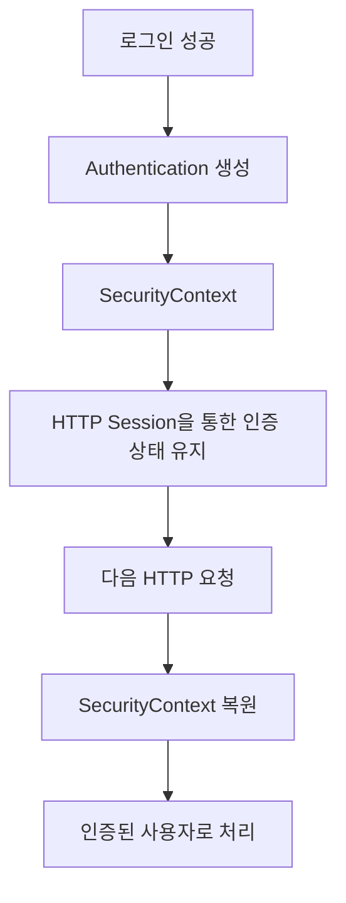
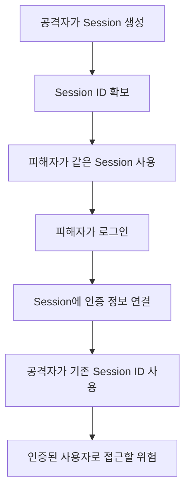
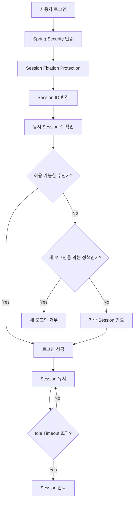

# 스프링 시큐리티 6 - 10. 세션 설정 (소멸, 중복 로그인, 고정 보호)
[https://youtu.be/SsdDnI3bHcI?si=qb8bGunx4nFYig4u](https://youtu.be/SsdDnI3bHcI?si=qb8bGunx4nFYig4u)

# 스프링 시큐리티 6 - 10. 세션 설정 (소멸, 중복 로그인, 고정 보호)
* toc
{:toc}

---

## Spring Security 세션 관리: 타임아웃, 동시 로그인, 세션 고정 공격 방어

Spring Security에서 Form Login 방식으로 로그인을 구현하면 인증 성공 후 사용자의 인증 상태를 다음 요청에서도 유지해야 한다.

예를 들어 사용자가 로그인한 뒤 관리자 페이지에 접근한다고 생각해보자.

```text
로그인

    ↓

Authentication 생성

    ↓

인증 상태 유지

    ↓

GET /admin

    ↓

기존 로그인 사용자로 인식
```

Servlet 기반의 일반적인 세션 로그인에서는 Spring Security가 `SecurityContext`를 HTTP Session과 연결하여 인증 정보를 다음 요청에서도 사용할 수 있도록 관리한다. 현재 공식 문서에서도 기본적인 Servlet 기반 인증 정보가 HTTP Session을 통해 유지될 수 있도록 Spring Security가 처리한다고 설명한다.

그런데 세션을 사용하기 시작하면 단순히 "로그인이 유지된다"는 것만 생각해서는 부족하다.

실제 서비스에서는 다음과 같은 정책도 함께 결정해야 한다.

```text
세션을 얼마나 오래 유지할 것인가?

한 계정으로 동시에 몇 곳까지 로그인할 수 있는가?

동시 로그인 한도를 넘으면
기존 사용자를 끊을 것인가,
새로운 로그인을 막을 것인가?

로그인 전후 Session ID는 어떻게 처리할 것인가?
```

이러한 부분을 Spring Security의 Session Management 설정으로 관리할 수 있다.

---

## 세션 기반 인증 구조

사용자가 로그인에 성공하면 `Authentication` 객체가 만들어진다.

앞에서 구현한 구조에서는 대략 다음과 같은 흐름이었다.

```text
Login Form

    ↓

Spring Security

    ↓

UserDetailsService

    ↓

PasswordEncoder 검증

    ↓

Authentication

    ↓

SecurityContext
```

Form Login과 같은 세션 기반 인증에서는 이후 요청에서도 Authentication을 복원할 수 있도록 인증 상태가 관리된다.



그래서 사용자가 한 번 로그인한 뒤:

```text
GET /mypage
GET /orders
GET /admin
```

같은 요청을 할 때마다 아이디와 비밀번호를 다시 입력할 필요가 없다.

---

## 세션과 Stateless 방식의 차이

세션 기반 인증에서는 서버가 사용자의 인증 상태를 유지한다.

```text
Client

SESSION Cookie
    ↓

Server

HTTP Session
    ↓

SecurityContext
    ↓

Authentication
```

반대로 API 서버에서 JWT 등을 이용하면서 세션을 사용하지 않는 구조를 선택할 수도 있다.

Spring Security에서는 다음과 같이 Stateless 정책을 설정할 수 있다.

```java
http
        .sessionManagement(session -> session
                .sessionCreationPolicy(
                        SessionCreationPolicy.STATELESS
                )
        );
```

이 정책에서는 인증 정보를 유지하기 위해 HTTP Session을 생성하는 방식에 의존하지 않는다. Spring Security 공식 문서에서도 `SessionCreationPolicy.STATELESS`를 세션을 생성하지 않는 인증 구성에 사용할 수 있다고 설명한다.

다만:

```text
JWT 사용
=
무조건 Stateless
```

라고 생각하면 안 된다.

JWT를 사용하면서도 다른 목적으로 Session을 사용하는 구조도 만들 수 있기 때문이다.

중요한 것은 **애플리케이션이 인증 상태를 어디에 저장하고 복원하도록 설계했는가**다.

이번 내용에서는 일반적인 Form Login 기반 Session 인증을 기준으로 살펴본다.

---

## 세션 타임아웃이 필요한 이유

세션이 한 번 만들어진 뒤 영원히 유지되면 문제가 발생한다.

사용자가 공용 PC에서 로그인하고 브라우저를 그대로 둔다고 생각해보자.

```text
사용자 로그인

    ↓

자리를 떠남

    ↓

몇 시간 후 다른 사람이 PC 사용

    ↓

기존 로그인 세션 그대로 남아 있음
```

보안상 좋지 않은 상황이다.

그래서 일정 시간 동안 요청이 없다면 Session을 만료시키는 Timeout 정책을 사용한다.

---

## 세션 타임아웃은 로그인 후 고정 시간이 아니다

세션 Timeout에서 특히 헷갈리기 쉬운 부분이다.

예를 들어 세션 Timeout을 30분으로 설정했다고 해서:

```text
10:00 로그인

무조건

10:30 로그아웃
```

되는 것은 아니다.

일반적인 Session Timeout은 **마지막 요청 이후 얼마나 오랫동안 세션이 사용되지 않았는지**를 기준으로 한다.

예를 들어 다음과 같다.

```text
10:00 로그인

10:10 게시글 조회
→ Session 사용

10:20 마이페이지 조회
→ Session 사용

10:25 주문 조회
→ Session 사용
```

요청이 계속 발생하고 있다면 Session의 마지막 접근 시점도 계속 갱신된다.

반대로:

```text
10:00 마지막 요청

이후 아무 요청 없음

30분 경과

10:30 이후 Session 만료
```

처럼 일정 시간 요청이 없을 때 만료되는 구조다.

---

## Spring Boot 세션 타임아웃 설정

Spring Boot에서는 `application.properties`를 통해 Session Timeout을 설정할 수 있다.

```properties
server.servlet.session.timeout=90m
```

이렇게 설정하면 Servlet Session의 Timeout을 90분으로 설정한다.

Spring Boot 공식 설정에도 `server.servlet.session.timeout`이 Servlet Session Timeout 설정이며 기본값은 `30m`으로 명시되어 있다. Duration 접미사를 생략하면 초 단위로 해석한다.

따라서 다음과 같이 설정할 수 있다.

```properties
server.servlet.session.timeout=30m
```

30분이다.

```properties
server.servlet.session.timeout=90m
```

90분이다.

초 단위로도 표현할 수 있다.

```properties
server.servlet.session.timeout=1800
```

접미사가 없으면 초 단위이므로 1800초, 즉 30분이다.

---

## application.yml에서 설정한다면

YAML을 사용한다면 다음과 같다.

```yaml
server:
  servlet:
    session:
      timeout: 90m
```

즉 설정 구조는 다음과 같다.

```text
server
└── servlet
    └── session
        └── timeout
```

세션 정책은 서비스 특성에 맞게 결정하는 것이 좋다.

은행이나 관리자 시스템처럼 보안 민감도가 높은 서비스와 장시간 글을 작성하는 커뮤니티 서비스가 동일한 Timeout을 사용할 이유는 없다.

---

## 긴 입력 화면에서는 세션 만료를 고려해야 한다

세션 Timeout을 지나치게 짧게 설정하면 사용자 경험에 문제가 생길 수 있다.

예를 들어 사용자가 글을 작성하고 있다고 해보자.

```text
게시글 작성 시작

    ↓

40분 동안 글 작성

    ↓

그동안 Server Request 없음

    ↓

Session Timeout

    ↓

저장 버튼 클릭

    ↓

인증이 만료된 상태
```

사용자는 40분 동안 작성한 글을 저장하려 했는데 로그인이 만료되면서 정상적인 요청 처리가 되지 않을 수 있다.

따라서 단순히:

```text
짧을수록 안전하다
```

라고 판단하기보다는 서비스 특성과 사용자 행동을 함께 고려해야 한다.

자동 임시 저장이 필요한 이유도 이런 문제와 연결된다.

---

## Spring Session을 사용한다면

Redis나 JDBC 기반 Spring Session을 사용하는 경우에는 별도의 Session Timeout 설정도 존재한다.

예를 들어:

```properties
spring.session.timeout=90m
```

을 사용할 수 있다.

Spring Boot 공식 문서에서는 Spring Session의 `spring.session.timeout`이 설정되지 않은 Servlet 환경이라면 `server.servlet.session.timeout` 값을 사용한다고 설명한다.

따라서 일반 Servlet Session과 Redis/JDBC 기반 Spring Session을 사용할 때 어떤 설정이 적용되는지 구분해두는 것이 좋다.

---

## 하나의 계정으로 여러 번 로그인할 수 있을까?

다음으로 생각해야 할 것이 동시 로그인이다.

사용자 `user01`이 PC에서 로그인했다고 해보자.

```text
PC

user01 로그인
```

그리고 휴대폰에서도 같은 계정으로 로그인한다.

```text
Mobile

user01 로그인
```

다시 태블릿에서도 로그인한다.

```text
Tablet

user01 로그인
```

서비스 정책에 따라 세 가지를 모두 허용할 수도 있고 하나만 허용할 수도 있다.

```text
동일 계정

PC
Mobile
Tablet

→ 최대 몇 개까지 허용할 것인가?
```

Spring Security는 동시 Session 개수를 제한할 수 있는 기능을 제공한다.

---

## maximumSessions 설정

동시 Session 제한은 `sessionManagement()`를 통해 설정할 수 있다.

예를 들어 한 계정에 하나의 로그인만 허용하려면 다음처럼 구성할 수 있다.

```java
http
        .sessionManagement(session -> session
                .maximumSessions(1)
        );
```

`maximumSessions(1)`의 의미는 다음과 같다.

```text
동일 사용자

최대 Session 수
→ 1개
```

다음처럼 3개로 설정할 수도 있다.

```java
http
        .sessionManagement(session -> session
                .maximumSessions(3)
        );
```

그러면 동일 사용자가 최대 세 개의 Session을 유지할 수 있는 정책을 구성할 수 있다.

---

## maximumSessions를 초과하면 어떻게 될까?

다음 정책을 생각해보자.

```text
maximumSessions = 1
```

이미 PC에서 로그인되어 있다.

```text
Session A
→ PC 로그인
```

그런데 Mobile에서 다시 로그인한다.

```text
Session B
→ 새로운 로그인
```

이 경우 두 가지 정책을 생각할 수 있다.

```text
1. 기존 Session을 만료시키고
   새로운 로그인을 허용

2. 기존 Session을 유지하고
   새로운 로그인을 거부
```

이 동작을 결정하는 것이 `maxSessionsPreventsLogin()`이다.

---

## 새로운 로그인 허용하기

다음과 같이 설정한다고 생각해보자.

```java
http
        .sessionManagement(session -> session
                .maximumSessions(1)
                .maxSessionsPreventsLogin(false)
        );
```

최대 Session이 이미 존재하더라도 새 로그인을 허용한다.

대신 기존 Session이 만료 대상이 된다.

개념적으로:

```text
PC 로그인

Session A

    ↓

Mobile에서 로그인

Session B

    ↓

Session A 만료
Session B 사용
```

이다.

Spring Security 공식 문서에서도 최대 Session을 초과했을 때 기본적으로 기존 Session이 종료되는 형태의 동시 Session 제어를 제공한다.

---

## 새로운 로그인을 차단하기

반대로 기존 사용자를 유지하고 새로운 로그인을 막으려면:

```java
http
        .sessionManagement(session -> session
                .maximumSessions(1)
                .maxSessionsPreventsLogin(true)
        );
```

로 구성할 수 있다.

흐름은 다음과 같다.

```text
PC

user01 로그인 성공
Session A 유지

        ↓

Mobile

같은 user01 로그인 시도

        ↓

maximumSessions 초과

        ↓

새 로그인 거부
```

공식 문서에서도 `maximumSessions(1)`과 `maxSessionsPreventsLogin(true)` 조합을 기존 Session을 유지하면서 두 번째 로그인을 방지하는 방식으로 제시한다.

---

## 두 정책의 차이

정리하면 다음과 같다.

| 설정                                | 동작                           |
| --------------------------------- | ---------------------------- |
| `maxSessionsPreventsLogin(false)` | 새로운 로그인을 허용하고 기존 Session을 만료 |
| `maxSessionsPreventsLogin(true)`  | 기존 Session을 유지하고 새로운 로그인을 거부 |

어느 쪽이 더 좋은지는 서비스마다 다르다.

예를 들어 일반 콘텐츠 서비스라면:

```text
새로운 기기 로그인
→ 기존 기기 로그아웃
```

정책을 선택할 수 있다.

반대로 내부 관리자 시스템에서는:

```text
이미 로그인된 Session 존재
→ 새로운 로그인 차단
```

정책을 선택할 수도 있다.

---

## 동시 로그인 설정 예제

현재 SecurityConfig에 추가한다면 다음과 같이 구성할 수 있다.

```java
@Bean
public SecurityFilterChain securityFilterChain(
        HttpSecurity http
) throws Exception {

    http
            .authorizeHttpRequests(auth -> auth
                    .requestMatchers(
                            "/",
                            "/login",
                            "/join",
                            "/joinProc"
                    )
                    .permitAll()

                    .requestMatchers("/admin/**")
                    .hasRole("ADMIN")

                    .anyRequest()
                    .authenticated()
            )

            .formLogin(form -> form
                    .loginPage("/login")
                    .loginProcessingUrl("/loginProc")
                    .permitAll()
            )

            .sessionManagement(session -> session
                    .maximumSessions(1)
                    .maxSessionsPreventsLogin(true)
            );

    return http.build();
}
```

이 설정에서는 동일한 사용자의 Session을 하나만 허용하고 새로운 로그인을 차단한다.

---

## 동시 Session 추적에는 추가 구성이 필요할 수 있다

현재 Spring Security 공식 문서에서는 동시 Session 제어 시 Session Lifecycle을 Spring Security가 추적할 수 있도록 `HttpSessionEventPublisher`를 등록하는 구성을 함께 안내한다.

다음 Bean을 등록할 수 있다.

```java
@Bean
public HttpSessionEventPublisher httpSessionEventPublisher() {
    return new HttpSessionEventPublisher();
}
```

필요한 import는 다음과 같다.

```java
import org.springframework.security.web.session.HttpSessionEventPublisher;
```

이 구성은 Session 생성과 소멸 이벤트를 Spring Security의 Session Registry와 연결하는 데 사용된다.

특히 동시 Session 제한을 실제 서비스에 적용한다면 단순히 `maximumSessions()` 한 줄만 복사하기보다 사용 중인 Spring Security 버전의 Session Management 공식 설정을 함께 확인하는 것이 좋다.

---

## CustomUserDetails를 사용한다면 equals와 hashCode도 확인하기

앞에서 직접 `CustomUserDetails`를 만들었다.

```java
public class CustomUserDetails
        implements UserDetails {
}
```

동시 Session 제어에서는 Spring Security가 동일한 사용자인지 판단해야 한다.

현재 공식 문서는 Custom `UserDetails`를 사용할 경우 `equals()`와 `hashCode()` 구현을 확인하라고 명시한다. 기본 `SessionRegistry`가 사용자 Session을 관리할 때 Principal을 Map의 Key로 사용하기 때문이다.

즉:

```text
Session 1의 Principal

        ↕

Session 2의 Principal

        ↓

동일 사용자인가?
```

판단이 올바르게 이루어져야 한다.

이 부분은 단순 로그인에서는 잘 드러나지 않다가 동시 Session 제어를 적용했을 때 문제가 될 수 있다.

---

## 세션 고정 공격이란?

Session 설정에서 보안적으로 중요한 개념이 Session Fixation Attack이다.

공격의 핵심은 **로그인 전에 발급된 Session ID를 공격자가 알고 있는 상태에서 피해자가 그 Session을 이용해 로그인하도록 만드는 것**이다.

예를 들어 공격자가 먼저 서버에 접근한다.

```text
Attacker

    ↓

Server

    ↓

Session 생성

    ↓

Session ID 획득
```

공격자는 어떤 방법으로 피해자에게 같은 Session ID를 사용하도록 유도한다.

피해자가 관리자라고 가정해보자.

```text
Admin

공격자가 알고 있는 Session 사용

    ↓

로그인 성공

    ↓

해당 Session에 ADMIN 인증 정보 연결
```

만약 로그인 이후에도 Session ID가 그대로 유지된다면 공격자는 이미 알고 있던 Session ID를 이용해 인증된 Session을 탈취할 가능성이 생긴다.

개념적인 공격 흐름은 다음과 같다.



이것이 Session Fixation 공격의 기본 아이디어다.

---

## Spring Security는 기본적으로 Session Fixation을 방어한다

좋은 점은 Session Fixation 보호를 개발자가 처음부터 직접 구현해야 하는 것은 아니라는 것이다.

Spring Security는 사용자가 로그인했을 때 Session을 새로 만들거나 Session ID를 변경하는 방식으로 Session Fixation 공격을 기본적으로 방어한다.

즉 다음처럼 동작한다.

```text
로그인 전

Session ID = AAA
```

로그인 성공 후:

```text
Session ID = BBB
```

이제 공격자가 알고 있던:

```text
AAA
```

로 접근하더라도 인증된 Session ID:

```text
BBB
```

와 일치하지 않는다.

---

## sessionFixation 설정

Spring Security에서는 Session Fixation 전략을 명시적으로 설정할 수도 있다.

```java
http
        .sessionManagement(session -> session
                .sessionFixation(fixation -> fixation
                        .changeSessionId()
                )
        );
```

주요 전략을 이해해보자.

---

## none

```java
.sessionFixation(fixation -> fixation
        .none()
)
```

Session Fixation 보호를 하지 않는다.

```text
로그인 전 Session ID
AAA

        ↓

로그인 성공

        ↓

로그인 후 Session ID
AAA
```

기존 ID가 그대로 유지된다.

보안상 특별한 이유가 없다면 사용하지 않는 것이 좋다. Spring Security 공식 문서 역시 `none`을 이용해 보호를 끌 수 있지만 애플리케이션이 취약해질 수 있으므로 권장하지 않는다고 설명한다.

---

## newSession

다음 설정은 로그인 성공 시 새로운 Session을 생성한다.

```java
.sessionFixation(fixation -> fixation
        .newSession()
)
```

개념적으로:

```text
로그인 전

Session A
ID = AAA

        ↓

로그인 성공

        ↓

새 Session B
ID = BBB
```

가 된다.

Spring Security 공식 문서에서는 `newSession`이 기존 일반 Session Attribute를 복사하지 않는 새로운 Session을 만들고 Spring Security 관련 Attribute는 필요한 범위에서 처리한다고 설명한다.

---

## migrateSession

Session Fixation 설정을 살펴보다 보면 `migrateSession()`도 볼 수 있다.

```java
.sessionFixation(fixation -> fixation
        .migrateSession()
)
```

새로운 Session을 생성하면서 기존 Session Attribute를 새로운 Session으로 복사하는 방식이다.

개념적으로:

```text
기존 Session

ID = AAA
cart = ...
locale = ko
```

로그인 후:

```text
새 Session

ID = BBB
cart = ...
locale = ko
```

처럼 기존 Attribute를 유지하면서 Session 자체는 교체하는 방식이다.

공식 문서에서는 Servlet 3.0 이하 환경에서 이 방식이 기본 전략이었다고 설명한다.

---

## changeSessionId

최근 Servlet 환경에서 중요한 전략은 `changeSessionId()`다.

```java
.sessionFixation(fixation -> fixation
        .changeSessionId()
)
```

이 방식에서는 Session 객체를 새로 만드는 대신 Servlet Container가 제공하는 기능을 사용해 Session ID를 변경한다.

```text
Session

Attribute 유지

ID = AAA

        ↓

로그인 성공

        ↓

동일한 Session

ID = BBB
```

즉 기존 Session 자체의 데이터를 활용하면서 Session Identifier를 변경한다.

Spring Security 공식 문서에서는 Servlet 3.1 이상 환경에서 `changeSessionId`가 기본 전략이라고 설명한다.

---

## Session Fixation 전략 비교

| 방식                  | 로그인 후 처리                        |
| ------------------- | ------------------------------- |
| `none()`            | Session ID 유지, 보호 비활성화          |
| `newSession()`      | 새로운 Session 생성                  |
| `migrateSession()`  | 새 Session 생성 후 기존 Attribute 복사  |
| `changeSessionId()` | 기존 Session을 유지하면서 Session ID 변경 |

일반적인 최신 Servlet 환경에서는 Spring Security의 기본 Session Fixation 보호 기능을 그대로 사용하는 것만으로도 적절한 경우가 많다.

특별한 이유가 없다면 굳이 `none()`으로 보호를 해제할 이유는 없다.

---

## changeSessionId 동작 흐름

로그인 전:

```text
Client

JSESSIONID = AAA
```

Server에는:

```text
Session AAA

authentication = 없음
```

이 존재한다고 생각해보자.

사용자가 로그인한다.

```text
username
password

    ↓

인증 성공
```

Spring Security가 Session Fixation Protection을 수행한다.

```text
기존 Session ID

AAA

    ↓

변경

    ↓

새 Session ID

BBB
```

이후 브라우저는:

```text
JSESSIONID = BBB
```

를 사용한다.

공격자가 기존:

```text
JSESSIONID = AAA
```

를 알고 있어도 인증된 Session을 그대로 사용할 수 없게 된다.

---

## Session Fixation과 Session Hijacking은 완전히 같은 문제는 아니다

둘은 비슷하게 느껴지지만 구분해서 이해하는 것이 좋다.

Session Fixation은 공격자가 미리 알고 있는 Session ID를 피해자가 로그인할 때 사용하도록 만드는 공격이다.

```text
공격자가 먼저 ID 확보
        ↓
피해자가 같은 ID로 로그인
```

반면 Session Hijacking은 이미 인증된 사용자의 Session ID 자체를 탈취하는 공격을 더 넓게 의미한다.

```text
정상 로그인 완료
        ↓
인증된 Session ID 탈취
        ↓
공격자가 사용
```

따라서 `changeSessionId()`만으로 모든 Session 공격이 해결되는 것은 아니다.

Session Cookie 자체도 안전하게 보호해야 한다.

---

## Session Cookie도 함께 보호해야 한다

실제 서비스에서는 Session Fixation 설정 외에 Cookie 보안 정책도 중요하다.

예를 들어 다음 속성을 고려할 수 있다.

```text
HttpOnly
Secure
SameSite
```

`HttpOnly`는 JavaScript를 통한 Cookie 접근을 제한하는 데 도움이 되고, `Secure`는 HTTPS 연결에서만 Cookie를 전달하도록 하는 데 사용한다.

즉 세션 보안은:

```text
Session ID 변경

        +

Cookie 보호

        +

HTTPS

        +

CSRF 보호

        +

적절한 Session Timeout
```

처럼 여러 계층을 함께 봐야 한다.

---

## 세션 설정을 하나로 합치기

현재까지 내용을 하나의 SecurityConfig에 구성하면 다음과 같은 형태로 생각할 수 있다.

```java
@Configuration
public class SecurityConfig {

    @Bean
    public SecurityFilterChain securityFilterChain(
            HttpSecurity http
    ) throws Exception {

        http
                .authorizeHttpRequests(auth -> auth
                        .requestMatchers(
                                "/",
                                "/login",
                                "/join",
                                "/joinProc"
                        )
                        .permitAll()

                        .requestMatchers("/admin/**")
                        .hasRole("ADMIN")

                        .anyRequest()
                        .authenticated()
                )

                .formLogin(form -> form
                        .loginPage("/login")
                        .loginProcessingUrl("/loginProc")
                        .permitAll()
                )

                .sessionManagement(session -> session
                        .sessionFixation(fixation ->
                                fixation.changeSessionId()
                        )
                        .maximumSessions(1)
                        .maxSessionsPreventsLogin(true)
                );

        return http.build();
    }

    @Bean
    public HttpSessionEventPublisher
    httpSessionEventPublisher() {

        return new HttpSessionEventPublisher();
    }
}
```

세션 Timeout은 SecurityConfig가 아니라 Spring Boot 설정에서 관리한다.

```properties
server.servlet.session.timeout=90m
```

따라서 역할을 나누면 다음과 같다.

```text
application.properties

→ Session Timeout
```

```text
SecurityConfig

→ 동시 Session 정책
→ Session Fixation 정책
```

로 이해할 수 있다.

---

## 세션 정책 전체 구조

현재 설정을 한 번에 표현하면 다음과 같다.



이 흐름을 이해하면 각각의 설정이 어떤 문제를 해결하는지 명확해진다.

---

## 세션 Timeout과 절대 만료 시간은 다르다

`server.servlet.session.timeout`은 일반적으로 Idle Timeout이다.

즉:

```text
마지막 요청 이후
얼마 동안 요청이 없었는가?
```

를 기준으로 한다.

만약 보안 정책상:

```text
아무리 계속 요청하더라도
로그인 후 최대 8시간만 허용
```

같은 정책이 필요하다면 단순 Session Timeout만으로는 같은 개념이 아니다.

```text
Idle Timeout

마지막 활동 이후 30분
```

과:

```text
Absolute Timeout

로그인 후 무조건 8시간
```

은 별도의 요구사항이다.

금융·관리자 시스템처럼 Session 정책이 중요한 서비스에서는 이 둘을 구분해서 설계하는 것이 좋다.

---

## 동시 로그인 정책은 서비스 성격에 따라 달라진다

모든 서비스에서:

```text
maximumSessions(1)
```

이 정답인 것은 아니다.

예를 들어 OTT나 일반 웹 서비스에서는:

```text
PC
Mobile
Tablet
```

등 여러 디바이스를 허용하는 것이 자연스러울 수 있다.

반대로 회사의 내부 관리자 시스템이나 민감한 운영 시스템이라면:

```text
한 계정당 Session 1개
```

정책을 사용할 수도 있다.

또는:

```text
일반 회원
→ 5개

관리자
→ 1개
```

처럼 권한에 따라 정책을 달리하고 싶을 수도 있다.

Session 정책은 기술 설정 이전에 서비스 정책의 문제라는 점도 중요하다.

---

## 서버가 여러 대라면 세션은 어떻게 될까?

운영 환경에서는 애플리케이션 서버가 한 대가 아닐 수 있다.

```text
Load Balancer

├── Server A
├── Server B
└── Server C
```

각 서버 메모리에 Session이 따로 저장되어 있다면 문제가 생길 수 있다.

```text
Login
→ Server A
→ Session 존재
```

다음 요청:

```text
Request
→ Server B
→ Session 없음
```

그래서 다중 서버 환경에서는 다음과 같은 방법을 생각할 수 있다.

```text
Sticky Session
```

또는:

```text
공유 Session Storage

Redis
JDBC
```

등이다.

Spring Boot는 Redis와 JDBC를 사용하는 Spring Session 자동 구성을 지원한다.

예를 들어:

```text
Server A ─┐
Server B ─┼→ Redis Session Store
Server C ─┘
```

처럼 모든 서버가 동일한 Session 저장소를 바라보게 만들 수 있다.

---

## 다중 서버 환경에서는 동시 로그인 제한도 다시 생각해야 한다

한 서버의 메모리에서만 Session을 추적한다면:

```text
Server A
→ user01 Session 존재
```

를 Server B가 모를 수 있다.

그러면:

```text
Server B
→ user01 추가 로그인
```

같은 상황이 발생할 수 있다.

따라서 실제 분산 환경에서 동시 로그인 제한이 중요한 요구사항이라면 단순한 단일 JVM의 Session 관리만 보는 것이 아니라 **Session과 Session Registry 정보를 여러 서버에서 어떻게 일관되게 관리할 것인지**까지 검토해야 한다.

---

## 현재 공식 문서 기준으로 보완할 점

제공된 흐름의 핵심 방향은 맞지만 몇 가지는 정확하게 구분해두는 것이 좋다.

먼저 Spring Boot의 기본 Servlet Session Timeout은 현재 공식 설정 기준 `30m`이다. 숫자만 지정할 경우 초 단위로 해석한다. 따라서 흔히 말하는 기본 30분은 `1800초`이며 `18초`가 아니다.

두 번째로 Session Timeout은 보통 로그인 시점부터 무조건 시간이 흐르는 절대 Timeout이라기보다 **마지막 Session 접근 이후의 비활성 시간**을 기준으로 이해하는 것이 맞다.

세 번째로 Session Fixation Protection은 반드시 개발자가 `changeSessionId()`를 설정해야만 활성화되는 기능이 아니다. Spring Security는 기본적으로 Session Fixation Protection을 제공하며 Servlet 3.1 이상 환경에서는 `changeSessionId`가 기본 전략이다.

따라서 다음 코드는:

```java
.sessionFixation(fixation ->
        fixation.changeSessionId()
)
```

보호 기능을 새로 만들어내는 코드라기보다 **사용할 Session Fixation 전략을 명시적으로 표현하는 설정**에 가깝다.

또한 동시 Session 제어에서는 현재 공식 문서가 `HttpSessionEventPublisher` 등록을 함께 안내하고 있으며, Custom `UserDetails`를 사용한다면 `equals()`와 `hashCode()`가 올바르게 구현되어 있는지도 확인하는 것이 좋다.

---

## 실무에서의 활용

세션 정책을 실제 프로젝트에서 잡을 때는 설정값만 먼저 정하기보다 사용자 시나리오부터 생각하는 편이 좋다.

예를 들어 관리자 시스템이라면 다음과 같은 정책을 생각할 수 있다.

```text
Idle Timeout
→ 30분

동시 로그인
→ 1개

새 로그인
→ 차단

Session Fixation
→ 기본 보호 유지

Cookie
→ Secure + HttpOnly

Transport
→ HTTPS
```

반면 장시간 콘텐츠를 작성하는 서비스에서는:

```text
Idle Timeout
→ 비교적 길게

자동 저장
→ 짧은 주기로 수행

Session 만료 직전
→ 사용자 알림
```

같은 UX가 더 중요할 수 있다.

결국 Session 설정은 단순히 SecurityConfig 안에 몇 줄을 추가하는 문제가 아니다.

```text
보안

    +

사용자 경험

    +

서버 구조

    +

서비스 정책
```

을 함께 고려해야 한다.

---

## 정리

Spring Security의 Session 기반 인증에서는 로그인 성공 후 만들어진 Authentication을 다음 요청에서도 사용할 수 있도록 인증 상태를 유지한다.

세션을 사용한다면 크게 세 가지 정책을 생각해야 한다.

첫 번째는 Session Timeout이다.

```properties
server.servlet.session.timeout=90m
```

이 설정으로 일정 시간 요청이 없는 Session을 만료시킬 수 있다.

Spring Boot의 현재 기본 Servlet Session Timeout은 `30m`이며 접미사가 없는 숫자는 초 단위로 해석한다.

두 번째는 동시 로그인 제한이다.

```java
.sessionManagement(session -> session
        .maximumSessions(1)
        .maxSessionsPreventsLogin(true)
)
```

`maximumSessions()`는 한 사용자가 동시에 유지할 수 있는 Session 수를 제한하고:

```java
.maxSessionsPreventsLogin(true)
```

는 최대 개수에 도달했을 때 새로운 로그인을 거부하도록 만든다.

`false` 정책을 사용하면 반대로 새로운 로그인을 허용하면서 기존 Session을 만료시키는 방향으로 동작한다.

세 번째는 Session Fixation Protection이다.

```java
.sessionFixation(fixation ->
        fixation.changeSessionId()
)
```

로그인 전에 사용하던 Session ID를 인증 이후에도 그대로 사용하는 위험을 줄이기 위해 로그인 과정에서 Session ID를 변경한다.

Spring Security는 이 보호를 기본적으로 제공하며 최신 Servlet 환경에서는 `changeSessionId`가 기본 전략이다.

전체적으로 정리하면 다음과 같다.

```text
로그인

    ↓

Authentication 생성

    ↓

Session Fixation Protection

    ↓

동시 로그인 개수 검사

    ↓

HTTP Session을 통해 인증 상태 유지

    ↓

사용자 요청 발생

    ↓

마지막 접근 시간 갱신

    ↓

Idle Timeout 동안 요청 없음

    ↓

Session 만료
```

따라서 Spring Security의 세션 관리에서는 단순히 로그인 상태를 유지하는 것뿐 아니라 **세션의 수명, 동시 로그인 정책, 로그인 전후 Session ID 보호까지 하나의 인증 보안 정책으로 함께 설계하는 것**이 중요하다.

### 한 줄 요약

Spring Security 세션 관리에서는 `server.servlet.session.timeout`으로 비활성 Session의 수명을 관리하고, `maximumSessions()`와 `maxSessionsPreventsLogin()`으로 동시 로그인을 제어하며, 기본 Session Fixation Protection을 통해 로그인 시 Session ID를 안전하게 변경하는 구조를 이해하는 것이 핵심이다.
