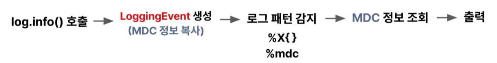

# 레오의 MDC 
[https://www.youtube.com/watch?v=lkuAxAVgAX0&list=PLgXGHBqgT2TvpJ_p9L_yZKPifgdBOzdVH](https://www.youtube.com/watch?v=lkuAxAVgAX0&list=PLgXGHBqgT2TvpJ_p9L_yZKPifgdBOzdVH)

# 레오의 MDC
* toc
{:toc}

  
---

## MDC란 무엇인가 

MDC(Mapped Diagnostic Context)는
로깅 프레임워크에서 제공하는 **스레드 단위 컨텍스트 저장 메커니즘**이다.

레오 영상에서의 핵심 표현을 빌리면:

> MDC는 “로그를 잘 찍기 위한 기능”이 아니라
> **“로그에 의미를 주기 위한 장치”**다.

* 요청 단위의 메타데이터(IP, requestId, userId 등)를
* 비즈니스 코드와 분리해서 관리하고
* 로그 출력 시점에 자동으로 결합한다

이 자동 결합이 바로 MDC의 정체성이다.

---

## MDC가 필요한 진짜 이유 

레오 영상에서 반복해서 나오는 메시지가 있다.

> “IP 로그를 남기는 건 서비스의 책임이 아니다”

이 문장이 핵심이다.

### 문제의 본질

* 로그에 필요한 정보 ≠ 비즈니스 로직의 관심사
* 그런데 그걸 코드에서 직접 처리하면?

  * 메서드 시그니처가 오염되고
  * 로깅 로직이 여기저기 흩어지고
  * 유지보수 난이도가 폭증한다

### MDC의 역할 재정의

MDC는 단순 편의 기능이 아니다.

👉 **관심사의 분리(Separation of Concerns)를 로그 영역까지 확장하는 도구**다.

* “이 요청이 누구 것인가?” → 컨텍스트의 책임
* “무슨 일을 했는가?” → 비즈니스 로직의 책임

이 둘을 코드 레벨에서 섞지 않게 해주는 게 MDC다.

---

## MDC 내부 동작 원리 
+ 
+ 

### 1️⃣ MDC는 왜 ThreadLocal을 쓰는가

MDC의 저장소는 `ThreadLocal<Map<String, String>>` 이다.

이 선택에는 명확한 이유가 있다.

* 웹 요청은 기본적으로 **스레드 단위로 처리**
* 요청 간 컨텍스트가 섞이면 안 됨
* 동기화 비용 없이 격리된 저장소가 필요

ThreadLocal은 이 요구 조건을 정확히 만족한다.

그래서 레오가 말한 이 문장이 중요하다.

> “MDC는 스레드 안정성을 *보장받는다*가 아니라
> **ThreadLocal이기 때문에 자연스럽게 안정적이다**”

---

### 2️⃣ 로그 이벤트 시점이 핵심이다

영상에서 꽤 강조되는 포인트다.

* `log.info()` 호출
* → LoggingEvent 생성
* → **그 시점의 MDC 스냅샷이 이벤트에 복사됨**

즉,

> 로그가 실제로 파일에 쓰이는 시점이 아니라
> **이벤트가 생성되는 순간의 MDC 상태가 로그의 기준**이다.

이 구조 덕분에:

* 비동기 로그(Appender)도 안전
* 이후 MDC가 바뀌어도 기존 로그는 영향 없음

---

## MDC의 가장 위험한 지점: 스레드 풀 

레오 영상의 경고는 단호하다.

> “MDC를 썼다면, clear를 안 하는 건 버그다”

### 왜 문제가 되는가

* 웹 서버는 스레드를 재사용한다
* ThreadLocal은 **스레드 생명주기와 함께 간다**
* 이전 요청의 MDC가 남아 있으면?

  * 다른 유저의 로그에 섞여 나온다
  * 로그 신뢰도가 붕괴된다

이건 단순 실수가 아니라 **운영 장애 급 사고**로 이어질 수 있다.

---

### 해결 원칙 

원칙은 단 하나다.

> **스레드 반환 직전에 MDC를 반드시 정리한다**

실무에서는 다음 위치가 적절하다.

* Servlet Filter (`finally`)
* Spring Interceptor (`afterCompletion`)
* Executor 커스터마이징
* TaskDecorator

이 중 무엇을 쓰느냐보다 중요한 건 **“어디서 끝나는지 명확한 지점”**이다.

---

## 비동기 환경에서의 MDC 

레오 영상에서 자연스럽게 이어지는 주제다.

* MDC는 ThreadLocal 기반
* 스레드가 바뀌면 컨텍스트는 끊긴다

그래서:

* `@Async`
* CompletableFuture
* 별도 Executor

환경에서는 MDC가 자동 전파되지 않는다.

해결 방식은 두 가지다.

1. MDC Map을 복사해서 새 스레드에 세팅
2. TaskDecorator로 실행 전/후 자동 처리

이 시점부터 MDC는 단순 로그 기술이 아니라
**스레드 모델을 이해하고 있어야 안전하게 쓰는 도구**가 된다.

---

## 정리 

레오 MDC 영상의 메시지를 한 문장으로 압축하면 이거다.

> MDC는 로그를 꾸미는 기술이 아니라
> **시스템의 맥락을 보존하는 장치**다.

핵심 요약:

* MDC는 ThreadLocal 기반 컨텍스트 저장소다
* 관심사를 분리하기 위한 설계 도구다
* 스레드 풀에서는 clear가 필수다
* 비동기 환경에서는 전파 전략이 필요하다
* “어디서 시작하고, 어디서 끝나는지”가 가장 중요하다

로그는 나중에 보는 출력물이 아니라
**지금 시스템이 어떻게 흘러갔는지를 복원하는 기록**이다.

MDC는 그 기록에 좌표를 찍어준다.

---
