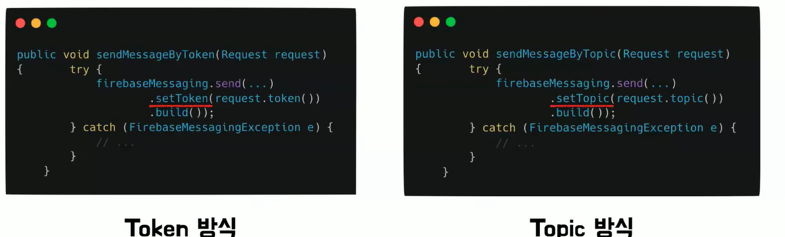

# 칼리의 FCM의 작동 흐름
[https://www.youtube.com/watch?v=5og9G1Ib06w&list=PLgXGHBqgT2TvpJ_p9L_yZKPifgdBOzdVH&index=2](https://www.youtube.com/watch?v=5og9G1Ib06w&list=PLgXGHBqgT2TvpJ_p9L_yZKPifgdBOzdVH&index=2)

# 칼리의 FCM의 작동 흐름
* toc
{:toc}

  
---

## FCM이란 무엇인가

FCM은 Google Firebase에서 제공하는 **클라우드 기반 푸시 알림 서비스**다.
정식 명칭은 *Firebase Cloud Messaging*.

여기서 중요한 건 “푸시”보다 “클라우드”다.

* FCM은 단순 라이브러리가 아니라
* **중앙 서버가 전 세계 기기와 연결을 유지**하며
* 메시지를 대신 전달해주는 중계 인프라다

### Firebase는 무엇인가

Firebase는 Google이 제공하는 **백엔드 서비스 플랫폼(BaaS)** 이다.

AWS와 개념적으로 유사하지만,

* 서버 인프라보다는
* **모바일/클라이언트 중심 서비스**에 최적화돼 있다

Firebase 안에는:

* Authentication (로그인)
* Cloud Storage (파일)
* Firestore / Realtime DB
* 그리고 FCM (푸시)

즉, **FCM은 Firebase 생태계의 한 기능**이다.

---

## 왜 FCM이 사실상 표준이 되었는가

이 부분은 영상에서 가장 중요한 배경 설명이다.

### Android의 구조적 제약

Android OS는 **임의의 푸시 서버 연결을 허용하지 않는다.**

* 배터리
* 네트워크
* 백그라운드 프로세스 관리

이 문제 때문에 Android는:

> “푸시는 **OS가 허용한 단 하나의 통로**로만 들어온다”

그 통로가 바로 **FCM**이다.

그래서:

* Amazon SNS
* OneSignal
* 기타 모든 푸시 서비스도

👉 **Android로 보낼 때는 결국 FCM을 거친다**

---

### iOS까지 통합되는 구조

iOS는 자체적으로 **APNs(Apple Push Notification service)** 를 사용한다.

FCM은 여기서 한 단계 더 나아간다.

* 서버는 FCM만 상대하면 되고
* FCM이 내부적으로

    * Android → FCM
    * iOS → APNs
      로 분기 처리한다

결과적으로:

> **FCM 하나로 Android + iOS를 동시에 커버**

이게 FCM이 “사실상 푸시 표준”이 된 이유다.

---

## FCM의 전체 작동 구조

칼리 영상에서 이 구조를 명확히 나눈다.

FCM에는 항상 **3개의 주체**가 등장한다.

1. **백엔드 서버**
2. **FCM 서버**
3. **클라이언트 기기(앱)**

이 중 FCM은 단순 전달자가 아니라 **중앙 허브**다.

---

### 기본 흐름

1. 백엔드 서버가 FCM 서버로 HTTP 요청을 보낸다
   (알림 내용 + 대상 정보)
2. FCM 서버는 대상 기기를 식별한다
3. FCM이 해당 기기로 푸시를 전달한다
4. 앱에서는 `onMessageReceived` 같은 콜백으로 수신한다

여기서 핵심 질문이 하나 생긴다.

> “전 세계 수억 대 기기 중에서
> FCM은 어떻게 **정확한 기기 하나**를 찾을까?”

---

## FCM의 핵심: Token 기반 기기 식별

FCM의 본질은 **기기 식별 시스템**이다.

### Token이란 무엇인가

* 앱이 설치되면
* FCM은 해당 앱 인스턴스에 **고유한 token**을 발급한다
* 이 token은:

    * 특정 기기
    * 특정 앱
    * 특정 설치 상태
      를 대표한다

FCM 서버는 이 token을 **자신의 DB에 저장**하고 있다.

---

### 서버는 무엇을 알고 있나

백엔드 서버는:

* token이 “어떻게 관리되는지”는 몰라도 된다
* 단지 **이 token으로 보내달라**고 요청한다

FCM 서버는:

* token → 실제 기기 연결 정보를 알고 있고
* 그 기기로 정확히 메시지를 전달한다

이 구조 덕분에:

* NAT, IP 변경, 네트워크 환경과 무관하게
* 푸시 전달이 가능하다

---

## 전송 방식의 차이: Token vs Topic

FCM은 “누구에게 보낼 것인가”에 따라 두 가지 방식을 제공한다.

### Token 방식: 1:1 전송

**개별 사용자에게 다른 메시지를 보낼 때** 사용한다.

예시:

* 주문 시작
* 배송 출발
* 결제 완료

흐름:

1. 서버는 특정 유저의 token을 알고 있다
2. 알림 내용 + token을 FCM에 전달
3. FCM은 해당 token의 기기로 전송

👉 **개인화 알림의 기본 방식**

---

### Topic 방식: 1:N 전송

**다수 사용자에게 동일한 메시지를 보낼 때** 사용한다.

예시:

* 혜택 알림
* 공지사항
* 이벤트 알림

여기서 중요한 포인트는 이거다.

> Topic 구독 관리는 **서버가 아니라 FCM이 한다**

---

#### Topic 구독 흐름

1. 사용자가 앱에서 “혜택 알림 ON”
2. 앱이 FCM 서버로 “topic 구독 요청”
3. FCM 서버는:

    * token
    * topic 관계를 자체 DB에 저장
4. 서버는 이후:

    * 개별 token이 아니라
    * **topic 이름만** FCM에 전달
5. FCM이 구독자 전체에게 전송

이 방식의 장점은 명확하다.

* 서버는 대상 관리 부담이 없다
* 대규모 브로드캐스트에 최적화
* 토큰 목록 관리가 필요 없다

---

#### 실제 코드
+ 

---

## 정리 — FCM을 시스템 관점에서 보면

칼리 영상의 핵심 메시지를 한 문장으로 정리하면 이거다.

> FCM은 “푸시 API”가 아니라
> **플랫폼 제약을 대신 해결해주는 중앙 메시징 인프라**다.

정리하면:

* Android 구조상 FCM은 필수
* iOS까지 통합해서 처리 가능
* 핵심은 token 기반 기기 식별
* 1:1은 token, 1:N은 topic
* 서버는 “누구에게”만 결정하고
  “어떻게 도착하는지”는 FCM에 위임한다

푸시 알림은 기능이 아니라
**운영체제와 네트워크의 타협 결과물**이다.

FCM은 그 복잡함을 숨겨주는 계층이다.

---

