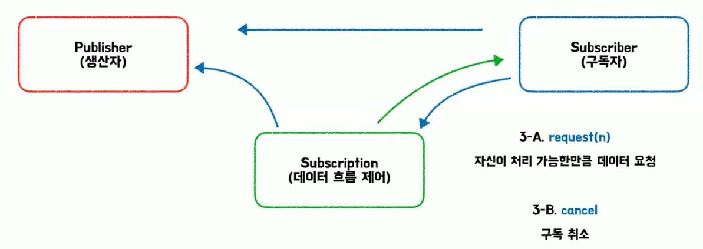
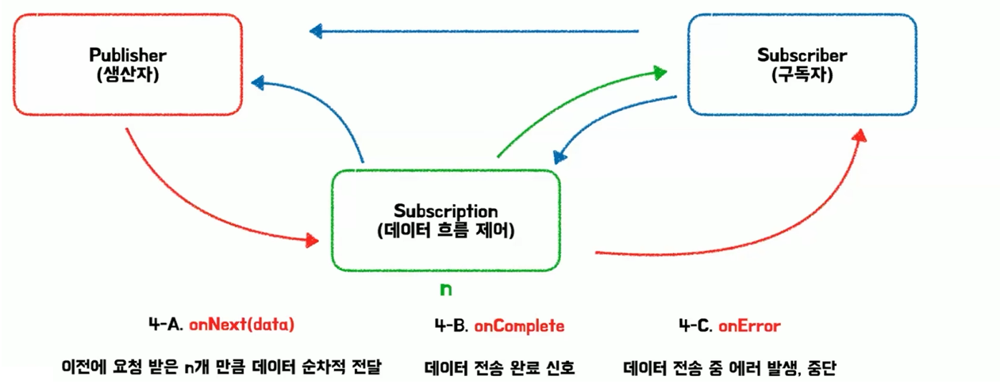
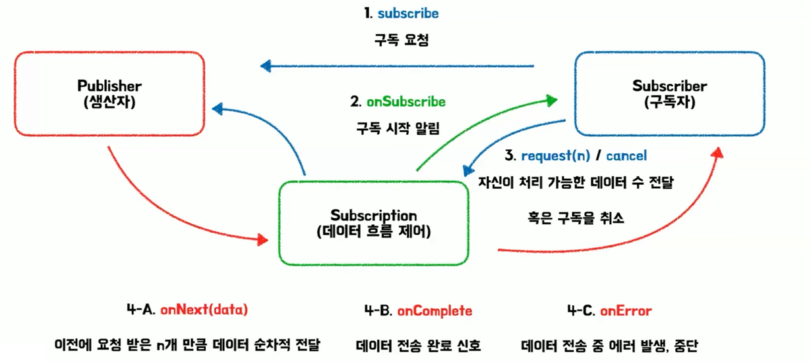

# 시소의 리액티브 프로그래밍
[https://youtu.be/FGuBPoSh_vw?si=_i-W7ACXA3GfaoVO](https://youtu.be/FGuBPoSh_vw?si=_i-W7ACXA3GfaoVO)

# 시소의 리액티브 프로그래밍
* toc
{:toc}

  
---

## 리액티브 프로그래밍이란?
+ 리액티브 프로그래밍이란 데이터, 이벤트 흐름의 전파를 중심으로 한 프로그래밍 패러다임.
+ 선언형 프로그래밍 패러다임, 데이터 스트림, 변경의 전파

## 등장 배경
+ 리액티브 프로그래밍에서의 리액티브는 말 그대로 반응형이라는 뜻
+ 반응형은 이벤트 또는 데이터의 반응에서 동작하는 것을 의미 - 마우스 버튼을 클릭하거나 메시지를 전송하거나 데이터를 입력하거나
+ 웹이나 앱 시스템이 발달을 하면서 사용자들이 점점 늘어났고 처리량이 많아지면서 처리할 데이터들이 점점 시간이 지남에 따라 늘어나게 됐다.
+ 동기/블로킹 처리 방식은 한계가 있었다 I/O 대기로 인해 병목이 생기거나 컨텍스트 스위칭 비용이 증가하는 등 여러 가지 문제가 있었고 이에 대해서 해결을 해야 했다
  그래서 비동기/논블로킹 처리를 도입하게 된다 
+ 문제가 좀 있었다  기존의 프로그래밍은 명령형 프로그래밍 방식을 사용하고 있었고 개발자가 어떻게 수행을 해야 할지 명시를 하면 그 제어 흐름 중심으로 구조를 설계를 해야 되는 방식이었다
+ 명령형으로 여러 가지 비동기 이벤트를 처리를 하려고 하니까 매우 복잡했다 그 당시에는 비동기 이벤트를 처리를 할 때 콜백 함수를 사용했는데  콜백 함수로 여러 가지를 처리하려다 보니까 중첩이 되고 복잡한 구조를 야기를 했다
+ 추가적으로 예외 처리가 어렵거나 상태나 이 흐름 제어의 어려움이 있는 등 많은 문제들이 있었다

## 선언형 프로그래밍
+ 선언형 프로그래밍은 명령형 프로그래밍과 반대되는 개념인데 개발자가 무엇을 해야 하는지만 선언을 해주면 그 내부적인 동작은 시스템이 내부적으로 알아서 처리를 해주는 개념이다
+ 콜백 지옥을 선언형 방식으로 변경을 하게 되면 가독성이 좋고 복잡성이 down된 상태로 개선을 할 수가 있다 추가적으로 예외 처리의 복잡성이나 로직 추가 같은 경우도 체이닝을 추가를 함으로써 해결을 할 수 있다

## 데이터 스트림
+ 데이터 스트림은 데이터가 연속적으로 들어오는 흐름이다

## 변경의 전파
+ 변경의 전파가 있기 전에는 데이터가 변경될 때마다 개발자가 직접 갱신을 해줬어야 했다
+ 데이터의 변화가 스트림을 따라 자동으로 전파가 돼서 연산이 처리가 될 때마다 소비자한테 즉시 전달이 되는 구조를 이야기한다 그래서 데이터가 변경이 되면 소비자에게 자동으로 반영이 되는 구조
+ 리액티브 프로그래밍은 데이터와 이벤트 흐름에 자동으로 반응해서 처리하는 선언적 프로그래밍 패러다임이다

## 활용 예시
+ 버튼을 누르거나 사용자와 직접적인 상호작용을 하는 UI에서 먼저 쓸 수 있다
  + 실시간으로 이벤트가 발생하는 케이스 예를 들면 사용자 입력 스트림 처리라던가 실시간 UI를 갱신하는 케이스 또는 게임에서의 이벤트 처리 같은 경우
+ 백엔드의 경우에서 외부 연동이 많은 서비스에 적용을 할 수가 있는데 외부 I/O가 많으면 스레드 블로킹이 일어나서 굉장히 효율이 떨어진다 API 게이트웨이나 MSA 서버 간에 연동을 하거나
  또는 외부 시스템 흐름을 중심으로 서비스하는 외부 I/O 작업이 많은 케이스에 적용을 하면 굉장히 효과적이다
+ 추가적으로 실시간 데이터 스트림을 처리하는 서비스가 적용될 수가 있다 예를 들면 실시간 채팅이라던가 로그 수집이라던가 또는 주식 시세 차트를 보는 그런 케이스에서 적용이 될 수 있다

## Reactive Streams
+ 자바에서는 Reactive Streams라는 표준 스펙이 있다 
+ 비동기 데이터 스트림을 안전하게 처리하기 위한 표준 사양이라고 명시가 되어 있는데 원래 이 케이스는 많은 기업에서 자바에서도 리액티브 프로그래밍을 한번 적용해보자 라는 취지에서 나온 서드 파티였는데 실제로 이게 많이 사용이 되다 보니까 자바에서는 이 Reactive Streams를 표준 스펙으로 적용을 시켜서 표준 인터페이스 안에 포함을 시키게 된다

### 핵심 구성요소
+ Publisher, Subscriber, Subscription, Processor가 있어다
+ Publisher는 생산자라고도 불려서 데이터를 생성하는 역할을 한다
+ Subscriber는 소비자, 즉 Publisher를 생산자를 구독해서 생산자가 생성한 그 데이터를 소비하는 역할을 한다
+ Subscription은 생산자와 소비자 사이에서 데이터 흐름을 제어하는 역할을 한다
+ Processor는 그 중간에서 추가적인 연산을 수행할 수 있는 데이터 처리자

### 상호작용
+ 
+ 1차적으로 Subscriber가 Publisher한테 구독 요청
+ Publisher가 이 구독 요청을 받고 나서 Subscription을 생성
+ Subscription이 Subscriber에게 구독이 시작되었음을 알려준다
+ Subscriber는 Subscription에게 자신이 처리 가능한 데이터 수를 보내거나 또는 구독을 취소하는 요청을 보낼 수가 있다
+ 구독 취소를 요청하면 구독 관계가 끝나게 된다

+ 
+ request 즉 자신이 처리 가능한 만큼의 데이터를 요청
+ Subscriber는 Subscription에게 request를 보낸다 그래서 파라미터로 n을 전달받고 Subscription은 이 n을 기록을한다
+ Publisher는 총 3가지의 동작을 할 수가 있는다
  + onNext: 이전에 요청받은 이 n개만큼의 데이터를 순차적으로 전달
  + onError: 데이터를 전송하던 중에 에러가 발생하면 Subscriber에게 바로 알려서 중단할 수 있는 기능이 있다
  + onComplete: n개만큼의 데이터를 다 전달하고 나면 그때는 Subscription을 거치지 않고 바로 Subscriber로 데이터 전송 완료 신호를 보낼 수가 있다
+ 

### Backpressure
+ 소비자가 처리 가능한 속도를 생산자에게 강제하는 제어 장치
+ 생산자가 소비자가 처리 가능한 양이 제한되어 있는데 생산자가 아무리 보내도 그 양을 전부 처리할 수 없다 그래서 이거를 직접적으로 소비자가 생산자에게 직접 알려줌으로써 제한을 시켜주는 개념

### request가 없다면
+ request 같은 경우에는 Subscriber가 자기가 처리할 수 있는 양의 데이터를 알려주면서 데이터를 요청을 하는 개념이었는데 이게 없다면 Publisher가 자기가 처리할 수 있는 양의 데이터를 Subscriber에게 보내게 된다
+ Publisher는 1초에 10개씩 데이터를 보낼 수 있고, Subscriber는 1초에 최대 3개 까지만 보낼 수 있는 상황이면 Publisher가 데이터를 보내게 된다 onNext를 통해서
+ 생산자가 구독자에게 직접적으로 데이터를 보내는 방식을 Push 방식이라고 한다
+ 자기의 속도에 맞게 계속해서 데이터를 보낸다 Subscriber가 3개를 처리를 할 수가 있다고 했는데 자기가 처리할 수 있는 만큼의 작업을 처리를 하고 있다
+ 이때 Subscriber가 처리한 속도보다 보내는 속도가 더 많다 보니까 데이터 전달이 불가능해서 Publisher가 보내는 데이터는 계속 Subscription을 거쳐서 대기 Queue에 데이터가 쌓이게 된다
+ 대기 Queue도 유한한 개념이기 때문에 한계까지 쌓이게 되고 Publisher가 데이터를 계속 발행을 하게 되면 오버플로우가 발생을한다 
+ request가 존재를 하게 되면 자기가 처리 가능한 데이터 수를 전달을 해 줌으로써 Publisher는 Subscriber가 요청한 만큼의 숫자의 데이터만 보내게 된다 이거를 Pull 방식이라고 한다 구독자가 생산자에게 데이터를 요청하는 방식이기 때문이다
+ Publisher가 데이터를 모두 전송을 하고 나면 onComplete을 보내고 Subscriber가 추가적으로 request를 호출하지 않으면 추가 데이터를 Publisher는 전송을 할 수가 없게 된다 그래서 이 Backpressure에 보면
  Subscriber가 데이터 흐름 제어라고 되어 있었듯이 말 그대로 소비자의 처리 속도에 맞춰서 데이터의 흐름을 제어하는 역할을 하는 개념이다

## 프로젝트에 적용하려면 무엇이 필요하지?
+ Reactive Streams는 말 그대로 인터페이스이다 표준 스펙이고 세부적인 내용이 구현되지 않은 상태이다
+ 구현 라이브러리가 필요한데 총 두 가지가 있다 RxJava, Reactor
+ Spring 같은 경우에는 Reactor를 표준으로 채택하고 있다
+ WebFlux는 또 Reactor를 기반으로 리액티브 프로그래밍을 구현한 웹 프레임워크를 의한다

## 정리 
+ 리액티브 프로그래밍은 데이터와 이벤트 흐름에 자동으로 반응하는 선언적 프로그래밍 패러다임이며 Reactive Streams는 말 그대로 표준 스펙 Reactor는 그걸 구현한 라이브러리 WebFlux는 또 그 구현한 라이브러리를 활용한 프레임워크이다
