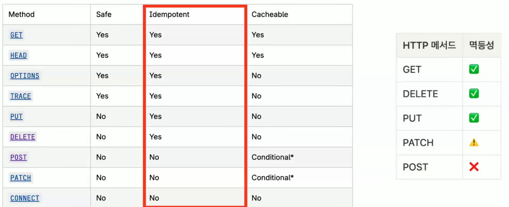

# 밍곰의 멱등성
[https://youtu.be/6znXX1tnIAs?si=azuYb3eZdYNchkpj](https://youtu.be/6znXX1tnIAs?si=azuYb3eZdYNchkpj)
— “같은 요청을 여러 번 보내도 결과는 하나여야 한다”

이 글은 멱등성 개념을 단순 정의가 아니라
**실제 시스템에서 왜 반드시 필요한지**까지 포함해 정리한 내용이다.

# 밍곰의 멱등성
* toc
{:toc}

---

## 멱등성?

* 네이버 국어사전 정의
  → 연산을 여러 번 적용해도 결과가 변하지 않는 성질

* HTTP에서의 멱등성
  → 동일한 요청을 여러 번 보내도 서버 상태가 동일해야 한다

---

### 💡 여기서 중요한 포인트

멱등성은 단순히 “같은 결과”가 아니라

> **서버 상태 변화가 동일해야 한다**

예를 들어:

* 계좌에 100원 입금 요청
  → 1번 실행 → 100원
  → 2번 실행 → ❌ 200원 (멱등 아님)

---

## 멱등한 API 설계의 필요성

네가 적어준 시나리오 그대로 핵심이다.

* 클라이언트 요청 → 서버 처리 → 응답 반환
* 그런데 **응답을 못 받는 상황 발생**

여기서 중요한 현실 문제:

### 1. 클라이언트는 절대 가만히 있지 않는다

* timeout 발생
* retry 발생
* 사용자는 다시 클릭

👉 결국 같은 요청이 **여러 번 들어온다**

---

### 2. 서버 입장에서 벌어지는 일

* 이미 처리 완료된 요청
* 하지만 클라이언트는 실패로 인식

결과:

* 중복 생성
* 데이터 불일치
* 사용자 혼란

---

### 💡 실무 관점 핵심

이건 단순한 edge case가 아니라
**100% 발생하는 상황이다**

특히 네 경험 기준:

* 결제 시스템
* webhook 처리
* 정산 배치

👉 멱등성 없으면 **장애가 아니라 사고 수준**

---

## HTTP 메서드별 멱등성
+ 
* GET → 멱등
* PUT → 멱등
* DELETE → 멱등
* POST → ❌ 멱등 아님
* PATCH → ❌ 멱등 아님

---

### 💡 중요한 오해 하나

> “POST는 멱등하지 않다” = 맞음
> “그래서 멱등성 고려 안 해도 된다” = 틀림

👉 실무에서는
**POST도 멱등하게 만들어야 한다**

대표 사례:

* 결제 API
* 주문 생성
* 쿠폰 발급

---

## API가 멱등하지 않을 때 문제점

### 1. 사용자 행동

* 더블 클릭
* 뒤로가기 → 재요청
* 모바일 재시도

---

### 2. 네트워크 문제

* timeout
* 패킷 유실
* 중간 프록시 재전송

---

### 3. 서버 문제

* 처리 지연
* 비동기 처리
* webhook 중복 호출

---

### 💡 핵심 정리

> “외부 환경은 항상 불완전하다”

따라서

👉 **재요청이 들어온다는 전제 하에 설계해야 한다**

---

## 멱등한 API 만드는 방법

핵심 질문:

> “이 요청이 중복인지 어떻게 판단할 것인가?”

---

### 클라이언트 vs 서버

* HTTP는 stateless
* 서버는 이전 요청을 모름

👉 결국

> **중복 판단 책임은 클라이언트가 가진다**

---

## 멱등키(Idempotency Key)

* 클라이언트가 생성
* 요청마다 함께 전달

```text
Idempotency-Key: abc123
```

---

### 💡 중요한 특징

* 요청 body가 같아도
* 키가 다르면 → 다른 요청

---

## 서버에서의 처리 방식

### 핵심 구조

* 멱등키 저장소 필요
* 상태 관리 필요

---

## case1: 처리 중 중복 요청

네가 정리한 흐름 유지하면서 핵심만 강화한다.

* 첫 요청 → 멱등키 저장 (IN_PROGRESS)
* 두 번째 요청 → 동일 키 발견

👉 처리 방식:

* 핸들러 실행 ❌
* “처리 중” 응답 반환

---

### 💡 실무에서 중요한 포인트

이걸 안 하면?

* 동일 트랜잭션 2번 실행
* DB lock 문제
* 정합성 깨짐

---

## case2: 처리 완료 후 중복 요청

* 동일 멱등키 존재
* 상태 = COMPLETED

👉 처리 방식:

* 핸들러 실행 ❌
* 저장된 응답 그대로 반환

---

### 💡 핵심 가치

> 서버는 “계산”하지 않고
> “기록된 결과를 재사용”한다

---

## 서버 저장 구조 (실무 확장)

여기 추가해주는 게 중요하다.

보통 이렇게 설계한다:

```text
idempotency_key
status (IN_PROGRESS / COMPLETED)
response_body
response_status
created_at
ttl
```

---

### 💡 Redis vs DB

* Redis → 빠름 / TTL 관리
* DB → 영속성

👉 결제는 보통 둘 다 사용

---

## 멱등성 구현 시 주의사항

### 1. TTL 설정

* 너무 짧으면 → 중복 처리 발생
* 너무 길면 → 메모리 낭비

---

### 2. 키 충돌

* UUID 사용 권장
* 사용자 + 요청 조합도 가능

---

### 3. 요청 바디 검증

* 같은 키인데 다른 요청이면?
  👉 에러 처리 필요

---

