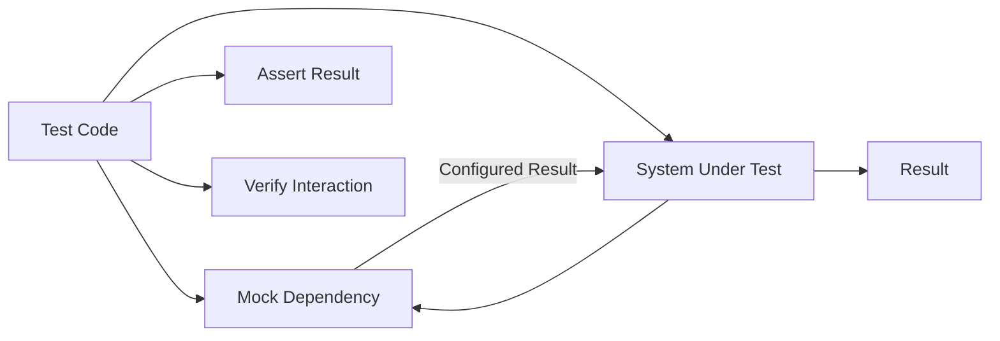

# 봉구스의 Mockito 라이브러리 사용법
[https://youtu.be/MGgiXN2SQwQ?si=jlsYeGlOIJqr7y6N](https://youtu.be/MGgiXN2SQwQ?si=jlsYeGlOIJqr7y6N)

# 봉구스의 Mockito 라이브러리 사용법
* toc
{:toc}

---

## Mockito란 무엇인가? 통제하기 어려운 테스트를 예측 가능한 테스트로 만드는 방법

테스트 코드를 작성할 때 가장 이상적인 상황은 입력과 결과를 모두 개발자가 통제할 수 있는 경우다.

예를 들어 두 수를 더하는 함수는 테스트하기 쉽다.

```java
int result = calculator.add(2, 3);

assertThat(result).isEqualTo(5);
```

입력값이 명확하고 결과도 예측할 수 있기 때문이다.

하지만 실제 애플리케이션의 객체들은 혼자 동작하지 않는다. 서비스는 Repository, 외부 API 클라이언트, 결제 모듈, 시간 제공 객체, 랜덤값 생성기 등 여러 객체에 의존한다.

```text
OrderService
├── OrderRepository
├── PaymentClient
├── InventoryService
└── NotificationService
```

이러한 의존성을 모두 실제 객체로 연결하면 테스트를 실행하기도 전에 복잡한 준비 과정이 필요해진다.

더 큰 문제는 외부 객체의 동작을 테스트가 통제할 수 없다는 점이다.

```text
랜덤값이 매번 달라진다
현재 시간이 계속 바뀐다
외부 API 상태에 따라 응답이 달라진다
실제 결제가 실행될 수 있다
DB 상태에 따라 결과가 달라진다
```

Mockito는 이러한 의존성을 가짜 객체로 대체해 테스트가 필요한 상황을 직접 제어할 수 있도록 도와주는 Java Mocking 라이브러리다. Mockito는 Mock 객체 생성, 동작 정의, 호출 검증을 읽기 쉬운 API로 제공한다.

---

## 테스트가 어려워지는 이유

테스트가 어려워지는 상황은 다양하지만 공통점은 하나다.

```text
테스트 대상의 실행 조건과 결과를 개발자가 통제하기 어렵다
```

대표적인 문제를 살펴보자.

---

## 복잡한 객체 의존성

다음과 같은 `GameService`가 있다고 가정해보자.

```java
public class GameService {

    private final PlayerRepository playerRepository;
    private final Deck deck;
    private final ScoreCalculator scoreCalculator;
    private final GameResultRepository gameResultRepository;

    public GameService(
            PlayerRepository playerRepository,
            Deck deck,
            ScoreCalculator scoreCalculator,
            GameResultRepository gameResultRepository
    ) {
        this.playerRepository = playerRepository;
        this.deck = deck;
        this.scoreCalculator = scoreCalculator;
        this.gameResultRepository = gameResultRepository;
    }
}
```

`GameService`를 테스트하려면 먼저 네 개의 의존 객체를 준비해야 한다.

그런데 `PlayerRepository`가 실제 DB 연결을 요구하고, `Deck`이 랜덤 카드를 반환하며, `GameResultRepository`도 별도의 데이터베이스를 사용한다면 테스트 준비 비용이 크게 증가한다.

```text
테스트 대상 생성
→ DB 준비
→ 테스트 데이터 삽입
→ 랜덤 결과 제어
→ 외부 환경 초기화
→ 테스트 실행
```

테스트하려는 것은 `GameService`의 판단 로직인데, 주변 객체를 준비하는 데 더 많은 코드가 필요해질 수 있다.

---

## 예측하기 어려운 반환값

랜덤값과 현재 시간은 대표적인 비결정적 요소다.

다음 `Deck`은 호출할 때마다 다른 카드를 반환한다.

```java
public class Deck {

    private final List<Card> cards;
    private final Random random;

    public Card draw() {
        int index = random.nextInt(cards.size());
        return cards.get(index);
    }
}
```

이 객체를 실제로 사용하면 어떤 카드가 나올지 예측하기 어렵다.

```java
Card card = deck.draw();
```

결과를 모르기 때문에 다음과 같은 단정문을 작성할 수 없다.

```java
assertThat(card).isEqualTo(aceOfSpades);
```

시간도 마찬가지다.

```java
LocalDateTime now = LocalDateTime.now();
```

테스트 실행 시점마다 값이 달라지므로 특정 만료 시점이나 예약 상태를 안정적으로 검증하기 어렵다.

이러한 테스트는 같은 코드를 실행해도 성공하거나 실패할 수 있는 불안정한 테스트가 된다.

---

## 특정 실패 상황을 재현하기 어렵다

외부 결제 시스템을 호출하는 코드를 생각해보자.

```java
public class PaymentService {

    private final PaymentGateway paymentGateway;

    public PaymentResult pay(PaymentRequest request) {
        return paymentGateway.approve(request);
    }
}
```

실제 `PaymentGateway`를 이용하면 테스트를 실행할 때 실제 승인 요청이 전송될 수 있다.

다음과 같은 상황도 재현하기 어렵다.

```text
PG 서버가 500 에러를 반환하는 상황
결제 요청이 타임아웃되는 상황
승인은 성공했지만 응답이 유실되는 상황
동일 거래 번호가 중복 요청되는 상황
```

이러한 오류를 테스트하기 위해 실제 외부 서버에 장애가 발생하기를 기다릴 수는 없다.

테스트가 원하는 시점에 원하는 성공과 실패를 만들어낼 수 있어야 한다.

---

## 테스트 더블이란 무엇인가?

실제 의존 객체 대신 테스트에서 사용하는 대체 객체를 일반적으로 **테스트 더블(Test Double)** 이라고 부른다.

영화 촬영에서 위험한 장면을 배우 대신 수행하는 스턴트 더블에서 유래한 표현이다.

테스트 더블에는 여러 형태가 있다.

| 종류    | 역할                                |
| ----- | --------------------------------- |
| Dummy | 파라미터를 채우기 위해 전달되지만 실제로 사용되지 않는 객체 |
| Stub  | 미리 정해진 값을 반환하는 객체                 |
| Fake  | 단순화된 실제 동작을 구현한 객체                |
| Spy   | 실제 동작을 수행하면서 호출 정보를 기록하는 객체       |
| Mock  | 기대한 상호작용을 검증할 수 있는 객체             |

실무에서는 이 용어들이 엄격하게 구분되지 않고, 테스트용 가짜 객체를 넓은 의미에서 Mock이라고 부르기도 한다.

Mockito라는 이름에도 Mock이 들어가지만, 실제로는 Stub 설정과 호출 검증을 모두 지원한다.

---

## Mock 객체란 무엇인가?

Mock 객체는 실제 객체를 대신해 테스트에서 원하는 동작을 수행하도록 만든 가짜 객체다.

예를 들어 실제 `Deck`은 랜덤 카드를 반환하지만, Mock `Deck`은 항상 스페이드 A를 반환하도록 설정할 수 있다.

```text
실제 Deck
→ 호출할 때마다 랜덤 카드 반환

Mock Deck
→ 테스트에서 정한 카드 반환
```

이렇게 하면 테스트 결과를 예측할 수 있다.

```java
when(deck.draw()).thenReturn(aceOfSpades);
```

이제 `deck.draw()`가 몇 번 호출되더라도 설정한 카드가 반환된다.

---

## 직접 Fake 객체를 만들 수도 있다

Mockito 없이도 테스트용 객체를 직접 만들 수 있다.

```java
public class FakeDeck implements Deck {

    private final Card card;

    public FakeDeck(Card card) {
        this.card = card;
    }

    @Override
    public Card draw() {
        return card;
    }
}
```

테스트에서는 다음처럼 사용한다.

```java
@Test
void 지정된_카드를_뽑는다() {
    Card aceOfSpades = new Card(Suit.SPADE, Rank.ACE);
    Deck deck = new FakeDeck(aceOfSpades);
    Player player = new Player(deck);

    player.draw();

    assertThat(player.getCards())
            .containsExactly(aceOfSpades);
}
```

직접 만든 Fake 객체는 동작이 명확하고 재사용하기 쉽다는 장점이 있다.

하지만 의존 객체가 많아지면 문제가 된다.

```text
FakeDeck
FakePaymentGateway
FakeOrderRepository
FakeNotificationClient
FakeClock
FakeInventoryService
```

테스트를 위해 수많은 클래스를 직접 만들면 클래스 수와 유지보수 비용이 증가한다.

Mockito는 필요한 테스트 더블을 코드 몇 줄로 동적으로 생성해 이러한 부담을 줄여준다.

---

## Mockito의 핵심 역할

Mockito를 사용할 때 가장 기본적인 흐름은 세 단계다.

```text
1. Mock 객체 생성
2. Mock 객체의 동작 정의
3. 결과 또는 상호작용 검증
```

이를 대표하는 API가 다음 세 가지다.

```text
mock()
when()
verify()
```

---

## Mockito 의존성 설정

Spring Boot 프로젝트에서 `spring-boot-starter-test`를 사용하고 있다면 일반적으로 Mockito가 테스트 의존성에 포함된다.

직접 추가해야 한다면 Gradle에서는 다음과 같이 설정할 수 있다.

```groovy
dependencies {
    testImplementation 'org.junit.jupiter:junit-jupiter'
    testImplementation 'org.mockito:mockito-junit-jupiter'
}
```

Mockito 5 계열은 Java 11 이상을 요구하며, 현재 공식 저장소에서도 5.x 계열이 유지되고 있다. 프로젝트의 Java 및 Spring Boot 버전에 맞춰 호환되는 버전을 선택해야 한다.

---

## mock(): 가짜 객체 생성

`mock()`은 특정 타입의 Mock 객체를 생성한다.

```java
Deck deck = mock(Deck.class);
```

생성된 객체는 실제 `Deck` 구현을 수행하지 않는다.

Mock 객체의 메서드에 별도의 동작을 설정하지 않으면 타입별 기본값을 반환한다.

```text
boolean → false
int, long → 0
객체 → null
컬렉션 → 빈 컬렉션인 경우가 많음
```

기본값에 의존하면 테스트의 의도가 불명확해질 수 있으므로, 중요한 동작은 명시적으로 설정하는 편이 좋다.

---

## when(): 원하는 동작 정의

`when()`은 Mock 객체의 메서드가 호출될 때 어떤 값을 반환할지 설정한다.

기본 문법은 다음과 같다.

```java
when(mockObject.method()).thenReturn(expectedValue);
```

예를 들어 `Deck`이 스페이드 A를 반환하도록 설정할 수 있다.

```java
Card aceOfSpades = new Card(Suit.SPADE, Rank.ACE);
Deck deck = mock(Deck.class);

when(deck.draw()).thenReturn(aceOfSpades);
```

이제 다음 코드는 실제 랜덤 로직을 실행하지 않는다.

```java
Card result = deck.draw();
```

항상 테스트가 지정한 `aceOfSpades`를 반환한다.

이처럼 Mock 객체의 동작을 미리 정의하는 것을 **Stubbing**이라고 한다.

---

## 반환값을 순서대로 설정하기

같은 메서드가 여러 번 호출될 때 서로 다른 값을 반환하도록 만들 수도 있다.

```java
when(deck.draw())
        .thenReturn(aceOfSpades)
        .thenReturn(kingOfHearts);
```

첫 번째 호출에는 스페이드 A, 두 번째 호출에는 하트 K가 반환된다.

```java
Card first = deck.draw();
Card second = deck.draw();
```

블랙잭처럼 카드가 순서대로 제공되어야 하는 시나리오를 테스트할 때 유용하다.

---

## thenThrow(): 예외 상황 재현

정상 응답뿐 아니라 예외도 원하는 시점에 발생시킬 수 있다.

```java
when(paymentGateway.approve(any()))
        .thenThrow(new PaymentTimeoutException());
```

이제 실제 외부 결제 서버에 장애가 없어도 타임아웃 상황을 재현할 수 있다.

```java
@Test
void 결제_타임아웃이_발생하면_주문을_실패_처리한다() {
    PaymentGateway paymentGateway = mock(PaymentGateway.class);
    OrderRepository orderRepository = mock(OrderRepository.class);

    when(paymentGateway.approve(any()))
            .thenThrow(new PaymentTimeoutException());

    OrderService orderService =
            new OrderService(paymentGateway, orderRepository);

    assertThatThrownBy(() -> orderService.order(createRequest()))
            .isInstanceOf(PaymentTimeoutException.class);
}
```

실패 상황을 원하는 시점에 반복해서 재현할 수 있다는 것이 Mock의 중요한 가치다.

---

## 반환값이 없는 void 메서드 설정

`when()`은 메서드 호출 결과를 인자로 전달해야 하므로 일반적인 `void` 메서드에는 그대로 사용할 수 없다.

`void` 메서드가 예외를 발생시키도록 설정할 때는 `doThrow()`를 사용한다.

```java
doThrow(new NotificationException())
        .when(notificationService)
        .send(any());
```

아무 동작도 하지 않도록 명시하려면 `doNothing()`을 사용할 수 있다.

```java
doNothing()
        .when(notificationService)
        .send(any());
```

Mock의 `void` 메서드는 기본적으로 아무 작업도 수행하지 않기 때문에 `doNothing()`은 대부분 생략할 수 있다.

---

## verify(): 메서드 호출 검증

`verify()`는 Mock 객체의 특정 메서드가 실제로 호출되었는지 검증한다.

```java
verify(paymentGateway).approve(paymentRequest);
```

이 검증은 다음 의미를 가진다.

```text
테스트 대상이 PaymentGateway의 approve()를 한 번 호출했는가?
```

Mockito의 호출 검증은 기본적으로 한 번 호출되었는지를 확인하며, 인자 비교에는 일반적으로 `equals()`가 사용된다. 더 유연한 비교가 필요하면 Argument Matcher를 사용할 수 있다.

---

## 호출 횟수 검증

`times()`를 사용하면 호출 횟수를 명시할 수 있다.

```java
verify(deck, times(2)).draw();
```

`draw()`가 정확히 두 번 호출되었는지 검증한다.

호출되지 않아야 하는 동작은 `never()`로 확인할 수 있다.

```java
verify(notificationService, never()).send(any());
```

최소 또는 최대 호출 횟수도 검증할 수 있다.

```java
verify(repository, atLeastOnce()).save(any());
verify(repository, atMost(3)).save(any());
```

호출 횟수 검증은 배치 처리, 재시도, 중복 호출 방지 같은 동작을 확인할 때 유용하다.

---

## 덱과 플레이어 테스트 예제

플레이어가 덱에서 카드를 한 장 뽑는 기능을 살펴보자.

```java
public class Player {

    private final Deck deck;
    private final List<Card> cards = new ArrayList<>();

    public Player(Deck deck) {
        this.deck = deck;
    }

    public void draw() {
        cards.add(deck.draw());
    }

    public List<Card> getCards() {
        return List.copyOf(cards);
    }
}
```

Mockito를 사용하면 랜덤성을 제거할 수 있다.

```java
@Test
void 플레이어가_지정된_카드를_뽑는다() {
    Deck deck = mock(Deck.class);
    Card aceOfSpades = new Card(Suit.SPADE, Rank.ACE);

    when(deck.draw()).thenReturn(aceOfSpades);

    Player player = new Player(deck);
    player.draw();

    assertThat(player.getCards())
            .containsExactly(aceOfSpades);
    verify(deck).draw();
}
```

이 테스트에서는 두 가지를 확인한다.

```text
플레이어가 받은 카드의 상태
Deck.draw() 호출 여부
```

다만 결과 상태만으로 충분히 동작을 보장할 수 있다면 `verify()`까지 반드시 추가할 필요는 없다. 테스트 목적에 필요한 검증만 작성하는 것이 좋다.

---

## 주문과 결제 테스트 예제

다음은 외부 결제 서비스에 의존하는 주문 서비스다.

```java
public class OrderService {

    private final PaymentGateway paymentGateway;
    private final OrderRepository orderRepository;

    public OrderService(
            PaymentGateway paymentGateway,
            OrderRepository orderRepository
    ) {
        this.paymentGateway = paymentGateway;
        this.orderRepository = orderRepository;
    }

    public OrderResult order(OrderRequest request) {
        PaymentResult paymentResult =
                paymentGateway.approve(request.toPaymentRequest());

        if (!paymentResult.isSuccess()) {
            return OrderResult.failure();
        }

        Order order = Order.create(request);
        orderRepository.save(order);

        return OrderResult.success(order.getId());
    }
}
```

실제 결제 없이 결제 성공 상황을 만들 수 있다.

```java
@Test
void 결제에_성공하면_주문을_저장한다() {
    PaymentGateway paymentGateway = mock(PaymentGateway.class);
    OrderRepository orderRepository = mock(OrderRepository.class);

    PaymentResult success = PaymentResult.success("payment-100");

    when(paymentGateway.approve(any()))
            .thenReturn(success);

    OrderService orderService =
            new OrderService(paymentGateway, orderRepository);

    OrderResult result = orderService.order(createOrderRequest());

    assertThat(result.isSuccess()).isTrue();
    verify(orderRepository).save(any(Order.class));
}
```

결제 실패 상황도 쉽게 만들 수 있다.

```java
@Test
void 결제에_실패하면_주문을_저장하지_않는다() {
    PaymentGateway paymentGateway = mock(PaymentGateway.class);
    OrderRepository orderRepository = mock(OrderRepository.class);

    when(paymentGateway.approve(any()))
            .thenReturn(PaymentResult.failure("DECLINED"));

    OrderService orderService =
            new OrderService(paymentGateway, orderRepository);

    OrderResult result = orderService.order(createOrderRequest());

    assertThat(result.isSuccess()).isFalse();
    verify(orderRepository, never()).save(any());
}
```

실제 결제 시스템에서는 만들기 어려운 승인 거절 상황을 간단하게 반복 재현할 수 있다.

---

## Argument Matcher 사용

메서드 인자가 복잡하거나 테스트에서 정확한 객체 인스턴스까지 중요하지 않을 때 Argument Matcher를 사용할 수 있다.

대표적인 Matcher는 다음과 같다.

```java
any()
anyString()
anyLong()
eq()
argThat()
```

예를 들어 어떤 `PaymentRequest`든 성공을 반환하도록 설정할 수 있다.

```java
when(paymentGateway.approve(any(PaymentRequest.class)))
        .thenReturn(PaymentResult.success("payment-100"));
```

특정 금액만 허용하고 싶다면 `argThat()`을 사용할 수 있다.

```java
when(paymentGateway.approve(
        argThat(request -> request.amount() >= 10_000)
)).thenReturn(PaymentResult.success("payment-100"));
```

주의할 점은 하나의 메서드 호출에서 Matcher와 일반 값을 섞어 쓰지 않는 것이다.

잘못된 예시는 다음과 같다.

```java
when(service.process(anyLong(), "PAYMENT"))
        .thenReturn(true);
```

Matcher를 사용하기 시작했다면 나머지 인자에도 `eq()`를 적용한다.

```java
when(service.process(anyLong(), eq("PAYMENT")))
        .thenReturn(true);
```

---

## ArgumentCaptor로 전달된 값 검증

메서드가 호출되었다는 사실뿐 아니라 실제로 어떤 값이 전달되었는지 확인하고 싶을 수 있다.

예를 들어 주문 저장 시 계산된 금액을 검증하고 싶다고 가정해보자.

```java
ArgumentCaptor<Order> captor =
        ArgumentCaptor.forClass(Order.class);

verify(orderRepository).save(captor.capture());

Order savedOrder = captor.getValue();

assertThat(savedOrder.getTotalAmount())
        .isEqualTo(30_000L);
```

`ArgumentCaptor`는 다음 상황에서 유용하다.

```text
메서드 내부에서 새로 생성된 객체 검증
외부로 전달된 이벤트 내용 검증
저장된 엔티티의 상태 검증
발행된 메시지의 필드 검증
```

---

## Mockito 어노테이션 사용

Mock 객체가 많아지면 `mock()`을 반복하는 코드도 길어진다.

JUnit 5에서는 Mockito Extension과 어노테이션을 사용할 수 있다.

```java
@ExtendWith(MockitoExtension.class)
class OrderServiceTest {

    @Mock
    private PaymentGateway paymentGateway;

    @Mock
    private OrderRepository orderRepository;

    @InjectMocks
    private OrderService orderService;

    @Test
    void 결제에_성공하면_주문을_저장한다() {
        when(paymentGateway.approve(any()))
                .thenReturn(PaymentResult.success("payment-100"));

        OrderResult result =
                orderService.order(createOrderRequest());

        assertThat(result.isSuccess()).isTrue();
        verify(orderRepository).save(any(Order.class));
    }
}
```

각 어노테이션의 역할은 다음과 같다.

| 어노테이션                                 | 역할                          |
| ------------------------------------- | --------------------------- |
| `@Mock`                               | Mock 객체 생성                  |
| `@InjectMocks`                        | Mock 객체를 테스트 대상 생성자나 필드에 주입 |
| `@Spy`                                | 실제 객체의 일부 동작만 재정의           |
| `@Captor`                             | ArgumentCaptor 생성           |
| `@ExtendWith(MockitoExtension.class)` | JUnit 5에서 Mockito 어노테이션 초기화 |

`@InjectMocks`가 편리하더라도 의존성이 지나치게 많은 클래스를 그대로 정당화해서는 안 된다. Mock 주입 대상이 너무 많다면 테스트 기술보다 클래스의 책임이 과도한 것은 아닌지 먼저 검토해야 한다.

---

## Mock과 Spy의 차이

Mock은 실제 메서드를 기본적으로 실행하지 않는다.

```java
List<String> list = mock(ArrayList.class);
```

반면 Spy는 실제 객체를 감싸며 기본적으로 실제 메서드를 실행한다.

```java
List<String> list = spy(new ArrayList<>());
```

일부 동작만 변경할 수 있다.

```java
doReturn(100)
        .when(list)
        .size();
```

Spy는 레거시 코드나 부분적인 동작 교체에 유용할 수 있지만, 실제 동작과 가짜 동작이 섞여 테스트를 이해하기 어렵게 만들 수 있다.

가능하면 의존성을 명확히 분리해 Mock이나 Fake로 대체하는 설계가 더 단순하다.

---

## 결과 검증과 상호작용 검증

Mockito 테스트에서는 두 가지 검증 방식이 사용된다.

### 상태 또는 결과 검증

실행 이후 반환값이나 객체 상태를 확인한다.

```java
assertThat(result.isSuccess()).isTrue();
```

### 상호작용 검증

의존 객체가 어떤 호출을 받았는지 확인한다.

```java
verify(orderRepository).save(any());
```

가능하다면 외부에서 관찰 가능한 결과를 우선 검증하는 것이 좋다.

호출 순서와 횟수를 지나치게 세밀하게 검증하면 내부 구현 변경만으로 테스트가 깨질 수 있다.

예를 들어 다음 테스트는 구현 세부사항에 강하게 결합되어 있다.

```java
verify(repository, times(1)).findById(orderId);
verify(paymentGateway, times(1)).approve(any());
verify(repository, times(1)).save(any());
```

서비스가 캐싱을 도입하거나 조회 방식을 바꾸면 사용자에게 제공되는 결과가 같아도 테스트가 실패할 수 있다.

따라서 `verify()`는 다음 상황에서 가치가 크다.

```text
반환값이 없는 외부 호출
이벤트 발행 여부
메일 또는 알림 전송 여부
데이터 저장 여부
실행되어서는 안 되는 작업 검증
중복 호출 방지
```

---

## Mockito를 사용하면 좋은 대상

Mockito는 모든 객체에 적용하기보다 테스트 통제를 어렵게 만드는 경계에 사용하는 것이 좋다.

### 외부 API 클라이언트

```text
결제 API
문자 발송 API
이메일 API
배송사 API
지도 API
```

실제 네트워크 호출 없이 성공, 실패, 타임아웃을 재현할 수 있다.

### Repository

서비스 계층의 순수한 판단 로직만 빠르게 검증할 때 Repository를 Mock으로 대체할 수 있다.

다만 실제 SQL과 JPA 매핑은 별도의 통합 테스트로 검증해야 한다.

### 시간 제공 객체

`LocalDateTime.now()`를 직접 호출하기보다 `Clock`을 주입하면 시간이 고정된 테스트를 만들 수 있다.

```java
Clock fixedClock = Clock.fixed(
        Instant.parse("2026-07-16T00:00:00Z"),
        ZoneOffset.UTC
);
```

이 경우에는 Mockito보다 표준 `Clock` 객체를 사용하는 편이 더 명확할 수 있다.

### 랜덤값 생성기

랜덤 생성 책임을 인터페이스로 분리한 뒤 Mock 또는 Fake로 대체할 수 있다.

```java
public interface CardSelector {
    Card select(List<Card> cards);
}
```

---

## Mockito를 사용하지 않는 편이 좋은 대상

다음 대상까지 무조건 Mock으로 만들 필요는 없다.

### 값 객체

```text
Money
Email
Address
Period
Position
```

생성 비용이 작고 결정적인 객체는 실제 객체를 사용하는 것이 더 명확하다.

### 단순 도메인 객체

외부 의존성이 없고 상태와 행동이 명확한 객체는 실제 객체로 검증하는 것이 좋다.

### 테스트 대상 자체

테스트하려는 객체를 Mock으로 만들면 실제 로직을 검증하지 않게 된다.

```java
OrderService orderService = mock(OrderService.class);
```

이 상태에서 `order()` 반환값을 설정하고 검증하면 `OrderService`의 진짜 코드는 전혀 실행되지 않는다.

### 실제 연동이 핵심인 영역

```text
JPA 매핑
SQL 실행
트랜잭션
직렬화
Spring Security 설정
메시지 브로커 연동
```

이러한 영역은 Mock보다 통합 테스트가 더 높은 신뢰를 제공한다.

---

## 과도한 Mock 사용의 문제점

Mockito는 테스트를 쉽게 만들지만, 잘못 사용하면 테스트의 신뢰도를 낮출 수 있다.

---

## Mock이 실제 구현과 다를 수 있다

다음 Stubbing이 있다고 가정해보자.

```java
when(orderRepository.save(any()))
        .thenReturn(savedOrder);
```

Mock Repository는 항상 저장에 성공한다.

하지만 실제 DB에서는 다음 이유로 실패할 수 있다.

```text
NOT NULL 제약 조건 위반
UNIQUE 제약 조건 위반
외래 키 제약 조건 위반
잘못된 컬럼 매핑
SQL 문법 오류
트랜잭션 오류
```

Mock 테스트가 통과해도 실제 시스템의 통합 동작을 보장하지는 않는다.

---

## 내부 구현에 결합될 수 있다

호출 순서까지 엄격히 검증하면 리팩터링에 약한 테스트가 된다.

```java
InOrder inOrder = inOrder(repository, paymentGateway);

inOrder.verify(repository).findById(orderId);
inOrder.verify(paymentGateway).approve(any());
inOrder.verify(repository).save(any());
```

비즈니스 결과는 같지만 내부 순서가 바뀌면 테스트가 실패한다.

순서 자체가 중요한 요구사항일 때만 검증해야 한다.

---

## Mock 설정이 실제 테스트보다 길어질 수 있다

테스트 하나를 위해 수많은 Stubbing이 필요하다면 다음 중 하나일 수 있다.

```text
테스트 대상의 책임이 너무 많다
객체 의존성이 지나치게 많다
테스트 범위를 너무 크게 잡았다
잘못된 계층을 단위 테스트하고 있다
```

Mockito로 복잡성을 숨기기 전에 설계를 다시 살펴볼 필요가 있다.

---

## 실무적인 Mockito 사용 원칙

Mockito를 효과적으로 사용하려면 다음 기준이 유용하다.

### 테스트 대상의 외부 경계를 Mock으로 대체한다

DB, 네트워크, 시간, 랜덤 등 통제하기 어려운 경계를 우선 대체한다.

### 도메인 객체는 가능한 한 실제 객체를 사용한다

값 객체와 순수 비즈니스 객체까지 Mock으로 만들면 테스트가 실제 동작에서 멀어진다.

### 한 테스트에서는 필요한 동작만 Stubbing한다

모든 메서드의 동작을 미리 설정하지 않는다.

### 외부 결과를 우선 검증한다

가능하면 반환값과 상태 변화를 검증하고, 상호작용 검증은 필요한 부분에만 사용한다.

### Mock 테스트와 통합 테스트를 함께 운영한다

서비스의 분기 로직은 Mockito 기반 단위 테스트로 빠르게 검증하고, Repository와 DB 연동은 통합 테스트로 보완한다.

---

## 예제: 성공과 실패를 모두 통제하는 서비스 테스트

다음 서비스는 결제 결과에 따라 주문 상태를 변경한다.

```java
public class OrderService {

    private final PaymentGateway paymentGateway;
    private final OrderRepository orderRepository;

    public OrderService(
            PaymentGateway paymentGateway,
            OrderRepository orderRepository
    ) {
        this.paymentGateway = paymentGateway;
        this.orderRepository = orderRepository;
    }

    public Order order(Order order) {
        PaymentResult result =
                paymentGateway.approve(order.toPaymentRequest());

        if (result.isSuccess()) {
            order.completePayment(result.paymentId());
        } else {
            order.failPayment(result.failureReason());
        }

        return orderRepository.save(order);
    }
}
```

성공 테스트는 다음과 같다.

```java
@Test
void 결제_승인에_성공하면_주문을_결제_완료로_변경한다() {
    PaymentGateway paymentGateway = mock(PaymentGateway.class);
    OrderRepository orderRepository = mock(OrderRepository.class);

    Order order = Order.pending(1L, 30_000L);

    when(paymentGateway.approve(any()))
            .thenReturn(PaymentResult.success("payment-100"));

    when(orderRepository.save(any()))
            .thenAnswer(invocation -> invocation.getArgument(0));

    OrderService orderService =
            new OrderService(paymentGateway, orderRepository);

    Order result = orderService.order(order);

    assertThat(result.getStatus())
            .isEqualTo(OrderStatus.PAID);
    assertThat(result.getPaymentId())
            .isEqualTo("payment-100");

    verify(orderRepository).save(order);
}
```

실패 테스트도 외부 환경과 무관하게 만들 수 있다.

```java
@Test
void 결제_승인에_실패하면_주문을_실패로_변경한다() {
    PaymentGateway paymentGateway = mock(PaymentGateway.class);
    OrderRepository orderRepository = mock(OrderRepository.class);

    Order order = Order.pending(1L, 30_000L);

    when(paymentGateway.approve(any()))
            .thenReturn(
                    PaymentResult.failure("INSUFFICIENT_BALANCE")
            );

    when(orderRepository.save(any()))
            .thenAnswer(invocation -> invocation.getArgument(0));

    OrderService orderService =
            new OrderService(paymentGateway, orderRepository);

    Order result = orderService.order(order);

    assertThat(result.getStatus())
            .isEqualTo(OrderStatus.PAYMENT_FAILED);
    assertThat(result.getFailureReason())
            .isEqualTo("INSUFFICIENT_BALANCE");
}
```

실제 PG 서버를 호출하지 않으면서도 서비스의 성공과 실패 분기를 정확하게 검증할 수 있다.

---

## 구조

Mockito를 활용한 단위 테스트의 흐름은 다음과 같다.



테스트는 Mock 객체에 원하는 응답을 설정하고, 테스트 대상에 주입한 뒤, 결과와 필요한 상호작용을 검증한다.

```text
Given
→ Mock 동작 설정

When
→ 테스트 대상 실행

Then
→ 결과와 호출 검증
```

---

## 실무에서의 활용

Mockito는 특히 서비스 계층 테스트에서 유용하다.

예를 들어 다음과 같은 비즈니스 조건을 빠르게 검증할 수 있다.

```text
재고가 부족하면 결제를 호출하지 않는다
결제가 실패하면 주문 완료 이벤트를 발행하지 않는다
결제가 성공하면 주문을 저장한다
알림 실패가 주문 성공을 취소하지 않는다
중복 요청이면 외부 API를 다시 호출하지 않는다
```

각 시나리오를 실제 DB와 외부 API 없이 빠르게 반복할 수 있다.

하지만 다음 테스트도 함께 필요하다.

```text
실제 Repository 쿼리가 정상적으로 동작하는가?
트랜잭션 롤백이 적용되는가?
외부 API 요청 형식이 계약과 일치하는가?
JSON 직렬화가 정상적인가?
```

Mockito는 전체 테스트 전략을 대체하는 도구가 아니라, 통제하기 어려운 의존성을 격리해 특정 비즈니스 로직을 빠르게 검증하는 도구다.

---

## 정리

테스트가 어려워지는 주요 원인은 테스트 대상이 복잡한 외부 의존성에 연결되어 있기 때문이다.

```text
객체 생성 과정이 복잡하다
랜덤값과 시간이 예측되지 않는다
외부 시스템의 성공과 실패를 통제하기 어렵다
실제 결제나 메시지 전송이 발생할 수 있다
```

Mock 객체는 실제 의존성을 테스트용 가짜 객체로 교체해 이러한 문제를 해결한다.

Mockito의 핵심 API는 다음과 같다.

```text
mock()
→ Mock 객체 생성

when().thenReturn()
→ 반환 동작 정의

when().thenThrow()
→ 예외 상황 정의

verify()
→ 메서드 호출 검증

times()
→ 호출 횟수 검증
```

그러나 Mock이 많다고 좋은 테스트가 되는 것은 아니다.

Mock은 실제 DB, 네트워크, 프레임워크 설정을 검증하지 못하며, 호출 방식에 지나치게 의존하면 리팩터링에 취약한 테스트가 될 수 있다.

따라서 Mockito는 다음 원칙으로 사용하는 것이 좋다.

```text
통제하기 어려운 외부 경계를 대체한다
도메인 객체는 가능한 한 실제 객체를 사용한다
결과 검증을 우선한다
필요한 상호작용만 검증한다
통합 테스트로 실제 연결을 보완한다
```

Mockito의 핵심 가치는 단순히 가짜 객체를 쉽게 만드는 데 있지 않다.

테스트가 외부 환경에 끌려다니지 않도록 성공, 실패, 예외 상황을 개발자가 직접 설계할 수 있게 만드는 데 있다.

### 한 줄 요약

**Mockito는 통제하기 어려운 의존성을 Mock으로 대체해 예측 가능한 테스트를 만들지만, 실제 통합 동작까지 보장하지는 않으므로 필요한 경계에만 신중하게 사용해야 한다.**

