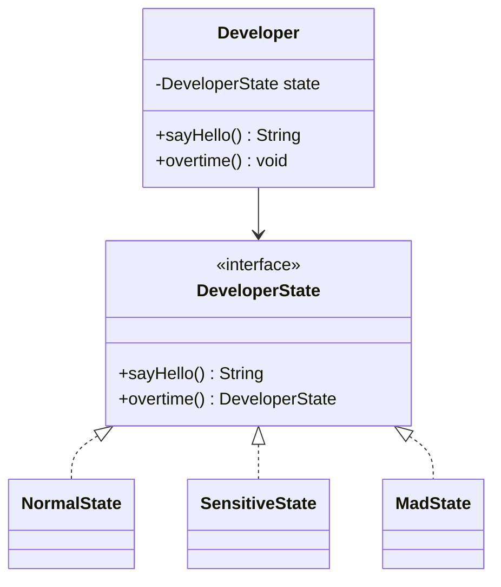
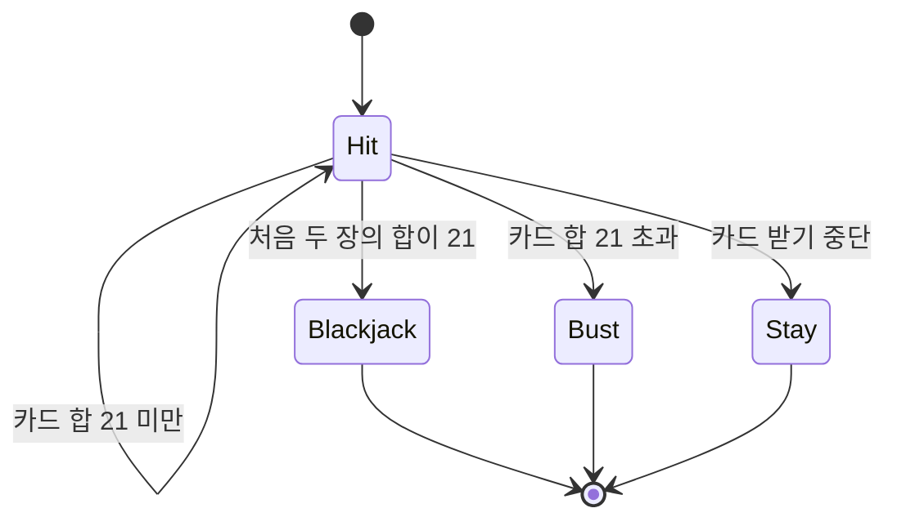
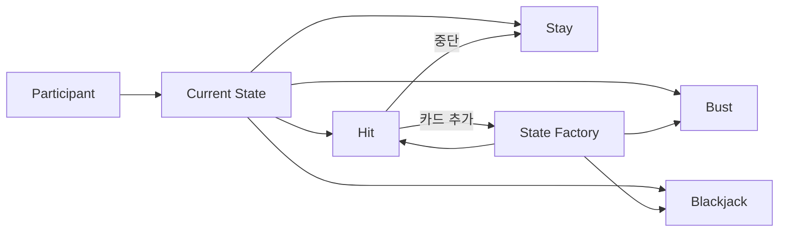

# 코로구의 상태패턴
[https://youtu.be/fcwl0hwziMc?si=EX_1G4IZFGCTbbDa](https://youtu.be/fcwl0hwziMc?si=EX_1G4IZFGCTbbDa)

# 코로구의 상태패턴
* toc
{:toc}

---

## 상태 패턴이란 무엇인가? 조건문으로 흩어진 상태를 객체로 표현하는 방법

애플리케이션을 개발하다 보면 같은 메서드를 호출했는데도 객체의 현재 상황에 따라 결과가 달라지는 경우가 있다.

예를 들어 블랙잭 참가자에게 카드를 한 장 더 받도록 요청했다고 가정해보자.

```text
현재 점수 15점
→ 카드를 더 받을 수 있음

현재 점수 21점
→ 더 받을 필요가 없음

현재 점수 23점
→ 이미 버스트 상태이므로 받을 수 없음
```

외부에서 전달하는 요청은 동일하다.

```java
participant.draw(card);
```

하지만 참가자의 현재 상태에 따라 결과와 허용되는 행동이 달라진다.

이처럼 **같은 요청에도 객체의 현재 조건에 따라 다른 반응을 보이게 만드는 값이나 상황**을 상태라고 볼 수 있다.

상태가 적을 때는 `if` 또는 `switch` 문으로 충분히 표현할 수 있다. 그러나 상태가 늘어나고 상태별 행동이 많아지면 조건문이 여러 메서드에 반복되기 시작한다.

```java
if (status == HIT) {
    // 진행 중 처리
} else if (status == STAY) {
    // 멈춘 상태 처리
} else if (status == BUST) {
    // 버스트 처리
} else if (status == BLACKJACK) {
    // 블랙잭 처리
}
```

상태 패턴은 이러한 상태를 단순한 값으로 비교하지 않고, **각 상태를 독립적인 객체로 표현하는 설계 방식**이다.

---

## 상태란 무엇인가?

상태는 객체가 현재 어떤 상황에 놓여 있는지를 나타내며, 같은 요청에 대한 행동을 달라지게 만든다.

개발 관점에서 다음과 같이 정리할 수 있다.

```text
요청
→ 메서드 호출

반응
→ 반환값, 상태 변경, 예외 발생

상태
→ 현재 요청의 처리 결과를 결정하는 값이나 조건
```

예를 들어 개발자 객체가 있다고 가정해보자.

```java
developer.sayHello();
```

일반 상태에서는 다음과 같이 응답할 수 있다.

```text
안녕하세요.
```

하지만 야근이 반복되어 예민한 상태라면 같은 요청에도 다른 응답을 할 수 있다.

```text
왜요. 뭐요.
```

중요한 점은 클라이언트가 호출하는 메서드는 같다는 것이다.

```java
developer.sayHello();
```

다른 것은 객체가 가진 현재 상태다.

---

## 조건문으로 상태를 처리하는 방식

가장 단순한 구현은 Enum으로 상태를 관리하고 메서드마다 조건문을 사용하는 것이다.

```java
public enum DeveloperStatus {
    NORMAL,
    SENSITIVE
}
```

```java
public class Developer {

    private DeveloperStatus status = DeveloperStatus.NORMAL;

    public String sayHello() {
        if (status == DeveloperStatus.NORMAL) {
            return "안녕하세요.";
        }

        if (status == DeveloperStatus.SENSITIVE) {
            return "왜요. 뭐요.";
        }

        throw new IllegalStateException("지원하지 않는 상태입니다.");
    }

    public void overtime() {
        if (status == DeveloperStatus.NORMAL) {
            status = DeveloperStatus.SENSITIVE;
        }
    }
}
```

상태가 두 개뿐이라면 이 방식도 충분히 이해하기 쉽다.

코드가 한 클래스 안에 모여 있고, 객체의 상태 변화도 직관적으로 확인할 수 있다.

문제는 상태와 행동이 늘어날 때 발생한다.

---

## 상태가 늘어나면 조건문은 어떻게 변할까?

새로운 요구사항이 추가되었다고 가정해보자.

```text
예민한 상태에서 다시 야근하면 광기 상태가 된다.
```

이제 상태 Enum에 새로운 값을 추가해야 한다.

```java
public enum DeveloperStatus {
    NORMAL,
    SENSITIVE,
    MAD
}
```

그리고 `sayHello()`에도 새로운 조건이 필요하다.

```java
public String sayHello() {
    if (status == DeveloperStatus.NORMAL) {
        return "안녕하세요.";
    }

    if (status == DeveloperStatus.SENSITIVE) {
        return "왜요. 뭐요.";
    }

    if (status == DeveloperStatus.MAD) {
        return "하하하. 야근이 즐겁네요.";
    }

    throw new IllegalStateException();
}
```

`overtime()`에도 조건이 추가된다.

```java
public void overtime() {
    if (status == DeveloperStatus.NORMAL) {
        status = DeveloperStatus.SENSITIVE;
        return;
    }

    if (status == DeveloperStatus.SENSITIVE) {
        status = DeveloperStatus.MAD;
    }
}
```

인사와 야근 외에 다른 행동이 존재하면 어떻게 될까?

```text
sayGoodbye()
receiveSalary()
takeVacation()
reviewCode()
```

각 메서드에 상태 분기가 반복된다.

```text
상태 하나 추가
→ Enum 수정
→ sayHello 수정
→ overtime 수정
→ sayGoodbye 수정
→ receiveSalary 수정
→ 다른 관련 메서드 수정
```

상태가 늘어날수록 기존 클래스의 수정 범위도 함께 넓어진다.

---

## 조건문 중심 상태 관리의 문제

조건문 자체가 잘못된 것은 아니다.

상태가 적고 변경 가능성이 낮다면 조건문이 가장 단순한 해결책일 수 있다.

하지만 상태별 행동이 많아지면 몇 가지 문제가 드러난다.

### 상태별 행동이 여러 메서드에 흩어진다

광기 상태의 행동을 알고 싶다면 `sayHello()`, `overtime()`, `takeVacation()` 등 여러 메서드를 찾아봐야 한다.

```text
MAD 상태의 인사
→ sayHello() 안에 존재

MAD 상태의 야근 반응
→ overtime() 안에 존재

MAD 상태의 휴가 반응
→ takeVacation() 안에 존재
```

하나의 상태에 관한 규칙이 한곳에 모이지 않는다.

### 상태 추가 시 기존 코드를 반복 수정한다

새로운 상태가 추가될 때마다 기존 메서드의 조건문을 변경해야 한다.

이는 수정 누락 가능성을 높인다.

```text
상태 Enum에는 추가했지만
특정 메서드의 분기를 빠뜨림
```

컴파일은 성공해도 잘못된 동작이 발생할 수 있다.

### 허용되지 않는 행동을 표현하기 어렵다

특정 상태에서 호출하면 안 되는 메서드가 있어도, 상태와 행동이 명확하게 연결되어 있지 않으면 실수로 실행할 수 있다.

```text
이미 종료된 상태인데 카드를 더 받음
버스트 상태인데 다시 stay 호출
게임 진행 중인데 수익 계산 요청
```

조건문이 여러 위치에 분산되어 있으면 이러한 제약을 일관되게 관리하기 어렵다.

---

## 상태 패턴이란 무엇인가?

상태 패턴은 객체의 상태를 Enum이나 숫자 같은 값으로 보관하는 대신, 각 상태를 독립된 객체로 표현한다.

구조는 다음과 같다.

```text
Context
→ 현재 State 객체를 보유

State
→ 상태별 공통 행동 정의

Concrete State
→ 각 상태의 실제 행동과 다음 상태 결정
```

개발자 예제에서는 `Developer`가 Context 역할을 한다.

```java
public interface DeveloperState {

    String sayHello();

    DeveloperState overtime();
}
```

일반 상태는 다음과 같이 구현할 수 있다.

```java
public class NormalState implements DeveloperState {

    @Override
    public String sayHello() {
        return "안녕하세요.";
    }

    @Override
    public DeveloperState overtime() {
        return new SensitiveState();
    }
}
```

예민 상태는 자신의 행동과 다음 상태를 직접 결정한다.

```java
public class SensitiveState implements DeveloperState {

    @Override
    public String sayHello() {
        return "왜요. 뭐요.";
    }

    @Override
    public DeveloperState overtime() {
        return new MadState();
    }
}
```

광기 상태도 독립적으로 표현한다.

```java
public class MadState implements DeveloperState {

    @Override
    public String sayHello() {
        return "하하하. 야근이 즐겁네요.";
    }

    @Override
    public DeveloperState overtime() {
        return this;
    }
}
```

`Developer`는 현재 상태 객체에게 행동을 위임한다.

```java
public class Developer {

    private DeveloperState state = new NormalState();

    public String sayHello() {
        return state.sayHello();
    }

    public void overtime() {
        state = state.overtime();
    }
}
```

이제 `Developer`는 상태를 직접 비교하지 않는다.

```text
현재 상태가 무엇인지 확인
→ 조건문 실행
```

대신 다음처럼 요청한다.

```text
현재 상태에게 인사를 요청
현재 상태에게 야근 후 상태를 요청
```

---

## 상태 객체가 자신의 다음 상태를 결정한다

상태 패턴의 중요한 특징은 상태 객체가 현재 행동뿐 아니라 다음 상태도 결정할 수 있다는 점이다.

```java
DeveloperState nextState = state.overtime();
```

현재 상태가 일반 상태라면 예민 상태를 반환한다.

```text
Normal
→ overtime()
→ Sensitive
```

현재 상태가 예민 상태라면 광기 상태를 반환한다.

```text
Sensitive
→ overtime()
→ Mad
```

현재 상태가 광기 상태라면 자신의 상태를 유지할 수 있다.

```text
Mad
→ overtime()
→ Mad
```

상태 전이 규칙이 각 상태 객체 안에 위치하기 때문에, 외부 객체가 상태 전이 조건을 모두 알 필요가 없다.

---

## 상태 패턴의 구조



`Developer`는 구체적인 상태 클래스를 직접 비교하지 않는다.

각 상태는 공통 인터페이스를 구현하며 자신의 행동과 전이 규칙을 가진다.

---

## 새로운 상태를 추가할 때의 차이

조건문 중심 구조에서는 새로운 상태를 추가할 때 기존 클래스의 여러 메서드를 수정해야 한다.

```text
새 상태 추가
→ 상태 Enum 수정
→ 모든 상태 분기 수정
→ 누락 여부 확인
```

상태 패턴에서는 새로운 상태 클래스를 추가하고 필요한 전이 지점만 연결한다.

```text
MadState 추가
→ SensitiveState의 overtime() 결과 수정
```

`Developer` 클래스는 수정하지 않는다.

```java
public class Developer {

    private DeveloperState state;

    public String sayHello() {
        return state.sayHello();
    }

    public void overtime() {
        state = state.overtime();
    }
}
```

상태가 추가되어도 이 코드는 그대로 유지된다.

이러한 구조는 새로운 상태 확장에 유리하다.

---

## 블랙잭에서 상태가 중요한 이유

블랙잭은 단순히 카드 점수를 계산하는 게임이 아니다.

참가자의 현재 상태에 따라 가능한 행동과 결과가 달라진다.

대표적인 상태는 다음과 같다.

```text
Hit
→ 게임 진행 중
→ 카드를 더 받을 수 있음

Stay
→ 카드 받기를 멈춤
→ 더 이상 카드를 받을 수 없음

Bust
→ 카드 합이 21 초과
→ 무조건 패배

Blackjack
→ 처음 두 장의 합이 21
→ 특별한 승리 조건 적용
```

각 상태는 단순한 이름이 아니라 서로 다른 행동 규칙을 가진다.

---

## 조건문으로 구현한 블랙잭 상태

상태 패턴을 사용하지 않으면 참가자가 카드 목록을 보유하고 메서드가 직접 상태를 판단할 수 있다.

```java
public class Participant {

    private final Hand hand;

    public boolean isBust() {
        return hand.score() > 21;
    }

    public boolean isBlackjack() {
        return hand.size() == 2 && hand.score() == 21;
    }

    public boolean canDraw() {
        return !isBust() && !isBlackjack();
    }
}
```

승패 계산에서도 상태를 반복해서 확인한다.

```java
if (player.isBust()) {
    return LOSE;
}

if (player.isBlackjack()) {
    return BLACKJACK_WIN;
}

if (dealer.isBust()) {
    return WIN;
}

if (player.score() > dealer.score()) {
    return WIN;
}
```

상태가 늘어나면 조건도 늘어난다.

```text
Bust 확인
Blackjack 확인
Stay 확인
Hit 확인
Dealer 조건 확인
점수 비교
```

이 방식은 작은 규모에서는 충분히 사용할 수 있다. 하지만 상태별 행동이 늘어나면 문제가 커진다.

---

## 상태를 확인한 뒤 행동하는 구조의 문제

조건문 기반 코드는 외부에서 객체의 상태를 계속 질문한다.

```text
너는 버스트인가?
너는 블랙잭인가?
너는 종료된 상태인가?
카드를 받을 수 있는가?
```

그리고 그 답을 바탕으로 외부가 행동을 결정한다.

```java
if (!participant.isBust() && !participant.isBlackjack()) {
    participant.draw(card);
}
```

이 구조에서는 상태가 자신의 행동을 관리하지 않는다.

외부 객체가 상태를 해석하고 행동을 결정한다.

이는 다음 문제를 만든다.

### 잘못된 상태에서 행동할 수 있다

호출하는 쪽이 검증을 빠뜨리면 종료 상태에서도 카드를 받을 수 있다.

```java
participant.draw(card);
```

`draw()` 내부에서 상태를 확인하지 않는다면 버스트 이후에도 카드가 추가될 수 있다.

### 상태별 규칙이 여러 클래스에 퍼진다

버스트 상태의 규칙이 다음처럼 여러 위치에 나뉠 수 있다.

```text
참가자 클래스
→ isBust()

게임 결과 계산기
→ 버스트 시 패배

UI 출력
→ 버스트 메시지 출력

수익 계산기
→ 배당률 0
```

하나의 상태에 관한 규칙이 일관되게 관리되지 않는다.

### 새로운 상태 추가의 영향 범위가 커진다

블랙잭 상태가 새로 추가되면 승패 계산, 카드 추가 가능 여부, 수익 계산, 출력 등 여러 위치를 수정해야 할 수 있다.

---

## 블랙잭 상태를 객체로 표현하기

블랙잭의 상태를 객체로 표현하면 참가자는 현재 `State` 객체만 보유한다.

```java
public class Participant {

    private State state;

    public Participant(Hand hand) {
        this.state = StateFactory.create(hand);
    }

    public void draw(Card card) {
        state = state.draw(card);
    }

    public void stay() {
        state = state.stay();
    }

    public boolean isFinished() {
        return state.isFinished();
    }

    public Profit profitAgainst(State dealerState) {
        return state.profitAgainst(dealerState);
    }
}
```

외부는 현재 상태가 무엇인지 구체적으로 묻지 않는다.

```text
버스트인가?
블랙잭인가?
Stay 상태인가?
```

대신 현재 상태에게 행동을 요청한다.

```text
카드를 받아라
멈춰라
게임이 끝났는지 알려라
수익을 계산하라
```

---

## State 인터페이스 설계

블랙잭 상태가 공통으로 제공해야 하는 행동을 정의한다.

```java
public interface State {

    State draw(Card card);

    State stay();

    boolean isFinished();

    Profit profitAgainst(State dealerState);

    Hand hand();
}
```

각 메서드의 의미는 다음과 같다.

| 메서드               | 역할                   |
| ----------------- | -------------------- |
| `draw()`          | 카드를 한 장 받고 다음 상태를 반환 |
| `stay()`          | 카드 받기를 멈춘 상태로 전환     |
| `isFinished()`    | 현재 게임 진행이 끝났는지 반환    |
| `profitAgainst()` | 상대 상태를 기준으로 수익 계산    |
| `hand()`          | 현재 손패 반환             |

상태별로 허용되지 않는 행동도 객체 내부에서 통제할 수 있다.

---

## 진행 중 상태와 종료 상태 분리

블랙잭 상태는 크게 진행 중 상태와 종료 상태로 나눌 수 있다.

```text
진행 중 상태
→ Hit

종료 상태
→ Stay
→ Bust
→ Blackjack
```

진행 중 상태는 카드를 더 받을 수 있다.

종료 상태는 카드를 더 받을 수 없다.

이 차이를 상위 추상 클래스로 표현할 수 있다.

---

## 공통 정보를 가진 추상 상태

모든 상태는 현재 손패를 기반으로 동작한다.

```java
public abstract class StartedState implements State {

    protected final Hand hand;

    protected StartedState(Hand hand) {
        this.hand = hand;
    }

    @Override
    public Hand hand() {
        return hand;
    }
}
```

진행 중 상태는 아직 게임 결과를 계산할 수 없다.

```java
public abstract class RunningState extends StartedState {

    protected RunningState(Hand hand) {
        super(hand);
    }

    @Override
    public boolean isFinished() {
        return false;
    }

    @Override
    public Profit profitAgainst(State dealerState) {
        throw new IllegalStateException(
                "진행 중인 상태에서는 수익을 계산할 수 없습니다."
        );
    }
}
```

종료 상태는 더 이상 카드를 받을 수 없다.

```java
public abstract class FinishedState extends StartedState {

    protected FinishedState(Hand hand) {
        super(hand);
    }

    @Override
    public boolean isFinished() {
        return true;
    }

    @Override
    public State draw(Card card) {
        throw new IllegalStateException(
                "종료된 상태에서는 카드를 받을 수 없습니다."
        );
    }

    @Override
    public State stay() {
        return this;
    }
}
```

허용되지 않는 행동이 상태 내부에서 명확히 통제된다.

---

## Hit 상태

`Hit`은 게임이 진행 중이며 카드를 더 받을 수 있는 상태다.

```java
public class Hit extends RunningState {

    public Hit(Hand hand) {
        super(hand);
    }

    @Override
    public State draw(Card card) {
        Hand nextHand = hand.add(card);

        return StateFactory.create(nextHand);
    }

    @Override
    public State stay() {
        return new Stay(hand);
    }
}
```

중요한 점은 카드를 받은 뒤 외부에서 상태를 판별하지 않는다는 것이다.

```java
participant.draw(card);

if (participant.score() > 21) {
    participant.changeToBust();
}
```

이런 방식이 아니라 `Hit` 상태가 다음 상태를 결정한다.

```java
return StateFactory.create(nextHand);
```

다음 상태는 손패에 따라 달라진다.

```text
점수 21 미만
→ Hit

처음 두 장이 21
→ Blackjack

점수 21 초과
→ Bust
```

---

## 상태 생성을 담당하는 팩토리

상태 전이 조건이 복잡해지면 팩토리로 분리할 수 있다.

```java
public final class StateFactory {

    private StateFactory() {
    }

    public static State create(Hand hand) {
        if (hand.isBust()) {
            return new Bust(hand);
        }

        if (hand.isBlackjack()) {
            return new Blackjack(hand);
        }

        return new Hit(hand);
    }
}
```

이 방식은 상태 판별 조건을 한곳에 모은다.

다만 모든 상태가 팩토리에 의존하면 새로운 상태가 추가될 때 팩토리도 수정해야 한다.

상태 생성 규칙이 단순하다면 팩토리가 유용하지만, 변경이 매우 잦다면 각 상태가 직접 다음 상태를 결정하도록 분산하는 방식도 고려할 수 있다.

---

## Stay 상태

`Stay`는 참가자가 더 이상 카드를 받지 않기로 결정한 상태다.

```java
public class Stay extends FinishedState {

    public Stay(Hand hand) {
        super(hand);
    }

    @Override
    public Profit profitAgainst(State dealerState) {
        if (dealerState instanceof Bust) {
            return Profit.win();
        }

        int playerScore = hand.score();
        int dealerScore = dealerState.hand().score();

        if (playerScore > dealerScore) {
            return Profit.win();
        }

        if (playerScore == dealerScore) {
            return Profit.draw();
        }

        return Profit.lose();
    }
}
```

실제 구현에서는 `instanceof`를 줄이기 위해 이중 디스패치나 결과 객체를 활용할 수 있다.

하지만 상태 패턴을 처음 적용하는 단계에서는 지나치게 복잡한 구조보다 상태별 책임을 분리하는 것 자체가 더 중요하다.

---

## Bust 상태

`Bust`는 카드 합이 21을 초과한 종료 상태다.

플레이어는 무조건 패배한다.

```java
public class Bust extends FinishedState {

    public Bust(Hand hand) {
        super(hand);
    }

    @Override
    public Profit profitAgainst(State dealerState) {
        return Profit.lose();
    }
}
```

외부 결과 계산기가 버스트 여부를 확인할 필요가 없다.

```java
if (player.isBust()) {
    return LOSE;
}
```

대신 버스트 상태가 자신의 결과를 직접 반환한다.

```java
playerState.profitAgainst(dealerState);
```

---

## Blackjack 상태

`Blackjack`은 처음 받은 두 장의 합이 21인 특별한 종료 상태다.

```java
public class Blackjack extends FinishedState {

    public Blackjack(Hand hand) {
        super(hand);
    }

    @Override
    public Profit profitAgainst(State dealerState) {
        if (dealerState instanceof Blackjack) {
            return Profit.draw();
        }

        return Profit.blackjackWin();
    }
}
```

블랙잭이 추가되기 전부터 상태 패턴이 적용되어 있었다면 변경 지점은 제한적이다.

```text
Blackjack 클래스 추가
StateFactory에 판별 조건 추가
Hit의 사용 방식은 그대로 유지
Participant 수정 없음
```

참가자 객체는 새로운 상태가 생겼다는 사실을 알 필요가 없다.

---

## 블랙잭 상태 전이 구조



상태 전이는 상태 객체가 관리한다.

외부 객체는 상태를 직접 비교하거나 변경하지 않는다.

---

## 상태 패턴 적용 전후 비교

### 조건문 중심 구조

```java
public Result calculateResult(
        Participant player,
        Participant dealer
) {
    if (player.isBust()) {
        return Result.LOSE;
    }

    if (player.isBlackjack()) {
        if (dealer.isBlackjack()) {
            return Result.DRAW;
        }

        return Result.BLACKJACK_WIN;
    }

    if (dealer.isBust()) {
        return Result.WIN;
    }

    if (player.score() > dealer.score()) {
        return Result.WIN;
    }

    if (player.score() == dealer.score()) {
        return Result.DRAW;
    }

    return Result.LOSE;
}
```

상태 판별과 결과 계산이 하나의 메서드에 집중된다.

상태가 추가될 때마다 조건문이 늘어난다.

### 상태 객체 중심 구조

```java
public Profit calculateProfit(
        Participant player,
        Participant dealer
) {
    return player.profitAgainst(dealer.state());
}
```

현재 상태가 자신의 결과를 결정한다.

외부 서비스는 상태별 조건을 알 필요가 없다.

---

## 상태 패턴의 핵심은 객체에게 질문하지 않는 것이다

조건문 중심 설계에서는 객체에게 상태를 질문한 뒤 외부에서 행동을 결정한다.

```java
if (participant.isBust()) {
    // 패배 처리
}

if (participant.isBlackjack()) {
    // 블랙잭 처리
}
```

상태 패턴에서는 현재 상태에게 행동을 요청한다.

```java
participant.draw(card);
participant.stay();
participant.profitAgainst(dealer);
```

이를 객체지향적으로 표현하면 다음과 같다.

```text
상태를 묻고 외부에서 판단
→ Tell이 아닌 Ask 중심

상태에게 행동을 요청
→ Tell, Don't Ask
```

객체가 자신의 상태와 행동을 함께 관리하므로 캡슐화가 강화된다.

---

## 상태 패턴과 개방-폐쇄 원칙

개방-폐쇄 원칙은 소프트웨어 요소가 확장에는 열려 있고 수정에는 닫혀 있어야 한다는 원칙이다.

조건문 기반 구조에서는 상태 추가 시 기존 메서드를 반복해서 수정해야 한다.

```text
새 상태 추가
→ 기존 클래스 수정
```

상태 패턴에서는 새로운 상태 객체를 추가하고 필요한 전이만 연결할 수 있다.

```text
새 상태 추가
→ 새로운 클래스 구현
→ 전이 지점 연결
```

기존 Context인 `Participant`는 수정하지 않을 수 있다.

다만 상태 패턴을 사용한다고 해서 완전히 수정이 사라지는 것은 아니다.

상태 팩토리나 특정 전이 로직은 수정될 수 있다.

중요한 것은 상태별 행동이 한곳에 모이고 변경 영향 범위가 예측 가능해진다는 점이다.

---

## 상태 패턴의 장점

### 상태별 행동이 한곳에 모인다

`Bust` 상태의 규칙은 `Bust` 클래스에서 관리된다.

```text
카드를 더 받을 수 없음
게임 종료 상태
무조건 패배
```

관련 행동이 한 객체에 모이므로 응집도가 높아진다.

### 잘못된 행동을 상태가 직접 차단한다

종료 상태에서 카드를 받으려고 하면 상태 객체가 예외를 발생시킨다.

```java
@Override
public State draw(Card card) {
    throw new IllegalStateException(
            "종료된 상태에서는 카드를 받을 수 없습니다."
    );
}
```

외부 호출자가 매번 종료 여부를 검사하지 않아도 된다.

### 상태 전이가 명확해진다

각 상태가 어떤 상태로 바뀔 수 있는지 코드로 드러난다.

```text
Hit
→ Hit
→ Stay
→ Bust
→ Blackjack
```

### 상태 추가 시 변경 범위를 줄일 수 있다

새로운 상태 객체와 전이 규칙만 추가하면 된다.

### 도메인 언어를 코드에 직접 표현할 수 있다

`Hit`, `Stay`, `Bust`, `Blackjack` 같은 게임 용어가 클래스 이름으로 드러난다.

코드가 도메인 모델과 가까워진다.

---

## 상태 패턴의 단점

상태 패턴이 항상 좋은 선택은 아니다.

### 클래스 수가 늘어난다

상태마다 별도의 클래스를 만들면 파일 수가 증가한다.

```text
Hit
Stay
Bust
Blackjack
RunningState
FinishedState
StateFactory
```

작은 프로그램에서는 조건문보다 오히려 복잡해 보일 수 있다.

### 전체 흐름을 파악하기 어려울 수 있다

처음 코드를 보는 사람은 여러 상태 클래스를 이동하며 동작을 확인해야 한다.

단순한 `switch` 문 하나보다 인지 비용이 커질 수 있다.

### 상태 전이 관계가 복잡해질 수 있다

상태가 많아지고 서로 전환 가능한 경로가 증가하면 전이 규칙 자체가 복잡해진다.

```text
A → B
A → C
B → D
C → B
D → A
```

이 경우 상태 전이 표나 다이어그램이 필요할 수 있다.

### 객체 생성 비용과 관리가 늘어난다

상태 전이 때마다 새로운 객체를 생성한다면 객체 수가 증가한다.

상태가 불변이고 내부 데이터가 없다면 Singleton 상태 객체를 사용할 수도 있지만, 손패처럼 상태별 데이터가 있다면 객체 생성이 필요하다.

---

## 상태 패턴을 사용하기 좋은 경우

다음과 같은 특징이 있다면 상태 패턴을 고려할 수 있다.

```text
상태가 여러 개 존재한다
상태에 따라 같은 메서드의 행동이 달라진다
상태별로 허용되는 행동이 다르다
상태 전이 규칙이 중요하다
새로운 상태가 추가될 가능성이 있다
조건문이 여러 메서드에 반복된다
상태별 로직이 여러 클래스에 흩어져 있다
```

대표적인 도메인은 다음과 같다.

```text
주문 상태
결제 상태
배송 상태
구독 상태
회원 상태
워크플로 상태
게임 진행 상태
문서 승인 상태
```

---

## 상태 패턴을 사용하지 않아도 되는 경우

다음과 같은 상황에서는 단순한 Enum과 조건문이 더 나을 수 있다.

```text
상태가 두세 개로 고정되어 있다
상태별 행동이 거의 없다
상태 전이가 단순하다
새 상태가 추가될 가능성이 낮다
조건문이 한두 곳에만 존재한다
```

예를 들어 단순 활성화 여부만 표현한다면 상태 객체는 과도할 수 있다.

```java
public enum ActiveStatus {
    ACTIVE,
    INACTIVE
}
```

```java
if (status == ActiveStatus.ACTIVE) {
    execute();
}
```

이 정도의 구조는 별도 상태 클래스로 나누는 것보다 직관적이다.

---

## Enum에 행동을 넣는 대안

상태가 많지 않지만 상태별 행동이 조금씩 다르다면 Enum에 행동을 넣는 방법도 있다.

```java
public enum DeveloperStatus {

    NORMAL {
        @Override
        public String sayHello() {
            return "안녕하세요.";
        }
    },

    SENSITIVE {
        @Override
        public String sayHello() {
            return "왜요. 뭐요.";
        }
    };

    public abstract String sayHello();
}
```

이 방식은 클래스 수를 줄이면서 상태별 행동을 한곳에 모을 수 있다.

하지만 상태마다 별도의 데이터가 필요하거나 전이 로직이 복잡해지면 Enum이 비대해질 수 있다.

```text
간단한 상태
→ 행동을 가진 Enum

상태별 데이터와 복잡한 전이 존재
→ 상태 객체
```

상황에 따라 적절한 방식을 선택해야 한다.

---

## 실무 예제: 주문 상태

주문도 상태에 따라 가능한 행동이 다르다.

```text
CREATED
→ 결제 가능
→ 취소 가능

PAID
→ 배송 준비 가능
→ 환불 가능

SHIPPING
→ 배송 완료 가능
→ 일반 취소 불가

DELIVERED
→ 구매 확정 가능
→ 반품 가능

CANCELED
→ 추가 행동 불가
```

조건문으로 구현하면 메서드마다 상태 검사가 반복될 수 있다.

```java
public void cancel() {
    if (status == CREATED || status == PAID) {
        status = CANCELED;
        return;
    }

    throw new IllegalStateException();
}
```

```java
public void startShipping() {
    if (status == PAID) {
        status = SHIPPING;
        return;
    }

    throw new IllegalStateException();
}
```

상태 객체로 표현하면 각 상태가 가능한 행동을 직접 결정할 수 있다.

```java
public interface OrderState {

    OrderState pay();

    OrderState cancel();

    OrderState startShipping();

    OrderState completeDelivery();
}
```

`PaidState`는 배송 시작과 취소를 허용한다.

```java
public class PaidState implements OrderState {

    @Override
    public OrderState startShipping() {
        return new ShippingState();
    }

    @Override
    public OrderState cancel() {
        return new CanceledState();
    }

    @Override
    public OrderState pay() {
        throw new IllegalStateException(
                "이미 결제가 완료되었습니다."
        );
    }

    @Override
    public OrderState completeDelivery() {
        throw new IllegalStateException(
                "배송 중인 주문만 배송 완료할 수 있습니다."
        );
    }
}
```

상태 패턴은 게임뿐 아니라 상태 전이가 핵심인 비즈니스 도메인에서도 유용하다.

---

## 테스트 방법

상태 패턴을 적용하면 상태별 행동을 독립적으로 테스트할 수 있다.

### Hit 상태 테스트

```java
@Test
void 카드를_받고_21점을_초과하면_Bust가_된다() {
    Hand hand = Hand.of(
            Card.of(SPADE, TEN),
            Card.of(HEART, NINE)
    );

    State state = new Hit(hand);

    State next = state.draw(Card.of(DIAMOND, FIVE));

    assertThat(next).isInstanceOf(Bust.class);
}
```

### Blackjack 상태 테스트

```java
@Test
void 처음_두_장의_합이_21이면_Blackjack이_된다() {
    Hand hand = Hand.of(
            Card.of(SPADE, ACE),
            Card.of(HEART, KING)
    );

    State state = StateFactory.create(hand);

    assertThat(state).isInstanceOf(Blackjack.class);
}
```

### 종료 상태 행동 테스트

```java
@Test
void Bust_상태에서는_카드를_더_받을_수_없다() {
    State state = new Bust(bustHand());

    assertThatThrownBy(
            () -> state.draw(Card.of(CLUB, TWO))
    ).isInstanceOf(IllegalStateException.class);
}
```

상태별 테스트는 각 상태의 허용 행동과 전이를 명확하게 문서화하는 역할도 한다.

---

## 상태 패턴 적용 시 설계 기준

상태 패턴을 적용할 때는 단순히 조건문을 클래스 여러 개로 이동시키는 데 그치면 안 된다.

다음 기준을 점검해야 한다.

### 상태가 자신의 행동을 책임지는가?

상태 객체가 단순한 이름표 역할만 한다면 패턴을 적용한 이점이 적다.

```java
public class BustState {
}
```

외부에서 다시 `instanceof`와 조건문으로 행동을 나눈다면 상태 패턴의 의미가 약해진다.

### 상태가 다음 상태를 결정하는가?

전이 로직이 모두 Context에 남아 있다면 조건문의 위치만 바뀐 것일 수 있다.

### 허용되지 않는 행동이 상태 내부에서 차단되는가?

잘못된 상태에서 호출 가능한 메서드를 명확하게 제어해야 한다.

### 상태 객체가 너무 많은 책임을 가지지는 않는가?

상태가 DB 저장, 화면 출력, 네트워크 호출까지 모두 담당하면 도메인 책임을 넘어설 수 있다.

상태는 상태에 따른 도메인 행동과 전이에 집중하는 것이 좋다.

---

## 구조

블랙잭 상태 패턴의 전체 흐름은 다음과 같다.



참가자는 상태를 직접 판별하지 않는다.

현재 상태에 행동을 요청하고 반환된 다음 상태로 교체할 뿐이다.

---

## 실무에서의 활용

상태 패턴은 다음과 같은 상황에서 특히 가치가 있다.

```text
주문 상태에 따라 취소와 환불 가능 여부가 달라질 때
결제 상태에 따라 승인, 취소, 재시도 규칙이 달라질 때
구독 상태에 따라 갱신, 해지, 일시정지가 달라질 때
배송 상태에 따라 주소 변경과 반품 가능 여부가 달라질 때
문서 승인 상태에 따라 수정과 결재 행동이 달라질 때
```

실무에서는 상태 패턴 자체보다 상태 전이를 명확하게 관리하는 것이 중요하다.

다음 요소를 함께 고려해야 한다.

```text
허용 가능한 상태 전이
잘못된 전이의 예외 처리
동시 요청에 의한 상태 충돌
DB 상태와 객체 상태의 일관성
상태 변경 이력
이벤트 발행 시점
트랜잭션 경계
```

예를 들어 결제가 동시에 두 번 승인되는 상황에서는 상태 패턴만으로 동시성 문제가 해결되지 않는다.

낙관적 락, 비관적 락, 멱등성 키, 유니크 제약 조건 등의 기술적 보완이 필요하다.

---

## 정리

상태는 같은 요청에도 객체의 현재 조건에 따라 다른 반응을 만들어내는 값이나 상황이다.

상태가 적을 때는 조건문으로 충분히 처리할 수 있다.

하지만 상태가 늘어나고 상태별 행동이 많아지면 다음 문제가 발생한다.

```text
조건문이 여러 메서드에 반복된다
상태별 행동이 여러 클래스에 흩어진다
새 상태 추가 시 기존 코드를 반복 수정한다
잘못된 상태에서 허용되지 않는 행동이 실행될 수 있다
```

상태 패턴은 상태를 단순한 값이 아니라 객체로 표현한다.

각 상태 객체는 다음 책임을 가진다.

```text
현재 상태에서 가능한 행동
허용되지 않는 행동의 차단
다음 상태 결정
상태별 결과 계산
```

블랙잭에서는 `Hit`, `Stay`, `Bust`, `Blackjack`을 각각 상태 객체로 표현할 수 있다.

참가자는 현재 상태 객체를 보유하고 행동을 위임한다.

```text
상태를 물어본 뒤 외부에서 행동 결정
→ 조건문 중심 설계

현재 상태에게 행동 요청
→ 상태 패턴
```

상태 패턴은 상태 추가와 전이 변경에 유연하지만, 클래스 수가 증가하고 구조 이해 비용도 높아진다.

따라서 모든 조건문을 상태 객체로 바꾸는 것이 아니라 다음 상황에서 고려해야 한다.

```text
상태가 계속 증가한다
상태에 따라 행동이 크게 달라진다
상태 전이 규칙이 중요하다
조건문이 여러 위치에 흩어져 있다
```

상태 패턴은 정답이 아니라 변경이 어려운 상태 중심 코드를 개선하기 위한 하나의 설계 도구다.

### 한 줄 요약

**상태 패턴은 상태를 조건문으로 비교하지 않고 행동과 전이를 가진 객체로 표현해, 상태가 늘어나더라도 변경 범위를 줄이고 도메인 규칙을 명확하게 관리하도록 돕는다.**


