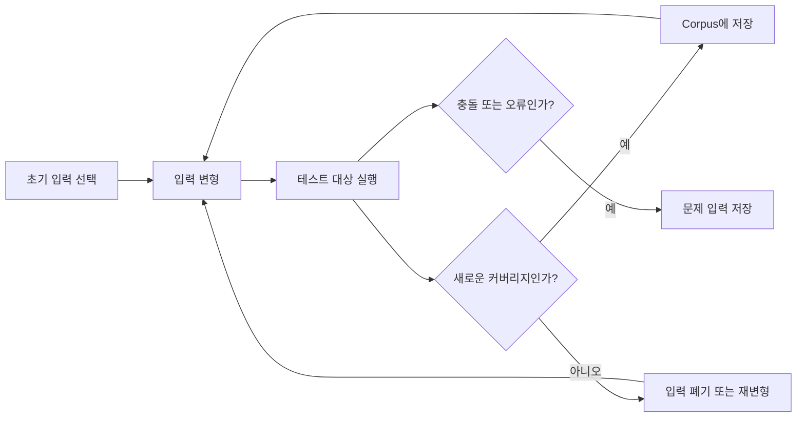
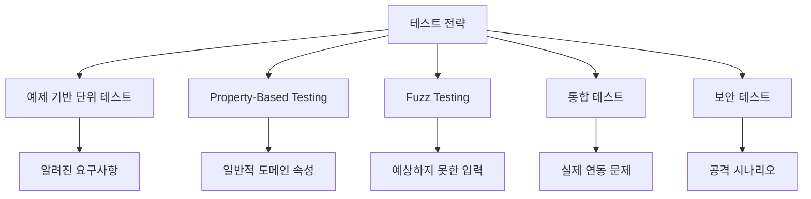
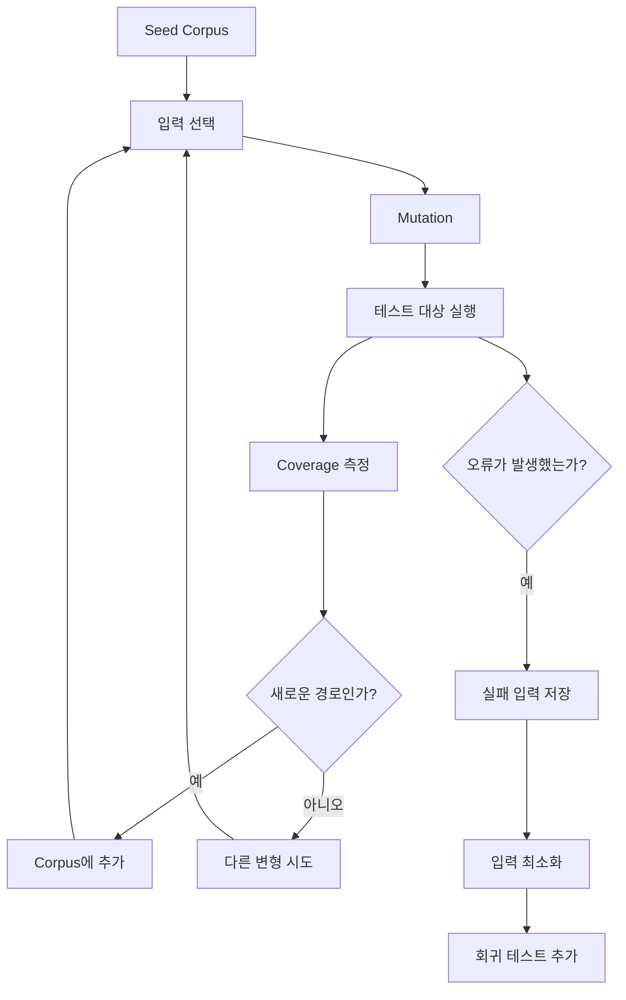

# 샤를의 기존 테스트를 넘어, Fuzz Testing
[https://youtu.be/X8T6Evy3SWM?si=v2CE3F37bzUB6F24](https://youtu.be/X8T6Evy3SWM?si=v2CE3F37bzUB6F24)

# 샤를의 기존 테스트를 넘어, Fuzz Testing
* toc
{:toc}

---

## Fuzz Testing이란 무엇인가? 사람이 예상하지 못한 입력으로 오류와 취약점을 찾는 방법

일반적인 테스트 코드는 개발자가 예상한 입력과 결과를 기반으로 작성한다.

예를 들어 사용자 이름은 비어 있으면 안 되고, 최대 10자까지만 허용된다고 가정해보자.

```java
public final class PlayerName {

    private static final int MAX_LENGTH = 10;

    private final String value;

    public PlayerName(String value) {
        validate(value);
        this.value = value;
    }

    private void validate(String value) {
        if (value == null || value.isBlank()) {
            throw new IllegalArgumentException(
                    "이름은 비어 있을 수 없습니다."
            );
        }

        if (value.length() > MAX_LENGTH) {
            throw new IllegalArgumentException(
                    "이름은 10자를 초과할 수 없습니다."
            );
        }
    }
}
```

이 코드에 대한 일반적인 테스트는 다음과 같다.

```java
@Test
void 정상적인_이름을_생성한다() {
    PlayerName name = new PlayerName("찰리");

    assertThat(name).isNotNull();
}
```

```java
@Test
void 빈_이름은_생성할_수_없다() {
    assertThatThrownBy(
            () -> new PlayerName("")
    ).isInstanceOf(IllegalArgumentException.class);
}
```

```java
@Test
void 열_글자를_초과한_이름은_생성할_수_없다() {
    assertThatThrownBy(
            () -> new PlayerName("abcdefghijkl")
    ).isInstanceOf(IllegalArgumentException.class);
}
```

이 테스트들은 작성자가 알고 있는 요구사항을 잘 검증한다.

하지만 이 코드가 현실에서 받을 수 있는 모든 입력을 검증했다고 말할 수 있을까?

실제 애플리케이션에는 개발자가 미리 떠올리지 못한 입력이 들어올 수 있다.

```text
수백만 글자의 문자열
깨진 유니코드 조합
NULL 문자
제어 문자
서로게이트 문자
이모지 조합
HTML과 JavaScript 문자열
SQL 형태의 문자열
정규식 처리 시간을 폭발시키는 문자열
비정상적인 인코딩 데이터
```

사람이 작성한 테스트는 기본적으로 사람이 상상한 범위 안에 머문다.

Fuzz Testing은 이 한계를 보완하기 위해, 프로그램에 매우 다양한 입력을 자동으로 주입하고 예상하지 못한 오류와 취약점을 탐색하는 테스트 기법이다.

---

## 기존 테스트 방식의 한계

일반적인 단위 테스트는 예제를 중심으로 작성된다.

```text
정상값 하나
경계값 몇 개
대표적인 예외값 몇 개
```

이러한 방식을 예제 기반 테스트라고 볼 수 있다.

예제 기반 테스트는 비즈니스 요구사항을 명확하게 문서화하고 빠르게 회귀 검증을 수행하는 데 매우 효과적이다.

하지만 구조적인 한계도 존재한다.

### 개발자가 예상한 입력만 검증한다

테스트에 어떤 값을 넣을지는 테스트 작성자가 결정한다.

```java
new PlayerName("");
new PlayerName("abcdef");
new PlayerName("abcdefghijkl");
```

작성자가 생각하지 못한 입력은 테스트되지 않는다.

```text
"\u0000"
"\uD800"
"\n\r\t"
"😀😀😀😀😀😀"
"<script>alert(1)</script>"
"aaaaaaaa..." 수백만 번 반복
```

테스트 코드가 많아도 입력 공간 전체에 비하면 검증된 범위는 극히 작다.

---

## 입력 공간은 생각보다 훨씬 크다

문자열 하나만 보더라도 가능한 조합은 사실상 무한에 가깝다.

길이가 10인 문자열만 생각해도 문자 집합의 크기에 따라 조합 수가 폭발적으로 증가한다.

```text
영문 소문자만 허용
→ 26¹⁰

유니코드 전체 허용
→ 훨씬 더 큰 입력 공간
```

입력 파라미터가 여러 개라면 조합은 더 커진다.

```java
public void login(
        String username,
        String password
) {
}
```

사용자명과 비밀번호의 모든 조합을 사람이 직접 작성하는 것은 불가능하다.

```text
username 경우의 수
× password 경우의 수
= 전체 입력 공간
```

메서드가 숫자, 문자열, 파일, 네트워크 데이터처럼 여러 입력을 받으면 테스트 공간은 기하급수적으로 증가한다.

---

## 정상 시나리오 중심 테스트의 문제

개발자는 대체로 정상적인 사용 흐름을 중심으로 테스트한다.

```text
올바른 사용자명
올바른 비밀번호
존재하는 주문 ID
정상적인 JSON
지원하는 파일 형식
```

그러나 공격자나 오작동하는 클라이언트는 정상적인 데이터를 보내지 않는다.

```text
비정상적으로 긴 입력
잘린 파일
중첩이 과도한 JSON
예상하지 못한 바이너리 값
잘못된 헤더
반복되는 특수 문자
파싱 경계를 공격하는 입력
```

시스템의 실제 취약점은 정상 흐름이 아니라 비정상 입력 처리 과정에서 발견되는 경우가 많다.

---

## 모든 예외 입력을 사람이 작성할 수 없다

개발자는 경계값 분석을 통해 중요한 입력을 골라낼 수 있다.

예를 들어 이름 길이가 1자 이상 10자 이하라면 다음 값은 중요하다.

```text
0자
1자
10자
11자
```

하지만 길이만 문제가 되는 것은 아니다.

```text
공백만 있는 문자열
앞뒤 공백이 있는 문자열
개행이 포함된 문자열
결합형 유니코드
문자 개수와 바이트 길이가 다른 문자열
NULL 문자가 포함된 문자열
```

모든 경우를 직접 나열하기 시작하면 테스트 작성과 유지보수 비용이 지나치게 커진다.

따라서 예제 기반 테스트만으로는 충분하지 않으며, 입력을 자동으로 생성하고 검증하는 방법이 필요하다.

---

## Fuzz Testing이란 무엇인가?

Fuzz Testing은 테스트 대상에 무작위 또는 비정상적인 입력을 반복적으로 주입하여 프로그램의 오류, 충돌, 예외, 보안 취약점을 찾는 테스트 방법이다.

기본적인 구조는 다음과 같다.

```text
입력 생성
→ 프로그램 실행
→ 이상 동작 감지
→ 문제가 발생한 입력 저장
→ 입력을 변형해 반복
```

퍼저는 짧은 시간 동안 수천 번, 수백만 번, 수천만 번 이상 테스트를 실행할 수 있다.

사람은 의미 있는 몇 개의 테스트를 깊이 있게 작성하고, 퍼저는 넓은 입력 공간을 자동으로 탐색한다.

두 방식은 대체 관계가 아니라 보완 관계다.

---

## 단순한 랜덤 테스트와 퍼즈 테스팅의 차이

퍼즈 테스팅을 단순히 무작위 값을 많이 넣는 테스트로 이해하면 핵심을 놓치기 쉽다.

다음 코드를 살펴보자.

```java
public void authenticate(
        String username,
        String password
) {
    if ("admin".equals(username)) {
        if ("1234".equals(password)) {
            executeAdminCommand();
        }
    }
}
```

완전히 무작위로 문자열을 생성한다고 가정해보자.

```text
x9kP
aB3!
zz12
Qwer
```

우연히 `admin`과 `1234`를 동시에 생성할 확률은 매우 낮다.

테스트를 수백만 번 실행해도 다음 코드는 한 번도 실행되지 않을 수 있다.

```java
executeAdminCommand();
```

테스트가 오류 없이 끝났더라도 핵심 분기 내부를 한 번도 검증하지 않았다면 충분한 테스트라고 보기 어렵다.

---

## 무작위 입력만으로는 깊은 분기에 도달하기 어렵다

다음과 같이 조건이 여러 단계로 중첩되어 있다고 가정해보자.

```java
public void run(String input) {
    if (input.startsWith("A")) {
        if (input.length() > 5) {
            if (input.contains("ADMIN")) {
                if (input.endsWith("1234")) {
                    execute();
                }
            }
        }
    }
}
```

완전한 랜덤 생성기는 매번 전혀 새로운 문자열을 만들 수 있다.

```text
kfj39
qweiu
zzzz1
```

그러나 이 입력들은 첫 번째 조건조차 통과하지 못한다.

```text
A로 시작하지 않음
→ 이후 분기 미실행
```

좋은 퍼저는 우연에만 의존하지 않는다.

어떤 입력이 새로운 코드 경로를 실행했는지 관찰하고, 그 입력을 기반으로 다음 데이터를 만든다.

이러한 방식을 **Coverage-Guided Fuzzing**, 즉 코드 커버리지 기반 퍼징이라고 한다.

---

## 코드 커버리지 기반 퍼징이란 무엇인가?

코드 커버리지 기반 퍼징은 입력이 프로그램의 새로운 코드 경로나 분기를 실행했는지를 피드백으로 활용한다.

예를 들어 초기 입력이 다음과 같다고 가정해보자.

```text
B
```

이 입력은 첫 번째 조건을 통과하지 못한다.

```java
if (input.startsWith("A")) {
}
```

퍼저가 입력을 변형해 다음 값을 만들었다.

```text
A
```

이 입력은 이전에 실행하지 못한 새로운 분기를 연다.

```text
startsWith("A") == true
```

퍼저는 이 입력을 의미 있는 데이터로 판단해 저장한다.

이후 `A`를 기반으로 변형을 반복한다.

```text
A
→ ADMIN
→ A_ADMIN
→ A_ADMIN_1234
```

새로운 조건을 통과할 때마다 해당 입력을 보관하고, 더 깊은 코드 경로를 탐색한다.

---

## 코드 커버리지가 피드백이 되는 이유

퍼저 입장에서 어떤 입력이 좋은 입력인지 판단할 기준이 필요하다.

단순히 프로그램이 정상 종료했다는 정보만으로는 입력의 가치를 평가하기 어렵다.

```text
입력 A
→ 정상 종료

입력 B
→ 정상 종료
```

두 입력이 같은 코드를 실행했는지, 다른 코드를 실행했는지 알 수 없다.

커버리지 정보를 이용하면 다음처럼 구분할 수 있다.

```text
입력 A
→ 기존 코드 경로만 실행
→ 새 정보 없음

입력 B
→ 새로운 조건 분기 실행
→ 의미 있는 입력
```

새로운 코드 경로를 실행한 입력은 이후 탐색을 위한 중요한 출발점이 된다.

---

## Corpus란 무엇인가?

퍼즈 테스팅에서 **Corpus**는 새로운 코드 경로를 열었거나 특별한 의미가 있다고 판단된 입력을 저장하는 보관소다.

```text
Corpus
├── seed-001
├── seed-002
├── seed-003
└── crash-001
```

퍼저는 코퍼스에 저장된 입력을 꺼내 일부를 변형한다.

```text
문자 추가
문자 삭제
비트 변경
숫자 증가
문자열 결합
경계값 삽입
특수값 삽입
```

그 후 변형된 입력으로 다시 테스트를 수행한다.

새로운 커버리지를 발견하면 입력을 코퍼스에 추가한다.

---

## 코드 커버리지 기반 퍼징의 반복 과정

전체 흐름은 다음과 같다.



퍼저는 단순히 새로운 값을 무작위로 생성하는 것이 아니라, 프로그램 실행 결과를 학습 신호처럼 활용한다.

---

## 초기 입력인 Seed가 중요한 이유

퍼저를 시작할 때 제공하는 초기 입력을 Seed라고 부른다.

좋은 Seed는 퍼저가 의미 있는 코드 영역에 빠르게 도달하도록 돕는다.

예를 들어 JSON 파서를 퍼징한다고 가정해보자.

좋지 않은 Seed는 다음과 같다.

```text
abc
```

JSON 구조와 전혀 관련이 없기 때문에 파서의 초반 검증에서 계속 거부될 수 있다.

더 나은 Seed는 다음과 같다.

```json
{}
```

```json
{
  "name": "test"
}
```

퍼저는 이 구조를 기반으로 키와 값, 괄호, 길이 등을 변형하며 더 깊은 파싱 로직을 탐색할 수 있다.

```text
유효한 구조에 가까운 Seed
→ 깊은 코드 도달 가능성 증가

완전히 무관한 Seed
→ 초기 검증에서 반복적으로 차단
```

다만 Seed가 좋다고 해서 반드시 Corpus 수가 많아지는 것은 아니다.

테스트 대상의 분기 자체가 적다면 새로운 커버리지를 여는 입력도 적을 수 있다.

---

## Corpus 수가 많으면 좋은 테스트일까?

퍼징 실행 결과에서 새로운 입력이 몇 개 저장되었는지를 볼 수 있다.

예를 들어 수천만 건을 실행했는데 Corpus에는 세 개의 입력만 남을 수 있다.

처음 보면 다음과 같은 의문이 생긴다.

```text
왜 이렇게 많은 테스트 중
의미 있는 입력은 세 개뿐일까?
```

가능한 이유 중 하나는 초기 Seed가 좋지 않았기 때문일 수 있다.

그러나 더 본질적인 이유는 테스트 대상의 분기 구조가 단순하기 때문일 수 있다.

다음 코드에는 사실상 몇 개의 주요 경로만 존재한다.

```java
private void validate(String name) {
    if (name == null || name.isBlank()) {
        throw new IllegalArgumentException();
    }

    if (name.length() > 10) {
        throw new IllegalArgumentException();
    }
}
```

가능한 주요 경로는 대략 다음과 같다.

```text
빈 값 또는 공백
길이 초과
정상값
```

새롭게 열 수 있는 코드 범위 자체가 적기 때문에 코퍼스도 작을 수 있다.

따라서 Corpus 개수만으로 퍼즈 테스트의 품질을 평가하면 안 된다.

---

## 퍼즈 테스트 품질은 무엇으로 판단해야 할까?

퍼즈 테스트의 품질은 단순한 실행 횟수나 Corpus 개수보다 여러 지표를 함께 봐야 한다.

```text
코드 커버리지
분기 커버리지
고유한 실행 경로 수
충돌 발견 여부
탐색 속도
코드 대비 탐색된 범위
발견한 입력의 재현 가능성
```

예를 들어 7천만 번 실행했더라도 동일한 코드 경로만 반복했다면 의미가 제한적이다.

반대로 실행 횟수가 적더라도 핵심 분기와 예외 처리 경로를 모두 탐색했다면 가치가 높을 수 있다.

---

## 실행 횟수는 품질과 동일하지 않다

다음 두 테스트를 비교해보자.

```text
테스트 A
→ 1억 회 실행
→ 동일한 정상 경로만 반복

테스트 B
→ 100만 회 실행
→ 정상, 예외, 경계, 깊은 분기 탐색
```

실행 횟수만 보면 A가 더 커 보인다.

하지만 코드 탐색 품질은 B가 더 높을 수 있다.

퍼징에서는 얼마나 많이 실행했는지보다 얼마나 새로운 영역을 탐색했는지가 중요하다.

---

## JVM에서 사용하는 Jazzer

Jazzer는 JVM 애플리케이션을 위한 커버리지 기반 퍼저다.

Java, Kotlin 등 JVM 언어의 코드를 대상으로 퍼즈 테스트를 작성할 수 있으며, JUnit과 비교적 자연스럽게 통합할 수 있다는 장점이 있다.

일반적인 테스트 코드와 비슷한 형태로 퍼즈 테스트를 작성할 수 있다.

```java
@FuzzTest
void playerNameShouldNeverCrash(String input) {
    try {
        new PlayerName(input);
    } catch (IllegalArgumentException ignored) {
        // 도메인에서 의도한 예외는 허용한다.
    }
}
```

퍼저는 `input`에 다양한 문자열을 계속 주입한다.

중요한 점은 어떤 예외든 무조건 무시하면 안 된다는 것이다.

도메인에서 의도한 예외만 허용하고, 예상하지 못한 예외는 테스트 실패로 남겨야 한다.

---

## 퍼즈 테스트에서 무엇을 검증해야 할까?

퍼즈 테스트는 단순히 메서드를 호출하는 것으로 끝나지 않는다.

테스트 대상이 반드시 지켜야 하는 속성을 정의해야 한다.

이를 불변 조건 또는 Property라고 볼 수 있다.

예를 들어 사용자 이름 객체는 다음 조건을 지켜야 한다.

```text
잘못된 입력은 명확한 예외로 거부한다
정상 입력은 생성 후 동일한 의미를 유지한다
예상하지 못한 런타임 예외가 발생하지 않는다
생성된 객체는 불변식을 위반하지 않는다
```

퍼즈 테스트는 다음처럼 작성할 수 있다.

```java
@FuzzTest
void playerNameNeverViolatesInvariant(String input) {
    try {
        PlayerName name = new PlayerName(input);

        assertThat(name.value()).isNotBlank();
        assertThat(name.value().length())
                .isLessThanOrEqualTo(10);
    } catch (IllegalArgumentException ignored) {
        // 유효하지 않은 입력을 거부한 경우
    }
}
```

이 테스트의 목적은 특정 입력의 결과를 미리 아는 것이 아니다.

어떤 입력이 들어오더라도 객체가 자신의 불변식을 깨뜨리지 않는지 확인하는 것이다.

---

## 의도한 예외와 버그를 구분해야 한다

다음과 같은 테스트는 잘못될 수 있다.

```java
@FuzzTest
void test(String input) {
    try {
        service.process(input);
    } catch (Exception ignored) {
    }
}
```

모든 예외를 무시하면 실제 버그도 숨겨진다.

```text
IllegalArgumentException
→ 예상 가능한 입력 검증 실패

NullPointerException
→ 버그일 가능성 높음

StackOverflowError
→ 심각한 문제

OutOfMemoryError
→ 입력 크기 제한 문제 가능
```

퍼즈 테스트에서는 예상 가능한 실패와 예상하지 못한 실패를 명확히 구분해야 한다.

```java
@FuzzTest
void test(String input) {
    assertThatCode(
            () -> service.process(input)
    ).doesNotThrowAnyException();
}
```

또는 의도한 예외만 허용한다.

```java
@FuzzTest
void test(String input) {
    try {
        service.process(input);
    } catch (InvalidInputException ignored) {
        return;
    }
}
```

그 외 예외는 테스트 실패로 이어져야 한다.

---

## 퍼징이 잘 찾는 문제

Fuzz Testing은 예상하지 못한 입력이 프로그램 내부 로직을 깨뜨리는 문제를 찾는 데 특히 유용하다.

### 충돌과 런타임 예외

```text
NullPointerException
IndexOutOfBoundsException
IllegalStateException
StackOverflowError
ArithmeticException
```

### 파서 취약점

```text
잘못된 JSON
깨진 XML
손상된 이미지
비정상 압축 파일
불완전한 프로토콜 메시지
```

### 경계값 오류

```text
최댓값 초과
정수 오버플로
음수 길이
빈 배열
매우 큰 컬렉션
```

### 입력 검증 우회

```text
유니코드 정규화 차이
대소문자 변환 우회
NULL 문자 삽입
공백 문자 변형
인코딩 차이
```

### 자원 고갈

```text
매우 긴 문자열로 인한 메모리 사용 증가
과도한 중첩으로 인한 재귀 폭발
복잡한 정규식으로 인한 CPU 사용 증가
압축 해제 폭탄
```

---

## 퍼징이 보안에 강한 이유

보안 취약점은 정상 입력보다 비정상 입력에서 자주 드러난다.

공격자는 프로그램의 정상적인 사용 방식을 따르지 않는다.

```text
길이 제한 바로 위의 값
파서가 혼동하는 경계값
예외 처리되지 않은 형식
내부 상태를 비정상적으로 만드는 조합
```

퍼저는 사람이 직접 떠올리지 못한 조합을 대량으로 시도한다.

이 과정에서 다음 문제를 발견할 수 있다.

```text
인증 우회
파서 충돌
메모리 손상
서비스 거부
예외 정보 노출
비정상 상태 전이
```

특히 외부 입력을 직접 처리하는 코드에서 가치가 높다.

---

## 퍼즈 테스팅 적용 대상

퍼즈 테스팅은 모든 메서드에 동일하게 적용하기보다 입력 공간이 크고 신뢰할 수 없는 데이터를 처리하는 경계에 우선 적용하는 것이 좋다.

### 문자열 검증 로직

```text
사용자명
이메일
주소
검색어
쿠폰 코드
```

### 파서

```text
JSON
XML
CSV
프로토콜 메시지
파일 포맷
```

### 인코딩과 디코딩

```text
Base64
URL Encoding
JWT
압축 데이터
암호화 데이터
```

### API 입력 DTO

```text
회원 가입 요청
결제 요청
주문 생성 요청
검색 조건
파일 업로드 메타데이터
```

### 계산 로직

```text
수수료 계산
할인 계산
환율 계산
정산 계산
범위 계산
```

### 상태 전이 로직

```text
주문 상태 변경
결제 승인과 취소
구독 상태 변경
게임 상태 전환
```

---

## 블랙잭 이름 검증에 적용하기

플레이어 이름 객체를 다시 살펴보자.

```java
public final class PlayerName {

    private static final int MAX_LENGTH = 10;

    private final String value;

    public PlayerName(String value) {
        validate(value);
        this.value = value;
    }

    private void validate(String value) {
        if (value == null || value.isBlank()) {
            throw new IllegalArgumentException(
                    "이름은 비어 있을 수 없습니다."
            );
        }

        if (value.length() > MAX_LENGTH) {
            throw new IllegalArgumentException(
                    "이름은 10자를 초과할 수 없습니다."
            );
        }
    }

    public String value() {
        return value;
    }
}
```

퍼즈 테스트의 목표는 다음과 같이 정의할 수 있다.

```text
어떤 문자열이 들어와도
예상하지 못한 예외가 발생하지 않는다

객체 생성에 성공했다면
이름은 공백이 아니고 10자 이하다
```

```java
@FuzzTest
void playerNameMaintainsInvariant(String input) {
    try {
        PlayerName name = new PlayerName(input);

        assertThat(name.value()).isNotBlank();
        assertThat(name.value().length())
                .isLessThanOrEqualTo(10);
    } catch (IllegalArgumentException ignored) {
        // 유효하지 않은 이름은 정상적으로 거부된다.
    }
}
```

이 테스트는 개발자가 직접 입력값을 나열하지 않아도 다양한 문자열을 검증한다.

---

## 유니코드와 문자열 길이의 함정

Java의 `String.length()`는 사용자가 인식하는 문자 수와 항상 같지 않다.

일부 이모지나 보조 문자는 두 개의 UTF-16 코드 단위로 표현될 수 있다.

```java
String value = "😀";

System.out.println(value.length());
```

출력은 다음과 같을 수 있다.

```text
2
```

사용자는 한 글자로 인식하지만 Java의 `length()`는 2를 반환한다.

따라서 요구사항이 “사용자가 보는 글자 기준 10자”라면 단순한 `length()` 검증은 잘못될 수 있다.

```java
int codePointCount = value.codePointCount(
        0,
        value.length()
);
```

퍼징은 이러한 예상하지 못한 유니코드 조합을 발견하는 데 도움을 줄 수 있다.

---

## 길이 제한만으로 충분하지 않다

이름이 10자 이하라는 조건만 만족하면 다음 문자열도 통과할 수 있다.

```text
"\u0000"
"\n"
"\t"
"<script>"
```

도메인 요구사항에 따라 허용 문자 정책을 추가해야 할 수 있다.

```java
private void validateCharacters(String value) {
    if (!value.matches("[가-힣a-zA-Z0-9]+")) {
        throw new IllegalArgumentException(
                "허용되지 않는 문자가 포함되어 있습니다."
        );
    }
}
```

그러나 복잡한 정규식은 또 다른 위험을 만들 수 있다.

특정 입력에서 정규식 처리 시간이 급격히 증가하는 ReDoS 문제가 발생할 수 있기 때문이다.

퍼징은 성능 저하를 일으키는 문자열을 탐색하는 데도 활용할 수 있다.

---

## Property-Based Testing과의 차이

Fuzz Testing과 Property-Based Testing은 다양한 입력을 자동으로 생성한다는 점에서 비슷하다.

하지만 일반적으로 강조점이 다르다.

| 구분    | Fuzz Testing       | Property-Based Testing |
| ----- | ------------------ | ---------------------- |
| 주요 목적 | 충돌, 취약점, 예외 탐색     | 일반적 속성 검증              |
| 입력 생성 | 변이와 커버리지 피드백 중심    | 타입과 생성 규칙 중심           |
| 탐색 기준 | 새로운 코드 경로          | 정의한 속성의 위반 여부          |
| 대표 활용 | 파서, 보안 경계, 바이너리 입력 | 도메인 규칙, 수학적 성질         |
| 실패 결과 | 충돌을 일으킨 입력 저장      | 최소 반례로 축소              |

실무에서는 두 방식을 함께 사용할 수 있다.

```text
Property-Based Testing
→ 도메인 속성 검증

Coverage-Guided Fuzzing
→ 깊은 실행 경로와 비정상 입력 탐색
```

---

## 일반 단위 테스트와 퍼즈 테스트 비교

| 항목    | 일반 단위 테스트       | 퍼즈 테스트          |
| ----- | --------------- | --------------- |
| 입력    | 개발자가 직접 정의      | 도구가 자동 생성       |
| 목적    | 알려진 요구사항 검증     | 알려지지 않은 오류 탐색   |
| 실행 횟수 | 적고 명확함          | 대량 반복           |
| 결과 해석 | 기대값 기반          | 불변 조건과 충돌 기반    |
| 장점    | 읽기 쉽고 의도가 명확    | 예상하지 못한 입력 탐색   |
| 한계    | 작성자가 예상한 범위에 제한 | 실행 비용과 분석 비용 증가 |

일반 테스트는 요구사항을 설명하는 문서 역할을 한다.

퍼즈 테스트는 요구사항 바깥의 위험을 탐색하는 역할을 한다.

---

## 실패 입력의 재현

퍼저가 문제를 발견하면 해당 입력을 저장해야 한다.

예를 들어 특정 문자열에서 `NullPointerException`이 발생했다고 가정해보자.

```text
"\u0000\uD800\n"
```

이 입력은 이후 회귀 테스트로 추가할 수 있다.

```java
@Test
void 특수한_유니코드_입력에서도_예상하지_못한_예외가_발생하지_않는다() {
    String input = "\u0000\uD800\n";

    assertThatThrownBy(
            () -> new PlayerName(input)
    ).isInstanceOf(IllegalArgumentException.class);
}
```

퍼즈 테스트가 발견한 실패를 일반 단위 테스트로 고정하면 동일한 버그가 다시 발생하는 것을 막을 수 있다.

```text
퍼징으로 발견
→ 원인 분석
→ 코드 수정
→ 회귀 테스트 추가
```

---

## Crash Input Minimization

퍼저가 발견한 입력은 매우 길고 복잡할 수 있다.

```text
수천 바이트의 데이터 중
특정 3바이트 조합만 실제 원인
```

좋은 퍼저는 문제를 재현하는 범위 안에서 입력을 줄이는 작업을 수행한다.

이를 최소화 또는 Shrinking이라고 표현할 수 있다.

```text
초기 실패 입력
→ 10,000바이트

최소화된 입력
→ 12바이트
```

최소 입력은 원인을 분석하고 테스트 코드로 옮기기 쉽다.

---

## 퍼즈 테스트의 한계

Fuzz Testing이 강력하다고 해서 모든 문제를 해결하지는 못한다.

### 명확한 테스트 Oracle이 필요하다

어떤 결과가 정상이고 비정상인지 판단할 기준이 필요하다.

```text
프로그램이 충돌하지 않아야 한다
특정 불변식이 유지되어야 한다
직렬화 후 역직렬화 결과가 같아야 한다
```

기준이 없다면 수많은 입력을 실행해도 의미 있는 검증이 되지 않는다.

### 비즈니스 논리 오류를 놓칠 수 있다

프로그램이 충돌하지 않더라도 잘못된 결과를 반환할 수 있다.

```text
결제 금액이 잘못 계산됨
할인율이 반대로 적용됨
잘못된 사용자에게 권한 부여
```

이런 문제는 도메인 규칙에 대한 명확한 Property가 있어야 발견할 수 있다.

### 실행 비용이 크다

퍼즈 테스트는 대량 반복을 수행한다.

모든 커밋에서 장시간 실행하면 CI 시간이 지나치게 길어질 수 있다.

### 외부 시스템 의존성이 있으면 어렵다

실제 DB, 결제 API, 이메일 서버를 매번 호출하면 퍼징 속도가 크게 떨어진다.

테스트 대상을 가능한 한 순수한 함수나 작은 모듈로 분리하는 것이 좋다.

### 상태 공간이 매우 크다

입력 조합과 상태 전이가 복잡하면 모든 경로를 탐색할 수 없다.

퍼징은 완전한 증명이 아니라 탐색 기반 검증이다.

---

## 퍼즈 테스트가 발견하지 못하면 안전한가?

퍼즈 테스트가 장시간 성공했다고 해서 프로그램에 버그가 없다는 뜻은 아니다.

정확한 의미는 다음과 같다.

```text
주어진 시간과 Seed,
현재 퍼저의 탐색 전략 안에서
문제를 발견하지 못했다
```

다음 요소가 바뀌면 새로운 문제가 발견될 수 있다.

```text
더 좋은 Seed
더 긴 실행 시간
다른 입력 생성 전략
새로운 코드 변경
다른 운영 환경
```

따라서 퍼즈 테스트는 안전성을 증명하는 도구가 아니라, 결함 발견 가능성을 높이는 도구다.

---

## 실무에서의 실행 전략

퍼즈 테스트는 실행 비용에 따라 단계적으로 운영할 수 있다.

### 로컬 개발

개발자가 변경한 코드에 짧게 실행한다.

```text
10초
30초
1분
```

빠르게 명백한 충돌을 찾는 데 목적이 있다.

### Pull Request 검증

핵심 모듈을 대상으로 제한된 시간 동안 실행한다.

```text
5분
10분
```

정적 분석과 일반 테스트를 통과한 뒤 수행할 수 있다.

### 야간 빌드

더 긴 시간 동안 퍼징한다.

```text
수십 분
수 시간
```

여러 Seed와 넓은 입력 공간을 탐색한다.

### 지속적 퍼징

보안상 중요한 오픈소스나 핵심 라이브러리는 별도 인프라에서 지속적으로 퍼징할 수 있다.

```text
파서
암호화 모듈
네트워크 프로토콜
파일 처리기
```

---

## CI 파이프라인 구성

퍼즈 테스트를 포함한 품질 검증 흐름은 다음과 같이 구성할 수 있다.


모든 퍼즈 테스트를 매번 길게 실행하기보다 중요도와 비용에 따라 계층적으로 운영하는 것이 현실적이다.

---

## 보안 강화를 위한 퍼즈 테스트 체크리스트

퍼즈 테스트를 설계할 때 다음 항목을 확인하는 것이 좋다.

```text
외부 입력을 직접 처리하는 코드인가?
입력 공간이 매우 큰가?
파싱이나 변환 로직이 있는가?
예상하지 못한 예외가 발생할 수 있는가?
명확한 불변 조건을 정의할 수 있는가?
실패 입력을 재현 가능한 형태로 저장하는가?
의도한 예외와 실제 버그를 구분하는가?
Seed가 실제 데이터 형식과 유사한가?
커버리지와 실행 경로를 확인하는가?
발견된 입력을 회귀 테스트로 추가하는가?
```

---

## 실무 예제: 주문 금액 계산 퍼징

주문 금액 계산 로직은 숫자 경계에서 오류가 발생할 수 있다.

```java
public Money calculate(
        long price,
        int quantity
) {
    return new Money(price * quantity);
}
```

매우 큰 값이 들어오면 `long` 오버플로가 발생할 수 있다.

```java
@FuzzTest
void orderAmountMustNeverOverflow(
        long price,
        int quantity
) {
    if (price < 0 || quantity < 0) {
        return;
    }

    BigInteger expected = BigInteger.valueOf(price)
            .multiply(BigInteger.valueOf(quantity));

    try {
        Money result = calculator.calculate(
                price,
                quantity
        );

        assertThat(
                BigInteger.valueOf(result.amount())
        ).isEqualTo(expected);
    } catch (ArithmeticException ignored) {
        // 오버플로를 명시적으로 감지한 경우
    }
}
```

운영 코드에서도 안전한 연산을 사용할 수 있다.

```java
long amount = Math.multiplyExact(
        price,
        quantity
);
```

퍼징은 사람이 잘 넣지 않는 극단적인 숫자 조합을 자동으로 탐색한다.

---

## 실무 예제: 직렬화와 역직렬화

데이터 변환 로직에는 다음과 같은 Property를 정의할 수 있다.

```text
객체를 직렬화한 뒤
다시 역직렬화하면
원래 객체와 같아야 한다
```

```java
@FuzzTest
void serializationRoundTrip(
        String name,
        int age
) {
    User user = new User(name, age);

    String json = objectMapper.writeValueAsString(user);
    User restored = objectMapper.readValue(
            json,
            User.class
    );

    assertThat(restored).isEqualTo(user);
}
```

이런 테스트는 예상하지 못한 문자, 이스케이프, 숫자 경계에서 직렬화 문제를 발견하는 데 도움이 된다.

실제 테스트에서는 생성 가능한 도메인 값과 예외 허용 범위를 더 정교하게 제한해야 한다.

---

## 실무 예제: 상태 전이 검증

주문 상태는 허용된 방향으로만 변경되어야 한다.

```text
CREATED
→ PAID
→ SHIPPING
→ DELIVERED
```

퍼즈 테스트로 임의의 상태와 이벤트 조합을 생성하고, 허용되지 않은 전이가 객체의 불변식을 깨뜨리지 않는지 검증할 수 있다.

```java
@FuzzTest
void invalidTransitionMustNeverCorruptOrder(
        int stateValue,
        int eventValue
) {
    OrderStatus status = mapStatus(stateValue);
    OrderEvent event = mapEvent(eventValue);

    Order order = Order.restore(status);

    try {
        order.apply(event);
    } catch (InvalidOrderTransitionException ignored) {
        return;
    }

    assertThat(order.status())
            .isIn(OrderStatus.values());
}
```

보다 강한 테스트를 위해 상태 전이표와 결과를 비교할 수도 있다.

---

## 퍼징과 테스트 피라미드

퍼즈 테스트는 기존 테스트 전략을 대체하지 않는다.

```text
단위 테스트
→ 알려진 요구사항 검증

통합 테스트
→ 실제 구성 요소 연결 검증

계약 테스트
→ 시스템 간 계약 검증

퍼즈 테스트
→ 예상하지 못한 입력 탐색

보안 테스트
→ 공격 시나리오 검증
```

각 테스트는 서로 다른 종류의 위험을 발견한다.



---

## 퍼징을 적용하기 좋은 코드 구조

퍼즈 테스트를 효과적으로 적용하려면 테스트 대상이 빠르고 결정적이어야 한다.

좋은 대상은 다음과 같다.

```text
순수 함수
작은 값 객체
파서
검증기
인코더와 디코더
상태 전이 객체
```

좋지 않은 대상은 다음과 같다.

```text
실제 외부 API 호출
느린 DB 쿼리
시간에 따라 결과가 달라지는 코드
전역 상태를 변경하는 코드
비결정적인 네트워크 처리
```

퍼징이 어려운 코드는 설계상 외부 의존성과 도메인 로직이 너무 강하게 결합되어 있다는 신호일 수도 있다.

---

## OSS-Fuzz와 실제 취약점 발견

대규모 오픈소스 프로젝트에서는 지속적인 퍼징을 통해 실제 보안 취약점을 발견한다.

대표적인 대상은 다음과 같다.

```text
암호화 라이브러리
이미지 디코더
압축 라이브러리
브라우저 엔진
네트워크 프로토콜
파일 파서
```

이런 라이브러리들은 외부에서 전달된 신뢰할 수 없는 데이터를 처리한다.

입력 데이터의 일부가 잘못되었을 때 메모리 오류, 충돌, 무한 반복, 자원 고갈 등이 발생할 수 있다.

퍼징은 사람이 작성한 정상 예제로는 발견하기 어려운 문제를 자동 탐색한다.

핵심은 특정 취약점의 이름보다 다음 사실이다.

```text
예상하지 못한 입력
→ 내부 코드의 숨은 경로 실행
→ 오류 또는 취약점 발견
```

---

## Fuzz Testing 도입 시 흔한 실수

### 실행 횟수만 강조한다

```text
1억 번 실행했다
```

실행 횟수만으로는 품질을 판단할 수 없다.

커버리지와 경로 다양성을 함께 확인해야 한다.

### 모든 예외를 무시한다

의도한 검증 예외와 버그를 구분해야 한다.

### Property 없이 실행한다

프로그램이 충돌하지 않는지만 확인하면 논리 오류를 놓칠 수 있다.

### 지나치게 큰 대상을 퍼징한다

전체 애플리케이션을 한 번에 퍼징하면 느리고 원인 분석이 어렵다.

작은 단위로 분리하는 것이 좋다.

### 발견된 입력을 버린다

문제 입력은 반드시 저장하고 회귀 테스트로 추가해야 한다.

### Seed를 관리하지 않는다

의미 있는 기본 구조를 Corpus에 포함하면 더 깊은 탐색이 가능하다.

---

## 구조

Coverage-Guided Fuzzing의 핵심 구조는 다음과 같다.



퍼저는 코드 실행 정보를 이용해 다음 입력을 점진적으로 개선한다.

---

## 실무에서의 활용

백엔드 애플리케이션에서는 다음 흐름으로 퍼즈 테스팅을 적용할 수 있다.

```text
1. 외부 입력을 받는 경계를 찾는다.
2. 테스트 대상을 작은 함수나 객체로 분리한다.
3. 반드시 유지되어야 할 불변 조건을 정의한다.
4. 정상적인 구조를 가진 Seed를 준비한다.
5. 짧은 퍼징을 로컬과 Pull Request에서 실행한다.
6. 장기 퍼징은 야간 빌드나 별도 환경에서 실행한다.
7. 발견된 입력을 분석하고 최소화한다.
8. 버그 수정 후 일반 회귀 테스트를 추가한다.
9. Corpus를 버전 관리하거나 지속적으로 재사용한다.
```

예를 들어 결제 요청 검증기라면 다음 속성을 정의할 수 있다.

```text
금액이 음수가 될 수 없다
지원하지 않는 통화는 거부한다
비어 있는 주문 ID는 거부한다
어떤 입력에서도 NullPointerException이 발생하지 않는다
오버플로가 발생하면 명확한 예외로 처리한다
```

퍼저는 이 규칙을 깨뜨리는 입력을 자동으로 탐색한다.

---

## 정리

일반적인 테스트는 개발자가 예상한 입력과 결과를 기반으로 작성된다.

이는 요구사항을 명확하게 검증하는 데 효과적이지만, 사람이 생각하지 못한 입력까지 모두 검증하기는 어렵다.

```text
극단적인 길이
깨진 인코딩
특수한 유니코드
악성 문자열
숫자 경계값
비정상적인 파일 구조
```

Fuzz Testing은 이러한 입력을 자동으로 생성하고 반복 주입해 오류와 취약점을 탐색한다.

그러나 단순한 무작위 입력만으로는 깊은 코드 분기에 도달하기 어렵다.

현대적인 커버리지 기반 퍼저는 다음 방식으로 이 문제를 해결한다.

```text
입력 실행
→ 코드 커버리지 확인
→ 새로운 경로를 연 입력 저장
→ 저장된 입력 변형
→ 더 깊은 코드 경로 탐색
```

새로운 커버리지를 연 입력은 Corpus에 저장되며, 이후 입력 생성의 기반으로 사용된다.

퍼즈 테스트의 품질은 단순한 실행 횟수나 Corpus 개수만으로 판단해서는 안 된다.

```text
얼마나 다양한 코드 경로를 탐색했는가?
중요한 분기에 도달했는가?
불변 조건을 제대로 정의했는가?
발견한 입력을 재현하고 회귀 테스트로 남겼는가?
```

이 기준이 더 중요하다.

Fuzz Testing은 일반 단위 테스트를 대체하지 않는다.

```text
사람이 작성한 테스트
→ 알고 있는 요구사항을 검증

퍼즈 테스트
→ 알지 못했던 입력과 위험을 탐색
```

두 방식을 함께 사용할 때 애플리케이션의 신뢰성과 보안 수준을 더 높일 수 있다.

### 한 줄 요약

**Fuzz Testing은 코드 커버리지를 피드백으로 활용해 의미 있는 입력을 자동 탐색하며, 사람이 예상한 예제만으로는 찾기 어려운 오류와 보안 취약점을 발견하는 테스트 기법이다.**


