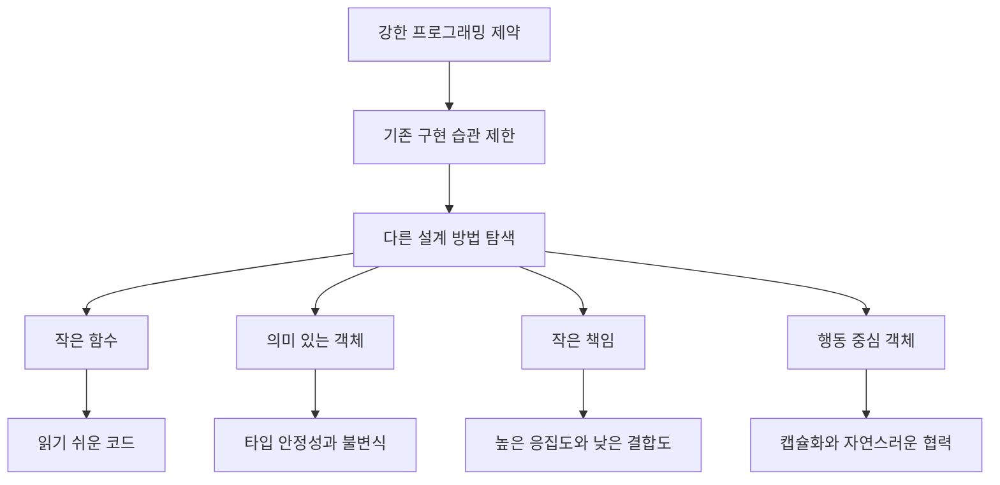

# 쿠다의 우테코 프로그래밍 요구사항을 왜 지켜야 할까?
[https://youtu.be/-gbqPuHzLj0?si=IVCZ9sjQKGfMSCst](https://youtu.be/-gbqPuHzLj0?si=IVCZ9sjQKGfMSCst)

# 쿠다의 우테코 프로그래밍 요구사항을 왜 지켜야 할까?
* toc
{:toc}

---

## 프로그래밍 요구사항은 왜 지켜야 할까?

개발을 시작하면 다양한 프로그래밍 요구사항을 만나게 된다.

```text
함수는 10줄을 넘기지 않는다
메서드의 들여쓰기 깊이는 2를 넘지 않는다
else를 사용하지 않는다
3항 연산자를 사용하지 않는다
원시값과 문자열을 포장한다
일급 컬렉션을 사용한다
인스턴스 변수를 세 개 이하로 유지한다
getter와 setter를 사용하지 않는다
한 줄에 점을 하나만 사용한다
```

처음 이런 규칙을 접하면 코드 작성을 방해하는 제약처럼 느껴질 수 있다.

단순한 기능 하나를 구현하는데도 클래스를 추가해야 하고, 짧게 끝낼 수 있는 조건문을 여러 메서드로 나눠야 하며, 값 하나를 사용하기 위해 별도의 객체를 만들어야 하기 때문이다.

그러나 이러한 요구사항의 목적은 코드의 길이를 기계적으로 줄이거나 특정 문법을 금지하는 데 있지 않다.

핵심 목적은 개발자가 익숙한 방식으로 빠르게 코드를 작성하지 못하게 제한함으로써, 다음 질문을 계속 고민하게 만드는 것이다.

```text
이 코드는 읽기 쉬운가?
이 값에는 도메인 의미가 있는가?
이 객체가 너무 많은 책임을 가지고 있지는 않은가?
객체가 스스로 행동하지 않고 외부에서 값을 꺼내 처리하고 있지는 않은가?
```

즉 프로그래밍 요구사항은 정답을 강제하는 규칙이 아니라, 더 나은 객체지향 설계를 고민하게 만드는 훈련 도구다.

---

## 객체지향 생활 체조란 무엇인가?

객체지향 생활 체조는 객체지향적인 설계 감각을 기르기 위해 의도적인 제약을 두고 코드를 작성하는 훈련 방식이다.

운동선수가 특정 근육이나 자세를 훈련하기 위해 반복적인 동작을 수행하는 것처럼, 개발자도 평소 사용하던 구현 습관을 제한함으로써 다른 설계 방법을 연습한다.

예를 들어 다음과 같은 코드가 있다고 가정해보자.

```java
public void processOrder(Order order) {
    if (order.getUser() != null) {
        if (order.getUser().getGrade() == Grade.VIP) {
            order.setPrice(order.getPrice() * 0.9);
        }
    }
}
```

기능 자체는 동작할 수 있다.

하지만 다음 문제가 숨어 있다.

```text
중첩된 조건문
긴 객체 탐색
외부에서 가격 변경
사용자 등급과 할인 정책 결합
도메인 객체의 수동적인 구조
```

여기에 다음 제약을 적용해보자.

```text
들여쓰기 깊이는 2를 넘지 않는다
getter와 setter를 사용하지 않는다
한 줄에 점을 하나만 사용한다
```

기존 방식을 그대로 사용할 수 없기 때문에 설계를 다시 고민하게 된다.

```java
public void applyDiscount(Order order) {
    order.applyDiscount();
}
```

```java
public class Order {

    private final User user;
    private Money price;

    public void applyDiscount() {
        this.price = user.discount(price);
    }
}
```

```java
public class User {

    private final Grade grade;

    public Money discount(Money price) {
        return grade.discount(price);
    }
}
```

금지 규칙은 개발자를 괴롭히기 위한 것이 아니라, 책임이 어디에 있어야 하는지를 다시 생각하게 만든다.

---

## 프로그래밍 요구사항이 해결하려는 네 가지 문제

객체지향 생활 체조의 여러 규칙은 크게 네 가지 방향으로 이해할 수 있다.

```text
읽기 쉬운 코드 만들기
의미 있는 객체 만들기
객체의 책임을 작게 유지하기
객체가 스스로 행동하도록 만들기
```

각 규칙을 따로 암기하기보다 어떤 설계 문제를 해결하려는 것인지 이해하는 것이 중요하다.

---

## 읽기 쉬운 코드란 무엇인가?

코드는 작성되는 시간보다 읽히는 시간이 훨씬 길다.

개발자는 코드를 한 번 작성하지만, 이후에는 자신과 동료가 여러 번 읽고 수정한다.

```text
신규 기능 개발
장애 원인 분석
코드 리뷰
리팩토링
운영 이슈 대응
인수인계
```

따라서 좋은 코드는 단순히 동작하는 코드가 아니라, 다음 사람이 빠르게 이해할 수 있는 코드여야 한다.

읽기 어려운 코드의 대표적인 특징은 한 번에 너무 많은 정보를 보여준다는 것이다.

```java
public void completeOrder(Order order) {
    if (order != null && order.getUser() != null) {
        if (order.getStatus() == OrderStatus.CREATED) {
            if (order.getUser().getGrade() == Grade.VIP) {
                order.setPrice(order.getPrice() * 0.9);
            }

            paymentService.pay(order);

            if (order.getUser().isEmailEnabled()) {
                emailService.send(order.getUser().getEmail());
            }

            logRepository.save(order);
        }
    }
}
```

이 메서드를 이해하려면 동시에 여러 정보를 기억해야 한다.

```text
주문 존재 여부
사용자 존재 여부
주문 상태
회원 등급
할인율
결제 처리
이메일 수신 설정
로그 저장
```

인지해야 할 정보가 많아질수록 코드 이해 비용은 높아진다.

---

## 함수는 한 가지 일만 해야 한다

큰 메서드를 작은 메서드로 나누는 이유는 코드 줄 수를 맞추기 위해서가 아니다.

각 메서드의 책임을 명확하게 만들기 위해서다.

앞선 메서드를 분리하면 다음과 같이 표현할 수 있다.

```java
public void completeOrder(Order order) {
    validateOrder(order);
    applyDiscount(order);
    processPayment(order);
    sendNotification(order);
    saveLog(order);
}
```

상위 메서드는 비즈니스 흐름을 보여준다.

```text
주문 검증
→ 할인 적용
→ 결제
→ 알림 전송
→ 로그 저장
```

각 세부 구현은 별도의 메서드로 숨겨진다.

```java
private void validateOrder(Order order) {
    order.validateCompletable();
}

private void applyDiscount(Order order) {
    order.applyDiscount();
}

private void processPayment(Order order) {
    paymentService.pay(order);
}
```

이제 `completeOrder()`를 읽는 사람은 세부 구현을 전부 기억하지 않아도 전체 흐름을 이해할 수 있다.

---

## 함수가 짧다고 항상 좋은 것은 아니다

함수를 짧게 만드는 것은 목적이 아니라 수단이다.

다음과 같이 단순히 줄 수를 줄이기 위해 의미 없는 메서드를 만들면 오히려 읽기 어려워질 수 있다.

```java
private void a(Order order) {
    b(order);
}

private void b(Order order) {
    c(order);
}
```

좋은 함수 분리는 다음 조건을 만족해야 한다.

```text
메서드 이름만으로 의도를 이해할 수 있다
하나의 추상화 수준을 유지한다
한 가지 변경 이유를 가진다
호출부에서 전체 흐름을 읽을 수 있다
```

중요한 것은 10줄이라는 숫자 자체가 아니다.

10줄이라는 제한 때문에 메서드가 여러 책임을 가지는지 고민하게 되는 과정이 중요하다.

---

## 함수 분리는 변경에 강한 코드를 만든다

하나의 메서드가 검증, 할인, 결제, 알림, 저장을 모두 담당한다면 여러 이유로 수정된다.

```text
주문 검증 정책 변경
할인 정책 변경
결제 방식 변경
알림 채널 변경
로그 저장 방식 변경
```

하나의 코드가 다섯 가지 이유로 변경되는 것이다.

반대로 책임을 분리하면 변경 범위가 줄어든다.

```text
할인 정책 변경
→ 할인 관련 코드만 수정

이메일을 메시지 알림으로 변경
→ 알림 구현만 수정

결제 모듈 변경
→ 결제 처리 부분만 수정
```

이는 단일 책임 원칙과도 연결된다.

객체나 메서드는 하나의 역할만 수행해야 하며, 하나의 변경 이유만 가져야 한다.

---

## 들여쓰기 깊이를 제한하는 이유

들여쓰기 깊이가 깊다는 것은 코드 흐름이 여러 조건에 중첩되어 있다는 뜻이다.

```java
public void reserve(Member member, Product product) {
    if (member != null) {
        if (member.isActive()) {
            if (product.hasStock()) {
                if (!member.hasReserved(product)) {
                    reserveRepository.save(member, product);
                }
            }
        }
    }
}
```

이 코드를 읽으려면 앞선 모든 조건을 기억해야 한다.

```text
회원이 존재하고
회원이 활성 상태이며
상품 재고가 있고
이미 예약하지 않았을 때
예약한다
```

중첩이 깊어질수록 정상 흐름과 실패 흐름을 구분하기 어려워진다.

---

## 조기 반환으로 흐름을 직선화한다

중첩 조건은 조기 반환을 사용해 단순화할 수 있다.

```java
public void reserve(Member member, Product product) {
    if (member == null) {
        return;
    }

    if (!member.isActive()) {
        return;
    }

    if (!product.hasStock()) {
        return;
    }

    if (member.hasReserved(product)) {
        return;
    }

    reserveRepository.save(member, product);
}
```

모든 분기가 같은 깊이에 위치한다.

정상 흐름은 마지막에 한 번만 나타난다.

예외를 사용한다면 다음과 같이 표현할 수도 있다.

```java
public void reserve(Member member, Product product) {
    validateMember(member);
    validateStock(product);
    validateDuplicate(member, product);

    reserveRepository.save(member, product);
}
```

이제 상위 흐름이 직선적으로 읽힌다.

---

## else를 제한하는 이유

`else`가 항상 나쁜 것은 아니다.

그러나 `else`는 이전 조건의 맥락을 계속 기억하게 만든다.

```java
public DiscountRate calculate(Member member) {
    if (member.isVip()) {
        return DiscountRate.VIP;
    } else {
        if (member.isGold()) {
            return DiscountRate.GOLD;
        } else {
            return DiscountRate.NORMAL;
        }
    }
}
```

조기 반환을 사용하면 흐름이 단순해진다.

```java
public DiscountRate calculate(Member member) {
    if (member.isVip()) {
        return DiscountRate.VIP;
    }

    if (member.isGold()) {
        return DiscountRate.GOLD;
    }

    return DiscountRate.NORMAL;
}
```

각 조건은 독립적으로 읽을 수 있다.

`else`를 금지하는 목적은 문법 자체를 없애는 것이 아니라, 불필요한 중첩과 복잡한 분기를 줄이는 데 있다.

---

## switch를 제한하는 이유

`switch` 문은 상태나 타입별 동작을 한곳에 모을 수 있다는 장점이 있다.

하지만 같은 타입 분기가 여러 메서드에 반복되기 시작하면 문제가 된다.

```java
public Money calculateFee(PaymentType type, Money amount) {
    return switch (type) {
        case CARD -> amount.multiply(0.03);
        case BANK -> amount.multiply(0.01);
        case PAYPAL -> amount.multiply(0.04);
    };
}
```

```java
public String displayName(PaymentType type) {
    return switch (type) {
        case CARD -> "신용카드";
        case BANK -> "계좌이체";
        case PAYPAL -> "페이팔";
    };
}
```

```java
public boolean supportsRefund(PaymentType type) {
    return switch (type) {
        case CARD -> true;
        case BANK -> false;
        case PAYPAL -> true;
    };
}
```

새로운 결제 방식이 추가되면 모든 `switch`를 수정해야 한다.

행동을 객체에 옮기면 상태별 책임을 모을 수 있다.

```java
public interface PaymentMethod {

    Money calculateFee(Money amount);

    String displayName();

    boolean supportsRefund();
}
```

```java
public class CardPayment implements PaymentMethod {

    @Override
    public Money calculateFee(Money amount) {
        return amount.multiply(0.03);
    }

    @Override
    public String displayName() {
        return "신용카드";
    }

    @Override
    public boolean supportsRefund() {
        return true;
    }
}
```

이제 새로운 결제 방식은 새로운 구현체로 확장할 수 있다.

다만 모든 `switch`를 다형성으로 바꿔야 하는 것은 아니다.

분기가 단순하고 변경 가능성이 낮다면 `switch`가 더 이해하기 쉬울 수 있다.

---

## 3항 연산자를 제한하는 이유

3항 연산자는 간단한 값을 선택할 때 유용하다.

```java
String name = user == null ? "guest" : user.getName();
```

하지만 조건이 중첩되면 읽기 어려워진다.

```java
String grade = score >= 90
        ? attendance >= 80 ? "A" : "B"
        : score >= 70 ? "C" : "D";
```

짧은 코드가 반드시 읽기 쉬운 코드는 아니다.

조건이 복잡하다면 메서드로 의도를 드러내는 편이 낫다.

```java
public Grade calculateGrade(Score score, Attendance attendance) {
    if (score.isExcellent() && attendance.isSufficient()) {
        return Grade.A;
    }

    if (score.isExcellent()) {
        return Grade.B;
    }

    if (score.isAverage()) {
        return Grade.C;
    }

    return Grade.D;
}
```

3항 연산자를 제한하는 이유는 코드 길이를 늘리기 위해서가 아니라, 복잡한 판단을 표현할 의미 있는 이름을 만들도록 유도하기 위해서다.

---

## 의미 있는 객체란 무엇인가?

객체지향 프로그래밍에서는 단순한 값을 그대로 전달하기보다, 값이 가진 의미와 규칙을 객체로 표현할 수 있다.

다음 메서드를 살펴보자.

```java
public void register(
        String email,
        String phoneNumber,
        String address
) {
}
```

세 파라미터의 타입이 모두 `String`이다.

호출 순서를 바꿔도 컴파일 오류가 발생하지 않는다.

```java
register(address, email, phoneNumber);
```

문자열은 각 값이 무엇을 의미하는지 보장하지 않는다.

---

## 원시값과 문자열을 포장하는 이유

문자열을 의미 있는 객체로 포장할 수 있다.

```java
public final class Email {

    private final String value;

    private Email(String value) {
        validate(value);
        this.value = value;
    }

    public static Email of(String value) {
        return new Email(value);
    }

    private void validate(String value) {
        if (value == null || !value.contains("@")) {
            throw new IllegalArgumentException(
                    "올바르지 않은 이메일 형식입니다."
            );
        }
    }
}
```

```java
public final class PhoneNumber {

    private final String value;

    private PhoneNumber(String value) {
        validate(value);
        this.value = value;
    }

    public static PhoneNumber of(String value) {
        return new PhoneNumber(value);
    }

    private void validate(String value) {
        if (value == null || !value.matches("\\d{10,11}")) {
            throw new IllegalArgumentException(
                    "올바르지 않은 전화번호 형식입니다."
            );
        }
    }
}
```

메서드 시그니처도 더 명확해진다.

```java
public void register(
        Email email,
        PhoneNumber phoneNumber,
        Address address
) {
}
```

순서를 바꾸면 컴파일 단계에서 오류를 확인할 수 있다.

---

## 포장 객체는 생성 시점부터 유효하다

문자열을 그대로 사용하면 검증 책임이 여러 위치에 분산될 수 있다.

```java
if (!email.contains("@")) {
    throw new IllegalArgumentException();
}
```

```java
if (email.length() > 100) {
    throw new IllegalArgumentException();
}
```

```java
if (email.isBlank()) {
    throw new IllegalArgumentException();
}
```

같은 검증이 Controller, Service, Entity에서 반복될 수 있다.

`Email` 객체가 생성 시점에 검증하면 이후 코드는 유효한 이메일이라는 전제 아래 동작할 수 있다.

```java
Email email = Email.of(rawEmail);
```

생성에 성공했다는 사실만으로 다음 조건이 보장된다.

```text
null이 아님
빈 값이 아님
이메일 형식에 맞음
허용된 길이 이하
```

이를 객체의 불변식이라고 한다.

---

## 값이 아니라 행동을 다룬다

원시값을 사용하는 코드는 외부에서 값을 꺼내 직접 계산한다.

```java
int discountedPrice = price - price * discountRate / 100;
```

의미 있는 객체는 계산 책임을 직접 가질 수 있다.

```java
Money discountedPrice = price.discount(discountRate);
```

```java
public final class Money {

    private final long amount;

    public Money discount(DiscountRate rate) {
        return new Money(rate.apply(amount));
    }
}
```

외부는 계산 공식을 알 필요가 없다.

```text
가격을 꺼내 계산
→ 데이터 중심

가격 객체에게 할인 요청
→ 행동 중심
```

---

## 모든 원시값을 포장해야 할까?

모든 숫자와 문자열에 클래스를 만드는 것은 실무에서 과도할 수 있다.

다음 상황에서는 포장을 고려할 가치가 높다.

```text
고유한 도메인 의미를 가진다
생성 시 검증 규칙이 있다
관련 행동이 존재한다
여러 위치에서 반복 사용된다
타입 혼동 가능성이 있다
```

예를 들면 다음과 같다.

```text
Money
Email
OrderId
SubscriptionPeriod
CountryCode
Quantity
Percentage
```

반대로 지역 변수로 잠깐 사용하는 반복 횟수까지 포장하면 복잡성만 높아질 수 있다.

```java
for (int index = 0; index < size; index++) {
}
```

규칙의 목적은 무조건 클래스를 늘리는 것이 아니라, 도메인 의미를 발견하는 연습이다.

---

## 일급 컬렉션이란 무엇인가?

일급 컬렉션은 컬렉션 하나를 감싸고 관련 책임을 함께 관리하는 객체다.

다음과 같이 금액 목록을 직접 사용하는 코드가 있다고 가정해보자.

```java
List<Money> prices = new ArrayList<>();
```

총합을 구하는 로직이 여러 위치에 생길 수 있다.

```java
Money total = prices.stream()
        .reduce(Money.ZERO, Money::add);
```

할인 가능한 금액을 찾는 로직도 외부에 존재할 수 있다.

```java
List<Money> discountablePrices = prices.stream()
        .filter(Money::isDiscountable)
        .toList();
```

컬렉션을 `Prices`라는 객체로 감싸면 관련 책임을 모을 수 있다.

```java
public final class Prices {

    private final List<Money> values;

    public Prices(List<Money> values) {
        this.values = List.copyOf(values);
    }

    public Money total() {
        return values.stream()
                .reduce(Money.ZERO, Money::add);
    }

    public Prices discountable() {
        List<Money> filtered = values.stream()
                .filter(Money::isDiscountable)
                .toList();

        return new Prices(filtered);
    }
}
```

외부에서는 컬렉션 구현을 알 필요가 없다.

```java
Money total = prices.total();
```

---

## 일급 컬렉션의 장점

### 컬렉션 관련 규칙을 한곳에 모은다

```text
빈 컬렉션 허용 여부
중복 허용 여부
최대 크기
정렬 규칙
합계 계산
필터링
```

### 컬렉션을 외부에서 직접 변경하지 못하게 한다

```java
this.values = List.copyOf(values);
```

불변 컬렉션으로 보관하면 외부 변경으로부터 내부 상태를 보호할 수 있다.

### 도메인 의미를 표현한다

```java
List<Order>
```

보다 다음 표현이 더 의미 있다.

```java
Orders
```

`Orders`는 단순한 목록이 아니라 주문 집합의 규칙과 행동을 가진다.

---

## 객체는 왜 작게 유지해야 할까?

하나의 객체가 너무 많은 정보를 직접 가지면 책임도 함께 커진다.

다음 `User` 객체를 살펴보자.

```java
public class User {

    private Long id;
    private String name;
    private String email;
    private String phoneNumber;
    private String zipCode;
    private String city;
    private String street;
    private int age;
    private String profileImageUrl;
    private Grade grade;
}
```

필드가 많다는 사실만으로 무조건 나쁜 객체는 아니다.

하지만 이 객체가 다음 책임까지 가진다면 문제가 커진다.

```text
이메일 검증
전화번호 검증
주소 변경
나이 계산
등급 계산
프로필 이미지 변경
알림 수신 설정
```

하나의 객체가 시스템 대부분의 책임을 가지는 구조를 흔히 God Object라고 부른다.

---

## 인스턴스 변수 수를 제한하는 이유

인스턴스 변수를 세 개 이하로 제한하면 객체를 더 작은 의미 단위로 분리하게 된다.

기존 `User`를 다음처럼 나눌 수 있다.

```java
public class User {

    private final UserId id;
    private final Profile profile;
    private final Contact contact;
}
```

```java
public class Profile {

    private final Name name;
    private final Age age;
    private final ProfileImage profileImage;
}
```

```java
public class Contact {

    private final Email email;
    private final PhoneNumber phoneNumber;
    private final Address address;
}
```

상위 객체는 전체 구조와 협력을 관리하고, 세부 객체가 자신의 데이터를 책임진다.

---

## 객체를 분리하면 변경 이유도 분리된다

주소 구조가 바뀐다고 가정해보자.

```text
기존 주소
→ 우편번호, 도시, 거리

변경 주소
→ 국가, 도, 시, 구, 상세주소
```

모든 주소 필드가 `User`에 직접 존재하면 `User`를 수정해야 한다.

`Address` 객체로 분리되어 있다면 주소 변경은 해당 객체 안에서 처리할 수 있다.

```java
public class Address {

    private final Country country;
    private final PostalCode postalCode;
    private final String detail;
}
```

`User`는 계속 `Address` 객체를 보유할 뿐이다.

```java
public class User {

    private final UserId id;
    private final Profile profile;
    private final Contact contact;
}
```

객체를 작게 나누면 변경 영향 범위가 줄어든다.

---

## 필드가 세 개를 넘으면 항상 나쁜가?

그렇지는 않다.

실무에서는 도메인의 성격과 객체의 역할을 고려해야 한다.

다음 경우에는 필드가 많더라도 응집된 객체일 수 있다.

```text
외부 API 요청 DTO
데이터베이스 조회 결과
설정 객체
좌표나 기간처럼 하나의 개념을 구성하는 값 집합
```

반대로 필드가 두 개뿐이어도 서로 관련 없는 책임을 가진다면 응집도가 낮을 수 있다.

```java
public class UserManager {

    private final UserRepository userRepository;
    private final EmailSender emailSender;
}
```

필드 수 제한의 핵심은 숫자 자체가 아니다.

필드가 많아졌을 때 이 객체가 여러 책임을 가지고 있지는 않은지 고민하도록 만드는 것이다.

---

## getter와 setter를 제한하는 이유

객체지향 코드에서도 getter와 setter가 무분별하게 사용되면 객체가 단순한 데이터 저장소로 변할 수 있다.

다음 코드를 살펴보자.

```java
if (order.getStatus() == OrderStatus.CREATED) {
    order.setStatus(OrderStatus.PAID);
}
```

외부 객체가 다음 내용을 모두 알고 있다.

```text
Order가 status를 가진다
CREATED 상태에서 PAID로 변경 가능하다
상태 변경은 setter로 수행한다
```

도메인 규칙이 외부로 노출되어 있다.

---

## 객체에게 상태를 묻지 말고 행동을 요청한다

객체가 자신의 상태를 직접 판단하고 변경하도록 만들 수 있다.

```java
order.pay();
```

```java
public class Order {

    private OrderStatus status;

    public void pay() {
        if (status != OrderStatus.CREATED) {
            throw new IllegalStateException(
                    "생성된 주문만 결제할 수 있습니다."
            );
        }

        this.status = OrderStatus.PAID;
    }
}
```

외부는 상태 변경 규칙을 알 필요가 없다.

```text
상태를 꺼냄
→ 외부에서 판단
→ setter로 변경
```

대신 다음과 같이 바뀐다.

```text
객체에게 결제를 요청
→ 객체가 상태 확인
→ 객체가 스스로 변경
```

이러한 원칙을 `Tell, Don't Ask`라고 표현한다.

---

## Tell, Don't Ask란 무엇인가?

`Tell, Don't Ask`는 객체의 상태를 가져와 외부에서 판단하지 말고, 객체에게 원하는 행동을 요청하라는 원칙이다.

좋지 않은 예시는 다음과 같다.

```java
if (account.getBalance() >= amount) {
    account.setBalance(
            account.getBalance() - amount
    );
}
```

외부 객체가 계좌의 잔액을 조회하고 출금 가능 여부를 판단하며 잔액까지 변경한다.

더 나은 구조는 객체에게 출금을 요청하는 것이다.

```java
account.withdraw(amount);
```

```java
public void withdraw(Money amount) {
    validateSufficientBalance(amount);
    this.balance = balance.subtract(amount);
}
```

잔액 검증과 변경 책임이 `Account`에 모인다.

---

## getter가 항상 나쁜 것은 아니다

getter를 사용하지 말라는 규칙도 절대적인 금지가 아니다.

다음 상황에서는 조회가 필요할 수 있다.

```text
화면 출력
API 응답 변환
영속성 프레임워크
로깅
직렬화
```

문제는 getter의 존재가 아니라, getter로 값을 꺼내 외부에서 도메인 판단과 상태 변경을 수행하는 것이다.

다음은 단순 조회다.

```java
String orderNumber = order.getOrderNumber();
```

다음은 객체의 책임을 외부로 꺼낸 구조다.

```java
if (order.getStatus() == PAID) {
    order.setStatus(SHIPPING);
}
```

getter 금지 규칙의 목적은 조회 자체를 없애는 것이 아니라, 객체가 데이터 덩어리로 전락하는 것을 막는 데 있다.

---

## setter가 위험한 이유

setter는 객체의 상태를 제한 없이 변경할 수 있게 만든다.

```java
order.setStatus(OrderStatus.DELIVERED);
```

배송 준비나 배송 중 단계를 거치지 않고 바로 배송 완료 상태가 될 수 있다.

의미 있는 메서드를 사용하면 허용된 상태 전이를 강제할 수 있다.

```java
order.startShipping();
order.completeDelivery();
```

```java
public void startShipping() {
    if (status != OrderStatus.PAID) {
        throw new IllegalStateException(
                "결제 완료 주문만 배송할 수 있습니다."
        );
    }

    this.status = OrderStatus.SHIPPING;
}
```

```java
public void completeDelivery() {
    if (status != OrderStatus.SHIPPING) {
        throw new IllegalStateException(
                "배송 중인 주문만 완료할 수 있습니다."
        );
    }

    this.status = OrderStatus.DELIVERED;
}
```

상태 전이가 메서드 이름과 코드에 명확하게 표현된다.

---

## 한 줄에 점을 하나만 사용해야 하는 이유

다음 코드를 살펴보자.

```java
String city = order.getUser()
        .getAddress()
        .getCity()
        .getName();
```

`Order`를 사용하는 외부 객체가 내부 구조를 모두 알고 있다.

```text
Order 안에 User가 있다
User 안에 Address가 있다
Address 안에 City가 있다
City 안에 Name이 있다
```

내부 구조가 바뀌면 호출하는 코드도 함께 변경된다.

```text
User가 Address를 직접 가지지 않도록 변경
→ 모든 호출부 수정
```

---

## 디미터 법칙이란 무엇인가?

디미터 법칙은 객체가 직접 아는 가까운 객체와만 협력해야 한다는 원칙이다.

쉽게 표현하면 다음과 같다.

```text
친구와 대화하되 친구의 친구와 직접 대화하지 않는다
```

앞선 코드는 `Order`의 내부 객체를 따라가며 낯선 객체와 직접 대화한다.

```java
order.getUser()
     .getAddress()
     .getCity()
     .getName();
```

필요한 정보를 `Order`에 요청하도록 바꿀 수 있다.

```java
String cityName = order.shippingCityName();
```

```java
public String shippingCityName() {
    return user.shippingCityName();
}
```

```java
public String shippingCityName() {
    return address.cityName();
}
```

각 객체는 자신과 가까운 객체에게만 요청한다.

외부에서는 내부 구조를 알 필요가 없다.

---

## 한 줄에 점 하나 규칙의 진짜 의미

점의 개수를 기계적으로 줄이는 것이 목적은 아니다.

다음 코드의 점이 여러 개라고 해서 반드시 문제가 있는 것은 아니다.

```java
stream
        .filter(Order::isPaid)
        .map(Order::amount)
        .reduce(Money.ZERO, Money::add);
```

이 코드는 객체 내부 구조를 탐색하는 것이 아니라 컬렉션 처리 흐름을 표현한다.

반대로 점이 하나뿐이어도 캡슐화가 깨질 수 있다.

```java
order.getStatus();
```

이 값을 외부에서 판단하고 변경한다면 Tell, Don't Ask를 위반할 수 있다.

한 줄에 점 하나 규칙은 내부 객체 그래프를 연쇄적으로 탐색하는 습관을 발견하기 위한 훈련 도구다.

---

## 요구사항별 설계 목적 정리

| 프로그래밍 요구사항       | 설계 목적            |
| ---------------- | ---------------- |
| 함수는 10줄 이하       | 메서드 책임 분리        |
| 함수는 한 가지 일만 수행   | 단일 책임 유지         |
| 들여쓰기 깊이 제한       | 흐름 단순화           |
| else 사용 제한       | 중첩 감소와 조기 반환 유도  |
| switch 사용 제한     | 타입별 행동 분산 방지     |
| 3항 연산자 제한        | 복잡한 판단에 의미 부여    |
| 원시값과 문자열 포장      | 도메인 의미와 검증 캡슐화   |
| 일급 컬렉션 사용        | 컬렉션 책임과 규칙 응집    |
| 인스턴스 변수 제한       | God Object 방지    |
| getter·setter 제한 | 객체의 행동과 캡슐화 강화   |
| 한 줄에 점 하나        | 디미터 법칙과 내부 구조 은닉 |

각 규칙은 서로 독립적이지 않다.

하나의 규칙을 적용하면 다른 객체지향 원칙과 연결된다.

---

## 요구사항은 어떻게 서로 연결될까?

예를 들어 getter를 사용하지 않으려고 하면 객체에게 행동을 추가하게 된다.

```text
getter 제한
→ 값을 꺼낼 수 없음
→ 객체에게 행동 요청
→ 책임 이동
→ 응집도 향상
```

원시값을 포장하면 검증과 행동이 새로운 객체로 이동한다.

```text
원시값 포장
→ 생성 시 검증
→ 관련 행동 추가
→ 도메인 의미 표현
→ 타입 안정성 증가
```

인스턴스 변수 수를 제한하면 큰 객체를 작은 객체로 분해하게 된다.

```text
필드 수 제한
→ 객체 분리
→ 책임 분리
→ 변경 이유 분리
→ 결합도 감소
```

함수 길이와 들여쓰기 깊이를 제한하면 비즈니스 흐름이 명확해진다.

```text
함수 길이 제한
→ 세부 로직 분리

깊이 제한
→ 중첩 감소

결과
→ 읽기 쉬운 상위 흐름
```

요구사항은 단순한 코딩 스타일이 아니라 서로 연결된 설계 훈련이다.

---

## 실무 예제로 살펴보는 요구사항 적용

다음은 회원 가입을 처리하는 서비스다.

```java
public void register(
        String email,
        String phone,
        String password
) {
    if (email != null) {
        if (email.contains("@")) {
            if (!userRepository.existsByEmail(email)) {
                User user = new User();
                user.setEmail(email);
                user.setPhone(phone);
                user.setPassword(passwordEncoder.encode(password));
                user.setStatus(UserStatus.ACTIVE);

                userRepository.save(user);

                if (phone != null) {
                    smsSender.send(phone, "가입 완료");
                }
            }
        }
    }
}
```

여러 문제가 섞여 있다.

```text
중첩 조건
원시 문자열 사용
setter 기반 상태 변경
검증 책임 분산
회원 생성 책임과 알림 책임 혼합
```

요구사항을 적용하면 다음과 같이 바꿀 수 있다.

```java
public void register(RegisterCommand command) {
    validateDuplicate(command.email());

    User user = createUser(command);
    userRepository.save(user);

    sendWelcomeMessage(user);
}
```

```java
private void validateDuplicate(Email email) {
    if (userRepository.existsByEmail(email)) {
        throw new DuplicateEmailException();
    }
}
```

```java
private User createUser(RegisterCommand command) {
    EncodedPassword password =
            passwordEncoder.encode(command.password());

    return User.register(
            command.email(),
            command.phoneNumber(),
            password
    );
}
```

```java
private void sendWelcomeMessage(User user) {
    notificationSender.sendWelcome(user);
}
```

명령 객체도 의미 있는 타입을 사용한다.

```java
public record RegisterCommand(
        Email email,
        PhoneNumber phoneNumber,
        RawPassword password
) {
}
```

회원은 자신의 초기 상태를 직접 결정한다.

```java
public class User {

    private final Email email;
    private final PhoneNumber phoneNumber;
    private final EncodedPassword password;
    private UserStatus status;

    private User(
            Email email,
            PhoneNumber phoneNumber,
            EncodedPassword password
    ) {
        this.email = email;
        this.phoneNumber = phoneNumber;
        this.password = password;
        this.status = UserStatus.ACTIVE;
    }

    public static User register(
            Email email,
            PhoneNumber phoneNumber,
            EncodedPassword password
    ) {
        return new User(email, phoneNumber, password);
    }
}
```

프로그래밍 요구사항을 적용하면서 책임과 의미가 자연스럽게 드러난다.

---

## 요구사항을 무조건 적용하면 안 되는 이유

객체지향 생활 체조는 훈련을 위한 강한 제약이다.

실무에서 모든 규칙을 예외 없이 적용하면 오히려 코드가 복잡해질 수 있다.

### 지나친 함수 분리

한 줄짜리 메서드가 과도하게 늘어나면 흐름을 따라가기 위해 여러 파일과 메서드를 이동해야 한다.

### 과도한 객체 포장

모든 숫자와 문자열을 클래스로 만들면 타입 수가 지나치게 증가할 수 있다.

### 불필요한 다형성

작은 `switch` 하나를 제거하기 위해 여러 인터페이스와 구현체를 만들면 인지 비용이 커질 수 있다.

### 무조건적인 getter 제거

출력과 매핑을 위해 필요한 조회까지 복잡한 행동 메서드로 감추면 사용하기 어려운 객체가 될 수 있다.

### 무리한 필드 수 제한

하나의 응집된 개념을 억지로 여러 객체로 나누면 오히려 관계가 복잡해질 수 있다.

규칙은 좋은 설계를 보장하는 공식이 아니다.

설계 결정을 의식적으로 내리도록 만드는 질문에 가깝다.

---

## 규칙을 적용할 때 확인해야 할 질문

각 요구사항을 적용할 때 다음 질문을 함께 살펴보는 것이 좋다.

### 함수를 분리할 때

```text
새 메서드에 명확한 이름을 붙일 수 있는가?
정말 독립적인 책임인가?
추상화 수준이 일관적인가?
```

### 원시값을 포장할 때

```text
도메인 의미가 있는가?
검증 규칙이 있는가?
관련 행동이 있는가?
타입 혼동을 막을 수 있는가?
```

### 객체를 분리할 때

```text
변경 이유가 다른가?
각 객체가 독립적인 책임을 가지는가?
분리 후 결합 관계가 더 복잡해지지는 않는가?
```

### getter를 제거할 때

```text
외부가 값을 조회하려는 이유는 무엇인가?
이 판단을 객체 내부에서 수행할 수 있는가?
단순 조회인가, 도메인 규칙 실행인가?
```

### 조건문을 제거할 때

```text
분기가 반복되는가?
새로운 타입이나 상태가 계속 추가되는가?
다형성으로 바꿨을 때 더 이해하기 쉬운가?
```

---

## 객체지향 생활 체조의 구조



제약은 최종 목적이 아니다.

제약을 통해 객체지향적인 사고 과정을 반복하는 것이 목적이다.

---

## 실무에서의 활용

실무에서는 객체지향 생활 체조를 절대 규칙이 아니라 코드의 문제를 발견하는 신호로 활용할 수 있다.

### 메서드가 너무 길어졌을 때

```text
여러 책임이 섞이지 않았는가?
추상화 수준이 다른 코드가 함께 있지 않은가?
```

### 들여쓰기가 깊어졌을 때

```text
검증을 조기 반환으로 분리할 수 있는가?
상태나 타입별 행동을 객체로 옮길 수 있는가?
```

### getter 호출이 연쇄될 때

```text
내부 객체 구조가 외부에 노출된 것은 아닌가?
필요한 행동을 상위 객체에 요청할 수 있는가?
```

### 필드가 많아졌을 때

```text
서로 다른 책임의 데이터가 한 객체에 모이지 않았는가?
의미 있는 하위 객체로 분리할 수 있는가?
```

### 원시값 검증이 반복될 때

```text
값 객체로 포장해 생성 시점에 보장할 수 있는가?
```

이처럼 규칙을 코드 냄새를 탐지하는 체크리스트로 사용할 수 있다.

---

## 좋은 제약은 새로운 질문을 만든다

프로그래밍 요구사항의 가장 큰 가치는 특정 형태의 코드를 완성하는 데 있지 않다.

개발자가 평소 하지 않던 질문을 던지게 하는 데 있다.

```text
else 없이 어떻게 표현할 수 있을까?
getter 없이 객체에게 무엇을 요청해야 할까?
이 문자열은 정말 단순한 문자열일까?
이 리스트가 가져야 할 책임은 무엇일까?
이 객체는 왜 이렇게 많은 필드를 가지고 있을까?
이 조건문은 다형성이나 상태 객체로 이동할 수 있을까?
```

모든 질문의 답이 새로운 클래스나 패턴은 아니다.

고민한 결과 기존 조건문이나 원시값을 유지하는 선택도 가능하다.

중요한 것은 자동적으로 코드를 작성하지 않고, 설계 의도를 가지고 선택하는 것이다.

---

## 정리

프로그래밍 요구사항은 단순히 특정 문법을 금지하거나 코드 형태를 통일하기 위한 규칙이 아니다.

각 요구사항은 객체지향 설계의 특정 문제를 경험하고 개선하도록 만든다.

```text
짧고 한 가지 일만 하는 함수
→ 읽기 쉬운 흐름

낮은 들여쓰기 깊이
→ 단순한 제어 구조

원시값과 문자열 포장
→ 의미와 불변식을 가진 객체

일급 컬렉션
→ 컬렉션 책임의 응집

작은 객체
→ 과도한 책임 방지

getter와 setter 제한
→ 행동 중심 설계

한 줄에 점 하나
→ 내부 구조 은닉과 낮은 결합도
```

처음에는 이러한 규칙이 구현을 어렵게 만드는 제약처럼 느껴질 수 있다.

하지만 익숙한 방법을 사용할 수 없기 때문에 객체의 책임, 의미, 협력 관계를 더 깊게 고민하게 된다.

물론 모든 규칙을 실무에서 그대로 적용하는 것이 정답은 아니다.

도메인의 복잡도, 팀의 경험, 변경 가능성, 코드 이해 비용을 고려해야 한다.

객체지향 생활 체조의 목적은 규칙을 영원히 지키는 것이 아니라, 규칙이 없어도 더 나은 설계를 판단할 수 있는 감각을 기르는 데 있다.

### 한 줄 요약

**프로그래밍 요구사항은 코드를 불편하게 만들기 위한 제약이 아니라, 읽기 쉽고 응집도 높으며 객체가 스스로 행동하는 설계를 반복해서 연습하게 만드는 객체지향 훈련 도구다.**


