# 티모의 암호화 복호화 기초
[https://youtu.be/lOG9NvPVKs8?si=cKIvDCuBYOvmJ-WO](https://youtu.be/lOG9NvPVKs8?si=cKIvDCuBYOvmJ-WO)

# 티모의 암호화 복호화 기초
* toc
{:toc}

---

## 암호화와 복호화란 무엇인가? HTTPS와 TLS가 데이터를 안전하게 보호하는 원리

웹 애플리케이션에서는 로그인 정보, 결제 정보, 개인정보처럼 외부에 노출되어서는 안 되는 데이터를 지속적으로 주고받는다.

클라이언트가 서버에 다음과 같은 로그인 요청을 보낸다고 가정해보자.

```http
POST /login HTTP/1.1
Host: example.com
Content-Type: application/json

{
  "username": "user@example.com",
  "password": "my-password"
}
```

이 요청이 암호화되지 않은 HTTP 연결을 통해 전달된다면, 네트워크 구간에서 패킷을 확인할 수 있는 공격자는 사용자 아이디와 비밀번호를 그대로 읽을 수 있다.

```text
username = user@example.com
password = my-password
```

데이터가 전달되는 경로에는 사용자의 컴퓨터와 서버만 존재하지 않는다.

```text
사용자
→ 공유기
→ 인터넷 서비스 제공자
→ 여러 네트워크 장비
→ 프록시 또는 게이트웨이
→ 서버
```

이 중 어느 한 지점에서 통신 내용이 노출될 가능성을 고려해야 한다.

HTTPS는 HTTP 메시지를 TLS로 보호한다. TLS는 클라이언트와 서버가 인터넷을 통해 통신할 때 도청, 데이터 변조, 메시지 위조를 방지하도록 설계된 프로토콜이다.

---

## 암호화가 필요한 이유

암호화를 적용하는 가장 직접적인 이유는 통신 중인 데이터를 제삼자가 읽지 못하게 만드는 것이다.

암호화되지 않은 통신에서는 공격자가 패킷을 확보했을 때 메시지의 내용을 그대로 확인할 수 있다.

```text
평문 데이터
→ 네트워크 전송
→ 공격자가 내용을 그대로 확인
```

암호화를 적용하면 전송되는 데이터는 의미를 알 수 없는 형태로 변환된다.

```text
평문 데이터
→ 암호화
→ 암호문 전송
→ 수신자가 복호화
→ 원래 데이터 확인
```

예를 들어 다음과 같은 메시지가 있다고 가정해보자.

```text
결제 금액은 100,000원입니다.
```

암호화를 거치면 실제 네트워크에는 다음과 같이 원래 내용을 알아보기 어려운 데이터가 전송된다.

```text
7F A2 9B 31 D8 4C 11 8E ...
```

공격자가 이 암호문을 가로채더라도 올바른 키가 없다면 원래 내용을 해석하기 어렵다.

암호화는 기밀성만 제공하는 것이 아니다. TLS는 일반적으로 다음 세 가지 보안 목표를 함께 제공한다.

| 보안 목표 | 의미                           |
| ----- | ---------------------------- |
| 기밀성   | 통신 내용을 허가되지 않은 사람이 읽지 못하게 한다 |
| 무결성   | 전송 중 데이터가 변경되지 않았는지 확인한다     |
| 인증    | 통신 상대가 신뢰할 수 있는 서버인지 확인한다    |

단순히 데이터를 알아볼 수 없게 만드는 것만으로는 충분하지 않다.

공격자가 암호문을 다른 값으로 변경할 수도 있고, 가짜 서버가 정상 서버인 것처럼 가장할 수도 있기 때문이다.

따라서 실제 HTTPS 통신에서는 암호화, 메시지 인증, 인증서 검증, 키 교환이 함께 사용된다.

---

## 암호화와 복호화의 기본 용어

암호화 구조를 이해하려면 먼저 몇 가지 용어를 구분해야 한다.

### 평문

암호화하기 전의 원본 데이터를 의미한다.

```text
안녕하세요.
```

사람이 직접 이해할 수 있는 문자열뿐만 아니라 이미지, 파일, JSON, 바이너리 데이터도 암호화 전에는 모두 평문에 해당한다.

### 암호화

평문을 특정 알고리즘과 키를 이용하여 의미를 알아보기 어려운 암호문으로 바꾸는 과정이다.

```text
평문 + 암호화 알고리즘 + 키
→ 암호문
```

### 암호문

암호화 결과로 생성된 데이터다.

```text
8F3A7C21B9...
```

### 복호화

암호문을 올바른 키와 알고리즘을 이용해 원래의 평문으로 되돌리는 과정이다.

```text
암호문 + 복호화 알고리즘 + 키
→ 평문
```

전체 구조는 다음과 같다.

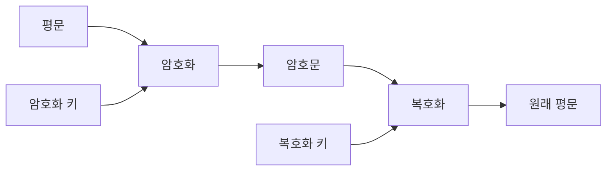

암호화 키와 복호화 키가 같으냐 다르냐에 따라 대칭키 방식과 비대칭키 방식으로 나눌 수 있다.

---

## 암호화와 해싱은 다르다

암호화를 이해할 때 해싱과 혼동하지 않는 것이 중요하다.

암호화는 복호화를 전제로 한다.

```text
평문
→ 암호화
→ 암호문
→ 복호화
→ 평문
```

반면 해싱은 일반적으로 원본을 다시 복원하지 않는 단방향 연산이다.

```text
원본 데이터
→ 해시 함수
→ 고정 길이 해시값
```

예를 들어 다음과 같은 문자열을 SHA-256으로 해싱한다고 가정해보자.

```text
hello
```

결과는 고정 길이의 해시값으로 만들어진다.

```text
2cf24dba5fb0a30e...
```

암호화와 해싱의 차이는 다음과 같다.

| 구분    | 암호화              | 해싱                    |
| ----- | ---------------- | --------------------- |
| 목적    | 데이터 기밀성 보호       | 데이터 식별 및 무결성 확인       |
| 원본 복원 | 올바른 키로 복호화 가능    | 일반적으로 복원하지 않음         |
| 키 사용  | 보통 키를 사용         | 일반 해시 함수는 키를 사용하지 않음  |
| 대표 활용 | HTTPS 통신, 파일 암호화 | 비밀번호 검증, 전자서명, 무결성 확인 |

전자서명에서는 원본 전체를 직접 서명하기보다 먼저 해시값을 만들고, 그 해시값에 대해 서명하는 방식이 일반적으로 사용된다.

---

## 대칭키 암호화란 무엇인가?

대칭키 암호화는 암호화와 복호화에 동일한 비밀키를 사용하는 방식이다.

```text
평문 + 비밀키
→ 암호문

암호문 + 동일한 비밀키
→ 평문
```

자물쇠를 잠글 때 사용한 열쇠와 열 때 사용하는 열쇠가 같은 구조로 이해할 수 있다.

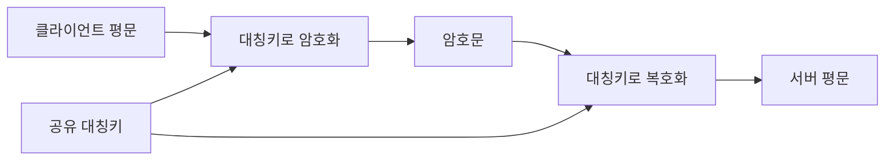

대표적인 대칭키 암호 알고리즘에는 AES가 있다.

### 대칭키 방식의 장점

대칭키 암호화는 연산 속도가 빠르다.

웹 통신에서는 HTML, JSON, 이미지, 동영상, 파일처럼 많은 데이터를 주고받는다. 이런 데이터를 매번 비대칭키 알고리즘으로 처리하면 계산 비용이 커질 수 있다.

대칭키 방식은 대용량 데이터를 빠르게 암호화하고 복호화할 수 있기 때문에 실제 애플리케이션 데이터 전송에 적합하다.

```text
TLS 초기 연결
→ 키 교환과 인증

TLS 연결 완료
→ 대칭키로 실제 데이터 암호화
```

### 대칭키 방식의 문제점

대칭키를 사용하려면 클라이언트와 서버가 동일한 키를 가지고 있어야 한다.

그렇다면 아직 안전한 통신 채널이 만들어지지 않은 상황에서 이 키를 어떻게 전달할 것인지가 문제가 된다.

```text
클라이언트
→ 대칭키 전송
→ 서버
```

공격자가 키 전달 과정에서 대칭키를 탈취한다면 이후의 암호문을 복호화할 수 있다.

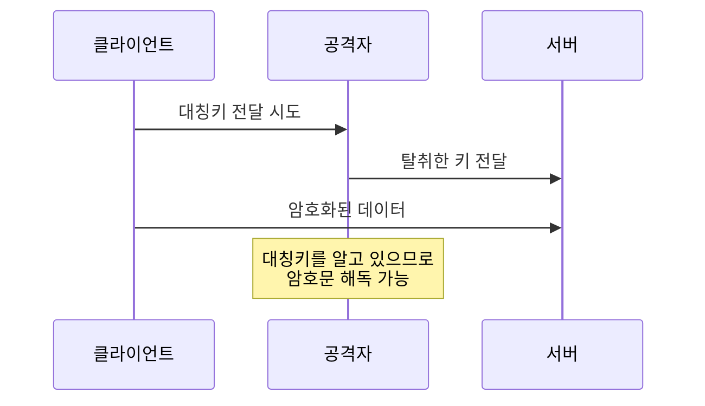

이 문제를 일반적으로 키 분배 문제라고 한다.

대칭키 암호 자체가 약한 것이 아니라, 대칭키를 안전하게 공유하는 과정이 어렵다는 의미다.

---

## 중간자 공격이란 무엇인가?

중간자 공격은 공격자가 클라이언트와 서버 사이에 끼어 양쪽의 통신 상대인 것처럼 행동하는 공격이다.

```text
클라이언트 ↔ 공격자 ↔ 서버
```

클라이언트는 공격자를 서버라고 생각하고, 서버는 공격자를 클라이언트라고 생각할 수 있다.

공격자는 다음과 같은 작업을 시도할 수 있다.

```text
통신 내용 도청
데이터 변경
가짜 응답 전달
암호화 키 탈취
사용자 인증 정보 탈취
```

단순히 대칭키만 전달하는 구조에서는 공격자가 키를 가로채지 못하게 보장하기 어렵다.

이를 해결하기 위한 중요한 도구 중 하나가 비대칭키 암호 방식이다.

---

## 비대칭키 암호화란 무엇인가?

비대칭키 방식은 서로 다른 두 개의 키를 사용한다.

```text
공개키
개인키
```

공개키는 다른 사람에게 공개해도 되지만, 개인키는 소유자만 안전하게 보관해야 한다.

두 키는 수학적으로 연결된 하나의 키 쌍이다.

```text
공개키로 처리한 정보
↔ 대응하는 개인키와 관련

개인키로 생성한 서명
↔ 대응하는 공개키로 검증
```

비대칭키 암호화는 주로 다음 두 가지 목적으로 사용된다.

```text
1. 기밀성 확보
2. 전자서명과 신원 인증
```

---

## 공개키로 암호화하고 개인키로 복호화하는 구조

앨리스가 밥에게 비밀 메시지를 보내려고 한다고 가정해보자.

밥은 공개키와 개인키를 생성한다.

```text
밥의 공개키
밥의 개인키
```

밥은 공개키를 앨리스에게 전달하고 개인키는 자신만 보관한다.

앨리스는 밥의 공개키로 메시지를 암호화한다.

```text
앨리스의 메시지
+ 밥의 공개키
→ 암호문
```

이 암호문은 밥의 개인키를 가진 밥이 복호화할 수 있다.

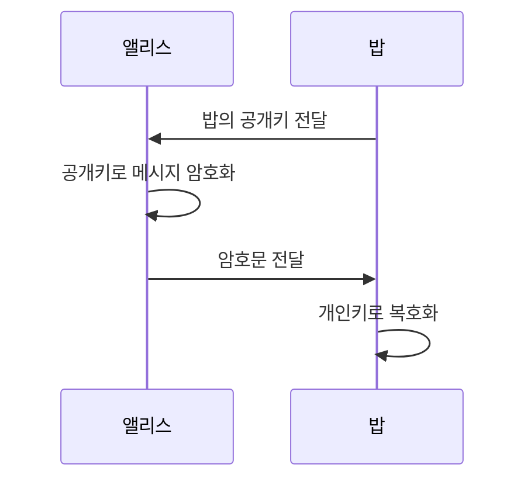

공격자가 암호문과 공개키를 모두 얻더라도 밥의 개인키가 없다면 원문을 복호화하기 어렵다.

### 비대칭키 방식의 장점

대칭키 자체를 평문으로 전달하는 문제를 줄일 수 있다.

공개키는 공개되어도 되므로 네트워크를 통해 전달할 수 있다.

### 비대칭키 방식의 한계

비대칭키 연산은 대칭키 암호화에 비해 일반적으로 계산 비용이 크다.

따라서 웹 통신의 모든 데이터를 비대칭키로 암호화하지 않는다.

또한 공개키를 받았다는 사실만으로 그 키가 진짜 서버의 공개키라고 확신할 수는 없다.

공격자가 자신의 공개키를 서버의 공개키인 것처럼 바꿔치기할 수 있기 때문이다.

---

## 공개키도 중간자 공격을 완전히 막지는 못한다

클라이언트가 서버의 공개키를 요청했다고 가정해보자.

```text
클라이언트 → 서버 공개키 요청
```

공격자가 중간에서 요청을 가로채고 자신의 공개키를 전달할 수 있다.

```text
클라이언트
← 공격자의 공개키
```

클라이언트는 공격자의 공개키를 서버의 공개키라고 믿고 데이터를 암호화한다.

공격자는 자신의 개인키로 메시지를 복호화한 뒤, 실제 서버의 공개키로 다시 암호화하여 전달할 수 있다.

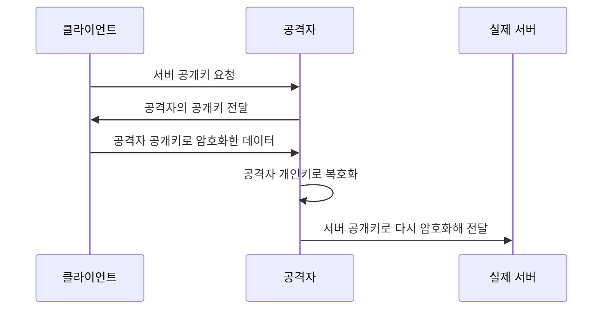

클라이언트와 서버는 통신하고 있다고 생각하지만, 공격자는 중간에서 내용을 확인하거나 변경할 수 있다.

따라서 핵심 문제는 다음 질문으로 바뀐다.

```text
내가 받은 공개키가 정말 접속하려는 서버의 공개키인지
어떻게 확인할 것인가?
```

이를 해결하기 위해 인증서와 인증 기관이 사용된다.

---

## 전자서명이란 무엇인가?

전자서명은 데이터의 작성자와 데이터 무결성을 검증하기 위한 암호학적 장치다.

전자서명은 단순히 데이터를 암호화해 숨기는 목적과 다르다.

전자서명이 제공하려는 핵심은 다음과 같다.

```text
이 메시지가 특정 개인키의 소유자에 의해 만들어졌는가?
메시지가 전달 과정에서 변경되지 않았는가?
```

전자서명의 일반적인 흐름은 다음과 같다.

```text
원본 데이터
→ 해시 함수
→ 해시값
→ 개인키로 서명 생성
→ 전자서명
```

검증자는 원본 데이터로 다시 해시값을 계산하고, 공개키를 사용하여 전자서명이 유효한지 검증한다.

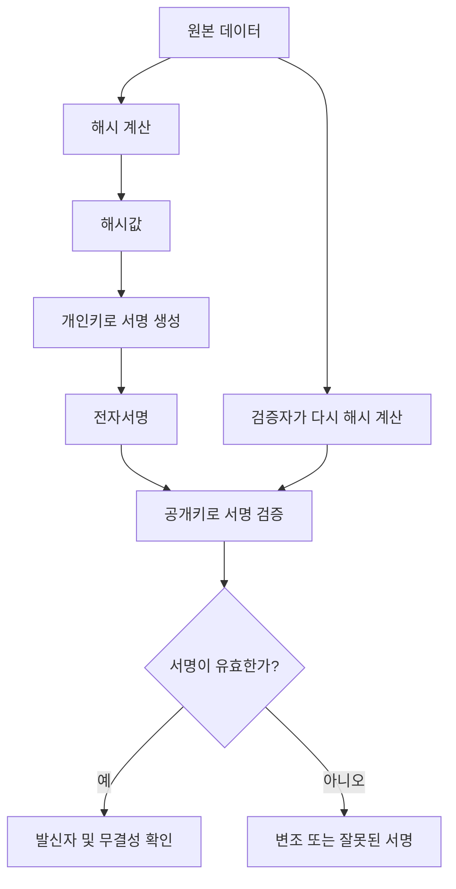

전자서명을 흔히 “개인키로 해시값을 암호화하고 공개키로 복호화한다”라고 설명하기도 한다.

RSA 서명을 직관적으로 이해하는 데는 도움이 될 수 있지만, 모든 전자서명 알고리즘을 정확하게 설명하는 표현은 아니다.

ECDSA나 EdDSA 같은 방식은 암호화와 복호화라기보다 개인키로 서명값을 계산하고 공개키로 수학적 유효성을 검증한다고 이해하는 편이 정확하다.

---

## 암호화와 전자서명의 차이

비대칭키를 이용한다는 점은 같지만 목적과 키 사용 방향이 다르다.

| 구분    | 공개키 암호화       | 전자서명           |
| ----- | ------------- | -------------- |
| 핵심 목적 | 기밀성           | 인증과 무결성        |
| 처리 주체 | 수신자의 공개키 사용   | 발신자의 개인키 사용    |
| 확인 주체 | 수신자의 개인키로 복호화 | 발신자의 공개키로 검증   |
| 보호 대상 | 메시지 내용        | 메시지의 출처와 변경 여부 |

공개키 암호화는 “수신자만 읽게 하는 것”에 가깝다.

전자서명은 “누가 만들었고 변경되지 않았는지 증명하는 것”에 가깝다.

---

## 인증 기관이 필요한 이유

인증 기관은 Certificate Authority의 약자로 보통 CA라고 부른다.

CA의 역할은 특정 공개키와 특정 도메인 또는 주체의 관계를 검증하고 인증서에 서명하는 것이다.

예를 들어 서버가 다음 도메인을 운영한다고 가정해보자.

```text
api.example.com
```

서버는 자신의 공개키가 `api.example.com`의 공개키라는 사실을 증명하기 위해 인증서를 발급받는다.

인증서에는 일반적으로 다음과 같은 정보가 포함될 수 있다.

```text
인증서의 주체
도메인 정보
주체의 공개키
발급자 정보
유효 기간
서명 알고리즘
확장 필드
인증 기관의 전자서명
```

X.509 인증서는 주체의 공개키와 식별 정보를 포함하고, 인증 기관의 서명을 통해 이 관계를 검증할 수 있도록 한다. RFC 5280은 인터넷에서 사용하는 X.509 인증서와 인증 경로 검증 방식을 정의한다.

---

## 인증서가 서버의 개인키를 포함하는 것은 아니다

인증서에는 서버의 공개키가 포함된다.

```text
서버 인증서
├── 서버 식별 정보
├── 서버 공개키
├── 유효 기간
├── 발급자
├── 확장 정보
└── CA 전자서명
```

서버 개인키는 인증서에 포함되지 않는다.

```text
서버 개인키
→ 서버 내부에 안전하게 보관
→ 외부로 전달하지 않음
```

개인키가 유출되면 공격자가 해당 서버의 신원을 가장하거나 서명을 생성할 수 있으므로 별도의 키 관리 시스템이나 보안 저장소를 통해 보호해야 한다.

---

## 인증서 서명이 만들어지는 원리

인증 기관은 인증서의 핵심 정보를 바탕으로 서명을 생성한다.

개념적인 과정은 다음과 같다.

```text
인증서 본문
→ 해시 계산
→ CA 개인키로 전자서명 생성
→ 인증서에 서명 포함
```

클라이언트는 CA의 공개키로 이 서명이 유효한지 검증한다.

```text
인증서 본문
→ 동일한 해시 계산

인증서 서명
+ CA 공개키
→ 서명 검증

두 결과가 유효
→ 인증서가 서명 이후 변경되지 않았음
```

공격자가 인증서 안의 서버 공개키나 도메인을 변경하면 기존 서명 검증이 실패한다.

공격자가 내용을 변경한 뒤 새로운 서명을 만들려면 CA의 개인키가 필요하다.

---

## 인증서 체인이란 무엇인가?

웹 서버 인증서는 일반적으로 루트 CA가 직접 서명하지 않는다.

보통 다음과 같은 계층 구조를 사용한다.

```text
루트 CA
→ 중간 CA
→ 서버 인증서
```

이를 인증서 체인 또는 인증 경로라고 한다.

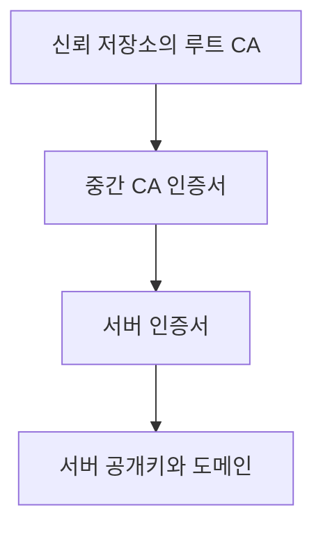

서버 인증서는 중간 CA가 서명하고, 중간 CA 인증서는 상위 CA가 서명한다.

브라우저는 서버 인증서부터 시작하여 신뢰할 수 있는 루트 인증서까지 연결되는 경로를 검증한다.

RFC 5280의 인증 경로 검증은 단순히 전자서명만 확인하는 것이 아니라 인증서의 유효 기간, 이름 제약, 기본 제약, 키 사용 목적과 같은 여러 조건을 함께 확인하도록 정의한다.

---

## 루트 CA는 어떻게 신뢰할까?

인증서 검증 구조를 따라가다 보면 마지막에 다음 질문이 남는다.

```text
루트 CA의 공개키는 왜 신뢰할 수 있는가?
```

운영체제와 브라우저는 신뢰할 수 있다고 판단한 루트 CA 인증서 목록을 신뢰 저장소에 관리한다.

```text
운영체제 또는 브라우저의 신뢰 저장소
├── Root CA A
├── Root CA B
├── Root CA C
└── ...
```

브라우저가 서버 인증서를 검증할 때 인증서 체인이 이 신뢰 저장소의 루트 CA까지 정상적으로 연결되는지 확인한다.

즉, 신뢰는 무한히 이어지는 것이 아니라 미리 신뢰하도록 배포된 루트 인증서에서 끝난다.

이 루트 인증서를 Trust Anchor라고 부른다.

---

## 브라우저가 인증서를 검증하는 항목

브라우저가 인증서를 받았다고 해서 CA 서명만 확인하는 것은 아니다.

대표적으로 다음 항목들을 확인한다.

```text
인증서 체인이 신뢰할 수 있는 루트까지 연결되는가?
각 인증서의 전자서명이 유효한가?
인증서가 현재 유효 기간 안에 있는가?
접속한 도메인이 인증서의 도메인과 일치하는가?
인증서가 해당 용도로 사용 가능한가?
인증서가 폐기된 상태는 아닌가?
지원하는 알고리즘과 키 길이를 사용하는가?
```

예를 들어 사용자가 다음 주소에 접속했다고 가정해보자.

```text
https://api.example.com
```

인증서가 다음 도메인에만 유효하다면 검증에 실패할 수 있다.

```text
www.other-example.com
```

CA가 서명한 정상 인증서라도 접속한 도메인과 인증서의 대상이 다르면 해당 서버의 인증서로 인정할 수 없다.

---

## SSL과 TLS의 차이

SSL과 TLS는 일상적으로 혼용되지만 현재의 HTTPS 통신에서는 TLS라는 표현이 더 정확하다.

SSL은 과거에 사용되던 프로토콜이고, TLS는 이를 계승하여 발전한 프로토콜이다.

```text
SSL 2.0
SSL 3.0
TLS 1.0
TLS 1.1
TLS 1.2
TLS 1.3
```

현대적인 환경에서는 TLS 1.2 또는 TLS 1.3을 주로 다룬다.

RFC 8446은 TLS 1.3을 정의하며, TLS 1.3은 이전 버전에서 사용되던 여러 오래된 알고리즘과 핸드셰이크 구조를 제거하거나 단순화했다.

따라서 흔히 사용하는 “SSL 인증서”라는 표현도 실제로는 TLS 통신에 사용되는 서버 인증서를 의미하는 경우가 많다.

---

## TLS는 왜 대칭키와 비대칭키를 함께 사용할까?

대칭키와 비대칭키는 서로 경쟁하는 방식이 아니라 서로 다른 문제를 해결한다.

대칭키의 특징은 다음과 같다.

```text
빠른 암호화와 복호화
대용량 데이터 처리에 적합
안전한 키 공유가 어려움
```

비대칭키의 특징은 다음과 같다.

```text
공개키를 외부에 공개 가능
인증과 키 교환에 활용 가능
연산 비용이 상대적으로 큼
```

TLS는 두 방식의 장점을 결합한다.

```text
인증서와 비대칭키
→ 서버 신원 인증

키 교환 알고리즘
→ 공유 비밀 도출

대칭키
→ 실제 HTTP 데이터 암호화
```

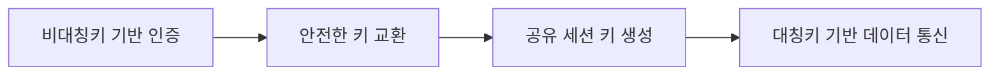

중요한 점은 TLS 버전에 따라 키 교환 방식이 다를 수 있다는 것이다.

---

## TLS 1.2에서의 키 교환

TLS 1.2에서는 선택한 암호 스위트에 따라 여러 키 교환 방식을 사용할 수 있었다.

과거 RSA 키 교환 방식에서는 클라이언트가 Pre-Master Secret을 생성하고, 서버 인증서에 포함된 RSA 공개키로 암호화하여 서버에 전달했다.

```text
클라이언트
→ Pre-Master Secret 생성
→ 서버 공개키로 암호화
→ 서버에 전달

서버
→ 개인키로 복호화
→ 동일한 세션 키 도출
```

개념적으로는 다음과 같다.

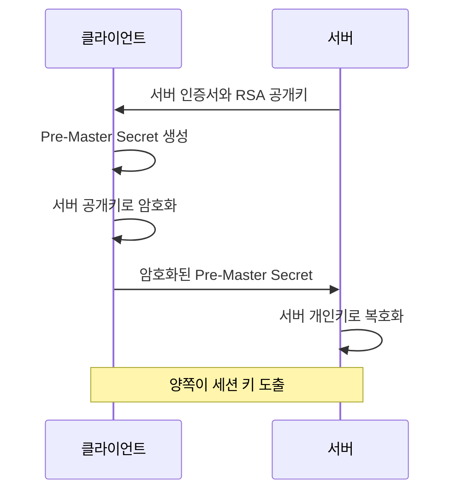

그러나 TLS 1.2에서도 ECDHE 같은 임시 Diffie-Hellman 키 교환 방식이 널리 사용되었다.

TLS 1.3에서는 정적 RSA 키 교환이 제거되었으며, 키 교환과 인증의 역할이 더 명확하게 분리되었다. TLS 1.3은 RFC 8446에서 정의된다.

---

## TLS 1.3에서는 대칭키를 직접 전달하지 않는다

현대적인 TLS 1.3을 설명할 때 “클라이언트가 대칭키를 만들고 서버의 공개키로 암호화해 전달한다”라고만 설명하면 정확하지 않다.

TLS 1.3에서는 일반적으로 ECDHE와 같은 키 합의 방식을 이용한다.

클라이언트와 서버는 각자 임시 개인값과 공개값을 만든다.

```text
클라이언트 임시 개인값
클라이언트 Key Share

서버 임시 개인값
서버 Key Share
```

서로에게 공개 가능한 Key Share를 전달한다.

각자 자신의 임시 개인값과 상대방의 Key Share를 조합하여 동일한 공유 비밀을 계산한다.

```text
클라이언트 계산 결과
= 공유 비밀

서버 계산 결과
= 동일한 공유 비밀
```

실제 공유 비밀이나 최종 대칭키 자체가 네트워크로 직접 전달되는 것은 아니다.

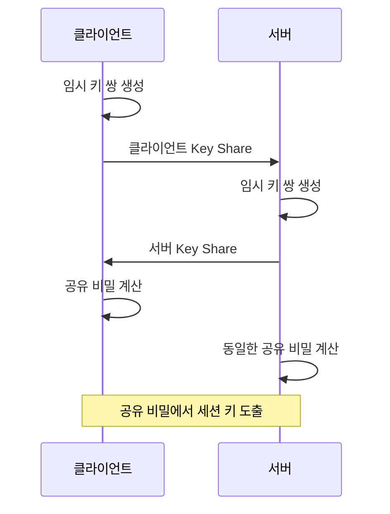

이후 HKDF와 같은 키 도출 함수를 사용해 핸드셰이크 키와 애플리케이션 트래픽 키를 만든다.

```text
공유 비밀
+ 핸드셰이크 정보
→ 키 도출 함수
→ 암호화 키
→ 무결성 보호에 필요한 값
```

---

## Diffie-Hellman 키 교환의 직관적인 이해

Diffie-Hellman 방식은 서로 비밀을 직접 전달하지 않고 동일한 결과를 만드는 구조로 이해할 수 있다.

색상 혼합에 비유하면 다음과 같다.

```text
공개된 공통 색상: 노란색

클라이언트 비밀 색상: 파란색
서버 비밀 색상: 빨간색
```

클라이언트는 노란색과 파란색을 섞은 결과를 서버에 전달한다.

서버는 노란색과 빨간색을 섞은 결과를 클라이언트에 전달한다.

각자는 전달받은 결과에 자신의 비밀 색상을 추가한다.

```text
클라이언트:
서버의 혼합색 + 파란색

서버:
클라이언트의 혼합색 + 빨간색
```

결과적으로 양쪽 모두 같은 최종 색상을 얻는다.

공격자는 공개된 혼합 결과를 볼 수 있지만 각자의 비밀값을 알지 못하기 때문에 최종 공유 비밀을 계산하기 어렵다.

실제 암호학에서는 색상이 아니라 이산로그 문제나 타원곡선 수학을 기반으로 동작한다.

---

## ECDHE에서 E와 E가 의미하는 것

ECDHE는 Elliptic Curve Diffie-Hellman Ephemeral의 약자다.

```text
EC
→ Elliptic Curve, 타원곡선

DH
→ Diffie-Hellman 키 합의

E
→ Ephemeral, 일회성 또는 임시 키
```

연결마다 임시 키를 생성하고 사용 후 폐기한다.

이 방식은 Forward Secrecy를 제공하는 데 중요하다.

### Forward Secrecy

서버의 장기 개인키가 나중에 유출되더라도 과거에 기록된 TLS 통신 내용을 복호화하기 어렵게 만드는 성질이다.

과거 RSA 키 교환에서는 공격자가 암호화된 통신 전체를 저장해두었다가 나중에 서버 개인키를 확보하면 과거의 Pre-Master Secret을 복호화할 가능성이 있었다.

ECDHE에서는 연결마다 임시 비밀값을 사용한다.

```text
서버 장기 개인키
→ 서버 인증에 사용

연결별 임시 키
→ 세션 공유 비밀 생성
→ 연결 종료 후 폐기
```

장기 개인키가 나중에 노출되어도 이미 폐기된 과거 임시 개인값을 복구할 수 없다면 과거 세션 키를 다시 만들기 어렵다.

---

## TLS 1.3 핸드셰이크 전체 흐름

TLS 1.3 핸드셰이크를 단순화하면 다음과 같다.

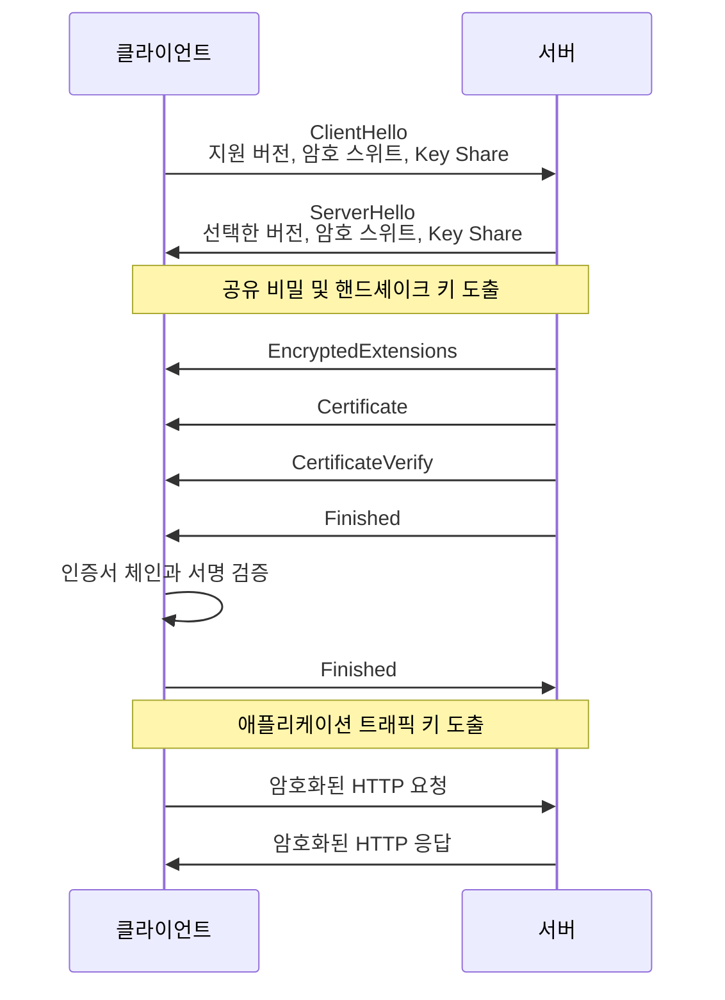

TLS 1.3의 전체 목적은 다음 세 가지로 정리할 수 있다.

```text
통신에 사용할 알고리즘 협상
서버 신원 검증
안전한 세션 키 생성
```

RFC 8446은 TLS 1.3 핸드셰이크에서 ClientHello, ServerHello, 인증 메시지, Finished 메시지 등을 통해 보안 파라미터를 협상하고 통신 키를 설정하도록 정의한다.

---

## ClientHello에서 전달되는 정보

클라이언트가 서버에 처음 보내는 TLS 메시지가 ClientHello다.

대표적으로 다음 정보가 포함된다.

```text
지원하는 TLS 버전
지원하는 암호 스위트
클라이언트 랜덤값
지원하는 확장 기능
접속하려는 서버 이름
지원하는 키 교환 그룹
클라이언트 Key Share
```

### 서버 이름이 필요한 이유

하나의 IP 주소에서 여러 HTTPS 도메인을 운영할 수 있다.

```text
api.example.com
admin.example.com
shop.example.com
```

서버는 클라이언트가 어느 도메인에 접속하려는지 알아야 적절한 인증서를 선택할 수 있다.

이를 위해 SNI라는 TLS 확장이 사용된다.

---

## ServerHello에서 결정되는 정보

서버는 ClientHello를 확인한 뒤 사용할 설정을 선택한다.

```text
사용할 TLS 버전
사용할 암호 스위트
서버 랜덤값
서버 Key Share
```

ClientHello와 ServerHello가 교환되면 양쪽은 공유 비밀을 계산하고 핸드셰이크 보호 키를 도출할 수 있다.

TLS 1.3에서는 ServerHello 이후의 여러 핸드셰이크 메시지도 암호화되어 전송된다.

---

## 서버 인증서는 언제 사용되는가?

키 교환만으로는 통신 상대가 실제 서버인지 알 수 없다.

공격자도 자신의 Key Share를 만들어 클라이언트와 키 합의를 시도할 수 있기 때문이다.

따라서 서버는 인증서를 전달하고, 인증서에 포함된 공개키에 대응하는 개인키를 실제로 가지고 있다는 사실을 증명해야 한다.

TLS 1.3에서는 `CertificateVerify` 메시지가 이 역할을 한다.

```text
서버
→ 지금까지의 핸드셰이크 내용에 서명
→ CertificateVerify 전송

클라이언트
→ 인증서의 서버 공개키로 서명 검증
```

이를 통해 클라이언트는 다음을 확인한다.

```text
인증서가 신뢰할 수 있는가?
인증서의 도메인이 접속 도메인과 일치하는가?
서버가 인증서 공개키에 대응하는 개인키를 실제로 가지고 있는가?
핸드셰이크 메시지가 변조되지 않았는가?
```

인증서는 서버 공개키의 신뢰성을 제공하고, `CertificateVerify`는 서버가 해당 개인키를 소유하고 있음을 증명한다.

---

## Finished 메시지의 역할

Finished 메시지는 지금까지의 핸드셰이크 전체가 변조되지 않았다는 것을 확인하기 위한 메시지다.

클라이언트와 서버는 각자 핸드셰이크 메시지 전체를 기반으로 검증값을 만든다.

상대방이 보낸 Finished 값을 검증할 수 있다면 다음을 확인할 수 있다.

```text
양쪽이 동일한 키를 만들었다
핸드셰이크 메시지가 중간에서 변경되지 않았다
키 교환이 정상적으로 완료되었다
```

인증서 검증만 성공했다고 즉시 안전한 통신이 완성되는 것은 아니다.

키 합의와 핸드셰이크 무결성 검증까지 성공해야 TLS 연결이 정상적으로 수립된다.

---

## 세션 키는 하나만 존재할까?

“대칭키 하나를 공유한다”라는 설명은 이해하기 쉽지만 실제 TLS에서는 용도와 방향에 따라 여러 키가 도출된다.

예를 들어 다음과 같이 구분할 수 있다.

```text
클라이언트 → 서버 암호화 키
서버 → 클라이언트 암호화 키
핸드셰이크 트래픽 키
애플리케이션 트래픽 키
재개에 필요한 비밀값
```

클라이언트가 서버에 보내는 데이터를 암호화하는 키와 서버가 클라이언트에 보내는 데이터를 암호화하는 키가 분리될 수 있다.

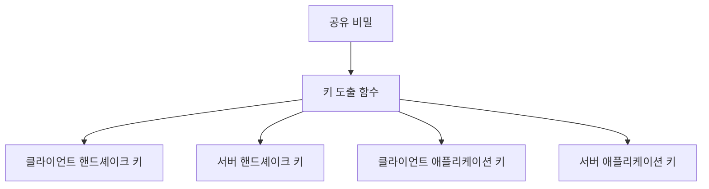

이 구조는 통신 방향과 용도를 명확하게 분리하는 데 도움이 된다.

---

## 실제 HTTP 요청은 어떻게 보호되는가?

TLS 핸드셰이크가 끝나면 HTTP 메시지가 애플리케이션 트래픽 키를 이용해 보호된다.

애플리케이션 입장에서는 다음과 같은 HTTP 요청을 보낸다.

```http
POST /payments HTTP/1.1
Host: api.example.com
Content-Type: application/json

{
  "orderId": 1001,
  "amount": 50000
}
```

그러나 네트워크에 전달되는 실제 TLS 레코드는 암호화된 바이너리 데이터다.

```text
17 03 03 00 F2 8A B1 7C ...
```

서버의 TLS 계층은 이를 복호화한 뒤 HTTP 서버에 전달한다.

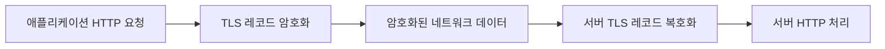

Spring Boot나 Nginx 같은 애플리케이션 계층에서는 대부분 TLS 구현의 세부 암호 연산을 직접 수행하지 않는다.

운영체제, TLS 라이브러리, 웹 서버 또는 애플리케이션 서버가 암호화와 복호화 과정을 처리한다.

---

## TLS는 암호화만 제공하는 것이 아니다

현대 TLS에서는 인증된 암호화 방식인 AEAD를 사용한다.

AEAD는 Authenticated Encryption with Associated Data의 약자다.

이는 하나의 암호화 처리에서 기밀성과 무결성을 함께 제공한다.

대표적인 방식에는 다음이 있다.

```text
AES-GCM
ChaCha20-Poly1305
```

단순 암호화만 수행한다면 공격자가 암호문의 일부를 변경했을 때 수신자가 그 사실을 알아차리지 못할 수 있다.

AEAD는 인증 태그를 함께 사용하여 데이터가 변경되지 않았는지 검증한다.

```text
평문
+ 대칭키
+ Nonce
+ 추가 인증 데이터
→ 암호문
+ 인증 태그
```

수신자는 복호화 과정에서 인증 태그도 검증한다.

```text
인증 태그 검증 성공
→ 복호화된 데이터 사용

인증 태그 검증 실패
→ 변조된 데이터로 판단하고 폐기
```

---

## Nonce와 IV가 필요한 이유

같은 평문을 같은 키로 항상 동일하게 암호화하면 패턴이 노출될 수 있다.

```text
같은 키 + 같은 평문
→ 같은 암호문
```

공격자는 내용을 직접 해독하지 못하더라도 동일한 메시지가 반복된다는 사실을 추론할 수 있다.

이를 방지하기 위해 암호화 과정에는 IV 또는 Nonce가 사용된다.

```text
같은 키
+ 같은 평문
+ 서로 다른 Nonce
→ 서로 다른 암호문
```

Nonce는 알고리즘의 요구사항에 따라 같은 키에서 재사용하지 않아야 한다.

특히 AES-GCM과 같은 방식에서 동일 키와 동일 Nonce의 재사용은 심각한 보안 문제를 일으킬 수 있다.

이 때문에 암호 알고리즘은 단순히 알고리즘 이름만 선택한다고 끝나지 않는다.

```text
안전한 키 생성
키 보관
Nonce 관리
키 회전
알고리즘 모드 선택
인증 태그 검증
```

모든 요소가 올바르게 구현되어야 한다.

---

## HTTPS가 보호하는 범위

HTTPS는 클라이언트와 TLS 연결 종료 지점 사이의 통신을 보호한다.

```text
브라우저
↔ HTTPS
↔ 로드 밸런서
```

만약 로드 밸런서에서 TLS를 종료하고 백엔드와 HTTP로 통신한다면 다음 구간은 암호화되지 않을 수 있다.

```text
브라우저
↔ HTTPS
↔ 로드 밸런서
↔ HTTP
↔ 애플리케이션 서버
```

보안 요구사항에 따라 로드 밸런서와 백엔드 서버 사이에도 TLS를 적용할 수 있다.

```text
브라우저
↔ HTTPS
↔ 로드 밸런서
↔ HTTPS
↔ 애플리케이션 서버
```

따라서 주소창에 HTTPS가 표시된다는 사실만으로 내부 모든 통신 구간이 암호화되었다고 단정할 수는 없다.

인프라의 TLS 종료 지점을 함께 확인해야 한다.

---

## HTTPS가 보호하지 못하는 것

HTTPS는 네트워크 전송 구간을 보호하지만 모든 보안 문제를 해결하지 않는다.

### 서버에 도착한 이후의 평문 데이터

서버는 요청을 처리하기 위해 데이터를 복호화한다.

애플리케이션 로그에 다음과 같이 남긴다면 HTTPS를 사용해도 민감정보가 노출된다.

```java
log.info("login password={}", request.password());
```

### 클라이언트 또는 서버 자체가 침해된 경우

브라우저에 악성 스크립트가 실행되거나 서버가 해킹되었다면 TLS 외부에서 평문 데이터가 탈취될 수 있다.

### 잘못된 인증서 검증

클라이언트가 모든 인증서를 신뢰하도록 설정하면 중간자 공격을 막기 어렵다.

```java
// 모든 인증서를 무조건 신뢰하는 구조는 운영에서 사용하면 안 된다.
```

### 애플리케이션 취약점

HTTPS는 SQL Injection, XSS, 권한 검증 누락, IDOR 같은 애플리케이션 취약점을 직접 막지 않는다.

```text
HTTPS
→ 안전한 전송 채널 제공

애플리케이션 보안
→ 별도로 구현 필요
```

---

## 비밀번호는 암호화보다 해싱해야 한다

통신 암호화와 비밀번호 저장은 목적이 다르다.

비밀번호는 로그인 시 원문으로 복원할 필요가 없다.

사용자가 입력한 비밀번호가 저장된 비밀번호와 같은지만 확인하면 된다.

따라서 비밀번호는 복호화 가능한 대칭키 암호화보다 비밀번호 전용 단방향 해시 알고리즘을 사용해야 한다.

```text
회원가입:
비밀번호
→ Salt
→ 비밀번호 해시 함수
→ 해시 결과 저장

로그인:
입력 비밀번호
→ 동일한 검증 과정
→ 저장된 해시와 비교
```

대표적으로 다음과 같은 알고리즘을 사용할 수 있다.

```text
Argon2
scrypt
bcrypt
PBKDF2
```

TLS는 비밀번호가 네트워크에서 노출되지 않도록 보호하고, 비밀번호 해싱은 데이터베이스가 유출되었을 때 원문 비밀번호가 직접 노출되지 않도록 보호한다.

두 보안 계층은 모두 필요하다.

---

## 직접 암호 알고리즘을 구현하면 안 되는 이유

암호화 코드는 겉보기에는 간단해 보일 수 있다.

```java
encrypt(data, key);
decrypt(cipherText, key);
```

하지만 안전한 암호 시스템에는 훨씬 많은 요소가 포함된다.

```text
안전한 난수 생성
키 길이
알고리즘 선택
운영 모드
패딩
Nonce 재사용 방지
인증 태그 검증
키 저장 위치
키 접근 권한
키 회전
오류 메시지 처리
타이밍 공격 방지
```

작은 구현 실수 하나가 전체 보안을 무너뜨릴 수 있다.

따라서 검증된 암호화 라이브러리와 플랫폼의 TLS 구현을 사용해야 한다.

Spring Boot 애플리케이션에서는 일반적으로 Java의 TLS 구현, 웹 서버, 리버스 프록시, 클라우드 로드 밸런서 등이 TLS 연결을 처리한다.

개발자는 직접 암호 프로토콜을 구현하기보다 다음을 올바르게 설정하는 데 집중해야 한다.

```text
지원 TLS 버전
인증서와 개인키 관리
허용 암호 스위트
HTTP를 HTTPS로 리다이렉트
HSTS 설정
인증서 자동 갱신
내부 구간 암호화 여부
민감정보 로깅 방지
```

---

## Spring Boot에서 HTTPS를 적용하는 기본 구조

Spring Boot 애플리케이션에서 TLS를 직접 종료하는 경우 키 저장소를 설정할 수 있다.

```yaml
server:
  port: 8443
  ssl:
    enabled: true
    key-store: classpath:keystore.p12
    key-store-password: ${KEY_STORE_PASSWORD}
    key-store-type: PKCS12
    key-alias: server
```

중요한 점은 비밀번호와 개인키를 코드 저장소에 평문으로 저장하지 않는 것이다.

```text
환경 변수
Secret Manager
Vault
Kubernetes Secret
클라우드 인증서 관리 서비스
```

운영 환경에서는 다음과 같은 구조도 자주 사용한다.

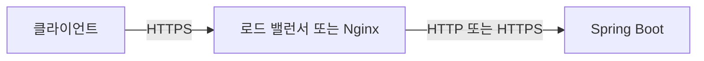

TLS를 어디에서 종료할지는 인프라 구성에 따라 결정한다.

### 애플리케이션에서 TLS 종료

```text
클라이언트
→ HTTPS
→ Spring Boot
```

### 리버스 프록시에서 TLS 종료

```text
클라이언트
→ HTTPS
→ Nginx
→ HTTP
→ Spring Boot
```

### 내부 구간까지 다시 암호화

```text
클라이언트
→ HTTPS
→ 로드 밸런서
→ HTTPS
→ Spring Boot
```

---

## 인증서 만료와 운영 장애

TLS 인증서에는 유효 기간이 존재한다.

인증서가 만료되면 브라우저나 API 클라이언트가 연결을 거부할 수 있다.

```text
인증서 만료
→ TLS 핸드셰이크 실패
→ HTTPS 연결 실패
→ 서비스 장애
```

따라서 운영 환경에서는 인증서 만료일을 모니터링하고 자동 갱신을 구성하는 것이 중요하다.

```text
인증서 만료 예정일 알림
자동 갱신
갱신 후 배포 또는 리로드
새 인증서 적용 확인
외부 모니터링
```

인증서 파일만 갱신하고 웹 서버를 재시작하거나 설정을 다시 로드하지 않으면 기존 인증서가 계속 제공될 수도 있다.

---

## TLS 연결 실패를 분석하는 순서

HTTPS 연결 문제가 발생하면 다음 순서로 확인할 수 있다.

### DNS 확인

```bash
dig api.example.com
```

도메인이 올바른 서버를 가리키는지 확인한다.

### 인증서 확인

```bash
openssl s_client \
  -connect api.example.com:443 \
  -servername api.example.com
```

주요 확인 항목은 다음과 같다.

```text
인증서 체인
인증서 대상 도메인
유효 기간
협상된 TLS 버전
선택된 암호 스위트
인증서 검증 결과
```

### HTTP 응답 확인

```bash
curl -v https://api.example.com
```

`-v` 옵션은 TLS 연결과 HTTP 요청 과정을 함께 확인하는 데 도움이 된다.

### 인증서 정보 출력

```bash
openssl s_client \
  -connect api.example.com:443 \
  -servername api.example.com \
  </dev/null 2>/dev/null |
openssl x509 -noout -subject -issuer -dates
```

출력에서는 다음 정보를 확인할 수 있다.

```text
subject
→ 인증서를 발급받은 대상

issuer
→ 인증서를 서명한 발급자

notBefore
→ 인증서 유효 시작일

notAfter
→ 인증서 만료일
```

---

## TLS 통신 구조

전체 흐름을 한 번에 정리하면 다음과 같다.

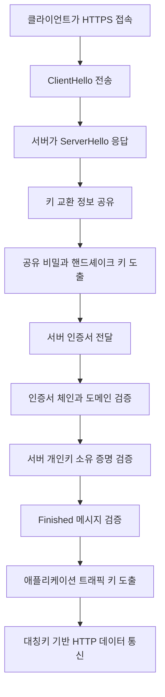

각 기술의 역할은 다음과 같이 구분된다.

| 기술      | TLS에서의 역할             |
| ------- | --------------------- |
| 대칭키 암호화 | 실제 애플리케이션 데이터를 빠르게 보호 |
| 비대칭키    | 서버 인증과 전자서명에 사용       |
| ECDHE   | 양쪽이 공유 비밀을 안전하게 합의    |
| 해시 함수   | 무결성 검증과 키 도출에 활용      |
| 전자서명    | 인증서와 서버 개인키 소유 증명     |
| 인증서     | 도메인과 서버 공개키의 관계를 증명   |
| CA      | 인증서에 서명하여 신뢰 체인 구성    |
| AEAD    | 암호화와 데이터 변조 검증을 함께 제공 |

---

## 실무에서 기억해야 할 핵심

HTTPS를 단순히 “공개키로 대칭키를 전달하고 대칭키로 통신한다”라고만 이해하면 현대 TLS의 실제 구조를 충분히 설명하기 어렵다.

TLS 1.3에서는 다음과 같이 이해하는 것이 좋다.

```text
인증서
→ 서버가 누구인지 검증

서버 전자서명
→ 인증서의 개인키를 실제로 보유했는지 증명

ECDHE 키 합의
→ 세션 키의 기반이 되는 공유 비밀 생성

키 도출 함수
→ 방향과 목적별 트래픽 키 생성

대칭키 기반 AEAD
→ 실제 HTTP 데이터의 기밀성과 무결성 보호
```

TLS에서 서버의 장기 개인키와 세션 대칭키는 역할이 다르다.

```text
서버 장기 개인키
→ 서버 신원 증명

연결별 임시 키
→ 공유 비밀 생성

세션 대칭키
→ 실제 데이터 암호화
```

이 역할을 분리하면 TLS 구조를 훨씬 명확하게 이해할 수 있다.

---

## 정리

암호화는 평문을 허가되지 않은 사람이 이해하기 어려운 암호문으로 변환하는 과정이고, 복호화는 암호문을 다시 원래 데이터로 되돌리는 과정이다.

대칭키 암호화는 동일한 키로 암호화와 복호화를 수행한다.

```text
장점
→ 빠른 처리 속도

문제점
→ 키를 안전하게 공유하기 어려움
```

비대칭키 방식은 공개키와 개인키를 사용한다.

```text
장점
→ 공개키를 외부에 공개 가능
→ 인증과 전자서명에 활용 가능

문제점
→ 공개키가 누구의 것인지 검증해야 함
→ 연산 비용이 상대적으로 큼
```

인증서는 도메인과 공개키의 관계를 인증 기관의 전자서명으로 증명한다.

브라우저는 신뢰 저장소의 루트 CA부터 서버 인증서까지 이어지는 인증서 체인을 검증한다.

전자서명은 메시지나 인증서가 특정 개인키 소유자에 의해 만들어졌고, 이후 변경되지 않았음을 검증하는 데 사용된다.

현대적인 TLS 1.3은 다음 과정을 통해 통신을 보호한다.

```text
ClientHello와 ServerHello 교환
→ ECDHE 기반 공유 비밀 생성
→ 인증서와 서명으로 서버 인증
→ 핸드셰이크 무결성 검증
→ 세션 대칭키 도출
→ 대칭키 기반 암호화 통신
```

결국 HTTPS의 핵심은 하나의 암호화 방식에 의존하는 것이 아니다.

```text
비대칭키와 인증서
→ 신뢰할 수 있는 서버인지 확인

키 합의
→ 안전하게 공유 비밀 생성

대칭키
→ 빠르게 실제 데이터 보호

전자서명과 인증 태그
→ 위조와 변조 방지
```

각 기술이 서로 다른 문제를 해결하며 결합되어야 안전한 통신 채널이 완성된다.

### 한 줄 요약

**TLS는 인증서와 비대칭키로 서버의 신원을 검증하고, ECDHE로 공유 비밀을 합의한 뒤, 여기서 도출한 대칭키로 실제 데이터를 빠르고 안전하게 암호화한다.**


