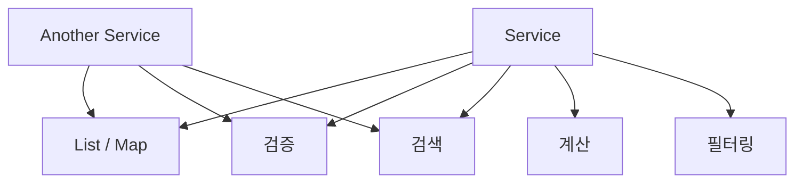
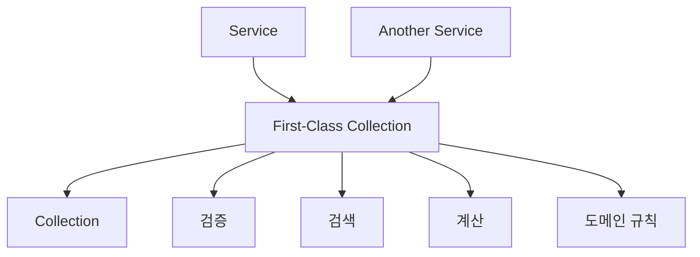

# 고래의 일급컬렉션
[https://youtu.be/0sDoo2ChST4?si=jlBNY1yQbila6l42](https://youtu.be/0sDoo2ChST4?si=jlBNY1yQbila6l42)

# 고래의 일급컬렉션
* toc
{:toc}

---

## 일급 컬렉션이란 무엇인가?

일급 컬렉션(First-Class Collection)은 단순한 `List`, `Set`, `Map`과 같은 컬렉션을 그대로 사용하는 대신, **컬렉션 자체를 하나의 객체로 감싸고 그 컬렉션과 관련된 비즈니스 규칙과 행위를 함께 관리하는 객체지향 설계 방식**이다.

핵심은 단순히 `List`를 클래스로 한 번 감싸는 것이 아니다.

```text
컬렉션
+
컬렉션이 지켜야 하는 규칙
+
컬렉션을 이용한 비즈니스 행위
=
하나의 의미 있는 도메인 객체
```

예를 들어 자동차 경주 게임에서 여러 자동차를 단순히 다음과 같이 관리할 수도 있다.

```java
List<Car> cars;
```

하지만 이 컬렉션에서 우승자를 찾고, 가장 멀리 간 자동차를 계산하고, 자동차들의 상태를 검증해야 한다면 이러한 로직이 여러 서비스나 컨트롤러로 흩어질 가능성이 있다.

이를 다음처럼 하나의 객체로 만들 수 있다.

```java
public class Cars {

    private final List<Car> cars;

    public Cars(List<Car> cars) {
        this.cars = List.copyOf(cars);
    }

    public List<Car> findWinners() {
        int maxPosition = findMaxPosition();

        return cars.stream()
                .filter(car -> car.isSamePosition(maxPosition))
                .toList();
    }

    private int findMaxPosition() {
        return cars.stream()
                .mapToInt(Car::getPosition)
                .max()
                .orElseThrow();
    }
}
```

이제 외부 객체는 자동차 컬렉션 내부 구현을 알 필요가 없다.

```java
List<Car> winners = cars.findWinners();
```

`stream()`을 어떻게 사용했는지, 최대 위치를 어떻게 구했는지, 어떤 기준으로 우승자를 판단하는지는 `Cars` 객체 내부의 책임이 된다.

이것이 일급 컬렉션의 핵심이다.

---

## 일급 컬렉션은 어디에서 나온 개념일까?

일급 컬렉션이라는 개념은 객체지향 설계에서 갑자기 독립적으로 등장한 개념이라기보다, **객체지향 생활 체조(Object Calisthenics)**라는 설계 훈련에서 나온 규칙 중 하나다.

객체지향 생활 체조는 절차적인 사고방식을 객체지향적인 사고방식으로 전환하기 위해 의도적으로 강한 제약을 두는 연습 방법이다.

예를 들어 다음과 같은 규칙들이 등장한다.

```text
한 메서드에서 들여쓰기 깊이를 제한한다.
else를 사용하지 않는다.
원시 타입과 문자열을 포장한다.
일급 컬렉션을 사용한다.
getter/setter 사용을 제한한다.
객체의 인스턴스 변수를 최소화한다.
```

이러한 규칙의 목적은 특정 문법을 금지하는 데 있지 않다.

궁극적으로는 다음과 같은 설계를 연습하기 위한 것이다.

```text
높은 응집도
낮은 결합도
강한 캡슐화
명확한 객체 책임
```

즉, 일급 컬렉션도 단순한 문법 규칙이 아니라 **컬렉션과 관련된 책임을 하나의 객체로 모으는 연습**이라고 이해하는 편이 좋다.

---

## 객체지향 생활 체조와 캡슐화

일급 컬렉션을 제대로 이해하려면 먼저 캡슐화를 이해해야 한다.

캡슐화는 단순히 필드를 `private`으로 선언하는 것을 의미하지 않는다.

핵심은 **데이터와 그 데이터를 사용하는 행위를 하나의 객체 안에 함께 두는 것**이다.

예를 들어 다음과 같은 코드가 있다고 하자.

```java
List<Car> cars = carRepository.findAll();

int maxPosition = cars.stream()
        .mapToInt(Car::getPosition)
        .max()
        .orElseThrow();

List<Car> winners = cars.stream()
        .filter(car -> car.getPosition() == maxPosition)
        .toList();
```

이 코드에서 `cars`는 단순 데이터이고, 우승자를 찾는 행위는 외부에 있다.

즉 다음처럼 데이터와 행위가 분리되어 있다.

```text
Cars 데이터
        ↓
Service가 데이터를 꺼냄
        ↓
Service가 직접 계산
```

객체지향적으로 접근하면 질문을 바꿀 수 있다.

> 자동차들을 가지고 있는 객체가 우승자를 찾는 것이 자연스럽지 않을까?

그러면 다음 구조가 된다.

```text
Cars
├── List<Car>
├── findWinners()
├── findMaxPosition()
└── ...
```

데이터와 그 데이터를 사용하는 행위가 한곳에 모인다.

이것이 응집도를 높인다.

---

## 응집도가 높다는 것은 무엇일까?

응집도(Cohesion)는 한 객체 안의 요소들이 **하나의 책임을 중심으로 얼마나 밀접하게 관련되어 있는가**를 의미한다.

예를 들어 다음 클래스가 있다고 하자.

```java
public class GameService {

    public int calculateScore(List<Piece> pieces) {
        // 점수 계산
    }

    public void sendEmail() {
        // 이메일
    }

    public void resizeImage() {
        // 이미지 처리
    }
}
```

세 메서드는 서로 거의 관련이 없다.

따라서 응집도가 낮다.

반대로 다음과 같은 객체라면 다르다.

```java
public class Board {

    private final Map<Position, Piece> pieces;

    public int calculateScore() {
        // 기물 점수 계산
    }

    public boolean contains(Position position) {
        // 위치 확인
    }

    public Piece findPiece(Position position) {
        // 기물 조회
    }
}
```

모든 행위가 `Board`라는 하나의 개념을 중심으로 동작한다.

응집도가 높다.

일급 컬렉션의 중요한 목적도 바로 여기에 있다.

```text
컬렉션을 사용하는 로직이 여러 곳에 흩어짐
                ↓
컬렉션 객체 안으로 이동
                ↓
높은 응집도
                ↓
변경 영향 범위 감소
```

---

## 일급 컬렉션의 핵심은 단순한 Wrapping이 아니다

다음 클래스를 보자.

```java
public class Cars {

    private final List<Car> cars;

    public Cars(List<Car> cars) {
        this.cars = cars;
    }

    public List<Car> getCars() {
        return cars;
    }
}
```

형식적으로는 `List<Car>`를 클래스로 감쌌다.

하지만 실제로 하는 일은 다음뿐이다.

```text
List<Car>
→ Cars
→ getCars()
→ 다시 List<Car>
```

결국 외부 코드가 여전히 모든 로직을 처리한다.

```java
cars.getCars()
        .stream()
        .filter(...)
        .map(...)
        .toList();
```

이 경우 컬렉션을 감싼 효과가 거의 없다.

일급 컬렉션을 사용하는 목적은 단순 포장이 아니라 다음에 있다.

```text
컬렉션을 감싼다.
+
관련 규칙을 안으로 가져온다.
+
컬렉션을 사용하는 행위를 객체에게 맡긴다.
+
도메인 의미를 부여한다.
```

예를 들어 다음과 같이 설계할 수 있다.

```java
public class Cars {

    private final List<Car> cars;

    public Cars(List<Car> cars) {
        validate(cars);
        this.cars = List.copyOf(cars);
    }

    public List<Car> findWinners() {
        int maxPosition = maxPosition();

        return cars.stream()
                .filter(car -> car.isSamePosition(maxPosition))
                .toList();
    }

    public void moveAll() {
        cars.forEach(Car::move);
    }

    private int maxPosition() {
        return cars.stream()
                .mapToInt(Car::getPosition)
                .max()
                .orElseThrow();
    }

    private void validate(List<Car> cars) {
        if (cars.isEmpty()) {
            throw new IllegalArgumentException(
                    "자동차는 한 대 이상 필요합니다."
            );
        }
    }
}
```

이제 `Cars`는 단순 컬렉션 래퍼가 아니라 자동차 집합이라는 **도메인 객체**가 된다.

---

## 일급 컬렉션은 컬렉션을 도메인 객체로 승격시킨다

컬렉션을 그대로 사용하면 타입만 보고는 의미를 알기 어렵다.

예를 들어 다음 코드가 있다고 하자.

```java
public void deal(
        List<Card> cards,
        List<Card> playerCards
) {
}
```

두 변수 모두 타입이 같다.

```text
List<Card>
List<Card>
```

컴파일러 입장에서는 둘이 완전히 동일하다.

따라서 실수로 순서를 바꿔도 문제가 없다.

```java
deal(playerCards, cards);
```

컴파일도 정상적으로 된다.

하지만 실제 의미는 전혀 다르다.

```text
cards
→ 아직 뽑히지 않은 카드 덱

playerCards
→ 플레이어가 들고 있는 카드
```

이를 각각 객체로 승격시키면 의미가 명확해진다.

```java
public void deal(
        Deck deck,
        Hand hand
) {
}
```

이제 타입 자체가 도메인을 설명한다.

```text
Deck
→ 남아 있는 카드 묶음

Hand
→ 플레이어가 보유한 카드
```

그리고 행위도 훨씬 자연스럽게 표현할 수 있다.

```java
Card card = deck.draw();
hand.receive(card);
```

기존에는 다음과 같았을 수 있다.

```java
Card card = deckCards.remove(0);
playerCards.add(card);
```

두 코드의 차이는 단순히 문법적인 차이가 아니다.

첫 번째 코드는 자료구조의 조작을 설명한다.

```text
0번째 항목을 제거한다.
리스트에 항목을 추가한다.
```

두 번째 코드는 비즈니스를 설명한다.

```text
덱에서 카드를 뽑는다.
플레이어가 카드를 받는다.
```

객체지향 설계에서 중요한 차이다.

---

## 일급 컬렉션의 첫 번째 장점: 비즈니스 로직의 응집

서비스 코드 여러 곳에서 동일한 컬렉션 연산을 수행한다고 해보자.

```java
public class GameService {

    public int calculateScore(Map<Position, Piece> pieces) {
        return pieces.values()
                .stream()
                .mapToInt(Piece::score)
                .sum();
    }
}
```

또 다른 클래스에서도 같은 로직이 등장한다.

```java
public class ResultService {

    public int calculateScore(Map<Position, Piece> pieces) {
        return pieces.values()
                .stream()
                .mapToInt(Piece::score)
                .sum();
    }
}
```

점수 규칙이 변경되면 두 군데를 모두 수정해야 한다.

더 큰 프로젝트에서는 같은 코드가 다섯 곳, 열 곳에 존재할 수도 있다.

이를 `Board`라는 일급 컬렉션으로 옮길 수 있다.

```java
public class Board {

    private final Map<Position, Piece> pieces;

    public Board(Map<Position, Piece> pieces) {
        this.pieces = Map.copyOf(pieces);
    }

    public int calculateScore() {
        return pieces.values()
                .stream()
                .mapToInt(Piece::score)
                .sum();
    }
}
```

서비스에서는 다음처럼 사용한다.

```java
int score = board.calculateScore();
```

변경 구조가 달라진다.

```text
Before

GameService ──┐
              ├── 점수 계산 로직
ResultService ┘


After

GameService ──┐
              ├── Board.calculateScore()
ResultService ┘
```

점수 정책이 변경되어도 수정 지점이 `Board` 하나로 좁혀진다.

---

## 두 번째 장점: 이름을 통해 도메인을 표현할 수 있다

컬렉션 자체에는 의미가 없다.

```java
List<LottoNumber>
```

이 타입만으로는 다음 중 무엇인지 알기 어렵다.

```text
당첨 번호인가?
구매 번호인가?
보너스 번호 후보인가?
전체 번호 풀인가?
```

객체 이름을 부여하면 의미가 생긴다.

```java
WinningNumbers
PurchasedNumbers
LottoNumbers
```

객체 이름 자체가 문서 역할을 한다.

```java
WinningNumbers winningNumbers =
        new WinningNumbers(numbers);
```

그리고 다음처럼 도메인 언어를 사용할 수 있다.

```java
int matchCount =
        winningNumbers.countMatches(lotto);
```

단순 컬렉션을 이용한 코드와 비교하면 의미 차이가 분명하다.

```java
long matchCount = numbers.stream()
        .filter(lottoNumbers::contains)
        .count();
```

후자는 구현을 읽어야 의도를 이해할 수 있지만, 전자는 메서드 이름만으로 목적을 이해할 수 있다.

---

## 세 번째 장점: 도메인 규칙을 객체가 보장할 수 있다

로또의 당첨 번호에는 여러 규칙이 있다고 가정하자.

```text
정확히 6개여야 한다.
숫자는 중복될 수 없다.
1부터 45 사이여야 한다.
```

단순히 `List<Integer>`로 전달하면 언제든 잘못된 값이 만들어질 수 있다.

```java
List<Integer> winningNumbers =
        List.of(1, 2, 3);
```

타입상 전혀 문제가 없다.

따라서 사용하는 곳마다 검증해야 할 수 있다.

```java
if (winningNumbers.size() != 6) {
    throw new IllegalArgumentException();
}
```

다른 코드에서도 또 검증한다.

```java
if (winningNumbers.size() != 6) {
    throw new IllegalArgumentException();
}
```

일급 컬렉션을 사용하면 생성 시점에 규칙을 강제할 수 있다.

```java
public class WinningNumbers {

    private static final int REQUIRED_SIZE = 6;

    private final List<LottoNumber> numbers;

    public WinningNumbers(
            List<LottoNumber> numbers
    ) {
        validateSize(numbers);
        validateDuplicate(numbers);

        this.numbers = List.copyOf(numbers);
    }

    private void validateSize(
            List<LottoNumber> numbers
    ) {
        if (numbers.size() != REQUIRED_SIZE) {
            throw new IllegalArgumentException(
                    "당첨 번호는 6개여야 합니다."
            );
        }
    }

    private void validateDuplicate(
            List<LottoNumber> numbers
    ) {
        if (numbers.stream().distinct().count()
                != REQUIRED_SIZE) {
            throw new IllegalArgumentException(
                    "당첨 번호는 중복될 수 없습니다."
            );
        }
    }
}
```

이제 중요한 보장이 생긴다.

```text
WinningNumbers 객체가 존재한다.
        ↓
생성자를 통과했다.
        ↓
도메인 규칙을 만족한다.
        ↓
객체를 신뢰할 수 있다.
```

이것을 흔히 **유효하지 않은 상태를 표현하기 어렵게 만드는 설계**라고 볼 수 있다.

---

## 네 번째 장점: 컬렉션의 외부 변경을 통제할 수 있다

다음 코드를 보자.

```java
public class Hand {

    private final List<Card> cards;

    public Hand(List<Card> cards) {
        this.cards = cards;
    }

    public List<Card> getCards() {
        return cards;
    }
}
```

외부에서 다음 코드가 가능하다.

```java
hand.getCards().clear();
```

`Hand` 객체는 아무런 메서드를 호출하지 않았는데 내부 카드가 모두 사라진다.

```text
Hand
  ↓
getCards()
  ↓
외부에서 clear()
  ↓
Hand 내부 상태 변경
```

이것은 캡슐화를 깨뜨린다.

생성 단계에서도 비슷한 문제가 있다.

```java
List<Card> cards = new ArrayList<>();
Hand hand = new Hand(cards);

cards.clear();
```

생성자가 원본 컬렉션을 그대로 저장했다면 외부의 `cards` 변경으로 `Hand` 내부 상태까지 바뀐다.

방어적 복사를 사용할 수 있다.

```java
public class Hand {

    private final List<Card> cards;

    public Hand(List<Card> cards) {
        this.cards = List.copyOf(cards);
    }

    public List<Card> cards() {
        return List.copyOf(cards);
    }
}
```

또는 외부에 컬렉션 자체를 제공하지 않고 필요한 행위만 제공하는 것이 더 좋은 경우도 많다.

```java
public int size() {
    return cards.size();
}

public boolean contains(Card card) {
    return cards.contains(card);
}
```

핵심은 다음과 같다.

```text
내부 컬렉션을 누가 변경할 수 있는가?
```

그 통제권을 객체 자신이 가져야 한다.

---

## 불변 컬렉션과 불변 객체는 정확히 같은 의미가 아니다

여기서 중요한 구분이 하나 있다.

다음과 같이 `List.copyOf()`를 사용했다고 해서 객체 전체가 항상 완전한 불변 객체가 되는 것은 아니다.

```java
this.cards = List.copyOf(cards);
```

이 코드는 **컬렉션 구조 자체의 변경을 막는 데 도움을 준다.**

```java
cards.add(...)
cards.remove(...)
cards.clear()
```

같은 변경을 할 수 없게 만든다.

하지만 `Card` 자체가 변경 가능한 객체라면 요소 내부 상태는 변경될 수 있다.

```text
List는 불변
↓
하지만 List 안의 Card는 가변일 수도 있음
```

따라서 완전한 불변성을 원한다면 컬렉션뿐 아니라 내부 요소의 가변성도 함께 고려해야 한다.

또한 불변 객체는 동시성 문제를 크게 줄여주지만, **불변 컬렉션을 사용했다는 사실만으로 모든 멀티스레드 문제를 자동으로 해결하는 것은 아니다.**

공유되는 다른 가변 상태, 외부 자원, 여러 객체 사이의 원자적 연산 등이 존재하면 별도의 동시성 제어가 필요할 수 있다.

---

## 일급 컬렉션은 왜 다른 멤버 변수를 가지지 않는가?

객체지향 생활 체조에서 제시하는 일급 컬렉션 규칙은 컬렉션을 가진 클래스가 다른 인스턴스 변수를 가지지 않도록 강한 제약을 둔다.

예를 들어 다음과 같다.

```java
public class Cars {

    private final List<Car> cars;
}
```

반면 다음 구조는 해당 훈련 규칙의 엄격한 의미에서는 일급 컬렉션이라고 보기 어렵다.

```java
public class Cars {

    private final List<Car> cars;
    private final String raceName;
    private final int round;
}
```

그 이유를 객체의 책임 측면에서 볼 수 있다.

첫 번째 구조의 책임은 명확하다.

```text
Cars
→ 자동차 집합을 관리한다.
```

하지만 두 번째 구조에서는 책임이 늘어나기 시작한다.

```text
자동차 집합 관리
경기 이름 관리
라운드 관리
```

컬렉션의 행위가 머무를 객체를 만들려던 목적에서 점점 멀어진다.

다만 이것을 절대적인 객체지향 법칙으로 해석해서는 안 된다.

실제 도메인 설계에서 컬렉션과 추가 상태를 함께 가지는 것이 자연스럽다면 그렇게 설계할 수 있다.

중요한 질문은 다음이다.

> 이 객체가 하나의 명확한 책임을 가지고 있는가?

규칙 자체보다 이 질문이 더 중요하다.

---

## 컬렉션 하나만 있으면 무조건 일급 컬렉션일까?

다음 클래스가 있다고 하자.

```java
public class Cars {

    private final List<Car> cars;
}
```

멤버 변수는 컬렉션 하나뿐이다.

하지만 아무런 행위가 없다.

```java
public List<Car> getCars() {
    return cars;
}
```

그리고 실제 로직은 서비스가 모두 처리한다.

```java
cars.getCars()
        .stream()
        .filter(...)
        .map(...)
        .toList();
```

형태상 컬렉션을 포장하고 있지만 일급 컬렉션을 사용하는 목적은 거의 달성하지 못한다.

일급 컬렉션의 본질을 다음 두 가지로 보는 것이 좋다.

```text
컬렉션 캡슐화
+
컬렉션과 관련된 행위의 응집
```

즉 단순히 `List`를 클래스 안에 넣는 것이 목적이 아니다.

---

## 일급 컬렉션과 값 객체는 어떤 관계일까?

일급 컬렉션을 이해하다 보면 값 객체(Value Object)와 비슷하다고 느낄 수 있다.

실제로 공통점이 많다.

예를 들어 다음 객체가 있다고 하자.

```java
public class Money {

    private final long amount;
}
```

`long`이라는 원시값을 감싸 의미를 부여했다.

일급 컬렉션도 비슷하다.

```java
public class WinningNumbers {

    private final List<LottoNumber> numbers;
}
```

차이는 주로 감싸는 대상이다.

```text
Value Object
→ 하나 또는 여러 값에 도메인 의미 부여

First-Class Collection
→ 컬렉션 자체에 도메인 의미와 행위 부여
```

따라서 일급 컬렉션 역시 실무에서는 하나의 도메인 값 객체처럼 설계되는 경우가 많다.

---

## 일급 컬렉션과 DTO의 차이

DTO는 데이터를 계층 간 전달하기 위한 목적이 강하다.

```java
public record OrderResponse(
        List<OrderItemResponse> items
) {
}
```

이 컬렉션이 단순히 응답 데이터를 전달한다면 굳이 별도 일급 컬렉션으로 만들 필요가 없을 수 있다.

반대로 다음과 같은 규칙이 있다면 이야기가 달라진다.

```text
주문 상품은 최소 하나 이상이어야 한다.
동일 상품은 중복될 수 없다.
전체 주문 금액을 계산해야 한다.
주문 가능한 최대 상품 수가 존재한다.
```

그렇다면 `OrderItems`라는 도메인 객체가 자연스럽다.

```java
public class OrderItems {

    private final List<OrderItem> items;

    public OrderItems(List<OrderItem> items) {
        validate(items);
        this.items = List.copyOf(items);
    }

    public Money totalPrice() {
        return items.stream()
                .map(OrderItem::totalPrice)
                .reduce(
                        Money.ZERO,
                        Money::add
                );
    }
}
```

따라서 판단 기준은 단순하다.

```text
단순 전달 데이터인가?
→ List 그대로 사용 가능

비즈니스 규칙을 가진 집합인가?
→ 일급 컬렉션 고려
```

---

## Spring/JPA에서는 어떻게 사용할 수 있을까?

실무에서는 일급 컬렉션과 JPA 엔티티를 반드시 같은 객체로 만들 필요는 없다.

예를 들어 주문 엔티티가 있다고 하자.

```java
@Entity
public class Order {

    @OneToMany(
            mappedBy = "order",
            cascade = CascadeType.ALL
    )
    private List<OrderItem> orderItems =
            new ArrayList<>();
}
```

JPA 컬렉션은 변경 감지, 지연 로딩, 연관관계 관리 등의 이유로 가변 컬렉션을 사용하는 경우가 많다.

그렇다고 도메인 행위를 외부에서 직접 수행해야 하는 것은 아니다.

```java
public Money totalPrice() {
    return orderItems.stream()
            .map(OrderItem::totalPrice)
            .reduce(
                    Money.ZERO,
                    Money::add
            );
}
```

또는 도메인 계층과 영속성 계층을 더 강하게 분리하는 설계라면 별도의 일급 컬렉션을 둘 수도 있다.

```java
public class OrderItems {

    private final List<OrderItem> values;
}
```

즉, 일급 컬렉션의 목적은 특정 프레임워크 문법을 따르는 것이 아니라 **도메인 책임을 어디에 둘 것인지 결정하는 것**이다.

---

## 실무 예제: 결제 수단 컬렉션

사용자가 여러 결제 수단을 등록할 수 있다고 가정해보자.

단순 리스트로 설계하면 다음과 같다.

```java
List<PaymentMethod> paymentMethods;
```

하지만 다음 비즈니스 규칙이 있다고 하자.

```text
최대 5개까지만 등록할 수 있다.
기본 결제 수단은 반드시 하나만 존재해야 한다.
같은 결제 수단은 중복 등록할 수 없다.
삭제 시 기본 결제 수단은 자동 변경되어야 한다.
```

이 정도가 되면 단순 `List`가 아니다.

`PaymentMethods`라는 하나의 도메인 개념이다.

```java
public class PaymentMethods {

    private static final int MAX_SIZE = 5;

    private final List<PaymentMethod> values;

    public PaymentMethods(
            List<PaymentMethod> values
    ) {
        validate(values);
        this.values =
                new ArrayList<>(values);
    }

    public void add(
            PaymentMethod paymentMethod
    ) {
        validateSize();
        validateDuplicate(paymentMethod);

        values.add(paymentMethod);
    }

    public PaymentMethod defaultMethod() {
        return values.stream()
                .filter(PaymentMethod::isDefault)
                .findFirst()
                .orElseThrow();
    }

    private void validateSize() {
        if (values.size() >= MAX_SIZE) {
            throw new IllegalStateException(
                    "결제 수단은 최대 5개까지 등록할 수 있습니다."
            );
        }
    }

    private void validateDuplicate(
            PaymentMethod paymentMethod
    ) {
        if (values.contains(paymentMethod)) {
            throw new IllegalArgumentException(
                    "이미 등록된 결제 수단입니다."
            );
        }
    }

    private void validate(
            List<PaymentMethod> values
    ) {
        if (values.size() > MAX_SIZE) {
            throw new IllegalArgumentException();
        }
    }
}
```

서비스에서 다음과 같은 코드가 사라진다.

```java
if (paymentMethods.size() >= 5) {
    ...
}

if (paymentMethods.contains(method)) {
    ...
}

PaymentMethod defaultMethod =
        paymentMethods.stream()
                .filter(...)
                .findFirst()
                .orElseThrow();
```

대신 다음처럼 사용할 수 있다.

```java
paymentMethods.add(paymentMethod);

PaymentMethod defaultMethod =
        paymentMethods.defaultMethod();
```

서비스는 컬렉션 내부 규칙을 알 필요가 없다.

---

## 일급 컬렉션이 특히 유용한 경우

다음과 같은 신호가 반복해서 나타난다면 일급 컬렉션 도입을 고려할 만하다.

```text
같은 List를 여러 곳에서 반복해서 순회한다.

같은 filter/map/reduce 로직이 계속 나온다.

컬렉션 크기나 중복 여부를 여러 곳에서 검증한다.

List의 의미를 변수명에 의존해서 구분한다.

컬렉션의 add/remove가 도메인 행위로 표현될 수 있다.

컬렉션 자체가 하나의 비즈니스 개념을 나타낸다.
```

예를 들면 다음과 같은 객체들이다.

```text
WinningNumbers
Orders
OrderItems
Players
Participants
PaymentMethods
Coupons
Permissions
ShippingSchedules
Notifications
```

단순히 여러 개라는 이유로 만들기보다는 **그 집합 자체에 규칙과 의미가 존재하는지**가 중요하다.

---

## 일급 컬렉션을 사용하지 않아도 되는 경우

반대로 다음과 같은 코드는 굳이 감쌀 필요가 없을 수 있다.

```java
List<UserResponse> responses =
        users.stream()
                .map(UserResponse::from)
                .toList();
```

이 컬렉션이 하는 일이 단순히 API 응답으로 반환되는 것뿐이라면 다음 클래스를 추가하는 것은 오히려 과할 수 있다.

```java
public class UserResponses {

    private final List<UserResponse> values;
}
```

아무런 비즈니스 규칙도 없다면 클래스가 하나 더 생긴 것뿐이다.

```text
List<UserResponse>
        ↓
UserResponses
        ↓
다시 List<UserResponse>
```

오버 엔지니어링이 될 수 있다.

따라서 중요한 기준은 다음이다.

> 컬렉션이 비즈니스 의미와 책임을 가지고 있는가?

YES라면 일급 컬렉션을 고려하고, NO라면 일반 컬렉션이 더 단순할 수 있다.

---

## 일급 컬렉션을 판단하는 질문

설계하면서 다음 질문을 해보면 판단하기 쉽다.

| 질문                                     | YES라면        |
| -------------------------------------- | ------------ |
| 컬렉션 자체가 도메인 용어인가?                      | 일급 컬렉션 고려    |
| 같은 컬렉션 로직이 여러 곳에서 반복되는가?               | 일급 컬렉션 고려    |
| 생성 시 반드시 지켜야 할 규칙이 있는가?                | 일급 컬렉션 고려    |
| 외부에서 함부로 변경하면 안 되는가?                   | 캡슐화 필요       |
| `add`, `remove`보다 의미 있는 도메인 행위가 존재하는가? | 일급 컬렉션 효과가 큼 |
| 단순 조회·전달용 DTO인가?                       | 일반 컬렉션도 충분   |
| 아무런 비즈니스 규칙이 없는가?                      | 굳이 감쌀 필요 없음  |

---

## 일급 컬렉션을 바라보는 더 중요한 관점

일급 컬렉션을 다음처럼 암기하면 설계가 오히려 경직될 수 있다.

```text
List를 발견했다.
→ 무조건 클래스로 감싼다.
```

대신 다음 관점이 중요하다.

```text
이 데이터 집합에는 어떤 책임이 있는가?
        ↓
그 책임이 여러 곳에 흩어져 있는가?
        ↓
이 집합 자체가 하나의 도메인 개념인가?
        ↓
그렇다면 하나의 객체로 만들 수 있는가?
```

일급 컬렉션의 핵심은 **컬렉션을 감싸는 기술**이 아니라 **컬렉션에 책임을 부여하는 객체지향적 사고방식**이다.

---

## 구조

일급 컬렉션을 적용하기 전 구조는 보통 다음과 같다.



컬렉션과 관련된 규칙이 여러 서비스로 퍼져 있다.

일급 컬렉션을 적용하면 다음과 같이 바뀐다.



서비스는 비즈니스 흐름을 조합하고, 컬렉션에 대한 세부 규칙은 일급 컬렉션이 담당한다.

이 구조가 만들어내는 핵심 변화는 다음과 같다.

```text
데이터 중심 코드
→ 책임 중심 코드

자료구조 조작
→ 도메인 행위

외부 검증
→ 객체 자기 검증

분산된 규칙
→ 응집된 규칙
```

---

## 실무에서의 활용

일급 컬렉션은 특히 도메인 규칙이 많은 백엔드 시스템에서 효과가 크다.

예를 들어 결제 시스템에서 다음과 같은 컬렉션이 있다고 해보자.

```java
List<PaymentTransaction>
```

단순 조회용이라면 일반 컬렉션으로 충분하다.

하지만 다음 규칙이 생긴다면 상황이 달라진다.

```text
승인된 거래만 정산 가능하다.
취소된 거래는 정산 금액에서 제외한다.
동일 거래를 두 번 정산할 수 없다.
전체 정산 금액을 계산한다.
```

그렇다면 다음 객체가 자연스러워진다.

```java
public class SettlementTransactions {

    private final List<PaymentTransaction> transactions;

    public Money settlementAmount() {
        return transactions.stream()
                .filter(PaymentTransaction::isApproved)
                .filter(transaction ->
                        !transaction.isCancelled())
                .map(PaymentTransaction::amount)
                .reduce(
                        Money.ZERO,
                        Money::add
                );
    }
}
```

서비스에서는 더 이상 거래 상태를 하나하나 확인하지 않는다.

```java
Money amount =
        settlementTransactions
                .settlementAmount();
```

이러한 차이가 프로젝트 규모가 커질수록 큰 효과를 만든다.

---

## 일급 컬렉션이 주는 진짜 장점

일급 컬렉션의 장점을 단순히 “코드가 깔끔해진다”라고 정리하기에는 부족하다.

더 중요한 변화는 **변경의 위치가 명확해지는 것**이다.

예를 들어 우승자 정책이 변경됐다고 하자.

일급 컬렉션이 없다면 다음 위치들을 찾아야 할 수 있다.

```text
GameService
ResultService
Controller
Utility
Batch
```

일급 컬렉션이 있다면 변경 질문이 훨씬 간단해진다.

```text
우승자를 판단하는 규칙이 변경됐다.
        ↓
Cars.findWinners()를 수정한다.
```

객체지향 설계에서 유지보수성이 좋아진다는 말은 결국 이런 의미에 가깝다.

```text
변경 이유
≈
변경 위치
```

하나의 변경 이유가 하나의 객체에 모여 있을수록 시스템을 이해하고 수정하기 쉬워진다.

---

## 정리

일급 컬렉션은 단순히 `List`, `Set`, `Map`을 클래스로 한 번 감싸는 문법적인 기법이 아니다.

핵심은 다음과 같다.

```text
컬렉션을 캡슐화한다.
+
컬렉션과 관련된 비즈니스 규칙을 모은다.
+
자료구조를 도메인 객체로 승격시킨다.
```

이를 통해 다음과 같은 효과를 얻을 수 있다.

| 효과     | 의미                                         |
| ------ | ------------------------------------------ |
| 높은 응집도 | 컬렉션 관련 규칙이 한 객체에 모인다                       |
| 낮은 결합도 | 외부 객체가 내부 자료구조를 알 필요가 줄어든다                 |
| 중복 제거  | 반복되는 컬렉션 연산을 하나로 모을 수 있다                   |
| 의미 표현  | `List<Card>` 대신 `Deck`, `Hand`처럼 도메인을 표현한다 |
| 규칙 보장  | 생성 시점부터 컬렉션의 유효성을 보장할 수 있다                 |
| 변경 통제  | 외부에서 내부 컬렉션을 임의로 변경하지 못하게 할 수 있다           |
| 유지보수성  | 정책 변경 시 수정 위치가 명확해진다                       |

하지만 일급 컬렉션은 모든 컬렉션에 적용해야 하는 규칙이 아니다.

단순 전달용이나 조회 결과처럼 컬렉션 자체에 아무런 비즈니스 의미가 없다면 일반 컬렉션이 더 적합할 수 있다.

따라서 다음 질문이 가장 중요하다.

> **이 컬렉션 자체가 하나의 도메인 개념이며, 스스로 수행해야 할 규칙과 행동을 가지고 있는가?**

그렇다면 일급 컬렉션은 단순한 `List`를 **책임을 가진 객체**로 바꾸는 매우 유용한 설계 방법이 될 수 있다.

### 한 줄 요약

**일급 컬렉션은 컬렉션을 단순한 데이터 바구니로 사용하지 않고, 관련 비즈니스 규칙과 행동을 함께 캡슐화하여 하나의 의미 있는 도메인 객체로 만드는 객체지향 설계 기법이다.**


