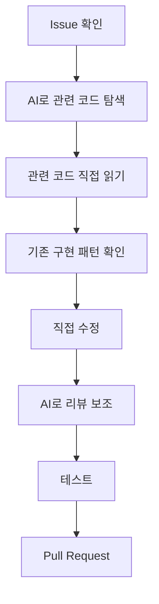
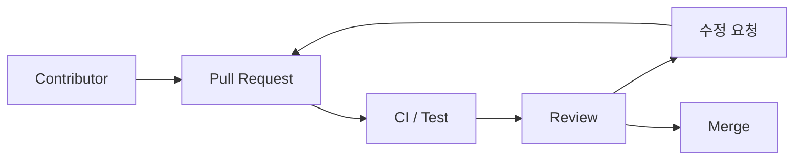
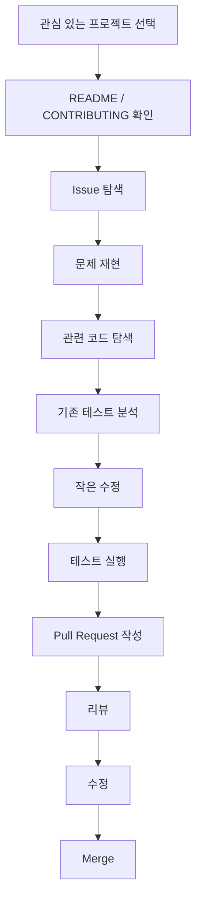

# 안톨리니의 오픈소스 기여, 어떻게 시작해야 할까?
[https://youtu.be/eOqXQqg0_Dw?si=DOM6ZLMOeioqfRwZ](https://youtu.be/eOqXQqg0_Dw?si=DOM6ZLMOeioqfRwZ)

# 안톨리니의 오픈소스 기여, 어떻게 시작해야 할까?
* toc
{:toc}

---

## 오픈소스 기여, 어떻게 시작해야 할까?

오픈소스 기여라고 하면 처음부터 상당히 높은 수준의 개발 실력이 필요하다고 생각하기 쉽다. 수십만 줄의 코드, 수많은 테스트, 영어로 이루어진 이슈와 코드 리뷰, 유명 개발자들이 참여하는 프로젝트를 보면 쉽게 접근하기 어렵다는 생각이 든다.

특히 다음과 같은 고민이 대표적인 진입 장벽으로 작용한다.

* 영어로 의사소통해야 하는데 괜찮을까?
* 거대한 코드베이스를 내가 이해할 수 있을까?
* 아직 실력이 부족한데 PR을 올려도 될까?
* 내가 수정한 코드 때문에 실제 장애가 발생하면 어떻게 하지?
* 어디서부터 코드를 읽어야 할지 모르겠다.

하지만 오픈소스 기여의 핵심은 **프로젝트 전체를 이해한 뒤 완벽한 코드를 작성하는 것**이 아니다.

오픈소스는 여러 사람이 조금씩 부족한 부분을 채워가며 만들어가는 협업 구조에 가깝다. 처음부터 프로젝트 전체를 이해할 필요도 없으며, 아주 작은 버그 수정이나 문서 개선부터 시작할 수도 있다.

최근에는 AI를 코드 생성기가 아니라 **코드베이스를 탐색하고 학습하는 도구**로 활용하면서 초기 진입 장벽도 크게 낮출 수 있다.

결국 중요한 것은 다음과 같다.

> 오픈소스 기여를 시작하기 위해 모든 것을 알아야 하는 것이 아니라, 하나의 작은 문제를 이해하고 해결하는 과정부터 시작하면 된다.

---

## 오픈소스 기여란 무엇인가?

오픈소스 프로젝트는 소스코드가 공개되어 있고 여러 개발자가 함께 개선해 나가는 프로젝트다.

단순히 코드를 수정해서 Pull Request를 보내는 것만이 기여는 아니다.

오픈소스에서의 기여는 상당히 다양한 형태로 이루어진다.

```text
버그 수정
기능 추가
테스트 코드 작성
문서 개선
오타 수정
성능 개선
리팩터링
Issue 분석
재현 코드 작성
보안 문제 보고
번역
코드 리뷰
```

따라서 처음부터 복잡한 핵심 기능을 구현할 필요는 없다.

프로젝트에서 부족한 부분을 발견하고 그것을 개선하는 모든 과정이 기여가 될 수 있다.

---

## 왜 오픈소스 기여가 어렵게 느껴질까?

오픈소스 프로젝트에 처음 들어가면 일반적인 회사 프로젝트보다 훨씬 어렵게 느껴질 수 있다.

가장 큰 이유 중 하나는 **코드베이스 규모**다.

예를 들어 Django 같은 대형 프레임워크는 수십만 줄의 코드와 수많은 테스트를 가지고 있다.

처음 프로젝트를 열면 다음과 같은 질문부터 생긴다.

```text
이 기능은 어디에 구현되어 있지?

Controller 같은 진입점은 어디지?

이 로직과 연결된 코드는 무엇이지?

테스트는 어느 디렉터리에 작성해야 하지?

기존에 비슷한 구현이 있나?

수정하면 영향을 받는 기능은 무엇이지?
```

일반적으로 우리가 직접 개발한 프로젝트라면 구조를 알고 있기 때문에 이러한 질문에 답하기 쉽다.

하지만 오픈소스에서는 처음 보는 수십만 줄의 코드 안에서 진입점을 찾아야 한다.

그래서 실제 구현보다 **어디를 수정해야 하는지 찾는 시간이 더 오래 걸릴 수 있다.**

---

## 코드베이스를 전부 이해할 필요는 없다

초보자가 가장 많이 하는 실수 중 하나는 프로젝트 전체 구조부터 이해하려는 것이다.

예를 들어 수십만 줄의 프로젝트를 다음과 같이 접근한다고 생각해보자.

```text
전체 프로젝트 구조 이해
        ↓
모든 패키지 확인
        ↓
핵심 객체 분석
        ↓
테스트 구조 분석
        ↓
Issue 분석
        ↓
코드 수정
```

이 방법은 상당히 많은 시간이 걸린다.

실제로 특정 이슈를 해결하기 위해 프로젝트 전체를 이해할 필요는 없다.

더 현실적인 접근은 반대다.

```text
Issue 확인
        ↓
관련 기능 찾기
        ↓
관련 코드만 읽기
        ↓
기존 테스트 찾기
        ↓
수정
        ↓
테스트
```

즉 **Problem-Driven 방식으로 코드베이스를 탐색하는 것**이다.

---

## AI를 코드베이스 탐색 도구로 활용하기

최근에는 오픈소스 기여에서 AI를 상당히 유용하게 활용할 수 있다.

가장 효과적인 활용 방법 중 하나가 **코드베이스의 진입점을 찾는 것**이다.

예를 들어 특정 프레임워크에 `CSP Middleware`라는 기능이 있다고 하자.

과거에는 다음 과정을 직접 수행했을 수 있다.

```text
검색
→ 관련 클래스 발견
→ 호출 지점 탐색
→ 관련 설정 탐색
→ 테스트 위치 탐색
→ 문서 탐색
```

하지만 AI에게 다음과 같이 질문할 수 있다.

```text
이 프로젝트에서 CSP Middleware가
어디에서 구현되어 있는지 찾아줘.

관련 클래스와 함수,
설정 파일,
테스트 코드 위치를 함께 설명해줘.

그리고 요청이 들어왔을 때
어떤 흐름으로 실행되는지도 설명해줘.
```

그러면 탐색해야 할 범위를 빠르게 좁힐 수 있다.

중요한 것은 AI가 **정답을 대신 작성하는 것보다 탐색 범위를 줄이는 역할**을 하도록 사용하는 것이다.

---

## AI에게 프로젝트 전체를 맡기면 안 되는 이유

AI를 사용하면 다음과 같은 생각을 할 수 있다.

> 어차피 AI가 코드를 만들어줄 수 있다면 그냥 Issue를 그대로 해결해 달라고 하면 되는 것 아닌가?

가능할 수는 있지만 문제도 발생한다.

AI는 현재 프로젝트에서 이미 제공하고 있는 기능을 모르고 비슷한 기능을 새로 구현할 수 있다.

예를 들어 프로젝트 내부에 이미 다음과 같은 유틸리티가 있다고 하자.

```java
public final class PathResolver {

    public static Path resolve(Path base, String target) {
        // 기존 구현
    }
}
```

그런데 코드베이스를 충분히 이해하지 않은 AI가 새로운 함수를 만들어버릴 수 있다.

```java
private Path createResolvedPath(
        Path base,
        String target
) {
    // 사실 기존 PathResolver와 동일한 기능
}
```

기능은 동작할 수 있지만 프로젝트 설계 측면에서는 좋지 않은 코드가 된다.

또 다른 문제는 존재하지 않는 API나 문법을 만들어내는 것이다.

```text
AI가 제안한 코드

→ 컴파일되지 않음

→ 프로젝트에는 존재하지 않는 API 사용

→ 기존 컨벤션과 다름

→ 테스트 구조를 무시

→ 프로젝트 내부 추상화를 재사용하지 않음
```

따라서 AI가 생성한 결과를 검증하지 않고 바로 Pull Request로 제출하면 메인테이너의 검토 비용만 증가시킬 수 있다.

---

## AI는 코드 생성기보다 학습 도구로 활용한다

오픈소스 기여에서 AI의 좋은 활용 방향은 다음과 같다.

```text
AI
├── 코드베이스 진입점 탐색
├── 관련 파일 검색
├── 호출 관계 설명
├── 테스트 위치 탐색
├── 기존 패턴 설명
├── Issue 내용 해석
└── 영어 문장 정리
```

반면 다음과 같은 방식은 주의해야 한다.

```text
Issue 전체 전달
        ↓
AI가 코드 생성
        ↓
내용 확인하지 않음
        ↓
바로 PR 제출
```

더 좋은 과정은 다음과 같다.



AI가 개발자를 대신하는 것이 아니라, **이해 속도를 높이는 도구**가 되는 구조다.

---

## 영어를 잘해야 오픈소스를 할 수 있을까?

오픈소스 프로젝트 대부분은 영어를 사용한다.

Issue도 영어이고, Pull Request도 영어이며, 리뷰도 영어로 이루어지는 경우가 많다.

그래서 영어에 대한 부담이 상당히 크다.

하지만 오픈소스에서 필요한 영어는 반드시 유창한 회화 능력이 아니다.

대부분의 의사소통은 비교적 구조화되어 있다.

예를 들어 Issue라면 다음 정도가 핵심이다.

```text
무슨 문제가 발생했는가?

어떻게 재현할 수 있는가?

어떤 결과를 기대했는가?

실제 결과는 무엇인가?
```

Pull Request도 비슷하다.

```text
무엇을 수정했는가?

왜 수정했는가?

어떻게 수정했는가?

어떤 테스트를 추가했는가?
```

따라서 작성하고 싶은 내용을 먼저 자신이 편한 언어로 정리한 뒤 AI를 통해 자연스러운 영어로 다듬는 방법도 충분히 활용할 수 있다.

---

## 오픈소스 기여에서 가장 큰 장벽은 심리적 부담이다

기술적인 문제보다 오히려 다음과 같은 생각이 더 큰 장벽일 수 있다.

```text
내가 여기에 기여할 실력이 되나?

이런 코드 올렸다가 이상하게 보이면 어떡하지?

리뷰에서 지적받으면 어떡하지?

내 코드 때문에 문제가 생기면 어떡하지?
```

하지만 Pull Request는 곧바로 운영 코드에 반영되는 구조가 아니다.

일반적으로 다음과 같은 과정을 거친다.



즉 제출자는 코드를 제안하는 사람이고, 최종적으로 병합 여부를 결정하는 것은 메인테이너와 리뷰어다.

잘못된 코드가 있다면 리뷰 과정에서 수정하면 된다.

---

## 실수도 오픈소스 기여의 일부다

기여한 코드가 Merge되었다고 해서 항상 완벽한 것은 아니다.

이후 새로운 문제가 발견될 수도 있다.

```text
Pull Request Merge
        ↓
새로운 Edge Case 발견
        ↓
Issue 발생
        ↓
추가 수정
```

이 과정 자체도 소프트웨어 개발이다.

오히려 자신이 작성한 코드에서 문제가 발생하면 다음과 같은 경험을 얻게 된다.

```text
왜 기존 리뷰에서 발견하지 못했는가?

어떤 테스트가 부족했는가?

Edge Case를 어떻게 찾을 것인가?

변경 영향 범위를 어떻게 확인할 것인가?

다음부터 어떤 부분을 더 점검해야 하는가?
```

실수하지 않는 개발자가 되는 것보다 **실수를 통해 검증 능력을 높이는 개발자가 되는 것**이 현실적으로 더 중요하다.

---

## 오픈소스 프로젝트는 어떻게 고를까?

처음부터 프로젝트 선택을 잘하는 것도 중요하다.

유명하다는 이유 하나만으로 프로젝트를 선택하면 첫 기여까지 오랜 시간이 걸릴 수 있다.

프로젝트를 선택할 때는 다음 요소를 확인하는 것이 좋다.

| 기준                 | 확인할 내용                  |
| ------------------ | ----------------------- |
| Issue 수            | 해결할 문제가 충분한가            |
| 최근 Commit          | 프로젝트가 활발하게 유지되고 있는가     |
| 외부 Contributor     | 일반 기여자의 참여가 활발한가        |
| Contribution Guide | 기여 절차가 잘 정리되어 있는가       |
| Feature Freeze     | 기능 개발이 중단된 프로젝트인가       |
| 관심도                | 내가 실제로 좋아하고 사용하는 프로젝트인가 |

하나씩 살펴보자.

---

## 이슈가 많은 프로젝트가 시작하기 좋다

GitHub의 Issues 탭은 프로젝트가 가지고 있는 문제와 개선 요청을 확인할 수 있는 공간이다.

Issue가 충분히 있다는 것은 신규 기여자가 선택할 수 있는 문제도 많다는 의미가 된다.

반대로 Issue가 거의 없는 프로젝트에서는 초보자가 직접 문제를 발견해야 한다.

```text
Issue가 많은 프로젝트

Issue 선택
→ 문제 분석
→ 코드 수정


Issue가 거의 없는 프로젝트

코드베이스 분석
→ 문제점 발견
→ 문제 타당성 검증
→ Issue 제안
→ 코드 수정
```

후자가 더 어렵다.

따라서 첫 오픈소스 기여라면 이미 해결할 문제가 명확하게 정의된 프로젝트가 접근하기 좋다.

---

## good first issue만 찾을 필요는 없다

처음 기여할 때 흔히 `good first issue` 라벨부터 찾는다.

물론 좋은 방법이다.

```text
good first issue
help wanted
beginner
documentation
bug
```

같은 라벨을 살펴볼 수 있다.

하지만 반드시 `good first issue`만 고집할 필요는 없다.

단순한 버그나 테스트 부족 Issue 중에서도 충분히 시작하기 좋은 문제가 존재할 수 있다.

특히 Issue 설명을 읽었을 때 다음 질문에 답할 수 있다면 후보가 될 수 있다.

```text
문제가 무엇인지 이해할 수 있는가?

재현할 수 있는가?

어떤 결과가 정상인지 알 수 있는가?

수정 범위를 어느 정도 예상할 수 있는가?
```

---

## 최근 커밋이 많은지 반드시 확인한다

Issue가 많다고 무조건 좋은 프로젝트는 아니다.

Issue가 수백 개 있어도 프로젝트가 사실상 유지보수되지 않는 상태일 수 있다.

따라서 다음 정보를 함께 확인해야 한다.

```text
최근 Commit 날짜
최근 Release 날짜
Pull Request 처리 속도
Issue 답변 속도
Maintainer 활동
```

예를 들어 마지막 Commit이 몇 년 전이라면 Pull Request를 올려도 오랫동안 확인되지 않을 수 있다.

Issue 수보다 **프로젝트의 생명력**을 먼저 보는 것이 중요하다.

---

## Pull Request가 실제로 처리되고 있는지 확인한다

Commit만 보는 것보다 더 좋은 방법은 Pull Request 탭을 살펴보는 것이다.

다음과 같은 상태를 확인할 수 있다.

```text
최근 PR이 Merge되고 있는가?

외부 Contributor PR에 리뷰가 달리는가?

리뷰 요청 후 응답이 얼마나 빠른가?

오래 방치된 PR이 지나치게 많지 않은가?
```

예를 들어 Pull Request 수백 개가 몇 년씩 쌓여 있다면 기여자 입장에서는 좋은 환경이 아닐 수 있다.

반대로 일반 개발자의 PR에도 친절한 리뷰가 지속적으로 달리고 있다면 처음 참여하기 좋은 프로젝트일 가능성이 높다.

---

## 일반 기여자가 많은 프로젝트가 좋은 이유

프로젝트의 최근 Commit과 PR 작성자를 보면 메인테이너뿐 아니라 외부 기여자가 얼마나 참여하고 있는지 확인할 수 있다.

외부 기여자가 많다는 것은 중요한 신호다.

```text
외부 Contributor가 많다
        ↓
기여 프로세스가 정리되어 있을 가능성이 높다
        ↓
신규 기여자를 받아들이는 문화가 있다
        ↓
첫 기여 진입 장벽이 낮아진다
```

특히 규모가 큰 프로젝트라고 해서 반드시 기여가 어려운 것은 아니다.

오히려 큰 프로젝트일수록 다음과 같은 시스템을 잘 갖추고 있을 수 있다.

```text
CONTRIBUTING.md
Code Style Guide
Issue Template
PR Template
CI
자동 테스트
Contributor Guide
Discussion
Maintainer Process
```

잘 관리되는 대형 프로젝트는 처음 기여하는 사람이 따라야 할 길이 명확하다.

---

## CONTRIBUTING.md부터 읽어야 한다

오픈소스 프로젝트를 선택했다면 코드를 수정하기 전에 `CONTRIBUTING.md`부터 확인하는 것이 좋다.

일반적으로 다음 내용이 들어 있다.

```text
개발 환경 설정

테스트 실행 방법

코드 스타일

Commit 규칙

Pull Request 작성 방법

Issue 작성 방법

Branch 정책

Documentation 작성 방법
```

예를 들어 테스트 명령이 다음처럼 정의되어 있을 수 있다.

```bash
./gradlew test
```

실행 결과는 프로젝트의 전체 테스트를 수행하며, 수정으로 인해 기존 기능이 깨지지 않았는지 확인하는 용도로 사용한다.

Python 프로젝트라면 다음과 같은 명령일 수도 있다.

```bash
python -m pytest
```

중요한 것은 자신이 익숙한 방식으로 프로젝트를 실행하는 것이 아니라 **해당 프로젝트가 정한 개발 방식을 따르는 것**이다.

---

## Feature Freeze 프로젝트는 무엇인가?

Feature Freeze는 새로운 기능 추가를 적극적으로 받지 않는 상태를 의미한다.

프로젝트가 안정화 단계에 들어가거나 유지보수 위주로 전환되면 이런 정책을 사용할 수 있다.

Feature Freeze 상태에서는 보통 다음 변경만 제한적으로 이루어진다.

```text
중요 버그 수정
보안 취약점 수정
의존성 업데이트
호환성 수정
릴리즈 유지보수
```

새로운 기능을 제안해도 설계가 아무리 좋아도 받아들여지지 않을 수 있다.

따라서 새로운 기능 기여를 목표로 한다면 Feature Freeze 상태인지 먼저 확인해야 한다.

---

## 프로젝트가 Feature Freeze인지 어떻게 확인할까?

다음 위치를 살펴보면 된다.

```text
README
CONTRIBUTING.md
Project Documentation
GitHub Discussions
Issue Template
Maintainer 공지
Release 정책
```

Issue에서 메인테이너가 반복적으로 다음과 같은 답변을 남기는 경우도 신호다.

```text
현재 새로운 기능을 받지 않습니다.

Maintenance mode입니다.

Bug fix만 받습니다.

새 기능은 다음 Major 버전에서 검토합니다.
```

기여하기 전에 프로젝트가 어떤 방향으로 운영되는지를 파악해야 불필요한 작업을 줄일 수 있다.

---

## 가장 중요한 기준은 내가 좋아하는 프로젝트인가이다

활성도, Issue 수, Contributor 수보다 더 중요한 기준이 하나 있다.

**내가 그 프로젝트에 관심이 있는가?**

오픈소스 기여는 한 번의 코딩 테스트처럼 끝나는 활동이 아니다.

Issue를 읽고 코드를 분석하고 테스트하고 리뷰를 받고 다시 수정하는 과정이 반복된다.

관심 없는 프로젝트라면 금방 지칠 가능성이 높다.

반대로 자신이 실제로 사용하는 라이브러리라면 자연스럽게 다음 행동이 나온다.

```text
이 기능은 왜 이렇게 동작하지?

여기 API가 조금 불편한데?

이 Edge Case는 처리되지 않는 것 같은데?

문서에 이 부분이 빠진 것 같은데?

테스트에 이 상황이 없네?
```

이러한 작은 의문이 곧 Issue가 되고 기여로 이어진다.

---

## 처음 기여할 프로젝트를 선택하는 기준

처음 시작한다면 다음 조합이 가장 좋다.

```text
내가 사용하는 프로젝트
+
최근에도 활발하게 개발 중
+
Issue가 충분함
+
외부 Contributor가 많음
+
Contribution Guide가 잘 되어 있음
```

반대로 다음 조합은 처음에는 난이도가 높을 수 있다.

```text
처음 보는 기술
+
Issue 거의 없음
+
최근 Commit 없음
+
Maintainer 활동 적음
+
Contribution Guide 없음
```

프로젝트 난이도보다 **기여 환경의 성숙도**가 더 중요할 수 있다.

---

## 오픈소스 기여를 실제로 시작하는 순서

처음 기여한다면 다음과 같은 흐름으로 진행할 수 있다.



여기서 가장 중요한 단계 중 하나가 **문제 재현**이다.

---

## 코드를 고치기 전에 먼저 문제를 재현한다

Issue를 발견하자마자 코드를 수정하는 것보다 먼저 현재 문제가 실제로 발생하는지 확인해야 한다.

예를 들어 특정 입력에서 오류가 발생한다면 테스트로 재현한다.

```java
@Test
void invalid_input_causes_exception() {
    assertThatThrownBy(() -> service.execute("invalid"))
            .isInstanceOf(IllegalArgumentException.class);
}
```

수정 전에는 실패해야 한다.

```text
FAILED
```

그리고 구현을 수정한다.

다시 테스트한다.

```text
PASSED
```

이 과정을 거치면 PR의 신뢰도가 크게 높아진다.

---

## 기존 테스트의 스타일을 먼저 확인한다

오픈소스에서는 자신이 좋아하는 방식으로 테스트를 작성하는 것보다 기존 프로젝트의 패턴을 따르는 것이 중요하다.

예를 들어 프로젝트 테스트가 다음처럼 작성되어 있다면,

```java
@Test
void should_return_default_value_when_empty() {
    // given
    // when
    // then
}
```

자신도 같은 스타일을 유지하는 것이 좋다.

테스트 위치도 기존 구조를 참고한다.

```text
src
└── main
    └── ...

src
└── test
    └── ...
```

비슷한 기능의 테스트를 찾아보면 거의 항상 좋은 힌트를 얻을 수 있다.

---

## AI에게 좋은 질문을 하는 방법

AI에게 다음처럼 단순하게 질문할 수도 있다.

```text
이거 고쳐줘.
```

하지만 오픈소스 학습에는 좋지 않다.

대신 다음과 같은 방식이 유용하다.

```text
이 Issue와 관련된 코드의 진입점을 찾아줘.

수정하지 말고 먼저
관련 클래스와 함수의 호출 관계를 설명해줘.

기존 코드베이스에서
유사한 기능이 구현된 위치도 찾아줘.

관련 테스트 파일과
테스트 작성 패턴을 설명해줘.

이번 변경으로 영향을 받을 수 있는
영역을 정리해줘.
```

이렇게 사용하면 AI는 구현자가 아니라 **코드베이스 가이드** 역할을 한다.

---

## Pull Request는 작게 만드는 것이 좋다

처음 기여할 때 특히 중요한 원칙은 변경 범위를 작게 유지하는 것이다.

좋은 PR은 대개 다음처럼 명확하다.

```text
문제 하나
+
해결 하나
+
관련 테스트
```

반대로 하나의 PR에서 다음을 모두 처리하면 리뷰가 어려워진다.

```text
버그 수정
+
리팩터링
+
파일 구조 변경
+
Naming 변경
+
새 기능
+
Formatting 변경
```

메인테이너 입장에서 가장 검토하기 좋은 PR은 의도가 명확한 PR이다.

---

## 좋은 Pull Request 설명

PR에서는 무엇을 바꿨는지만 적는 것보다 왜 바꿨는지 설명하는 것이 중요하다.

예를 들어 다음 구조가 유용하다.

```text
Problem

특정 조건에서 A가 B로 처리되고 있습니다.


Cause

C 로직에서 D 조건을 확인하지 않고 있습니다.


Solution

D 조건을 추가하여 B 대신 E를 반환하도록 변경했습니다.


Test

해당 상황을 재현하는 테스트를 추가했습니다.
```

코드를 읽지 않아도 변경 목적을 이해할 수 있어야 한다.

---

## 메인테이너에게 직접 질문해도 된다

Issue가 명확하지 않거나 프로젝트에 꼭 기여하고 싶은데 적절한 문제가 없다면 메인테이너에게 질문할 수도 있다.

예를 들어 다음처럼 접근할 수 있다.

```text
이 프로젝트를 실제로 사용하고 있으며
기여에도 관심이 있습니다.

처음 기여자가 살펴보기 좋은 Issue나
도움이 필요한 영역이 있을까요?
```

오픈소스는 혼자 문제를 풀어야 하는 시험이 아니다.

질문 역시 협업 과정의 일부다.

---

## 오픈소스 기여에서 얻을 수 있는 진짜 경험

오픈소스의 가장 큰 장점 중 하나는 단순히 GitHub Contribution 그래프를 채우는 것이 아니다.

자신이 작성하지 않은 코드베이스를 이해하는 경험을 얻을 수 있다.

실무에서도 개발자는 대부분 기존 시스템에 들어간다.

```text
신규 입사
        ↓
처음 보는 프로젝트
        ↓
처음 보는 코드
        ↓
기존 설계 이해
        ↓
작은 변경
        ↓
리뷰
```

오픈소스 기여 과정과 상당히 비슷하다.

특히 다음 능력을 훈련할 수 있다.

```text
대규모 코드 탐색

기존 설계 의도 파악

변경 영향 범위 분석

테스트 작성

코드 리뷰 대응

기술적 의사소통

문제 재현

기존 코드 스타일 준수
```

단순 구현 능력과는 다른 종류의 개발 역량이다.

---

## 오픈소스에서 중요한 것은 새로운 코드를 많이 작성하는 것이 아니다

좋은 기여는 반드시 코드량이 많을 필요가 없다.

오히려 다음과 같은 작은 변경이 좋은 기여가 될 수 있다.

```text
조건문 한 줄 수정

잘못된 예외 타입 수정

테스트 하나 추가

문서 한 문장 수정

Edge Case 하나 보완

불필요한 연산 제거
```

중요한 것은 코드량이 아니라 **프로젝트가 실제로 가지고 있는 문제를 해결했는가**이다.

---

## 실무에서의 활용

오픈소스 기여에서 익히는 코드베이스 탐색 방법은 회사에서도 그대로 사용할 수 있다.

예를 들어 처음 보는 결제 시스템에서 장애가 발생했다고 가정해보자.

모든 코드를 읽을 필요는 없다.

```text
장애 API 확인
        ↓
Controller 진입점
        ↓
Service
        ↓
Repository
        ↓
외부 API
        ↓
관련 테스트
```

오픈소스에서 Issue를 중심으로 관련 코드만 추적했던 방식과 동일하다.

또 AI를 사용할 때도 마찬가지다.

```text
"이 프로젝트 설명해줘"
```

보다

```text
"결제 승인 요청이 들어온 뒤
PG사 요청이 발생하기까지의 호출 경로를 추적해줘.

관련 클래스와 메서드를 순서대로 설명하고
실패 시 예외 처리 경로도 찾아줘."
```

처럼 질문하는 것이 훨씬 유용하다.

---

## AI 시대의 오픈소스 기여에서 중요한 능력

앞으로는 단순한 코드 작성 속도보다 다음 능력이 더 중요해질 가능성이 크다.

```text
AI가 만든 코드를 검증하는 능력

기존 코드베이스를 이해하는 능력

프로젝트 컨벤션을 파악하는 능력

적절한 변경 범위를 정하는 능력

테스트로 안전성을 증명하는 능력
```

AI가 Pull Request를 만들어주는 것은 어렵지 않다.

하지만 다음 질문에 답하는 것은 여전히 개발자의 역할이다.

```text
이 코드가 정말 필요한가?

기존 기능을 재사용할 수 없는가?

프로젝트 설계 철학과 맞는가?

Edge Case가 없는가?

기존 동작을 깨뜨리지 않는가?

테스트가 충분한가?
```

오픈소스 기여는 이러한 검증 능력을 연습하기 좋은 환경이기도 하다.

---

## 정리

오픈소스 기여를 시작하기 어렵게 만드는 대표적인 이유는 영어, 거대한 코드베이스, 자신의 실력에 대한 불안, 실수에 대한 부담이다.

하지만 하나씩 나누어 보면 극복 가능한 문제다.

영어는 AI의 도움을 받아 의사소통할 수 있고, 거대한 코드베이스 역시 전체를 이해하는 것이 아니라 Issue를 중심으로 필요한 영역만 탐색하면 된다.

AI를 활용하면 다음과 같은 작업의 비용을 크게 줄일 수도 있다.

```text
코드 진입점 탐색
관련 파일 검색
호출 구조 분석
테스트 위치 탐색
영어 작성 보조
```

다만 AI가 생성한 코드를 검토하지 않은 채 그대로 PR로 제출하는 것은 피해야 한다.

AI는 대신 코드를 작성해 주는 존재라기보다 **코드베이스를 이해하는 속도를 높이는 도구**로 활용하는 것이 좋다.

프로젝트를 선택할 때는 이슈 수 하나만 볼 것이 아니라 프로젝트가 실제로 활발하게 유지되고 있는지도 함께 살펴봐야 한다.

특히 다음 기준이 중요하다.

| 기준          | 좋은 신호                        |
| ----------- | ---------------------------- |
| Issue       | 해결 가능한 Issue가 지속적으로 존재       |
| Commit      | 최근에도 꾸준한 Commit              |
| PR          | 외부 Contributor PR이 실제 Merge됨 |
| Contributor | 일반 기여자 참여가 많음                |
| Guide       | Contribution Guide가 잘 정리됨    |
| 상태          | Feature Freeze가 아님           |
| 관심          | 내가 실제로 좋아하고 사용하는 프로젝트        |

그리고 무엇보다 중요한 것은 처음부터 큰 기여를 하려고 하지 않는 것이다.

```text
작은 Issue 하나 선택
→ 재현
→ 관련 코드 탐색
→ 기존 패턴 이해
→ 작은 수정
→ 테스트
→ PR
→ 리뷰
```

이 사이클을 한 번 경험하는 것이 첫 번째 목표가 될 수 있다.

오픈소스 기여에서 가장 중요한 것은 이미 충분히 잘하는 개발자가 되어 참가하는 것이 아니다.

**다른 사람이 만든 코드를 읽고, 작은 문제 하나를 이해하고, 기존 프로젝트의 방식에 맞게 개선해 나가는 과정 자체가 개발자로서 성장하는 경험이 된다.**

### 한 줄 요약

**오픈소스 기여는 프로젝트 전체를 이해한 뒤 시작하는 것이 아니라, 관심 있는 활발한 프로젝트에서 작은 Issue 하나를 선택하고 AI를 탐색·학습 도구로 활용하며 기존 코드와 테스트를 이해하는 과정에서 시작할 수 있다.**


