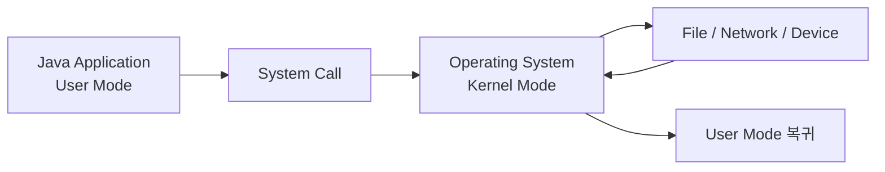
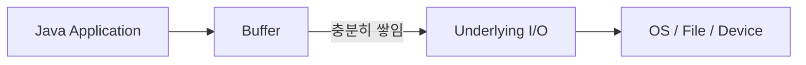
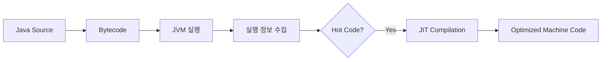
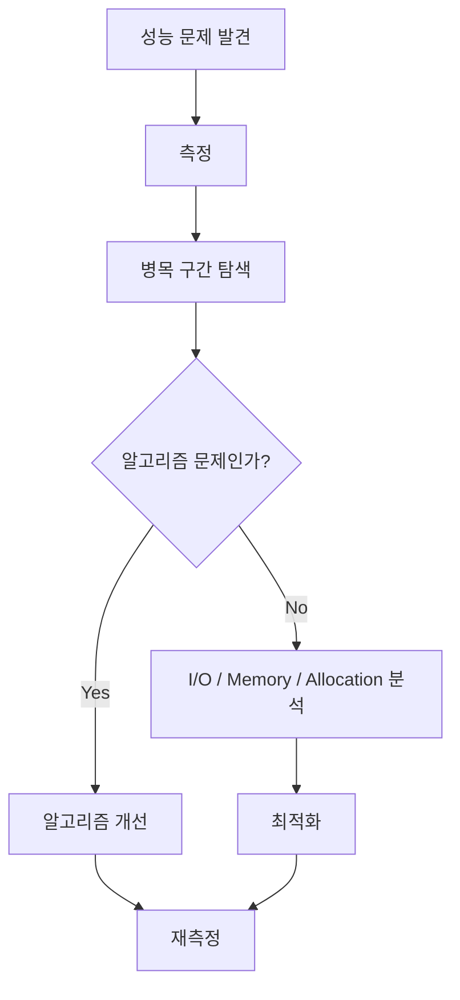
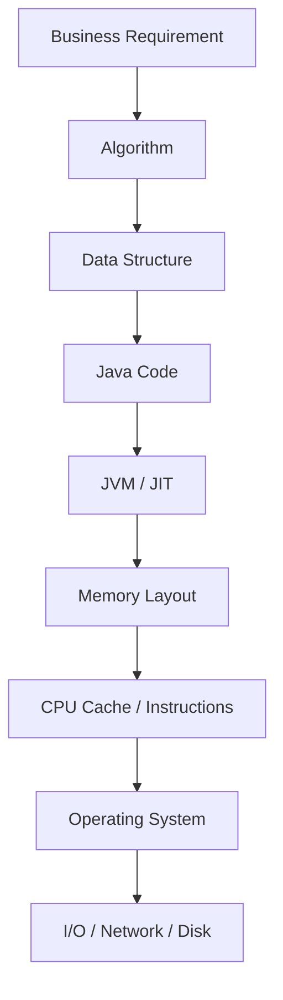
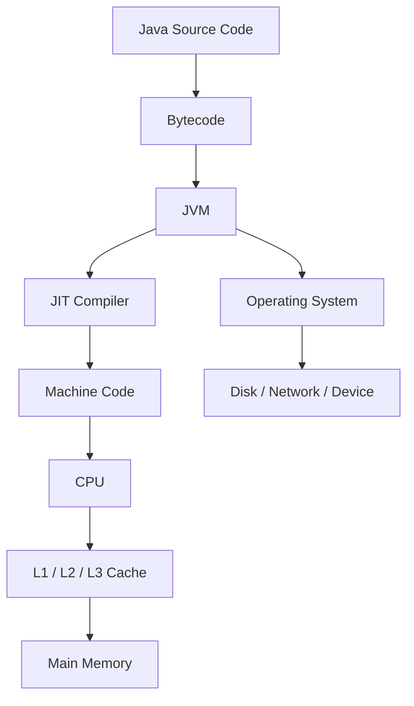

# 무빙의 자바에서 성능을 가르는 선택들 - 시스템 콜, 캐시, SIMD로 보는 자바 성능의 원리
[https://youtu.be/kM-7GdL70t8?si=N9QRN-YxYLwGy6kU](https://youtu.be/kM-7GdL70t8?si=N9QRN-YxYLwGy6kU)

# 무빙의 자바에서 성능을 가르는 선택들 - 시스템 콜, 캐시, SIMD로 보는 자바 성능의 원리
* toc
{:toc}

---

## 자바 성능을 가르는 선택들: 같은 시간 복잡도인데 왜 실행 속도는 다를까?

프로그램의 성능 문제를 이야기할 때 가장 먼저 떠올리는 것은 보통 알고리즘과 시간 복잡도다.

예를 들어 데이터가 `N`개일 때 두 알고리즘이 있다고 가정해보자.

```text
알고리즘 A
→ O(N)

알고리즘 B
→ O(N²)
```

데이터가 커질수록 일반적으로 `O(N)` 알고리즘이 훨씬 유리하다.

따라서 성능 최적화에서 가장 먼저 확인해야 하는 것은 여전히 알고리즘과 자료구조다.

하지만 여기서 한 가지 흥미로운 문제가 생긴다.

```text
둘 다 O(N)인데
왜 실행 시간은 크게 다를까?
```

또는 다음과 같은 경우도 있다.

```text
둘 다 숫자 500만 개를 처리하는데

int[]는 빠르고
Integer[]는 느리다.
```

같은 시간 복잡도라고 해서 실제 실행 시간이 같아지는 것은 아니다.

빅오 표기법은 입력 크기가 증가할 때 연산량이 어떻게 증가하는지를 표현하지만, 각각의 연산이 실제 컴퓨터에서 얼마나 비싼지는 설명하지 않는다.

실제 실행 시간에는 다음과 같은 요소들이 영향을 준다.

```text
알고리즘
자료구조
메모리 배치
CPU 캐시
객체 생성
박싱과 언박싱
분기
시스템 콜
JIT 컴파일
GC
I/O 방식
```

따라서 성능을 제대로 이해하려면 Java 코드만 보는 것이 아니라 다음 흐름까지 생각할 필요가 있다.

```text
Java 코드
→ JVM
→ JIT Compiler
→ 기계어
→ CPU / Memory
→ Operating System
```

이번 글에서는 그중에서도 비교적 쉽게 체감할 수 있는 두 가지 사례를 살펴본다.

```text
입출력
→ Scanner와 BufferedReader

숫자 처리
→ int와 Integer
```

그리고 단순히 “이게 더 빠르다”에서 끝내지 않고 **왜 그런 차이가 발생하는지 JVM과 하드웨어 관점에서 연결해서 살펴본다.**

---

## 성능을 측정할 때 가장 먼저 알아야 하는 것

성능 비교에서 가장 위험한 것은 한 번 실행한 시간을 절대적인 결과로 받아들이는 것이다.

예를 들어 다음과 같이 측정했다고 하자.

```java
long start = System.nanoTime();

doSomething();

long end = System.nanoTime();

System.out.println(end - start);
```

한 번의 결과만으로 다음과 같이 결론 내리면 위험하다.

```text
A = 10ms
B = 15ms

따라서 A가 무조건 1.5배 빠르다.
```

Java에서는 JVM의 특성 때문에 특히 주의해야 한다.

처음 실행한 코드는 아직 충분히 최적화되지 않았을 수 있다.

```text
처음 실행
→ Bytecode 실행
→ 실행 정보 수집
→ Hot Method 발견
→ JIT Compilation
→ 최적화된 Machine Code 실행
```

따라서 성능을 비교하려면 동일한 데이터를 사용하고 여러 번 반복해 측정해야 한다.

간단한 실험에서는 평균값을 비교할 수도 있지만, 실무에서 정교한 Java 마이크로 벤치마크가 필요하다면 **JMH(Java Microbenchmark Harness)**를 사용하는 것이 좋다.

JMH는 다음과 같은 문제들을 줄여준다.

```text
JIT Warm-up
Dead Code Elimination
Constant Folding
반복 실행
측정 오차
JVM 최적화에 의한 왜곡
```

즉 성능 수치는 절대적인 숫자보다는 **어떤 조건에서 어떤 이유로 차이가 발생했는지**를 보는 것이 중요하다.

---

## 입출력이 느린 이유부터 이해해보자

Java 프로그램이 파일이나 표준 입력에서 데이터를 읽는다고 생각해보자.

Java 프로그램이 직접 디스크나 키보드 장치를 제어하는 것은 아니다.

운영체제에게 요청해야 한다.

개념적으로 다음과 같은 흐름이 발생한다.

```text
Java Application
→ JVM
→ Operating System
→ File / Device
```

운영체제에게 특정 작업을 요청하는 인터페이스를 **System Call**, 즉 시스템 콜이라고 한다.

대표적인 작업은 다음과 같다.

```text
파일 읽기
파일 쓰기
네트워크 송수신
프로세스 생성
메모리 매핑
```

---

## User Mode와 Kernel Mode

CPU는 운영체제 보호를 위해 일반 애플리케이션이 실행되는 영역과 운영체제가 중요한 작업을 수행하는 영역을 구분한다.

개념적으로 다음처럼 이해할 수 있다.

```text
User Mode
→ 일반 프로그램 실행

Kernel Mode
→ 운영체제 핵심 기능 실행
```

Java 프로그램은 일반적으로 User Mode에서 실행된다.

파일이나 네트워크 같은 운영체제 자원을 사용하려면 시스템 콜을 통해 Kernel Mode의 서비스를 요청한다.



이러한 경계를 넘는 작업은 일반적인 메모리 연산보다 비용이 크다.

운영체제는 요청을 처리하면서 실행 컨텍스트와 권한 상태 등을 관리해야 하기 때문이다.

따라서 I/O 성능을 최적화할 때 중요한 아이디어 중 하나는 다음과 같다.

> **비싼 I/O 작업을 가능한 한 잘 묶어서 처리한다.**

이때 등장하는 것이 Buffer다.

---

## Buffer란 무엇인가?

Buffer는 데이터를 바로 최종 목적지로 보내지 않고 **일정량을 임시로 저장했다가 묶어서 처리하기 위한 메모리 영역**이다.

예를 들어 문자 하나를 쓸 때마다 실제 출력 작업을 수행한다고 생각해보자.

```text
A 출력
→ I/O

B 출력
→ I/O

C 출력
→ I/O

D 출력
→ I/O
```

반대로 Buffer를 사용하면 다음처럼 처리할 수 있다.

```text
A
B
C
D
↓
Buffer에 저장
↓
한 번에 출력
```

개념적으로 다음과 같다.



I/O 호출의 횟수를 줄이고 데이터를 큰 단위로 처리할 수 있다는 것이 핵심이다.

---

## BufferedReader는 어떻게 동작할까?

`BufferedReader`는 내부에 문자 버퍼를 두고 데이터를 일정량 읽어 놓는다.

```java
BufferedReader reader =
        new BufferedReader(
                new InputStreamReader(System.in)
        );
```

프로그램이 한 글자씩 읽어야 한다고 해서 매번 운영체제로 내려가 한 글자씩 가져오는 구조가 아니다.

개념적으로 다음과 같이 동작한다.

```text
OS / InputStream
        ↓
여러 데이터를 한 번에 읽음
        ↓
BufferedReader 내부 Buffer
        ↓
애플리케이션이 필요한 만큼 소비
```

예를 들어 버퍼에 다음 데이터가 올라왔다고 생각해보자.

```text
[H][e][l][l][o][ ][W][o][r][l][d]...
```

이후 여러 읽기 요청은 버퍼 안에서 처리할 수 있다.

버퍼에 필요한 데이터가 부족해졌을 때 다시 하위 스트림에서 데이터를 채운다.

---

## Scanner가 느린 이유를 단순히 시스템 콜 때문이라고 보면 안 된다

여기서 중요한 보완점이 있다.

`Scanner`가 `BufferedReader`보다 느린 이유를 단순히 다음과 같이 설명하면 정확하지 않다.

```text
Scanner
→ 입력마다 시스템 콜

BufferedReader
→ 버퍼 사용
```

`Scanner` 역시 내부적으로 입력 스트림을 다룰 때 버퍼링을 활용한다.

그럼에도 `Scanner`가 숫자와 토큰 중심의 대량 입력에서 느려지는 큰 이유는 **추가적인 파싱 작업** 때문이다.

예를 들어 다음 코드를 보자.

```java
int number = scanner.nextInt();
```

단순히 문자를 읽는 것만 수행하는 것이 아니다.

개념적으로는 다음과 같은 과정이 포함될 수 있다.

```text
문자 읽기
→ delimiter 확인
→ token 구분
→ 숫자 형식 확인
→ 문자열 해석
→ int 변환
```

`Scanner`는 사용성이 좋은 대신 범용적인 파싱 기능을 제공한다.

```java
scanner.nextInt();
scanner.nextLong();
scanner.nextDouble();
scanner.next();
```

반면 `BufferedReader`는 훨씬 단순하다.

```java
String line = reader.readLine();
```

숫자가 필요하다면 개발자가 직접 변환한다.

```java
int value = Integer.parseInt(reader.readLine());
```

따라서 알고리즘 문제처럼 매우 많은 입력을 빠르게 처리해야 하는 환경에서는 `BufferedReader`가 유리한 경우가 많다.

---

## Scanner와 BufferedReader는 목적이 다르다

둘 중 하나가 무조건 잘못된 도구는 아니다.

### Scanner

다음처럼 간단한 프로그램에서는 매우 편리하다.

```java
Scanner scanner = new Scanner(System.in);

int age = scanner.nextInt();
String name = scanner.next();
double height = scanner.nextDouble();
```

타입 변환을 직접 할 필요가 없다.

장점은 명확하다.

```text
사용하기 쉽다.
코드가 직관적이다.
토큰 단위 입력이 편하다.
타입 변환 기능이 있다.
```

### BufferedReader

대량 입력에서는 다음과 같이 사용할 수 있다.

```java
BufferedReader reader =
        new BufferedReader(
                new InputStreamReader(System.in)
        );

String line = reader.readLine();
```

여러 숫자를 읽는다면 직접 파싱한다.

```java
StringTokenizer tokenizer =
        new StringTokenizer(reader.readLine());

int a = Integer.parseInt(tokenizer.nextToken());
int b = Integer.parseInt(tokenizer.nextToken());
```

작성 코드는 조금 늘어나지만 대량 입력 처리에서는 더 높은 처리량을 얻을 수 있다.

---

## BufferedWriter는 왜 빠를까?

출력도 같은 아이디어가 적용된다.

다음과 같이 반복해서 출력한다고 하자.

```java
for (int i = 0; i < 300_000; i++) {
    System.out.println(i);
}
```

출력은 메모리 계산과 비교하면 상대적으로 매우 비싼 작업이다.

`BufferedWriter`를 사용하면 문자열을 내부 버퍼에 모아두었다가 일정 단위로 하위 출력 스트림에 전달할 수 있다.

```java
BufferedWriter writer =
        new BufferedWriter(
                new OutputStreamWriter(System.out)
        );

for (int i = 0; i < 300_000; i++) {
    writer.write(String.valueOf(i));
    writer.newLine();
}

writer.flush();
```

구조는 다음과 같다.

```text
write()
write()
write()
write()
   ↓
Memory Buffer
   ↓
하위 Stream으로 묶어서 전달
```

---

## flush()는 무엇인가?

Buffer를 사용하면 데이터가 즉시 실제 출력 대상으로 전달되지 않을 수 있다.

다음 코드에서

```java
writer.write("Hello");
```

`Hello`가 Buffer 안에만 존재하고 아직 하위 스트림으로 전달되지 않았을 수도 있다.

이때 `flush()`를 호출한다.

```java
writer.flush();
```

의미는 다음과 같다.

```text
Buffer 안에 남아 있는 데이터
→ 지금 하위 Stream으로 보내라
```

따라서 프로그램이 끝나기 전에 남은 데이터를 반드시 반영해야 하는 상황에서는 `flush()`가 중요하다.

---

## close()와 flush()의 관계

대부분의 Writer는 `close()` 과정에서 남아 있는 데이터를 flush하고 자원을 정리한다.

따라서 일반적인 파일 작업에서는 `try-with-resources`를 사용하는 것이 안전하다.

```java
try (BufferedWriter writer =
             new BufferedWriter(
                     new FileWriter("result.txt")
             )) {

    writer.write("Hello");
}
```

블록을 벗어나면 자동으로 `close()`가 호출된다.

직접 다음처럼 작성할 필요가 줄어든다.

```java
writer.flush();
writer.close();
```

다만 `System.out`처럼 애플리케이션 전체에서 공유되는 스트림은 함부로 닫으면 이후 출력 자체가 불가능해질 수 있으므로 사용 환경을 고려해야 한다.

---

## 버퍼를 사용하면 왜 성능이 좋아지는가?

핵심을 정리하면 다음과 같다.

```text
비싼 I/O 작업을 자주 수행
        ↓
오버헤드 증가


메모리에 데이터를 모음
        ↓
큰 단위로 I/O 수행
        ↓
호출 횟수와 처리 오버헤드 감소
```

이 원리는 Java에만 적용되는 것이 아니다.

백엔드 개발에서도 매우 자주 등장한다.

```text
DB Batch Insert
Network Buffer
Buffered I/O
Kafka Batch
Bulk API
Log Buffer
```

예를 들어 데이터베이스에 10만 건을 저장할 때 다음 방식보다

```text
INSERT
INSERT
INSERT
...
100,000번
```

Batch로 묶는 것이 일반적으로 유리하다.

```text
1,000개씩 묶음
→ Batch Insert
→ 100번
```

결국 공통된 아이디어는 **비싼 경계를 통과하는 횟수를 줄이는 것**이다.

---

## 원시 타입과 객체 타입은 왜 성능이 다를까?

이번에는 메모리와 CPU 관점에서 살펴보자.

Java에는 원시 타입과 Wrapper 타입이 존재한다.

대표적으로 다음과 같다.

| Primitive | Wrapper     |
| --------- | ----------- |
| `int`     | `Integer`   |
| `long`    | `Long`      |
| `double`  | `Double`    |
| `boolean` | `Boolean`   |
| `char`    | `Character` |

예를 들어 다음 두 배열을 비교해보자.

```java
int[] primitiveArray;
```

```java
Integer[] wrapperArray;
```

두 배열 모두 숫자를 저장한다.

하지만 메모리 구조는 상당히 다르다.

---

## int[]는 값을 직접 저장한다

`int`는 32비트, 즉 4바이트의 원시 타입이다.

```java
int[] numbers = {
        10,
        20,
        30,
        40
};
```

개념적으로 배열 내부에는 값이 연속적으로 저장된다.

```text
int[]

[10][20][30][40][50][60]...
```

즉 배열 위치를 알면 특정 값의 메모리 위치를 계산하기 쉽다.

```text
array base
+
index × 4 bytes
```

연속된 데이터를 순차적으로 처리하는 CPU에게 매우 유리한 구조다.

---

## Integer[]는 객체 참조를 저장한다

`Integer[]`는 다르다.

```java
Integer[] numbers = {
        10,
        20,
        30,
        40
};
```

배열 안에는 일반적으로 `Integer` 객체 자체가 들어있는 것이 아니라 **객체에 대한 참조**가 저장된다.

개념적으로 다음과 같다.

```text
Integer[]

[ref A][ref B][ref C][ref D]
   ↓      ↓      ↓      ↓
 Integer Integer Integer Integer
 Object  Object  Object  Object
```

즉 값을 가져오려면 다음 과정이 필요하다.

```text
배열 접근
→ 객체 참조 읽기
→ 참조가 가리키는 객체 접근
→ Integer 내부 int 값 사용
```

이를 Pointer Chasing 또는 간접 참조 비용과 연결해서 이해할 수 있다.

---

## Integer가 연결 리스트처럼 next 포인터를 가지는 것은 아니다

여기서 하나 정확히 구분해야 할 부분이 있다.

`Integer` 객체가 다음 `Integer`를 가리키는 `next` 포인터를 가지고 있는 것은 아니다.

다음과 같은 구조가 아니다.

```text
Integer1
  ↓ next
Integer2
  ↓ next
Integer3
```

그것은 LinkedList와 같은 연결 자료구조의 개념에 가깝다.

`Integer[]`는 다음과 같이 이해하는 편이 정확하다.

```text
배열 영역

[ref1][ref2][ref3][ref4]
   │     │     │     │
   ▼     ▼     ▼     ▼
 Obj1  Obj2  Obj3  Obj4
```

참조 배열은 연속적일 수 있지만, 참조가 가리키는 객체들은 별도의 Heap 객체이기 때문에 값 자체가 `int[]`처럼 한 덩어리로 붙어 있다는 보장이 없다.

이 차이가 CPU 캐시 활용에 영향을 줄 수 있다.

---

## CPU 캐시가 필요한 이유

CPU는 매우 빠르지만 메인 메모리는 CPU에 비해 상대적으로 느리다.

단순화하면 다음과 같은 계층 구조가 존재한다.

```text
CPU Register
↓
L1 Cache
↓
L2 Cache
↓
L3 Cache
↓
Main Memory
↓
Storage
```

위에 있을수록 일반적으로 빠르고 용량은 작다.

따라서 CPU는 필요한 데이터를 RAM에서 매번 직접 가져오는 대신 자주 사용할 것으로 예상되는 데이터를 Cache에 저장한다.

---

## Cache Line이란 무엇인가?

CPU는 메모리에서 데이터를 가져올 때 정확히 필요한 몇 바이트만 가져오지 않는다.

주변 데이터를 일정 크기의 블록 단위로 가져온다.

이를 **Cache Line**이라고 한다.

많은 CPU에서 흔히 64바이트 단위를 볼 수 있지만 정확한 크기는 아키텍처에 따라 다를 수 있다.

예를 들어 캐시 라인이 64바이트라고 가정해보자.

`int` 하나는 4바이트다.

따라서 이론적으로 하나의 64바이트 캐시 라인에 다음 정도의 `int` 값이 들어갈 수 있다.

```text
64 / 4
= 16개
```

다음 배열을 순차적으로 접근한다고 생각해보자.

```text
[1][2][3][4][5]...[16][17]...
```

첫 번째 값을 읽으면서 주변 값들도 같은 캐시 라인에 들어온다.

```text
Cache Line

[1][2][3][4]...[16]
```

이후 값들이 이미 캐시에 존재한다면 CPU가 RAM까지 가지 않아도 된다.

이를 **Cache Hit**라고 한다.

---

## 공간 지역성

이러한 현상을 이해하는 핵심 개념 중 하나가 **Spatial Locality**, 공간 지역성이다.

프로그램이 특정 메모리 위치를 사용했다면 근처 위치도 곧 사용할 가능성이 높다는 성질이다.

배열 순회가 대표적인 예다.

```java
for (int value : numbers) {
    sum += value;
}
```

메모리 접근 순서는 다음과 같다.

```text
0
→ 1
→ 2
→ 3
→ 4
...
```

연속적인 데이터 접근은 CPU Cache와 Hardware Prefetcher가 처리하기 좋은 패턴이다.

---

## int[]가 Cache에 유리한 이유

`int[]`에서는 실제 값들이 연속적으로 저장된다.

```text
int[]

[10][20][30][40][50][60]...
```

CPU가 앞쪽 데이터를 읽으면 뒤쪽 값들도 함께 캐시에 올라올 가능성이 높다.

따라서 순차 합산처럼 다음 작업에서 유리하다.

```java
long sum = 0;

for (int number : numbers) {
    sum += number;
}
```

메모리 접근 패턴이 매우 단순하기 때문이다.

---

## Integer[]는 왜 더 불리할 수 있을까?

`Integer[]`에서는 먼저 참조를 가져와야 한다.

```text
Integer[]

[ref1][ref2][ref3][ref4]
```

그리고 실제 값을 얻기 위해 객체에 접근해야 한다.

```text
ref1 → Integer Object
ref2 → Integer Object
ref3 → Integer Object
```

객체들의 실제 값이 `int[]`처럼 연속된 데이터 블록에 저장되어 있다는 보장이 없기 때문에 CPU 입장에서 추가적인 메모리 접근이 필요할 수 있다.

이러한 현상은 다음과 연결된다.

```text
더 큰 메모리 사용량
추가적인 참조 접근
캐시 효율 저하 가능성
박싱/언박싱 비용
추가 GC 부담
```

---

## Integer는 int보다 훨씬 많은 메모리를 사용할 수 있다

`int` 하나는 4바이트 값이다.

하지만 `Integer`는 객체다.

객체에는 값뿐 아니라 JVM이 객체를 관리하기 위한 정보도 필요하다.

개념적으로 다음과 같은 형태가 된다.

```text
Integer Object

Object Header
+
int value
+
Alignment Padding
```

정확한 크기는 JVM 설정, Compressed Oops, 객체 정렬 방식 등에 따라 달라질 수 있다.

따라서 다음 두 구조의 메모리 사용량은 상당히 다를 수 있다.

```java
int[] numbers = new int[5_000_000];
```

```java
Integer[] numbers =
        new Integer[5_000_000];
```

특히 모든 `Integer`가 별도의 객체로 생성된다면 Heap 사용량과 GC 압박이 크게 증가할 수 있다.

---

## Boxing과 Unboxing 비용

원시 타입과 Wrapper 타입 사이에는 Boxing과 Unboxing이 발생할 수 있다.

### Boxing

```java
int value = 10;

Integer boxed = value;
```

개념적으로 다음 변환이 발생한다.

```text
int
→ Integer
```

### Unboxing

```java
Integer boxed = 10;

int value = boxed;
```

```text
Integer
→ int
```

코드에서는 자동으로 수행되기 때문에 이를 **Autoboxing / Auto-unboxing**이라고 한다.

편리하지만 반복적인 숫자 연산에서는 추가 비용이 발생할 수 있다.

---

## Collection에서는 왜 Integer를 사용할까?

Java Generic에는 원시 타입을 직접 사용할 수 없다.

다음 코드는 불가능하다.

```java
List<int> numbers;
```

대신 Wrapper를 사용한다.

```java
List<Integer> numbers;
```

따라서 다음 코드에서는 Boxing이 발생할 수 있다.

```java
for (int i = 0; i < 1_000_000; i++) {
    numbers.add(i);
}
```

논리적으로는 다음과 같다.

```text
int
→ Integer
→ List에 저장
```

꺼내서 계산할 때는 다시 Unboxing될 수 있다.

```java
int sum = 0;

for (Integer value : numbers) {
    sum += value;
}
```

```text
Integer
→ int
→ 덧셈
```

대규모 숫자 연산에서는 이런 비용도 고려할 수 있다.

---

## 그렇다면 항상 int[]를 사용해야 할까?

그렇지는 않다.

성능만 보면 원시 타입이 유리한 경우가 많지만 객체 타입에는 객체 타입의 역할이 있다.

예를 들어 `Integer`는 `null`을 표현할 수 있다.

```java
Integer value = null;
```

`int`는 불가능하다.

```java
int value = null; // 불가능
```

Generic Collection에서도 Wrapper가 필요하다.

```java
List<Integer>
Map<Long, Integer>
```

또한 비즈니스 코드에서는 단순 숫자보다 오히려 의미를 가진 객체가 더 좋은 경우가 많다.

```java
Money
Quantity
OrderId
Percentage
```

따라서 선택 기준은 다음과 같다.

```text
대량 숫자 계산
성능 민감
메모리 민감
→ Primitive 고려


도메인 의미
Nullable 필요
Generic Collection 필요
객체 행동 필요
→ Object 고려
```

---

## SIMD란 무엇인가?

CPU 성능을 이해할 때 자주 등장하는 개념이 SIMD다.

SIMD는 다음의 약자다.

**Single Instruction, Multiple Data**

즉 하나의 명령으로 여러 데이터를 동시에 처리하는 방식이다.

일반적인 Scalar 연산을 단순화하면 다음과 같다.

```text
1 + 10
2 + 10
3 + 10
4 + 10
```

CPU가 하나씩 처리한다고 생각할 수 있다.

SIMD에서는 여러 값을 넓은 Vector Register에 넣어 한 번에 처리할 수 있다.

```text
[1][2][3][4]
+
[10][10][10][10]
=
[11][12][13][14]
```

수치 계산이 많은 프로그램에서는 상당한 성능 차이를 만들 수 있다.

---

## 연속적인 메모리 배치가 SIMD에 유리하다

SIMD는 여러 값을 한 번에 처리해야 하기 때문에 데이터가 일정한 형태로 배치되어 있으면 유리하다.

`int[]`는 다음처럼 실제 값이 연속되어 있다.

```text
[1][2][3][4][5][6][7][8]
```

따라서 적절한 조건이 충족되면 여러 데이터를 벡터 레지스터에 읽어 계산하는 최적화 가능성이 생긴다.

반면 객체 참조 기반 데이터 구조는 더 복잡하다.

```text
[ref][ref][ref][ref]
  ↓    ↓    ↓    ↓
 Obj  Obj  Obj  Obj
```

각 객체의 필드에 접근해야 하기 때문에 원시 배열과 같은 단순한 벡터화가 훨씬 어려울 수 있다.

---

## int를 사용하면 JVM이 항상 SIMD를 사용하는 것은 아니다

여기서도 중요한 주의점이 있다.

다음 명제가 항상 참인 것은 아니다.

```text
int[]
→ 무조건 SIMD

Integer[]
→ SIMD 불가능
```

실제 JIT 최적화 여부는 다음과 같은 요소에 따라 달라진다.

```text
루프 형태
연산 종류
CPU 명령어 지원
JVM 구현
JVM 버전
분기 여부
데이터 의존성
Escape Analysis
컴파일 단계
```

따라서 원시 배열이 **벡터화하기 좋은 구조**인 것은 맞지만, 모든 `int[]` 연산이 자동으로 SIMD로 변환된다고 단정해서는 안 된다.

성능 최적화를 판단할 때는 실제 프로파일링과 벤치마크가 필요하다.

---

## JIT Compiler는 무엇인가?

Java 소스 코드는 먼저 Bytecode로 컴파일된다.

```text
Java Source
→ javac
→ Bytecode
```

JVM은 Bytecode를 실행하면서 프로그램의 동작 정보를 수집한다.

자주 실행되는 부분, 즉 Hot Spot을 발견하면 JIT Compiler가 해당 코드를 기계어로 컴파일하고 여러 최적화를 수행할 수 있다.



JIT가 수행할 수 있는 최적화에는 다음과 같은 것들이 있다.

```text
Method Inlining
Dead Code Elimination
Loop Optimization
Escape Analysis
Bounds Check Elimination
Devirtualization
Vectorization 가능성
```

따라서 Java 성능을 단순히 소스코드만 보고 예상하는 것이 어려운 이유 중 하나가 바로 JIT다.

---

## Method Inlining

다음 코드가 있다고 하자.

```java
public int calculate(int a, int b) {
    return add(a, b);
}

private int add(int a, int b) {
    return a + b;
}
```

메서드 호출 자체에도 비용이 존재할 수 있다.

JIT는 특정 조건을 만족하는 작은 메서드를 호출부에 직접 펼칠 수 있다.

개념적으로 다음처럼 바뀔 수 있다.

```java
public int calculate(int a, int b) {
    return a + b;
}
```

이를 Method Inlining이라고 한다.

Inlining이 성공하면 이후 다른 최적화를 적용하기도 쉬워진다.

---

## Escape Analysis

JVM은 객체가 현재 메서드나 스레드 바깥으로 탈출하는지를 분석할 수 있다.

```java
Point point = new Point(10, 20);

return point.x() + point.y();
```

특정 조건에서는 실제 Heap 객체 생성 비용을 줄이는 최적화 가능성이 생긴다.

따라서 단순히 다음처럼 생각해서도 안 된다.

```text
new 사용
→ 무조건 Heap 객체
→ 항상 느림
```

JVM이 실제로 어떻게 최적화했는지는 실행 상황에 따라 달라질 수 있다.

이 점이 Java 성능 분석을 어렵지만 흥미롭게 만드는 부분이다.

---

## int[]와 Integer[] 정렬은 왜 차이가 큰가?

두 배열을 정렬한다고 생각해보자.

```java
Arrays.sort(intArray);
```

그리고

```java
Arrays.sort(integerArray);
```

표면적으로는 동일한 `Arrays.sort()` 호출이다.

하지만 내부에서는 primitive array와 object array에 대해 서로 다른 구현 경로가 사용될 수 있다.

또 `Integer[]`에서는 다음과 같은 비용도 고려해야 한다.

```text
객체 참조 접근
객체 비교
메모리 지역성 차이
더 큰 Working Set
GC 영향 가능성
```

따라서 실제 성능 차이를 단순히 “캐시 미스 때문” 하나로 설명하기보다는 **여러 요인이 복합적으로 작용한다**고 이해하는 것이 정확하다.

---

## 성능 문제에서는 메모리 사용량도 중요하다

`Integer`를 수백만 개 생성하면 단순 연산 속도뿐 아니라 Heap 사용량도 증가한다.

Heap 사용량이 증가하면 다음 영향이 생길 수 있다.

```text
더 많은 Allocation
        ↓
Heap 사용량 증가
        ↓
GC 대상 증가
        ↓
GC 빈도 또는 비용 증가 가능성
```

따라서 대규모 숫자 처리에서는 다음 세 가지를 함께 볼 필요가 있다.

```text
CPU 연산 비용
Memory Footprint
GC Pressure
```

성능 최적화는 CPU 실행 시간만 줄이는 문제가 아니다.

---

## 스트림에서도 Boxing을 주의할 수 있다

다음 두 코드를 비교해보자.

```java
IntStream.range(0, 1_000_000)
        .sum();
```

그리고 다음 코드가 있다.

```java
Stream.iterate(0, i -> i + 1)
        .limit(1_000_000)
        .reduce(0, Integer::sum);
```

후자는 `Integer` 객체를 기반으로 동작한다.

숫자 처리에 특화된 Java Stream API가 따로 존재하는 이유 중 하나도 Boxing 비용을 줄이기 위해서다.

```text
IntStream
LongStream
DoubleStream
```

예를 들어 다음과 같은 코드가 있다면

```java
List<Integer> numbers = ...;

int sum = numbers.stream()
        .mapToInt(Integer::intValue)
        .sum();
```

`mapToInt()` 이후에는 primitive-specialized stream으로 숫자 연산을 수행할 수 있다.

대량의 수치 연산에서는 이러한 API 선택도 의미가 있을 수 있다.

---

## 성능 최적화는 어디부터 시작해야 할까?

성능 이야기를 배우면 모든 코드를 다음처럼 작성하고 싶은 유혹이 생길 수 있다.

```text
Scanner 제거
Integer 제거
객체 제거
Stream 제거
무조건 배열
무조건 Buffer
```

하지만 이는 좋은 최적화 방법이 아니다.

가장 먼저 확인해야 하는 것은 다음이다.

```text
정말 성능 문제가 있는가?
```

그리고 있다면 다음 순서로 접근하는 것이 좋다.

```text
1. 요구 성능 확인
2. 실제 측정
3. 병목 구간 확인
4. 알고리즘과 자료구조 확인
5. I/O 확인
6. Allocation / GC 확인
7. 메모리 접근 패턴 확인
8. 필요한 부분만 최적화
9. 다시 측정
```

이를 다음과 같이 표현할 수 있다.



핵심은 **측정 없이 추측으로 최적화하지 않는 것**이다.

---

## 알고리즘이 여전히 가장 중요하다

예를 들어 다음 두 알고리즘이 있다고 하자.

```text
A
→ O(N²)
→ BufferedReader 사용
→ int[] 사용

B
→ O(N log N)
→ 약간의 객체 사용
```

데이터가 충분히 크면 알고리즘 차이가 Buffer나 Boxing보다 훨씬 큰 영향을 미칠 가능성이 높다.

따라서 성능 최적화의 우선순위는 대략 다음과 같이 생각할 수 있다.

```text
알고리즘 / 자료구조
        ↓
I/O 및 외부 시스템
        ↓
메모리 Allocation / GC
        ↓
데이터 표현
        ↓
CPU 수준 최적화
```

물론 애플리케이션 종류에 따라 순서는 달라질 수 있다.

---

## 백엔드에서는 System Call보다 네트워크가 더 큰 병목일 수도 있다

백엔드 애플리케이션을 예로 들어보자.

다음 로직이 있다고 하자.

```java
User user = userRepository.findById(userId);

Payment payment =
        paymentClient.requestPayment(request);

notificationClient.send(payment);
```

실제 처리 시간은 다음처럼 구성될 수 있다.

```text
Java 계산
→ 1ms

DB Query
→ 30ms

외부 Payment API
→ 150ms

알림 API
→ 50ms
```

이 경우 `Integer`를 `int`로 바꾸어 수십 나노초를 줄이는 것은 거의 의미가 없다.

진짜 병목은 다음에 있다.

```text
DB
Network
External API
```

따라서 시스템 성능에서는 **비용의 크기 순서**를 이해하는 것이 중요하다.

---

## Buffer라는 아이디어는 백엔드 전반에서 반복된다

BufferedWriter가 빠른 이유를 이해하면 다른 시스템에서도 같은 패턴을 발견할 수 있다.

### 데이터베이스

```text
1건씩 INSERT
→ Network Round Trip 반복

Batch Insert
→ 여러 건을 묶어 전송
```

### Kafka

```text
메시지 한 건씩 즉시 전송
```

보다는 Producer가 일정 조건까지 메시지를 Batch로 묶어 처리하는 구조를 활용할 수 있다.

### HTTP Bulk API

```text
1000번 HTTP 요청
```

보다

```text
Bulk Request 하나
```

가 효율적일 수 있다.

### 로그

```text
Log Event마다 디스크 I/O
```

보다

```text
Buffer
→ Batch Write
```

방식이 유리할 수 있다.

결국 공통된 원리는 다음과 같다.

> **비싼 경계를 통과한다면 가능한 경우 여러 작업을 묶어 처리한다.**

---

## 하지만 버퍼가 항상 크면 좋은 것도 아니다

Buffer를 크게 만들면 I/O 횟수를 줄이는 데 도움이 될 수 있다.

하지만 무조건 클수록 좋은 것은 아니다.

Buffer가 너무 커지면 다음 문제가 발생할 수 있다.

```text
메모리 사용량 증가
GC Pressure 증가
응답 지연 증가
데이터 전달 시점 늦어짐
```

예를 들어 실시간 스트리밍에서는 데이터를 오랫동안 Buffer에 쌓아두면 사용자가 응답을 늦게 받게 된다.

따라서 Buffer 크기는 다음의 트레이드오프다.

```text
큰 Buffer

장점
→ 처리량 향상 가능
→ I/O 호출 감소

단점
→ 메모리 증가
→ Latency 증가 가능
```

성능에서는 Throughput과 Latency를 구분해야 하는 이유이기도 하다.

---

## Throughput과 Latency

성능을 이야기할 때 “빠르다”라는 표현만 사용하면 모호하다.

### Latency

하나의 요청이 완료되는 데 걸리는 시간이다.

```text
Request
→ 20ms
→ Response
```

### Throughput

일정 시간 동안 얼마나 많은 작업을 처리할 수 있는지를 의미한다.

```text
1초
→ 10,000 Request 처리
```

Buffer와 Batch는 일반적으로 Throughput을 높이는 데 유리하다.

하지만 데이터를 일정량 모을 때까지 기다려야 한다면 개별 요청의 Latency는 증가할 수 있다.

```text
Batch 크기 증가
→ Throughput ↑
→ Latency ↑ 가능성
```

따라서 최적화 목표를 먼저 정의해야 한다.

---

## 실무 성능 분석에서는 프로파일러를 활용한다

실제 애플리케이션이 느리다면 소스코드만 보면서 병목을 찾는 것은 어렵다.

Java에서는 다음과 같은 도구를 활용할 수 있다.

```text
Java Flight Recorder
Java Mission Control
async-profiler
VisualVM
APM
```

이를 통해 다음 정보를 확인할 수 있다.

```text
CPU를 많이 사용하는 메서드
객체 Allocation
GC 시간
Thread 상태
Lock 경합
I/O 대기
```

예를 들어 CPU 프로파일 결과가 다음과 같다고 하자.

```text
calculate()
→ 3%

databaseCall()
→ 대기 65%

externalApi()
→ 대기 25%
```

이 상황에서 `calculate()`의 `Integer`를 `int`로 바꾸는 것은 우선순위가 아니다.

프로파일링은 최적화할 위치를 알려준다.

---

## 성능 테스트에는 JMH를 고려해야 한다

Java에서 `int`와 `Integer`의 작은 성능 차이를 정확하게 비교하려면 단순한 `System.nanoTime()` 측정보다 JMH를 사용하는 것이 좋다.

개념적인 벤치마크는 다음과 같다.

```java
@Benchmark
public long sumPrimitive() {
    long sum = 0;

    for (int value : intArray) {
        sum += value;
    }

    return sum;
}
```

```java
@Benchmark
public long sumWrapper() {
    long sum = 0;

    for (Integer value : integerArray) {
        sum += value;
    }

    return sum;
}
```

JMH는 Warm-up과 반복 측정을 관리한다.

실행 결과는 환경에 따라 다음처럼 나타날 수 있다.

```text
Benchmark       Mode   Score
sumPrimitive    avgt   ...
sumWrapper      avgt   ...
```

여기서 숫자 자체를 다른 컴퓨터에 그대로 적용하기보다 같은 환경에서 상대적인 차이를 보는 것이 중요하다.

---

## CPU Cache 최적화는 데이터 중심 시스템에서 특히 중요하다

대부분의 일반적인 웹 CRUD에서는 CPU Cache를 직접 고민할 일이 많지 않을 수 있다.

하지만 다음 분야에서는 이야기가 달라진다.

```text
대규모 데이터 처리
금융 계산
게임 서버
검색 엔진
이미지 / 영상 처리
머신러닝
압축
암호화
실시간 분석
```

수백만~수십억 개의 데이터를 반복 처리한다면 객체 모델보다 메모리 배치가 성능을 결정하는 경우도 있다.

이러한 분야에서는 다음 두 구조의 차이가 중요해질 수 있다.

```text
Array of Objects
```

와

```text
Structure of Arrays
```

즉 객체지향적인 데이터 모델과 CPU 친화적인 데이터 레이아웃 사이에도 트레이드오프가 존재한다.

---

## 객체지향과 성능은 서로 적이 아니다

`Integer`가 `int`보다 느릴 수 있다는 사실을 보고 객체를 사용하면 안 된다고 결론 내리면 안 된다.

객체지향 설계의 목적은 다음과 같은 것도 포함한다.

```text
의미 표현
책임 분리
캡슐화
유지보수성
변경 용이성
```

다음 코드가 있다고 하자.

```java
long amount;
```

성능은 좋을 수 있지만 이 값이 무엇인지 알기 어렵다.

```text
원화인가?
달러인가?
센트인가?
음수 가능한가?
```

다음과 같이 객체를 사용할 수 있다.

```java
Money amount;
```

도메인 의미와 규칙을 표현할 수 있다.

따라서 중요한 것은 다음처럼 선택하는 것이다.

```text
핵심 수치 계산 루프
→ Primitive

비즈니스 도메인 모델
→ 의미 있는 Object
```

성능과 설계의 균형이 필요하다.

---

## 성능을 결정하는 계층을 함께 보자

Java 애플리케이션 성능은 하나의 계층만으로 설명하기 어렵다.



각 계층에서 다른 종류의 병목이 발생할 수 있다.

### 알고리즘

```text
O(N²)
→ O(N log N)
```

### 자료구조

```text
List 검색
→ HashMap
```

### JVM

```text
과도한 객체 생성
→ GC 증가
```

### CPU

```text
불규칙한 Memory Access
→ Cache Miss
```

### OS

```text
지나치게 많은 I/O 호출
```

### Network

```text
과도한 Round Trip
```

성능 문제를 해결할 때 중요한 것은 어느 계층에서 시간이 소모되고 있는지를 찾는 것이다.

---

## 실무에서의 활용

Java 백엔드 개발에서는 이번 내용을 다음과 같이 활용할 수 있다.

### 대용량 파일 처리

```java
BufferedReader
BufferedInputStream
BufferedWriter
BufferedOutputStream
```

등을 고려할 수 있다.

파일 전체를 한 번에 메모리에 올리는 것과 Streaming 처리 사이의 메모리 트레이드오프도 함께 살펴봐야 한다.

### 대량 DB 처리

```text
건별 INSERT
→ Batch

건별 UPDATE
→ Bulk Processing
```

### 숫자 계산

정산이나 통계처럼 매우 많은 숫자를 처리하는 구간에서는 불필요한 Boxing을 줄이는 것이 의미가 있을 수 있다.

```java
IntStream
LongStream
primitive array
```

같은 선택지를 고려한다.

### 객체 생성

Hot Path에서 수많은 임시 객체가 생성되는지 프로파일링한다.

```text
Allocation Rate 증가
→ GC Pressure 증가
→ 성능 저하 가능
```

### 외부 API

CPU 코드 최적화보다 먼저 네트워크 호출 횟수를 줄일 방법을 검토한다.

```text
N번 API 호출
→ Batch API

순차 호출
→ 필요한 경우 병렬화

반복 조회
→ Cache
```

---

## 성능 최적화의 우선순위

성능 문제가 발생했을 때 다음 순서로 접근하면 좋다.

### 1. 측정한다

```text
느린 것 같다.
```

가 아니라

```text
P95 Latency = 800ms
목표 = 200ms
```

처럼 문제를 수치화한다.

### 2. 병목을 찾는다

```text
DB?
CPU?
Network?
GC?
Lock?
I/O?
```

### 3. 알고리즘을 확인한다

불필요한 전체 탐색이나 중첩 반복이 없는지 확인한다.

### 4. 비싼 호출 횟수를 줄인다

```text
DB Query
Network
Disk
System Call
```

같이 비싼 경계를 우선 확인한다.

### 5. Hot Path의 메모리와 객체를 확인한다

```text
Primitive vs Wrapper
Allocation
Boxing
Data Layout
```

### 6. 다시 측정한다

최적화 후 반드시 같은 조건에서 다시 측정한다.

```text
Measure
→ Optimize
→ Measure
```

이 과정이 반복되어야 한다.

---

## 구조

Java 코드의 성능이 실제 하드웨어까지 전달되는 흐름을 단순화하면 다음과 같다.



여기에서 이번에 살펴본 두 가지 최적화는 서로 다른 위치를 개선한다.

```text
Buffered I/O
→ JVM과 OS 사이의 I/O 처리 비용 감소

Primitive Type
→ Memory Layout과 CPU 데이터 처리 효율 개선 가능
```

따라서 같은 빅오 복잡도를 가진 코드라도 실제 실행 속도는 달라질 수 있다.

---

## 성능 최적화에서 가장 경계해야 할 것

가장 위험한 것은 벤치마크 결과 하나를 일반적인 규칙으로 만들어버리는 것이다.

예를 들어 다음과 같은 결론은 피해야 한다.

```text
BufferedReader가 무조건 좋다.

Scanner는 쓰면 안 된다.

Integer는 느리니까 쓰면 안 된다.

Stream은 느리니까 for문만 써야 한다.

객체는 성능이 안 좋으므로 Primitive만 써야 한다.
```

성능은 항상 컨텍스트에 따라 달라진다.

```text
데이터 크기
실행 빈도
JVM 버전
CPU
GC
운영체제
병렬성
I/O 환경
실제 비즈니스 요구사항
```

따라서 올바른 질문은 다음과 같다.

> 이 코드가 실제 성능 병목인가?

그리고 그다음 질문은 다음과 같다.

> 병목이라면 JVM과 하드웨어에서 어떤 비용이 발생하고 있는가?

---

## 정리

Java 프로그램의 성능을 결정하는 가장 중요한 요소는 여전히 알고리즘과 자료구조다.

하지만 같은 알고리즘과 같은 시간 복잡도를 가지고 있어도 실제 실행 방식에 따라 성능 차이가 발생할 수 있다.

입출력에서는 데이터를 작은 단위로 반복 처리하기보다 Buffer를 활용하여 비싼 I/O 경계를 통과하는 횟수와 부가 비용을 줄이는 것이 중요할 수 있다.

```text
작은 I/O 반복
→ 높은 오버헤드

Buffer에 모음
→ 큰 단위 처리
→ 높은 처리량
```

`Scanner`와 `BufferedReader`의 차이 역시 단순히 시스템 콜 유무만의 문제가 아니다.

`Scanner`는 편리한 토큰화와 타입 파싱을 제공하기 때문에 추가적인 처리 비용이 있으며, 대량 입력에서는 상대적으로 단순한 `BufferedReader`가 유리할 수 있다.

원시 타입과 객체 타입도 메모리 구조가 다르다.

```text
int[]

실제 숫자 값이 연속적으로 저장
→ 낮은 메모리 사용량
→ 높은 공간 지역성
→ CPU Cache에 유리
→ 벡터화 가능성


Integer[]

객체 참조 저장
→ 실제 객체에 추가 접근
→ 더 큰 메모리 사용
→ Boxing / Unboxing 가능
→ GC Pressure 증가 가능
```

다만 `Integer` 객체가 연결 리스트처럼 서로를 가리키는 것은 아니며, 원시 배열이 있다고 해서 JIT가 반드시 SIMD 명령을 생성하는 것도 아니다.

실제 최적화 여부는 JVM과 CPU, 코드 형태에 따라 달라진다.

따라서 성능 문제를 해결할 때는 다음 흐름이 중요하다.

```text
알고리즘 확인
        ↓
실제 성능 측정
        ↓
병목 구간 탐색
        ↓
JVM / Memory / I/O 동작 분석
        ↓
필요한 부분만 최적화
        ↓
다시 측정
```

무조건 복잡한 최적화 기법을 사용하는 것이 중요한 것은 아니다.

평소 사용하는 코드 한 줄이 JVM에서 어떻게 실행되고, CPU가 데이터를 어떻게 읽으며, 운영체제와 어떤 식으로 통신하는지를 한 단계 더 생각해보는 것만으로도 구현 선택에 명확한 이유를 만들 수 있다.

결국 좋은 성능 최적화란 빠르게 보이는 코드를 작성하는 것이 아니라, **어디에서 비용이 발생하는지를 측정하고 그 비용을 줄일 수 있는 선택을 하는 것**이다.

### 한 줄 요약

**Java 성능은 알고리즘뿐 아니라 I/O 호출 방식, 메모리 배치, CPU 캐시, 객체 생성, Boxing과 JIT 최적화에도 영향을 받으며, 대량 I/O에서는 Buffer를, 연산 집약적인 Hot Path에서는 Primitive Type을 적절히 활용하고 실제 측정으로 효과를 검증하는 것이 중요하다.**


