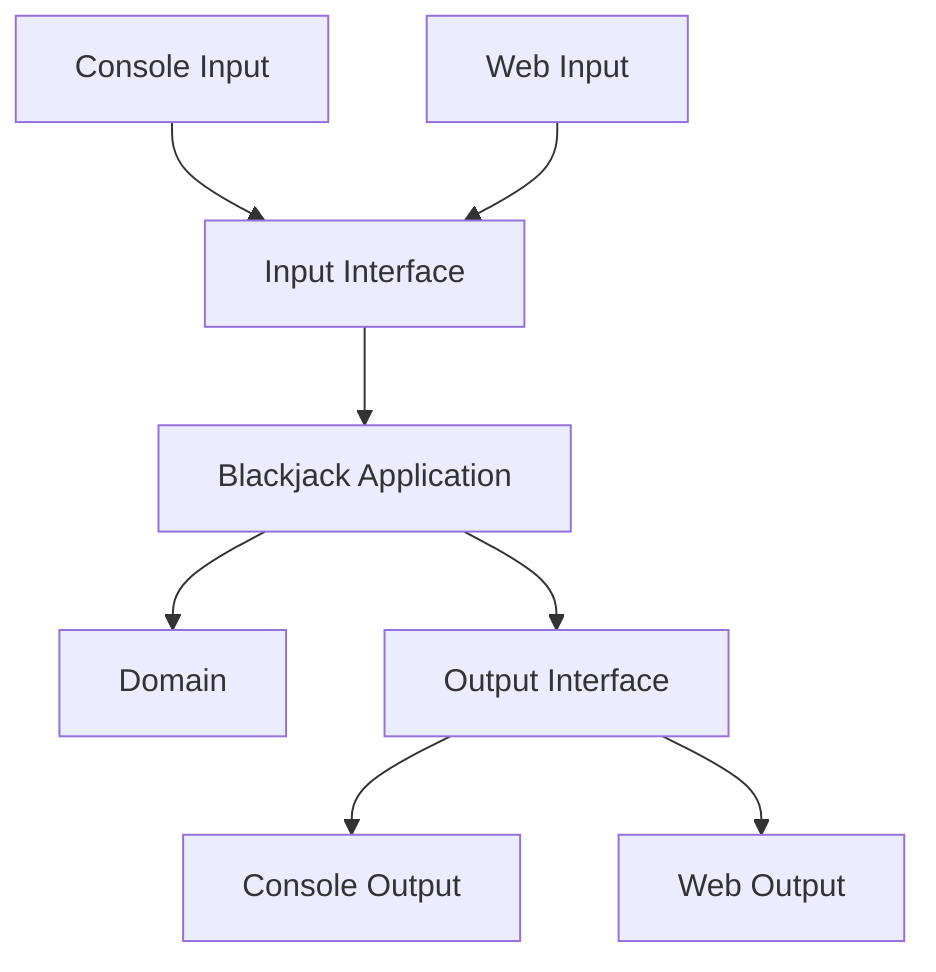
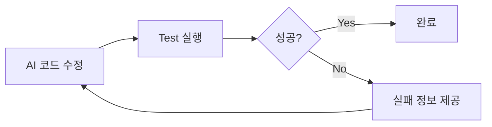
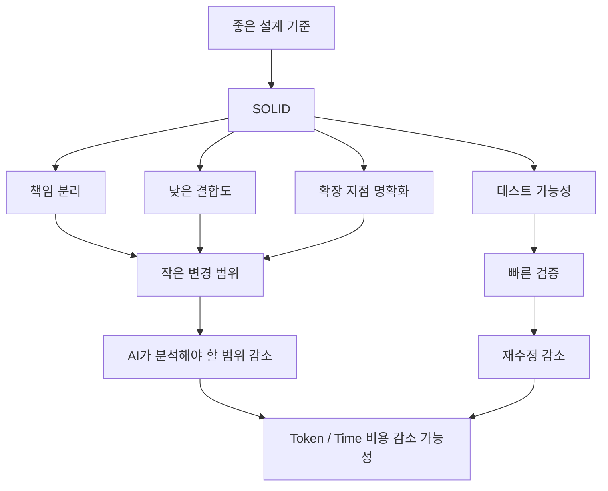

# 보예의 AI시대에서도 SOLID 원칙은 중요한가?
[https://youtu.be/Dz3bruRYfow?si=Rf7AZ7e0mIUqv26Y](https://youtu.be/Dz3bruRYfow?si=Rf7AZ7e0mIUqv26Y)

# 보예의 AI시대에서도 SOLID 원칙은 중요한가?
* toc
{:toc}

---

## AI 시대에도 SOLID 원칙은 중요할까?

생성형 AI가 빠르게 발전하면서 개발 방식도 크게 변하고 있다.

예전에는 개발자가 직접 코드를 작성하는 시간이 대부분이었다면, 이제는 요구사항을 설명하고 AI에게 구현을 맡긴 뒤 결과를 검토하는 방식도 자연스러워지고 있다.

이런 변화 속에서는 다음과 같은 의문이 생길 수 있다.

```text
AI가 코드를 알아서 만들어준다면
좋은 코드에 대한 원칙을 계속 공부해야 할까?

SOLID 같은 객체지향 설계 원칙도
결국 사람이 코드를 읽고 수정하기 위해 만든 기준 아닌가?

어차피 변경이 필요하면
AI에게 다시 수정해달라고 하면 되는 것 아닌가?
```

실제로 AI가 코드를 작성하는 속도는 매우 빠르다.

그렇다면 개발자가 직접 좋은 설계에 대해 고민하는 시간은 점점 의미가 없어지는 것일까?

이 질문을 다른 방향으로 바꿔볼 수 있다.

> 좋은 설계가 사람의 유지보수 비용만 줄이는 것이 아니라, AI가 코드를 변경하는 비용까지 줄여줄 수 있을까?

이 관점에서 SOLID 원칙을 살펴보면 흥미로운 결론에 도달할 수 있다.

---

## SOLID란 무엇인가?

SOLID는 객체지향 설계에서 자주 이야기되는 다섯 가지 설계 원칙의 앞 글자를 모은 표현이다.

```text
S - Single Responsibility Principle
O - Open Closed Principle
L - Liskov Substitution Principle
I - Interface Segregation Principle
D - Dependency Inversion Principle
```

각각 하나씩 살펴보자.

---

## SRP: 단일 책임 원칙

SRP는 Single Responsibility Principle의 약자로 단일 책임 원칙이라고 부른다.

흔히 다음처럼 설명한다.

```text
하나의 클래스는
하나의 책임만 가져야 한다.
```

조금 더 실용적으로 표현하면 다음과 같다.

> 하나의 클래스는 하나의 변경 이유를 가져야 한다.

예를 들어 주문을 처리하는 클래스가 있다고 생각해보자.

```java
public class OrderService {

    public void createOrder() {
        validateOrder();
        calculatePrice();
        saveOrder();
        sendEmail();
        writeLog();
    }
}
```

이 클래스는 여러 이유로 변경될 수 있다.

```text
주문 검증 정책 변경
가격 정책 변경
DB 저장 방식 변경
이메일 전송 방식 변경
로그 정책 변경
```

변경 이유가 많아질수록 하나의 기능을 수정했는데 다른 기능까지 영향을 받을 가능성이 높아진다.

역할을 분리하면 다음과 같은 구조를 생각할 수 있다.

```text
OrderValidator
PriceCalculator
OrderRepository
NotificationSender
```

각 객체가 자신의 책임을 가지게 된다.

AI 관점에서도 이러한 구조는 중요하다.

하나의 클래스가 지나치게 많은 일을 하면 AI가 특정 요구사항을 수정하기 위해 더 넓은 범위의 코드를 분석해야 하기 때문이다.

---

## OCP: 개방-폐쇄 원칙

OCP는 Open-Closed Principle의 약자다.

핵심은 다음과 같다.

```text
확장에는 열려 있고
변경에는 닫혀 있어야 한다.
```

즉 새로운 기능을 추가할 때 기존 코드를 계속 수정하기보다 새로운 구현을 추가하는 방식으로 확장할 수 있어야 한다.

예를 들어 결제 수단을 다음처럼 처리한다고 해보자.

```java
public void pay(String type) {
    if (type.equals("CARD")) {
        // 카드 결제
    }

    if (type.equals("PAYPAL")) {
        // PayPal 결제
    }
}
```

새로운 결제 수단이 추가될 때마다 이 코드를 수정해야 한다.

```text
CARD
PAYPAL
BANK
APPLE_PAY
...
```

이를 추상화를 이용해 표현하면 다음과 같은 방향으로 확장할 수 있다.

```java
public interface PaymentMethod {

    void pay();
}
```

```java
public class CardPayment
        implements PaymentMethod {

    @Override
    public void pay() {
        // 카드 결제
    }
}
```

```java
public class PaypalPayment
        implements PaymentMethod {

    @Override
    public void pay() {
        // PayPal 결제
    }
}
```

새로운 결제 수단을 추가할 때 새로운 구현체를 추가하는 방향으로 확장할 수 있다.

AI가 기능을 추가할 때도 기존 코드 전체를 뜯어고치는 것보다 확장 지점이 명확한 구조가 수정 범위를 줄이기 쉽다.

---

## LSP: 리스코프 치환 원칙

LSP는 Liskov Substitution Principle의 약자다.

핵심은 다음과 같이 이해할 수 있다.

```text
부모 타입이 사용되는 위치에
자식 타입을 넣더라도
프로그램의 의미가 깨지지 않아야 한다.
```

예를 들어 다음과 같은 인터페이스가 있다고 하자.

```java
public interface Payment {

    void pay();
}
```

`CardPayment`와 `PaypalPayment`가 이를 구현한다면 사용하는 쪽에서는 어떤 구현체가 들어오는지에 따라 기본 계약이 깨져서는 안 된다.

```java
public void process(Payment payment) {
    payment.pay();
}
```

다음과 같이 교체해도 정상적인 의미가 유지되어야 한다.

```text
CardPayment
→ 정상

PaypalPayment
→ 정상
```

상속이나 구현 관계를 만들었다고 해서 자동으로 좋은 추상화가 되는 것은 아니다.

상위 타입이 정의한 계약을 하위 타입이 제대로 지키고 있는지가 중요하다.

---

## ISP: 인터페이스 분리 원칙

ISP는 Interface Segregation Principle의 약자다.

핵심은 다음과 같다.

> 사용하지 않는 기능에 의존하도록 강요하지 않는다.

다음 인터페이스를 생각해보자.

```java
public interface Worker {

    void work();

    void eat();

    void sleep();
}
```

모든 구현체가 이 세 기능을 필요로 하는 것은 아닐 수 있다.

어떤 구현체가 다음처럼 작성된다면 설계를 다시 고민할 필요가 있다.

```java
@Override
public void sleep() {
    throw new UnsupportedOperationException();
}
```

필요에 따라 인터페이스를 나눌 수 있다.

```java
public interface Workable {

    void work();
}
```

```java
public interface Eatable {

    void eat();
}
```

사용하는 객체는 실제 필요한 계약에만 의존할 수 있게 된다.

AI 역시 작은 인터페이스를 기반으로 코드를 분석할 때 객체의 역할을 더 명확하게 파악할 수 있다.

---

## DIP: 의존성 역전 원칙

DIP는 Dependency Inversion Principle의 약자다.

핵심은 구체적인 구현보다 추상화에 의존하는 것이다.

다음 코드를 보자.

```java
public class OrderService {

    private final EmailSender emailSender =
            new EmailSender();
}
```

`OrderService`가 `EmailSender`라는 구체 구현에 직접 의존하고 있다.

나중에 이메일 대신 Slack이나 SMS를 사용하고 싶다면 `OrderService`까지 수정해야 할 수 있다.

이를 추상화할 수 있다.

```java
public interface NotificationSender {

    void send();
}
```

```java
public class EmailSender
        implements NotificationSender {

    @Override
    public void send() {
    }
}
```

```java
public class OrderService {

    private final NotificationSender sender;

    public OrderService(
            NotificationSender sender
    ) {
        this.sender = sender;
    }
}
```

이제 `OrderService`는 구체적인 전송 방법을 알 필요가 없다.

```text
OrderService
       ↓
NotificationSender
       ↑
 ┌─────┴─────┐
Email       Slack
```

구현체를 변경해도 핵심 비즈니스 로직은 영향을 덜 받는다.

---

## AI 시대에 SOLID가 필요 없다는 생각은 왜 나올까?

과거에는 코드 변경 비용을 사람이 직접 부담했다.

```text
요구사항 변경
→ 개발자가 코드 분석
→ 수정
→ 컴파일 오류 해결
→ 테스트 실패 해결
→ 리팩토링
```

따라서 변경하기 쉬운 코드를 만드는 것이 중요했다.

하지만 AI를 사용하면 상황이 달라 보인다.

```text
요구사항 변경
→ AI에게 요청
→ AI가 수정
```

겉으로만 보면 코드가 조금 복잡해도 문제가 없어 보인다.

개발자가 몇 시간 동안 수정해야 할 작업을 AI가 몇 분 만에 끝낼 수 있기 때문이다.

그러면 이런 생각이 생긴다.

```text
어차피 AI가 수정해주는데
구조가 조금 안 좋아도 괜찮지 않을까?
```

하지만 실제로 AI 역시 기존 코드의 구조 위에서 작업한다.

코드의 변경 범위가 넓고 책임이 뒤섞여 있다면 AI 역시 더 많은 코드를 읽고, 더 많은 수정을 시도하고, 더 많은 테스트 실패를 해결해야 한다.

즉 **유지보수 비용의 주체가 사람에서 AI로 바뀌더라도 유지보수 비용 자체가 사라지는 것은 아니다.**

---

## SOLID를 적용한 AI와 적용하지 않은 AI를 비교한다면?

이를 확인하는 한 가지 방법은 동일한 요구사항을 서로 다른 조건으로 AI에게 구현하게 하는 것이다.

실험 조건을 다음과 같이 나눌 수 있다.

```text
A

SOLID 원칙을 명시
+
요구사항 구현


B

별도의 설계 원칙 명시 없음
+
요구사항 구현
```

두 결과를 단순히 완성된 코드만 가지고 비교하는 것이 아니라 변화 과정에서 들어간 비용을 관찰한다.

관찰할 수 있는 지표는 다음과 같다.

```text
토큰 사용량
구현 시간
수정 횟수
테스트 실패 횟수
재시도 횟수
```

특히 중요한 것은 **최초 구현보다 이후 요구사항 변경에서 어떤 차이가 발생하는가**다.

---

## 최초 구현에서는 SOLID 코드가 오히려 비쌀 수 있다

단순한 요구사항을 처음 구현할 때는 SOLID 원칙을 적용한 쪽의 비용이 더 클 수 있다.

예를 들어 기본적인 블랙잭 기능만 구현한다고 생각해보자.

SOLID를 적극적으로 고려하면 다음과 같은 구조가 만들어질 가능성이 있다.

```text
Game
Deck
Player
Dealer
Card
Hand
Rule
Input
Output
```

인터페이스와 책임도 나눌 수 있다.

반대로 빠르게 기능만 구현한다면 훨씬 작은 구조가 나올 수도 있다.

```text
BlackjackGame
```

처음에는 후자가 더 빠를 수 있다.

실험에서도 기본 요구사항 구현 시 SOLID를 명시한 쪽이 더 많은 토큰을 사용했다.

```text
SOLID 적용
약 28K Token

SOLID 미적용
약 24K Token
```

즉 좋은 구조를 만드는 것에도 초기 비용이 존재한다.

이 점은 매우 중요하다.

SOLID가 항상 코드를 더 짧게 만들거나 최초 구현을 더 빠르게 만드는 것은 아니다.

---

## 설계는 미래의 변경 비용을 줄이기 위한 투자다

소프트웨어는 한 번 구현하고 끝나는 경우보다 계속 변경되는 경우가 많다.

```text
기능 추가
정책 변경
외부 시스템 연동
UI 변경
새로운 입력 방식
성능 개선
```

따라서 중요한 것은 초기 구현 비용만이 아니다.

다음과 같이 생각해야 한다.

```text
전체 개발 비용

=
초기 구현 비용
+
변경 비용
+
테스트 비용
+
장애 대응 비용
+
유지보수 비용
```

초기에는 조금 더 많은 비용을 사용하더라도 이후 변경 비용이 크게 줄어든다면 장기적으로 더 유리할 수 있다.

---

## 요구사항이 복잡해지자 차이가 나타나기 시작한다

기본적인 블랙잭 구현 이후 실제 카지노 규칙에 가까운 요구사항을 추가한다고 생각해보자.

예를 들어 다음과 같은 기능이다.

```text
멀티 라운드 게임
7덱 Shoe 기반 카드 운영
추가 게임 규칙
새로운 상태와 정책
```

이제 기존 구조를 수정해야 한다.

실험에서는 이 단계부터 두 구현 사이에 차이가 나타나기 시작했다.

```text
SOLID 적용

약 60K Token
약 7분 14초


SOLID 미적용

약 67K Token
약 8분 30초
```

단순한 첫 구현에서는 SOLID 쪽이 오히려 비용을 더 사용했지만, 요구사항을 확장하면서 결과가 반대로 바뀌기 시작했다.

---

## 재수정 횟수에서도 차이가 발생한다

토큰과 시간보다 흥미로운 부분은 수정 사이클이었다.

SOLID 원칙을 고려한 구현은 비교적 적은 수정으로 요구사항을 반영했다.

```text
SOLID

로직 구현
→ 테스트
→ 일부 수정

약 2번의 사이클
```

반면 다른 구현에서는 테스트 실패와 누락된 요구사항 때문에 여러 차례 수정이 필요했다.

```text
SOLID 미적용

구현
→ 테스트 실패
→ 수정
→ 요구사항 재확인
→ 수정
→ 테스트 누락
→ 수정
...
```

약 6번의 재수정이 발생했다.

이 차이는 중요한 의미를 가진다.

AI도 구조가 복잡하거나 변경 지점이 명확하지 않으면 한 번의 요청으로 모든 변경을 정확하게 수행하지 못할 수 있다.

---

## 확장성을 요구하면 격차는 더 커진다

이번에는 더 큰 변경을 생각해보자.

블랙잭 프로그램이 콘솔에서만 실행되는 것이 아니라 다른 입출력 환경에서도 사용할 수 있어야 한다고 가정한다.

```text
현재

Console
→ Blackjack


미래

Console
Web
GUI
다른 Interface
→ Blackjack
```

이런 요구사항에서는 핵심 로직과 입출력 코드가 얼마나 잘 분리되어 있는지가 중요해진다.

콘솔 입출력 코드와 비즈니스 로직이 하나의 객체에 섞여 있다면 큰 수정이 필요하다.

반대로 다음처럼 분리되어 있다면 변경 범위가 줄어든다.



핵심 블랙잭 규칙은 그대로 유지하면서 바깥 인터페이스만 교체할 수 있다.

---

## 확장 요구사항에서 더 큰 비용 차이가 발생했다

확장 가능하도록 요구사항을 추가한 실험에서는 차이가 더욱 벌어졌다.

토큰 사용량은 다음과 같았다.

```text
SOLID 적용

약 70K Token


SOLID 미적용

약 83K Token
```

실행 시간에서도 차이가 나타났다.

```text
SOLID 적용

약 9분 27초


SOLID 미적용

약 12분
```

수정 사이클은 더욱 차이가 컸다.

```text
SOLID

약 3번


SOLID 미적용

약 9번
```

SOLID를 고려하지 않은 구현에서는 기존 Controller를 삭제하고 다시 구현하는 수준의 큰 변경도 발생했다.

즉 구조가 변경에 적합하지 않으면 AI 역시 기존 코드를 버리고 다시 만드는 방향을 선택할 수 있다.

---

## 요구사항이 누적될수록 격차가 커지는 이유

소프트웨어는 시간이 지나면서 점점 복잡해지는 경향이 있다.

처음에는 다음 정도일 수 있다.

```text
블랙잭 한 판 실행
```

그러다 요구사항이 늘어난다.

```text
멀티 라운드
7덱 Shoe
다양한 게임 규칙
새로운 출력 방식
새로운 입력 방식
게임 기록
통계
```

기능이 하나씩 추가될 때마다 기존 코드와 관계가 생긴다.

설계가 잘 분리되어 있다면 새로운 기능이 특정 부분에 추가된다.

```text
A 변경
→ A 주변만 수정
```

반대로 책임과 의존성이 복잡하게 얽혀 있으면 하나의 요구사항이 여러 영역을 건드린다.

```text
A 변경
→ B 수정
→ C 수정
→ D 테스트 실패
→ E 재설계
```

이를 변경의 파급 효과라고 생각할 수 있다.

---

## SOLID의 핵심 가치는 변경 범위를 통제하는 것이다

SOLID를 단순히 다섯 가지 암기 규칙으로 보면 실제 가치를 이해하기 어렵다.

각 원칙을 변경이라는 관점에서 다시 보면 공통점이 보인다.

| 원칙  | 변경 관점에서의 의미                  |
| --- | ---------------------------- |
| SRP | 변경 이유를 하나의 책임에 모은다           |
| OCP | 기존 코드를 덜 건드리고 확장한다           |
| LSP | 구현체를 교체해도 기존 사용자가 깨지지 않게 한다  |
| ISP | 필요 없는 의존성 때문에 함께 변경되는 것을 줄인다 |
| DIP | 구체 구현 변경이 핵심 로직에 전파되는 것을 줄인다 |

결국 SOLID가 지향하는 방향 중 하나는 다음과 같다.

```text
변경
↓
영향 범위를 작게 유지
```

이것이 사람뿐 아니라 AI에게도 중요한 이유다.

---

## AI에게도 코드의 구조는 Context다

AI가 코드를 수정하려면 기존 코드를 읽어야 한다.

프로젝트가 다음처럼 구성되어 있다고 생각해보자.

```text
Game.java
2,000 lines
```

게임 규칙, 입력, 출력, 상태 변경, 카드 생성이 모두 들어 있다면 AI가 작은 기능 하나를 수정하더라도 많은 내용을 동시에 고려해야 한다.

반대로 다음처럼 책임이 나뉘어 있다면 다르다.

```text
Game
Deck
Hand
Player
Dealer
GameRule
InputPort
OutputPort
```

수정할 대상이 명확해진다.

예를 들어 카드 생성 규칙이 바뀌었다.

```text
Deck
```

에 집중할 수 있다.

출력 방식이 바뀌었다.

```text
OutputPort
```

주변만 보면 된다.

즉 좋은 객체 구조는 AI에게도 일종의 **검색 공간을 줄여주는 역할**을 할 수 있다.

---

## 코드 변경 범위가 작으면 AI가 사용하는 Context도 줄어들 수 있다

AI 기반 개발에서는 Context가 중요한 자원이다.

수정해야 할 코드와 관련된 파일이 많을수록 AI가 읽고 판단해야 할 정보도 증가한다.

개념적으로 다음과 같다.

```text
강한 결합

요구사항 하나
↓
10개 클래스 확인
↓
많은 Context
↓
많은 수정 가능성
```

반대로 변경 책임이 잘 분리되어 있다면 다음과 같은 구조가 가능하다.

```text
낮은 결합

요구사항 하나
↓
2~3개 클래스 확인
↓
작은 Context
↓
작은 수정 범위
```

따라서 좋은 설계는 사람의 인지 부하뿐 아니라 AI의 작업 범위도 줄여줄 가능성이 있다.

---

## 초기 비용과 변경 비용의 관계

SOLID 설계를 적용하는 것은 무료가 아니다.

다음 비용이 추가될 수 있다.

```text
인터페이스 설계
책임 분리
클래스 증가
추상화 고민
테스트 작성
```

그래서 단순한 프로그램에서는 오히려 불필요하게 복잡해질 수도 있다.

이를 그래프로 생각하면 다음과 같은 형태를 상상할 수 있다.

```text
초기 단계

단순 설계
비용 ↓

SOLID 설계
비용 ↑


변경 누적

단순 설계
변경 비용 ↑↑↑

SOLID 설계
변경 비용 ↑
```

즉 SOLID는 지금 당장 가장 빠르게 만드는 방법이 아니라 **변경 가능성이 높은 시스템에서 미래의 비용 증가를 통제하는 방법**으로 볼 수 있다.

---

## 그렇다면 모든 코드에 SOLID를 적용해야 할까?

그렇지는 않다.

SOLID 역시 무조건 적용해야 하는 절대 법칙은 아니다.

다음과 같은 매우 단순한 코드에 불필요한 추상화를 추가한다고 생각해보자.

```java
public int add(int a, int b) {
    return a + b;
}
```

이를 확장 가능하게 만들겠다며 다음과 같은 구조를 만드는 것은 과할 수 있다.

```text
Calculator
CalculationStrategy
AdditionStrategy
CalculationFactory
CalculationProvider
```

변경 가능성이 거의 없는 영역이라면 추상화 자체가 유지보수 비용이 된다.

따라서 중요한 질문은 다음이다.

```text
여기에 변화가 발생할 가능성이 높은가?

서로 다른 변경 이유가 섞여 있는가?

구현체 교체 가능성이 있는가?

외부 시스템과 강하게 연결되어 있는가?

현재 구조가 실제로 변경을 어렵게 하고 있는가?
```

SOLID는 원칙을 지키기 위한 설계가 아니라 변경에 대응하기 위한 설계 기준으로 사용하는 것이 좋다.

---

## AI에게 "SOLID하게 구현해줘"라고만 하면 충분할까?

좋은 설계 기준이 중요하다는 것은 프롬프트에 다음 한 줄만 추가하면 된다는 뜻은 아니다.

```text
SOLID하게 구현해줘.
```

이것만으로 충분하지 않을 수 있다.

왜냐하면 좋은 설계는 현재 시스템에서 어떤 변화가 예상되는지 알아야 판단할 수 있기 때문이다.

예를 들어 다음과 같이 요구하는 편이 더 구체적이다.

```text
게임 규칙은 UI와 분리해주세요.

현재는 Console에서 실행하지만
향후 Web API에서도 동일한 도메인 로직을
사용할 수 있어야 합니다.

카드 생성 정책은 변경 가능성이 있으므로
게임 진행 로직과 분리해주세요.

입출력 구현체는 핵심 도메인 로직이
직접 의존하지 않도록 구성해주세요.
```

이 프롬프트에는 SOLID라는 단어가 없어도 설계 의도가 들어 있다.

좋은 개발자는 원칙 이름을 암기하는 것보다 **왜 그런 구조가 필요한지 설명할 수 있어야 한다.**

---

## AI 시대에는 개발자의 주관이 더 중요해진다

AI가 코드를 많이 작성할수록 개발자에게 필요한 능력이 사라지는 것이 아니라 다른 형태로 바뀔 수 있다.

예전에는 개발자의 중요한 능력 중 하나가 다음이었다.

```text
코드를 빠르게 작성하는 능력
```

AI 시대에는 여기에 다음 능력이 더 중요해진다.

```text
어떤 코드를 만들어야 하는지 결정하는 능력

생성된 구조가 좋은지 판단하는 능력

변경 가능성을 예상하는 능력

적절한 추상화 수준을 결정하는 능력

AI가 생성한 코드를 리뷰하는 능력
```

AI에게 코드를 작성하게 하더라도 최종적으로 다음 질문에는 개발자가 답해야 한다.

```text
이 책임은 여기에 있어야 하는가?

이 인터페이스는 정말 필요한가?

이 두 객체는 왜 결합되어 있는가?

다음 요구사항이 들어오면 어디를 수정해야 하는가?

지금 만들어진 추상화가 실제 변경 가능성을 반영하는가?
```

이 질문을 하기 위해서는 좋은 코드에 대한 기준이 필요하다.

SOLID도 그런 기준 가운데 하나다.

---

## 좋은 설계는 AI 비용에도 영향을 줄 수 있다

AI를 사용하는 환경에서는 기존의 개발 비용에 새로운 비용이 추가된다.

```text
Token
Context
재시도
AI 실행 시간
코드 리뷰
테스트
```

AI가 한 번에 정확하게 변경하면 비용이 작다.

```text
Prompt
→ 수정
→ 테스트 성공
```

반대로 구조가 복잡하여 반복적으로 수정한다면 비용이 증가한다.

```text
Prompt
→ 수정
→ 테스트 실패
→ 원인 분석
→ 재수정
→ 또 다른 테스트 실패
→ 다시 수정
```

따라서 소프트웨어 구조는 직접적으로 AI 사용 비용에도 영향을 줄 가능성이 있다.

```text
좋은 구조

→ 작은 변경 범위
→ 적은 Context
→ 적은 수정
→ 적은 재시도
→ 비용 감소 가능
```

이 관점에서는 코드 품질이 단순한 미학의 문제가 아니다.

생산성의 문제로 연결된다.

---

## AI를 사용할수록 테스트도 중요하다

실험에서 눈여겨볼 수 있는 부분 중 하나는 테스트였다.

구조가 잘 잡혀 있는 구현에서는 단위 테스트를 함께 챙기는 모습을 보였고 상대적으로 수정 사이클이 적었다.

테스트는 AI에게도 중요한 피드백이다.



테스트가 없다면 AI는 자신이 기존 동작을 깨뜨렸는지 판단하기 어렵다.

```text
AI가 코드 생성
→ 컴파일 성공
→ 실제 요구사항까지 맞는지 불명확
```

반면 테스트가 충분하다면 다음과 같은 피드백이 가능하다.

```text
기존 기능 테스트
신규 요구사항 테스트
Edge Case 테스트
```

AI 기반 개발에서도 테스트 가능한 구조와 작은 책임이 여전히 중요하다.

---

## SOLID와 테스트 가능성

SOLID 설계와 테스트 가능성도 연결된다.

예를 들어 다음 클래스가 있다고 하자.

```java
public class PaymentService {

    public void pay() {
        PaypalClient client =
                new PaypalClient();

        client.request();
    }
}
```

`PaypalClient`가 내부에서 직접 생성되기 때문에 테스트에서 교체하기 어렵다.

추상화에 의존하도록 변경하면 다음과 같다.

```java
public class PaymentService {

    private final PaymentClient client;

    public PaymentService(
            PaymentClient client
    ) {
        this.client = client;
    }

    public void pay() {
        client.request();
    }
}
```

테스트에서는 가짜 구현을 전달할 수 있다.

```java
PaymentClient fakeClient =
        new FakePaymentClient();

PaymentService service =
        new PaymentService(fakeClient);
```

의존성이 분리될수록 작은 단위 테스트를 만들기 쉬워진다.

이는 AI가 변경 후 빠르게 검증할 수 있는 환경을 만드는 데도 도움이 된다.

---

## 실험 결과를 그대로 일반화하면 안 되는 이유

이번 실험에서 중요한 점은 SOLID를 적용한 구현이 요구사항 추가 과정에서 상대적으로 적은 토큰, 시간, 수정 횟수를 보였다는 것이다.

다만 이것을 다음과 같이 일반화하는 것은 주의해야 한다.

```text
SOLID를 적용하면
항상 AI 토큰이 몇 퍼센트 감소한다.
```

실험 결과는 특정 조건에서 얻어진 결과다.

```text
특정 블랙잭 요구사항
특정 AI 모델
특정 프롬프트
특정 실행 환경
특정 설계 방식
```

다른 프로젝트나 AI 모델에서는 결과가 달라질 수 있다.

따라서 이 실험에서 더 중요하게 볼 수 있는 것은 정확한 퍼센트보다 다음 패턴이다.

```text
초기에는 설계 비용이 존재했다.

요구사항이 증가하면서
변경 비용의 차이가 발생했다.

구조가 복잡한 구현에서는
재수정 횟수가 더 증가했다.
```

즉 실험은 **좋은 구조가 AI를 이용한 변경 작업에도 영향을 줄 가능성**을 보여주는 사례로 보는 것이 적절하다.

---

## 실무에서는 차이가 더 커질 수 있을까?

작은 프로그램에서도 요구사항이 누적되면 코드 구조의 차이가 나타난다.

실무에서는 일반적으로 더 많은 요소가 존재한다.

```text
Database
Cache
Message Queue
External API
Batch
Authentication
Authorization
Transaction
Concurrency
Logging
Monitoring
```

또 여러 개발자가 동시에 작업한다.

```text
Developer A
Developer B
Developer C
AI Agent
```

이러한 환경에서는 변경 하나가 어디까지 영향을 주는지를 통제하는 것이 더욱 중요해진다.

예를 들어 결제 시스템에서 새로운 PG사를 추가한다고 생각해보자.

설계가 다음과 같다면

```text
PaymentService
├── if Stripe
├── if PayPal
├── if Toss
├── 승인
├── 취소
├── 환불
└── Webhook
```

새 PG사를 추가할 때 하나의 거대한 클래스를 계속 수정해야 한다.

반대로 역할이 분리되어 있다면

```text
PaymentGateway
├── StripeGateway
├── PaypalGateway
└── TossGateway

PaymentService
→ PaymentGateway 의존
```

새 구현체 추가로 변화 범위를 줄일 수 있다.

이 차이는 개발자가 직접 수정하든 AI가 수정하든 동일하게 존재한다.

---

## AI 시대에 SOLID를 바라보는 새로운 관점

SOLID를 다음처럼만 이해하면 낡은 원칙처럼 느껴질 수 있다.

```text
사람이 읽기 좋은 코드를 만드는 원칙
```

하지만 더 넓게 보면 다음과 같이 볼 수 있다.

```text
복잡성을 분리하고
변경 영향을 통제하는 원칙
```

소프트웨어의 변경 주체가 사람에서 AI로 일부 바뀌더라도 소프트웨어 자체의 복잡성은 사라지지 않는다.

```text
요구사항
의존성
상태
외부 시스템
데이터
정책
```

이것들은 그대로 존재한다.

AI는 복잡성을 더 빠르게 처리할 수 있을 뿐, 복잡성 자체를 없애주는 것은 아니다.

따라서 설계 원칙의 가치는 여전히 남는다.

---

## 개발자의 역할은 코드를 작성하는 사람에서 기준을 만드는 사람으로 이동할 수 있다

AI가 구현 영역을 더 많이 담당하면 개발자의 역할은 다음과 같이 변화할 수 있다.

```text
과거

문제 이해
→ 설계
→ 코드 작성
→ 테스트


AI 활용

문제 이해
→ 설계 기준 정의
→ AI에게 구현 요청
→ 결과 검증
→ 피드백
→ 테스트
```

이 구조에서 가장 중요한 것은 앞과 뒤다.

```text
무엇을 만들어야 하는가?

그리고 만들어진 결과가 좋은가?
```

둘 다 개발자의 판단이 필요하다.

SOLID, 객체지향, 디자인 패턴, 테스트 전략 같은 지식은 바로 이 판단 기준을 만드는 데 사용된다.

---

## 실무에서 AI에게 설계를 요청할 때 활용할 수 있는 질문

단순히 구현만 요청하는 것보다 다음과 같은 질문을 함께 던지면 구조를 검토하는 데 도움이 된다.

```text
각 클래스의 변경 이유를 설명해줘.

두 개 이상의 책임을 가진 클래스가 있는지 찾아줘.

새 구현체가 추가될 때
기존 코드를 수정해야 하는 위치를 찾아줘.

구체 구현에 직접 의존하는 곳을 찾아줘.

사용하지 않는 메서드까지 구현하도록
강제되는 인터페이스가 있는지 확인해줘.

상위 타입을 하위 구현체로 교체했을 때
계약이 깨질 가능성이 있는지 분석해줘.

다음 요구사항이 추가된다면
어느 파일을 수정해야 하는지 예상해줘.
```

AI를 단순 코드 생성기가 아니라 설계 리뷰어로 활용하는 것이다.

---

## SOLID 위반을 찾는 간단한 신호

### SRP

```text
클래스가 지나치게 크다.
변경 이유가 여러 개다.
서로 관련 없는 메서드가 모여 있다.
```

### OCP

```text
새 기능이 추가될 때
기존 if/switch를 계속 수정한다.
```

### LSP

```text
하위 구현체에서
UnsupportedOperationException이 자주 등장한다.

특정 구현체일 때만 별도 조건을 처리한다.
```

### ISP

```text
인터페이스 메서드 중
일부 구현체가 사용하지 않는 메서드가 많다.
```

### DIP

```text
핵심 서비스가
외부 시스템 구현체를 직접 생성한다.
```

이 신호들은 사람의 코드 리뷰뿐 아니라 AI를 활용한 정적 설계 리뷰에도 사용할 수 있다.

---

## 구조

AI 시대에서 SOLID가 어떤 의미를 가질 수 있는지 구조로 정리하면 다음과 같다.



결국 핵심은 AI가 SOLID를 좋아한다는 것이 아니다.

**변경하기 쉬운 구조는 누가 수정하더라도 변경 비용이 작을 가능성이 높다**는 것이다.

---

## 실무에서의 활용

AI를 실제 개발에 사용할 때 다음 흐름을 적용해볼 수 있다.

```text
1. 요구사항을 먼저 명확하게 정의한다.

2. 예상되는 변경 지점을 정의한다.

3. AI에게 구현을 요청한다.

4. 구현 결과의 책임과 의존성을 검토한다.

5. 테스트를 실행한다.

6. 변경 요구사항을 추가해본다.

7. 변경 범위가 지나치게 크다면 구조를 개선한다.

8. 이후 AI 작업에서도 같은 설계 기준을 유지한다.
```

특히 AI가 처음 생성한 코드만 보고 품질을 판단하지 않는 것이 중요하다.

다음 질문을 던져보는 것이 좋다.

```text
여기에 기능 하나를 더 추가하면 어떻게 될까?
```

좋은 구조와 좋지 않은 구조의 차이는 최초 구현보다 **두 번째, 세 번째 변경에서 더 잘 보이는 경우가 많다.**

---

## 정리

AI가 빠르게 발전하면서 개발자가 직접 코드를 작성해야 하는 비중은 줄어들 수 있다.

하지만 그렇다고 좋은 코드에 대한 기준까지 필요 없어지는 것은 아니다.

오히려 AI가 더 많은 코드를 작성할수록 개발자는 생성된 코드의 품질을 판단할 기준이 필요하다.

SOLID는 그러한 기준 가운데 하나다.

각 원칙의 핵심을 변경이라는 관점에서 보면 다음과 같다.

```text
SRP
→ 변경 이유를 분리한다.

OCP
→ 기존 코드 수정을 줄이면서 확장한다.

LSP
→ 구현체 교체로 기존 동작이 깨지지 않게 한다.

ISP
→ 불필요한 의존성을 줄인다.

DIP
→ 구체 구현의 변경이 핵심 로직까지 전파되지 않게 한다.
```

초기 구현에서는 이러한 구조를 만드는 데 더 많은 비용이 들어갈 수 있다.

실험에서도 기본 요구사항만 구현했을 때는 SOLID를 명시한 쪽이 더 많은 토큰을 사용했다.

하지만 요구사항이 추가되고 확장성이 요구되면서 결과가 달라졌다.

```text
변경 요구사항 증가
        ↓
SOLID 구조
→ 상대적으로 작은 수정 범위

비구조적인 코드
→ 넓은 수정 범위
→ 테스트 실패
→ 재수정 증가
```

특정 실험의 토큰 수나 시간 차이를 모든 프로젝트에 그대로 일반화할 수는 없다.

하지만 한 가지 중요한 방향은 확인할 수 있다.

```text
좋은 구조
→ 변경하기 쉬움
→ AI도 변경하기 쉬울 가능성
```

AI는 소프트웨어 복잡성을 없애는 존재가 아니라 복잡한 작업을 더 빠르게 수행할 수 있는 도구다.

요구사항의 복잡성, 의존성, 상태, 변경 가능성은 여전히 존재한다.

그래서 앞으로 개발자의 중요한 역할은 단순히 코드를 많이 작성하는 것이 아니라 다음으로 이동할 수 있다.

```text
좋은 요구사항을 정의하고

좋은 설계 기준을 세우고

AI가 만든 결과를 검증하고

변경에 강한 구조인지 판단하는 것
```

결국 SOLID를 공부하는 이유도 단순히 “사람이 읽기 좋은 코드”를 만들기 위해서만은 아니다.

**사람과 AI 모두가 지속적으로 수정해야 하는 소프트웨어에서 변경 비용을 통제하기 위한 설계 기준을 갖기 위해서다.**

### 한 줄 요약

**AI가 코드를 대신 작성해도 소프트웨어의 변경 비용은 사라지지 않으며, SOLID는 책임과 의존성을 분리해 사람뿐 아니라 AI가 코드를 수정할 때도 변경 범위와 재작업 비용을 줄이는 기준으로 활용할 수 있다.**


