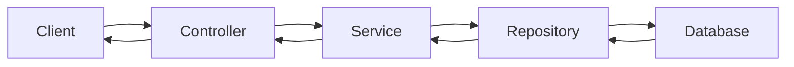
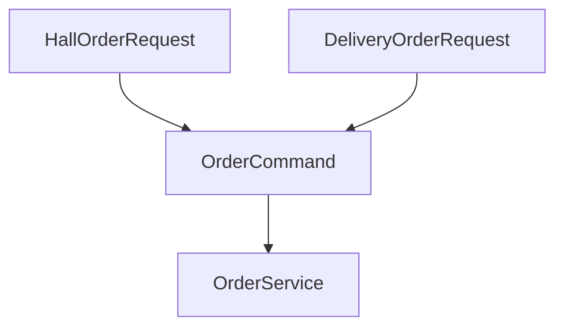
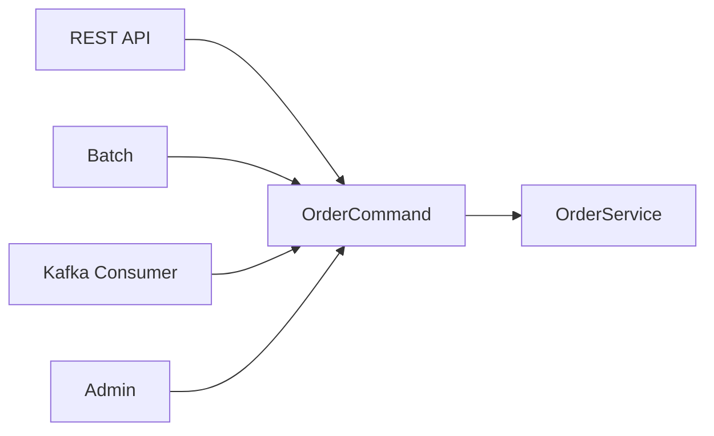
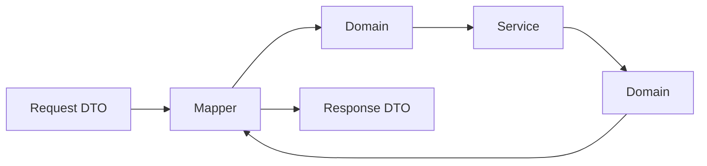
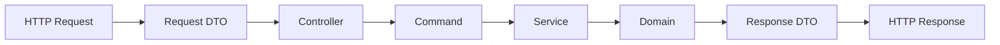
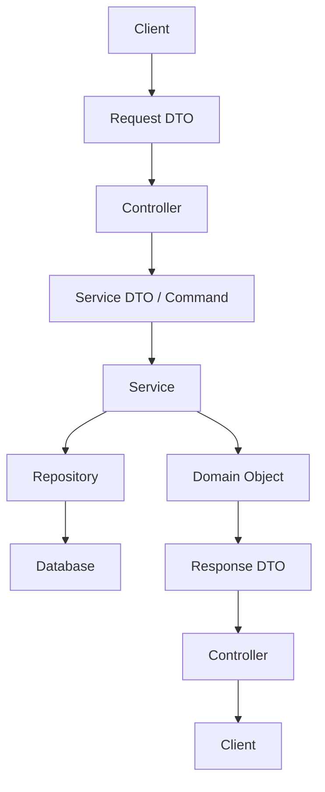

# 이산의 DTO는 왜 써야할까?
[https://youtu.be/XoCy36rrJ7s?si=Wx_C8OMc9PgXc1ug](https://youtu.be/XoCy36rrJ7s?si=Wx_C8OMc9PgXc1ug)

# 이산의 DTO는 왜 써야할까?
* toc
{:toc}

---

## DTO는 왜 사용해야 할까?

Spring 기반 백엔드 애플리케이션을 개발하다 보면 거의 항상 DTO를 사용하게 된다.

```java
public record UserRequest(
        String name,
        int age
) {
}
```

```java
public record UserResponse(
        Long id,
        String name
) {
}
```

처음에는 DTO를 단순히 Controller에서 요청과 응답을 받기 위한 객체 정도로 이해하기 쉽다.

그러다 보면 자연스럽게 이런 의문이 생긴다.

```text
Entity가 이미 있는데 왜 DTO를 또 만들어야 하지?

그냥 User 객체를 Controller에서 그대로 반환하면 안 될까?

Request DTO를 Service까지 그대로 전달하면 안 될까?

DTO 변환은 Controller가 해야 할까?
Service가 해야 할까?

DTO는 class로 만들어야 할까?
record로 만들어야 할까?
```

DTO를 사용하는 이유를 제대로 이해하려면 단순히 “계층 간 데이터 전달 객체”라는 정의만 알아서는 부족하다.

DTO는 **외부 세계와 내부 도메인 사이에 경계를 만드는 역할**을 한다.

이 경계를 통해 다음과 같은 문제를 해결할 수 있다.

```text
민감한 정보 노출 방지
도메인 구조의 외부 노출 방지
API와 내부 모델의 변경 분리
화면별 데이터 표현
입력값의 1차 검증
계층별 책임 분리
```

즉 DTO는 데이터를 옮기는 단순한 그릇이지만, 그 존재 자체가 애플리케이션의 경계를 명확하게 만들어준다.

---

## DTO란 무엇인가?

DTO는 **Data Transfer Object**의 약자다.

이름 그대로 데이터를 전달하기 위한 객체다.

가장 중요한 특징은 다음과 같다.

```text
데이터를 전달하는 것이 주된 목적이다.
```

도메인 객체처럼 핵심 비즈니스 규칙을 수행하는 객체와는 역할이 다르다.

예를 들어 사용자를 생성하는 요청이 있다고 하자.

```java
public record CreateUserRequest(
        String name,
        int age
) {
}
```

이 객체의 목적은 클라이언트가 보내온 데이터를 애플리케이션 내부로 전달하는 것이다.

반대로 다음과 같은 `User` 객체는 성격이 다르다.

```java
public class User {

    private Long id;
    private String name;
    private int age;

    public void changeName(String newName) {
        this.name = newName;
    }
}
```

`User`는 단순한 전달 객체가 아니라 사용자를 표현하는 도메인 객체다.

따라서 두 객체의 책임을 다음처럼 구분할 수 있다.

| 객체            | 주요 책임                      |
| ------------- | -------------------------- |
| DTO           | 데이터를 계층 또는 시스템 사이에 전달      |
| Domain Object | 비즈니스 상태와 규칙 표현             |
| Entity        | 식별자를 중심으로 동일성을 유지하는 도메인 객체 |
| Value Object  | 값 자체로 의미와 동등성을 표현하는 객체     |

---

## 도메인이란 무엇인가?

DTO와 도메인 객체의 차이를 이해하기 위해서는 먼저 도메인의 의미를 이해하는 것이 좋다.

도메인은 **소프트웨어가 해결하려는 현실의 문제 영역**이다.

예를 들어 장기 게임을 프로그램으로 구현한다고 하자.

현실의 장기에는 다음과 같은 요소가 존재한다.

```text
장기판
기물
기물 위치
기물 이동 규칙
턴
승리 조건
패배 조건
```

이 전체 문제 영역이 도메인이다.

이를 개발자가 이해하고 구현하기 좋은 형태로 추상화한 것이 도메인 모델이다.

```text
현실 세계

장기 게임
        ↓
도메인 모델
        ↓
Board
Piece
Position
Move
Game
```

그리고 이 모델을 코드로 구현한 객체들을 도메인 객체라고 볼 수 있다.

```java
public class Board {
}
```

```java
public class Piece {
}
```

```java
public class Position {
}
```

---

## Entity와 Value Object

도메인 객체는 성격에 따라 여러 방식으로 분류할 수 있다.

대표적으로 Entity와 Value Object를 생각할 수 있다.

### Entity

Entity는 상태가 바뀌더라도 동일한 대상을 나타내는 객체다.

예를 들어 사용자의 이름이 변경되더라도 동일한 사용자다.

```text
User

id = 100
name = "윤식"
```

이름이 바뀐다.

```text
User

id = 100
name = "Yoon"
```

상태는 달라졌지만 `id = 100`인 동일한 사용자다.

Entity에서는 이런 식별자가 중요하다.

### Value Object

Value Object는 고유한 식별자보다 가지고 있는 값 자체가 중요하다.

예를 들어 좌표를 생각할 수 있다.

```java
public record Position(
        int x,
        int y
) {
}
```

두 `Position`의 `x`, `y`가 같다면 같은 위치라고 판단할 수 있다.

DTO와 이러한 도메인 객체는 목적 자체가 다르다.

---

## 도메인 객체를 그대로 반환하면 안 될까?

DTO를 사용하지 않으면 다음과 같은 구현이 가능하다.

```java
@GetMapping("/users/{id}")
public User findUser(
        @PathVariable Long id
) {
    return userService.findById(id);
}
```

코드는 매우 단순하다.

```text
Controller
→ User 조회
→ User 그대로 반환
```

처음에는 DTO를 따로 만드는 것보다 훨씬 효율적으로 보일 수 있다.

하지만 도메인 객체를 외부에 그대로 노출하기 시작하면 여러 문제가 발생할 수 있다.

---

## 첫 번째 이유: 보안과 캡슐화

사용자 객체가 다음과 같다고 하자.

```java
public class User {

    private Long id;
    private String name;
    private String password;
    private String address;
    private String residentNumber;
}
```

화면에서 필요한 정보는 사용자 이름뿐일 수 있다.

하지만 `User` 객체 전체를 응답으로 반환하면 객체가 가지고 있는 다른 데이터도 외부 노출 대상이 될 수 있다.

```text
필요한 데이터

name
```

하지만 도메인 객체에는 다음 정보가 들어 있다.

```text
id
name
password
address
residentNumber
```

DTO를 사용하면 외부에 전달할 데이터 자체를 명시적으로 제한할 수 있다.

```java
public record UserResponse(
        String name
) {
}
```

```java
@GetMapping("/users/{id}")
public UserResponse findUser(
        @PathVariable Long id
) {
    User user = userService.findById(id);

    return new UserResponse(user.getName());
}
```

이제 응답은 다음 데이터만 표현한다.

```json
{
  "name": "윤식"
}
```

DTO는 외부에 무엇을 공개할 것인지 결정하는 경계가 된다.

---

## 도메인 객체를 그대로 전달하는 것은 지갑을 통째로 넘기는 것과 비슷하다

물건을 구매할 때 점원에게 필요한 것은 결제에 필요한 금액이다.

그렇다고 지갑 전체를 넘겨주지는 않는다.

지갑 안에는 다음과 같은 정보가 있을 수 있기 때문이다.

```text
현금
신용카드
주민등록증
운전면허증
개인 메모
```

필요한 것만 꺼내 전달한다.

DTO도 비슷한 역할을 한다.

```text
Domain Object
→ 내부의 많은 정보와 규칙을 가지고 있음

DTO
→ 외부에 필요한 정보만 골라 전달
```

이 때문에 DTO는 단순한 데이터 복사 객체가 아니라 **캡슐화 경계를 보호하는 장치**가 된다.

---

## 두 번째 이유: 내부 모델과 API의 변경을 분리할 수 있다

다음 `User` 객체가 있다고 하자.

```java
public class User {

    private String name;
}
```

DTO 없이 객체를 그대로 응답하면 API도 내부 필드에 영향을 받을 수 있다.

```json
{
  "name": "윤식"
}
```

그런데 내부 설계를 변경하면서 `name`을 `userName`으로 변경한다고 가정하자.

```java
public class User {

    private String userName;
}
```

외부 API가 내부 구조와 직접 연결되어 있다면 응답 구조까지 변경될 가능성이 있다.

```json
{
  "userName": "윤식"
}
```

클라이언트가 기존 `name`을 기준으로 구현되어 있다면 문제가 발생할 수 있다.

```javascript
const name = response.name;
```

DTO를 사용하면 내부 모델 변경과 API 계약을 분리할 수 있다.

```java
public record UserResponse(
        String name
) {
    public static UserResponse from(User user) {
        return new UserResponse(
                user.getUserName()
        );
    }
}
```

외부 응답은 계속 다음 형태를 유지할 수 있다.

```json
{
  "name": "윤식"
}
```

구조는 다음과 같다.

```text
Domain

name
↓
userName으로 변경


DTO

name 유지


API

name 유지
```

DTO가 중간에서 완충 지점 역할을 하는 것이다.

---

## DTO는 API 계약과 도메인을 분리한다

DTO를 사용하지 않으면 다음 구조가 된다.


도메인 구조가 바뀌면 외부 계약이 영향을 받을 가능성이 높아진다.

DTO가 존재하면 다음과 같다.


이제 내부 모델과 외부 API 사이에 변환 계층이 생긴다.

```text
내부 변경
→ DTO 변환 코드 수정

외부 API
→ 유지 가능
```

이 점은 시스템 규모가 커질수록 중요해진다.

---

## 세 번째 이유: 화면마다 필요한 데이터가 다르다

하나의 `User` 객체가 있다고 하자.

```java
public class User {

    private Long id;
    private String name;
    private int age;
    private String address;
}
```

회원 목록 화면에서는 이름만 필요할 수 있다.

```json
{
  "name": "윤식"
}
```

회원 상세 화면에서는 이름과 나이가 필요할 수 있다.

```json
{
  "name": "윤식",
  "age": 32
}
```

관리자 화면에서는 더 많은 정보가 필요할 수 있다.

DTO를 분리하면 각 API 목적에 맞게 데이터를 표현할 수 있다.

```java
public record UserSimpleResponse(
        String name
) {
}
```

```java
public record UserDetailResponse(
        String name,
        int age
) {
}
```

도메인 객체 하나를 모든 화면 요구사항에 억지로 맞출 필요가 없다.

---

## 네 번째 이유: 책임을 분리할 수 있다

도메인 객체의 핵심 책임은 도메인 규칙을 표현하는 것이다.

예를 들어 주문 객체라면 다음과 같은 책임이 있을 수 있다.

```text
주문 생성
주문 취소
결제 완료
배송 시작
배송 완료
```

```java
public class Order {

    private OrderStatus status;

    public void cancel() {
        validateCancelable();
        this.status = OrderStatus.CANCELED;
    }
}
```

그런데 이 객체가 API 응답 형식까지 책임진다면 관심사가 섞인다.

```text
주문 도메인 규칙
+
API JSON 형식
+
날짜 표현 방식
+
클라이언트 화면 요구사항
```

DTO를 사용하면 역할을 나눌 수 있다.

```text
Order
→ 주문 비즈니스 규칙 담당

OrderResponse
→ 외부에 전달할 데이터 담당
```

객체마다 자신이 집중해야 할 책임이 명확해진다.

---

## 다섯 번째 이유: 입력 검증의 경계를 만들 수 있다

클라이언트에서 다음 요청이 들어온다고 하자.

```json
{
  "name": "",
  "age": -10
}
```

이 값은 애플리케이션 내부 깊숙한 곳까지 들어오기 전에 먼저 걸러낼 수 있다.

Spring에서는 Request DTO에 Bean Validation을 사용할 수 있다.

```java
public record CreateUserRequest(

        @NotBlank
        String name,

        @Positive
        int age

) {
}
```

Controller에서는 다음과 같이 사용할 수 있다.

```java
@PostMapping("/users")
public void create(
        @Valid @RequestBody CreateUserRequest request
) {
    userService.create(request);
}
```

다음 요청은 Controller 경계에서 검증될 수 있다.

```json
{
  "name": "",
  "age": -10
}
```

이러한 검증은 외부 입력 형식에 대한 1차 방어 역할을 한다.

---

## DTO 검증과 도메인 검증은 다르다

여기서 중요한 점은 DTO에서 검증했다고 해서 도메인 검증이 필요 없다는 의미는 아니라는 것이다.

두 검증은 목적이 다를 수 있다.

### Request DTO 검증

외부 입력 형식을 검증한다.

```text
값이 비어 있는가?
숫자 형식이 맞는가?
문자열 길이가 적절한가?
필수 필드가 존재하는가?
```

### Domain 검증

비즈니스 규칙을 검증한다.

```text
해당 사용자가 실제로 존재하는가?
주문을 취소할 수 있는 상태인가?
재고가 충분한가?
이미 사용한 쿠폰인가?
배송이 시작되었는가?
```

예를 들어 다음 DTO가 있다고 하자.

```java
public record CancelOrderRequest(

        @NotNull
        Long orderId

) {
}
```

`orderId`가 존재하는지까지 DTO가 판단할 수는 없다.

실제 비즈니스 검증은 도메인 또는 서비스 계층에서 처리해야 한다.

```text
Request Validation
→ 입력 형식 검증

Business Validation
→ 도메인 규칙 검증
```

---

## Request DTO와 Response DTO

DTO를 크게 나누면 요청 DTO와 응답 DTO를 생각할 수 있다.

### Request DTO

클라이언트에서 서버로 들어오는 데이터를 표현한다.

```java
public record CreateOrderRequest(
        Long productId,
        int quantity
) {
}
```

역할은 다음과 같다.

```text
외부 요청 데이터 수신
필요한 필드만 수신
입력 형식 검증
Entity 구조 은닉
```

### Response DTO

서버가 클라이언트에게 전달할 데이터를 표현한다.

```java
public record OrderResponse(
        Long orderId,
        String status,
        String createdAt
) {
}
```

역할은 다음과 같다.

```text
필요한 정보만 공개
민감정보 제거
화면에 필요한 구조로 변환
날짜/시간 등 표현 형식 제공
```

---

## MVC 구조에서 DTO는 어디에 위치할까?

일반적인 Spring 애플리케이션 구조를 단순화하면 다음과 같다.



Request DTO는 외부에서 Controller로 들어오는 데이터를 표현한다.

```text
Client
↓
Request DTO
↓
Controller
```

Response DTO는 처리된 결과를 클라이언트에게 전달한다.

```text
Service
↓
Controller
↓
Response DTO
↓
Client
```

그런데 여기에서 중요한 설계 문제가 하나 생긴다.

> Request DTO를 Service까지 그대로 전달해도 될까?

---

## Request DTO를 Service까지 전달하는 방식

가장 단순한 방법이다.

```java
@PostMapping("/orders")
public void create(
        @RequestBody CreateOrderRequest request
) {
    orderService.create(request);
}
```

```java
@Service
public class OrderService {

    public void create(
            CreateOrderRequest request
    ) {
    }
}
```

구조가 매우 단순하다.

```text
Controller
↓
Request DTO
↓
Service
```

장점도 분명하다.

```text
객체 수가 적다.
변환 코드가 적다.
개발 속도가 빠르다.
구조가 이해하기 쉽다.
```

작은 프로젝트에서는 충분히 현실적인 선택이 될 수 있다.

---

## Request DTO를 Service에 전달할 때 생길 수 있는 문제

문제는 외부 입력 모델과 서비스가 필요로 하는 데이터가 달라지기 시작할 때 발생한다.

식당 주문을 예로 생각해보자.

홀에서 주문하면 다음 정보가 들어온다.

```text
테이블 번호
음식 이름
수량
```

배달 주문은 다음과 같다.

```text
배송 주소
음식 이름
수량
```

이를 각각 DTO로 만들면 다음과 같다.

```java
public record HallOrderRequest(
        int tableNumber,
        String menuName,
        int quantity
) {
}
```

```java
public record DeliveryOrderRequest(
        String address,
        String menuName,
        int quantity
) {
}
```

그런데 실제 음식을 만드는 서비스에 필요한 정보는 무엇일까?

```text
음식 이름
수량
```

주방 입장에서는 테이블 번호나 주소가 중요하지 않다.

---

## 외부 Request DTO에 서비스가 종속되는 문제

Request DTO를 그대로 받으면 다음처럼 서비스 메서드가 분리될 수 있다.

```java
public void cook(
        HallOrderRequest request
) {
}
```

```java
public void cook(
        DeliveryOrderRequest request
) {
}
```

실제 비즈니스 로직은 동일하지만 외부 데이터 형식이 다르다는 이유로 서비스가 두 객체를 알아야 한다.

```text
Web Request 형식
        ↓
Service까지 영향
```

한 객체로 합치는 방법도 생각할 수 있다.

```java
public record OrderRequest(
        Integer tableNumber,
        String address,
        String menuName,
        int quantity
) {
}
```

하지만 홀 주문에서는 `address`가 필요 없다.

```text
tableNumber = 3
address = null
```

배달 주문에서는 `tableNumber`가 필요 없다.

```text
tableNumber = null
address = "서울 ..."
```

결국 특정 상황에서만 유효한 null 필드를 가진 객체가 만들어진다.

---

## Service DTO를 분리하는 방법

서비스가 정말 필요로 하는 정보만 별도의 객체로 만들 수 있다.

```java
public record OrderCommand(
        String menuName,
        int quantity
) {
}
```

홀 주문은 다음과 같이 변환한다.

```java
public OrderCommand toCommand() {
    return new OrderCommand(
            menuName,
            quantity
    );
}
```

배달 주문도 동일한 서비스 객체로 변환할 수 있다.

```java
public OrderCommand toCommand() {
    return new OrderCommand(
            menuName,
            quantity
    );
}
```

이제 서비스는 하나의 입력 형식만 이해하면 된다.

```java
public void cook(
        OrderCommand command
) {
}
```

전체 구조는 다음과 같다.



서비스는 데이터가 웹, 모바일, 배치 중 어디에서 들어왔는지 알 필요가 없다.

---

## Service DTO는 외부 환경과 비즈니스 로직 사이의 또 다른 경계다

Controller Request DTO를 서비스까지 전달하면 다음 구조가 된다.

```text
HTTP Request
↓
Web DTO
↓
Service
```

Service DTO를 분리하면 다음과 같다.

```text
HTTP Request
↓
Web DTO
↓
Controller
↓
Application Command
↓
Service
```

외부 인터페이스의 변경이 서비스에 미치는 영향을 줄일 수 있다.

예를 들어 나중에 다음 입력 채널이 추가될 수 있다.

```text
REST API
Batch
Message Queue
Admin
CLI
```

각각 입력 구조가 달라도 동일한 서비스 객체로 변환할 수 있다.



이것이 서비스 DTO 분리를 고려하는 중요한 이유다.

---

## 그렇다면 Request DTO를 Service에 전달하면 잘못된 설계일까?

그렇지는 않다.

정답이 하나로 정해져 있는 문제는 아니다.

프로젝트가 간단하고 외부 요청 데이터와 서비스 입력 데이터가 거의 같다면 Request DTO를 그대로 전달하는 방식이 훨씬 단순할 수 있다.

```text
작은 프로젝트
단순한 CRUD
외부 입력과 서비스 입력이 거의 동일
변경 가능성이 낮음

→ Request DTO 직접 전달 고려
```

반대로 다음과 같은 상황이라면 서비스 객체를 분리할 가치가 커진다.

```text
복잡한 비즈니스 로직
여러 입력 채널
Web 계층과 Application 계층 분리 필요
Request DTO와 서비스 요구 데이터 차이 큼
외부 API 변경 가능성 큼

→ Service DTO / Command 분리 고려
```

핵심은 DTO를 많이 만드는 것이 좋은 설계가 아니라 **각 계층 사이의 변경 이유가 다른지** 판단하는 것이다.

---

## DTO 변환은 누가 책임져야 할까?

다음 문제는 DTO를 누가 생성하고 변환하느냐이다.

예를 들어 서비스가 `User`를 반환한다.

```java
User user =
        userService.findById(id);
```

이를 `UserResponse`로 변환해야 한다.

```java
UserResponse response =
        new UserResponse(
                user.getId(),
                user.getName()
        );
```

여러 가지 선택지가 있다.

```text
Controller
Service
DTO 자체
Mapper
```

각 방식에 장단점이 있다.

---

## Controller에서 변환하는 방식

```java
@GetMapping("/users/{id}")
public UserResponse findUser(
        @PathVariable Long id
) {
    User user = userService.findById(id);

    return new UserResponse(
            user.getId(),
            user.getName()
    );
}
```

장점은 서비스가 DTO를 모른다는 것이다.

```text
Service
→ Domain만 사용

Controller
→ Web DTO 사용
```

계층 역할이 명확할 수 있다.

하지만 DTO 필드가 많아지면 Controller가 길어진다.

```java
return new OrderResponse(
        order.getId(),
        order.getUserName(),
        order.getAddress(),
        order.getStatus(),
        order.getCreatedAt(),
        order.getUpdatedAt()
);
```

Controller가 변환 코드로 가득 차기 시작한다.

---

## Service에서 변환하는 방식

서비스가 DTO를 직접 반환할 수도 있다.

```java
public UserResponse findById(Long id) {

    User user = userRepository
            .findById(id)
            .orElseThrow();

    return new UserResponse(
            user.getId(),
            user.getName()
    );
}
```

Controller는 매우 단순해진다.

```java
@GetMapping("/users/{id}")
public UserResponse findUser(
        @PathVariable Long id
) {
    return userService.findById(id);
}
```

Service가 Controller와 Repository 사이에서 데이터를 조율하는 역할을 담당하는 구조에서는 자연스럽게 사용할 수 있다.

다만 Service가 특정 Web Response DTO까지 직접 알아야 하는지에 대해서는 프로젝트의 계층 설계에 따라 판단할 수 있다.

---

## DTO 내부에서 변환하는 방법

DTO가 `from()` 같은 정적 팩토리 메서드를 제공할 수도 있다.

```java
public record UserResponse(
        Long id,
        String name
) {

    public static UserResponse from(
            User user
    ) {
        return new UserResponse(
                user.getId(),
                user.getName()
        );
    }
}
```

사용하는 쪽은 단순해진다.

```java
UserResponse response =
        UserResponse.from(user);
```

코드가 다음처럼 읽힌다.

```text
User로부터
UserResponse를 만든다.
```

변환 규칙을 한곳에 모을 수 있다는 장점이 있다.

---

## toEntity() 방식

Request DTO에서 Entity 또는 Domain 객체를 만드는 메서드를 둘 수도 있다.

```java
public record CreateUserRequest(
        String name,
        int age
) {

    public User toEntity() {
        return new User(
                name,
                age
        );
    }
}
```

사용하는 곳에서는 다음처럼 작성한다.

```java
User user = request.toEntity();
```

다만 도메인 객체 생성에 복잡한 정책이나 외부 의존성이 필요해지면 DTO가 너무 많은 책임을 가지게 될 수도 있다.

예를 들어 사용자 생성에 다음 요소가 필요하다고 하자.

```text
PasswordEncoder
UserPolicy
Clock
Repository
```

이런 경우 DTO가 직접 도메인을 생성하기보다 별도의 서비스나 팩토리가 더 자연스러울 수 있다.

---

## Mapper를 사용하는 방법

변환 책임을 별도의 객체에 분리할 수도 있다.

```java
@Component
public class UserMapper {

    public UserResponse toResponse(
            User user
    ) {
        return new UserResponse(
                user.getId(),
                user.getName()
        );
    }

    public User toDomain(
            CreateUserRequest request
    ) {
        return new User(
                request.name(),
                request.age()
        );
    }
}
```

Controller 또는 Service는 Mapper에게 변환을 맡긴다.

```java
UserResponse response =
        userMapper.toResponse(user);
```

구조는 다음과 같다.



DTO 종류가 많거나 변환 규칙이 복잡할수록 Mapper 분리가 유용할 수 있다.

---

## 변환 책임에도 정답은 없다

각 방법을 비교하면 다음과 같다.

| 위치           | 장점                      | 고려할 점                |
| ------------ | ----------------------- | -------------------- |
| Controller   | Service가 Web DTO를 몰라도 됨 | Controller가 길어질 수 있음 |
| Service      | Controller가 단순해짐        | Service가 DTO에 의존     |
| DTO `from()` | 변환 코드가 명확하게 응집          | DTO와 Domain 결합 증가    |
| Mapper       | 변환 책임을 명확히 분리           | 클래스 수 증가             |

따라서 다음을 기준으로 판단할 수 있다.

```text
프로젝트 규모
DTO 수
변환 복잡도
계층 분리 수준
팀의 컨벤션
```

특정 방식이 절대적으로 옳다기보다 일관된 기준으로 사용하는 것이 중요하다.

---

## DTO에 Record를 사용하면 좋은 이유

Java에서는 DTO를 `record`로 표현할 수 있다.

기존 클래스 방식에서는 다음과 같은 코드를 작성할 수 있다.

```java
public class UserResponse {

    private final Long id;
    private final String name;

    public UserResponse(
            Long id,
            String name
    ) {
        this.id = id;
        this.name = name;
    }

    public Long getId() {
        return id;
    }

    public String getName() {
        return name;
    }

    @Override
    public boolean equals(Object o) {
        // ...
    }

    @Override
    public int hashCode() {
        // ...
    }

    @Override
    public String toString() {
        // ...
    }
}
```

DTO는 데이터를 전달하는 것이 목적이므로 이런 코드가 반복적으로 발생한다.

Record를 사용하면 크게 줄어든다.

```java
public record UserResponse(
        Long id,
        String name
) {
}
```

컴파일러가 데이터 객체에 필요한 여러 기능을 제공한다.

```text
접근 메서드
equals()
hashCode()
toString()
생성자
```

DTO처럼 데이터 전달 중심 객체와 잘 맞는 이유다.

---

## Record는 불변 데이터 전달 객체에 적합하다

Record의 컴포넌트는 객체 생성 후 다른 값으로 다시 할당할 수 없는 구조를 가진다.

```java
public record OrderResponse(
        Long id,
        String status
) {
}
```

DTO는 일반적으로 데이터를 전달하는 동안 상태를 변경할 필요가 없다.

```text
생성
→ 전달
→ 사용
```

따라서 Record의 구조와 DTO의 목적이 잘 맞는다.

---

## Record에도 검증 로직을 작성할 수 있다

Record는 단순히 필드만 선언하는 구조가 아니다.

Compact Constructor를 사용하여 생성 시 검증할 수도 있다.

```java
public record CreateUserRequest(
        String name,
        int age
) {

    public CreateUserRequest {
        if (name == null || name.isBlank()) {
            throw new IllegalArgumentException(
                    "이름은 비어 있을 수 없습니다."
            );
        }

        if (age < 0) {
            throw new IllegalArgumentException(
                    "나이는 음수일 수 없습니다."
            );
        }
    }
}
```

정적 팩토리 메서드도 작성할 수 있다.

```java
public record UserResponse(
        Long id,
        String name
) {

    public static UserResponse from(
            User user
    ) {
        return new UserResponse(
                user.getId(),
                user.getName()
        );
    }
}
```

---

## Record와 생성자 통제

Class를 사용하는 경우 생성자를 `private`으로 만들고 정적 팩토리 메서드만 사용하도록 강제할 수 있다.

```java
public final class UserResponse {

    private final Long id;
    private final String name;

    private UserResponse(
            Long id,
            String name
    ) {
        this.id = id;
        this.name = name;
    }

    public static UserResponse from(
            User user
    ) {
        return new UserResponse(
                user.getId(),
                user.getName()
        );
    }
}
```

외부에서는 다음 코드가 불가능하다.

```java
new UserResponse(...);
```

반드시 다음 방식으로 생성해야 한다.

```java
UserResponse.from(user);
```

이런 구조는 객체의 생성 경로를 제한하고 싶을 때 유용하다.

반면 `public record`는 외부에서 canonical constructor를 이용한 생성 자체를 막는 형태로 설계하기 어렵다.

```java
public record UserResponse(
        Long id,
        String name
) {
}
```

외부에서 다음과 같이 생성할 수 있다.

```java
new UserResponse(
        1L,
        "윤식"
);
```

그리고 정적 팩토리 메서드를 제공하더라도 직접 생성 자체를 강제로 막지는 않는다.

```java
UserResponse.from(user);
```

따라서 Record와 일반 Class 사이에는 선택 기준이 생긴다.

---

## Class와 Record 선택 기준

### Record가 적합한 경우

```text
단순한 데이터 전달이 목적
불변 데이터
Boilerplate 최소화
직접 생성되어도 문제가 없음
DTO 자체의 생성 정책이 복잡하지 않음
```

예를 들어 API Response는 Record와 잘 맞는다.

```java
public record ProductResponse(
        Long id,
        String name,
        int price
) {
}
```

### Class가 적합할 수 있는 경우

```text
생성 경로를 강하게 통제하고 싶음
정적 팩토리만 허용하고 싶음
생성 정책이 복잡함
상태 또는 동작 제어가 중요함
```

예를 들어 다음처럼 사용하고 싶다면 Class를 선택할 수 있다.

```java
UserResponse.from(user);
```

그리고 다음 생성을 아예 차단하고 싶다.

```java
new UserResponse(...);
```

결국 이것 역시 트레이드오프다.

```text
Record
→ 단순함과 생산성

Class
→ 생성과 구조에 대한 세밀한 통제
```

---

## DTO를 너무 많이 만들면 생기는 문제

DTO가 유용하다고 해서 모든 계층 사이에 무조건 별도 DTO를 만들 필요는 없다.

다음과 같은 구조를 만들 수도 있다.

```text
CreateUserRequest
↓
CreateUserControllerDto
↓
CreateUserServiceDto
↓
CreateUserCommand
↓
CreateUserDomainDto
↓
User
```

각 계층에 무조건 객체를 하나씩 만들면 단순한 기능에도 많은 변환 코드가 생긴다.

```text
DTO
→ DTO
→ DTO
→ Domain
```

이런 구조는 오히려 애플리케이션을 이해하기 어렵게 만들 수 있다.

따라서 DTO 분리의 기준 역시 변경 이유다.

```text
두 객체의 변경 이유가 다른가?

외부 인터페이스 변경이 내부에 영향을 주면 안 되는가?

입력 데이터와 비즈니스에 필요한 데이터가 다른가?
```

YES라면 분리가 의미 있다.

아니라면 단순한 구조를 유지하는 것이 더 나을 수 있다.

---

## DTO와 Entity를 일대일로 만들 필요는 없다

다음 Entity가 있다고 하자.

```java
@Entity
public class User {

    private Long id;
    private String name;
    private int age;
    private String address;
    private String password;
}
```

DTO를 다음처럼 그대로 복사하는 것은 좋은 목적이 아닐 수 있다.

```java
public record UserDto(
        Long id,
        String name,
        int age,
        String address,
        String password
) {
}
```

Entity와 DTO의 구조가 완전히 동일하다면 DTO를 만든 목적을 다시 생각해볼 필요가 있다.

DTO는 Entity의 복사본이 아니라 **사용 목적에 맞는 데이터 표현**이다.

예를 들어 목록 API라면 다음 정도만 필요할 수 있다.

```java
public record UserListResponse(
        Long id,
        String name
) {
}
```

상세 API는 다음과 다를 수 있다.

```java
public record UserDetailResponse(
        Long id,
        String name,
        int age,
        String address
) {
}
```

Entity 기준으로 DTO를 만드는 것이 아니라 **사용 사례 기준으로 DTO를 만드는 것**이 중요하다.

---

## 실무 예제: 주문 API

주문 생성을 생각해보자.

외부 요청은 다음과 같다.

```json
{
  "productId": 100,
  "quantity": 3
}
```

Request DTO를 만든다.

```java
public record CreateOrderRequest(

        @NotNull
        Long productId,

        @Positive
        int quantity

) {
}
```

Controller에서는 외부 요청을 받는다.

```java
@PostMapping("/orders")
public OrderResponse create(
        @Valid @RequestBody
        CreateOrderRequest request
) {
    CreateOrderCommand command =
            new CreateOrderCommand(
                    request.productId(),
                    request.quantity()
            );

    Order order =
            orderService.create(command);

    return OrderResponse.from(order);
}
```

서비스 입력 모델을 별도로 사용한다.

```java
public record CreateOrderCommand(
        Long productId,
        int quantity
) {
}
```

Service는 HTTP 요청 객체를 알 필요가 없다.

```java
@Service
public class OrderService {

    public Order create(
            CreateOrderCommand command
    ) {
        Product product =
                productRepository.findById(
                        command.productId()
                );

        return Order.create(
                product,
                command.quantity()
        );
    }
}
```

응답 DTO를 통해 외부 데이터를 구성한다.

```java
public record OrderResponse(
        Long orderId,
        String status
) {

    public static OrderResponse from(
            Order order
    ) {
        return new OrderResponse(
                order.getId(),
                order.getStatus().name()
        );
    }
}
```

전체 흐름은 다음과 같다.



각 객체가 서로 다른 경계를 담당한다.

---

## DTO를 중심으로 계층의 책임을 다시 보면

### Controller

외부 인터페이스를 담당한다.

```text
HTTP 요청 수신
Request DTO 검증
Service 호출
Response DTO 반환
```

### Service

Use Case와 비즈니스 흐름을 조율한다.

```text
Repository 조회
Domain 객체 호출
여러 작업 조합
Transaction 관리
```

### Domain

핵심 비즈니스 규칙을 담당한다.

```text
상태
불변식
행동
상태 변경 규칙
```

### Repository

도메인 객체의 저장과 조회를 담당한다.

```text
DB 조회
DB 저장
```

DTO는 이 구조 사이의 데이터 경계를 명확하게 만들어준다.

---

## 구조

전체 구조를 단순화하면 다음과 같다.



DTO를 사용하면서 얻고자 하는 핵심은 객체 수를 늘리는 것이 아니다.

```text
외부 표현
≠
내부 비즈니스 모델
```

이라는 사실을 코드 구조에 명확하게 표현하는 것이다.

---

## 실무에서 DTO를 설계할 때 확인할 것

DTO를 만들 때 다음 질문을 확인하면 좋다.

### Request DTO

```text
클라이언트가 정말 보내야 하는 데이터인가?

Entity 내부 구조가 노출되고 있지는 않은가?

입력 형식 검증이 필요한가?

사용 사례에 필요하지 않은 필드가 포함되어 있지는 않은가?
```

### Response DTO

```text
민감정보가 포함되어 있지 않은가?

화면에 정말 필요한 데이터만 포함하고 있는가?

Entity 변경이 API 스펙까지 영향을 주지는 않는가?

API 목적을 DTO 이름에서 알 수 있는가?
```

### Service DTO

```text
Web Request 구조와 Service 입력 구조가 다른가?

여러 입력 채널에서 동일한 Use Case를 호출할 가능성이 있는가?

Request DTO 때문에 Service가 외부 기술에 종속되고 있지는 않은가?
```

### 변환 책임

```text
변환 코드가 한곳에 응집되어 있는가?

Controller가 변환 코드로 지나치게 길어지지는 않는가?

Mapper를 만들 정도로 변환이 복잡한가?
```

---

## DTO 설계에서 피해야 할 형태

### 모든 Entity 필드를 그대로 복사하는 DTO

```text
Entity
↓
100% 동일한 DTO
```

DTO의 목적을 다시 검토할 필요가 있다.

### 모든 API에서 하나의 DTO 재사용

```java
public class UserDto {
    // 모든 화면용 필드
}
```

사용처마다 필요 데이터가 다르면 null과 조건 필드가 증가할 수 있다.

### DTO에 핵심 비즈니스 로직 구현

```java
public class OrderRequest {

    public boolean canCancel() {
        // 주문 도메인 핵심 규칙
    }
}
```

DTO보다 Domain 객체의 책임인지 검토해야 한다.

### Entity를 직접 API로 노출

내부 구조가 외부 계약과 강하게 연결된다.

---

## DTO가 많아지는 것이 항상 나쁜 것은 아니다

DTO가 많아지는 것을 중복이라고 생각하기 쉽다.

예를 들어 다음 세 DTO가 있다고 하자.

```text
UserListResponse
UserDetailResponse
UserAdminResponse
```

필드 일부가 중복될 수 있다.

하지만 각 객체가 서로 다른 API 계약을 나타낸다면 의미 있는 중복일 수 있다.

```text
목록 API 변경
→ UserListResponse

상세 API 변경
→ UserDetailResponse

관리자 API 변경
→ UserAdminResponse
```

변경 이유가 다르기 때문이다.

무조건 공통 DTO 하나로 합치면 오히려 서로 다른 API의 변경이 결합될 수 있다.

---

## DTO를 사용하는 진짜 이유

DTO를 단순히 다음처럼 이해할 수도 있다.

```text
DTO
= 데이터 전달 객체
```

하지만 애플리케이션 설계 관점에서는 더 중요한 의미가 있다.

```text
DTO
= 경계의 데이터 모델
```

외부 환경과 내부 모델 사이에 DTO라는 경계가 있기 때문에 서로 다른 변경을 독립적으로 관리할 수 있다.

```text
Client 요구사항 변경
→ DTO 변경

Domain 정책 변경
→ Domain 변경

DB 구조 변경
→ Persistence 변경
```

모든 변경이 하나의 객체를 통해 전파되지 않도록 만드는 것이다.

이것이 DTO가 유지보수성에 기여하는 중요한 이유다.

---

## 정리

DTO는 **Data Transfer Object**의 약자로 데이터를 전달하기 위한 객체다.

DTO 자체의 목적은 단순하지만 애플리케이션 안에서는 중요한 경계 역할을 한다.

도메인 객체를 그대로 외부에 노출하면 다음과 같은 문제가 생길 수 있다.

```text
민감정보 노출
도메인 구조 노출
API와 내부 모델 결합
화면별 데이터 요구사항 대응 어려움
책임 혼합
```

DTO를 사용하면 이를 분리할 수 있다.

```text
Request DTO
→ 외부 입력 표현 및 1차 검증

Service DTO / Command
→ Use Case에 필요한 데이터 표현

Domain Object
→ 핵심 비즈니스 규칙

Response DTO
→ 외부에 공개할 결과 표현
```

다만 모든 계층마다 반드시 새로운 DTO를 만들어야 하는 것은 아니다.

간단한 CRUD 애플리케이션에서는 Request DTO를 Service까지 전달하는 것이 충분히 현실적인 선택일 수 있다.

반대로 외부 인터페이스와 비즈니스 요구 데이터가 달라지거나 여러 입력 채널이 존재한다면 Service DTO를 별도로 분리하는 것이 변경에 더 유연한 구조가 될 수 있다.

DTO 변환 역시 다음 여러 방식이 존재한다.

```text
Controller
Service
DTO.from()
DTO.toEntity()
Mapper
```

어느 하나가 절대적인 정답이라기보다 프로젝트 규모와 계층 설계에 맞춰 일관된 기준을 선택하는 것이 중요하다.

DTO 구현에는 Record도 좋은 선택지가 될 수 있다.

```java
public record UserResponse(
        Long id,
        String name
) {
}
```

Record는 Boilerplate를 크게 줄이고 데이터 전달 객체를 간결하게 표현할 수 있다.

반면 생성 경로를 강하게 통제하거나 특정 팩토리 메서드만 사용하도록 강제하고 싶다면 일반 Class가 더 적합할 수 있다.

결국 DTO 설계에서 가장 중요한 질문은 이것이다.

```text
이 데이터는 누구를 위한 데이터인가?
```

외부 클라이언트를 위한 데이터와 내부 비즈니스 로직을 위한 데이터는 반드시 같은 구조일 필요가 없다.

DTO는 바로 그 차이를 명확하게 표현하기 위한 객체다.

### 한 줄 요약

**DTO는 단순히 데이터를 옮기는 객체가 아니라 외부 API와 내부 도메인의 경계를 분리하여 보안, 캡슐화, 변경 유연성, 검증과 계층별 책임을 명확하게 만들어주는 설계 도구다.**


