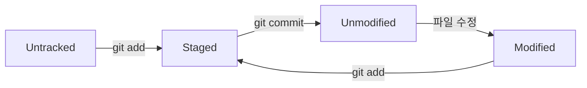
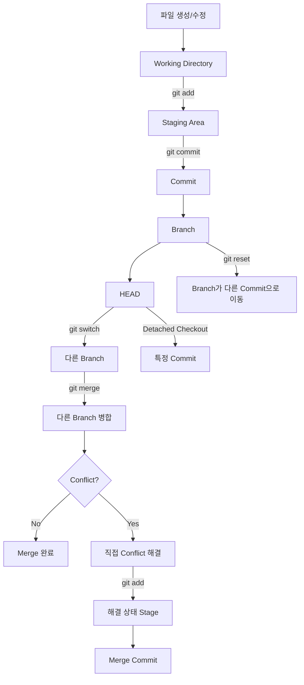

# 녀녕의 git 기초 명령어
[https://youtu.be/kbAvBcLmgwE?si=N03Ww76vGEAe07uG](https://youtu.be/kbAvBcLmgwE?si=N03Ww76vGEAe07uG)

# 녀녕의 git 기초 명령어
* toc
{:toc}

---

## Git 기초부터 제대로 이해하기: add, commit, HEAD, branch, reset, merge는 실제로 어떻게 동작할까?

Git을 처음 배우면 명령어부터 외우기 쉽다.

```bash
git add .
git commit -m "message"
git push
```

처음에는 이것만 알아도 개발을 진행하는 데 큰 문제가 없어 보인다.

하지만 프로젝트를 진행하다 보면 곧 다음과 같은 상황을 만나게 된다.

```text
잘못된 파일을 add했다.

방금 만든 commit을 취소하고 싶다.

예전 commit으로 돌아가고 싶다.

branch를 잘못 만들었다.

HEAD detached 상태가 되었다.

reset --hard를 잘못 실행했다.

merge conflict가 발생했다.

commit이 사라진 것 같다.
```

이때 명령어만 외우고 있으면 Git이 상당히 무섭게 느껴진다.

반대로 Git이 내부적으로 무엇을 가리키고 있으며 각 명령이 **어떤 상태를 변경하는지** 이해하면 대부분의 명령을 훨씬 쉽게 해석할 수 있다.

Git을 이해하기 위한 핵심은 다음 네 가지다.

```text
Working Directory

Staging Area

Commit

HEAD / Branch
```

이 네 개념의 관계를 이해하면 `add`, `commit`, `checkout`, `switch`, `reset`, `merge`, `reflog`도 자연스럽게 연결된다.

---

## Git이란 무엇인가?

Git은 분산 버전 관리 시스템이다.

하지만 처음 Git을 배우는 입장에서는 먼저 **버전 관리 시스템**이라는 개념에 집중하는 것이 좋다.

버전 관리가 없다면 하나의 파일을 수정할 때 다음과 같이 관리하게 될 수 있다.

```text
졸업논문.docx
졸업논문_수정.docx
졸업논문_수정2.docx
졸업논문_최종.docx
졸업논문_진짜최종.docx
졸업논문_진짜최종2.docx
졸업논문_제출용.docx
```

어느 순간 이런 문제가 생긴다.

```text
어떤 파일이 진짜 최신 버전이지?

어제 수정하기 전 내용으로 돌아가고 싶은데?

누가 어떤 부분을 바꿨지?

두 사람이 동시에 수정한 내용은 어떻게 합치지?
```

Git을 사용하면 파일 이름을 계속 복제하는 대신 하나의 프로젝트 안에서 변경 이력을 관리할 수 있다.

```text
초기 버전
   ↓
기능 추가
   ↓
버그 수정
   ↓
리팩터링
   ↓
최종 버전
```

각 시점으로 이동할 수도 있고, 변경 내용을 비교할 수도 있으며, 여러 개발자가 만든 변경을 합칠 수도 있다.

---

## Git을 사용하면 무엇을 얻을 수 있을까?

Git의 대표적인 장점은 다음과 같다.

```text
변경 이력 관리

과거 버전 복원

실험적인 작업 분리

여러 개발자의 변경 병합

코드 리뷰를 위한 변경 단위 관리

원격 저장소를 이용한 백업과 협업
```

특히 개발에서는 “현재 코드”만큼이나 “어떻게 현재 코드가 되었는가”가 중요하다.

예를 들어 장애가 발생했다면 다음 질문을 할 수 있다.

```text
언제부터 문제가 발생했는가?

어떤 commit에서 변경되었는가?

누가 어떤 목적으로 수정했는가?

문제가 생기기 전 상태는 무엇인가?
```

Git은 이런 질문에 답할 수 있도록 프로젝트의 변경 역사를 관리한다.

---

## Git Repository란 무엇인가?

Git을 사용하려면 먼저 해당 디렉터리를 Git Repository로 만들어야 한다.

다음 명령을 실행한다.

```bash
git init
```

실행하면 현재 디렉터리에 `.git`이라는 숨김 디렉터리가 생성된다.

```text
project/
├── .git/
├── src/
└── README.md
```

중요한 점은 `.git`이 일반적인 의미의 “파일”이 아니라 **Git Repository의 핵심 데이터를 보관하는 디렉터리**라는 것이다.

이 안에는 다음과 같은 정보가 들어 있다.

```text
commit 객체

branch 정보

HEAD 정보

index

object database

reference

reflog

repository 설정
```

즉 Git이 프로젝트의 역사를 기억할 수 있는 이유가 `.git` 디렉터리 때문이다.

---

## .git 디렉터리를 삭제하면 어떻게 될까?

현재 프로젝트가 다음 상태라고 하자.

```text
V1
↓
V2
↓
V3
```

Working Directory에는 V3의 파일들이 존재한다.

이 상황에서 `.git` 디렉터리를 삭제하면 현재 파일 자체가 모두 삭제되는 것은 아니다.

```text
현재 Working Directory
→ 그대로 남음
```

하지만 Git이 알고 있던 다음 정보들은 사라진다.

```text
commit history

branch

tag

HEAD

reflog

Git configuration

object database
```

결과적으로 현재 프로젝트 파일들은 남지만 Git이 관리하던 과거 이력을 잃게 된다.

```text
Before

V1 → V2 → V3
            ↑
           HEAD


.git 삭제


현재 V3 파일만 남아 있는
일반 디렉터리
```

따라서 `.git` 디렉터리는 임의로 삭제하면 안 된다.

---

## Commit이란 무엇인가?

Git에서 가장 중요한 개념 중 하나가 Commit이다.

Commit은 특정 시점의 프로젝트 상태를 기록한 하나의 버전이라고 이해할 수 있다.

예를 들어 다음과 같이 개발했다고 하자.

```text
첫 번째 commit
→ Hello World 출력

두 번째 commit
→ 회원가입 기능 추가

세 번째 commit
→ 로그인 기능 추가
```

Git에서는 각 commit이 고유한 식별자를 가진다.

예를 들어 다음과 같다.

```text
a70682f
4b39cf1
9f42abc
```

실제로는 SHA 기반의 더 긴 해시값을 사용하지만 보통 앞부분만 표시한다.

```bash
git log --oneline
```

예를 들어 결과는 다음처럼 보일 수 있다.

```text
a70682f 로그인 기능 추가
4b39cf1 회원가입 기능 추가
019cd31 프로젝트 초기화
```

---

## Git은 파일의 차이만 저장할까?

Git을 설명할 때 다음 표현을 자주 접한다.

```text
Git은 변경된 차이만 저장한다.
```

Git을 처음 이해하는 데는 직관적이지만 정확한 내부 모델은 조금 다르다.

Git은 기본적으로 각 commit에서 프로젝트의 상태를 **스냅샷(snapshot)** 형태로 바라본다.

```text
Commit A
→ 프로젝트 Snapshot A

Commit B
→ 프로젝트 Snapshot B

Commit C
→ 프로젝트 Snapshot C
```

변경되지 않은 파일은 기존 객체를 재사용할 수 있기 때문에 실제 저장 공간을 매번 전체 복사본만큼 사용하는 것은 아니다.

따라서 다음처럼 이해하는 것이 좋다.

```text
사용자 관점
→ 각 commit은 프로젝트의 특정 시점 Snapshot

저장 관점
→ 동일한 객체는 재사용하며 효율적으로 저장
```

Git의 diff는 두 스냅샷을 비교하여 “무엇이 변경되었는지” 보여주는 개념에 가깝다.

---

## Working Directory란 무엇인가?

Git Repository에서 우리가 실제로 파일을 수정하는 공간이다.

예를 들어 다음 파일을 수정한다고 하자.

```java
public class Main {

    public static void main(String[] args) {
        System.out.println("Hello Git");
    }
}
```

이 파일을 저장했다고 바로 Git commit에 포함되는 것은 아니다.

현재는 단순히 Working Directory에서 파일이 변경된 상태다.

```text
Repository의 기존 Commit

        ↓ checkout

Working Directory

        ↓ 직접 수정

Modified File
```

이 변경을 commit하려면 먼저 Staging Area를 거쳐야 한다.

---

## Staging Area란 무엇인가?

Git의 중요한 특징 중 하나다.

Working Directory에서 수정한 모든 내용을 바로 commit하지 않고, **이번 commit에 포함할 변경을 선택할 수 있는 공간**이 있다.

이를 Staging Area 또는 Index라고 한다.

구조를 단순화하면 다음과 같다.

```text
Working Directory
        ↓
      git add
        ↓
Staging Area
        ↓
    git commit
        ↓
Repository
```

예를 들어 세 파일을 수정했다고 하자.

```text
User.java
Order.java
application.yml
```

그런데 이번 commit에는 `User.java`만 포함하고 싶다.

```bash
git add User.java
```

그러면 다음과 같은 상태가 된다.

```text
Working Directory

User.java
Order.java
application.yml


Staging Area

User.java
```

이후 commit하면 `User.java`의 stage된 변경만 commit 대상이 된다.

---

## 왜 Staging Area가 필요할까?

Staging Area가 없다면 수정한 모든 내용을 하나의 commit으로 만들 가능성이 커진다.

예를 들어 작업 중 다음 세 가지가 동시에 발생했다고 하자.

```text
회원가입 버그 수정

로그 메시지 수정

README 오타 수정
```

모두 한 commit에 들어가면 다음처럼 된다.

```text
회원가입 수정 + 로그 변경 + 문서 수정
```

하지만 각각 stage하면 commit을 의미 있는 단위로 나눌 수 있다.

```text
Commit 1
회원가입 버그 수정

Commit 2
로그 메시지 수정

Commit 3
README 오타 수정
```

따라서 `git add`는 단순히 “저장 준비”를 하는 명령이 아니라 **다음 commit에 어떤 변경을 포함할지 선택하는 작업**으로 이해하는 것이 좋다.

---

## git add

파일의 현재 변경 내용을 Staging Area에 반영한다.

```bash
git add User.java
```

여러 파일을 지정할 수도 있다.

```bash
git add User.java Order.java
```

현재 디렉터리 아래의 변경을 stage하려면 다음과 같이 사용할 수 있다.

```bash
git add .
```

하지만 실무에서는 무조건 `git add .`부터 실행하기보다 변경 내용을 먼저 확인하는 습관이 좋다.

```bash
git status
```

또는

```bash
git diff
```

그리고 필요한 파일만 stage한다.

```bash
git add src/main/java/User.java
```

---

## 잘못 add한 파일을 취소하고 싶다면?

파일은 수정된 상태로 그대로 두고 Staging Area에서만 제거하고 싶을 수 있다.

현대 Git에서는 다음 명령을 사용하는 것이 의도가 명확하다.

```bash
git restore --staged User.java
```

이후 상태는 다음과 같다.

```text
Before

Working Directory
User.java 수정됨

Staging Area
User.java


After

Working Directory
User.java 수정됨

Staging Area
없음
```

즉 파일 수정 내용이 삭제되는 것은 아니다.

단지 다음 commit의 대상에서 제외된다.

과거에는 다음 명령도 많이 사용했다.

```bash
git reset HEAD User.java
```

둘 다 상황에 따라 볼 수 있지만, 최근 Git에서는 restore/switch 명령이 작업 목적을 더 명확하게 표현한다.

---

## git status

현재 Repository의 상태를 확인할 때 가장 자주 사용하는 명령 중 하나다.

```bash
git status
```

Git은 다음과 같은 정보를 보여준다.

```text
현재 branch

Staging Area에 올라간 변경

수정되었지만 stage되지 않은 변경

Untracked 파일
```

예를 들어 다음처럼 나타날 수 있다.

```text
Changes to be committed:
    modified: User.java

Changes not staged for commit:
    modified: Order.java

Untracked files:
    password.txt
```

이 상태는 다음을 의미한다.

```text
User.java
→ commit 예정

Order.java
→ 수정했지만 아직 stage하지 않음

password.txt
→ Git이 아직 추적하지 않는 파일
```

---

## Tracked와 Untracked

Git에서는 파일을 크게 Tracked와 Untracked로 구분할 수 있다.

### Untracked

Git이 아직 버전 관리 대상으로 알고 있지 않은 파일이다.

새 파일을 생성하면 보통 처음에는 Untracked 상태다.

```text
새로운 파일 생성
↓
Untracked
```

예를 들어 다음과 같다.

```text
new-file.txt
```

`git status`에서 Untracked files로 표시된다.

---

## Tracked

Git이 이미 관리하고 있는 파일이다.

Tracked 파일은 내부적으로 다시 여러 상태가 될 수 있다.

```text
Unmodified
Modified
Staged
```

흐름을 보면 다음과 같다.



따라서 단순히 “한 번 add되면 tracked”라고 외우기보다는 **Git의 관리 대상이 된 파일**이라고 이해하는 것이 더 정확하다.

---

## git commit

Staging Area의 상태를 기반으로 새로운 commit을 만든다.

```bash
git commit -m "회원가입 기능 추가"
```

Commit이 생성되면 새로운 commit은 일반적으로 현재 commit을 부모로 가진다.

예를 들어 다음 상태라고 하자.

```text
A
↑
HEAD
```

새로운 commit B를 생성한다.

```text
A → B
    ↑
   HEAD
```

다시 C를 만든다.

```text
A → B → C
        ↑
       HEAD
```

이렇게 Git의 commit들은 부모 관계를 통해 연결된다.

---

## Commit ID는 어떻게 만들어질까?

Git의 각 객체에는 해시 기반의 식별자가 존재한다.

Commit 객체에는 개념적으로 다음과 같은 정보가 포함된다.

```text
프로젝트 Tree 정보

부모 Commit

작성자

Committer

시간

Commit Message
```

이 정보를 기반으로 해시가 계산되므로 내용이 달라지면 다른 commit ID가 만들어진다.

```text
Commit A
→ 9d2afe...

Commit B
→ a70682...
```

이를 이용해 Git은 특정 버전을 고유하게 식별한다.

---

## git commit -a

다음과 같이 사용할 수도 있다.

```bash
git commit -am "수정"
```

`-a`는 이미 Tracked 상태인 파일의 수정 및 삭제 변경을 자동으로 stage해서 commit한다.

하지만 중요한 제한이 있다.

```text
새로운 Untracked 파일
→ 자동으로 포함되지 않음
```

예를 들어

```text
User.java
→ 기존 tracked 파일 수정

NewService.java
→ 새로 만든 untracked 파일
```

이라면 `git commit -a`는 `User.java` 변경은 처리할 수 있지만 `NewService.java`는 자동으로 추가하지 않는다.

새 파일은 먼저 `git add`가 필요하다.

---

## .gitignore

프로젝트에는 Git이 추적하면 안 되는 파일들이 존재한다.

예를 들어 다음과 같다.

```text
IDE 설정

빌드 결과

로그

환경별 설정

임시 파일

로컬 전용 파일
```

이런 파일을 `.gitignore`에 작성할 수 있다.

예를 들어 Spring Boot 프로젝트라면 다음과 같이 사용할 수 있다.

```text
.gradle/
build/
.idea/
*.iml
*.log
```

---

## .gitignore에 비밀번호를 넣었다면 안전할까?

여기서 매우 중요한 점이 있다.

`.gitignore`는 **이미 Git이 추적하고 있는 파일을 자동으로 추적 해제하지 않는다.**

예를 들어 다음 파일을 이미 commit했다고 하자.

```text
application-secret.yml
```

이후 `.gitignore`에 추가한다.

```text
application-secret.yml
```

그렇다고 기존 Git history에서 해당 파일이 사라지는 것은 아니다.

이미 commit된 민감정보는 과거 commit에도 남아 있을 수 있다.

따라서 비밀번호, API Key, 인증서 개인키 같은 Secret은 애초에 Repository에 commit하지 않는 것이 중요하다.

실무에서는 다음과 같은 방법을 고려한다.

```text
Environment Variable

AWS Secrets Manager

Azure Key Vault

HashiCorp Vault

Kubernetes Secret

CI/CD Secret
```

Git에 Secret을 한 번 올렸다면 단순히 파일을 삭제하는 것으로 끝내지 말고 해당 Secret 자체도 폐기하고 재발급하는 것이 안전하다.

---

## HEAD란 무엇인가?

HEAD는 Git을 이해하는 핵심 개념이다.

흔히 “현재 작업 중인 위치”라고 설명하지만 조금 더 정확히 말하면 **현재 checkout된 commit 또는 branch를 나타내는 참조**다.

일반적인 상태에서는 HEAD가 branch를 가리킨다.

```text
A → B → C
        ↑
       main
        ↑
       HEAD
```

즉

```text
HEAD
→ main
→ Commit C
```

라는 관계다.

---

## Branch란 무엇인가?

Branch를 처음 배우면 프로젝트 복사본이라고 이해하는 경우가 많다.

실제로 작업 경험상 그렇게 느낄 수 있지만 Git 내부에서는 훨씬 가벼운 개념이다.

Branch는 기본적으로 **특정 commit을 가리키는 이동 가능한 포인터**라고 이해하는 것이 좋다.

```text
A → B → C
        ↑
       main
```

여기에서 feature branch를 만든다.

```bash
git branch feature
```

그러면 다음과 같은 상태가 된다.

```text
A → B → C
        ↑
     main
     feature
```

파일 전체를 실제로 하나 더 복사해서 저장하는 것이 아니다.

두 branch가 같은 commit C를 가리키고 있을 뿐이다.

---

## Branch가 가벼운 이유

기존 버전 관리 시스템처럼 프로젝트 전체를 복사한다면 branch 생성 비용이 상당할 수 있다.

Git의 branch는 하나의 참조이기 때문에 매우 빠르게 만들 수 있다.

```text
branch
≈ commit을 가리키는 이름
```

이 덕분에 다음과 같은 작업 방식을 쉽게 사용할 수 있다.

```text
main

feature/login

feature/payment

fix/order-bug

refactor/user
```

각 작업을 branch 단위로 분리할 수 있다.

---

## git branch

현재 HEAD가 위치한 commit을 가리키는 새로운 branch를 만든다.

```bash
git branch feature
```

중요한 점은 branch만 생성하며 **그 branch로 이동하지는 않는다**는 것이다.

```text
Before

A → B
    ↑
   main
   HEAD


git branch feature


A → B
    ↑
   main
   feature
   HEAD → main
```

HEAD는 여전히 main을 가리킨다.

---

## branch를 만들면서 바로 이동하기

과거에는 다음 명령을 많이 사용했다.

```bash
git checkout -b feature
```

이는 다음 두 작업을 한 번에 수행한다.

```text
git branch feature

+

git checkout feature
```

현대 Git에서는 목적이 더 명확한 `switch`를 사용할 수도 있다.

```bash
git switch -c feature
```

기존 branch로 이동할 때는

```bash
git switch feature
```

를 사용할 수 있다.

---

## checkout은 무엇을 하는가?

`git checkout`은 역사적으로 여러 역할을 담당했다.

```text
branch 이동

commit 이동

파일 복원
```

그래서 처음 Git을 배우는 사람이 혼란스러워하는 명령 중 하나다.

예를 들어

```bash
git checkout feature
```

를 실행하면 feature branch로 이동한다.

반면

```bash
git checkout a70682f
```

처럼 commit ID를 직접 지정하면 특정 commit으로 이동할 수 있다.

이 경우 **Detached HEAD** 상태가 될 수 있다.

---

## Attached HEAD

일반적인 상태다.

HEAD가 branch를 가리킨다.

```text
HEAD
 ↓
main
 ↓
C
```

새로운 commit D를 만든다.

```text
A → B → C → D
            ↑
           main
            ↑
           HEAD
```

branch가 새로운 commit으로 함께 이동한다.

---

## Detached HEAD란 무엇인가?

HEAD가 branch가 아니라 commit을 직접 가리키는 상태다.

```text
main
 ↓
C

HEAD
 ↓
B
```

예를 들어 다음 명령으로 만들 수 있다.

```bash
git switch --detach <commit-id>
```

또는 기존 방식으로

```bash
git checkout <commit-id>
```

를 사용할 수도 있다.

Detached HEAD 자체가 오류는 아니다.

과거 버전을 확인하거나 테스트할 때 유용하다.

---

## Detached HEAD 상태에서 Commit하면 어떻게 될까?

다음 상태라고 하자.

```text
A → B → C
        ↑
       main

HEAD → B
```

Detached HEAD 상태에서 commit D를 만든다.

```text
A → B → C
     \
      D
      ↑
     HEAD
```

D를 가리키는 branch는 아직 없다.

이후 main으로 돌아간다.

```bash
git switch main
```

그러면 D는 일반 `git log` 흐름에서 보이지 않을 수 있다.

```text
A → B → C
        ↑
       main
       HEAD

     D
```

D가 즉시 삭제된 것은 아니지만 이름 있는 branch에서 도달할 수 없는 상태가 된다.

---

## Detached HEAD에서 만든 작업을 보존하려면?

해당 commit에서 branch를 만들면 된다.

```bash
git switch -c experiment
```

그러면

```text
A → B → C
     \
      D
      ↑
   experiment
      ↑
     HEAD
```

가 된다.

이제 D는 experiment branch를 통해 안전하게 참조된다.

---

## 사라진 Commit은 reflog로 찾을 수 있다

Git을 사용하다 보면 다음과 같은 상황이 생긴다.

```text
reset을 잘못했다.

Detached HEAD에서 commit한 뒤 branch를 이동했다.

rebase하다가 이전 commit을 찾고 싶다.
```

이때 매우 유용한 것이 reflog다.

```bash
git reflog
```

예를 들어 다음처럼 출력될 수 있다.

```text
a70682f HEAD@{0}: checkout: moving from feature to main
9ab321c HEAD@{1}: commit: 실험 기능 추가
c441b72 HEAD@{2}: checkout: moving from main to 9ab321c
```

reflog는 로컬 Repository에서 HEAD와 참조가 어떻게 움직였는지 기록한다.

따라서 commit ID를 찾아 다시 branch를 만들 수 있다.

```bash
git branch recovery 9ab321c
```

---

## Git은 Commit을 절대로 삭제하지 않을까?

Git 객체는 불변 객체처럼 새롭게 생성되는 방식으로 동작하므로 기존 commit 내용을 직접 수정하는 방식과는 다르다.

하지만 다음 표현은 조심해야 한다.

```text
Git은 어떤 commit도 절대로 지우지 않는다.
```

참조되지 않는 객체는 일정 시간이 지나고 Garbage Collection이 이루어지면 실제로 제거될 수 있다.

따라서 reflog도 영구 백업 시스템은 아니다.

```text
실수 발견
↓
가능한 빨리 reflog 확인
↓
branch 또는 tag로 참조 생성
```

하는 것이 안전하다.

---

## reset이란 무엇인가?

`git reset`은 처음 배우면 상당히 혼란스럽다.

왜냐하면 옵션에 따라 변경 범위가 달라지기 때문이다.

대표적으로 다음 세 가지가 있다.

```text
--soft

--mixed

--hard
```

Git 상태를 다음 세 영역으로 생각하면 이해하기 쉽다.

```text
Commit
Staging Area
Working Directory
```

---

## git reset --soft

Commit 위치만 이동시키고 Staging Area와 Working Directory의 변경은 유지한다.

```bash
git reset --soft HEAD~1
```

예를 들어

```text
A → B → C
        ↑
       main
```

에서 실행하면

```text
A → B
    ↑
   main
```

으로 branch가 이동한다.

하지만 C에서 했던 변경은 Staging Area에 남는다.

따라서 commit만 다시 만들고 싶을 때 활용할 수 있다.

---

## git reset --mixed

기본 reset 방식이다.

```bash
git reset HEAD~1
```

또는

```bash
git reset --mixed HEAD~1
```

Commit과 Staging Area를 되돌리지만 Working Directory 변경은 유지한다.

개념적으로 다음과 같다.

```text
Commit
→ 이동

Staging Area
→ 초기화

Working Directory
→ 유지
```

---

## git reset --hard

가장 주의해서 사용해야 하는 옵션이다.

```bash
git reset --hard HEAD~1
```

다음 세 영역을 대상 commit 기준으로 맞춘다.

```text
현재 branch
Staging Area
Working Directory
```

즉 Working Directory에서 아직 commit하지 않은 변경까지 삭제될 수 있다.

```text
reset --hard

Commit 이동
+
Stage 변경
+
Working Directory 변경
```

그래서 실행 전에 반드시 확인해야 한다.

```bash
git status
```

---

## reset은 HEAD가 아니라 Branch를 이동시키는가?

Attached HEAD 상태에서는 다음처럼 되어 있다.

```text
HEAD
 ↓
main
 ↓
C
```

여기서

```bash
git reset --hard B
```

를 실행하면 실질적으로 현재 branch인 `main`의 참조가 B로 이동한다.

```text
HEAD
 ↓
main
 ↓
B
```

따라서 일반적인 상황에서는

```text
checkout / switch
→ 어떤 branch 또는 commit을 바라볼지 변경

reset
→ 현재 branch가 가리키는 commit을 변경
```

으로 구분하면 이해하기 쉽다.

---

## switch와 reset의 차이

두 명령은 역할이 상당히 다르다.

### switch

```bash
git switch feature
```

내가 작업할 branch를 변경한다.

```text
main → C

feature → D
            ↑
           HEAD
```

### reset

```bash
git reset --hard B
```

현재 branch 자체를 다른 commit으로 이동시킨다.

```text
Before

A → B → C
        ↑
       main


After

A → B
    ↑
   main
```

이 차이를 이해하면 Git 명령어가 훨씬 명확해진다.

---

## Branch를 사용하는 이유

새로운 기능을 실험한다고 하자.

```text
main

현재 안정적으로 동작
```

바로 main에서 작업하면 개발 도중 코드가 깨질 수 있다.

feature branch를 만든다.

```bash
git switch -c feature/payment
```

구조는 다음과 같다.

```text
A → B → C
        ↑
       main
        \
         D → E
             ↑
        feature/payment
```

feature branch에서 자유롭게 작업할 수 있다.

작업이 성공하면 main에 합친다.

이 과정이 merge다.

---

## Merge란 무엇인가?

두 개발 흐름을 하나로 합치는 작업이다.

예를 들어 다음과 같은 상태가 있다고 하자.

```text
        C → D
       /
A → B
       \
        E → F
```

`main`이 D를 가리키고 `feature`가 F를 가리킨다고 하자.

```text
        C → D  ← main
       /
A → B
       \
        E → F  ← feature
```

feature 변경을 main에 반영하려면 먼저 main으로 이동한다.

```bash
git switch main
```

그리고

```bash
git merge feature
```

를 실행한다.

중요한 것은 다음이다.

> `git merge feature`는 현재 branch에 feature의 변경을 병합한다.

즉 어느 branch에 서 있는지가 중요하다.

---

## Fast-Forward Merge

Branch가 갈라진 이후 main에 새로운 commit이 없다면 단순히 branch 포인터를 앞으로 이동할 수 있다.

```text
A → B → C
    ↑    ↑
   main feature
```

main에서

```bash
git merge feature
```

를 실행하면

```text
A → B → C
        ↑
       main
      feature
```

처럼 이동할 수 있다.

별도의 merge commit이 필요하지 않을 수 있다.

이를 Fast-Forward Merge라고 한다.

---

## 3-Way Merge

두 branch가 서로 다른 방향으로 변경되었다면 공통 조상까지 고려해야 한다.

```text
        C → D
       /
A → B
       \
        E → F
```

여기에서 세 지점을 비교한다.

```text
현재 branch
→ D

병합할 branch
→ F

공통 조상
→ B
```

그래서 3-Way Merge라고 부른다.

Git은 B를 기준으로

```text
B → D에서 무엇이 변경되었는가?

B → F에서 무엇이 변경되었는가?
```

를 비교하고 두 변경을 합친다.

---

## Merge Commit

3-Way Merge가 정상적으로 완료되면 새로운 merge commit이 만들어질 수 있다.

```text
        C → D
       /     \
A → B         G
       \     /
        E → F
```

G는 두 부모를 가지는 commit이다.

```text
parent 1
→ D

parent 2
→ F
```

이렇게 두 개발 흐름이 하나로 합쳐진다.

---

## Conflict는 왜 발생할까?

Git은 다른 위치에서 발생한 변경은 자동으로 합칠 수 있는 경우가 많다.

예를 들어 main에서 A를 수정하고 feature에서 B를 수정했다.

```text
main
→ A 수정

feature
→ B 수정
```

서로 다른 부분이라면 Git이 자동으로 병합할 가능성이 높다.

하지만 같은 부분을 서로 다르게 수정하면 문제가 생긴다.

```text
main

message = "hello"


feature

message = "hi"
```

Git 입장에서는 어떤 값이 맞는지 판단할 수 없다.

```text
hello?

hi?
```

이것이 Merge Conflict다.

---

## Conflict가 발생하면 파일은 어떻게 보일까?

Git은 충돌한 부분을 다음과 같이 표시할 수 있다.

```text
<<<<<<< HEAD
message = "hello";
=======
message = "hi";
>>>>>>> feature
```

각 영역은 다음 의미를 가진다.

```text
<<<<<<< HEAD

현재 branch의 내용


=======

구분선


>>>>>>> feature

병합 대상 branch의 내용
```

개발자가 어떤 내용이 최종 코드가 되어야 하는지 직접 결정해야 한다.

---

## Conflict 해결

예를 들어 최종적으로 다음 코드를 사용하기로 결정했다고 하자.

```java
message = "hello";
```

Conflict Marker를 제거하고 파일을 수정한다.

그다음 Git에 충돌을 해결했다고 알려야 한다.

```bash
git add ConflictFile.java
```

여기에서 `git add`는 단순히 새로운 파일을 stage한다는 의미뿐만 아니라 **이 파일의 충돌을 해결한 결과를 Index에 반영했다**는 의미도 가진다.

모든 conflict를 해결하면

```bash
git status
```

로 상태를 확인한다.

이후 merge를 완료한다.

```bash
git commit
```

또는 상황에 따라

```bash
git merge --continue
```

를 사용할 수 있다.

---

## Merge를 취소하고 싶다면

Conflict 해결 과정에서 작업을 포기하고 merge 이전 상태로 돌아가고 싶을 수도 있다.

```bash
git merge --abort
```

가능한 경우 merge를 시작하기 전 상태로 되돌린다.

Conflict가 발생했다고 무조건 끝까지 해결해야 하는 것은 아니다.

---

## Conflict 해결의 핵심은 코드를 선택하는 것이 아니다

초보 개발자는 conflict가 발생하면 다음 중 하나를 선택하려고 한다.

```text
Current Change

Incoming Change
```

하지만 실제 conflict 해결은 단순히 둘 중 하나를 선택하는 작업이 아닐 수 있다.

예를 들어

```text
Current

price = price * quantity;


Incoming

price = discount(price);
```

두 변경 모두 필요하다면 최종 코드는 다음처럼 되어야 할 수 있다.

```java
price = discount(price) * quantity;
```

따라서 Conflict Resolution의 핵심은

> 두 branch가 각각 무엇을 의도했는지 이해하고 올바른 최종 코드를 만드는 것

이다.

---

## Git의 전체 상태 변화

지금까지 살펴본 구조를 한 번에 연결하면 다음과 같다.



Git 명령을 따로 외우기보다 이 상태 변화를 이해하는 것이 중요하다.

---

## Git 명령어를 목적별로 정리하면

| 목적              | 명령                     |
| --------------- | ---------------------- |
| Repository 생성   | `git init`             |
| 현재 상태 확인        | `git status`           |
| 변경 내용 확인        | `git diff`             |
| Stage           | `git add`              |
| Stage 취소        | `git restore --staged` |
| Commit          | `git commit`           |
| History 확인      | `git log`              |
| Branch 생성       | `git branch`           |
| Branch 이동       | `git switch`           |
| 생성 + 이동         | `git switch -c`        |
| 특정 Commit 확인    | `git switch --detach`  |
| 현재 Branch 위치 변경 | `git reset`            |
| HEAD 이동 이력 확인   | `git reflog`           |
| Branch 병합       | `git merge`            |
| Merge 취소        | `git merge --abort`    |

명령어 하나보다 중요한 것은 **무엇을 움직이고 있는가**이다.

---

## HEAD와 Branch를 그림으로 이해하기

Git에서 가장 중요한 구조를 다시 살펴보자.

일반적인 상태는 다음과 같다.

```text
HEAD
 ↓
main
 ↓
C
```

새로운 commit을 만든다.

```text
A → B → C → D
            ↑
           main
            ↑
           HEAD
```

feature branch로 이동한다.

```text
A → B → C → D
            ↑
           main
            \
             E
             ↑
          feature
             ↑
            HEAD
```

main으로 다시 이동한다.

```text
A → B → C → D
            ↑
           main
            ↑
           HEAD
            \
             E
             ↑
          feature
```

이 그림이 머릿속에 있으면 checkout, switch, reset, branch가 훨씬 쉬워진다.

---

## 실무에서 git checkout보다 switch와 restore를 사용하는 이유

과거에는 `checkout` 하나가 여러 역할을 담당했다.

```text
Branch 이동

Detached HEAD 이동

파일 복원
```

예를 들어

```bash
git checkout feature
```

와

```bash
git checkout -- User.java
```

가 전혀 다른 목적을 가진다.

이런 혼란을 줄이기 위해 Git에서는 역할을 나눈 명령이 제공된다.

```text
switch
→ Branch / Commit 이동

restore
→ 파일 복원
```

예를 들어 branch 이동은

```bash
git switch feature
```

새 branch 생성과 이동은

```bash
git switch -c feature
```

파일 변경 복원은

```bash
git restore User.java
```

처럼 표현할 수 있다.

기존 `checkout`도 여전히 많이 볼 수 있으므로 둘 다 이해하는 것이 좋다.

---

## restore는 reset --hard보다 안전하게 사용할 수 있다

특정 파일의 수정만 버리고 싶다고 하자.

```bash
git restore User.java
```

이 명령은 해당 파일의 Working Directory 변경을 복원한다.

반면

```bash
git reset --hard HEAD
```

는 전체 Working Directory와 Index를 변경할 수 있다.

그래서 작은 범위의 작업이라면 더 명시적인 명령을 사용하는 편이 실수를 줄이는 데 도움이 된다.

---

## 실무에서 Commit은 얼마나 작게 만들어야 할까?

좋은 commit은 단순히 파일을 저장한 흔적이 아니다.

하나의 의미 있는 변경 단위를 표현하는 것이 좋다.

예를 들어 다음 commit은 너무 많은 책임을 포함하고 있다.

```text
회원가입 추가, 로그인 수정,
README 수정, 결제 버그 수정
```

가능하다면 다음과 같이 나누는 편이 좋다.

```text
feat: 회원가입 API 추가

fix: 로그인 실패 처리 수정

fix: 결제 승인 중복 요청 방지

docs: 로컬 실행 방법 추가
```

Commit이 작고 명확하면 다음 작업이 쉬워진다.

```text
Code Review

Revert

Cherry-Pick

Bisect

History 분석
```

---

## add 전에 diff를 확인하는 습관

다음 명령은 매우 유용하다.

```bash
git diff
```

아직 stage하지 않은 변경을 확인한다.

Stage한 변경은 다음처럼 확인할 수 있다.

```bash
git diff --staged
```

따라서 commit 전에 다음 흐름을 사용할 수 있다.

```bash
git status
git diff
git add User.java
git diff --staged
git commit
```

이 과정을 습관화하면 원하지 않는 변경이 commit되는 것을 크게 줄일 수 있다.

---

## git log를 읽는 습관

현재 commit history를 확인한다.

```bash
git log --oneline --graph --decorate --all
```

예를 들어 다음처럼 나타날 수 있다.

```text
*   98be21c (HEAD -> main) Merge branch 'feature'
|\
| * 81cf123 (feature) 로그인 기능 추가
* | 47abc11 회원가입 수정
|/
* 312cdf1 프로젝트 초기화
```

`--graph`를 사용하면 branch 관계를 훨씬 직관적으로 볼 수 있다.

Git을 이해하는 데 매우 좋은 명령이다.

---

## reset과 revert는 다르다

Git을 실무에서 사용한다면 반드시 구분해야 하는 개념이다.

### reset

branch의 참조 자체를 과거 commit으로 이동한다.

```text
Before

A → B → C
        ↑
       main


reset B


A → B
    ↑
   main

C
```

History 자체를 다시 구성하는 데 가깝다.

### revert

기존 commit을 없애지 않고 그 변경을 반대로 적용하는 새로운 commit을 만든다.

```text
A → B → C → D
```

D가 C의 변경을 취소하는 commit이다.

공유된 branch에서는 일반적으로 history를 다시 쓰는 reset보다 revert가 안전한 경우가 많다.

---

## 이미 Push한 Commit에서는 특히 조심해야 한다

로컬에서 아직 혼자 사용하는 branch라면 reset이나 rebase를 비교적 자유롭게 사용할 수 있다.

하지만 여러 개발자가 공유하는 branch를 강제로 과거로 돌리면 문제가 생길 수 있다.

예를 들어

```text
origin/main

A → B → C
```

를 누군가 이미 사용하고 있는데 강제로

```text
A → B
```

로 history를 바꾸면 다른 개발자의 history와 충돌할 수 있다.

따라서 공유 branch에서는

```text
reset 후 force push
```

를 매우 조심해야 한다.

이미 공개된 변경을 되돌려야 한다면 상황에 따라 `git revert`가 더 적합할 수 있다.

---

## Git이 무서운 이유는 데이터가 사라져서가 아니라 상태가 보이지 않기 때문이다

Git을 처음 사용할 때 가장 무서운 순간은 다음과 같다.

```text
내 commit 어디 갔지?
```

하지만 상당수의 경우 commit 자체가 즉시 사라진 것이 아니라 branch나 HEAD가 더 이상 그 commit을 가리키지 않는 상태다.

```text
Commit 존재

하지만

Branch Reference 없음
```

이럴 때 다음을 확인할 수 있다.

```bash
git reflog
```

따라서 Git에서 문제가 생기면 무작정 명령을 추가로 실행하기보다 먼저 현재 상태부터 확인하는 것이 좋다.

```bash
git status
```

```bash
git log --oneline --graph --decorate --all
```

```bash
git reflog
```

이 세 명령만으로도 많은 상황을 파악할 수 있다.

---

## 실무에서 Git 문제가 생겼을 때 확인 순서

Git 상태가 꼬였다고 느껴지면 다음 순서로 접근하는 것이 좋다.

### 1. 현재 상태 확인

```bash
git status
```

확인한다.

```text
어느 branch인가?

Merge 중인가?

Rebase 중인가?

Stage된 파일이 있는가?

Untracked 파일이 있는가?
```

### 2. History 확인

```bash
git log --oneline --graph --decorate --all
```

Branch가 어느 commit을 가리키는지 확인한다.

### 3. 변경 내용 확인

```bash
git diff
```

```bash
git diff --staged
```

현재 작업을 확인한다.

### 4. HEAD 이동 이력 확인

필요한 경우

```bash
git reflog
```

를 확인한다.

### 5. 그다음 명령 실행

상태를 이해하고 나서

```text
restore

reset

revert

switch

merge --abort
```

중 필요한 명령을 선택한다.

---

## Git의 핵심 구조

Git의 핵심을 다시 정리하면 다음 그림으로 표현할 수 있다.


이 구조만 확실히 이해해도 대부분의 Git 명령을 암기할 필요가 크게 줄어든다.

---

## 실무에서의 활용

실제 개발에서는 다음과 같은 흐름이 많이 사용된다.

먼저 main을 최신화한다.

```bash
git switch main
git pull
```

새 기능 branch를 만든다.

```bash
git switch -c feature/payment
```

작업한다.

```bash
git status
git diff
```

필요한 변경만 stage한다.

```bash
git add src/main/java/payment
```

Stage 내용을 확인한다.

```bash
git diff --staged
```

Commit한다.

```bash
git commit -m "feat: 결제 승인 기능 추가"
```

필요하다면 main 변경을 가져오고 conflict를 해결한다.

마지막으로 Pull Request를 통해 리뷰를 받고 병합한다.

이 과정에서 Git은 단순 저장 도구가 아니라 **변경 단위를 만들고 여러 개발자의 작업 흐름을 관리하는 도구**가 된다.

---

## 정리

Git은 명령어를 많이 외우는 것보다 객체와 참조의 관계를 이해하는 것이 훨씬 중요하다.

먼저 Working Directory에서 파일을 수정한다.

```text
Working Directory
```

`git add`를 실행하면 이번 commit에 포함할 변경이 Staging Area에 기록된다.

```text
Working Directory
      ↓
   git add
      ↓
Staging Area
```

`git commit`을 실행하면 새로운 commit이 만들어진다.

```text
Staging Area
      ↓
 git commit
      ↓
   Commit
```

Branch는 일반적으로 특정 commit을 가리키는 이동 가능한 참조다.

```text
HEAD
 ↓
main
 ↓
Commit
```

새 commit이 생기면 현재 branch가 앞으로 이동한다.

```text
A → B → C
        ↑
       main
        ↑
       HEAD
```

특정 commit을 직접 checkout하면 Detached HEAD 상태가 될 수 있으며, 이 상태에서 만든 작업을 보존하려면 branch를 생성하는 것이 좋다.

```text
HEAD
↓
Commit

→ branch 생성

HEAD
↓
Branch
↓
Commit
```

`reset`은 현재 branch가 가리키는 commit을 변경할 수 있으며 `--hard`는 Working Directory까지 변경하므로 특히 주의해야 한다.

```text
--soft
→ Commit 참조 중심

--mixed
→ Commit + Staging Area

--hard
→ Commit + Staging Area + Working Directory
```

`merge`는 두 branch의 개발 흐름을 합치는 작업이다.

서로 다른 영역의 변경은 Git이 자동으로 병합할 수 있지만 같은 부분을 다르게 수정했다면 Conflict가 발생한다.

```text
Conflict
→ 사람이 의도를 판단
→ 파일 수정
→ git add
→ merge 완료
```

그리고 실수로 commit을 잃어버린 것처럼 보인다면 `reflog`를 확인할 수 있다.

```bash
git reflog
```

결국 Git에서 중요한 질문은 항상 비슷하다.

```text
지금 HEAD는 무엇을 가리키고 있는가?

현재 Branch는 어느 Commit을 가리키고 있는가?

Working Directory에는 어떤 변경이 있는가?

Staging Area에는 무엇이 올라가 있는가?
```

이 네 가지를 확인할 수 있다면 Git이 꼬였다고 느껴지는 대부분의 상황을 훨씬 침착하게 분석할 수 있다.

### 한 줄 요약

**Git의 핵심은 명령어 암기가 아니라 Working Directory, Staging Area, Commit, Branch, HEAD가 어떻게 연결되고 이동하는지를 이해하는 것이며, 이 구조를 알면 add·commit·switch·reset·reflog·merge와 conflict까지 하나의 흐름으로 이해할 수 있다.**
