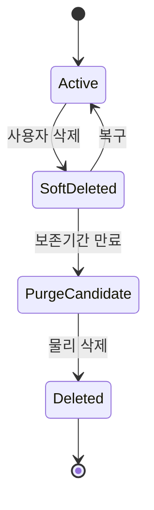
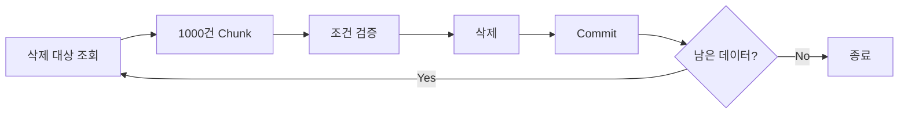
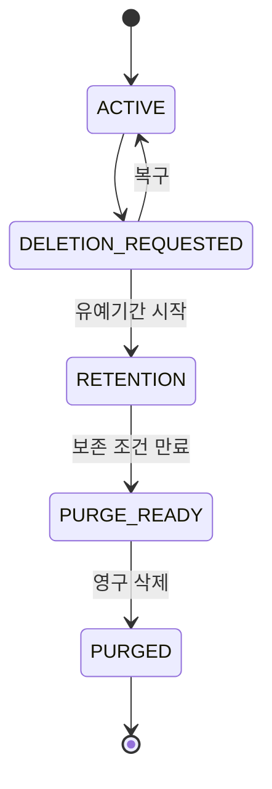
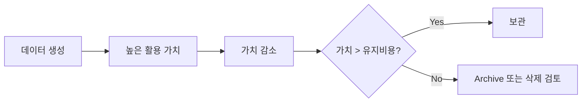
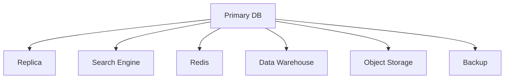
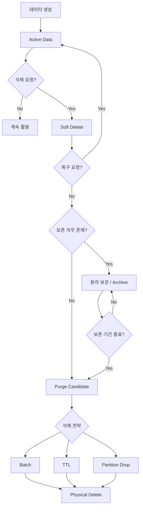

# 우디의 데이터에도 유효기간이 있다 - 데이터 생명주기 관리
[https://youtu.be/w8MU4vluEtk?si=AqXghuHg_50k9lpr](https://youtu.be/w8MU4vluEtk?si=AqXghuHg_50k9lpr)

# 우디의 데이터에도 유효기간이 있다 - 데이터 생명주기 관리
* toc
{:toc}

---

## 데이터 생명주기란 무엇인가? 데이터는 저장보다 삭제가 더 중요할 수 있다

백엔드 시스템을 설계할 때 우리는 보통 데이터를 어떻게 만들고 저장할지부터 고민한다.

```text
회원가입 데이터를 어디에 저장할까?

주문 데이터의 테이블 구조는 어떻게 만들까?

조회 성능을 위해 어떤 인덱스를 만들까?

로그 데이터를 어떻게 수집할까?

사용자 행동 데이터를 어떻게 분석할까?
```

하지만 서비스를 오랫동안 운영하다 보면 또 하나의 질문이 중요해진다.

```text
이 데이터는 언제 삭제할 것인가?
```

처음에는 몇 만 건이던 데이터가 시간이 지나면서 수천만 건, 수억 건으로 증가한다.

사용자가 삭제한 게시글도 남아 있고, 탈퇴한 회원 데이터도 남아 있고, 몇 년 전 접속 기록과 로그 역시 계속 쌓일 수 있다.

삭제 정책이 없다면 데이터베이스는 점점 커지고, 저장 비용과 백업 비용이 증가하며, 오래된 데이터를 포함한 인덱스 역시 비대해질 수 있다.

더 중요한 것은 개인정보와 거래 기록처럼 **오래 보관해야 하는 데이터와 일정 시점 이후 반드시 파기해야 하는 데이터가 동시에 존재할 수 있다는 점**이다.

따라서 데이터 설계는 다음에서 끝나서는 안 된다.

```text
생성
→ 저장
→ 조회
```

처음부터 마지막 단계까지 생각해야 한다.

```text
생성
→ 처리
→ 저장
→ 활용
→ 보관
→ 폐기
```

이 전체 흐름이 데이터 생명주기(Data Lifecycle)다.

---

## 데이터 생명주기란 무엇인가?

데이터 생명주기는 데이터가 만들어진 순간부터 최종적으로 폐기되기까지 거치는 전체 과정을 의미한다.

일반적으로 다음과 같은 흐름으로 생각할 수 있다.


각 단계의 의미는 서로 다르다.

| 단계 | 역할                              |
| -- | ------------------------------- |
| 생성 | API, 이벤트, 사용자 행동 등으로 데이터 발생     |
| 처리 | 검증, 정제, 구조화, 변환                 |
| 저장 | DB, Object Storage, Cache 등에 보관 |
| 활용 | 조회, 추천, 분석, 통계 등 비즈니스에 활용       |
| 보관 | 사용 빈도는 낮지만 필요성이 남은 데이터 관리       |
| 폐기 | 더 이상 필요하지 않은 데이터 제거             |

많은 시스템은 생성·저장·활용에 가장 많은 관심을 둔다.

하지만 서비스 운영 기간이 길어질수록 보관과 폐기의 중요성이 커진다.

---

## 데이터는 왜 계속 쌓이는가?

서비스에는 사용자가 직접 생성하는 데이터만 존재하지 않는다.

예를 들어 일반적인 백엔드 시스템에서도 다음 데이터들이 지속적으로 생성된다.

```text
회원 정보

게시글

댓글

주문 내역

결제 내역

배송 기록

접속 기록

API 요청 로그

에러 로그

사용자 행동 이벤트

검색 기록

클릭 이벤트

추천 시스템 입력 데이터
```

이 중 일부는 사용자가 직접 삭제할 수 있다.

하지만 상당수의 데이터는 별도의 삭제 요청이 발생하지 않는다.

예를 들어 로그 데이터는 사용자가 삭제 버튼을 누르지 않는다.

```text
2026-01-01 접속 로그
2026-01-02 접속 로그
2026-01-03 접속 로그
...
```

정책이 없다면 몇 년 전 로그도 계속 남는다.

따라서 다음 명제는 성립하지 않는다.

```text
삭제 요청이 없다.
=
계속 보관해야 한다.
```

데이터마다 별도의 보존 정책이 필요하다.

---

## 데이터를 계속 보관하면 어떤 문제가 생길까?

데이터가 증가하는 것 자체가 항상 문제인 것은 아니다.

문제는 **가치가 거의 없어진 데이터까지 동일한 비용으로 계속 관리하는 것**이다.

### 스토리지 비용 증가

가장 직접적인 문제다.

```text
100GB
→ 500GB
→ 2TB
→ 10TB
```

Primary Database뿐 아니라 다음 비용도 함께 증가할 수 있다.

```text
Replica

Backup

Snapshot

Disaster Recovery

Object Storage

Network Transfer
```

원본 데이터가 1TB 늘었다고 실제 시스템 전체 비용도 정확히 1TB만 증가하는 것은 아니다.

---

## 인덱스도 함께 커진다

테이블에 인덱스가 있다면 데이터 증가와 함께 인덱스도 커질 수 있다.

예를 들어 다음과 같은 인덱스가 있다고 하자.

```sql
CREATE INDEX idx_orders_user_id
ON orders(user_id);
```

주문 데이터가 계속 누적되면 인덱스 역시 더 많은 엔트리를 관리해야 한다.

인덱스가 메모리에 충분히 올라오지 못하면 디스크 접근이 증가할 수 있고, INSERT·UPDATE·DELETE 과정에서 인덱스 유지 비용도 발생한다.

즉 오래된 데이터는 저장 공간뿐 아니라 **현재 발생하는 데이터의 처리 비용에도 간접적인 영향을 줄 수 있다.**

---

## 백업과 복구 비용도 증가한다

데이터가 커지면 운영 장애 시 복구해야 할 데이터도 많아진다.

```text
Database Size 증가

→ Backup 크기 증가
→ Backup 시간 증가
→ Restore 시간 증가
→ 장애 복구 난이도 증가
```

따라서 데이터 생명주기는 단순 비용 최적화 문제가 아니라 운영 안정성 문제이기도 하다.

---

## 개인정보는 오래 가지고 있을수록 좋은 것이 아니다

개인정보는 다른 데이터보다 더 신중하게 관리해야 한다.

대한민국 개인정보 보호법 제21조는 보유기간 경과, 처리 목적 달성 등으로 개인정보가 불필요하게 된 경우 지체 없이 파기하도록 규정하고 있으며, 다른 법령 때문에 보존해야 한다면 해당 개인정보를 다른 개인정보와 분리하여 저장·관리하도록 규정한다.

따라서 다음과 같은 정책은 위험하다.

```text
언젠가 필요할 수도 있으니까
모든 개인정보를 계속 가지고 있자.
```

데이터를 많이 보유하는 것이 반드시 자산인 것은 아니다.

필요하지 않은 개인정보는 보안 사고가 발생했을 때 오히려 보호해야 할 공격 표면을 넓힐 수 있다.

---

## 그렇다면 사용자가 삭제하면 바로 DELETE하면 될까?

가장 단순한 삭제 방식은 실제 레코드를 제거하는 것이다.

```sql
DELETE FROM posts
WHERE id = 100;
```

이를 Hard Delete 또는 Physical Delete라고 부르기도 한다.

실제로 데이터가 제거되므로 직관적이다.

하지만 현실의 비즈니스에서는 삭제 요청 즉시 모든 데이터를 완전히 제거하기 어려운 경우가 많다.

예를 들어 다음 상황이 있을 수 있다.

```text
사용자가 실수로 삭제했다.

삭제 후 복구 기능을 제공해야 한다.

관리자의 최종 확인이 필요하다.

부정 사용 여부를 검토해야 한다.

관련 통계가 일정 기간 필요하다.

법적으로 일정 기간 보존해야 한다.

연관 데이터 정리가 아직 완료되지 않았다.
```

이런 경우 흔히 사용하는 방법이 Soft Delete다.

---

## Soft Delete란 무엇인가?

Soft Delete는 데이터베이스에서 실제 레코드를 삭제하지 않고 **삭제된 상태임을 표시하는 방식**이다.

예를 들어 게시글 테이블에 다음 컬럼을 추가할 수 있다.

```sql
CREATE TABLE posts (
    id BIGINT PRIMARY KEY,
    title VARCHAR(255),
    content TEXT,
    deleted_at TIMESTAMP NULL
);
```

정상 데이터는 다음과 같다.

```text
deleted_at = NULL
```

사용자가 삭제하면 실제 DELETE를 실행하는 대신 다음과 같이 처리한다.

```sql
UPDATE posts
SET deleted_at = CURRENT_TIMESTAMP
WHERE id = 100;
```

조회에서는 삭제된 데이터를 제외한다.

```sql
SELECT *
FROM posts
WHERE deleted_at IS NULL;
```

클라이언트에서는 게시글이 사라진 것처럼 보인다.

하지만 실제 데이터는 DB에 존재한다.

---

## boolean 방식과 deleted_at 방식

Soft Delete는 다음과 같은 boolean 컬럼으로 표현할 수도 있다.

```sql
is_deleted BOOLEAN
```

하지만 실무에서는 `deleted_at`처럼 삭제 시점까지 기록하는 방식이 유용한 경우가 많다.

```text
is_deleted

장점
→ 단순함

단점
→ 언제 삭제되었는지 알 수 없음
```

반면

```text
deleted_at
```

을 사용하면 다음과 같은 정책을 만들기 쉽다.

```text
삭제된 지 30일 이상
→ 실제 삭제
```

SQL로 표현하면 다음과 같다.

```sql
DELETE FROM posts
WHERE deleted_at < CURRENT_TIMESTAMP - INTERVAL '30 days';
```

즉 상태뿐 아니라 **삭제 시점이 생명주기 관리의 기준**이 된다.

---

## Soft Delete의 진짜 문제

Soft Delete를 구현했다고 데이터 삭제 문제가 해결된 것은 아니다.

오히려 새로운 문제가 시작된다.

```text
사용자 관점

데이터 삭제 완료


Database 관점

데이터 그대로 존재
```

삭제된 데이터가 100건 정도라면 문제가 되지 않을 수 있다.

하지만 서비스가 오래 운영되면 다음처럼 될 수 있다.

```text
정상 데이터
10,000,000건

Soft Deleted 데이터
40,000,000건
```

사용자는 천만 건만 사용하고 있는데 데이터베이스는 오천만 건을 관리하는 상황이다.

이런 데이터를 흔히 비유적으로 유령 데이터라고 표현할 수 있다.

---

## Soft Delete는 삭제가 아니라 삭제 예약에 가깝다

Soft Delete를 다음처럼 바라보면 데이터 생명주기를 이해하기 쉽다.

```text
사용 중
↓
Soft Delete
↓
복구 가능 기간
↓
영구 삭제
```

즉 Soft Delete는

```text
언제 숨길 것인가?
```

에는 답한다.

하지만 다음 질문에는 답하지 않는다.

```text
언제 진짜 지울 것인가?
```

따라서 Soft Delete 정책에는 반드시 다음 단계가 필요하다.



---

## 데이터 삭제에서는 두 가지 질문을 분리해야 한다

데이터 생명주기의 폐기를 설계할 때는 다음 두 가지가 핵심이다.

### 어떻게 삭제할 것인가?

```text
Batch

TTL

Partitioning
```

### 언제 삭제할 것인가?

```text
법적 보존 기간

복구 가능 기간

비즈니스 가치

보안 요구사항

스토리지 비용
```

두 문제는 서로 다르다.

```text
언제?
→ 정책

어떻게?
→ 구현
```

이를 구분하면 삭제 아키텍처가 훨씬 명확해진다.

---

## 첫 번째 삭제 전략: Batch Delete

가장 일반적으로 생각할 수 있는 방법은 배치 작업이다.

예를 들어 다음 정책이 있다고 하자.

```text
Soft Delete 후
30일이 지나면
물리적으로 제거한다.
```

매일 새벽 배치를 실행한다.

```text
매일 03:00

deleted_at < 30일 전

→ Hard Delete
```

간단한 SQL은 다음과 같을 수 있다.

```sql
DELETE FROM posts
WHERE deleted_at < CURRENT_TIMESTAMP - INTERVAL '30 days';
```

하지만 데이터가 수백만 건 존재한다면 한 번에 모두 삭제하는 것은 위험할 수 있다.

---

## 대량 DELETE가 위험한 이유

다음 SQL이 한 번에 500만 건을 삭제한다고 생각해보자.

```sql
DELETE FROM event_logs
WHERE created_at < '2025-01-01';
```

DB에 따라 다음과 같은 부담이 커질 수 있다.

```text
긴 Transaction

많은 Row Lock

Redo / WAL 증가

Replica 전파 부하

Index 변경

Disk I/O 증가

Transaction Log 증가

다른 Query 지연
```

따라서 대규모 데이터를 삭제할 때는 보통 Chunk 단위로 나누어 처리한다.

---

## Chunk Delete

예를 들어 한 번에 1,000건씩 삭제할 수 있다.

```text
1,000건 삭제
→ Commit

1,000건 삭제
→ Commit

1,000건 삭제
→ Commit

...
```

Spring Batch 관점에서는 다음처럼 생각할 수 있다.

```text
Reader
→ 삭제 대상 ID 조회

Processor
→ 필요한 비즈니스 조건 검증

Writer
→ Chunk 단위 삭제
```

개념적인 구조는 다음과 같다.



---

## Batch Delete가 적합한 경우

배치는 단순히 시간이 지난 데이터만 삭제하는 데 사용하는 것은 아니다.

다음과 같은 조건이 있다면 특히 유용하다.

```text
삭제 전 비즈니스 검증이 필요하다.

여러 테이블을 함께 처리해야 한다.

삭제 전에 Archive해야 한다.

삭제 결과를 기록해야 한다.

실패한 데이터만 재처리해야 한다.

삭제 처리량을 제어해야 한다.
```

예를 들어 회원 탈퇴 데이터라면 다음 과정이 필요할 수 있다.

```text
회원 상태 확인
→ 미결제 주문 확인
→ 관련 세션 제거
→ 개인정보 분리
→ 통계용 데이터 비식별화
→ 삭제 대상 처리
```

이처럼 단순 TTL보다 복잡한 처리에는 Batch가 적합하다.

---

## Spring Batch로 삭제 정책을 설계한다면

구조를 다음과 같이 나눌 수 있다.

```text
Job
└── PurgeUserDataStep
    ├── Reader
    ├── Processor
    └── Writer
```

예를 들어 Reader가 삭제 대상을 가져온다.

```java
public interface DeletedUserRepository {

    List<Long> findPurgeTargets(
            LocalDateTime threshold,
            int limit
    );
}
```

Writer에서는 대상만 삭제한다.

```java
@Transactional
public void purge(List<Long> userIds) {
    repository.deleteAllByIds(userIds);
}
```

여기에서 중요한 것은 단순 구현보다 운영 전략이다.

```text
Chunk Size

Retry

Skip

Transaction 범위

실행 시간

처리량 제한

모니터링

실패 복구
```

대량 삭제도 하나의 운영 기능으로 보아야 한다.

---

## 두 번째 삭제 전략: TTL

TTL은 Time To Live의 약자다.

데이터에 유효 시간을 부여하고 시간이 지나면 만료시키는 방식이다.

대표적인 예가 인증 코드다.

```text
인증 코드

생성 시각
10:00

유효 기간
5분

10:05 이후
→ 더 이상 유효하지 않음
```

이 데이터는 6개월 동안 복구할 이유가 없다.

일정 시간이 지나면 의미 자체가 사라진다.

---

## Redis TTL

Redis에서는 대표적으로 TTL을 사용할 수 있다.

```text
verification:1234
→ 인증 코드
```

유효 시간을 설정한다.

```bash
SET verification:1234 829134 EX 300
```

여기서 `EX 300`은 300초 후 만료시키겠다는 의미다.

남은 시간을 확인할 수 있다.

```bash
TTL verification:1234
```

예를 들어 실행 결과가

```text
284
```

라면 약 284초의 유효 시간이 남았다는 의미다.

이런 구조는 다음 데이터와 잘 맞는다.

```text
인증 코드

임시 Session

Cache

Temporary Token

Rate Limit 데이터

일시적인 Lock 정보
```

---

## TTL과 Batch의 차이

둘 다 시간이 지난 데이터를 제거하지만 관점이 다르다.

| 구분        | Batch                 | TTL           |
| --------- | --------------------- | ------------- |
| 기준        | 작업 주기                 | 데이터별 만료 시간    |
| 처리        | 묶음 처리                 | 만료 정책 기반      |
| 복잡한 조건    | 처리하기 쉬움               | 상대적으로 제한적     |
| 연관 데이터 처리 | 가능                    | 어려울 수 있음      |
| 대표 대상     | 탈퇴 데이터, 오래된 주문 보조 데이터 | 세션, 캐시, 인증 코드 |

예를 들어 다음 데이터라면 TTL이 자연스럽다.

```text
OTP
→ 3분 후 가치 0
```

반면

```text
회원 탈퇴 정보
→ 주문 상태 확인
→ 법적 보존 데이터 분리
→ 다른 서비스 데이터 정리
```

라면 Batch가 더 자연스러울 수 있다.

---

## 모든 데이터베이스에서 TTL이 동일하게 동작하는 것은 아니다

TTL은 하나의 개념이지 모든 데이터베이스가 동일한 방식으로 제공하는 기능은 아니다.

Redis처럼 키 단위 만료를 직접 지원하는 시스템도 있고, TTL Index 같은 방식으로 백그라운드 만료 처리를 지원하는 데이터베이스도 있다.

일반적인 관계형 데이터베이스에서는 애플리케이션의 Batch나 Partition 관리가 더 자연스러운 경우도 있다.

따라서

```text
TTL을 사용한다.
```

보다 먼저

```text
현재 저장소가 어떤 만료 모델을 제공하는가?
```

를 확인해야 한다.

---

## 세 번째 삭제 전략: Partitioning

수천만~수억 건 규모의 로그에서 레코드를 하나씩 DELETE하는 것은 큰 비용이 될 수 있다.

예를 들어 다음 데이터가 있다고 하자.

```text
2024년 로그
5억 건

2025년 로그
7억 건

2026년 로그
8억 건
```

그리고 정책은 다음과 같다.

```text
최근 1년만 보관한다.
```

수억 건에 대해 `DELETE`를 수행하는 대신 처음부터 시간 기준으로 데이터를 분리할 수 있다.

```text
event_logs_2025_01

event_logs_2025_02

event_logs_2025_03

...
```

또는 DB의 Partition 기능을 사용한다.

---

## Partitioning은 삭제 방법보다 데이터 구조 전략에 가깝다

Batch와 TTL은 주로 다음 질문에 답한다.

```text
어떤 데이터를 어떤 방식으로 삭제할까?
```

Partitioning은 한 단계 앞선 질문을 한다.

```text
나중에 오래된 데이터를
쉽게 버릴 수 있도록
처음부터 어떻게 저장할까?
```

예를 들어 월 단위 Partition을 구성했다고 하자.

```text
2026-01 Partition

2026-02 Partition

2026-03 Partition
```

1월 데이터를 더 이상 보관할 필요가 없다면 레코드를 수백만 번 삭제하기보다 해당 Partition 자체를 제거하는 전략을 사용할 수 있다.

개념적으로는 다음과 같다.

```text
Row 1 삭제
Row 2 삭제
Row 3 삭제
...
수백만 건
```

대신

```text
January Partition
→ 제거
```

하는 것이다.

---

## Partitioning이 잘 맞는 데이터

특히 시간 순서로 계속 추가되고 오래된 데이터부터 사라지는 경우 효과적이다.

```text
API Access Log

Click Event

Audit Event

Metrics

사용자 행동 로그

검색 로그

IoT Event
```

이런 데이터의 공통점은 다음과 같다.

```text
시간이 증가하는 방향으로 계속 추가된다.

오래된 데이터의 가치가 감소한다.

삭제 기준도 시간인 경우가 많다.
```

따라서 Time-Based Partition과 Data Retention 정책의 궁합이 좋다.

---

## Batch, TTL, Partitioning은 경쟁 관계가 아니다

세 기술 중 하나만 선택해야 하는 것은 아니다.

실무에서는 함께 사용할 수도 있다.

예를 들어 다음 구조가 가능하다.

```text
Redis Session
→ TTL 30분

User Soft Delete
→ 30일 후 Batch Purge

Access Log
→ 월 Partition
→ 12개월 후 Partition Drop
```

즉 데이터 특성에 따라 삭제 방법을 달리한다.

---

## 모든 데이터에 동일한 보존 기간을 적용하면 안 된다

다음과 같은 정책은 단순하지만 현실적이지 않다.

```text
우리 서비스의 모든 데이터는
30일 뒤 삭제한다.
```

데이터마다 목적이 다르기 때문이다.

예를 들어

```text
인증 번호
→ 몇 분

Cache
→ 몇 초~몇 시간

운영 로그
→ 몇 주~몇 달

삭제한 게시글
→ 복구 정책에 따라 일정 기간

거래 기록
→ 법적 보존 의무 고려
```

처럼 서로 다를 수 있다.

따라서 데이터를 먼저 분류해야 한다.

---

## 법적 요구사항이 가장 먼저다

데이터 보존 기간을 정할 때 제품팀의 선호보다 먼저 확인해야 하는 것이 법적 요구사항이다.

대한민국 전자상거래 관련 현행 시행령에서는 계약 또는 청약철회 등에 관한 기록과 대금결제 및 재화 등의 공급에 관한 기록을 5년간, 소비자의 불만 또는 분쟁 처리에 관한 기록을 3년간, 표시·광고에 관한 기록을 6개월간 보존하도록 규정하고 있다.

따라서 다음처럼 단순하게 구현해서는 안 된다.

```text
회원 탈퇴
→ User 관련 모든 데이터 즉시 DELETE
```

해당 사용자와 관련된 데이터 중 법적으로 보존해야 하는 거래 기록이 있다면 이를 구분해야 할 수 있다.

---

## 보존 의무와 파기 의무가 동시에 존재한다

데이터 정책이 어려운 이유가 여기에 있다.

한쪽에서는

```text
반드시 일정 기간 보존
```

해야 하고,

다른 한쪽에서는

```text
필요 없어진 개인정보는 파기
```

해야 한다.

개인정보 보호법 역시 개인정보가 불필요하게 된 경우 지체 없이 파기하도록 하면서, 다른 법령에 따라 보존할 필요가 있는 경우에는 예외를 인정하고 그 데이터를 다른 개인정보와 분리하여 관리하도록 하고 있다.

따라서 실무에서는 데이터를 종류별로 분리하는 것이 중요하다.

```text
User Profile
→ 개인정보 정책

Payment Transaction
→ 거래 기록 정책

Login Session
→ Session TTL

Access Log
→ Log Retention

Recommendation Event
→ 분석 데이터 정책
```

“회원 데이터”처럼 하나의 덩어리로 생각하면 삭제 정책을 만들기 어렵다.

---

## 회원 탈퇴는 DELETE 하나로 끝나는 기능이 아니다

회원 탈퇴 API가 다음처럼 구현되어 있다고 생각해보자.

```java
@DeleteMapping("/users/me")
public void withdraw() {
    userService.delete();
}
```

API는 한 줄처럼 보이지만 내부적으로는 훨씬 복잡할 수 있다.

```text
회원 계정 비활성화

인증 Session 만료

Refresh Token 제거

개인정보 삭제 또는 분리

법적 보존 데이터 분리

게시글 처리

댓글 처리

주문 데이터 처리

분석 데이터 비식별화

외부 서비스 데이터 정리

최종 Hard Delete 예약
```

즉 탈퇴는 단순 CRUD Delete가 아니라 하나의 **데이터 생명주기 종료 프로세스**가 될 수 있다.

---

## 삭제를 상태 머신으로 설계할 수 있다

복잡한 삭제 정책이라면 단순 boolean보다 상태로 표현하는 것도 고려할 수 있다.

```text
ACTIVE

DELETION_REQUESTED

RETENTION

PURGE_READY

PURGED
```

흐름은 다음과 같다.



이렇게 하면 삭제 자체도 명시적인 비즈니스 상태로 관리할 수 있다.

---

## 삭제 유예 기간은 어떻게 정할까?

법적 요구사항을 확인한 다음에는 서비스의 제품 정책을 결정해야 한다.

Soft Delete 후 바로 Hard Delete하지 않는 이유 중 하나는 복구 기능 때문이다.

예를 들어 다음과 같은 데이터가 있다고 하자.

```text
메일

사진

문서

게시글
```

사용자가 실수로 삭제했다가 다시 찾을 수 있다.

그렇다면 중요한 질문은 다음이다.

```text
얼마 동안 복구할 수 있게 할 것인가?
```

정답을 임의로 30일이라고 정하기보다 실제 사용 데이터를 기반으로 판단하는 것이 좋다.

---

## 복구 요청 분포를 측정한다

예를 들어 삭제 후 복구까지 걸린 시간을 기록한다.

```text
삭제 후 1시간 이내
→ 42%

1일 이내
→ 30%

7일 이내
→ 20%

30일 이내
→ 7%

30일 이후
→ 1%
```

이런 데이터가 있다면 복구 가능 기간을 정할 수 있다.

예를 들어

```text
30일 이후 복구율
→ 1%

하지만 보관 비용
→ 매우 큼
```

이라면 30일이 합리적인 후보가 될 수 있다.

즉 유예 기간 역시 느낌보다 데이터로 결정할 수 있다.

---

## 행동 패턴과 서비스 특성을 함께 본다

업무 도구처럼 사용 빈도가 높은 데이터는 삭제 실수를 빠르게 발견할 가능성이 있다.

```text
메일

업무 문서

Task

협업 메시지
```

반대로 오래된 사진이나 과거 게시글처럼 자주 보지 않는 데이터는 삭제 사실을 한참 뒤 발견할 수 있다.

```text
사진 Archive

과거 게시물

백업 파일
```

따라서 동일한 서비스에서도 데이터 유형별 복구 기간이 달라질 수 있다.

중요한 것은 특정 숫자를 보편적인 공식으로 사용하는 것이 아니다.

```text
모든 데이터는 7일

모든 사진은 30일

모든 탈퇴는 14일
```

처럼 고정하기보다 실제 서비스의 복구율, 민원, 보안 요구사항과 법적 의무를 근거로 정책을 정하는 편이 안전하다.

---

## ROI로 데이터의 보존 가치를 생각할 수 있다

기술적인 관점에서는 데이터의 가치와 유지 비용을 비교할 수도 있다.

데이터의 가치가 시간이 지나면서 감소한다고 가정해보자.

```text
최근 주문 데이터
→ 자주 조회
→ 높은 가치

5년 전 행동 로그
→ 거의 조회하지 않음
→ 가치 감소
```

반면 유지 비용은 계속 발생한다.

```text
Storage

Backup

Index

Replication

Compute

운영 관리
```

개념적으로는 다음과 같다.



다만 비용이 가치보다 높아졌다고 무조건 삭제할 수 있는 것은 아니다.

법적인 보존 의무가 존재한다면 비용보다 법적 요구가 우선한다.

따라서 실제 의사 결정 순서는 다음과 같이 보는 편이 좋다.

```text
법적 요구사항
        ↓
보안 / 개인정보 정책
        ↓
사용자 복구 요구
        ↓
비즈니스 가치
        ↓
인프라 비용
```

---

## 삭제 대신 Archive할 수도 있다

자주 사용하지 않지만 완전히 지울 수 없는 데이터라면 Primary Database에 계속 둘 필요는 없을 수 있다.

```text
Hot Data
→ 자주 조회

Warm Data
→ 가끔 조회

Cold Data
→ 거의 조회하지 않음
```

예를 들어 오래된 이벤트 데이터를

```text
Primary DB
```

에서

```text
Object Storage
```

로 이동시키는 전략을 사용할 수 있다.

전체 생명주기는 다음과 같이 될 수 있다.

```text
Hot
→ Warm
→ Cold
→ Delete
```

즉 보관과 삭제 사이에 Archive 단계가 들어가는 것이다.

---

## 데이터 생명주기와 Hot/Warm/Cold Storage

접근 빈도를 기준으로 데이터를 나눌 수도 있다.

### Hot Data

```text
최근 주문

현재 Session

최근 사용자 활동

현재 게시글
```

빠른 조회가 중요하다.

### Warm Data

```text
몇 달 전 주문

과거 운영 기록
```

조회 가능성은 있지만 빈도는 낮다.

### Cold Data

```text
오래된 Audit Log

과거 분석 Raw Data
```

거의 조회하지 않지만 정책상 보존할 필요가 있다.

### Deleted

```text
보존 가치 없음
+
법적 보존 의무 없음
+
복구 필요 없음
```

최종적으로 폐기한다.

---

## 데이터 폐기는 DB에서 DELETE하면 끝일까?

실무에서는 그렇지 않을 수 있다.

하나의 데이터가 여러 시스템에 복제되어 있을 수 있기 때문이다.



사용자 데이터 하나를 삭제했다고 해도 다음을 확인해야 할 수 있다.

```text
Primary DB 삭제

Cache 삭제

검색 인덱스 삭제

분석 시스템 처리

Object Storage 파일 삭제

Backup 정책 확인

Message / Event 파생 데이터 확인
```

따라서 데이터 삭제는 하나의 테이블 DELETE가 아니라 **분산 시스템 전체의 데이터 흐름을 추적하는 작업**일 수 있다.

---

## Cache 삭제도 생각해야 한다

DB에서는 사용자를 삭제했지만 Redis에는 사용자 정보가 남아 있다고 생각해보자.

```text
Database
→ 삭제

Redis
→ User:100 존재
```

클라이언트가 Cache를 먼저 조회한다면 이미 삭제된 사용자가 다시 나타나는 문제가 생길 수 있다.

따라서 데이터 생명주기에는 Cache Invalidation도 포함해야 한다.

```text
User Delete
→ DB 상태 변경
→ Cache Eviction
```

또는 TTL을 이용하여 일정 시간이 지나면 자연스럽게 제거하도록 설계할 수 있다.

---

## 검색 엔진도 별도의 삭제가 필요할 수 있다

Elasticsearch 같은 검색 시스템에 게시글을 색인했다고 하자.

```text
Database
→ Post 삭제

Search Index
→ Post 남아 있음
```

검색 결과에서는 삭제된 게시글이 계속 나타날 수 있다.

따라서 다음 이벤트 흐름을 만들 수 있다.


분산 환경에서는 데이터 생성 이벤트뿐 아니라 **삭제 이벤트도 중요한 도메인 이벤트**가 된다.

---

## 삭제 이벤트는 멱등성이 중요하다

삭제 이벤트를 Message Queue를 통해 처리한다고 생각해보자.

```text
PostDeleted
→ Consumer
→ Search Index 삭제
```

메시지는 시스템에 따라 중복 전달될 가능성을 고려해야 할 수 있다.

따라서 같은 삭제 요청이 여러 번 발생해도 결과가 동일하도록 설계하는 것이 좋다.

```text
DELETE Post 100

다시 DELETE Post 100

→ 최종 상태 동일
```

삭제 작업에서도 Idempotency가 중요할 수 있다.

---

## Backup 데이터는 어떻게 해야 할까?

데이터 삭제에서 가장 어려운 문제 중 하나다.

Production DB에서 데이터를 삭제했더라도 과거 Backup에는 데이터가 남아 있을 수 있다.

```text
오늘 DB
→ 사용자 삭제 완료

7일 전 Backup
→ 사용자 데이터 존재
```

Backup의 목적은 장애 복구이기 때문에 운영 DB와 동일한 방식으로 즉시 레코드 하나만 제거하기 어려운 구조도 많다.

따라서 서비스의 데이터 폐기 정책에는 다음 내용도 포함하는 것이 좋다.

```text
Backup Retention 기간

Backup 암호화

접근 권한

Restore 시 삭제 데이터 재처리 방법

Backup 자동 만료
```

“DB에서 DELETE했다”만으로 개인정보 폐기 정책이 완성되었다고 보기는 어렵다.

---

## 데이터 삭제에도 Observability가 필요하다

삭제 Batch가 정상적으로 실행되고 있는지 모르면 몇 달 동안 유령 데이터가 쌓일 수도 있다.

따라서 운영 지표를 만들 수 있다.

```text
오늘 삭제 대상 건수

실제 삭제 건수

삭제 실패 건수

현재 Soft Deleted 데이터 수

가장 오래된 Soft Deleted 데이터

Batch 실행 시간

처리 Throughput
```

예를 들어 다음 메트릭을 생각할 수 있다.

```text
purge_target_count

purge_success_count

purge_failure_count

purge_duration_seconds
```

그리고 다음 상황에 Alert를 걸 수 있다.

```text
Purge Batch 3일 연속 실패

삭제 대기 데이터 100만 건 초과

가장 오래된 삭제 대기 데이터 > 45일
```

삭제 역시 운영해야 하는 기능이다.

---

## 데이터 생명주기는 테이블 설계 때부터 고려해야 한다

데이터가 수억 건 쌓인 뒤

```text
이제 오래된 데이터 좀 지워야겠다.
```

라고 생각하면 이미 늦을 수 있다.

처음 테이블을 설계할 때 다음 질문을 함께 하는 것이 좋다.

```text
이 데이터는 계속 증가하는가?

언제 가치가 사라지는가?

사용자가 직접 삭제할 수 있는가?

복구가 필요한가?

법적 보존 기간이 있는가?

어떤 컬럼을 기준으로 삭제할 것인가?

Partitioning이 필요한가?

Archive가 필요한가?
```

그리고 생명주기 컬럼도 설계할 수 있다.

```sql
created_at
updated_at
deleted_at
archived_at
expires_at
```

이 컬럼들은 단순 기록용이 아니라 운영 정책의 기준이 된다.

---

## 삭제를 빠르게 하기 위해 인덱스도 필요할 수 있다

매일 다음 조건으로 데이터를 조회한다고 생각해보자.

```sql
SELECT id
FROM posts
WHERE deleted_at < ?
LIMIT 1000;
```

데이터가 수천만 건이라면 적절한 인덱스가 없을 경우 삭제 대상 탐색 자체가 비싸질 수 있다.

```sql
CREATE INDEX idx_posts_deleted_at
ON posts(deleted_at);
```

다만 Soft Delete 데이터 비율, DB 종류, 실제 조회 패턴에 따라 적절한 인덱스 전략은 달라진다.

핵심은 다음이다.

```text
삭제 Job의 성능도
Query 설계 대상이다.
```

---

## 데이터 생명주기를 정책으로 표현하기

서비스가 커지면 개발자 개인이 기억하는 정책으로는 관리하기 어렵다.

예를 들어 문서로 다음과 같이 정의할 수 있다.

| 데이터        | Active | Soft Delete | Archive |  Hard Delete |
| ---------- | -----: | ----------: | ------: | -----------: |
| 인증 코드      |     5분 |          없음 |      없음 |          TTL |
| Session    |    30분 |          없음 |      없음 |          TTL |
| 게시글        |   사용 중 |         30일 |      없음 |        30일 후 |
| Access Log |    3개월 |          없음 |     9개월 |       12개월 후 |
| 거래 기록      | 서비스 정책 |       해당 없음 |   장기 보관 | 법적 보존 정책에 따름 |

실제 기간은 해당 서비스의 법적·비즈니스 요구사항을 확인해 결정해야 한다.

이 표가 있으면 개발자는 데이터가 어디에서 언제 사라져야 하는지 알 수 있다.

---

## 데이터 생명주기 관리 구조

전체 구조를 종합하면 다음과 같다.



이렇게 보면 삭제는 마지막 SQL 하나가 아니라 여러 정책과 기술이 결합된 과정이라는 것을 알 수 있다.

---

## 실무에서의 활용

데이터를 설계할 때 CRUD만 정의하지 않고 CRUD 이후까지 생각해볼 수 있다.

예를 들어 새로운 기능을 개발한다고 하자.

```text
사용자 검색 기록 저장
```

보통 다음부터 설계한다.

```text
어떤 Table?

어떤 Index?

어떤 API?

어떤 Entity?
```

여기에 다음 질문을 하나 더 추가한다.

```text
검색 기록은 언제 지울 것인가?
```

그러면 설계가 달라질 수 있다.

```text
최근 90일만 개인화 추천에 사용한다.

1년 이후에는 분석 가치도 거의 없다.

사용자가 검색 기록 삭제를 요청할 수 있다.
```

이제 다음 정책을 생각할 수 있다.

```text
Active
→ 최근 90일

Warm
→ 90일~1년

Hard Delete
→ 1년 이후

사용자 삭제 요청
→ 즉시 서비스 노출 제외
→ 정책에 따라 실제 삭제 처리
```

이것이 데이터 생명주기 관점의 설계다.

---

## 삭제 정책을 설계할 때 체크해야 할 항목

새로운 데이터를 저장하기 전에 다음 질문을 확인하면 좋다.

```text
이 데이터는 왜 저장하는가?

언제까지 가치가 있는가?

법적으로 보존해야 하는가?

법적으로 삭제해야 하는 시점이 있는가?

사용자가 삭제할 수 있는가?

삭제 후 복구를 제공하는가?

복구 기간은 몇 일인가?

Soft Delete가 필요한가?

Hard Delete는 누가 실행하는가?

Batch인가 TTL인가?

Partitioning이 필요한 규모인가?

Cache에도 복제되는가?

검색 엔진에도 존재하는가?

분석 시스템으로 전달되는가?

Backup에는 얼마나 남는가?

삭제 실패는 어떻게 감지하는가?
```

이 질문에 답할 수 있다면 데이터 생성부터 폐기까지의 흐름을 상당 부분 설계한 것이다.

---

## 정리

데이터 생명주기는 데이터가 만들어진 순간부터 최종적으로 폐기될 때까지의 전체 과정이다.

```text
생성
→ 처리
→ 저장
→ 활용
→ 보관
→ 폐기
```

백엔드 시스템에서는 생성과 활용뿐 아니라 마지막 폐기까지 반드시 고려해야 한다.

데이터를 계속 저장하면 다음 문제가 발생할 수 있다.

```text
Storage 증가

Index 증가

Backup 증가

운영 비용 증가

개인정보 보호 부담 증가
```

사용자의 삭제 요청을 바로 물리 삭제하기 어려운 경우에는 Soft Delete를 사용할 수 있다.

하지만

```text
Soft Delete
≠
데이터 폐기 완료
```

다.

Soft Delete는 데이터를 사용자에게 숨긴 것이지 실제 데이터베이스에서 제거한 것은 아니다.

따라서 반드시 이후 생명주기를 정의해야 한다.

```text
Active
→ Soft Delete
→ Recovery Period
→ Retention
→ Hard Delete
```

실제 삭제 방식에는 데이터의 특성에 따라 여러 전략을 사용할 수 있다.

```text
Batch
→ 비즈니스 조건과 연관 데이터 처리가 필요할 때

TTL
→ 시간이 지나면 의미가 사라지는 휘발성 데이터

Partitioning
→ 시간 기반으로 대량 누적되는 데이터
```

언제 삭제할지는 단순히 개발자가 임의로 결정해서는 안 된다.

가장 먼저 관련 법적 보존·파기 의무를 확인해야 한다. 대한민국 개인정보 보호법은 불필요해진 개인정보의 파기를 요구하면서 다른 법령상 보존 의무가 있는 경우 예외와 분리 보관을 규정하고 있으며, 전자상거래 관련 법령에도 거래 유형별 보존 기간이 존재한다.

그 범위 안에서 다음을 함께 고려할 수 있다.

```text
사용자의 실제 복구 패턴

비즈니스 가치

스토리지 비용

조회 빈도

운영 복잡도

보안 위험
```

또한 분산 시스템에서는 Primary DB만 지운다고 삭제가 끝나지 않는다.

```text
Database

Redis

Search Engine

Data Warehouse

Object Storage

Backup
```

어디에 데이터가 복제되어 있는지 추적하고 각 시스템의 생명주기까지 연결해야 한다.

결국 데이터 생명주기 설계의 핵심 질문은 단순하다.

```text
이 데이터를 어떻게 저장할 것인가?
```

에서 한 단계 더 나아가

```text
이 데이터는 언제까지 존재해야 하는가?
```

를 묻는 것이다.

기능을 잘 만들어 데이터를 생성하는 것도 엔지니어링이지만, **그 기능이 만들어낸 데이터가 더 이상 필요하지 않을 때 안전하고 예측 가능하게 사라지도록 설계하는 것 역시 백엔드 엔지니어링의 중요한 책임이다.**

### 한 줄 요약

**데이터 생명주기 관리는 데이터를 생성하고 저장하는 것에서 끝나는 것이 아니라, 법적 요구사항·복구 필요성·비즈니스 가치·인프라 비용을 기준으로 보관 기간을 결정하고 Batch·TTL·Partitioning 등을 이용해 최종 폐기까지 설계하는 과정이다.**
