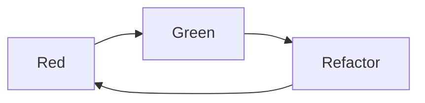
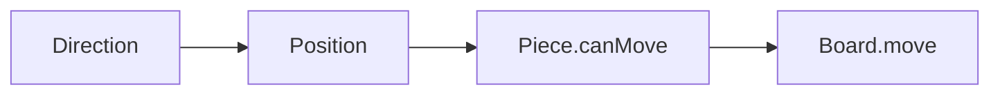
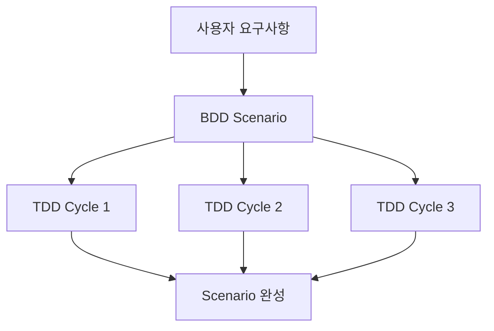
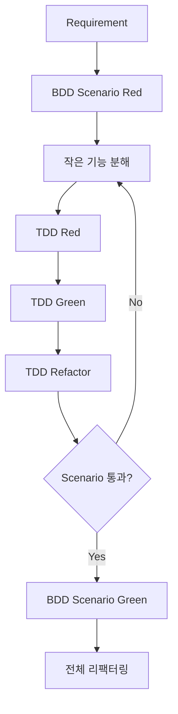
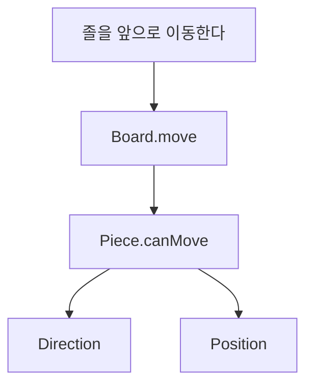
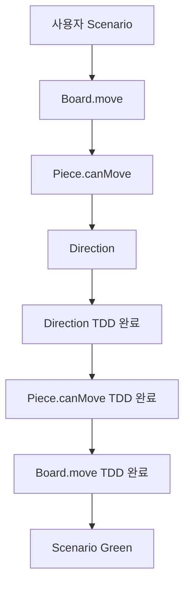
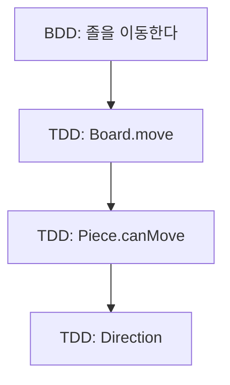
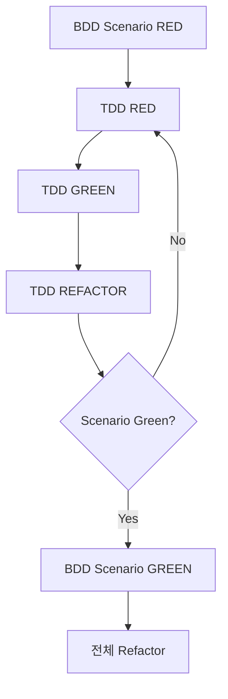
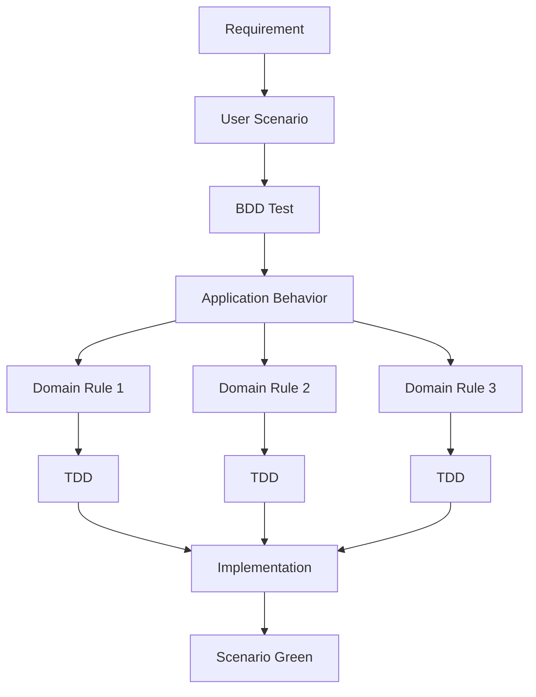
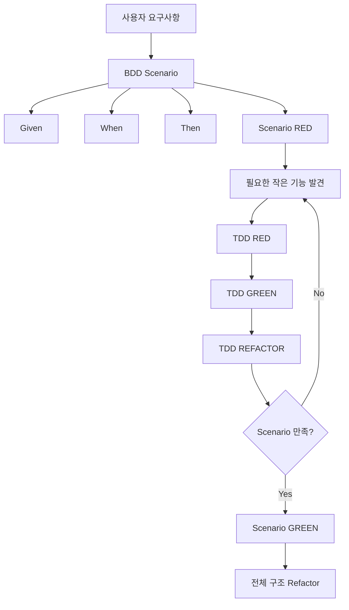

# 마이찬의 BDD는 방향을, TDD는 실행을 만든다(feat. Cucumber) 
[https://youtu.be/ZyG_6MR-1-g?si=XPN1iHNWU8fEQ1E4](https://youtu.be/ZyG_6MR-1-g?si=XPN1iHNWU8fEQ1E4)

# 마이찬의 BDD는 방향을, TDD는 실행을 만든다(feat. Cucumber)
* toc
{:toc}

---

## BDD는 방향을, TDD는 실행을 만든다

TDD(Test-Driven Development)를 처음 적용하면 매우 명확한 사이클을 경험할 수 있다.

```text
Red
→ Green
→ Refactor
```

먼저 실패하는 테스트를 작성한다.

그 테스트를 통과할 수 있는 최소한의 코드를 구현한다.

그리고 동작을 유지하면서 구조를 개선한다.

이 과정을 반복하면 거대한 기능도 작은 단위로 나누어 점진적으로 완성할 수 있다.

하지만 실제로 TDD를 반복하다 보면 한 가지 문제가 생길 수 있다.

```text
지금 작성해야 하는 테스트는 알겠는데
결국 어디까지 가야 하지?
```

눈앞에 있는 작은 테스트 하나를 통과시키는 데 집중하다 보면 어느 순간 전체 요구사항과 현재 구현 사이의 관계를 놓칠 수 있다.

```text
Test A
→ 구현

Test B
→ 구현

Test C
→ 구현

Test D
→ 구현

...

그런데 지금
어떤 사용자 요구사항을 완성하고 있었지?
```

특히 도메인 규칙이 복잡하거나 여러 객체가 협력하는 기능에서는 이런 문제가 더 쉽게 나타난다.

TDD의 작은 피드백 사이클은 매우 강력하지만, 작은 단위의 구현만 바라보다 보면 **전체적인 목적과 방향을 잃을 수 있다.**

이때 함께 생각해볼 수 있는 것이 BDD다.

BDD는 큰 사용자 행동과 시나리오를 먼저 정의하고, 그 시나리오를 만족시키기 위해 작은 TDD 사이클을 쌓아가는 방식으로 활용할 수 있다.

즉 두 방법을 다음과 같이 바라볼 수 있다.

```text
BDD
→ 어디로 가야 하는가?

TDD
→ 그곳까지 어떻게 한 단계씩 갈 것인가?
```

---

## TDD란 무엇인가?

TDD는 Test-Driven Development의 약자로 테스트 주도 개발이라고 한다.

일반적인 흐름은 다음과 같다.



### Red

먼저 아직 만족하지 못하는 요구사항을 테스트로 작성한다.

```java
@Test
void 졸은_앞으로_한_칸_이동할_수_있다() {
    Piece piece = new Pawn();

    boolean movable = piece.canMove(
            new Position(0, 0),
            new Position(0, 1)
    );

    assertThat(movable).isTrue();
}
```

아직 `canMove()`가 구현되지 않았다면 테스트는 실패한다.

이것이 Red다.

---

## Green

테스트를 통과시키기 위한 코드를 구현한다.

```java
public boolean canMove(
        Position start,
        Position target
) {
    return true;
}
```

처음부터 완벽한 설계를 만드는 것이 핵심은 아니다.

현재 테스트를 통과할 수 있는 가장 작은 구현부터 시작한다.

---

## Refactor

테스트가 통과한 상태를 유지하면서 구조를 개선한다.

```java
public boolean canMove(
        Position start,
        Position target
) {
    Direction direction =
            Direction.between(start, target);

    return movableDirections.contains(direction);
}
```

그리고 다시 새로운 요구사항을 테스트로 추가한다.

```text
Red
→ Green
→ Refactor
→ Red
→ Green
→ Refactor
```

이 과정이 반복된다.

---

## TDD가 제공하는 강력한 실행력

TDD의 장점은 매우 구체적이다.

큰 기능을 처음부터 완성하려고 하지 않는다.

```text
장기 게임을 구현한다.
```

라는 거대한 문제를 다음처럼 작은 문제로 나눈다.

```text
위치를 표현한다.

방향을 계산한다.

기물이 이동 가능한지 판단한다.

기물을 이동한다.

상대 기물을 잡는다.

잘못된 이동을 거부한다.
```

그리고 작은 문제 하나마다 테스트와 구현을 반복한다.

```text
작은 문제
→ 테스트
→ 구현
→ 검증
```

개발자는 지금 해야 하는 작업에 집중할 수 있다.

이것이 TDD가 가지는 강력한 실행력이다.

---

## 하지만 작은 사이클만 바라보면 길을 잃을 수 있다

TDD를 적용하면서 발생할 수 있는 어려움 중 하나는 **전체 기능보다 현재 테스트에 과도하게 집중하는 것**이다.

예를 들어 장기의 졸 이동을 구현한다고 생각해보자.

어느 순간 다음 테스트를 작성하게 된다.

```text
Direction을 계산한다.
```

그다음에는

```text
Position을 비교한다.
```

그다음에는

```text
Piece가 이동 가능 여부를 판단한다.
```

계속해서 작은 테스트가 등장한다.



각 테스트는 필요하다.

하지만 이 과정만 보고 있으면 원래 목적이 무엇이었는지 흐려질 수 있다.

원래 요구사항은 단순히 `Direction` 클래스를 잘 만드는 것이 아니었다.

```text
사용자가 졸 기물을
올바르게 이동할 수 있어야 한다.
```

가 원래 목적이었다.

---

## 테스트가 구현에 끌려가는 문제

방향을 잃으면 테스트도 기존 구현에 맞춰 작성되기 쉬워진다.

원래는 다음 질문에서 출발해야 한다.

```text
사용자는 무엇을 할 수 있어야 하는가?
```

하지만 구현을 계속하다 보면 질문이 바뀔 수 있다.

```text
현재 클래스에 어떤 메서드를 테스트해야 하지?
```

그러면 테스트가 요구사항을 검증하는 것이 아니라 현재 코드 구조를 확인하는 역할로 변할 수 있다.

```text
요구사항
→ 테스트
→ 구현
```

이어야 하는 흐름이

```text
현재 구현
→ 테스트 작성
```

으로 역전되는 것이다.

이 경우 내부 구조를 조금만 변경해도 수많은 테스트가 함께 깨질 수 있다.

---

## 복잡한 시나리오는 TDD만으로 어디서 시작해야 할지 어려울 수 있다

다음과 같은 단순 규칙이라면 테스트하기 쉽다.

```text
숫자는 1 이상이어야 한다.
```

하지만 실제 사용자의 행동은 여러 객체와 단계가 연결되는 경우가 많다.

```text
게임을 시작한다.

장기판이 초기화된다.

초 진영의 졸을 선택한다.

졸을 앞으로 이동시킨다.

기존 위치는 비어 있어야 한다.

새로운 위치에는 졸이 존재해야 한다.
```

이를 처음부터 작은 단위 테스트로만 접근하면 어떤 객체에서 시작해야 할지 고민하게 된다.

```text
Board부터?

Piece부터?

Position부터?

Direction부터?

Move부터?
```

이때 먼저 큰 시나리오를 정의하면 방향을 잡기가 쉬워진다.

---

## BDD란 무엇인가?

BDD는 Behavior-Driven Development의 약자로 행동 주도 개발이라고 한다.

핵심은 시스템을 단순한 함수나 메서드의 집합으로 바라보기보다 **사용자가 수행하는 행동과 그 결과를 중심으로 바라보는 것**이다.

예를 들어 개발자의 관점에서는 다음과 같이 생각할 수 있다.

```text
Board.move()를 구현한다.
```

BDD 관점에서는 조금 다르게 바라볼 수 있다.

```text
사용자가 졸을
이동 가능한 위치로 이동시키면
졸의 위치가 변경된다.
```

또는 다음과 같다.

```text
사용자가 졸을
뒤쪽으로 이동시키려고 하면
이동에 실패한다.
```

중심이 메서드에서 행동으로 이동한다.

---

## BDD는 사용자 관점에서 시작한다

예를 들어 기능 요구사항이 다음과 같다고 하자.

```text
졸 기물을 이동할 수 있다.
```

이를 바로 다음 코드로 내려가지 않는다.

```java
Board.move()
```

먼저 사용자가 어떤 행동을 할 수 있어야 하는지 생각한다.

예를 들어 다음과 같은 시나리오를 만들 수 있다.

```text
졸이 빈칸으로 이동한다.

졸이 상대방 기물을 포획한다.

졸이 뒤로 이동하려 하면 실패한다.
```

이렇게 하면 구현 전에 요구사항의 경계가 보이기 시작한다.

---

## TDD와 BDD의 관점 차이

두 방법을 아주 단순화하면 다음과 같이 바라볼 수 있다.

### TDD

```text
코드를 올바르게 작성하고 있는가?
```

작은 단위의 피드백을 반복한다.

### BDD

```text
우리가 올바른 행동을 만들고 있는가?
```

사용자 시나리오와 요구사항의 방향을 확인한다.

이를 비유하면 다음과 같다.

```text
BDD
→ 내비게이션

TDD
→ 액셀과 핸들
```

내비게이션만 가지고는 목적지에 갈 수 없다.

반대로 운전 기술이 아무리 좋아도 목적지가 없다면 엉뚱한 방향으로 갈 수 있다.

두 가지를 함께 사용하면 다음과 같은 구조가 된다.

```text
BDD
→ 목적지 결정

TDD
→ 목적지까지 작은 단계로 이동
```

---

## BDD와 TDD는 경쟁 관계가 아니다

BDD를 사용한다고 TDD를 버리는 것은 아니다.

오히려 다음처럼 계층적인 관계로 활용할 수 있다.



BDD가 큰 범위를 결정하고 그 안에서 여러 TDD 사이클이 실행된다.

즉

```text
BDD Scenario
    ↓
TDD
TDD
TDD
    ↓
Scenario Green
```

이라는 구조다.

---

## BDD를 적용하는 전체 흐름

하나의 방법으로 다음과 같은 순서를 생각할 수 있다.

```text
1. 사용자 요구사항을 확인한다.

2. BDD 시나리오를 작성한다.

3. 시나리오의 Step을 정의한다.

4. 시나리오 테스트를 실패 상태로 만든다.

5. 시나리오를 완성하기 위해 필요한
   작은 기능을 찾는다.

6. 작은 기능부터 TDD를 진행한다.

7. 단위 기능을 하나씩 완성한다.

8. 최종적으로 BDD 시나리오를 통과시킨다.

9. 전체 구조를 리팩터링한다.
```

구조화하면 다음과 같다.



---

## BDD 시나리오를 어떻게 작성할까?

BDD에서는 사용자의 행동을 시나리오 형태로 표현한다.

대표적으로 다음 구조를 사용할 수 있다.

```text
Given
When
Then
```

각각의 의미는 다음과 같다.

| 구분    | 의미              |
| ----- | --------------- |
| Given | 현재 어떤 상황인가      |
| When  | 사용자가 어떤 행동을 하는가 |
| Then  | 어떤 결과가 발생해야 하는가 |

예를 들어 장기판에서 졸을 이동한다고 해보자.

```text
Given 장기판이 초기화되어 있다.

When 초 진영의 졸을
시작 위치에서 도착 위치로 이동시킨다.

Then 도착 위치에 졸이 있어야 한다.

And 시작 위치는 비어 있어야 한다.
```

이 시나리오에는 구현 세부사항이 거의 없다.

```text
HashMap

Direction Enum

Piece.canMove()

Board 내부 자료구조
```

같은 이야기가 없다.

중심은 사용자의 행동이다.

---

## 시나리오는 비개발자도 이해할 수 있어야 한다

BDD 시나리오를 작성할 때 중요한 특징 중 하나는 가능한 한 구현 세부사항을 감추고 비즈니스 용어로 표현하는 것이다.

다음 시나리오를 비교해보자.

### 구현 중심

```text
Given Board 클래스가 생성되어 있다.

When move() 메서드에
Position 객체 두 개를 전달한다.

Then Map의 key가 변경된다.
```

코드를 모르는 사람은 이해하기 어렵다.

### 행동 중심

```text
Given 장기판이 초기 상태이다.

When 졸을 앞으로 한 칸 이동한다.

Then 졸은 도착 위치에 존재한다.
```

개발자가 아니더라도 의미를 이해할 수 있다.

BDD가 단순 테스트 기법을 넘어 요구사항에 대한 공통 언어 역할을 할 수 있는 이유가 여기에 있다.

---

## Gherkin이란 무엇인가?

BDD 시나리오를 일정한 형식으로 표현할 때 Gherkin이라는 문법을 사용할 수 있다.

대표적인 키워드는 다음과 같다.

```text
Feature

Scenario

Given

When

Then

And
```

예를 들어 다음과 같이 작성할 수 있다.

```gherkin
Feature: 졸 이동

  Scenario: 졸이 빈 위치로 이동한다
    Given 장기판이 초기화되어 있다
    When 초 진영의 졸을 앞으로 한 칸 이동한다
    Then 도착 위치에 졸이 존재해야 한다
    And 시작 위치는 비어 있어야 한다
```

잘 작성된 시나리오를 읽으면 구현 코드를 보지 않아도 어떤 기능을 제공하는지 이해할 수 있다.

---

## 실패하는 시나리오부터 만든다

TDD에서 먼저 Red를 만드는 것처럼 BDD에서도 아직 구현되지 않은 시나리오는 실패한다.

```text
Feature: 졸 이동

Scenario: 졸이 빈칸으로 이동한다

Given 장기판이 초기화되어 있다
When 졸을 앞으로 이동한다
Then 졸이 도착 위치에 존재한다

→ FAIL
```

아직 `Board.move()`나 `Piece.canMove()` 같은 기능이 구현되어 있지 않기 때문이다.

이 실패는 매우 중요한 역할을 한다.

```text
현재 우리가 완성해야 할
사용자 행동이 무엇인지
계속 보여준다.
```

이제 개발자는 이 큰 Red를 Green으로 만들기 위해 작은 문제를 찾아간다.

---

## Cucumber는 어떤 역할을 할까?

Gherkin으로 작성한 문장은 사람에게는 이해하기 쉽지만 컴퓨터는 자연어의 의미를 그대로 실행할 수 없다.

여기에서 Cucumber 같은 도구를 활용할 수 있다.

구조를 단순화하면 다음과 같다.

```text
Gherkin Scenario

"장기판이 초기화되어 있다"
        ↓
Cucumber
        ↓
Step Definition
        ↓
실제 Java Test Code
```

즉 사람이 읽을 수 있는 시나리오와 실제 자동화 테스트 코드를 연결하는 역할을 한다.

---

## Step Definition

다음 Gherkin이 있다고 하자.

```gherkin
Given 장기판이 초기화되어 있다
```

이에 대응하는 Step Definition을 작성할 수 있다.

```java
@Given("장기판이 초기화되어 있다")
public void initializeBoard() {
    board = Board.initialize();
}
```

다음 Step이 있다.

```gherkin
When 초 진영의 졸을 시작 위치에서 도착 위치로 이동시킨다
```

코드에서는 다음과 같은 형태가 될 수 있다.

```java
@When("초 진영의 졸을 시작 위치에서 도착 위치로 이동시킨다")
public void movePawn() {
    board.move(start, target);
}
```

결과 검증은 다음과 같이 연결할 수 있다.

```java
@Then("도착 위치에 졸이 존재해야 한다")
public void verifyTargetPosition() {
    assertThat(board.findPiece(target))
            .isInstanceOf(Pawn.class);
}
```

Gherkin의 문장이 자동화 테스트로 연결된다.

---

## 큰 시나리오에서 작은 TDD 단위를 찾는다

BDD 시나리오를 작성했다고 바로 모든 구현이 결정되는 것은 아니다.

이제 시나리오를 만족시키기 위해 어떤 기능이 필요한지 내려가야 한다.

예를 들어

```text
졸이 앞으로 이동한다.
```

라는 시나리오가 있다고 하자.

이를 구현하기 위해 다음 기능들이 필요하다고 판단할 수 있다.

```text
Board.move()

Piece.canMove()

Direction

Position
```

큰 요구사항에서 작은 구현 단위를 추출하는 것이다.



이제 작은 단위부터 TDD를 진행한다.

---

## Piece.canMove()를 TDD로 구현해보자

먼저 질문한다.

```text
Piece는 이동 가능 여부를
어떻게 판단해야 할까?
```

하나의 방향은 각 기물이 자신의 이동 규칙을 가지고 있도록 하는 것이다.

```java
public abstract class Piece {

    public abstract boolean canMove(
            Position start,
            Position target
    );
}
```

졸은 자신의 이동 규칙을 가진다.

```java
public class Pawn extends Piece {

    @Override
    public boolean canMove(
            Position start,
            Position target
    ) {
        Direction direction =
                Direction.between(start, target);

        return direction == Direction.FORWARD;
    }
}
```

하지만 바로 구현하지 않고 먼저 테스트를 만든다.

```java
@Test
void 졸은_앞으로_이동할_수_있다() {
    Piece pawn = new Pawn();

    boolean result = pawn.canMove(
            new Position(0, 0),
            new Position(0, 1)
    );

    assertThat(result).isTrue();
}
```

그리고 실패하는 테스트를 통과시키는 코드를 만든다.

다음 테스트를 추가한다.

```java
@Test
void 졸은_뒤로_이동할_수_없다() {
    Piece pawn = new Pawn();

    boolean result = pawn.canMove(
            new Position(0, 1),
            new Position(0, 0)
    );

    assertThat(result).isFalse();
}
```

작은 기능 하나가 완성된다.

---

## Direction도 작은 TDD 단위가 될 수 있다

`Piece.canMove()`를 구현하는 과정에서 또 하나의 문제가 발견된다.

```text
시작 위치와 도착 위치를 가지고
이동 방향을 어떻게 계산할까?
```

이것을 `Direction`이라는 작은 문제로 분리할 수 있다.

```java
public enum Direction {
    FORWARD,
    BACKWARD,
    LEFT,
    RIGHT
}
```

다시 테스트부터 시작한다.

```java
@Test
void 위쪽_위치로_이동하면_FORWARD이다() {
    Direction direction =
            Direction.between(
                    new Position(0, 0),
                    new Position(0, 1)
            );

    assertThat(direction)
            .isEqualTo(Direction.FORWARD);
}
```

이런 방식으로 작은 구성 요소를 하나씩 완성한다.

---

## 작은 것부터 다시 위로 올라간다

BDD에서 요구사항을 내려다보며 필요한 기능을 발견하는 흐름은 다음과 같을 수 있다.

```text
졸 이동 Scenario
        ↓
Board.move
        ↓
Piece.canMove
        ↓
Direction
```

하지만 구현할 때는 반대 방향으로 올라갈 수 있다.

```text
Direction
        ↓
Piece.canMove
        ↓
Board.move
        ↓
졸 이동 Scenario
```

즉 **Top-Down으로 문제를 이해하고 Bottom-Up으로 구현한다.**

이 패턴은 매우 유용하다.



---

## Board.move()를 구현한다

`Piece.canMove()`가 완성되었다면 다음 단위로 올라간다.

```text
Board.move()
```

먼저 원하는 행동을 테스트한다.

```java
@Test
void 기물을_이동한다() {
    Board board = Board.initialize();

    Position start =
            new Position(0, 0);

    Position target =
            new Position(0, 1);

    board.move(start, target);

    assertThat(board.hasPiece(target))
            .isTrue();

    assertThat(board.hasPiece(start))
            .isFalse();
}
```

이 테스트를 만족시키기 위해 `Board`가 위치와 기물을 관리하도록 구현할 수 있다.

```java
public class Board {

    private final Map<Position, Piece> pieces;

    public void move(
            Position start,
            Position target
    ) {
        Piece piece = pieces.get(start);

        if (!piece.canMove(start, target)) {
            throw new IllegalArgumentException(
                    "이동할 수 없는 위치입니다."
            );
        }

        pieces.remove(start);
        pieces.put(target, piece);
    }
}
```

이제 또 하나의 작은 TDD 사이클이 완성된다.

---

## 작은 Green들이 모여 큰 Green을 만든다

지금까지 구현한 작은 기능은 다음과 같다.

```text
Direction
→ Green

Piece.canMove()
→ Green

Board.move()
→ Green
```

이 기능들이 모두 연결되면 처음 작성한 BDD 시나리오도 통과한다.

```text
Scenario:
졸이 빈칸으로 이동한다.

→ Green
```

전체 구조는 다음과 같다.

```text
BDD Scenario RED
        ↓
Direction RED
→ Green
→ Refactor
        ↓
Piece.canMove RED
→ Green
→ Refactor
        ↓
Board.move RED
→ Green
→ Refactor
        ↓
BDD Scenario GREEN
```

BDD의 큰 피드백 루프 안에서 TDD의 작은 피드백 루프가 여러 번 실행되는 것이다.

---

## BDD와 TDD를 피라미드처럼 생각할 수 있다

전체 구조를 피라미드로 생각하면 이해하기 쉽다.

```text
        BDD Scenario
       /            \
      /  Board.move  \
     / Piece.canMove  \
    /    Direction     \
   /____________________\
```

가장 바깥에는 사용자가 원하는 행동이 있다.

그 행동을 만족시키기 위해 내부에는 작은 기능들이 존재한다.

각 작은 기능은 TDD를 통해 구현한다.



따라서 BDD와 TDD를 서로 대체하는 기술로 보기보다 서로 다른 크기의 문제를 다루는 방식으로 바라볼 수 있다.

---

## BDD가 TDD의 방향을 보완한다

TDD만 진행할 때 다음과 같은 문제가 있었다고 하자.

```text
현재 테스트를 통과시키는 데 집중
        ↓
구현이 계속 증가
        ↓
전체 목적이 흐려짐
```

BDD 시나리오가 존재하면 현재 구현이 어떤 사용자 요구사항을 위해 필요한지 확인할 수 있다.

```text
Direction을 왜 만들고 있지?

→ Piece 이동 방향을 판단하려고.

Piece.canMove()는 왜 필요하지?

→ Board가 올바른 이동인지 판단하려고.

Board.move()는 왜 필요하지?

→ 사용자가 졸을 이동시키는
   시나리오를 완성하려고.
```

작은 구현이 모두 큰 목적과 연결된다.

---

## 테스트가 구현에 끌려가는 문제도 줄일 수 있다

BDD 시나리오가 먼저 존재하면 구현을 바꾸더라도 사용자 행동이 동일하다면 상위 시나리오는 유지될 수 있다.

예를 들어 내부 구현이

```text
Map<Position, Piece>
```

에서 다른 자료구조로 바뀌었다고 하자.

BDD 시나리오가 다음과 같다면

```gherkin
When 졸을 앞으로 한 칸 이동한다
Then 도착 위치에 졸이 존재해야 한다
```

사용자 행동 자체는 변하지 않았다.

즉 BDD 시나리오는 내부 구현보다 상대적으로 상위 수준의 요구사항을 표현한다.

---

## BDD는 구현 전에 예외 시나리오를 생각하게 만든다

BDD의 또 다른 장점은 구현에 들어가기 전에 시나리오를 먼저 나열할 수 있다는 것이다.

예를 들어 처음에는 다음만 생각할 수 있다.

```text
졸이 앞으로 이동한다.
```

시나리오를 작성하면서 새로운 질문이 생긴다.

```text
뒤로 이동하면?

상대 기물이 있으면?

아군 기물이 있으면?

장기판 밖으로 이동하면?

시작 위치에 기물이 없으면?
```

코드를 작성하기 전에 예외 상황이 드러난다.

이를 시나리오로 표현할 수 있다.

```gherkin
Scenario: 졸이 뒤로 이동하려 하면 실패한다
  Given 장기판이 초기화되어 있다
  When 졸을 뒤쪽 위치로 이동시킨다
  Then 이동에 실패해야 한다
```

구현 이후 예외를 발견하는 것보다 요구사항 단계에서 발견할 수 있다.

---

## 요구사항 누락을 더 일찍 발견할 수 있다

일반적인 개발 흐름을 생각해보자.

```text
요구사항
→ 설계
→ 구현
→ 테스트
```

구현 중 다음 사실을 발견할 수 있다.

```text
상대 기물을 잡으면
그 기물은 어떻게 처리하지?
```

기획 단계에서 정의되지 않았던 문제가 구현 중 발견된 것이다.

BDD 시나리오를 먼저 충분히 작성하면 이런 질문이 앞당겨질 수 있다.

```text
Scenario를 작성
        ↓
애매한 행동 발견
        ↓
요구사항 질문
        ↓
구현 전에 정책 결정
```

피드백 비용을 줄일 수 있는 이유다.

---

## BDD에서 중요한 것은 도구보다 사고방식이다

BDD를 이야기하면 Cucumber와 Gherkin부터 떠올리기 쉽다.

하지만 BDD의 핵심이 반드시 Cucumber를 사용하는 것은 아니다.

중요한 것은 다음 질문을 먼저 하는 것이다.

```text
사용자가 무엇을 하는가?

어떤 상황에서 행동하는가?

그 행동의 결과가 무엇이어야 하는가?
```

예를 들어 README에 다음처럼 작성하는 것만으로도 방향을 잡을 수 있다.

```text
## 졸 이동

- 졸은 앞으로 이동할 수 있다.
- 상대 기물이 존재하면 포획할 수 있다.
- 뒤로 이동할 수 없다.
- 아군 기물이 있는 위치로 이동할 수 없다.
```

그리고 각각을 작은 TDD 사이클로 내려갈 수 있다.

즉

```text
BDD 사고방식
≠
반드시 Cucumber 사용
```

으로 이해하는 것이 좋다.

Cucumber는 그 시나리오를 실행 가능한 명세와 연결할 때 사용할 수 있는 도구다.

---

## Cucumber를 사용하면 얻는 점

시나리오가 단순 문서로만 존재하면 시간이 지나면서 실제 코드와 달라질 수 있다.

```text
README

졸은 앞으로만 이동한다.
```

하지만 실제 코드에서는 버그 때문에 뒤로도 이동할 수 있다고 생각해보자.

문서와 구현이 불일치한다.

Cucumber 같은 도구를 통해 시나리오를 자동화 테스트로 연결하면 다음 구조가 가능하다.

```text
Specification
=
Executable Test
```

즉 명세를 실행할 수 있다.

```text
Scenario 작성
→ 자동 테스트 실행
→ 구현이 요구사항을 만족하는지 확인
```

문서와 테스트 사이의 거리를 줄이는 효과를 기대할 수 있다.

---

## 너무 세부적인 Gherkin은 피하는 것이 좋다

다음과 같은 시나리오를 생각해보자.

```gherkin
When Board 클래스의 move 메서드에
start와 target Position을 전달하고
HashMap에서 start Key를 remove한 뒤
target Key에 put한다
```

이것은 사용자 행동이 아니라 구현 설명이다.

내부 자료구조를 `HashMap`에서 다른 구조로 변경하면 시나리오까지 변경해야 한다.

BDD에서는 다음처럼 표현하는 것이 더 자연스럽다.

```gherkin
When 졸을 앞으로 한 칸 이동한다
Then 졸은 도착 위치에 존재한다
```

원칙은 단순하다.

```text
What
→ 시나리오에서 표현

How
→ 구현 코드에서 표현
```

---

## Given도 지나치게 많은 내부 상태를 노출하지 않는다

다음과 같은 Given도 주의할 수 있다.

```gherkin
Given Board 객체의 pieces Map에
Position(0,0)을 key로
Pawn 객체가 저장되어 있다
```

이 역시 구현 구조에 강하게 결합된다.

사용자 관점에서는 다음 정도면 충분할 수 있다.

```gherkin
Given 초 진영의 졸이 시작 위치에 있다
```

BDD 시나리오는 가능한 한 도메인 언어를 사용한다.

---

## BDD와 단위 테스트의 역할은 다르다

BDD 시나리오만 있으면 모든 테스트를 대체할 수 있는 것은 아니다.

예를 들어 다음 Scenario가 통과한다고 하자.

```text
졸이 앞으로 이동한다.
```

하지만 내부 `Direction`이 가지고 있는 다양한 Edge Case까지 모두 검증했다고 보기는 어렵다.

예를 들어

```text
같은 위치

대각선

두 칸 이동

장기판 경계

반대 진영 좌표
```

같은 경우가 있다.

이런 작은 규칙은 단위 테스트가 더 적합할 수 있다.

```java
@Test
void 같은_위치는_이동_방향이_아니다() {
}
```

```java
@Test
void 대각선_이동은_허용하지_않는다() {
}
```

따라서 역할을 나눌 수 있다.

```text
BDD
→ 사용자 Scenario 검증

TDD / Unit Test
→ 작은 도메인 규칙 검증
```

---

## 모든 세부 경우를 BDD Scenario로 만들 필요는 없다

BDD를 적용하면 모든 테스트를 Gherkin으로 작성하고 싶은 유혹이 생길 수 있다.

하지만 모든 작은 규칙을 시나리오로 작성하면 Feature 파일이 지나치게 커질 수 있다.

예를 들어 Direction의 모든 경우를

```text
Scenario 1
Scenario 2
Scenario 3
...
Scenario 30
```

형태로 작성할 필요는 없을 수 있다.

BDD에서는 사용자에게 의미 있는 행동을 중심으로 보고, 작은 알고리즘과 세부 규칙은 단위 테스트에 맡기는 방식으로 역할을 나눌 수 있다.

---

## BDD와 TDD의 테스트 크기 차이

다음과 같이 생각할 수 있다.

| 구분    | BDD          | TDD          |
| ----- | ------------ | ------------ |
| 중심    | 사용자 행동       | 작은 코드 동작     |
| 관점    | 요구사항         | 구현           |
| 질문    | 무엇을 만들어야 하는가 | 어떻게 정확하게 만들까 |
| 범위    | 비교적 큼        | 비교적 작음       |
| 대표 표현 | Scenario     | Unit Test    |
| 피드백   | 방향성          | 구현 정확성       |

둘 중 하나가 더 우수하다기보다 해결하는 문제가 다르다.

---

## BDD가 항상 E2E 테스트를 의미하는 것은 아니다

사용자 시나리오를 다룬다고 해서 반드시 브라우저부터 실제 DB까지 모두 실행하는 거대한 테스트만 작성해야 하는 것은 아니다.

중요한 것은 행동의 경계를 어디까지 잡느냐이다.

예를 들어 장기 프로그램에서는

```text
Board
Piece
Position
```

을 조합한 도메인 시나리오만으로도 사용자 행동을 충분히 표현할 수 있다.

즉 BDD의 핵심은 테스트의 물리적인 크기보다 **행동 중심으로 요구사항을 표현하는 것**에 있다.

---

## BDD와 TDD를 함께 적용하는 실전 흐름

새로운 기능을 만든다고 생각해보자.

요구사항은 다음과 같다.

```text
사용자는 상대 기물이 있는 위치로
졸을 이동하여 상대 기물을 포획할 수 있다.
```

### 1. Scenario 작성

```gherkin
Scenario: 졸이 상대 기물을 포획한다
  Given 졸과 상대 기물이 장기판에 존재한다
  When 졸을 상대 기물이 있는 위치로 이동한다
  Then 졸은 상대 기물의 위치에 존재해야 한다
  And 상대 기물은 장기판에서 제거되어야 한다
```

### 2. 시나리오를 실패시킨다

```text
Scenario
→ RED
```

### 3. 필요한 작은 기능을 추출한다

```text
Piece.canMove()

Board.hasOpponentPiece()

Board.capture()

Board.move()
```

### 4. 작은 기능부터 TDD를 진행한다

```text
Board.hasOpponentPiece()
Red → Green → Refactor

Piece.canMove()
Red → Green → Refactor

Board.capture()
Red → Green → Refactor
```

### 5. 다시 Scenario를 실행한다

```text
BDD Scenario
→ GREEN
```

### 6. 전체 구조를 리팩터링한다

이 흐름을 반복한다.

---

## 작은 TDD 사이클은 구현의 불확실성을 줄인다

큰 Scenario를 한 번에 구현하려고 하면 다음과 같은 문제가 생길 수 있다.

```text
무엇부터 만들어야 하지?

이 클래스가 맞나?

이 메서드가 필요한가?

어디까지 구현해야 하지?
```

작은 TDD 사이클로 분해하면 하나의 질문에만 집중할 수 있다.

```text
Direction을 정확하게 계산할 수 있는가?
```

그다음

```text
Piece가 이동 가능 여부를 판단할 수 있는가?
```

그다음

```text
Board가 실제 위치를 변경할 수 있는가?
```

불확실성을 단계적으로 줄여나간다.

---

## BDD는 작은 TDD 사이클이 목적을 잃지 않게 한다

반대로 작은 테스트만 계속 작성하면 다시 방향 문제가 생길 수 있다.

BDD 시나리오는 다음 역할을 한다.

```text
Direction을 왜 만들고 있는가?

Piece.canMove를 왜 만들고 있는가?

Board.move를 왜 만들고 있는가?
```

모두 같은 답을 가진다.

```text
사용자가 졸을
올바르게 이동시키기 위해서.
```

이렇게 상위 목표가 유지된다.

---

## 두 개의 피드백 루프를 만든다

BDD와 TDD를 함께 사용하면 두 개의 피드백 루프가 생긴다고 볼 수 있다.

### 작은 피드백 루프

```text
Unit Test
→ 구현
→ Refactor
```

빠르게 반복한다.

### 큰 피드백 루프

```text
Scenario
→ 여러 Unit 구현
→ 사용자 요구사항 완성
```

조금 더 큰 단위로 반복한다.

구조는 다음과 같다.



이 구조가 BDD와 TDD를 함께 사용하는 핵심이라고 볼 수 있다.

---

## BDD가 방향을 만든다는 의미

BDD의 가장 큰 역할을 한 문장으로 정리하면 다음과 같다.

```text
현재 구현하고 있는 코드가
어떤 사용자 행동을 완성하기 위한 것인지
잊지 않게 한다.
```

개발자는 `Board.move()` 자체를 만드는 것이 목표가 아니다.

사용자가 원하는 기능을 제공하는 것이 목표다.

```text
코드
→ 목적이 아님

사용자 행동
→ 목적
```

BDD는 개발자가 구현 세부사항에서 한 단계 올라가 요구사항을 다시 바라보게 만든다.

---

## TDD가 실행을 만든다는 의미

반대로 사용자 시나리오만 작성한다고 프로그램이 만들어지는 것은 아니다.

```text
사용자는 졸을 이동할 수 있다.
```

라는 요구사항을 실제 코드로 내려야 한다.

이때 TDD가 강력한 실행 방법을 제공한다.

```text
Direction
→ 테스트

Piece.canMove
→ 테스트

Board.move
→ 테스트
```

거대한 요구사항을 작은 문제로 분해하여 하나씩 해결한다.

그래서 다음 표현이 자연스럽다.

```text
BDD는 방향을 만든다.

TDD는 실행을 만든다.
```

---

## 실무에서 BDD 사고방식을 적용할 수 있는 예

이번에는 백엔드 API를 생각해보자.

요구사항이 다음과 같다.

```text
사용자는 이미 사용한 쿠폰을
다시 사용할 수 없다.
```

바로 Service 메서드를 구현하지 않고 Scenario를 먼저 생각한다.

```gherkin
Scenario: 이미 사용한 쿠폰을 다시 사용한다
  Given 사용 완료된 쿠폰이 존재한다
  When 사용자가 해당 쿠폰을 사용한다
  Then 쿠폰 사용 요청은 실패해야 한다
```

이 시나리오를 구현하기 위해 필요한 작은 규칙을 추출한다.

```text
Coupon.isUsed()

Coupon.use()

CouponStatus

CouponService.useCoupon()
```

그리고 작은 단위부터 TDD를 진행한다.

```java
@Test
void 이미_사용한_쿠폰은_다시_사용할_수_없다() {
    Coupon coupon = Coupon.used();

    assertThatThrownBy(coupon::use)
            .isInstanceOf(
                    AlreadyUsedCouponException.class
            );
}
```

도메인 규칙을 완성한 뒤 상위 Scenario를 다시 확인한다.

이런 방식은 결제, 주문, 쿠폰, 예약처럼 비즈니스 시나리오가 중요한 백엔드 시스템에서도 활용할 수 있다.

---

## 결제 시스템으로 생각해보면 더 명확하다

예를 들어 구독 결제 요구사항이 있다고 하자.

```text
결제 Webhook을 중복으로 수신하더라도
구독은 한 번만 활성화되어야 한다.
```

BDD 수준에서는 다음과 같이 생각할 수 있다.

```gherkin
Scenario: 동일한 결제 성공 Webhook이 중복 수신된다
  Given 아직 활성화되지 않은 구독이 존재한다
  When 동일한 결제 성공 이벤트를 두 번 수신한다
  Then 구독은 한 번만 활성화되어야 한다
```

그리고 작은 문제로 분해한다.

```text
WebhookEventId 중복 판단

결제 이벤트 저장

Subscription 활성화

Idempotency 처리
```

각각은 작은 테스트로 내려간다.

```text
BDD
→ 결제 중복 처리라는 비즈니스 Scenario

TDD
→ 중복 체크와 상태 전이라는 세부 규칙
```

상위와 하위 테스트가 서로 다른 역할을 담당한다.

---

## BDD를 사용할 때 주의할 점

BDD도 무조건 적용해야 하는 규칙은 아니다.

단순한 기능까지 모든 것을 Scenario로 작성하면 오히려 비용이 커질 수 있다.

예를 들어 다음 메서드를 구현한다고 하자.

```java
public int add(int a, int b) {
    return a + b;
}
```

이 기능을 위해

```gherkin
Feature: 숫자 더하기

Scenario: 두 숫자를 더한다
```

부터 작성하는 것이 항상 의미 있는 것은 아니다.

BDD는 특히 다음 상황에서 가치가 커질 수 있다.

```text
사용자 행동이 중요하다.

여러 도메인 객체가 협력한다.

하나의 기능에 다양한 시나리오가 존재한다.

예외 조건이 많다.

비즈니스 요구사항과 테스트를 연결하고 싶다.
```

단순한 알고리즘이나 내부 유틸리티라면 단위 테스트만으로 충분할 수도 있다.

---

## 시나리오 개수가 지나치게 많아지는 것도 경계한다

다음처럼 모든 경우를 BDD Scenario로 표현하면 유지보수 비용이 커질 수 있다.

```text
Scenario 1
Scenario 2
Scenario 3
...
Scenario 100
```

중요한 사용자 행동은 BDD에서 다루고, 세부 조합은 단위 테스트로 내려보내는 방식으로 조절할 수 있다.

```text
BDD
→ 대표적인 사용자 행동

Unit Test
→ 세부 규칙과 Edge Case
```

테스트 레벨마다 역할을 나누는 것이다.

---

## 좋은 Scenario를 작성하기 위한 질문

BDD Scenario를 작성할 때 다음 질문을 사용할 수 있다.

```text
누가 이 기능을 사용하는가?

어떤 상황에서 행동하는가?

무슨 행동을 하는가?

그 결과 무엇이 발생해야 하는가?

실패하는 경우는 무엇인가?

비개발자가 읽어도 의미를 이해할 수 있는가?

구현 세부사항이 들어가 있지는 않은가?
```

특히 마지막 두 질문이 중요하다.

Scenario는 테스트 코드를 자연어로 번역하는 것이 아니라 **요구사항을 실행 가능한 형태로 표현하는 것**에 가깝기 때문이다.

---

## BDD와 TDD를 적용할 때 생각할 수 있는 계층

전체 개발 과정을 다음처럼 볼 수 있다.

```text
비즈니스 요구사항

        ↓

BDD Scenario

        ↓

Application / Domain 기능

        ↓

TDD Unit Test

        ↓

구현
```

조금 더 구체적으로 표현하면 다음과 같다.



큰 행동이 작은 규칙을 끌어내고 작은 규칙의 구현이 다시 큰 행동을 완성한다.

---

## BDD는 설계 도구로도 활용할 수 있다

시나리오를 구현 전에 작성하다 보면 필요한 도메인 개념이 자연스럽게 드러날 수 있다.

예를 들어 다음 시나리오가 있다.

```text
졸이 상대방 기물을 포획한다.
```

여기에서 다음 개념이 나타난다.

```text
Piece

Camp

Position

Capture

Move
```

즉 Scenario가 단순 테스트가 아니라 도메인 모델을 발견하는 출발점이 될 수 있다.

다음 질문을 반복할 수 있다.

```text
이 행동을 수행하는 책임은 누구에게 있어야 할까?

이 규칙을 알고 있는 객체는 누구인가?

현재 필요한 도메인 개념은 무엇인가?
```

이런 질문이 객체 설계로 이어진다.

---

## TDD는 발견된 설계를 검증하고 발전시킨다

BDD로 큰 흐름을 정했다고 해서 처음 설계가 항상 정답인 것은 아니다.

TDD를 반복하면서 더 좋은 책임 분리를 발견할 수 있다.

처음에는

```text
Board가 모든 이동 규칙을 판단한다.
```

고 생각했을 수 있다.

테스트를 작성하다 보면 다음 생각이 들 수 있다.

```text
기물마다 움직임 규칙이 다른데
Board가 전부 알고 있는 게 맞을까?
```

그래서 책임을 이동한다.

```text
Before

Board
→ 기물별 이동 규칙까지 판단


After

Board
→ 이동을 조율

Piece
→ 자신의 이동 규칙 판단
```

BDD가 방향을 고정하고 TDD가 내부 설계를 점진적으로 발견하는 구조다.

---

## 실무에서의 활용

실제 프로젝트에서는 다음과 같은 흐름으로 사용할 수 있다.

### 1. 요구사항을 사용자 행동으로 표현한다

```text
사용자는 주문을 취소할 수 있다.
```

### 2. 성공 시나리오와 실패 시나리오를 작성한다

```text
결제 전 주문을 취소한다.

배송 시작된 주문을 취소하면 실패한다.

이미 취소된 주문을 다시 취소하면 실패한다.
```

### 3. 핵심 Scenario를 자동화한다

```gherkin
Scenario: 배송 시작된 주문을 취소한다
  Given 배송이 시작된 주문이 존재한다
  When 사용자가 주문을 취소한다
  Then 주문 취소는 실패해야 한다
```

### 4. 필요한 도메인 규칙을 추출한다

```text
Order.cancel()

OrderStatus

Order.isCancelable()
```

### 5. TDD로 작은 규칙을 구현한다

```java
@Test
void 배송이_시작된_주문은_취소할_수_없다() {
    Order order = Order.shipping();

    assertThatThrownBy(order::cancel)
            .isInstanceOf(
                    OrderCannotBeCancelledException.class
            );
}
```

### 6. Scenario를 통과시킨다

```text
BDD Scenario
→ GREEN
```

이런 식으로 요구사항과 구현의 거리를 줄일 수 있다.

---

## BDD와 TDD를 함께 사용하면서 얻을 수 있는 것

두 방법을 함께 사용하면 각각의 약점을 보완할 수 있다.

### BDD가 제공하는 것

```text
큰 방향

사용자 관점

시나리오

요구사항 명확화

예외 상황 조기 발견
```

### TDD가 제공하는 것

```text
빠른 피드백

작은 구현 단위

세부 규칙 검증

점진적 설계

안전한 리팩터링
```

둘을 합치면 다음 구조가 된다.

```text
방향
+
실행

=

사용자 요구사항을 잃지 않으면서
작은 단계로 안전하게 구현
```

---

## 구조

BDD와 TDD의 관계를 전체적으로 정리하면 다음과 같다.



핵심은 하나의 큰 BDD 사이클 안에 여러 개의 작은 TDD 사이클이 존재한다는 것이다.

---

## 정리

TDD는 작은 실패를 만들고 이를 해결하는 과정을 반복하면서 코드를 점진적으로 발전시키는 강력한 개발 방법이다.

```text
Red
→ Green
→ Refactor
```

하지만 작은 단위의 테스트에만 집중하다 보면 다음 문제가 생길 수 있다.

```text
현재 구현하고 있는 기능이
전체 요구사항에서 어떤 역할을 하는지
잃어버린다.
```

BDD는 이 문제를 사용자 행동 중심의 시나리오로 보완할 수 있다.

먼저 다음을 정의한다.

```text
Given
→ 어떤 상황에서

When
→ 사용자가 무엇을 했을 때

Then
→ 어떤 결과가 발생해야 하는가
```

예를 들어

```text
졸이 빈칸으로 이동한다.

졸이 상대 기물을 포획한다.

졸이 뒤로 이동하려 하면 실패한다.
```

와 같은 사용자 시나리오를 먼저 정의한다.

그리고 해당 시나리오를 만족시키기 위해 필요한 작은 기능을 찾아낸다.

```text
Direction

Piece.canMove()

Board.move()
```

각 작은 기능은 다시 TDD로 구현한다.

```text
BDD Scenario RED

        ↓

TDD
Red → Green → Refactor

        ↓

TDD
Red → Green → Refactor

        ↓

TDD
Red → Green → Refactor

        ↓

BDD Scenario GREEN
```

따라서 두 방법은 서로 경쟁하는 것이 아니라 서로 다른 크기의 문제를 해결하는 상호보완적인 관계로 활용할 수 있다.

BDD는 다음 질문을 계속 유지시킨다.

```text
우리는 지금
올바른 기능을 만들고 있는가?
```

TDD는 그 안에서 다음 질문에 집중한다.

```text
현재 이 작은 기능을
올바르게 만들고 있는가?
```

BDD를 통해 사용자 관점의 큰 방향을 먼저 잡으면 작은 TDD 사이클을 반복하는 동안에도 현재 구현의 목적을 잃지 않을 수 있다.

반대로 BDD의 사용자 시나리오만으로는 세부 도메인 규칙과 다양한 Edge Case를 충분히 검증하기 어려울 수 있는데, 이 부분을 작은 단위 테스트와 TDD가 보완한다.

결국 중요한 것은 BDD와 TDD 중 무엇이 더 좋은지 선택하는 것이 아니다.

```text
BDD
→ 큰 방향을 잃지 않게 한다.

TDD
→ 그 방향으로 작은 단계를 계속 실행하게 한다.
```

사용자가 원하는 행동을 먼저 정의하고, 그 행동을 만족시키기 위한 작은 문제를 TDD로 하나씩 해결해 나가는 방식으로 두 방법을 함께 활용할 수 있다.

### 한 줄 요약

**BDD는 사용자 시나리오를 통해 무엇을 만들어야 하는지 방향을 잡고, TDD는 그 시나리오를 완성하기 위한 작은 기능을 Red-Green-Refactor 사이클로 구현하게 하므로 두 방법을 함께 사용하면 방향성과 실행력을 동시에 확보할 수 있다.**

