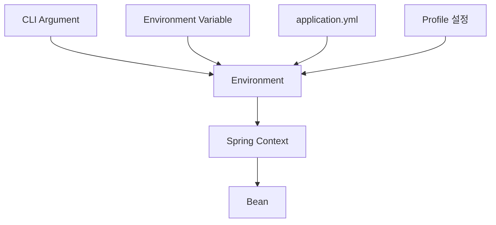
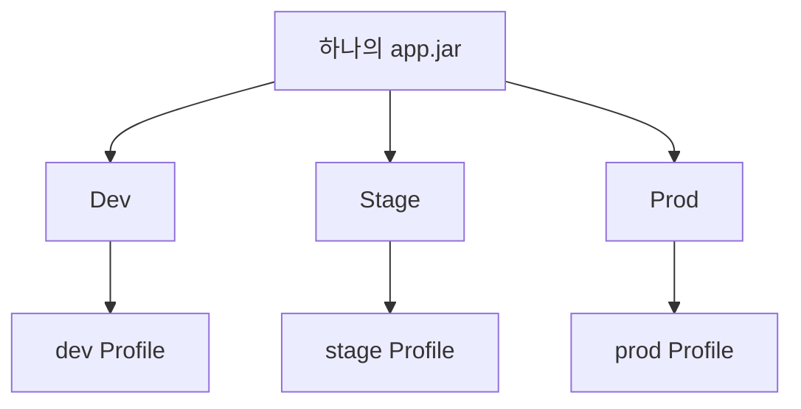
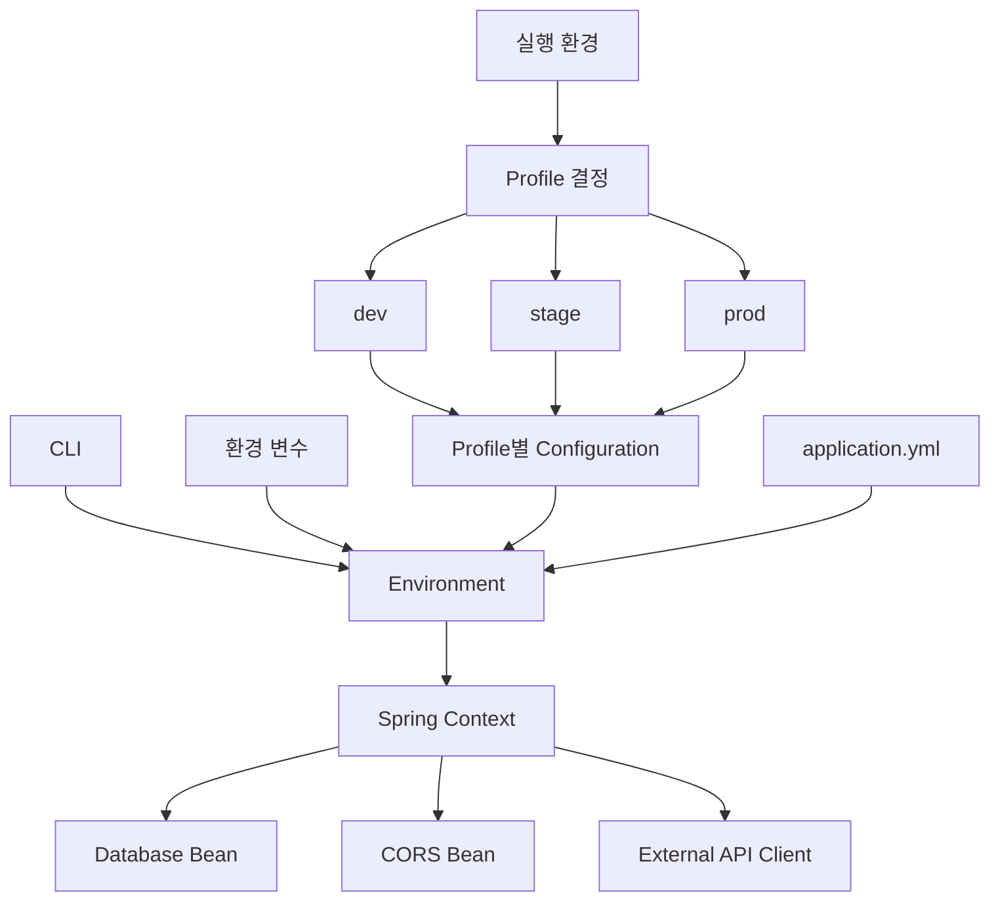
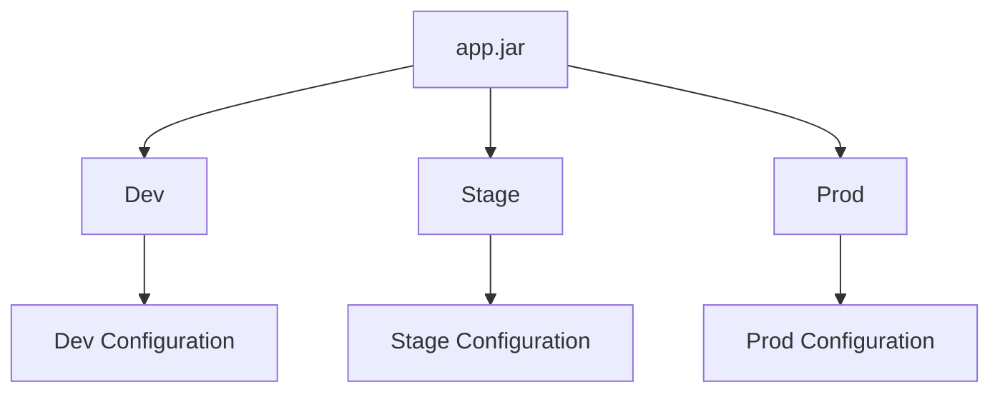
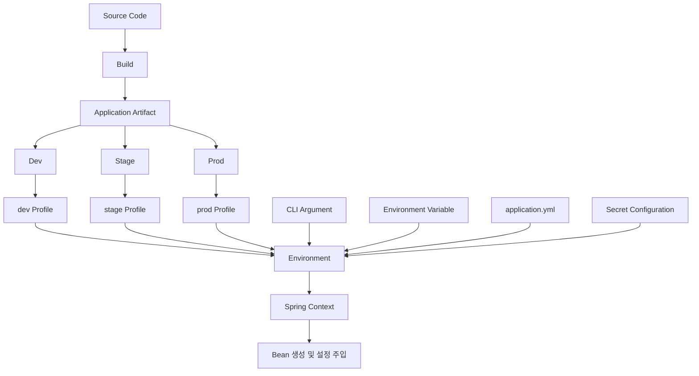

# 차니의 Spring Boot Profile과 외부 설정
[https://youtu.be/L6teh1j0IRU?si=JjyFdnU8MJQBsfOe](https://youtu.be/L6teh1j0IRU?si=JjyFdnU8MJQBsfOe)

# 차니의 Spring Boot Profile과 외부 설정
* toc
{:toc}

---

## Spring Boot Profile과 외부 설정: 하나의 애플리케이션을 여러 환경에서 운영하는 방법

Spring Boot 애플리케이션을 개발하다 보면 같은 코드라도 실행되는 환경에 따라 다른 설정이 필요해진다.

가장 대표적인 것이 데이터베이스다.

개발 환경에서는 간단하게 실행하기 위해 H2를 사용할 수 있다.

```yaml
spring:
  datasource:
    url: jdbc:h2:mem:test
```

하지만 실제 운영 환경에서는 MySQL과 같은 외부 데이터베이스를 사용할 수 있다.

```yaml
spring:
  datasource:
    url: jdbc:mysql://prod-db:3306/service
```

애플리케이션 코드는 동일하지만 실행되는 환경은 다르다.

```text
Dev
→ 개발 편의성

Stage
→ 운영 환경과 최대한 유사한 검증

Prod
→ 안정성, 보안, 성능
```

이처럼 환경마다 다른 값을 코드 내부에 직접 작성하기 시작하면 애플리케이션은 환경에 강하게 결합된다.

Spring Boot는 이를 해결하기 위해 크게 두 가지 기능을 제공한다.

```text
Externalized Configuration
+
Profile
```

두 기능의 역할을 간단히 구분하면 다음과 같다.

```text
Externalized Configuration
→ 설정값을 애플리케이션 외부에서 주입

Profile
→ 어떤 환경의 설정과 Bean을 사용할지 결정
```

---

## 왜 환경을 분리해야 할까?

Git을 사용할 때도 일반적으로 운영 코드와 개발 중인 코드를 동일하게 관리하지 않는다.

예를 들어 다음과 같은 Branch 전략을 사용할 수 있다.

```text
main
→ 운영 가능한 안정된 코드

develop
→ 개발 중인 코드

feature/*
→ 개별 기능 개발
```

코드를 분리하는 이유는 안정적인 개발과 배포 프로세스를 만들기 위해서다.

애플리케이션 환경도 비슷하다.


각각 목적이 다르다.

---

## Dev 환경

Dev는 개발자가 실제 기능을 구현하고 테스트하는 환경이다.

따라서 중요한 것은 개발 편의성이다.

예를 들어 다음과 같은 설정을 사용할 수 있다.

```text
H2 Database

상세 Debug Log

느슨한 CORS 설정

개발용 외부 API

테스트 계정
```

개발자가 빠르게 실행하고 문제를 쉽게 확인할 수 있어야 한다.

---

## Stage 환경

Stage는 운영에 배포하기 전에 애플리케이션의 안정성을 확인하는 환경이다.

핵심은 다음과 같다.

```text
Prod와 최대한 비슷하게 구성
```

예를 들어 운영에서 MySQL을 사용한다면 Stage에서도 가능한 한 동일한 종류의 데이터베이스를 사용하는 것이 좋다.

운영에서 발생할 수 있는 문제를 배포 전에 발견하기 위한 환경이기 때문이다.

---

## Prod 환경

Prod는 실제 사용자가 접근하는 운영 환경이다.

개발 편의성보다는 다음 요소가 훨씬 중요하다.

```text
보안

안정성

성능

접근 제어

운영 정책
```

예를 들어 개발 환경에서는 CORS를 넓게 허용할 수 있지만 운영 환경에서는 허용된 Origin만 접근하도록 제한할 수 있다.

---

## 하나의 application.yml로 모든 환경을 관리하면 생기는 문제

다음과 같이 작성했다고 생각해보자.

```yaml
spring:
  datasource:
    url: jdbc:mysql://localhost:3306/service
    username: root
    password: password
```

개발 환경에서는 잘 동작한다.

하지만 운영 환경에서는 DB 주소부터 달라진다.

```text
Dev DB
localhost

Stage DB
stage-db.internal

Prod DB
prod-db.internal
```

이때 환경이 바뀔 때마다 `application.yml`을 직접 수정한다면 위험하다.

```text
Dev 설정으로 수정
↓
빌드

Stage 설정으로 수정
↓
빌드

Prod 설정으로 수정
↓
빌드
```

같은 애플리케이션인데 환경마다 새로운 빌드 결과물이 만들어진다.

설정을 잘못 수정한 상태로 운영 배포를 진행하는 실수도 발생할 수 있다.

그래서 애플리케이션 자체와 환경 설정을 분리할 필요가 있다.

---

## Spring Boot Externalized Configuration

Spring Boot의 Externalized Configuration은 설정값을 코드 밖에서 관리할 수 있게 해주는 기능이다.

예를 들어 다음처럼 직접 값을 작성할 수도 있다.

```java
String databaseUrl =
        "jdbc:mysql://localhost:3306/service";
```

하지만 이렇게 하면 데이터베이스 주소가 코드에 포함된다.

환경이 바뀌면 코드도 수정해야 한다.

```text
환경 변경
→ 코드 변경
→ 다시 빌드
```

외부 설정을 사용하면 구조가 달라진다.

```text
애플리케이션 코드
+
외부 설정
```

같은 애플리케이션을 실행하면서 외부에서 다른 값을 전달할 수 있다.

---

## Spring Environment

Spring은 여러 곳에서 전달되는 설정을 `Environment`라는 추상화를 통해 관리한다.

개념적으로 다음과 같다.



애플리케이션의 각 Bean은 자신이 필요한 설정을 `Environment`를 통해 사용할 수 있다.

---

## PropertySource

Spring `Environment` 내부에는 여러 `PropertySource`가 존재한다.

각 PropertySource는 설정값이 어디에서 들어왔는지를 나타낸다.

예를 들면 다음과 같다.

```text
Command Line

Environment Variable

application.yml
```

여러 설정 소스에서 동일한 Key가 존재할 수도 있다.

예를 들어 데이터베이스 주소를 다음 두 곳에서 지정했다고 하자.

`application.yml`

```yaml
database:
  url: B
```

그리고 실행 시 CLI에서 다음 값을 전달한다.

```bash
java -jar app.jar --database.url=A
```

더 높은 우선순위를 가진 설정이 적용되므로 결과적으로 애플리케이션에서는 `A`가 사용된다.

이러한 구조 덕분에 기본 설정은 파일에 두고 특정 환경에서 필요한 값만 외부에서 덮어쓸 수 있다.

---

## application.yml은 외부 설정의 한 종류다

Spring Boot를 사용할 때 가장 익숙한 설정 파일이 `application.yml`이다.

```yaml
server:
  port: 8080

spring:
  application:
    name: sample-api
```

하지만 중요한 것은 `application.yml` 자체가 Spring 설정 시스템의 전부가 아니라는 점이다.

Spring Boot는 여러 설정 출처를 하나의 `Environment`에서 관리한다.

```text
application.yml

Environment Variable

Command Line Argument

Profile별 설정
```

따라서 `application.yml`은 설정값을 제공하는 여러 방법 중 하나다.

---

## @Value로 설정값 가져오기

다음 설정이 있다고 하자.

```yaml
payment:
  timeout: 3000
```

Spring Bean에서는 다음과 같이 값을 사용할 수 있다.

```java
@Component
public class PaymentClient {

    private final int timeout;

    public PaymentClient(
            @Value("${payment.timeout}") int timeout
    ) {
        this.timeout = timeout;
    }
}
```

애플리케이션은 `payment.timeout` 값이 실제로 어디에서 왔는지 직접 알 필요가 없다.

```text
application.yml?

환경 변수?

CLI?
```

설정 시스템이 최종적으로 결정한 값을 사용한다.

이것이 외부 설정 추상화가 주는 장점이다.

---

## Spring Boot Profile

Externalized Configuration이 설정을 외부에서 가져오는 메커니즘이라면 Profile은 **어떤 환경에서 어떤 설정을 활성화할 것인지 결정하는 기능**이다.

예를 들어 다음 세 환경이 있다고 하자.

```text
dev

stage

prod
```

각 환경에서 다른 설정을 활성화할 수 있다.

---

## @Profile

Profile은 Bean 생성에도 적용할 수 있다.

예를 들어 개발 환경에서는 CORS를 넓게 허용한다고 가정해보자.

```java
@Configuration
@Profile("dev")
public class DevCorsConfig {

    @Bean
    public CorsConfigurationSource corsConfigurationSource() {
        CorsConfiguration configuration =
                new CorsConfiguration();

        configuration.addAllowedOriginPattern("*");
        configuration.addAllowedMethod("*");
        configuration.addAllowedHeader("*");

        return createSource(configuration);
    }

    private CorsConfigurationSource createSource(
            CorsConfiguration configuration
    ) {
        UrlBasedCorsConfigurationSource source =
                new UrlBasedCorsConfigurationSource();

        source.registerCorsConfiguration(
                "/**",
                configuration
        );

        return source;
    }
}
```

운영에서는 더 제한적인 설정을 사용할 수 있다.

```java
@Configuration
@Profile("prod")
public class ProdCorsConfig {

    @Bean
    public CorsConfigurationSource corsConfigurationSource() {
        CorsConfiguration configuration =
                new CorsConfiguration();

        configuration.addAllowedOrigin(
                "https://service.example.com"
        );

        return createSource(configuration);
    }

    private CorsConfigurationSource createSource(
            CorsConfiguration configuration
    ) {
        UrlBasedCorsConfigurationSource source =
                new UrlBasedCorsConfigurationSource();

        source.registerCorsConfiguration(
                "/**",
                configuration
        );

        return source;
    }
}
```

활성 Profile에 따라 생성되는 Bean이 달라진다.

```text
dev 활성화
→ DevCorsConfig 생성

prod 활성화
→ ProdCorsConfig 생성
```

---

## Profile은 설정 파일에도 적용할 수 있다

Profile마다 설정 파일을 따로 관리할 수 있다.

대표적으로 다음 구조다.

```text
application.yml

application-dev.yml

application-stage.yml

application-prod.yml
```

`dev` Profile이 활성화되면 개발 환경 설정을 사용할 수 있다.

`application-dev.yml`

```yaml
spring:
  datasource:
    url: jdbc:h2:mem:dev
```

`application-prod.yml`

```yaml
spring:
  datasource:
    url: jdbc:mysql://prod-db:3306/service
```

애플리케이션 코드는 동일하다.

달라지는 것은 설정뿐이다.

---

## Profile 활성화

실행할 Profile을 지정해야 Spring Boot가 어떤 환경 설정을 사용할지 판단할 수 있다.

대표적으로 환경 변수로 지정할 수 있다.

```bash
export SPRING_PROFILES_ACTIVE=prod
```

그리고 애플리케이션을 실행한다.

```bash
java -jar app.jar
```

실행 환경에서 `prod`가 활성화된다.

CLI에서도 지정할 수 있다.

```bash
java -jar app.jar --spring.profiles.active=prod
```

개발 환경에서는 다음처럼 실행할 수 있다.

```bash
java -jar app.jar --spring.profiles.active=dev
```

같은 JAR 파일을 서로 다른 설정으로 실행할 수 있다.

---

## Profile을 application.yml에 고정하지 않는 이유

다음과 같이 작성할 수도 있다.

```yaml
spring:
  profiles:
    active: prod
```

하지만 이렇게 환경을 설정 파일에 고정하면 환경을 바꿀 때 파일을 수정해야 한다.

```text
prod로 수정
→ build

dev로 수정
→ build

stage로 수정
→ build
```

결국 환경마다 별도 빌드를 만들게 될 가능성이 있다.

반면 Profile을 외부에서 전달하면 하나의 빌드 결과물을 사용할 수 있다.

```text
app.jar
```

Dev에서는

```bash
SPRING_PROFILES_ACTIVE=dev
```

Stage에서는

```bash
SPRING_PROFILES_ACTIVE=stage
```

Prod에서는

```bash
SPRING_PROFILES_ACTIVE=prod
```

를 전달한다.

구조는 다음과 같다.



애플리케이션 Artifact와 실행 환경을 분리할 수 있다.

---

## 단일 application.yml에서 Profile 관리하기

Profile별 설정을 하나의 YAML 파일 안에 작성할 수도 있다.

```yaml
spring:
  application:
    name: sample

---
spring:
  config:
    activate:
      on-profile: dev

server:
  port: 8080

---
spring:
  config:
    activate:
      on-profile: prod

server:
  port: 80
```

한 파일에서 모든 환경 설정을 확인할 수 있다는 장점이 있다.

```text
application.yml 하나
→ 모든 설정 확인
```

프로젝트가 작다면 관리가 간단할 수 있다.

---

## 단일 파일 방식의 단점

프로젝트가 커지면 설정도 많아진다.

```text
Database

Redis

Kafka

Logging

Security

CORS

External API

Batch

Storage
```

Dev, Stage, Prod 설정까지 하나의 파일에 모두 들어간다면 파일이 매우 길어질 수 있다.

```text
application.yml

100 lines
↓
300 lines
↓
700 lines
```

여러 개발자가 같은 파일을 수정하면서 Git Conflict가 발생할 가능성도 증가한다.

---

## Profile별 파일을 분리하는 방법

다음처럼 관리할 수 있다.

```text
application.yml
application-dev.yml
application-stage.yml
application-prod.yml
```

공통 설정은 `application.yml`에 작성한다.

```yaml
spring:
  application:
    name: order-api
```

개발 설정은 별도로 둔다.

```yaml
spring:
  datasource:
    url: jdbc:h2:mem:order
```

운영 설정도 별도로 둔다.

```yaml
spring:
  datasource:
    url: jdbc:mysql://prod-db:3306/order
```

각 파일의 목적이 분명해진다.

---

## 단일 파일과 복수 파일 비교

| 방식          | 장점                | 단점                      |
| ----------- | ----------------- | ----------------------- |
| 단일 파일       | 모든 설정을 한곳에서 확인 가능 | 커질수록 복잡해짐               |
| Profile별 파일 | 환경별 책임이 명확함       | 관리할 파일 수 증가             |
| 단일 파일       | 작은 프로젝트에서 간단함     | 협업 시 Conflict 가능성 증가    |
| Profile별 파일 | 환경 설정 실수를 줄이기 쉬움  | 공통 설정과 환경 설정 위치를 이해해야 함 |

프로젝트 규모와 협업 방식에 따라 선택할 수 있다.

---

## Profile을 여러 개 활성화할 수도 있다

Profile은 하나만 사용할 필요는 없다.

예를 들어 다음과 같이 여러 Profile을 지정할 수 있다.

```bash
java -jar app.jar \
  --spring.profiles.active=dev1,dev2
```

복수 Profile에서 같은 설정을 제공한다면 적용되는 순서를 고려해야 한다.

설정이 겹칠 가능성이 있기 때문에 Profile을 너무 복잡하게 조합하면 실제 어떤 값이 적용되는지 파악하기 어려워질 수도 있다.

따라서 Profile 역시 명확한 책임으로 관리하는 것이 중요하다.

---

## 환경별 설정에서 중요한 것은 우선순위다

Spring Boot에서는 동일한 Property가 여러 설정 소스에 존재할 수 있다.

예를 들어

```yaml
database:
  url: jdbc:mysql://localhost/dev
```

가 존재하지만 운영에서는 외부 값으로 다음 설정을 전달할 수 있다.

```text
DATABASE_URL=jdbc:mysql://prod-db/service
```

또 CLI에서 다시 다른 값이 전달될 수도 있다.

개념적으로는 더 높은 우선순위를 가진 설정이 낮은 설정을 Override한다.

```text
높은 우선순위 설정
        ↓
낮은 우선순위 설정 Override
```

따라서 설정값이 예상과 다르다면 단순히 `application.yml`만 확인해서는 안 된다.

```text
CLI에서 덮어쓴 것은 아닌가?

환경 변수가 존재하는가?

활성 Profile은 무엇인가?

Profile별 파일에 같은 Property가 있는가?
```

를 함께 확인해야 한다.

---

## 환경마다 달라질 수 있는 대표적인 설정

실제 Spring Boot 프로젝트에서는 다음 설정이 환경마다 달라질 수 있다.

```text
Database URL

Database Username / Password

Redis Host

Kafka Broker

Logging Level

CORS

External API URL

Storage Bucket

Timeout

Batch 실행 여부
```

예를 들어 Logging도 다르게 설정할 수 있다.

Dev 환경:

```yaml
logging:
  level:
    root: DEBUG
```

Prod 환경:

```yaml
logging:
  level:
    root: INFO
```

환경 목적에 맞게 설정을 분리하는 것이다.

---

## 민감정보는 application.yml에 직접 작성하면 위험하다

다음 설정을 생각해보자.

```yaml
spring:
  datasource:
    username: root
    password: my-secret-password

payment:
  api-key: real-api-key
```

이 파일을 Git Repository에 Commit하면 민감한 값도 Git History에 남을 수 있다.

```text
Database Password

API Key

Access Token

Secret Key
```

따라서 설정을 외부화할 때는 환경 분리뿐 아니라 **Secret 관리**도 함께 고민해야 한다.

---

## 민감정보 관리 방법 1: 환경 변수

가장 쉽게 사용할 수 있는 방법 중 하나는 환경 변수다.

`application.yml`에서는 실제 값을 직접 작성하지 않는다.

```yaml
spring:
  datasource:
    username: ${DB_USERNAME}
    password: ${DB_PASSWORD}
```

실제 값은 실행 환경에 설정한다.

```bash
export DB_USERNAME=service
export DB_PASSWORD=my-secret-password
```

Spring Boot는 Placeholder에 환경 변수 값을 주입한다.

```text
Environment Variable

DB_PASSWORD
        ↓
application.yml

${DB_PASSWORD}
        ↓
Spring Environment
```

---

## 환경 변수의 장점

코드와 실제 Secret이 분리된다.

Repository에는 다음 구조만 남는다.

```yaml
password: ${DB_PASSWORD}
```

실제 값은 노출되지 않는다.

또 어떤 설정이 필요한지는 코드에 남기 때문에 협업할 때 구조를 파악하기 쉽다.

```text
DB_USERNAME 필요

DB_PASSWORD 필요

PAYMENT_API_KEY 필요
```

Cloud나 Container 환경에서도 사용하기 적합하다.

---

## 환경 변수의 단점

설정값이 외부에 존재하기 때문에 로컬 개발에서는 관리할 값이 많아질 수 있다.

```text
DB_HOST

DB_USERNAME

DB_PASSWORD

REDIS_HOST

PAYMENT_API_KEY

STORAGE_KEY
```

값이 제대로 들어갔는지 확인하기 어려운 경우도 있다.

특히 민감정보는 로그에 그대로 출력해서 확인하기 어렵기 때문에 디버깅 시 주의가 필요하다.

---

## 민감정보 관리 방법 2: Git에서 제외된 별도 설정 파일

두 번째 방법은 민감한 설정을 별도 파일로 분리하고 `.gitignore`에 등록하는 것이다.

예를 들어 다음 구조를 만들 수 있다.

```text
application.yml

secret.yml
```

공개 가능한 설정은 `application.yml`에 작성한다.

민감정보는 `secret.yml`에 작성한다.

```yaml
spring:
  datasource:
    password: my-secret-password

payment:
  api-key: real-api-key
```

그리고 Git에서 제외한다.

```gitignore
secret.yml
```

이제 해당 파일은 Repository에 올라가지 않는다.

---

## 별도 Secret 파일의 장점

설정이 직관적이다.

```text
일반 설정
→ application.yml

민감 설정
→ secret.yml
```

민감한 Key 구조 자체를 공개하지 않고 관리하는 방식도 만들 수 있다.

환경 변수를 수십 개 등록하는 것보다 로컬 환경에서는 편리하게 느껴질 수도 있다.

---

## 별도 Secret 파일의 단점

가장 큰 문제는 협업이다.

Git에서 관리하지 않기 때문에 다른 개발자가 Repository를 Clone해도 `secret.yml`은 존재하지 않는다.

```text
Git Clone

application.yml
→ 존재

secret.yml
→ 없음
```

별도로 파일을 전달해야 한다.

또 코드 변경에 따라 새로운 Secret이 필요해졌다고 가정해보자.

```text
기존

DB_PASSWORD


새 기능 추가

PAYMENT_API_KEY 필요
```

Git으로 관리되지 않기 때문에 팀 구성원의 Secret 파일이 자동으로 동기화되지 않는다.

누군가는 새로운 설정이 필요한 사실을 모를 수도 있다.

---

## Secret 파일 Template을 둘 수도 있다

실제 값은 Git에서 제외하면서 필요한 설정 구조는 공유하는 방법을 생각할 수 있다.

예를 들어

```text
secret.yml.example
```

을 Repository에 둔다.

```yaml
spring:
  datasource:
    password: YOUR_PASSWORD

payment:
  api-key: YOUR_API_KEY
```

실제 `secret.yml`은 `.gitignore`에 둔다.

```gitignore
secret.yml
```

개발자는 Template을 복사하여 자신의 로컬 값을 채울 수 있다.

```bash
cp secret.yml.example secret.yml
```

이런 형태는 환경 변수 방식에서 Key 이름만 공유하는 것과 비슷한 목적을 가진다.

---

## 민감정보 관리 방법 3: 암호화

민감한 설정값 자체를 암호화하여 관리하는 방법도 있다.

개념적으로 다음과 같다.

```text
Plain Text Secret

my-password
      ↓
Encryption
      ↓
Encrypted Value
      ↓
Repository
```

애플리케이션 실행 시 암호화된 값을 복호화하여 사용한다.

장점은 파일이 외부로 유출되더라도 즉시 원래 Secret을 확인하기 어렵다는 점이다.

Repository에서 설정 구조를 공유하는 것도 가능하다.

---

## 암호화 방식의 가장 큰 문제는 Key 관리다

암호화를 사용하면 새로운 문제가 생긴다.

```text
Secret을 암호화했는데
복호화 Key는 어디에 둘 것인가?
```

다음처럼 해서는 의미가 없다.

```text
암호화된 Password
+
복호화 Key

둘 다 Git에 저장
```

따라서 결국 복호화 Key는 별도로 관리해야 한다.

```text
환경 변수

별도 파일

외부 Secret 관리 수단
```

등의 방법과 결합하게 된다.

그래서 암호화는 단독 해결책이라기보다 다른 Secret 관리 방식과 함께 사용하는 형태로 생각할 수 있다.

---

## 세 가지 민감정보 관리 방식 비교

| 방식              | 장점                    | 단점              |
| --------------- | --------------------- | --------------- |
| 환경 변수           | 코드와 Secret 분리         | 설정 수가 많으면 관리 부담 |
| `.gitignore` 파일 | 로컬 구성이 단순             | 협업과 동기화가 어려움    |
| 암호화             | 유출 시 평문 노출 방지         | 암호화 Key 관리 필요   |
| 환경 변수           | Container/Cloud와 잘 맞음 | 값 확인과 디버깅 불편    |
| 별도 파일           | 파일 단위 관리 가능           | 별도 전달 필요        |
| 암호화             | 설정 구조 공유 가능           | 추가 도구와 의존성 필요   |

한 가지 방식만이 항상 정답인 것은 아니다.

프로젝트 규모와 운영 환경에 따라 선택할 수 있다.

---

## Externalized Configuration과 Profile은 서로 다른 역할을 한다

두 개념을 처음 배우면 혼동하기 쉽다.

다시 정리하면 Externalized Configuration은 다음 문제를 해결한다.

```text
설정값을 어디에서 가져올 것인가?
```

Profile은 다음 문제를 해결한다.

```text
현재 어떤 환경의 설정을 사용할 것인가?
```

예를 들어

```text
Externalized Configuration

→ 환경 변수에서 DB_PASSWORD를 가져온다.
```

Profile은

```text
Profile

→ 현재 prod 환경이므로
   prod용 설정을 활성화한다.
```

의 역할을 한다.

둘을 함께 사용하면 환경별 설정을 유연하게 구성할 수 있다.

---

## 전체 설정 흐름

Spring Boot 애플리케이션의 설정 구조를 단순화하면 다음과 같다.



애플리케이션은 어떤 환경에서 실행되는지를 Profile로 판단하고, 여러 설정 소스에서 필요한 Property를 가져와 Bean을 구성한다.

---

## 하나의 Artifact와 여러 환경

환경 분리에서 중요한 목표 중 하나는 **환경이 달라진다고 애플리케이션 코드를 다시 만들어야 하는 구조를 피하는 것**이다.

이상적인 흐름은 다음과 같다.

```text
Source Code

        ↓

Build

        ↓

app.jar
```

그리고 하나의 결과물을 각 환경에서 실행한다.



달라지는 것은 애플리케이션 Artifact가 아니라 외부 설정이다.

이 관점을 이해하면 Spring Boot Profile과 Externalized Configuration을 왜 함께 사용하는지 명확해진다.

---

## 실무에서 환경 설정을 나눌 때 생각할 점

먼저 공통 설정과 환경별 설정을 분리할 수 있다.

```text
공통

spring.application.name
기본 Timeout
공통 Jackson 설정


환경별

DB URL
Redis Host
Logging Level
CORS
외부 API 주소
```

예를 들어 다음과 같은 구조를 만들 수 있다.

```text
src/main/resources/

application.yml
application-dev.yml
application-stage.yml
application-prod.yml
```

공통 설정은 `application.yml`에 둔다.

```yaml
spring:
  application:
    name: payment-api
```

환경에 따라 다른 부분만 Profile 파일에 작성한다.

---

## 설정값과 Secret도 분리해서 생각해야 한다

모든 설정이 Secret은 아니다.

예를 들어 다음 값은 환경별로 달라질 수 있지만 반드시 민감정보는 아닐 수 있다.

```text
server.port

logging.level

timeout

feature flag
```

반면 다음은 민감하게 다뤄야 한다.

```text
Database Password

API Secret

Private Key

Access Token
```

따라서 다음 두 질문을 구분해야 한다.

```text
이 값은 환경마다 다른가?

이 값은 외부에 노출되면 안 되는가?
```

환경마다 다르다는 이유만으로 Secret은 아니며, Secret이라는 이유만으로 Profile 파일에 넣어야 하는 것도 아니다.

---

## 설정 장애를 줄이는 방법

환경 분리를 잘하더라도 실제 운영에서는 설정 실수가 발생할 수 있다.

대표적인 예는 다음과 같다.

```text
잘못된 Profile 활성화

환경 변수 누락

잘못된 DB URL

Profile 파일 오타

Secret 누락
```

따라서 애플리케이션이 시작할 때 필요한 설정이 정상인지 빠르게 검증하도록 만드는 것도 중요하다.

예를 들어 필수 설정이 없다면 애플리케이션이 애매한 상태로 실행되는 것보다 시작 자체가 실패하도록 만드는 것이 더 안전할 수 있다.

```text
잘못된 Configuration
        ↓
Application Startup Failure
```

운영 중 요청이 들어온 뒤 처음 문제를 발견하는 것보다 훨씬 빠르게 장애를 확인할 수 있다.

---

## Profile은 환경 차이를 표현하고 비즈니스 로직을 나누는 도구는 아니다

Profile이 편리하다고 모든 기능 차이를 Profile로 나누기 시작하면 애플리케이션 구조가 복잡해질 수 있다.

예를 들어

```java
@Profile("prod")
public void calculatePayment() {
}
```

처럼 핵심 비즈니스 규칙 자체를 환경별로 다르게 만들기 시작하면 동일한 애플리케이션이라는 의미가 약해질 수 있다.

Profile은 주로 다음과 같이 **환경 의존적인 구성 차이**를 표현하는 데 활용하는 것이 자연스럽다.

```text
DB

CORS

Logging

외부 시스템 Client

개발용 Bean
```

핵심 비즈니스 규칙은 가능한 한 환경과 독립적으로 유지하는 것이 관리하기 쉽다.

---

## Spring Boot 환경 설정을 설계할 때 확인할 질문

새로운 프로젝트를 시작할 때 다음 질문을 확인할 수 있다.

```text
Dev, Stage, Prod를 구분할 필요가 있는가?

각 환경에서 다른 설정은 무엇인가?

공통 설정은 무엇인가?

Profile은 실행 환경에서 주입하고 있는가?

하나의 빌드 결과물을 여러 환경에서 사용할 수 있는가?

민감정보가 Git에 포함되어 있지 않은가?

환경 변수로 관리할 값은 무엇인가?

별도 Secret 파일이 필요한가?

설정이 누락되었을 때 빠르게 실패하는가?

어떤 설정 소스가 더 높은 우선순위를 가지는지 알고 있는가?
```

환경 설정도 애플리케이션 아키텍처의 일부로 봐야 한다.

---

## 구조

Spring Boot Profile과 외부 설정을 전체적으로 연결하면 다음 구조로 생각할 수 있다.



핵심은 다음과 같다.

```text
코드는 동일하게 유지하고

실행 환경에서

설정과 Profile만 다르게 주입한다.
```

---

## 실무에서의 활용

예를 들어 결제 서비스를 운영한다고 하자.

개발 환경에서는 실제 결제 API를 호출하면 안 될 수 있다.

```text
Dev

Payment API
→ Sandbox
```

Stage에서도 테스트용 결제 서버를 사용할 수 있다.

```text
Stage

Payment API
→ Sandbox
```

운영에서는 실제 결제 서버를 사용한다.

```text
Prod

Payment API
→ Production
```

설정은 다음처럼 분리할 수 있다.

`application-dev.yml`

```yaml
payment:
  base-url: https://sandbox.payment.example.com
```

`application-prod.yml`

```yaml
payment:
  base-url: https://api.payment.example.com
```

실제 API Key는 파일에 직접 작성하지 않고 환경 변수에서 받는다.

```yaml
payment:
  api-key: ${PAYMENT_API_KEY}
```

개념적으로 다음 구조가 된다.

```text
Profile
→ 어느 Payment Endpoint를 사용할지 결정

Environment Variable
→ 실제 Secret 값을 제공
```

환경 설정과 Secret 관리가 서로 다른 역할을 담당한다.

---

## 정리

Spring Boot 애플리케이션은 하나의 코드가 여러 환경에서 실행될 수 있다.

```text
Dev
Stage
Prod
```

하지만 각 환경의 목적은 다르다.

Dev에서는 개발 편의성과 디버깅이 중요하고, Stage에서는 운영과 유사한 환경에서 안정성을 검증하는 것이 중요하며, Prod에서는 보안과 안정성, 성능을 중요하게 고려해야 한다.

이 차이를 관리하기 위해 Spring Boot는 Externalized Configuration과 Profile을 제공한다.

```text
Externalized Configuration
→ 설정값을 코드 외부에서 관리

Profile
→ 환경에 따라 다른 설정과 Bean을 활성화
```

Spring은 CLI, 환경 변수, `application.yml` 등의 다양한 설정 소스를 `Environment`라는 추상화에서 관리한다.

```text
CLI
       \
Environment Variable
         \
application.yml
           ↓
       Environment
           ↓
      Spring Context
           ↓
          Bean
```

Profile을 이용하면 환경마다 다른 설정을 적용할 수 있다.

```text
application-dev.yml

application-stage.yml

application-prod.yml
```

그리고 Profile 자체를 설정 파일에 고정하기보다 실행 환경에서 CLI나 환경 변수로 전달하면 하나의 빌드 결과물을 여러 환경에서 사용할 수 있다.

```text
하나의 app.jar

Dev
→ dev Profile

Stage
→ stage Profile

Prod
→ prod Profile
```

환경별 설정을 관리하는 방식은 단일 YAML과 Profile별 복수 파일로 나눌 수 있다.

프로젝트가 작다면 단일 파일도 편리할 수 있지만 규모가 커지고 여러 개발자가 협업할수록 Profile별 파일을 분리하면 환경 설정을 명확하게 관리하는 데 도움이 될 수 있다.

민감정보는 일반 설정과 별도로 관리해야 한다.

대표적으로 다음 방법을 고려할 수 있다.

```text
환경 변수

Git에서 제외된 Secret 파일

암호화된 설정
```

환경 변수는 코드와 Secret을 분리하면서 설정 구조를 공유하기 쉽고, 별도 Secret 파일은 구성이 단순하지만 협업 과정에서 전달과 동기화가 필요하다.

암호화는 민감정보가 유출되었을 때 평문 노출을 줄일 수 있지만 결국 복호화 Key를 별도로 관리해야 한다.

따라서 중요한 것은 단순히 `application.yml` 파일을 여러 개 만드는 것이 아니다.

다음 세 가지를 분리하는 것이다.

```text
Application
→ 변하지 않는 실행 코드

Profile
→ 어떤 환경인지 표현

External Configuration
→ 환경마다 다른 실제 값
```

그리고 Secret은 다시 일반 Configuration과 분리한다.

```text
Configuration
→ Port, URL, Timeout 등

Secret
→ Password, API Key, Token 등
```

결국 좋은 환경 설정 구조는 다음 질문에 명확하게 답할 수 있어야 한다.

```text
현재 어떤 Profile이 활성화되어 있는가?

이 설정값은 어디에서 들어왔는가?

이 값은 환경별 설정인가?

이 값은 민감정보인가?

환경을 변경하려면 다시 빌드해야 하는가?
```

같은 코드가 개발, 검증, 운영 환경을 오가더라도 애플리케이션 자체를 수정하지 않고 외부 설정만으로 실행 환경을 결정할 수 있다면 환경에 덜 결합된 구조를 만들 수 있다.

### 한 줄 요약

**Spring Boot의 Externalized Configuration은 설정값을 코드 밖으로 분리하고 Profile은 환경별로 사용할 설정과 Bean을 결정하며, 두 기능을 함께 사용하면 하나의 빌드 결과물을 Dev·Stage·Prod에서 서로 다른 설정과 Secret으로 안전하게 실행할 수 있다.**
