# 멍구의 스프링@EventListener와 @TransactionalEventListener
[https://youtu.be/EzDjBEnatks?si=D89S39vmWH3jlNkb](https://youtu.be/EzDjBEnatks?si=D89S39vmWH3jlNkb)

# 멍구의 스프링@EventListener와 @TransactionalEventListener
* toc
{:toc}

---

## Spring @EventListener와 @TransactionalEventListener는 왜 필요한가?

서비스가 처음 만들어질 때 하나의 기능은 대체로 단순하다.

예를 들어 회원가입 기능을 생각해보자.

```java
public void signUp(SignUpRequest request) {
    userRepository.save(
            new User(request.email(), request.name())
    );
}
```

회원 정보를 저장하고 회원가입 완료 응답을 보내면 끝이다.

하지만 서비스가 성장하면 회원가입 이후 해야 할 일이 하나씩 추가된다.

```text
회원가입
↓
회원 정보 저장
↓
가입 완료 이메일 발송
↓
카카오톡 알림 발송
↓
가입 축하 포인트 지급
```

이를 그대로 하나의 서비스 메서드에 작성하면 다음과 같은 모습이 될 수 있다.

```java
public void signUp(SignUpRequest request) {
    User user = userRepository.save(
            new User(request.email(), request.name())
    );

    emailService.sendSignUpMail(user);
    kakaoService.sendSignUpMessage(user);
    pointService.giveSignUpPoint(user);
}
```

기능 자체는 동작한다.

하지만 회원가입이라는 핵심 로직과 직접적인 관련이 없는 여러 후속 작업이 하나의 메서드에 연결되기 시작한다.

문제는 기능이 여기서 끝나지 않는다는 것이다.

```text
회원가입

+ 이메일
+ 카카오톡
+ 포인트
+ 로그
+ 통계
+ 마케팅
+ 외부 시스템 연동
```

기능이 늘어날수록 회원가입 서비스는 점점 더 많은 객체에 의존하게 된다.

스프링 이벤트는 이러한 **핵심 비즈니스 로직과 후속 작업의 결합을 낮추기 위한 방법**으로 사용할 수 있다.

---

## 이벤트가 필요한 이유

회원가입 서비스가 다음과 같은 객체들을 직접 알고 있다고 생각해보자.

```text
UserService
├── UserRepository
├── EmailService
├── KakaoService
└── PointService
```

회원가입의 핵심은 사용자를 생성하는 것이다.

그런데 하나의 서비스가 다음 책임까지 모두 처리한다.

```text
회원 생성

이메일 발송

카카오톡 전송

포인트 지급
```

이 구조에서는 회원가입 이후 새로운 작업이 추가될 때마다 회원가입 서비스도 계속 변경된다.

예를 들어 회원가입 시 통계 이벤트를 기록해야 한다면 다시 `UserService`를 수정해야 한다.

```java
public void signUp(SignUpRequest request) {
    User user = userRepository.save(...);

    emailService.sendSignUpMail(user);
    kakaoService.sendSignUpMessage(user);
    pointService.giveSignUpPoint(user);
    statisticsService.recordSignUp(user);
}
```

그리고 새로운 요구사항이 생긴다.

```text
회원가입 시 CRM에도 전달해주세요.
```

다시 수정한다.

```java
crmService.register(user);
```

이렇게 되면 회원가입과 직접적인 관계가 적은 기능 때문에 회원가입 서비스가 지속적으로 변경된다.

---

## 서비스 사이의 결합도가 높아진다

이 구조를 의존성 관점에서 바라보면 다음과 같다.

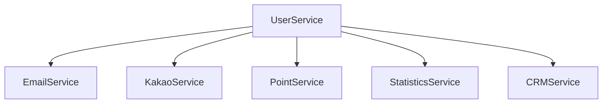

`UserService`가 모든 후속 서비스를 직접 알고 있다.

후속 작업이 추가될수록 의존성도 늘어난다.

```text
회원가입 기능 확장
↓
UserService 의존성 증가
↓
코드 복잡도 증가
↓
변경 영향 범위 증가
```

스프링 이벤트를 사용하면 구조를 조금 다르게 만들 수 있다.

회원가입 서비스는 더 이상 각각의 후속 작업을 직접 호출하지 않는다.

대신 다음 사실만 알린다.

```text
회원가입이 완료되었습니다.
```

---

## 이벤트 중심으로 구조를 바꿔보자

회원가입이 완료되면 이벤트를 발행한다.

```java
public void signUp(SignUpRequest request) {
    User user = userRepository.save(...);

    eventPublisher.publishEvent(
            new UserSignedUpEvent(user.getId())
    );
}
```

회원가입 서비스는 다음을 알 필요가 없다.

```text
누가 이메일을 보내는지

누가 카카오톡을 보내는지

누가 포인트를 지급하는지
```

단지 하나의 사건을 알린다.

```text
UserSignedUp
```

그리고 이 이벤트가 필요한 기능들이 각각 수신한다.

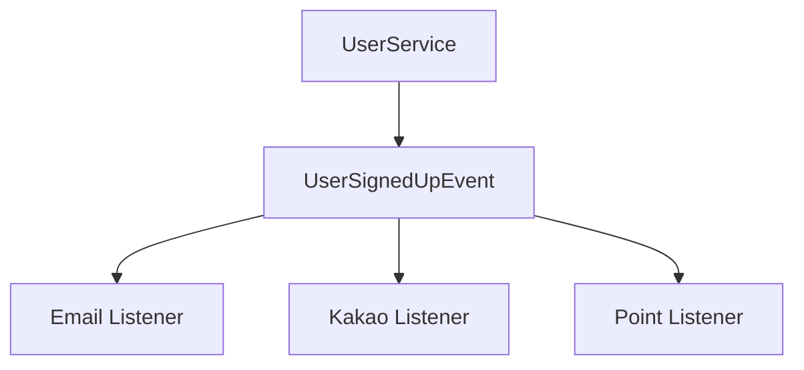

이제 회원가입 서비스와 후속 서비스 사이의 직접적인 의존성을 줄일 수 있다.

---

## 이벤트는 발생한 사실을 표현한다

이벤트를 이해할 때 중요한 것은 이벤트가 특정 작업을 명령하는 객체라기보다 **이미 발생한 사실을 표현한다는 것**이다.

예를 들어 다음 이름을 비교해보자.

```text
SendWelcomeEmail
```

이것은 명령에 가깝다.

반면

```text
UserSignedUp
```

은 발생한 사실을 표현한다.

회원가입 서비스 입장에서는 이메일을 어떻게 처리해야 하는지 몰라도 된다.

```text
회원가입 완료
↓
UserSignedUpEvent 발행
```

그 사실에 관심 있는 다른 컴포넌트가 자신의 책임을 수행한다.

---

## Spring Event의 기본 구성

Spring에서 이벤트를 처리하는 흐름은 크게 세 단계로 볼 수 있다.

```text
발행

전달

수신 및 실행
```

구조는 다음과 같다.

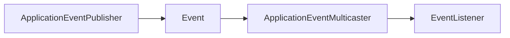

각 구성 요소의 역할을 살펴보자.

---

## ApplicationEventPublisher

이벤트를 발행할 때 사용할 수 있는 Spring 인터페이스다.

예를 들어 다음 이벤트 객체를 만든다.

```java
public record UserSignedUpEvent(
        Long userId
) {
}
```

이벤트 객체는 데이터를 전달하기 위한 단순한 객체 형태로 만들 수 있다.

이제 서비스에서 `ApplicationEventPublisher`를 주입받는다.

```java
@Service
public class UserService {

    private final UserRepository userRepository;
    private final ApplicationEventPublisher eventPublisher;

    public UserService(
            UserRepository userRepository,
            ApplicationEventPublisher eventPublisher
    ) {
        this.userRepository = userRepository;
        this.eventPublisher = eventPublisher;
    }

    public void signUp(SignUpRequest request) {
        User user = userRepository.save(
                new User(
                        request.email(),
                        request.name()
                )
        );

        eventPublisher.publishEvent(
                new UserSignedUpEvent(user.getId())
        );
    }
}
```

핵심은 다음 한 줄이다.

```java
eventPublisher.publishEvent(
        new UserSignedUpEvent(user.getId())
);
```

회원가입이 발생했다는 사실을 Spring에 전달한다.

---

## ApplicationEventMulticaster

발행된 이벤트는 이벤트를 처리할 수 있는 Listener에 전달되어야 한다.

Spring에서는 `ApplicationEventMulticaster`가 이러한 전달 과정에 관여한다.

개념적으로 다음과 같은 역할이다.

```text
UserSignedUpEvent 발행
        ↓
어떤 Listener가
이 이벤트를 처리할 수 있는지 확인
        ↓
처리 가능한 Listener에게 전달
```

예를 들어 다음 세 Listener가 있다고 하자.

```text
WelcomeEmailListener

WelcomeKakaoListener

WelcomePointListener
```

모두 `UserSignedUpEvent`를 처리한다면 해당 이벤트가 각 Listener에 전달된다.

---

## @EventListener

이벤트를 수신하기 위해 사용할 수 있는 대표적인 애너테이션이 `@EventListener`다.

예를 들어 회원가입 이메일을 발송한다.

```java
@Component
public class WelcomeEmailListener {

    private final EmailService emailService;

    public WelcomeEmailListener(
            EmailService emailService
    ) {
        this.emailService = emailService;
    }

    @EventListener
    public void sendWelcomeEmail(
            UserSignedUpEvent event
    ) {
        emailService.sendWelcomeMail(
                event.userId()
        );
    }
}
```

포인트 지급도 별도로 분리한다.

```java
@Component
public class WelcomePointListener {

    private final PointService pointService;

    public WelcomePointListener(
            PointService pointService
    ) {
        this.pointService = pointService;
    }

    @EventListener
    public void giveWelcomePoint(
            UserSignedUpEvent event
    ) {
        pointService.giveSignUpPoint(
                event.userId()
        );
    }
}
```

회원가입 서비스에서는 이러한 Listener를 알 필요가 없다.

---

## 이벤트를 사용했을 때 구조 변화

이벤트를 사용하지 않는 경우에는 다음과 같다.

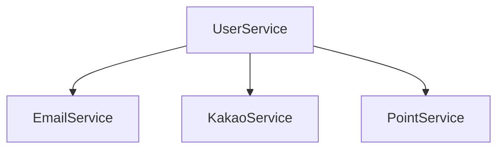

이벤트를 사용하면 다음과 같이 바뀐다.

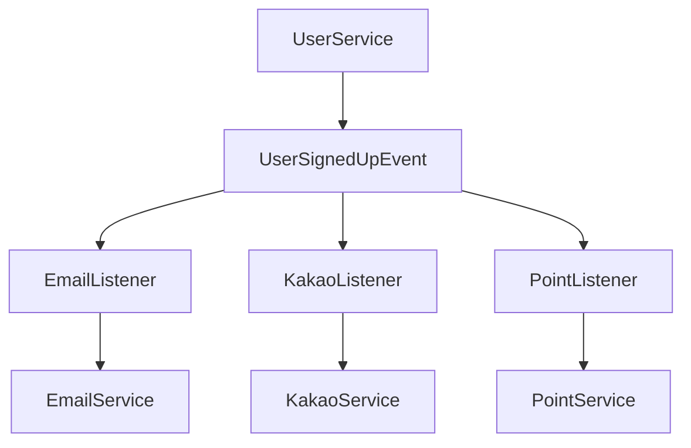

회원가입 서비스가 후속 작업의 구체적인 구현을 직접 알 필요가 없어졌다.

---

## 관심사를 분리할 수 있다

이벤트를 사용하면 회원가입 서비스는 회원가입 자체에 집중할 수 있다.

```java
public void signUp(SignUpRequest request) {
    User user = createUser(request);

    eventPublisher.publishEvent(
            new UserSignedUpEvent(user.getId())
    );
}
```

이메일 발송은 이메일 관련 컴포넌트가 담당한다.

포인트 지급은 포인트 관련 컴포넌트가 담당한다.

```text
UserService
→ 회원가입

EmailListener
→ 이메일 발송

PointListener
→ 포인트 지급
```

각 관심사를 분리할 수 있다.

---

## Listener 실행 순서를 지정할 수도 있다

여러 Listener가 동일한 이벤트를 처리하는 경우 실행 순서를 지정할 수도 있다.

`@Order`를 사용할 수 있다.

```java
@Component
public class FirstListener {

    @EventListener
    @Order(1)
    public void handle(
            UserSignedUpEvent event
    ) {
    }
}
```

```java
@Component
public class SecondListener {

    @EventListener
    @Order(2)
    public void handle(
            UserSignedUpEvent event
    ) {
    }
}
```

순서를 지정하면 여러 Listener 사이의 실행 우선순위를 표현할 수 있다.

---

## @EventListener는 언제 실행될까?

여기에서 매우 중요한 문제가 등장한다.

다음 코드를 보자.

```java
@Transactional
public void signUp(SignUpRequest request) {
    User user = userRepository.save(...);

    eventPublisher.publishEvent(
            new UserSignedUpEvent(user.getId())
    );

    termsRepository.save(...);
}
```

많은 사람이 처음에는 다음과 같이 생각할 수 있다.

```text
signUp() 완료
↓
Transaction Commit
↓
Event 실행
```

하지만 일반적인 `@EventListener`는 트랜잭션 커밋을 기다리는 Listener가 아니다.

이벤트가 발행되면 Listener가 실행될 수 있다.

개념적으로 다음과 같은 흐름이다.

```text
Transaction 시작
↓
User 저장
↓
Event 발행
↓
@EventListener 실행
↓
약관 저장
↓
Transaction Commit
```

여기서 문제가 발생할 수 있다.

---

## 트랜잭션이 커밋되기 전에 Listener가 실행될 수 있다

회원가입 트랜잭션을 조금 더 복잡하게 만들어보자.

```java
@Transactional
public void signUp(SignUpRequest request) {
    User user = userRepository.save(...);

    termsRepository.save(...);

    eventPublisher.publishEvent(
            new UserSignedUpEvent(user.getId())
    );

    additionalRepository.save(...);
}
```

이벤트가 발행되고 Listener가 실행된다.

```text
Welcome Email 발송

Kakao 알림 발송

Point 지급
```

그런데 마지막 단계에서 예외가 발생했다고 가정해보자.

```java
throw new RuntimeException();
```

트랜잭션은 Rollback된다.

---

## 데이터베이스는 Rollback되지만 외부 작업은 이미 실행될 수 있다

문제의 흐름을 살펴보자.

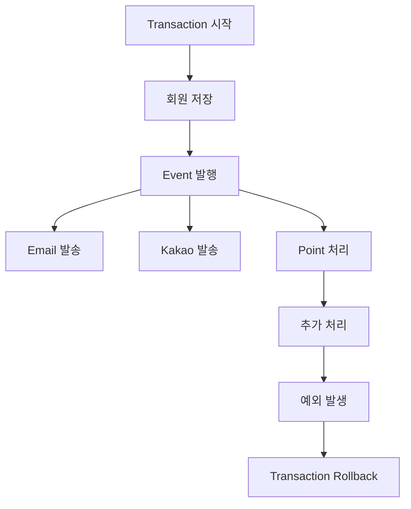

최종 결과는 이상하다.

데이터베이스에서는 회원가입이 실패했다.

```text
User
→ 존재하지 않음
```

그런데 사용자는 이미 이메일을 받았다.

```text
회원가입을 축하합니다.
```

카카오톡도 왔다.

포인트 관련 후속 처리도 실행되었을 수 있다.

사용자는 당연히 혼란스러울 수 있다.

---

## Commit 시점에도 실패할 수 있다

메서드의 마지막 줄까지 정상적으로 실행되었다고 반드시 트랜잭션이 성공하는 것은 아니다.

실제 Commit 과정에서도 문제가 발생할 수 있다.

예를 들어 DB 제약 조건에 문제가 있을 수 있다.

```text
Unique Constraint

Foreign Key Constraint

Not Null Constraint
```

JPA를 사용하는 경우 변경 내용이 Flush되는 시점에서 SQL이 실제로 실행되며 예외가 나타날 수도 있다.

따라서

```text
메서드의 코드가 마지막 줄까지 실행되었다.
```

와

```text
트랜잭션이 성공적으로 Commit되었다.
```

는 항상 같은 의미라고 볼 수 없다.

---

## 여기에서 필요한 것은 트랜잭션의 결과와 이벤트 실행 시점의 연결이다

회원가입 후 이메일 발송이라는 요구사항을 다시 생각해보자.

실제 요구사항은 다음과 가깝다.

```text
회원가입 처리가
성공적으로 Commit되었을 때만

가입 완료 이메일을 발송한다.
```

즉 단순히

```text
Event가 발행되었다.
```

가 조건이 아니다.

```text
Transaction Commit 성공
```

이 조건이어야 한다.

이때 사용할 수 있는 것이 `@TransactionalEventListener`다.

---

## @TransactionalEventListener

`@TransactionalEventListener`는 이벤트 처리 시점을 트랜잭션의 생명주기와 연결할 수 있게 해준다.

예를 들어 다음과 같이 사용할 수 있다.

```java
@Component
public class WelcomeEmailListener {

    private final EmailService emailService;

    public WelcomeEmailListener(
            EmailService emailService
    ) {
        this.emailService = emailService;
    }

    @TransactionalEventListener
    public void sendWelcomeEmail(
            UserSignedUpEvent event
    ) {
        emailService.sendWelcomeMail(
                event.userId()
        );
    }
}
```

기본적인 활용에서는 트랜잭션이 성공적으로 Commit된 이후 특정 후속 작업을 실행하도록 구성할 수 있다.

---

## AFTER_COMMIT

회원가입이 정상적으로 완료된 이후에만 이벤트 Listener를 실행하고 싶다면 `AFTER_COMMIT` 시점을 활용할 수 있다.

```java
@TransactionalEventListener(
        phase = TransactionPhase.AFTER_COMMIT
)
public void handle(
        UserSignedUpEvent event
) {
    emailService.sendWelcomeMail(
            event.userId()
    );
}
```

흐름은 다음과 같다.

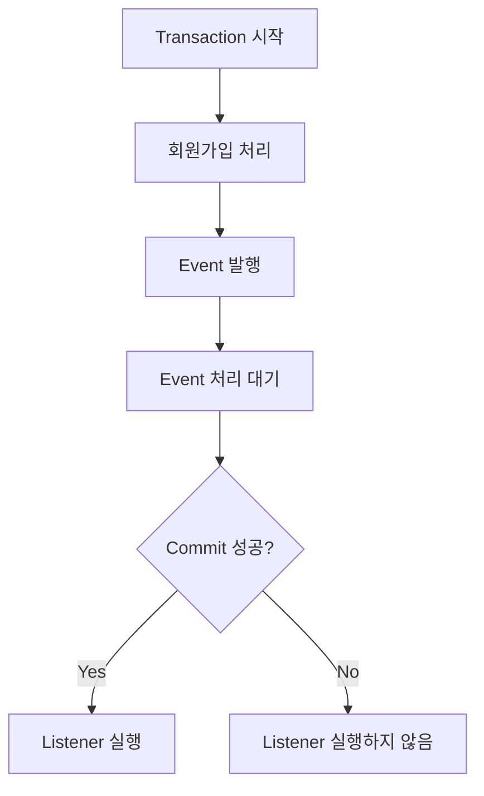

이제 트랜잭션이 Rollback된다면 회원가입 완료 이메일을 보내지 않는 구조를 만들 수 있다.

---

## @EventListener와 실행 흐름 비교

`@EventListener`를 단순화하면 다음과 같다.

```text
Transaction
↓
Event Publish
↓
Listener 실행
↓
Transaction 계속 진행
↓
Commit 또는 Rollback
```

반면 `AFTER_COMMIT` 기반의 `@TransactionalEventListener`를 사용하면 다음과 같이 생각할 수 있다.

```text
Transaction
↓
Event Publish
↓
Listener 실행 대기
↓
Commit 성공
↓
Listener 실행
```

이 차이가 매우 중요하다.

---

## TransactionPhase

`@TransactionalEventListener`에서는 트랜잭션의 특정 시점과 Listener 실행을 연결할 수 있다.

대표적으로 다음과 같은 시점을 생각할 수 있다.

```text
BEFORE_COMMIT

AFTER_COMMIT

AFTER_ROLLBACK

AFTER_COMPLETION
```

각각 목적이 다르다.

---

## BEFORE_COMMIT

트랜잭션 Commit 전에 실행한다.

```java
@TransactionalEventListener(
        phase = TransactionPhase.BEFORE_COMMIT
)
public void handle(
        UserSignedUpEvent event
) {
}
```

트랜잭션이 실제로 완료되기 전에 실행되어야 하는 처리가 있을 때 고려할 수 있다.

---

## AFTER_COMMIT

트랜잭션이 정상적으로 Commit된 이후 실행한다.

```java
@TransactionalEventListener(
        phase = TransactionPhase.AFTER_COMMIT
)
public void handle(
        UserSignedUpEvent event
) {
}
```

회원가입 성공 후 후속 작업처럼 **트랜잭션 성공 여부가 중요한 상황**에서 사용할 수 있다.

```text
회원가입 Commit 성공
↓
가입 완료 후속 작업
```

---

## AFTER_ROLLBACK

트랜잭션이 Rollback되었을 때 실행하도록 구성할 수 있다.

```java
@TransactionalEventListener(
        phase = TransactionPhase.AFTER_ROLLBACK
)
public void handleRollback(
        UserSignedUpEvent event
) {
}
```

Rollback이라는 결과에 반응해야 하는 로직이 필요한 상황에서 사용할 수 있다.

---

## AFTER_COMPLETION

Commit 또는 Rollback 여부와 관계없이 트랜잭션이 종료된 후 실행할 수 있다.

```java
@TransactionalEventListener(
        phase = TransactionPhase.AFTER_COMPLETION
)
public void handleCompletion(
        UserSignedUpEvent event
) {
}
```

즉 다음 두 경우 모두 트랜잭션 완료 이후라는 시점에 반응할 수 있다.

```text
Commit

Rollback
```

---

## 실행 시점을 표로 비교해보자

| TransactionPhase   | 실행 시점                 |
| ------------------ | --------------------- |
| `BEFORE_COMMIT`    | Commit 이전             |
| `AFTER_COMMIT`     | 정상 Commit 이후          |
| `AFTER_ROLLBACK`   | Rollback 이후           |
| `AFTER_COMPLETION` | Commit 또는 Rollback 이후 |

어떤 Phase를 사용할지는 이벤트의 의미와 비즈니스 요구사항에 따라 결정해야 한다.

---

## 회원가입 예제에서는 왜 AFTER_COMMIT일까?

회원가입 완료 이벤트를 다시 살펴보자.

```text
UserSignedUpEvent
```

이 이벤트를 받아 이메일을 보낸다.

사용자에게

```text
회원가입이 완료되었습니다.
```

라는 이메일을 보내려면 실제 회원가입이 성공했다는 사실이 확정되어야 한다.

따라서 다음 흐름이 자연스럽다.

```text
회원 데이터 저장

약관 데이터 저장

기타 회원가입 처리

↓
Transaction Commit

↓
가입 완료 Listener 실행
```

Rollback이 발생하면 Listener는 실행하지 않는다.

---

## @EventListener와 @TransactionalEventListener는 어떤 기준으로 선택할까?

둘 중 하나가 무조건 더 좋은 것은 아니다.

핵심은 **이벤트 처리 로직이 트랜잭션 결과와 관계가 있는가**다.

먼저 트랜잭션 자체가 없는 상황을 생각해보자.

```text
Transaction 없음
```

이 경우 트랜잭션 완료 시점과 연결해야 할 이유가 없다.

단순 이벤트 처리라면 `@EventListener`를 사용할 수 있다.

---

## 트랜잭션 결과와 무관한 이벤트

다음과 같이 즉시 처리해도 되는 기능이 있다고 생각해보자.

```text
간단한 로깅

일부 캐시 관련 처리

트랜잭션 완료 여부와 무관한 내부 처리
```

이런 경우에는 일반 `@EventListener`를 사용할 수 있다.

핵심은

```text
Transaction Commit 여부가
이벤트 처리 조건인가?
```

를 판단하는 것이다.

---

## 트랜잭션 성공 이후에만 실행해야 한다면

다음처럼 데이터 정합성이 중요한 후속 작업이라면 트랜잭션 완료 시점을 고려해야 한다.

```text
회원가입 성공 후 이메일

주문 생성 성공 후 후속 처리

결제 정보 저장 성공 후 알림

특정 상태 변경 확정 후 작업
```

이런 경우 `@TransactionalEventListener`를 고려할 수 있다.

```text
Transaction 성공
↓
Event Listener
```

이라는 순서가 중요하기 때문이다.

---

## 이벤트와 비동기는 같은 개념이 아니다

이벤트를 도입하는 이유 중 하나로 응답 속도 개선을 생각할 수 있다.

예를 들어 회원가입에 다음 작업이 있다고 하자.

```text
회원 저장
1초

이메일
3초

카카오톡
2초

포인트
1초
```

모든 작업이 순차적으로 진행되면 사용자 응답이 늦어질 수 있다.

이벤트 기반으로 구조를 분리하고 후속 작업을 비동기로 처리한다면 핵심 요청과 부가 작업을 분리할 수 있다.

다만 이벤트를 사용한다는 사실과 비동기로 실행한다는 사실은 구분해서 생각해야 한다.

핵심은 다음과 같다.

```text
Event
→ 관심사와 의존성 분리

Async
→ 실행 흐름을 비동기로 분리
```

이벤트 자체의 도입 목적과 비동기 처리 여부는 별도의 판단 대상이다.

---

## Spring Event의 중요한 한계

Spring Event는 매우 편리하지만 모든 이벤트 기반 시스템 문제를 해결하는 도구는 아니다.

가장 먼저 고려해야 할 것은 이벤트가 동작하는 범위다.

Spring Event는 기본적으로 하나의 Spring 애플리케이션 내부에서 사용되는 이벤트 메커니즘이다.

```text
Spring Application
├── UserService
├── EmailListener
├── PointListener
└── NotificationListener
```

이 애플리케이션 내부에서는 이벤트를 전달할 수 있다.

하지만 시스템이 여러 애플리케이션으로 나뉘어 있다면 이야기가 달라진다.

---

## 다른 서버로 이벤트를 전달하는 것은 별개의 문제다

예를 들어 시스템이 다음처럼 나뉘어 있다고 하자.

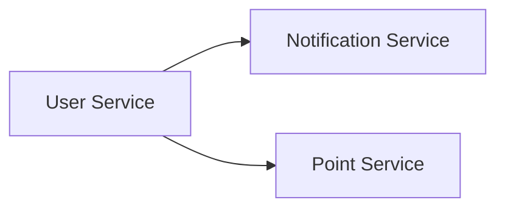

각각 독립적인 Spring Boot Application이다.

`User Service`에서 Spring Event를 발행했다고 `Point Service`의 `@EventListener`가 자동으로 이를 수신하는 구조는 아니다.

Spring 내부 이벤트는 기본적으로 애플리케이션 내부의 이벤트 메커니즘이기 때문이다.

분산된 애플리케이션 사이에서 이벤트를 전달하려면 다른 통신 수단이 필요하다.

---

## 메시지 유실 가능성도 고려해야 한다

Spring Event는 애플리케이션 내부에서 동작하므로 애플리케이션 프로세스 자체에 문제가 발생하는 상황도 고려해야 한다.

예를 들어 이벤트가 발행된다.

```text
UserSignedUpEvent
```

그 직후 애플리케이션이 종료된다면 아직 완료되지 않은 후속 처리는 유실될 수 있다.

개념적으로 다음과 같은 문제가 가능하다.

```text
Event Publish

↓


Application Crash

↓

후속 처리 보장 어려움
```

따라서 이벤트가 반드시 처리되어야 하는 높은 신뢰성이 필요한 요구사항이라면 단순 Spring Event만으로 충분한지 검토해야 한다.

---

## 단일 애플리케이션 내부의 관심사 분리에 적합하다

Spring Event가 특히 잘 맞는 상황은 하나의 애플리케이션 내부에서 여러 관심사를 분리하고 싶을 때다.

예를 들어 다음과 같은 구조다.

```text
Monolithic Spring Application
```

내부에

```text
회원 Domain

알림 Domain

포인트 Domain
```

이 존재한다.

회원 서비스가 알림과 포인트 서비스를 직접 호출하지 않고 회원가입 이벤트만 발행하도록 구성할 수 있다.

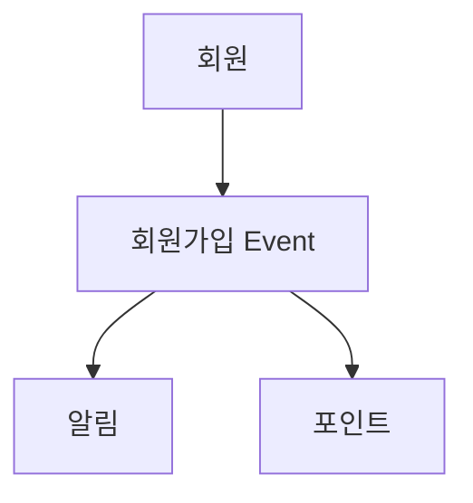

모듈 간 직접적인 의존성을 줄일 수 있다.

---

## 더 높은 신뢰성이 필요하면 메시징 시스템을 고려할 수 있다

다음과 같은 요구사항이 있다고 생각해보자.

```text
서버가 재시작되어도
이벤트가 반드시 처리되어야 한다.

여러 서비스가
이벤트를 수신해야 한다.

처리 실패 후
다시 시도해야 한다.

서버가 여러 대여도
안정적으로 전달되어야 한다.
```

이 정도 요구사항이라면 단순한 애플리케이션 내부 이벤트보다 전문적인 메시징 시스템을 검토할 수 있다.

```text
Message Broker
```

를 통한 이벤트 아키텍처가 필요한 영역이다.

---

## Spring Event와 메시지 브로커의 역할 차이

개념적으로 다음처럼 구분할 수 있다.

| 구분         | Spring Event       | 메시지 브로커 기반 이벤트    |
| ---------- | ------------------ | ----------------- |
| 범위         | 단일 애플리케이션 내부       | 여러 애플리케이션/서버      |
| 주요 목적      | 관심사 분리, 결합도 감소     | 분산 이벤트 전달         |
| 프로세스 종료 대응 | 제한적                | 별도 신뢰성 메커니즘 활용 가능 |
| 적용 복잡도     | 비교적 낮음             | 상대적으로 높음          |
| 인프라        | Spring Application | 별도 메시징 시스템 필요     |

따라서 무조건 메시지 브로커부터 도입할 필요는 없다.

요구되는 신뢰성과 시스템 구조에 맞게 선택하는 것이 중요하다.

---

## 이벤트를 사용하면 모든 의존성이 사라질까?

이벤트를 사용하면 직접적인 서비스 호출을 줄일 수 있다.

하지만 시스템의 논리적인 관계까지 사라지는 것은 아니다.

예를 들어

```text
회원가입
→ 포인트 지급
```

이라는 비즈니스 관계는 여전히 존재한다.

단지 다음과 같은 코드 의존성이

```text
UserService
→ PointService
```

이벤트를 통해

```text
UserService
→ UserSignedUpEvent

PointListener
→ UserSignedUpEvent
```

형태로 바뀐다.

따라서 이벤트를 도입했다고 시스템의 모든 결합이 사라진다고 생각하기보다는 **직접적인 호출 관계를 줄이고 이벤트라는 계약을 중심으로 결합 구조를 바꾼다**고 이해하는 것이 좋다.

---

## 모든 메서드를 이벤트로 분리할 필요는 없다

회원가입 서비스 내부에서 반드시 순서대로 수행해야 하는 핵심 작업까지 전부 이벤트로 나누면 오히려 흐름을 이해하기 어려워질 수 있다.

예를 들어 다음 로직이 있다고 하자.

```text
회원 생성

필수 약관 저장

회원 기본 상태 설정
```

이 세 가지가 하나의 회원가입 비즈니스 처리에 강하게 속한다면 굳이 각각 이벤트로 흩어놓을 필요는 없을 수 있다.

반대로 다음과 같은 후속 기능은 비교적 분리하기 좋다.

```text
가입 축하 메일

알림

포인트

통계
```

즉 핵심 비즈니스 흐름과 부가적인 후속 작업의 경계를 판단하는 것이 중요하다.

---

## 이벤트를 사용하기 좋은 질문

이벤트 도입을 고민할 때 다음 질문을 던져볼 수 있다.

```text
이 작업은 핵심 비즈니스 로직인가?

후속 작업인가?

Publisher가 Consumer를 직접 알아야 하는가?

새로운 Consumer가 추가될 가능성이 있는가?

트랜잭션 성공 이후에만 실행되어야 하는가?

실패해도 핵심 로직에 영향이 없는가?

이 이벤트는 단일 애플리케이션 내부에서만 사용되는가?

반드시 전달되어야 하는 이벤트인가?
```

이 질문에 따라 `@EventListener`, `@TransactionalEventListener`, 더 나아가 별도 메시징 시스템 중 적절한 방법을 선택할 수 있다.

---

## 실무 예제: 주문 생성과 이벤트

이번에는 주문을 생각해보자.

기존 구조는 다음과 같을 수 있다.

```java
@Transactional
public Order createOrder(
        CreateOrderRequest request
) {
    Order order = orderRepository.save(
            Order.create(request)
    );

    emailService.sendOrderMail(order);
    pointService.saveOrderPoint(order);
    notificationService.send(order);

    return order;
}
```

서비스가 여러 후속 작업을 직접 호출하고 있다.

이벤트 방식으로 바꿀 수 있다.

```java
@Transactional
public Order createOrder(
        CreateOrderRequest request
) {
    Order order = orderRepository.save(
            Order.create(request)
    );

    eventPublisher.publishEvent(
            new OrderCreatedEvent(
                    order.getId()
            )
    );

    return order;
}
```

주문 완료 이메일은 Listener에서 처리한다.

```java
@Component
public class OrderEmailListener {

    private final EmailService emailService;

    public OrderEmailListener(
            EmailService emailService
    ) {
        this.emailService = emailService;
    }

    @TransactionalEventListener(
            phase = TransactionPhase.AFTER_COMMIT
    )
    public void handle(
            OrderCreatedEvent event
    ) {
        emailService.sendOrderCreatedMail(
                event.orderId()
        );
    }
}
```

주문이 정상적으로 Commit된 이후에만 완료 후속 작업을 실행하도록 구성할 수 있다.

---

## 트랜잭션 실패 상황 비교

일반 `@EventListener`라고 생각해보자.

```text
Order 저장

↓
OrderCreatedEvent 발행

↓
완료 이메일 발송

↓
DB Commit 실패

↓
Rollback
```

결과는 다음과 같다.

```text
주문 DB
→ 없음

사용자 이메일
→ 주문 완료
```

불일치가 생긴다.

반면 Commit 이후 실행으로 연결하면

```text
Order 저장

↓
Event 발행

↓
Commit 시도

↓
Commit 실패

↓
Rollback

↓
후속 Listener 실행하지 않음
```

트랜잭션 결과와 후속 작업의 실행 조건을 일치시킬 수 있다.

---

## 이벤트 처리 순서를 그려보자

일반 `@EventListener`의 개념적인 흐름이다.

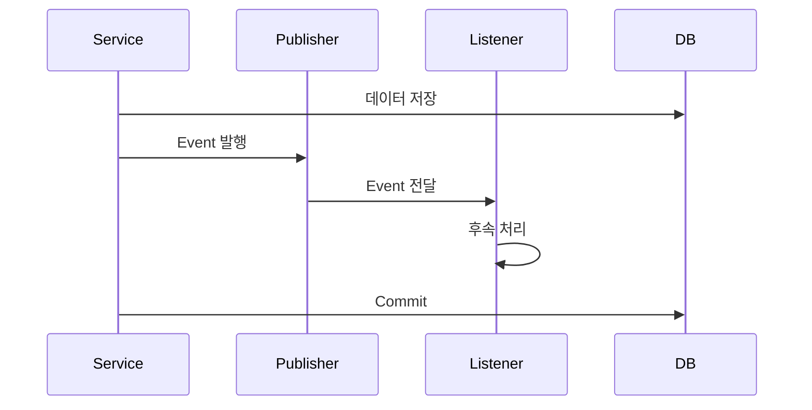

트랜잭션 Commit 이후 Listener를 실행하는 경우에는 다음처럼 생각할 수 있다.

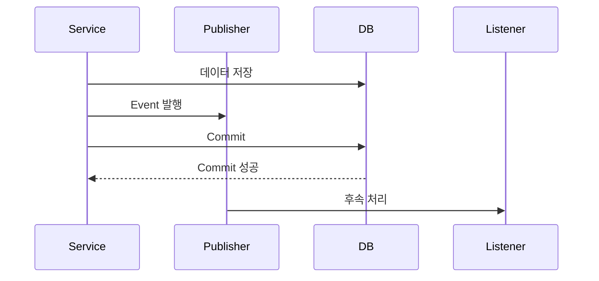

두 방식의 핵심 차이는 Listener가 트랜잭션의 어느 시점과 연결되어 있는가이다.

---

## @EventListener와 @TransactionalEventListener 정리

두 애너테이션의 가장 중요한 차이를 정리하면 다음과 같다.

| 구분            | `@EventListener`  | `@TransactionalEventListener` |
| ------------- | ----------------- | ----------------------------- |
| 트랜잭션 완료 시점 연계 | 직접적인 연계 없음        | 가능                            |
| 일반 이벤트 처리     | 적합                | 트랜잭션이 중요한 경우 활용               |
| Commit 후 처리   | 보장 목적과 맞지 않을 수 있음 | `AFTER_COMMIT` 사용 가능          |
| Rollback 후 처리 | 별도 트랜잭션 시점 연계 없음  | `AFTER_ROLLBACK` 가능           |
| 주요 목적         | 이벤트 기반 관심사 분리     | 트랜잭션 결과와 이벤트 처리 연결            |

결국 판단 기준은 트랜잭션이다.

```text
이 이벤트 처리가
Transaction 결과에 의존하는가?
```

---

## 구조

전체 구조를 하나로 연결하면 다음과 같다.

```mermaid
flowchart TD
    A[Business Service] --> B[ApplicationEventPublisher]

    B --> C[Domain/Application Event]

    C --> D{처리 시점}

    D --> E[@EventListener]
    D --> F[@TransactionalEventListener]

    E --> G[일반 이벤트 처리]

    F --> H[BEFORE_COMMIT]
    F --> I[AFTER_COMMIT]
    F --> J[AFTER_ROLLBACK]
    F --> K[AFTER_COMPLETION]

    G --> L{더 높은 신뢰성 필요?}
    I --> L
    J --> L
    K --> L

    L -->|No| M[Spring Application 내부 Event]
    L -->|Yes| N[전문 메시징 시스템 검토]
```

Spring Event가 해결하려는 핵심 문제는 애플리케이션 내부의 관심사를 분리하고 서비스 간 직접적인 의존성을 줄이는 것이다.

`@TransactionalEventListener`는 여기에 트랜잭션 완료 시점이라는 조건을 추가한다.

---

## 실무에서의 활용

실제 백엔드 시스템에서는 다음과 같은 흐름으로 판단해볼 수 있다.

### 회원가입

```text
회원 생성
→ 핵심 로직

가입 축하 이메일
→ 후속 작업

가입 포인트
→ 후속 작업

통계 이벤트
→ 후속 작업
```

### 주문

```text
주문 생성
→ 핵심 로직

주문 완료 알림
→ 후속 작업

통계 반영
→ 후속 작업
```

### 결제

```text
결제 상태 변경
→ 핵심 로직

결제 완료 알림
→ 후속 작업

분석 이벤트
→ 후속 작업
```

핵심 로직과 직접적인 관계가 적은 후속 작업이 하나의 서비스에 계속 쌓이기 시작한다면 이벤트 분리를 검토할 수 있다.

그리고 다음 질문을 다시 확인한다.

```text
DB Transaction이 실패하면
이 후속 작업도 실행되면 안 되는가?
```

그렇다면 트랜잭션 완료 시점과 Listener를 연결하는 방법을 고려해야 한다.

---

## Spring Event를 사용할 때 생각해야 할 10가지

실무적으로 정리하면 다음 항목들을 확인할 수 있다.

### 1. 이벤트는 후속 작업 분리에 활용할 수 있다

핵심 서비스가 모든 후속 서비스를 직접 호출하는 구조를 줄일 수 있다.

### 2. Publisher는 Consumer를 몰라도 된다

이벤트를 발행하는 객체는 해당 이벤트를 누가 소비하는지 알 필요가 없다.

### 3. 이벤트는 발생한 사실을 표현할 수 있다

```text
UserSignedUp

OrderCreated
```

처럼 사건을 표현한다.

### 4. `@EventListener`는 트랜잭션 Commit 자체를 기다리는 Listener가 아니다

트랜잭션과 함께 사용할 때 실행 시점을 반드시 생각해야 한다.

### 5. 메서드가 끝난 것과 Commit 성공은 다를 수 있다

Commit이나 Flush 과정에서도 오류가 발생할 수 있다.

### 6. Commit 이후에만 처리해야 한다면 트랜잭션 이벤트를 고려한다

`AFTER_COMMIT`과 같은 시점을 활용할 수 있다.

### 7. Rollback에 반응해야 하는 이벤트도 만들 수 있다

`AFTER_ROLLBACK` 등의 시점을 활용할 수 있다.

### 8. Spring Event는 애플리케이션 내부 이벤트다

다른 Spring Boot 서버까지 자동으로 전달되는 것은 아니다.

### 9. 높은 전달 신뢰성이 필요하면 별도 메시징 시스템을 검토한다

애플리케이션 장애와 분산 환경을 고려해야 한다.

### 10. 이벤트와 비동기는 별개의 관심사다

이벤트 도입 자체와 비동기 실행을 동일한 개념으로 생각하지 않는 것이 중요하다.

---

## 정리

서비스가 성장하면서 하나의 핵심 기능에 여러 후속 작업이 붙기 시작할 수 있다.

예를 들어 회원가입이 처음에는 다음과 같았다.

```text
회원가입
```

시간이 지나면 다음처럼 변한다.

```text
회원가입

+ Email
+ Kakao
+ Point
+ Statistics
+ Notification
```

이 모든 서비스를 회원가입 서비스가 직접 호출하면 의존성이 증가하고 관심사가 섞일 수 있다.

Spring Event를 사용하면 회원가입 서비스는 다음 사실만 발행할 수 있다.

```text
UserSignedUpEvent
```

그리고 각 Listener가 자신에게 필요한 작업을 처리한다.

```text
UserSignedUpEvent

├── EmailListener
├── KakaoListener
└── PointListener
```

이때 기본적인 이벤트 Listener로 사용할 수 있는 것이 `@EventListener`다.

하지만 트랜잭션 안에서 이벤트를 발행한다면 Listener 실행 시점을 반드시 고려해야 한다.

```text
Transaction 시작
↓
Event 발행
↓
Listener 실행
↓
Commit 실패
↓
Rollback
```

이 구조에서는 실제 데이터는 Rollback되었지만 외부 후속 작업은 이미 실행되었을 수 있다.

이를 해결하기 위해 트랜잭션의 생명주기와 Listener 실행 시점을 연결할 수 있는 `@TransactionalEventListener`를 사용할 수 있다.

대표적으로 다음 Phase를 사용할 수 있다.

```text
BEFORE_COMMIT

AFTER_COMMIT

AFTER_ROLLBACK

AFTER_COMPLETION
```

회원가입이 실제로 성공했을 때만 완료 이메일을 보내야 한다면 다음과 같이 생각할 수 있다.

```text
회원가입 처리
↓
Transaction Commit 성공
↓
AFTER_COMMIT
↓
가입 완료 후속 처리
```

`@EventListener`와 `@TransactionalEventListener` 중 어떤 것을 사용할지는 단순한 성능 비교보다 이벤트 로직과 트랜잭션 결과의 관계로 판단하는 것이 중요하다.

그리고 Spring Event에도 한계가 있다.

```text
단일 Spring Application 내부에서 동작

애플리케이션 종료 상황에서
높은 전달 신뢰성을 보장하는
전문 메시징 시스템은 아님

다른 서비스로 자동 전달되지 않음
```

따라서 단일 애플리케이션 내부에서 낮은 결합도와 관심사 분리가 목적이라면 Spring Event는 유용하게 사용할 수 있다.

반대로 다음 요구사항이 중요하다면 별도의 메시징 시스템을 검토해야 한다.

```text
여러 서버에 이벤트 전달

분산 서비스 통신

높은 메시지 전달 신뢰성

장애 후 재처리

확장 가능한 이벤트 아키텍처
```

결국 이벤트 설계에서 중요한 것은 단순히 애너테이션을 선택하는 것이 아니다.

먼저 다음 세 가지를 판단해야 한다.

```text
이 작업은 핵심 로직인가
후속 작업인가?

Transaction이 실패해도
실행되어도 되는가?

Application이 종료되어도
반드시 처리되어야 하는가?
```

첫 번째 질문은 **이벤트를 사용할 것인가**를 결정하는 기준이 되고,

두 번째 질문은 **`@EventListener`와 `@TransactionalEventListener` 중 무엇을 사용할 것인가**를 결정하는 기준이 되며,

세 번째 질문은 **Spring Event만으로 충분한가, 더 신뢰성 있는 메시징 시스템이 필요한가**를 결정하는 기준이 된다.

### 한 줄 요약

**Spring `@EventListener`는 하나의 애플리케이션 안에서 핵심 로직과 후속 작업의 결합을 낮추는 데 사용할 수 있으며, 이벤트 처리가 트랜잭션의 성공·실패와 연결되어야 한다면 `@TransactionalEventListener`로 실행 시점을 제어하고, 더 높은 전달 신뢰성과 분산 처리가 필요하다면 별도의 메시징 시스템을 검토해야 한다.**
