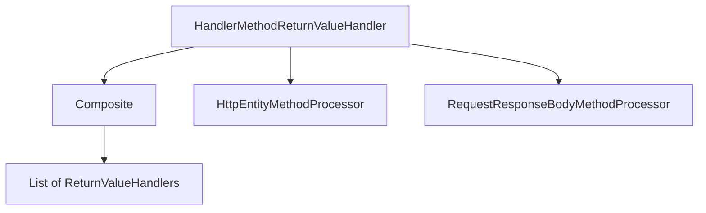
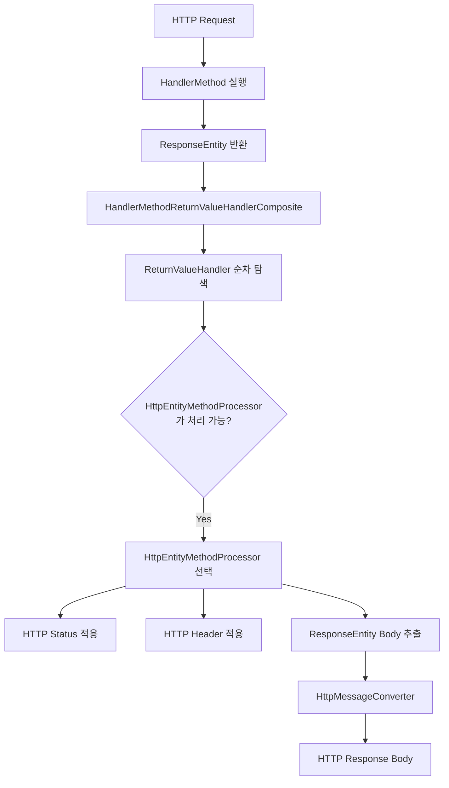
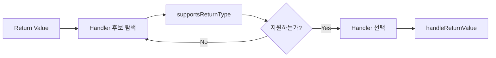
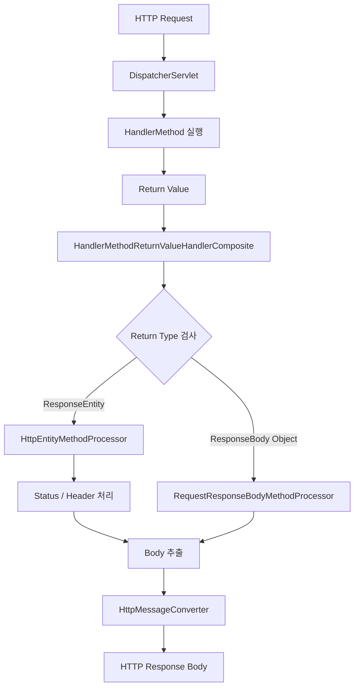

# 머랭의 @ResponseBody와 ResponseEntity를 함께 사용하면 벌어지는 일
[https://youtu.be/JOLwv6Btayg?si=xyqgCUwri6yLJbjr](https://youtu.be/JOLwv6Btayg?si=xyqgCUwri6yLJbjr)

# 머랭의 @ResponseBody와 ResponseEntity를 함께 사용하면 벌어지는 일
* toc
{:toc}

---

## @ResponseBody와 ResponseEntity를 함께 사용하면 어떻게 동작할까?

Spring MVC로 REST API를 개발하다 보면 다음 코드를 매우 자연스럽게 사용한다.

```java
@RestController
@RequestMapping("/memos")
public class MemoController {

    @GetMapping("/{id}")
    public ResponseEntity<MemoResponse> getMemo(
            @PathVariable Long id
    ) {
        MemoResponse response = findMemo(id);

        return ResponseEntity.ok(response);
    }
}
```

여기에는 흥미로운 지점이 하나 있다.

`@RestController`에는 `@ResponseBody`의 의미가 포함되어 있다.

그리고 `ResponseEntity` 역시 HTTP 응답의 Body를 직접 구성하기 위해 사용하는 반환 타입이다.

그렇다면 이런 의문을 가질 수 있다.

```text
@ResponseBody가 적용된 메서드가
ResponseEntity를 반환하면

누가 반환값을 처리할까?
```

가능성을 두 가지로 생각해볼 수 있다.

첫 번째는 `@ResponseBody`의 처리가 먼저 적용되어 `ResponseEntity` 객체 자체를 HTTP Response Body에 직렬화하는 것이다.

```text
ResponseEntity

{
    body: ...,
    headers: ...,
    statusCode: ...
}
```

두 번째는 `ResponseEntity`를 전용으로 처리하는 로직이 적용되어 `ResponseEntity` 내부의 Body만 직렬화하는 것이다.

실제로 우리가 일반적으로 경험하는 동작은 두 번째다.

```json
{
  "id": 1,
  "content": "hello"
}
```

그렇다면 Spring MVC는 어떻게 두 처리 방식 사이에서 `ResponseEntity` 처리를 선택하는 것일까?

이 질문을 이해하기 위해서는 Spring MVC의 **HandlerMethod 반환값 처리 구조**를 살펴볼 필요가 있다.

---

## 먼저 @RestController부터 다시 살펴보자

Spring MVC에서 REST API를 만들 때 흔히 다음과 같이 작성한다.

```java
@RestController
public class MemoController {
}
```

`@RestController`는 Controller 클래스가 HTTP 응답 Body를 직접 반환하는 용도임을 표현한다.

일반적으로 다음과 같은 Controller와 비교할 수 있다.

```java
@Controller
public class PageController {

    @GetMapping("/page")
    public String page() {
        return "page";
    }
}
```

이런 Controller에서 문자열 반환값은 View 이름으로 해석될 수 있다.

반면 HTTP Response Body에 객체를 직접 쓰고 싶다면 다음처럼 사용할 수 있다.

```java
@Controller
public class MemoController {

    @ResponseBody
    @GetMapping("/memos")
    public MemoResponse getMemo() {
        return new MemoResponse(1L, "hello");
    }
}
```

그리고 이러한 패턴을 클래스 전체에 적용하기 편하게 사용하는 것이 `@RestController`다.

개념적으로 다음과 같이 생각할 수 있다.

```text
@RestController

→ Controller 역할

+

→ HandlerMethod 반환값을
  Response Body로 처리
```

---

## @ResponseBody가 적용된 메서드가 객체를 반환하면?

다음과 같은 메서드가 있다고 하자.

```java
@GetMapping("/memos/{id}")
public MemoResponse getMemo(
        @PathVariable Long id
) {
    return new MemoResponse(
            id,
            "Spring"
    );
}
```

`@RestController` 내부에 있으므로 반환값은 HTTP Response Body에 작성된다.

예를 들어 다음과 같은 응답을 생각할 수 있다.

```json
{
  "id": 1,
  "content": "Spring"
}
```

이 과정에서 Spring MVC가 해야 하는 일이 있다.

```text
MemoResponse Java 객체

↓

HTTP Response Body

↓

JSON
```

즉 HandlerMethod가 반환한 Java 객체를 실제 HTTP 응답으로 변환해야 한다.

이 작업을 처리하는 핵심 구조 중 하나가 `HandlerMethodReturnValueHandler`다.

---

## HandlerMethod란 무엇인가?

Spring MVC에서 `@RequestMapping`, `@GetMapping`, `@PostMapping` 등으로 요청을 처리하는 Controller 메서드를 HandlerMethod라고 생각할 수 있다.

예를 들어 다음 메서드다.

```java
@GetMapping("/{id}")
public MemoResponse getMemo(
        @PathVariable Long id
) {
    return memoService.find(id);
}
```

요청이 들어오면 Spring MVC는 적절한 HandlerMethod를 찾아 호출한다.

```text
HTTP Request

↓

Controller

↓

HandlerMethod 실행

↓

Return Value
```

하지만 Controller 메서드가 값을 반환했다고 HTTP 응답이 바로 완성되는 것은 아니다.

반환값을 어떤 방식으로 처리할 것인지 결정해야 한다.

---

## HandlerMethodReturnValueHandler란 무엇인가?

`HandlerMethodReturnValueHandler`는 HandlerMethod가 반환한 값을 처리하기 위한 역할을 담당하는 인터페이스다.

핵심적으로 두 가지 질문에 답한다.

```text
이 반환 타입을
내가 처리할 수 있는가?

처리할 수 있다면
어떻게 처리할 것인가?
```

이를 담당하는 대표적인 메서드가 다음 두 가지다.

```java
boolean supportsReturnType(
        MethodParameter returnType
);

void handleReturnValue(
        Object returnValue,
        MethodParameter returnType,
        ModelAndViewContainer mavContainer,
        NativeWebRequest webRequest
);
```

역할을 구분하면 다음과 같다.

### supportsReturnType()

```text
이 HandlerMethod의 반환값을
내가 처리할 수 있는가?
```

를 판단한다.

### handleReturnValue()

실제로 선택된 이후 반환값을 처리한다.

즉 전체 구조를 단순화하면 다음과 같다.


---

## 반환값 처리기는 하나만 존재하지 않는다

Spring MVC가 처리해야 하는 반환값의 종류는 다양하다.

예를 들어 다음과 같은 반환 형태가 존재할 수 있다.

```text
ModelAndView

String

ResponseEntity

HttpEntity

@ResponseBody 객체

void
```

각 반환 타입의 의미가 모두 다르다.

따라서 모든 반환값을 하나의 처리기가 처리하기보다 여러 개의 반환값 처리기가 존재한다.

```text
ReturnValueHandler A

ReturnValueHandler B

ReturnValueHandler C

ReturnValueHandler D

...
```

그중 현재 HandlerMethod의 반환값을 처리할 수 있는 Handler를 선택한다.

---

## @ResponseBody를 처리하는 RequestResponseBodyMethodProcessor

`@ResponseBody`가 적용된 HandlerMethod의 반환값을 처리하는 대표적인 구현체가 `RequestResponseBodyMethodProcessor`다.

이름은 길지만 역할을 단순하게 보면 된다.

```text
@ResponseBody가 적용된 반환값을
HTTP Response Body에 작성한다.
```

예를 들어 다음과 같은 메서드가 있다고 하자.

```java
@ResponseBody
@GetMapping("/memo")
public MemoResponse getMemo() {
    return new MemoResponse(
            1L,
            "hello"
    );
}
```

`RequestResponseBodyMethodProcessor`가 이 메서드를 처리할 수 있는지 판단한다.

---

## RequestResponseBodyMethodProcessor의 supportsReturnType()

이 처리기는 HandlerMethod 또는 HandlerMethod를 포함하는 클래스에 `@ResponseBody`가 존재하는지 확인한다.

개념적으로 다음과 같은 판단을 한다.

```text
Controller Class에
@ResponseBody가 있는가?

또는

HandlerMethod에
@ResponseBody가 있는가?
```

`@RestController`를 사용하는 경우 클래스 수준에서 Response Body 처리 대상으로 판단할 수 있다.

따라서 다음 Controller의 메서드들은 일반적으로 Body 반환 방식으로 처리될 수 있다.

```java
@RestController
public class MemoController {

    @GetMapping("/memo")
    public MemoResponse getMemo() {
        return new MemoResponse(
                1L,
                "hello"
        );
    }
}
```

---

## RequestResponseBodyMethodProcessor의 handleReturnValue()

자신이 처리할 반환값으로 결정되었다면 실제 응답 작업을 수행한다.

중요한 동작 중 하나는 `ModelAndViewContainer`에 해당 요청이 처리되었다는 상태를 표시하는 것이다.

개념적으로 다음과 같다.

```text
mavContainer

isRequestHandled = true
```

왜 이런 처리가 필요할까?

`@ResponseBody`는 View를 찾아 렌더링하는 것이 아니라 HTTP Response Body에 직접 데이터를 작성한다.

```text
일반 MVC

Return Value
↓
View
↓
Rendering


@ResponseBody

Return Value
↓
HTTP Response Body
```

따라서 더 이상 View를 처리할 필요가 없다는 것을 Spring MVC에 알려줄 필요가 있다.

---

## HttpMessageConverter

`RequestResponseBodyMethodProcessor`가 Java 객체를 HTTP Body에 직접 문자열로 손으로 변환하는 것은 아니다.

실제 변환 과정에서는 `HttpMessageConverter`가 사용된다.

예를 들어

```java
new MemoResponse(
        1L,
        "hello"
)
```

라는 객체가 있다고 하자.

JSON 응답에서는 다음 형태가 될 수 있다.

```json
{
  "id": 1,
  "content": "hello"
}
```

전체 흐름을 단순화하면 다음과 같다.


즉 역할을 분리하면 다음과 같다.

```text
RequestResponseBodyMethodProcessor
→ Response Body 처리 흐름 담당

HttpMessageConverter
→ 객체를 실제 HTTP 표현으로 변환
```

---

## ResponseEntity를 반환하면 누가 처리할까?

이번에는 Controller가 `ResponseEntity`를 반환한다고 하자.

```java
@GetMapping("/memo")
public ResponseEntity<MemoResponse> getMemo() {

    MemoResponse response =
            new MemoResponse(
                    1L,
                    "hello"
            );

    return ResponseEntity.ok(response);
}
```

`ResponseEntity`에는 Body만 존재하는 것이 아니다.

HTTP 응답에 필요한 여러 정보를 표현할 수 있다.

예를 들어 다음처럼 작성할 수도 있다.

```java
return ResponseEntity
        .status(HttpStatus.CREATED)
        .header("X-Custom-Header", "value")
        .body(response);
```

개념적으로 다음 정보를 가진다.

```text
ResponseEntity

├── Status
├── Headers
└── Body
```

따라서 일반적인 객체와 처리 방식이 다르다.

---

## HttpEntityMethodProcessor

`ResponseEntity`와 같은 반환 타입을 처리하는 대표적인 Handler가 `HttpEntityMethodProcessor`다.

이 처리기의 `supportsReturnType()`은 HandlerMethod의 반환 타입이 자신이 지원하는 형태인지 확인한다.

예를 들어 다음과 같은 타입이다.

```text
HttpEntity

ResponseEntity
```

따라서 HandlerMethod의 선언이 다음과 같다면

```java
public ResponseEntity<MemoResponse> getMemo()
```

`HttpEntityMethodProcessor`가 이를 처리할 후보가 된다.

---

## ResponseEntity는 객체 전체를 Body에 직렬화하지 않는다

이 지점이 핵심이다.

다음 객체가 있다고 하자.

```text
ResponseEntity

status = 200 OK

headers = ...

body = MemoResponse
```

Spring이 이를 다음처럼 JSON으로 반환하는 것이 아니다.

```json
{
  "statusCode": "OK",
  "headers": {},
  "body": {
    "id": 1,
    "content": "hello"
  }
}
```

ResponseEntity를 처리하는 Handler는 ResponseEntity가 가진 HTTP 상태, Header 등을 HTTP 응답에 반영하고 실제 Body 데이터를 응답 Body에 작성한다.

결과적으로 클라이언트에서는 다음과 같은 Body를 받을 수 있다.

```json
{
  "id": 1,
  "content": "hello"
}
```

---

## 그런데 @RestController와 ResponseEntity를 같이 사용하면?

이제 처음 질문으로 돌아가보자.

```java
@RestController
public class MemoController {

    @GetMapping("/memo")
    public ResponseEntity<MemoResponse> getMemo() {
        return ResponseEntity.ok(
                new MemoResponse(
                        1L,
                        "hello"
                )
        );
    }
}
```

이 Controller에는 `@RestController`가 있으므로 `@ResponseBody` 기반 처리 대상이다.

동시에 HandlerMethod의 반환 타입은 `ResponseEntity`다.

따라서 개념적으로 두 처리기 모두 후보처럼 보인다.

```text
RequestResponseBodyMethodProcessor

VS

HttpEntityMethodProcessor
```

그렇다면 누가 선택될까?

이를 이해하려면 반환값 처리기를 관리하는 Composite 구조를 봐야 한다.

---

## HandlerMethodReturnValueHandlerComposite

Spring MVC에는 여러 `HandlerMethodReturnValueHandler` 구현체가 존재한다.

이들을 하나의 구조에서 관리하는 역할을 하는 것이 `HandlerMethodReturnValueHandlerComposite`다.

이름 그대로 여러 반환값 처리기를 묶어서 다룬다.

구조를 단순하게 표현하면 다음과 같다.

```text
HandlerMethodReturnValueHandlerComposite

└── List<HandlerMethodReturnValueHandler>
    ├── Handler A
    ├── Handler B
    ├── HttpEntityMethodProcessor
    ├── Handler C
    ├── RequestResponseBodyMethodProcessor
    └── ...
```

Composite 역시 `HandlerMethodReturnValueHandler` 형태로 동작하면서 내부에는 실제 Handler 목록을 가진다.

---

## Composite Pattern

구조적으로 보면 Composite Pattern을 떠올릴 수 있다.

외부에서는 하나의 Handler처럼 사용한다.

```text
HandlerMethodReturnValueHandlerComposite
```

하지만 내부에서는 여러 Handler를 관리한다.



Controller 반환값을 처리해야 할 때 Composite가 내부 Handler 목록을 살펴본다.

---

## 반환값 처리기를 어떻게 선택할까?

핵심은 내부 Handler들을 탐색하면서 현재 반환 타입을 처리할 수 있는 구현체를 찾는 것이다.

개념적으로 다음과 같이 생각할 수 있다.

```java
for (HandlerMethodReturnValueHandler handler : handlers) {

    if (handler.supportsReturnType(returnType)) {
        return handler;
    }
}
```

즉 여러 Handler 중에서 조건을 만족하는 것을 찾는다.

여기서 매우 중요한 특징이 하나 생긴다.

```text
먼저 검사된 Handler가
처리 가능하다고 판단하면

뒤 Handler까지 갈 필요가 없다.
```

---

## Handler 순서가 중요하다

예를 들어 Handler 목록이 다음과 같다고 가정하자.

```text
1. HttpEntityMethodProcessor

2. RequestResponseBodyMethodProcessor
```

HandlerMethod가 다음 타입을 반환한다.

```java
ResponseEntity<MemoResponse>
```

첫 번째 Handler를 검사한다.

```text
HttpEntityMethodProcessor

ResponseEntity인가?

→ YES
```

처리 가능한 Handler가 발견되었다.

그러면 뒤에 있는 `RequestResponseBodyMethodProcessor`를 선택할 이유가 없다.

```text
ResponseEntity
↓
HttpEntityMethodProcessor 선택
↓
ResponseEntity 규칙으로 처리
```

따라서 ResponseEntity 객체 자체가 단순 JSON 객체처럼 직렬화되지 않는다.

---

## @ResponseBody 처리기가 먼저 있었다면?

이해를 위해 반대로 상상해보자.

```text
1. RequestResponseBodyMethodProcessor

2. HttpEntityMethodProcessor
```

그리고 첫 번째 처리기가 `ResponseEntity` 반환 메서드를 자신이 처리할 수 있다고 판단한다고 가정한다.

그렇다면 `ResponseEntity` 자체를 일반적인 반환 객체처럼 처리하는 방향을 떠올릴 수 있다.

하지만 실제 처리기 구성에서는 `ResponseEntity`를 담당하는 `HttpEntityMethodProcessor`가 먼저 선택될 수 있도록 구성되어 있다.

결과적으로 Spring MVC는 `ResponseEntity`에 정의된 의미를 잃지 않는다.

---

## 전체 실행 흐름

`@RestController`에서 `ResponseEntity<MemoResponse>`를 반환한다고 하자.

```java
@RestController
public class MemoController {

    @GetMapping("/memo")
    public ResponseEntity<MemoResponse> getMemo() {

        MemoResponse memo =
                new MemoResponse(
                        1L,
                        "hello"
                );

        return ResponseEntity.ok(memo);
    }
}
```

전체 흐름을 단순화하면 다음과 같다.



결과적으로 다음 JSON이 반환될 수 있다.

```json
{
  "id": 1,
  "content": "hello"
}
```

---

## ResponseEntity의 Body도 결국 HttpMessageConverter를 사용한다

`HttpEntityMethodProcessor`와 `RequestResponseBodyMethodProcessor`는 처리하는 반환값의 의미가 다르다.

하지만 Response Body에 Java 객체를 작성하는 과정에서는 `HttpMessageConverter`가 중요한 역할을 한다.

예를 들어 Body가 다음 객체라면

```java
new MemoResponse(
        1L,
        "Spring MVC"
)
```

적절한 MessageConverter를 통해 HTTP 응답 표현으로 변환된다.

```json
{
  "id": 1,
  "content": "Spring MVC"
}
```

따라서 구조를 조금 더 자세히 보면 다음과 같다.

```text
ResponseEntity<MemoResponse>
        ↓
HttpEntityMethodProcessor
        ↓
Body 추출
        ↓
MemoResponse
        ↓
HttpMessageConverter
        ↓
HTTP Response Body
```

---

## @RestController인데 항상 ResponseEntity를 반환해야 할까?

그렇지는 않다.

다음처럼 객체를 직접 반환할 수 있다.

```java
@RestController
public class MemoController {

    @GetMapping("/memo")
    public MemoResponse getMemo() {
        return new MemoResponse(
                1L,
                "hello"
        );
    }
}
```

이 경우 `@RestController`의 Response Body 처리 의미에 따라 반환 객체가 HTTP Body에 작성된다.

따라서 단순히 Body만 반환하면 되는 API에서는 반드시 `ResponseEntity`가 필요한 것은 아니다.

---

## ResponseEntity를 사용하는 이유

`ResponseEntity`의 장점은 HTTP 응답을 조금 더 구체적으로 표현할 수 있다는 것이다.

예를 들어 생성 API를 생각해보자.

```java
@PostMapping("/memos")
public ResponseEntity<MemoResponse> createMemo() {

    MemoResponse response =
            memoService.create();

    return ResponseEntity
            .status(HttpStatus.CREATED)
            .body(response);
}
```

상태 코드를 직접 표현한다.

```text
201 Created
```

Header도 제어할 수 있다.

```java
return ResponseEntity
        .ok()
        .header(
                "X-Request-Id",
                requestId
        )
        .body(response);
```

따라서 다음과 같은 제어가 필요한 경우 유용하다.

```text
HTTP Status

HTTP Headers

HTTP Body
```

---

## 객체 직접 반환과 ResponseEntity 비교

### 객체를 직접 반환

```java
@GetMapping("/memo")
public MemoResponse getMemo() {
    return memoService.find();
}
```

장점은 단순하다.

```text
코드가 짧다.

Body 중심 API에서 읽기 쉽다.
```

### ResponseEntity 반환

```java
@GetMapping("/memo")
public ResponseEntity<MemoResponse> getMemo() {

    return ResponseEntity.ok(
            memoService.find()
    );
}
```

HTTP Response 자체를 더 명시적으로 표현할 수 있다.

```text
Status

Header

Body
```

따라서 둘 중 하나를 항상 사용해야 한다기보다 API가 어떤 응답을 표현해야 하는지에 따라 선택할 수 있다.

---

## 그렇다면 ResponseEntity를 사용하는데 @RestController는 왜 필요할까?

여기에서 처음 질문을 다시 생각해볼 수 있다.

```text
모든 HandlerMethod가
ResponseEntity를 반환한다면

@RestController에 포함된
@ResponseBody 의미는
굳이 필요한가?
```

ResponseEntity는 전용 반환값 처리기에 의해 처리된다.

따라서 `ResponseEntity` 하나만 놓고 보면 ResponseEntity 처리 자체가 중요한 역할을 한다.

하지만 실제 Controller에는 모든 메서드가 반드시 `ResponseEntity`만 반환한다는 보장이 없을 수 있다.

예를 들어 다음과 같다.

```java
@RestController
public class MemoController {

    @GetMapping("/memo")
    public ResponseEntity<MemoResponse> getMemo() {
        return ResponseEntity.ok(...);
    }

    @GetMapping("/memos")
    public List<MemoResponse> getMemos() {
        return memoService.findAll();
    }
}
```

첫 번째 메서드는 `ResponseEntity`를 반환한다.

두 번째는 단순 객체 컬렉션을 반환한다.

`@RestController`가 클래스 수준에서 적용되어 있다면 두 번째 반환값 역시 HTTP Response Body 처리 대상으로 사용할 수 있다.

---

## @RestController는 Controller의 의도도 나타낸다

기술적인 동작뿐 아니라 코드의 의미도 중요하다.

다음 선언을 보면

```java
@RestController
public class MemoController {
}
```

개발자는 이 클래스가 일반적인 View Controller보다는 HTTP API 응답을 다루기 위한 Controller라는 의도를 파악할 수 있다.

반대로

```java
@Controller
public class MemoController {
}
```

만 존재한다면 View를 반환하는 MVC Controller인지, Response Body를 사용하는 Controller인지 추가 코드를 확인해야 할 수 있다.

따라서 `@RestController`는 동작뿐 아니라 Controller의 역할을 표현하는 측면에서도 의미를 가질 수 있다.

---

## Spring MVC는 반환값 타입에 따라 처리 전략을 선택한다

이번 내용을 조금 더 넓게 보면 Spring MVC의 설계 방식도 볼 수 있다.

Controller 메서드는 다양한 값을 반환할 수 있다.

```text
ResponseEntity

ModelAndView

String

일반 Object

...
```

Spring MVC는 이를 하나의 거대한 `if` 문으로 처리하기보다 여러 `HandlerMethodReturnValueHandler` 구현체에 책임을 분배한다.

개념적으로 다음과 같다.

```text
ResponseEntity
→ HttpEntityMethodProcessor

@ResponseBody
→ RequestResponseBodyMethodProcessor

다른 반환 유형
→ 각 타입을 지원하는 다른 Handler
```

그리고 Composite가 여러 구현체를 관리하면서 적절한 Handler를 찾아준다.

---

## supportsReturnType과 handleReturnValue의 분리가 중요한 이유

각 Handler가 다음 두 책임을 분리한다.

```text
supportsReturnType()

→ 내가 처리할 수 있는가?


handleReturnValue()

→ 그렇다면 어떻게 처리할 것인가?
```

이를 전략 선택 관점으로 보면 다음과 같다.



새로운 반환 형태가 추가되더라도 해당 타입을 지원하는 처리 전략을 추가하는 방식으로 확장할 수 있다.

---

## 컴포지트 구조를 이해하면 Spring의 다른 코드도 보이기 시작한다

Spring Framework 내부에는 하나의 요청을 여러 전략 객체 중 적절한 구현체에게 위임하는 구조가 자주 등장한다.

이번 경우에는

```text
HandlerMethodReturnValueHandlerComposite
```

가 여러 반환값 처리기를 관리한다.

개발자 입장에서는 단순하게

```java
return ResponseEntity.ok(response);
```

라고 작성하지만 내부에서는

```text
어떤 처리기가 이 타입을 지원하는가?

어떤 순서로 검사해야 하는가?

어떤 방식으로 HTTP 응답을 만들어야 하는가?
```

를 판단하는 구조가 존재한다.

프레임워크를 이해한다는 것은 단순히 애너테이션 이름을 외우는 것보다 이러한 위임 구조를 이해하는 것에 가깝다.

---

## 응답 직렬화 전체 흐름을 다시 정리해보자

### 일반 객체 + @ResponseBody

```text
HandlerMethod

↓

MemoResponse 반환

↓

RequestResponseBodyMethodProcessor

↓

HttpMessageConverter

↓

HTTP Response Body
```

### ResponseEntity 반환

```text
HandlerMethod

↓

ResponseEntity<MemoResponse>

↓

HttpEntityMethodProcessor

↓

Status / Headers 처리

↓

Body 추출

↓

HttpMessageConverter

↓

HTTP Response Body
```

두 경우 모두 최종 Body 변환 단계에서는 MessageConverter가 사용될 수 있지만 반환값을 해석하는 방식이 다르다.

---

## @ResponseBody와 ResponseEntity가 충돌하지 않는 이유

처음 질문은 다음과 같았다.

```text
@ResponseBody도 반환값을 Body에 쓰고

ResponseEntity도 Body를 가지는데

둘을 같이 사용하면
어느 쪽이 동작하지?
```

핵심은 Spring MVC가 모든 가능한 반환값 처리기를 동시에 실행하지 않는다는 점이다.

```text
HandlerMethodReturnValueHandlerComposite
        ↓
지원 가능한 Handler 검색
        ↓
적절한 Handler 하나 선택
        ↓
handleReturnValue 실행
```

그리고 `ResponseEntity`를 반환하는 경우 이를 전용으로 처리하는 `HttpEntityMethodProcessor`가 선택될 수 있다.

따라서

```text
ResponseEntity 객체 자체를
일반 DTO처럼 직렬화
```

하는 것이 아니라

```text
ResponseEntity의 HTTP 의미를 해석

↓

Body를 HTTP Response Body로 작성
```

하는 흐름이 만들어진다.

---

## 실무에서 ResponseEntity를 언제 사용할까?

다음과 같이 생각해볼 수 있다.

단순 조회 API다.

```java
@GetMapping("/users/{id}")
public UserResponse getUser(
        @PathVariable Long id
) {
    return userService.find(id);
}
```

Body를 반환하는 것이 핵심이라면 충분히 간단하다.

반면 리소스 생성 결과를 표현하면서 HTTP 상태를 명확하게 제어하고 싶다면 다음처럼 사용할 수 있다.

```java
@PostMapping("/users")
public ResponseEntity<UserResponse> createUser(
        @RequestBody CreateUserRequest request
) {
    UserResponse response =
            userService.create(request);

    return ResponseEntity
            .status(HttpStatus.CREATED)
            .body(response);
}
```

또는 Header가 필요할 수 있다.

```java
return ResponseEntity
        .ok()
        .header(
                "X-Trace-Id",
                traceId
        )
        .body(response);
```

즉 ResponseEntity를 단순히 “REST API에서는 항상 사용해야 하는 Wrapper”로 보기보다 **HTTP 응답 자체를 제어해야 할 때 사용할 수 있는 타입**으로 이해하는 것이 좋다.

---

## 구조

전체 구조를 한 번에 정리하면 다음과 같다.



이 구조를 이해하면 단순히 `@RestController`와 `ResponseEntity`의 사용법을 외우는 것보다 Spring MVC가 HandlerMethod의 반환값을 어떻게 해석하는지 이해할 수 있다.

---

## 실무에서 기억할 포인트

첫 번째는 `@RestController`와 `ResponseEntity`가 단순히 중복된 기능이라고만 생각하지 않는 것이다.

```text
@RestController
→ Controller 전반의 Response Body 처리 의도

ResponseEntity
→ 개별 HandlerMethod의 HTTP 응답 표현
```

두 번째는 반환값이 바로 JSON으로 변환되는 것이 아니라 중간 처리 구조가 존재한다는 것이다.

```text
HandlerMethod

↓

Return Value Handler

↓

HttpMessageConverter

↓

HTTP Response
```

세 번째는 반환 타입마다 처리기가 다를 수 있다는 것이다.

```text
ResponseEntity

일반 Response Body 객체

ModelAndView

...
```

각 반환 형태에 맞는 처리 전략이 존재한다.

네 번째는 여러 Handler가 존재하기 때문에 **어떤 Handler가 선택되는지**가 실제 동작을 이해하는 중요한 포인트라는 것이다.

---

## 정리

`@RestController`가 적용된 Controller에서 일반 객체를 반환하면 Response Body 방식으로 처리될 수 있다.

```java
@RestController
public class MemoController {

    @GetMapping
    public MemoResponse getMemo() {
        return new MemoResponse(
                1L,
                "hello"
        );
    }
}
```

이 과정에서는 `RequestResponseBodyMethodProcessor`와 같은 반환값 처리기가 HandlerMethod의 반환값을 처리하고 `HttpMessageConverter`를 통해 HTTP Response Body를 작성한다.

반면 `ResponseEntity`를 반환하면 별도의 반환값 처리 전략이 필요하다.

```java
@GetMapping
public ResponseEntity<MemoResponse> getMemo() {
    return ResponseEntity.ok(
            new MemoResponse(
                    1L,
                    "hello"
            )
    );
}
```

`ResponseEntity`는 단순 DTO가 아니라 HTTP 상태, Header, Body를 표현하는 타입이기 때문이다.

따라서 Spring MVC에서는 `HttpEntityMethodProcessor`와 같은 전용 반환값 처리기가 이를 해석한다.

```text
ResponseEntity

↓

Status 적용

Header 적용

Body 추출

↓

HttpMessageConverter

↓

HTTP Response
```

그렇다면 `@RestController` 때문에 적용되는 Response Body 처리와 `ResponseEntity` 처리가 동시에 후보가 되는 상황은 어떻게 해결될까?

Spring MVC에는 여러 `HandlerMethodReturnValueHandler`를 관리하는 `HandlerMethodReturnValueHandlerComposite`가 존재한다.

```text
Composite

├── ReturnValueHandler
├── HttpEntityMethodProcessor
├── ReturnValueHandler
├── RequestResponseBodyMethodProcessor
└── ...
```

Composite는 내부 Handler 목록을 탐색하며 현재 반환 타입을 처리할 수 있는 Handler를 선택한다.

그리고 `ResponseEntity`를 반환하는 경우 이를 처리할 수 있는 `HttpEntityMethodProcessor`가 선택되어 `ResponseEntity` 객체 전체가 일반 객체처럼 직렬화되는 것이 아니라 ResponseEntity가 가진 HTTP 응답 의미에 따라 처리된다.

결과적으로 다음 코드에서

```java
@RestController
public class MemoController {

    @GetMapping
    public ResponseEntity<MemoResponse> getMemo() {
        return ResponseEntity.ok(
                new MemoResponse(
                        1L,
                        "hello"
                )
        );
    }
}
```

ResponseEntity 객체 자체가

```json
{
  "statusCode": "...",
  "headers": "...",
  "body": "..."
}
```

형태로 직렬화되는 것이 아니라 Body에 담긴 `MemoResponse`가 HTTP 응답 Body로 작성되는 동작을 이해할 수 있다.

이 과정을 통해 `@RestController`의 의미도 다시 생각해볼 수 있다.

`ResponseEntity`를 반환하는 HandlerMethod 하나만 놓고 보면 ResponseEntity 전용 처리기가 중요한 역할을 한다.

하지만 Controller 내의 모든 메서드가 반드시 ResponseEntity를 반환하는 것은 아니다.

```java
@GetMapping("/memos")
public List<MemoResponse> findAll() {
    return memoService.findAll();
}
```

이와 같은 반환값도 `@RestController` 안에서는 Response Body를 위한 반환값으로 표현할 수 있다.

또한 코드 자체만 보아도 다음 의도를 드러낸다.

```text
이 클래스는
HTTP API 응답을 처리하는
Controller이다.
```

결국 이번 내용에서 가장 중요한 것은 단순히

```text
@RestController를 쓰자.

ResponseEntity를 쓰자.
```

가 아니다.

평소 아무렇지 않게 작성하던 다음 한 줄 뒤에도

```java
return ResponseEntity.ok(response);
```

Spring MVC 내부에서는

```text
HandlerMethod 실행

↓

반환 타입 분석

↓

ReturnValueHandler 선택

↓

ResponseEntity 해석

↓

HttpMessageConverter

↓

HTTP Response 생성
```

이라는 여러 단계가 존재한다는 점이다.

프레임워크를 단순히 사용하는 것에서 한 단계 더 나아가 **내가 작성한 코드 한 줄이 내부에서 어떤 컴포넌트에 의해 어떻게 처리되는지 추적해보는 것**은 Spring의 다른 기능을 이해하는 데도 중요한 기반이 된다.

### 한 줄 요약

**`@RestController`에서 `ResponseEntity`를 반환하더라도 ResponseEntity 객체 전체가 `@ResponseBody`에 의해 직렬화되는 것이 아니라, Spring MVC가 반환 타입을 처리할 `HandlerMethodReturnValueHandler`를 선택하고 `HttpEntityMethodProcessor`가 ResponseEntity의 Status·Header·Body 의미를 해석하여 Body를 HTTP 응답으로 작성한다.**
