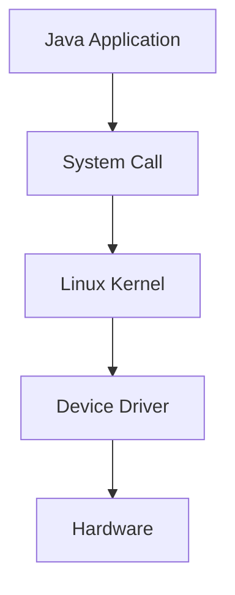
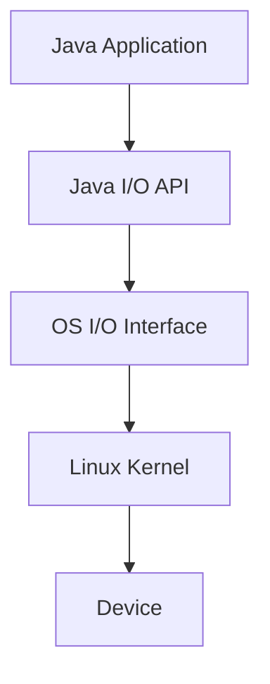
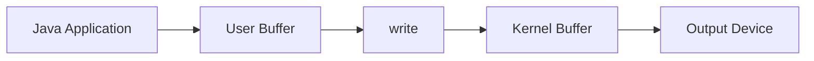
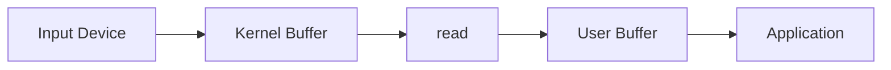
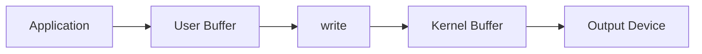
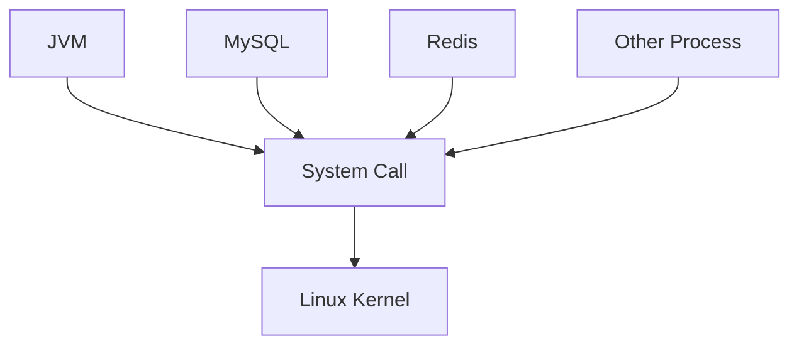
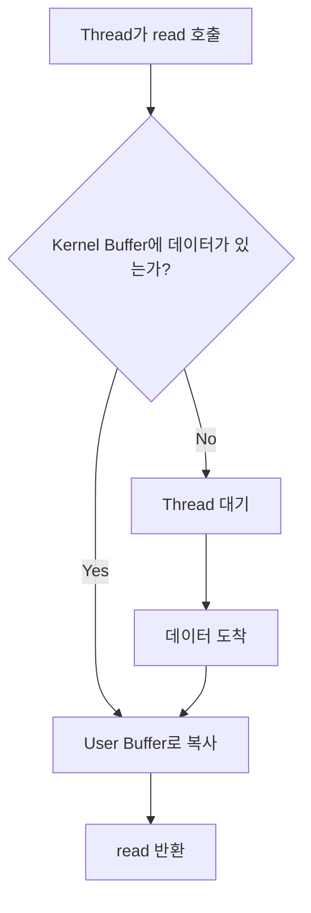
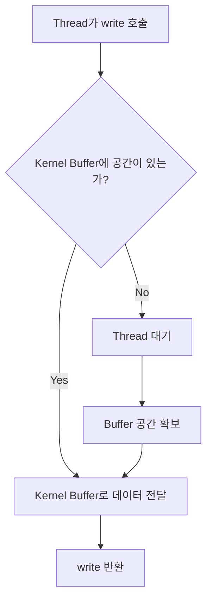
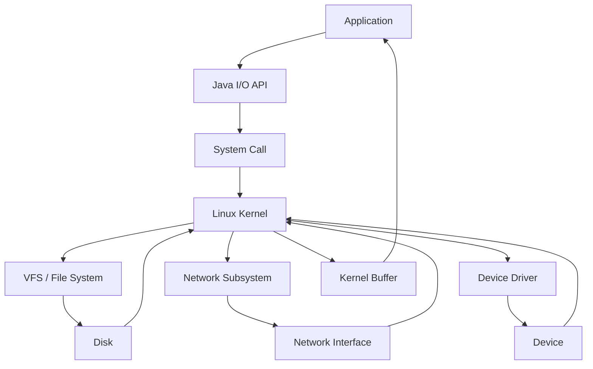
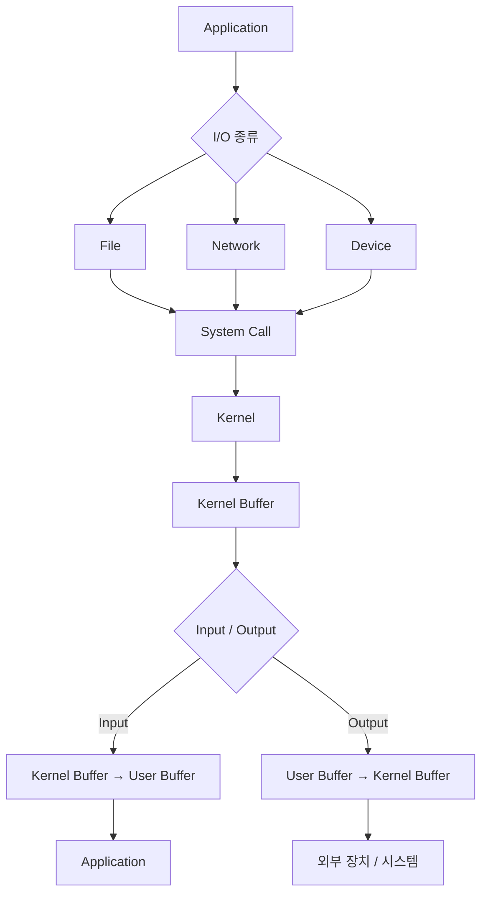

# 호떡의 알아두면 쓸데있는 I/O 기본 개념
[https://youtu.be/kK8XJq5UNCc?si=M1wwiJRxlQIvr0Wj](https://youtu.be/kK8XJq5UNCc?si=M1wwiJRxlQIvr0Wj)

# 호떡의 알아두면 쓸데있는 I/O 기본 개념
* toc
{:toc}

---

## 백엔드 개발자가 알아야 할 I/O 기본 개념

백엔드 애플리케이션을 개발하다 보면 하루에도 수없이 많은 I/O를 수행한다.

데이터베이스에 데이터를 저장한다.

```text
Application
→ Database
```

Redis에서 데이터를 조회한다.

```text
Redis
→ Application
```

외부 API를 호출한다.

```text
Application
→ Network
→ External API
```

파일을 읽거나 로그를 기록하기도 한다.

```text
Application
↔ File
```

개발자 입장에서는 각각 완전히 다른 작업처럼 보인다.

하지만 운영체제 수준으로 내려가 보면 이 작업들은 모두 **I/O(Input/Output)**라는 하나의 공통된 개념으로 연결된다.

Java에서 `FileInputStream`을 사용하든, `Scanner`로 키보드 입력을 받든, 네트워크를 통해 데이터를 주고받든 결국 애플리케이션은 운영체제의 도움을 받아 데이터를 입력받거나 출력한다.

I/O를 이해하면 이후 다음과 같은 개념도 이해하기 쉬워진다.

```text
Blocking I/O

Non-Blocking I/O

Java NIO

Socket

Buffer

Thread Blocking
```

그 시작이 되는 기본 구조부터 살펴보자.

---

## I/O란 무엇인가?

I/O는 Input과 Output의 약자다.

컴퓨터 장치나 시스템 사이에서 데이터가 들어오고 나가는 것을 의미한다.

애플리케이션 관점에서는 다음과 같이 정의할 수 있다.

```text
애플리케이션으로
데이터가 들어온다.

→ Input


애플리케이션에서
데이터가 나간다.

→ Output
```

여기에서 중요한 것은 **누구를 기준으로 바라보느냐**다.

예를 들어 애플리케이션이 데이터베이스에 데이터를 저장한다고 해보자.

```text
Application
→ Database
```

애플리케이션 기준에서는 데이터가 나간다.

따라서 Output이다.

반대로 데이터베이스에서 데이터를 조회한다.

```text
Database
→ Application
```

애플리케이션으로 데이터가 들어온다.

따라서 Input이다.

---

## Input과 Output은 관찰 주체에 따라 달라진다

다음 상황을 생각해보자.

```text
Backend Application
→ MySQL
```

백엔드 애플리케이션 기준에서는 Output이다.

하지만 MySQL 입장에서는 데이터가 들어온다.

```text
MySQL 기준
→ Input
```

즉 같은 데이터 이동이라도 관찰하는 주체에 따라 Input과 Output의 의미가 달라질 수 있다.

그래서 I/O를 이야기할 때는 항상

```text
누구의 Input인가?

누구의 Output인가?
```

를 먼저 생각하는 것이 좋다.

---

## 버퍼란 무엇인가?

I/O를 이해할 때 계속 등장하는 단어가 Buffer다.

복잡하게 생각하기보다 우선 다음처럼 이해할 수 있다.

```text
Buffer
=
일정한 크기의 메모리 공간
```

데이터를 잠시 담아두는 공간이다.

예를 들어 데이터를 읽어올 때 다음과 같은 구조가 만들어질 수 있다.

```text
외부 장치
→ Buffer
→ Application
```

출력할 때는 반대다.

```text
Application
→ Buffer
→ 외부 장치
```

이 Buffer가 어디에 존재하는지에 따라 이후 User Buffer와 Kernel Buffer라는 개념이 등장한다.

---

## 애플리케이션이 하드웨어를 직접 제어할 수 있을까?

하나의 컴퓨터를 생각해보자.

다음과 같은 하드웨어가 연결되어 있다.

```text
CPU

Memory

SSD

Keyboard

Mouse

Monitor

Network Interface Card
```

그 위에는 Linux가 설치되어 있고 Java 애플리케이션이 실행되고 있다.

```text
Java Application
----------------
Linux Kernel
----------------
Hardware
```

Java 애플리케이션에서 다음 코드를 실행한다고 해보자.

```java
System.out.println("Hello World");
```

결과적으로 모니터에 문자열이 나타난다.

그렇다면 Java 애플리케이션이 모니터 하드웨어를 직접 제어한 것일까?

그렇지 않다.

애플리케이션은 하드웨어를 직접 제어하지 않고 운영체제 커널의 기능을 이용한다.

---

## User Space와 Kernel Space

애플리케이션은 일반적으로 User Space에서 실행된다.

```text
User Space

Java
MySQL
Redis
Other Applications
```

운영체제의 핵심 기능은 Kernel Space에서 동작한다.

```text
Kernel Space

File System

Network

Device Driver

Memory Management
```

이를 구조적으로 표현하면 다음과 같다.



애플리케이션이 파일, 네트워크, 키보드, 디스크 같은 장치를 사용하려면 커널이 제공하는 기능을 이용해야 한다.

---

## 왜 애플리케이션이 하드웨어를 직접 다루지 않을까?

하드웨어마다 제어 방식이 다르다.

예를 들어 SSD 제조사가 다르면 내부 동작이나 제어 방식이 달라질 수 있다.

Network Interface Card 역시 제조사마다 차이가 있다.

만약 애플리케이션이 하드웨어를 직접 제어해야 한다면 Java 애플리케이션이 하드웨어마다 다른 코드를 작성해야 할 것이다.

```text
Samsung SSD 전용 코드

Intel NIC 전용 코드

Realtek NIC 전용 코드

다른 장치 전용 코드
```

현실적으로 매우 복잡하다.

그래서 운영체제가 하드웨어를 추상화한다.

---

## Device Driver

하드웨어를 제어하기 위해 운영체제에서는 Device Driver가 사용된다.

쉽게 비교하면 JDBC와 비슷하게 생각할 수 있다.

Java 개발에서는 JDBC라는 공통 인터페이스를 사용한다.

```text
JDBC Interface
```

그리고 각 데이터베이스 벤더가 자신의 DB에 맞는 드라이버를 제공한다.

```text
MySQL Driver

PostgreSQL Driver

Oracle Driver
```

애플리케이션은 각 데이터베이스 내부 동작을 직접 알 필요가 없다.

장치 드라이버도 비슷한 역할을 한다.

```text
Application
↓
Kernel Interface
↓
Device Driver
↓
Hardware
```

커널은 공통된 인터페이스를 사용하고 실제 장치별 동작 차이는 Driver가 처리한다.

---

## Linux의 중요한 철학: Everything is a File

Linux I/O를 이해할 때 자주 등장하는 표현이 있다.

```text
Everything is a file.
```

Linux에서는 여러 종류의 I/O 대상을 파일처럼 다룰 수 있도록 추상화한다.

예를 들어 다음과 같은 대상이 있다.

```text
Disk File

Keyboard

Terminal

Device

Socket
```

애플리케이션 입장에서는 각각의 장치를 완전히 다른 방식으로 처리하는 대신 비슷한 I/O 인터페이스를 사용할 수 있다.

```text
open

read

write
```

이 추상화 덕분에 I/O 대상이 무엇인지에 관계없이 유사한 방식으로 데이터를 다룰 수 있다.

---

## VFS란 무엇인가?

Linux에서는 다양한 파일 시스템과 I/O 대상을 일관된 인터페이스로 처리하기 위한 추상화 계층이 존재한다.

이를 VFS(Virtual File System)라고 한다.

개념적으로 다음과 같이 볼 수 있다.

```text
Application
     ↓
System Call
     ↓
VFS
     ↓
각 File System / Device
```

애플리케이션에서는

```text
이 대상이 SSD인가?

특정 파일 시스템인가?

어떤 장치인가?
```

를 일일이 구분해서 다른 방식으로 접근할 필요를 줄일 수 있다.

---

## System Call

애플리케이션은 커널 내부 기능을 직접 호출하지 않는다.

커널은 애플리케이션에서 자신의 기능을 사용할 수 있도록 인터페이스를 제공한다.

이것이 System Call이다.

```text
Application

↓ System Call

Kernel
```

I/O와 관련해서 대표적으로 다음과 같은 System Call을 생각할 수 있다.

```text
open

read

write
```

Java에서 우리가 사용하는 API들은 이러한 운영체제 기능을 더 높은 수준으로 추상화해서 제공한다.

---

## open 시스템 콜

먼저 `open`을 살펴보자.

파일을 읽거나 쓰려면 운영체제가 어떤 파일을 대상으로 작업해야 하는지 알아야 한다.

예를 들어 다음 파일이 있다고 하자.

```text
b.txt
```

애플리케이션이 이 파일을 읽으려고 한다.

개념적으로 다음 과정이 필요하다.

```text
b.txt를 사용하고 싶다.

↓

Kernel에 요청

↓

해당 파일을 식별할 수 있는 값 획득
```

이때 사용되는 식별자가 File Descriptor다.

---

## File Descriptor란 무엇인가?

File Descriptor는 프로세스가 열어둔 I/O 대상을 식별하기 위해 사용하는 정수 형태의 식별자라고 이해할 수 있다.

예를 들어

```text
b.txt
```

를 열었더니 다음 값이 반환되었다고 하자.

```text
5
```

이제 애플리케이션은 이후 I/O에서 파일 이름을 계속 전달하는 대신 File Descriptor를 사용해 해당 I/O 대상을 참조할 수 있다.

```text
File Descriptor 5
→ b.txt
```

개념적인 흐름은 다음과 같다.

```text
open("b.txt")

↓

File Descriptor

5
```

이후

```text
read(5, ...)

write(5, ...)
```

같은 방식으로 사용할 수 있다.

---

## File Descriptor는 파일의 PK인가?

처음 이해할 때는

```text
파일을 식별하는 번호
```

정도로 생각하면 직관적이다.

다만 중요한 것은 애플리케이션 프로세스가 I/O 대상을 다루기 위해 사용하는 식별자라는 점이다.

애플리케이션은 이 값을 통해 어떤 열린 I/O 대상에 대해 `read`와 `write`를 수행할지 지정한다.

---

## 표준 입출력의 File Descriptor

Unix/Linux 계열에서는 프로세스가 시작될 때 일반적으로 세 개의 표준 스트림이 준비되어 있다.

```text
0
→ Standard Input

1
→ Standard Output

2
→ Standard Error
```

정리하면 다음과 같다.

| File Descriptor | 의미              |
| --------------: | --------------- |
|               0 | Standard Input  |
|               1 | Standard Output |
|               2 | Standard Error  |

Java에서 다음 코드를 생각해보자.

```java
System.out.println("Hello World");
```

`System.out`은 표준 출력과 연결된다.

즉 개념적으로 File Descriptor 1과 연결된 출력 흐름을 사용한다고 이해할 수 있다.

---

## 표준 입력

키보드를 통해 입력받는 프로그램을 생각해보자.

```java
Scanner scanner = new Scanner(System.in);

String input = scanner.nextLine();
```

`System.in`은 Standard Input과 연결된다.

```text
Standard Input

File Descriptor 0
```

따라서 키보드나 터미널 입력을 프로그램으로 가져오는 과정에서 표준 입력 스트림을 사용한다.

---

## Standard Error

오류 출력에는 별도의 표준 스트림도 존재한다.

Java에서는 다음과 같이 사용할 수 있다.

```java
System.err.println("Error");
```

개념적으로는

```text
Standard Error

File Descriptor 2
```

와 연결된다.

그래서 표준 출력과 오류 출력을 서로 다른 대상으로 Redirect하는 것도 가능하다.

---

## read 시스템 콜

`read`는 I/O 대상에서 데이터를 읽기 위해 사용하는 시스템 콜이다.

개념적으로 다음 정보가 필요하다.

```text
어디에서 읽을 것인가?

읽은 데이터를 어디에 저장할 것인가?

얼마나 읽을 것인가?
```

이를 단순화하면 다음과 같다.

```text
read(
    fileDescriptor,
    buffer,
    size
)
```

예를 들어 File Descriptor 5에 해당하는 파일에서 데이터를 읽는다고 하자.

```text
read(
    5,
    buffer,
    1024
)
```

운영체제는 해당 I/O 대상에서 데이터를 가져와 애플리케이션이 제공한 Buffer로 전달한다.

---

## write 시스템 콜

`write`는 반대로 데이터를 출력하기 위해 사용한다.

필요한 정보는 다음과 같다.

```text
어디에 쓸 것인가?

어떤 데이터를 쓸 것인가?

얼마나 쓸 것인가?
```

개념적으로는 다음과 같다.

```text
write(
    fileDescriptor,
    buffer,
    size
)
```

예를 들어 표준 출력에 데이터를 쓴다면 File Descriptor 1을 사용할 수 있다.

```text
write(
    1,
    "Hello World",
    ...
)
```

---

## Java의 I/O API 아래에는 무엇이 있을까?

Java 개발자는 일반적으로 시스템 콜을 직접 작성하지 않는다.

다음처럼 Java API를 사용한다.

```java
FileInputStream input =
        new FileInputStream("b.txt");
```

또는

```java
FileOutputStream output =
        new FileOutputStream("b.txt");
```

그리고

```java
input.read();
```

```java
output.write(data);
```

같은 메서드를 사용한다.

Java API가 운영체제 I/O 기능을 추상화해주기 때문에 개발자는 시스템 콜을 직접 다룰 필요가 없다.

개념적으로 다음과 같은 계층을 생각할 수 있다.



---

## Hello World는 어떻게 모니터에 출력될까?

이제 다음 코드의 흐름을 생각해보자.

```java
System.out.println("Hello World");
```

애플리케이션 입장에서는 매우 단순하다.

하지만 아래에서는 여러 단계가 존재한다.

먼저 `Hello World`라는 데이터가 애플리케이션 메모리에 있다.

```text
User Space

"Hello World"
```

표준 출력은 File Descriptor 1과 연결되어 있다.

출력을 위해 운영체제에 데이터를 전달한다.

```text
Application

↓

write

↓

Kernel
```

데이터는 User Space에서 Kernel 쪽 Buffer로 전달된다.

```text
User Buffer

↓

Kernel Buffer
```

운영체제는 이후 해당 출력 대상에 데이터를 처리한다.

전체 흐름을 단순화하면 다음과 같다.



---

## write가 반환되었다는 것은 무엇을 의미할까?

중요한 부분이 하나 있다.

애플리케이션이 `write`를 호출했다고 해서 물리적인 장치가 이미 최종 처리를 모두 끝냈다는 의미로만 이해해서는 안 된다.

애플리케이션 관점에서는 운영체제가 해당 데이터를 받아 처리할 수 있는 상태가 되면 I/O 호출이 반환될 수 있다.

즉 애플리케이션과 실제 장치 사이에는 운영체제와 Buffer가 존재한다.

```text
Application
→ Kernel Buffer
→ Device
```

이 Buffer가 I/O를 이해하는 데 매우 중요한 역할을 한다.

---

## 키보드 입력은 어떻게 들어올까?

이번에는 반대 상황이다.

다음 코드를 실행했다고 하자.

```java
Scanner scanner =
        new Scanner(System.in);

String input =
        scanner.nextLine();
```

애플리케이션은 키보드 입력을 기다리고 있다.

표준 입력은 File Descriptor 0과 연결된다.

개념적으로 애플리케이션은 다음과 같은 요청을 한다.

```text
read(
    0,
    userBuffer,
    ...
)
```

그런데 사용자가 아직 아무것도 입력하지 않았다.

Kernel Buffer에도 읽을 데이터가 없다.

```text
Kernel Buffer

[ empty ]
```

그러면 애플리케이션은 즉시 데이터를 받을 수 없다.

---

## 데이터가 없다면 read는 어떻게 될까?

데이터가 준비되지 않았다면 해당 I/O 작업은 기다려야 할 수 있다.

```text
read 호출

↓

Kernel Buffer 확인

↓

데이터 없음

↓

대기
```

이후 사용자가 키보드로 입력한다.

```text
Hello World
```

입력 장치에서 데이터가 발생하고 운영체제가 이를 처리한다.

```text
Keyboard

↓

Kernel

↓

Kernel Buffer
```

이제 읽을 데이터가 준비되었다.

대기하던 작업은 데이터를 User Space 쪽 Buffer로 가져올 수 있다.

```text
Kernel Buffer

↓

User Buffer
```

그리고 `read`가 반환된다.

---

## Input에서 데이터는 어떤 방향으로 이동할까?

Input을 애플리케이션 관점에서 단순화하면 다음과 같다.

```text
Kernel Buffer

↓

User Buffer
```

즉 운영체제가 관리하는 영역에 있던 데이터가 애플리케이션이 사용할 수 있는 메모리 영역으로 전달된다.



---

## Output에서는 반대 방향이다

Output은 반대로 생각할 수 있다.

```text
User Buffer

↓

Kernel Buffer
```

애플리케이션의 데이터를 운영체제에 전달한다.



따라서 애플리케이션 관점에서 I/O를 Buffer 사이의 데이터 이동으로 바라볼 수도 있다.

---

## 애플리케이션 I/O를 한 단계 더 추상화하면

Input은

```text
Kernel Level Buffer
→ User Level Buffer
```

Output은

```text
User Level Buffer
→ Kernel Level Buffer
```

방향으로 데이터가 이동한다고 볼 수 있다.

물론 실제 운영체제 내부에서는 장치, 캐시, 프로토콜 등 다양한 단계가 더 존재할 수 있다.

하지만 애플리케이션의 I/O 개념을 이해하는 첫 단계에서는 이 구조가 매우 유용하다.

---

## 디스크 I/O도 다른 원리일까?

이번에는 모니터나 키보드가 아니라 파일을 읽는다고 생각해보자.

예를 들어

```text
/data/a.txt
```

를 읽는다.

먼저 해당 파일을 연다.

```text
open("/data/a.txt")
```

File Descriptor를 얻는다.

```text
File Descriptor = 5
```

그리고 읽는다.

```text
read(5, buffer, ...)
```

애플리케이션 입장에서의 기본적인 구조는 크게 달라지지 않는다.

```text
I/O 대상 식별

↓

read / write
```

즉 대상이 디스크라고 해서 애플리케이션이 완전히 다른 I/O 모델을 사용하는 것은 아니다.

---

## 네트워크 I/O도 완전히 다를까?

백엔드 개발자에게 가장 중요한 I/O 중 하나는 네트워크다.

```text
Spring Boot
↔ MySQL

Spring Boot
↔ Redis

Spring Boot
↔ External API
```

겉으로는 파일과 완전히 달라 보인다.

하지만 Linux에서는 Socket 역시 File Descriptor를 통해 다루는 I/O 대상으로 볼 수 있다.

개념적인 흐름은 다음과 같다.

```text
Socket 생성

↓

File Descriptor 획득

↓

read / write 계열 I/O

↓

Network
```

따라서 애플리케이션 입장에서는 파일 I/O와 네트워크 I/O가 운영체제의 공통된 I/O 인터페이스를 통해 처리된다는 연결점을 찾을 수 있다.

---

## 결국 애플리케이션 입장에서 I/O는 비슷하다

다음 프로그램들을 생각해보자.

```text
JVM

MySQL

Redis

다른 Application
```

모두 서로 다른 프로그램이다.

하지만 Linux 위에서 실행된다면 운영체제가 제공하는 I/O 기능을 이용해야 한다.



애플리케이션의 구현 언어나 목적은 다르더라도 하드웨어 I/O를 수행하기 위해서는 운영체제와 상호작용한다.

이것이 운영체제 I/O 기본 개념을 이해하는 것이 백엔드 개발에도 중요한 이유다.

---

## Blocking I/O란 무엇인가?

이제 가장 중요한 개념 중 하나인 Blocking I/O로 연결할 수 있다.

Input 상황을 다시 살펴보자.

애플리케이션이 `read`를 호출한다.

```text
read()
```

만약 Kernel Buffer에 이미 데이터가 있다면 어떻게 될까?

```text
Kernel Buffer

[ Hello World ]
```

바로 User Buffer로 데이터를 전달할 수 있다.

```text
Kernel Buffer
↓
User Buffer
```

따라서 오래 기다릴 필요가 없다.

---

## 읽을 데이터가 없다면?

반대로 Kernel Buffer가 비어 있다고 하자.

```text
Kernel Buffer

[ empty ]
```

애플리케이션이 `read`를 호출해도 당장 전달할 데이터가 없다.

```text
read()

↓

데이터 없음
```

데이터가 준비될 때까지 기다려야 한다.

```text
Thread

WAITING
```

그리고 데이터가 도착한다.

```text
Network / Keyboard / Device

↓

Kernel Buffer
```

이후 기다리고 있던 작업이 다시 진행되고 데이터가 User Buffer로 전달된다.

```text
Kernel Buffer

↓

User Buffer
```

---

## Output도 Block될 수 있다

Blocking은 Input에서만 발생하는 것이 아니다.

Output도 상황에 따라 기다릴 수 있다.

애플리케이션에서 데이터를 출력한다고 하자.

```text
User Buffer

↓

write()

↓

Kernel Buffer
```

Kernel Buffer에 충분한 공간이 있다면 데이터를 전달할 수 있다.

```text
Kernel Buffer

[ 충분한 공간 ]
```

하지만 Buffer가 가득 차 있다면 즉시 데이터를 모두 받아들일 수 없을 수 있다.

```text
Kernel Buffer

[ FULL ]
```

이 경우 공간이 생길 때까지 호출 측이 기다리는 상황이 발생할 수 있다.

---

## Blocking I/O의 핵심

Blocking I/O의 핵심은 단순하다.

```text
I/O 요청

↓

현재 처리할 수 있는가?
```

처리할 수 있다면 바로 진행한다.

```text
Yes
→ 데이터 처리
→ 반환
```

처리할 수 없다면 기다린다.

```text
No
→ Thread 대기
→ I/O 준비
→ 다시 실행
```

즉 I/O가 완료될 수 있는 상태가 될 때까지 호출한 흐름이 대기하는 방식으로 이해할 수 있다.

---

## Blocking I/O를 구조로 보면

Input 상황을 단순화하면 다음과 같다.



Output 역시 비슷하다.



---

## 백엔드 개발에서 Blocking I/O가 중요한 이유

웹 애플리케이션에서는 수많은 I/O가 발생한다.

예를 들어 하나의 HTTP 요청이 다음 과정을 거친다고 하자.

```text
HTTP Request
↓
Database Query
↓
Redis Query
↓
External API
↓
HTTP Response
```

각 단계가 I/O다.

이 과정에서 데이터가 준비될 때까지 Thread가 기다리는 방식이라면 요청을 처리하는 Thread는 그동안 다른 작업을 수행하지 못할 수 있다.

```text
Thread 1

DB 요청
↓
대기
↓
DB 응답
↓
처리 계속
```

따라서 I/O의 대기 특성은 서버의 Thread 모델과 직접 연결된다.

이후 Blocking I/O, Non-Blocking I/O 같은 개념이 중요해지는 이유다.

---

## CPU 작업과 I/O 작업의 차이를 이해해야 한다

애플리케이션에서 모든 작업이 동일한 성격을 가지는 것은 아니다.

예를 들어 다음 계산은 CPU가 직접 수행한다.

```java
int result = a + b;
```

하지만 다음 작업은 외부 시스템의 상태를 기다려야 한다.

```text
Database Query

Network Receive

Disk Read
```

즉 I/O 작업에서는 애플리케이션의 계산 속도만으로 해결할 수 없는 대기 시간이 존재할 수 있다.

```text
Application

"데이터 주세요."

↓

외부 대상 처리

↓

"여기 있습니다."
```

Blocking I/O에서는 이 기다리는 시간 동안 호출 흐름이 Block될 수 있다.

---

## Java 개발자가 보는 I/O와 운영체제가 보는 I/O

Java에서는 다음과 같은 코드가 보인다.

```java
InputStream input =
        new FileInputStream("data.txt");

byte[] buffer =
        new byte[1024];

input.read(buffer);
```

개발자는 단순히

```text
파일을 읽었다.
```

고 생각한다.

하지만 조금 더 아래에서 바라보면 개념적인 흐름은 다음과 같다.

```text
Java API

↓

운영체제 I/O 요청

↓

Kernel

↓

File / Device

↓

Kernel Buffer

↓

Application Buffer
```

이 구조를 이해하면 Java API 이름만 외우는 것에서 한 단계 더 깊게 I/O를 바라볼 수 있다.

---

## System.out.println도 I/O다

다음 코드는 너무 익숙해서 I/O라고 의식하지 않을 수 있다.

```java
System.out.println("Hello World");
```

하지만 애플리케이션 외부로 데이터가 나가고 있다.

```text
Application

↓

Standard Output
```

따라서 Output이다.

---

## Scanner.nextLine()도 I/O다

다음 코드도 마찬가지다.

```java
Scanner scanner =
        new Scanner(System.in);

String input =
        scanner.nextLine();
```

애플리케이션 외부에서 데이터가 들어온다.

```text
Standard Input

↓

Application
```

따라서 Input이다.

사용자가 아무것도 입력하지 않으면 프로그램이 기다리는 현상은 Blocking I/O의 직관적인 사례로 이해할 수 있다.

---

## FileInputStream도 I/O다

```java
FileInputStream input =
        new FileInputStream("data.txt");
```

파일을 열고

```java
input.read();
```

를 실행한다.

이 역시 애플리케이션 외부에 있는 데이터가 애플리케이션으로 들어온다.

```text
File

↓

Application
```

따라서 Input이다.

---

## FileOutputStream도 I/O다

```java
FileOutputStream output =
        new FileOutputStream("data.txt");

output.write(data);
```

애플리케이션에서 파일로 데이터가 나간다.

```text
Application

↓

File
```

따라서 Output이다.

결국 Java 개발자가 사용하는 여러 API가 하나의 I/O 개념으로 연결된다.

---

## 데이터베이스 조회도 결국 I/O다

백엔드에서 다음 코드를 호출한다고 하자.

```java
User user =
        userRepository.findById(userId)
                .orElseThrow();
```

Java 코드에서는 메서드 호출 하나처럼 보인다.

하지만 DB가 별도의 서버에 있다면 그 아래에서는 네트워크 통신이 발생한다.

```text
Spring Application
↓
Network
↓
Database
```

조회 결과가 돌아온다.

```text
Database
↓
Network
↓
Spring Application
```

애플리케이션 입장에서는 Input이다.

---

## 데이터베이스 저장도 결국 Output이다

다음 코드를 생각해보자.

```java
userRepository.save(user);
```

애플리케이션에서 데이터베이스 쪽으로 데이터가 전달된다.

```text
Spring Application

↓

Database
```

애플리케이션 기준으로 Output이다.

즉 우리가 매일 사용하는 DB 작업도 I/O의 한 종류로 바라볼 수 있다.

---

## Redis도 마찬가지다

Redis 조회 역시

```text
Redis
→ Application

Input
```

Redis 저장은

```text
Application
→ Redis

Output
```

이다.

외부 API 호출도 같은 방식으로 바라볼 수 있다.

요청을 보낼 때는

```text
Application
→ External API

Output
```

응답을 받을 때는

```text
External API
→ Application

Input
```

이다.

이렇게 생각하면 파일, DB, Redis, Network를 하나의 I/O 관점으로 연결할 수 있다.

---

## I/O 전체 구조

지금까지의 내용을 하나의 그림으로 정리하면 다음과 같다.



애플리케이션은 하드웨어의 구체적인 동작을 직접 다루지 않는다.

운영체제가 제공하는 추상화와 인터페이스를 이용한다.

---

## File Descriptor를 중심으로 다시 이해하기

Linux I/O에서 매우 중요한 연결 고리가 File Descriptor다.

```text
File

Socket

Standard Input

Standard Output
```

같은 I/O 대상을 프로세스가 식별할 수 있도록 한다.

개념적으로 다음과 같은 형태다.

```text
Process

File Descriptor Table

0 → Standard Input
1 → Standard Output
2 → Standard Error
5 → b.txt
6 → Socket
```

이후 I/O에서는 어떤 대상을 처리할 것인지 File Descriptor를 통해 지정할 수 있다.

---

## 모든 I/O가 완전히 동일하다는 의미는 아니다

애플리케이션 관점에서는 파일, 장치, Socket 등이 공통된 I/O 인터페이스를 통해 다뤄질 수 있다.

따라서 기본 개념을 이해할 때 다음과 같이 추상화할 수 있다.

```text
I/O 대상 획득

↓

read / write

↓

Buffer를 통한 데이터 이동
```

이 추상화 덕분에 서로 다른 종류의 I/O를 하나의 공통된 관점에서 이해할 수 있다.

이 관점이 이후 다양한 I/O 모델을 공부할 때 기반이 된다.

---

## Blocking I/O를 이해하면 다음 단계가 보인다

Blocking I/O에서는 데이터가 준비되지 않았을 때 Thread가 기다릴 수 있다.

```text
Thread
↓
read
↓
데이터 없음
↓
WAIT
```

서버에서 동시에 처리해야 할 요청이 매우 많아지면 이 특징이 중요한 문제가 된다.

```text
Request 1
→ Thread 1
→ DB 대기

Request 2
→ Thread 2
→ API 대기

Request 3
→ Thread 3
→ Redis 대기
```

많은 Thread가 실제 계산을 하는 것이 아니라 I/O가 완료되기를 기다리고 있을 수 있다.

이 문제를 어떻게 다룰 것인지에서 다음 개념들이 등장한다.

```text
Non-Blocking I/O

I/O Multiplexing

Selector

Java NIO
```

즉 Blocking I/O는 독립된 하나의 개념이 아니라 이후 서버 I/O 모델을 이해하기 위한 출발점이다.

---

## 구조

전체 I/O 흐름을 가장 단순하게 표현하면 다음과 같다.



애플리케이션 입장에서는 I/O 대상이 무엇이든 운영체제의 추상화된 인터페이스를 사용하고 Buffer 사이에서 데이터를 주고받는다는 공통점을 찾을 수 있다.

---

## 실무에서의 활용

I/O 기본 구조를 알고 있으면 백엔드 개발에서 여러 현상을 조금 다르게 바라볼 수 있다.

예를 들어 API 처리 시간이 2초라고 하자.

```text
전체 요청
2초
```

그렇다고 CPU가 2초 동안 계속 계산했다고 볼 수는 없다.

실제로는 다음과 같을 수 있다.

```text
Application Logic
20ms

Database
500ms

External API
1,300ms

Redis
30ms

기타
150ms
```

대부분의 시간이 외부 I/O를 기다리는 시간일 수 있다.

이때 서버 성능을 이해하려면 단순히 Java 코드의 연산 속도만 보는 것으로는 부족하다.

```text
어떤 I/O에서 기다리고 있는가?

Thread는 기다리는 동안 어떤 상태인가?

동시에 몇 개의 I/O를 처리하는가?
```

같은 질문이 필요하다.

그리고 그 질문의 출발점이 바로 Blocking I/O 구조다.

---

## 정리

I/O는 컴퓨터 시스템 사이에서 데이터가 들어오고 나가는 것을 의미한다.

애플리케이션을 기준으로 보면 다음과 같다.

```text
외부
→ Application

Input


Application
→ 외부

Output
```

Linux에서 애플리케이션은 하드웨어에 직접 접근하지 않는다.

```text
Application

↓

System Call

↓

Kernel

↓

Device Driver

↓

Hardware
```

운영체제는 다양한 I/O 대상을 공통된 형태로 다룰 수 있도록 추상화를 제공한다.

프로세스는 열린 I/O 대상을 File Descriptor를 통해 식별할 수 있다.

대표적인 표준 File Descriptor는 다음과 같다.

```text
0
→ Standard Input

1
→ Standard Output

2
→ Standard Error
```

I/O를 수행할 때 대표적으로 `read`와 `write` 같은 시스템 콜을 생각할 수 있다.

Input에서는 개념적으로

```text
Kernel Buffer
→ User Buffer
```

방향으로 데이터가 전달된다.

Output에서는 반대로

```text
User Buffer
→ Kernel Buffer
```

방향으로 데이터가 전달된다.

이 구조를 이용하면 Java에서 사용하는 여러 기능도 하나의 관점으로 이해할 수 있다.

```text
Scanner
→ Input

FileInputStream
→ Input

FileOutputStream
→ Output

System.out
→ Output

Database Query
→ Input

Database 저장
→ Output

Network 통신
→ Input / Output
```

그리고 Input을 요청했는데 데이터가 준비되어 있지 않거나 Output을 수행하려는데 즉시 데이터를 받아들일 수 없는 상황에서는 호출한 Thread가 기다릴 수 있다.

```text
I/O 요청

↓

현재 처리 불가능

↓

Thread 대기

↓

I/O 준비

↓

실행 재개
```

이처럼 I/O가 가능한 상태가 될 때까지 호출 흐름이 대기하는 방식을 Blocking I/O라고 이해할 수 있다.

결국 백엔드에서 I/O를 이해한다는 것은 단순히 파일을 읽고 쓰는 방법을 아는 것이 아니다.

```text
Java Application

↓

User Space

↓

System Call

↓

Kernel

↓

Kernel Buffer

↓

Device / Network / File
```

라는 계층을 이해하는 것이다.

이 구조를 알고 나면 데이터베이스 조회, 외부 API 호출, Socket 통신 등 평소 서로 다른 기능처럼 보이던 작업들이 결국 운영체제가 제공하는 I/O 위에서 동작한다는 연결점을 찾을 수 있다.

그리고 이 기본 구조는 이후 Blocking과 Non-Blocking, Java NIO, Selector와 같은 서버 I/O 모델을 이해하기 위한 중요한 기반이 된다.

### 한 줄 요약

**애플리케이션의 I/O는 운영체제가 제공하는 System Call을 통해 외부 장치나 시스템과 데이터를 주고받는 과정이며, Input은 Kernel Buffer의 데이터를 User Buffer로 가져오고 Output은 User Buffer의 데이터를 Kernel 쪽으로 전달하며, 데이터가 준비될 때까지 호출 흐름이 기다리는 방식을 Blocking I/O라고 이해할 수 있다.**
