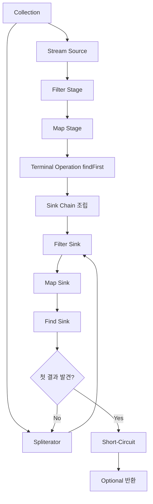
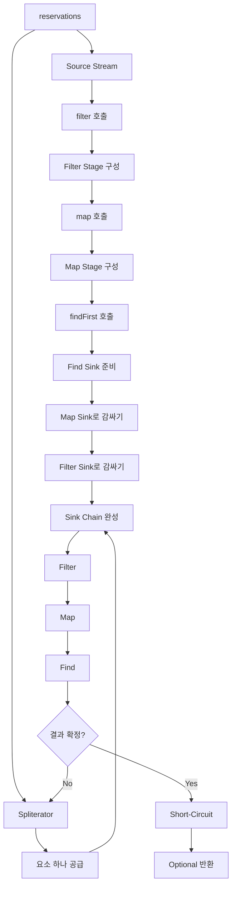

# 스타크의 Java Stream 내부 구조와 실행 흐름
[https://youtu.be/JZ2F71yDoTQ?si=HPGIWX8LqGaaccY8](https://youtu.be/JZ2F71yDoTQ?si=HPGIWX8LqGaaccY8)

# 스타크의 Java Stream 내부 구조와 실행 흐름
* toc
{:toc}

---

## Java Stream 내부 구조와 실행 흐름: filter, map, findFirst는 실제로 어떻게 동작할까?

Java에서 Stream을 사용하면 컬렉션 데이터를 매우 선언적으로 처리할 수 있다.

예를 들어 오늘 예약된 사용자 중 첫 번째 예약자의 이름을 찾는다고 해보자.

```java
Optional<String> firstReservationName = reservations.stream()
        .filter(reservation -> reservation.isToday())
        .map(Reservation::getName)
        .findFirst();
```

코드만 읽으면 흐름은 매우 자연스럽다.

```text
전체 예약

↓

오늘 예약만 filter

↓

예약자 이름으로 map

↓

첫 번째 요소 findFirst
```

그래서 Stream이 내부에서도 다음과 같이 실행된다고 생각하기 쉽다.

```text
모든 예약 filter

↓

filter 결과 전체를 map

↓

map 결과에서 findFirst
```

하지만 실제 Stream의 실행 방식은 이보다 조금 더 흥미롭다.

Stream의 내부 동작을 이해하기 위해서는 먼저 두 가지 질문을 던져볼 수 있다.

```text
filter()와 map()은
언제 실행될까?

findFirst()는
어떻게 나머지 요소의 처리를 멈출까?
```

이 두 질문에 답할 수 있다면 Java Stream의 핵심적인 실행 구조를 이해했다고 볼 수 있다.

---

## Stream 연산은 중간 연산과 종단 연산으로 나뉜다

Stream을 이해하기 위한 첫 번째 구분은 **중간 연산(Intermediate Operation)**과 **종단 연산(Terminal Operation)**이다.

대표적인 연산을 나누면 다음과 같다.

| 구분    | 예                   |
| ----- | ------------------- |
| 중간 연산 | `filter()`, `map()` |
| 종단 연산 | `findFirst()`       |

가장 직관적인 차이 중 하나는 반환 타입이다.

`filter()`는 다시 Stream을 반환한다.

```java
Stream<Reservation> filtered =
        reservations.stream()
                .filter(Reservation::isToday);
```

`map()` 역시 Stream을 반환한다.

```java
Stream<String> names =
        reservations.stream()
                .map(Reservation::getName);
```

반면 `findFirst()`는 Stream을 반환하지 않는다.

```java
Optional<String> result =
        stream.findFirst();
```

결과는 `Optional`이다.

즉 Stream 파이프라인이 여기에서 끝난다.

---

## 중간 연산은 파이프라인을 이어간다

중간 연산은 결과로 또 다른 Stream을 반환한다.

```text
Stream

↓

filter()

↓

Stream

↓

map()

↓

Stream
```

따라서 계속해서 다음 연산을 연결할 수 있다.

```java
reservations.stream()
        .filter(Reservation::isToday)
        .map(Reservation::getName)
```

하지만 아직 최종 결과를 얻은 것은 아니다.

파이프라인의 구조만 만들어지고 있는 상태다.

---

## 종단 연산은 Stream 파이프라인을 종료한다

`findFirst()`를 호출하면 반환 타입이 Stream에서 벗어난다.

```java
Optional<String> first = reservations.stream()
        .filter(Reservation::isToday)
        .map(Reservation::getName)
        .findFirst();
```

흐름으로 표현하면 다음과 같다.

```text
Source

↓

filter
중간 연산

↓

map
중간 연산

↓

findFirst
종단 연산

↓

Optional<String>
```

종단 연산이 호출되면서 Stream 파이프라인이 실제 결과를 만들어내기 시작한다.

---

## filter와 map은 호출하는 순간 실행될까?

다음 코드를 생각해보자.

```java
reservations.stream()
        .filter(reservation -> {
            System.out.println("filter 실행");
            return reservation.isToday();
        })
        .map(reservation -> {
            System.out.println("map 실행");
            return reservation.getName();
        });

System.out.println("실행 완료");
```

직관적으로는 다음과 같은 결과를 기대할 수도 있다.

```text
filter 실행
map 실행
filter 실행
map 실행
...
실행 완료
```

하지만 종단 연산이 없다면 `filter()`와 `map()` 내부의 로직은 실행되지 않는다.

결과적으로 다음만 출력된다.

```text
실행 완료
```

왜 그럴까?

---

## 중간 연산은 지연된다

Stream의 중요한 특징 중 하나는 **중간 연산이 지연된다는 것**이다.

`filter()`를 호출했다고 즉시 모든 요소를 필터링하지 않는다.

`map()`을 호출했다고 즉시 모든 요소를 변환하지도 않는다.

대신 다음과 같은 의미에 가깝다.

```text
나중에 Stream이 실행되면

이 filter를 수행하고

그다음 이 map을 수행해줘.
```

즉 연산을 실행하는 것이 아니라 **파이프라인의 한 단계를 구성한다.**

---

## Lazy Evaluation

이러한 특성을 흔히 Lazy Evaluation, 즉 지연 평가라고 표현한다.

```text
filter 호출
→ 실행 X
→ 단계 등록

map 호출
→ 실행 X
→ 단계 등록

findFirst 호출
→ 파이프라인 실행
```

그래서 다음 코드에서는 실제 데이터 처리가 아직 이루어지지 않는다.

```java
Stream<String> stream = reservations.stream()
        .filter(Reservation::isToday)
        .map(Reservation::getName);
```

`stream`에는 결과 목록이 미리 만들어져 있는 것이 아니라 실행해야 할 연산 단계들이 연결된 상태라고 이해할 수 있다.

---

## 중간 연산은 새로운 Stream Stage를 만든다

Stream 내부에서는 중간 연산을 호출할 때 새로운 Stream Stage가 만들어진다.

예를 들어

```java
reservations.stream()
        .filter(Reservation::isToday)
        .map(Reservation::getName);
```

라는 코드가 있다고 하자.

개념적으로 다음과 같은 단계가 만들어진다.

```text
Source Stage

↓

Filter Stage

↓

Map Stage
```

중요한 것은 `filter()`와 `map()`이 그 순간 모든 데이터를 처리하는 것이 아니라 각 단계를 표현하는 새로운 Stream을 구성한다는 점이다.

---

## 각 Stage는 이전 Stage를 참조한다

Stream 파이프라인에서는 각 중간 연산이 자신보다 이전 단계의 Stream을 참조하는 구조를 만든다.

예를 들어 다음 파이프라인이 있다.

```text
Source
→ Filter
→ Map
```

데이터가 흐르는 방향은 왼쪽에서 오른쪽이다.

```text
Source
→ Filter
→ Map
```

하지만 Stage의 참조 관계를 바라보면 반대 방향으로 생각할 수 있다.

```text
Map
→ Filter
→ Source
```

즉 Map Stage는 이전 Filter Stage를 알고 있고, Filter Stage는 이전 Source Stage와 연결되어 있다.

이 역방향 연결은 나중에 실제 실행 구조인 Sink Chain을 조립하는 데 활용된다.

---

## Stream을 연결하는 단계와 실행하는 단계는 다르다

이제 Stream의 동작을 크게 두 단계로 나눌 수 있다.

### 파이프라인 구성

```text
stream()

↓

filter()

↓

map()
```

이 시점에서는 연산 단계가 만들어진다.

### 파이프라인 실행

```text
findFirst()
```

종단 연산이 호출되면 앞에서 구성해놓은 단계들이 실제 데이터에 적용되기 시작한다.

즉 다음과 같다.

```text
중간 연산
→ 어떻게 처리할지 구성

종단 연산
→ 구성된 연산을 실제 실행
```

---

## 종단 연산을 추가해보자

이번에는 앞의 코드에 `findFirst()`를 다시 추가한다.

```java
Optional<String> result = reservations.stream()
        .filter(reservation -> {
            System.out.println(
                    "filter: " + reservation.getName()
            );

            return reservation.isToday();
        })
        .map(reservation -> {
            System.out.println(
                    "map: " + reservation.getName()
            );

            return reservation.getName();
        })
        .findFirst();

System.out.println("여기까지 실행됨");
```

입력 데이터가 다음과 같다고 하자.

```text
스타크
→ 5월 20일

이안
→ 5월 21일

네오
→ 5월 21일
```

오늘이 5월 21일이라면

```text
이안

네오
```

두 예약이 조건을 만족한다.

---

## findFirst가 호출되는 순간 중간 연산이 실행된다

종단 연산이 존재하면 앞에서 지연되어 있던 `filter()`와 `map()`이 실제 실행된다.

여기서 더 중요한 점이 하나 있다.

세 번째 요소인 네오는 처리되지 않을 수 있다.

왜냐하면 `findFirst()`는 이안이라는 첫 번째 결과를 찾은 순간 더 이상 뒤의 요소를 처리할 필요가 없기 때문이다.

---

## Stream은 연산별로 전체 데이터를 처리하지 않는다

Stream을 다음처럼 상상하기 쉽다.

```text
전체 데이터

↓

filter 전체 처리

↓

filter 결과

↓

map 전체 처리

↓

map 결과

↓

findFirst
```

하지만 예제의 실행 흐름은 다음과 같이 생각하는 편이 더 적절하다.

```text
스타크

filter
→ 실패

다음 요소


이안

filter
→ 성공

map
→ 이름 변환

findFirst
→ 결과 발견

종료
```

네오는 아예 파이프라인에 들어가지 않는다.

---

## 요소 하나가 파이프라인 전체를 통과한다

이 부분이 Stream 실행 흐름에서 매우 중요하다.

처음에는 스타크가 들어온다.

```text
스타크

↓

filter
```

오늘 예약이 아니다.

따라서 여기서 멈춘다.

```text
스타크

filter
→ false

map 실행 안 함
findFirst까지 가지 않음
```

다음으로 이안이 들어온다.

```text
이안

↓

filter
→ true

↓

map

↓

findFirst
```

이안은 조건을 만족하므로 파이프라인 끝까지 전달된다.

그리고 `findFirst()`가 첫 번째 결과를 얻는다.

---

## 그러면 네오는 왜 처리되지 않을까?

이미 `findFirst()`의 목적을 달성했기 때문이다.

```text
첫 번째 요소 발견

↓

더 이상 요소 필요 없음
```

따라서 다음 데이터인 네오를 처리할 필요가 없다.

```text
네오

filter조차 실행되지 않음
```

이런 특성이 있기 때문에 Stream은 상황에 따라 불필요한 요소의 처리를 생략할 수 있다.

---

## Stream의 실제 실행을 이해하기 위한 Sink

그렇다면 Stream은 중간 연산으로 등록한 `filter()`와 `map()`을 실제로 어떻게 실행할까?

여기서 중요한 개념이 **Sink**다.

Sink는 Stream 파이프라인의 각 단계에서 실제 데이터를 받아 처리하는 실행 단위라고 이해할 수 있다.

예를 들어 다음 파이프라인이 있다고 하자.

```text
filter
→ map
→ findFirst
```

실행 단계에서는 각각에 대응하는 처리 구조가 필요하다.

```text
Filter Sink

Map Sink

Find Sink
```

---

## Sink의 핵심 역할

Sink는 요소를 전달받아 자신의 단계에 해당하는 연산을 수행한다.

핵심적으로 다음과 같은 동작을 생각할 수 있다.

```text
accept(element)

→ 요소를 전달받는다.
→ 현재 단계의 로직을 실행한다.
```

예를 들어 Filter Sink는 다음과 같은 역할을 한다.

```text
요소 전달받음

↓

Predicate 검사

↓

true면 다음 Sink로 전달

false면 버림
```

---

## Filter Sink의 동작

파이프라인이 다음과 같다고 하자.

```java
.filter(Reservation::isToday)
```

Filter Sink의 동작을 개념적으로 표현하면 다음과 같다.

```java
void accept(Reservation reservation) {
    if (reservation.isToday()) {
        downstream.accept(reservation);
    }
}
```

실제 구현을 그대로 재현한 코드라기보다 동작을 이해하기 위한 형태다.

핵심은 조건을 통과한 경우에만 다음 단계로 요소를 전달한다는 것이다.

---

## Map Sink의 동작

다음 중간 연산은

```java
.map(Reservation::getName)
```

이다.

Map Sink를 개념적으로 표현하면 다음과 같다.

```java
void accept(Reservation reservation) {
    String name = reservation.getName();

    downstream.accept(name);
}
```

요소를 변환한 다음 그 결과를 다음 Sink에 전달한다.

따라서 Sink는 독립적으로 데이터를 전부 처리하는 것이 아니라 **다음 Sink를 가지고 요소를 전달하는 형태**로 연결될 수 있다.

---

## Sink Chain

각 Sink는 하나씩 따로 동작하는 것이 아니라 Chain 형태로 연결된다.

예제에서는 다음 구조가 만들어진다.

```text
Filter Sink

↓

Map Sink

↓

Find Sink
```

하지만 내부 구조를 중첩된 형태로 바라보면 다음과 같이 이해할 수 있다.

```text
FilterSink(
    MapSink(
        FindSink
    )
)
```

마트리오시카 인형처럼 바깥 Sink 안에 다음 Sink가 들어 있는 구조를 떠올릴 수 있다.

---

## Sink Chain은 역방향으로 조립된다

앞서 Stream Stage의 참조 방향이 데이터 흐름과 반대라고 했다.

Stage 연결은 다음과 같다.

```text
Map Stage
→ Filter Stage
→ Source
```

종단 연산이 호출되면 이 연결을 거슬러 올라가면서 Sink를 구성할 수 있다.

먼저 종단 연산인 `findFirst()`에 필요한 Sink가 준비된다.

```text
Find Sink
```

그다음 Map Stage가 Find Sink를 감싼다.

```text
Map Sink
    ↓
Find Sink
```

그리고 Filter Stage가 Map Sink를 감싼다.

```text
Filter Sink
    ↓
Map Sink
    ↓
Find Sink
```

결과적으로 가장 바깥에는 첫 번째 중간 연산인 Filter Sink가 위치한다.

---

## 왜 역방향 참조가 필요할까?

Stream이 구성될 때는 다음과 같이 연결되었다.

```text
Source
← Filter
← Map
```

종단 연산 위치에서 출발하면 이전 Stage를 따라갈 수 있다.

```text
Map

↓

Filter

↓

Source
```

이 과정을 통해 뒤에 있는 Sink부터 만들어 앞쪽 Sink가 감싸는 형태로 Chain을 구성할 수 있다.

```text
Find

↓

Map이 Find를 감쌈

↓

Filter가 Map을 감쌈
```

최종적으로 데이터가 들어와야 할 첫 번째 Sink를 얻는다.

---

## 최종 Sink Chain

예제의 실행 구조는 다음과 같이 생각할 수 있다.

```text
                  ┌───────────────┐
                  │  Filter Sink  │
                  │               │
                  │  ┌─────────┐  │
Element ─────────▶│  │Map Sink │  │
                  │  │         │  │
                  │  │ ┌─────┐ │  │
                  │  │ │Find │ │  │
                  │  │ │Sink │ │  │
                  │  │ └─────┘ │  │
                  │  └─────────┘  │
                  └───────────────┘
```

요소 하나가 들어오면 가장 바깥의 Filter부터 실행된다.

Filter를 통과하면 Map으로 전달된다.

Map이 변환하면 Find로 전달된다.

---

## 그런데 데이터는 누가 Sink Chain에 넣을까?

Sink Chain을 조립했다고 데이터가 자동으로 들어오는 것은 아니다.

원본 컬렉션에서 요소를 하나씩 가져와 Sink Chain에 전달하는 역할이 필요하다.

이 역할과 연결되는 중요한 개념이 `Spliterator`다.

---

## Spliterator란 무엇인가?

Spliterator는 Stream에서 원본 데이터의 요소를 탐색하고 공급하는 역할과 연결되는 인터페이스다.

예를 들어 원본이 `ArrayList`라고 하자.

```java
List<Reservation> reservations =
        new ArrayList<>();
```

Stream 실행 과정에서는 해당 컬렉션의 요소를 탐색할 수 있는 Spliterator를 이용할 수 있다.

개념적으로 다음 역할이다.

```text
원본 Collection

↓

Spliterator

↓

요소 하나 꺼냄

↓

Sink Chain에 전달
```

---

## Spliterator가 요소를 하나씩 공급한다

입력 데이터가 다음과 같다고 하자.

```text
[스타크, 이안, 네오]
```

Spliterator가 첫 번째 요소를 가져온다.

```text
스타크
```

그리고 Sink Chain에 전달한다.

```text
스타크

↓

Filter Sink
```

Filter에서 탈락하므로 다음 Sink로 전달되지 않는다.

---

## 두 번째 요소가 들어온다

다음 요소는 이안이다.

```text
이안

↓

Filter Sink
```

오늘 예약이므로 통과한다.

```text
이안

↓

Map Sink
```

이름으로 변환한다.

```text
"이안"

↓

Find Sink
```

`findFirst()`가 결과를 확보한다.

---

## Stream 실행 흐름을 한 번에 보면

전체 구조는 다음과 같다.

```text
Source Collection

[스타크, 이안, 네오]

        ↓

Spliterator

        ↓

스타크
        ↓
Filter
        ↓
false

        ↓

이안
        ↓
Filter
        ↓
true
        ↓
Map
        ↓
"이안"
        ↓
Find
        ↓
결과 확정

        ↓

종료
```

네오는 처리되지 않는다.

---

## findFirst는 어떻게 처리를 중단할까?

여기서 또 하나의 중요한 동작이 필요하다.

Spliterator 입장에서는 원본에 아직 네오라는 요소가 남아 있다.

```text
[네오]
```

그렇다면 어떻게

```text
이제 요소를 더 주지 마.
```

라는 사실을 알 수 있을까?

Sink에는 더 이상 요소가 필요한지를 표현하는 동작이 존재한다.

제공된 흐름에서는 이를 `cancellationRequested()`라는 메서드를 중심으로 이해할 수 있다.

---

## cancellationRequested()

개념적으로 다음 질문을 한다.

```text
현재 Sink가
추가 요소를 더 필요로 하는가?
```

`findFirst()`가 아직 결과를 얻지 못했다면

```text
false
```

다음 요소가 필요하다.

반대로 첫 번째 결과를 얻었다면

```text
true
```

더 이상 요소가 필요하지 않다는 의미가 된다.

그러면 원본 요소 공급을 멈출 수 있다.

---

## findFirst의 실행

초기 상태는 다음과 같다.

```text
결과 없음

cancellationRequested()
→ false
```

스타크가 들어온다.

```text
filter 실패
```

아직 결과가 없다.

```text
cancellationRequested()
→ false
```

이안이 들어온다.

```text
filter 통과

↓

map

↓

findFirst
```

결과가 생긴다.

```text
result = "이안"
```

이제 더 이상 요소가 필요 없다.

```text
cancellationRequested()
→ true
```

반복을 종료한다.

---

## 이것이 Short-Circuit이다

결과를 얻는 순간 나머지 요소의 처리를 생략하는 것을 Short-Circuit이라고 한다.

```text
조건 충족

↓

결과 확정

↓

남은 데이터 처리 생략
```

`findFirst()`에서는 첫 번째 값을 얻으면 더 이상 다음 데이터를 조사할 필요가 없다.

따라서 다음과 같은 입력에서

```text
100만 개의 데이터
```

첫 번째 요소가 조건을 만족했다면 반드시 100만 개 전체를 모두 처리할 필요는 없다.

---

## Short-Circuit이 중요한 이유

다음 코드가 있다고 하자.

```java
Optional<User> user = users.stream()
        .filter(User::isAdmin)
        .findFirst();
```

첫 번째 요소가 이미 관리자라면

```text
User 1
→ Admin

결과 발견
```

이후 사용자들을 전부 검사할 필요가 없다.

```text
User 2
처리 X

User 3
처리 X

...

User 1,000,000
처리 X
```

이것이 Stream의 Lazy Evaluation과 Short-Circuit이 함께 만들어낼 수 있는 중요한 특성이다.

---

## filter와 map의 순서도 영향을 줄 수 있다

Stream에서 요소 하나가 파이프라인 전체를 통과한다는 구조를 이해하면 중간 연산의 순서도 더 직관적으로 이해할 수 있다.

예를 들어 다음 코드가 있다고 하자.

```java
users.stream()
        .filter(User::isActive)
        .map(User::toResponse)
        .findFirst();
```

비활성 사용자는 Filter 단계에서 바로 탈락한다.

```text
User

↓

filter
→ false

↓

종료
```

따라서 `map()`은 실행되지 않는다.

즉 필요 없는 변환을 수행하지 않는다.

---

## 전체 컬렉션을 단계별로 처리한다고 생각하면 생기는 오해

만약 Stream을 다음처럼 생각한다면

```text
100만 건 filter

↓

결과 List 생성

↓

전체 map

↓

새로운 List 생성

↓

findFirst
```

Stream의 Lazy한 동작을 제대로 이해하기 어렵다.

예제의 핵심적인 실행 형태는 오히려 다음에 가깝다.

```text
Element 1
filter → map → findFirst

Element 2
filter → map → findFirst

Element 3
filter → map → findFirst
```

그리고 원하는 결과가 나오면 멈춘다.

---

## Stream에는 중간 결과 Collection이 반드시 만들어지는 것이 아니다

예를 들어 다음 코드를 생각해보자.

```java
reservations.stream()
        .filter(Reservation::isToday)
        .map(Reservation::getName)
        .findFirst();
```

이를 다음처럼 단계마다 새로운 List를 만드는 코드라고 생각할 필요는 없다.

```java
List<Reservation> filtered = ...;

List<String> mapped = ...;

String first = ...;
```

중간 연산은 파이프라인 단계로 연결되고 실제 실행 시 요소가 Sink Chain을 따라 전달된다.

이 차이는 Stream의 실행 모델을 이해할 때 중요하다.

---

## 전체 내부 흐름을 단계별로 정리해보자

다음 코드를 기준으로 살펴보자.

```java
Optional<String> result = reservations.stream()
        .filter(Reservation::isToday)
        .map(Reservation::getName)
        .findFirst();
```

### 1단계: Source Stream 생성

```text
reservations

↓

Stream Source
```

원본 데이터와 연결되는 Stream이 만들어진다.

---

## 2단계: filter Stage 생성

```java
.filter(Reservation::isToday)
```

실제 Reservation을 모두 검사하지 않는다.

```text
나중에 실행할 Filter Stage
```

가 만들어지고 이전 Stream과 연결된다.

---

## 3단계: map Stage 생성

```java
.map(Reservation::getName)
```

역시 바로 이름을 변환하지 않는다.

```text
Map Stage
```

가 만들어지고 Filter Stage를 이전 단계로 참조한다.

이 시점의 파이프라인은 개념적으로 다음과 같다.

```text
Source
→ Filter
→ Map
```

---

## 4단계: findFirst 호출

```java
.findFirst();
```

종단 연산이 등장한다.

이제 지연되어 있던 Stream을 실제로 실행해야 한다.

---

## 5단계: Sink Chain 조립

종단 연산부터 이전 Stage를 따라가며 실행 구조를 만든다.

```text
Find Sink
```

Map이 감싼다.

```text
Map Sink
↓
Find Sink
```

Filter가 감싼다.

```text
Filter Sink
↓
Map Sink
↓
Find Sink
```

이제 실행 가능한 Chain이 완성된다.

---

## 6단계: Spliterator 준비

원본 Collection에서 데이터를 공급해야 한다.

```text
reservations

↓

Spliterator
```

Spliterator가 요소를 탐색한다.

---

## 7단계: 첫 번째 요소 공급

```text
스타크

↓

Filter Sink
```

조건을 통과하지 못한다.

```text
false
```

다음 요소를 가져온다.

---

## 8단계: 두 번째 요소 공급

```text
이안

↓

Filter
→ true

↓

Map
→ "이안"

↓

Find
→ 결과 확보
```

---

## 9단계: 중단 여부 확인

`findFirst()`는 이미 결과를 얻었다.

```text
cancellationRequested()
→ true
```

더 이상 데이터가 필요하지 않다.

---

## 10단계: 파이프라인 종료

세 번째 요소는 처리하지 않는다.

```text
네오

→ 처리 X
```

최종 결과를 반환한다.

```java
Optional.of("이안")
```

---

## Stream 실행 구조

전체 구조를 단순화하면 다음과 같다.



---

## 중간 연산과 Sink는 같은 것은 아니다

여기서 구분해야 할 부분이 있다.

`filter()`를 호출했을 때 즉시 Filter 로직이 모든 데이터에 실행되는 것은 아니다.

먼저 Stream 파이프라인의 **Filter Stage**가 구성된다.

그리고 종단 연산이 호출되어 실제 실행 구조가 만들어질 때 해당 연산을 수행하는 Sink가 구성된다.

개념적으로 다음처럼 구분할 수 있다.

```text
Filter Stage
→ 파이프라인 구성 단계

Filter Sink
→ 실제 실행 단계
```

마찬가지로

```text
Map Stage
→ 파이프라인 구성

Map Sink
→ 요소 변환 실행
```

이라고 이해할 수 있다.

---

## Stream은 선언과 실행을 분리한다

이 관점에서 Stream 코드는 두 부분으로 나눌 수 있다.

### 무엇을 할 것인가

```java
.filter(Reservation::isToday)
.map(Reservation::getName)
```

### 언제 실제로 실행할 것인가

```java
.findFirst()
```

즉 중간 연산에서는 처리 방식을 선언하고 종단 연산에서 실제 처리가 시작된다.

이것이 Stream이 선언적인 코드 구조를 만들면서도 Lazy Evaluation을 할 수 있는 기반 중 하나다.

---

## findFirst가 없으면 왜 아무 일도 일어나지 않을까?

다시 다음 코드를 보자.

```java
reservations.stream()
        .filter(reservation -> {
            System.out.println("filter");
            return reservation.isToday();
        })
        .map(reservation -> {
            System.out.println("map");
            return reservation.getName();
        });
```

중간 연산은 실행할 단계를 구성한다.

하지만 이를 소비할 종단 연산이 존재하지 않는다.

```text
Source

↓

Filter Stage

↓

Map Stage

↓

끝
```

실제 결과를 요구하는 지점이 없다.

따라서 데이터 처리도 시작되지 않는다.

---

## Stream 파이프라인을 공장 라인처럼 생각해보자

Stream의 흐름을 공장 생산 라인에 비유하면 이해하기 쉽다.

먼저 설비를 설치한다.

```text
필터 기계

↓

변환 기계

↓

첫 결과 수집 기계
```

이것이 중간 연산을 통해 파이프라인을 구성하는 단계다.

하지만 아직 제품은 투입되지 않았다.

종단 연산이 호출되면서 실제 생산이 시작된다.

```text
원료 1 투입

↓

Filter

↓

Map

↓

Find
```

조건을 만족하지 못하면 중간에 탈락한다.

원하는 결과를 얻으면 생산 라인을 멈출 수도 있다.

---

## Stream을 사용하는 이유를 내부 구조에서 다시 보면

Stream의 장점은 단순히 코드가 짧아지는 것만은 아니다.

다음과 같은 코드를

```java
for (Reservation reservation : reservations) {

    if (!reservation.isToday()) {
        continue;
    }

    String name = reservation.getName();

    return Optional.of(name);
}

return Optional.empty();
```

Stream으로 표현하면

```java
return reservations.stream()
        .filter(Reservation::isToday)
        .map(Reservation::getName)
        .findFirst();
```

이 된다.

개발자는

```text
어떤 순서로 반복문을 제어할 것인가?
```

보다

```text
어떤 조건으로 필터링하고

어떻게 변환하고

어떤 결과를 원하는가?
```

를 표현한다.

그리고 실제 반복과 요소 공급은 Stream 내부 실행 구조가 담당한다.

---

## 실무에서의 활용

이번 구조를 알고 있으면 Stream 코드를 작성할 때 연산 순서를 조금 더 의식할 수 있다.

예를 들어 다음 코드가 있다고 하자.

```java
users.stream()
        .map(this::veryExpensiveMapping)
        .filter(UserResponse::isActive)
        .findFirst();
```

요소는 Map부터 거친다.

따라서 조건을 만족하지 않는 사용자도 일단 `veryExpensiveMapping()`을 실행하게 된다.

만약 필터 조건을 Mapping 전에 판단할 수 있다면 다음 구조를 생각할 수 있다.

```java
users.stream()
        .filter(User::isActive)
        .map(this::veryExpensiveMapping)
        .findFirst();
```

이 경우 Filter에서 탈락한 요소는 Map까지 가지 않는다.

```text
Inactive User

↓

filter
→ false

↓

비싼 map 실행 X
```

Stream이 요소 단위로 파이프라인을 통과한다는 점을 알면 이런 차이를 이해하기 쉬워진다.

---

## findFirst와 같은 연산에서 Lazy Evaluation의 효과가 커진다

다음 코드가 있다고 하자.

```java
Optional<Order> order = orders.stream()
        .filter(Order::isPending)
        .findFirst();
```

첫 번째 주문이 Pending이라면

```text
첫 번째 Order

filter
→ true

findFirst
→ 결과 확정
```

바로 끝날 수 있다.

나머지 요소를 검사할 이유가 없다.

따라서

```text
Lazy Evaluation

+

Short-Circuit
```

이 함께 동작하면 필요한 만큼만 요소를 처리하는 흐름을 만들 수 있다.

---

## Stream의 모든 종단 연산이 findFirst처럼 바로 멈추는 것은 아니다

이번 흐름에서 핵심적으로 살펴본 종단 연산은 `findFirst()`다.

`findFirst()`는 첫 번째 결과를 얻으면 목적을 달성하므로 Short-Circuit이 가능하다.

반면 어떤 연산은 전체 요소에 대한 처리가 필요할 수 있다.

따라서 이번 구조에서 중요한 것은

```text
종단 연산이 호출된다
=
항상 첫 요소에서 종료한다
```

가 아니다.

이번 예제에서 `findFirst()`가 **결과 확정 이후 추가 요소가 필요하지 않은 종단 연산**이라는 점이 핵심이다.

---

## Stream을 디버깅할 때 알아두면 좋은 사고방식

다음 Stream 코드가 예상과 다르게 실행된다고 하자.

```java
stream
        .filter(...)
        .map(...)
        .findFirst();
```

다음과 같이 단계별 Collection이 만들어진다고 생각하는 것보다

```text
filter 결과 List

↓

map 결과 List

↓

findFirst
```

다음 관점으로 바라보는 것이 실행 흐름을 이해하는 데 도움이 된다.

```text
Element

↓

Filter Sink

↓

Map Sink

↓

Find Sink
```

그리고 다시 다음 Element가 들어간다.

---

## 핵심 구조를 네 가지 키워드로 압축하면

Java Stream의 이번 실행 구조는 네 가지 핵심 키워드로 정리할 수 있다.

### Lazy Evaluation

```text
중간 연산은
즉시 실행하지 않는다.
```

### Pipeline

```text
중간 연산을
단계로 연결한다.
```

### Sink Chain

```text
종단 연산 시
실제 실행 단위를 조립한다.
```

### Spliterator

```text
원본 요소를
Sink Chain에 공급한다.
```

그리고 `findFirst()`에서는 여기에 하나가 더 추가된다.

### Short-Circuit

```text
결과가 확정되면
남은 요소를 처리하지 않는다.
```

---

## 구조

전체 실행 구조를 다시 한 번 정리하면 다음과 같다.



중간 연산은 실행이 아니라 파이프라인 구성에 해당하고, 종단 연산이 등장하면서 Sink Chain이 만들어지고 실제 요소 처리가 시작된다는 흐름을 볼 수 있다.

---

## 정리

Java Stream은 다음 코드를 작성했다고 해서

```java
reservations.stream()
        .filter(Reservation::isToday)
        .map(Reservation::getName);
```

즉시 전체 데이터에 대해 `filter()`와 `map()`을 실행하지 않는다.

중간 연산은 Stream을 반환하면서 다음과 같은 파이프라인 Stage를 구성한다.

```text
Source
→ Filter
→ Map
```

각 Stage는 이전 Stage와 연결되고, 실제 데이터 처리는 지연된다.

```text
filter()
→ 구성

map()
→ 구성
```

그리고 다음과 같은 종단 연산이 호출된다.

```java
.findFirst();
```

이 시점부터 실제 실행 과정이 시작된다.

종단 연산은 구성된 Stream Stage를 이용해 실행 단위인 Sink들을 연결한다.

```text
Filter Sink

↓

Map Sink

↓

Find Sink
```

그리고 Spliterator가 원본 Collection에서 요소를 하나씩 가져와 이 Sink Chain에 공급한다.

```text
Source

↓

Spliterator

↓

Element 1

↓

Filter
→ Map
→ Find
```

첫 번째 요소가 조건을 만족하지 않으면 다음 요소가 들어온다.

```text
Element 2

↓

Filter
→ Map
→ Find
```

`findFirst()`가 결과를 확보하면 더 이상 요소가 필요하지 않다.

```text
결과 확보

↓

cancellationRequested

↓

요소 공급 중단
```

그래서 이후 요소는 `filter()`조차 실행되지 않을 수 있다.

```text
스타크
→ filter 실패

이안
→ filter
→ map
→ findFirst 성공

네오
→ 처리하지 않음
```

이를 Short-Circuit이라고 한다.

따라서 처음의 두 질문에도 답할 수 있다.

```text
filter()와 map()은 언제 실행될까?

→ 중간 연산 호출 시 바로 전체 요소를
  처리하는 것이 아니라 파이프라인을 구성하고,
  종단 연산을 통해 실행이 시작될 때
  실제 요소에 적용된다.
```

그리고

```text
findFirst()는 어떻게 실행될까?

→ 종단 연산을 계기로 Sink Chain이 조립되고,
  Spliterator가 원본 요소를 하나씩 공급하면서
  파이프라인을 실행한다.

  첫 번째 결과가 확정되면
  더 이상 요소가 필요하지 않으므로
  Short-Circuit으로 처리를 중단한다.
```

결국 Stream을 이해하는 핵심은

```text
filter 전체 처리
→ map 전체 처리
→ findFirst
```

처럼 생각하는 것이 아니라

```text
Element 하나

↓

filter

↓

map

↓

findFirst

↓

다음 Element
```

라는 **요소 중심의 파이프라인 실행 구조**를 이해하는 것이다.

이 구조를 이해하고 나면 Stream의 Lazy Evaluation과 `findFirst()`가 왜 불필요한 요소를 처리하지 않을 수 있는지 자연스럽게 연결된다.

### 한 줄 요약

**Java Stream의 중간 연산은 즉시 데이터를 처리하지 않고 Stream Stage를 연결해 파이프라인만 구성하며, 종단 연산이 호출되면 Sink Chain이 조립되고 Spliterator가 요소를 하나씩 공급해 파이프라인을 실행하며, `findFirst()`처럼 결과가 확정된 종단 연산은 Short-Circuit을 통해 남은 요소의 처리를 중단한다.**
