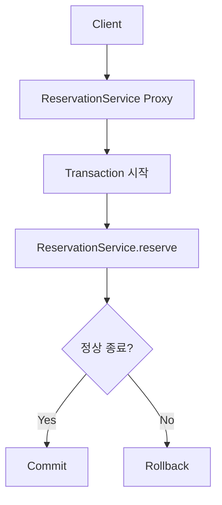
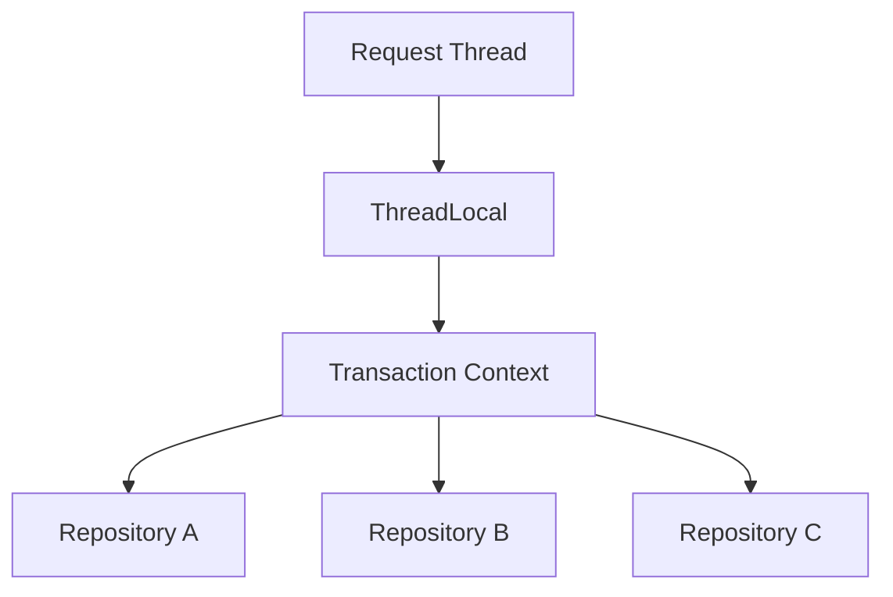
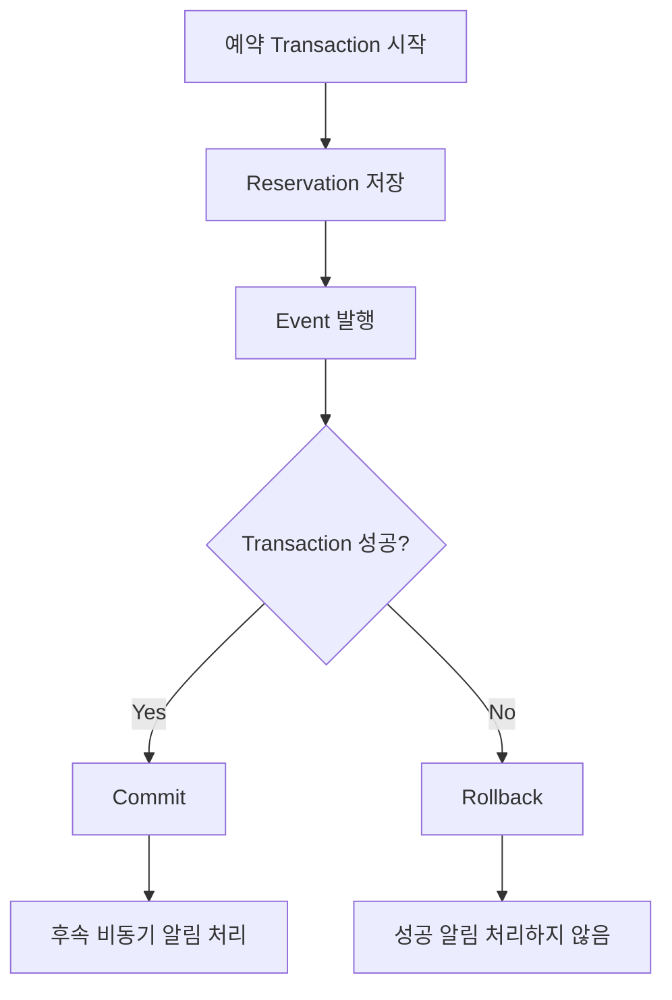

# 카야의 왜 가끔 @Transactional은 제대로 동작하지 않을까?
[https://youtu.be/pB5EUTvQs1A?si=ZiTs1RNptxpb-pbK](https://youtu.be/pB5EUTvQs1A?si=ZiTs1RNptxpb-pbK)

# 카야의 왜 가끔 @Transactional은 제대로 동작하지 않을까?
* toc
{:toc}

---

## 왜 가끔 Spring @Transactional은 제대로 동작하지 않을까?

Spring을 사용하면서 가장 자주 접하는 애너테이션 중 하나가 `@Transactional`이다.

서비스 메서드에 다음과 같이 붙여두면 여러 데이터베이스 작업을 하나의 트랜잭션으로 처리할 수 있다고 기대한다.

```java
@Transactional
public void reserve() {
    reservationRepository.save(...);
    paymentRepository.save(...);
}
```

정상적으로 실행되면 Commit하고, 처리 과정에서 문제가 발생하면 Rollback되는 흐름을 기대한다.

```text
Transaction 시작
→ 예약 저장
→ 결제 정보 저장
→ 성공
→ Commit
```

예외가 발생한다면 다음과 같은 흐름을 기대한다.

```text
Transaction 시작
→ 예약 저장
→ 결제 정보 저장
→ 예외
→ Rollback
```

그런데 실제 Spring 애플리케이션을 개발하다 보면 분명 `@Transactional`을 붙였는데 기대했던 것처럼 동작하지 않는 경우를 만나게 된다.

대표적으로 다음 두 가지 상황을 생각해볼 수 있다.

```text
Self Invocation

@Transactional + @Async
```

두 문제는 겉으로 보면 서로 전혀 달라 보인다.

하지만 내부 동작 원리를 살펴보면 결국 다음 두 가지 개념으로 연결된다.

```text
Spring AOP Proxy

ThreadLocal
```

`@Transactional`이 왜 동작하지 않는지 이해하려면 먼저 `@Transactional`이 어떻게 동작하는지를 알아야 한다.

---

## 첫 번째 문제: Self Invocation

다음과 같은 Service가 있다고 생각해보자.

```java
@Service
public class ReservationService {

    public void reserve() {
        saveReservation();
    }

    @Transactional
    public void saveReservation() {
        reservationRepository.save(...);

        throw new RuntimeException();
    }
}
```

`reserve()`가 호출되면 내부에서 `saveReservation()`을 호출한다.

그리고 `saveReservation()`에는 `@Transactional`이 있다.

코드만 보면 자연스럽게 다음과 같이 예상할 수 있다.

```text
reserve()

↓

saveReservation()

↓

@Transactional 시작

↓

Reservation 저장

↓

예외

↓

Rollback
```

그러나 동일한 객체 내부에서 직접 호출되는 구조에서는 우리가 기대한 방식으로 새로운 트랜잭션 처리가 적용되지 않을 수 있다.

이것이 Self Invocation 문제다.

---

## Self Invocation이란 무엇인가?

Self Invocation은 한 객체 안에서 자신의 다른 메서드를 직접 호출하는 상황을 의미한다.

예를 들어 다음과 같다.

```java
public void reserve() {
    saveReservation();
}
```

실질적으로는 다음처럼 생각할 수 있다.

```java
public void reserve() {
    this.saveReservation();
}
```

즉 외부 객체가 `saveReservation()`을 호출하는 것이 아니라 현재 객체 자신이 자신의 메서드를 직접 호출하고 있다.

왜 이것이 `@Transactional`과 문제가 될까?

그 이유는 Spring의 트랜잭션 기능이 **Proxy를 기반으로 동작하기 때문**이다.

---

## @Transactional은 AOP 기반으로 동작한다

`@Transactional`은 비즈니스 메서드 안에 트랜잭션 코드를 직접 작성하지 않고도 트랜잭션 기능을 적용할 수 있도록 해준다.

트랜잭션 코드를 직접 작성한다고 생각해보자.

개념적으로 다음과 같은 코드가 필요할 수 있다.

```text
Transaction 시작

try {
    비즈니스 로직 실행

    Commit
} catch (Exception e) {
    Rollback
}
```

모든 서비스 메서드마다 이런 코드를 반복한다면 비즈니스 로직과 트랜잭션 관리 코드가 섞이게 된다.

```text
회원가입 로직
+ Transaction 시작
+ Commit
+ Rollback

예약 로직
+ Transaction 시작
+ Commit
+ Rollback

결제 로직
+ Transaction 시작
+ Commit
+ Rollback
```

Spring은 AOP를 이용해 이러한 공통 기능을 비즈니스 로직과 분리한다.

---

## AOP란 무엇인가?

AOP는 Aspect-Oriented Programming의 약자로, 여러 비즈니스 로직에서 반복되는 공통 관심사를 분리해서 적용할 수 있도록 하는 방식이다.

예를 들어 다음 기능들이 있을 수 있다.

```text
Transaction

Logging

Authorization

Monitoring
```

이 기능들은 여러 서비스에서 반복적으로 필요하다.

하지만 핵심 비즈니스 로직 자체는 아니다.

예를 들어 예약 서비스의 핵심 관심사는 다음과 같다.

```text
예약을 생성한다.
```

트랜잭션 관리 자체가 예약이라는 비즈니스 기능은 아니다.

따라서 Spring은 이를 분리한다.

```text
트랜잭션 관리
       ↓
----------------
예약 비즈니스 로직
----------------
       ↓
Commit / Rollback
```

이를 가능하게 하는 핵심 구조 중 하나가 Proxy다.

---

## Proxy란 무엇인가?

Proxy Pattern은 실제 객체 대신 중간 객체가 요청을 받아 필요한 작업을 수행한 뒤 실제 객체에게 요청을 위임하는 구조다.

일반적인 메서드 호출은 다음과 같다.

```text
Client

↓

ReservationService
```

Proxy가 존재한다면 구조가 달라진다.

```text
Client

↓

ReservationService Proxy

↓

ReservationService
```

클라이언트가 실제 객체를 직접 호출하지 않고 Proxy를 먼저 호출한다.

Proxy는 실제 메서드를 실행하기 전에 부가적인 작업을 수행할 수 있다.

```text
Client
   ↓
Proxy
   ↓
Transaction 시작
   ↓
실제 Service 호출
   ↓
Commit 또는 Rollback
```

---

## Spring @Transactional과 Proxy

Spring에서 `@Transactional`이 적용된 Bean은 Proxy를 통해 호출되는 구조를 사용한다.

예를 들어 다음 Service가 있다고 하자.

```java
@Service
public class ReservationService {

    @Transactional
    public void reserve() {
        reservationRepository.save(...);
    }
}
```

외부 객체가 `reserve()`를 호출하면 개념적으로 다음과 같은 흐름이 만들어진다.



개발자가 보는 코드는 단순하다.

```java
@Transactional
public void reserve() {
    reservationRepository.save(...);
}
```

하지만 실제 동작을 이해하기 위한 핵심은 다음과 같다.

```text
@Transactional

↓

Spring Proxy

↓

Transaction 시작

↓

실제 Method 실행

↓

Commit / Rollback
```

즉 `@Transactional`의 트랜잭션 처리는 Proxy를 통과하는 호출 과정에서 적용된다.

---

## 그렇다면 Self Invocation은 왜 문제가 될까?

다시 다음 코드를 보자.

```java
@Service
public class ReservationService {

    public void reserve() {
        saveReservation();
    }

    @Transactional
    public void saveReservation() {
        reservationRepository.save(...);
    }
}
```

외부에서 `reserve()`를 호출한다.

처음 호출에서는 Spring Bean을 통해 요청이 들어간다.

```text
Client

↓

Proxy

↓

ReservationService.reserve()
```

여기까지는 Proxy를 거쳤다.

하지만 이제 `reserve()` 내부에서 다음 코드가 실행된다.

```java
saveReservation();
```

이 호출은 외부에서 Proxy를 통해 다시 들어가는 호출이 아니다.

이미 실제 `ReservationService` 객체의 메서드를 실행하고 있는 상태이기 때문이다.

따라서 내부 호출은 개념적으로 다음과 같다.

```text
ReservationService.reserve()

↓

this.saveReservation()
```

Proxy를 다시 통과하지 않는다.

---

## Proxy를 우회한다

전체 흐름을 비교해보자.

외부 호출은 다음과 같다.

```text
Client

↓

Proxy

↓

@Transactional Method
```

반면 Self Invocation은 다음과 같다.

```text
Client

↓

Proxy

↓

Real Object.reserve()

↓

this.saveReservation()
```

`saveReservation()` 호출 사이에는 새로운 Proxy 진입이 없다.

따라서 `saveReservation()`에 `@Transactional`이 붙어 있더라도 해당 호출에 대해 Proxy가 트랜잭션을 시작할 기회가 없다.

---

## Self Invocation의 핵심

한 문장으로 정리하면 다음과 같다.

```text
@Transactional 자체가
메서드를 직접 감싸고 있는 것이 아니다.

Proxy가 메서드 호출을 가로채야
트랜잭션 기능이 적용된다.
```

따라서

```text
외부 Bean
→ Proxy
→ @Transactional Method
```

호출과

```text
같은 객체
→ this.@TransactionalMethod()
```

호출의 결과가 달라질 수 있다.

---

## Self Invocation 해결 방법

제공된 구조에서 가장 일반적인 해결 방법은 트랜잭션이 필요한 책임을 별도의 Bean으로 분리하는 것이다.

기존 구조는 다음과 같다.

```text
ReservationService

├── reserve()
└── saveReservation()
      @Transactional
```

이를 다음처럼 분리할 수 있다.

```text
ReservationService

↓

ReservationWriter

↓

@Transactional
saveReservation()
```

예를 들어 다음과 같다.

```java
@Service
public class ReservationService {

    private final ReservationWriter reservationWriter;

    public ReservationService(
            ReservationWriter reservationWriter
    ) {
        this.reservationWriter = reservationWriter;
    }

    public void reserve() {
        reservationWriter.saveReservation();
    }
}
```

트랜잭션이 필요한 로직은 별도의 Bean에 위치한다.

```java
@Service
public class ReservationWriter {

    @Transactional
    public void saveReservation() {
        reservationRepository.save(...);
    }
}
```

이제 호출 흐름은 다음과 같다.


다른 Spring Bean을 호출하기 때문에 Proxy를 통한 호출 구조를 만들 수 있다.

---

## 두 번째 문제: @Transactional과 @Async

이번에는 다른 상황을 살펴보자.

예약이 완료되면 사용자에게 알림을 보내야 한다.

```text
예약 생성

↓

카카오톡 알림
```

알림은 외부 API 호출이 포함될 수 있다.

따라서 처리 시간이 오래 걸릴 수 있다.

예를 들어 예약 자체는 빠르게 끝나지만 알림 API가 5초 걸린다고 하자.

```text
Reservation
100ms

Notification API
5,000ms
```

모든 작업을 동기적으로 처리한다면 사용자는 알림 전송이 끝날 때까지 기다릴 수 있다.

이런 상황에서 `@Async`를 이용해 별도의 Thread에서 후속 작업을 처리하는 방식을 생각할 수 있다.

---

## @Async란 무엇인가?

`@Async`는 작업을 호출한 Thread와 다른 Thread에서 실행하도록 구성할 때 사용할 수 있다.

개념적으로 다음과 같다.

### 동기 처리

```text
Request Thread

예약
↓
알림
↓
응답
```

### 비동기 처리

```text
Request Thread

예약
↓
비동기 알림 요청
↓
응답


Async Thread

알림 처리
```

사용자는 알림 처리 완료까지 기다리지 않고 더 빠르게 응답을 받을 수 있다.

---

## 그런데 트랜잭션과 함께 사용하면?

다음 상황을 생각해보자.

```text
reserve()

↓

Reservation 저장

↓

@Async
sendReservationSuccessMessage()

↓

Notification 저장
```

개발자는 다음처럼 생각할 수 있다.

```text
하나의 reserve()에서 시작했으니

Reservation과 Notification이
같은 트랜잭션 안에 있겠지?
```

그래서 알림 처리 과정에서 예외가 발생하면

```text
Reservation

Notification

둘 다 Rollback
```

될 것이라고 예상할 수 있다.

하지만 `@Async`는 새로운 Thread에서 실행된다.

여기에서 중요한 문제가 발생한다.

---

## 트랜잭션과 Connection의 관계

데이터베이스 입장에서 하나의 트랜잭션으로 작업하기 위해서는 해당 트랜잭션에서 사용되는 Connection과 트랜잭션 상태를 일관되게 관리해야 한다.

Spring은 개발자가 모든 Repository 호출에 Connection을 직접 전달하도록 요구하지 않는다.

다음처럼 개발한다.

```java
reservationRepository.save(...);

userRepository.save(...);

paymentRepository.save(...);
```

우리는 Connection을 직접 전달하지 않는다.

하지만 같은 트랜잭션 안에서는 Spring이 필요한 트랜잭션 자원을 관리한다.

이를 이해할 때 중요한 개념이 ThreadLocal이다.

---

## ThreadLocal이란 무엇인가?

ThreadLocal은 Thread마다 독립적인 값을 저장할 수 있는 공간이라고 이해할 수 있다.

예를 들어 Thread A와 Thread B가 있다고 하자.

```text
Thread A
ThreadLocal
→ Value A


Thread B
ThreadLocal
→ Value B
```

이 둘은 서로 독립적이다.

Thread A의 ThreadLocal 값을 Thread B가 자동으로 공유하지 않는다.

```text
Thread A ThreadLocal
≠
Thread B ThreadLocal
```

---

## Spring 트랜잭션과 ThreadLocal

Spring은 현재 실행 중인 트랜잭션과 관련된 정보를 현재 Thread에 연결해 관리하는 방식을 사용한다.

개념적으로 다음과 같이 이해할 수 있다.

```text
Request Thread

ThreadLocal
├── Transaction 정보
└── Connection 관련 정보
```

그래서 하나의 Thread 안에서 Repository들이 호출되면 Spring이 현재 트랜잭션과 연결된 자원을 활용할 수 있다.



개발자가 Repository마다 Connection을 직접 전달하지 않아도 Spring이 트랜잭션 컨텍스트를 유지할 수 있는 것이다.

---

## @Async에서 Thread가 바뀐다

이제 문제의 핵심으로 돌아가보자.

기존 요청을 처리하는 Thread를 `Thread A`라고 하자.

```text
Thread A

Transaction
Connection
```

여기에서 `@Async` 메서드를 호출한다.

비동기 작업은 별도의 Thread에서 실행된다.

```text
Thread B
```

그러면 구조는 다음과 같다.

```text
Thread A

ThreadLocal
→ Transaction A


Thread B

ThreadLocal
→ 별도의 공간
```

ThreadLocal은 Thread마다 독립적이기 때문에 Thread B는 Thread A에 연결된 기존 트랜잭션 정보를 그대로 공유하지 않는다.

---

## 예약과 알림이 서로 다른 실행 흐름을 가지게 된다

예를 들어 다음과 같이 생각할 수 있다.

```text
Request Thread

@Transactional reserve()

↓

Reservation 저장

↓

Async 호출
```

비동기 작업은 새로운 Thread로 넘어간다.

```text
Async Thread

↓

Notification 처리
```

이를 그림으로 표현하면 다음과 같다.

```mermaid
flowchart TD
    A[Request Thread] --> B[Transaction Context A]
    B --> C[Reservation 저장]

    C --> D[@Async 호출]

    D --> E[Async Thread]
    E --> F[ThreadLocal B]
    F --> G[Notification 처리]
```

비동기 Thread는 원래 요청 Thread의 트랜잭션에 그대로 참여한다고 볼 수 없다.

따라서 예약 처리와 비동기 알림 처리를 하나의 동일한 트랜잭션처럼 생각하면 문제가 생길 수 있다.

---

## 왜 Notification만 저장될 수 있을까?

예시의 기대는 다음과 같았다.

```text
Reservation 저장

Notification 저장

↓

예외

↓

둘 다 Rollback
```

하지만 실제로 실행 Thread가 분리되면 각각의 작업이 같은 트랜잭션 컨텍스트를 공유하지 않는다.

그래서 한쪽의 Rollback이 다른 Thread에서 이미 처리된 작업까지 하나의 트랜잭션처럼 되돌리는 구조가 아니다.

제공된 예시에서는 다음과 같은 결과가 발생할 수 있다.

```text
Reservation
→ Rollback

Notification
→ 별도 처리되어 저장
```

개발자가 생각했던

```text
한 메서드에서 시작했다.
=
하나의 트랜잭션이다.
```

라는 직관이 `@Async`를 만나는 순간 깨지는 것이다.

---

## 트랜잭션의 핵심은 호출 코드의 모양만이 아니다

다음 코드만 보면 하나의 흐름처럼 보인다.

```java
@Transactional
public void reserve() {
    saveReservation();

    notificationService.sendAsync();
}
```

하지만 실제 실행 관점에서는 다음과 같이 분리될 수 있다.

```text
Thread A

reserve()
saveReservation()

---------------------

Thread B

sendAsync()
```

따라서 트랜잭션을 분석할 때 단순히 메서드 호출 관계만 볼 것이 아니라

```text
현재 어느 Thread에서 실행되고 있는가?

기존 Transaction Context를 공유하고 있는가?
```

도 확인해야 한다.

---

## @Async 문제의 핵심

Self Invocation 문제와 비교해보자.

### Self Invocation

```text
문제

Proxy를 통과하지 않는다.
```

### @Async

```text
문제

Thread가 변경된다.

↓

기존 Thread의
Transaction Context를 공유하지 않는다.
```

두 문제의 원인은 서로 다르다.

하지만 모두 `@Transactional`의 실제 동작 방식을 이해하지 못하면 발생하기 쉽다.

---

## @Transactional + @Async 문제를 어떻게 해결할까?

제공된 흐름에서는 예약이 실제로 성공한 이후에 알림을 보내는 구조를 사용한다.

즉 요구사항을 다음과 같이 바꾸어 생각한다.

```text
예약 처리 중에
알림도 같은 Transaction으로 처리한다.
```

가 아니라

```text
예약이 정상적으로 Commit되었다.

↓

그 이후 알림을 처리한다.
```

로 구조를 명확하게 만드는 것이다.

이때 사용할 수 있는 것이 `@TransactionalEventListener`다.

---

## TransactionalEventListener

예약이 완료되면 이벤트를 발행한다.

```text
Reservation 저장

↓

ReservationCompletedEvent 발행
```

그리고 트랜잭션이 Commit된 이후에 후속 작업을 수행한다.

```text
Transaction Commit 성공

↓

Event Listener 실행

↓

Notification 처리
```

개념적인 흐름은 다음과 같다.



예약이 실제로 성공한 뒤에만 후속 작업이 시작되도록 만드는 것이다.

---

## 왜 Commit 이후 실행이 중요한가?

예약이 Rollback되었는데 사용자에게 다음 알림이 전달되면 문제가 된다.

```text
예약이 완료되었습니다.
```

실제 데이터베이스에는 예약이 없다.

```text
Database

Reservation 없음
```

사용자 입장에서는 이해하기 어려운 상태가 된다.

따라서 알림의 의미가

```text
예약이 최종적으로 성공했다.
```

라면 트랜잭션 성공 여부가 확정된 이후 처리하는 것이 자연스럽다.

---

## Self Invocation과 @Async는 같은 문제가 아니다

두 상황을 하나로 묶어서 생각하면 오히려 헷갈릴 수 있다.

다음과 같이 구분하는 것이 좋다.

| 문제                  | 원인                                |
| ------------------- | --------------------------------- |
| Self Invocation     | 내부 호출이 Proxy를 다시 거치지 않음           |
| `@Async`            | 다른 Thread에서 실행                    |
| Self Invocation의 핵심 | Proxy                             |
| `@Async`의 핵심        | ThreadLocal / Transaction Context |

따라서 해결 방향도 달라진다.

---

## Self Invocation 해결 흐름

기존 구조다.

```text
ReservationService

reserve()
   ↓
this.save()
@Transactional
```

Proxy를 다시 거치지 않는다.

이를 다음처럼 바꾼다.

```text
ReservationService

↓

ReservationSaveService Bean

↓

Proxy

↓

@Transactional
```

다른 Bean의 메서드를 호출함으로써 Spring Proxy를 거치는 구조를 만든다.

---

## Async 해결 흐름

기존 기대는 다음과 같다.

```text
Transaction Thread

↓

Async Thread

↓

동일 Transaction 기대
```

하지만 실제로는 Thread가 다르다.

따라서 구조를 다음처럼 변경한다.

```text
Transaction 완료

↓

후속 작업 시작
```

예약이 성공했다는 사실을 기준으로 알림 처리를 분리하는 것이다.

---

## 두 문제를 하나의 그림으로 정리해보자

```mermaid
flowchart TD
    A[@Transactional이 예상과 다르게 동작] --> B{어떤 상황인가?}

    B --> C[동일 객체 내부 호출]
    B --> D[@Async 사용]

    C --> E[Self Invocation]
    E --> F[Proxy 우회]
    F --> G[트랜잭션 로직 적용 기회 없음]

    D --> H[새로운 Thread]
    H --> I[새로운 ThreadLocal]
    I --> J[기존 Transaction Context 공유 안 됨]

    G --> K[다른 Bean으로 책임 분리]
    J --> L[Commit 이후 후속 작업 실행]
```

---

## Proxy 관점으로 코드를 읽는 습관

다음 코드를 볼 때 단순히 애너테이션 존재 여부만 확인하는 것은 부족할 수 있다.

```java
@Transactional
public void save() {
}
```

다음 질문까지 함께 해야 한다.

```text
누가 이 메서드를 호출하는가?

외부 Bean에서 호출하는가?

같은 객체 내부에서 호출하는가?

Proxy를 통과하는 호출인가?
```

즉

```text
@Transactional이 붙어 있다.
```

와

```text
이번 호출에
@Transactional 기능이 실제 적용된다.
```

를 구분해서 생각해야 한다.

---

## Thread 관점으로 코드를 읽는 습관

`@Async`가 등장하면 또 다른 질문이 필요하다.

```text
현재 어떤 Thread인가?

Thread가 바뀌는가?

기존 Transaction Context는 어디에 있는가?
```

예를 들어 다음 코드를 보면

```java
@Transactional
public void reserve() {
    reservationRepository.save(...);

    notificationService.sendAsync(...);
}
```

코드의 줄 순서만 보면 하나의 작업처럼 보인다.

하지만 실행 구조는 다음처럼 다를 수 있다.

```text
Request Thread
├── Transaction
├── Reservation 저장
└── Async 요청


Async Thread
└── Notification 작업
```

코드의 구조와 실제 Runtime 실행 구조를 함께 봐야 한다.

---

## Spring의 추상화는 편리하지만 내부 원리를 가릴 수 있다

`@Transactional`을 사용하는 것은 매우 간단하다.

```java
@Transactional
```

단 한 줄이다.

`@Async`도 마찬가지다.

```java
@Async
```

하지만 코드가 간단하다고 내부 동작까지 단순한 것은 아니다.

그 아래에서는 다음과 같은 개념들이 연결되어 있다.

```text
AOP

Proxy

Transaction

Connection

Thread

ThreadLocal
```

따라서 애너테이션만 암기하면 예상하지 못한 상황에서 문제의 원인을 찾기 어려울 수 있다.

---

## 실무에서 발생할 수 있는 사고 흐름

트랜잭션 관련 버그를 만났다고 가정해보자.

첫 번째로 다음을 확인한다.

```text
@Transactional이 붙어 있는가?
```

하지만 이것만으로는 부족하다.

두 번째 질문이 필요하다.

```text
어떤 경로로 호출되고 있는가?
```

Self Invocation인지 확인한다.

```text
같은 객체의 메서드를
내부에서 직접 호출하고 있는가?
```

다음으로 비동기가 있다면 Thread를 확인한다.

```text
@Async가 있는가?

Thread가 변경되는가?
```

그리고 요구사항 자체를 다시 생각한다.

```text
정말 하나의 Transaction이어야 하는가?

아니면 Commit 성공 이후
후속 작업을 실행해야 하는가?
```

이런 식으로 문제를 좁힐 수 있다.

---

## @Transactional을 이해하기 위한 세 개의 레이어

이번 내용을 크게 세 계층으로 나누어 생각할 수 있다.

### 1. 코드 레이어

개발자가 보는 코드다.

```java
@Transactional
public void reserve() {
}
```

### 2. Spring 레이어

Spring은 Proxy를 이용한다.

```text
Proxy

↓

Transaction 관리

↓

Business Method
```

### 3. Runtime 레이어

트랜잭션 관련 컨텍스트는 실행 Thread와 연결된다.

```text
Thread

↓

ThreadLocal

↓

Transaction Context
```

이 세 가지를 함께 보면 여러 문제가 연결된다.

---

## Self Invocation은 Spring 레이어의 문제다

Self Invocation에서는 실행 Thread가 바뀌는 것이 핵심 문제가 아니다.

호출 자체가 Proxy를 다시 통과하지 않는다.

```text
Proxy

↓

Real Object

↓

this.transactionalMethod()
```

따라서 Spring의 트랜잭션 부가기능이 개입할 호출 지점이 사라진다.

---

## @Async는 Runtime 레이어까지 봐야 한다

반면 `@Async`에서는 Proxy 여부만으로 충분하지 않다.

새로운 Thread라는 특성을 이해해야 한다.

```text
Thread A
→ Transaction Context A


Thread B
→ 별도의 Context
```

ThreadLocal 기반 컨텍스트는 Thread가 달라지면 그대로 이어지지 않는다.

즉 두 문제는 각각 다른 레이어에서 이해해야 한다.

---

## 해결 방법도 동작 원리에서 나온다

Self Invocation 문제의 원인은 Proxy 우회다.

그러면 해결책은 자연스럽다.

```text
Proxy를 통과하게 만든다.
```

그래서 다른 Bean으로 분리한다.

```text
Bean A

↓

Bean B Proxy

↓

@Transactional
```

`@Async` 문제의 원인은 Thread가 달라 기존 Transaction Context를 공유하지 못하는 것이다.

그러면 다음 질문으로 전환한다.

```text
비동기 작업을
정말 기존 Transaction에 포함시켜야 하는가?
```

제공된 사례에서는 예약이 성공한 이후 알림을 보내야 한다.

따라서

```text
Commit 성공

↓

후속 비동기 처리
```

로 책임을 분리한다.

이렇게 동작 원리를 이해하면 해결 방법 역시 암기가 아니라 원인에서 도출할 수 있다.

---

## 구조

전체 내용을 하나의 흐름으로 정리하면 다음과 같다.

```mermaid
flowchart TD
    A[@Transactional Method] --> B[Spring AOP]

    B --> C[Proxy 생성]
    C --> D[Proxy가 호출 가로챔]

    D --> E[Transaction 시작]
    E --> F[Business Logic]
    F --> G[Commit / Rollback]

    A --> H{문제 상황}

    H --> I[Self Invocation]
    H --> J[@Async]

    I --> K[this.method 호출]
    K --> L[Proxy 우회]
    L --> M[새 트랜잭션 처리 적용 안 됨]

    J --> N[새 Thread]
    N --> O[별도 ThreadLocal]
    O --> P[기존 Transaction Context 공유 안 됨]

    M --> Q[별도 Bean으로 분리]
    P --> R[Commit 이후 후속 처리]
```

---

## 실무에서의 활용

예를 들어 주문을 생성한 뒤 알림을 보내는 기능이 있다고 하자.

```java
@Transactional
public void createOrder() {
    orderRepository.save(...);

    notificationService.sendAsync(...);
}
```

이 코드만 보고

```text
createOrder 안에 있으니까
전부 같은 Transaction이겠지.
```

라고 판단하면 안 된다.

`@Async`가 있다면 Thread가 분리될 수 있기 때문이다.

이때 요구사항을 다시 정의한다.

```text
주문이 DB에 성공적으로 반영된 경우에만
주문 완료 알림을 보낸다.
```

그러면 구조도 다음처럼 생각할 수 있다.

```text
Order Transaction

↓

Commit 성공

↓

OrderCreated Event

↓

Notification
```

핵심 트랜잭션과 부가적인 후속 작업의 경계가 더 명확해진다.

---

## @Transactional이 이상할 때 확인할 체크리스트

이번 내용에서 다룬 범위 안에서는 다음 순서로 확인해볼 수 있다.

```text
1. @Transactional 메서드가
   같은 객체 내부에서 호출되고 있는가?

2. 호출이 Spring Proxy를
   통과하고 있는가?

3. @Async로 Thread가
   변경되고 있는가?

4. 현재 작업들이 실제로
   같은 Thread에서 실행되고 있는가?

5. 비동기 작업이 기존 Transaction과
   하나로 묶여야 하는 요구사항인가?

6. 아니면 Commit 성공 이후
   실행되어야 하는 후속 작업인가?
```

이 질문만으로도 Self Invocation과 비동기 처리에서 발생하는 상당수의 혼란을 줄일 수 있다.

---

## 정리

`@Transactional`은 단순히 애너테이션을 메서드 위에 붙이는 것만으로 이해해서는 안 된다.

Spring에서는 트랜잭션 기능이 AOP와 Proxy를 기반으로 적용된다.

정상적인 외부 호출에서는 다음과 같은 흐름을 생각할 수 있다.

```text
Client

↓

Spring Proxy

↓

Transaction 시작

↓

@Transactional Method

↓

Commit / Rollback
```

하지만 같은 객체 내부에서 `@Transactional` 메서드를 호출하면 호출은 다음과 같이 이루어진다.

```text
Real Object

↓

this.transactionalMethod()
```

Proxy를 다시 거치지 않는다.

따라서 해당 내부 호출에 대해 Proxy가 새로운 트랜잭션 처리를 적용할 기회를 얻지 못한다.

이것이 Self Invocation 문제다.

해결 방향은 트랜잭션이 필요한 책임을 다른 Spring Bean으로 분리하여 호출이 Proxy를 통과하도록 만드는 것이다.

```text
Bean A

↓

Bean B Proxy

↓

@Transactional Method
```

`@Async`에서는 다른 문제가 발생한다.

Spring의 트랜잭션 컨텍스트는 Thread와 연결되어 관리되며, 이를 이해하기 위해 ThreadLocal이라는 개념이 중요하다.

```text
Thread A

ThreadLocal
→ Transaction A
```

`@Async`로 별도의 Thread에서 작업을 실행하면

```text
Thread B

ThreadLocal
→ 별도의 공간
```

이 된다.

따라서 기존 요청 Thread의 트랜잭션 컨텍스트를 새로운 Thread가 그대로 공유한다고 생각해서는 안 된다.

이를 해결하는 한 가지 방향은 비동기 후속 작업을 기존 트랜잭션에 억지로 포함시키는 대신

```text
핵심 Transaction Commit

↓

후속 작업 실행
```

형태로 책임을 분리하는 것이다.

제공된 사례에서는 `@TransactionalEventListener`를 이용하여 예약이 정상적으로 Commit된 이후에만 알림 처리를 시작하는 구조를 사용할 수 있다.

결국 두 문제의 원인은 다음처럼 정리할 수 있다.

```text
Self Invocation

→ Proxy를 우회한다.


@Transactional + @Async

→ Thread가 변경된다.
→ 기존 Thread의 Transaction Context를
  그대로 공유하지 않는다.
```

두 상황은 서로 다른 문제지만 한 가지 공통된 교훈을 준다.

Spring의 애너테이션을 단순히

```text
붙이면 동작한다.
```

라는 관점으로만 바라보면 예상하지 못한 상황을 설명하기 어렵다.

반대로

```text
@Transactional
→ AOP
→ Proxy
→ Transaction

@Async
→ 다른 Thread
→ 다른 ThreadLocal
```

이라는 내부 동작 흐름을 이해하면 문제가 발생했을 때 원인을 훨씬 구체적으로 추적할 수 있다.

### 한 줄 요약

**Spring `@Transactional`은 Proxy 기반 AOP로 적용되기 때문에 같은 객체 내부에서 호출하면 Proxy를 우회해 트랜잭션 기능이 기대대로 적용되지 않을 수 있고, `@Async`는 별도의 Thread에서 실행되어 기존 ThreadLocal 기반 트랜잭션 컨텍스트를 그대로 공유하지 않으므로 두 기능의 동작 원리를 이해하고 트랜잭션 경계를 설계해야 한다.**
