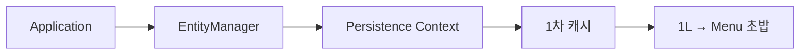
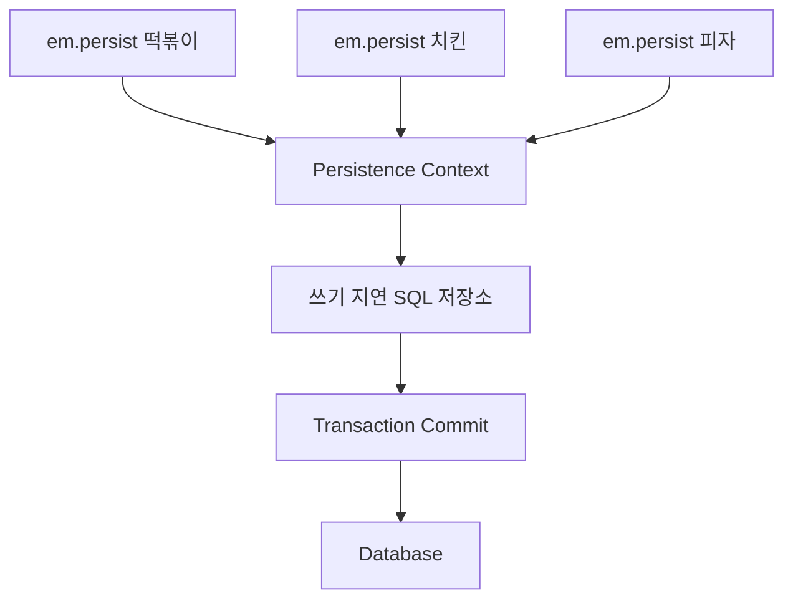
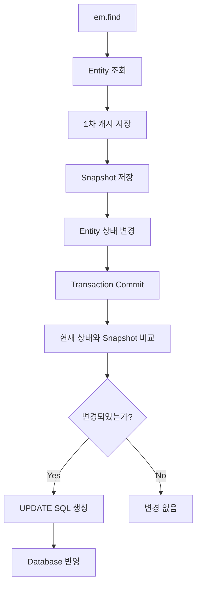
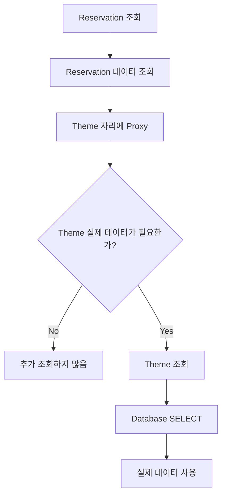
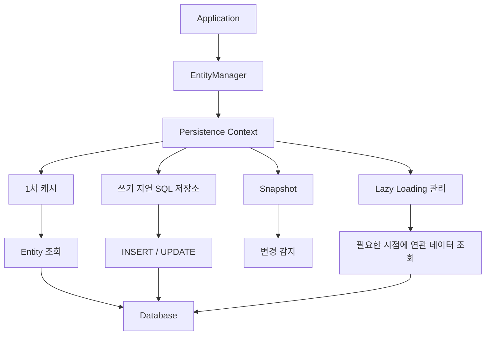
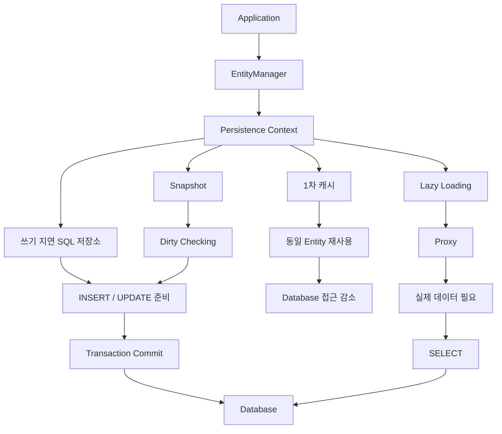

# 현미밥의 JPA 영속성 컨텍스트
[https://youtu.be/Fc2-PiuqqHI?si=marbOrysnAewdbvQ](https://youtu.be/Fc2-PiuqqHI?si=marbOrysnAewdbvQ)

# 현미밥의 JPA 영속성 컨텍스트 
* toc
{:toc}

---

## JPA 영속성 컨텍스트는 왜 필요한가?

JDBC나 `JdbcTemplate`을 이용해 직접 SQL을 작성하다 보면 처음에는 구조가 단순해 보인다.

예약 데이터를 저장한다면 `INSERT`를 작성하고,

조회하려면 `SELECT`를 작성하고,

수정하려면 `UPDATE`를 작성하면 된다.

하지만 애플리케이션이 커지고 테이블 구조가 변경되기 시작하면 이야기가 달라진다.

예를 들어 예약 테이블에 새로운 컬럼이 하나 추가되었다고 하자.

```text
reservation

id
name
date
time
```

여기에 새로운 필드가 추가된다.

```text
reservation

id
name
date
time
status
```

직접 SQL을 관리하고 있다면 관련 SQL을 찾아 수정해야 할 수 있다.

```sql
INSERT INTO reservation (
    name,
    date,
    time,
    status
)
VALUES (?, ?, ?, ?);
```

조회 SQL에도 새로운 필드를 반영해야 할 수 있다.

```sql
SELECT
    id,
    name,
    date,
    time,
    status
FROM reservation
WHERE id = ?;
```

수정 SQL도 마찬가지다.

```sql
UPDATE reservation
SET
    name = ?,
    date = ?,
    time = ?,
    status = ?
WHERE id = ?;
```

데이터베이스 구조와 객체 구조 사이를 개발자가 직접 연결해야 한다.

JPA는 이러한 반복적인 데이터베이스 작업을 줄이고, 개발자가 객체를 중심으로 애플리케이션을 작성할 수 있도록 도와준다.

그리고 JPA의 이러한 동작을 이해하기 위한 핵심 개념이 바로 **영속성 컨텍스트(Persistence Context)**다.

---

## 영속성 컨텍스트란 무엇인가?

영속성 컨텍스트를 처음 접하면 이름부터 어렵게 느껴질 수 있다.

우선 다음처럼 생각해볼 수 있다.

```text
애플리케이션

↓

영속성 컨텍스트

↓

Database
```

영속성 컨텍스트는 애플리케이션과 데이터베이스 사이에서 엔티티의 상태를 관리하는 공간이다.

애플리케이션이 엔티티를 조회하거나 저장하고 변경할 때 JPA는 모든 작업을 무조건 즉시 데이터베이스에 반영하는 것이 아니라 영속성 컨텍스트를 이용해 엔티티를 관리한다.

이를 메모장에 비유해서 생각해볼 수 있다.

사용자가 저녁 메뉴를 계속 변경한다고 하자.

처음에는

```text
아이스크림
```

을 선택했다.

잠시 후 마음이 바뀐다.

```text
고구마
```

다시 마음이 바뀐다.

```text
일식
```

매번 선택이 바뀔 때마다 데이터베이스를 직접 수정한다고 생각하면 다음과 같다.

```text
아이스크림
→ DB UPDATE

고구마
→ DB UPDATE

일식
→ DB UPDATE
```

변경할 때마다 데이터베이스와 통신한다.

JPA에서는 이와 다른 방식으로 엔티티 상태를 관리할 수 있다.

```text
아이스크림
↓
영속성 컨텍스트

고구마
↓
영속성 컨텍스트

일식
↓
영속성 컨텍스트
```

그리고 최종적으로 필요한 시점에 데이터베이스에 변경사항을 반영한다.

영속성 컨텍스트를 애플리케이션과 데이터베이스 사이에서 엔티티를 관리하는 중간 공간이라고 이해하면 이후 개념들이 자연스럽게 연결된다.

---

## EntityManager

영속성 컨텍스트를 다룰 때 가장 먼저 등장하는 객체가 `EntityManager`다.

보통 다음과 같이 줄여서 표현한다.

```text
EntityManager
→ em
```

EntityManager는 이름 그대로 엔티티를 관리하는 역할을 한다.

예를 들어 ID가 1인 Menu 엔티티를 조회한다고 하자.

```java
Menu menu = em.find(
        Menu.class,
        1L
);
```

애플리케이션에서는 단순히

```text
Menu 1번을 주세요.
```

라고 요청한 셈이다.

하지만 JPA는 곧바로 데이터베이스부터 조회하지 않는다.

먼저 영속성 컨텍스트를 확인한다.

---

## 엔티티 조회 흐름

처음으로 다음 코드를 실행한다고 해보자.

```java
Menu menu = em.find(
        Menu.class,
        1L
);
```

아직 영속성 컨텍스트에는 아무것도 없다.

```text
Persistence Context

[ empty ]
```

따라서 JPA는 데이터베이스를 조회한다.

```text
Application

↓

em.find(Menu.class, 1L)

↓

Persistence Context 확인

↓

없음

↓

Database 조회
```

데이터베이스에서 다음 데이터가 반환되었다고 하자.

```text
id = 1

name = 초밥
```

JPA는 이 데이터를 바로 애플리케이션에만 반환하는 것이 아니다.

먼저 영속성 컨텍스트에 저장한다.

```text
Persistence Context

1 → 초밥
```

그리고 애플리케이션에 엔티티를 반환한다.

---

## 1차 캐시

영속성 컨텍스트 내부에서 엔티티를 보관하는 공간을 **1차 캐시**라고 한다.

개념적으로 Map과 유사한 구조로 이해할 수 있다.

```text
Key
→ Entity Identifier

Value
→ Entity
```

예를 들어 다음과 같다.

```text
1L
→ Menu("초밥")
```

그림으로 표현하면 다음과 같다.



이제 같은 엔티티를 다시 조회하면 어떻게 될까?

---

## 동일한 엔티티를 다시 조회하면 DB까지 가지 않는다

첫 번째 조회는 다음과 같았다.

```java
Menu first = em.find(
        Menu.class,
        1L
);
```

JPA는 DB에서 데이터를 조회하고 1차 캐시에 저장했다.

```text
1L
→ Menu("초밥")
```

이제 다시 같은 엔티티를 조회한다.

```java
Menu second = em.find(
        Menu.class,
        1L
);
```

이번에는 영속성 컨텍스트에 이미 엔티티가 존재한다.

따라서 다시 DB를 조회하지 않고 1차 캐시에서 값을 반환할 수 있다.

```text
두 번째 find()

↓

1차 캐시 확인

↓

Menu 존재

↓

Database 조회 생략

↓

Entity 반환
```

---

## 1차 캐시가 주는 첫 번째 이점: 조회 비용 감소

동일한 엔티티를 여러 번 조회한다고 생각해보자.

1차 캐시가 없다면 다음과 같은 흐름이 반복될 수 있다.

```text
find(1L)
→ DB SELECT

find(1L)
→ DB SELECT

find(1L)
→ DB SELECT
```

하지만 1차 캐시가 있다면 첫 번째 조회 이후에는 영속성 컨텍스트가 엔티티를 기억하고 있다.

```text
find(1L)
→ DB SELECT
→ 1차 캐시 저장


find(1L)
→ 1차 캐시


find(1L)
→ 1차 캐시
```

동일한 트랜잭션 안에서 같은 엔티티를 반복해서 조회할 때 불필요한 DB 조회를 줄일 수 있다.

---

## 1차 캐시가 주는 두 번째 이점: 객체 동일성

자바에서는 객체 자체의 동일성을 확인할 수 있다.

```java
Menu first = em.find(Menu.class, 1L);
Menu second = em.find(Menu.class, 1L);

System.out.println(first == second);
```

영속성 컨텍스트가 동일한 식별자의 엔티티를 관리하고 있기 때문에 동일한 엔티티 조회에 대해 같은 인스턴스를 사용할 수 있다.

개념적으로 다음과 같다.

```text
Database

PK = 1


Persistence Context

1
↓
Menu Instance A
```

첫 번째 조회도

```text
Menu Instance A
```

를 반환하고,

두 번째 조회도

```text
Menu Instance A
```

를 반환한다.

---

## 데이터베이스와 객체의 식별 방식

관계형 데이터베이스에서는 기본키를 통해 데이터를 식별한다.

```text
id = 1
```

자바에서는 객체가 각각의 인스턴스로 존재한다.

JPA의 1차 캐시는 식별자가 같은 엔티티를 하나의 영속성 컨텍스트에서 관리함으로써 데이터베이스와 객체 사이의 차이를 다루는 역할을 한다.

```text
Database

PK = 1

        ↓

Persistence Context

        ↓

Java Entity
```

이것이 영속성 컨텍스트가 단순한 성능용 캐시 이상으로 중요한 이유다.

---

## 영속성 컨텍스트의 핵심 기능

영속성 컨텍스트를 이해할 때 중요한 기능은 크게 다음과 같이 정리할 수 있다.

```text
1차 캐시

쓰기 지연

변경 감지

지연 로딩
```

이제 하나씩 살펴보자.

---

## 쓰기 지연이란 무엇인가?

여러 데이터를 저장하는 상황을 생각해보자.

예를 들어 다음 세 개의 Menu를 저장한다.

```text
떡볶이

치킨

피자
```

직접 JDBC 방식으로 각각 저장한다면 다음과 같은 흐름을 떠올릴 수 있다.

```text
떡볶이 저장
→ INSERT

치킨 저장
→ INSERT

피자 저장
→ INSERT
```

각 작업이 실행되는 과정에서 데이터베이스와 통신한다.

JPA에서는 `persist()`를 사용할 수 있다.

```java
em.persist(tteokbokki);
em.persist(chicken);
em.persist(pizza);
```

여기에서 중요한 역할을 하는 것이 영속성 컨텍스트다.

---

## em.persist()

`persist()`는 해당 엔티티를 영속성 컨텍스트가 관리하도록 만드는 역할을 한다.

예를 들어 다음과 같다.

```java
Menu menu = new Menu(
        "떡볶이"
);

em.persist(menu);
```

JPA는 엔티티를 영속성 컨텍스트에서 관리하기 시작한다.

개념적으로 다음과 같이 생각할 수 있다.

```text
Menu("떡볶이")

↓

em.persist()

↓

Persistence Context

↓

1차 캐시
```

그리고 데이터베이스에 저장하기 위해 필요한 SQL도 준비한다.

---

## 쓰기 지연 SQL 저장소

영속성 컨텍스트에는 데이터베이스에 전달해야 할 SQL을 모아두는 공간을 생각할 수 있다.

이를 **쓰기 지연 SQL 저장소**라고 한다.

세 개의 Menu를 저장한다고 하자.

```java
em.persist(tteokbokki);
em.persist(chicken);
em.persist(pizza);
```

개념적으로 다음과 같은 상태가 된다.

```text
Persistence Context

1차 캐시
├── 떡볶이
├── 치킨
└── 피자


쓰기 지연 SQL 저장소
├── INSERT 떡볶이
├── INSERT 치킨
└── INSERT 피자
```

즉 애플리케이션은 객체를 저장하고, JPA는 이를 영속성 컨텍스트에서 관리하면서 필요한 SQL을 준비한다.

---

## Commit 시점에 SQL을 반영한다

트랜잭션이 Commit되는 시점이 되면 영속성 컨텍스트에 모아두었던 변경사항을 데이터베이스에 반영한다.

```text
persist
↓
persist
↓
persist
↓
Commit
↓
SQL 반영
```

구조를 단순화하면 다음과 같다.



이러한 방식을 **쓰기 지연**이라고 한다.

---

## 쓰기 지연이 중요한 이유

쓰기 지연의 핵심은 애플리케이션의 객체 상태 변경과 SQL 실행을 바로 일대일로 연결하지 않는다는 데 있다.

```text
애플리케이션에서 객체 관리

↓

영속성 컨텍스트가 변경사항 관리

↓

적절한 시점에 DB 반영
```

개발자는 각각의 SQL 실행 시점을 직접 관리하는 것보다 엔티티의 상태를 중심으로 코드를 작성할 수 있다.

---

## 변경 감지란 무엇인가?

이번에는 이미 존재하는 엔티티를 수정하는 상황을 생각해보자.

먼저 떡볶이를 조회한다.

```java
Menu menu = em.find(
        Menu.class,
        1L
);
```

현재 상태는 다음과 같다.

```text
Menu

name = 떡볶이
```

이제 치즈를 추가한다.

```java
menu.addCheese();
```

객체 상태가 바뀐다.

```text
Before

떡볶이


After

치즈 떡볶이
```

그런데 다음과 같은 코드는 없다.

```java
em.update(menu);
```

JPA에서는 별도의 `update()`를 직접 호출하지 않아도 영속성 컨텍스트가 엔티티 상태의 변화를 감지할 수 있다.

이것이 **변경 감지(Dirty Checking)**다.

---

## 스냅샷

영속성 컨텍스트가 변경을 알아내려면 처음 상태를 기억하고 있어야 한다.

엔티티를 처음 영속성 컨텍스트에서 관리할 때 최초 상태를 저장해둔다.

이를 스냅샷이라고 한다.

처음 떡볶이를 조회했다고 하자.

```text
현재 Entity

떡볶이


Snapshot

떡볶이
```

현재 엔티티와 스냅샷의 상태가 같다.

이제 객체를 변경한다.

```java
menu.addCheese();
```

현재 상태는 달라진다.

```text
현재 Entity

치즈 떡볶이


Snapshot

떡볶이
```

스냅샷은 처음 상태를 유지하고 있다.

---

## Commit 시점에 상태를 비교한다

트랜잭션 Commit 시점이 되면 영속성 컨텍스트는 현재 엔티티 상태와 스냅샷을 비교한다.

```text
Snapshot

떡볶이


Current Entity

치즈 떡볶이
```

둘이 다르다.

따라서 엔티티가 변경되었다는 사실을 알 수 있다.

```text
현재 상태
≠
스냅샷

↓

변경 감지
```

변경이 감지되면 JPA가 필요한 UPDATE SQL을 준비한다.

```sql
UPDATE menu
SET name = ?
WHERE id = ?;
```

그리고 이를 데이터베이스에 반영한다.

---

## 변경 감지의 전체 흐름

전체 과정을 정리하면 다음과 같다.



개발자가 직접 UPDATE SQL을 작성하지 않아도 엔티티의 상태를 변경하면 JPA가 이를 감지하여 데이터베이스에 반영할 수 있다.

---

## 객체를 변경하는 것이 곧 데이터 변경으로 이어진다

JDBC 중심의 코드를 생각하면 데이터 변경은 SQL과 강하게 연결되어 있다.

```text
데이터 변경

↓

UPDATE SQL 작성
```

반면 영속성 컨텍스트가 관리하는 엔티티에서는 객체의 상태 변경을 중심으로 생각할 수 있다.

```text
Entity 조회

↓

Entity 상태 변경

↓

변경 감지

↓

UPDATE SQL

↓

Database
```

개발자는 데이터베이스의 UPDATE 문보다 도메인 객체의 행위에 집중할 수 있다.

예를 들어

```java
menu.addCheese();
```

처럼 객체에게 상태 변경 책임을 줄 수 있다.

---

## 변경 감지와 객체지향 코드

다음 두 코드를 비교해보자.

SQL 중심의 사고에서는 다음과 같은 코드가 필요하다.

```sql
UPDATE menu
SET name = '치즈 떡볶이'
WHERE id = 1;
```

객체 중심에서는 다음과 같이 표현할 수 있다.

```java
menu.addCheese();
```

개발자가 표현하고 싶은 비즈니스 행위는

```text
메뉴 이름 컬럼을 UPDATE 한다.
```

보다

```text
떡볶이에 치즈를 추가한다.
```

에 더 가깝다.

영속성 컨텍스트의 변경 감지가 이러한 객체 중심의 코드를 데이터베이스 변경으로 연결해준다.

---

## 지연 로딩이란 무엇인가?

이번에는 엔티티 사이의 연관관계를 생각해보자.

예를 들어 방탈출 예약 정보가 있다고 하자.

```text
Reservation

예약자
예약 시간
Theme
```

예약 데이터를 조회할 때 항상 Theme의 모든 정보까지 필요한 것은 아닐 수 있다.

예를 들어 화면에 필요한 정보가 다음뿐이라고 하자.

```text
예약자 이름

예약 시간
```

그런데 Reservation을 조회할 때마다 연관된 Theme까지 무조건 조회한다면 당장 사용하지 않을 데이터도 가져오게 된다.

JPA에서는 이런 상황에서 **지연 로딩(Lazy Loading)**을 사용할 수 있다.

---

## 필요한 데이터만 먼저 조회한다

예약을 먼저 조회한다고 해보자.

```text
Reservation 조회
```

현재 당장 Theme의 상세 데이터가 필요하지 않다.

그러면 JPA는 Reservation 데이터를 먼저 가져오고, 연관된 Theme 자리에는 실제 Theme 대신 Proxy 객체를 사용할 수 있다.

```text
Reservation

name = 조윤식
time = 15:00
theme = Theme Proxy
```

실제 Theme 데이터 조회를 뒤로 미루는 것이다.

---

## Proxy 객체

지연 로딩에서는 실제 엔티티 대신 Proxy 객체가 사용될 수 있다.

개념적으로 다음과 같이 생각할 수 있다.

```text
Reservation

↓

Theme Proxy
```

당장 Theme의 상세 정보가 필요하지 않다면 데이터베이스를 추가로 조회하지 않는다.

하지만 애플리케이션에서 Theme 데이터가 실제로 필요한 순간이 온다.

예를 들어 다음과 같다.

```java
reservation.getTheme()
        .getName();
```

Theme의 실제 데이터가 필요해졌다.

그 순간 필요한 조회가 발생한다.

```text
Theme Proxy

↓

실제 데이터 필요

↓

SELECT Theme

↓

Database
```

---

## 지연 로딩의 전체 흐름

전체 흐름을 보면 다음과 같다.



즉 연관된 데이터를 무조건 처음부터 모두 가져오는 것이 아니라 실제로 필요해질 때 조회를 수행하는 방식이다.

---

## 지연 로딩을 사용하는 이유

예약을 조회할 때 Theme 정보를 전혀 사용하지 않는다고 생각해보자.

그렇다면 Theme까지 미리 조회할 필요가 없다.

```text
Reservation 필요
→ 조회

Theme 필요 없음
→ 조회 미룸
```

필요하지 않은 조회를 늦추면서 불필요한 데이터 접근을 줄일 수 있다.

지연 로딩의 핵심은 다음과 같다.

```text
지금 필요하지 않은 데이터라면

지금 조회하지 않는다.
```

---

## 영속성 컨텍스트의 네 가지 기능을 연결해보자

지금까지 살펴본 기능은 서로 독립적으로 보이지만 모두 영속성 컨텍스트를 중심으로 연결된다.

### 1차 캐시

```text
조회한 Entity를 기억한다.
```

같은 엔티티를 다시 찾을 때 영속성 컨텍스트에 존재한다면 이를 이용할 수 있다.

### 쓰기 지연

```text
DB 반영을 위한 SQL을 관리한다.
```

엔티티 저장 과정에서 필요한 SQL을 준비하고 이후 데이터베이스에 반영한다.

### 변경 감지

```text
Entity가 변경되었는지 확인한다.
```

스냅샷과 현재 엔티티 상태를 비교하여 UPDATE를 준비한다.

### 지연 로딩

```text
지금 필요하지 않은 연관 데이터의 조회를 미룬다.
```

실제 데이터가 필요한 시점까지 조회를 지연시킨다.

---

## 전체 구조

영속성 컨텍스트를 중심으로 보면 다음과 같은 구조를 떠올릴 수 있다.



애플리케이션이 데이터베이스를 매번 직접 상대하는 것이 아니라 JPA가 영속성 컨텍스트를 통해 중간에서 엔티티 상태와 데이터베이스 반영을 관리한다.

---

## EntityManager와 영속성 컨텍스트의 관계

EntityManager를 단순하게 Repository처럼 생각하면 영속성 컨텍스트를 놓치기 쉽다.

다음 코드를 보면

```java
Menu menu = em.find(
        Menu.class,
        1L
);
```

겉으로는 DB 조회 메서드처럼 보인다.

하지만 내부적인 개념은 다음에 가깝다.

```text
EntityManager

↓

Persistence Context 확인

↓

Entity가 있으면 반환

↓

없으면 DB 조회

↓

Persistence Context에 저장

↓

Entity 반환
```

따라서 EntityManager는 데이터베이스에 단순히 SQL을 전달하는 객체라기보다 영속성 컨텍스트를 통해 엔티티의 생명주기를 관리하는 역할과 연결된다.

---

## persist도 단순 INSERT 명령이 아니다

마찬가지로 다음 코드도

```java
em.persist(menu);
```

단순하게

```text
INSERT 실행
```

이라고만 이해하면 영속성 컨텍스트의 역할을 놓치게 된다.

더 중요한 의미는 다음과 같다.

```text
이 Entity를
영속성 컨텍스트가 관리하게 한다.
```

영속성 컨텍스트에서 관리되기 시작하면 이후 변경 감지와 같은 기능을 사용할 수 있다.

---

## JPA에서는 객체 상태가 중요하다

JDBC 중심으로 생각하면 핵심이 SQL이다.

```text
SELECT

INSERT

UPDATE

DELETE
```

JPA에서는 엔티티 상태와 영속성 컨텍스트의 관계가 중요한 개념이 된다.

예를 들어

```java
Menu menu = em.find(Menu.class, 1L);

menu.addCheese();
```

만 실행하더라도 영속성 컨텍스트가 관리하는 엔티티의 상태 변화가 이후 데이터베이스 변경으로 연결될 수 있다.

그래서 JPA를 제대로 이해하려면 단순히 SQL을 대신 만들어주는 도구라고만 생각해서는 부족하다.

---

## 영속성 컨텍스트가 SQL과 객체 사이를 연결한다

애플리케이션 개발자는 객체를 다룬다.

```java
menu.addCheese();
```

데이터베이스는 SQL을 이해한다.

```sql
UPDATE menu
SET name = ?
WHERE id = ?;
```

두 세계 사이에는 차이가 있다.

영속성 컨텍스트는 애플리케이션의 객체 상태를 관리하면서 필요한 데이터베이스 작업을 연결한다.

```text
Java Object

↓

Persistence Context

↓

SQL

↓

Database
```

이 구조 덕분에 개발자는 SQL 자체보다 객체의 책임과 상태 변화에 더 집중할 수 있다.

---

## 객체를 컬렉션처럼 다루는 느낌

영속성 컨텍스트를 사용하면 엔티티를 다룰 때 일반적인 Java 객체를 사용하는 것과 유사한 느낌을 받을 수 있다.

예를 들어 객체를 조회한다.

```java
Menu menu = em.find(
        Menu.class,
        1L
);
```

객체를 수정한다.

```java
menu.addCheese();
```

별도의 UPDATE 호출 없이 객체의 상태를 변경한다.

이후 영속성 컨텍스트가 변경사항을 확인하고 데이터베이스 반영을 처리한다.

```text
Entity 조회

↓

Entity 사용

↓

Entity 상태 변경

↓

Persistence Context

↓

Database 반영
```

---

## 1차 캐시와 변경 감지는 연결되어 있다

1차 캐시는 단순히 조회 성능을 위한 공간으로만 생각할 수 있지만, 영속성 컨텍스트가 엔티티를 계속 관리한다는 것이 중요하다.

엔티티를 영속성 컨텍스트가 관리하고 있기 때문에

```text
현재 Entity 상태
```

를 알고 있을 수 있고,

처음 상태와 비교하여

```text
Snapshot
```

변경 여부를 확인할 수 있다.

즉 다음 기능들은 서로 연결되어 있다.

```text
Entity 관리

↓

1차 캐시

↓

Snapshot

↓

변경 감지
```

---

## 쓰기 지연과 변경 감지도 연결된다

변경 감지를 통해 UPDATE가 필요하다는 사실을 알아냈다고 하자.

JPA는 필요한 SQL을 준비한다.

```text
Entity 변경

↓

Dirty Checking

↓

UPDATE SQL 생성

↓

DB 반영
```

이처럼 개발자가 직접 SQL을 작성하지 않더라도 영속성 컨텍스트가 엔티티의 상태와 SQL 실행 사이를 연결한다.

---

## JPA를 사용하는 핵심 이유

JPA를 사용하는 목적을 단순히 다음처럼 생각할 수도 있다.

```text
SQL을 적게 작성할 수 있다.
```

물론 개발 편의성 측면에서 큰 장점이다.

하지만 영속성 컨텍스트를 이해하고 나면 조금 더 근본적인 역할을 볼 수 있다.

첫 번째는 데이터베이스와의 상호작용을 영속성 컨텍스트가 관리한다는 것이다.

```text
1차 캐시

쓰기 지연

변경 감지

지연 로딩
```

두 번째는 개발자가 SQL보다 객체의 상태와 행동에 집중할 수 있게 해준다는 것이다.

---

## 데이터베이스 통신을 줄이는 방향

영속성 컨텍스트의 여러 기능에는 공통점이 있다.

1차 캐시는 같은 엔티티 조회를 위해 불필요하게 DB를 다시 찾는 상황을 줄인다.

```text
DB 조회

↓

1차 캐시 저장

↓

다음 조회는 캐시 활용
```

지연 로딩은 당장 필요하지 않은 연관 데이터의 조회를 뒤로 미룬다.

```text
필요 없음
→ 조회하지 않음

필요해짐
→ 조회
```

쓰기 지연은 데이터베이스 반영 시점을 관리한다.

즉 여러 기능이 데이터베이스와 애플리케이션 사이의 작업을 효율적으로 관리하기 위한 방향으로 연결된다.

---

## 객체지향적인 코드 작성에 집중할 수 있다

JDBC를 직접 사용한다면 개발자는 다음 두 가지를 함께 생각해야 한다.

```text
비즈니스 로직

+

SQL
```

예를 들어

```text
치즈를 추가한다.
```

라는 비즈니스 요구사항이 있다.

직접 SQL을 중심으로 접근하면

```text
현재 값을 조회한다.

↓

값을 변경한다.

↓

UPDATE SQL을 만든다.

↓

SQL을 실행한다.
```

라는 데이터베이스 작업까지 함께 생각해야 한다.

JPA에서는 영속 상태의 객체를 가져와 다음과 같이 표현할 수 있다.

```java
menu.addCheese();
```

그리고 데이터베이스 반영에 필요한 작업은 영속성 컨텍스트가 관리한다.

이를 통해 개발자는 객체가 가져야 할 책임과 행위를 표현하는 데 더 집중할 수 있다.

---

## 영속성 컨텍스트를 이해하지 않고 JPA를 사용하면 생기는 혼란

JPA 코드를 처음 보면 다음과 같은 의문이 생길 수 있다.

```java
Menu menu = em.find(Menu.class, 1L);

menu.addCheese();
```

그리고 코드가 끝난다.

SQL UPDATE가 없다.

그런데 DB는 변경된다.

영속성 컨텍스트를 모른다면 다음과 같은 생각이 들 수 있다.

```text
UPDATE를 호출하지 않았는데

왜 DB가 바뀌지?
```

변경 감지를 이해하면 이유를 설명할 수 있다.

---

## 같은 엔티티를 두 번 조회했는데 왜 같은 객체일까?

다음 코드도 마찬가지다.

```java
Menu first =
        em.find(Menu.class, 1L);

Menu second =
        em.find(Menu.class, 1L);
```

왜 DB를 두 번 조회하지 않을 수 있는지,

왜 동일한 엔티티 인스턴스를 사용할 수 있는지,

영속성 컨텍스트의 1차 캐시를 알면 설명할 수 있다.

```text
첫 조회

DB
↓
Persistence Context
↓
Entity


두 번째 조회

Persistence Context
↓
Entity
```

---

## 연관 엔티티를 왜 바로 조회하지 않을까?

Reservation과 Theme의 관계가 지연 로딩으로 설정되어 있다면 Reservation 조회 시 Theme가 바로 조회되지 않을 수 있다.

```text
Reservation 조회

↓

Theme Proxy
```

그리고 실제 Theme 값이 필요한 순간 추가 조회가 발생한다.

```text
theme.getName()

↓

Theme 조회
```

지연 로딩 개념을 모르면 SQL이 예상하지 못한 시점에 실행되는 것처럼 느껴질 수 있다.

결국 JPA를 제대로 이해하려면 단순한 Repository API 사용법보다 영속성 컨텍스트의 동작을 먼저 이해하는 것이 중요하다.

---

## 영속성 컨텍스트를 하나의 작업 공간으로 이해하기

영속성 컨텍스트를 하나의 작업 공간이라고 생각해보자.

데이터를 조회하면 기억한다.

```text
1차 캐시
```

새로운 데이터를 저장하면 DB 반영 작업을 준비한다.

```text
쓰기 지연
```

기존 객체의 값이 바뀌면 처음 상태와 비교한다.

```text
변경 감지
```

연관 데이터가 당장 필요하지 않으면 조회를 미룬다.

```text
지연 로딩
```

결국 다음 구조로 정리할 수 있다.

```text
Application

       ↓

Persistence Context

├── Entity 기억
├── SQL 관리
├── 변경 추적
└── 연관 데이터 로딩 관리

       ↓

Database
```

이 관점으로 바라보면 영속성 컨텍스트라는 이름도 조금 더 자연스럽게 이해할 수 있다.

---

## 구조

전체 실행 흐름을 하나로 정리하면 다음과 같다.



영속성 컨텍스트는 단순한 저장 공간 하나라기보다 여러 JPA 기능의 중심에 있는 개념으로 이해할 수 있다.

---

## 실무에서의 활용

실제 Spring Data JPA를 사용하면 개발자가 EntityManager를 직접 호출하지 않는 경우도 많다.

코드는 다음처럼 보일 수 있다.

```java
@Transactional
public void addCheese(Long menuId) {

    Menu menu = menuRepository.findById(menuId)
            .orElseThrow();

    menu.addCheese();
}
```

코드에는 다음이 없다.

```java
menuRepository.update(menu);
```

그럼에도 영속성 컨텍스트가 관리하는 엔티티라면 객체 상태의 변화가 감지되어 데이터베이스 변경으로 이어질 수 있다.

이 코드가 자연스럽게 느껴지려면 다음 연결 관계를 이해해야 한다.

```text
Repository 조회

↓

Entity가 영속성 컨텍스트에서 관리됨

↓

Entity 상태 변경

↓

Dirty Checking

↓

UPDATE SQL 준비

↓

Commit

↓

Database 반영
```

즉 JPA 사용법을 외우는 것보다 이 흐름을 이해하는 것이 중요하다.

---

## Spring Batch에서 JPA를 사용할 때 주의할 점

지금까지 살펴본 영속성 컨텍스트의 기능은 일반적인 웹 애플리케이션에서는 매우 편리하다.

```text
Entity 조회

↓

1차 캐시

↓

상태 변경

↓

Dirty Checking

↓

UPDATE
```

하지만 수십만 건, 수백만 건의 데이터를 처리하는 **Spring Batch에서는 영속성 컨텍스트의 특성이 오히려 성능과 메모리 문제로 이어질 수 있다.**

그 이유는 영속성 컨텍스트가 자신이 관리하는 엔티티를 계속 기억하기 때문이다.

예를 들어 배치에서 100만 개의 엔티티를 하나씩 조회하면서 수정한다고 생각해보자.

```java
for (Menu menu : menus) {
    menu.changeStatus();
}
```

영속성 컨텍스트가 계속 유지되는 구조라면 처리한 엔티티가 1차 캐시에 계속 쌓일 수 있다.

```text
Persistence Context

1건
↓

1,000건
↓

10,000건
↓

100,000건
↓

...
```

JPA는 단순히 엔티티 객체만 보관하는 것도 아니다.

변경 감지를 위해 엔티티의 상태를 관리해야 하고, 구현체에 따라 스냅샷과 여러 관리 정보도 함께 유지한다.

따라서 관리하는 엔티티가 지나치게 많아지면 다음과 같은 문제가 발생할 수 있다.

```text
메모리 사용량 증가

Dirty Checking 대상 증가

GC 부담 증가

Flush 비용 증가

전체 Batch 처리 속도 저하
```

즉 웹 요청에서는 유용했던 1차 캐시와 변경 감지가 대량 처리에서는 관리해야 할 비용으로 바뀔 수 있다.

---

### Chunk 단위로 생각해야 한다

Spring Batch에서 흔히 사용하는 방식은 Chunk-Oriented Processing이다.

예를 들어 Chunk Size가 1,000이라면 개념적으로 다음처럼 동작한다.

```text
1,000건 Read

↓

Process

↓

1,000건 Write

↓

Transaction Commit

↓

다음 1,000건 처리
```

Spring Batch는 설정된 Chunk를 하나의 트랜잭션 경계로 처리한다.

따라서 JPA를 사용할 때도 전체 데이터를 하나의 거대한 영속성 컨텍스트에서 처리하기보다 **Chunk 또는 Page 단위로 영속성 컨텍스트의 크기를 제한하는 것**이 중요하다.

```text
Chunk 1

1 ~ 1,000
→ 처리
→ Flush / Commit
→ Persistence Context 정리


Chunk 2

1,001 ~ 2,000
→ 처리
→ Flush / Commit
→ Persistence Context 정리
```

이 구조를 이용하면 처리한 엔티티가 계속 메모리에 누적되는 것을 방지할 수 있다.

---

### flush()와 clear()의 역할을 구분해야 한다

JPA 배치 처리에서 자주 등장하는 두 메서드가 있다.

```java
entityManager.flush();
entityManager.clear();
```

둘은 역할이 다르다.

`flush()`는 현재 영속성 컨텍스트의 변경사항을 데이터베이스와 동기화한다.

```text
Persistence Context

↓

flush()

↓

INSERT / UPDATE / DELETE SQL 실행
```

하지만 `flush()`를 호출했다고 영속성 컨텍스트가 비워지는 것은 아니다.

엔티티들은 여전히 관리 상태로 남아 있을 수 있다.

반면 `clear()`는 영속성 컨텍스트를 비운다.

```text
Persistence Context

Entity A
Entity B
Entity C

↓

clear()

↓

Persistence Context

empty
```

따라서 직접 JPA 기반 대량 처리를 구현한다면 상황에 따라 다음과 같은 패턴을 고려할 수 있다.

```java
for (int i = 0; i < menus.size(); i++) {
    Menu menu = menus.get(i);
    menu.changeStatus();

    if (i % batchSize == 0) {
        entityManager.flush();
        entityManager.clear();
    }
}
```

핵심은 일정한 단위로 데이터베이스에 변경사항을 반영하고, 더 이상 관리할 필요가 없는 엔티티를 영속성 컨텍스트에서 제거하는 것이다.

다만 Spring Batch가 제공하는 JPA 전용 Reader와 Writer를 사용한다면 해당 컴포넌트가 영속성 컨텍스트를 어떻게 관리하는지도 함께 확인해야 한다.

---

### JpaPagingItemReader는 페이지마다 영속성 컨텍스트를 정리한다

Spring Batch에는 JPA를 이용한 Paging Reader인 `JpaPagingItemReader`가 있다.

개념적으로 다음과 같이 사용할 수 있다.

```java
@Bean
public JpaPagingItemReader<Menu> menuReader(
        EntityManagerFactory entityManagerFactory
) {
    return new JpaPagingItemReaderBuilder<Menu>()
            .name("menuReader")
            .entityManagerFactory(entityManagerFactory)
            .queryString("select m from Menu m order by m.id")
            .pageSize(1000)
            .build();
}
```

`JpaPagingItemReader`가 중요한 이유는 대량 데이터를 읽으면서 영속성 컨텍스트가 계속 커지는 문제를 고려하고 있기 때문이다.

페이지를 읽은 뒤 영속성 컨텍스트를 정리하여 이전에 조회한 엔티티를 계속 관리하지 않도록 한다.

```text
Page 1 조회

1 ~ 1,000

↓

Persistence Context 정리


Page 2 조회

1,001 ~ 2,000

↓

Persistence Context 정리
```

이 덕분에 수십만 건을 읽더라도 모든 엔티티가 하나의 영속성 컨텍스트에 계속 남아 있는 상황을 피할 수 있다.

하지만 여기에는 중요한 특징이 있다.

영속성 컨텍스트가 정리되면 Reader가 반환한 엔티티는 **detached 상태**가 될 수 있다.

---

### Detached Entity에서는 변경 감지를 그대로 기대하면 안 된다

일반적인 서비스 코드에서는 다음과 같은 코드가 자연스럽다.

```java
@Transactional
public void changeMenu(Long id) {
    Menu menu = menuRepository.findById(id)
            .orElseThrow();

    menu.changeStatus();
}
```

Menu가 영속 상태이므로 Dirty Checking에 의해 변경사항이 반영된다.

```text
Managed Entity

↓

상태 변경

↓

Dirty Checking

↓

UPDATE
```

하지만 Batch Reader가 영속성 컨텍스트를 비운 뒤 반환한 엔티티는 상황이 다르다.

```text
Entity 조회

↓

Persistence Context clear

↓

Detached Entity
```

Detached 상태의 엔티티는 현재 영속성 컨텍스트가 관리하지 않는다.

따라서 단순히 객체의 값을 변경했다고 해서 일반적인 영속 엔티티처럼 변경 감지가 이루어진다고 가정해서는 안 된다.

```java
public Menu process(Menu menu) {
    menu.changeStatus();

    return menu;
}
```

여기에서 반환되는 `menu`가 Detached 상태라면 Writer에서 다시 영속성 컨텍스트와 연결하는 과정이 필요할 수 있다.

Spring Batch의 `JpaItemWriter`는 이러한 상황을 고려하여 영속성 컨텍스트에 포함되어 있지 않은 엔티티를 `merge()`하는 방식으로 처리할 수 있다.

```text
Detached Entity

↓

JpaItemWriter

↓

merge

↓

Managed Entity

↓

flush
```

따라서 Batch에서는

```text
Reader에서 조회했으니까
계속 Managed 상태겠지.
```

라고 단정해서는 안 된다.

---

### clear() 이후에는 지연 로딩에도 주의해야 한다

앞에서 JPA의 지연 로딩을 다음처럼 설명했다.

```text
Reservation

↓

Theme Proxy

↓

getName()

↓

Theme SELECT
```

하지만 Proxy가 실제 데이터를 가져오려면 일반적으로 해당 지연 로딩을 수행할 수 있는 영속성 컨텍스트가 필요하다.

Batch Reader에서 엔티티를 읽은 후 영속성 컨텍스트가 정리되어 Detached 상태가 되었다고 생각해보자.

```text
Reservation 조회

↓

Theme Proxy 존재

↓

Persistence Context clear

↓

Detached Reservation
```

이후 Processor에서 다음 코드를 실행한다.

```java
public Reservation process(
        Reservation reservation
) {
    String themeName =
            reservation.getTheme().getName();

    return reservation;
}
```

필요한 연관 데이터가 미리 로딩되어 있지 않다면 지연 로딩 시 문제가 발생할 수 있다.

따라서 Batch에서 JPA Entity를 Reader → Processor → Writer로 전달할 때는

```text
Processor에서 어떤 연관 데이터를 사용하는가?

Reader에서 필요한 관계를 미리 조회해야 하는가?

DTO 형태로 조회하는 것이 더 적절한가?
```

를 함께 고려해야 한다.

---

### Batch에서 N+1 문제는 더 큰 문제가 될 수 있다

웹 API에서 N+1 문제가 발생하면 요청 하나가 느려질 수 있다.

하지만 Batch에서 수십만 건을 처리하면서 N+1이 발생하면 영향이 훨씬 커질 수 있다.

예를 들어 Reservation 10만 건을 읽는다.

```text
Reservation SELECT

1회
```

그리고 Processor에서 각각 Theme에 접근한다.

```java
reservation.getTheme().getName();
```

만약 각 Reservation마다 추가 쿼리가 발생한다면

```text
Reservation
100,000건

↓

Theme SELECT
100,000회
```

와 같은 문제가 발생할 수 있다.

따라서 Batch에서는 특히 다음을 확인해야 한다.

```text
연관 데이터 접근이 필요한가?

Fetch Join이 적절한가?

DTO Projection이 더 적절한가?

Reader Query 자체에서 필요한 데이터만 가져올 수 있는가?
```

지연 로딩이 항상 성능을 높여주는 것은 아니다.

데이터 접근 패턴에 맞지 않으면 오히려 대량의 추가 쿼리를 발생시킬 수 있다.

---

### Chunk Size가 크다고 무조건 좋은 것은 아니다

Chunk Size를 크게 만들면 Commit 횟수를 줄일 수 있다.

```text
Chunk Size 10

100,000건
→ 약 10,000번 Chunk


Chunk Size 1,000

100,000건
→ 약 100번 Chunk
```

따라서 Chunk Size를 크게 하면 트랜잭션 시작과 Commit 횟수를 줄이는 데 도움이 될 수 있다.

하지만 너무 크게 설정하면 하나의 트랜잭션에서 관리하는 데이터도 많아진다.

```text
Chunk Size 증가

↓

한 Transaction에서 처리하는 Entity 증가

↓

Persistence Context 부담 증가

↓

메모리 사용 증가

↓

Rollback 범위 증가
```

따라서 Chunk Size는 단순히

```text
클수록 빠르다.
```

라고 판단하면 안 된다.

다음 요소를 함께 고려해야 한다.

```text
한 Item의 크기

DB 처리 비용

트랜잭션 시간

메모리 사용량

실패 시 재처리 비용

Reader Page Size
```

---

### Page Size와 Chunk Size도 함께 생각해야 한다

Paging Reader를 사용하는 경우에는 Page Size와 Chunk Size가 함께 등장한다.

예를 들어

```text
Page Size = 1,000

Chunk Size = 1,000
```

처럼 구성할 수 있다.

Spring Batch의 JPA Paging Reader에서도 Page Size와 Commit Interval을 적절하게 맞추는 것이 성능 측면에서 유리할 수 있다.

하지만 이것 역시 모든 서비스에서 반드시 같은 값이어야 한다는 규칙은 아니다.

데이터 크기와 Query 비용, Transaction 처리량을 측정하면서 결정해야 한다.

---

### 모든 대량 처리를 JPA Entity로 처리할 필요는 없다

JPA의 가장 큰 장점은 객체 상태를 중심으로 비즈니스 로직을 작성할 수 있다는 것이다.

```java
order.cancel();
```

이처럼 복잡한 도메인 규칙이 필요한 Batch에서는 JPA가 매우 유용할 수 있다.

반면 단순히 100만 건의 상태값 하나를 변경하는 작업이라면 이야기가 달라질 수 있다.

```text
status = READY

↓

status = EXPIRED
```

모든 데이터를 Entity로 조회하고

```text
SELECT
→ Entity 생성
→ Snapshot 생성
→ Dirty Checking
→ UPDATE
```

하는 것보다 목적에 따라 Bulk Update나 JDBC 기반 처리가 더 적합할 수도 있다.

예를 들어 다음과 같은 단순 일괄 변경이라면

```sql
UPDATE coupon
SET status = 'EXPIRED'
WHERE expired_at < CURRENT_TIMESTAMP
  AND status = 'AVAILABLE';
```

객체 하나하나를 영속성 컨텍스트에 올리는 것이 반드시 최선이라고 할 수는 없다.

따라서 Spring Batch에서 기술을 선택할 때는 다음과 같이 생각할 수 있다.

```text
복잡한 Domain 로직이 필요한가?

→ JPA Entity 활용 고려


단순 대량 INSERT / UPDATE인가?

→ JDBC / Bulk Query도 고려
```

JPA와 JDBC 중 하나가 항상 우월한 것이 아니라 Batch 작업의 특성에 따라 선택하는 것이 중요하다.

---

### Spring Batch에서 JPA를 사용할 때 기억할 핵심

일반적인 웹 요청에서는 영속성 컨텍스트를 다음과 같이 바라보기 쉽다.

```text
편리한 Entity 관리 공간
```

하지만 Batch에서는 한 가지 의미를 추가해야 한다.

```text
편리한 Entity 관리 공간

+

크기를 통제해야 하는 메모리 공간
```

따라서 대용량 배치에서는 다음을 확인하는 것이 좋다.

```text
영속성 컨텍스트에 Entity가 계속 쌓이지 않는가?

Chunk 단위가 적절한가?

flush / clear가 적절하게 수행되는가?

Reader가 반환한 Entity가 Managed 상태인가 Detached 상태인가?

Processor에서 Lazy Loading이 발생하지 않는가?

N+1 Query가 발생하지 않는가?

단순 대량 작업인데 굳이 Entity를 전부 조회하고 있지는 않은가?

JPA보다 JDBC 또는 Bulk Query가 더 적절하지 않은가?
```

JPA의 영속성 컨텍스트는 매우 강력하지만, Batch에서는 그 기능을 무조건 많이 활용하는 것이 아니라 **관리 범위를 제한하면서 사용하는 것**이 중요하다.

### 한 줄 요약

**Spring Batch에서 JPA를 사용할 때는 대량의 엔티티가 영속성 컨텍스트에 누적되지 않도록 Chunk·Page 단위와 `flush`·`clear`를 고려해야 하며, Detached Entity와 Lazy Loading, N+1 문제를 주의하고 단순 대량 처리에서는 JPA보다 JDBC나 Bulk Query가 더 적합한지도 함께 판단해야 한다.**


## 조회에서도 같은 원리가 적용된다

다음과 같이 같은 엔티티를 여러 곳에서 조회한다고 생각해보자.

```java
Menu first = menuRepository.findById(1L)
        .orElseThrow();

Menu second = menuRepository.findById(1L)
        .orElseThrow();
```

영속성 컨텍스트가 동일한 엔티티를 이미 관리하고 있다면 이를 활용할 수 있다.

개발자가 작성한 코드는 Repository 호출이지만 내부에는 영속성 컨텍스트라는 관리 계층이 존재한다.

---

## 영속성 컨텍스트를 중심으로 JPA를 공부해야 하는 이유

JPA에는 수많은 기능이 있다.

```text
Entity Mapping

Association Mapping

Fetch

Cascade

JPQL

Repository

Dirty Checking
```

하지만 이 기능들을 개별적으로만 외우면 서로 연결되지 않는다.

영속성 컨텍스트를 중심으로 보면 많은 기능이 하나의 흐름으로 연결된다.

```text
Entity를 조회한다.

↓

영속성 컨텍스트가 관리한다.

↓

같은 Entity를 기억한다.

↓

변경된 상태를 추적한다.

↓

필요한 SQL을 준비한다.

↓

Transaction 시점에 DB와 동기화한다.
```

이 흐름을 이해하면 JPA가 단순히 SQL을 자동 생성해주는 라이브러리가 아니라 객체와 데이터베이스 사이의 상태를 관리하는 기술이라는 점을 이해할 수 있다.

---

## 정리

JPA의 핵심 동작을 이해하기 위해서는 영속성 컨텍스트를 이해해야 한다.

영속성 컨텍스트는 애플리케이션과 데이터베이스 사이에서 엔티티를 관리한다.

```text
Application

↓

Persistence Context

↓

Database
```

EntityManager를 통해 엔티티를 조회하면 먼저 영속성 컨텍스트를 확인한다.

```text
em.find()

↓

1차 캐시 확인

↓

있음
→ 바로 반환

없음
→ DB 조회
→ 1차 캐시 저장
→ 반환
```

이때 1차 캐시는 동일한 영속성 컨텍스트 안에서 엔티티를 기억하는 역할을 한다.

이를 통해 같은 엔티티를 다시 조회할 때 불필요한 데이터베이스 접근을 줄이고 동일한 식별자의 엔티티를 동일한 객체로 관리할 수 있다.

새로운 엔티티를 저장할 때는 `persist()`를 사용한다.

```java
em.persist(menu);
```

영속성 컨텍스트는 엔티티를 관리하고 데이터베이스 반영에 필요한 작업을 준비한다.

```text
persist

↓

1차 캐시

+

쓰기 지연 SQL 저장소
```

이후 Commit 시점에 준비된 SQL이 데이터베이스에 반영된다.

기존 엔티티의 값을 변경할 때는 별도의 UPDATE 메서드를 직접 호출하지 않아도 된다.

```java
Menu menu =
        em.find(Menu.class, 1L);

menu.addCheese();
```

영속성 컨텍스트는 엔티티의 최초 상태인 스냅샷과 현재 상태를 비교한다.

```text
Snapshot

떡볶이


Current

치즈 떡볶이
```

상태가 다르면 변경이 발생했다는 것을 감지한다.

```text
Dirty Checking

↓

UPDATE SQL

↓

Database
```

이것이 변경 감지다.

연관된 엔티티가 당장 필요하지 않은 경우에는 지연 로딩을 이용해 조회를 미룰 수 있다.

```text
Reservation 조회

↓

Theme Proxy

↓

실제 Theme 데이터 필요

↓

SELECT Theme
```

이러한 기능을 종합하면 영속성 컨텍스트의 주요 역할을 다음처럼 정리할 수 있다.

```text
1차 캐시
→ 조회한 Entity를 관리

쓰기 지연
→ SQL 실행을 위한 작업 관리

변경 감지
→ Entity 상태 변화를 감지

지연 로딩
→ 필요할 때 연관 데이터 조회
```

결국 이 기능들이 향하는 방향은 두 가지로 볼 수 있다.

첫 번째는 데이터베이스와 애플리케이션 사이의 불필요한 작업을 줄이는 것이다.

두 번째는 개발자가 직접 SQL을 계속 작성하고 관리하기보다 객체의 상태와 행위에 집중하도록 만드는 것이다.

즉 개발자는

```sql
UPDATE menu
SET name = '치즈 떡볶이'
WHERE id = 1;
```

이라는 SQL 자체보다

```java
menu.addCheese();
```

라는 도메인 객체의 행동을 표현하는 데 집중할 수 있다.

그리고 그 객체의 상태 변화와 데이터베이스 사이를 영속성 컨텍스트가 연결한다.

JPA를 이해하는 핵심은 Repository 메서드를 얼마나 많이 알고 있는가가 아니라,

```text
Entity가 언제 영속성 컨텍스트에서 관리되고,

어떻게 기억되며,

어떻게 변경을 추적하고,

언제 Database와 동기화되는가
```

를 이해하는 것이다.

### 한 줄 요약

**JPA의 영속성 컨텍스트는 애플리케이션과 데이터베이스 사이에서 엔티티를 관리하는 핵심 공간으로, 1차 캐시·쓰기 지연·변경 감지·지연 로딩을 통해 데이터베이스 작업을 관리하고 개발자가 SQL보다 객체의 상태와 행동에 집중할 수 있도록 돕는다.**
