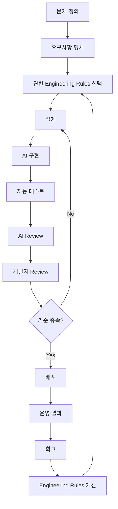
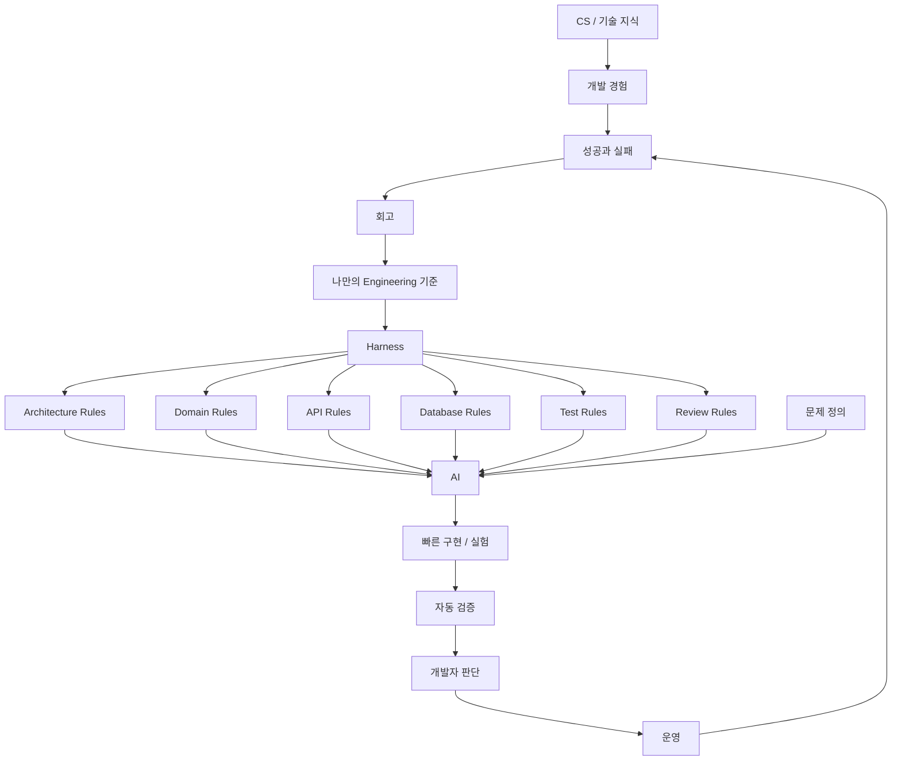

# 흑곰의 AI 시대에서 개발자로 살아남는 법
[https://youtu.be/C11Mk7S_x5U?si=VB2a2NlvLpHgmPY7](https://youtu.be/C11Mk7S_x5U?si=VB2a2NlvLpHgmPY7)

# 흑곰의 AI 시대에서 개발자로 살아남는 법
* toc
{:toc}

---

## AI 시대에서 개발자로 살아남는 법: 코드를 만드는 사람에서 기준을 만드는 사람으로

AI가 코드를 작성하는 속도는 사람이 따라가기 어렵다.

REST API 하나를 만들어달라고 요청하면 Controller부터 Service, Repository까지 빠르게 생성한다.

```text
요구사항 입력

↓

Controller 생성

↓

Service 생성

↓

Repository 생성

↓

Test 생성
```

SQL도 작성한다.

테스트 코드도 만든다.

리팩터링도 한다.

문서도 작성한다.

기존 코드를 분석해 새로운 기능까지 추가한다.

이런 모습을 보면 자연스럽게 한 가지 질문이 생긴다.

```text
AI가 이렇게까지 코드를 잘 작성한다면

개발자는 앞으로 무엇을 해야 할까?
```

특히 개발자로 성장하는 과정에 있다면 더 불안하게 느껴질 수 있다.

하지만 질문을 조금 바꿔볼 필요가 있다.

```text
AI가 코드를 작성할 수 있는가?
```

가 아니라

```text
소프트웨어 개발에서
코드를 작성하는 것이 전부인가?
```

라는 질문이다.

AI 시대에는 오히려 이 차이가 더욱 중요해질 수 있다.

---

## 개발자는 코드를 작성하는 사람일까?

개발자를 가장 단순하게 정의하면 다음과 같이 생각할 수 있다.

```text
코드를 작성하는 사람
```

물론 틀린 말은 아니다.

하지만 실제 개발 업무를 조금만 깊게 들여다보면 코드를 작성하기 전에 훨씬 많은 판단이 존재한다.

예를 들어 새로운 결제 기능을 개발한다고 하자.

개발자는 바로 코드를 작성하지 않는다.

먼저 질문한다.

```text
왜 이 기능이 필요한가?

기존 결제 구조에 추가해야 하는가?

새로운 모듈로 분리해야 하는가?

동기 처리가 적절한가?

비동기 처리가 적절한가?

실패하면 어떻게 복구할 것인가?

중복 요청은 어떻게 막을 것인가?

트랜잭션 범위는 어디까지인가?

어떤 데이터를 저장해야 하는가?

어떤 데이터를 저장하면 안 되는가?
```

이 질문에 대한 답이 어느 정도 정리되고 나서야 코드가 등장한다.

즉 실제 개발은 다음에 더 가깝다.

```text
문제 발견

↓

문제 정의

↓

제약조건 파악

↓

대안 탐색

↓

기준 설정

↓

선택

↓

구현

↓

검증

↓

운영

↓

개선
```

코드 작성은 이 긴 과정 중 하나다.

---

## AI가 가장 빠르게 바꾸고 있는 영역은 생산이다

AI가 특히 강점을 보이는 영역 중 하나는 결과물을 빠르게 생성하는 것이다.

```text
코드 생성

문서 작성

번역

이미지 생성

반복적인 수정

기존 패턴을 활용한 구현
```

소프트웨어 개발에서도 마찬가지다.

예를 들어 다음과 같은 요구사항이 있다고 하자.

```text
회원 조회 API를 만들어줘.
```

AI에게 프로젝트 구조를 충분히 제공하면 다음과 같은 코드를 빠르게 생성할 수 있다.

```java
@GetMapping("/members/{id}")
public MemberResponse findMember(
        @PathVariable Long id
) {
    return memberService.findMember(id);
}
```

Service도 만들 수 있다.

```java
@Transactional(readOnly = true)
public MemberResponse findMember(Long id) {
    Member member = memberRepository.findById(id)
            .orElseThrow(MemberNotFoundException::new);

    return MemberResponse.from(member);
}
```

테스트도 추가할 수 있다.

이처럼 **구현이라는 생산 과정의 비용이 빠르게 낮아지고 있다.**

그렇다면 구현 비용이 낮아질수록 무엇의 가치가 올라갈까?

바로

```text
무엇을 구현할 것인가

왜 그렇게 구현할 것인가

어떤 구현이 좋은 구현인가
```

를 판단하는 능력이다.

---

## 코더와 개발자의 차이

AI 시대를 이해하는 하나의 관점으로 코더와 개발자를 구분해볼 수 있다.

물론 실제 직무를 엄격하게 둘로 나누자는 의미는 아니다.

사고방식의 차이를 설명하기 위한 구분이다.

코더를 다음과 같이 정의해보자.

```text
주어진 요구사항을
코드로 빠르게 구현하는 사람
```

예를 들어 요구사항이 주어진다.

```text
회원가입 API를 만들어주세요.
```

그러면 바로 구현한다.

```text
POST /members
```

DTO를 만든다.

Service를 만든다.

Repository를 만든다.

기능을 완성한다.

이 능력은 여전히 중요하다.

다만 이런 **패턴화된 구현 작업은 AI가 매우 빠르게 수행할 수 있는 영역**이기도 하다.

반면 개발자는 한 단계 위의 질문을 한다.

```text
회원가입은 왜 필요한가?

이메일 중복 정책은 무엇인가?

회원 상태는 어떻게 관리할 것인가?

가입 중 실패하면 어디까지 Rollback할 것인가?

가입 완료 이메일은 Transaction 이후 보내야 하는가?

재가입 정책은 어떻게 되는가?

개인정보 보관 정책은 무엇인가?
```

코드를 작성하기 전에 문제의 구조부터 바라본다.

---

## AI 시대에는 “어떻게 만들까?”보다 “무엇을 왜 만들까?”가 중요해진다

과거에는 구현 난이도 자체가 큰 장벽이었다.

어떤 기능을 만들려면 개발자가 직접 찾아보고 공부하고 구현해야 했다.

하지만 AI가 구현 속도를 크게 높이면 상대적으로 다음 질문들의 중요성이 올라간다.

```text
무엇을 만들 것인가?

왜 만들 것인가?

어디까지 만들 것인가?

무엇은 만들지 않을 것인가?

어떤 기준으로 좋은지 판단할 것인가?
```

예를 들어 AI에게 다음과 같이 요청할 수 있다.

```text
Redis를 이용한 분산 락을 구현해줘.
```

AI는 구현할 수 있다.

하지만 더 중요한 질문은 따로 있다.

```text
정말 분산 락이 필요한가?
```

현재 문제는 단순한 DB 동시성 문제일 수도 있다.

낙관적 락으로 충분할 수도 있다.

Unique Constraint로 해결할 수도 있다.

애초에 요청을 멱등하게 만드는 것이 더 적절할 수도 있다.

AI가 분산 락 코드를 잘 작성한다고 해서 **분산 락을 선택하는 판단 자체가 자동으로 좋은 판단이 되는 것은 아니다.**

---

## AI가 빠르게 답을 만드는 시대에는 질문의 품질이 중요하다

다음 두 요청을 비교해보자.

```text
결제 시스템 만들어줘.
```

그리고

```text
동일한 결제 성공 Webhook이 여러 번 전달될 수 있다.

결제 승인 결과는 반드시 멱등하게 처리해야 한다.

DB 반영 이후 회원 서비스로 이벤트를 전달해야 하며,
이벤트 전달 실패로 결제 데이터가 유실되어서는 안 된다.

외부 API 장애와 메시지 재처리를 고려해
구조를 설계해줘.
```

AI의 능력이 동일하더라도 결과물의 품질은 크게 달라질 수 있다.

두 번째 요청에는 개발자의 사고가 이미 포함되어 있다.

```text
도메인 이해

실패 시나리오

트랜잭션

멱등성

메시지 신뢰성

운영 상황
```

AI 시대에 중요한 능력은 단순히 프롬프트를 길게 작성하는 것이 아니다.

**좋은 질문을 만들 수 있을 정도로 문제를 이해하는 것**이다.

---

## 가장 중요한 능력 중 하나는 메타인지다

메타인지란 자신의 생각과 판단을 다시 바라볼 수 있는 능력으로 이해할 수 있다.

개발에서는 다음 질문으로 나타난다.

```text
왜 이 기술을 선택했는가?

내가 지금 해결하고 있는 문제가 진짜 문제인가?

더 단순한 방법은 없는가?

현재 구조가 과도하지 않은가?

내가 당연하다고 생각하는 전제가 맞는가?

다른 선택지는 무엇인가?

이 결정의 비용은 무엇인가?
```

예를 들어 Kafka를 도입하고 싶다고 하자.

메타인지가 없다면 다음처럼 흐를 수 있다.

```text
대용량 시스템

↓

Kafka가 좋다고 들음

↓

Kafka 도입
```

하지만 한 번 더 질문한다.

```text
왜 Kafka가 필요한가?
```

또 질문한다.

```text
현재 메시지량은 얼마인가?
```

또 질문한다.

```text
메시지 재처리가 필요한가?
```

또 질문한다.

```text
순서 보장이 필요한가?
```

또 질문한다.

```text
현재 팀이 Kafka를 운영할 수 있는가?
```

질문이 반복될수록 기술 이름이 아니라 문제의 본질에 가까워진다.

---

## 기술 선택에는 항상 기준이 필요하다

좋은 개발자는 기술을 많이 아는 사람만을 의미하지 않는다.

어떤 상황에서 무엇을 선택해야 하는지 자신만의 기준을 가진 사람이 중요하다.

예를 들어 메시징 기술을 비교한다고 하자.

```text
Kafka

RabbitMQ

Azure Service Bus

Redis Pub/Sub
```

단순한 지식은 다음과 같다.

```text
Kafka는 빠르다.

RabbitMQ는 메시지 큐다.

Redis도 Pub/Sub을 지원한다.
```

하지만 실제 판단에는 기준이 필요하다.

```text
메시지를 재처리해야 하는가?

메시지 보존이 필요한가?

Consumer가 독립적으로 읽어야 하는가?

처리량은 어느 정도인가?

운영 복잡도를 감당할 수 있는가?

순서 보장은 어느 범위까지 필요한가?

실패 메시지를 어떻게 처리할 것인가?
```

기술을 선택한다는 것은 결국 이런 기준으로 Trade-off를 판단하는 일이다.

---

## AI는 답을 빠르게 만들고 사람은 좋은 답의 기준을 만들어간다

AI를 활용하면 굉장히 빠르게 많은 후보를 얻을 수 있다.

예를 들어 다음을 요청할 수 있다.

```text
이 문제를 해결할 수 있는
아키텍처 5개를 제안해줘.
```

몇 초 안에 여러 대안을 얻을 수 있다.

하지만 그중 무엇을 선택할 것인가는 별개의 문제다.

```text
A 구조

B 구조

C 구조

D 구조

E 구조
```

여기에서 개발자가 해야 할 일은 다음이다.

```text
현재 서비스 규모에는 무엇이 맞는가?

현재 팀의 역량에는 무엇이 맞는가?

3개월 후 요구사항에는 무엇이 유리한가?

장애 복구 관점에서는 어떤 차이가 있는가?

가장 단순한 해결책은 무엇인가?
```

즉 AI가 선택지를 늘려준다면 개발자는 **선택 기준을 더 명확하게 만들어야 한다.**

---

## 자신의 기준은 경험을 통해 만들어진다

개발자의 기준은 책 한 권을 읽었다고 완성되지 않는다.

실제 문제를 해결하면서 만들어진다.

예를 들어 처음에는 다음처럼 생각할 수 있다.

```text
Redis Cache를 사용하면
무조건 성능이 좋아진다.
```

실무에서 Redis를 사용해보면 새로운 문제를 경험한다.

```text
Cache Invalidation

TTL

Cache Stampede

데이터 정합성

Redis 장애

Serialization 비용
```

그러면 기준이 달라진다.

```text
자주 조회되는가?

원본 조회 비용이 충분히 비싼가?

약간의 데이터 지연을 허용할 수 있는가?

Invalidation 전략은 무엇인가?

Redis 장애 시 DB로 우회할 수 있는가?
```

경험이 지식에 기준을 추가한 것이다.

---

## AI를 사용한다고 기본기가 덜 중요해지는 것은 아니다

AI가 코드를 잘 작성하면 다음과 같은 생각을 할 수도 있다.

```text
이제 CS를 깊게 공부할 필요가 있을까?
```

하지만 AI가 작성한 코드를 검증하려면 오히려 기본기가 필요하다.

예를 들어 AI가 다음을 제안했다고 하자.

```text
이 API의 성능 문제를 해결하기 위해
비동기로 변경하겠습니다.
```

그러면 개발자는 질문할 수 있어야 한다.

```text
왜 비동기인가?

Blocking I/O 문제인가?

Thread Pool은 충분한가?

Transaction Context는 어떻게 되는가?

실패를 누가 감지하는가?

재시도는 어디에서 하는가?
```

이를 판단하려면 다음 기본 지식들이 필요하다.

```text
Thread

I/O

Transaction

Database

Network

Concurrency
```

AI가 구현을 대신해줄수록 사람은 오히려 **구현을 검증할 수 있는 원리와 기준**을 가져야 한다.

---

## AI를 단순한 “해줘” 도구로만 사용하면 생기는 문제

AI에게 다음과 같이 요청할 수 있다.

```text
이거 구현해줘.
```

그다음

```text
에러 나는데 고쳐줘.
```

다시

```text
테스트도 만들어줘.
```

다시

```text
리팩터링해줘.
```

결과물은 만들어질 수 있다.

하지만 개발자가 판단 과정에서 빠져버릴 위험이 있다.

```text
AI 생성

↓

AI 수정

↓

AI 리팩터링

↓

AI 테스트
```

이 과정에서 개발자가 설명하지 못한다면 문제가 된다.

```text
왜 이런 구조인가?

왜 이 객체가 필요한가?

왜 이 Transaction 범위인가?

왜 Redis를 사용했는가?

왜 비동기인가?
```

AI가 만든 시스템을 운영하고 책임지는 것은 결국 개발자다.

---

## AI를 페어 프로그래머처럼 활용할 수 있다

반대로 AI를 사고를 확장하는 도구로 사용할 수도 있다.

예를 들어 먼저 자신의 설계를 만든다.

```text
현재 문제

↓

내 설계

↓

근거
```

그리고 AI에게 반박을 요청한다.

```text
이 설계가 실패할 수 있는 상황을 찾아줘.
```

또는

```text
이 구조의 가장 큰 운영 리스크 5개를 찾아줘.
```

또는

```text
반대되는 아키텍처를 제안하고
Trade-off를 비교해줘.
```

이렇게 사용하면 AI는 단순한 코드 생성기가 아니라 사고의 범위를 넓혀주는 도구가 된다.

---

## 결국 중요한 것은 자신만의 기준이다

AI는 아주 많은 답을 만들 수 있다.

하지만 선택지는 많을수록 판단이 어려워진다.

따라서 앞으로 더 중요해질 수 있는 것은

```text
내가 무엇을 중요하게 생각하는가?
```

에 대한 기준이다.

백엔드 개발이라면 예를 들어 다음과 같은 기준을 만들어갈 수 있다.

```text
복잡성보다 단순성을 우선한다.

데이터 정합성이 필요한 구간을 명확히 한다.

외부 시스템 호출에는 실패가 존재한다고 가정한다.

중복 요청이 가능하다면 멱등성을 고려한다.

운영할 수 없는 기술은 쉽게 도입하지 않는다.

측정하지 않은 성능 문제를 추측으로 최적화하지 않는다.

트랜잭션 경계를 비즈니스 원자성과 맞춘다.

장애 상황에서 복구 가능한 구조인지 확인한다.
```

이런 기준이 많아질수록 AI에게도 더 명확한 방향을 줄 수 있다.

---

## 다음 단계는 기준을 AI에게 전달하는 것이다

자신만의 기준을 가지고 있는 것만으로도 중요하다.

하지만 AI를 반복적으로 사용한다면 또 다른 문제가 발생한다.

매번 같은 내용을 설명해야 한다.

```text
Controller에서 Entity를 직접 반환하지 마.

Service에 핵심 비즈니스 규칙을 몰아넣지 마.

Transaction 범위를 명확하게 해.

테스트를 작성해.

예외 상황도 확인해.

N+1 문제를 확인해.
```

매번 긴 프롬프트를 작성해야 한다.

그렇다면 자연스럽게 다음 질문으로 이어진다.

```text
내가 가진 개발 기준을
AI가 항상 참고하게 만들 수 없을까?
```

이 관점에서 Harness Engineering이라는 사고방식을 생각해볼 수 있다.

---

## Harness Engineering이란 무엇인가?

Harness는 원래 무언가를 제어하고 안전하게 다루기 위한 장치를 의미한다.

강한 말을 생각해보자.

말 자체의 힘을 없애는 것이 목적이 아니다.

```text
강력한 힘

↓

Harness

↓

원하는 방향으로 통제
```

AI도 비슷한 관점에서 바라볼 수 있다.

좋은 모델을 사용하는 것만으로 모든 문제가 해결되지는 않는다.

중요한 것은 다음이다.

```text
어떤 Context를 줄 것인가?

어떤 규칙을 따르게 할 것인가?

어떤 순서로 작업하게 할 것인가?

어떤 결과를 검증할 것인가?

잘못되었을 때 어떻게 수정하게 할 것인가?
```

즉 AI가 안정적으로 원하는 방향으로 작업할 수 있는 **환경과 제약, 피드백 구조를 설계하는 것**이다.

---

## 프롬프트 한 줄과 Harness의 차이

단순한 AI 사용은 다음과 같을 수 있다.

```text
주문 API 만들어줘.
```

Harness를 갖춘 환경에서는 훨씬 많은 컨텍스트가 존재할 수 있다.

```text
Architecture Rules

Domain Rules

API Convention

Database Convention

Error Handling Convention

Test Convention

Security Rules

Code Review Checklist
```

AI는 단순한 한 줄의 요청뿐 아니라 이러한 기준 안에서 작업하게 된다.

```text
사용자 요구사항

        ↓

개발 기준 / 규칙

        ↓

AI

        ↓

구현

        ↓

검증 규칙

        ↓

수정
```

이 차이는 매우 크다.

---

## 개인의 개발 철학을 AI가 사용할 수 있는 형태로 만들기

예를 들어 자신에게 다음과 같은 기준이 있다고 하자.

```text
Controller는 HTTP 처리만 담당한다.

Application Service는 Use Case를 조율한다.

Domain Object에 핵심 규칙을 둔다.

Entity를 API Response로 직접 반환하지 않는다.

Transaction 범위는 Use Case 단위로 설정한다.
```

머릿속에만 존재하면 AI는 알 수 없다.

이를 문서화한다.

```text
architecture.md
```

예를 들어 다음처럼 작성할 수 있다.

```text
# Architecture Rules

1. Controller는 HTTP 요청/응답 변환만 담당한다.
2. Business Rule을 Controller에 작성하지 않는다.
3. Entity를 API Response로 직접 반환하지 않는다.
4. 핵심 Domain Rule은 가능한 Domain Object에 위치시킨다.
5. Application Service는 Use Case orchestration을 담당한다.
```

AI에게 항상 이 기준을 참고하도록 하면 단순한 코드 생성보다 훨씬 일관된 결과를 얻을 수 있다.

---

## 백엔드 개발자를 위한 Harness는 어떻게 구성할 수 있을까?

하나의 예로 다음처럼 나눌 수 있다.

```text
AI Harness

├── Architecture
├── Domain
├── API
├── Database
├── Transaction
├── Test
├── Security
└── Code Review
```

각 영역에 자신만의 기준을 저장한다.

---

## Architecture Harness

아키텍처 기준을 정의한다.

```text
의존성 방향을 명확하게 유지한다.

Controller에서 Repository를 직접 호출하지 않는다.

외부 시스템 구현체가 핵심 Domain을 침범하지 않도록 한다.

불필요한 추상화는 추가하지 않는다.

확장 가능성이라는 이유만으로 Interface를 만들지 않는다.
```

그러면 AI가 코드를 작성할 때 프로젝트 전체 구조와 일관성을 유지하도록 유도할 수 있다.

---

## Domain Harness

도메인 규칙에 대한 기준도 만들 수 있다.

```text
Entity의 상태 변경은 의미 있는 Method를 통해 수행한다.

Setter를 통한 무분별한 상태 변경을 피한다.

비즈니스 불변조건은 Domain에서 검증한다.

Value Object로 표현할 수 있는 개념인지 검토한다.
```

예를 들어 AI가 다음 코드를 만들었다고 하자.

```java
order.setStatus(OrderStatus.CANCELED);
```

Domain 기준이 있다면 다음처럼 개선을 요구할 수 있다.

```java
order.cancel();
```

단순한 문법 차이가 아니라 도메인 객체가 자신의 상태 변경 규칙을 책임지게 만드는 것이다.

---

## API Harness

API 설계에도 자신만의 기준이 있을 수 있다.

```text
Entity를 직접 반환하지 않는다.

Request와 Response DTO를 분리한다.

HTTP Status를 의미에 맞게 사용한다.

Validation과 Business Validation을 구분한다.

API Error Format을 통일한다.
```

이 기준을 AI가 알고 있다면 새로운 API를 생성할 때마다 동일한 구조를 반복적으로 설명할 필요가 줄어든다.

---

## Database Harness

데이터베이스에 대해서도 기준을 만들 수 있다.

```text
N+1 가능성을 확인한다.

조회 패턴에 따라 Index를 검토한다.

무조건적인 EAGER Loading을 사용하지 않는다.

대량 조회에서 Entity 전체가 필요한지 확인한다.

Transaction이 너무 길어지지 않는지 확인한다.
```

AI가 Repository 코드를 생성하는 것에서 끝나는 것이 아니라 운영 관점의 질문까지 수행하도록 만들 수 있다.

---

## Test Harness

테스트 역시 AI가 매우 잘 도와줄 수 있는 영역이다.

하지만 단순히

```text
테스트 만들어줘.
```

라고 하는 것보다 기준을 정의할 수 있다.

```text
Happy Path만 테스트하지 않는다.

경계값을 포함한다.

실패 시나리오를 반드시 확인한다.

구현 세부사항보다 Behavior를 검증한다.

불필요하게 Mock에 의존하지 않는다.
```

그 결과 AI의 역할이 달라진다.

```text
코드 생성기

↓

개발 기준을 따르는 실행 도구
```

---

## Code Review Harness

AI에게 코드를 생성시키는 것만큼 강력한 사용법이 리뷰다.

예를 들어 다음 기준을 제공한다.

```text
Transaction Boundary가 적절한가?

동시성 문제가 존재하는가?

중복 요청에 안전한가?

외부 API 실패를 고려했는가?

N+1 가능성이 있는가?

Exception이 의미 있게 처리되는가?

테스트하기 어려운 구조는 없는가?

과도한 추상화는 없는가?
```

그리고 AI에게 요청한다.

```text
위 기준으로 이 변경사항을 리뷰해줘.
```

AI가 단순히 “깔끔한 코드입니다”라고 평가하는 것이 아니라 자신이 정한 기준에 따라 반복적으로 검사하도록 만들 수 있다.

---

## Harness의 핵심은 AI를 더 똑똑하게 만드는 것이 아니다

Harness의 목적을 다음과 같이 오해할 수 있다.

```text
AI의 지능을 높인다.
```

하지만 핵심은 다른 곳에 있다.

```text
AI가 움직일 수 있는
문맥과 방향을 설계한다.
```

같은 AI 모델이라도 제공되는 기준과 환경에 따라 결과는 크게 달라질 수 있다.

```text
AI
+
아무 Context 없음

↓

일반적인 답
```

반면

```text
AI
+
Architecture
+
Domain Rules
+
Project Context
+
Test Rules
+
Review Rules

↓

프로젝트에 더 적합한 결과
```

를 기대할 수 있다.

---

## AI에게 모든 것을 맡기는 것과 Harness를 만드는 것은 반대에 가깝다

겉으로는 둘 다 AI를 많이 사용하는 것처럼 보인다.

하지만 본질적으로는 다르다.

### 모든 것을 맡기는 방식

```text
AI가 판단

↓

AI가 설계

↓

AI가 구현

↓

사람이 그대로 사용
```

### Harness를 활용하는 방식

```text
사람이 기준 정의

↓

사람이 방향 설정

↓

AI가 빠르게 실행

↓

도구와 테스트로 검증

↓

사람이 최종 판단
```

두 번째 방식에서는 AI 사용량이 많아져도 인간의 판단 역할이 사라지지 않는다.

오히려 더 중요해진다.

---

## 개발자의 지식이 Harness의 품질을 결정한다

좋은 Harness를 만들려면 결국 좋은 기준이 필요하다.

좋은 기준을 만들려면 개발자가 알아야 한다.

예를 들어 트랜잭션 기준을 작성하려면 다음을 이해해야 한다.

```text
ACID

Isolation Level

Spring Transaction

Propagation

Lock

Concurrency
```

API 기준을 만들려면 다음을 고민해야 한다.

```text
HTTP

REST

Idempotency

Authentication

Validation
```

데이터베이스 기준을 만들려면 다음 지식이 필요하다.

```text
Index

Execution Plan

Transaction

Lock

Normalization
```

즉 AI 시대에 기본기를 공부하는 이유가 사라지는 것이 아니다.

기본기가 **AI가 따라야 할 기준을 만드는 재료**가 된다.

---

## CS 지식이 판단 기준으로 전환된다

과거에는 CS를 다음과 같이 공부했을 수 있다.

```text
시험에서 답하기 위해

면접에서 답하기 위해
```

AI 시대에는 조금 다른 의미를 가질 수 있다.

예를 들어 Blocking I/O를 이해하면

```text
이 작업을 @Async로 만들면 빨라질까?
```

라는 AI의 제안을 평가할 수 있다.

Transaction을 이해하면

```text
비동기 Thread에서도
기존 Transaction을 그대로 사용하면 됩니다.
```

같은 잘못된 제안을 발견할 수 있다.

JPA 영속성 컨텍스트를 이해하면 AI가 만든 코드에서 예상치 못한 Lazy Loading 문제나 변경 감지 문제를 발견할 수 있다.

즉 CS는 단순 지식이 아니라 **AI 결과물을 검증하는 기준**이 된다.

---

## AI 시대의 개발자는 구현자에서 감독자로만 바뀌는 것도 아니다

개발자가 앞으로 코드 자체를 전혀 작성하지 않아도 된다는 의미는 아니다.

직접 구현할 수 있는 능력은 여전히 중요하다.

직접 구현해본 사람과 그렇지 않은 사람은 AI 결과물을 판단하는 능력에서도 차이가 날 수 있기 때문이다.

더 적절한 변화는 다음과 같이 볼 수 있다.

```text
과거

문제 이해
→ 설계
→ 구현 대부분 직접
→ 검증


AI 시대

문제 이해
→ 설계
→ 기준 정의
→ AI와 구현
→ 검증
→ 수정
→ 운영 피드백
```

구현 비중은 줄어들 수 있지만 판단과 검증의 비중은 오히려 커질 수 있다.

---

## 생산성이 높아질수록 더 많은 실험이 가능하다

AI의 강점은 단순히 같은 기능을 더 빨리 만드는 데만 있지 않다.

기존에는 하나의 접근을 구현하는 데 하루가 걸렸다고 생각해보자.

```text
Approach A

1일
```

그러면 다른 설계를 실험하기 어렵다.

AI를 이용해 구현 비용을 줄이면 다음처럼 비교할 수 있다.

```text
Approach A

Approach B

Approach C
```

각각을 빠르게 Prototype으로 만든다.

Benchmark도 해본다.

Test도 실행한다.

결과를 비교한다.

즉 AI를 사용하면 **생각을 줄이는 것이 아니라 더 많은 가설을 실제로 검증할 수 있게 된다.**

---

## 좋은 개발자는 AI에게 한 번에 정답을 요구하지 않는다

AI에게 다음처럼 요구할 수 있다.

```text
최고의 구조를 만들어줘.
```

하지만 현실에는 항상 Trade-off가 존재한다.

더 좋은 방법은 여러 대안을 얻는 것이다.

```text
이 요구사항을 해결할 수 있는
서로 다른 설계 3개를 제안해줘.

각 설계에 대해

복잡도
성능
운영 비용
장애 대응
확장성

관점으로 비교해줘.
```

그다음 사람이 선택한다.

```text
현재 팀에서는
확장성보다 운영 단순성이 중요하다.

따라서 B를 선택한다.
```

AI는 대안을 생성하고 사람은 컨텍스트에 맞는 결정을 내린다.

---

## AI 시대에는 “왜?”를 설명할 수 있어야 한다

AI가 작성한 코드라도 개발자가 다음 질문에 답할 수 있어야 한다.

```text
왜 이 구조인가?

왜 이 기술인가?

왜 이 Transaction 범위인가?

왜 이 Index인가?

왜 비동기인가?

왜 Cache가 필요한가?

왜 이 테스트가 필요한가?
```

답이

```text
AI가 그렇게 만들어서요.
```

라면 시스템을 실제로 책임지기 어렵다.

반면 다음과 같이 설명할 수 있어야 한다.

```text
조회량이 많고 원본 계산 비용이 높으며
약간의 데이터 지연을 허용할 수 있기 때문에
Cache를 적용했습니다.

장애 시 Cache를 우회할 수 있도록 설계했고
TTL은 데이터 갱신 주기를 기준으로 결정했습니다.
```

이 설명 속에 개발자의 기준이 있다.

---

## AI 시대의 성장은 “기준의 축적”으로 볼 수 있다

주니어와 시니어의 차이도 이런 관점에서 다시 생각할 수 있다.

경험이 적을 때는 많은 선택이 비슷하게 보인다.

```text
Redis?

Kafka?

RabbitMQ?

DB Lock?

Distributed Lock?
```

경험이 쌓이면 조건에 따른 기준이 생긴다.

```text
이 문제라면
Redis가 아니라 DB Constraint면 충분하다.

이 경우는
Kafka보다 단순한 Queue가 적절하다.

현재 규모에서는
분산 락이 과하다.
```

즉 성장한다는 것은 단순히 기술 목록이 늘어나는 것만이 아니다.

```text
지식

↓

경험

↓

실패

↓

회고

↓

기준
```

이 과정을 반복하면서 자신의 판단 체계를 만드는 것이다.

---

## 자신의 기준을 문서화하자

기준을 머릿속에만 가지고 있으면 반복적으로 사용하기 어렵다.

문서화하면 가치가 커진다.

예를 들어 다음과 같은 구조를 만들 수 있다.

```text
engineering/

├── architecture.md
├── api.md
├── database.md
├── transaction.md
├── testing.md
├── security.md
└── review-checklist.md
```

이 문서는 사람도 읽을 수 있고 AI도 참고할 수 있다.

그러면 개인의 경험이 점점 재사용 가능한 시스템으로 변한다.

```text
경험

↓

기준

↓

문서

↓

AI Harness

↓

반복 적용
```

---

## 실패 경험도 Harness에 넣을 수 있다

예를 들어 운영 장애를 경험했다고 하자.

원인은 다음과 같았다.

```text
Database Schema 변경

↓

Application Entity와 불일치

↓

Application Startup 실패
```

단순히 사고를 해결하고 끝낼 수도 있다.

하지만 기준으로 바꿀 수 있다.

```text
DB Schema 변경 시
Application Mapping과 호환성을 확인한다.

Migration과 Application 배포 순서를 검증한다.
```

다음 장애가 있었다.

```text
Cache 데이터 증가

↓

Heap 사용량 증가

↓

OOM
```

그러면 또 하나의 기준이 생긴다.

```text
대량 데이터를 JVM Local Cache에
무기한 적재하지 않는다.

Cache 용량과 Eviction 전략을 명확히 한다.
```

실패 경험이 AI에게도 적용할 수 있는 Engineering Rule로 변한다.

이렇게 하면 자신의 경험이 AI 시대에 오히려 더 큰 자산이 된다.

---

## 개인 Harness는 시간이 지날수록 강력해질 수 있다

처음에는 몇 개의 규칙밖에 없을 수 있다.

```text
10 Rules
```

프로젝트를 경험한다.

```text
30 Rules
```

운영 장애를 경험한다.

```text
50 Rules
```

코드 리뷰를 한다.

```text
80 Rules
```

다른 개발자의 관점을 배운다.

```text
100 Rules
```

중요한 것은 규칙의 숫자 자체가 아니다.

자신이 경험을 통해 얻은 판단 기준이 점점 시스템에 축적된다는 것이다.

---

## AI 시대의 경쟁력은 모델 성능만으로 결정되지 않는다

모두가 비슷한 AI를 사용할 수 있는 환경이 된다면 단순히 좋은 AI를 사용한다는 것 자체는 큰 차별점이 되기 어렵다.

차이를 만드는 것은 다음과 같은 것일 수 있다.

```text
누가 더 좋은 문제를 정의하는가?

누가 더 좋은 Context를 제공하는가?

누가 더 명확한 Engineering 기준을 가지고 있는가?

누가 AI 결과를 더 정확하게 검증하는가?

누가 실패를 학습 시스템에 반영하는가?
```

즉

```text
Model
```

만의 경쟁이 아니라

```text
Model

+

Context

+

Engineering Rules

+

Feedback

+

Human Judgment
```

의 경쟁이 될 수 있다.

---

## Harness Engineering을 개발 프로세스로 확장해보면

AI를 활용한 개발 흐름을 다음처럼 구성할 수도 있다.



핵심은 마지막이다.

```text
운영

↓

경험

↓

기준 개선

↓

다음 AI 작업에 반영
```

개발 경험 자체가 AI를 사용하는 시스템을 계속 발전시킨다.

---

## 실무 관점에서 AI 활용 수준을 단계로 나누어보면

AI 활용을 다음처럼 생각해볼 수 있다.

### 1단계: 검색 대체

```text
이 오류가 왜 발생해?
```

### 2단계: 코드 생성

```text
이 API 구현해줘.
```

### 3단계: 페어 프로그래밍

```text
내 설계를 리뷰해줘.

다른 대안을 제안해줘.
```

### 4단계: Context 기반 개발

```text
이 프로젝트의 Architecture와
Domain 규칙을 참고해서 구현해줘.
```

### 5단계: Harness 기반 개발

```text
설계 기준

구현 기준

테스트 기준

보안 기준

리뷰 기준

운영 기준
```

을 시스템화하고 AI가 이를 반복적으로 따르게 한다.

AI 사용 수준이 높아진다는 것은 단순히 프롬프트 기술이 좋아지는 것이 아니라 **자신의 Engineering 판단을 시스템화하는 것**으로 볼 수 있다.

---

## AI 시대에 개발자가 길러야 할 10가지 능력

### 1. 문제 정의 능력

주어진 요구사항을 그대로 구현하기 전에 진짜 해결해야 하는 문제가 무엇인지 찾는다.

### 2. 질문하는 능력

AI에게 답을 요청하기 전에 문제를 구조화할 수 있어야 한다.

### 3. 기술적 기본기

운영체제, 네트워크, 데이터베이스, 동시성, 트랜잭션 등의 원리를 이해한다.

### 4. Trade-off 판단 능력

모든 기술에는 장단점이 있다는 사실을 이해하고 상황에 따라 선택한다.

### 5. 메타인지

자신의 판단과 전제를 다시 검토한다.

### 6. 검증 능력

AI가 만든 결과를 그대로 신뢰하지 않고 테스트와 근거를 통해 확인한다.

### 7. 시스템 사고

한 메서드가 아니라 전체 데이터 흐름과 장애 상황을 본다.

### 8. 운영 관점

정상 상황뿐 아니라 장애, 재처리, 모니터링, 복구까지 생각한다.

### 9. 기준의 문서화

경험을 개인의 직감으로만 남겨두지 않고 재사용 가능한 규칙으로 만든다.

### 10. AI 활용 구조 설계

자신의 기준을 AI가 반복해서 적용할 수 있도록 Context와 Harness를 구성한다.

---

## 결국 개발자의 역할은 “정답을 많이 아는 사람”에서 달라질 수 있다

AI는 많은 정보를 빠르게 제공한다.

따라서 단순한 지식 검색의 가치만 놓고 보면 과거보다 낮아질 수 있다.

하지만 선택의 문제는 여전히 남는다.

```text
답 A

답 B

답 C

답 D
```

모두 그럴듯하다.

개발자는 여기에서 묻는다.

```text
우리 시스템에는 무엇이 맞는가?
```

그리고 선택한다.

```text
B
```

그 이유를 설명한다.

```text
현재 규모

팀 역량

운영 비용

장애 대응

향후 요구사항
```

그리고 그 선택의 결과까지 책임진다.

이런 능력은 단순 코드 생성과는 다른 영역이다.

---

## AI를 잘 활용하는 개발자는 구현을 포기하는 사람이 아니다

AI가 코드를 작성한다고 개발자가 구현을 몰라도 된다는 의미는 아니다.

오히려 구현을 충분히 이해해야 AI의 결과를 빠르게 검증할 수 있다.

좋은 관계는 다음과 같다.

```text
개발자

문제 정의
설계
기준
판단
검증
책임

        +

AI

검색
생성
반복
비교
수정
자동화
```

서로 잘하는 영역을 결합한다.

---

## 가장 위험한 것은 AI를 사용하는 것이 아니라 판단을 포기하는 것이다

AI를 많이 사용하는 것 자체가 문제는 아니다.

오히려 적극적으로 활용할수록 더 높은 생산성을 얻을 수 있다.

문제는 다음 상태다.

```text
왜 이렇게 구현했는지 모른다.

왜 이 기술을 선택했는지 모른다.

AI가 작성한 코드를 검증할 수 없다.

장애가 발생했을 때 구조를 설명할 수 없다.
```

이 상태에서는 생산 속도는 높아졌지만 시스템을 통제하는 능력은 낮아질 수 있다.

Harness Engineering이라는 관점을 연결하면 목표는 오히려 반대다.

```text
AI의 생산성은 최대한 활용한다.

하지만

방향과 기준은 개발자가 통제한다.
```

---

## 구조

AI 시대의 개발자 역할을 전체적으로 연결하면 다음과 같이 표현할 수 있다.



가장 중요한 부분은 순환 구조다.

```text
학습

↓

경험

↓

기준

↓

AI 활용

↓

결과

↓

운영 경험

↓

더 나은 기준
```

AI를 활용할수록 개발자가 생각하지 않아도 되는 구조가 아니라, **개발자의 경험과 판단이 AI 활용 시스템에 계속 축적되는 구조**를 만드는 것이다.

---

## 정리

AI는 소프트웨어 개발의 생산 방식을 빠르게 변화시키고 있다.

코드 생성, 테스트 작성, 문서화, 리팩터링 같은 많은 작업의 비용이 낮아지고 있다.

이 변화 속에서 다음과 같은 불안이 생길 수 있다.

```text
AI가 코드를 작성한다면
개발자는 필요 없어지는 것 아닐까?
```

하지만 개발을 단순한 코드 생산으로 정의하지 않는다면 다른 관점이 보인다.

소프트웨어 개발에는 구현 이전에도 수많은 판단이 존재한다.

```text
무엇을 만들 것인가?

왜 필요한가?

어떤 구조가 적절한가?

어떤 기술을 선택할 것인가?

어떤 Trade-off를 감수할 것인가?

어떤 실패를 대비할 것인가?
```

AI가 구현을 빠르게 할수록 오히려 이런 판단의 중요성이 커질 수 있다.

따라서 개발자는 단순히 많은 코드를 작성하는 것에서 한 단계 더 나아가 **좋은 구현이 무엇인지 판단할 수 있는 자신만의 기준**을 만들어야 한다.

그 기준은 하루아침에 만들어지지 않는다.

```text
지식

↓

실제 경험

↓

실패

↓

회고

↓

판단 기준
```

이라는 과정을 통해 만들어진다.

그리고 AI 시대에는 여기서 한 단계 더 나아갈 수 있다.

자신의 기준을 문서와 규칙으로 만들고 AI가 반복적으로 그 기준을 따를 수 있도록 구성한다.

```text
Architecture

Domain

API

Database

Transaction

Test

Security

Review
```

등의 Engineering 기준을 체계화하고 AI에게 Context로 제공한다.

이것이 Harness Engineering이라는 관점과 연결된다.

AI의 힘을 줄이는 것이 목적이 아니다.

```text
강력한 AI

↓

개발자의 기준과 Context

↓

방향성이 있는 실행
```

이 구조를 만드는 것이다.

따라서 AI 시대의 경쟁력은 단순히 어떤 AI를 사용하는가만으로 결정되지 않을 수 있다.

더 중요한 질문은 다음과 같다.

```text
나는 어떤 문제를 발견할 수 있는가?

나는 어떤 질문을 할 수 있는가?

나는 어떤 기준으로 기술을 선택하는가?

나는 AI가 만든 결과를 검증할 수 있는가?

나는 경험을 다시 기준으로 만들고 있는가?
```

AI는 매우 빠르게 답을 만들 수 있다.

하지만 많은 답 중 현재 상황에 맞는 답을 선택하려면 기준이 필요하다.

AI는 코드를 빠르게 만들 수 있다.

하지만 어떤 코드를 만들어야 하는지 정의하려면 문제를 이해해야 한다.

AI는 다양한 아키텍처를 제안할 수 있다.

하지만 어떤 Trade-off를 받아들일지는 결국 시스템의 맥락을 이해하는 사람이 판단해야 한다.

그래서 AI 시대의 개발자는 AI와 경쟁하여 더 빠르게 타이핑하는 사람이 될 필요가 없다.

오히려 다음과 같은 개발자가 더 중요해질 수 있다.

```text
문제를 정의하고

기준을 만들고

대안을 비교하고

AI를 활용해 빠르게 실험하고

결과를 검증하고

선택에 책임지는 개발자
```

결국 살아남기 위한 방법은 AI를 피하는 것도, 모든 것을 AI에게 맡기는 것도 아니다.

**자신만의 기술적 기준과 판단력을 키우고, 그 기준을 AI가 반복해서 활용할 수 있는 구조로 만들어 AI의 생산성을 자신의 Engineering 역량으로 전환하는 것**이다.

### 한 줄 요약

**AI 시대에는 단순히 코드를 빠르게 작성하는 능력보다 문제를 정의하고 기술적 판단 기준을 만들며, 그 기준을 Harness로 체계화해 AI가 올바른 방향으로 빠르게 실행하도록 만드는 능력이 개발자의 중요한 경쟁력이 될 수 있다.**
