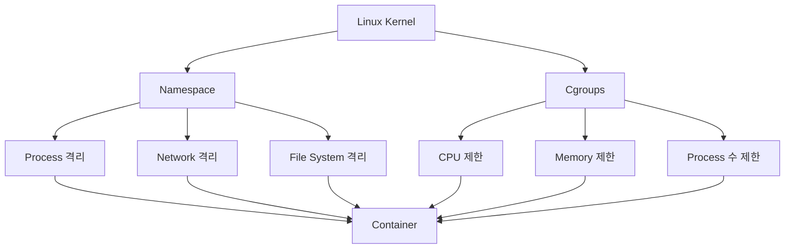
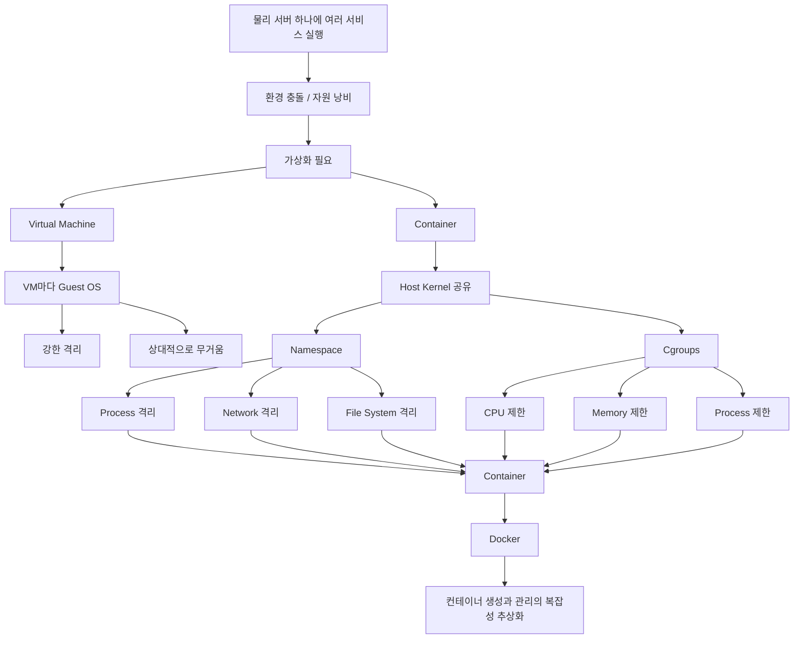

# 아나키의 Docker없이 컨테이너를 만들 수 있을까?
[https://youtu.be/0BIjGgo91nE?si=-Sjrv1akPTnxkKDC](https://youtu.be/0BIjGgo91nE?si=-Sjrv1akPTnxkKDC)

# 아나키의 Docker없이 컨테이너를 만들 수 있을까?
* toc
{:toc}

---

## Docker 없이도 컨테이너를 만들 수 있을까? 컨테이너의 핵심 원리 이해하기

애플리케이션을 서버에 배포하는 데 반드시 Docker가 필요한 것은 아니다.

예를 들어 Spring Boot 애플리케이션이라면 서버에 Java를 설치하고 JAR 파일을 전달한 뒤 직접 실행할 수도 있다.

```bash
java -jar application.jar
```

Shell Script를 이용해 배포 자동화를 구성하는 것도 가능하다.

```bash
#!/bin/bash

pkill -f application.jar

nohup java -jar application.jar > app.log 2>&1 &
```

즉 단순히 애플리케이션을 실행하고 배포하는 것만 생각하면 Docker 없이도 충분히 가능하다.

그런데 실제 서버 환경이나 클라우드 환경에서 배포 이야기를 하면 Docker가 매우 자주 등장한다.

왜일까?

이를 이해하려면 Docker 명령어부터 외우기보다 먼저 다음 질문에 답할 수 있어야 한다.

```text
컨테이너란 무엇인가?

왜 컨테이너가 필요해졌는가?

Docker는 컨테이너를 어떻게 만드는가?

Docker 없이 컨테이너를 만들 수 있는가?
```

이 질문들의 출발점은 **가상화와 격리**다.

---

## 왜 가상화가 필요했을까?

과거에는 하나의 서비스에 하나의 물리 서버를 사용하는 방식이 흔했다.

예를 들어 회사가 다음과 같은 서버를 가지고 있다고 생각해보자.

```text
CPU
8 Core

Memory
16 GB
```

그런데 실제 애플리케이션 하나가 사용하는 자원은 다음 정도라고 하자.

```text
Application A

CPU
2 Core

Memory
4 GB
```

그러면 나머지 자원은 사용되지 않는다.

```text
Server

CPU
8 Core
├── Application A : 2 Core
└── 남은 자원      : 6 Core

Memory
16 GB
├── Application A : 4 GB
└── 남은 자원      : 12 GB
```

서버 한 대를 구매했지만 상당한 자원이 놀고 있는 것이다.

그래서 자연스럽게 다음 생각을 하게 된다.

```text
하나의 서버에서
여러 서비스를 실행하면 되지 않을까?
```

두 번째 서비스를 같은 서버에 배포한다.

그런데 새로운 문제가 발생한다.

---

## 하나의 서버에 여러 서비스를 올리면 충돌할 수 있다

서비스 A가 다음 환경을 필요로 한다고 하자.

```text
Application A

Java 17
MySQL 8
```

서비스 B는 다음 환경을 필요로 한다.

```text
Application B

Java 21
다른 버전의 Database
```

하나의 서버에 여러 애플리케이션을 설치하기 시작하면 각 서비스가 요구하는 Runtime과 Library의 버전이 충돌할 수 있다.

```text
Physical Server

├── Application A
│   └── Java 17
│
└── Application B
    └── Java 21
```

애플리케이션이 많아질수록 운영 환경도 복잡해진다.

```text
Library Version

Runtime Version

Configuration

Port

File System

Process

Dependency
```

서로 다른 서비스들이 하나의 운영체제를 그대로 공유하고 있기 때문이다.

그래서 다음과 같은 요구가 생긴다.

```text
물리 서버 하나를

여러 개의 독립된 서버처럼
사용할 수 없을까?
```

이러한 문제를 해결하기 위해 가상화 기술이 발전했다.

---

## 가상화의 핵심은 격리다

가상화에서 가장 중요한 개념 중 하나는 **격리(Isolation)**다.

격리는 하나의 애플리케이션이 다른 애플리케이션에 영향을 주지 않도록 분리하는 것이다.

예를 들어 다음 두 애플리케이션이 있다고 하자.

```text
Application A

Application B
```

격리가 없다면 두 애플리케이션이 같은 환경을 공유한다.

```text
Application A
        ↓
Shared OS
        ↑
Application B
```

한쪽 애플리케이션의 설정이나 프로세스가 다른 애플리케이션에 영향을 줄 수 있다.

격리가 적용되면 논리적으로 다음과 같은 환경을 만들 수 있다.

```text
Application A
→ 독립된 환경

Application B
→ 독립된 환경
```

실제로 물리 서버는 하나지만 각 애플리케이션 입장에서는 독립된 환경처럼 보이도록 만드는 것이다.

대표적인 방법이 두 가지 있다.

```text
Virtual Machine

Container
```

---

## Virtual Machine이란 무엇인가?

Virtual Machine, 즉 VM은 하나의 물리 서버 위에 여러 개의 가상 서버를 만드는 방식이다.

대표적인 구조는 다음과 같이 이해할 수 있다.

```text
Physical Hardware

↓

Host OS 또는 Hypervisor

↓

Virtual Machine A
├── Guest OS
└── Application A

Virtual Machine B
├── Guest OS
└── Application B
```

각 VM은 자신만의 운영체제를 가진다.

예를 들어 VM A에는 Ubuntu를 설치하고 VM B에는 또 다른 Ubuntu를 설치할 수 있다.

```text
VM A

Ubuntu
Java 17
Application A
```

```text
VM B

Ubuntu
Java 21
Application B
```

두 환경이 독립되어 있기 때문에 서로 다른 Runtime과 Library를 사용할 수 있다.

---

## VM의 장점은 강력한 격리다

VM은 운영체제 수준으로 환경이 분리되어 있다.

각 VM은 독립적인

```text
Operating System

Process

File System

Network

Library
```

환경을 가진다.

따라서 VM A에서 발생한 일이 VM B에 직접적으로 영향을 미치지 않도록 강하게 분리할 수 있다.

이는 매우 강력한 장점이다.

하지만 대가가 있다.

---

## VM은 무겁다

VM을 하나 만들 때마다 Guest OS를 함께 실행해야 한다.

예를 들어 Spring Boot 애플리케이션 하나를 실행한다고 하자.

애플리케이션 자체는 일정한 메모리를 사용한다.

그런데 VM에서는 애플리케이션만 실행되는 것이 아니다.

```text
VM

├── Guest OS
└── Spring Boot Application
```

서비스가 하나라면 Guest OS도 하나다.

서비스가 열 개라면 VM 구조에서는 Guest OS 역시 여러 개가 필요할 수 있다.

```text
VM 1
├── Ubuntu
└── Service 1

VM 2
├── Ubuntu
└── Service 2

VM 3
├── Ubuntu
└── Service 3

...

VM 10
├── Ubuntu
└── Service 10
```

각 Guest OS도 CPU와 Memory를 사용한다.

결국 다음과 같은 고민이 생긴다.

```text
우리가 정말 원하는 것은
운영체제 자체를 여러 개 실행하는 것일까?
```

대부분의 경우 애플리케이션을 분리하기 위해 필요한 것은 더 구체적이다.

```text
Process 격리

File System 격리

Network 격리

Resource 제한
```

운영체제를 통째로 여러 개 실행하지 않아도 이러한 격리를 만들 수 있다면 훨씬 가벼운 방식이 가능하다.

여기에서 컨테이너라는 개념이 등장한다.

---

## 컨테이너란 무엇인가?

컨테이너는 VM처럼 완전히 새로운 Guest OS를 하나씩 실행하는 대신 **하나의 Host OS Kernel을 공유하면서 프로세스를 격리하는 방식**으로 이해할 수 있다.

구조를 비교해보자.

VM은 다음과 같다.

```text
Hardware

↓

Host

├── VM A
│   ├── Guest OS
│   └── Application A
│
└── VM B
    ├── Guest OS
    └── Application B
```

컨테이너는 다음과 같다.

```text
Hardware

↓

Host OS / Linux Kernel

├── Container A
│   └── Application A
│
└── Container B
    └── Application B
```

컨테이너마다 별도의 Kernel을 실행하는 것이 아니다.

Host의 Linux Kernel을 공유한다.

대신 각 프로세스가 독립된 환경에서 실행되는 것처럼 보이도록 격리한다.

---

## VM과 컨테이너의 가장 큰 차이

가장 직관적인 차이는 Guest OS의 존재 여부다.

| 구분       | Virtual Machine | Container          |
| -------- | --------------- | ------------------ |
| Guest OS | VM마다 존재         | 별도 Guest Kernel 없음 |
| Kernel   | 개별 OS 단위        | Host Kernel 공유     |
| 격리 단위    | OS 수준           | Process 중심         |
| 일반적인 특성  | 상대적으로 무거움       | 상대적으로 경량           |
| 시작       | 상대적으로 느림        | 상대적으로 빠름           |

VM은 새로운 컴퓨터 하나를 만드는 것에 가깝다.

Container는 기존 운영체제 위에서 **독립된 환경처럼 보이는 프로세스 공간을 만드는 것**에 더 가깝다.

---

## Docker는 컨테이너 그 자체가 아니다

여기에서 가장 중요한 사실이 나온다.

```text
Docker
≠
Container
```

Docker가 컨테이너라는 기술을 만든 것이 아니다.

컨테이너의 핵심적인 격리와 자원 제어는 Linux Kernel이 제공하는 기능을 기반으로 한다.

Docker는 이러한 기능을 개발자가 쉽게 사용할 수 있도록 추상화하고 조합한 도구라고 볼 수 있다.

따라서 질문에 대한 답은 명확하다.

```text
Docker 없이
컨테이너를 만들 수 있는가?

→ 가능하다.
```

그렇다면 Docker 없이 컨테이너를 만들려면 무엇이 필요한지 살펴보자.

---

## 컨테이너를 만들기 위한 두 가지 핵심 조건

컨테이너를 만들 때 가장 중요한 조건을 크게 두 가지로 정리할 수 있다.

첫 번째는 **격리**다.

```text
Container A가

Container B의

Process
File System
Network

를 마음대로 볼 수 없어야 한다.
```

두 번째는 **자원 제한**이다.

```text
Container A가

CPU와 Memory를
무제한으로 사용할 수 없어야 한다.
```

즉 컨테이너의 핵심을 압축하면 다음과 같다.

```text
Isolation

+

Resource Control
```

Linux에서는 각각을 구현하기 위한 핵심 기능을 제공한다.

대표적으로 다음과 같다.

```text
Namespace

Cgroups
```

---

## Namespace는 격리를 담당한다

Namespace를 직관적으로 설명하면 다음과 같다.

```text
프로세스마다
서로 다른 세상을 보여준다.
```

실제 운영체제는 하나다.

하지만 Container A에서는 자신에게 허용된 것만 보인다.

Container B 역시 자신의 환경만 보인다.

```text
Host

├── Process A
├── Process B
├── Process C
├── Process D
└── Process E
```

Namespace를 적용하면 Container A에서는 다음만 보이게 할 수 있다.

```text
Container A

├── Process A
└── Process B
```

Container B에서는 다른 프로세스만 보이게 할 수 있다.

```text
Container B

├── Process C
└── Process D
```

같은 Kernel 위에서 실행되고 있지만 각각은 자신만의 독립적인 시스템을 가지고 있는 것처럼 느끼게 된다.

---

## Namespace는 하나만 존재하지 않는다

격리해야 하는 대상은 프로세스 하나가 아니다.

컨테이너를 독립적인 환경처럼 만들려면 여러 영역을 분리해야 한다.

Linux에서는 영역별로 다양한 Namespace를 제공한다.

대표적으로 다음과 같은 개념을 생각할 수 있다.

```text
PID Namespace
→ Process 격리

Network Namespace
→ Network 격리

Mount Namespace
→ File System Mount 격리

Hostname 관련 Namespace
→ Host 식별 정보 격리
```

Docker는 이러한 Namespace를 조합한다.

결과적으로 각 컨테이너에서는 다음과 같은 착각을 만들 수 있다.

```text
나는 독립적인 Process Tree를 가지고 있다.

나는 독립적인 Network를 가지고 있다.

나는 독립적인 File System을 가지고 있다.
```

실제로는 하나의 Linux Kernel을 공유하고 있지만 프로세스가 바라보는 환경을 분리하는 것이다.

---

## PID Namespace

PID Namespace는 프로세스 ID 공간을 분리한다.

Host에서 실행되는 프로세스가 다음과 같다고 하자.

```text
Host

PID 1
PID 100
PID 200
PID 300
```

특정 컨테이너에서는 자신에게 속한 프로세스만 볼 수 있도록 만들 수 있다.

```text
Container

PID 1
PID 2
PID 3
```

컨테이너 내부에서는 자신의 첫 번째 프로세스가 PID 1처럼 보일 수도 있다.

하지만 Host에서는 전혀 다른 PID를 가지고 있을 수 있다.

즉 프로세스 ID 공간을 격리하는 것이다.

---

## Network Namespace

Network Namespace는 네트워크 환경을 격리한다.

각 Namespace는 자신의 네트워크 환경을 가질 수 있다.

```text
Network Interface

IP Address

Routing Table

Port
```

이러한 요소를 분리하면 Container A의 네트워크와 Container B의 네트워크가 논리적으로 독립된 것처럼 구성될 수 있다.

```text
Container A

10.0.0.2
```

```text
Container B

10.0.0.3
```

실제 서버는 하나지만 각 컨테이너는 독립적인 네트워크 환경을 가진 것처럼 동작한다.

---

## Mount Namespace

Mount Namespace는 파일 시스템의 Mount 관점을 분리한다.

Host의 파일 시스템이 다음과 같다고 하자.

```text
/
├── bin
├── etc
├── home
├── var
└── application
```

컨테이너에서는 일부 다른 Root File System을 보도록 만들 수 있다.

```text
Container Root

/
├── bin
├── etc
├── app
└── tmp
```

같은 Host OS를 사용하더라도 컨테이너 안에서는 자신에게 필요한 파일만 존재하는 독립된 파일 시스템처럼 보이게 할 수 있다.

---

## pivot_root

파일 시스템 격리를 이해할 때 등장하는 Linux 기능 중 하나가 `pivot_root`다.

개념적으로는 프로세스가 바라보는 Root File System을 바꾸는 데 사용할 수 있는 기능이다.

일반적인 프로세스가 다음 Root를 바라본다고 하자.

```text
Host

/
```

격리된 프로세스에서는 다른 디렉터리를 Root처럼 보도록 구성할 수 있다.

```text
Process

/container-root
        ↓
        /
```

프로세스 입장에서는 자신이 새로운 `/`를 가진 것처럼 보이게 된다.

이를 통해 컨테이너마다 서로 다른 파일 시스템을 가지고 있는 것처럼 환경을 구성할 수 있다.

---

## 컨테이너의 파일 시스템은 왜 중요한가?

다음 두 애플리케이션을 생각해보자.

```text
Application A
Java 17 필요

Application B
Java 21 필요
```

컨테이너가 자신의 독립적인 File System을 가진 것처럼 구성할 수 있다면 각각 필요한 Runtime을 포함할 수 있다.

```text
Container A

/app
/java17
/application-a.jar
```

```text
Container B

/app
/java21
/application-b.jar
```

Host에서는 하나의 Kernel을 공유하면서 애플리케이션 실행 환경은 분리할 수 있다.

이것이 컨테이너를 이용해 서로 다른 실행 환경을 쉽게 관리할 수 있는 이유와 연결된다.

---

## Linux Namespace를 직접 확인할 수 있다

Linux에서는 프로세스가 어떤 Namespace에 속해 있는지 확인할 수 있는 명령이 있다.

대표적으로 `lsns`를 사용할 수 있다.

```bash
lsns -p 1
```

여기에서 `-p 1`은 PID 1 프로세스가 속한 Namespace를 확인한다는 의미다.

실행 환경에 따라 다음과 같은 Namespace 종류를 확인할 수 있다.

```text
NS TYPE
...
   mnt
   pid
   net
   uts
...
```

중요한 것은 특정 출력 값을 외우는 것이 아니다.

이 명령을 통해 하나의 프로세스가 여러 종류의 Namespace에 동시에 속할 수 있다는 사실을 이해하는 것이 핵심이다.

```text
Process

├── PID Namespace
├── Network Namespace
├── Mount Namespace
└── ...
```

컨테이너는 이러한 여러 격리를 조합해 만들어진다.

---

## Namespace만 있으면 컨테이너가 완성될까?

아직 문제가 하나 남아 있다.

두 컨테이너를 완전히 격리했다고 하자.

```text
Container A

Container B
```

그런데 Container A가 무한 루프에 빠져 CPU를 계속 사용한다.

```java
while (true) {
}
```

CPU를 최대한 사용하기 시작한다.

또는 메모리를 계속 사용한다.

```text
Container A

Memory
100 MB
→ 1 GB
→ 5 GB
→ 10 GB
```

같은 Host를 사용하는 Container B가 영향을 받을 수 있다.

즉 **보이지 않도록 격리하는 것만으로는 충분하지 않다.**

자원을 얼마나 사용할 수 있는지도 제한해야 한다.

---

## Cgroups는 자원을 제어한다

Cgroups는 Control Groups를 의미한다.

프로세스 그룹이 사용할 수 있는 시스템 자원을 관리하고 제한하기 위한 Linux 기능이다.

대표적으로 다음과 같은 자원을 제어할 수 있다.

```text
CPU

Memory

Process 수
```

예를 들어 Container A에는 다음 제한을 준다고 생각해보자.

```text
Container A

CPU
2 Core 수준

Memory
1 GB
```

Container B에는 다른 제한을 줄 수 있다.

```text
Container B

CPU
다른 할당량

Memory
2 GB
```

이렇게 하면 하나의 컨테이너가 Host의 모든 자원을 독점하는 것을 방지할 수 있다.

---

## Namespace와 Cgroups의 역할 차이

둘은 자주 함께 등장하지만 역할은 완전히 다르다.

Namespace는 다음 질문에 답한다.

```text
무엇을 볼 수 있는가?
```

Cgroups는 다음 질문에 답한다.

```text
얼마나 사용할 수 있는가?
```

표로 정리하면 다음과 같다.

| 기능        | 역할                       |
| --------- | ------------------------ |
| Namespace | 프로세스, 네트워크, 파일 시스템 등의 격리 |
| Cgroups   | CPU, Memory 등 자원의 사용량 관리 |
| 공통 목적     | 서로 독립적인 실행 환경 구성         |

쉽게 표현하면 다음과 같다.

```text
Namespace
→ 너에게 보여줄 세상

Cgroups
→ 네가 사용할 수 있는 자원
```

이 둘을 함께 사용하면 컨테이너의 핵심적인 특성을 만들 수 있다.

---

## 컨테이너의 핵심 구조

컨테이너를 아주 단순하게 표현하면 다음과 같이 볼 수 있다.



이 구조에서 핵심은 Docker가 등장하지 않아도 Linux Kernel 수준에서 격리와 자원 제한이라는 기반이 이미 존재한다는 것이다.

---

## 그렇다면 Docker는 무엇을 해주는가?

직접 컨테이너를 만든다고 생각해보자.

개발자가 직접 다음 작업을 해야 한다.

```text
Namespace 생성

PID 격리

Network 격리

Mount 격리

Root File System 구성

Cgroups 구성

CPU 제한

Memory 제한

Process 실행

Network 연결
```

이를 매번 직접 처리하면 매우 복잡하다.

Docker는 이러한 복잡한 작업을 개발자가 쉽게 사용할 수 있도록 추상화한다.

개발자는 다음과 같이 실행한다.

```bash
docker run nginx
```

단순한 명령 하나처럼 보이지만 그 아래에서는 격리된 실행 환경을 구성하기 위한 여러 작업이 수행된다.

즉 Docker의 가치는 단순히 프로세스를 실행해주는 것이 아니다.

```text
복잡한 Linux Container 기술

↓

Docker가 추상화

↓

개발자가 쉽게 사용
```

하는 데 있다.

---

## Docker가 제공하는 개발 경험

Docker가 없다면 컨테이너 실행 환경을 직접 구성해야 한다.

Docker를 사용하면 이미지라는 형태로 실행 환경을 정의할 수 있다.

예를 들어 다음과 같다.

```dockerfile
FROM eclipse-temurin:21-jre

COPY application.jar app.jar

ENTRYPOINT ["java", "-jar", "app.jar"]
```

개발자는 이 파일을 통해

```text
Java 21 Runtime

Application JAR

실행 Command
```

를 정의할 수 있다.

그다음 이미지를 생성한다.

```bash
docker build -t my-application .
```

그리고 실행한다.

```bash
docker run my-application
```

내부에서 Linux의 격리 기술을 직접 구성하지 않아도 된다.

---

## Docker의 자원 제한도 결국 Linux 기능과 연결된다

Docker에서는 다음과 같이 메모리 제한을 지정할 수 있다.

```bash
docker run --memory=1g my-application
```

CPU 제한도 설정할 수 있다.

```bash
docker run --cpus=2 my-application
```

개발자가 보는 인터페이스는 Docker 명령어다.

하지만 개념적으로는 아래에서 Linux의 자원 제어 기능과 연결된다.

```text
docker run --memory=1g

↓

Docker

↓

Cgroups

↓

Memory 제한
```

Docker가 새로운 CPU 제한 기술을 만든 것이 아니라 운영체제가 제공하는 기능을 사용하기 편하게 만들어주는 것이다.

---

## Docker 컨테이너도 결국 Host의 Process다

컨테이너를 처음 배우면 내부에 작은 컴퓨터 하나가 실행된다고 생각하기 쉽다.

하지만 Linux Container 관점에서 보면 매우 중요한 사실이 있다.

```text
컨테이너 내부 Application
=
Host Kernel이 관리하는 Process
```

예를 들어 Spring Boot 애플리케이션을 Docker로 실행했다고 하자.

```bash
docker run spring-app
```

컨테이너 내부에서는

```text
java -jar app.jar
```

라는 프로세스가 실행된다.

이 프로세스는 완전히 별개의 Kernel에서 실행되는 것이 아니다.

Host Linux Kernel 위에서 실행되는 프로세스다.

다만 Namespace와 Cgroups 등을 통해 다른 프로세스와 분리되어 있을 뿐이다.

---

## 컨테이너에서 PID 1이 중요한 이유도 여기서 연결된다

컨테이너 내부에서는 실행한 애플리케이션이 PID 1이 될 수 있다.

```text
Container

PID 1
→ java -jar app.jar
```

Host에서 보면 해당 Java Process가 전혀 다른 PID를 가질 수 있다.

```text
Host

PID 48231
→ java -jar app.jar
```

왜 같은 프로세스의 PID가 다르게 보일까?

PID Namespace가 서로 다른 프로세스 ID 공간을 보여주기 때문이다.

이런 현상을 이해하면 컨테이너가 정말로 작은 VM인 것이 아니라 Linux Process 격리 기술 위에 만들어졌다는 사실이 더 명확해진다.

---

## 컨테이너는 VM처럼 완전히 독립된 OS가 아니다

따라서 다음 표현을 구분해서 이해하는 것이 중요하다.

```text
VM
→ 독립된 Guest OS를 가진 가상 머신
```

```text
Container
→ Host Kernel을 공유하는 격리된 Process 환경
```

이 차이 때문에 컨테이너는 일반적으로 VM보다 가볍게 실행될 수 있다.

새로운 OS 전체를 부팅할 필요가 없기 때문이다.

---

## 컨테이너 이미지에는 운영체제가 들어있는 것처럼 보이는데?

Docker Image를 살펴보면 다음과 같은 이미지를 자주 사용한다.

```dockerfile
FROM ubuntu
```

그래서 다음과 같은 의문이 생길 수 있다.

```text
컨테이너도 Ubuntu를 가지고 있는데
Guest OS가 있는 것 아닌가?
```

여기서 Kernel과 User Space를 구분해야 한다.

컨테이너 이미지에는 Ubuntu 환경에서 사용하는 여러 User Space 파일과 도구가 포함될 수 있다.

```text
/bin

/etc

/usr

Library

Command
```

하지만 Host와 별도의 Linux Kernel 하나가 새롭게 부팅되는 것은 아니다.

개념적으로 다음과 같다.

```text
Container

Ubuntu User Space
        ↓
Host Linux Kernel
```

VM은 다르다.

```text
Virtual Machine

Ubuntu User Space
        ↓
Ubuntu Kernel
        ↓
Virtual Hardware
```

이 차이를 이해하면 컨테이너 Image의 `ubuntu`, `alpine` 같은 이름 때문에 생기는 혼란도 줄어든다.

---

## Docker 없이 직접 컨테이너를 만든다면?

핵심 원리만 극단적으로 단순화하면 다음과 같은 작업을 해야 한다.

```text
1. Process를 생성한다.

2. Namespace를 적용한다.

3. 독립된 File System을 보게 한다.

4. Network를 분리한다.

5. Cgroups로 Resource를 제한한다.

6. 격리된 환경에서 Application을 실행한다.
```

결국 Container Runtime이 해주는 일의 상당 부분은 이런 운영체제 기능을 적절하게 조합하고 관리하는 것이다.

따라서 Docker가 없어도 이론적으로 Linux 기능을 직접 사용하면 컨테이너와 비슷한 격리 환경을 만들 수 있다.

하지만 직접 만드는 것이 매우 번거롭기 때문에 Docker와 같은 도구가 사용된다.

---

## Docker와 Container Runtime

Docker를 이해할 때 한 단계 더 추상적으로 보면 다음과 같은 구조를 생각할 수 있다.

```text
Developer

↓

Docker Interface

↓

Container 관련 Runtime 기능

↓

Linux Kernel

↓

Namespace / Cgroups / File System
```

개발자는 복잡한 Kernel API를 직접 다루지 않는다.

Docker가 친숙한 명령과 이미지 기반의 개발 경험을 제공한다.

```text
docker build

docker pull

docker run

docker stop
```

결국 Docker는 Linux Container 기술을 개발자가 실용적으로 사용할 수 있게 만든 생태계와 도구라고 볼 수 있다.

---

## 컨테이너를 알면 Docker 명령어가 다르게 보인다

다음 명령을 보자.

```bash
docker run nginx
```

컨테이너 원리를 모르면 다음과 같이 생각할 수 있다.

```text
Docker가
nginx라는 작은 VM을 만들었다.
```

하지만 컨테이너 구조를 이해하면 다르게 보인다.

```text
Host Kernel 위에서

nginx Process를 실행하고

Namespace로 환경을 격리하고

필요한 File System을 제공하고

Cgroups를 통해 자원을 제어할 수 있는

독립적인 실행 환경을 구성한다.
```

같은 명령인데 이해 수준이 완전히 달라진다.

---

## 왜 컨테이너는 빠르게 시작할 수 있을까?

VM을 시작하면 일반적으로 Guest OS 자체를 시작해야 한다.

```text
VM 시작

↓

Guest Kernel 시작

↓

OS 초기화

↓

Service 시작

↓

Application 시작
```

컨테이너는 Host Kernel을 이미 사용하고 있다.

따라서 대략적인 관점에서는 다음과 같다.

```text
Container 시작

↓

격리된 Process 환경 준비

↓

Application Process 실행
```

새로운 운영체제를 부팅하는 과정이 없기 때문에 상대적으로 빠르게 시작할 수 있다.

---

## 백엔드 개발에서 컨테이너가 유용한 이유

백엔드 애플리케이션에는 실행을 위해 다양한 환경이 필요하다.

예를 들어 다음과 같다.

```text
Spring Boot

Java 21

MySQL 8

Redis

Kafka
```

Docker가 없다면 개발자가 각각 직접 설치해야 할 수 있다.

```text
Java 설치

MySQL 설치

Redis 설치

Kafka 설치

환경 설정
```

팀원마다 환경이 달라질 수도 있다.

Docker를 이용하면 각 서비스를 격리된 환경으로 실행할 수 있다.

```text
Container

Spring Boot
```

```text
Container

MySQL
```

```text
Container

Redis
```

실행 환경을 일정하게 관리하기가 쉬워진다.

---

## 개발 환경 차이를 줄이는 효과

한 개발자는 Mac을 사용한다.

다른 개발자는 Linux를 사용한다.

또 다른 개발자는 Windows를 사용한다고 하자.

직접 설치 방식에서는 각 환경마다 설정 차이가 발생할 수 있다.

```text
Developer A

MySQL 8.0.33
```

```text
Developer B

MySQL 8.0.36
```

```text
Production

MySQL 8.0.x
```

컨테이너 이미지를 기준으로 실행 환경을 정의하면 같은 실행 환경을 공유하기 쉬워진다.

```text
Same Image

↓

Developer A

Developer B

CI

Server
```

이것이 Docker가 단순한 배포 도구를 넘어 개발 환경에서도 많이 사용되는 이유다.

---

## 하지만 컨테이너가 완전히 독립된 물리 서버인 것은 아니다

컨테이너는 Host Kernel을 공유한다.

따라서

```text
Container A

Container B
```

가 완전히 다른 물리 서버처럼 존재하는 것은 아니다.

실제로는

```text
같은 Host

같은 Kernel

다른 격리 환경
```

이다.

그래서 컨테이너 환경을 설계할 때도 Host Resource 자체를 고려해야 한다.

예를 들어 Host가 Memory 8GB인데

```text
Container A
Memory 6GB

Container B
Memory 6GB
```

를 기대한다면 실제 물리 자원보다 많은 요구를 하고 있는 것이다.

컨테이너가 가상화되어 보인다고 물리적인 자원이 무한해지는 것은 아니다.

---

## Namespace와 Cgroups만 알면 Docker를 전부 안 것일까?

그렇지는 않다.

실제 Docker와 현대적인 컨테이너 생태계에는 더 많은 요소가 존재한다.

예를 들면 다음과 같다.

```text
Container Image

Layer

Registry

Networking

Volume

Runtime

Lifecycle Management
```

하지만 컨테이너의 기반 원리를 이해하는 첫 단계에서는 두 가지를 가장 먼저 기억하는 것이 좋다.

```text
Namespace
→ Isolation

Cgroups
→ Resource Control
```

이 두 가지가 컨테이너가 왜 VM과 다른지 이해하는 출발점이 된다.

---

## Docker와 컨테이너를 혼동하지 말자

흔히 다음 표현을 사용한다.

```text
Docker Container
```

그러다 보니 Docker와 Container를 같은 개념처럼 생각하기 쉽다.

하지만 관계를 정확하게 표현하면 다음에 가깝다.

```text
Linux Kernel

↓

Container를 가능하게 하는 기능

↓

Docker

↓

개발자가 쉽게 컨테이너를 생성하고 관리
```

즉 Docker는 컨테이너 기술의 사용자 경험을 크게 개선한 도구다.

---

## Docker 말고도 컨테이너를 다루는 도구가 존재할 수 있다

컨테이너의 핵심이 Docker 자체가 아니라 Linux Kernel 기능이라면 자연스럽게 다음 결론이 나온다.

```text
Docker만이
컨테이너를 만들 수 있는 것은 아니다.
```

컨테이너를 실행하고 관리할 수 있도록 Linux 기능을 조합해주는 다른 도구들도 존재할 수 있다.

따라서 개념적으로는 다음과 같이 이해하는 것이 좋다.

```text
Container
→ 기술적인 실행 방식

Docker
→ Container를 편리하게 사용하는 도구
```

이 구분이 중요하다.

---

## 구조

전체 흐름을 하나의 구조로 연결해보자.



Docker가 컨테이너 자체를 발명해서 실행하는 구조라기보다 Linux Kernel이 제공하는 기능을 기반으로 컨테이너 환경을 편리하게 구성해주는 도구라는 점을 확인할 수 있다.

---

## 실무에서의 활용

Spring Boot 서버를 배포한다고 생각해보자.

Docker 없이도 충분히 실행할 수 있다.

```text
EC2

↓

Java 설치

↓

JAR 업로드

↓

java -jar
```

이 방식도 정상적인 배포다.

하지만 서비스가 늘어나면 문제가 복잡해질 수 있다.

```text
Service A
Java 17

Service B
Java 21

Service C
다른 Library

Redis

MySQL

Monitoring Agent
```

하나의 서버에서 모든 환경을 직접 관리해야 한다.

컨테이너를 사용하면 각 서비스의 실행 환경을 독립적으로 정의할 수 있다.

```text
Container A
→ Java 17 + Service A

Container B
→ Java 21 + Service B

Container C
→ Redis
```

그리고 Docker는 이 환경을 만들고 실행하는 복잡성을 줄여준다.

따라서 Docker의 본질적인 가치를 다음처럼 이해할 수 있다.

```text
Docker를 사용해야
배포할 수 있다.
```

가 아니라

```text
격리된 애플리케이션 실행 환경을
쉽게 만들고 반복해서 사용할 수 있다.
```

에 더 가깝다.

---

## 컨테이너를 이해할 때 기억해야 할 10가지

### 1. Docker 없이도 애플리케이션을 배포할 수 있다

JAR 파일을 직접 실행하는 것도 정상적인 배포 방식이다.

### 2. Docker 없이도 컨테이너 개념을 구현할 수 있다

컨테이너의 기반은 Linux Kernel 기능과 연결된다.

### 3. 가상화의 핵심 목적 중 하나는 격리다

한 애플리케이션의 실행 환경이 다른 애플리케이션에 미치는 영향을 줄인다.

### 4. VM은 Guest OS를 가진다

각 VM은 독립된 운영체제 환경을 구성한다.

### 5. 컨테이너는 Host Kernel을 공유한다

별도의 Guest Kernel을 컨테이너마다 실행하는 방식과 다르다.

### 6. Namespace는 격리를 담당한다

Process, Network, Mount 등 서로 다른 영역을 분리할 수 있다.

### 7. Cgroups는 자원을 관리한다

CPU와 Memory 등의 사용량을 제한하고 관리할 수 있다.

### 8. 컨테이너 내부 프로세스도 결국 Host Kernel 위에서 실행된다

완전히 별개의 물리 컴퓨터가 생기는 것이 아니다.

### 9. Docker는 Linux Container 기능을 사용하기 쉽게 만든다

복잡한 격리와 실행 환경 구성을 높은 수준의 인터페이스로 제공한다.

### 10. Docker와 Container는 같은 개념이 아니다

```text
Container
→ 격리된 Process 실행 환경

Docker
→ Container를 생성하고 관리하기 쉽게 만드는 도구
```

로 구분해서 이해하는 것이 중요하다.

---

## 정리

하나의 물리 서버에 하나의 서비스만 실행하면 남는 자원이 낭비될 수 있다.

```text
Physical Server

CPU 8 Core
Memory 16GB

↓

Application

CPU 2 Core
Memory 4GB
```

그래서 하나의 서버에 여러 애플리케이션을 실행하려고 하면 이번에는 실행 환경 충돌 문제가 발생할 수 있다.

```text
Application A
→ Java 17

Application B
→ Java 21
```

이러한 환경을 독립적으로 분리하기 위해 가상화 기술이 사용된다.

대표적인 방식으로 VM과 Container가 있다.

VM은 각 가상 머신이 독립적인 Guest OS를 가진다.

```text
VM A
├── Guest OS
└── Application A

VM B
├── Guest OS
└── Application B
```

강력한 격리를 제공하지만 각 VM마다 운영체제를 실행해야 한다.

컨테이너는 다른 방식으로 접근한다.

```text
Host Linux Kernel

├── Container A
│   └── Application A
│
└── Container B
    └── Application B
```

Host Kernel을 공유하면서 프로세스 실행 환경을 격리한다.

이를 가능하게 하는 핵심 Linux 기능 중 하나가 Namespace다.

```text
PID Namespace
→ Process 격리

Network Namespace
→ Network 격리

Mount Namespace
→ File System 격리
```

하지만 격리만으로 충분하지 않다.

하나의 컨테이너가 CPU와 Memory를 독점하면 다른 컨테이너가 영향을 받을 수 있기 때문이다.

그래서 Cgroups를 이용해 자원 사용량을 제어한다.

```text
Namespace

→ 무엇을 볼 수 있는가?


Cgroups

→ 얼마나 사용할 수 있는가?
```

이 두 개념을 결합하면 컨테이너의 핵심적인 모습을 이해할 수 있다.

```text
Container

=

Isolation

+

Resource Control
```

그리고 Docker는 이러한 Linux 기능을 개발자가 직접 하나하나 구성하지 않아도 되도록 편리한 인터페이스와 실행 환경을 제공한다.

그래서

```bash
docker run nginx
```

이라는 단순한 명령 뒤에는

```text
Process 실행

Namespace 구성

File System 준비

Network 격리

Resource 관리
```

와 같은 복잡한 컨테이너 관련 작업이 숨어 있다.

결국 Docker를 이해할 때 가장 중요한 것은 명령어를 얼마나 많이 외우고 있는지가 아니다.

```text
docker build

docker run

docker stop
```

보다 먼저

```text
Docker가 없으면
무엇을 직접 해야 하는가?
```

를 이해하는 것이다.

그 질문에 답할 수 있으면 Docker의 역할도 명확해진다.

**컨테이너는 Linux Kernel의 격리와 자원 관리 기능을 이용해 프로세스를 독립된 서버처럼 실행하는 기술이고, Docker는 그 복잡한 기술을 개발자가 쉽게 생성하고 실행하고 관리할 수 있도록 추상화한 도구다.**

### 한 줄 요약

**Docker가 컨테이너를 만들어낸 것은 아니며, 컨테이너의 핵심은 Linux의 Namespace를 이용한 격리와 Cgroups를 이용한 자원 제어이고, Docker는 이러한 기능을 조합해 컨테이너를 손쉽게 생성하고 관리할 수 있도록 해주는 도구다.**
