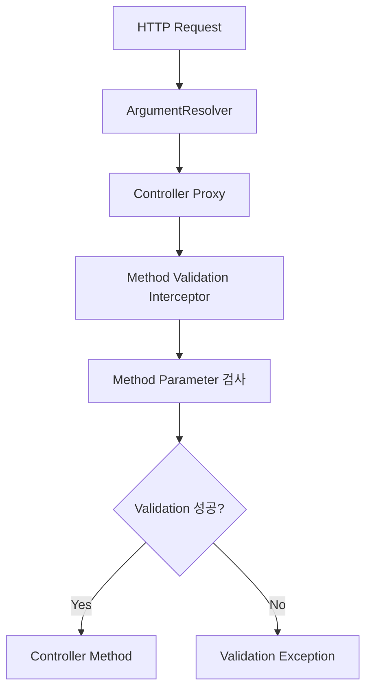

# 캐모의 왜 내 @Pattern은 동작하지 않을까?
[https://youtu.be/lAdxB-Hn1c8?si=eFawbJKwjLmdBG1-](https://youtu.be/lAdxB-Hn1c8?si=eFawbJKwjLmdBG1-)
# 캐모의 왜 내 @Pattern은 동작하지 않을까?
* toc
{:toc}

---

## 왜 내 @Pattern은 동작하지 않았을까? Spring Validation 동작 원리

Spring Boot로 REST API를 개발하다 보면 Bean Validation을 자연스럽게 사용하게 된다.

예를 들어 회원가입 요청 DTO가 있다고 하자.

```java
public record MemberCreateRequest(

        @NotBlank
        String name,

        @Pattern(regexp = "\\d{4}-\\d{2}-\\d{2}")
        String birthDate

) {
}
```

Controller에서는 다음과 같이 `@Valid`를 붙인다.

```java
@PostMapping("/members")
public void createMember(
        @Valid @RequestBody MemberCreateRequest request
) {
}
```

잘못된 값을 전달하면 기대한 대로 검증 오류가 발생한다.

그런데 이번에는 조회 API를 만든다고 해보자.

특정 날짜의 예약 목록을 조회하기 위해 Query Parameter를 받는다.

```java
@GetMapping("/reservations")
public List<ReservationResponse> findReservations(
        @RequestParam
        @Pattern(regexp = "\\d{4}-\\d{2}-\\d{2}")
        String date
) {
    return reservationService.findByDate(date);
}
```

당연히 다음처럼 잘못된 값을 전달하면 검증 오류가 발생할 것처럼 보인다.

```text
GET /reservations?date=hello
```

하지만 환경이나 Spring 버전에 따라 예상과 다른 결과를 경험할 수 있다.

여기서 중요한 질문은 단순히

```text
@Pattern을 제대로 붙였는가?
```

가 아니다.

더 근본적인 질문이 필요하다.

```text
누가 @Pattern을 발견하고

실제 Validator를 실행하는가?
```

Spring Validation을 이해할 때 가장 중요한 관점이 바로 이것이다.

---

## 애너테이션 자체는 검증을 수행하지 않는다

먼저 `@Pattern`을 살펴보자.

Bean Validation의 Constraint Annotation은 개념적으로 다음과 같은 구조를 가진다.

```java
@Constraint(validatedBy = PatternValidator.class)
public @interface Pattern {

    String regexp();

    String message() default "...";
}
```

여기서 중요한 부분은 다음이다.

```java
@Constraint(
    validatedBy = PatternValidator.class
)
```

`@Pattern` 자체가 정규식을 실행하는 것은 아니다.

애너테이션은

```text
이 값에는
Pattern 검증이 필요하다.
```

라는 메타데이터를 제공한다.

실제 검증은 Validator 구현체가 담당한다.

개념적으로는 다음과 같다.

```text
@Pattern

↓

PatternValidator

↓

isValid()

↓

true / false
```

즉 다음 두 가지는 서로 다르다.

```text
검증 규칙을 선언하는 것

VS

검증 규칙을 실행하는 것
```

`@Pattern`은 규칙을 선언한다.

하지만 누군가는 반드시 그 규칙을 읽고 Validator를 호출해야 한다.

---

## 핵심 질문: Validator는 누가 호출할까?

예를 들어 다음 DTO가 있다고 하자.

```java
public record ReservationRequest(

        @NotBlank
        String name,

        @Pattern(regexp = "\\d{4}-\\d{2}-\\d{2}")
        String date

) {
}
```

아무리 Annotation이 붙어 있어도 객체를 직접 생성하기만 한다면 자동으로 검증되는 것은 아니다.

```java
ReservationRequest request =
        new ReservationRequest(
                "",
                "hello"
        );
```

이 순간 Java가 자동으로 다음을 실행하지 않는다.

```text
@NotBlank 검사

@Pattern 검사

ValidationException 발생
```

Constraint Annotation은 선언되어 있을 뿐이다.

검증이 동작하려면 Validator를 호출하는 **실행 주체**, 즉 Trigger가 필요하다.

그래서 Validation 문제를 디버깅할 때는 다음 순서로 생각하는 것이 좋다.

```text
1. 어떤 Constraint가 선언되어 있는가?

2. 누가 그 Constraint를 발견하는가?

3. 누가 Validator를 호출하는가?

4. 어느 시점에 호출되는가?

5. 실패하면 어떤 Exception을 발생시키는가?
```

---

## @RequestBody 검증은 왜 자연스럽게 동작할까?

먼저 우리가 가장 익숙한 `@RequestBody`를 살펴보자.

```java
@PostMapping("/reservations")
public void reserve(
        @Valid
        @RequestBody
        ReservationRequest request
) {
}
```

HTTP 요청이 들어오면 Spring MVC는 Controller Method를 바로 실행하지 않는다.

먼저 요청 데이터를 Controller Method Parameter로 만들어야 한다.

전체 흐름을 단순화하면 다음과 같다.

```text
HTTP Request

↓

DispatcherServlet

↓

HandlerAdapter

↓

ArgumentResolver

↓

Controller Method
```

`@RequestBody`의 경우 HTTP Body를 Java 객체로 변환하는 과정이 필요하다.

예를 들어 클라이언트가 다음 JSON을 보냈다고 하자.

```json
{
  "name": "조윤식",
  "date": "2026-09-17"
}
```

Spring은 이를 다음 객체로 변환해야 한다.

```java
ReservationRequest
```

이 과정에서 `HttpMessageConverter` 등이 사용된다.

그리고 `@Valid` 또는 `@Validated`가 붙어 있다면 객체에 대한 Bean Validation도 수행된다. 현재 Spring 공식 문서에서도 `@RequestBody`와 `@Valid` 또는 `@Validated`를 함께 사용하면 Bean Validation이 적용되고, 일반적인 객체 단위 검증 실패는 `MethodArgumentNotValidException`으로 연결된다고 설명한다.

---

## @RequestBody의 검증 흐름

개념적으로 다음과 같이 이해할 수 있다.

```mermaid
flowchart TD
    A[HTTP Request] --> B[DispatcherServlet]
    B --> C[HandlerAdapter]
    C --> D[RequestBody Argument Resolver]
    D --> E[HttpMessageConverter]
    E --> F[Request DTO 생성]
    F --> G{@Valid / @Validated?}
    G -->|Yes| H[Validator 실행]
    G -->|No| J[Controller 실행]
    H --> I{검증 성공?}
    I -->|Yes| J
    I -->|No| K[Validation Exception]
```

즉 중요한 것은

```text
@RequestBody라서 검증된다.
```

보다

```text
@RequestBody 처리 과정 안에
Validation을 실행하는 흐름이 존재한다.
```

라고 이해하는 것이다.

---

## @Valid의 역할

여기서 `@Valid`의 역할도 정확하게 이해할 필요가 있다.

`@Valid` 자체도 검증 로직을 가지고 있는 것은 아니다.

```java
@Valid
@RequestBody ReservationRequest request
```

는 Spring에게 다음과 같은 신호를 준다.

```text
이 객체를 바인딩한 다음
Bean Validation을 수행해야 한다.
```

결국

```text
@Valid
→ Trigger 역할

@NotBlank / @Pattern
→ Constraint 역할
```

이라는 차이가 있다.

---

## 그런데 @RequestParam은 무엇이 다를까?

이번에는 Query Parameter다.

```java
@GetMapping("/reservations")
public List<ReservationResponse> find(
        @RequestParam
        @Pattern(regexp = "\\d{4}-\\d{2}-\\d{2}")
        String date
) {
    return reservationService.findByDate(date);
}
```

`@RequestParam`의 역할은 HTTP 요청의 Parameter 값을 Controller Method Parameter에 연결하는 것이다.

예를 들어

```text
GET /reservations?date=2026-09-17
```

라는 요청이 들어오면

```java
String date
```

에

```text
2026-09-17
```

을 전달한다.

이 과정은 `@RequestBody` 객체를 만드는 과정과 구조가 다르다.

---

## ArgumentResolver도 종류가 다르다

Spring MVC에서는 Parameter의 종류에 따라 다른 ArgumentResolver가 사용된다.

개념적으로 보면 다음과 같다.

```text
@RequestBody
→ Request Body 처리용 Resolver

@RequestParam
→ Named Value 처리용 Resolver

@PathVariable
→ Path Variable 처리용 Resolver
```

각 Resolver의 책임도 다르다.

`@RequestParam` 처리에서는 기본적으로

```text
Parameter 값 찾기

↓

필요한 타입으로 변환

↓

Method Argument 생성
```

같은 역할이 중요하다.

따라서 DTO를 역직렬화하고 그 객체 자체를 검증하는 `@RequestBody`의 흐름과 동일하게 생각하면 안 된다.

---

## DTO 검증과 Method Parameter 검증은 다른 문제다

두 코드를 비교해보자.

### Request DTO

```java
@PostMapping
public void create(
        @Valid
        @RequestBody ReservationRequest request
) {
}
```

검증 대상은 `ReservationRequest` 객체다.

```text
ReservationRequest

├── name
│   └── @NotBlank
│
└── date
    └── @Pattern
```

반면 다음 코드는 다르다.

```java
@GetMapping
public void find(
        @RequestParam
        @Pattern(regexp = "\\d{4}-\\d{2}-\\d{2}")
        String date
) {
}
```

Constraint가 Controller Method Parameter 자체에 붙어 있다.

```text
Controller Method

↓

Parameter

String date

↓

@Pattern
```

따라서 여기서는 **Method Validation**이라는 개념이 중요해진다.

---

## Method Validation이란 무엇인가?

Bean Validation은 객체 Field뿐 아니라 Method Parameter와 Return Value에도 Constraint를 적용할 수 있다.

예를 들어 다음과 같다.

```java
public void findReservation(
        @NotBlank String name
) {
}
```

또는

```java
public void findReservation(
        @Pattern(regexp = "\\d{4}-\\d{2}-\\d{2}")
        String date
) {
}
```

이 경우 검증 대상은 DTO 내부 Field가 아니라 **Method Parameter 자체**다.

이를 위해서는 메서드 실행 전후에 Parameter Constraint를 검사하는 과정이 필요하다.

---

## 전통적인 Spring Method Validation과 @Validated

Spring에서는 오래전부터 클래스에 `@Validated`를 붙이고 AOP 기반 Method Validation을 사용하는 방식이 널리 사용되었다.

예를 들어 다음과 같다.

```java
@RestController
@Validated
@RequestMapping("/reservations")
public class ReservationController {

    @GetMapping
    public List<ReservationResponse> find(
            @RequestParam
            @Pattern(regexp = "\\d{4}-\\d{2}-\\d{2}")
            String date
    ) {
        return reservationService.findByDate(date);
    }
}
```

이 방식에서는 Controller에 대한 Spring AOP Proxy가 만들어질 수 있다.

구조는 개념적으로 다음과 같다.

```text
HTTP Request

↓

ArgumentResolver

↓

Controller Proxy

↓

Method Validation

↓

실제 Controller Method
```

Method Validation을 담당하는 Interceptor가 Method Parameter의 Constraint를 검사한다.

---

## AOP 방식의 Method Validation 흐름

단순화하면 다음과 같다.



이 방식에서는 `@RequestParam` ArgumentResolver 자체가 `@Pattern`을 검증하지 않더라도 Controller Method 호출 직전에 AOP가 검증할 수 있다.

그래서 다음 문제를 해결할 수 있다.

```text
@RequestParam 값은 잘 전달됐지만

↓

Parameter에 선언된 @Pattern을
실행할 주체가 필요하다.

↓

Method Validation이 실행한다.
```

---

## 중요한 버전 차이: Spring MVC 6.1 이후

여기서 반드시 알아야 할 중요한 변화가 있다.

Spring Framework 6.1부터는 Spring MVC 자체가 `@RequestMapping` 메서드에 대한 **내장 Method Validation**을 지원한다.

즉 최신 Spring MVC에서는 Method Parameter에 `@Pattern`, `@NotBlank`, `@Min` 같은 Constraint가 직접 선언되어 있다면 MVC가 Method Validation을 수행할 수 있다. 공식 문서는 Spring MVC 6.1 이상의 내장 Method Validation을 사용하려면 Controller 클래스의 `@Validated`를 오히려 제거해야 한다고 설명한다. 클래스 수준의 `@Validated`가 있으면 기존 AOP Proxy 방식이 적용되기 때문이다.

따라서 최신 환경에서는 무조건 다음 규칙으로 외우면 안 된다.

```text
@RequestParam 검증

=

Controller에 반드시 @Validated
```

보다 정확한 이해는 다음과 같다.

```text
과거 또는 AOP Method Validation 방식

@Validated
→ Proxy 기반 Method Validation


Spring MVC 6.1+ 내장 방식

Controller Method Parameter의 Constraint
→ Spring MVC 자체 Method Validation
```

사용하고 있는 Spring Boot와 Spring Framework 버전을 확인하는 것이 중요하다.

---

## 최신 Spring MVC에서는 실행 흐름이 어떻게 달라질까?

Spring MVC 6.1 이상의 내장 Method Validation에서는 Controller를 별도의 AOP Proxy로 검증하지 않고 MVC의 Handler Method 호출 과정에서 Method Validation을 처리할 수 있다.

개념적으로 다음과 같이 볼 수 있다.

```text
HTTP Request

↓

Argument Resolution

↓

Spring MVC Method Validation

↓

Controller Method
```

이 변화가 중요한 이유는 발생하는 Exception도 달라질 수 있기 때문이다.

---

## @Valid와 @Validated는 누가 더 좋은 것이 아니다

두 Annotation을 다음처럼 비교하면 안 된다.

```text
@Validated가 더 강하다.

@Valid가 더 약하다.
```

역할과 사용되는 문맥이 다르다.

`@Valid`는 특히 객체 내부의 Constraint를 따라 들어가는 **Cascaded Validation**을 표현하는 데 중요한 역할을 한다.

예를 들어 다음과 같다.

```java
public record OrderRequest(

        @NotBlank
        String orderNumber,

        @Valid
        CustomerRequest customer

) {
}
```

그리고

```java
public record CustomerRequest(

        @NotBlank
        String name

) {
}
```

`customer` 내부까지 검증하려면 `@Valid`가 사용된다.

```text
OrderRequest

↓

customer

↓

CustomerRequest

↓

name @NotBlank
```

Spring 공식 문서 역시 `@Valid` 자체는 Constraint가 아니라 중첩된 Constraint 검증을 위한 역할이라는 점을 명확하게 구분한다.

---

## RequestBody 검증과 RequestParam 검증 비교

전체 구조를 비교하면 다음과 같다.

| 구분            | `@RequestBody` DTO 검증         | Method Parameter 검증                           |
| ------------- | ----------------------------- | --------------------------------------------- |
| 대표 대상         | DTO Field                     | `@RequestParam`, `@PathVariable` 등의 Parameter |
| 예             | `@Valid @RequestBody Request` | `@Pattern @RequestParam String date`          |
| 검증 성격         | 객체 검증                         | Method Validation                             |
| 핵심 Trigger    | `@Valid` / `@Validated`       | Method Parameter Constraint                   |
| 최신 Spring MVC | Parameter 단위 검증               | MVC Method Validation 지원                      |

둘 다 Bean Validation을 사용하지만 **검증이 시작되는 경로가 동일하지 않다.**

---

## 검증 주체가 다르면 Exception도 달라질 수 있다

Validation을 구현할 때 흔히 발생하는 또 하나의 문제는 Exception 처리다.

예를 들어 `@RequestBody` 검증 실패를 다음과 같이 처리하고 있다고 하자.

```java
@RestControllerAdvice
public class GlobalExceptionHandler {

    @ExceptionHandler(MethodArgumentNotValidException.class)
    public ResponseEntity<ErrorResponse> handle(
            MethodArgumentNotValidException e
    ) {
        return ResponseEntity.badRequest()
                .body(...);
    }
}
```

잘못된 Request Body가 들어오면 정상적으로 `400 Bad Request`를 반환한다.

그런데 Method Parameter Validation에서 발생하는 Exception은 같은 종류가 아닐 수 있다.

그러면 기존 Handler가 잡지 못한다.

결과적으로

```text
RequestBody 검증 실패

→ 400


RequestParam 검증 실패

→ 예상하지 못한 Exception
→ 500
```

처럼 보일 수 있다.

---

## AOP 방식에서는 ConstraintViolationException을 만날 수 있다

기존의 `@Validated` + AOP Method Validation 방식에서는 Jakarta Bean Validation의 `ConstraintViolationException`을 처리하는 구조를 자주 사용한다.

예를 들어 다음과 같다.

```java
@ExceptionHandler(ConstraintViolationException.class)
public ResponseEntity<ErrorResponse> handle(
        ConstraintViolationException e
) {
    return ResponseEntity.badRequest()
            .body(...);
}
```

Violation 정보도 다음과 같이 접근할 수 있다.

```java
e.getConstraintViolations();
```

따라서 `MethodArgumentNotValidException` 처리 코드와 구조가 다르다.

---

## Spring MVC 6.1+에서는 HandlerMethodValidationException도 알아야 한다

최신 Spring MVC에서는 Method Parameter Constraint가 MVC의 내장 Method Validation으로 처리되는 경우 `HandlerMethodValidationException`이 발생할 수 있다.

Spring 공식 문서에서는 애플리케이션이 `MethodArgumentNotValidException`과 `HandlerMethodValidationException` 두 경우를 모두 고려할 것을 권장한다.

즉 현대적인 Spring MVC에서는 다음 구조를 알아두는 것이 좋다.

```text
DTO 개별 Validation

↓

MethodArgumentNotValidException
```

그리고

```text
Controller Method Validation

↓

HandlerMethodValidationException
```

반면 클래스 수준 `@Validated`를 사용한 AOP Method Validation에서는 `ConstraintViolationException`을 접할 수 있다.

---

## 예외를 하나로 생각하면 안 되는 이유

검증 실패라는 비즈니스 의미는 비슷해 보인다.

```text
사용자가 잘못된 값을 전달했다.
```

하지만 Framework 내부에서는 검증 경로가 다르다.

```text
Request Body Binding Validation

Method Validation

AOP Method Validation
```

그래서 발생하는 Exception도 달라질 수 있다.

실무에서는 단순히

```text
Validation 실패
→ MethodArgumentNotValidException
```

이라고 외우기보다

```text
어떤 Validation 경로를 탔는가?
```

를 확인해야 한다.

---

## GlobalExceptionHandler도 Validation 구조에 맞게 설계해야 한다

예를 들어 프로젝트가 최신 Spring MVC 내장 Method Validation을 사용한다면 다음 두 가지를 함께 고려할 수 있다.

```java
@ExceptionHandler(MethodArgumentNotValidException.class)
public ResponseEntity<ErrorResponse> handleBodyValidation(
        MethodArgumentNotValidException e
) {
    // DTO validation error
    return ResponseEntity.badRequest()
            .body(...);
}
```

그리고 Method Validation을 별도로 처리한다.

```java
@ExceptionHandler(HandlerMethodValidationException.class)
public ResponseEntity<ErrorResponse> handleMethodValidation(
        HandlerMethodValidationException e
) {
    // Method parameter validation error
    return ResponseEntity.badRequest()
            .body(...);
}
```

중요한 것은 두 Exception에서 Error 정보를 추출하는 API와 구조가 다를 수 있다는 점이다.

따라서 억지로 하나의 처리 코드를 복사해 사용하는 것보다 각각의 Validation 결과 구조를 이해하고 공통 `ErrorResponse`로 변환하는 것이 좋다.

---

## @Pattern과 날짜 검증에서 한 가지 더 생각해야 한다

다음과 같이 날짜 형식을 검증하는 코드를 많이 볼 수 있다.

```java
@Pattern(regexp = "\\d{4}-\\d{2}-\\d{2}")
String date
```

하지만 이것은 정확한 날짜 자체를 검증하는 것은 아니다.

예를 들어 다음 값도 정규식에는 맞는다.

```text
2026-99-99
```

문자열 모양은

```text
숫자 4자리
-
숫자 2자리
-
숫자 2자리
```

를 만족하기 때문이다.

따라서 날짜라는 도메인 의미가 중요하다면 처음부터 타입으로 변환하는 방법도 고려할 수 있다.

```java
@GetMapping("/reservations")
public List<ReservationResponse> find(
        @RequestParam LocalDate date
) {
    return reservationService.findByDate(date);
}
```

이렇게 하면 Controller 이후 계층에서 문자열 날짜를 반복적으로 파싱할 필요도 줄어든다.

---

## Validation과 Type Conversion은 다른 문제다

다음 두 개념도 구분해야 한다.

```text
Validation

VS

Type Conversion
```

예를 들어

```java
@RequestParam Integer count
```

에

```text
abc
```

가 들어왔다고 하자.

이는

```text
@NotNull 실패
```

같은 Bean Validation 문제가 아니다.

애초에

```text
String "abc"

↓

Integer
```

변환을 할 수 없는 문제다.

반면 다음은 Validation 문제다.

```java
@RequestParam
@Min(1)
Integer count
```

요청 값이

```text
0
```

이라면 Integer 변환 자체는 성공한다.

그다음 Constraint Validation에서 실패한다.

```text
"0"

↓

Integer 0

↓

@Min(1)

↓

Validation 실패
```

따라서 요청 Parameter 문제를 디버깅할 때는

```text
Binding 문제인가?

Conversion 문제인가?

Validation 문제인가?
```

를 구분해야 한다.

---

## Validation 실행 흐름 전체 구조

Spring MVC에서 입력 검증을 크게 보면 다음과 같이 정리할 수 있다.

```mermaid
flowchart TD
    A[HTTP Request] --> B[DispatcherServlet]
    B --> C[HandlerAdapter]

    C --> D{Argument 종류}

    D -->|RequestBody| E[HttpMessageConverter]
    E --> F[DTO 생성]
    F --> G[@Valid 기반 객체 Validation]

    D -->|RequestParam / PathVariable| H[Argument Resolution]
    H --> I[Type Conversion]
    I --> J[Method Validation]

    G --> K{검증 성공?}
    J --> K

    K -->|Yes| L[Controller Method]
    K -->|No| M[Validation Exception]
```

실제 내부 구현은 Spring 버전과 Validation 구성에 따라 더 복잡하지만, 중요한 개념은 검증이 모든 Parameter에서 동일한 경로로 실행되는 것이 아니라는 점이다.

---

## 애너테이션을 볼 때 실행 주체까지 확인해야 한다

Spring에서는 Validation 외에도 매우 많은 Annotation을 사용한다.

```java
@Transactional
```

```java
@Async
```

```java
@Cacheable
```

```java
@EventListener
```

```java
@Validated
```

겉으로 보면 Annotation 하나를 붙였을 뿐이다.

하지만 실제로 중요한 것은 Annotation이 아니다.

항상 그 뒤에 실행 구조가 존재한다.

예를 들어

```text
@Transactional

↓

TransactionInterceptor
```

```text
@Async

↓

Async Interceptor / Executor
```

```text
Validation Constraint

↓

Validator
```

즉 Annotation 기반 Framework를 이해할 때 다음 질문을 습관화하면 좋다.

```text
이 Annotation을 누가 읽는가?

언제 읽는가?

Proxy인가?

ArgumentResolver인가?

Interceptor인가?

어떤 Exception을 발생시키는가?
```

---

## 동작하지 않는 Annotation을 디버깅하는 방법

예를 들어 `@Pattern`이 동작하지 않는다고 하자.

첫 번째로 Annotation 정의를 확인한다.

```text
@Pattern

↓

어떤 Validator와 연결되는가?
```

두 번째로 Validator 구현을 확인한다.

```text
PatternValidator

↓

isValid()
```

세 번째가 가장 중요하다.

```text
isValid()를
누가 호출하는가?
```

Breakpoint를 걸어 실제로 호출되는지를 확인해볼 수도 있다.

네 번째로 요청 처리 경로를 확인한다.

```text
@RequestBody인가?

@RequestParam인가?

@PathVariable인가?

@ModelAttribute인가?
```

마지막으로 Exception을 확인한다.

```text
MethodArgumentNotValidException?

HandlerMethodValidationException?

ConstraintViolationException?

TypeMismatchException?
```

Exception 종류를 보면 현재 어떤 검증 경로를 지나고 있는지 역으로 추적하는 데 도움이 된다.

---

## 실무에서는 검증 위치도 중요하다

Validation Annotation을 많이 붙인다고 좋은 검증 구조가 되는 것은 아니다.

검증에는 여러 레벨이 존재한다.

예를 들어 다음은 HTTP 입력 형식에 가까운 검증이다.

```java
@NotBlank
String name;
```

```java
@Size(max = 100)
String description;
```

반면 다음은 비즈니스 규칙이다.

```text
예약은 현재보다 과거 날짜에 생성할 수 없다.

이미 취소된 주문은 다시 취소할 수 없다.

회원의 포인트보다 큰 금액을 사용할 수 없다.
```

이런 규칙까지 모두 DTO Bean Validation에 넣으려고 하면 Validation 계층의 책임이 지나치게 커질 수 있다.

일반적으로 다음처럼 구분해서 생각하는 것이 좋다.

```text
Request Validation

→ 입력 형식
→ 필수 값
→ 길이
→ 기본 범위


Domain Validation

→ 비즈니스 불변조건
→ 상태 전이 규칙
→ 도메인 정책
```

Bean Validation은 강력하지만 모든 비즈니스 규칙을 담당하는 도구는 아니다.

---

## Validation Annotation에만 의존하면 안 되는 이유

다음 코드를 보면 매우 안전해 보인다.

```java
public record ReservationRequest(

        @NotBlank
        String name,

        @Pattern(regexp = "\\d{4}-\\d{2}-\\d{2}")
        String date

) {
}
```

하지만 이 객체가 Controller 외부에서 직접 생성될 수도 있다.

```java
new ReservationRequest(
        "",
        "hello"
);
```

DTO 자체가 생성되는 것을 Bean Validation이 막는 것은 아니다.

Validation은 Validator가 실제로 실행되었을 때만 의미가 있다.

따라서 다음 공식으로 이해하는 것이 좋다.

```text
Constraint Annotation

+

Validation Trigger

+

Validator

=

실제 Validation
```

Constraint Annotation 하나만으로는 완성되지 않는다.

---

## @Valid와 Constraint도 구분하자

다음 코드를 보자.

```java
@Valid
@RequestBody OrderRequest request
```

`@Valid`는

```text
값이 유효해야 한다.
```

는 개별 Constraint 자체라기보다 객체에 선언된 Constraint를 따라 검증하도록 만드는 역할을 한다.

반면

```java
@NotBlank
```

```java
@Pattern(...)
```

```java
@Min(...)
```

등은 실제 검증 조건을 나타낸다.

따라서 다음처럼 구분하면 이해하기 쉽다.

```text
@Valid

→ 검증을 이어가게 만드는 Trigger / Cascade


@NotBlank
@Pattern
@Min

→ 실제 Constraint
```

---

## Spring 버전에 따라 검증 구조를 확인하자

Validation 관련 글이나 예제를 볼 때 특히 주의해야 할 부분이 있다.

Spring Framework 6.1 이전의 설명에서는 흔히 다음 방식을 볼 수 있다.

```java
@RestController
@Validated
public class ReservationController {
}
```

그리고

```text
@Validated

↓

AOP Proxy

↓

MethodValidationInterceptor

↓

ConstraintViolationException
```

으로 설명한다.

이 구조 자체가 잘못된 것은 아니다.

하지만 Spring MVC 6.1부터는 MVC 자체의 Method Validation 지원이 추가되었다. 최신 Spring 문서에서는 MVC 내장 Method Validation을 사용하려면 Controller의 클래스 수준 `@Validated`를 제거하라고 명시하고 있다.

따라서 기술을 사용할 때는

```text
예제가 맞는가?
```

뿐 아니라

```text
어느 Spring Version을 기준으로 한 설명인가?
```

까지 확인하는 습관이 중요하다.

---

## 정리

`@Pattern`이 동작하지 않는 문제의 핵심은 정규식 자체가 아닐 수 있다.

```java
@Pattern(
    regexp = "\\d{4}-\\d{2}-\\d{2}"
)
```

Annotation은 검증 규칙을 선언할 뿐 스스로 실행되지 않는다.

실제 검증이 이루어지려면 Validator를 호출해주는 주체가 필요하다.

```text
@Pattern

↓

PatternValidator

↓

isValid()

↓

실행 주체 필요
```

`@RequestBody` DTO 검증에서는 HTTP Body를 객체로 변환한 뒤 `@Valid` 또는 `@Validated`에 의해 Bean Validation이 수행되는 흐름이 존재한다.

```text
HTTP Request

↓

RequestBody 처리

↓

DTO 생성

↓

@Valid

↓

Validator

↓

Controller
```

반면 `@RequestParam`이나 `@PathVariable`에 Constraint가 직접 선언되어 있다면 객체 단위 검증이 아니라 Method Parameter Validation 관점으로 바라봐야 한다.

전통적인 Spring Method Validation에서는 클래스 수준의 `@Validated`와 AOP Proxy가 중요한 역할을 했다.

```text
@Validated

↓

AOP Proxy

↓

MethodValidationInterceptor

↓

Validator
```

하지만 Spring MVC 6.1 이후에는 Controller Method Validation이 MVC 자체에 통합되어 있으므로 최신 Spring에서는 클래스 수준 `@Validated`가 반드시 필요한 것은 아니며, 오히려 MVC 내장 Method Validation을 사용하려면 제거하는 것이 공식 권장 방식이다.

Validation 경로가 달라지면 발생하는 Exception도 달라질 수 있다.

```text
Request DTO Validation

→ MethodArgumentNotValidException
```

```text
Spring MVC Method Validation

→ HandlerMethodValidationException
```

그리고 AOP 기반 Method Validation 구성에서는

```text
ConstraintViolationException
```

을 접할 수 있다.

따라서 GlobalExceptionHandler를 설계할 때도 단순히

```text
Validation Exception은
전부 하나겠지.
```

라고 생각해서는 안 된다.

결국 이번 내용의 핵심은 특정 Annotation의 사용법을 외우는 데 있지 않다.

Spring에서 Annotation 기반 기능을 만났을 때 항상 다음 질문을 하는 것이 중요하다.

```text
이 Annotation을 누가 감지하는가?

누가 실제 로직을 실행하는가?

언제 실행되는가?

어떤 조건에서 실행되지 않는가?

실패하면 어떤 Exception이 발생하는가?
```

이를 한 문장으로 표현하면 다음과 같다.

```text
Don't Trust the Annotation.

Trust the Trigger.
```

애너테이션이 붙어 있다는 사실보다 **그 애너테이션을 실제로 동작시키는 실행 주체와 호출 흐름을 이해하는 것**이 Spring을 제대로 이해하는 데 더 중요하다.

### 한 줄 요약

**`@Pattern`과 같은 Bean Validation 애너테이션은 스스로 검증을 실행하지 않으며, `@RequestBody`의 객체 검증과 `@RequestParam` 등의 메서드 파라미터 검증은 서로 다른 실행 경로를 가지므로 Validator를 누가 언제 호출하는지와 Spring 버전에 따른 Method Validation 방식을 함께 이해해야 한다.**
