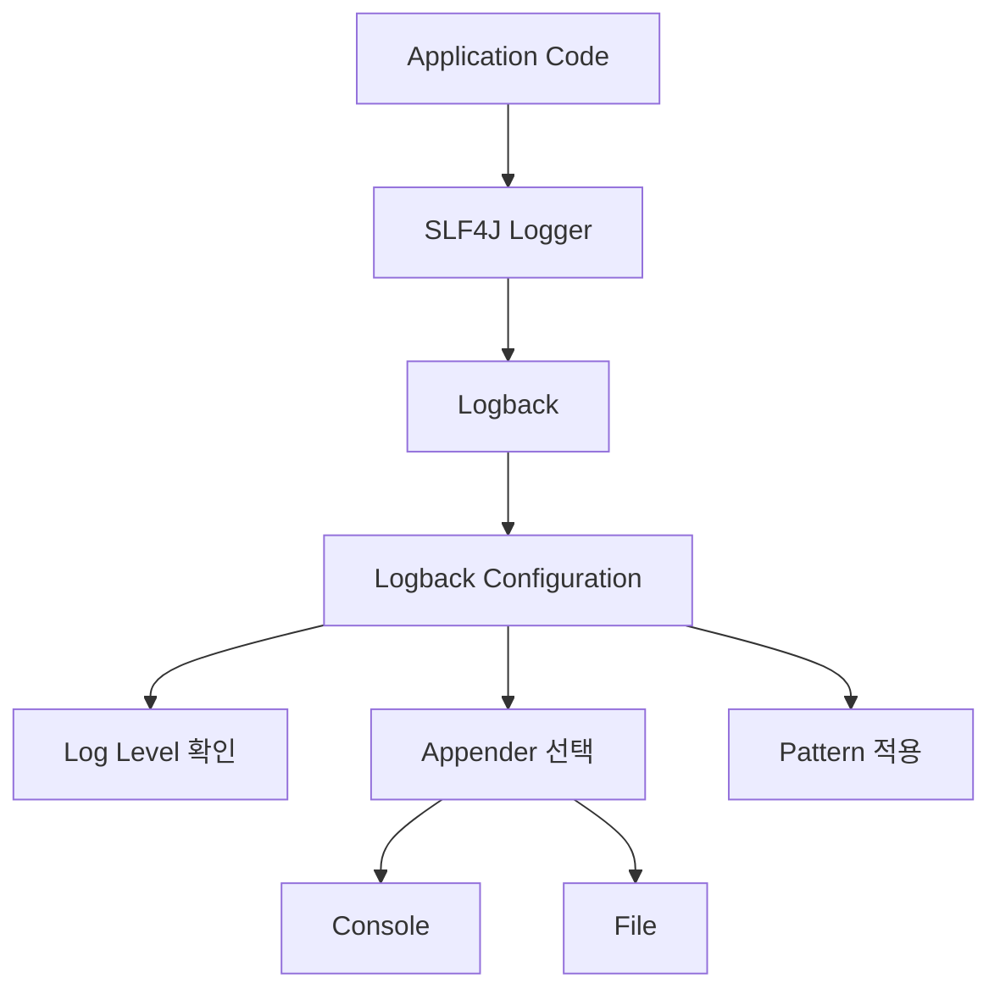
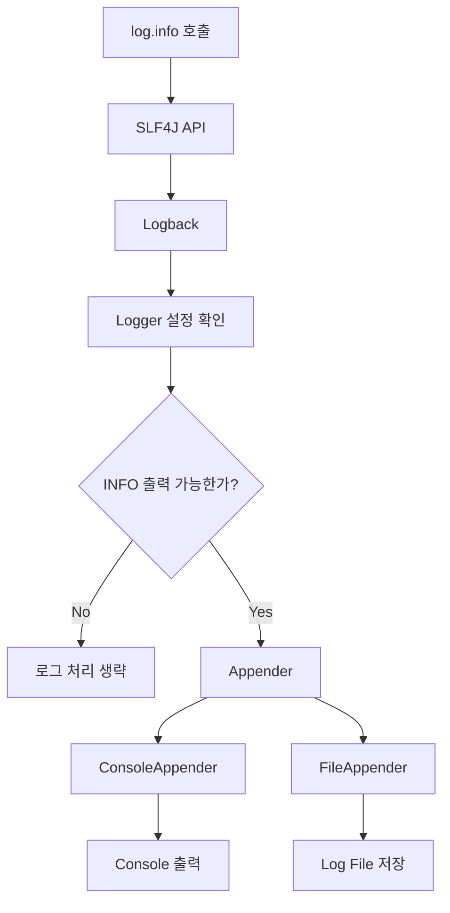
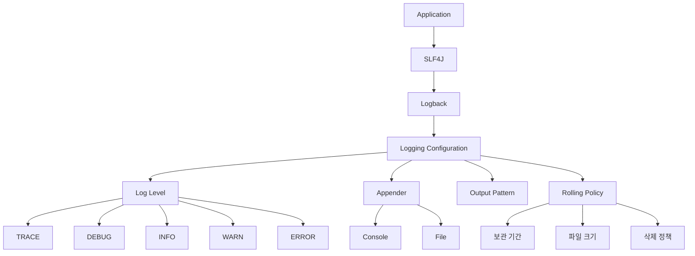

# 밍구의 스프링에서 로그를 찍을 때 사용하는 SLF4J와 Logback
[https://youtu.be/7l7gFDhm4Nw?si=O-fIKL9k0sSt8hda](https://youtu.be/7l7gFDhm4Nw?si=O-fIKL9k0sSt8hda)

# 밍구의 스프링에서 로그를 찍을 때 사용하는 SLF4J와 Logback
* toc
{:toc}

---

## Spring Boot 로깅 이해하기: SLF4J와 Logback은 무엇이 다를까?

Spring Boot 애플리케이션을 개발하다 보면 실행 흐름을 확인하기 위해 가장 먼저 사용하는 방법 중 하나가 `System.out.println()`이다.

예를 들어 주문 요청이 제대로 들어오는지 확인하고 싶다고 하자.

```java
public void order(Long menuId) {
    System.out.println("menuId = " + menuId);

    // 주문 처리
}
```

또는 어떤 계산 결과가 예상대로 나오는지 확인하고 싶을 수도 있다.

```java
int totalPrice = calculateTotalPrice();

System.out.println("totalPrice = " + totalPrice);
```

개발 과정에서 잠깐 값을 확인하기에는 편리하다.

하지만 실제 운영되는 백엔드 시스템에서 애플리케이션의 상태를 기록하는 방법으로 `System.out.println()`을 계속 사용하기에는 여러 가지 한계가 있다.

그래서 실무 애플리케이션에서는 일반적으로 **Logging**을 사용한다.

Spring Boot에서는 흔히 다음과 같은 코드를 볼 수 있다.

```java
log.debug("주문 요청 menuId={}", menuId);
log.info("주문 완료 orderId={}", orderId);
log.warn("재고 부족 menuId={}, stock={}", menuId, stock);
log.error("주문 처리 실패 orderId={}", orderId, exception);
```

겉으로 보기에는 단순히 문자열을 출력하는 것처럼 보인다.

하지만 내부에는 다음과 같은 구조가 존재한다.

```text
Application Code

↓

SLF4J

↓

Logback

↓

Console / File
```

이 구조를 이해하면 단순히 `log.info()`를 사용하는 수준을 넘어, 운영 환경에서 어떤 로그를 남겨야 하고 어떻게 관리해야 하는지 이해할 수 있다.

---

## 왜 System.out.println() 대신 Logging을 사용할까?

`System.out.println()`의 가장 큰 장점은 간단하다는 것이다.

```java
System.out.println("orderId = " + orderId);
```

별도의 설정도 필요하지 않고 바로 콘솔에서 확인할 수 있다.

하지만 애플리케이션 규모가 커지면서 로그가 수백 개, 수천 개가 되기 시작하면 문제가 발생한다.

대표적으로 다음과 같은 문제가 있다.

```text
로그 레벨을 제어하기 어렵다.

출력 대상을 유연하게 변경하기 어렵다.

운영 환경에서 기록을 보관하기 어렵다.

성능 문제를 고려하기 어렵다.

로그 형식을 일관되게 관리하기 어렵다.
```

하나씩 살펴보자.

---

## System.out.println()은 출력 여부를 제어하기 어렵다

개발 과정에서는 상세한 로그가 필요하다.

예를 들어 다음과 같은 로그를 많이 남길 수 있다.

```java
System.out.println("요청 시작");
System.out.println("menuId = " + menuId);
System.out.println("menu 조회 완료");
System.out.println("재고 조회 완료");
System.out.println("주문 저장 완료");
```

개발 환경에서는 유용하다.

하지만 운영 환경에서도 이런 로그를 모두 출력할 필요는 없을 수 있다.

그렇다면 직접 코드를 제거해야 한다.

```java
// System.out.println("menu 조회 완료");
```

또는 조건문을 추가해야 한다.

```java
if (debug) {
    System.out.println("menu 조회 완료");
}
```

애플리케이션 코드에 로그 출력 여부를 결정하는 로직까지 섞이게 된다.

Logging Framework에서는 이런 문제를 **Log Level**을 통해 해결할 수 있다.

---

## 로그 레벨이란 무엇인가?

모든 로그가 같은 중요도를 가지는 것은 아니다.

예를 들어 다음 두 로그를 비교해보자.

```text
사용자 요청 파라미터 확인
```

그리고

```text
Database 연결 실패
```

둘의 중요도는 분명히 다르다.

그래서 Logging Framework에서는 로그마다 중요도 수준을 지정한다.

대표적인 로그 레벨은 다음과 같다.

```text
TRACE

DEBUG

INFO

WARN

ERROR
```

일반적으로 아래로 갈수록 중요도가 높다고 이해할 수 있다.

```text
낮은 중요도

TRACE
  ↓
DEBUG
  ↓
INFO
  ↓
WARN
  ↓
ERROR

높은 중요도
```

---

## TRACE

TRACE는 매우 세밀한 실행 흐름을 추적할 때 사용할 수 있다.

```java
log.trace("order method start");
```

또는

```java
log.trace(
        "order calculation menuId={}, quantity={}",
        menuId,
        quantity
);
```

애플리케이션의 내부 흐름을 매우 자세하게 확인해야 할 때 사용할 수 있다.

그만큼 로그 양도 많아질 수 있기 때문에 일반적인 운영 환경에서 항상 활성화하기에는 부담이 있을 수 있다.

---

## DEBUG

DEBUG는 주로 개발 과정에서 내부 상태를 확인하기 위해 사용한다.

```java
log.debug(
        "주문 요청 menuId={}, quantity={}",
        menuId,
        quantity
);
```

예를 들어 다음과 같은 정보를 확인할 때 사용할 수 있다.

```text
Method Parameter

중간 계산 결과

조건 분기 결과

내부 객체 상태

외부 API 요청 데이터
```

개발 환경에서 문제를 추적하는 데 유용하지만 운영 환경에서는 필요 이상으로 많은 DEBUG 로그를 남기지 않도록 관리할 필요가 있다.

---

## INFO

INFO는 애플리케이션의 정상적인 동작 흐름을 기록하는 데 사용할 수 있다.

예를 들어 주문이 정상적으로 완료되었다고 하자.

```java
log.info(
        "주문 완료 orderId={}, memberId={}",
        orderId,
        memberId
);
```

이 로그는 장애 상황이 아니더라도 운영 과정에서 의미가 있다.

```text
주문이 생성되었다.

결제가 완료되었다.

배치 작업이 시작되었다.

배치 작업이 완료되었다.

애플리케이션이 정상적으로 기동되었다.
```

이처럼 시스템의 정상적인 주요 이벤트를 기록하는 데 INFO를 사용할 수 있다.

---

## WARN

WARN은 시스템이 계속 동작할 수는 있지만 주의가 필요한 상황에 사용할 수 있다.

예를 들어 재고가 특정 기준보다 낮아졌다고 하자.

```java
log.warn(
        "재고 부족 menuId={}, stock={}",
        menuId,
        stock
);
```

아직 서비스가 완전히 실패한 것은 아니다.

하지만 운영자가 확인해야 할 가능성이 있다.

```text
재고가 임계값 이하로 감소

외부 API 응답이 평소보다 느림

재시도가 발생함

예상하지 못한 입력이 반복적으로 발생
```

이런 상황에 WARN을 사용할 수 있다.

---

## ERROR

ERROR는 정상적인 서비스 처리가 실패했거나 즉각적인 확인이 필요할 수 있는 문제에 사용할 수 있다.

```java
try {
    paymentClient.pay(request);
} catch (Exception e) {
    log.error(
            "결제 처리 실패 orderId={}",
            orderId,
            e
    );

    throw e;
}
```

대표적으로 다음과 같은 상황을 생각할 수 있다.

```text
DB 연결 실패

외부 시스템 호출 실패

파일 처리 실패

복구되지 않은 Exception

핵심 비즈니스 처리 실패
```

ERROR 로그는 운영 중 장애 원인을 추적하는 데 중요한 정보가 될 수 있다.

---

## 로그 레벨은 필터처럼 동작한다

애플리케이션의 로그 레벨을 INFO로 설정했다고 하자.

그러면 INFO보다 낮은 레벨인 TRACE와 DEBUG는 출력되지 않는다.

```text
TRACE
→ 출력 X

DEBUG
→ 출력 X

INFO
→ 출력 O

WARN
→ 출력 O

ERROR
→ 출력 O
```

즉 설정 하나만 변경해서 출력되는 로그의 양을 조절할 수 있다.

이것이 `System.out.println()`과 Logging Framework의 큰 차이 중 하나다.

---

## 로그 레벨을 볼륨 조절 장치처럼 생각할 수 있다

로그 레벨을 하나의 볼륨 조절 장치처럼 생각할 수 있다.

개발 환경에서는 상세한 정보가 필요하다.

```text
DEBUG
```

운영 환경에서는 너무 많은 로그가 필요하지 않을 수 있다.

```text
INFO
```

심각한 문제만 확인하고 싶은 특정 상황에서는 더 높은 수준으로 설정할 수도 있다.

즉 애플리케이션 코드를 수정하지 않고 설정을 통해 로그 양을 조절할 수 있다.

---

## 환경에 따라 로그 레벨을 다르게 사용할 수 있다

개발 환경과 운영 환경은 요구사항이 다르다.

개발 환경에서는 내부 상태를 자세하게 보고 싶다.

```text
Development

DEBUG
```

반면 운영 환경에서는 로그가 너무 많으면 관리 비용이 커질 수 있다.

```text
Production

INFO
```

예를 들어 다음 패키지의 로그만 개발 환경에서 DEBUG로 확인하고 싶다고 하자.

```text
com.example.cafe
```

전체 애플리케이션은 INFO로 유지하면서 특정 패키지만 DEBUG 수준으로 설정할 수 있다.

```text
전체
→ INFO

com.example.cafe
→ DEBUG
```

이것이 Logging Framework가 제공하는 큰 장점 중 하나다.

---

## 로그는 콘솔뿐 아니라 파일에도 저장할 수 있다

`System.out.println()`은 기본적으로 표준 출력으로 내용을 보낸다.

하지만 운영 환경에서는 서버가 재시작되더라도 과거의 로그를 확인해야 하는 경우가 많다.

예를 들어 장애가 새벽 3시에 발생했다고 하자.

```text
03:00

Payment API Error 발생
```

개발자가 오전 9시에 확인한다.

```text
09:00

장애 원인 분석
```

과거 로그가 남아 있지 않으면 장애 원인을 찾기 어렵다.

Logging Framework에서는 로그를 파일로 저장할 수 있다.

```text
logs/

├── application.log
├── application.2026-09-16.log
└── application.2026-09-17.log
```

이를 통해 과거의 애플리케이션 실행 기록을 확인할 수 있다.

---

## Logback은 로그 파일 관리 기능도 제공한다

운영 환경에서는 로그를 단순히 하나의 파일에 계속 기록하면 또 다른 문제가 생긴다.

```text
application.log

1GB
10GB
100GB
...
```

디스크가 가득 찰 수 있다.

그래서 Logback에서는 로그 파일을 일정 기준으로 나누어 관리하는 설정을 사용할 수 있다.

예를 들어 다음과 같은 기준을 둘 수 있다.

```text
날짜별 파일 생성

일정 기간 보관

전체 로그 용량 제한

오래된 로그 삭제
```

개념적으로 다음과 같다.

```text
오늘

application.log


어제

application.2026-09-16.log


그 이전

application.2026-09-15.log
```

운영 환경에서는 로그를 남기는 것만큼 **로그의 생명주기를 관리하는 것**도 중요하다.

---

## 그렇다면 SLF4J는 무엇인가?

Spring Boot 코드를 보면 흔히 다음 코드를 볼 수 있다.

```java
import org.slf4j.Logger;
import org.slf4j.LoggerFactory;
```

그리고 Logger를 만든다.

```java
private static final Logger log =
        LoggerFactory.getLogger(OrderService.class);
```

여기서 의문이 생긴다.

```text
Logback을 사용한다면서

왜 코드에서는 SLF4J를 사용하는가?
```

이 질문을 이해하려면 **인터페이스와 구현체의 분리**를 생각하면 된다.

---

## SLF4J는 로깅 인터페이스다

SLF4J는 로깅 기능을 사용할 수 있는 공통 API를 제공한다.

애플리케이션에서는 다음과 같이 작성한다.

```java
log.info("주문 완료");
```

하지만 SLF4J 자체가 반드시 최종적으로 로그를 파일에 기록하는 구현체 역할을 하는 것은 아니다.

개념적으로는 다음과 같다.

```text
Application

↓

SLF4J API

↓

Logging Implementation
```

즉 개발자는 특정 로깅 구현체에 직접 의존하지 않고 SLF4J라는 추상화된 인터페이스를 사용한다.

---

## 왜 로깅 인터페이스가 필요했을까?

여러 라이브러리가 각각 다른 Logging Framework를 사용한다고 생각해보자.

```text
Library A
→ Logging Framework A

Library B
→ Logging Framework B

Library C
→ Logging Framework C
```

하나의 애플리케이션에서 이 라이브러리들을 모두 사용하면 로그 환경이 복잡해질 수 있다.

```text
설정 파일 A

설정 파일 B

설정 파일 C
```

로그 출력 형식도 달라질 수 있다.

```text
Library A
2026-09-17 INFO ...

Library B
[INFO] ...

Library C
INFO : ...
```

공통된 Logging API가 있다면 애플리케이션 코드는 특정 구현체에 강하게 의존하지 않아도 된다.

```text
Library / Application

↓

SLF4J

↓

Logging Implementation
```

이 역할을 하는 것이 SLF4J다.

---

## SLF4J와 Logback의 관계

가장 단순하게 정리하면 다음과 같다.

```text
SLF4J
→ Interface / API

Logback
→ 실제 Logging Implementation
```

Java 코드에서는 SLF4J를 사용한다.

```java
private static final Logger log =
        LoggerFactory.getLogger(OrderService.class);
```

그리고 로그를 남긴다.

```java
log.info("주문 완료");
```

실제 로그 출력과 파일 기록 등의 동작은 연결된 Logging Implementation이 담당한다.

Spring Boot에서는 일반적으로 Logback을 사용한다.

따라서 전체 흐름을 다음처럼 이해할 수 있다.

```text
OrderService

↓

SLF4J

↓

Logback

↓

Console / File
```

---

## 왜 애플리케이션 코드에서 Logback을 직접 사용하지 않을까?

애플리케이션에서 Logback 클래스에 직접 의존한다고 생각해보자.

그러면 나중에 다른 Logging Implementation으로 변경하려고 할 때 애플리케이션 코드까지 영향을 받을 수 있다.

반면 SLF4J API에 의존한다면 애플리케이션 코드에서는 동일한 인터페이스를 사용할 수 있다.

```java
log.info("message");
```

Logging Implementation에 대한 구체적인 선택을 코드 밖으로 분리할 수 있다.

이는 객체지향에서 자주 사용하는 다음 구조와 비슷하다.

```text
Application

↓

Interface

↓

Implementation
```

즉 애플리케이션은 구체적인 로깅 구현체보다 SLF4J라는 추상화에 의존한다.

---

## Logback은 무엇인가?

Logback은 실제 로그를 처리하는 구현체다.

예를 들어 다음과 같은 일을 담당한다.

```text
로그 레벨 판단

로그 Format 적용

Console 출력

File 저장

로그 파일 Rotation

Appender 관리
```

애플리케이션이 다음 코드를 호출한다.

```java
log.info("주문 완료 orderId={}", orderId);
```

SLF4J를 통해 Logback으로 전달되고, Logback은 자신의 설정을 보고 실제 출력 방법을 결정한다.

```text
INFO 로그

↓

Logback 설정 확인

↓

Console에 출력할까?

File에 저장할까?

어떤 Format으로 출력할까?
```

---

## 전체 로깅 실행 구조

전체 흐름을 정리하면 다음과 같다.



개발자가 보는 것은

```java
log.info(...);
```

한 줄이지만 실제로는 로깅 추상화와 구현체, 설정이 함께 동작하고 있다.

---

## Logger와 Appender

Logback을 이해할 때 알아두면 좋은 개념이 Logger와 Appender다.

Logger는 어떤 로그를 처리할지를 결정하는 역할과 연결된다.

Appender는 로그를 어디에 출력할지를 담당한다.

대표적으로 다음이 있다.

```text
ConsoleAppender

→ Console


RollingFileAppender

→ File
```

따라서 다음 구조로 이해할 수 있다.

```text
Logger

↓

Appender

↓

출력 대상
```

예를 들어 INFO 로그가 발생한다.

```text
log.info(...)
```

Logger가 로그를 받아 설정을 확인한다.

```text
현재 Level에서 출력 가능한가?
```

출력이 가능하다면 Appender에 전달한다.

```text
ConsoleAppender
→ Console

RollingFileAppender
→ Log File
```

---

## 개발 환경과 운영 환경의 로그 전략

개발 환경에서는 일반적으로 개발자가 즉시 로그를 확인하는 것이 중요하다.

따라서 콘솔 출력과 DEBUG 로그를 사용할 수 있다.

```text
Development

Root Level
→ INFO

Application Package
→ DEBUG

Output
→ Console
```

반면 운영 환경에서는 안정적인 로그 보관이 중요하다.

```text
Production

Level
→ INFO

Output
→ File

Retention
→ 일정 기간

Size Limit
→ 설정
```

이처럼 실행 환경마다 다른 로깅 전략을 사용할 수 있다.

---

## logback-spring.xml

Spring Boot에서 Logback을 세밀하게 설정할 때 `logback-spring.xml`을 사용할 수 있다.

예를 들어 개발 환경에서는 Console Appender를 사용할 수 있다.

```xml
<springProfile name="dev">

    <root level="INFO">
        <appender-ref ref="CONSOLE"/>
    </root>

    <logger
        name="com.example.cafe"
        level="DEBUG"
    />

</springProfile>
```

전체 로그는 INFO 이상만 출력한다.

하지만 애플리케이션 패키지는 DEBUG까지 출력한다.

```text
전체

INFO
WARN
ERROR


com.example.cafe

DEBUG
INFO
WARN
ERROR
```

개발자가 작성한 코드의 상세한 실행 흐름을 확인하면서 Framework 내부 로그까지 과도하게 출력하는 것을 줄일 수 있다.

---

## 운영 환경에서는 파일 로그를 구성할 수 있다

운영 환경에서는 File Appender를 사용할 수 있다.

개념적인 설정은 다음과 같다.

```xml
<springProfile name="prod">

    <root level="INFO">
        <appender-ref ref="FILE"/>
    </root>

</springProfile>
```

파일 관리 정책도 함께 설정할 수 있다.

```text
파일 이름

Rolling Policy

보관 기간

최대 용량

삭제 정책
```

운영 환경에서는 단순히

```text
로그가 찍히는가?
```

만 보는 것이 아니라

```text
얼마나 저장되는가?

언제 삭제되는가?

디스크를 얼마나 사용하는가?
```

까지 함께 관리해야 한다.

---

## Spring Profile과 로그 설정

Spring Boot에서는 환경별 Profile을 사용할 수 있다.

```text
dev

stage

prod
```

그리고 같은 `logback-spring.xml` 안에서 Profile별 설정을 분리할 수 있다.

```text
logback-spring.xml

├── dev
│   └── DEBUG + Console
│
└── prod
    └── INFO + File
```

서비스 코드는 그대로 유지한다.

```java
log.debug(...);
log.info(...);
log.warn(...);
log.error(...);
```

환경에 따라 설정만 달라진다.

이것이 로그와 비즈니스 코드의 책임을 분리하는 중요한 장점이다.

---

## System.out.println과 Logging 비교

둘의 차이를 정리하면 다음과 같다.

| 구분          | `System.out.println()` | Logging        |
| ----------- | ---------------------- | -------------- |
| 로그 레벨       | 없음                     | TRACE~ERROR    |
| 출력 제어       | 코드 수정 필요               | 설정으로 가능        |
| 파일 저장       | 별도 처리 필요               | 설정 가능          |
| 출력 형식       | 직접 구성                  | 통합 관리 가능       |
| 환경별 설정      | 어려움                    | Profile별 구성 가능 |
| 로그 Rotation | 직접 구현 필요               | 설정 가능          |
| 운영 활용       | 제한적                    | 운영 관찰에 적합      |

Logging은 단순히 문자열을 출력하는 기능이 아니라 **애플리케이션의 실행 기록을 관리하는 시스템**에 가깝다.

---

## 실전 팁 1: 문자열 더하기보다 Parameter 치환을 사용하자

다음 두 코드를 비교해보자.

첫 번째 방식이다.

```java
log.debug(
        "orderId = " + orderId
        + ", memberId = " + memberId
);
```

두 번째 방식이다.

```java
log.debug(
        "orderId={}, memberId={}",
        orderId,
        memberId
);
```

Logging에서는 일반적으로 두 번째 방식을 사용하는 것이 좋다.

첫 번째 코드는 로그 출력 여부와 관계없이 Java의 문자열 연결 연산이 먼저 수행될 수 있다.

```text
"orderId = "
+
orderId
+
", memberId = "
+
memberId

↓

문자열 생성
```

DEBUG 로그가 비활성화되어 있더라도 불필요한 문자열 생성 비용이 발생할 수 있다.

반면 Parameter 치환을 사용한다.

```java
log.debug(
        "orderId={}",
        orderId
);
```

Logging Framework가 해당 레벨을 출력하지 않는다면 불필요한 메시지 생성 작업을 줄일 수 있다.

---

## 좋은 로그 작성 방식

다음 코드보다

```java
log.info("주문이 생성되었습니다. " + orderId);
```

다음처럼 작성하는 것이 좋다.

```java
log.info(
        "주문 생성 완료 orderId={}",
        orderId
);
```

검색하기도 쉽고 구조도 일정하게 유지할 수 있다.

여러 값이 있다면 다음처럼 표현할 수 있다.

```java
log.info(
        "주문 생성 완료 orderId={}, memberId={}, amount={}",
        orderId,
        memberId,
        amount
);
```

---

## Exception 로그는 Stack Trace까지 남기자

다음과 같은 코드를 작성하는 경우가 있다.

```java
catch (Exception e) {
    log.error(
        "주문 처리 실패: {}",
        e.getMessage()
    );
}
```

메시지만 남으면 실제 Exception이 어디에서 발생했는지 확인하기 어려울 수 있다.

Exception 객체 자체를 Logger에 전달하는 방식이 유용하다.

```java
catch (Exception e) {
    log.error(
        "주문 처리 실패 orderId={}",
        orderId,
        e
    );

    throw e;
}
```

그러면 장애 분석에 필요한 Stack Trace를 함께 확인할 수 있다.

운영 로그의 중요한 목적 중 하나는

```text
장애가 발생했다.
```

는 사실만 기록하는 것이 아니라

```text
어디에서

어떤 입력으로

무슨 예외가

어떤 호출 흐름에서

발생했는가
```

를 추적할 수 있도록 만드는 것이다.

---

## 실전 팁 2: Lombok의 @Slf4j

매 클래스마다 다음 코드를 작성하면 반복이 발생한다.

```java
private static final Logger log =
        LoggerFactory.getLogger(OrderService.class);
```

Lombok에서는 이를 줄이기 위해 `@Slf4j`를 제공한다.

```java
@Slf4j
@Service
public class OrderService {

    public void order(Long orderId) {
        log.info(
                "주문 처리 orderId={}",
                orderId
        );
    }
}
```

Lombok이 컴파일 과정에서 Logger 필드를 생성해주기 때문에 개발자가 직접 선언하지 않아도 된다.

개념적으로 다음 코드가 생성되는 것과 비슷하게 이해할 수 있다.

```java
private static final Logger log =
        LoggerFactory.getLogger(OrderService.class);
```

---

## 운영에서는 DEBUG를 무조건 켜두지 않는 이유

DEBUG 로그는 문제 분석에 매우 유용하다.

하지만 운영에서 모든 DEBUG 로그를 항상 출력하는 것이 반드시 좋은 것은 아니다.

로그가 많아지면 다음 비용이 발생할 수 있다.

```text
Disk I/O 증가

파일 사용량 증가

로그 전송량 증가

검색 비용 증가

로그 저장 비용 증가
```

또한 어떤 데이터를 로그로 출력하고 있는지도 중요하다.

예를 들어 다음과 같은 로그는 위험할 수 있다.

```java
log.debug(
        "login request password={}",
        password
);
```

환경에 따라 DEBUG를 활성화하는 순간 민감한 정보가 로그에 기록될 수 있다.

따라서 로그 레벨 전략과 함께 **어떤 데이터를 로그에 남길 것인지**도 중요하다.

---

## 로그에 민감한 정보를 남기지 말자

로그는 운영 과정에서 여러 시스템으로 전달되거나 장기간 보관될 수 있다.

따라서 다음과 같은 값은 특히 조심해야 한다.

```text
Password

Access Token

Refresh Token

주민등록번호

신용카드 번호

개인정보

Secret Key
```

예를 들어 다음과 같은 코드는 피해야 한다.

```java
log.info(
        "login email={}, password={}",
        email,
        password
);
```

로그는 코드보다 더 많은 운영자가 접근할 수도 있으며 외부 로그 수집 시스템으로 전달될 수도 있다.

그래서

```text
로그도 데이터다.
```

라는 관점이 필요하다.

---

## 모든 성공 요청을 INFO로 남기는 것도 좋은 전략일까?

로그 레벨의 의미를 기계적으로 적용하면 다음처럼 작성할 수도 있다.

```java
log.info("Controller 진입");

log.info("Service 진입");

log.info("Repository 호출");

log.info("Repository 완료");

log.info("Service 완료");

log.info("Controller 완료");
```

정상적인 흐름이라고 모두 INFO로 기록하면 로그가 지나치게 많아진다.

좋은 로그는 단순히 많이 남기는 로그가 아니다.

다음 질문을 할 필요가 있다.

```text
이 로그가 운영에서 필요한가?

장애 발생 시 원인 추적에 도움이 되는가?

비즈니스적으로 의미 있는 이벤트인가?

이미 다른 계층에서 동일한 정보를 기록하고 있지는 않은가?
```

---

## 로그는 비즈니스 이벤트를 추적하는 도구이기도 하다

예를 들어 주문 시스템이라면 의미 있는 이벤트를 기록할 수 있다.

```java
log.info(
        "주문 생성 orderId={}, memberId={}",
        order.getId(),
        memberId
);
```

결제가 완료되었다.

```java
log.info(
        "결제 완료 paymentId={}, orderId={}",
        paymentId,
        orderId
);
```

결제가 실패했다.

```java
log.error(
        "결제 실패 orderId={}",
        orderId,
        exception
);
```

이렇게 하면 하나의 주문이 어떤 과정을 거쳤는지 로그를 통해 추적할 수 있다.

---

## Request ID나 Correlation ID가 필요한 이유

백엔드 시스템이 커지면 하나의 요청에서도 많은 로그가 발생한다.

```text
Controller

Service

Repository

External API

Message Queue
```

로그만 보면 어떤 로그들이 같은 요청에서 발생한 것인지 구분하기 어려울 수 있다.

예를 들어 다음 로그가 있다고 하자.

```text
주문 조회

재고 조회

주문 조회

결제 요청

재고 조회

결제 완료
```

동시에 여러 사용자가 요청을 보냈다면 로그가 뒤섞인다.

이럴 때 요청을 구분하는 식별자를 로그에 포함할 수 있다.

```text
requestId=abc123
```

그러면 다음처럼 추적할 수 있다.

```text
requestId=abc123 주문 시작
requestId=abc123 재고 조회
requestId=abc123 결제 요청
requestId=abc123 주문 완료
```

운영 환경에서는 로그를 많이 남기는 것보다 **서로 연결할 수 있게 남기는 것**이 훨씬 중요할 수 있다.

---

## 비동기 로깅은 무엇을 의미할까?

로그 역시 결국 I/O 작업이다.

예를 들어 파일 로그를 남긴다면

```text
Application

↓

Logger

↓

File I/O
```

가 발생한다.

동기적으로 로그를 처리하면 애플리케이션 Thread가 로그 기록 작업을 기다릴 수 있다.

개념적으로는 다음과 같다.

```text
Request Thread

Business Logic

↓

Log Write

↓

File 기록 완료

↓

다음 Logic
```

비동기 로깅을 구성하면 로그 이벤트를 별도의 처리 흐름으로 넘기는 방식도 생각할 수 있다.

```text
Request Thread

↓

Log Event 전달

↓

Business Logic 계속


Logging Thread

↓

Log Event 처리

↓

File 기록
```

이를 통해 로그 I/O가 애플리케이션 요청 처리에 미치는 영향을 줄이는 전략을 사용할 수 있다.

다만 비동기라는 이유만으로 항상 무조건 더 좋은 것은 아니며 로그 유실 가능성, Queue 크기, 장애 상황에서의 동작 등을 함께 고려해야 한다.

---

## 로그에도 비용이 있다

다음 코드가 매우 많이 실행된다고 생각해보자.

```java
log.info(
        "조회 결과 userId={}",
        userId
);
```

초당 수만 번 호출된다면 로그 자체가 상당한 양이 된다.

```text
10,000 requests/sec

↓

10,000 log lines/sec
```

이 로그를 파일에 저장한다.

```text
Disk I/O
```

외부 로그 시스템으로 전송한다.

```text
Network I/O
```

검색 시스템에 적재한다.

```text
Storage
```

결국 로깅도 시스템 자원을 사용한다.

따라서 로깅 전략은 단순한 개발 편의 기능이 아니라 운영 아키텍처의 일부로 볼 수 있다.

---

## SLF4J와 Logback을 한 번에 이해하기

둘의 역할을 가장 단순하게 비교하면 다음과 같다.

| 구분        | SLF4J                        | Logback          |
| --------- | ---------------------------- | ---------------- |
| 역할        | Logging API / 추상화            | Logging 구현체      |
| 애플리케이션 코드 | `Logger`, `LoggerFactory` 사용 | 일반적으로 직접 의존하지 않음 |
| 실제 로그 출력  | 직접 담당하지 않음                   | 담당               |
| 로그 파일 관리  | 직접 담당하지 않음                   | 담당               |
| Appender  | 제공 역할 아님                     | 제공               |
| 로그 레벨 처리  | 공통 API 제공                    | 실제 설정에 따라 처리     |

구조적으로 보면 다음과 같다.

```text
Application

log.info(...)

↓

SLF4J

↓

Logback

↓

ConsoleAppender
또는
FileAppender
```

---

## SLF4J가 주는 가장 큰 장점

SLF4J가 없다면 애플리케이션이 Logging Implementation에 직접 의존할 수 있다.

```text
Application

↓

Logback
```

하지만 SLF4J가 중간에 있으면 다음과 같은 구조가 된다.

```text
Application

↓

SLF4J

↓

Logging Implementation
```

애플리케이션은 공통된 Logging API를 사용하고 실제 구현체를 분리할 수 있다.

이는 다음과 같은 객체지향 설계와도 유사하다.

```text
Business Logic

↓

Interface

↓

Implementation
```

---

## Spring Boot에서 Logging이 동작하는 전체 흐름

Spring Boot 애플리케이션에서 다음 코드가 실행된다고 하자.

```java
log.info(
        "주문 생성 orderId={}",
        orderId
);
```

전체 흐름을 단순화하면 다음과 같다.



여기서 로그 레벨을 DEBUG에서 INFO로 바꿔도 비즈니스 코드는 변경하지 않는다.

```text
Application Code

변경 없음
```

설정만 변경하면 된다.

```text
Logging Configuration

DEBUG
→ INFO
```

이것이 Logging Framework를 사용하는 중요한 이유 중 하나다.

---

## 구조

전체 로깅 구조를 다시 정리하면 다음과 같다.



개발자가 작성하는 것은 단순한

```java
log.info(...);
```

지만 그 뒤에서는 로그의 레벨, 형식, 저장 위치, 보관 정책 등을 관리하는 구조가 동작한다.

---

## 실무에서의 활용

실무에서는 로그를 다음 세 가지 관점으로 생각해보는 것이 좋다.

```text
무엇을 남길 것인가?

어떤 레벨로 남길 것인가?

어디에 남길 것인가?
```

예를 들어 정상적인 주문 생성 이벤트는 다음과 같이 남길 수 있다.

```java
log.info(
        "주문 생성 완료 orderId={}, memberId={}",
        orderId,
        memberId
);
```

개발 과정에서만 필요한 데이터라면 DEBUG를 사용할 수 있다.

```java
log.debug(
        "주문 계산 요청 menuId={}, quantity={}",
        menuId,
        quantity
);
```

운영자가 확인해야 할 이상 상태는 WARN으로 남길 수 있다.

```java
log.warn(
        "재고 부족 menuId={}, stock={}",
        menuId,
        stock
);
```

처리가 실패했다면 ERROR와 Exception 정보를 함께 남길 수 있다.

```java
log.error(
        "주문 생성 실패 memberId={}",
        memberId,
        exception
);
```

이렇게 로그 레벨에 의미를 부여하면 운영 중 로그를 검색할 때도 훨씬 효율적으로 문제를 찾을 수 있다.

---

## 좋은 로그를 위한 10가지 기준

### 1. System.out.println()을 운영 로깅 수단으로 사용하지 않는다

Logging Framework를 이용하면 로그 레벨과 출력 대상을 관리할 수 있다.

### 2. 의미에 맞는 로그 레벨을 사용한다

```text
DEBUG
→ 개발 및 상세 분석

INFO
→ 주요 정상 이벤트

WARN
→ 이상 징후

ERROR
→ 처리 실패
```

### 3. 문자열 연결보다 Parameter 치환을 사용한다

```java
log.debug(
        "memberId={}",
        memberId
);
```

### 4. Exception은 가능한 원인 추적이 가능하도록 기록한다

```java
log.error(
        "처리 실패 orderId={}",
        orderId,
        e
);
```

### 5. 민감한 데이터를 기록하지 않는다

Password나 Token 같은 데이터가 로그에 노출되지 않도록 한다.

### 6. 무조건 많은 로그를 남기지 않는다

로그에도 I/O와 저장 비용이 발생한다.

### 7. 비즈니스적으로 의미 있는 이벤트를 남긴다

주문 생성, 결제 완료, 배치 시작과 종료처럼 이후 추적할 가치가 있는 이벤트를 기록한다.

### 8. 운영 환경과 개발 환경의 로그 레벨을 분리한다

개발에서는 DEBUG가 필요할 수 있지만 운영에서는 일반적으로 더 제한된 로그 수준을 사용할 수 있다.

### 9. 로그 보관 정책을 관리한다

파일 로그를 무제한 저장하지 않고 Rolling과 Retention을 고려한다.

### 10. 로그를 서로 연결할 수 있도록 한다

Request ID나 비즈니스 식별자를 통해 하나의 요청 흐름을 추적할 수 있도록 만드는 것이 좋다.

---

## 정리

`System.out.println()`은 개발 중 간단하게 값을 확인하는 데 편리하다.

하지만 실제 서비스의 실행 기록을 관리하는 도구로 사용하기에는 한계가 있다.

```text
System.out.println()

↓

출력 제어 어려움

환경별 관리 어려움

로그 저장 관리 어려움

운영 분석에 한계
```

Logging Framework를 사용하면 로그 레벨을 통해 출력되는 로그의 양을 제어할 수 있다.

```text
TRACE

DEBUG

INFO

WARN

ERROR
```

예를 들어 로그 레벨을 INFO로 설정하면

```text
TRACE
→ 출력 X

DEBUG
→ 출력 X

INFO
→ 출력 O

WARN
→ 출력 O

ERROR
→ 출력 O
```

처럼 관리할 수 있다.

환경별로 로그 전략도 다르게 가져갈 수 있다.

```text
Development

DEBUG
Console
```

```text
Production

INFO
File
```

Spring Boot에서는 로깅을 이해할 때 SLF4J와 Logback의 역할을 구분하는 것이 중요하다.

SLF4J는 애플리케이션이 사용하는 공통 Logging API다.

```text
Application

↓

SLF4J
```

Logback은 실제 로그를 처리하는 구현체다.

```text
SLF4J

↓

Logback

↓

Console / File
```

따라서 전체 구조는 다음과 같이 이해할 수 있다.

```text
Application

log.info(...)

↓

SLF4J

↓

Logback

↓

Logging Configuration

↓

Console 또는 File
```

SLF4J가 추상화된 로깅 인터페이스를 제공하고, Logback이 실제 로그 레벨 판단과 출력, 파일 저장 등의 작업을 수행한다.

실무에서는 단순히 로그를 많이 남기는 것보다

```text
어떤 로그를

어떤 레벨로

어떤 정보를 포함해서

어디에

얼마나 오래

남길 것인가
```

를 설계하는 것이 중요하다.

결국 Logging은 개발 과정에서 값을 확인하기 위한 `println`의 대체재에 그치지 않는다.

애플리케이션이 운영되는 동안

```text
정상적인 흐름

비즈니스 이벤트

이상 징후

장애 발생

실패 원인
```

을 기록하고, 나중에 시스템에서 무슨 일이 일어났는지 추적할 수 있도록 만드는 **운영을 위한 핵심 관찰 수단**이다.

### 한 줄 요약

**SLF4J는 애플리케이션이 사용하는 로깅 추상화 API이고 Logback은 실제 로그를 출력하고 저장하는 구현체이며, 로그 레벨과 환경별 설정을 적절히 활용하면 비즈니스 코드를 변경하지 않고도 운영 환경에 필요한 로그의 양·형식·저장 위치를 체계적으로 관리할 수 있다.**
